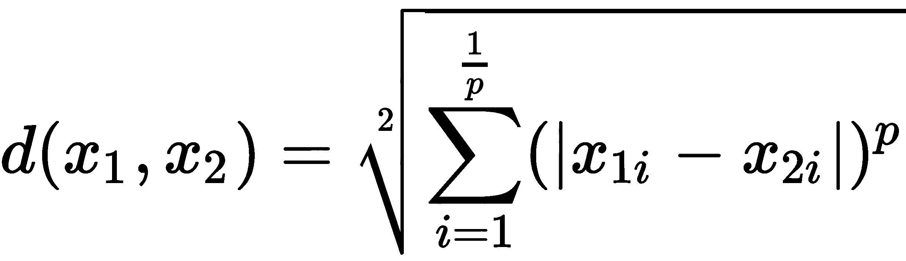
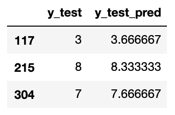

# 第五章：使用最近邻进行图像处理

在本章及随后的章节中，我们将采取不同的方法。最近邻算法将在这里担任辅助角色，而图像处理将是本章的主要内容。我们将从加载图像开始，并使用 Python 将它们表示为适合机器学习算法处理的格式。我们将使用最近邻算法进行分类和回归。我们还将学习如何将图像中的信息压缩到更小的空间中。这里解释的许多概念是可转移的，并且可以通过稍微调整后用于其他算法。稍后，在[第七章](https://cdp.packtpub.com/hands_on_machine_learning_with_scikit_learn/wp-admin/post.php?post=33&action=edit)，*神经网络——深度学习的到来*中，我们将基于在这里获得的知识，继续使用神经网络进行图像处理。在本章中，我们将涵盖以下主题：

+   最近邻

+   加载和显示图像

+   图像分类

+   使用自定义距离

+   使用最近邻进行回归

+   降维我们的图像数据

# 最近邻

“我们通过示例和直接经验来学习，因为口头指导的充分性是有限的。”

– 马尔科姆·格拉德威尔

好像马尔科姆·格拉德威尔在前述引用中解释 K 近邻算法；我们只需要将“*口头指导*”替换为“*数学方程*”。像线性模型这样的情况中，训练数据用于学习一个数学方程来模拟数据。一旦模型被学习，我们可以轻松地将训练数据搁置一旁。在最近邻算法中，数据本身就是模型。每当遇到一个新的数据样本时，我们将其与训练数据集进行比较。我们定位到训练集中与新样本最近的 K 个样本，然后使用这些 K 个样本的类别标签为新样本分配标签。

这里有几点需要注意：

+   训练的概念在这里并不存在。与其他算法不同，在其他算法中，训练时间取决于训练数据的数量，而在最近邻算法中，计算成本大部分花费在预测时的最近邻计算上。

+   最近关于最近邻算法的大部分研究都集中在寻找在预测时快速搜索训练数据的最佳方法。

+   *最近*意味着什么？在本章中，我们将学习用于比较不同数据点之间距离的不同度量方法。两个数据点是否接近彼此，取决于使用的距离度量标准。

+   *K*是什么？我们可以将一个新数据点与训练集中的 1、2、3 或 50 个样本进行比较。我们决定比较的样本数量就是*K*，我们将看到不同的*K*值如何影响算法的行为。

在使用最近邻算法进行图像分类之前，我们需要先学习如何处理图像。在接下来的章节中，我们将加载并展示机器学习和图像处理领域中最常用的图像数据集之一。

在查找一个样本的最近邻时，可以将其与所有其他训练样本进行比较。这是一种简单的暴力方法，当训练数据集规模增大时，效果并不好。对于更大的数据集，一种更高效的方法是将训练样本存储在一个特定的数据结构中，该数据结构经过优化以便于搜索。K-D 树和球树是两种可用的数据结构。这两种数据结构通过`leaf_size`参数进行调整。当其值接近训练集的大小时，K-D 树和球树就变成了暴力搜索。相反，将叶子大小设置为`1`会在遍历树时引入大量开销。默认的叶子大小为`30`，对于许多样本大小来说，这是一个不错的折中值。

# 加载并显示图像

“照片是二维的。我在四维空间中工作。”

– Tino Sehgal

当被问到图像的维度时，摄影师、画家、插画家以及几乎地球上所有人都会认为图像是二维的物体。只有机器学习从业者会从不同的角度看待图像。对我们来说，黑白图像中的每个像素都是一个单独的维度。随着彩色图像的出现，维度会进一步增加，但那是后话。我们将每个像素视为一个单独的维度，以便我们能够将每个像素及其值当作定义图像的独特特征，与其他像素（特征）一起处理。所以，和*Tino Sehgal*不同，我们有时会处理 4000 维。

**修改后的国家标准与技术研究院**（**MNIST**）数据集是一个手写数字的集合，通常用于图像处理。由于其受欢迎程度，它被包含在`scikit-learn`中，我们可以像通常加载其他数据集一样加载它：

```py
from sklearn.datasets import load_digits
digits = load_digits()
```

这个数据集包含从`0`到`9`的数字。我们可以通过以下方式访问它们的目标（标签）：

```py
digits['target']
# Output: array([0, 1, 2, ..., 8, 9, 8])
```

类似地，我们可以加载像素值，如下所示：

```py
digits['data']
# Output: 
# array([[ 0., 0., 5., ..., 0., 0., 0.], 
#  [ 0., 0., 0., ..., 10., 0., 0.], 
#  ..., 
#  [ 0., 0., 2., ..., 12., 0., 0.], 
#  [ 0., 0., 10., ..., 12., 1., 0.]])
```

每一行是一个图像，每一个整数是一个像素值。在这个数据集中，像素值的范围在`0`到`16`之间。数据集的形状（`digits['data'].shape`）是*1,797 x 64*。换句话说，我们有 1,797 张方形的图片，每张图片有 64 个像素（宽度 = 高度 = 8）。

知道了这些信息后，我们可以创建以下函数来显示图像。它接受一个 64 个值的数组，并将其重塑成一个 8 行 8 列的二维数组。它还使用图像的对应目标值，在数字上方显示。`matplotlib`的坐标轴（`ax`）被传入，这样我们就可以在其上显示图像：

```py
def display_img(img, target, ax):
    img = img.reshape((8, 8))
    ax.imshow(img, cmap='gray')
    ax.set_title(f'Digit: {str(target)}')
    ax.grid(False)
```

我们现在可以使用刚才创建的函数来显示数据集中的前八个数字：

```py
fig, axs = plt.subplots(1, 8, figsize=(15, 10))

for i in range(8):
    display_img(digits['data'][i], digits['target'][i], axs[i])

fig.show()
```

数字显示如下：


能够显示数字是一个很好的第一步。接下来，我们需要将它们转换为我们通常的训练和测试格式。这次，我们希望将每张图片保留为一行，因此不需要将其重塑为*8 x 8*矩阵：

```py
from sklearn.model_selection import train_test_split
x, y = digits['data'], digits['target']
x_train, x_test, y_train, y_test = train_test_split(x, y)
```

到此为止，数据已经准备好用于图像分类算法。通过学习在给定一堆像素时预测目标，我们已经离让计算机理解手写文本更近了一步。

# 图像分类

现在我们已经准备好了数据，可以使用最近邻分类器来预测数字，如下所示：

```py
from sklearn.neighbors import KNeighborsClassifier

clf = KNeighborsClassifier(n_neighbors=11, metric='manhattan')
clf.fit(x_train, y_train)
y_test_pred = clf.predict(x_test)
```

对于这个例子，我将`n_neighbors`设置为`11`，`metric`设置为`manhattan`，意味着在预测时，我们将每个新样本与 11 个最接近的训练样本进行比较，使用曼哈顿距离来评估它们的接近程度。稍后会详细讲解这些参数。该模型在测试集上的预测准确率为 96.4%。这听起来可能很合理，但很抱歉告诉你，这对于这个特定的数据集来说并不是一个很棒的得分。无论如何，我们继续深入分析模型的表现。

## 使用混淆矩阵理解模型的错误

当处理具有 10 个类别标签的数据集时，单一的准确率得分只能告诉我们一些信息。为了更好地理解哪些数字比其他数字更难猜测，我们可以打印出模型的混淆矩阵。这是一个方阵，其中实际标签作为行显示，预测标签作为列显示。然后，每个单元格中的数字表示落入该单元格的测试实例。让我现在创建它，很快你就能看得更清楚。`plot_confusion_matrix`函数需要分类器实例，以及测试的`x`和`y`值，才能显示矩阵：

```py
from sklearn.metrics import plot_confusion_matrix
plot_confusion_matrix(clf, x_test, y_test, cmap='Greys')
```

一旦调用，该函数会在内部对测试数据运行模型，并显示以下矩阵：


理想情况下，所有单元格应为零，除了对角线上的单元格。落入对角线单元格意味着样本被正确标记。然而，这里只有少数几个非零单元格。位于第 8 行和第 1 列交点的四个样本表明，我们的模型将四个样本分类为`1`，而它们的实际标签是`8`。很可能，它们是看起来像 1 的过于瘦弱的 8。对于其余的非对角线非零单元格，也可以得出相同的结论。

## 选择合适的度量标准

我们使用的图像只是数字列表（向量）。距离度量决定了一个图像是否接近另一个图像。这同样适用于非图像数据，其中距离度量用于决定一个样本是否接近另一个样本。两种常用的度量标准是**曼哈顿**距离和**欧几里得**距离：

| **名称** | **曼哈顿（L1 范数）** | **欧几里得（L2 范数）** |
| --- | --- | --- |
| 公式 | ****  | ****  |

很可能，曼哈顿距离的公式会让你想起平均绝对误差和 L1 正则化，而欧几里得距离则类似于均方误差和 L2 正则化。这种相似性很好地提醒我们，许多概念都来源于共同的思想：


对于**曼哈顿**距离，A 和 C 之间的距离是通过从 A 到 D，再从 D 到 C 来计算的。它得名于纽约的曼哈顿岛，因为那里有着分块的景观。对于**欧几里得**距离，A 和 C 之间的距离是通过两点之间的对角线来计算的。这两种度量有一个广义的形式，叫做**闵可夫斯基**距离，其公式如下：



设置`p`为`1`时，我们得到曼哈顿距离，设置为`2`时可以得到欧几里得距离。我相信你现在可以看出，L1 和 L2 范数中的`1`和`2`来自哪里。为了能够比较不同`p`值的结果，我们可以运行以下代码。在这里，我们计算了两点之间的闵可夫斯基距离——`(1, 2)`和`(4, 6)`——对于不同`p`值的情况：

```py
from sklearn.neighbors import DistanceMetric

points = pd.DataFrame(
    [[1, 2], [4, 6]], columns=['x1', 'x2']
)

d = [
  (p, DistanceMetric.get_metric('minkowski', p=p).pairwise(points)[0][-1])
  for p in [1, 2, 10, 50, 100]
]
```

绘制结果可以显示出闵可夫斯基距离如何随`p`变化：


显然，闵可夫斯基距离随着`p`的增加而减小。对于`p = 1`，距离为`7`，即`(4 - 1) + (6 - 2)`，而对于`p = 2`，距离为`5`，即`(9 + 16)`的平方根。对于更大的`p`值，计算出的距离接近`4`，也就是`(6 - 2)`。换句话说，随着`p`趋近于无穷大，距离就是所有坐标轴上点间跨度的最大值，这就是所谓的切比雪夫距离。

*度量*一词用来描述符合以下标准的距离度量：

它不能是负值：，并且它是对称的：。

从一个点到它自身的距离是 0。它遵循以下三角不等式准则：。

另一种常见的度量是**余弦**距离，其公式如下：


与欧几里得距离不同，余弦距离对尺度不敏感。我认为通过以下示例展示两者的区别会更好。

这里，我们取一个数字并将每个像素值乘以`2`：


现在，我们来计算原始图像和强化图像之间的距离：

```py
from sklearn.metrics.pairwise import (
    euclidean_distances, 
    manhattan_distances, 
    cosine_distances
)

d0 = manhattan_distances(
 [1.0 * digits['data'][0], 2.0 * digits['data'][0]]
)[0,1]

d1 = euclidean_distances(
 [1.0 * digits['data'][0], 2.0 * digits['data'][0]]
)[0,1]

d2 = cosine_distances(
 [1.0 * digits['data'][0], 2.0 * digits['data'][0]]
)[0,1]
```

运行上述代码给我们每个距离的值——曼哈顿距离 = `294`，欧氏距离 = `55.41`，余弦距离 = `0`。如预期，余弦距离不关心我们用来乘以像素的常数，并且它将两个相同图像的版本视为一样。另外两个度量标准则认为这两个版本之间有更大的距离。

## 设置正确的 K

在选择度量标准同样重要的是知道在做决定时要听取多少个邻居的意见。你不希望询问太少的邻居，因为他们可能了解不足。你也不希望问每个人，因为远距离的邻居可能对手头的样本了解不多。正式地说，基于过少邻居做出的决定会引入方差，因为数据的轻微变化会导致不同的邻域和不同的结果。相反，基于过多邻居做出的决定是有偏的，因为它对邻域之间的差异不太敏感。请记住这一点。在这里，我使用了不同*K*设置的模型，并绘制了结果准确度：


偏差-方差权衡的概念将贯穿本书始终。在选择方向时，通常在训练集较小时选择使用有偏模型。如果没有足够的数据进行学习，高方差模型会过拟合。最偏差的模型是当*K*设置为训练样本数时。然后，所有新数据点将得到相同的预测，并被分配给与多数类相同的标签。相反，当我们有足够的数据时，较小半径内的少数最近邻是更好的选择，因为它们更有可能属于与我们新样本相同的类。

现在，我们有两个超参数需要设置：邻居数量和距离度量。在接下来的部分，我们将使用网格搜索来找到这些参数的最佳值。

## 使用 GridSearchCV 进行超参数调整

`GridSearchCV`是一种遍历所有可能的超参数组合并使用交叉验证来选择最佳超参数的方法。对于每个超参数组合，我们并不想仅限于一个准确度得分。为了更好地理解每个组合的估算器准确性，我们使用 K 折交叉验证。然后，数据会被分割成若干折，在每次迭代中，除了一个折用于训练外，剩下的折用于测试。这个超参数调优方法对所有可能的参数组合进行穷举搜索，因此使用了`Grid`前缀。在下面的代码中，我们给`GridSearchCV`传入一个包含所有需要遍历的参数值的 Python 字典，以及我们想要调优的估算器。我们还指定了将数据划分成的折数，然后调用网格搜索的`fit`方法并传入训练数据。请记住，从测试数据集中学习任何内容是一个不好的做法，测试集应该暂时被保留。以下是实现这一过程的代码：

```py
from sklearn.model_selection import GridSearchCV
from sklearn.neighbors import KNeighborsClassifier

parameters = {
    'metric':('manhattan','euclidean', 'cosine'), 
    'n_neighbors': range(1, 21)
}

knn = KNeighborsClassifier()
gscv = GridSearchCV(knn, param_grid=parameters, scoring='accuracy')

gscv.fit(x_train, y_train)
```

完成后，我们可以通过`gscv.best_params_`显示通过`GridSearchCV`找到的最佳参数。我们还可以通过`gscv.best_score_`显示使用所选参数时得到的准确度。在这里，选择了`euclidean`距离作为`metric`，并将`n_neighbors`设置为`3`。在使用所选超参数时，我还得到了 98.7%的准确度得分。

我们现在可以使用得到的分类器对测试集进行预测：

```py
from sklearn.metrics import accuracy_score

y_test_pred = gscv.predict(x_test)
accuracy_score(y_test, y_test_pred)
```

这让我在测试集上的准确度达到了 98.0%。幸运的是，网格搜索帮助我们通过选择最佳超参数来提高了估算器的准确度。

`GridSearchCV`在我们需要搜索过多的超参数并且每个超参数有太多值时，会变得计算上非常昂贵。面对这种问题时，`RandomizedSearchCV`可能是一个替代的解决方案，因为它在搜索过程中会随机选择超参数值。两种超参数调优算法默认都使用分类器的`accuracy`得分和回归器的`R`^(`2`)得分。我们可以覆盖默认设置，指定不同的度量标准来选择最佳配置。

# 使用自定义距离

这里的数字是以白色像素写在黑色背景上的。如果数字是用黑色像素写在白色背景上，我想没有人会有问题识别这个数字。对于计算机算法来说，情况则有些不同。让我们像往常一样训练分类器，看看当颜色反转时，它是否会遇到任何问题。我们将从训练原始图像开始：

```py
clf = KNeighborsClassifier(n_neighbors=3, metric='euclidean')
clf.fit(x_train, y_train)
y_train_pred = clf.predict(x_train)
```

然后，我们创建了刚刚用于训练的反转数据版本：

```py
x_train_inv = x_train.max() - x_train 
```

最近邻实现有一个叫做`kneighbors`的方法。给定一个样本，它会返回训练集中与该样本最接近的 K 个样本及其与给定样本的距离。我们将给这个方法传递一个反转的样本，并观察它会将哪些样本视为邻居：

```py
img_inv = x_train_inv[0]

fig, axs = plt.subplots(1, 8, figsize=(14, 5))

display_img(img_inv, y_train[0], axs[0])

_, kneighbors_index_inv = clf.kneighbors(
    [x_train_inv[0]], 
    n_neighbors=7, 
    return_distance=True
)

for i, neighbor_index in enumerate(kneighbors_index_inv[0], 1):
    display_img(
        x_train[neighbor_index], 
        y_train[neighbor_index], 
        axs[i]
    )
```

为了让事情更清晰，我运行了代码两次——一次使用原始样本及其七个邻居，另一次使用反转样本及其邻居。两次运行的输出结果如下所示。正如你所看到的，与我们人类不同，算法在处理颜色反转的对抗样本时完全混淆了：


如果你想一想，根据我们使用的距离度量，一个样本及其反转版本之间不应该相差太远。虽然我们从视觉上将它们视为同一个样本，但模型却将它们视为天壤之别。话虽如此，很显然我们需要找到一种不同的方式来评估距离。由于像素的值在`0`和`16`之间变化，在反转样本中，所有的 16 都变成了 0，15 变成了 1，以此类推。因此，一种比较样本之间像素与`0`和`16`之间中点（即`8`）距离的度量可以帮助我们解决这里的问题。下面是如何创建这种自定义距离的方法。我们将这种新距离称为`contrast_distance`***：***

```py
from sklearn.metrics.pairwise import euclidean_distances

def contrast_distance(x1, x2):
    _x1, _x2 = np.abs(8 - x1), np.abs(8 - x2)
    d = euclidean_distances([_x1], [_x2])
    return d[0][0]
```

一旦定义完毕，我们可以在分类器中使用自定义度量，如下所示：

```py
clf = KNeighborsClassifier(n_neighbors=3, metric=contrast_distance)
clf.fit(x_train, y_train)
```

经过这个调整后，反转对模型不再造成困扰。对于原始样本和反转样本，我们得到了相同的 89.3%准确率。我们还可以根据新的度量标准打印出七个最近邻，验证新模型已经更聪明，并且不再歧视黑色数字：


编写自定义距离时需要记住的一件事是，它们不像内置的度量那样优化，因此在预测时运行算法将会更耗费计算资源。

# 使用最近邻回归

到头来，我们在 MNIST 数据集中预测的目标只是 0 到 9 之间的数字。所以，我们可以改用回归算法来解决同样的问题。在这种情况下，我们的预测不再是整数，而是浮动值。训练回归器与训练分类器没有太大区别：

```py
from sklearn.neighbors import KNeighborsRegressor
clf = KNeighborsRegressor(n_neighbors=3, metric='euclidean')
clf.fit(x_train, y_train)
y_test_pred = clf.predict(x_test)
```

这里是一些错误的预测结果：



第一项的三个最近邻分别是`3`、`3`和`5`。因此，回归器使用它们的平均值（`3.67`）作为预测结果。第二项和第三项的邻居分别是`8, 9, 8`和`7, 9, 7`。记得如果你想用分类器的评估指标来评估这个模型，应该将这些预测四舍五入并转换成整数。

# 更多的邻域算法

我想在进入下一部分之前，快速介绍一些 K 近邻算法的其他变种。这些算法虽然不太常用，但它们也有自己的优点和某些缺点。

## 半径邻居

与 K 近邻算法不同，后者允许一定数量的邻居进行投票，而在半径邻居算法中，所有在一定半径内的邻居都会参与投票过程。通过设置预定义的半径，稀疏区域的决策将基于比密集区域更少的邻居进行。这在处理不平衡类别时可能非常有用。此外，通过使用哈弗辛公式作为我们的度量标准，我们可以使用此算法向用户推荐附近的场所或加油站。通过指定算法的`weights`参数，半径邻居和 K 近邻都可以给予距离较近的数据点比远离的数据点更多的投票权。

## 最近质心分类器

正如我们所看到的，K 近邻算法将测试样本与训练集中的所有样本进行比较。这种全面搜索导致模型在预测时变得更慢。为了解决这个问题，最近中心分类器将每个类别的所有训练样本总结为一个伪样本，这个伪样本代表了该类别。这个伪样本被称为质心，因为它通常通过计算该类别中每个特征的平均值来创建。在预测时，测试样本会与所有质心进行比较，并根据与其最接近的质心所属的类别进行分类。

在下一部分，我们将使用质心算法进行训练和预测，但现在，我们将用它来生成新的数字，仅仅是为了好玩。算法的训练过程如下：

```py
from sklearn.neighbors import NearestCentroid
clf = NearestCentroid(metric='euclidean')
clf.fit(x_train, y_train)
```

学到的质心存储在`centroids_`中。以下代码显示这些质心以及类别标签：

```py
fig, axs = plt.subplots(1, len(clf.classes_), figsize=(15, 5))

for i, (centroid, label) in enumerate(zip(clf.centroids_, clf.classes_)):
    display_img(centroid, label, axs[i])

fig.show()
```

生成的数字如下所示：


这些数字在我们的数据集中并不存在。它们只是每个类别中所有样本的组合。

最近质心分类器相当简单，我相信你可以通过几行代码从头实现它。不过，它的准确度在 MNIST 数据集上不如最近邻算法。质心算法在自然语言处理领域中更为常见，在那里它更为人知的是 Rocchio（发音类似于“we will rock you”）。

最后，质心算法还有一个超参数，叫做`shrink_threshold`。当设置时，这可以帮助去除无关特征。

# 降低我们图像数据的维度

之前，我们意识到图像的维度等于图像中的像素数量。因此，我们无法将我们的 43 维 MNIST 数据集可视化。确实，我们可以单独展示每个数字，但无法看到每个图像在特征空间中的位置。这对于理解分类器的决策边界非常重要。此外，估计器的内存需求随着训练数据中特征数量的增加而增长。因此，我们需要一种方法来减少数据中特征的数量，以解决上述问题。

在这一节中，我们将介绍两种降维算法：**主成分分析**（**PCA**）和**邻域成分分析**（**NCA**）。在解释这些方法后，我们将使用它们来可视化 MNIST 数据集，并生成额外的样本以加入我们的训练集。最后，我们还将使用**特征选择**算法，从图像中去除无信息的像素。

## 主成分分析

"一张好照片是知道站在哪里。"

– 安塞尔·亚当斯

假设我们有以下两个特征的数据集——`x1`和`x2`：


你可以使用以下代码片段生成一个之前的数据框，记住，由于其随机性，数字在你的机器上可能会有所不同：

```py
df = pd.DataFrame(
    {
        'x1': np.random.normal(loc=10.0, scale=5.0, size=8),
        'noise': np.random.normal(loc=0.0, scale=1.0, size=8),
    }
)

df['x2'] = 3 * df['x1'] + df['noise'] 
```

当我们绘制数据时，我们会发现`x1`和`x2`呈现出如下的形式：


如果你愿意，可以把头偏向左边。现在，想象一下我们没有`x1`和`x2`轴，而是有一个通过数据的对角线轴。那条轴是否足以表示我们的数据呢？这样，我们就将其从一个二维数据集降维到一个一维数据集。这正是 PCA 试图实现的目标。

这个新轴有一个主要特点——轴上点与点之间的距离大于它们在`x1`或`x2`轴上的距离。记住，三角形的斜边总是大于其他两边中的任何一边。总之，PCA 试图找到一组新的轴（主成分），使得数据的方差最大化。

就像我们在[第四章](https://cdp.packtpub.com/hands_on_machine_learning_with_scikit_learn/wp-admin/post.php?post=27&action=edit)中讨论的相关系数方程一样，*准备数据*，PCA 也需要数据进行中心化。对于每一列，我们将该列的均值从每个值中减去。我们可以使用`with_std=False`的标准化缩放器来实现这一点。以下是如何计算 PCA 并将我们的数据转换为新维度的过程：

```py
from sklearn.preprocessing import StandardScaler
from sklearn.decomposition import PCA

scaler = StandardScaler(with_std=False)
x = scaler.fit_transform(df[['x1', 'x2']])

pca = PCA(n_components=1)
x_new = pca.fit_transform(x)
```

结果的`x_new`值是一个单列数据框，而不是两个。我们也可以通过`pca.components_`访问新创建的组件。在这里，我将新组件与原始数据一起绘制出来：


如你所见，我们能够使用 PCA 算法将特征的数量从两个减少到一个。由于点并没有完全落在直线上，仅使用一个成分会丢失一些信息。这些信息存储在我们没有提取的第二个成分中。你可以将数据转换为从一个到原始特征数目的任何数量的成分。成分根据它们所包含的信息量降序排列。因此，忽略后续成分可能有助于去除任何噪声和不太有用的信息。数据经过转换后，也可以进行反向转换（逆变换）。只有在保留所有成分的情况下，经过这两步操作得到的数据才与原始数据匹配；否则，我们可以仅限于前几个（主要）成分来去噪数据。

在 PCA 假设中，特征空间中方差最大的方向预计携带比方差较小的方向更多的信息。这个假设在某些情况下可能成立，但并不总是成立。请记住，在 PCA 中，目标变量不被使用，只有特征变量。这使得它更适合无标签数据。

## 邻域成分分析

在最近邻算法中，距离度量的选择至关重要，但通常是通过经验设定的。我们在本章前面使用了 K 折交叉验证来决定哪种距离度量更适合我们的任务。这个过程可能比较耗时，这也促使许多研究人员寻找更好的解决方案。NCA 的主要目标是通过梯度下降从数据中学习距离度量。它尝试学习的距离通常用一个方阵表示。对于*N*个样本，我们有  个样本对需要比较，因此是方阵。然而，这个矩阵可以被限制为一个矩形矩阵，，其中小*n*是比*N*小的数字，表示降维后的成分。这些降维后的成分是 NCA 的基础构建块。

最近邻算法属于一种称为基于实例的学习器的学习类别。我们使用训练集的实例来做出决策。因此，承载实例之间距离的矩阵是其中的重要部分。这个矩阵激发了许多研究人员对此进行研究。例如，从数据中学习距离是 NCA 和大边际最近邻的研究内容；其他研究人员将这个矩阵转换到更高维空间——例如，使用核技巧——还有一些研究人员尝试通过正则化将特征选择嵌入到基于实例的学习器中。

在下一部分，我们将通过使用 PCA 和 NCA 算法将 MNIST 数据集绘制到二维图形中，来直观地比较这两种降维方法。

## 将 PCA 与 NCA 进行比较

我们将通过将数据投影到更小的空间中来减少数据的维度。除了随机投影，我们还将使用 **PCA** 和 **NCA**。我们将首先导入所需的模型，并将这三种算法放入一个 Python 字典中，以便后续循环使用：

```py
from sklearn.preprocessing import StandardScaler
from sklearn.random_projection import SparseRandomProjection
from sklearn.decomposition import PCA
from sklearn.neighbors import NeighborhoodComponentsAnalysis

methods = {
    'Rand': SparseRandomProjection(n_components=2),
    'PCA': PCA(n_components=2),
    'NCA': NeighborhoodComponentsAnalysis(n_components=2, init='random'),
}
```

然后，我们将并排绘制三种算法的三个图表，如下所示：

```py
fig, axs = plt.subplots(1, 3, figsize=(15, 5))

for i, (method_name, method_obj) in enumerate(methods.items()):

    scaler = StandardScaler(with_std=False)
    x_train_scaled = scaler.fit_transform(x_train)

    method_obj.fit(x_train_scaled, y_train)
    x_train_2d = method_obj.transform(x_train_scaled)

    for target in set(y_train):
        pd.DataFrame(
            x_train_2d[
                y_train == target
            ], columns=['y', 'x']
        ).sample(n=20).plot(
            kind='scatter', x='x', y='y', 
            marker=f'${target}$', s=64, ax=axs[i]
        )
        axs[i].set_title(f'{method_name} MNIST')
```

在应用 PCA 之前，数据必须进行中心化。这时我们使用了 `StandardScaler` 来实现。其他算法本身应该不在乎是否进行中心化。运行代码后，我们得到以下图表：


PCA 和 NCA 在将相同的数字聚集在一起方面比随机投影表现得更好。除了视觉分析，我们还可以在降维后的数据上运行最近邻算法，判断哪种变换更能代表数据。我们可以使用与之前类似的代码，并将 `for` 循环中的内容替换为以下两段代码：

1.  首先，我们需要对数据进行缩放和转换：

```py
from sklearn.preprocessing import StandardScaler
from sklearn.preprocessing import MinMaxScaler

scaler = StandardScaler(with_std=False)

x_train_scaled = scaler.fit_transform(x_train)
x_test_scaled = scaler.fit_transform(x_test)

method_obj.fit(x_train_scaled, y_train)
x_train_2d = method_obj.transform(x_train_scaled)
x_test_2d = method_obj.transform(x_test_scaled)

scaler = MinMaxScaler()
x_train_scaled = scaler.fit_transform(x_train_2d)
x_test_scaled = scaler.transform(x_test_2d)
```

1.  然后，我们使用交叉验证来设置最佳超参数：

```py
from sklearn.neighbors import KNeighborsClassifier 
from sklearn.model_selection import GridSearchCV 
from sklearn.metrics import accuracy_score

parameters = {'metric':('manhattan','euclidean'), 'n_neighbors': range(3, 9)}

knn = KNeighborsClassifier()
clf = GridSearchCV(knn, param_grid=parameters, scoring='accuracy', cv=5)

clf.fit(x_train_scaled, y_train)
y_test_pred = clf.predict(x_test_scaled)

print(
    'MNIST test accuracy score: {:.1%} [k={}, metric={} - {}]'.format(
        accuracy_score(y_test, y_test_pred), 
        clf.best_params_['n_neighbors'], 
        clf.best_params_['metric'], 
        method_name
    )
)
```

由于这次我们不需要可视化数据，可以将主成分数设置为 `6`。这样我们得到以下的准确率。请记住，由于数据的随机拆分和估计器的初始值不同，你的结果可能会有所不同：

| **投影** | **准确率** |
| --- | --- |
| 稀疏随机投影 | 73% |
| PCA | 93% |
| NCA | 95% |

在 PCA 中，不需要类标签。我只是为了保持一致性，在之前的代码中传递了它们，但算法实际上是忽略了这些标签。相比之下，在 NCA 中，算法是会使用类标签的。

### 选择最具信息量的主成分

在拟合 PCA 后，`explained_variance_ratio_` 包含了每个选择的主成分所解释的方差比例。根据主成分假设，较高的比例应反映更多的信息。我们可以将这些信息放入数据框中，如下所示：

```py
df_explained_variance_ratio = pd.DataFrame(
    [
        (component, explained_variance_ratio) 
        for component, explained_variance_ratio in enumerate(pca.explained_variance_ratio_[:32], 1)
    ], columns=['component', 'explained_variance_ratio']
)
```

然后，绘制图表以得到如下图表。我相信你现在应该已经习惯了通过条形图绘制数据了：


从图表中可以看出，从第八个主成分开始，剩下的主成分携带的信息量不足 5%。

我们还可以循环不同的 `n_components` 值，然后在降维后的数据上训练模型，观察随着主成分数量的变化，准确率如何变化。我更信任这种方法，而不是依赖解释方差，因为它不依赖于主成分假设，并且将特征降维算法和分类器作为一个整体来评估。这一次，我将使用一个不同的算法：最近质心。

#### 使用 PCA 的质心分类器

在下面的代码中，我们将尝试使用不同数量的主成分每次使用质心算法。请不要忘记在每次迭代中对特征进行缩放和转换，并记住将生成的 `x` 值存储在 `x_train_embed` 和 `x_test_embed` 中。我在这里使用了 `StandardScaler`，以及 PCA 的 `transform` 方法来转换缩放后的数据：

```py
from sklearn.neighbors import NearestCentroid

scores = []
for n_components in range(1, 33, 1):

    # Scale and transform the features as before 
    clf = NearestCentroid(shrink_threshold=0.01)
    clf.fit(x_train_embed, y_train)
    y_test_pred = clf.predict(x_test_embed)

scores.append([n_components, accuracy_score(y_test, y_test_pred)])
```

绘制分数图表如下所示：


当我们在这个数据集上使用质心算法时，我们大致可以看出超过 15 个成分不会增加太多价值。通过交叉验证的帮助，我们可以选择能够提供最佳结果的确切成分数量。

### 从其成分恢复原始图像

一旦图像被降至其主成分，也可以将其恢复回来，如下所示。

1.  首先，在使用 PCA 前，您必须对数据进行缩放：

```py
from sklearn.preprocessing import StandardScaler
scaler = StandardScaler(with_std=False)
x_train_scaled = scaler.fit_transform(x_train)
x_test_scaled = scaler.transform(x_test)
```

缩放后，您可以使用 32 个主成分来转换您的数据，如下所示。

1.  然后，您可以使用 `inverse_transform` 方法在转换后恢复原始数据：

```py
from sklearn.decomposition import PCA
embedder = PCA(n_components=32)
embedder.fit(x_train, y_train)

x_train_embed = embedder.transform(x_train_scaled)
x_test_embed = embedder.transform(x_test_scaled)

x_train_restored = embedder.inverse_transform(x_train_embed) 
x_test_restored = embedder.inverse_transform(x_test_embed)
```

1.  为了保持原始图像和恢复图像在同一比例上，我们可以使用 `MinMaxScaler`，如下所示：

```py
iscaler = MinMaxScaler((x_train.min(), x_train.max()))
x_train_restored = iscaler.fit_transform(x_train_restored) 
x_test_restored = iscaler.fit_transform(x_test_restored)
```

这里，您可以看到一些数字与它们自身之间的比较，删除了不重要的成分。这些恢复的原始数据版本对分类器可能很有用，可以用它们替代训练和测试集，或者将它们作为训练集的附加样本：


1.  最后，我在最近邻分类器中使用了 `x_train_embed` 和 `x_test_embed` 替代了原始特征。我每次尝试了不同数量的 PCA 成分。以下图表中较暗的条形显示了能够产生最高准确度得分的 PCA 成分数量：


PCA 不仅帮助我们减少了特征数量和预测时间，同时还帮助我们获得了 98.9% 的得分。

## 查找最具信息量的像素

由于几乎所有数字都位于图像的中心，我们可以直觉地推断图像右侧和左侧的像素不包含有价值的信息。为了验证我们的直觉，我们将使用[第四章](https://cdp.packtpub.com/hands_on_machine_learning_with_scikit_learn/wp-admin/post.php?post=27&action=edit)中的特征选择算法，*数据准备*，来决定哪些像素最重要。在这里，我们可以使用互信息算法返回一个像素列表及其对应的重要性：

```py
from sklearn.feature_selection import mutual_info_classif
mi = mutual_info_classif(x_train, y_train)
```

然后，我们使用前述信息去除了 75% 的像素：

```py
percent_to_remove = 75
mi_threshold = np.quantile(mi, 0.01 * percent_to_remove)
informative_pixels = (mi >= mi_threshold).reshape((8, 8))

plt.imshow(informative_pixels, cmap='Greys')
plt.title(f'Pixels kept when {percent_to_remove}% removed')
```

在下图中，标记为黑色的像素是最具信息量的，其余的像素则是互信息算法认为不太重要的 75% 像素：


正如预期的那样，边缘处的像素信息量较少。既然我们已经识别出这些信息量较少的像素，我们可以通过移除这些像素来减少数据中的特征数量，具体如下：

```py
from sklearn.feature_selection import SelectPercentile
percent_to_keep = 100 - percent_to_remove
selector = SelectPercentile(mutual_info_classif, percentile=percent_to_keep)

x_train_mi = selector.fit_transform(x_train, y_train)
x_test_mi = selector.transform(x_test)
```

在减少特征后的数据上训练分类器，我们得到了 94%的准确率。考虑到最近邻算法的复杂度以及其预测时间随着特征数量的增加而增长，我们可以理解一个略微不那么精确，但仅使用**25%**数据的算法的价值。

# 总结

图像在我们日常生活中无处不在。机器人需要计算机视觉来理解其周围环境。社交媒体上的大多数帖子都包含图片。手写文件需要图像处理才能被机器处理。这些以及更多的应用案例正是为什么图像处理成为机器学习从业者必须掌握的一项基本技能。在本章中，我们学习了如何加载图像并理解其像素。我们还学习了如何对图像进行分类，并通过降维来改善可视化效果和进一步的处理。

我们使用了最近邻算法进行图像分类和回归。这个算法允许我们在需要时插入自己的度量标准。我们还了解了其他算法，如半径邻居和最近质心。理解这些算法背后的概念及其差异在机器学习领域无处不在。稍后，我们将看到聚类和异常检测算法是如何借鉴这里讨论的概念的。除了这里讨论的主要算法，像距离度量和降维等概念也广泛存在。

由于图像处理的重要性，我们不会就此止步，因为我们将在[第七章](https://cdp.packtpub.com/hands_on_machine_learning_with_scikit_learn/wp-admin/post.php?post=33&action=edit)中进一步扩展这里获得的知识，*神经网络——深度学习的到来*，在那里我们将使用人工神经网络进行图像分类。
