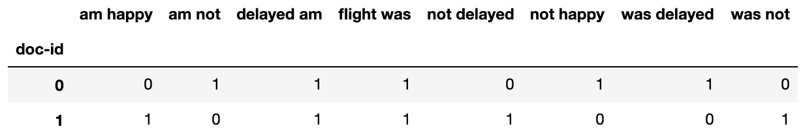
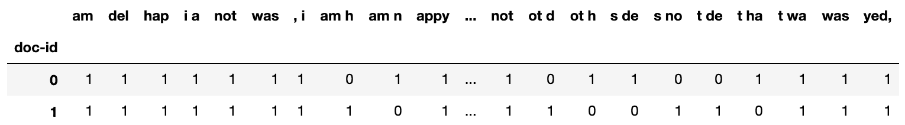
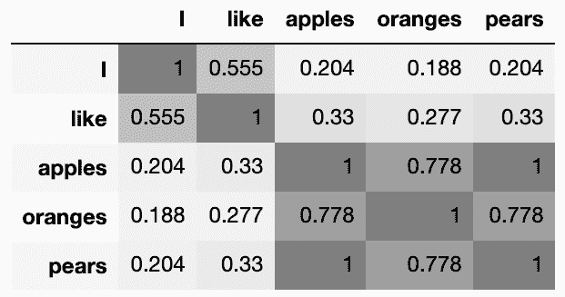

# 第六章：使用朴素贝叶斯分类器进行文本分类

“语言是一个自由创造的过程；它的规律和原则是固定的，但这些生成原则的运用方式是自由且无限变化的。甚至单词的解释和使用也涉及自由创造的过程。”

– 诺姆·乔姆斯基

并非所有信息都存在于表格中。从维基百科到社交媒体，成千上万的文字信息需要我们的计算机进行处理和提取。处理文本数据的机器学习子领域有着如**文本挖掘**和**自然语言处理**（**NLP**）等不同的名称。这些名称反映了该领域从多个学科继承而来。一方面，我们有计算机科学和统计学，另一方面，我们有语言学。我认为，在该领域初期，语言学的影响较大，但随着发展，实践者们更倾向于使用数学和统计工具，因为它们需要较少的人工干预，并且不需要人工将语言规则编入算法中：

“每次我解雇一个语言学家，我们的语音识别系统性能都会提升。”

– 弗雷德·杰里内克

话虽如此，了解事物随着时间的进展是如何发展的，避免直接跳入前沿解决方案，这一点至关重要。这使我们能够在意识到权衡取舍的基础上明智地选择工具。因此，我们将从处理文本数据开始，并以算法能够理解的格式呈现数据。这个预处理阶段对下游算法的性能有着重要影响。因此，我会确保阐明每种方法的优缺点。一旦数据准备好，我们将使用**朴素贝叶斯**分类器根据用户发送给多个航空公司服务的消息，检测不同 Twitter 用户的情感。

本章将涉及以下主题：

+   将句子拆分成词元

+   词元归一化

+   使用词袋模型表示词元

+   使用 n-gram 模型表示词元

+   使用 Word2Vec 表示词元

+   使用朴素贝叶斯分类器进行文本分类

# 将句子拆分成词元

“一个字接一个字，形成了力量。”

– 玛格丽特·阿特伍德

到目前为止，我们处理的数据要么是带有列作为特征的表格数据，要么是带有像素作为特征的图像数据。而在文本的情况下，问题变得不那么明确。我们应该使用句子、单词，还是字符作为特征？句子非常具体。例如，两篇维基百科文章中出现完全相同的句子的可能性非常小。因此，如果我们将句子作为特征，最终会得到大量的特征，这些特征的泛化能力较差。

另一方面，字符是有限的。例如，英语中只有 26 个字母。这种小的变化可能限制了单个字符携带足够信息的能力，无法让下游算法提取出有效的特征。因此，单词通常作为大多数任务的特征。

本章稍后我们会看到，尽管可以得到相当具体的标记，但现在让我们暂时仅把单词作为特征。最后，我们并不想局限于字典中的单词；Twitter 标签、数字和 URL 也可以从文本中提取并作为特征。因此，我们更倾向于使用 *token* 而不是 *word* 这个术语，因为 *token* 更为通用。将文本流分割成标记的过程称为分词，我们将在下一节中学习这个过程。

## 使用字符串分割进行分词

不同的分词方法会导致不同的结果。为了演示这些差异，让我们以以下三行文本为例，看看如何对它们进行分词。

在这里，我将文本行作为字符串写入并放入一个列表中：

```py
lines = [
    'How to tokenize?\nLike a boss.',
    'Google is accessible via http://www.google.com',
    '1000 new followers! #TwitterFamous',
]
```

一种明显的方法是使用 Python 内置的 `split()` 方法，如下所示：

```py
for line in lines:
    print(line.split())
```

当没有提供参数时，`split()` 会根据空格来分割字符串。因此，我们得到以下输出：

```py
['How', 'to', 'tokenize?', 'Like', 'a', 'boss.']
['Google', 'is', 'accessible', 'via', 'http://www.google.com']
['1000', 'new', 'followers!', '#TwitterFamous']
```

你可能注意到，标点符号被保留为标记的一部分。问号被保留在 `tokenize` 的末尾，句号也附着在 `boss` 后面。井号标签由两个单词组成，但由于它们之间没有空格，它被作为一个整体标记保留，并带有前导的井号符号。

## 使用正则表达式进行分词

我们还可以使用正则表达式将字母和数字序列视为标记，并相应地分割我们的句子。这里使用的模式 `"\w+"` 表示任何一个或多个字母数字字符或下划线的序列。编译我们的模式会得到一个正则表达式对象，我们可以用它来进行匹配。最后，我们遍历每一行并使用正则表达式对象将其拆分为标记：

```py
import re
_token_pattern = r"\w+"
token_pattern = re.compile(_token_pattern)

for line in lines:
    print(token_pattern.findall(line))
```

这将给出以下输出：

```py
['How', 'to', 'tokenize', 'Like', 'a', 'boss']
['Google', 'is', 'accessible', 'via', 'http', 'www', 'google', 'com']
['1000', 'new', 'followers', 'TwitterFamous']
```

现在，标点符号已被去除，但 URL 被分割成了四个标记。

Scikit-learn 默认使用正则表达式进行分词。然而，`r"(?u)\b\w\w+\b"` 这个模式被用来代替 `r"\w+"`。这个模式会忽略所有标点符号和短于两个字母的单词。因此，"a" 这个词会被省略。你仍然可以通过提供自定义模式来覆盖默认模式。

## 使用占位符进行分词前的处理

为了解决前面的问题，我们可以决定在对句子进行分词之前，将数字、URL 和标签（hashtags）替换为占位符。如果我们不在意区分它们的内容，这样做是有用的。对我来说，URL 可能只是一个 URL，无论它指向哪里。以下函数将输入转换为小写字母，然后将找到的任何 URL 替换为`_url_`占位符。类似地，它将标签和数字转换为相应的占位符。最后，输入根据空白字符进行分割，并返回结果的词元：

```py
_token_pattern = r"\w+"
token_pattern = re.compile(_token_pattern)

def tokenizer(line):
    line = line.lower()
    line = re.sub(r'http[s]?://[\w\/\-\.\?]+','_url_', line)
    line = re.sub(r'#\w+', '_hashtag_', line)
    line = re.sub(r'\d+','_num_', line)
    return token_pattern.findall(line)

for line in lines:
    print(tokenizer(line))
```

这给我们带来了以下输出：

```py
['how', 'to', 'tokenize', 'like', 'a', 'boss']
['google', 'is', 'accessible', 'via', '_url_']
['_num_', 'new', 'followers', '_hashtag_']
```

如你所见，新的占位符告诉我们第二个句子中存在一个 URL，但它并不关心该 URL 指向哪里。如果我们有另一个包含不同 URL 的句子，它也会得到相同的占位符。数字和标签也是一样的。

根据你的使用情况，如果你的标签包含你不想丢失的信息，这种方法可能并不理想。同样，这是一个你必须根据具体应用做出的权衡。通常，你可以直观地判断哪种技术更适合当前问题，但有时，评估经过多次分词技术后的模型，可能是唯一判断哪种方法更合适的方式。最后，在实际应用中，你可能会使用**NLTK**和**spaCy**等库来对文本进行分词。它们已经在后台实现了必要的正则表达式。在本章稍后的部分，我们将使用 spaCy。

请注意，我在处理句子之前将其转换为小写字母。这被称为归一化。如果没有归一化，首字母大写的单词和它的小写版本会被视为两个不同的词元。这不是理想的，因为*Boy*和*boy*在概念上是相同的，因此通常需要进行归一化。Scikit-learn 默认会将输入文本转换为小写字母。

# 将文本向量化为矩阵

在文本挖掘中，一个数据集通常被称为**语料库**。其中的每个数据样本通常被称为**文档**。文档由**词元**组成，一组不同的词元被称为**词汇表**。将这些信息放入矩阵中称为**向量化**。在接下来的章节中，我们将看到我们可以获得的不同类型的向量化方法。

## 向量空间模型

我们仍然缺少我们心爱的特征矩阵，在这些矩阵中，我们期望每个词元（token）有自己的列，每个文档由单独的一行表示。这种文本数据的表示方式被称为**向量空间模型**。从线性代数的角度来看，这种表示中的文档被视为向量（行），而不同的词项是该空间的维度（列），因此称为向量空间模型。在下一节中，我们将学习如何将文档向量化。

### 词袋模型

我们需要将文档转换为标记，并将它们放入向量空间模型中。此处可以使用`CountVectorizer`对文档进行标记化并将其放入所需的矩阵中。在这里，我们将使用我们在上一节创建的分词器。像往常一样，我们导入并初始化`CountVectorizer`，然后使用其`fit_transform`方法来转换我们的文档。我们还指定希望使用我们在上一节构建的分词器：

```py
from sklearn.feature_extraction.text import CountVectorizer
vec = CountVectorizer(lowercase=True, tokenizer=tokenizer)
x = vec.fit_transform(lines)
```

返回的矩阵中大部分单元格都是零。为了节省空间，它被保存为稀疏矩阵；然而，我们可以使用其`todense()`方法将其转换为稠密矩阵。向量化器保存了遇到的词汇表，可以使用`get_feature_names()`来检索。通过这些信息，我们可以将`x`转换为 DataFrame，如下所示：

```py
pd.DataFrame(
    x.todense(), 
    columns=vec.get_feature_names()
)
```

这给了我们以下矩阵：


每个单元格包含每个标记在每个文档中出现的次数。然而，词汇表没有遵循任何顺序；因此，从这个矩阵中无法判断每个文档中标记的顺序。

### 不同的句子，相同的表示

取这两句话，它们有相反的意思：

```py
flight_delayed_lines = [
    'Flight was delayed, I am not happy',
    'Flight was not delayed, I am happy'
]
```

如果我们使用计数向量化器来表示它们，我们将得到以下矩阵：


如你所见，句子中标记的顺序丢失了。这就是为什么这种方法被称为**词袋模型（bag of words）**——结果就像一个袋子，单词只是被放入其中，没有任何顺序。显然，这使得无法分辨哪一个人是开心的，哪一个不是。为了解决这个问题，我们可能需要使用**n-grams**，正如我们将在下一节中所做的那样。

### N-grams

与其将每个术语视为一个标记，我们可以将每两个连续术语的组合视为一个单独的标记。我们要做的就是将`CountVectorizer`中的`ngram_range`设置为`(2,2)`，如下所示：

```py
from sklearn.feature_extraction.text import CountVectorizer
vec = CountVectorizer(ngram_range=(2,2))
x = vec.fit_transform(flight_delayed_lines)
```

使用与上一节相似的代码，我们可以将结果的`x`放入 DataFrame 中并得到以下矩阵：



现在我们可以知道谁是开心的，谁不是。当使用词对时，这被称为**大 ram（bigrams）**。我们还可以使用 3-gram（由三个连续单词组成），4-gram 或任何其他数量的 gram。将`ngram_range`设置为(1,1)将使我们回到原始表示形式，其中每个单独的单词是一个标记，这就是**单 gram（unigrams）**。我们还可以通过将`ngram_range`设置为(1,2)来混合单 gram 和大 gram。简而言之，这个范围告诉分词器用于我们 n-gram 的最小值和最大值*n*。

**如果你将*n*设置为一个较高的值——比如 8——这意味着八个单词的序列将被当作标记。那么，你认为一个包含八个单词的序列在你的数据集中出现的概率有多大？大概率是它只会在训练集中出现一次，而在测试集中从未出现过。这就是为什么*n*通常设置为 2 到 3 之间的数值，并且有时会使用一些 unigram 来捕捉稀有词汇。**

### 使用字符代替单词

到目前为止，单词一直是我们文本宇宙中的原子。然而，有些情况可能需要我们基于字符来进行文档的标记化。在单词边界不明确的情况下，比如标签和 URL，使用字符作为标记可能会有所帮助。自然语言的字符频率通常不同。字母**e**是英语中使用最频繁的字符，字符组合如**th**、**er**和**on**也非常常见。其他语言，如法语和荷兰语，也有不同的字符频率。如果我们的目标是基于语言来分类文档，使用字符而不是单词可能会派上用场。

同样的`CountVectorizer`可以帮助我们将文档标记化为字符。我们还可以将其与`n-grams`设置结合，以获取单词中的子序列，如下所示：

```py
from sklearn.feature_extraction.text import CountVectorizer
vec = CountVectorizer(analyzer='char', ngram_range=(4,4))
x = vec.fit_transform(flight_delayed_lines)
```

我们可以像之前一样将结果`x`放入 DataFrame 中，从而得到如下矩阵：



现在我们所有的标记都由四个字符组成。如你所见，空格也被视作字符。使用字符时，通常会选择更高的*n*值。

### 使用 TF-IDF 捕捉重要词汇

我们在这里借鉴的另一个学科是**信息检索**领域。它是负责运行搜索引擎算法的领域，比如 Google、Bing 和 DuckDuckGo。

现在，看看下面这段引文：

“从语言学的角度来看，你真的不能对‘一个节目就是一个节目’这一概念提出太多反对意见。”

– 沃尔特·贝克尔

**linguistic**和**that**这两个词在前述引用中都出现过一次。然而，如果我们在互联网上搜索这段引文，我们只会关注**linguistic**这个词，而不是**that**这个词。我们知道，尽管它只出现了一次，和**that**出现的次数一样多，但它更为重要。**show**这个词出现了三次。从计数向量化器的角度来看，它应该比**linguistic**包含更多的信息。我猜你也不同意向量化器的看法。这些问题从根本上来说是**词频-逆文档频率**（**TF-IDF**）的存在原因。IDF 部分不仅涉及根据单词在某个文档中出现的频率来加权单词的值，还会在这些单词在其他文档中非常常见时对它们的权重进行折扣。**that**这个词在其他文档中如此常见，以至于它不应该像**linguistic**一样被赋予那么高的权重。此外，IDF 使用对数尺度来更好地表示一个词根据它在文档中的频率所携带的信息。*

*我们使用以下三个文档来演示 TF-IDF 是如何工作的：

```py
lines_fruits = [
    'I like apples',
    'I like oranges',
    'I like pears',
]
```

`TfidfVectorizer`的接口与`CountVectorizer`几乎完全相同：

```py
from sklearn.feature_extraction.text import TfidfVectorizer
vec = TfidfVectorizer(token_pattern=r'\w+')
x = vec.fit_transform(lines_fruits)
```

这是两种向量化器输出的并排比较：


如你所见，与`CountVectorizer`不同，`TfidfVectorizer`并没有对所有单词进行平等对待。相比于其他出现在所有三句话中的不太有信息量的词，更多的强调被放在了水果名称上。

`CountVectorizer`和**`TfidfVectorizer`**都有一个名为`stop_words`的参数。它可以用来指定需要忽略的词元。你可以提供自己的不太有信息量的词列表，例如**a**、**an**和**the**。你也可以提供`english`*关键字来指定英语中常见的停用词。话虽如此，需要注意的是，一些词对于某个任务来说可能有信息量，但对另一个任务则可能没有。此外，IDF 通常会自动完成你需要它做的工作，并且给非信息性词语赋予较低的权重。这就是为什么我通常不手动去除停用词，而是尝试使用`TfidfVectorizer`、特征选择和正则化**优先**的方法。*******

*******除了它的原始用途，`TfidfVectorizer`通常作为文本分类的预处理步骤。然而，当需要对较长的文档进行分类时，它通常能给出不错的结果。对于较短的文档，它可能会产生嘈杂的转化，建议在这种情况下尝试使用`CountVectorizer`。

在一个基础的搜索引擎中，当有人输入查询时，它会通过 TF-IDF 转换为与所有待搜索文档存在于同一向量空间中的形式。一旦查询和文档作为向量存在于同一空间中，就可以使用简单的距离度量方法，如余弦距离，来查找与查询最接近的文档。现代搜索引擎在这个基础概念上有所变化，但这是构建信息检索理解的良好基础。

## 使用词嵌入表示意义

由于文档是由词元组成的，它们的向量表示基本上是包含的词元向量之和。正如我们之前看到的，**I like apples**文档通过`CountVectorizer`被表示为向量[1,1,1,0,0]：


从这种表示方式出发，我们还可以推断出**I**、**like**、**apples**和**oranges**分别由以下四个五维向量表示：[0,1,0,0,0]，[0,0,1,0,0]，[1,0,0,0,0]和[0,0,0,1,0]。我们有一个五维空间，基于我们五个词的词汇表。每个词在一个维度上的值为 1，其他四个维度上的值为 0。从线性代数的角度来看，所有五个词是正交的（垂直的）。然而，**apples**、**pears**和**oranges**都是水果，在概念上它们有一定的相似性，但这种相似性并没有被这个模型捕捉到。因此，我们理想的做法是使用相互接近的向量来表示它们，而不是这些正交的向量。顺便提一下，`TfidfVectorizer`也存在类似问题***。*** 这促使研究人员提出了更好的表示方法，而词嵌入如今成为自然语言处理领域的热门技术，因为它比传统的向量化方法更好地捕捉了意义。在下一节中，我们将了解一种流行的嵌入技术——Word2Vec。

### Word2Vec

不深入细节，Word2Vec 使用神经网络从上下文中预测单词，也就是说，从单词的周围词汇中进行预测。通过这种方式，它学习了更好的单词表示，并且这些表示包含了它们所代表的单词的意义。与前面提到的向量化方法不同，单词表示的维度与我们词汇表的大小没有直接关系。我们可以选择嵌入向量的长度。一旦每个单词被表示为一个向量，文档的表示通常是所有单词向量的和。平均值也是一个替代选择，而不是求和。

由于我们向量的大小与我们处理的文档的词汇量无关，研究人员可以重新使用未专门为他们特定问题训练的预训练 Word2Vec 模型。这种重新使用预训练模型的能力被称为迁移学习。一些研究人员可以使用昂贵的机器在大量文档上训练嵌入，并发布得到的向量供全世界使用。然后，下次我们处理特定的自然语言处理任务时，我们所需要做的就是获取这些向量并用它们来表示我们新的文档。spaCy ([`spacy.io/`](https://spacy.io/))是一个开源软件库，提供了不同语言的词向量。

在接下来的几行代码中，我们将安装 spaCy，下载它的语言模型数据，并使用它将单词转换为向量：

1.  要使用 spaCy，我们可以安装这个库并通过运行以下命令在终端中下载其英语预训练模型：

```py
          pip install spacy

          python -m spacy download en_core_web_lg

```

1.  然后，我们可以将下载的向量分配给我们的五个单词，如下所示：

```py
import spacy
nlp = spacy.load('en_core_web_lg')

terms = ['I', 'like', 'apples', 'oranges', 'pears']
vectors = [
    nlp(term).vector.tolist() for term in terms
]
```

1.  这是**苹果**的表示：

```py
# pd.Series(vectors[terms.index('apples')]).rename('apples')

0     -0.633400
1      0.189810
2     -0.535440
3     -0.526580
         ...   
296   -0.238810
297   -1.178400
298    0.255040
299    0.611710
Name: apples, Length: 300, dtype: float64
```

我曾承诺你，**苹果**、**橙子**和**梨**的表示不会像`CountVectorizer`那样正交。然而，使用 300 个维度时，我很难直观地证明这一点。幸运的是，我们已经学会了如何计算两个向量之间的余弦角度。正交向量之间的角度应该是 90°，其余弦值为 0。而两个方向完全相同的向量之间的零角度的余弦值为 1。

在这里，我们计算了来自 spaCy 的五个向量之间的余弦相似度。我使用了一些 pandas 和 seaborn 的样式，使数字更清晰：

```py
import seaborn as sns
from sklearn.metrics.pairwise import cosine_similarity

cm = sns.light_palette("Gray", as_cmap=True)

pd.DataFrame(
    cosine_similarity(vectors),
    index=terms, columns=terms,
).round(3).style.background_gradient(cmap=cm)
```

然后，我在下面的 DataFrame 中展示了结果：



显然，新的表示方法理解到水果名称之间的相似度远高于它们与像**I**和**like**这样的词的相似度。它还认为**苹果**和**梨**非常相似，而**橙子**则不然。

你可能注意到，Word2Vec 存在与一元词相同的问题；词语的编码并没有太多关注它们的上下文。在句子“I will read a book”和“I will book a flight”中，单词“book”的表示是一样的。这就是为什么像**语言模型嵌入**（**ELMo**）、**双向编码器表示从变换器**（**BERT**）以及 OpenAI 最近的**GPT-3**等新技术现在越来越受欢迎的原因，因为它们尊重词语的上下文。我预计它们很快会被更多的库所采用，供大家轻松使用。

嵌入概念现在被各地的机器学习从业者回收并重新利用。除了在自然语言处理中的应用外，它还用于特征降维和推荐系统。例如，每当顾客将商品添加到在线购物车时，如果我们将购物车视为一个句子，将商品视为单词，那么我们就得到了商品的嵌入 (**Item2Vec**) 。这些商品的新表示可以轻松地插入到下游分类器或推荐系统中。

在进入文本分类之前，我们需要先停下来花一些时间了解我们将要使用的分类器——**朴素贝叶斯分类器**。

# 理解朴素贝叶斯

朴素贝叶斯分类器通常用于文本数据的分类。在接下来的部分中，我们将看到其不同的变种，并学习如何配置它们的参数。但首先，为了理解朴素贝叶斯分类器，我们需要先了解托马斯·贝叶斯在 18 世纪发表的贝叶斯定理。

## 贝叶斯规则

讨论分类器时，我们可以使用条件概率*P(y|x)*来描述某个样本属于某个类别的概率。这是给定其特征*x*的情况下，样本属于类别*y*的概率。管道符号（|）是我们用来表示条件概率的符号，即给定*x*的情况下的*y*。贝叶斯规则可以用以下公式将这种条件概率表达为*P(x|y)*、*P(x)*和*P(y)*：


通常，我们忽略方程中的分母部分，将其转换为如下比例：


一个类别的概率，*P(y)*，称为先验概率。它基本上是所有训练样本中属于某一类别的样本数。条件概率，*P(x|y)*，称为似然度。它是我们从训练样本中计算出来的。一旦这两个概率在训练时已知，我们就可以利用它们来预测新样本属于某一类别的概率，即预测时的*P(y|x)*，也称为后验概率。计算方程中的似然度部分并不像我们预期的那么简单。因此，在接下来的部分中，我们将讨论为了简化这一计算，我们可以做出哪些假设。

## 朴素地计算似然度

一个数据样本由多个特征构成，这意味着在实际应用中，*P(x|y)*中的*x*部分由*x[1]*、*x[2]*、*x[3]*、.... *x[k]*构成，其中*k*是特征的数量。因此，条件概率可以表示为*P(x[1], x[2], x[3], .... x[k]|y)*。实际上，这意味着我们需要为*x*的所有可能组合计算该条件概率。这么做的主要缺点是我们模型的泛化能力不足。

让我们通过以下的玩具示例来澄清这一点：

| **文本** | **文本是否表明作者喜欢水果？** |
| --- | --- |
| 我喜欢苹果 | 是 |
| 我喜欢橙子 | 是 |
| 我讨厌梨 | 否 |

如果前面的表格是我们的训练数据，第一个样本的似然概率，*P(x|y)*，就是给定目标**是**时，看到三个词**我**、**喜欢**和**苹果**一起出现的概率。同理，第二个样本的概率是给定目标**是**时，看到三个词**我**、**喜欢**和**橙子**一起出现的概率。第三个样本也是如此，只不过目标是**否**而不是**是**。现在，假设我们给定一个新样本，**我讨厌苹果**。问题是，我们之前从未见过这三个词一起出现。你可能会说：“但是我们以前见过每个单独的词，只是分开出现！”这是正确的，但我们的公式只关心词的组合。它无法从每个单独的特征中学到任何东西。

你可能记得在[第四章](https://cdp.packtpub.com/hands_on_machine_learning_with_scikit_learn/wp-admin/post.php?post=27&action=edit)中，*准备你的数据*，*P(x[1], x[2], x[3], .... x[k]|y)* 只有在 *x[1], x[2], x[3], .... x[k]* 互相独立时，才能表示为 *P(x[1]|y)* P(x[2]|y)x[3]* .. * P(x[k]|y)*。它们的独立性并非我们可以确定的，但我们仍然做出了这个朴素的假设，以使模型更具普适性。由于这一假设，并且由于我们处理的是独立的单词，现在我们可以了解关于短语**我讨厌苹果**的一些信息，尽管我们以前从未见过它。这种虽然朴素但有用的独立性假设，正是给分类器命名时加上“朴素”前缀的原因。

## 朴素贝叶斯实现

在 scikit-learn 中，有多种朴素贝叶斯实现方式。

+   **多项式朴素贝叶斯**分类器是文本分类中最常用的实现。它的实现方式与我们在前一节看到的最为相似。

+   **伯努利朴素贝叶斯**分类器假设特征是二元的。在伯努利版本中，我们关注的不是每个文档中某个词出现的次数，而是该词是否存在。计算似然的方式明确惩罚文档中未出现的词汇，在一些数据集上，尤其是短文档的数据集上，它可能表现得更好。

***高斯朴素贝叶斯**用于连续特征。它假设特征呈正态分布，并使用最大似然估计计算似然概率。该实现适用于文本分析之外的其他情况。**

**此外，你还可以在 scikit-learn 用户指南中阅读关于另外两个实现——**互补朴素贝叶斯**和**类别朴素贝叶斯**的内容，链接为([`scikit-learn.org/stable/modules/naive_bayes.html`](https://scikit-learn.org/stable/modules/naive_bayes.html))。

### 加性平滑

当在预测过程中出现训练时未见过的词汇时，我们将其概率设置为 0。这听起来很合乎逻辑，但鉴于我们天真的假设，这其实是一个有问题的决定。由于*P(x[1], x[2], x[3], .... x[k]|y)* 等于 *P(x[1]|y)* P(x[2]|y)*P(x[3]|y)* .. * P(x[k]|y)，*将任何词汇的条件概率设为零，将导致整个 *P(x[1], x[2], x[3], .... x[k]|y)* 被设置为零。为了避免这个问题，我们假设每个类别中都加入了一份包含所有词汇的文档。从概念上讲，这个新的假设性文档将从我们已见过的词汇中分配一部分概率质量，并将其重新分配给未见过的词汇。`alpha` 参数控制我们希望重新分配给未见过的词汇的概率质量。将 `alpha` 设置为 1 被称为**拉普拉斯平滑**，而将其设置为介于 0 和 1 之间的值则称为**利德斯通平滑**。

我发现在计算比率时，经常使用拉普拉斯平滑。除了防止我们出现除以零的情况外，它还帮助处理不确定性。让我通过以下两个例子进一步解释：

+   **例子 1**：10,000 人看到了一个链接，其中 9,000 人点击了它。显然，我们可以估算点击率为 90%。

+   **例子 2**：如果我们的数据中只有一个人，而且这个人看到了链接并点击了它，我们能有足够的信心说点击率是 100%吗？

在前面的例子中，如果我们假设有两个额外的用户，其中只有一个点击了链接，那么第一个例子的点击率将变为 9,001/10,002，仍然接近 90%。然而，在第二个例子中，我们将用 2 除以 3，这将得到 60%，而不是之前计算出的 100%。拉普拉斯平滑和利德斯通平滑可以与贝叶斯的思维方式联系起来。这两个用户，其中 50%的人点击了链接，代表了我们的先验信念。最初，我们了解的信息很少，所以我们假设点击率为 50%。现在，在第一个例子中，我们有足够的数据来推翻这个先验信念，而在第二个例子中，较少的数据点只能稍微调整先验。

现在先不谈理论 – 让我们用到目前为止学到的所有内容，来判断一些评论者是否对他们的观影体验感到满意。

# 使用朴素贝叶斯分类器进行文本分类

在本节中，我们将获取一组句子，并根据用户的情感对其进行分类。我们要判断该句子是带有积极情感还是消极情感。*Dimitrios Kotzias 等人* 为他们的研究论文《*从群体到个体标签，利用深度特征*》创建了这个数据集。他们从三个不同的网站收集了一组随机句子，并将每个句子标记为 1（积极情感）或 0（消极情感）。

数据集中总共有 2,745 个句子。在接下来的部分中，我们将下载数据集、预处理数据，并对其中的句子进行分类。

## 下载数据

你可以直接打开浏览器，将 CSV 文件下载到本地文件夹，并使用 pandas 将文件加载到数据框中。然而，我更喜欢使用 Python 来下载文件，而不是使用浏览器。我这么做不是因为我是极客，而是为了确保我的整个过程的可重现性，将其编写成代码。任何人都可以运行我的 Python 代码并得到相同的结果，而不需要阅读糟糕的文档文件，找到压缩文件的链接，并按照指示获取数据。

以下是下载所需数据的步骤：

1.  首先，让我们创建一个文件夹来存储下载的数据。以下代码检查所需文件夹是否存在。如果不存在，它会在当前工作目录中创建该文件夹：

```py
import os

data_dir = f'{os.getcwd()}/data'

if not os.path.exists(data_dir):
    os.mkdir(data_dir)
```

1.  然后我们需要使用`pip`安装`requests`库，因为我们将使用它来下载数据：

```py
          pip install requests

```

1.  然后，我们按照以下方式下载压缩数据：

```py
import requests

url = 'https://archive.ics.uci.edu/ml/machine-learning-databases/00331/sentiment%20labelled%20sentences.zip'

response = requests.get(url)
```

1.  现在，我们可以解压数据并将其存储到刚创建的数据文件夹中。我们将使用`zipfile`模块来解压数据。`ZipFile`方法期望读取一个文件对象。因此，我们使用`BytesIO`将响应内容转换为类似文件的对象。然后，我们将 zip 文件的内容提取到我们的文件夹中，如下所示：

```py
import zipfile

from io import BytesIO

with zipfile.ZipFile(file=BytesIO(response.content), mode='r') as compressed_file:
    compressed_file.extractall(data_dir)
```

1.  现在，我们的数据已经写入到数据文件夹中的 3 个独立文件中，我们可以将这 3 个文件分别加载到 3 个数据框中。然后，我们可以将这 3 个数据框合并成一个单一的数据框，如下所示：

```py
df_list = []

for csv_file in ['imdb_labelled.txt', 'yelp_labelled.txt', 'amazon_cells_labelled.txt']:

    csv_file_with_path = f'{data_dir}/sentiment labelled sentences/{csv_file}'
    temp_df = pd.read_csv(
        csv_file_with_path, 
        sep="\t", header=0, 
        names=['text', 'sentiment']
    ) 
    df_list.append(temp_df)

df = pd.concat(df_list)
```

1.  我们可以使用以下代码显示情感标签的分布：

```py
explode = [0.05, 0.05]
colors = ['#777777', '#111111']
df['sentiment'].value_counts().plot(
    kind='pie', colors=colors, explode=explode
)
```

如我们所见，两个类别大致相等。在进行任何分类任务之前，检查类别的分布是一种好习惯：


1.  我们还可以使用以下代码显示一些示例句子，调整 pandas 的设置以显示更多字符：

```py
pd.options.display.max_colwidth = 90
df[['text', 'sentiment']].sample(5, random_state=42)
```

我将`random_state`设置为一个任意值，以确保我们得到相同的样本，如下所示：


## 准备数据

现在，我们需要为分类器准备数据以供使用：

1.  像我们通常做的那样，我们首先将数据框分割为训练集和测试集。我将 40%的数据集用于测试，并将`random_state`设置为一个任意值，以确保我们都获得相同的随机分割：

```py
from sklearn.model_selection import train_test_split
df_train, df_test = train_test_split(df, test_size=0.4, random_state=42)
```

1.  然后，我们从情感列中获取标签，如下所示：

```py
y_train = df_train['sentiment']
y_test = df_test['sentiment']
```

1.  对于文本特征，让我们使用`CountVectorizer`来转换它们。我们将包括一元组、二元组和三元组。我们还可以通过将`min_df`设置为`3`来忽略稀有词，这样就可以排除出现在少于三个文档中的单词。这是去除拼写错误和噪声标记的一个有效做法。最后，我们可以去掉字母的重音并将其转换为`ASCII`：

```py
from sklearn.feature_extraction.text import CountVectorizer

vec = CountVectorizer(ngram_range=(1,3), min_df=3, strip_accents='ascii')
x_train = vec.fit_transform(df_train['text'])
x_test = vec.transform(df_test['text'])
```

1.  最后，我们可以使用朴素贝叶斯分类器来分类我们的数据。我们为模型设置`fit_prior=True`，使其使用训练数据中类别标签的分布作为先验：

```py
from sklearn.naive_bayes import MultinomialNB
clf = MultinomialNB(fit_prior=True)
clf.fit(x_train, y_train)
y_test_pred = clf.predict(x_test)
```

这次，我们的传统准确度得分可能不足以提供足够的信息。我们希望知道每个类别的准确性。此外，根据我们的使用案例，我们可能需要判断模型是否能够识别所有的负面推文，即使这样做的代价是错误地分类了一些正面推文。为了获得这些信息，我们需要使用`精度`和`召回率`得分。

## 精度、召回率和 F1 得分

在被分配到正类的样本中，实际上为正类的百分比就是该类别的**精度**。对于正面推文，分类器正确预测为正面的推文百分比就是该类别的**召回率**。如你所见，精度和召回率是按类别计算的。以下是我们如何用真实正例和假正例正式表达**精度得分**：


**召回率得分**是通过真实正例和假负例来表示的*：*


为了将前两个得分汇总为一个数字，可以使用*F[1]得分*。它通过以下公式将精度和召回率得分结合起来：


在这里，我们计算了我们的分类器的三项上述度量：

```py
p, r, f, s = precision_recall_fscore_support(y_test, y_test_pred)
```

为了更清楚地说明，我将结果度量放入以下表格中。请记住，支持度仅仅是每个类别中的样本数量：


由于两个类别的大小几乎相等，因此得分是相等的。如果类别不平衡，通常会看到某个类别的精度或召回率高于另一个类别。

由于这些度量是按类别标签计算的，我们还可以获得它们的宏观平均值。在此示例中，宏观平均精度得分将是**0.81**和**0.77**的平均值，即**0.79**。另一方面，微观平均是基于总体的真实正例、假正例和假负例样本数量来计算这些得分的。

## 流水线

在前几章中，我们使用网格搜索来找到估计器的最佳超参数。现在，我们有多个东西要同时优化。一方面，我们想优化朴素贝叶斯的超参数，另一方面，我们还想优化预处理步骤中使用的向量化器的参数。由于网格搜索只期望一个对象，scikit-learn 提供了一个`pipeline`封装器，我们可以在其中将多个转换器和估计器组合成一个。

顾名思义，管道是由一系列顺序步骤组成的。在这里，我们从`CountVectorizer`开始，`MultinomialNB`作为第二步也是最后一步：

```py
from sklearn.pipeline import Pipeline
from sklearn.feature_extraction.text import CountVectorizer
from sklearn.naive_bayes import MultinomialNB

pipe = Pipeline(steps=[
    ('CountVectorizer', CountVectorizer()), 
    ('MultinomialNB', MultinomialNB())]
)
```

除了最后一步的对象外，其他所有对象都应该是`transformers`，即它们应具有`fit`、`transform`和`fit_transform`方法。最后一步的对象应为`estimator`，意味着它应该具有`fit`和`predict`方法。你还可以构建自定义的转换器和估计器，并在管道中使用，只要它们具有预期的方法。

现在我们的管道已经准备好，我们可以将其插入`GridSearchCV`中，以寻找最佳超参数。

### 针对不同得分的优化

“你所衡量的，便是你所管理的。”

——彼得·德鲁克

当我们之前使用`GridSearchCV`时，我们没有指定要优化的超参数的度量标准。默认情况下使用分类器的准确度。或者，你也可以选择优化超参数的精确度得分或召回率得分。在这里，我们将设置网格搜索以优化宏精确度得分。

我们从设置要搜索的不同超参数开始。由于我们在这里使用管道，因此我们需要为每个超参数添加步骤名称的前缀，以便管道将参数分配给正确的步骤：

```py
param_grid = {
    'CountVectorizer__ngram_range': [(1,1), (1,2), (1,3)],
    'MultinomialNB__alpha': [0.1, 1],
    'MultinomialNB__fit_prior': [True, False],
}
```

默认情况下，贝叶斯规则中的先验`P(y)`是根据每个类别中的样本数设置的。然而，我们可以通过设置`fit_prior=False`将其设置为所有类别的常量。

在这里，我们运行`GridSearchCV`，并告诉它我们最关心的是精确度：

```py
from sklearn.model_selection import GridSearchCV
search = GridSearchCV(pipe, param_grid, scoring='precision_macro', n_jobs=-1)
search.fit(df_train['text'], y_train)
print(search.best_params_)
```

这为我们提供了以下超参数：

+   `ngram_range`: (1, 3)

+   `alpha`: 1

+   `fit_prior`: False

我们得到了 80.5%的宏精确度和 80.5%的宏召回率。

由于类别分布平衡，预计先验不会增加太多价值。我们还获得了相似的精确度和召回率得分。因此，现在重新运行网格搜索以优化召回率没有意义，我们无论如何都会得到相同的结果。然而，当处理高度不平衡的类别时，事情可能会有所不同，这时你可能希望通过牺牲其他类别的效果来最大化某一类别的召回率。

在下一节中，我们将使用词嵌入来表示我们的标记。让我们看看这种迁移学习方法是否能帮助我们的分类器表现得更好。

# 创建自定义转换器

在结束本章之前，我们还可以基于`Word2Vec`嵌入创建一个自定义变换器，并在我们的分类管道中使用它，而不是使用`CountVectorizer`。为了能够在管道中使用我们的自定义变换器，我们需要确保它具备`fit`、`transform`和`fit_transform`方法。

这是我们新的变换器，我们将其命名为`WordEmbeddingVectorizer`：

```py
import spacy

class WordEmbeddingVectorizer:

    def __init__(self, language_model='en_core_web_md'):
        self.nlp = spacy.load(language_model)

    def fit(self):
        pass

    def transform(self, x, y=None):
        return pd.Series(x).apply(
            lambda doc: self.nlp(doc).vector.tolist()
        ).values.tolist()

    def fit_transform(self, x, y=None):
        return self.transform(x)
```

这里的`fit`方法是无效的——它什么也不做，因为我们使用的是 spaCy 的预训练模型。我们可以按照以下方式使用新创建的变换器：

```py
vec = WordEmbeddingVectorizer()
x_train_w2v = vec.transform(df_train['text'])
```

我们可以使用这个变换器与其他分类器一起使用，而不仅仅是朴素贝叶斯分类器，例如`LogisticRegression`或`Multi-layer Perceptron`。

pandas 中的`apply`函数可能会很慢，尤其是在处理大量数据时。我喜欢使用一个叫做`tqdm`的库，它可以让我将`apply()`方法替换为`progress_apply()`，这样在运行时就会显示进度条。导入库后，你只需运行`tqdm.pandas()`；这会将`progress_apply()`方法添加到 pandas 的 Series 和 DataFrame 对象中。顺便说一句，`tqdm`这个词在阿拉伯语中意味着*进度*。

# 总结

就我个人而言，我发现自然语言处理领域非常令人兴奋。我们人类的绝大多数知识都包含在书籍、文档和网页中。了解如何借助机器学习自动提取这些信息并组织它们，对我们的科学进步和自动化事业至关重要。这就是为什么多个科学领域，如信息检索、统计学和语言学，相互借鉴思想并试图从不同角度解决同一个问题。在本章中，我们也借鉴了这些领域的思想，并学习了如何将文本数据表示为适合机器学习算法的格式。我们还了解了 scikit-learn 提供的工具，以帮助构建和优化端到端解决方案。我们还遇到了转移学习等概念，并能够无缝地将 spaCy 的语言模型集成到 scikit-learn 中。

从下一章开始，我们将处理一些稍微高级的话题。在下一章中，我们将学习人工神经网络（多层感知机）。这是当今非常热门的话题，理解其主要概念对于任何想深入学习深度学习的人来说都很有帮助。由于神经网络通常用于图像处理，我们将借此机会，在[第五章](https://cdp.packtpub.com/hands_on_machine_learning_with_scikit_learn/wp-admin/post.php?post=28&action=edit)《最近邻图像处理》中继续扩展我们的图像处理知识。
