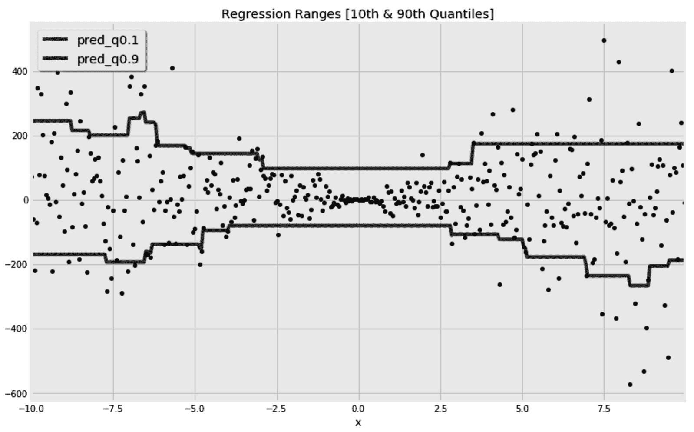

# 第八章：集成方法——当一个模型不足以应对时

在前面的三章中，我们看到**神经网络**如何直接或间接地帮助解决自然语言理解和图像处理问题。这是因为神经网络已被证明能够很好地处理**同质数据**；即，如果所有输入特征属于同一类——像素、单词、字符等。另一方面，当涉及到**异质数据**时，**集成方法**被认为能够发挥优势。它们非常适合处理异质数据——例如，一列包含用户的年龄，另一列包含他们的收入，第三列包含他们的居住城市。

你可以将集成估计器视为元估计器；它们由多个其他估计器的实例组成。它们组合底层估计器的方式决定了不同集成方法之间的差异——例如，**袋装法**与**提升法**。在本章中，我们将详细探讨这些方法，并理解它们的理论基础。我们还将学习如何诊断自己的模型，理解它们为何做出某些决策。

一如既往，我还希望借此机会在剖析每个单独的算法时，顺便阐明一些常见的机器学习概念。在本章中，我们将看到如何利用分类器的概率和回归范围来处理估计器的不确定性。

本章将讨论以下内容：

+   集成方法的动机

+   平均法/袋装集成方法

+   提升集成方法

+   回归范围

+   ROC 曲线

+   曲线下的面积

+   投票法与堆叠集成方法

# 回答为什么选择集成方法的问题？

集成方法背后的主要思想是将多个估计器结合起来，使它们的预测效果比单一估计器更好。然而，你不应该仅仅期待多个估计器的简单结合就能带来更好的结果。多个估计器的预测组合如果犯了完全相同的错误，其结果会与每个单独的估计器一样错误。因此，考虑如何减轻单个估计器所犯的错误是非常有帮助的。为此，我们需要回顾一下我们熟悉的偏差-方差二分法。很少有机器学习的老师比这对概念更能帮助我们了。

如果你还记得第二章《用树做决策》，当我们允许决策树尽可能生长时，它们往往会像手套一样拟合训练数据，但无法很好地推广到新的数据点。我们称之为过拟合，在线性模型和少量最近邻的情况下也看到了相同的行为。相反，严格限制树的生长，限制线性模型中的特征数量，或者要求太多邻居投票，都会导致模型偏向并且拟合不足。因此，我们必须在偏差-方差和拟合不足-过拟合的对立之间找到最佳平衡。

在接下来的章节中，我们将采取一种不同的方法。我们将把偏差-方差的对立看作一个连续的尺度，从这个尺度的一端开始，并利用*集成*的概念向另一端推进。在下一节中，我们将从高方差估计器开始，通过平均它们的结果来减少它们的方差。随后，我们将从另一端开始，利用提升的概念来减少估计器的偏差。

## 通过平均结合多个估计器

"为了从多个证据源中提取最有用的信息，你应该始终尝试使这些来源彼此独立。"

–丹尼尔·卡尼曼

如果单棵完全生长的决策树发生过拟合，并且在最近邻算法中，增加投票者数量产生相反的效果，那么为什么不将这两个概念结合起来呢？与其拥有一棵树，不如拥有一片森林，将其中每棵树的预测结果结合起来。然而，我们并不希望森林中的所有树都是相同的；我们希望它们尽可能多样化。**袋装**和随机森林元估计器就是最常见的例子。为了实现多样性，它们确保每个单独的估计器都在训练数据的随机子集上进行训练——因此在随机森林中有了*随机*这个前缀。每次抽取随机样本时，可以进行有放回抽样（**自助法**）或无放回抽样（**粘贴法**）。术语袋装代表**自助法聚合**，因为估计器在抽样时是有放回的。此外，为了实现更多的多样性，集成方法还可以确保每棵树看到的训练特征是随机选择的子集。

这两种集成方法默认使用决策树估计器，但**袋装**集成方法可以重新配置为使用其他任何估计器。理想情况下，我们希望使用高方差估计器。各个估计器做出的决策通过投票或平均来结合。

## 提升多个有偏估计器

"如果我看得比别人更远，那是因为我站在巨人的肩膀上。"

–艾萨克·牛顿

与完全生长的树相比，浅层树往往会产生偏差。提升一个偏差估计器通常通过**AdaBoost**或**梯度提升**来实现。AdaBoost 元估计器从一个弱估计器或偏差估计器开始，然后每一个后续估计器都从前一个估计器的错误中学习。我们在第二章《使用决策树做决策》中看到过，我们可以给每个训练样本分配不同的权重，从而让估计器对某些样本给予更多关注。 在**AdaBoost**中，前一个估计器所做的错误预测会赋予更多的权重，以便后续的估计器能够更加关注这些错误。

**梯度提升**元估计器采用了稍微不同的方法。它从一个偏差估计器开始，计算其损失函数，然后构建每个后续估计器以最小化前一个估计器的损失函数。正如我们之前所看到的，梯度下降法在迭代最小化损失函数时非常有用，这也是**梯度提升**算法名称中“梯度”前缀的由来。

由于这两种集成方法都是迭代性质的，它们都有一个学习率来控制学习速度，并确保在收敛时不会错过局部最小值。像**自助法**算法一样，**AdaBoost** 并不局限于使用决策树作为基本估计器。

现在我们对不同的集成方法有了一个大致了解，接下来可以使用真实的数据来演示它们在实际中的应用。这里描述的每个集成方法都可以用于分类和回归。分类器和回归器的超参数对于每个集成都几乎是相同的。因此，我将选择一个回归问题来演示每个算法，并简要展示随机森林和梯度提升算法的分类能力，因为它们是最常用的集成方法。

在下一节中，我们将下载由**加利福尼亚大学欧文分校**（**UCI**）准备的数据集。它包含了 201 个不同汽车的样本以及它们的价格。我们将在后面的章节中使用该数据集通过回归预测汽车价格。

# 下载 UCI 汽车数据集

汽车数据集由 Jeffrey C. Schlimmer 创建并发布在 UCI 的机器学习库中。它包含了 201 辆汽车的信息以及它们的价格。特征名称缺失，不过我可以从数据集的描述中找到它们（[`archive.ics.uci.edu/ml/machine-learning-databases/autos/imports-85.names`](http://archive.ics.uci.edu/ml/machine-learning-databases/autos/imports-85.names)）。因此，我们可以先查看 URL 和特征名称，如下所示：

```py
url = 'http://archive.ics.uci.edu/ml/machine-learning-databases/autos/imports-85.data'

header = [
    'symboling',
    'normalized-losses',
    'make',
    # ... some list items are omitted for brevity 
    'highway-mpg',
    'price',

]
```

然后，我们使用以下代码来下载我们的数据。

```py
df = pd.read_csv(url, names=header, na_values='?')
```

在数据集描述中提到，缺失值被替换为问号。为了让代码更符合 Python 风格，我们将`na_values`设置为`'?'`，用 NumPy 的**不是数字**（**NaN**）替换这些问号。

接下来，我们可以进行**探索性数据分析**（**EDA**），检查缺失值的百分比，并查看如何处理它们。

## 处理缺失值

现在，我们可以检查哪些列缺失值最多：

```py
cols_with_missing = df.isnull().sum()
cols_with_missing[
    cols_with_missing > 0
]
```

这为我们提供了以下列表：

```py
normalized-losses    41
num-of-doors          2
bore                  4
stroke                4
horsepower            2
peak-rpm              2
price                 4
```

由于价格是我们的目标值，我们可以忽略那些价格未知的四条记录：

```py
df = df[~df['price'].isnull()]
```

对于剩余的特征，我认为我们可以删除`normalized-losses`列，因为其中有 41 个值是缺失的。稍后，我们将使用数据插补技术处理其他缺失值较少的列。你可以使用以下代码删除`normalized-losses`列：

```py
df.drop(labels=['normalized-losses'], axis=1, inplace=True)
```

此时，我们已经有了一个包含所有必要特征及其名称的数据框。接下来，我们想将数据拆分为训练集和测试集，然后准备特征。不同的特征类型需要不同的准备工作。你可能需要分别缩放数值特征并编码类别特征。因此，能够区分数值型特征和类别型特征是一个很好的实践。

## 区分数值特征和类别特征

在这里，我们将创建一个字典，分别列出数值型和类别型特征。我们还将这两者合并为一个列表，并提供目标列的名称，如以下代码所示：

```py
features = {
    'categorical': [
        'make', 'fuel-type', 'aspiration', 'num-of-doors', 
        'body-style', 'drive-wheels', 'engine-location', 
        'engine-type', 'num-of-cylinders', 'fuel-system',

    ],
    'numerical': [
        'symboling', 'wheel-base', 'length', 'width', 'height', 
        'curb-weight', 'engine-size', 'bore', 'stroke', 
        'compression-ratio', 'horsepower', 'peak-rpm', 
        'city-mpg', 'highway-mpg', 
    ],
}

features['all'] = features['categorical'] + features['numerical']

target = 'price'
```

通过这样做，你可以以不同的方式处理列。此外，为了保持理智并避免将来打印过多的零，我将价格重新缩放为千元，如下所示：

```py
df[target] = df[target].astype(np.float64) / 1000
```

你也可以单独显示某些特征。在这里，我们打印一个随机样本，仅显示类别特征：

```py
 df[features['categorical']].sample(n=3, random_state=42)
```

这里是生成的行。我将`random_state`设置为`42`，确保我们得到相同的随机行：


所有其他转换，如缩放、插补和编码，都应该在拆分数据集为训练集和测试集之后进行。这样，我们可以确保没有信息从测试集泄漏到训练样本中。

## 将数据拆分为训练集和测试集

在这里，我们保留 25%的数据用于测试，其余的用于训练：

```py
from sklearn.model_selection import train_test_split
df_train, df_test = train_test_split(df, test_size=0.25, random_state=22)
```

然后，我们可以使用前面部分的信息创建我们的`x`和`y`值：

```py
x_train = df_train[features['all']]
x_test = df_test[features['all']]

y_train = df_train[target]
y_test = df_test[target]
```

和往常一样，对于回归任务，了解目标值的分布是很有用的：

```py
y_train.plot(
    title="Distribution of Car Prices (in 1000's)",
    kind='hist', 
)
```

直方图通常是理解分布的一个好选择，如下图所示：


我们可能会稍后回到这个分布，来将回归模型的平均误差放到合理的范围内。此外，你还可以使用这个范围进行合理性检查。例如，如果你知道所有看到的价格都在 5,000 到 45,000 之间，你可能会决定在将模型投入生产时，如果模型返回的价格远离这个范围，就触发警报。

## 填充缺失值并编码类别特征

在启用我们的集成方法之前，我们需要确保数据中没有空值。我们将使用来自第四章《准备数据》的`SimpleImputer`函数，用每列中最常见的值来替换缺失值：

```py
from sklearn.impute import SimpleImputer
imp = SimpleImputer(missing_values=np.nan, strategy='most_frequent')

x_train = imp.fit_transform(x_train)
x_test = imp.transform(x_test)
```

你可能已经看到我多次抱怨 scikit-learn 的转换器，它们不尊重列名，并且坚持将输入数据框转换为 NumPy 数组。为了不再抱怨，我通过使用以下`ColumnNamesKeeper`类来解决我的痛点。每当我将它包装在转换器周围时，它会确保所有的数据框都保持不变：

```py
class ColumnNamesKeeper:

    def __init__(self, transformer):
        self._columns = None
        self.transformer = transformer

    def fit(self, x, y=None):
        self._columns = x.columns
        self.transformer.fit(x)

    def transform(self, x, y=None):
        x = self.transformer.transform(x)
        return pd.DataFrame(x, columns=self._columns)

    def fit_transform(self, x, y=None):
        self.fit(x, y)
        return self.transform(x)
```

如你所见，它主要在调用`fit`方法时保存列名。然后，我们可以使用保存的列名在变换步骤后重新创建数据框。

`ColumnNamesKeeper`的代码可以通过继承`sklearn.base.BaseEstimator`和`sklearn.base.TransformerMixin`来进一步简化。如果你愿意编写更符合 scikit-learn 风格的转换器，可以查看该库内置转换器的源代码。

现在，我可以再次调用`SimpleImputer`，同时保持`x_train`和`x_test`作为数据框：

```py
from sklearn.impute import SimpleImputer

imp = ColumnNamesKeeper(
    SimpleImputer(missing_values=np.nan, strategy='most_frequent')
)

x_train = imp.fit_transform(x_train)
x_test = imp.transform(x_test)
```

我们在第四章《准备数据》中学到，`OrdinalEncoder`**推荐用于基于树的算法，此外还适用于任何其他非线性算法。`category_encoders`库不会改变列名，因此我们这次可以直接使用`OrdinalEncoder`，无需使用`ColumnNamesKeeper`。在以下代码片段中，我们还指定了要编码的列（类别列）和保持不变的列（其余列）：**

**```py
from category_encoders.ordinal import OrdinalEncoder
enc = OrdinalEncoder(
    cols=features['categorical'],
    handle_unknown='value'
)
x_train = enc.fit_transform(x_train)
x_test = enc.transform(x_test)
```

除了`OrdinalEncoder`，你还可以测试第四章《准备数据》中提到的目标编码器*。它们同样适用于本章中解释的算法。在接下来的部分，我们将使用随机森林算法来处理我们刚准备好的数据。

# 使用随机森林进行回归

随机森林算法将是我们首先要处理的集成方法。它是一个容易理解的算法，具有直接的超参数设置。尽管如此，我们通常的做法是先使用默认值训练算法，如下所示，然后再解释其超参数：

```py
from sklearn.ensemble import RandomForestRegressor
rgr = RandomForestRegressor(n_jobs=-1)
rgr.fit(x_train, y_train)
y_test_pred = rgr.predict(x_test)
```

由于每棵树相互独立，我将`n_jobs`设置为`-1`，以利用多个处理器并行训练树木。一旦它们训练完成并获得预测结果，我们可以打印出以下的准确度指标：

```py
from sklearn.metrics import (
    mean_squared_error, mean_absolute_error, median_absolute_error, r2_score
)

print(
    'R2: {:.2f}, MSE: {:.2f}, RMSE: {:.2f}, MAE {:.2f}'.format(
        r2_score(y_test, y_test_pred),
        mean_squared_error(y_test, y_test_pred),
        np.sqrt(mean_squared_error(y_test, y_test_pred)),
        mean_absolute_error(y_test, y_test_pred),
    )
)
```

这将打印出以下分数：

```py
# R2: 0.90, MSE: 4.54, RMSE: 2.13, MAE 1.35
```

平均汽车价格为 13,400。因此，**平均绝对误差**（**MAE**）为`1.35`是合理的。至于**均方误差**（**MSE**），将其平方根作为度量单位比较更为合适，以与 MAE 保持一致。简而言之，鉴于高 R²分数和较低的误差，算法在默认值下表现良好。此外，你可以绘制误差图，进一步了解模型的表现：

```py
df_pred = pd.DataFrame(
    {
        'actuals': y_test,
        'predictions': y_test_pred,
    }
)

df_pred['error'] = np.abs(y_test - y_test_pred)

fig, axs = plt.subplots(1, 2, figsize=(16, 5), sharey=False)

df_pred.plot(
    title='Actuals vs Predictions',
    kind='scatter',
    x='actuals',
    y='predictions',
    ax=axs[0],
)

df_pred['error'].plot(
    title='Distribution of Error',
    kind='hist',
    ax=axs[1],
)

fig.show()
```

为了保持代码简洁，我省略了一些格式化行。最后，我们得到以下图表：


通过绘制预测值与实际值的对比图，我们可以确保模型不会系统性地高估或低估。这一点通过左侧散点的 45 度斜率得到了体现。散点斜率较低会系统性地反映低估。如果散点在一条直线上的分布，意味着模型没有遗漏任何非线性因素。右侧的直方图显示大多数误差低于 2,000。了解未来可以预期的平均误差和最大误差是很有帮助的。

## 检查树木数量的影响

默认情况下，每棵树都会在训练数据的随机样本上进行训练。这是通过将`bootstrap`超参数设置为`True`实现的。在自助采样中，某些样本可能会在训练中被使用多次，而其他样本可能根本没有被使用。

当`max_samples`设置为`None`时，每棵树都会在一个随机样本上训练，样本的大小等于整个训练数据的大小。你可以将`max_samples`设置为小于 1 的比例，这样每棵树就会在一个更小的随机子样本上训练。同样，我们可以将`max_features`设置为小于 1 的比例，以确保每棵树使用可用特征的随机子集。这些参数有助于让每棵树具有自己的“个性”，并确保森林的多样性。更正式地说，这些参数增加了每棵树的方差。因此，建议尽可能增加树木的数量，以减少我们刚刚引入的方差。

在这里，我们比较了三片森林，每片森林中树木的数量不同：

```py
mae = []
n_estimators_options = [5, 500, 5000]

for n_estimators in n_estimators_options:

    rgr = RandomForestRegressor(
        n_estimators=n_estimators,
        bootstrap=True,
        max_features=0.75,
        max_samples=0.75,
        n_jobs=-1,
    )

    rgr.fit(x_train, y_train)
    y_test_pred = rgr.predict(x_test)
    mae.append(mean_absolute_error(y_test, y_test_pred))
```

然后，我们可以绘制每个森林的 MAE，以查看增加树木数量的优点：


显然，我们刚刚遇到了需要调优的新的超参数集`bootstrap`、`max_features`和`max_samples`。因此，进行交叉验证来调整这些超参数是有意义的。

## 理解每个训练特征的影响

一旦随机森林训练完成，我们可以列出训练特征及其重要性。通常情况下，我们通过使用列名和`feature_importances_`属性将结果放入数据框中，如下所示：

```py
df_feature_importances = pd.DataFrame(
    {
        'Feature': x_train.columns,
        'Importance': rgr.feature_importances_,
    }
).sort_values(
    'Importance', ascending=False
)
```

这是生成的数据框：


与线性模型不同，这里的所有值都是正的。这是因为这些值仅显示每个特征的重要性，无论它们与目标的正负相关性如何。这对于决策树以及基于树的集成模型来说是常见的。因此，我们可以使用**部分依赖图**（**PDPs**）来展示目标与不同特征之间的关系。在这里，我们仅针对按重要性排名前六的特征绘制图表： 

```py
from sklearn.inspection import plot_partial_dependence

fig, ax = plt.subplots(1, 1, figsize=(15, 7), sharey=False)

top_features = df_feature_importances['Feature'].head(6)

plot_partial_dependence(
    rgr, x_train, 
    features=top_features,
    n_cols=3, 
    n_jobs=-1,
    line_kw={'color': 'k'},
    ax=ax
) 

ax.set_title('Partial Dependence')

fig.show()
```

结果图表更易于阅读，特别是当目标与特征之间的关系是非线性时：


现在我们可以看出，具有更大引擎、更多马力和每加仑油耗更少的汽车往往更昂贵。

PDP 不仅对集成方法有用，对于任何其他复杂的非线性模型也很有用。尽管神经网络对每一层都有系数，但 PDP 对于理解整个网络至关重要。此外，您还可以通过将特征列表作为元组列表传递，每个元组中有一对特征，来理解不同特征对之间的相互作用。

# 使用随机森林进行分类

为了演示随机森林分类器，我们将使用一个合成数据集。我们首先使用内置的`make_hastie_10_2`类创建数据集：

```py
from sklearn.datasets import make_hastie_10_2
x, y = make_hastie_10_2(n_samples=6000, random_state=42)
```

上述代码片段创建了一个随机数据集。我将`random_state`设置为一个固定的数，以确保我们获得相同的随机数据。现在，我们可以将生成的数据分为训练集和测试集：

```py
from sklearn.model_selection import train_test_split
x_train, x_test, y_train, y_test = train_test_split(x, y, test_size=0.25, random_state=42)
```

接下来，为了评估分类器，我们将在下一节介绍一个名为**接收者操作特征曲线**（**ROC**）的新概念。

## ROC 曲线

"概率是建立在部分知识上的期望。对事件发生影响的所有情况的完全了解会把期望转变为确定性，并且不会留下概率理论的需求或空间。"

– 乔治·布尔（布尔数据类型以他命名）

在分类问题中，分类器会为每个样本分配一个概率值，以反映该样本属于某一类别的可能性。我们通过分类器的`predict_proba()`方法获得这些概率值。`predict()`方法通常是`predict_proba()`方法的封装。在二分类问题中，如果样本属于某个类别的概率超过 50%，则将其分配到该类别。实际上，我们可能并不总是希望遵循这个 50%的阈值，尤其是因为不同的阈值通常会改变**真正阳性率**(**TPRs**)和**假阳性率**(**FPRs**)在每个类别中的表现。因此，你可以选择不同的阈值来优化所需的 TPR。

最好的方法来决定哪个阈值适合你的需求是使用 ROC 曲线。这有助于我们看到每个阈值下的 TPR 和 FPR。为了创建这个曲线，我们将使用我们刚创建的合成数据集来训练我们的随机森林分类器，但这次我们会获取分类器的概率值：

```py
from sklearn.ensemble import RandomForestClassifier

clf = RandomForestClassifier(
    n_estimators=100,
    oob_score=True,
    n_jobs=-1,
)

clf.fit(x_train, y_train)
y_pred_proba = clf.predict_proba(x_test)[:,1]
```

然后，我们可以按以下方式计算每个阈值的 TPR 和 FPR：

```py
from sklearn.metrics import roc_curve
fpr, tpr, thr = roc_curve(y_test, y_pred_proba)
```

让我们停下来稍作解释，看看 TPR 和 FPR 是什么意思：

+   **TPR**，也叫做**召回率**或**敏感度**，计算方法是**真正阳性**(**TP**)案例的数量除以所有正类案例的数量；即，！[](img/d14315f8-a807-4550-9467-be22f09a947b.png)，其中*FN*是被错误分类为负类的正类案例（假阴性）。

+   **真正阴性率**(**TNR**)，也叫做**特异度**，计算方法是**真正阴性**(**TN**)案例的数量除以所有负类案例的数量；即，！[](img/edcaf90b-1764-47ed-84bc-e42e16bfc779.png)，其中*FP*是被错误分类为正类的负类案例（假阳性）。

+   **FPR**定义为 1 减去 TNR，也就是！[](img/a73fab77-1996-4d38-88fc-669a544b5249.png)。

+   **假阴性率**(**FNR**)定义为 1 减去 TPR；即，！[](img/1d8f94e7-78b4-4197-8feb-678071889616.png)。

现在，我们可以将我们计算出的 TPR 和 FPR 放入以下表格中：


比表格更好的是，我们可以使用以下代码将其绘制成图表：

```py
pd.DataFrame(
    {'FPR': fpr, 'TPR': tpr}
).set_index('FPR')['TPR'].plot(
    title=f'Receiver Operating Characteristic (ROC)',
    label='Random Forest Classifier',
    kind='line',
)
```

为了简洁起见，我省略了图表的样式代码。我还添加了一个 45°的线条和**曲线下面积**(**AUC**)，稍后我会解释这个概念：


一个随机将每个样本分配到某个类别的分类器，其 ROC 曲线将像虚线的 45 度线一样。任何在此基础上的改进都会使曲线更向上凸起。显然，随机森林的 ROC 曲线优于随机猜测。一个最佳分类器将触及图表的左上角。因此，AUC 可以用来反映分类器的好坏。`0.5`以上的区域比随机猜测好，`1.0`是最佳值。我们通常期待的 AUC 值在`0.5`到`1.0`之间。在这里，我们得到了`0.94`的 AUC。AUC 可以使用以下代码来计算：

```py
from sklearn.metrics import auc
auc_values = auc(fpr, tpr)
```

我们还可以使用 ROC 和 AUC 来比较两个分类器。在这里，我训练了`bootstrap`超参数设置为`True`的随机森林分类器，并将其与`bootstrap`设置为`False`时的相同分类器进行了比较：


难怪`bootstrap`超参数默认设置为`True`——它能提供更好的结果。现在，你已经看到如何使用随机森林算法来解决分类和回归问题。在下一节中，我们将解释一个类似的集成方法：包外集成方法。

# 使用包外回归器

我们将回到汽车数据集，因为这次我们将使用**包外回归器**。包外元估计器与随机森林非常相似。它由多个估计器构成，每个估计器都在数据的随机子集上进行训练，使用自助采样方法。这里的关键区别是，虽然默认情况下使用决策树作为基本估计器，但也可以使用任何其他估计器。出于好奇，这次我们将**K-最近邻**（**KNN**）回归器作为我们的基本估计器。然而，我们需要准备数据，以适应新回归器的需求。

## 准备数值和类别特征的混合

在使用基于距离的算法（如 KNN）时，建议将所有特征放在相同的尺度上。否则，具有更大量级的特征对距离度量的影响将会掩盖其他特征的影响。由于我们这里有数值和类别特征的混合，因此我们需要创建两个并行的管道，分别准备每个特征集。

这是我们管道的顶层视图：


在这里，我们首先构建管道中的四个变换器：`Imputer`、`Scaler`**、**和`OneHotEncoder`。我们还将它们包装在`ColumnNamesKeeper`中，这是我们在本章前面创建的：

```py
from sklearn.impute import SimpleImputer
from category_encoders.one_hot import OneHotEncoder
from sklearn.preprocessing import MinMaxScaler
from sklearn.pipeline import Pipeline

numerical_mputer = ColumnNamesKeeper(
    SimpleImputer(
        missing_values=np.nan, 
        strategy='median'
    )
)

categorical_mputer = ColumnNamesKeeper(
    SimpleImputer(
        missing_values=np.nan, 
        strategy='most_frequent'
    )
)

minmax_scaler = ColumnNamesKeeper(
    MinMaxScaler()
) 

onehot_encoder = OneHotEncoder(
    cols=features['categorical'],
    handle_unknown='value'
)
```

然后，我们将它们放入两个并行的管道中：

```py
numerical_pipeline = Pipeline(
    [
        ('numerical_mputer', numerical_mputer), 
        ('minmax_scaler', minmax_scaler)
    ]
)

categorical_pipeline = Pipeline(
    [
        ('categorical_mputer', categorical_mputer), 
        ('onehot_encoder', onehot_encoder)
    ]
)
```

最后，我们将训练集和测试集的管道输出连接起来：

```py
x_train_knn = pd.concat(
    [
        numerical_pipeline.fit_transform(df_train[features['numerical']]), 
        categorical_pipeline.fit_transform(df_train[features['categorical']]),
    ],
    axis=1
)

x_test_knn = pd.concat(
    [
        numerical_pipeline.transform(df_test[features['numerical']]), 
        categorical_pipeline.transform(df_test[features['categorical']]),
    ],
    axis=1
)
```

此时，我们准备好构建我们的包外 KNN。

## 使用包外元估计器结合 KNN 估计器

`BaggingRegressor` 有一个 `base_estimator` 超参数，你可以在其中设置你想要使用的估算器。这里，`KNeighborsRegressor` 与一个单一邻居一起使用。由于我们是通过聚合多个估算器来减少它们的方差，因此一开始就使用高方差的估算器是合理的，因此这里邻居的数量较少：

```py
from sklearn.ensemble import BaggingRegressor
from sklearn.neighbors import KNeighborsRegressor

rgr = BaggingRegressor(
    base_estimator=KNeighborsRegressor(
        n_neighbors=1
    ),
    n_estimators=400,
)

rgr.fit(x_train_knn, df_train[target])
y_test_pred = rgr.predict(x_test_knn)
```

这个新设置给我们带来了 `1.8` 的 MAE。我们可以在这里停下来，或者我们可以决定通过调整一系列超参数来改进集成的性能。

首先，我们可以尝试不同的估算器，而不是 KNN，每个估算器都有自己的超参数。然后，Bagging 集成也有自己的超参数。我们可以通过 `n_estimators` 来更改估算器的数量。然后，我们可以通过 `max_samples` 来决定是否对每个估算器使用整个训练集或其随机子集。同样，我们也可以通过 `max_features` 来选择每个估算器使用的列的随机子集。是否对行和列使用自助抽样，可以通过 `bootstrap` 和 `bootstrap_features` 超参数分别来决定。

最后，由于每个估算器都是单独训练的，我们可以使用具有大量 CPU 的机器，并通过将 `n_jobs` 设置为 `-1` 来并行化训练过程。

现在我们已经体验了两种平均集成方法，是时候检查它们的提升法对应方法了。我们将从梯度提升集成开始，然后转到 AdaBoost 集成。

# 使用梯度提升法预测汽车价格

如果我被困在一个荒岛上，只能带一个算法，我一定会选择梯度提升集成！它已经在许多分类和回归问题中证明了非常有效。我们将使用与之前章节相同的汽车数据。该集成的分类器和回归器版本共享完全相同的超参数，唯一不同的是它们使用的损失函数。这意味着我们在这里学到的所有知识都将在我们决定使用梯度提升集成进行分类时派上用场。

与我们迄今看到的平均集成方法不同，提升法集成是迭代地构建估算器的。从初始集成中学到的知识被用于构建后继的估算器。这是提升法集成的主要缺点，无法实现并行化。将并行化放在一边，这种迭代的特性要求设置一个学习率。这有助于梯度下降算法更容易地达到损失函数的最小值。这里，我们使用 500 棵树，每棵树最多 3 个节点，并且学习率为 `0.01`。此外，这里使用的是**最小二乘法**（**LS**）损失，类似于均方误差（MSE）。稍后会详细介绍可用的损失函数：

```py
from sklearn.ensemble import GradientBoostingRegressor

rgr = GradientBoostingRegressor(
    n_estimators=1000, learning_rate=0.01, max_depth=3, loss='ls'
)

rgr.fit(x_train, y_train)
y_test_pred = rgr.predict(x_test)
```

这个新算法在测试集上的表现如下：

```py
# R2: 0.92, MSE: 3.93, RMSE: 1.98, MAE: 1.42
```

如你所见，这个设置相比随机森林给出了更低的 MSE，而随机森林则有更好的 MAE。梯度提升回归器还可以使用另一种损失函数——**最小绝对偏差**（**LAD**），这类似于 MAE。LAD 在处理异常值时可能会有所帮助，并且有时能减少模型在测试集上的 MAE 表现。然而，它并没有改善当前数据集的 MAE 表现。我们还有一个百分位数（分位数）损失函数，但在深入了解支持的损失函数之前，我们需要先学会如何诊断学习过程。**

**这里需要设置的主要超参数包括树的数量、树的深度、学习率和损失函数。根据经验法则，应该设定更高的树的数量和较低的学习率。正如我们稍后会看到的，这两个超参数是相互反比的。控制树的深度完全取决于你的数据。一般来说，我们需要使用较浅的树，并通过提升法增强它们的效果。然而，树的深度控制着我们希望捕捉到的特征交互的数量。在一个树桩（只有一个分裂的树）中，每次只能学习一个特征。较深的树则类似于嵌套的`if`条件，每次有更多的特征参与其中。我通常会从`max_depth`设定为大约`3`和`5`开始，并在后续调整。**

## 绘制学习偏差图

随着每次添加估计器，我们预计算法会学习得更多，损失也会减少。然而，在某个时刻，额外的估计器将继续对训练数据进行过拟合，而对测试数据的改进不大。

为了更清楚地了解情况，我们需要将每次添加的估计器计算出的损失绘制出来，分别针对训练集和测试集。对于训练损失，梯度提升元估计器会将其保存在`loss_`属性中。对于测试损失，我们可以使用元估计器的`staged_predict()`方法。该方法可以用于给定数据集，在每次中间迭代时进行预测。

由于我们有多种损失函数可以选择，梯度提升还提供了一个`loss_()`方法，根据所用的损失函数计算损失。在这里，我们创建了一个新函数，用于计算每次迭代的训练和测试误差，并将它们放入数据框中：

```py
def calculate_deviance(estimator, x_test, y_test):

    train_errors = estimator.train_score_
    test_errors = [
        estimator.loss_(y_test, y_pred_staged) 
        for y_pred_staged in estimator.staged_predict(x_test)
    ]

    return pd.DataFrame(
        {
            'n_estimators': range(1, estimator.estimators_.shape[0]+1),
            'train_error': train_errors,
            'test_error': test_errors,
        }
    ).set_index('n_estimators')
```

由于我们这里将使用最小二乘损失（LS loss），你可以简单地用`mean_squared_error()`方法替代`estimator.loss_()`，得到完全相同的结果。但为了代码的更高灵活性和可重用性，我们保留`estimator.loss_()`函数。

接下来，我们像往常一样训练我们的梯度提升回归模型：

```py
from sklearn.ensemble import GradientBoostingRegressor

rgr = GradientBoostingRegressor(n_estimators=250, learning_rate=0.02, loss='ls')
rgr.fit(x_train, y_train)
```

然后，我们使用训练好的模型和测试集，绘制训练和测试的学习偏差：

```py
fig, ax = plt.subplots(1, 1, figsize=(16, 5), sharey=False)

df_deviance = calculate_deviance(rgr, x_test, y_test)

df_deviance['train_error'].plot(
    kind='line', color='k', linestyle=':', ax=ax
)

df_deviance['test_error'].plot(
    kind='line', color='k', linestyle='-', ax=ax
)

fig.show()
```

运行代码会得到如下图表：


这张图的美妙之处在于，它告诉我们测试集上的改进在大约`120`个估计器后停止了，尽管训练集上的改进持续不断；也就是说，它开始过拟合了。此外，我们可以通过这张图理解所选学习率的效果，就像我们在*第七章*，《神经网络 - 深度学习来临》中所做的那样。

## 比较学习率设置

这次，我们不会只训练一个模型，而是训练三个梯度提升回归模型，每个模型使用不同的学习率。然后，我们将并排绘制每个模型的偏差图，如下所示：


与其他基于梯度下降的模型一样，高学习率会导致估计器过度调整，错过局部最小值。我们可以在第一张图中看到这一点，尽管有连续的迭代，但没有看到改进。第二和第三张图中的学习率看起来合理。相比之下，第三张图中的学习率似乎对于模型在 500 次迭代内收敛来说太慢了。你可以决定增加第三个模型的估计器数量，让它能够收敛。

我们从袋装集成方法中学到，通过为每个估计器使用一个随机训练样本，可以帮助减少过拟合。在下一节中，我们将看看相同的方法是否也能帮助提升集成方法。

## 使用不同的样本大小

我们一直在为每次迭代使用整个训练集。这一次，我们将训练三个梯度提升回归模型，每个模型使用不同的子样本大小，并像之前一样绘制它们的偏差图。我们将使用固定的学习率`0.01`，并使用 LAD**作为我们的损失函数，如下所示：**

****

在第一张图中，每次迭代都会使用整个训练样本。因此，训练损失不像其他两张图那样波动。然而，第二个模型中使用的采样方法使其尽管损失图较为噪声，仍然达到了更好的测试得分。第三个模型的情况也类似，但最终误差略大。

## 提前停止并调整学习率

`n_iter_no_change`超参数用于在一定数量的迭代后停止训练过程，前提是验证得分没有得到足够的改进。用于验证的子集，`validation_fraction`，用于计算验证得分。`tol`**超参数用于决定我们认为多少改进才算足够。**

**梯度提升算法中的 `fit` 方法接受一个回调函数，该函数会在每次迭代后被调用。它还可以用于设置基于自定义条件的训练停止条件。此外，它还可以用于监控或进行其他自定义设置。该回调函数接受三个参数：当前迭代的顺序（`n`）、梯度提升实例（`estimator`）以及它的设置（`params`）。为了演示这个回调函数是如何工作的，我们构建了一个函数，在每 10 次迭代时将学习率更改为`0.01`，其余迭代保持为`0.1`，如下所示：

```py
def lr_changer(n, estimator, params):
    if n % 10:
        estimator.learning_rate = 0.01
    else:
        estimator.learning_rate = 0.1
    return False
```

然后，我们使用`lr_changer`函数，如下所示：

```py
from sklearn.ensemble import GradientBoostingRegressor
rgr = GradientBoostingRegressor(n_estimators=50, learning_rate=0.01, loss='ls')
rgr.fit(x_train, y_train, monitor=lr_changer)
```

现在，如果像我们通常做的那样打印偏差，我们会看到每隔第 10^(th) 次迭代后，由于学习率的变化，计算的损失值会跳跃：


我刚才做的事情几乎没有什么实际用途，但它展示了你手头的可能性。例如，你可以借鉴神经网络中求解器的自适应学习率和动量等思想，并通过此回调函数将其融入到这里。

## 回归范围

“我尽量做一个现实主义者，而不是悲观主义者或乐观主义者。”

–尤瓦尔·诺亚·哈拉里

梯度提升回归为我们提供的最后一个宝贵资源是回归范围。这对于量化预测的不确定性非常有用。

我们尽力让我们的预测与实际数据完全一致。然而，我们的数据可能仍然是嘈杂的，或者使用的特征可能并未捕捉到完整的真相。请看下面的例子：

| **x[1]** | **x[2]** | **y** |
| --- | --- | --- |
| 0 | 0 | 10 |
| 1 | 1 | 50 |
| 0 | 0 | 20 |
| 0 | 0 | 22 |

考虑一个新的样本，*x[1]* = 0 且 *x[2]* = 0。我们已经有三个具有相同特征的训练样本，那么这个新样本的预测 *y* 值是多少呢？如果在训练过程中使用平方损失函数，则预测的目标将接近`17.3`，即三个相应目标（`10`，`20`，`22`）的均值。现在，如果使用 MAE（平均绝对误差）的话，预测的目标会更接近`22`，即三个相应目标的中位数（50^(th) 百分位）。而不是 50^(th) 百分位，我们可以在使用**分位数**损失函数时使用其他任何百分位数。因此，为了实现回归范围，我们可以使用两个回归器，分别用两个不同的分位数作为我们范围的上下限。

*尽管回归范围在数据维度无关的情况下有效，但页面格式迫使我们用一个二维示例来提供更清晰的展示。以下代码创建了 400 个样本以供使用：

```py
x_sample = np.arange(-10, 10, 0.05)
y_sample = np.random.normal(loc=0, scale=25, size=x_sample.shape[0]) 
y_sample *= x_sample 

pd_random_samples = pd.DataFrame(
    {
        'x': x_sample,
        'y': y_sample
    }
)
```

这里是生成的 *y* 与 *x* 值的散点图：


现在，我们可以训练两个回归模型，使用第 10 百分位数和第 90 百分位数作为我们的范围边界，并绘制这些回归边界，以及我们的散点数据点：

```py
from sklearn.ensemble import GradientBoostingRegressor

fig, ax = plt.subplots(1, 1, figsize=(12, 8), sharey=False)

pd_random_samples.plot(
    title='Regression Ranges [10th & 90th Quantiles]', 
    kind='scatter', x='x', y='y', color='k', alpha=0.95, ax=ax
)

for quantile in [0.1, 0.9]:

    rgr = GradientBoostingRegressor(n_estimators=10, loss='quantile', alpha=quantile)
    rgr.fit(pd_random_samples[['x']], pd_random_samples['y'])
    pd_random_samples[f'pred_q{quantile}'] = rgr.predict(pd_random_samples[['x']])

    pd_random_samples.plot(
        kind='line', x='x', y=f'pred_q{quantile}', 
        linestyle='-', alpha=0.75, color='k', ax=ax
    )

ax.legend(ncol=1, fontsize='x-large', shadow=True)

fig.show()
```

我们可以看到，大部分数据点落在了范围内。理想情况下，我们希望 80%的数据点落在**90**-**100**的范围内：



我们现在可以使用相同的策略来预测汽车价格：

```py
from sklearn.ensemble import GradientBoostingRegressor

rgr_min = GradientBoostingRegressor(n_estimators=50, loss='quantile', alpha=0.25)
rgr_max = GradientBoostingRegressor(n_estimators=50, loss='quantile', alpha=0.75)

rgr_min.fit(x_train, y_train, monitor=lr_changer)
rgr_max.fit(x_train, y_train, monitor=lr_changer)

y_test_pred_min = rgr_min.predict(x_test)
y_test_pred_max = rgr_max.predict(x_test)

df_pred_range = pd.DataFrame(
    {
        'Actuals': y_test,
        'Pred_min': y_test_pred_min,
        'Pred_max': y_test_pred_max,
    }
)
```

然后，我们可以检查测试集中的多少百分比数据点落在回归范围内：

```py
df_pred_range['Actuals in Range?'] = df_pred_range.apply(
    lambda row: 1 if row['Actuals'] >= row['Pred_min'] and row['Actuals'] <= row['Pred_max'] else 0, axis=1
)
```

计算`df_pred_range['Actuals in Range?']`的平均值为`0.49`，这个值非常接近我们预期的`0.5`。显然，根据我们的使用场景，我们可以使用更宽或更窄的范围。如果你的模型将用于帮助车主出售汽车，你可能需要给出合理的范围，因为告诉某人他们可以以$5 到$30,000 之间的任何价格出售汽车，虽然很准确，但并没有多大帮助。有时候，一个不那么精确但有用的模型，比一个准确却无用的模型要好。

另一个如今使用较少的提升算法是 AdaBoost 算法。为了完整性，我们将在下一节简要探讨它。

# 使用 AdaBoost 集成方法

在 AdaBoost 集成中，每次迭代中所犯的错误被用来调整训练样本的权重，以便用于后续迭代。与提升元估计器一样，这种方法也可以使用其他任何估计器，而不仅限于默认使用的决策树。这里，我们使用默认的估计器在汽车数据集上进行训练：

```py
from sklearn.ensemble import AdaBoostRegressor

rgr = AdaBoostRegressor(n_estimators=100)
rgr.fit(x_train, y_train)
y_test_pred = rgr.predict(x_test)
```

AdaBoost 元估计器也有一个`staged_predict`方法，允许我们在每次迭代后绘制训练或测试损失的改善情况。以下是绘制测试误差的代码：

```py
pd.DataFrame(
    [
        (n, mean_squared_error(y_test, y_pred_staged))
        for n, y_pred_staged in enumerate(rgr.staged_predict(x_test), 1)
    ],
    columns=['n', 'Test Error']
).set_index('n').plot()

fig.show()
```

这是每次迭代后计算损失的图表：


与其他集成方法一样，我们添加的估计器越多，模型的准确度就越高。一旦我们开始过拟合，就应该停止。因此，拥有一个验证样本对于确定何时停止非常重要。这里我使用了测试集进行演示，但在实际应用中，测试样本应该保持单独，并使用验证集来代替。

# 探索更多的集成方法

目前为止，我们已经看过的主要集成技术就是这些。接下来的一些技术也值得了解，并且在一些特殊情况下可能会有用。

## 投票集成方法

有时，我们有多个优秀的估计器，每个估计器都有自己的错误。我们的目标不是减小它们的偏差或方差，而是结合它们的预测，希望它们不会犯同样的错误。在这种情况下，可以使用`VotingClassifier`和`VotingRegressor`。你可以通过调整`weights`超参数，给某些估计器更高的优先权。`VotingClassifier`有不同的投票策略，取决于是否使用预测的类别标签，或者是否应该使用预测的概率。

## 堆叠集成

与其投票，你可以通过增加一个额外的估计器，将多个估计器的预测结果结合起来，作为其输入。这个策略被称为**堆叠**。最终估计器的输入可以仅限于先前估计器的预测，或者可以是它们的预测与原始训练数据的结合。为了避免过拟合，最终估计器通常使用交叉验证进行训练。

## 随机树嵌入

我们已经看到树能够捕捉数据中的非线性特征。因此，如果我们仍然希望使用更简单的算法，我们可以仅使用树来转换数据，并将预测交给简单的算法来完成。在构建树时，每个数据点都会落入其中一个叶节点。因此，叶节点的 ID 可以用来表示不同的数据点。如果我们构建多个树，那么每个数据点就可以通过它在每棵树中所落叶节点的 ID 来表示。这些叶节点 ID 可以作为新的特征，输入到更简单的估计器中。这种嵌入方法对于特征压缩非常有用，并且允许线性模型捕捉数据中的非线性特征。

在这里，我们使用无监督的`RandomTreesEmbedding`方法来转换我们的汽车特征，然后在`Ridge`回归中使用转换后的特征：

```py
from sklearn.ensemble import RandomTreesEmbedding
from sklearn.linear_model import Ridge
from sklearn.pipeline import make_pipeline

rgr = make_pipeline(RandomTreesEmbedding(), Ridge())
rgr.fit(x_train, y_train)
y_test_pred = rgr.predict(x_test)

print(f'MSE: {mean_squared_error(y_test, y_test_pred)}')
```

从前面的代码块中，我们可以观察到以下几点：

+   这种方法不限于`RandomTreesEmbedding`。

+   梯度提升树也可以用于转换数据，供下游估计器使用。

+   `GradientBoostingRegressor`和`GradientBoostingClassifier`都有一个`apply`函数，可用于特征转换。

# 总结

在本章中，我们了解了算法如何从以集成的形式组装中受益。我们学习了这些集成如何缓解偏差与方差的权衡。

在处理异构数据时，梯度提升和随机森林算法是我进行分类和回归时的首选。由于它们依赖于树结构，它们不需要任何复杂的数据预处理。它们能够处理非线性数据并捕捉特征之间的交互。最重要的是，它们的超参数调整非常简单。

每种方法中的估计器越多越好，你不需要过于担心它们会过拟合。至于梯度提升方法，如果你能承受更多的树木，可以选择较低的学习率。除了这些超参数外，每个算法中树的深度应该通过反复试验和交叉验证来调优。由于这两种算法来自偏差-方差谱的不同端点，你可以最初选择拥有大树的森林，并在之后进行修剪。相反，你也可以从浅层树开始，并依赖你的梯度提升元估计器来增强它们。

到目前为止，在本书中我们每次只预测一个目标。比如说，我们预测了汽车的价格，仅此而已。在下一章，我们将看到如何一次性预测多个目标。此外，当我们的目标是使用分类器给出的概率时，拥有一个校准过的分类器至关重要。如果我们能得到可信的概率，我们就能更好地评估我们的风险。因此，校准分类器将是下一章将要讨论的另一个话题。
