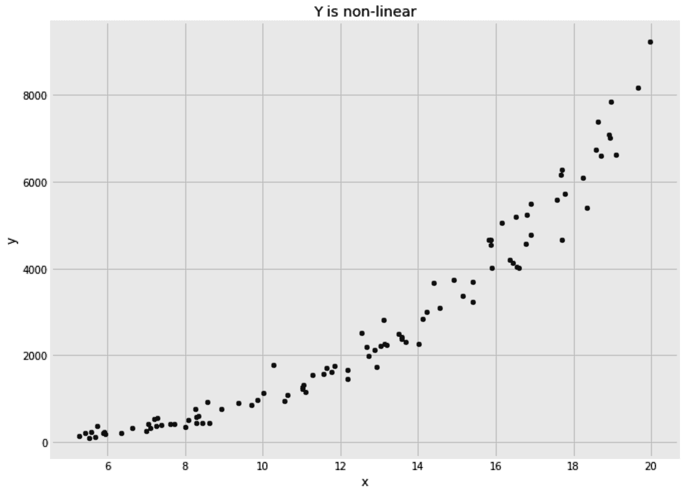
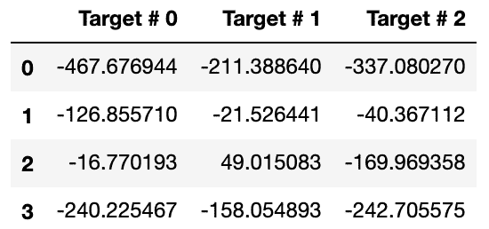
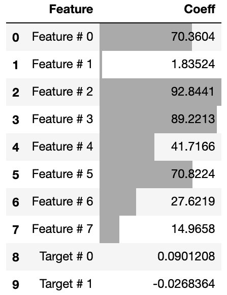
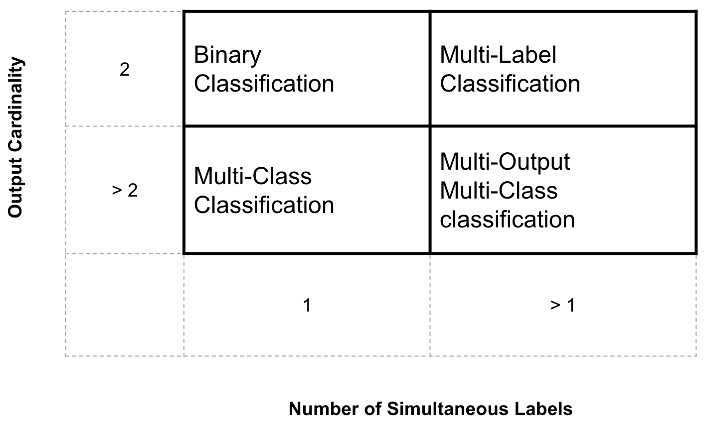
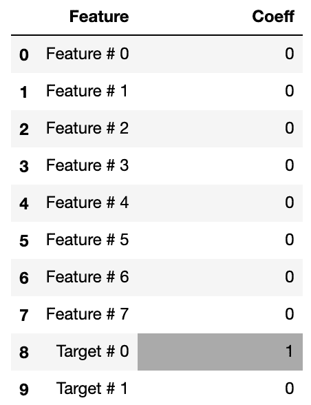
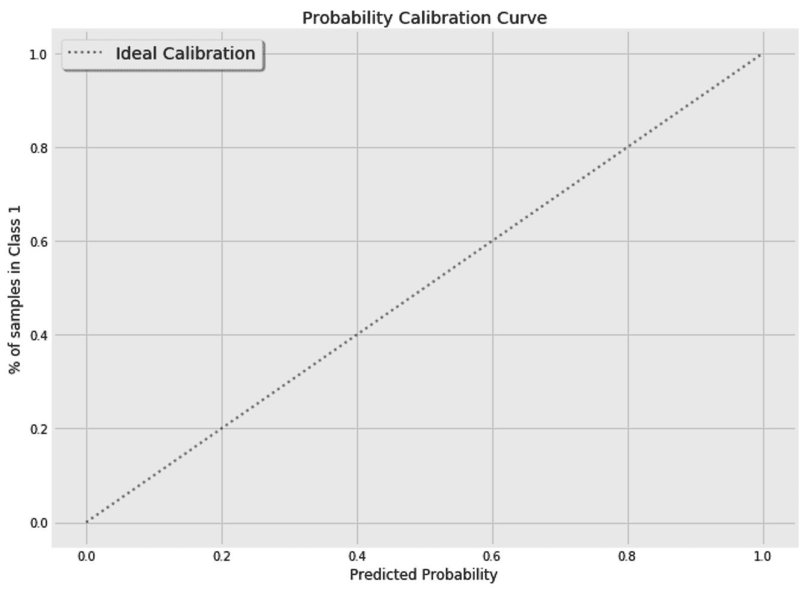
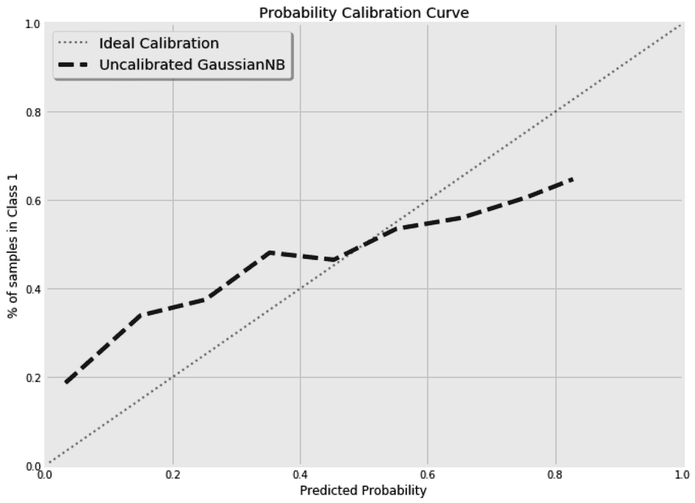
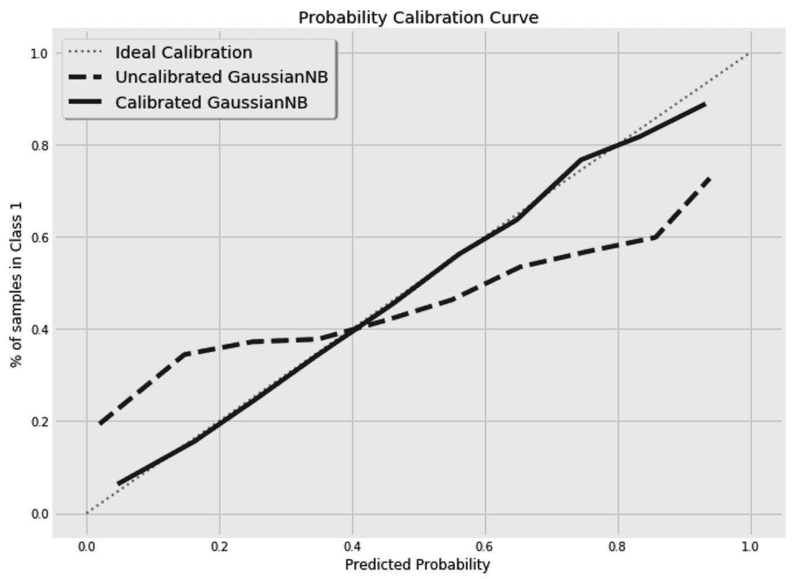

# 第九章：Y 与 X 同样重要

我们给予输入特征很多关注，即我们的`x`。我们使用算法对它们进行缩放、从中选择，并工程化地添加新的特征。尽管如此，我们也应当同样关注目标变量，即`y`。有时，缩放你的目标可以帮助你使用更简单的模型。而有时候，你可能需要一次预测多个目标。那时，了解你的目标的分布及其相互依赖关系是至关重要的。在本章中，我们将重点讨论目标以及如何处理它们。

在本章中，我们将涵盖以下主题：

+   缩放你的回归目标

+   估计多个回归目标

+   处理复合分类目标

+   校准分类器的概率

+   计算 K 的精确度

# 缩放你的回归目标

在回归问题中，有时对目标进行缩放可以节省时间，并允许我们为当前问题使用更简单的模型。在本节中，我们将看到如何通过改变目标的尺度来简化估计器的工作。

在以下示例中，目标与输入之间的关系是非线性的。因此，线性模型不能提供最佳结果。我们可以使用非线性算法、转换特征或转换目标。在这三种选择中，转换目标有时可能是最简单的。请注意，我们这里只有一个特征，但在处理多个特征时，首先考虑转换目标是有意义的。

以下图表显示了单一特征`x`与因变量`y`之间的关系：



在你我之间，以下代码用于生成数据，但为了学习的目的，我们可以假装目前不知道`y`和`x`之间的关系：

```py
x = np.random.uniform(low=5, high=20, size=100)
e = np.random.normal(loc=0, scale=0.5, size=100)
y = (x + e) ** 3
```

一维输入（`x`）在*5*和*20*之间均匀分布。`y`与`x`之间的关系是立方的，并且向`x`添加了少量正态分布的噪声。

在拆分数据之前，我们需要将*x*从向量转换为矩阵，如下所示：

```py
from sklearn.model_selection import train_test_split
x = x.reshape((x.shape[0],1))
x_train, x_test, y_train, y_test = train_test_split(x, y, test_size=0.25)
```

现在，如果我们将数据拆分为训练集和测试集，并运行岭回归，我们将得到一个**平均绝对误差**（**MAE**）为`559`。由于数据是随机生成的，你的结果可能有所不同。我们能做得更好吗？

请记住，在本章中提到的大多数示例中，你最终得到的结果可能与我的有所不同。我在生成和拆分数据时选择不使用随机状态，因为我的主要目标是解释概念，而不是关注最终的结果和运行代码时的准确度分数。

让我们创建一个简单的变换器，根据给定的 `power` 来转换目标。当 `power` 设置为 `1` 时，不对目标进行任何变换；否则，目标会被提升到给定的幂次。我们的变换器有一个互补的 `inverse_transform()` 方法，将目标重新转换回原始尺度：

```py
class YTransformer:

    def __init__(self, power=1):
        self.power = power

    def fit(self, x, y):
        pass

    def transform(self, x, y):
        return x, np.power(y, self.power)

    def inverse_transform(self, x, y):
        return x, np.power(y, 1/self.power)

    def fit_transform(self, x, y):
        return self.transform(x, y)
```

现在，我们可以尝试不同的幂次设置，并循环遍历不同的变换，直到找到给出最佳结果的变换：

```py
from sklearn.linear_model import Ridge
from sklearn.metrics import mean_absolute_error
from sklearn.metrics import r2_score

for power in [1, 1/2, 1/3, 1/4, 1/5]:

    yt = YTransformer(power)
    _, y_train_t = yt.fit_transform(None, y_train)
    _, y_test_t = yt.transform(None, y_test)

    rgs = Ridge()

    rgs.fit(x_train, y_train_t)
    y_pred_t = rgs.predict(x_test)

    _, y_pred = yt.inverse_transform(None, y_pred_t)

    print(
        'Transformed y^{:.2f}: MAE={:.0f}, R2={:.2f}'.format(
            power,
            mean_absolute_error(y_test, y_pred),
            r2_score(y_test, y_pred),
        )
    )
```

将预测值转换回原始值是至关重要的。否则，计算的误差指标将无法进行比较，因为不同的幂次设置会导致不同的数据尺度。

因此，`inverse_transform()` 方法在预测步骤后使用。在我的随机生成的数据上运行代码得到了以下结果：

```py
Transformed y¹.00: MAE=559, R2=0.89
Transformed y⁰.50: MAE=214, R2=0.98
Transformed y⁰.33: MAE=210, R2=0.97
Transformed y⁰.25: MAE=243, R2=0.96
Transformed y⁰.20: MAE=276, R2=0.95
```

如预期的那样，当使用正确的变换时，最低的误差和最高的 `R²` 被实现，这正是当幂次设置为  时。

对数变换、指数变换和平方根变换是统计学家最常用的变换。当执行预测任务时，特别是在使用线性模型时，使用这些变换是有意义的。

对数变换仅对正值有效。`Log(0)` 是未定义的，对负数取对数会得到虚数值。因此，对数变换通常应用于处理非负目标。为了确保我们不会遇到 `log(0)`，一个技巧是，在转换目标之前，先给所有目标值加 1，然后在将预测结果反向转换后再减去 1。同样，对于平方根变换，我们也需要确保一开始没有负目标值。

与其一次处理一个目标，我们有时可能希望一次预测多个目标。当多个回归任务使用相同特征时，将它们合并为一个模型可以简化代码。如果你的目标是相互依赖的，推荐使用这种方法。在下一部分，我们将看到如何一次性估计多个回归目标。

# 估算多个回归目标

在你的在线业务中，你可能想估算用户在下个月、下个季度和明年的生命周期价值。你可以为这三个单独的估算构建三个不同的回归模型。然而，当这三个估算使用完全相同的特征时，构建一个具有三个输出的回归器会更为实用。在下一部分，我们将看到如何构建一个多输出回归器，然后我们将学习如何使用回归链在这些估算之间注入相互依赖关系。

## 构建一个多输出回归器

一些回归器允许我们一次预测多个目标。例如，岭回归器允许给定二维目标。换句话说，`y`不再是单维数组，而是可以作为矩阵给定，其中每列代表一个不同的目标。对于只允许单一目标的其他回归器，我们可能需要使用多输出回归器元估算器。

为了演示这个元估算器，我将使用`make_regression`辅助函数来创建一个我们可以调整的数据集：

```py
from sklearn.datasets import make_regression

x, y = make_regression(
    n_samples=500, n_features=8, n_informative=8, n_targets=3, noise=30.0
)
```

在这里，我们创建`500`个样本，具有 8 个特征和 3 个目标；即返回的`x`和`y`的形状分别为（`500`，`8`）和（`500`，`3`）。我们还可以为特征和目标指定不同的名称，然后按如下方式将数据拆分为训练集和测试集：

```py
feature_names = [f'Feature # {i}' for i in range(x.shape[1])]
target_names = [f'Target # {i}' for i in range(y.shape[1])]

from sklearn.model_selection import train_test_split
x_train, x_test, y_train, y_test = train_test_split(x, y, test_size=0.25)
```

由于`SGDRegressor`不支持多目标，因此以下代码将抛出一个值错误，抱怨输入的形状不正确：

```py
from sklearn.linear_model import SGDRegressor

rgr = SGDRegressor()
rgr.fit(x_train, y_train)
```

因此，我们必须将`MultiOutputRegressor`包裹在`SGDRegressor`周围才能使其工作：

```py
from sklearn.multioutput import MultiOutputRegressor
from sklearn.linear_model import SGDRegressor

rgr = MultiOutputRegressor(
    estimator=SGDRegressor(), 
    n_jobs=-1
)
rgr.fit(x_train, y_train)
y_pred = rgr.predict(x_test)
```

我们现在可以将预测结果输出到数据框中：

```py
df_pred = pd.DataFrame(y_pred, columns=target_names)
```

同时，检查每个目标的前几次预测。以下是我在这里得到的预测示例。请记住，您可能会得到不同的结果：



我们还可以分别打印每个目标的模型表现：

```py
from sklearn.metrics import mean_absolute_error
from sklearn.metrics import r2_score

for t in range(y_train.shape[1]):
    print(
        'Target # {}: MAE={:.2f}, R2={:.2f}'.format(
            t,
            mean_absolute_error(y_test[t], y_pred[t]),
            r2_score(y_test[t], y_pred[t]),
        )
    )
```

在某些情况下，知道一个目标可能有助于了解其他目标。在前面提到的生命周期价值估算示例中，预测下一个月的结果对季度和年度预测非常有帮助。为了将一个目标的预测作为输入传递给连续的回归器，我们需要使用回归器链元估算器。

## 链接多个回归器

在前一节的数据集中，我们无法确定生成的目标是否相互依赖。现在，假设第二个目标依赖于第一个目标，第三个目标依赖于前两个目标。我们稍后将验证这些假设。为了引入这些相互依赖关系，我们将使用`RegressorChain`并指定假设的依赖关系顺序。`order`列表中的 ID 顺序指定列表中的每个 ID 依赖于前面的 ID。使用正则化回归器是有意义的。正则化是必要的，用于忽略目标之间不存在的任何假定依赖关系。

以下是创建回归器链的代码：

```py
from sklearn.multioutput import RegressorChain
from sklearn.linear_model import Ridge

rgr = RegressorChain(
    base_estimator=Ridge(
        alpha=1
    ), 
    order=[0,1,2],
)
rgr.fit(x_train, y_train)
y_pred = rgr.predict(x_test)
```

测试集的表现几乎与使用`MultiOutputRegressor`时的表现相同。看起来链式方法并没有帮助当前的数据集。我们可以显示每个`Ridge`回归器在训练后的系数。第一个估算器只使用输入特征，而后面的估算器则为输入特征以及之前的目标分配系数。以下是如何显示链中第三个估算器的系数：

```py
pd.DataFrame(
    zip(
        rgr.estimators_[-1].coef_, 
        feature_names + target_names
    ),
    columns=['Coeff', 'Feature']
)[
    ['Feature', 'Coeff']
].style.bar(
    subset=['Coeff'], align='mid', color='#AAAAAA'
)
```

从计算出的系数来看，我们可以看到链中的第三个估算器几乎忽略了前两个目标。由于这些目标是独立的，链中的每个估算器仅使用输入特征。尽管你在运行代码时得到的系数可能有所不同，但由于目标的独立性，分配给前两个目标的系数仍然是微不足道的：



在目标之间存在依赖关系的情况下，我们期望目标会分配更大的系数。在实际应用中，我们可能会尝试不同的`order`超参数组合，直到找到最佳性能为止。

与回归问题一样，分类器也可以处理多个目标。然而，单个目标可以是二元的，或者具有两个以上的值。这为分类问题增添了更多细节。在下一部分，我们将学习如何构建分类器来满足复合目标的需求。

# 处理复合分类目标

与回归器类似，分类器也可以有多个目标。此外，由于目标是离散的，单个目标可以具有两个或更多的值。为了区分不同的情况，机器学习实践者提出了以下术语：

+   多类

+   多标签（和多输出）

以下矩阵总结了上述术语。我将通过一个示例进一步说明，并在本章后续内容中也会详细阐述多标签和多输出术语之间的细微区别：



想象一个场景，你需要根据图片中是否包含猫来进行分类。在这种情况下，需要一个二元分类器，也就是说，目标值要么是零，要么是一个。当问题涉及判断图片中是否有猫、狗或人类时，目标的种类数就超出了二个，此时问题就被表述为多类分类问题。

图片中也可能包含多个对象。一个图片可能只包含一只猫，而另一个图片则同时包含人类和猫。在多标签设置中，我们将构建一组二元分类器：一个用于判断图片中是否有猫，另一个用于判断是否有狗，再有一个用于判断是否有人类。为了在不同目标之间注入相互依赖关系，你可能希望一次性预测所有同时出现的标签。在这种情况下，通常会使用“多输出”这一术语。

此外，你可以使用一组二分类器来解决多类问题。与其判断图片里是否有猫、狗或人类，不如设置一个分类器判断是否有猫，一个分类器判断是否有狗，另一个判断是否有人类。这对于模型的可解释性很有用，因为每个分类器的系数可以映射到单一类别。在接下来的章节中，我们将使用*一对多*策略将多类问题转换为一组二分类问题。

## 将多类问题转换为一组二分类器

我们不必局限于多类问题。我们可以简单地将手头的多类问题转换为一组二分类问题。

在这里，我们构建了一个包含 5000 个样本、15 个特征和 1 个标签（具有 4 个可能值）的数据集：

```py
from sklearn.datasets import make_classification

x, y = make_classification(
    n_samples=5000, n_features=15, n_informative=8, n_redundant=2, 
    n_classes=4, class_sep=0.5, 
)
```

在通常的方式划分数据后，并保留 25%用于测试，我们可以在`LogisticRegression`之上应用*一对多*策略。顾名思义，它是一个元估计器，构建多个分类器来判断每个样本是否属于某个类别，最终将所有的决策结合起来：

```py
from sklearn.linear_model import LogisticRegression
from sklearn.multiclass import OneVsRestClassifier
from sklearn.metrics import accuracy_score

clf = OneVsRestClassifier(
    estimator=LogisticRegression(solver='saga')
)
clf.fit(x_train, y_train)
y_pred = clf.predict(x_test)
```

我使用了 saga 求解器，因为它对较大数据集收敛更快。*一对多*策略给我带来了`0.43`的准确率。我们可以通过`estimators`方法访问元估计器使用的底层二分类器，然后可以揭示每个底层二分类器为每个特征学习的系数。**

**另一种策略是*一对一*。它为每一对类别构建独立的分类器，使用方法如下：

```py
from sklearn.linear_model import LogisticRegression
from sklearn.multiclass import OneVsOneClassifier

clf = OneVsOneClassifier(
    estimator=LogisticRegression(solver='saga')
)
clf.fit(x_train, y_train)
y_pred = clf.predict(x_test)

accuracy_score(y_test, y_pred)
```

*一对一*策略给我带来了`0.44`的可比准确率。我们可以看到，当处理大量类别时，之前的两种策略可能无法很好地扩展。`OutputCodeClassifier`是一种更具可扩展性的解决方案。通过将其`code_size`超参数设置为小于 1 的值，它可以将标签编码为更密集的表示。较低的`code_size`将提高其计算性能，但会以牺牲准确性和可解释性为代价。**

**通常，*一对多*是最常用的策略，如果你的目标是为每个类别分离系数，它是一个很好的起点。

为了确保所有类别的返回概率加起来为 1，*一对多*策略通过将概率除以其总和来规范化这些概率。另一种概率规范化的方法是`Softmax()`函数。它将每个概率的指数除以所有概率指数的总和。`Softmax()`函数也用于多项式逻辑回归，而不是`Logistic()`函数，使其作为多类分类器运作，而无需使用*一对多*或*一对一*策略。

## 估计多个分类目标

与 `MultiOutputRegressor` 一样，`MultiOutputClassifier` 是一个元估算器，允许底层估算器处理多个输出。

让我们创建一个新的数据集，看看如何使用 `MultiOutputClassifier`：

```py
from sklearn.datasets import make_multilabel_classification

x, y = make_multilabel_classification(
    n_samples=500, n_features=8, n_classes=3, n_labels=2
)
```

这里首先需要注意的是，`n_classes` 和 `n_labels` 这两个术语在 `make_multilabel_classification` 辅助函数中具有误导性。前面的设置创建了 500 个样本，包含 3 个二元目标。我们可以通过打印返回的 `x` 和 `y` 的形状，以及 `y` 的基数来确认这一点：

```py
x.shape, y.shape # ((500, 8), (500, 3))
np.unique(y) # array([0, 1])
```

然后，我们强制第三个标签完全依赖于第一个标签。我们稍后会利用这个事实：

```py
y[:,-1] = y[:,0]    
```

在像往常一样划分数据集，并将 25% 用于测试之后，我们会注意到 `GradientBoostingClassifier` 无法处理我们所拥有的三个目标。一些分类器能够在没有外部帮助的情况下处理多个目标。然而，`MultiOutputClassifier` 估算器是我们这次决定使用的分类器所必需的：

```py
from sklearn.multioutput import MultiOutputClassifier
from sklearn.ensemble import GradientBoostingClassifier

clf = MultiOutputClassifier(
    estimator=GradientBoostingClassifier(
        n_estimators=500,
        learning_rate=0.01,
        subsample=0.8,
    ),
    n_jobs=-1
)
clf.fit(x_train, y_train)
y_pred_multioutput = clf.predict(x_test)
```

我们已经知道，第一个和第三个目标是相关的。因此，`ClassifierChain` 可能是一个很好的替代选择，可以尝试代替 `MultiOutputClassifier` 估算器。然后，我们可以使用它的 `order` 超参数来指定目标的依赖关系，如下所示：

```py
from sklearn.multioutput import ClassifierChain
from sklearn.ensemble import GradientBoostingClassifier

clf = ClassifierChain(
    base_estimator=GradientBoostingClassifier(
        n_estimators=500,
        learning_rate=0.01,
        subsample=0.8,
    ),
    order=[0,1,2]
)
clf.fit(x_train, y_train)
y_pred_chain = clf.predict(x_test)
```

现在，如果我们像之前对 `RegressorChain` 所做的那样，显示第三个估算器的系数，我们可以看到它只是复制了对第一个目标所做的预测，并直接使用这些预测。因此，除了分配给第一个目标的系数外，所有系数都被设置为零，如下所示：



如你所见，每当我们希望使用的估算器不支持多个目标时，我们都能得到覆盖。我们还可以告诉我们的估算器在预测下一个目标时应使用哪些目标。

在许多现实生活中的场景中，我们更关心分类器预测的概率，而不是它的二元决策。一个良好校准的分类器会产生可靠的概率，这在风险计算中至关重要，并有助于实现更高的精度。

在接下来的部分中，我们将看到如何校准我们的分类器，特别是当它们的估计概率默认情况下不可靠时。

# 校准分类器的概率

“每个企业和每个产品都有风险。你无法回避它。”

– 李·艾科卡

假设我们想要预测某人是否会感染病毒性疾病。然后我们可以构建一个分类器来预测他们是否会感染该病毒。然而，当可能感染的人群比例过低时，分类器的二分类预测可能不够精确。因此，在这种不确定性和有限资源的情况下，我们可能只想将那些感染概率超过 90%的人隔离起来。分类器的预测概率听起来是一个很好的估算来源。然而，只有当我们预测为某一类别且其概率超过 90%的样本中，90%（9 个中有 9 个）最终确实属于该类别时，这个概率才能被认为是可靠的。同样，对于 80%以上的概率，最终 80%的样本也应该属于该类别。换句话说，对于一个完美校准的模型，我们在绘制目标类别样本百分比与分类器预测概率之间的关系时，应该得到一条 45°的直线：



一些模型通常已经经过良好的校准，例如逻辑回归分类器。另一些模型则需要我们在使用之前对其概率进行校准。为了演示这一点，我们将创建一个以下的二分类数据集，包含 50,000 个样本和`15`个特征。我使用了较低的`class_sep`值，以确保这两个类别不容易分开：

```py
from sklearn.datasets import make_classification
from sklearn.model_selection import train_test_split

x, y = make_classification(
    n_samples=50000, n_features=15, n_informative=5, n_redundant=10, 
    n_classes=2, class_sep=0.001
)

x_train, x_test, y_train, y_test = train_test_split(x, y, test_size=0.25)
```

然后我训练了一个高斯朴素贝叶斯分类器，并存储了正类的预测概率。由于其天真的假设，朴素贝叶斯分类器通常会返回不可靠的概率，正如我们在第六章《使用朴素贝叶斯分类文本》中讨论的那样。由于我们处理的是连续特征，因此这里使用`GaussianNB`分类器：

```py
from sklearn.naive_bayes import GaussianNB

clf = GaussianNB()
clf.fit(x_train, y_train)
y_pred_proba = clf.predict_proba(x_test)[:,-1]
```

Scikit-learn 提供了绘制分类器校准曲线的工具。它将估计的概率划分为多个区间，并计算每个区间中属于正类的样本比例。在以下代码片段中，我们将区间数设置为`10`，并使用计算出的概率来创建校准曲线：

```py
from sklearn.calibration import calibration_curve

fraction_of_positives, mean_predicted_value = calibration_curve(
    y_test, y_pred_proba, n_bins=10
)

fig, ax = plt.subplots(1, 1, figsize=(10, 8))

ax.plot(
    mean_predicted_value, fraction_of_positives, "--", 
    label='Uncalibrated GaussianNB', color='k'
)

fig.show()
```

我为了简洁起见，省略了负责图形格式化的代码部分。运行代码后，我得到了以下的曲线：



如你所见，模型远未经过校准。因此，我们可以使用`CalibratedClassifierCV`来调整其概率：

```py
from sklearn.calibration import CalibratedClassifierCV
from sklearn.naive_bayes import GaussianNB

clf_calib = CalibratedClassifierCV(GaussianNB(), cv=3, method='isotonic')
clf_calib.fit(x_train, y_train)
y_pred_calib = clf_calib.predict(x_test)
y_pred_proba_calib = clf_calib.predict_proba(x_test)[:,-1]
```

在下图中，我们可以看到`CalibratedClassifierCV`对模型的影响，其中新的概率估算更加可靠：**

**

`CalibratedClassifierCV`使用两种校准方法：**`sigmoid()`和`isotonic()`方法。推荐在小数据集上使用`sigmoid()`方法，因为`isotonic()`方法容易过拟合。此外，校准应在与模型拟合时使用的不同数据上进行。`CalibratedClassifierCV`允许我们进行交叉验证，将用于拟合基础估计器的数据与用于校准的数据分开。在之前的代码中使用了三折交叉验证。**

**如果线性回归旨在最小化平方误差，并假设目标*y*与特征*x*之间的关系为由*y = f(x)*表示的线性方程，那么等距回归则有不同的假设，旨在最小化平方误差。它假设*f(x)*是一个非线性但单调的函数。换句话说，它随着*x*的增大要么持续增加，要么持续减少。等距回归的这种单调性特征**使其适用于概率校准。**

**除了校准图，**Brier 得分**是检查模型是否校准的好方法。它基本上计算了预测概率与实际目标之间的**均方误差（MSE）**。因此，较低的 Brier 得分反映出更可靠的概率。**

在下一节中，我们将学习如何使用分类器对预测结果进行排序，然后如何评估这个排序。

# 计算 k 时的精度

在上一节中关于病毒感染的示例中，您的隔离能力可能仅限于例如 500 名患者。在这种情况下，您会希望根据预测概率，尽可能多的阳性病例出现在前 500 名患者中。换句话说，我们不太关心模型的整体精度，因为我们只关心它在前`k`样本中的精度。

我们可以使用以下代码计算前`k`样本的精度：

```py
def precision_at_k_score(y_true, y_pred_proba, k=1000, pos_label=1):
    topk = [
        y_true_ == pos_label 
        for y_true_, y_pred_proba_ 
        in sorted(
            zip(y_true, y_pred_proba), 
            key=lambda y: y[1], 
            reverse=True
        )[:k]
    ]
    return sum(topk) / len(topk)
```

如果您不太喜欢函数式编程范式，那么让我详细解释一下代码。`zip()`方法将两个列表合并，并返回一个元组列表。列表中的第一个元组将包含`y_true`的第一个项以及`y_pred_proba`的第一个项。第二个元组将包含它们的第二个项，以此类推。然后，我根据元组的第二个元素，即`y_pred_proba`，对元组列表按降序进行排序（`reverse=True`）。接着，我取排序后的前`k`个元组，并将它们的`y_true`部分与`pos_label`参数进行比较。`pos_label`参数允许我决定基于哪个标签进行精度计算。最后，我计算了在`topk`中实际属于`pos_label`类的元素所占的比例。

现在，我们可以计算未校准的`GaussianNB`分类器在前 500 个预测中的精度：

```py
precision_at_k_score(y_test, y_pred_proba, k=500)
```

这为我们提供了前`500`个样本的`82%`精度，相比之下，所有正类样本的总体精度为`62%`。再次提醒，你的结果可能与我的不同。

`k` 精度指标是处理不平衡数据或难以分离的类别时非常有用的工具，尤其是当你只关心模型在前几个预测中的准确度时。它允许你调整模型，以捕捉最重要的样本。我敢打赌，谷歌比起你在第 80 页看到的搜索结果，更关心你在第一页看到的结果。而如果我只有足够的钱购买 20 只股票，我希望模型能正确预测前 20 只股票的走势，对于第 100 只股票的准确性我倒不太关心。

# 总结

在处理分类或回归问题时，我们通常会首先考虑我们应该在模型中包含哪些特征。然而，解决方案的关键往往在于目标值。正如我们在本章所看到的，重新缩放我们的回归目标可以帮助我们使用更简单的模型。此外，校准我们分类器给出的概率可以迅速提高我们的准确度，并帮助我们量化不确定性。我们还学会了通过编写一个单一的估计器来同时预测多个输出，从而处理多个目标。这有助于简化我们的代码，并使得估计器可以利用从一个标签中学到的知识来预测其他标签。

在现实生活中的分类问题中，类别不平衡是常见的。当检测欺诈事件时，你的数据中大多数通常是非欺诈案例。同样，对于诸如谁会点击你的广告，谁会订阅你的新闻通讯等问题，通常是少数类对你来说更为重要。

在下一章，我们将看到如何通过修改训练数据来让分类器更容易处理不平衡的数据集。**********
