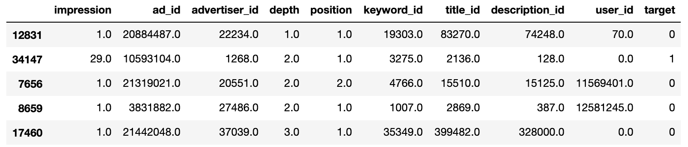
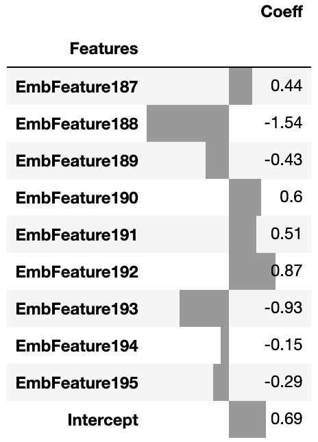
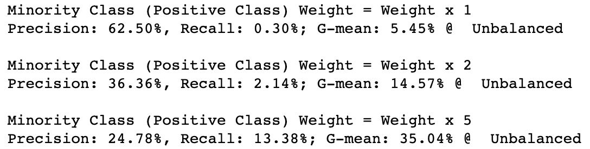
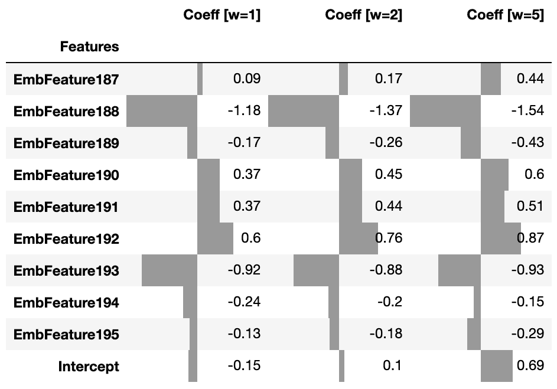
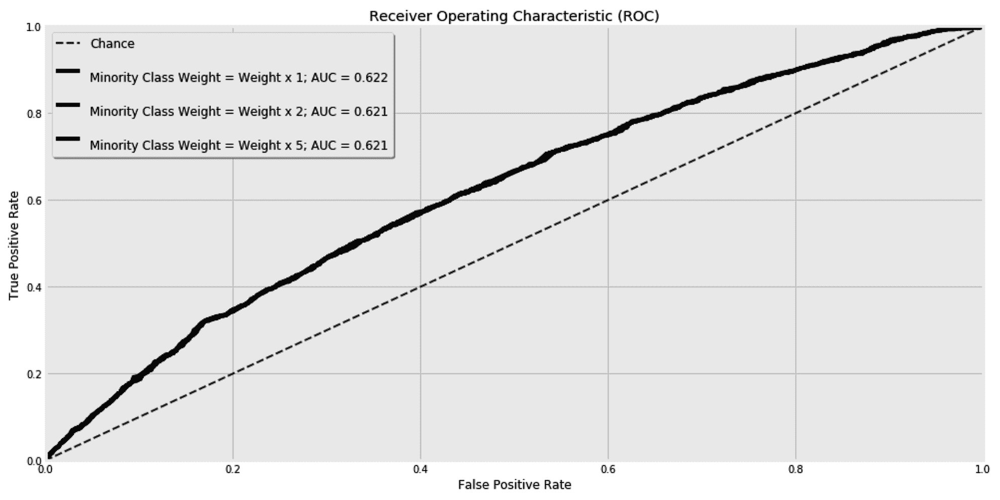
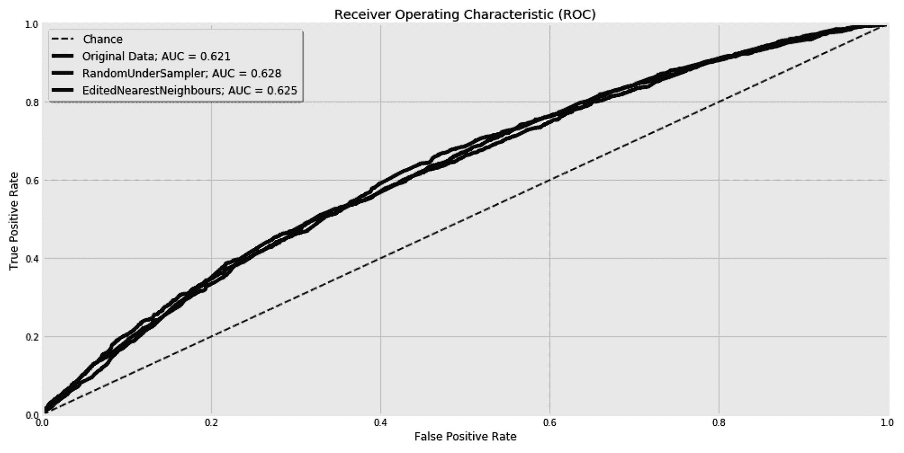
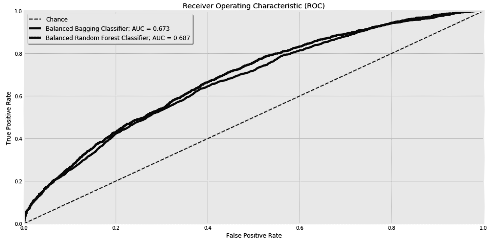
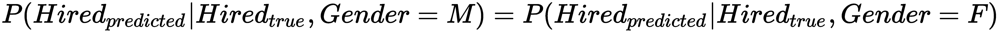
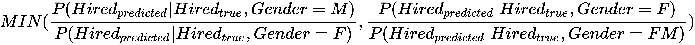

# 第十章：不平衡学习 - 连 1% 的人都未能中彩票

在你的类别平衡的情况下，更多的是例外而不是规则。在我们将遇到的大多数有趣的问题中，类别极不平衡。幸运的是，网络支付的一小部分是欺诈的，就像人口中少数人感染罕见疾病一样。相反，少数竞争者中彩票，你的熟人中少数成为你的密友。这就是为什么我们通常对捕捉这些罕见案例感兴趣的原因。

在本章中，我们将学习如何处理不平衡的类别。我们将从给训练样本分配不同权重开始，以减轻类别不平衡问题。此后，我们将学习其他技术，如欠采样和过采样。我们将看到这些技术在实践中的效果。我们还将学习如何将集成学习与重采样等概念结合起来，并引入新的评分来验证我们的学习器是否符合我们的需求。

本章将涵盖以下主题：

+   重新加权训练样本

+   随机过采样

+   随机欠采样

+   将采样与集成结合使用

+   平等机会分数

让我们开始吧！

# 获取点击预测数据集

通常，看到广告并点击的人只占很小一部分。换句话说，在这种情况下，正类样本的百分比可能只有 1%甚至更少。这使得预测**点击率**（**CTR**）变得困难，因为训练数据极度不平衡。在本节中，我们将使用来自**知识发现数据库**（**KDD**）杯赛的高度不平衡数据集。

KDD 杯是由 ACM 知识发现与数据挖掘特别兴趣小组每年组织的比赛。2012 年，他们发布了一个数据集，用于预测搜索引擎中显示的广告是否会被用户点击。经修改后的数据已发布在 OpenML 平台上（[`www.openml.org/d/1220`](https://www.openml.org/d/1220)）。修改后数据集的 CTR 为 16.8%。这是我们的正类。我们也可以称之为少数类，因为大多数情况下广告未被点击。

在这里，我们将下载数据并将其放入 DataFrame 中，如下所示：

```py
from sklearn.datasets import fetch_openml
data = fetch_openml(data_id=1220)

df = pd.DataFrame(
    data['data'],
    columns=data['feature_names']
).astype(float)

df['target'] = pd.Series(data['target']).astype(int) 
```

我们可以使用以下代码显示数据集的`5`个随机行：

```py
df.sample(n=5, random_state=42)
```

如果我们将`random_state`设为相同的值，我们可以确保得到相同的随机行。在《银河系漫游指南》中，道格拉斯·亚当斯认为数字`42`是生命、宇宙和一切的终极问题的答案。因此，我们将在本章节中始终将`random_state`设为`42`。这是我们的五行样本：



关于这些数据，我们需要记住两件事：

+   如前所述，类别不平衡。你可以通过运行`df['target'].mean()`来检查这一点，这将返回`16.8%`。

+   尽管所有特征都是数值型的，但显然，所有以`id`后缀结尾的特征应该作为分类特征来处理。例如，`ad_id`与 CTR 之间的关系并不预期是线性的，因此在使用线性模型时，我们可能需要使用*one-hot 编码器*对这些特征进行编码。然而，由于这些特征具有高基数，one-hot 编码策略会导致产生过多的特征，使我们的分类器难以处理。因此，我们需要想出另一种可扩展的解决方案。现在，让我们学习如何检查每个特征的基数：

```py
for feature in data['feature_names']:
    print(
       'Cardinality of {}: {:,}'.format(
            feature, df[feature].value_counts().shape[0]
        )
    )
```

这将给我们以下结果：

```py
Cardinality of impression: 99
Cardinality of ad_id: 19,228
Cardinality of advertiser_id: 6,064
Cardinality of depth: 3
Cardinality of position: 3
Cardinality of keyword_id: 19,803
Cardinality of title_id: 25,321
Cardinality of description_id: 22,381
Cardinality of user_id: 30,114
```

最后，我们将把数据转换成`x_train`、`x_test`、`y_train`和`y_test`数据集，如下所示：

```py
from sklearn.model_selection import train_test_split
x, y = df[data['feature_names']], df['target']
x_train, x_test, y_train, y_test = train_test_split(
    x, y, test_size=0.25, random_state=42
)
```

在本节中，我们下载了必要的数据并将其添加到 DataFrame 中。在下一节中，我们将安装`imbalanced-learn`库。

# 安装 imbalanced-learn 库

由于类别不平衡，我们需要重新采样训练数据或应用不同的技术以获得更好的分类结果。因此，我们将在这里依赖`imbalanced-learn`库。该项目由*Fernando Nogueira*于 2014 年启动，现提供多种重采样数据技术，以及用于评估不平衡分类问题的度量标准。该库的接口与 scikit-learn 兼容。

你可以通过在终端中运行以下命令来使用`pip`下载该库：

```py
          pip install -U imbalanced-learn

```

现在，你可以在代码中导入并使用它的不同模块，正如我们在接下来的章节中所看到的。该库提供的度量标准之一是**几何均值分数**。在[第八章](https://cdp.packtpub.com/hands_on_machine_learning_with_scikit_learn/wp-admin/post.php?post=30&action=edit)*，集成方法 – 当一个模型不足够时*，我们了解了**真正例率**（**TPR**），即灵敏度，以及**假正例率**（**FPR**），并用它们绘制了曲线下面积。我们还学习了**真负例率**（**TNR**），即特异度，它基本上是 1 减去 FPR。几何均值分数，对于二分类问题来说，是灵敏度（TPR）和特异度（TNR）乘积的平方根。通过结合这两个度量标准，我们试图在考虑类别不平衡的情况下，最大化每个类别的准确性。`geometric_mean_score`的接口与其他 scikit-learn 度量标准类似。它接受真实值和预测值，并返回计算出的分数，如下所示：****

****```py
from imblearn.metrics import geometric_mean_score
geometric_mean_score(y_true, y_pred)
```

在本章中，我们将使用这个度量标准，除了精确度和召回率分数外。

在下一节中，我们将调整训练样本的权重，看看这是否有助于处理类别不平衡问题。

# 预测 CTR

我们已经准备好了数据并安装了`imbalanced-learn`库。现在，我们可以开始构建我们的分类器了。正如我们之前提到的，由于类别特征的高基数，传统的独热编码技术并不适合大规模应用。在[第八章](https://cdp.packtpub.com/hands_on_machine_learning_with_scikit_learn/wp-admin/post.php?post=30&action=edit)，《集成方法——当一个模型不足以应对时》，我们简要介绍了**随机树嵌入**作为一种特征转换技术。它是完全随机树的集成，每个数据样本将根据它落在每棵树的叶子节点来表示。这里，我们将构建一个管道，将数据转换为随机树嵌入并进行缩放。最后，使用**逻辑回归**分类器来预测是否发生了点击：

```py
from sklearn.preprocessing import MaxAbsScaler
from sklearn.linear_model import LogisticRegression
from sklearn.ensemble import RandomTreesEmbedding
from sklearn.pipeline import Pipeline
from sklearn.metrics import precision_score, recall_score
from imblearn.metrics import geometric_mean_score

def predict_and_evalutate(x_train, y_train, x_test, y_test, sample_weight=None, title='Unweighted'):

    clf = Pipeline(
        [
            ('Embedder', RandomTreesEmbedding(n_estimators=10, max_leaf_nodes=20, random_state=42)), 
            ('Scaler', MaxAbsScaler()),
            ('Classifier', LogisticRegression(solver='saga', max_iter=1000, random_state=42))
        ]
    )
    clf.fit(x_train, y_train, Classifier__sample_weight=sample_weight)
    y_test_pred = clf.predict(x_test)

    print(
        'Precision: {:.02%}, Recall: {:.02%}; G-mean: {:.02%} @ {}'.format(
            precision_score(y_test, y_test_pred),
            recall_score(y_test, y_test_pred),
            geometric_mean_score(y_test, y_test_pred),
            title
        )
    )

    return clf
```

我们将整个过程封装到一个函数中，这样我们就可以在本章后面重复使用它。`predict_and_evalutate()`函数接受 x 和 y，以及样本权重。我们稍后会使用样本权重，但现在可以忽略它们。一旦预测完成，函数还会打印不同的得分，并返回使用的管道实例。

我们可以像下面这样使用我们刚刚创建的函数：

```py
clf = predict_and_evalutate(x_train, y_train, x_test, y_test) 
```

默认情况下，计算出的精确度和召回率是针对正类的。前面的代码给出了`0.3%`的召回率，`62.5%`的精确度，以及`5.45%`的几何均值得分。召回率低于`1%`，这意味着分类器将无法捕捉到绝大多数正类/少数类样本。这是处理不平衡数据时常见的情况。解决方法之一是为少数类样本分配更多的权重。这就像是要求分类器更加关注这些样本，因为我们关心的是捕捉到它们，尽管它们相对稀少。在下一节中，我们将看到样本加权对分类器的影响。

## 对训练样本进行不同的加权

多数类样本的数量大约是少数类样本的五倍。你可以通过运行以下代码来验证这一点：

```py
(1 - y_train.mean()) / y_train.mean() 
```

因此，将少数类样本的权重设置为其他样本的五倍是有意义的。我们可以使用前一节中的`predict_and_evalutate()`函数，并调整样本权重，具体如下：

```py
sample_weight = (1 * (y_train == 0)) + (5 * (y_train == 1))
clf = predict_and_evalutate(
    x_train, y_train, x_test, y_test, 
    sample_weight=sample_weight
)
```

现在，召回率跳升到`13.4%`，但精确度下降至`24.8%`。几何均值得分从`5.5%`降至`34%`，这得益于新的权重设置。

`predict_and_evalutate()`函数返回使用的管道实例。我们可以通过`clf[-1]`获取管道的最后一个组件，即逻辑回归分类器。然后，我们可以访问分配给每个特征的分类器系数。在嵌入步骤中，我们可能最终会得到多达 200 个特征；10 个估算器×最多 20 个叶节点。以下函数打印出最后九个特征及其系数以及截距：

```py
def calculate_feature_coeff(clf):
    return pd.DataFrame(
        {
            'Features': [
                f'EmbFeature{e}' 
                for e in range(len(clf[-1].coef_[0]))
            ] + ['Intercept'],
            'Coeff': list(
                clf[-1].coef_[0]
            ) + [clf[-1].intercept_[0]]
        }

    ).set_index('Features').tail(10)
```

`calculate_feature_coeff(clf).round(2)`的输出也可以四舍五入到两位小数，如下所示：



现在，让我们并排比较三种加权策略。权重为 1 时，少数类和多数类的权重相同。然后，我们将少数类的权重设置为多数类的两倍，再设置为五倍，如下所示：

```py
df_coef_list = []
weight_options = [1, 2, 5]

for w in weight_options:

    print(f'\nMinority Class (Positive Class) Weight = Weight x {w}')
    sample_weight = (1 * (y_train == 0)) + (w * (y_train == 1))
    clf = predict_and_evalutate(
        x_train, y_train, x_test, y_test, 
        sample_weight=sample_weight
    )
    df_coef = calculate_feature_coeff(clf)
    df_coef = df_coef.rename(columns={'Coeff': f'Coeff [w={w}]'})
    df_coef_list.append(df_coef)
```

这给我们带来了以下结果：



很容易看到加权如何影响精度和召回率。就好像其中一个总是在牺牲另一个的情况下改进。这种行为是由于移动了分类器的边界。如我们所知，类别边界是由不同特征的系数以及截距定义的。我敢打赌你很想看到这三种先前模型的系数并排显示。幸运的是，我们已经将系数保存在`df_coef_list`中，以便我们可以使用以下代码片段显示它们：

```py
pd.concat(df_coef_list, axis=1).round(2).style.bar(
    subset=[f'Coeff [w={w}]' for w in weight_options], 
    color='#999',
    align='zero'
)
```

这给我们带来了三种分类器之间的以下视觉比较：



特征的系数确实发生了轻微变化，但截距的变化更为显著。总之，加权最影响截距，并因此移动了类别边界。

如果预测的概率超过`50%`，则将样本分类为正类成员。截距的变化（在其他系数不变的情况下）相当于改变概率阈值，使其高于或低于`50%`。如果加权只影响截距，我们可能会建议尝试不同的概率阈值，直到获得期望的精度-召回平衡。为了检查加权是否提供了超出仅改变截距的额外好处，我们必须检查**接收者操作特征**（**ROC**）曲线下面积。

### 加权对 ROC 的影响

加权是否改善了 ROC 曲线下面积？为了回答这个问题，让我们从创建一个显示 ROC 曲线并打印**曲线下面积**（**AUC**）的函数开始：

```py
from sklearn.metrics import roc_curve, auc

def plot_roc_curve(y, y_proba, ax, label):
    fpr, tpr, thr = roc_curve(y, y_proba)
    auc_value = auc(fpr, tpr)
    pd.DataFrame(
        {
            'FPR': fpr,
            'TPR': tpr
        }
    ).set_index('FPR')['TPR'].plot(
        label=label + f'; AUC = {auc_value:.3f}',
        kind='line',
        xlim=(0,1),
        ylim=(0,1),
        color='k',
        ax=ax
    )
    return (fpr, tpr, auc_value)
```

现在，我们可以循环遍历三种加权选项，并渲染它们相应的曲线，如下所示：

```py
from sklearn.metrics import roc_curve, auc

fig, ax = plt.subplots(1, 1, figsize=(15, 8), sharey=False)

ax.plot(
    [0, 1], [0, 1], 
    linestyle='--', 
    lw=2, color='k',
    label='Chance', alpha=.8
)

for w in weight_options:

    sample_weight = (1 * (y_train == 0)) + (w * (y_train == 1))

    clf = Pipeline(
        [
            ('Embedder', RandomTreesEmbedding(n_estimators=20, max_leaf_nodes=20, random_state=42)), 
            ('Scaler', MaxAbsScaler()),
            ('Classifier', LogisticRegression(solver='lbfgs', max_iter=2000, random_state=42))
        ]
    )
    clf.fit(x_train, y_train, Classifier__sample_weight=sample_weight)
    y_test_pred_proba = clf.predict_proba(x_test)[:,1]

    plot_roc_curve(
        y_test, y_test_pred_proba, 
        label=f'\nMinority Class Weight = Weight x {w}',
        ax=ax
    ) 

ax.set_title('Receiver Operating Characteristic (ROC)')
ax.set_xlabel('False Positive Rate')
ax.set_ylabel('True Positive Rate')

ax.legend(ncol=1, fontsize='large', shadow=True)

fig.show() 
```

这三条曲线在这里展示：



ROC 曲线旨在显示不同概率阈值下的真正率（TPR）与假正率（FPR）之间的权衡。如果 ROC 曲线下的面积对于三种加权策略大致相同，那么加权除了改变分类器的截距外，并没有提供太多价值。因此，是否要以牺牲精度为代价来提高召回率，就取决于我们是否想重新加权训练样本，或者尝试不同的分类决策概率阈值。

除了样本加权之外，我们还可以重新采样训练数据，以便在一个更加平衡的数据集上进行训练。在下一节中，我们将看到`imbalanced-learn`库提供的不同采样技术。

# 训练数据的采样

"这不是否认。我只是对我接受的现实有选择性。"

- 比尔·沃特森

如果机器学习模型是人类，它们可能会认为目的证明手段是合理的。当 99%的训练数据属于同一类时，它们的目标是优化目标函数。如果它们专注于正确处理那一类，也不能怪它们，因为它为解决方案贡献了 99%的数据。在上一节中，我们通过给少数类或多类更多的权重来尝试改变这种行为。另一种策略可能是从多数类中移除一些样本，或向少数类中添加新样本，直到两个类达到平衡。

## 对多数类进行下采样

"真理，就像黄金，不是通过它的增长得到的，而是通过洗净其中所有非黄金的部分来获得的。"

- 列夫·托尔斯泰

我们可以随机移除多数类的样本，直到它与少数类的大小相同。在处理非二分类任务时，我们可以从所有类别中移除样本，直到它们都变成与少数类相同的大小。这个技术被称为**随机下采样**。以下代码展示了如何使用`RandomUnderSampler()`来对多数类进行下采样：

```py
from imblearn.under_sampling import RandomUnderSampler

rus = RandomUnderSampler()
x_train_resampled, y_train_resampled = rus.fit_resample(x_train, y_train)
```

与其保持类别平衡，你可以通过设置`sampling_strategy`超参数来减少类别的不平衡。其值决定了少数类与多数类的最终比例。在下面的示例中，我们保持了多数类的最终大小，使其是少数类的两倍：

```py
from imblearn.under_sampling import RandomUnderSampler

rus = RandomUnderSampler(sampling_strategy=0.5)
x_train_resampled, y_train_resampled = rus.fit_resample(x_train, y_train)
```

下采样过程不一定是随机的。例如，我们可以使用最近邻算法来移除那些与邻居不一致的样本。`EditedNearestNeighbours`模块允许你通过其`n_neighbors`超参数来设置检查邻居的数量，代码如下：

```py
from imblearn.under_sampling import EditedNearestNeighbours

enn = EditedNearestNeighbours(n_neighbors=5)
x_train_resampled, y_train_resampled = enn.fit_resample(x_train, y_train)
```

之前的技术属于**原型选择**。在这种情况下，我们从已经存在的样本中选择样本。与原型选择不同，**原型生成**方法生成新的样本来概括现有样本。*ClusterCentroids*算法将多数类样本放入聚类中，并使用聚类中心代替原始样本。有关聚类和聚类中心的更多内容，将在[第十一章](https://cdp.packtpub.com/hands_on_machine_learning_with_scikit_learn/wp-admin/post.php?post=34&action=edit)*《聚类——理解无标签数据》*中提供。

为了比较前述算法，让我们创建一个函数，该函数接收 x 和 y 以及采样器实例，然后训练它们并返回测试集的预测值：

```py
from sklearn.preprocessing import MaxAbsScaler
from sklearn.linear_model import LogisticRegression
from sklearn.ensemble import RandomTreesEmbedding
from sklearn.pipeline import Pipeline

def sample_and_predict(x_train, y_train, x_test, y_test, sampler=None):

    if sampler:
        x_train, y_train = sampler.fit_resample(x_train, y_train)

    clf = Pipeline(
        [
            ('Embedder', RandomTreesEmbedding(n_estimators=10, max_leaf_nodes=20, random_state=42)), 
            ('Scaler', MaxAbsScaler()),
            ('Classifier', LogisticRegression(solver='saga', max_iter=1000, random_state=42))
        ]
    )
    clf.fit(x_train, y_train)
    y_test_pred_proba = clf.predict_proba(x_test)[:,1]

    return y_test, y_test_pred_proba
```

现在，我们可以使用刚刚创建的`sample_and_predict()`函数，并为以下两种采样技术绘制结果的 ROC 曲线：

```py
from sklearn.metrics import roc_curve, auc
from imblearn.under_sampling import RandomUnderSampler
from imblearn.under_sampling import EditedNearestNeighbours

fig, ax = plt.subplots(1, 1, figsize=(15, 8), sharey=False)

# Original Data

y_test, y_test_pred_proba = sample_and_predict(x_train, y_train, x_test, y_test, sampler=None)
plot_roc_curve(
    y_test, y_test_pred_proba, 
    label='Original Data',
    ax=ax
) 

# RandomUnderSampler

rus = RandomUnderSampler(random_state=42)
y_test, y_test_pred_proba = sample_and_predict(x_train, y_train, x_test, y_test, sampler=rus)

plot_roc_curve(
    y_test, y_test_pred_proba, 
    label='RandomUnderSampler',
    ax=ax
) 

# EditedNearestNeighbours

nc = EditedNearestNeighbours(n_neighbors=5)
y_test, y_test_pred_proba = sample_and_predict(x_train, y_train, x_test, y_test, sampler=nc)

plot_roc_curve(
    y_test, y_test_pred_proba, 
    label='EditedNearestNeighbours',
    ax=ax
) 

ax.legend(ncol=1, fontsize='large', shadow=True)

fig.show()
```

结果的 ROC 曲线将如下所示：



在这里，我们可以看到与训练原始未采样数据集相比，采样技术对 ROC 曲线下面积的影响。三张图可能太过接近，导致我们难以区分它们，就像这里一样，因此检查最终的 AUC 值更为有意义。

## 对少数类进行过采样

除了欠采样，我们还可以增加少数类的数据点。`RandomOverSampler`简单地复制少数类的随机样本，直到它的大小与多数类相同。而`SMOTE`和`ADASYN`则通过插值生成新的合成样本。

在这里，我们将`RandomOverSampler`与`SMOTE`过采样算法进行比较：

```py
from sklearn.metrics import roc_curve, auc
from imblearn.over_sampling import RandomOverSampler
from imblearn.over_sampling import SMOTE

fig, ax = plt.subplots(1, 1, figsize=(15, 8), sharey=False)

# RandomOverSampler

ros = RandomOverSampler(random_state=42)
y_test, y_test_pred_proba = sample_and_predict(x_train, y_train, x_test, y_test, sampler=ros)
plot_roc_curve(
    y_test, y_test_pred_proba, 
    label='RandomOverSampler',
    ax=ax
)

# SMOTE 

smote = SMOTE(random_state=42)
y_test, y_test_pred_proba = sample_and_predict(x_train, y_train, x_test, y_test, sampler=smote)
plot_roc_curve(
    y_test, y_test_pred_proba, 
    label='SMOTE',
    ax=ax
) 

ax.legend(ncol=1, fontsize='large', shadow=True)

fig.show()
```

结果的 ROC 曲线帮助我们比较当前数据集上两种技术的性能：


正如我们所看到的，`SMOTE`算法在当前数据集上的表现不好，而`RandomOverSampler`则使曲线向上移动。到目前为止，我们使用的分类器对于我们应用的采样技术是无关的。我们可以简单地移除逻辑回归分类器，并在不更改数据采样代码的情况下插入任何其他分类器。与我们使用的算法不同，数据采样过程是一些集成算法的核心组成部分。在下一节中，我们将学习如何利用这一点，做到两者兼得。

## 将数据采样与集成方法结合

在[第八章](https://cdp.packtpub.com/hands_on_machine_learning_with_scikit_learn/wp-admin/post.php?post=30&action=edit)中，*集成方法——当一个模型不足以解决问题时*，我们学习了包外算法。它们基本上允许多个估计器从数据集的不同子集进行学习，期望这些多样化的训练子集能够帮助不同的估计器在结合时做出更好的决策。现在我们已经对多数类进行了欠采样，以保持训练数据的平衡，结合这两个思路是很自然的；也就是说，结合包外和欠采样技术。

`BalancedBaggingClassifier`在不同的随机选择的数据子集上构建多个估计器，在采样过程中，类别是平衡的。同样，`BalancedRandomForestClassifier`在平衡样本上构建其决策树。以下代码绘制了这两个集成方法的 ROC 曲线：

```py
from imblearn.ensemble import BalancedRandomForestClassifier
from imblearn.ensemble import BalancedBaggingClassifier

fig, ax = plt.subplots(1, 1, figsize=(15, 8), sharey=False)

# BalancedBaggingClassifier

clf = BalancedBaggingClassifier(n_estimators=500, n_jobs=-1, random_state=42)
clf.fit(x_train, y_train)
y_test_pred_proba = clf.predict_proba(x_test)[:,1]

plot_roc_curve(
    y_test, y_test_pred_proba, 
    label='Balanced Bagging Classifier',
    ax=ax
) 

# BalancedRandomForestClassifier

clf = BalancedRandomForestClassifier(n_estimators=500, n_jobs=-1, random_state=42)
clf.fit(x_train, y_train)
y_test_pred_proba = clf.predict_proba(x_test)[:,1]

plot_roc_curve(
    y_test, y_test_pred_proba, 
    label='Balanced Random Forest Classifier',
    ax=ax
) 

fig.show()
```

出于简洁考虑，某些格式化行已被省略。运行前面的代码会给我们以下图表：



从这一点可以看出，欠采样和集成方法的结合比我们之前的模型取得了更好的效果。

除了包外算法，`RUSBoostClassifier`将随机欠采样技术与`adaBoost`分类器相结合。

# 平等机会得分

到目前为止，我们只关注了类别标签的不平衡。在某些情况下，某个特征的不平衡也可能是一个问题。假设历史上，公司大多数工程师是男性。如果现在你基于现有数据构建一个算法来筛选新申请人，那么这个算法是否会对女性候选人产生歧视？

**平等机会得分**试图评估模型在某个特征上的依赖程度。简单来说，如果模型的预测和实际目标之间的关系无论该特征的值如何都相同，则认为模型对该特征的不同值给予了平等的机会。形式上，这意味着在实际目标和申请人性别条件下，预测目标的条件概率应该是相同的，无论性别如何。以下方程显示了这些条件概率：



之前的方程只给出了二元结果。因此，我们可以将其转化为一个比率，值在 0 和 1 之间。由于我们不知道哪个性别获得更好的机会，我们使用以下方程取两种可能分数中的最小值：



为了展示这一指标，假设我们有一个基于申请人的`IQ`和`Gender`训练的模型。以下代码展示了该模型在测试集上的预测结果，其中真实标签和预测值并排列出：

```py
df_engineers = pd.DataFrame(
    {
        'IQ': [110, 120, 124, 123, 112, 114],
        'Gender': ['M', 'F', 'M', 'F', 'M', 'F'],
        'Is Hired? (True Label)': [0, 1, 1, 1, 1, 0],
        'Is Hired? (Predicted Label)': [1, 0, 1, 1, 1, 0],
    }
)
```

现在，我们可以创建一个函数来计算等机会得分，代码如下：

```py
def equal_opportunity_score(df, true_label, predicted_label, feature_name, feature_value):
    opportunity_to_value = df[
        (df[true_label] == 1) & (df[feature_name] == feature_value)
    ][predicted_label].mean() / df[
        (df[true_label] == 1) & (df[feature_name] != feature_value)
    ][predicted_label].mean()
    opportunity_to_other_values = 1 / opportunity_to_value
    better_opportunity_to_value = opportunity_to_value > opportunity_to_other_values
    return {
        'Score': min(opportunity_to_value, opportunity_to_other_values),
        f'Better Opportunity to {feature_value}': better_opportunity_to_value
    }
```

当使用我们的`df_engineers`数据框时，它将给我们`0.5`。一个小于 1 的值告诉我们，女性申请者在我们的模型中获得聘用的机会较少：

```py
equal_opportunity_score(
    df=df_engineers, 
    true_label='Is Hired? (True Label)', 
    predicted_label='Is Hired? (Predicted Label)', 
    feature_name='Gender',
    feature_value='F'
)
```

显然，我们可以完全从模型中排除性别特征，但如果有任何剩余的特征依赖于申请者的性别，那么这个得分仍然很有用。此外，在处理非二元分类器和/或非二元特征时，我们需要调整这个得分。你可以在*Moritz Hardt*等人的原始论文中更详细地阅读有关此得分的内容。

# 摘要

在这一章中，我们学习了如何处理类别不平衡问题。这是机器学习中的一个常见问题，其中大部分价值都集中在少数类中。这种现象足够常见，以至于*黑天鹅*隐喻被用来解释它。当机器学习算法试图盲目地优化其开箱即用的目标函数时，它们通常会忽略这些黑天鹅。因此，我们必须使用诸如样本加权、样本删除和样本生成等技术，迫使算法实现我们的目标。

这是本书关于监督学习算法的最后一章。有一个粗略估计，大约 80%的商业和学术环境中的机器学习问题是监督学习问题，这也是本书约 80%的内容聚焦于这一范式的原因。从下一章开始，我们将开始介绍其他机器学习范式，这是现实生活中大约 20%价值所在。我们将从聚类算法开始，然后继续探讨其他数据也是未标记的情况下的问题。****
