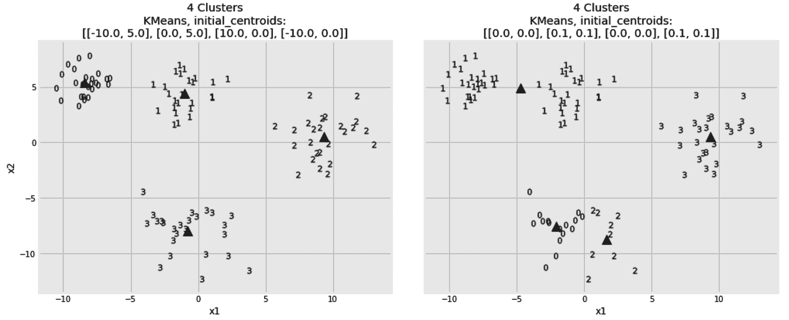
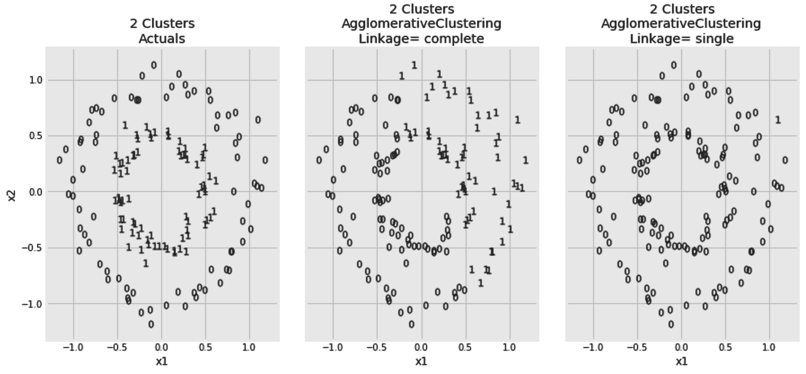

# 第十一章：聚类 – 理解无标签数据

聚类是无监督学习方法的代表。它通常是我们在需要为无标签数据添加意义时的首选。在一个电子商务网站中，营销团队可能会要求你将用户划分为几个类别，以便他们能够为每个群体定制信息。如果没有人给这些数百万用户打标签，那么聚类就是你将这些用户分组的唯一方法。当处理大量文档、视频或网页，并且这些内容没有被分配类别，而且你又不愿意求助于*Marie Kondo*，那么聚类就是你整理这一堆混乱数据的唯一途径。

由于这是我们关于监督学习算法的第一章，我们将首先介绍一些关于聚类的理论背景。然后，我们将研究三种常用的聚类算法，并介绍用于评估这些算法的方法。

在本章中，我们将讨论以下主题：

+   理解聚类

+   K 均值聚类

+   聚合聚类

+   DBSCAN

让我们开始吧！

# 理解聚类

机器学习算法可以看作是优化问题。它们获取数据样本和目标函数，并尝试优化该函数。在监督学习的情况下，目标函数基于所提供的标签。我们试图最小化预测值和实际标签之间的差异。在无监督学习的情况下，由于缺乏标签，情况有所不同。聚类算法本质上是试图将数据样本划分到不同的聚类中，从而最小化聚类内的距离并最大化聚类间的距离。换句话说，我们希望同一聚类中的样本尽可能相似，而来自不同聚类的样本则尽可能不同。

然而，解决这个优化问题有一个显而易见的解决方案。如果我们将每个样本视为其自身的聚类，那么聚类内的距离都为零，而聚类间的距离则为最大值。显然，这不是我们希望从聚类算法中得到的结果。因此，为了避免这个显而易见的解决方案，我们通常会在优化函数中添加约束。例如，我们可能会预定义需要的聚类数量，以确保避免上述显而易见的解决方案。另一个可能的约束是设置每个聚类的最小样本数。在本章讨论不同的聚类算法时，我们将看到这些约束在实际中的应用。

标签的缺失还决定了评估结果聚类好坏的不同度量标准。这就是为什么我决定在这里强调聚类算法的目标函数，因为理解算法的目标有助于更容易理解其评估度量标准。在本章中，我们将遇到几个评估度量标准。

衡量簇内距离的一种方式是计算簇中每个点与簇中心的距离。簇中心的概念你应该已经很熟悉，因为我们在第五章中讨论过**最近邻中心**算法，*图像处理与最近邻*。簇中心基本上是簇中所有样本的均值。此外，某些样本与其均值之间的平均欧几里得距离还有一个名字，这是我们在小学时学过的——**标准差**。相同的距离度量可以用于衡量簇中心之间的差异。

目前，我们准备好探索第一个算法——**K 均值**。然而，我们需要先创建一些样本数据，这样才能用来演示算法。在接下来的部分，解释完算法之后，我们将创建所需的数据，并使用 K 均值算法进行聚类。

# K 均值聚类

“我们都知道自己是独一无二的个体，但我们往往把他人看作是群体的代表。”

- Deborah Tannen

在上一节中，我们讨论了通过指定所需簇的数量来对目标函数进行约束。这就是*K*的含义：簇的数量。我们还讨论了簇的中心，因此“均值”这个词也可以理解。算法的工作方式如下：

1.  它首先随机选择*K*个点，并将其设置为簇中心。

1.  然后，它将每个数据点分配给最近的簇中心，形成*K*个簇。

1.  然后，它会为新形成的簇计算新的簇中心。

1.  由于簇中心已经更新，我们需要回到*步骤 2*，根据更新后的簇中心重新分配样本到新的簇中。然而，如果簇中心没有太大变化，我们就知道算法已经收敛，可以停止。

如你所见，这是一个迭代算法。它会不断迭代直到收敛，但我们可以通过设置其`max_iter`超参数来限制迭代次数。此外，我们可以通过将`tol`*超参数设置为更大的值来容忍更大的中心移动，从而提前停止。关于初始簇中心的不同选择可能会导致不同的结果。将算法的`init`超参数设置为`k-means++`可以确保初始簇中心彼此远离。这通常比随机初始化能得到更好的结果。*K*的选择也是通过`n_clusters`超参数来指定的。为了演示该算法及其超参数的使用，我们先从创建一个示例数据集开始。

*## 创建一个球形数据集

我们通常将聚类数据可视化为圆形的散点数据点。这种形状也称为凸聚类，是算法最容易处理的形状之一。稍后我们将生成更难以聚类的数据集，但现在我们先从简单的 blob 开始。

`make_blobs`函数帮助我们创建一个 blob 形状的数据集。在这里，我们将样本数量设置为`100`，并将它们分成四个聚类。每个数据点只有两个特征。这将使我们后续更容易可视化数据。这些聚类有不同的标准差；也就是说，有些聚类比其他聚类更分散。该函数还返回标签。我们将标签放在一边，稍后用于验证我们的算法。最后，我们将`x`和`y`放入一个 DataFrame，并将其命名为`df_blobs`：

```py
from sklearn.datasets import make_blobs

x, y = make_blobs(n_samples=100, centers=4, n_features=2, cluster_std=[1, 1.5, 2, 2], random_state=7)

df_blobs = pd.DataFrame(
    {
        'x1': x[:,0],
        'x2': x[:,1],
        'y': y
    }
)
```

为了确保你得到和我一样的数据，请将数据生成函数的`random_state`参数设置为一个特定的随机种子。数据准备好后，我们需要创建一个函数来可视化这些数据。

## 可视化我们的示例数据

在本章中，我们将使用以下函数。它接受二维的 *x* 和 *y* 标签，并将它们绘制到给定的 Matplotlib 轴 *ax* 上。在实际场景中，通常不会给出标签，但我们仍然可以将聚类算法预测的标签传递给这个函数。生成的图形会带上一个标题，并显示从给定 *y* 的基数推断出的聚类数量：

```py
def plot_2d_clusters(x, y, ax):

    y_uniques = pd.Series(y).unique()

    for y_unique_item in y_uniques:
 x[
            y == y_unique_item
        ].plot(
            title=f'{len(y_uniques)} Clusters',
            kind='scatter',
            x='x1', y='x2',
            marker=f'${y_unique_item}$',
            ax=ax,
        )
```

我们可以按如下方式使用新的`plot_2d_clusters()`函数：

```py
fig, ax = plt.subplots(1, 1, figsize=(10, 6))
x, y = df_blobs[['x1', 'x2']], df_blobs['y']
plot_2d_clusters(x, y, ax)
```

这将给我们以下图示：


每个数据点都会根据其给定的标签进行标记。现在，我们将假设这些标签没有被提供，并观察 K-means 算法是否能够预测这些标签。

## 使用 K-means 进行聚类

现在我们假装没有给定标签，我们该如何确定用于*K*的值，也就是`n_clusters`超参数的值呢？我们无法确定。现在我们只好随便选一个数值，稍后我们将学习如何找到`n_clusters`的最佳值。暂时我们将其设为五。其余的超参数将保持默认值。一旦算法初始化完成，我们可以使用它的`fit_predict`方法，如下所示：

```py
from sklearn.cluster import KMeans
kmeans = KMeans(n_clusters=2, random_state=7)
x, y = df_blobs[['x1', 'x2']], df_blobs['y']
y_pred = kmeans.fit_predict(x)
```

请注意，在训练集上进行拟合并在测试集上进行预测的概念在这里通常没有意义。我们通常在同一数据集上进行拟合和预测。我们也不会向`fit`或`fit_predict`方法传递任何标签。

现在我们已经预测了新的标签，我们可以使用`plot_2d_clusters()`函数来将我们的预测与原始标签进行比较，如下所示：

```py
fig, axs = plt.subplots(1, 2, figsize=(14, 6))

x, y = df_blobs[['x1', 'x2']], df_blobs['y']
plot_2d_clusters(x, y, axs[0])
plot_2d_clusters(x, y_pred, axs[1])

axs[0].set_title(f'Actuals: {axs[0].get_title()}')
axs[1].set_title(f'KMeans: {axs[1].get_title()}')
```

我在对应的图形标题前加上了`Actuals`和`KMeans`两个词。生成的聚类如下截图所示：


由于我们将*K*设置为五，原来的四个聚类中的一个被拆分成了两个。除此之外，其他聚类的预测结果是合理的。给聚类分配的标签是随意的。原来标签为一的聚类在算法中被称为三。只要聚类的成员完全相同，这一点应该不会让我们困扰。这一点对于聚类评估指标也没有影响。它们通常会考虑到这一事实，并在评估聚类算法时忽略标签名称。

然而，我们如何确定*K*的值呢？我们别无选择，只能多次运行算法，使用不同数量的聚类并选择最佳结果。在以下的代码片段中，我们正在遍历三个不同的`n_clusters`值。我们还可以访问最终的质心，这些质心是在算法收敛后为每个聚类计算得出的。查看这些质心有助于理解算法如何将每个数据点分配到它自己的聚类中。代码片段的最后一行使用三角形标记在三个图形中绘制了质心：

```py
from sklearn.cluster import KMeans

n_clusters_options = [2, 4, 6]

fig, axs = plt.subplots(1, len(n_clusters_options), figsize=(16, 6))

for i, n_clusters in enumerate(n_clusters_options):

    x, y = df_blobs[['x1', 'x2']], df_blobs['y']

    kmeans = KMeans(n_clusters=n_clusters, random_state=7)
    y_pred = kmeans.fit_predict(x)

    plot_2d_clusters(x, y_pred, axs[i])

    axs[i].plot(
        kmeans.cluster_centers_[:,0], kmeans.cluster_centers_[:,1], 
        'k^', ms=12, alpha=0.75
    )

```

这是三个选择的结果，横向排列：


对三个图形进行视觉检查告诉我们，选择四个聚类是正确的选择。不过，我们必须记住，我们这里处理的是二维数据点。如果我们的数据样本包含两个以上的特征，同样的视觉检查就会变得更加困难。在接下来的部分中，我们将学习轮廓系数，并利用它来选择最佳的聚类数，而不依赖于视觉辅助。

## 轮廓系数

**轮廓系数**是衡量一个样本与其自身聚类中其他样本相比的相似度的指标。对于每个样本，我们将计算该样本与同一聚类中所有其他样本之间的平均距离。我们称这个平均距离为*A*。然后，我们计算该样本与最近聚类中所有其他样本之间的平均距离。我们称这个平均距离为*B*。现在，我们可以定义轮廓系数，如下所示：


现在，我们不再通过视觉检查聚类，而是将遍历多个`n_clusters`的值，并在每次迭代后存储轮廓系数。如你所见，`silhouette_score`接受两个参数——数据点（`x`）和预测的聚类标签（`y_pred`）：

```py
from sklearn.cluster import KMeans
from sklearn.metrics import silhouette_score

n_clusters_options = [2, 3, 4, 5, 6, 7, 8]
silhouette_scores = []

for i, n_clusters in enumerate(n_clusters_options):

    x, y = df_blobs[['x1', 'x2']], df_blobs['y']
    kmeans = KMeans(n_clusters=n_clusters, random_state=7)
    y_pred = kmeans.fit_predict(x)

    silhouette_scores.append(silhouette_score(x, y_pred))
```

我们可以直接选择提供最佳得分的`n_clusters`值。在这里，我们将计算出的得分放入一个 DataFrame 中，并使用柱状图进行比较：

```py
fig, ax = plt.subplots(1, 1, figsize=(12, 6), sharey=False)

pd.DataFrame(
    {
        'n_clusters': n_clusters_options,
        'silhouette_score': silhouette_scores,
    }
).set_index('n_clusters').plot(
    title='KMeans: Silhouette Score vs # Clusters chosen',
    kind='bar',
    ax=ax
)
```

结果得分确认了我们最初的决定，四是最适合的聚类数：


除了选择聚类的数量外，算法初始质心的选择也会影响其准确性。错误的选择可能会导致 K-means 算法收敛到一个不理想的局部最小值。在下一节中，我们将看到初始质心如何影响算法的最终决策。

## 选择初始质心

默认情况下，scikit-learn 的 K-means 实现会选择相互之间距离较远的随机初始质心。它还会尝试多个初始质心，并选择产生最佳结果的那个。话虽如此，我们也可以手动设置初始质心。在以下代码片段中，我们将比较两种初始设置，看看它们对最终结果的影响。然后我们将并排打印这两种结果：

```py
from sklearn.cluster import KMeans

initial_centroid_options = np.array([
    [(-10,5), (0, 5), (10, 0), (-10, 0)],
    [(0,0), (0.1, 0.1), (0, 0), (0.1, 0.1)],
])

fig, axs = plt.subplots(1, 2, figsize=(16, 6))

for i, initial_centroids in enumerate(initial_centroid_options):

    x, y = df_blobs[['x1', 'x2']], df_blobs['y']
    kmeans = KMeans(
       init=initial_centroids, max_iter=500, n_clusters=4, random_state=7
    )
    y_pred = kmeans.fit_predict(x)
    plot_2d_clusters(x, y_pred, axs[i])

    axs[i].plot(
       kmeans.cluster_centers_[:,0], kmeans.cluster_centers_[:,1], 'k^'
    )
```

以下图表展示了算法收敛后的聚类结果。部分样式代码为了简洁被省略：



显然，第一个初始设置帮助了算法，而第二个设置则导致了不好的结果。因此，我们必须注意算法的初始化，因为它的结果是非确定性的。

在机器学习领域，迁移学习指的是我们需要重新利用在解决一个问题时获得的知识，并将其应用于稍微不同的另一个问题。人类也需要迁移学习。K-means 算法有一个 `fit_transform` 方法。如果我们的数据（*x*）由 *N* 个样本和 *M* 个特征组成，方法将把它转换成 *N* 个样本和 *K* 列。列中的值基于预测的聚类。通常，*K* 要远小于 *N*。因此，您可以重新利用 K-means 聚类**算法**，使其可以作为降维步骤，在将其转换后的输出传递给简单分类器或回归器之前。类似地，在**多分类**问题中，可以使用聚类算法来减少目标的基数。**

**与 K-means 算法相对，**层次聚类**是另一种结果是确定性的算法。它不依赖任何初始选择，因为它从不同的角度来解决聚类问题。层次聚类是下一节的主题。

# 层次聚类

"人口最多的城市不过是荒野的集合。"

- 奥尔杜斯·赫胥黎

在 K-means 聚类算法中，我们从一开始就有了我们的*K*个聚类。在每次迭代中，某些样本可能会改变其归属，某些聚类的质心可能会改变，但最终，聚类从一开始就已定义。相反，在凝聚层次聚类中，开始时并不存在聚类。最初，每个样本都属于它自己的聚类。开始时的聚类数量与数据样本的数量相同。然后，我们找到两个最接近的样本，并将它们合并为一个聚类。之后，我们继续迭代，通过合并下一个最接近的两个样本、两个聚类，或者下一个最接近的样本和一个聚类。正如你所看到的，每次迭代时，聚类数量都会减少一个，直到所有样本都加入一个聚类。将所有样本放入一个聚类听起来不太直观。因此，我们可以选择在任何迭代中停止算法，具体取决于我们需要的最终聚类数量。

那么，让我们来学习如何使用凝聚层次聚类算法。要让算法提前终止其聚合任务，你需要通过它的`n_clusters`超参数告知它我们需要的最终聚类数量。显然，既然我提到算法会合并已关闭的聚类，我们需要深入了解聚类间的距离是如何计算的，但暂时我们可以忽略这一点——稍后我们会讲到。以下是当聚类数量设置为`4`时，算法的使用方法：

```py
from sklearn.cluster import AgglomerativeClustering

x, y = df_blobs[['x1', 'x2']], df_blobs['y']

agglo = AgglomerativeClustering(n_clusters=4)
y_pred = agglo.fit_predict(x)

```

由于我们将聚类数量设置为`4`，预测的`y_pred`将会有从零到三的值。

事实上，凝聚层次聚类算法并没有在聚类数量为四时停止。它继续合并聚类，并使用内部树结构跟踪哪些聚类是哪些更大聚类的成员。当我们指定只需要四个聚类时，它重新访问这个内部树，并相应地推断聚类的标签。在下一节中，我们将学习如何访问算法的内部层级，并追踪它构建的树。

## 跟踪凝聚层次聚类的子节点

如前所述，每个样本或聚类都会成为另一个聚类的成员，而这个聚类又成为更大聚类的成员，依此类推。这个层次结构被存储在算法的`children_`属性中。这个属性的形式是一个列表的列表。外部列表的成员数量等于数据样本数量减去一。每个成员列表由两个数字组成。我们可以列出`children_`属性的最后五个成员，如下所示：

```py
agglo.children_[-5:]
```

这将给我们以下列表：

```py
array([[182, 193],
       [188, 192],
       [189, 191],
       [194, 195],
       [196, 197]])
```

列表中的最后一个元素是树的根节点。它有两个子节点，`196`和`197`。这些是根节点的子节点的 ID。大于或等于数据样本数量的 ID 是聚类 ID，而较小的 ID 则表示单个样本。如果你从聚类 ID 中减去数据样本的数量，就可以得到子节点列表中的位置，从而获得该聚类的成员。根据这些信息，我们可以构建以下递归函数，它接受一个子节点列表和数据样本的数量，并返回所有聚类及其成员的嵌套树，如下所示：

```py
def get_children(node, n_samples):
    if node[0] >= n_samples:
        child_cluster_id = node[0] - n_samples
        left = get_children(
            agglo.children_[child_cluster_id], 
            n_samples
        )
    else:
        left = node[0]

    if node[1] >= n_samples:
        child_cluster_id = node[1] - n_samples
        right = get_children(
            agglo.children_[child_cluster_id], 
            n_samples
        )
    else:
        right = node[1]

    return [left, right]
```

我们可以像这样调用我们刚刚创建的函数：

```py
root = agglo.children_[-1]
n_samples = df_blobs.shape[0]
tree = get_children(root, n_samples)
```

此时，`tree[0]`和`tree[1]`包含树的左右两侧样本的 ID——这些是两个最大聚类的成员。如果我们的目标是将样本分成四个聚类，而不是两个，我们可以使用`tree[0][0]`、`tree[0][1]`、`tree[1][0]`和`tree[1][1]`。以下是`tree[0][0]`的样子：

```py
[[[46, [[25, 73], [21, 66]]], [87, 88]],
 [[[22, 64], [4, [49, 98]]],
  [[19, [55, 72]], [[37, 70], [[[47, 82], [13, [39, 92]]], [2, [8, 35]]]]]]]
```

这种嵌套性使我们能够设置我们希望聚类的深度，并相应地获取其成员。尽管如此，我们可以使用以下代码将这个列表展平：

```py
def flatten(sub_tree, flat_list):
    if type(sub_tree) is not list:
        flat_list.append(sub_tree)
    else:
        r, l = sub_tree
        flatten(r, flat_list)
        flatten(l, flat_list)
```

现在，我们可以获取`tree[0][0]`的成员，如下所示：

```py
flat_list = []
flatten(tree[0][0], flat_list)
print(flat_list)
```

我们还可以模拟`fit_predict`的输出，并使用以下代码片段构建我们自己的预测标签。它将为我们构建的树的不同分支中的成员分配从零到三的标签。我们将我们的预测标签命名为`y_pred_dash`：

```py
n_samples = x.shape[0]
y_pred_dash = np.zeros(n_samples)
for i, j, label in [(0,0,0), (0,1,1), (1,0,2), (1,1,3)]:
    flat_list = []
    flatten(tree[i][j], flat_list)
    for sample_index in flat_list:
        y_pred_dash[sample_index] = label
```

为了确保我们的代码按预期工作，`y_pred_dash`中的值应该与上一节中的`y_pred`匹配。然而，`tree[0][0]`部分的树是否应被分配标签`0`、`1`、`2`或`3`并没有明确的规定。我们选择标签是任意的。因此，我们需要一个评分函数来比较这两个预测，同时考虑到标签名称可能会有所不同。这就是调整后的兰德指数（adjusted Rand index）的作用，接下来我们将讨论它。

## 调整后的兰德指数

**调整后的兰德指数**在分类中的计算方式与准确率评分非常相似。它计算两个标签列表之间的一致性，但它考虑了准确率评分无法处理的以下问题：

+   调整后的兰德指数并不关心实际的标签，只要这里的一个聚类的成员和那里聚类的成员是相同的。

+   与分类不同，我们可能会得到太多的聚类。在极端情况下，如果每个样本都是一个独立的聚类，忽略标签名称的情况下，任何两个聚类列表都会一致。因此，调整后的兰德指数会减小两个聚类偶然一致的可能性。

当两个预测结果匹配时，最佳调整的兰德指数为`1`。因此，我们可以用它来比较`y_pred`和我们的`y_pred_dash`。该得分是对称的，因此在调用评分函数时，参数的顺序并不重要，如下所示：

```py
from sklearn.metrics import adjusted_rand_score
adjusted_rand_score(y_pred, y_pred_dash)
```

由于我们得到了`1`的调整兰德指数，我们可以放心，推断子树中簇的成员资格的代码是正确的。

我之前简要提到过，在每次迭代中，算法会合并两个最接近的簇。很容易想象，如何计算两个样本之间的距离。它们基本上是两个点，我们之前已经使用了不同的距离度量，例如欧氏距离和曼哈顿距离。然而，簇并不是一个点。我们应该从哪里开始测量距离呢？是使用簇的质心吗？还是在每个簇中选择一个特定的数据点来计算距离？所有这些选择都可以通过**连接**超参数来指定。在下一节中，我们将看到它的不同选项。

## 选择聚类连接

默认情况下，使用**欧氏**距离来决定哪些簇对彼此最接近。这个默认度量可以通过**亲和度**超参数进行更改。如果你想了解更多不同的距离度量，例如**余弦**和**曼哈顿**距离，请参考第五章*，最近邻的图像处理*。在计算两个簇之间的距离时，**连接**准则决定了如何测量这些距离，因为簇通常包含不止一个数据点。在*完全*连接中，使用两个簇中所有数据点之间的最大距离。相反，在*单一*连接中，使用最小距离。显然，*平均*连接取所有样本对之间所有距离的平均值。在*沃德*连接中，如果两个簇的每个数据点与合并簇的质心之间的平均欧氏距离最小，则这两个簇会合并。沃德连接仅能使用欧氏距离。

为了能够比较上述连接方法，我们需要创建一个新的数据集。数据点将以两个同心圆的形式排列。较小的圆嵌套在较大的圆内，就像莱索托和南非一样。`make_circles`函数指定了生成样本的数量（`n_samples`）、两个圆之间的距离（`factor`）以及数据的噪声大小（`noise`）：

```py
from sklearn.datasets import make_circles
x, y = make_circles(n_samples=150, factor=0.5, noise=0.05, random_state=7)
df_circles = pd.DataFrame({'x1': x[:,0], 'x2': x[:,1], 'y': y})
```

我稍后会显示生成的数据集，但首先，我们先使用凝聚算法对新的数据样本进行聚类。我将运行两次算法：第一次使用完全连接，第二次使用单一连接。这次我将使用曼哈顿距离：

```py
from sklearn.cluster import AgglomerativeClustering

linkage_options = ['complete', 'single']

fig, axs = plt.subplots(1, len(linkage_options) + 1, figsize=(14, 6))

x, y = df_circles[['x1', 'x2']], df_circles['y']

plot_2d_clusters(x, y, axs[0])
axs[0].set_title(f'{axs[0].get_title()}\nActuals')

for i, linkage in enumerate(linkage_options, 1):

    y_pred = AgglomerativeClustering(
        n_clusters=2, affinity='manhattan', linkage=linkage
    ).fit_predict(x)

    plot_2d_clusters(x, y_pred, axs[i])

    axs[i].set_title(f'{axs[i].get_title()}\nAgglomerative\nLinkage= {linkage}')
```

这是两种连接方法并排显示的结果：


当使用单链聚合时，考虑每对聚类之间的最短距离。这使得它能够识别出数据点排列成的圆形带状区域。完全链聚合考虑聚类之间的最长距离，导致结果偏差较大。显然，单链聚合在这里获得了最佳结果。然而，由于其方差，它容易受到噪声的影响。为了证明这一点，我们可以在将噪声从`0.05`增加到`0.08`后，重新生成圆形样本，如下所示：

```py
from sklearn.datasets import make_circles
x, y = make_circles(n_samples=150, factor=0.5, noise=0.08, random_state=7)
df_circles = pd.DataFrame({'x1': x[:,0], 'x2': x[:,1], 'y': y})
```

在新样本上运行相同的聚类算法将给我们以下结果：



这次噪声数据干扰了我们的单链聚合，而完全链聚合的结果变化不大。在单链聚合中，一个落在两个聚类之间的噪声点可能会导致它们合并。平均链聚合可以看作是单链和完全链聚合标准之间的中间地带。由于这些算法的迭代特性，三种链聚合方法会导致较大的聚类变得更大。这可能导致聚类大小不均。如果必须避免不平衡的聚类，那么应该优先选择沃德链聚合，而不是其他三种链聚合方法。

到目前为止，K-means 和层次聚类算法需要预先定义期望的聚类数量。与 K-means 算法相比，层次聚类**计算量大**，而 K-means 算法无法处理非凸数据。在下一节中，我们将看到第三种不需要预先定义聚类数量的算法。****

****# DBSCAN

"你永远无法真正理解一个人，除非你从他的角度考虑问题。"

- 哈珀·李

缩写**DBSCAN**代表**基于密度的噪声应用空间聚类**。它将聚类视为高密度区域，之间由低密度区域分隔。这使得它能够处理任何形状的聚类。这与假设聚类为凸形的 K-means 算法不同；即数据簇与质心。DBSCAN**算法首先通过识别核心样本来开始。这些是周围至少有 `min_samples` 点，且距离在 `eps` (***ε***) 内的点。最初，一个聚类由其核心样本组成。一旦识别出核心样本，它的邻居也会被检查，并且如果符合核心样本标准，就将其添加到聚类中。接着，聚类将被扩展，以便我们可以将非核心样本添加到其中。这些样本是可以直接从核心样本通过 `eps` 距离到达的点，但它们本身不是核心样本。一旦所有的聚类被识别出来，包括核心样本和非核心样本，剩余的样本将被视为噪声。**

**很明显，`min_samples`和`eps`超参数在最终预测中起着重要作用。这里，我们将`min_samples`设置为`3`并尝试不同的`eps`设置***:***

```py
from sklearn.cluster import DBSCAN

eps_options = [0.1, 1.0, 2.0, 5.0]

fig, axs = plt.subplots(1, len(eps_options) + 1, figsize=(14, 6))

x, y = df_blobs[['x1', 'x2']], df_blobs['y']

plot_2d_clusters(x, y, axs[0])
axs[0].set_title(f'{axs[0].get_title()}\nActuals')

for i, eps in enumerate(eps_options, 1):

    y_pred = DBSCAN(eps=eps, min_samples=3, metric='euclidean').fit_predict(x)

    plot_2d_clusters(x, y_pred, axs[i])
    axs[i].set_title(f'{axs[i].get_title()}\nDBSCAN\neps = {eps}')
```

对于 blobs 数据集，结果聚类帮助我们识别`eps`**超参数的影响:**

**

一个非常小的`eps`值不允许任何核心样本形成。当`eps`被设置为`0.1`时，几乎所有的点都被当作噪声处理。当我们增加`eps`值时，核心点开始形成。然而，在某个时刻，当`eps`**设置为`0.5`时，两个簇错误地合并在一起。**

**同样，`min_samples`的值可以决定我们的聚类算法是否成功。这里，我们将尝试不同的`min_samples`值**来对我们的同心数据点进行处理:**

**```py
from sklearn.cluster import DBSCAN

min_samples_options = [3, 5, 10]

fig, axs = plt.subplots(1, len(min_samples_options) + 1, figsize=(14, 6))

x, y = df_circles[['x1', 'x2']], df_circles['y']

plot_2d_clusters(x, y, axs[0])
axs[0].set_title(f'{axs[0].get_title()}\nActuals')

for i, min_samples in enumerate(min_samples_options, 1):

    y_pred = DBSCAN(
        eps=0.25, min_samples=min_samples, metric='euclidean', n_jobs=-1
    ).fit_predict(x)

    plot_2d_clusters(x, y_pred, axs[i])

    axs[i].set_title(f'{axs[i].get_title()}\nDBSCAN\nmin_samples = {min_samples}')
```

在这里，我们可以看到`min_samples`对聚类结果的影响：


再次强调，仔细选择`min_samples`给出了最好的结果。与`eps`不同，`min_samples`值越大，核心样本越难以形成。**

除了上述超参数外，我们还可以更改算法使用的距离度量。通常，`min_samples`取值大于三。将`min_samples`设置为一意味着每个样本将成为自己的簇，而将其设置为二将给出类似于层次聚类算法的结果，但采用单链接法。你可以从将`min_samples`值设置为数据维度的两倍开始；也就是说，设置为特征数量的两倍。然后，如果数据已知是噪声较多的，你可以增加该值，否则可以减少它。至于`eps`，我们可以使用以下**k 距离图**。

在同心数据集上，我们将`min_samples`设置为三。现在，对于每个样本，我们想要查看它的两个邻居有多远。以下代码片段计算每个点与其最接近的两个邻居之间的距离：

```py
from sklearn.neighbors import NearestNeighbors

x = df_circles[['x1', 'x2']]
distances, _ = NearestNeighbors(n_neighbors=2).fit(x).kneighbors()
```

如果`min_samples`设置为其他任何数值，我们希望得到与该数值相等的邻居数量，减去一。现在，我们可以关注每个样本的两个邻居中最远的一个，并绘制所有结果的距离，如下所示：

```py
pd.Series(distances[:,-1]).sort_values().reset_index(drop=True).plot() 
```

结果图形将如下所示：


图表剧烈改变斜率的点为我们提供了`eps`值的大致估计。在这里，当`min_samples`设置为三时，`eps`值为`0.2`似乎非常合适。此外，我们可以尝试这些两个数值的不同组合，并使用轮廓系数或其他聚类度量来微调我们的超参数。

# 总结

英国历史学家阿诺德·汤因比曾说过，"*没有哪种工具是全能的*。" 在本章中，我们使用了三种工具来进行聚类。我们在这里讨论的三种算法从不同的角度处理问题。K-means 聚类算法试图找到总结簇和质心的点，并围绕它们构建聚类。凝聚层次聚类方法则更倾向于自下而上的方式，而 DBSCAN 聚类算法则引入了核心点和密度等新概念。本章是三章关于无监督学习问题的第一章。由于缺乏标签，我们被迫学习了新的评估指标，如调整兰德指数和轮廓系数。

在下一章，我们将处理第二个无监督学习问题：**异常检测**。幸运的是，本章中讨论的概念，以及第五章中关于最近邻和最近质心算法的内容，将帮助我们在下一章中进一步理解。再一次，我们将得到未标记的数据样本，我们的任务是挑出其中的异常样本。
