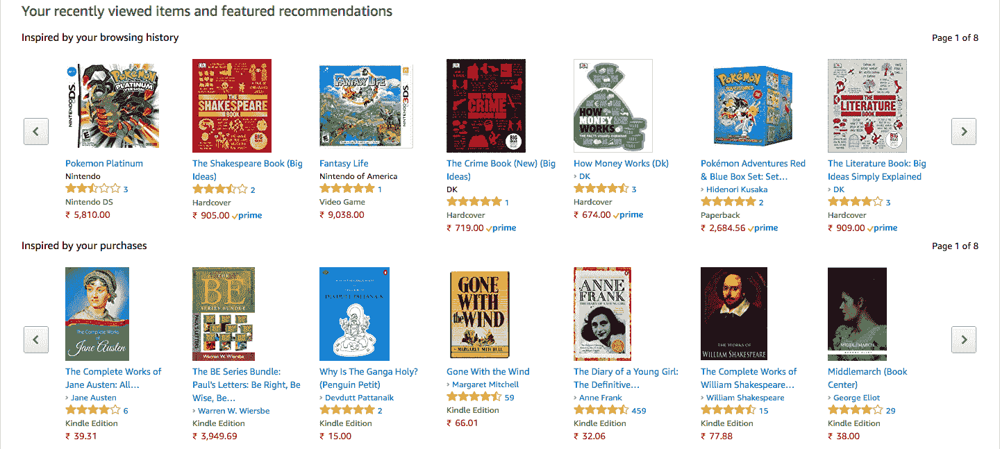

# 第一章：推荐系统入门

几乎我们今天购买或消费的每样东西，都受到了某种形式的推荐的影响；无论是来自朋友、家人、外部评论，还是更近期的，来自卖方的推荐。当你登录 Netflix 或 Amazon Prime 时，例如，你会看到服务根据你过去的观看（和评分）历史，认为你会喜欢的电影和电视节目列表。Facebook 会推荐它认为你可能认识并可能想加为好友的人。它还会根据你喜欢的帖子、你交的朋友以及你关注的页面，为你精选新闻动态。Amazon 会在你浏览特定产品时推荐商品。它会展示来自竞争商家的类似商品，并建议与该商品 *常一起购买* 的附加商品。

因此，不言而喻，为这些公司提供一个好的推荐系统是其成功商业的核心。Netflix 最希望通过你喜欢的内容吸引你，这样你就会继续订阅其服务；Amazon 向你展示的项目越相关，你的购买几率和数量就越大，这直接转化为更高的利润。同样，建立 *友谊* 对于 Facebook 作为一个几乎无所不能的社交网络的力量和影响力至关重要，Facebook 利用这一点从广告中获取大量收入。

在本章的介绍中，我们将了解推荐系统的世界，涵盖以下主题：

+   什么是推荐系统？它能做什么，不能做什么？

+   推荐系统的不同类型

# 技术要求

你需要在系统中安装 Python。最后，为了使用本书的 Git 仓库，用户需要安装 Git。

本章的代码文件可以在 GitHub 上找到：

[`github.com/PacktPublishing/Hands-On-Recommendation-Systems-with-Python`](https://github.com/PacktPublishing/Hands-On-Recommendation-Systems-with-Python)[.](https://github.com/PacktPublishing/Hands-On-Recommendation-Systems-with-Python)

查看以下视频，看看代码如何实际运行：

[`bit.ly/2JTtg6t`](http://bit.ly/2JTtg6t)[.](http://bit.ly/2JTtg6t)

# 什么是推荐系统？

推荐系统很容易理解；顾名思义，它们是推荐或建议特定产品、服务或实体的系统或技术。然而，这些系统可以根据其提供推荐的方法，分为以下两类。

# 预测问题

在这个问题版本中，我们给定了一个 *m* 用户和 *n* 项目的矩阵。矩阵的每一行代表一个用户，每一列代表一个项目。矩阵中第 i^(行) 和 j^(列) 位置的值表示用户 *i* 给项目 *j* 的评分。这个值通常表示为 r[ij]。

例如，考虑下图中的矩阵：

这个矩阵包含了七个用户对六个项目的评分。因此，m = 7 和 n = 6。用户 1 给项目 1 的评分是 4。因此，r[11] = 4。

现在让我们考虑一个更具体的例子。假设你是 Netflix，拥有一个包含 20,000 部电影和 5,000 名用户的库。你有一个系统记录每个用户给特定电影的评分。换句话说，你拥有一个评分矩阵（形状为 5,000 × 20,000）。

然而，你的所有用户只能看到你网站上部分电影的内容；因此，你拥有的矩阵是稀疏的。换句话说，你的矩阵中大部分条目是空的，因为大多数用户没有对大部分电影进行评分。

因此，预测问题旨在使用所有可用的信息（已记录的评分、电影数据、用户数据等）来预测这些缺失的值。如果它能够准确地预测缺失的值，就能够提供很好的推荐。例如，如果用户 *i* 没有使用项目 *j*，但我们的系统预测出一个非常高的评分（表示为 [ij]），那么用户 *i* 很可能会喜欢 *j*，只要他们通过系统发现它。

# 排名问题

排名是推荐问题的更直观的表述。给定一组 *n* 个项目，排名问题试图辨别出推荐给特定用户的前 *k* 个项目，利用所有可用的信息。

假设你是 Airbnb，就像前面的例子一样。你的用户已经输入了他们寻找房东和空间的具体要求（比如位置和预算）。你希望展示符合这些条件的前 10 个结果。这将是一个排名问题的例子。

很容易看出，预测问题通常可以简化为排名问题。如果我们能够预测缺失的值，就可以提取出最好的值并将其显示为我们的结果。

在本书中，我们将探讨这两种方法，并构建能够有效解决这些问题的系统。

# 推荐系统的类型

在推荐系统中，正如几乎所有其他机器学习问题一样，你使用的技术和模型（以及你取得的成功）在很大程度上依赖于你拥有的数据的数量和质量。在本节中，我们将概览三种最受欢迎的推荐系统类型，按照它们所需的数据量递减的顺序来展示。

# 协同过滤

协同过滤利用社区的力量来提供推荐。协同过滤器是业界最受欢迎的推荐模型之一，已经为像亚马逊这样的公司带来了巨大的成功。协同过滤可以大致分为两种类型。

# 基于用户的过滤

用户基于过滤的主要思想是，如果我们能够找到过去购买并喜欢相似物品的用户，那么他们未来也更可能购买相似的物品。因此，这些模型会根据类似用户的喜好推荐物品。亚马逊的*购买此商品的客户还购买了*就是这一过滤器的例子，如下图所示：

假设艾丽丝和鲍勃大多数时候喜欢和不喜欢相同的视频游戏。现在，假设市场上推出了一款新的视频游戏。假设艾丽丝购买了这款游戏并且非常喜欢。因为我们已经辨别出他们在视频游戏上的品味极其相似，所以鲍勃也很可能会喜欢这款游戏；因此，系统会将这款新游戏推荐给鲍勃。

# 基于物品的过滤

如果一群人对两件物品的评价相似，那么这两件物品必须是相似的。因此，如果一个人喜欢某个特定的物品，他们也很可能对另一个物品感兴趣。这就是基于物品的过滤方法的原理。亚马逊通过根据你的浏览和购买历史推荐产品，很好地利用了这一模型，如下图所示：

基于物品的过滤器因此是根据用户过去的评分来推荐物品。例如，假设艾丽丝、鲍勃和伊芙都给*《战争与和平》*和*《道林·格雷的画像》*打了“极好”的分。那么，当有人购买*《卡拉马佐夫兄弟》*时，系统会推荐*《战争与和平》*，因为它识别到，在大多数情况下，如果有人喜欢其中一本书，他们也会喜欢另一本书。

# 缺点

协同过滤系统的最大前提之一是过去活动数据的可用性。亚马逊之所以能够如此有效地利用协同过滤，是因为它可以访问数百万用户的购买数据。

因此，协同过滤存在我们所说的**冷启动问题**。*假设你刚刚启动了一个电子商务网站——要建立一个好的协同过滤系统，你需要大量用户的购买数据。然而，你没有这些数据，因此很难从零开始构建这样的系统。

# 基于内容的系统

与协同过滤不同，基于内容的系统不需要过去活动的数据。相反，它们根据用户的个人资料和对特定物品的元数据提供推荐。

Netflix 是上述系统的一个优秀例子。你第一次登录 Netflix 时，它并不知道你喜欢或不喜欢什么，因此无法找到与你相似的用户并推荐他们喜欢的电影和节目。

如前所示，Netflix 所做的是要求你评分一些你*曾经*看过的电影。基于这些信息以及它已经拥有的电影元数据，它为你创建了一个观影清单。例如，如果你喜欢*哈利·波特*和*纳尼亚传奇*电影，基于内容的系统可以识别出你喜欢基于奇幻小说的电影，并会推荐像*指环王*这样的电影给你。

然而，由于基于内容的系统没有利用社区的力量，它们往往会给出一些不如协同过滤系统所提供的结果那么令人印象深刻或相关。换句话说，基于内容的系统通常会提供*显而易见*的推荐。如果*哈利·波特*是你最喜欢的电影，那么*指环王*的推荐就缺乏新意。

# 基于知识的推荐系统

基于知识的推荐系统适用于那些极少被购买的商品。仅仅依靠过去的购买活动或通过建立用户档案来推荐此类商品是不可能的。以房地产为例，房地产通常是家庭一次性的大宗购买。现有用户没有足够的房地产购买历史来进行协同过滤，也并不总是可行去询问用户他们的房地产购买历史。

在这种情况下，你构建一个系统，询问用户一些具体要求和偏好，然后提供符合这些条件的推荐。例如，在房地产的例子中，你可以询问用户关于房子的需求，比如位置、预算、房间数量、楼层数等。根据这些信息，你可以推荐符合上述条件的房产。

基于知识的推荐系统也面临着低新颖性的问题。用户通常知道结果会是什么，因此很少会感到惊讶。

# 混合推荐系统

如其名所示，混合推荐系统是强大的系统，它结合了多种推荐模型，包括我们之前已经解释过的那些模型。正如我们在前面几节中看到的，每个模型都有其优缺点。混合系统试图将一个模型的劣势与另一个模型的优势相抵消。

再次考虑 Netflix 的例子。当你第一次登录时，Netflix 通过使用基于内容的推荐系统克服了协同过滤的冷启动问题，并且随着你逐渐开始观看和评分电影，它会启动协同过滤机制。这种方法更为成功，因此大多数实际的推荐系统本质上是混合型的。

在本书中，我们将构建每种类型的推荐系统，并将检查前面部分描述的所有优缺点。

# 总结

在本章中，我们概述了推荐系统的世界。我们看到了两种解决推荐问题的方法：即预测和排序。最后，我们考察了各种类型的推荐系统，并讨论了它们的优缺点。

在下一章中，我们将学习如何使用 pandas 来处理数据，pandas 是 Python 中首选的数据分析库。这将帮助我们构建我们介绍过的各种推荐系统。
