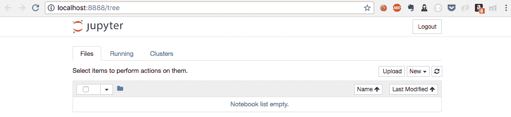
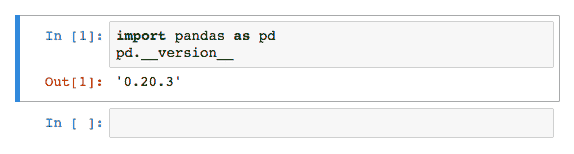

# 第二章：使用 pandas 库操作数据

在接下来的章节中，我们将通过构建第一章中介绍的各种推荐系统来动手实践。不过，在此之前，我们需要了解如何高效地在 Python 中处理、操作和分析数据。

我们将使用的数据集将有几兆字节大。历史上，Python 一直以执行速度较慢而闻名。因此，使用原生 Python 及其内置的数据结构来分析如此庞大的数据量几乎是不可能的。

在本章中，我们将熟悉 pandas 库，它旨在克服前面提到的限制，使得在 Python 中进行数据分析变得极为高效且用户友好。我们还将介绍我们将用来构建推荐系统的*电影数据集*，并利用 pandas 提取一些有趣的事实，通过数据叙述电影的历史。

**免责声明：** 如果你已经熟悉 pandas 库，可以跳过本章，直接进入下一章，*使用 pandas 构建 IMDB Top 250 克隆*。

# 技术要求

你需要在系统上安装 Python。最后，为了使用本书的 Git 仓库，用户需要安装 Git。

本章的代码文件可以在 GitHub 上找到：

[`github.com/PacktPublishing/Hands-On-Recommendation-Systems-with-Python`](https://github.com/PacktPublishing/Hands-On-Recommendation-Systems-with-Python)[.](https://github.com/PacktPublishing/Hands-On-Recommendation-Systems-with-Python)

查看以下视频，看看代码如何运行：

[`bit.ly/2LoZEUj`](http://bit.ly/2LoZEUj)[.](http://bit.ly/2LoZEUj)

# 设置环境

在开始编码之前，我们可能需要设置开发环境。对于使用 Python 的数据科学家和分析师来说，Jupyter Notebook 是迄今为止最流行的开发工具。因此，我们强烈建议你使用这个环境。

我们还需要下载 pandas 库。获取这两个库最简单的方式是下载 Anaconda。Anaconda 是一个发行版，包含了 Jupyter 软件和 SciPy 包（其中包括 pandas）。

你可以在此下载发行版**:** [`www.anaconda.com/download/`](https://www.anaconda.com/download/)。

下一步是在你希望的位置创建一个新文件夹（我将其命名为 `RecoSys`）。这将是包含我们在本书中编写的所有代码的主文件夹。在这个文件夹内，创建一个名为 `Chapter2` 的子文件夹，它将包含我们在本章中编写的所有代码。

接下来，打开你的终端应用程序，导航到 `Chapter2` 文件夹，并运行 `jupyter notebook` 命令。如果你在 Mac 或 Linux 上，命令应该如下所示（Windows 中的 cd 路径会有所不同）：

```py
[rounakbanik:~]$ cd RecoSys/Chapter2
[rounakbanik:~/RecoSys/Chapter2]$ jupyter notebook
```

Jupyter Notebook 运行在本地浏览器中。因此，它们与操作系统无关。换句话说，无论你是在 Mac、PC 还是 Linux 系统上，体验都将是一样的。

执行 `jupyter notebook` 命令后，你的默认浏览器应该会打开并显示 `localhost:8888/tree` 的 URL，窗口看起来如下所示：



在窗口的右侧，你应该能看到一个 **New** 下拉菜单。点击它并创建一个新的 Python 3（或 Python 2）Notebook。这样做会打开一个新标签页，其中包含一个未命名的 Notebook。你还可以看到一个带有指针的输入单元格。这是我们编写代码（和 markdown）的空间。接下来，请键入以下几行代码：

```py
import pandas as pd
pd.__version__
```

要执行此单元格中的代码，请按 *Shift* + *Enter*。如果一切顺利，你应该会看到一个新的输出单元格，显示 Pandas 库的版本（对于我们来说是 0.20.3）：



恭喜！

你现在已经成功设置了开发环境。当然，Jupyter Notebook 的功能远不止于运行单元格。当我们使用这些其他功能时，我们会进行讲解。由于这不是一本关于 Jupyter 的书籍，如果你有兴趣首先学习 Jupyter Notebook 的基础知识，我们会将你引导到网上的免费教程。DataCamp 上有一篇关于这个主题的权威文章。

你可以在这里找到 DataCamp Jupyter Notebook 教程：[`www.datacamp.com/community/tutorials/tutorial-jupyter-notebook`](https://www.datacamp.com/community/tutorials/tutorial-jupyter-notebook)。

如果你在设置环境时遇到问题，Google 错误信息应该能引导你找到提供合适解决方案的页面。像 Stack Overflow 这样的网站上有成千上万的关于 Anaconda 设置的问题，你遇到的问题极有可能是别人之前也遇到过的。

# Pandas 库

Pandas 是一个让我们能够访问高性能、易于使用的数据分析工具和数据结构的 Python 包。

如我们在介绍中所述，Python 是一种较慢的语言。Pandas 通过使用 C 编程语言进行大量优化来克服这一点。它还为我们提供了 Series 和 DataFrame 这两种极其强大且用户友好的数据结构，它们来自 R 统计包。

Pandas 还使得从外部文件导入数据到 Python 环境变得轻而易举。它支持多种格式，如 JSON、CSV、HDF5、SQL、NPY 和 XLSX。

作为使用 Pandas 的第一步，首先让我们将电影数据导入到我们的 Jupyter Notebook 中。为此，我们需要知道数据集所在的位置路径。这个路径可以是互联网上的 URL，也可以是你本地计算机上的路径。我们强烈建议将数据下载到本地计算机并通过本地路径访问，而不是通过网络 URL。

访问以下网址下载所需的 CSV 文件**:** [`www.kaggle.com/rounakbanik/the-movies-dataset/downloads/movies_metadata.csv/7.`](https://www.kaggle.com/rounakbanik/the-movies-dataset/downloads/movies_metadata.csv/7.)

在`RecoSys`目录下创建一个名为`data`的新文件夹，并将刚下载的`movies_metadata.csv`文件移动到该文件夹中。现在，让我们见证一些 pandas 的魔法。在你之前运行的 Jupyter Notebook 中，转到第二个单元格并输入以下代码：

```py
#Read the CSV File into df
df = pd.read_csv('../data/movies_metadata.csv')

#We will find out what the following code does a little later!
df.head()
```

Voilà! 你应该能看到一个类似表格的结构，包含五行数据，每行代表一部电影。你还会看到表格有 24 列，尽管这些列被截断以适应显示。

那么，这个结构到底是什么呢？让我们通过运行熟悉的`type`命令来了解：

```py
#Output the type of df
type(df)
```

你应该会看到输出内容显示 df 是一个`pandas.core.frame.DataFrame`*。* 换句话说，我们的代码已经将 CSV 文件读取到一个 pandas DataFrame 对象中。但 DataFrame 到底是什么？让我们在下一节中解答这个问题。

# Pandas DataFrame

正如我们在上一节中看到的，`df.head()`代码输出了一个类似表格的结构。本质上，DataFrame 就是这样：一个二维数据结构，包含了不同数据类型的列。你可以将它看作一个 SQL 表格。当然，仅仅是行和列的表格并不是 DataFrame 特别之处。DataFrame 为我们提供了丰富的功能，部分功能我们将在这一节中探讨。

我们的 DataFrame 中的每一行代表一部电影。那么有多少部电影呢？我们可以通过运行以下代码来找出答案：

```py
#Output the shape of df
df.shape

OUTPUT:
(45466, 24)
```

结果给出了 df 中的行数和列数。我们可以看到，数据中包含了 45,466 部电影的信息。

我们还可以看到共有 24 列，每列代表一个特征或关于电影的元数据。当我们运行`df.head()`*时，*我们看到大多数列被截断，以适应显示空间。为了查看所有的列（以下简称为特征），我们可以运行以下代码：

```py
#Output the columns of df
df.columns

OUTPUT:

Index(['adult', 'belongs_to_collection', 'budget', 'genres', 'homepage', 'id',
       'imdb_id', 'original_language', 'original_title', 'overview',
       'popularity', 'poster_path', 'production_companies',
       'production_countries', 'release_date', 'revenue', 'runtime',
       'spoken_languages', 'status', 'tagline', 'title', 'video',
       'vote_average', 'vote_count'],
      dtype='object')
```

我们可以看到这些电影包含了很多信息，包括它们的标题、预算、类型、发布日期和收入等。

接下来，让我们了解如何访问特定的电影（或行）。第一种方法是使用`.iloc`方法。通过这种方式，我们可以根据数值位置选择行，从零开始。例如，如果我们想访问 DataFrame 中的第二部电影，可以运行以下代码：

```py
#Select the second movie in df
second = df.iloc[1]
second
```

输出将会给你关于电影的 24 个特征的信息。我们可以看到电影的标题是*Jumanji*，并且它是在 1995 年 12 月 15 日上映的，除此之外还有其他信息。

每个单元格都会输出最后一行代码的结果。因此，我们不需要在`print`函数中显式写出它。

第二种方法是通过访问 DataFrame 的索引。由于在读取 CSV 文件时我们没有显式设置索引，pandas 默认将其设置为零基索引。我们可以轻松地更改 df 的索引。让我们将索引更改为电影标题，并尝试使用该索引访问`Jumanji`：

```py
#Change the index to the title
df = df.set_index('title')

#Access the movie with title 'Jumanji'
jum = df.loc['Jumanji']
jum
```

你应该看到与之前单元格完全相同的输出。让我们恢复为零基数字索引：

```py
#Revert back to the previous zero-based indexing
df = df.reset_index()
```

还可以创建一个新的、更小的 DataFrame，包含更少的列。让我们创建一个只包含以下特征的新 DataFrame：`title`、`release_date`、`budget`、`revenue`、`runtime`和`genres`：

```py
#Create a smaller dataframe with a subset of all features
small_df = df[['title', 'release_date', 'budget', 'revenue', 'runtime', 'genres']]

#Output only the first 5 rows of small_df
small_df.head()
```

你应该看到一个包含五部电影的表格，并且只有我们提到的特征。`.head()`方法仅显示 DataFrame 的前五行。你可以通过将行数作为参数传递给`.head()`*来显示任意数量的行*：

```py
#Display the first 15 rows
small_df.head(15)
```

接下来，让我们查看各种特征的数据类型：

```py
#Get information of the data types of each feature
small_df.info()

OUTPUT:
<class 'pandas.core.frame.DataFrame'>
RangeIndex: 45466 entries, 0 to 45465
Data columns (total 6 columns):
title 45460 non-null object
release_date 45379 non-null object
budget 45466 non-null object
revenue 45460 non-null float64
runtime 45203 non-null float64
genres 45466 non-null object
dtypes: float64(2), object(4)
memory usage: 2.1+ MB
```

一个有趣的观察是，pandas 正确地将`revenue`和`runtime`解读为 float 类型数据，但将`budget`分配为通用的 object 数据类型*。*

然而，pandas 允许我们手动转换特征的数据类型。让我们尝试将`budget`特征转换为`float`：

```py
#Convert budget to float
df['budget'] = df['budget'].astype('float')

OUTPUT: ...
...
ValueError: could not convert string to float: '/zaSf5OG7V8X8gqFvly88zDdRm46.jpg'
```

运行此单元格会抛出`ValueError`。很容易猜测，某个预算字段的值是`'/zaSf...'`这样的字符串，pandas 无法将其转换为浮动数字。

为了解决这个问题，我们将使用`apply()`方法。这将允许我们对特定列的每个字段应用一个函数，并将其转换为返回值。我们将把`budget`中的每个数字字段转换为 float，如果失败，则转换为`NaN`：

```py
#Import the numpy library 
import numpy as np

#Function to convert to float manually
def to_float(x):
    try:
        x = float(x)
    except: 
        x = np.nan
    return x

#Apply the to_float function to all values in the budget column
small_df['budget'] = small_df['budget'].apply(to_float)

#Try converting to float using pandas astype
small_df['budget'] = small_df['budget'].astype('float')

#Get the data types for all features
small_df.info()
```

这次没有抛出任何错误。我们还注意到，`budget`特征现在是`float64`类型。

现在，让我们尝试定义一个新特征，叫做`year`，表示发行年份。推荐的做法是使用 pandas 提供的`datetime`功能：

```py
#Convert release_date into pandas datetime format
small_df['release_date'] = pd.to_datetime(small_df['release_date'], errors='coerce')

#Extract year from the datetime
small_df['year'] = small_df['release_date'].apply(lambda x: str(x).split('-')[0] if x != np.nan else np.nan)

#Display the DataFrame with the new 'year' feature
small_df.head()
```

数据集中有哪些最古老的电影？为了回答这个问题，我们可以根据发行年份对 DataFrame 进行排序：

```py
#Sort DataFrame based on release year
small_df = small_df.sort_values('year')

small_df.head()
```

我们看到从 1870 年代开始就有电影，其中*《金星的通道》*是已记录的最古老电影。接下来，让我们找出史上最成功的电影。为此，我们将再次使用`sort_values()`方法，但加上额外的`ascending=False`参数来按降序排序`DataFrame`：

```py
#Sort Movies based on revenue (in descending order)
small_df = small_df.sort_values('revenue', ascending=False)

small_df.head()
```

从我们的结果来看，我们观察到*《阿凡达》*是史上最成功的电影，收入超过 27.8 亿美元。

假设我们想创建一个符合某个条件的新电影 DataFrame。例如，我们只想要那些收入超过 10 亿美元的电影。pandas 通过其布尔索引功能使这成为可能。让我们来看一下操作：

```py
#Select only those movies which earned more than 1 billion
new = small_df[small_df['revenue'] > 1e9]
new
```

也可以应用多个条件。例如，假设我们只想要那些收入超过 10 亿美元但开销少于 1.5 亿美元的电影，我们可以如下操作：

```py
#Select only those movies which earned more than 1 billion and spent less than 150 million

new2 = small_df[(small_df['revenue'] > 1e9) & (small_df['budget'] < 1.5e8)]
new2
```

只有四部电影进入了这个榜单。

当然，DataFrame 还有很多其他功能（比如处理缺失数据），但我们先暂停对它的探索。接下来，我们将介绍在本节中我们无意间广泛使用的数据结构：Pandas Series。

# Pandas Series

当我们使用`.loc`和`.iloc`访问 Jumanji 电影时，*返回的数据结构是 Pandas Series 对象*。你可能还注意到，我们通过`df[column_name]`访问整列数据，*这同样是一个 Pandas Series 对象*：

```py
type(small_df['year'])

OUTPUT:
pandas.core.series.Series
```

Pandas Series 是一种一维标签数组，可以包含任何类型的数据。你可以把它看作是一个增强版的 Python 列表。当我们在前一部分使用`.apply()`和`.astype()`方法时，实际上我们是在对这些 Series 对象进行操作。

因此，像 DataFrame 一样，Series 对象也具有一组极其有用的方法，使得数据分析变得轻松自如。

首先，让我们看看史上最短和最长的电影时长。我们将通过访问 DataFrame 中的`runtime`列，将其作为 Series 对象，并应用其方法来实现：

```py
#Get the runtime Series object
runtime = small_df['runtime']

#Print the longest runtime of any movie
print(runtime.max())

#Print the shortest runtime of any movie
print(runtime.min())
```

我们看到，最长的电影长度超过 1256 分钟，而最短的竟然是 0 分钟！当然，这样的异常结果需要对数据进行更深入的检查，但我们现在先跳过这一部分。

同样，也可以通过这种方式计算 Series 的均值和中位数。让我们对电影预算进行计算：

```py
#Get the budget Series object
budget = small_df['budget']

#Print the mean budget of the movies
print(budget.mean())

#Print the median budget of the movies
print(budget.median())
```

一部电影的平均预算是 420 万美元，中位预算是 0！这表明我们数据集中的至少一半电影没有预算！和前面的情况一样，这种异常结果需要进一步检查。在这种情况下，很可能是预算为零表明数据不可用。

第 90 百分位电影的收入是多少？我们可以使用`quantile`函数来发现这个值：

```py
#Get the revenue Series object
revenue = small_df['revenue']

#Revenue generated by the 90th percentile movie
revenue.quantile(0.90)
```

我们得到的结果是 826 万美元。这意味着我们数据集中的 10%的电影收入超过了 826 万美元。

最后，我们来找出每年上映的电影数量。我们可以使用`year`系列上的`value_counts()`方法来实现：

```py
#Get number of movies released each year
small_df['year'].value_counts()
```

我们发现 2014 年是电影上映最多的一年。我们的数据集中还有六年（包括 2020 年）只有一部电影记录。

我们的 pandas 库之旅到此为止。如我之前所提到的，pandas 远不止我们在本章中所涵盖的内容。然而，这些内容足以应对我们在构建推荐系统时所遇到的数据整理和分析任务。

你可以通过点击“Untitled”并将笔记本重命名为`Chapter2`，然后关闭它。下一章我们将创建一个新的笔记本。

# 总结

在本章中，我们了解了使用原生 Python 及其内置数据结构的局限性。我们熟悉了 Pandas 库，并学习了它如何通过提供极其强大且易于使用的数据结构来克服上述困难。然后，我们通过分析我们的电影元数据集，探索了两个主要数据结构——Series 和 DataFrame。

在下一章，我们将运用新学到的技能来构建一个 IMDB Top 250 克隆及其变体，一种基于知识的推荐系统。
