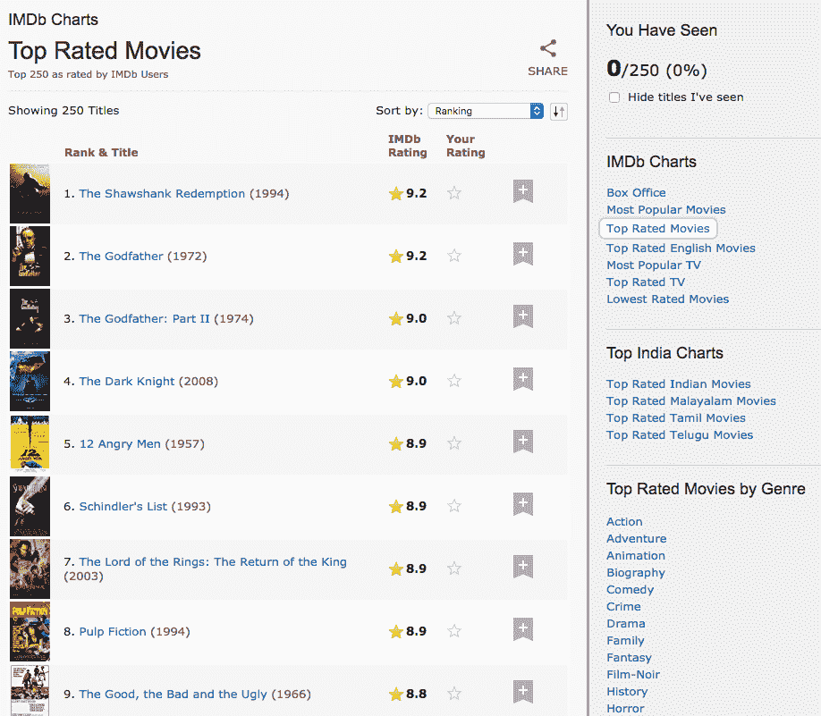
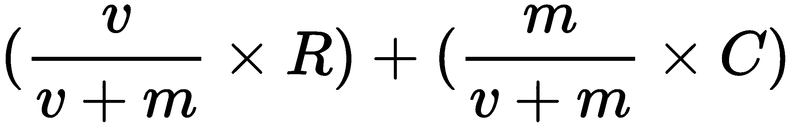
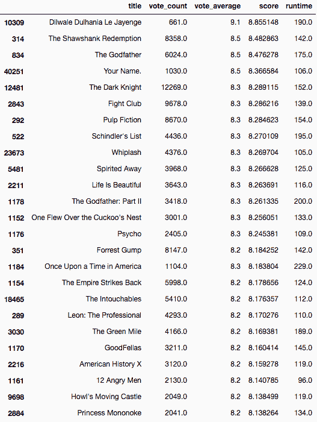
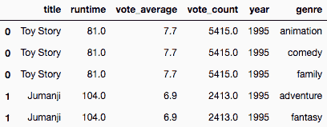
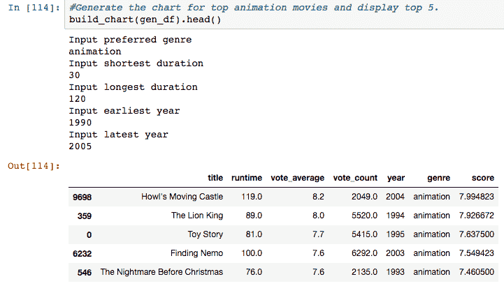

# 第三章：使用 Pandas 构建 IMDB 前 250 名克隆

**互联网电影数据库**（**IMDB**）维护着一个名为 IMDB Top 250 的榜单，这是根据某种评分标准对前 250 部电影的排名。榜单中的所有电影都是非纪录片、影院上映且时长至少为 45 分钟，并且有超过 25 万条评分：



这个图表可以被认为是最简单的推荐系统。它没有考虑特定用户的口味，也没有尝试推断不同电影之间的相似性。它只是根据预定义的指标为每部电影计算分数，并根据该分数输出排序后的电影列表。

在本章中，我们将涵盖以下内容：

+   构建 IMDB 前 250 名图表的克隆（以下简称为简单推荐系统）。

+   将图表的功能向前推进一步，构建一个基于知识的推荐系统。该模型考虑用户对电影的偏好，如类型、时间段、时长、语言等，并推荐符合所有条件的电影。

# 技术要求

你需要在系统上安装 Python。最后，为了使用本书的 Git 仓库，用户还需要安装 Git。

本章的代码文件可以在 GitHub 上找到：

[`github.com/PacktPublishing/Hands-On-Recommendation-Systems-with-Python`](https://github.com/PacktPublishing/Hands-On-Recommendation-Systems-with-Python)。

查看以下视频，看看代码的实际效果：

[`bit.ly/2v7SZD4`](http://bit.ly/2v7SZD4)[.](http://bit.ly/2v7SZD4)

# 简单的推荐系统

构建我们简单推荐系统的第一步是设置我们的工作空间。让我们在名为`Chapter3`的目录中创建一个新的 Jupyter Notebook，命名为`Simple Recommender`，并在浏览器中打开它。

现在让我们加载在上一章中使用的数据集到我们的笔记本中。

如果你还没有下载，数据集可以在以下位置获取：

[`www.kaggle.com/rounakbanik/the-movies-dataset/downloads/movies_metadata.csv/7`](https://www.kaggle.com/rounakbanik/the-movies-dataset/downloads/movies_metadata.csv/7)。

```py
import pandas as pd
import numpy as np

#Load the dataset into a pandas dataframe
df = pd.read_csv('../data/movies_')

#Display the first five movies in the dataframe
df.head()
```

运行该单元格后，你应该会在笔记本中看到一个熟悉的类似表格的结构输出。

构建简单的推荐系统相当简单。步骤如下：

1.  选择一个指标（或分数）来为电影评分

1.  决定电影出现在图表中的先决条件

1.  计算每部符合条件的电影的分数

1.  输出按分数递减顺序排列的电影列表

# 指标

指标是根据其数值来对电影进行排名的量化标准。如果一部电影的指标分数高于另一部电影，那么它就被认为比另一部电影更好。确保我们拥有一个强大且可靠的指标来构建我们的图表，这对确保推荐的高质量至关重要。

指标的选择是任意的。可以使用的最简单的指标之一是电影评分。然而，这样做有许多缺点。首先，电影评分没有考虑到电影的受欢迎程度。因此，一部由 10 万人评分为 9 的电影将排在一部由 100 人评分为 9.5 的电影之后。

这样做并不可取，因为一部仅有 100 人观看并评分的电影，很可能迎合的是一个非常特定的小众群体，可能不像前者那样对普通观众有吸引力。

还有一个众所周知的事实是，随着投票人数的增加，电影的评分会趋于正常化，接近反映电影质量和普及度的值。换句话说，评分很少的电影并不太可靠。五个人打 10 分的电影不一定是好电影。

因此，我们需要的是一个可以在一定程度上兼顾电影评分和它获得的投票数（作为受欢迎度的替代指标）的指标。这样一来，它会更倾向于选择一部由 10 万人评分为 8 的大片，而不是由 100 人评分为 9 的艺术片。

幸运的是，我们不必为这个指标构思数学公式。正如本章标题所示，我们正在构建一个 IMDB 前 250 的克隆。因此，我们将使用 IMDB 的加权评分公式作为我们的指标。从数学角度来看，它可以表示为以下形式：

*加权评分 (WR) =* 

以下内容适用：

+   *v* 是电影获得的评分次数

+   *m* 是电影进入排行榜所需的最低投票数（前提条件）

+   *R* 是电影的平均评分

+   *C* 是数据集中所有电影的平均评分

我们已经有了每部电影的 *v* 和 *R* 值，分别以 `vote_count` 和 `vote_average` 形式呈现。计算 *C* 非常简单，正如我们在上一章中所见。

# 前提条件

IMDB 加权公式还包含一个变量 *m*，它用于计算评分。这个变量的存在是为了确保只有超过某一受欢迎度阈值的电影才能进入排名。因此，*m* 的值决定了哪些电影有资格进入排行榜，并且通过成为公式的一部分，决定了最终的评分值。

就像这个指标一样，*m* 的值选择是任意的。换句话说，*m* 没有正确的值。建议尝试不同的 *m* 值，然后选择你（和你的受众）认为能给出最佳推荐的值。唯一需要记住的是，*m* 的值越高，电影的受欢迎程度所占的比重越大，因此选择性也越高。

对于我们的推荐系统，我们将使用第 80 百分位电影获得的投票数作为 *m* 的值。换句话说，为了使电影出现在排行榜上，它必须获得比数据集中至少 80% 的电影更多的投票。此外，第 80 百分位电影获得的投票数将用于先前描述的加权公式中，来计算评分值。

现在让我们计算 *m* 的值：

```py
#Calculate the number of votes garnered by the 80th percentile movie
m = df['vote_count'].quantile(0.80)
m

OUTPUT: 50.0
```

我们可以看到，只有 20% 的电影获得了超过 50 次投票。因此，我们的 *m* 值是 `50`。

我们希望具备的另一个前提条件是运行时间。我们将只考虑时长超过 `45 分钟` 且小于 `300 分钟` 的电影。我们将定义一个新的数据框 `q_movies`，它将包含所有符合条件的电影，以便出现在图表中：

```py
#Only consider movies longer than 45 minutes and shorter than 300 minutes
q_movies = df[(df['runtime'] >= 45) & (df['runtime'] <= 300)]

#Only consider movies that have garnered more than m votes
q_movies = q_movies[q_movies['vote_count'] >= m]

#Inspect the number of movies that made the cut
q_movies.shape

OUTPUT:
(8963, 24)
```

我们看到，在 45,000 部电影的数据集中，大约 9,000 部电影（即 20%）达到了标准。

# 计算评分

在计算评分之前，我们需要发现的最后一个值是 *C*，即数据集中所有电影的平均评分：

```py
# Calculate C
C = df['vote_average'].mean()
C

OUTPUT:
5.6182072151341851
```

我们可以看到，电影的平均评分大约是 5.6/10。看起来 IMDB 对其评分的标准非常严格。现在我们已经有了 *C* 的值，接下来可以计算每部电影的评分。

首先，让我们定义一个函数，根据电影的特征以及 *m* 和 *C* 的值来计算评分：

```py
# Function to compute the IMDB weighted rating for each movie
def weighted_rating(x, m=m, C=C):
    v = x['vote_count']
    R = x['vote_average']
    # Compute the weighted score
    return (v/(v+m) * R) + (m/(m+v) * C)
```

接下来，我们将在 `q_movies` 数据框上使用熟悉的 `apply` 函数来构建一个新的特征 *score*。由于计算是对每一行进行的，我们将设置轴 `1` 来表示按行操作：

```py
# Compute the score using the weighted_rating function defined above
q_movies['score'] = q_movies.apply(weighted_rating, axis=1)
```

# 排序与输出

只剩下一步。现在我们需要根据刚才计算的评分对数据框进行排序，并输出前几名电影的列表：



完成了！你刚刚构建了你的第一个推荐系统。恭喜你！

我们可以看到，宝莱坞电影 *Dilwale Dulhania Le Jayenge* 排名榜单的顶部。我们还可以看到，它的投票数明显少于其他前 25 名电影。这强烈暗示我们应该探索更高的 *m* 值。这部分留给读者作为练习；尝试不同的 *m* 值，并观察图表中电影的变化。

# 基于知识的推荐系统

在本节中，我们将继续在 IMDB Top 250 克隆的基础上构建一个基于知识的推荐系统。这将是一个简单的函数，执行以下任务：

1.  询问用户他/她想要的电影类型

1.  询问用户电影的时长

1.  询问用户推荐电影的时间范围

1.  使用收集到的信息，向用户推荐评分较高（根据 IMDB 公式）且符合前述条件的电影：

我们拥有的数据包含时长、类型和时间线的信息，但目前的形式并不直接可用。换句话说，我们的数据需要进行整理，才能用于构建推荐系统。

在我们的`Chapter3`文件夹中，让我们创建一个新的 Jupyter Notebook，命名为`Knowledge Recommender`*。*这个笔记本将包含我们在这一部分编写的所有代码。

和往常一样，让我们加载所需的包和数据到笔记本中。我们还可以查看我们拥有的特性，并决定哪些对这个任务有用：

```py
import pandas as pd
import numpy as np

df = pd.read_csv('../data/movies_metadata.csv')

#Print all the features (or columns) of the DataFrame
df.columns

OUTPUT:
Index(['adult', 'belongs_to_collection', 'budget', 'genres', 'homepage', 'id',
       'imdb_id', 'original_language', 'original_title', 'overview',
       'popularity', 'poster_path', 'production_companies',
       'production_countries', 'release_date', 'revenue', 'runtime',
       'spoken_languages', 'status', 'tagline', 'title', 'video',
       'vote_average', 'vote_count'],
      dtype='object')
```

从我们的输出中，可以很清楚地看到我们需要哪些特性，哪些不需要。现在，让我们将数据框缩减到只包含我们模型所需的特性：

```py
#Only keep those features that we require 
df = df[['title','genres', 'release_date', 'runtime', 'vote_average', 'vote_count']]

df.head()
```

接下来，让我们从`release_date`特性中提取出发行年份：

```py
#Convert release_date into pandas datetime format
df['release_date'] = pd.to_datetime(df['release_date'], errors='coerce')

#Extract year from the datetime
df['year'] = df['release_date'].apply(lambda x: str(x).split('-')[0] if x != np.nan else np.nan)
```

我们的`year`特性仍然是`object`类型，并且充满了`NaT`值，这是 Pandas 使用的一种空值类型。让我们将这些值转换为整数`0`，并将`year`特性的类型转换为`int`*。*

为此，我们将定义一个辅助函数`convert_int`，并将其应用到`year`特性上：

```py
#Helper function to convert NaT to 0 and all other years to integers.
def convert_int(x):
    try:
        return int(x)
    except:
        return 0

#Apply convert_int to the year feature
df['year'] = df['year'].apply(convert_int)
```

我们不再需要`release_date`特性。所以让我们去掉它：

```py
#Drop the release_date column
df = df.drop('release_date', axis=1)

#Display the dataframe
df.head()
```

`runtime`特性已经是可用的格式，不需要做额外的处理。现在让我们把注意力转向`genres`*。

# 类型

初步检查后，我们可以观察到类型的格式看起来像是 JSON 对象（或 Python 字典）。让我们查看一下我们某部电影的`genres`对象：

```py
#Print genres of the first movie
df.iloc[0]['genres']

OUTPUT:
"[{'id': 16, 'name': 'Animation'}, {'id': 35, 'name': 'Comedy'}, {'id': 10751, 'name': 'Family'}]"
```

我们可以观察到输出是一个字符串化的字典。为了使这个功能可用，重要的是我们将这个字符串转换为本地的 Python 字典。幸运的是，Python 提供了一个名为`literal_eval`（在`ast`库中）的函数，它正是完成这个操作的。`literal_eval`解析传递给它的任何字符串，并将其转换为相应的 Python 对象：

```py
#Import the literal_eval function from ast
from ast import literal_eval

#Define a stringified list and output its type
a = "[1,2,3]"
print(type(a))

#Apply literal_eval and output type
b = literal_eval(a)
print(type(b))

OUTPUT:
<class 'str'>
<class 'list'>
```

现在我们拥有了所有必需的工具来将*genres*特性转换为 Python 字典格式。

此外，每个字典代表一个类型，并具有两个键：`id`和`name`*。*然而，对于这个练习（以及所有后续的练习），我们只需要`name`*。*因此，我们将把字典列表转换成字符串列表，其中每个字符串是一个类型名称：

```py
#Convert all NaN into stringified empty lists
df['genres'] = df['genres'].fillna('[]')

#Apply literal_eval to convert to the list object
df['genres'] = df['genres'].apply(literal_eval)

#Convert list of dictionaries to a list of strings
df['genres'] = df['genres'].apply(lambda x: [i['name'] for i in x] if isinstance(x, list) else [])

df.head()
```

打印数据框的头部应该会显示一个新的`genres`特性，它是一个类型名称的列表。然而，我们还没有完成。最后一步是`explode`类型列。换句话说，如果某部电影有多个类型，我们将创建多行每行代表该电影的一个类型。

例如，如果有一部电影叫做*Just Go With It*，其类型为*romance*和*comedy*，我们将通过`explode`将这部电影拆分成两行。一行将是*Just Go With It*作为一部*romance*电影，另一行则是*comedy*电影：

```py
#Create a new feature by exploding genres
s = df.apply(lambda x: pd.Series(x['genres']),axis=1).stack().reset_index(level=1, drop=True)

#Name the new feature as 'genre'
s.name = 'genre'

#Create a new dataframe gen_df which by dropping the old 'genres' feature and adding the new 'genre'.
gen_df = df.drop('genres', axis=1).join(s)

#Print the head of the new gen_df
gen_df.head()
```



现在你应该能够看到三行*Toy Story*数据；每一行代表一个类别：*动画*、*家庭*和*喜剧*。这个`gen_df`数据框就是我们将用来构建基于知识的推荐系统的数据。

# `build_chart`函数

我们终于可以编写作为推荐系统的函数了。我们不能使用之前计算的*m*和*C*值，因为我们并不是考虑所有的电影，而仅仅是符合条件的电影。换句话说，这有三个主要步骤：

1.  获取用户关于他们偏好的输入

1.  提取所有符合用户设定条件的电影

1.  仅针对这些电影计算*m*和*C*的值，然后按照上一节中的方式构建图表

因此，`build_chart`函数将仅接受两个输入：我们的`gen_df`数据框和用于计算*m*值的百分位数。默认情况下，我们将其设置为 80%，即`0.8`：

```py
def build_chart(gen_df, percentile=0.8):
    #Ask for preferred genres
    print("Input preferred genre")
    genre = input()

    #Ask for lower limit of duration
    print("Input shortest duration")
    low_time = int(input())

    #Ask for upper limit of duration
    print("Input longest duration")
    high_time = int(input())

    #Ask for lower limit of timeline
    print("Input earliest year")
    low_year = int(input())

    #Ask for upper limit of timeline
    print("Input latest year")
    high_year = int(input())

    #Define a new movies variable to store the preferred movies. Copy the contents of gen_df to movies
    movies = gen_df.copy()

    #Filter based on the condition
    movies = movies[(movies['genre'] == genre) & 
                    (movies['runtime'] >= low_time) & 
                    (movies['runtime'] <= high_time) & 
                    (movies['year'] >= low_year) & 
                    (movies['year'] <= high_year)]

    #Compute the values of C and m for the filtered movies
    C = movies['vote_average'].mean()
    m = movies['vote_count'].quantile(percentile)

    #Only consider movies that have higher than m votes. Save this in a new dataframe q_movies
    q_movies = movies.copy().loc[movies['vote_count'] >= m]

    #Calculate score using the IMDB formula
    q_movies['score'] = q_movies.apply(lambda x: (x['vote_count']/(x['vote_count']+m) * x['vote_average']) 
                                       + (m/(m+x['vote_count']) * C)
                                       ,axis=1)

    #Sort movies in descending order of their scores
    q_movies = q_movies.sort_values('score', ascending=False)

    return q_movies
```

是时候让我们的模型投入实际使用了！

我们希望推荐的动画电影时长在 30 分钟到 2 小时之间，并且上映时间介于 1990 年到 2005 年之间。让我们来看看结果：



我们可以看到，输出的电影满足我们作为输入传递的所有条件。由于我们应用了 IMDB 的评分标准，我们还可以观察到我们的电影在评分上非常高，而且同时也很受欢迎。前五名还包括*狮子王*，这是我最喜欢的动画电影！就我个人而言，我会非常满意这个列表的结果。

# 总结

在这一章中，我们构建了一个简单的推荐系统，它是 IMDB Top 250 排行榜的克隆。然后我们继续构建了一个改进的基于知识的推荐系统，该系统要求用户提供他们偏好的类型、时长和上映时间。在构建这些模型的过程中，我们还学习了如何使用 Pandas 库进行一些高级的数据整理。

在下一章中，我们将使用更高级的特性和技术来构建一个基于内容的推荐系统。该模型将能够根据电影的情节来检测相似的电影，并通过识别类型、演员、导演、情节等方面的相似性来推荐电影。
