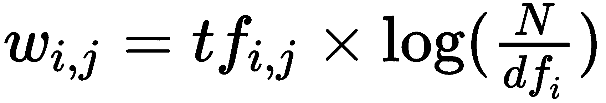
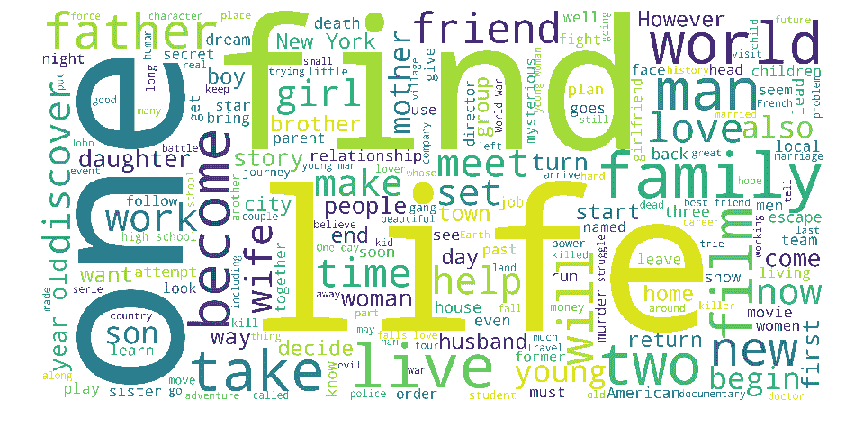
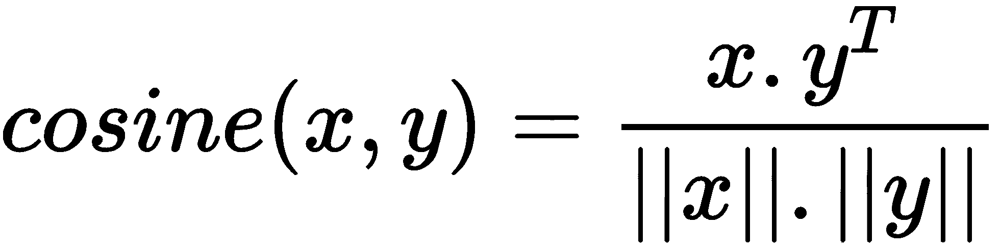
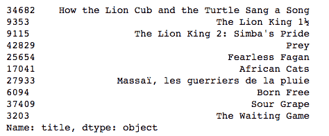
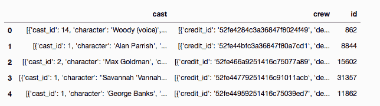
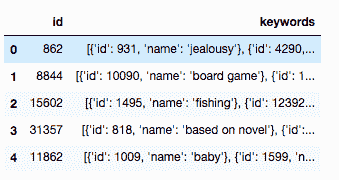
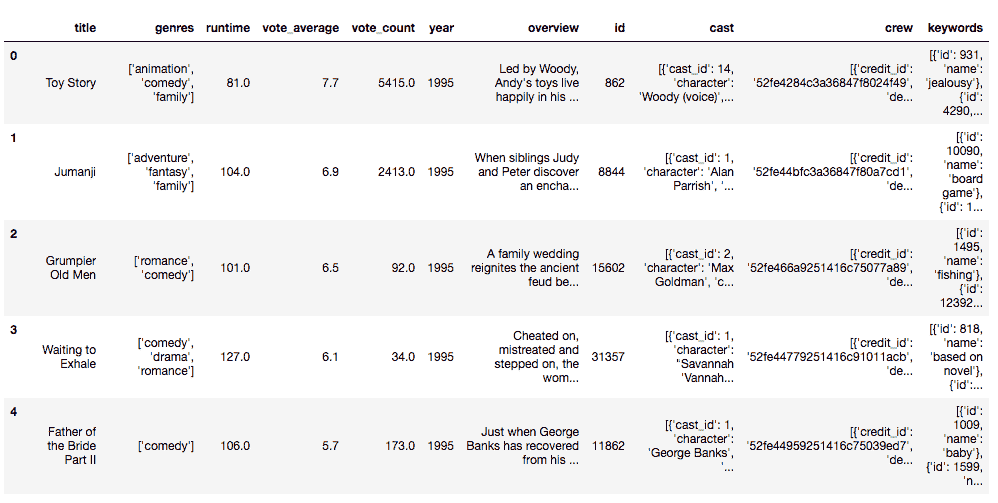
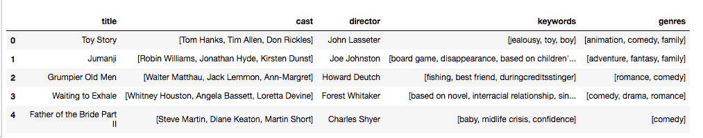
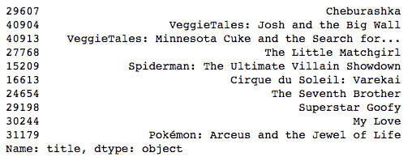

# 第四章：构建基于内容的推荐系统

在上一章中，我们建立了一个 IMDB Top 250 克隆（一个简单推荐系统）和一个基于知识的推荐系统，根据时间线、类型和时长建议电影。然而，这些系统都非常原始。简单推荐系统没有考虑个别用户的偏好。基于知识的推荐系统考虑了用户对类型、时间线和时长的偏好，但模型及其推荐仍然非常通用。

假设 Alice 喜欢的电影有 *《黑暗骑士》*、**《钢铁侠》** 和 *《超人：钢铁之躯》*。很显然，Alice 喜欢超级英雄电影。然而，我们在上一章建立的模型无法捕捉到这一细节。它们能做的最好的事情就是建议 *动作* 电影（通过让 Alice 输入 *动作* 作为首选类型），而动作电影是超级英雄电影的超集。

也有可能两部电影拥有相同的类型、时间线和时长特征，但在受众上有很大的不同。例如，考虑 *《宿醉》* 和 *《遗忘萨拉·马歇尔》*。这两部电影都是 21 世纪第一个十年上映的，都持续了大约两个小时，都是喜剧片。然而，喜欢这两部电影的观众类型却截然不同。

解决这个问题的一个显而易见的办法是要求用户提供更多的元数据作为输入。例如，如果我们增加 *子类型* 输入，用户就能输入如 *超级英雄、黑色幽默* 和 *浪漫喜剧* 等值，从而获得更合适的推荐结果，但这种解决方案在可用性方面存在很大问题。

第一个问题是我们没有 *子类型* 数据。其次，即使有数据，用户极不可能了解他们喜欢的电影的元数据。最后，即使他们知道这些，他们也肯定不会有耐心将这些信息输入到一个长表单中。相反，他们更愿意做的是告诉你他们喜欢/不喜欢的电影，并期待得到与他们口味相符的推荐。

正如我们在第一章中讨论的那样，这正是 Netflix 等网站所做的。当你第一次注册 Netflix 时，它没有任何关于你口味的信息来建立个人档案，利用社区的力量为你推荐电影（这是我们在后续章节中会探讨的概念）。相反，它会要求你提供一些你喜欢的电影，并显示与你喜欢的电影最相似的结果。

在本章中，我们将构建两种类型的基于内容的推荐系统：

+   **基于情节描述的推荐系统：** 该模型比较不同电影的描述和标语，提供情节描述最相似的推荐结果。

+   **基于元数据的推荐系统：**该模型考虑了大量特征，例如类型、关键词、演员和制作人员，并提供最相似的推荐，基于上述特征。

# 技术要求

您需要在系统上安装 Python。最后，要使用本书的 Git 仓库，用户需要安装 Git。

本章的代码文件可以在 GitHub 上找到：

[`github.com/PacktPublishing/Hands-On-Recommendation-Systems-with-Python`](https://github.com/PacktPublishing/Hands-On-Recommendation-Systems-with-Python)[.](https://github.com/PacktPublishing/Hands-On-Recommendation-Systems-with-Python)

查看以下视频，看看代码如何执行：

[`bit.ly/2LOcac2`](http://bit.ly/2LOcac2)[.](http://bit.ly/2LOcac2)

# 导出清理后的 DataFrame

在上一章中，我们对元数据进行了系列数据整理和清理，以将其转换为更易用的形式。为了避免再次执行这些步骤，我们将清理后的 DataFrame 保存为 CSV 文件。像往常一样，使用 pandas 来做这一切非常简单。

在第四章的知识推荐器 notebook 中，*请输入以下代码*：

```py
#Convert the cleaned (non-exploded) dataframe df into a CSV file and save it in the data folder
#Set parameter index to False as the index of the DataFrame has no inherent meaning.
df.to_csv('../data/metadata_clean.csv', index=False)
```

您的`data`文件夹现在应该包含一个新文件，`metadata_clean.csv`。

让我们创建一个新的文件夹，`Chapter 4`*，*并在该文件夹内打开一个新的 Jupyter Notebook。现在让我们将新文件导入这个 Notebook：

```py
import pandas as pd
import numpy as np

#Import data from the clean file 
df = pd.read_csv('../data/metadata_clean.csv')

#Print the head of the cleaned DataFrame
df.head()
```

该单元应输出一个已经清理并符合所需格式的 DataFrame。

# 文档向量

本质上，我们正在构建的模型计算文本之间的成对相似度。那么，我们如何用数字量化两篇文本之间的相似度呢？

换句话说，考虑三部电影：A、B 和 C。我们如何在数学上证明 A 的情节比 B 更像 C 的情节（或反之）？

解答这些问题的第一步是将文本体（以下简称为文档）表示为数学量。这是通过将这些文档表示为向量来实现的*。*换句话说，每个文档都被描绘为一系列*n*个数字，其中每个数字代表一个维度，*n*是所有文档词汇的总大小。

但是这些向量的值是多少？这个问题的答案取决于我们使用的*向量化工具*，即将文档转换为向量的工具。最受欢迎的两种向量化工具是 CountVectorizer 和 TF-IDFVectorizer*。

# CountVectorizer

CountVectorizer 是最简单的向量化工具，最好的解释方法是通过一个示例。假设我们有三篇文档，A、B 和 C，如下所示：

+   **A**：太阳是一颗恒星。

+   **B**：我的爱像一朵红红的玫瑰

+   **C**：玛丽有只小羊

我们现在需要使用 CountVectorizer 将这些文档转换为向量形式。第一步是计算词汇表的大小。词汇表是指所有文档中出现的唯一词汇数量。因此，这三份文档的词汇表如下：the, sun, is, a, star, my, love, like, red, rose, mary, had, little, lamb。结果，词汇表的大小是 14。

通常的做法是不会将极为常见的单词（如 a, the, is, had, my 等）包含在词汇表中，这些单词也被称为停用词。因此，在去除停用词后，我们的词汇表 *V* 如下：

**V**：like, little, lamb, love, mary, red, rose, sun, star

现在我们的词汇表大小是九。因此，我们的文档将被表示为九维向量，每个维度代表某个特定单词在文档中出现的次数。换句话说，第一个维度表示 "like" 出现的次数，第二个维度表示 "little" 出现的次数，以此类推。

因此，使用 CountVectorizer 方法，A、B 和 C 将现在表示如下：

+   **A**：（0, 0, 0, 0, 0, 0, 0, 1, 1）

+   **B**：（1, 0, 0, 1, 0, 2, 1, 0, 0）

+   **C**：（0, 1, 1, 0, 1, 0, 0, 0, 0）

# TF-IDF Vectorizer

不是文档中的所有词汇都具有相同的权重。当我们完全去除停用词时，我们已经观察到了这一点。但词汇中存在的词都赋予了相等的权重。

但这总是正确的吗？

例如，考虑一个关于狗的文档集合。现在，很明显，这些文档中将频繁出现 "dog" 这个词。因此，"dog" 的出现并不像其他只在少数文档中出现的词那样重要。

**TF-IDF** **Vectorizer**（**词频-逆文档频率**）考虑到了上述因素，并根据以下公式为每个单词分配权重。对于文档 *j* 中的每个单词 *i*，适用以下公式：



在这个公式中，以下是成立的：

+   *w*[*i, j*] 是词汇 *i* 在文档 *j* 中的权重

+   *df[i]* 是包含词汇 *i* 的文档数量

+   *N* 是文档的总数

我们不会深入探讨公式及相关计算。只需记住，文档中一个词的权重越大，如果它在该文档中出现的频率越高，并且出现在较少的文档中。权重 *w*[*i,j*]的取值范围是`0`到`1`：



我们将使用 TF-IDF Vectorizer，因为某些词（如前面词云中的词汇）在描述图表时的出现频率远高于其他词。因此，根据 TF-IDF 公式为文档中的每个单词分配权重是一个好主意。

使用 TF-IDF 的另一个原因是它加速了计算文档对之间的余弦相似度得分。当我们在代码中实现时，将会更详细地讨论这一点。

# 余弦相似度得分

我们将在第五章《数据挖掘技术入门》中详细讨论相似度得分。现在，我们将使用*余弦相似度*度量来构建我们的模型。余弦得分非常稳健且容易计算（尤其是当与 TF-IDF 向量化器一起使用时）。

两个文档*x*和*y*之间的余弦相似度得分计算公式如下：



余弦得分可以取从-1 到 1 之间的任何值。余弦得分越高，文档之间的相似度就越大。现在，我们有了一个良好的理论基础，可以开始使用 Python 构建基于内容的推荐系统了。

# 基于剧情描述的推荐系统

我们的基于剧情描述的推荐系统将以电影标题作为输入，并输出一份基于电影剧情最相似的电影列表。以下是我们将在构建该模型时执行的步骤：

1.  获取构建模型所需的数据

1.  为每部电影的剧情描述（或概述）创建 TF-IDF 向量

1.  计算每对电影的余弦相似度得分

1.  编写推荐函数，该函数接受电影标题作为输入，并基于剧情输出与其最相似的电影

# 准备数据

目前，虽然数据框（DataFrame）已经清理完毕，但它并不包含构建基于剧情描述的推荐系统所需的特征。幸运的是，这些必要的特征可以在原始元数据文件中找到。

我们需要做的就是导入它们并将其添加到我们的数据框中：

```py
#Import the original file
orig_df = pd.read_csv('../data/movies_metadata.csv', low_memory=False)

#Add the useful features into the cleaned dataframe
df['overview'], df['id'] = orig_df['overview'], orig_df['id']

df.head()
```

现在数据框应该包含两个新特征：`overview`和`id`。我们将在构建这个模型时使用`overview`，而使用`id`来构建下一个模型。

`overview`特征由字符串组成，理想情况下，我们应该通过去除所有标点符号并将所有单词转换为小写来清理它们。然而，正如我们接下来会看到的，`scikit-learn`库会自动为我们完成这一切工作，这个库将在本章中大规模应用于构建模型。

# 创建 TF-IDF 矩阵

下一步是创建一个数据框，其中每一行表示我们主数据框中对应电影的`overview`特征的 TF-IDF 向量。为此，我们将使用`scikit-learn`库，它为我们提供了一个 TfidfVectorizer 对象，能够轻松地完成这一过程：

```py
#Import TfIdfVectorizer from the scikit-learn library
from sklearn.feature_extraction.text import TfidfVectorizer

#Define a TF-IDF Vectorizer Object. Remove all english stopwords
tfidf = TfidfVectorizer(stop_words='english')

#Replace NaN with an empty string
df['overview'] = df['overview'].fillna('')

#Construct the required TF-IDF matrix by applying the fit_transform method on the overview feature
tfidf_matrix = tfidf.fit_transform(df['overview'])

#Output the shape of tfidf_matrix
tfidf_matrix.shape

OUTPUT:
(45466, 75827)
```

我们看到，向量化器为每部电影的概述创建了一个 75,827 维的向量。

# 计算余弦相似度得分

下一步是计算每部电影的成对余弦相似度分数。换句话说，我们将创建一个 45,466 × 45,466 的矩阵，其中第*i^(th)*行和第*j^(th)*列的单元格表示电影*i*和*j*之间的相似度分数。*我们可以很容易地看到，这个矩阵具有对称性，且对角线上的每个元素都是 1，因为它表示电影与自身的相似度分数。*

和 TF-IDFVectorizer 一样，`scikit-learn`也有计算上述相似度矩阵的功能。然而，计算余弦相似度是一个计算上昂贵的过程。幸运的是，由于我们的电影情节是以 TF-IDF 向量表示的，因此它们的幅度始终为 1。*因此，我们无需计算余弦相似度公式中的分母，因为它始终是 1。我们的工作现在简化为计算一个更简单、更计算廉价的点积（这也是`scikit-learn`提供的功能）：*

```py
# Import linear_kernel to compute the dot product
from sklearn.metrics.pairwise import linear_kernel

# Compute the cosine similarity matrix
cosine_sim = linear_kernel(tfidf_matrix, tfidf_matrix)
```

尽管我们在计算更便宜的点积，整个过程仍然需要几分钟才能完成。通过计算每部电影与其他电影的相似度分数，我们现在处于一个非常有利的位置，可以编写我们的最终推荐函数。

# 构建推荐函数

最后一步是创建我们的推荐函数。但是，在此之前，让我们先创建一个电影标题及其对应索引的反向映射。换句话说，让我们创建一个 pandas 系列，将电影标题作为索引，电影在主 DataFrame 中的索引作为值：

```py
#Construct a reverse mapping of indices and movie titles, and drop duplicate titles, if any
indices = pd.Series(df.index, index=df['title']).drop_duplicates()
```

我们将在构建推荐函数时执行以下步骤：

1.  将电影标题声明为一个参数。

1.  从`indices`反向映射中获取电影的索引。

1.  使用`cosine_sim`获取该电影与所有其他电影的余弦相似度分数列表。将其转换为一个元组列表，其中第一个元素是位置，第二个元素是相似度分数。

1.  根据余弦相似度分数对这个元组列表进行排序。

1.  获取这个列表的前 10 个元素。忽略第一个元素，因为它表示与自身的相似度分数（与某部电影最相似的电影显然就是它自己）。

1.  返回与前 10 个元素索引对应的标题，排除第一个：

```py
# Function that takes in movie title as input and gives recommendations 
def content_recommender(title, cosine_sim=cosine_sim, df=df, indices=indices):
    # Obtain the index of the movie that matches the title
    idx = indices[title]

    # Get the pairwsie similarity scores of all movies with that movie
    # And convert it into a list of tuples as described above
    sim_scores = list(enumerate(cosine_sim[idx]))

    # Sort the movies based on the cosine similarity scores
    sim_scores = sorted(sim_scores, key=lambda x: x[1], reverse=True)

    # Get the scores of the 10 most similar movies. Ignore the first movie.
    sim_scores = sim_scores[1:11]

    # Get the movie indices
    movie_indices = [i[0] for i in sim_scores]

    # Return the top 10 most similar movies
    return df['title'].iloc[movie_indices]
```

恭喜！你已经构建了你的第一个基于内容的推荐系统。现在是时候让我们的推荐系统实际运作了！让我们请求它推荐类似于`《狮子王》`的电影：*

```py
#Get recommendations for The Lion King
content_recommender('The Lion King')
```



我们看到我们的推荐系统在其前 10 名列表中建议了所有*《狮子王》*的续集。我们还注意到，列表中的大多数电影都与狮子有关。

不言而喻，喜欢*《狮子王》*的人很可能对迪士尼电影情有独钟。他们也许还更倾向于观看动画片。不幸的是，我们的情节描述推荐器无法捕捉到所有这些信息。

因此，在下一部分中，我们将构建一个使用更高级元数据的推荐系统，如类型、演员、工作人员和关键词（或子类型）。这个推荐系统将能够更好地识别个人对特定导演、演员、子类型等的喜好。

# 基于元数据的推荐系统

我们将大致按照基于剧情描述的推荐系统的步骤来构建我们的基于元数据的模型。当然，主要的区别在于我们用来构建模型的数据类型。

# 数据准备

为了构建这个模型，我们将使用以下元数据：

+   电影的类型。

+   电影的导演。此人是工作人员的一部分。

+   电影的三大主演。他们是演员阵容的一部分。

+   子类型或 关键词。

除了类型之外，我们的 DataFrame（无论是原始的还是清洗过的）并未包含我们所需要的数据。因此，在这次练习中，我们需要下载两个附加文件：`credits.csv`*，*其中包含电影演员和工作人员的信息，以及 `keywords.csv`*，*其中包含子类型的信息。

你可以从以下网址下载所需的文件：[`www.kaggle.com/rounakbanik/the-movies-dataset/data`](https://www.kaggle.com/rounakbanik/the-movies-dataset/data)。

将两个文件放入你的 `data`文件夹中。在将数据转换为可用格式之前，我们需要进行大量的清洗工作。让我们开始吧！

# 关键词和演员阵容数据集

让我们开始加载新数据到现有的 Jupyter Notebook 中：

```py
# Load the keywords and credits files
cred_df = pd.read_csv('../data/credits.csv')
key_df = pd.read_csv('../data/keywords.csv')

#Print the head of the credit dataframe
cred_df.head()
```



```py
#Print the head of the keywords dataframe
key_df.head()
```



我们可以看到演员阵容、工作人员和关键词都采用了我们熟悉的`字典列表`格式。就像 `genres`*，*我们必须将它们简化为字符串或字符串列表。

然而，在此之前，我们将联合三个 DataFrame，以便将所有特征合并到一个 DataFrame 中。连接 pandas DataFrame 与在 SQL 中连接表格是相同的。我们将用于连接 DataFrame 的键是 `id` 特征。然而，为了使用这个，我们首先需要明确地将其转换为 ID 格式。这显然是错误的数据。因此，我们应该查找

转换为整数。我们已经知道如何做到这一点：

```py
#Convert the IDs of df into int
df['id'] = df['id'].astype('int')
```

运行上面的代码会导致`ValueError`。仔细检查后，我们发现*1997-08-20* 被列为 ID。这显然是错误的数据。因此，我们应该找到所有 ID 错误的行并删除它们，以确保代码执行成功：

```py
# Function to convert all non-integer IDs to NaN
def clean_ids(x):
    try:
        return int(x)
    except:
        return np.nan

#Clean the ids of df
df['id'] = df['id'].apply(clean_ids)

#Filter all rows that have a null ID
df = df[df['id'].notnull()]
```

现在我们已经准备好将所有三个 DataFrame 的 ID 转换为整数，并将它们合并成一个 DataFrame：

```py
# Convert IDs into integer
df['id'] = df['id'].astype('int')
key_df['id'] = key_df['id'].astype('int')
cred_df['id'] = cred_df['id'].astype('int')

# Merge keywords and credits into your main metadata dataframe
df = df.merge(cred_df, on='id')
df = df.merge(key_df, on='id')

#Display the head of the merged df
df.head()
```



# 处理关键词、演员和工作人员

现在我们已经将所有需要的特征合并到一个 DataFrame 中，让我们将它们转换为更易于使用的格式。更具体地说，我们将进行以下几项转换：

+   将`keywords`转换为字符串列表，其中每个字符串是一个关键词（类似于类型）。我们只会包括前三个关键词。因此，这个列表最多可以包含三个元素。

+   将`cast`转换为字符串列表，其中每个字符串都是一位明星。像`keywords`一样，我们只会包括我们演员阵容中的前三位明星。

+   将`crew`转换为`director`。换句话说，我们只提取电影的导演，忽略其他所有工作人员。

第一步是将这些字符串化的对象转换为原生的 Python 对象：

```py
# Convert the stringified objects into the native python objects
from ast import literal_eval

features = ['cast', 'crew', 'keywords', 'genres']
for feature in features:
    df[feature] = df[feature].apply(literal_eval)
```

接下来，我们从`crew`列表中提取导演。为此，我们首先检查`crew`列表中字典的结构：

```py
#Print the first cast member of the first movie in df
df.iloc[0]['crew'][0]

OUTPUT:
{'credit_id': '52fe4284c3a36847f8024f49',
 'department': 'Directing',
 'gender': 2,
 'id': 7879,
 'job': 'Director',
 'name': 'John Lasseter',
 'profile_path': '/7EdqiNbr4FRjIhKHyPPdFfEEEFG.jpg'}
```

我们看到这个字典由`job`和`name`键组成。由于我们只对导演感兴趣，我们将循环遍历特定列表中的所有工作人员，并在`job`为`Director`时提取`name`。让我们编写一个函数来实现这一点：

```py
# Extract the director's name. If director is not listed, return NaN
def get_director(x):
    for crew_member in x:
        if crew_member['job'] == 'Director':
            return crew_member['name']
    return np.nan

```

既然我们已经有了`get_director`函数，我们可以定义新的`director`特性：

```py
#Define the new director feature
df['director'] = df['crew'].apply(get_director)

#Print the directors of the first five movies
df['director'].head()

OUTPUT:
0 John Lasseter
1 Joe Johnston
2 Howard Deutch
3 Forest Whitaker
4 Charles Shyer
Name: director, dtype: object
```

`keywords`和`cast`都是字典列表。在这两种情况下，我们需要提取每个列表中的前三个`name`属性。因此，我们可以编写一个单一的函数来处理这两个特性。另外，和`keywords`以及`cast`一样，我们只会考虑每部电影的前三个类型：

```py
# Returns the list top 3 elements or entire list; whichever is more.
def generate_list(x):
    if isinstance(x, list):
        names = [ele['name'] for ele in x]
        #Check if more than 3 elements exist. If yes, return only first three. 
        #If no, return entire list.
        if len(names) > 3:
            names = names[:3]
        return names

    #Return empty list in case of missing/malformed data
    return []
```

我们将使用这个函数来处理我们的`cast`和`keywords`特性。我们也只会考虑前三个列出的`genres`：

```py
#Apply the generate_list function to cast and keywords
df['cast'] = df['cast'].apply(generate_list)
df['keywords'] = df['keywords'].apply(generate_list)

#Only consider a maximum of 3 genres
df['genres'] = df['genres'].apply(lambda x: x[:3])
```

现在，让我们来看看我们处理后的数据样本：

```py
# Print the new features of the first 5 movies along with title
df[['title', 'cast', 'director', 'keywords', 'genres']].head(3)
```



在后续步骤中，我们将使用向量化器来构建文档向量。如果两个演员有相同的名字（比如 Ryan Reynolds 和 Ryan Gosling），向量化器会将这两个 Ryan 视为相同的人，尽管它们显然是不同的个体。这会影响我们获得的推荐质量。如果一个人喜欢 Ryan Reynolds 的电影，并不意味着他也喜欢所有 Ryan 的电影。

因此，最后一步是去除关键词、演员和导演姓名之间的空格，并将它们全部转换为小写字母。因此，前面例子中的两个 Ryan 将变成*ryangosling*和*ryanreynolds*，我们的向量化器现在能够区分它们：

```py
# Function to sanitize data to prevent ambiguity. 
# Removes spaces and converts to lowercase
def sanitize(x):
    if isinstance(x, list):
        #Strip spaces and convert to lowercase
        return [str.lower(i.replace(" ", "")) for i in x]
    else:
        #Check if director exists. If not, return empty string
        if isinstance(x, str):
            return str.lower(x.replace(" ", ""))
        else:
            return ''
#Apply the generate_list function to cast, keywords, director and genres
for feature in ['cast', 'director', 'genres', 'keywords']:
    df[feature] = df[feature].apply(sanitize)
```

# 创建元数据 soup

在基于剧情描述的推荐系统中，我们只处理了一个*overview*特性，这是一个文本体。因此，我们能够直接应用我们的向量化器。

然而，在基于元数据的推荐系统中情况并非如此。我们有四个特性需要处理，其中三个是列表，一个是字符串。我们需要做的是创建一个包含演员、导演、关键词和类型的`soup`。这样，我们就可以将这个 soup 输入到我们的向量化器中，并执行类似之前的后续步骤：

```py
#Function that creates a soup out of the desired metadata
def create_soup(x):
    return ' '.join(x['keywords']) + ' ' + ' '.join(x['cast']) + ' ' + x['director'] + ' ' + ' '.join(x['genres'])
```

有了这个功能，我们创建了`soup`特性：

```py
# Create the new soup feature
df['soup'] = df.apply(create_soup, axis=1)
```

现在，让我们看一下其中一个 `soup` 值。它应该是一个包含表示电影类型、演员和关键词的字符串：

```py
#Display the soup of the first movie
df.iloc[0]['soup']

OUTPUT:
'jealousy toy boy tomhanks timallen donrickles johnlasseter animation comedy family'
```

创建好 `soup` 后，我们现在处于一个良好的位置，可以创建文档向量、计算相似度得分，并构建基于元数据的推荐函数。

# 生成推荐

接下来的步骤几乎与前一部分的相应步骤相同。

我们将使用 CountVectorizer，而不是 TF-IDFVectorizer。这是因为使用 TF-IDFVectorizer 会对在较多电影中担任演员和导演的人员赋予较低的权重。

这是不理想的，因为我们不希望因为艺术家参与或执导更多电影而给予惩罚：

```py
#Define a new CountVectorizer object and create vectors for the soup
count = CountVectorizer(stop_words='english')
count_matrix = count.fit_transform(df['soup'])
```

不幸的是，使用 CountVectorizer 意味着我们必须使用计算开销更大的 `cosine_similarity` 函数来计算相似度得分：

```py
#Import cosine_similarity function
from sklearn.metrics.pairwise import cosine_similarity

#Compute the cosine similarity score (equivalent to dot product for tf-idf vectors)
cosine_sim2 = cosine_similarity(count_matrix, count_matrix)
```

由于我们剔除了几个索引不良的电影，我们需要重新构建反向映射。让我们在下一步中完成这项工作：

```py
# Reset index of your df and construct reverse mapping again
df = df.reset_index()
indices2 = pd.Series(df.index, index=df['title'])
```

在构建好新的反向映射并计算出相似度得分后，我们可以通过传入 `cosine_sim2` 作为参数，重用上一部分定义的 `content_recommender` 函数。现在，让我们通过请求同一部电影《狮子王》的推荐来测试我们的新模型：

```py
content_recommender('The Lion King', cosine_sim2, df, indices2)
```



该案例给出的推荐与我们基于剧情描述的推荐系统提供的推荐截然不同。我们看到，它能够捕捉到比“狮子”更多的信息。列表中的大多数电影都是动画片，且包含拟人化角色。

就个人而言，我觉得 *《宝可梦：阿尔宙斯与生命之珠》* 的推荐尤其有趣。这部电影与 *《狮子王》* 都 featuring 动画拟人化角色，这些角色几年后回来报复那些曾经伤害过他们的人。

# 改进建议

本章构建的基于内容的推荐系统，当然，远远不及行业中使用的强大模型。仍有许多提升空间。在这一部分，我将提出一些关于如何升级您已经构建的推荐系统的建议：

+   **尝试不同数量的关键词、类型和演员**：在我们构建的模型中，我们最多考虑了三个关键词、类型和演员。这是一个随意的决定。实验不同数量的这些特征，看看是否能有效地为元数据“汤”贡献更多信息。

+   **提出更多明确的子类型**：我们的模型只考虑了关键词列表中出现的前三个关键词。然而，这样做并没有充分的理由。事实上，某些关键词可能只出现在一部电影中（从而使它们变得无用）。一个更有效的技术是，像定义电影类型一样，定义一个明确的子类型数量，并只将这些子类型分配给电影。

+   **给予导演更多的权重**：我们的模型给导演和演员同等的权重。然而，你可以认为，电影的特色更多是由导演决定的。我们可以通过在推荐模型中多次提到导演，而不仅仅是一次，来给导演更多的关注。可以尝试调整导演在推荐中的出现次数。

+   **考虑其他工作人员成员**：导演并不是唯一赋予电影其特色的人物。你也可以考虑加入其他工作人员成员，比如制作人和编剧，来丰富你的推荐模型。

+   **尝试其他元数据**：在构建我们的元数据模型时，我们只考虑了类型、关键词和演员名单。然而，我们的数据集中还有很多其他特征，比如制作公司、国家和语言。你也可以考虑这些数据点，因为它们可能能够捕捉到重要的信息（比如两部电影是否由*皮克斯*制作）。

+   **引入流行度过滤器**：有可能两部电影有相同的类型和子类型，但在质量和受欢迎程度上却相差甚远。在这种情况下，你可能希望引入一个流行度过滤器，考虑*n*最相似的电影，计算加权评分，并展示前五个结果。你已经在上一章学习了如何做到这一点。

# 总结

在这一章中，我们已经走了很长一段路。我们首先学习了文档向量，并简要介绍了余弦相似度评分。接下来，我们构建了一个推荐系统，能够识别具有相似剧情描述的电影。然后，我们构建了一个更高级的模型，利用了其他元数据的力量，比如类型、关键词和演员名单。最后，我们讨论了几种可以改进现有系统的方法。

至此，我们正式结束了基于内容的推荐系统的学习。在接下来的章节中，我们将讨论目前业界最流行的推荐模型之一：协同过滤。
