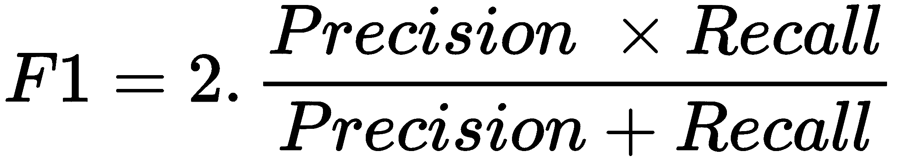

# 第五章：入门数据挖掘技术

2003 年，亚马逊的 Linden、Smith 和 York 发布了一篇名为《项目与项目协同过滤》的论文，解释了亚马逊如何进行产品推荐。从那时起，这类算法已经主导了推荐行业的标准。每一个拥有大量用户的的网站或应用，无论是 Netflix、Amazon 还是 Facebook，都使用某种形式的协同过滤来推荐项目（这些项目可能是电影、商品或朋友）：


正如第一章所描述的，协同过滤试图利用社区的力量来提供可靠、相关的，甚至有时是令人惊讶的推荐。如果 Alice 和 Bob 大多数情况下喜欢相同的电影（比如《狮子王》、《阿拉丁》和《玩具总动员》），而且 Alice 还喜欢《海底总动员》，那么 Bob 很可能也会喜欢这部电影，尽管他还没有看过。

我们将在下一章构建强大的协同过滤器。然而，在此之前，了解构建协同过滤器所涉及的基础技术、原理和算法是非常重要的。

因此，在本章中，我们将涵盖以下主题：

+   **相似度度量**：给定两个项目，我们如何数学地量化它们之间的差异或相似性？相似度度量帮助我们解答这个问题。

    在构建内容推荐引擎时，我们已经使用了相似度度量（余弦相似度）。在本章中，我们将介绍一些其他流行的相似度度量。

+   **降维**：在构建协同过滤时，我们通常会处理数百万用户对数百万项目的评分。在这种情况下，我们的用户和项目向量的维度往往达到数百万。为了提高性能，加速计算并避免维度灾难，通常建议大幅减少维度的数量，同时保留大部分信息。本章这一部分将描述一些能够实现这一目标的技术。

+   **监督学习**：监督学习是一类利用标注数据推断映射函数的机器学习算法，这个映射函数可以用来预测未标注数据的标签（或类别）。我们将学习一些最流行的监督学习算法，如支持向量机、逻辑回归、决策树和集成方法。

+   **聚类**：聚类是一种无监督学习方法，算法尝试将所有数据点划分为若干个簇。因此，在没有标签数据集的情况下，聚类算法能够为所有未标注的数据点分配类别。在本节中，我们将学习 k-means 聚类算法，这是一种简单但功能强大的算法，广泛应用于协同过滤中。

+   **评估方法和指标**：我们将介绍几种用于评估这些算法性能的评估指标，包括准确率、精确度和召回率。

本章所涉及的主题足以成为一本完整的教材。由于这是一个动手的推荐引擎教程，我们不会过多深入探讨大多数算法的工作原理，也不会从零开始编写它们。我们要做的是理解它们的工作方式及适用时机，它们的优缺点，以及如何利用 scikit-learn 库轻松实现它们。

# 问题陈述

协同过滤算法试图解决预测问题（如第一章《推荐系统入门》中所述）。换句话说，我们给定了一个 i 个用户和 j 个项目的矩阵。矩阵中第 i 行第 j 列的值（记作 rij）表示用户 i 对项目 j 给出的评分：


i 个用户和 j 个项目的矩阵

我们的任务是完成这个矩阵。换句话说，我们需要预测矩阵中没有数据的所有单元格。例如，在前面的图示中，我们需要预测用户 E 是否会喜欢音乐播放器项。为完成这一任务，一些评分是已知的（例如用户 A 喜欢音乐播放器和视频游戏），而另一些则未知（例如我们不知道用户 C 和 D 是否喜欢视频游戏）。

# 相似度度量

从上一节中的评分矩阵来看，每个用户可以用一个 j 维的向量表示，其中第 k 维表示该用户对第 k 项的评分。例如，设 1 表示喜欢，-1 表示不喜欢，0 表示没有评分。因此，用户 B 可以表示为 (0, 1, -1, -1)。类似地，每个项目也可以用一个 i 维的向量表示，其中第 k 维表示第 k 用户对该项目的评分。因此，视频游戏项目可以表示为 (1, -1, 0, 0, -1)。

我们在构建基于内容的推荐引擎时，已经计算了相似度得分，针对相同维度的向量。在本节中，我们将讨论其他相似度度量，并重新审视在其他得分背景下的余弦相似度得分。

# 欧几里得距离

欧几里得距离可以定义为连接在 *n* 维笛卡尔平面上绘制的两个数据点的线段长度。例如，考虑在二维平面上绘制的两个点：


欧几里得距离

两个点之间的距离 d 给出了欧几里得距离，其在二维空间中的公式如前图所示。

更一般地，考虑两个 *n* 维的点（或向量）：

+   **v1**: (q1, q2,...., qn)

+   **v2**: (r1, r2,....., rn)

然后，欧几里得得分在数学上定义为：


欧几里得分数可以取从 0 到无穷大的任何值。欧几里得分数（或距离）越低，两个向量就越相似。现在，我们来定义一个简单的函数，使用 NumPy 来计算两个 *n* 维向量之间的欧几里得距离，公式如下：

```py
#Function to compute Euclidean Distance. 
def euclidean(v1, v2):

    #Convert 1-D Python lists to numpy vectors
    v1 = np.array(v1)
    v2 = np.array(v2)

    #Compute vector which is the element wise square of the difference
    diff = np.power(np.array(v1)- np.array(v2), 2)

    #Perform summation of the elements of the above vector
    sigma_val = np.sum(diff)

    #Compute square root and return final Euclidean score
    euclid_score = np.sqrt(sigma_val)

    return euclid_score
```

接下来，我们定义三个对五部不同电影进行了评分的用户：

```py
#Define 3 users with ratings for 5 movies
u1 = [5,1,2,4,5]
u2 = [1,5,4,2,1]
u3 = [5,2,2,4,4]
```

从评分来看，我们可以看到用户 1 和 2 的口味极为不同，而用户 1 和 3 的口味大致相似。我们来看看欧几里得距离是否能够捕捉到这一点：

```py
euclidean(u1, u2)

OUTPUT:
7.4833147735478827
```

用户 1 和 2 之间的欧几里得距离约为 7.48：

```py
euclidean(u1, u3)

OUTPUT:
1.4142135623730951
```

用户 1 和 3 之间的欧几里得距离明显小于用户 1 和 2 之间的距离。因此，在这种情况下，欧几里得距离能够令人满意地捕捉到我们用户之间的关系。

# 皮尔逊相关系数

考虑两位用户 Alice 和 Bob，他们对同五部电影进行了评分。Alice 对评分非常苛刻，任何电影的评分都不超过 4。另一方面，Bob 比较宽松，评分从不低于 2。我们来定义代表 Alice 和 Bob 的矩阵，并计算他们的欧几里得距离：

```py
alice = [1,1,3,2,4]
bob = [2,2,4,3,5]

euclidean(alice, bob)

OUTPUT:
2.2360679774997898
```

我们得到了约 2.23 的欧几里得距离。然而，经过更仔细的检查，我们发现 Bob 总是给出比 Alice 高 1 分的评分。因此，我们可以说 Alice 和 Bob 的评分是极其相关的。换句话说，如果我们知道 Alice 对一部电影的评分，我们可以通过简单地加 1 来高精度地计算 Bob 对同一部电影的评分。

考虑另一个用户 Eve，她的口味与 Alice 完全相反：

```py
eve = [5,5,3,4,2]

euclidean(eve, alice)

OUTPUT:
6.324555320336759
```

我们得到了一个非常高的得分 6.32，这表明这两个人的差异很大。如果我们使用欧几里得距离，我们无法做出更多的分析。然而，经过检查，我们发现 Alice 和 Eve 对一部电影的评分总是加起来等于 6。因此，尽管两个人非常不同，但一个人的评分可以用来准确预测另一个人的对应评分。从数学角度来说，我们说 Alice 和 Eve 的评分是强烈的负相关。

欧几里得距离强调的是大小，而在这个过程中，它无法很好地衡量相似性或差异性。这就是皮尔逊相关系数发挥作用的地方。皮尔逊相关系数是一个介于 -1 和 1 之间的分数，其中 -1 表示完全负相关（如 Alice 和 Eve 的情况），1 表示完全正相关（如 Alice 和 Bob 的情况），而 0 表示两者之间没有任何相关性（或彼此独立）。

数学上，皮尔逊相关系数的定义如下：


这里， 表示向量 *i* 中所有元素的平均值。

SciPy 包提供了一个计算皮尔逊相似度分数的函数：

```py
from scipy.stats import pearsonr

pearsonr(alice, bob)

OUTPUT:
(1.0, 0.0)
pearsonr(alice, eve)

OUTPUT:
(-1.0, 0.0)
```

我们列表输出的第一个元素是皮尔逊分数。我们看到 Alice 和 Bob 有最高可能的相似度分数，而 Alice 和 Eve 有最低可能的分数。

你能猜出 Bob 和 Eve 的相似度分数吗？

# 余弦相似度

在前一章中，我们数学上定义了余弦相似度分数，并在构建基于内容的推荐系统时广泛使用它：


数学上，余弦相似度定义如下：


余弦相似度分数计算在 *n* 维空间中两个向量之间的夹角余弦值。当余弦分数为 1（或角度为 0）时，向量完全相似。另一方面，余弦分数为-1（或角度为 180 度）表示两个向量完全不相似。

现在考虑两个均值为零的向量 x 和 y。我们看到在这种情况下，皮尔逊相关分数与余弦相似度分数完全相同。换句话说，对于均值为零的中心化向量，皮尔逊相关性即是余弦相似度分数。

在不同的场景中，适合使用不同的相似度分数。对于重视幅度的情况，欧几里得距离是一个适当的度量标准。然而，正如我们在皮尔逊相关子节中所看到的那样，对我们而言幅度并不像相关性重要。因此，在构建过滤器时，我们将使用皮尔逊和余弦相似度分数。

# 聚类

协同过滤背后的主要思想之一是，如果用户 A 对某个产品的意见与用户 B 相同，则 A 在另一个产品上与 B 的意见相同的可能性也比随机选择的用户更高。

聚类是协同过滤算法中最流行的技术之一。它是一种无监督学习，根据数据点之间的相似性将数据点分组到不同的类中：


例如，假设我们所有的用户都被绘制在一个二维笛卡尔平面上，如前图所示。聚类算法的任务是为平面上的每个点分配类别。就像相似性度量一样，没有一种聚类算法可以解决所有问题。每种算法都有其特定的使用场景，只适用于某些问题。在本节中，我们只会讨论 k-means 聚类算法，它能够很好地为前述的点集分配类别。我们还将看到一个 k-means 不适用的案例。

# k-means 聚类

k-means 算法是最简单也是最流行的机器学习算法之一。它将数据点和聚类的数量（k）作为输入。

接下来，它会随机绘制 k 个不同的点在平面上（称为质心）。在随机绘制了 k 个质心后，以下两个步骤会反复执行，直到 k 个质心的集合不再发生变化：

+   点到质心的分配：每个数据点会被分配给离它最近的质心。被分配给某个特定质心的数据点集合称为一个聚类。因此，将点分配给 k 个质心会形成 k 个聚类。

+   质心的重新分配：在下一步中，每个聚类的质心会重新计算，作为该聚类的中心（或者是该聚类中所有点的平均值）。然后，所有数据点将重新分配到新的质心：


上面的截图展示了 k-means 聚类算法步骤的可视化，已分配的聚类数量为两个。

本章的某些部分使用了 Matplotlib 和 Seaborn 库进行可视化。你不需要理解书中编写的绘图代码，但如果你仍然感兴趣，可以在[`matplotlib.org/users/pyplot_tutorial.html`](https://matplotlib.org/users/pyplot_tutorial.html)找到官方的 Matplotlib 教程，在[`seaborn.pydata.org/tutorial.html`](https://seaborn.pydata.org/tutorial.html)找到官方的 Seaborn 教程。

我们不会从头实现 k-means 算法，而是使用 scikit-learn 提供的实现。作为第一步，让我们访问本节开头绘制的数据点：

```py
#Import the function that enables us to plot clusters
from sklearn.datasets.samples_generator import make_blobs

#Get points such that they form 3 visually separable clusters
X, y = make_blobs(n_samples=300, centers=3,
                       cluster_std=0.50, random_state=0)

#Plot the points on a scatterplot
plt.scatter(X[:, 0], X[:, 1], s=50)
```

使用 k-means 算法时，最重要的步骤之一是确定聚类的数量。在这种情况下，从图中（以及代码中）可以清楚地看出，我们已经将点绘制成三个明显可分的聚类。现在，让我们通过 scikit-learn 应用 k-means 算法并评估其性能：

```py
#Import the K-Means Class
from sklearn.cluster import KMeans

#Initializr the K-Means object. Set number of clusters to 3, 
#centroid initilalization as 'random' and maximum iterations to 10
kmeans = KMeans(n_clusters=3, init='random', max_iter=10)

#Compute the K-Means clustering 
kmeans.fit(X)

#Predict the classes for every point
y_pred = kmeans.predict(X)

#Plot the data points again but with different colors for different classes
plt.scatter(X[:, 0], X[:, 1], c=y_pred, s=50)

#Get the list of the final centroids
centroids = kmeans.cluster_centers_

#Plot the centroids onto the same scatterplot.
plt.scatter(centroids[:, 0], centroids[:, 1], c='black', s=100, marker='X')
```

我们看到该算法在识别三个聚类方面表现非常成功。三个最终的质心也在图中标记为 X：


# 选择 k

如前一小节所述，选择合适的 k 值对 k-means 聚类算法的成功至关重要。聚类数可以在 1 到数据点总数之间的任何数值（每个点被分配到自己的聚类中）。

现实世界中的数据很少像之前探讨的那样，其中数据点在二维平面上形成了明确定义、视觉上可分的聚类。为了确定一个合适的 K 值，有几种方法可供选择。在本节中，我们将探讨通过肘部法则来确定 k 值的方法。

肘部法则计算每个 k 值的平方和，并选择平方和与 K 的关系图中的肘部点作为 k 的最佳值。肘部点定义为 k 值，在该点之后，所有后续 k 的平方和值开始显著减缓下降。

平方和值被定义为每个数据点到其所属聚类质心的距离的平方和。数学表达式如下：


这里，Ck 是第 k 个聚类，uk 是 Ck 对应的质心。

幸运的是，scikit-learn 的 k-means 实现会在计算聚类时自动计算平方和。现在我们来可视化数据的肘部图，并确定最佳的 K 值：

```py
#List that will hold the sum of square values for different cluster sizes
ss = []

#We will compute SS for cluster sizes between 1 and 8.
for i in range(1,9):

    #Initialize the KMeans object and call the fit method to compute clusters 
    kmeans = KMeans(n_clusters=i, random_state=0, max_iter=10, init='random').fit(X)

    #Append the value of SS for a particular iteration into the ss list
    ss.append(kmeans.inertia_)

#Plot the Elbow Plot of SS v/s K
sns.pointplot(x=[j for j in range(1,9)], y=ss)
```


从图中可以看出，肘部出现在 K=3 处。根据我们之前的可视化结果，我们知道这确实是该数据集的最佳聚类数。

# 其他聚类算法

尽管 k-means 算法非常强大，但并不适用于每一种情况。

为了说明这一点，我们构造了一个包含两个半月形状的图。与之前的簇形图相似，scikit-learn 为我们提供了一个便捷的函数来绘制半月形聚类：

```py
#Import the half moon function from scikit-learn
from sklearn.datasets import make_moons

#Get access to points using the make_moons function
X_m, y_m = make_moons(200, noise=.05, random_state=0)

#Plot the two half moon clusters
plt.scatter(X_m[:, 0], X_m[:, 1], s=50)
```


k-means 算法能否正确识别两个半月形状的聚类？我们来看看：

```py
#Initialize K-Means Object with K=2 (for two half moons) and fit it to our data
kmm = KMeans(n_clusters=2, init='random', max_iter=10)
kmm.fit(X_m)

#Predict the classes for the data points
y_m_pred = kmm.predict(X_m)

#Plot the colored clusters as identified by K-Means
plt.scatter(X_m[:, 0], X_m[:, 1], c=y_m_pred, s=50)
```

现在我们来可视化 k-means 认为这组数据点存在的两个聚类：


我们看到，k-means 算法在识别正确的聚类上做得不好。对于像这些半月形状的聚类，另一种名为谱聚类的算法，结合最近邻和相似度，表现得要好得多。

我们不会深入探讨谱聚类的原理。相反，我们将使用其在 scikit-learn 中的实现，并直接评估其性能：

```py
#Import Spectral Clustering from scikit-learn
from sklearn.cluster import SpectralClustering

#Define the Spectral Clustering Model
model = SpectralClustering(n_clusters=2, affinity='nearest_neighbors')

#Fit and predict the labels
y_m_sc = model.fit_predict(X_m)

#Plot the colored clusters as identified by Spectral Clustering
plt.scatter(X_m[:, 0], X_m[:, 1], c=y_m_sc, s=50)
```


我们看到，谱聚类在识别半月形聚类方面表现得非常好。

我们已经看到，不同的聚类算法适用于不同的情况。协同过滤的情况也一样。例如，我们将在下一章讨论的 surprise 包，它实现了一种协同过滤方法，使用了另一种聚类算法，叫做共聚类。我们将总结聚类的讨论，并转向另一种重要的数据挖掘技术：降维。

# 降维

大多数机器学习算法随着数据维度数量的增加而表现不佳。这种现象通常被称为维度灾难。因此，减少数据中可用特征的数量，同时尽可能保留最多的信息，是一个好主意。实现这一目标有两种方式：

+   **特征选择**：这种方法涉及识别出最少预测能力的特征，并将其完全删除。因此，特征选择涉及识别出对特定用例最重要的特征子集。特征选择的一个重要特点是，它保持每个保留特征的原始意义。例如，假设我们有一个包含价格、面积和房间数量的住房数据集。如果我们删除了面积特征，那么剩下的价格和房间数量特征仍然会保留其原本的意义。

+   **特征提取**：特征提取将 *m* 维数据转化为 *n* 维输出空间（通常 *m* >> *n*），同时尽可能保留大部分信息。然而，在此过程中，它创建了没有内在意义的新特征。例如，如果我们使用特征提取将同一个住房数据集输出为二维空间，新的特征将不再表示价格、面积或房间数量。它们将不再具有任何意义。

在本节中，我们将介绍一个重要的特征提取方法：**主成分分析**（或**PCA**）。

# 主成分分析

**主成分分析**是一种无监督的特征提取算法，它将 *m* 维输入转化为一组 *n* （*m* >> *n*）线性不相关的变量（称为主成分），以尽可能减少由于丢失 (*m* - *n*) 维度而导致的方差（或信息）损失。

PCA 中的线性变换是以这样的方式进行的：第一个主成分具有最大方差（或信息）。它通过考虑那些彼此高度相关的变量来实现这一点。每个主成分的方差都大于后续成分，且与前一个成分正交。

考虑一个三维空间，其中两个特征高度相关，而与第三个特征的相关性较低：


假设我们希望将其转换为二维空间。为此，PCA 试图识别第一个主成分，该主成分将包含最大可能的方差。它通过定义一个新维度，使用这两个高度相关的变量来实现。接下来，它试图定义下一个维度，使其具有最大方差，与第一个主成分正交，并且与其不相关。前面的图展示了这两个新维度（或主成分），PC 1 和 PC 2。

要理解 PCA 算法，需要一些超出本书范围的线性代数概念。相反，我们将使用`scikit-learn`提供的 PCA 黑盒实现，并以著名的 Iris 数据集为例来考虑一个实际案例。

第一步是将 Iris 数据集从 UCI 机器学习库加载到 pandas DataFrame 中：

```py
# Load the Iris dataset into Pandas DataFrame
iris = pd.read_csv("https://archive.ics.uci.edu/ml/machine-learning-databases/iris/iris.data", 
                 names=['sepal_length','sepal_width','petal_length','petal_width','class'])

#Display the head of the dataframe
iris.head()
```


PCA 算法对数据的尺度非常敏感。因此，我们将对所有特征进行缩放，使其具有均值为 0、方差为 1 的分布：

```py
#Import Standard Scaler from scikit-learn
from sklearn.preprocessing import StandardScaler

#Separate the features and the class
X = iris.drop('class', axis=1)
y = iris['class']

# Scale the features of X
X = pd.DataFrame(StandardScaler().fit_transform(X), 
                 columns = ['sepal_length','sepal_width','petal_length','petal_width'])

X.head()
```


现在我们已经准备好应用 PCA 算法了。让我们将数据转换到二维空间中：

```py
#Import PCA
from sklearn.decomposition import PCA

#Intialize a PCA object to transform into the 2D Space.
pca = PCA(n_components=2)

#Apply PCA
pca_iris = pca.fit_transform(X)
pca_iris = pd.DataFrame(data = pca_iris, columns = ['PC1', 'PC2'])

pca_iris.head()
```


`scikit-learn`的 PCA 实现还会为我们提供每个主成分所包含的方差比率信息：

```py
pca.explained_variance_ratio

OUTPUT:
array([ 0.72770452, 0.23030523])
```

我们看到，第一个主成分包含大约 72.8%的信息，而第二个主成分包含大约 23.3%的信息。总的来说，保留了 95.8%的信息，而去除两个维度则损失了 4.2%的信息。

最后，让我们在新的二维平面中按类别可视化我们的数据点：

```py
#Concatenate the class variable
pca_iris = pd.concat([pca_iris, y], axis = 1)

#Display the scatterplot
sns.lmplot(x='PC1', y='PC2', data=pca_iris, hue='class', fit_reg=False)
```


# 其他降维技术

# 线性判别分析

与 PCA 类似，线性判别分析是一种线性变换方法，旨在将*m*维数据转换为*n*维输出空间。

然而，与 PCA 不同，PCA 旨在保留最大的信息量，而 LDA 则旨在识别一组*n*个特征，从而使类之间的分离度（或判别度）最大化。由于 LDA 需要标注的数据来确定其成分，因此它是一种监督学习算法。

现在让我们对 Iris 数据集应用 LDA 算法：

```py
#Import LDA
from sklearn.discriminant_analysis import LinearDiscriminantAnalysis

#Define the LDA Object to have two components
lda = LinearDiscriminantAnalysis(n_components = 2)

#Apply LDA
lda_iris = lda.fit_transform(X, y)
lda_iris = pd.DataFrame(data = lda_iris, columns = ['C1', 'C2'])

#Concatenate the class variable
lda_iris = pd.concat([lda_iris, y], axis = 1)

#Display the scatterplot
sns.lmplot(x='C1', y='C2', data=lda_iris, hue='class', fit_reg=False)

```


我们看到，类之间的可分性比 PCA 方法下要好得多。

# 奇异值分解

奇异值分解（SVD）是一种矩阵分析技术，它允许我们将一个高维矩阵表示为低维矩阵。SVD 通过识别并去除矩阵中不重要的部分来实现这一点，从而在所需的维度数中生成一个近似值。

协同过滤的 SVD 方法最早由 Simon Funk 提出，并在 Netflix 奖竞赛中证明了其极高的受欢迎度和有效性。不幸的是，理解 SVD 需要掌握超出本书范围的线性代数知识。不过，在下一章中，我们将使用 `surprise` 包提供的黑箱实现来进行 SVD 协同过滤。

# 有监督学习

有监督学习是一类机器学习算法，它接收一系列向量及其对应的输出（一个连续值或一个类别）作为输入，生成一个推断函数，该函数可用于映射新的例子。

使用有监督学习的一个重要前提是需要有标注数据。换句话说，我们必须能够访问已经知道正确输出的输入数据。

有监督学习可以分为两种类型：分类和回归。分类问题的目标变量是一个离散值集（例如，喜欢和不喜欢），而回归问题的目标是一个连续值（例如，介于一到五之间的平均评分）。

考虑前面定义的评分矩阵。可以将（*m-1*）列作为输入，而第 m^(th) 列作为目标变量。通过这种方式，我们应该能够通过传入相应的（m-1）维向量来预测 m^(th) 列中不可用的值。

有监督学习是机器学习中最成熟的子领域之一，因此，现有许多强大的算法可以用于进行准确的预测。在这一部分，我们将探讨一些在多种应用中成功使用的最流行算法（包括协同过滤器）。

# k-最近邻

**k-最近邻** (**k-NN**) 可能是最简单的机器学习算法。在分类问题中，它通过其 *k* 个最近邻的多数投票为特定数据点分配一个类别。换句话说，数据点被分配给在其 k 个最近邻中最常见的类别。在回归问题中，它基于 k 个最近邻计算目标变量的平均值。

与大多数机器学习算法不同，k-NN 是非参数且懒惰的。前者意味着 k-NN 不对数据的分布做任何假设，换句话说，模型结构是由数据决定的。后者意味着 k-NN 几乎不进行任何训练，它只在预测阶段计算特定点的 k 个最近邻。这也意味着 k-NN 模型在预测过程中需要始终访问训练数据，不能像其他算法那样在预测时丢弃训练数据。

# 分类


k-NN 分类最好通过一个示例来解释。考虑一个具有二进制类的数据集（表示为蓝色方块和红色三角形）。k-NN 现在将其绘制到*n*维空间中（在这种情况下是二维）。

假设我们想预测绿色圆圈的类。在 k-NN 算法做出预测之前，它需要知道需要考虑的最近邻的数量（即*k*的值）。*k*通常是奇数（以避免在二进制分类的情况下出现平局）。

假设*k=3*。

k-NN 计算绿色圆圈与训练数据集中每个其他点的距离度量（通常是欧几里得距离），并选择与其最接近的三个数据点。在这种情况下，这些点位于实心内圈内。

下一步是确定三点中的多数类。这里有两个红色三角形和一个蓝色方块。因此，绿色圆圈被分配为红色三角形类。

现在，假设*k=5*。

在这种情况下，最近邻是所有包含在虚线外圈内的点。这次，我们有两个红色三角形和三个蓝色方块。因此，绿色圆圈被分配为蓝色方块类。

从前面的例子可以看出，*k*的值在确定数据点最终分配的类时至关重要。通常最好测试不同的*k*值，并使用交叉验证和测试数据集评估其性能。

# 回归

k-NN 回归几乎以相同的方式工作。不同之处在于，我们计算的是 k-NN 的属性值，而不是类。

假设我们有一个住房数据集，并且我们正在尝试预测一栋房子的价格。因此，特定房子的价格将由其*k*个最近邻房子的平均价格来决定。与分类一样，最终的目标值可能会根据*k*的值有所不同。

对于本节中的其余算法，我们将只介绍分类过程。然而，像 k-NN 一样，大多数算法只需要做出非常小的修改，就可以适用于回归问题。

# 支持向量机

支持向量机是行业中最流行的分类算法之一。它将一个*n*维数据集作为输入，并构建一个(*n-1*)维超平面，使得类之间的分离最大化。

请查看下面截图中二进制数据集的可视化：


前面的图展示了三个可能的超平面（直线），它们将两个类别分开。然而，实线是具有最大间隔的超平面。换句话说，它是最大程度上将两个类别分开的超平面。同时，它将整个平面分为两个区域。任何位于超平面下方的点将被分类为红色方块，而任何位于上方的点将被分类为蓝色圆圈。

SVM 模型仅依赖于`support vectors`*；*这些是确定两个类别之间最大间隔的点。在上面的图中，填充的方块和圆圈是支持向量。其余的点对 SVM 的运作没有影响：


SVM 也能够分离那些非线性可分的类别（如前面的图所示）。它通过特殊的工具——径向核函数，来完成这一点，这些函数将数据点绘制到更高的维度，并尝试在那里构建最大间隔超平面。

# 决策树

决策树是非常快速且简单的基于树的算法，它根据信息增益最大的特征进行分支。*决策树虽然不够准确，但具有极高的可解释性。*

我们不会深入探讨决策树的内部工作原理，但我们会通过可视化展示它的实际操作：


假设我们想使用决策树对鸢尾花数据集进行分类。前面的图中展示了执行分类的决策树。我们从顶部开始，一直到树的深处，直到到达叶节点。

例如，如果花的花瓣宽度小于 0.8 厘米，我们就会到达一个叶节点，并将其分类为 setosa*。*如果不满足条件，它会进入另一个分支，直到到达一个叶节点。

决策树在其运作中具有随机性，并且在不同的迭代中会得出不同的条件。正如前面所说，它们的预测精度也不高。然而，它们的随机性和快速执行使得它们在集成模型中非常流行，接下来的部分将对此进行解释。

# 集成

集成的主要思想是多个算法的预测能力远大于单一算法。在构建集成模型时，决策树是最常用的基础算法。

# 装袋法与随机森林

装袋法是自助法聚合的简称。像大多数其他集成方法一样，它会对大量的基础分类模型进行平均，并将它们的结果平均化以提供最终预测。

构建装袋模型的步骤如下：

1.  一定比例的数据点会被抽样（假设为 10%）。抽样是有放回的。换句话说，一个特定的数据点可以在多个迭代中出现。

1.  基线分类模型（通常是决策树）在这些抽样数据上进行训练。

1.  这个过程会一直重复，直到训练出*n*个模型为止。Bagging 模型的最终预测是所有基模型预测的平均值。

对 Bagging 模型的改进是随机森林模型。除了对数据点进行采样外，随机森林集成方法还强制每个基准模型随机选择一部分特征（通常是等于特征总数平方根的数目）：


选择一部分样本和特征来构建基准决策树，大大增强了每棵树的随机性。这反过来提高了随机森林的鲁棒性，使其能够在噪声数据上表现得非常好。

此外，从特征子集构建基准模型并分析其对最终预测的贡献，还使得随机森林能够确定每个特征的重要性。因此，通过随机森林进行特征选择是可能的（回想一下，特征选择是一种降维方法）。

# 提升算法

Bagging 和随机森林模型训练出的基准模型是完全相互独立的。因此，它们不会从每个学习器所犯的错误中学习。这就是提升算法发挥作用的地方。

和随机森林一样，提升模型通过使用样本和特征的子集来构建基准模型。然而，在构建下一个学习器时，提升模型试图纠正前一个学习器所犯的错误。不同的提升算法以不同的方式实现这一点。

例如，原始的提升算法只是将 50%的错误分类样本加入第二个学习器，并将前两个学习器不同意见的所有样本加入，构建第三个最终学习器。然后，使用这三种学习器的集成进行预测。

提升算法极其鲁棒，通常能够提供高性能。这使得它们在数据科学竞赛中非常流行，而就我们而言，它们在构建强大的协同过滤器时也非常有用。

`scikit-learn`为我们提供了本节所描述的所有算法的实现。每个算法的使用方式几乎相同。作为示例，让我们应用梯度提升算法对鸢尾花数据集进行分类：

```py
#Divide the dataset into the feature dataframe and the target class series.
X, y = iris.drop('class', axis=1), iris['class']

#Split the data into training and test datasets. 
#We will train on 75% of the data and assess our performance on 25% of the data

#Import the splitting function
from sklearn.model_selection import train_test_split

#Split the data into training and test sets
X_train, X_test, y_train, y_test = train_test_split(X, y, test_size=0.25, random_state=0)

#Import the Gradient Boosting Classifier
from sklearn.ensemble import GradientBoostingClassifier

#Apply Gradient Boosting to the training data
gbc = GradientBoostingClassifier()
gbc.fit(X_train, y_train)

#Compute the accuracy on the test set
gbc.score(X_test, y_test)

OUTPUT:
0.97368421052631582
```

我们看到，分类器在未见过的测试数据上达到了 97.3%的准确率。像随机森林一样，梯度提升机能够衡量每个特征的预测能力。让我们绘制一下鸢尾花数据集的特征重要性：

```py
#Display a bar plot of feature importances
sns.barplot(x= ['sepal_length','sepal_width','petal_length','petal_width'],       y=gbc.feature_importances_)

```


# 评估指标

在本节中，我们将查看一些指标，这些指标可以让我们从数学角度量化分类器、回归器和过滤器的性能。

# 准确率

准确率是最常用的分类模型性能衡量指标。它是正确预测的案例数与模型预测的总案例数之间的比值：


# 均方根误差

**均方根误差** (**RMSE**) 是一种广泛用于衡量回归模型表现的指标。从数学上讲，它可以表示为：


这里， 是第 i^(个)实际目标值， 是第 i^(个)预测目标值。

# 二分类指标

有时，准确率无法很好地估计模型的表现。

举个例子，考虑一个二分类数据集，其中 99%的数据属于一个类别，只有 1%的数据属于另一个类别。如果一个分类器总是预测多数类，那么它的准确率会是 99%。但这并不意味着分类器表现得好。

对于这种情况，我们需要使用其他指标。为了理解这些指标，我们首先需要定义一些术语：

+   **真正例** (**TP**)：真正例指的是实际类别和预测类别都为正类的所有情况。

+   **真负例** (**TN**)：真负例指的是实际类别和预测类别都为负类的所有情况。

+   **假正例** (**FP**)：假正例是指实际类别为负类，但预测类别为正类的所有情况。

+   **假负例** (**FN**)：假负例是指实际类别为正类，但预测类别为负类的所有情况。

举例来说，假设有一项测试试图确定某人是否患有癌症。如果测试预测某人患有癌症，而实际并未患病，那么就是假正例。相反，如果测试未能检测到某人实际上患有癌症，那么就是假负例。

# 精确率

精确率是指正确识别出的正类案例数与所有被识别为正类的案例数的比值。从数学上看，它如下所示：


# 召回率

召回率是指识别出的正类案例数与数据集中所有正类案例数的比值：


# F1 分数

F1 分数是一个衡量精确率和召回率之间平衡的指标。它是精确率和召回率的调和平均数。F1 分数为 1 表示精确率和召回率完美，F1 分数为 0 则表示精确率和召回率都无法达到：



# 总结

在本章中，我们涵盖了许多主题，这些主题将帮助我们构建强大的协同过滤器。我们看到了聚类，它是一种无监督学习算法，能够帮助我们将用户划分为明确的群体。接下来，我们通过了一些降维技术，以克服维度灾难并提升学习算法的性能。

接下来的章节讨论了监督学习算法，最后我们以各种评估指标的简要概述结束了本章。

本章涵盖的主题足以成为一本书的内容，我们并没有像通常的机器学习工程师那样深入分析这些技术。然而，我们在本章中学到的内容足以帮助我们构建和理解协同过滤器，这也是本书的主要目标之一。如果你有兴趣，关于本章所呈现主题的更详细处理，可以参考 Sebastian Thrun 的优秀书籍《*Python 机器学习*》。
