# 第六章：构建协同过滤器

在前一章节中，我们通过数学方式定义了协同过滤问题，并了解了我们认为在解决这个问题时有用的各种数据挖掘技术。

终于到了我们将技能付诸实践的时候了。在第一节中，我们将构建一个明确定义的框架，允许我们轻松构建和测试我们的协同过滤模型。这个框架将包括数据、评估指标和相应的函数，用于计算给定模型的指标。

# 技术要求

你需要在系统中安装 Python。最后，为了使用本书的 Git 仓库，用户还需要安装 Git。

本章的代码文件可以在 GitHub 上找到：

[`github.com/PacktPublishing/Hands-On-Recommendation-Systems-with-Python`](https://github.com/PacktPublishing/Hands-On-Recommendation-Systems-with-Python)。

查看以下视频，看看代码如何运行：

[`bit.ly/2mFmgRo`](http://bit.ly/2mFmgRo)[.](http://bit.ly/2mFmgRo)

# 框架

就像基于知识和基于内容的推荐系统一样，我们将在电影的背景下构建我们的协同过滤模型。由于协同过滤要求有用户行为数据，我们将使用一个不同的数据集，称为 MovieLens。

# MovieLens 数据集

MovieLens 数据集由 GroupLens Research 提供，GroupLens 是明尼苏达大学的一个计算机科学实验室。它是最流行的基准数据集之一，用于测试各种协同过滤模型的效果，通常可以在大多数推荐库和包中找到：


MovieLens 提供了关于各种电影的用户评分，且有多个版本可用。完整版本包含超过 26,000,000 条评分，涉及 45,000 部电影，由 270,000 用户评分。然而，为了快速计算，我们将使用一个更小的 100,000 数据集，该数据集包含 100,000 条评分，由 1,000 个用户对 1,700 部电影进行评分。

# 下载数据集

不再废话，让我们直接下载 100,000 数据集。官方 GroupLens 网站上提供的数据集已经不再包含用户人口统计信息。因此，我们将使用一个由 Prajit Datta 在 Kaggle 上发布的旧版数据集。

下载 MovieLens 100,000 数据集，请访问[`www.kaggle.com/prajitdatta/movielens-100k-dataset/data`](https://www.kaggle.com/prajitdatta/movielens-100k-dataset/data)。

解压文件夹并将其重命名为`movielens`。*接下来，将该文件夹移动到`RecoSys`中的`data`文件夹内。*MovieLens 数据集应该包含大约 23 个文件。然而，我们只关心`u.data`、`u.user`和`u.item`这几个文件。*让我们在下一节中探讨这些文件。

# 探索数据

正如前一节所提到的，我们只对`movielens`文件夹中的三个文件感兴趣：`u.data`、`u.user`和`u.item`。尽管这些文件不是 CSV 格式，但加载它们到 Pandas 数据框中的代码几乎是相同的。

我们从`u.user`开始*：*

```py
#Load the u.user file into a dataframe
u_cols = ['user_id', 'age', 'sex', 'occupation', 'zip_code']

users = pd.read_csv('../data/movielens/u.user', sep='|', names=u_cols,
 encoding='latin-1')

users.head()
```

这是它的输出**：**

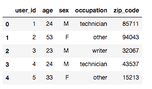

我们看到`u.user`文件包含了关于用户的 demographic（人口统计）信息，如年龄、性别、职业和邮政编码。

接下来，让我们看看`u.item`文件，它提供了关于用户已评分电影的信息：

```py
#Load the u.items file into a dataframe
i_cols = ['movie_id', 'title' ,'release date','video release date', 'IMDb URL', 'unknown', 'Action', 'Adventure',
 'Animation', 'Children\'s', 'Comedy', 'Crime', 'Documentary', 'Drama', 'Fantasy',
 'Film-Noir', 'Horror', 'Musical', 'Mystery', 'Romance', 'Sci-Fi', 'Thriller', 'War', 'Western']

movies = pd.read_csv('../data/movielens/u.item', sep='|', names=i_cols, encoding='latin-1')

movies.head()
```

这是它的输出**：**

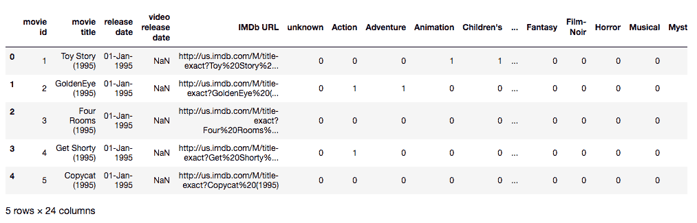

我们看到这个文件提供了关于电影的标题、上映日期、IMDb 网址以及它的类型等信息。由于我们本章专注于构建协同过滤，因此除了电影标题和对应的 ID 外，我们不需要其他任何信息：

```py
#Remove all information except Movie ID and title
movies = movies[['movie_id', 'title']]
```

最后，让我们将`u.data`文件导入到我们的笔记本中。这个文件可以说是最重要的，因为它包含了每个用户对电影的评分。正是从这个文件中，我们将构建我们的评分矩阵：

```py
#Load the u.data file into a dataframe
r_cols = ['user_id', 'movie_id', 'rating', 'timestamp']

ratings = pd.read_csv('../data/movielens/u.data', sep='\t', names=r_cols,
 encoding='latin-1')

ratings.head()
```

这是它的输出**：**

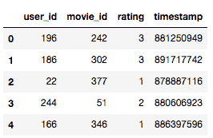

我们看到，在新的`ratings`数据框中，每一行代表一个用户在某一时间给特定电影的评分。然而，对于本章的练习，我们并不关心评分给出的具体时间。因此，我们将直接去掉这一列：

```py
#Drop the timestamp column
ratings = ratings.drop('timestamp', axis=1)
```

# 训练和测试数据

`ratings`数据框包含了电影的用户评分，评分范围从 1 到 5。因此，我们可以将这个问题建模为一个监督学习问题，其中我们需要预测一个用户对一部电影的评分。尽管评分只有五个离散值，我们仍将其建模为回归问题。

假设一个用户给某电影的真实评分是 5。一个分类模型无法区分预测的评分是 1 还是 4，它会将两者都视为错误分类。然而，一个回归模型会对前者给予更多的惩罚，这正是我们希望的行为。

正如我们在第五章中所看到的，*数据挖掘技术入门*，构建监督学习模型的第一步是构造训练集和测试集。模型将使用训练集进行学习，并使用测试集评估其效能。

现在让我们将评分数据集拆分成训练集和测试集，其中 75%的评分用于训练数据集，25%用于测试数据集。我们将使用一种稍微有点“hacky”的方式来完成：我们假设`user_id`字段是目标变量（或`y`），而我们的`ratings`数据框则由预测变量（或`X`）组成**.**然后我们将这两个变量传递给 scikit-learn 的`train_test_split`函数，并沿着`y`进行`stratify`处理。这样可以确保训练集和测试集中的每个类别的比例相同：

```py
#Import the train_test_split function
from sklearn.model_selection import train_test_split

#Assign X as the original ratings dataframe and y as the user_id column of ratings.
X = ratings.copy()
y = ratings['user_id']

#Split into training and test datasets, stratified along user_id
X_train, X_test, y_train, y_test = train_test_split(X, y, test_size = 0.25, stratify=y, random_state=42)
```

# 评估

我们从第五章，*数据挖掘技术入门*中得知，RMSE（均方根误差）是回归模型中最常用的性能评估指标。我们也将使用 RMSE 来评估我们的模型表现。`scikit-learn`已经提供了均方误差的实现。因此，我们所要做的就是定义一个函数，返回`mean_squared_error`函数返回值的平方根**:**

```py
#Import the mean_squared_error function
from sklearn.metrics import mean_squared_error

#Function that computes the root mean squared error (or RMSE)
def rmse(y_true, y_pred):
    return np.sqrt(mean_squared_error(y_true, y_pred))
```

接下来，让我们定义我们的基准协同过滤模型。我们所有的**协同过滤**（或**CF**）模型都将以`user_id`和`movie_id`作为输入，并输出一个介于 1 和 5 之间的浮动值。我们将基准模型定义为无论`user_id`或`movie_id`如何，都返回`3`**:**

```py
#Define the baseline model to always return 3.
def baseline(user_id, movie_id):
    return 3.0
```

为了测试模型的效果，我们计算该特定模型在测试数据集中的所有用户-电影对所得到的 RMSE：

```py
#Function to compute the RMSE score obtained on the testing set by a model
def score(cf_model):

    #Construct a list of user-movie tuples from the testing dataset
    id_pairs = zip(X_test['user_id'], X_test['movie_id'])

    #Predict the rating for every user-movie tuple
    y_pred = np.array([cf_model(user, movie) for (user, movie) in id_pairs])

    #Extract the actual ratings given by the users in the test data
    y_true = np.array(X_test['rating'])

    #Return the final RMSE score
    return rmse(y_true, y_pred)
```

一切准备就绪。现在让我们计算一下基准模型得到的 RMSE：

```py
score(baseline)

OUTPUT:
1.2470926188539486
```

我们得到了一个`1.247`的分数。对于接下来构建的模型，我们将尽力使得 RMSE 低于基准模型的 RMSE。

# 基于用户的协同过滤

在第一章，*推荐系统入门*中，我们了解了基于用户的协同过滤器的工作原理：它们找到与特定用户相似的用户，然后向第一个用户推荐那些用户喜欢的产品。

在本节中，我们将用代码实现这一思路。我们将构建逐渐复杂的过滤器，并使用前一节中构建的框架来评估它们的表现。

为了帮助我们完成这一过程，让我们首先构建一个评分矩阵（在第一章，*推荐系统入门*和第五章，*数据挖掘技术入门*中有所描述），其中每一行代表一个用户，每一列代表一部电影。因此，第 i^(行)和 j^(列)的值表示用户`i`对电影`j`的评分。像往常一样，pandas 提供了一个非常有用的函数，叫做`pivot_table`，可以从我们的`ratings`数据框中构建该矩阵：

```py
#Build the ratings matrix using pivot_table function
r_matrix = X_train.pivot_table(values='rating', index='user_id', columns='movie_id')

r_matrix.head()
```

这是它的输出**:**

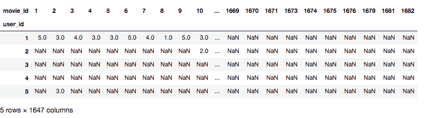

现在我们有了一个新的`r_matrix` DataFrame，其中每一行代表一个用户，每一列代表一部电影。另外，请注意，DataFrame 中的大多数值是未指定的。这给我们提供了矩阵稀疏程度的一个图景。

# 平均值

让我们首先构建最简单的协同过滤器之一。它只是输入`user_id`和`movie_id`，并输出所有评分该电影的用户的平均评分。用户之间没有区分。换句话说，每个用户的评分都赋予相同的权重。

可能有些电影只在测试集而不在训练集中（因此不在我们的评分矩阵中）。在这种情况下，我们将像基线模型一样默认评分为`3.0`：

```py
#User Based Collaborative Filter using Mean Ratings
def cf_user_mean(user_id, movie_id):

    #Check if movie_id exists in r_matrix
    if movie_id in r_matrix:
        #Compute the mean of all the ratings given to the movie
        mean_rating = r_matrix[movie_id].mean()

    else:
        #Default to a rating of 3.0 in the absence of any information
        mean_rating = 3.0

    return mean_rating

#Compute RMSE for the Mean model
score(cf_user_mean)

OUTPUT:
1.0234701463131335
```

我们看到这个模型的得分较低，因此比基线模型更好。

# 加权平均

在之前的模型中，我们给所有用户赋予了相等的权重。然而，从直觉上讲，给那些评分与当前用户相似的用户更多的权重，而不是那些评分不相似的用户，是有道理的。

因此，让我们通过引入一个权重系数来修改我们之前的模型。这个系数将是我们在上一章中计算的相似度度量之一。从数学上讲，它表示如下：

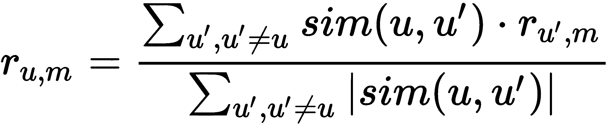

在这个公式中，*r*[*u,m*]表示用户*u*对电影*m*的评分。

为了本次练习，我们将使用余弦分数作为我们的相似度函数（或 sim）。回想一下，我们在构建基于内容的引擎时是如何构建电影余弦相似度矩阵的。在本节中，我们将为我们的用户构建一个非常相似的余弦相似度矩阵。

然而，scikit-learn 的`cosine_similarity`函数无法处理`NaN`值。因此，我们将把所有缺失值转换为零，以便计算我们的余弦相似度矩阵：

```py
#Create a dummy ratings matrix with all null values imputed to 0
r_matrix_dummy = r_matrix.copy().fillna(0)

# Import cosine_score 
from sklearn.metrics.pairwise import cosine_similarity

#Compute the cosine similarity matrix using the dummy ratings matrix
cosine_sim = cosine_similarity(r_matrix_dummy, r_matrix_dummy)

#Convert into pandas dataframe 
cosine_sim = pd.DataFrame(cosine_sim, index=r_matrix.index, columns=r_matrix.index)

cosine_sim.head(10)
```

这是它的输出**:**

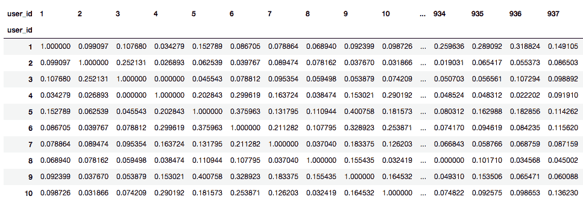

有了用户余弦相似度矩阵，我们现在可以有效地计算该模型的加权平均评分。然而，在代码中实现这个模型比其简单的均值模型要复杂一些。这是因为我们只需要考虑那些具有相应非空评分的余弦相似度分数。换句话说，我们需要避免所有没有对电影*m*进行评分的用户：

```py
#User Based Collaborative Filter using Weighted Mean Ratings
def cf_user_wmean(user_id, movie_id):

    #Check if movie_id exists in r_matrix
    if movie_id in r_matrix:

        #Get the similarity scores for the user in question with every other user
        sim_scores = cosine_sim[user_id]

        #Get the user ratings for the movie in question
        m_ratings = r_matrix[movie_id]

        #Extract the indices containing NaN in the m_ratings series
        idx = m_ratings[m_ratings.isnull()].index

        #Drop the NaN values from the m_ratings Series
        m_ratings = m_ratings.dropna()

        #Drop the corresponding cosine scores from the sim_scores series
        sim_scores = sim_scores.drop(idx)

        #Compute the final weighted mean
        wmean_rating = np.dot(sim_scores, m_ratings)/ sim_scores.sum()

    else:
 #Default to a rating of 3.0 in the absence of any information
 wmean_rating = 3.0

 return wmean_rating

score(cf_user_wmean)

OUTPUT:
1.0174483808407588
```

由于我们处理的是正向评分，余弦相似度分数将始终为正。因此，我们在计算归一化因子时（即确保最终评分被缩放回 1 到 5 之间的方程的分母）不需要显式地添加模值函数。

然而，如果你正在使用一个可能在此场景中为负的相似度度量（例如，皮尔逊相关系数），那么我们必须考虑模值。

运行这段代码的时间明显比之前的模型要长。然而，我们在 RMSE 评分上取得了（非常小的）改进。

# 用户人口统计

最后，让我们看看利用用户人口统计信息的过滤器。这些过滤器的基本直觉是，相同人口统计的用户往往有相似的口味。因此，它们的有效性依赖于这样一个假设：女性、青少年或来自同一地区的人会有相同的电影口味。

与之前的模型不同，这些过滤器并不考虑所有用户对特定电影的评分。而是只看那些符合特定人口统计的用户。

现在让我们构建一个性别人口统计过滤器。这个过滤器的作用是识别用户的性别，计算该性别对电影的（加权）平均评分，并返回该值作为预测结果。

我们的`ratings`DataFrame 不包含用户的人口统计信息。我们将通过将`users`DataFrame 导入并合并它们来获取这些信息（像往常一样使用 pandas）。熟悉 SQL 的读者会看到，这与 JOIN 功能非常相似：

```py
#Merge the original users dataframe with the training set 
merged_df = pd.merge(X_train, users)

merged_df.head()
```

这是它的输出**：**

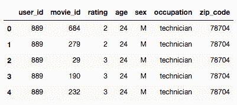

接下来，我们需要按性别计算每部电影的`mean`评分。Pandas 通过`groupby`方法使这变得可能：

```py
#Compute the mean rating of every movie by gender
gender_mean = merged_df[['movie_id', 'sex', 'rating']].groupby(['movie_id', 'sex'])         ['rating'].mean()
```

我们现在可以定义一个函数，识别用户的性别，提取该性别对特定电影的平均评分，并返回该值作为输出：

```py
#Set the index of the users dataframe to the user_id
users = users.set_index('user_id')

#Gender Based Collaborative Filter using Mean Ratings
def cf_gender(user_id, movie_id):

    #Check if movie_id exists in r_matrix (or training set)
    if movie_id in r_matrix:
        #Identify the gender of the user
        gender = users.loc[user_id]['sex']

        #Check if the gender has rated the movie
        if gender in gender_mean[movie_id]:

            #Compute the mean rating given by that gender to the movie
            gender_rating = gender_mean[movie_id][gender]

        else:
            gender_rating = 3.0

    else:
        #Default to a rating of 3.0 in the absence of any information
        gender_rating = 3.0

    return gender_rating

score(cf_gender)

OUTPUT:
1.0330308800874282
```

我们看到，这个模型实际上比标准的均值评分协同过滤器表现更差。这表明，用户的性别并不是其电影口味的最强指示因素。

让我们再试构建一个人口统计过滤器，这次使用性别和职业：

```py
#Compute the mean rating by gender and occupation
gen_occ_mean = merged_df[['sex', 'rating', 'movie_id', 'occupation']].pivot_table(
    values='rating', index='movie_id', columns=['occupation', 'sex'], aggfunc='mean')

gen_occ_mean.head()
```

我们看到`pivot_table`方法为我们提供了所需的 DataFrame。然而，这本可以通过`groupby`来完成。`pivot_table`只是`groupby`方法的一种更紧凑、更易于使用的接口：

```py
#Gender and Occupation Based Collaborative Filter using Mean Ratings
def cf_gen_occ(user_id, movie_id):

    #Check if movie_id exists in gen_occ_mean
    if movie_id in gen_occ_mean.index:

        #Identify the user
        user = users.loc[user_id]

        #Identify the gender and occupation
        gender = user['sex']
        occ = user['occupation']

        #Check if the occupation has rated the movie
        if occ in gen_occ_mean.loc[movie_id]:

            #Check if the gender has rated the movie
            if gender in gen_occ_mean.loc[movie_id][occ]:

                #Extract the required rating
                rating = gen_occ_mean.loc[movie_id][occ][gender]

                #Default to 3.0 if the rating is null
                if np.isnan(rating):
                    rating = 3.0

                return rating

    #Return the default rating 
    return 3.0

score(cf_gen_occ)

OUTPUT:
1.1391976012043645
```

我们看到这个模型的表现是所有我们构建的过滤器中最差的，仅仅比基准模型好一点。这强烈暗示，修改用户人口统计数据可能不是我们当前使用的数据的最佳处理方式。然而，鼓励你尝试不同的用户人口统计数据的排列组合，看看哪些表现最好。你也可以尝试其他改进模型的技术，例如使用加权平均数来作为`pivot_table`的`aggfunc`，并尝试不同（或许更有依据的）默认评分。

# 基于物品的协同过滤

基于物品的协同过滤本质上是基于用户的协同过滤，其中用户扮演了物品所扮演的角色，反之亦然。

在基于物品的协同过滤中，我们计算库存中每个物品的两两相似度。然后，给定`user_id`和`movie_id`*，*我们计算用户对其评级的所有物品的加权平均值。该模型背后的基本思想是，特定用户可能会类似地评价两个相似的物品。

构建基于物品的协同过滤器留给读者作为练习。所涉及的步骤与前述完全相同，只是现在电影和用户位置交换了。

# 基于模型的方法

到目前为止，我们构建的协同过滤器被称为内存型过滤器。这是因为它们只利用相似性度量来得出结果。它们从数据中不学习任何参数，也不为数据分配类别/簇。换句话说，它们不使用机器学习算法。

在本节中，我们将看一些这样的过滤器。我们花了一整章的时间来研究各种监督和无监督学习技术。现在终于是时候看到它们的实际应用并测试它们的效力了。

# 聚类

在我们的加权平均滤波器中，当试图预测最终评分时，我们考虑了每位用户。相比之下，我们的基于人口统计的过滤器只考虑符合特定人口统计的用户。我们发现，与加权平均滤波器相比，人口统计过滤器表现不佳。

但这是否必然意味着我们需要考虑所有用户才能取得更好的结果呢？

人口统计过滤器的一个主要缺点是，它们基于这样一种假设：来自某一特定人口统计的人们有相似的思想和评分。然而，我们可以肯定地说，这是一个过于牵强的假设。并非所有男性都喜欢动作片，也不是所有儿童都喜欢动画片。同样，假设来自特定地区或职业的人们会有相同的口味是非常牵强的。

我们需要想出一种比人口统计更强大的方式来分组用户。从第五章，《开始使用数据挖掘技术》，我们已经知道一种非常强大的工具：`clustering`*。*

可以使用聚类算法，如 k-means，将用户分组成一个簇，然后在预测评分时只考虑同一簇中的用户。

在本节中，我们将使用 k-means 的姐妹算法，kNN*，*来构建基于聚类的协同过滤器。简而言之，给定一个用户*u*和一个电影*m*，涉及以下步骤：

1.  找到评价过电影*m*的*u*的 k 个最近邻居

1.  输出*m*的*k*个用户的平均评分

就这样。这种极其简单的算法恰好是最广泛使用的之一。

和 kNN 一样，我们不会从头开始实现基于 kNN 的协同过滤器。相反，我们将使用一个非常流行且强大的库——`surprise`：

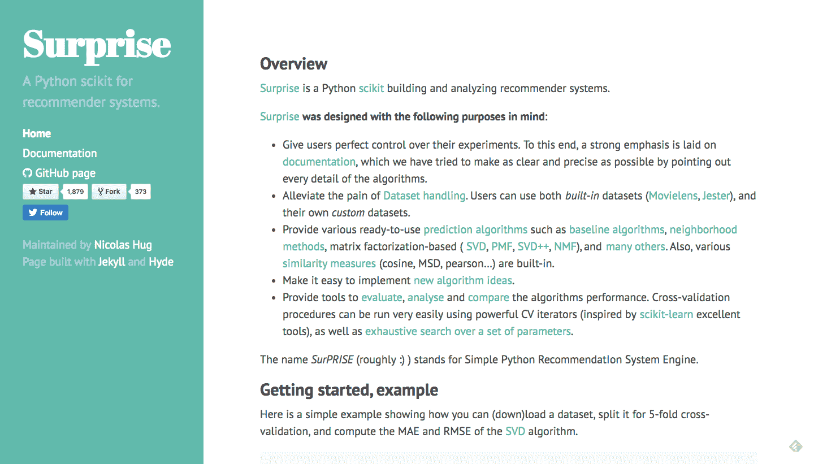

Surprise 是一个用于构建推荐系统的 Python 科学工具包（scikit）。你可以把它看作是 scikit-learn 在推荐系统方面的对等物。根据其文档，`surprise`代表简单的 Python 推荐系统引擎。短短时间内，`surprise`已经成为最流行的推荐库之一。这是因为它非常健壮且易于使用。它为我们提供了大多数流行的协同过滤算法的现成实现，并且还允许我们将自己的算法集成到框架中。

要下载`surprise`，像其他 Python 库一样，打开终端并输入以下命令：

```py
sudo pip3 install scikit-surprise
```

现在，让我们构建并评估基于 kNN 的协同过滤器。尽管*surprise*库中已有 MovieLens 数据集，我们仍然会使用我们手头的外部数据，以便体验如何使用该库处理外部数据集：

```py
#Import the required classes and methods from the surprise library
from surprise import Reader, Dataset, KNNBasic, evaluate

#Define a Reader object
#The Reader object helps in parsing the file or dataframe containing ratings
reader = Reader()

#Create the dataset to be used for building the filter
data = Dataset.load_from_df(ratings, reader)

#Define the algorithm object; in this case kNN
knn = KNNBasic()

#Evaluate the performance in terms of RMSE
evaluate(knn, data, measures=['RMSE'])
```

这是它的输出**:**

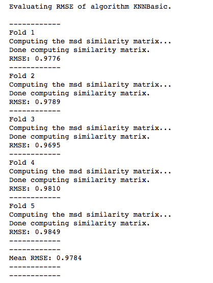

输出结果表明，过滤器采用了一种称为五重`交叉验证`*的技术*。简而言之，这意味着`surprise`将数据分为五个相等的部分。然后，它使用其中四部分作为训练数据，并在第五部分上进行测试。这个过程会进行五次，每次都确保每一部分都会充当一次测试数据。

我们看到该模型得到的 RMSE 为 0.9784，这是目前为止我们取得的最好结果。

现在，让我们看看其他一些基于模型的协同过滤方法，并使用*surprise*库实现其中一些方法。

# 监督学习与降维

再次考虑我们的评分矩阵。它的形状是*m* × *n*，每一行代表*m*个用户之一，每一列代表*n*个物品之一。

现在，让我们删除其中一列（比如 n[j]）。我们现在得到的是一个*m* × (*n*-1)的矩阵。如果我们将*m* × (*n*-1)的矩阵视为预测变量，并将 n[j]视为目标变量，就可以使用监督学习算法训练 n[j]中已有的值，以预测其中缺失的值。对于每一列，我们可以重复这个过程 n 次，最终完成我们的矩阵。

一个大问题是，大多数监督学习算法不能处理缺失数据。在标准问题中，通常会用所属列的均值或中位数来填充缺失值。

然而，我们的矩阵存在严重的数据稀疏问题。矩阵中超过 99%的数据不可用。因此，简单地用均值或中位数填充缺失值是行不通的，因为这会引入大量偏差。

可能想到的一种解决方案是以某种方式压缩预测矩阵，以便所有的值都可以获得。不幸的是，像 SVD 和 PCA 这样的降维技术，在缺失值的环境中同样无法奏效。

在为 Netflix 问题寻找解决方案的过程中，Simon Funk 提出了一个可以将 *m* × (*n*-1) 矩阵降维成一个低维的 *m* × *d* 矩阵，其中 *d* << *n*。他使用了标准的降维技术（在他这里是 SVD），但是做了一些小的调整。解释这种技术超出了本书的范围，但它已在附录中为进阶读者介绍。为了本章的目的，我们将把这项技术视作一个黑盒，它将 *m* × *n* 稀疏矩阵转换为 *m* × *d* 稠密矩阵，其中 *d* << *n*，并称之为 `SVD-like`*。

现在让我们把注意力转向或许是有史以来最著名的推荐算法：奇异值分解*。*

# 奇异值分解

在第五章，*数据挖掘技术入门* 中，我们提到过奇异值分解背后的数学超出了本书的范围。然而，让我们尝试从外行的角度理解它是如何工作的。

回想一下第五章，*数据挖掘技术入门*，**PCA**（**主成分分析**）将一个 *m* × *n* 矩阵转化为 *n* 个 *m* 维的向量（称为主成分），使得每个分量与下一个分量正交。它还构造这些分量的方式是，使得第一个分量包含最多的方差（或信息），接下来是第二个分量，以此类推。

让我们将评分矩阵表示为 *A**。* 该矩阵的转置为 *A**^T*，它的形状为 *n* × *m*，每一行将表示一部电影（而不是一个用户）。

现在，我们可以使用 PCA 从 *A* 和 *A**^T* 分别构建出两个新的矩阵，*U* 和 *V*。

奇异值分解使我们能够一次性从 *A* 计算出 *U* 和 *V*：

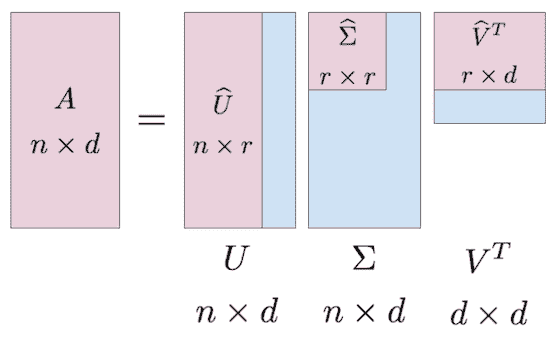

从本质上讲，奇异值分解是一种矩阵分解技术。它接收一个输入 *A*，并输出 *U* 和 *V*，使得：

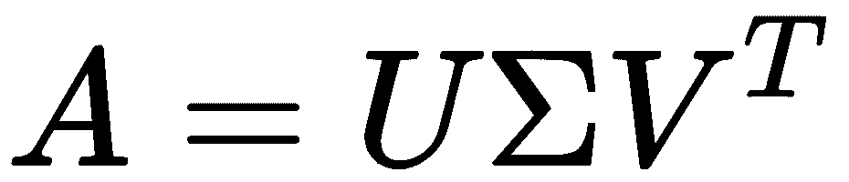

其中  是一个对角矩阵。它用于缩放目的，在本示例中可以假设它与 *U* 或 *V* 合并。因此，我们现在有：

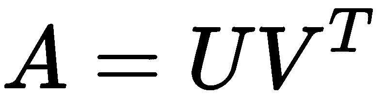

*U* 矩阵，本质上由用户的主成分组成，通常称为用户嵌入矩阵。它的对应矩阵 *V* 被称为电影嵌入矩阵。

SVD 的经典版本和大多数其他机器学习算法一样，不适用于稀疏矩阵。然而，Simon Funk 找到了一个解决该问题的方法，他的解决方案成为了推荐系统领域最著名的解决方案之一。

Funk 的系统将稀疏的评分矩阵 *A* 输入，并分别构建了两个稠密的用户和物品嵌入矩阵 *U* 和 *V*。这些稠密矩阵直接为我们提供了原始矩阵 *A* 中所有缺失值的预测。

现在让我们使用 `surprise` 包来实现 SVD 滤波器：

```py
#Import SVD
from surprise import SVD

#Define the SVD algorithm object
svd = SVD()

#Evaluate the performance in terms of RMSE
evaluate(svd, data, measures=['RMSE'])
```

这是它的输出**：**

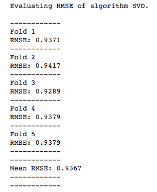

SVD 滤波器的表现优于所有其他滤波器，RMSE 得分为 0.9367。

# 总结

这也标志着我们对协同过滤讨论的结束。在这一章中，我们构建了各种基于用户的协同过滤器，并由此学会了构建基于物品的协同过滤器。

然后我们将注意力转向了基于模型的方法，这些方法依赖于机器学习算法来生成预测。我们介绍了 *surprise* 库，并使用它实现了基于 kNN 的聚类模型。接着我们看了一种使用监督学习算法预测评分矩阵中缺失值的方法。最后，我们以外行的视角理解了奇异值分解算法，并使用 `surprise` 库实现了该算法*。*

到目前为止，我们构建的所有推荐系统仅存在于我们的 Jupyter Notebook 中。在下一章，我们将学习如何将我们的模型部署到网络上，让任何人都能在互联网上使用它们。
