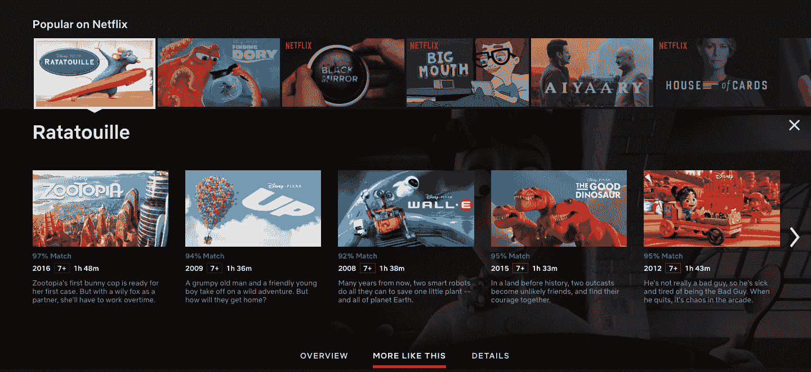
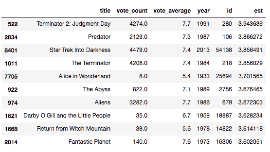

# 第七章：混合推荐系统

在最后一章中，我们将讨论推荐系统在实践和工业使用中的应用。到目前为止，我们已经学习了各种类型的推荐系统，包括基于知识、基于内容和基于协作过滤的引擎。然而，在实际应用中，每个推荐系统通常都会遇到一种或另一种缺点。

我们在第一章中讨论了这些缺点（例如，基于内容的引擎的创新性问题和协作过滤的冷启动问题）。我们还简要介绍了混合推荐系统的概念：一种强大的系统，通过结合不同的模型来利用一个模型的优势，弥补另一个模型的不足。在这一章中，我们将构建一个简单的混合推荐系统，结合我们至今构建的基于内容和协作过滤的模型。

# 技术要求

你需要在系统上安装 Python。最后，为了使用本书的 Git 代码库，用户需要安装 Git。

本章的代码文件可以在 GitHub 上找到：

[`github.com/PacktPublishing/Hands-On-Recommendation-Systems-with-Python`](https://github.com/PacktPublishing/Hands-On-Recommendation-Systems-with-Python)。

请查看以下视频，查看代码如何运行：

[`bit.ly/2uOHwcd`](http://bit.ly/2uOHwcd)[.](http://bit.ly/2uOHwcd)

# 介绍

如前所述，混合推荐系统是非常强大、稳健的系统，它通过结合各种简单模型来给出预测。没有一种单一的方式能让混合模型做到这一点；有些混合推荐系统通过分别使用内容和协作过滤技术来产生结果。另一些则是将基于内容的技术引入协作过滤器，反之亦然。

Netflix 是一个非常好的混合推荐系统的例子。Netflix 在向你推荐与正在观看的电影相似的电影时，采用基于内容的技术（例如“MORE LIKE THIS”部分），如下图所示：



在这里，我们可以看到，当我观看*料理鼠王*时，Netflix 会向我推荐与*料理鼠王*非常相似的电影。所有推荐的前五部电影都是动画片，并且由*迪士尼皮克斯*制作。

然而，动画电影并不是我在 Netflix 上观看的唯一类型。我也喜欢观看剧情片和喜剧片。Netflix 为我提供了一列名为*Rounak 的精选推荐*的独立推荐行，在这里它使用协作过滤来识别与我相似的用户，并推荐他们喜欢的我还没看过的电影：


通过这种方式，Netflix 分别采用基于内容和基于协作的技术，取得了非常令人满意的结果。

# 案例研究 – 构建混合模型

在本节中，让我们构建一个基于内容的模型，并将一些协作过滤技术融入其中。

假设你已经建立了一个像 Netflix 这样的电影网站。每次用户观看电影时，你希望在侧边栏显示一份推荐列表（就像 YouTube 一样）。乍一看，基于内容的推荐系统似乎适合这个任务。这是因为，如果用户当前观看的是他们觉得有趣的内容，他们会更倾向于观看类似的电影。

假设我们的用户正在观看 *黑暗骑士*。由于这是一部蝙蝠侠电影，我们的基于内容的推荐系统很可能会推荐其他蝙蝠侠（或超级英雄）电影，不考虑其质量。然而，这并不总是能带来最佳的推荐。例如，大多数喜欢 *黑暗骑士* 的人并不会给 *蝙蝠侠与罗宾* 评分很高，尽管这两部电影有相同的主角。因此，我们将在此引入协同过滤，它将预测我们基于内容的推荐模型推荐的电影的评分，并返回评分预测最高的几部电影。

换句话说，我们的混合模型的工作流程将如下：

1.  输入电影标题和用户信息

1.  使用基于内容的模型计算 25 部最相似的电影

1.  使用协同过滤计算用户可能给这 25 部电影的预测评分

1.  返回预测评分最高的前 10 部电影

我们将使用不同的数据集来完成这个任务。请继续从以下链接下载数据集。

从 Kaggle 和 Google Drive 下载以下数据集：

+   `ratings_small.csv`：[`www.kaggle.com/rounakbanik/the-movies-dataset/downloads/ratings_small.csv/7`](https://www.kaggle.com/rounakbanik/the-movies-dataset/downloads/ratings_small.csv/7)。

+   `movie_ids.csv`：[`drive.google.com/drive/folders/1H9pnfVTzP46s7VwOTcC5ZY_VahRTr5Zv?usp=sharing`](https://drive.google.com/drive/folders/1H9pnfVTzP46s7VwOTcC5ZY_VahRTr5Zv?usp=sharing)。

`ratings_small.csv` 文件包含来自 700 名用户对 9,000 部电影的 100,000 条评分。我们使用这个文件，因为它包含了对更新电影的评分（而我们用于协同过滤的数据集只包含 1998 年之前上映的电影）。

`links_small.csv` 文件包含了 `ratings_small.csv` 文件中所有电影的电影 ID 和对应的标题。我们可以使用这些 ID 从 `movies_metadata.csv` 文件中提取相关的元数据。

拿到这些文件后，接下来我们将构建我们的模型。第一步是计算我们电影的 `cosine_sim` 矩阵。此外，我们还需要将每部电影映射到 `cosine_sim` 矩阵中的索引。我们已经在 第三章《使用 Pandas 构建 IMDB Top 250 克隆》中学习了如何做到这一点。因此，计算这个矩阵和映射的任务留给读者完成。

你可以从以下链接下载我的`cosine_sim`和`cosine_sim_map`文件：

[`drive.google.com/drive/folders/1H9pnfVTzP46s7VwOTcC5ZY_VahRTr5Zv?usp=sharing`](https://drive.google.com/drive/folders/1H9pnfVTzP46s7VwOTcC5ZY_VahRTr5Zv?usp=sharing)。不过，请注意，`cosine_sim`文件大小超过 1GB，因此下载可能需要一些时间。

接下来，让我们使用`ratings.csv`文件构建一个协同过滤模型。我们将使用上一章中的 SVD 模型来实现：

```py
#Build the SVD based Collaborative filter
from surprise import SVD, Reader, Dataset

reader = Reader()
ratings = pd.read_csv('../data/ratings_small.csv')
data = Dataset.load_from_df(ratings[['userId', 'movieId', 'rating']], reader)
data.split(n_folds=5)
svd = SVD()
trainset = data.build_full_trainset()
svd.train(trainset)
```

接下来，让我们将`movie_ids.csv`文件加载到 DataFrame 中，并构建两个映射：一个根据电影 ID 返回电影标题，另一个则相反：

```py
#Build title to ID and ID to title mappings
id_map = pd.read_csv('../data/movie_ids.csv')
id_to_title = id_map.set_index('id')
title_to_id = id_map.set_index('title')
```

现在，让我们导入电影的元数据，以便推荐系统能够显示有用的信息，例如 IMDB 评分和上映年份。这些信息可以从主`movies_metadata.csv`文件中提取，具体操作留给读者自行完成。

你可以从以下链接下载所需的元数据文件：[`drive.google.com/drive/folders/1H9pnfVTzP46s7VwOTcC5ZY_VahRTr5Zv?usp=sharing`](https://drive.google.com/drive/folders/1H9pnfVTzP46s7VwOTcC5ZY_VahRTr5Zv?usp=sharing)

我们终于可以根据之前描述的工作流程构建混合推荐函数了：

```py
def hybrid(userId, title):
    #Extract the cosine_sim index of the movie
    idx = cosine_sim_map[title]

    #Extract the TMDB ID of the movie
    tmdbId = title_to_id.loc[title]['id']

    #Extract the movie ID internally assigned by the dataset
    movie_id = title_to_id.loc[title]['movieId']

    #Extract the similarity scores and their corresponding index for every movie from the cosine_sim matrix
    sim_scores = list(enumerate(cosine_sim[str(int(idx))]))

    #Sort the (index, score) tuples in decreasing order of similarity scores
    sim_scores = sorted(sim_scores, key=lambda x: x[1], reverse=True)

    #Select the top 25 tuples, excluding the first 
    #(as it is the similarity score of the movie with itself)
    sim_scores = sim_scores[1:26]

    #Store the cosine_sim indices of the top 25 movies in a list
    movie_indices = [i[0] for i in sim_scores]

    #Extract the metadata of the aforementioned movies
    movies = smd.iloc[movie_indices][['title', 'vote_count', 'vote_average', 'year', 'id']]

    #Compute the predicted ratings using the SVD filter
    movies['est'] = movies['id'].apply(lambda x: svd.predict(userId, id_to_title.loc[x]['movieId']).est)

    #Sort the movies in decreasing order of predicted rating
    movies = movies.sort_values('est', ascending=False)

    #Return the top 10 movies as recommendations
    return movies.head(10)
```

让我们来测试一下混合模型。假设 ID 为 1 和 2 的两个用户都在观看*Avatar*：

```py
hybrid(1, 'Avatar')
```


```py
hybrid(2, 'Avatar')
```



我们可以看到，尽管两个用户当前都在观看*Avatar*，但推荐内容和顺序有所不同。这是由协同过滤算法影响的。然而，所有列出的电影都与*Avatar*相似。这是因为模型进行了基于内容的过滤。

跟随这一部分可能有点困难，特别是如果你记不清[第三章](https://cdp.packtpub.com/hands_on_recommendation_systems_with_python/wp-admin/post.php?post=30&action=edit#post_26)的内容——*使用 Pandas 构建 IMDB 前 250 名克隆*。如果某些部分不太理解，我强烈建议你回头重读这一章。作为参考，该模型的完整代码可以在`RecoSys`库的`Chapter7`文件夹中找到。

# 总结

到此为止，我们完成了本章的内容，也是本书的主要部分。在本书中，我们学习了以下内容：

+   我们进入了推荐系统的世界。我们从数学上定义了推荐问题，并讨论了现有的各种推荐引擎类型，以及它们的优缺点。

+   随后，我们学习了如何使用 pandas 库进行数据整理，并熟悉了 pandas 中最强大的两种数据结构：系列（Series）和数据框（DataFrame）。

+   在掌握了数据清理技术后，我们开始构建 IMDB Top 250 克隆版。接着，我们在此基础上进行了改进，构建了一个基于知识的推荐系统，该系统考虑了推荐电影的类型、时长和上映年份。

+   接下来，我们学习了如何使用情节线来构建基于内容的推荐系统，并随后使用更复杂的元数据（如类型、演员、制作团队和关键词）。在这个过程中，我们熟悉了向量化工具和余弦相似度度量。

+   在数据挖掘章节中，我们介绍了构建和改进推荐系统的各种技术。我们学习了除余弦相似度外的其他相似度度量。接着我们研究了聚类，重点介绍了 k-means 聚类技术。随后，我们讨论了降维（重点讲解了 PCA）以及各种监督学习技术。最后，章节以评估指标的介绍结束，这些指标用于衡量推荐系统的性能。

+   在协同过滤章节中，我们实验了多种基于评分数据的模型，并借用了上一章介绍的数据挖掘技术。我们还了解了`surprise`库，它使得构建推荐系统变得轻松愉快。

+   在本章的最后，我们简要讨论了如今行业中使用的各种混合推荐系统，并构建了一个将协同过滤技术融入内容引擎的模型，为用户提供个性化推荐，同时考虑到当前正在观看的电影。

当然，我们所讲解的内容仅仅触及了推荐系统领域的表面。然而，我相信读者们现在已经掌握了足够的知识，能够应对该领域的高级话题。我在`附录`中列出了一些资源，作为你成为推荐系统大师之路的下一站。

如前所述，本书中的所有代码都作为 GitHub 仓库提供，方便你在阅读过程中轻松地修改和实验代码。感谢大家一路走到这里。如果你有任何意见、修正、批评或建议，请随时通过`rounakbanik@gmail.com`与我联系。
