# 第三章：*第三章*：车道检测

本章将展示使用计算机视觉（特别是 OpenCV）可以实现的一些令人难以置信的事情：车道检测。你将学习如何分析图像并逐步构建更多的视觉知识，应用多种过滤技术，用对图像的更好理解来替换噪声和近似，直到你能够检测到直道上或转弯处的车道位置，然后我们将把这个流程应用到视频中，以突出道路。

你会看到这种方法依赖于几个可能在实际世界中不成立的假设，尽管它可以进行调整以纠正这一点。希望你会觉得这一章很有趣。

我们将涵盖以下主题：

+   在道路上检测车道

+   颜色空间

+   透视校正

+   边缘检测

+   阈值

+   直方图

+   滑动窗口算法

+   多项式拟合

+   视频滤波

到本章结束时，你将能够设计一个流程，使用 OpenCV 检测道路上的车道线。

# 技术要求

我们的车道检测流程需要相当多的代码。我们将解释主要概念，并且你可以在 GitHub 上找到完整的代码，链接为[`github.com/PacktPublishing/Hands-On-Vision-and-Behavior-for-Self-Driving-Cars/tree/master/Chapter3`](https://github.com/PacktPublishing/Hands-On-Vision-and-Behavior-for-Self-Driving-Cars/tree/master/Chapter3)。

对于本章中的说明和代码，你需要以下内容：

+   Python 3.7

+   OpenCV-Python 模块

+   NumPy 模块

+   Matplotlib 模块

为了识别车道，我们需要一些图像和一段视频。虽然很容易找到一些开源数据库来使用，但它们通常仅供非商业用途。因此，在这本书中，我们将使用两个开源项目生成的图像和视频：CARLA，一个用于自动驾驶任务的模拟器，以及 Speed Dreams，一个开源视频游戏。所有技术也适用于现实世界的视频，我们鼓励你尝试在 CULane 或 KITTI 等公共数据集上使用它们。

本章的“代码在行动”视频可以在以下位置找到：

[`bit.ly/37pjxnO`](https://bit.ly/37pjxnO)

# 如何执行阈值操作

对于人类来说，跟随车道线很容易，但对于计算机来说，这并不是那么简单。一个问题是一个道路图像包含太多的信息。我们需要简化它，只选择我们感兴趣的部分。我们将只分析图像中车道线部分，但我们也需要将车道线从图像的其余部分分离出来，例如，使用颜色选择。毕竟，道路通常是黑色或深色的，而车道通常是白色或黄色的。

在接下来的几节中，我们将分析不同的颜色空间，以查看哪一个对阈值化最有用。

## 阈值在不同颜色空间上的工作原理

从实际角度来看，颜色空间是分解图像颜色的一种方式。您可能最熟悉 RGB，但还有其他颜色空间。

OpenCV 支持多种颜色空间，作为此流程的一部分，我们需要从各种颜色空间中选择两个最佳通道。我们为什么要使用两个不同的通道？有两个原因：

+   对于白色车道来说，一个好的颜色空间可能不适合黄色车道。

+   当存在困难的帧（例如，道路上存在阴影或车道变色时），一个通道可能比另一个通道受影响较小。

对于我们的示例来说，这可能不是严格必要的，因为车道总是白色的，但在现实生活中这绝对是有用的。

我们现在将看到我们的测试图像在不同颜色空间中的外观，但请记住，您的情况可能不同。

## RGB/BGR

起始点将是以下图像：

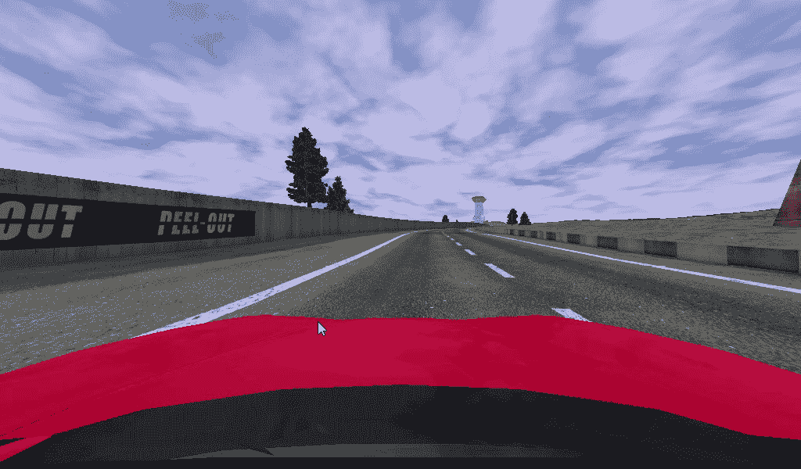

图 3.1 – 参考图像，来自 Speed Dreams

图像当然可以分解为三个通道：红色、绿色和蓝色。正如我们所知，OpenCV 以 BGR（意味着，第一个字节是蓝色通道，而不是红色通道）存储图像，但从概念上讲，没有区别。

这就是分离后的三个通道：

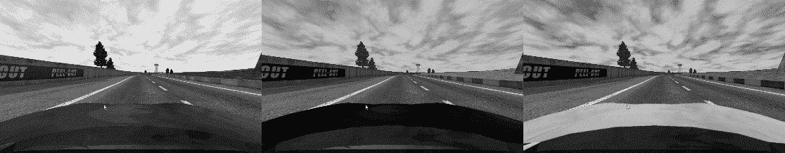

图 3.2 – BGR 通道：蓝色、绿色和红色通道

它们看起来都很好。我们可以尝试通过选择白色像素来分离车道。由于白色颜色是（`255, 255, 255`），我们可以留出一些余地并选择高于 180 的颜色的像素。为了执行此操作，我们需要创建一个与所选通道相同大小的黑色图像，然后在原始通道中所有高于 180 的像素上涂成白色：

```py
img_threshold = np.zeros_like(channel)
img_threshold [(channel >= 180)] = 255
```

这就是输出看起来像这样：

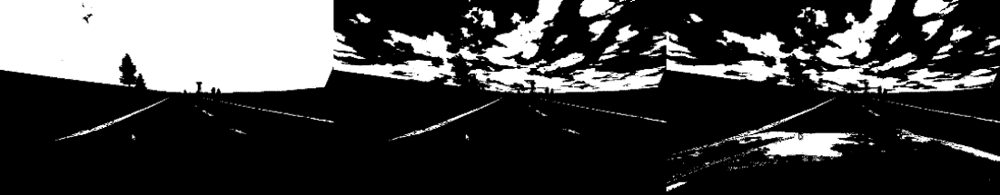

图 3.3 – BGR 通道：蓝色、绿色和红色通道，阈值为 180 以上

它们看起来都很好。红色通道也显示了汽车的一部分，但由于我们不会分析图像的这一部分，所以这不是问题。由于白色在红色、绿色和蓝色通道中具有相同的值，所以在所有三个通道上都能看到车道是预料之中的。然而，对于黄色车道来说，情况并非如此。

我们选择的阈值非常重要，不幸的是，它取决于车道使用的颜色和道路情况；光线条件和阴影也会影响它。

下图显示了完全不同的阈值，20-120：

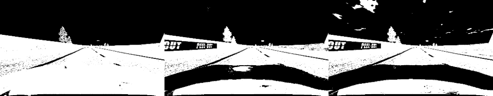

图 3.4 – BGR 通道：蓝色、绿色和红色通道，阈值为 20-120

您可以使用以下代码选择 20-120 范围内的像素：

```py
img_threshold[(channel >= 20) & (channel <= 120)] = 255
```

只要考虑车道是黑色的，图像可能仍然可用，但这并不推荐。

## HLS

HLS 颜色空间将颜色分为色调、亮度和饱和度。结果有时会令人惊讶：

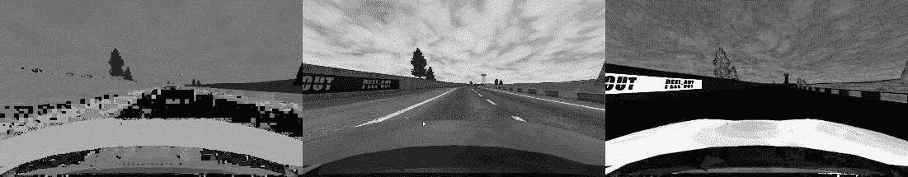

图 3.5 – HLS 通道：色调、亮度和饱和度

色调通道相当糟糕，噪声大，分辨率低，而亮度似乎表现良好。饱和度似乎无法检测到我们的车道。

让我们尝试一些阈值：

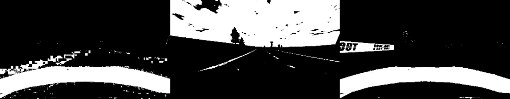

图 3.6 – HLS 通道：色调、亮度和饱和度，阈值高于 160

阈值显示，亮度仍然是一个好的候选者。

## HSV

HSV 颜色空间将颜色分为色调、饱和度和值，它与 HLS 相关。因此，结果是类似于 HLS 的：

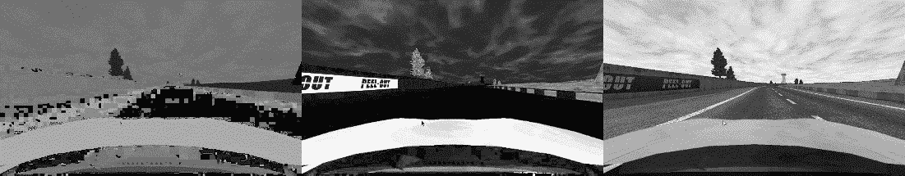

图 3.7 – HSV 通道：色调、饱和度和值

色调和不饱和度对我们来说没有用，但应用阈值后的亮度看起来不错：

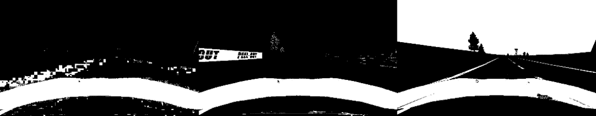

图 3.8 – HSV 通道：色调、饱和度和值，阈值高于 160

如预期，值的阈值看起来不错。

## LAB

LAB（CIELAB 或 CIE L*a*b*）颜色空间将颜色分为 L*（亮度，从黑色到白色）、a*（从绿色到红色）和 b*（从蓝色到黄色）：

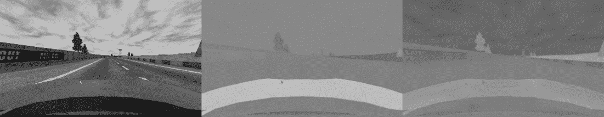

图 3.9 – LAB 通道：L*、a*和 b*

L*看起来不错，而 a*和 b*对我们来说没有用：

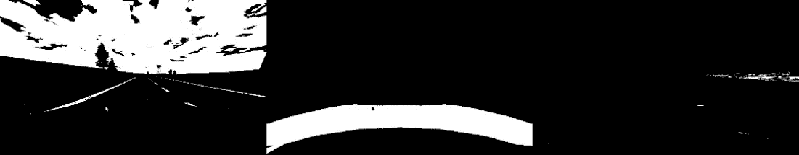

图 3.10 – LAB 通道：L*、a*和 b*，阈值高于 160

## YCbCr

YCbCr 是我们将要分析的最后一个颜色空间。它将图像分为亮度（Y）和两个色度分量（Cb 和 Cr）：

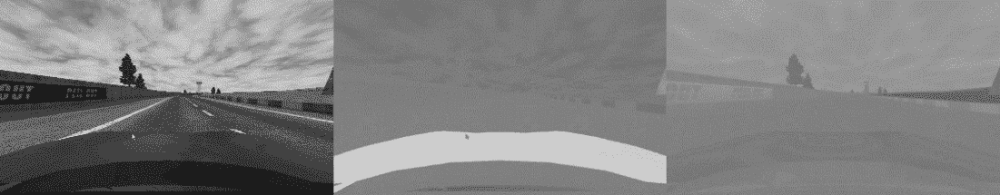

图 3.11 – YCbCr 通道：Y、Cb 和 Cr

这是应用阈值后的结果：

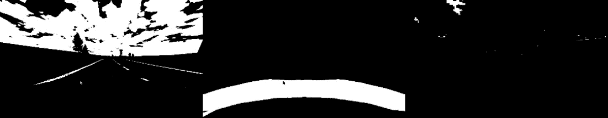

图 3.12 – YCbCr 通道：Y、Cb 和 Cr，阈值高于 160

阈值证实了亮度通道的有效性。

## 我们的选择

经过一些实验，似乎绿色通道可以用于边缘检测，而 HLS 空间中的 L 通道可以用作额外的阈值，因此我们将坚持这些设置。这些设置对于黄色线条也应该适用，而不同的颜色可能需要不同的阈值。

# 透视校正

让我们退一步，从简单开始。我们可以拥有的最简单的情况是直线车道。让我们看看它看起来如何：

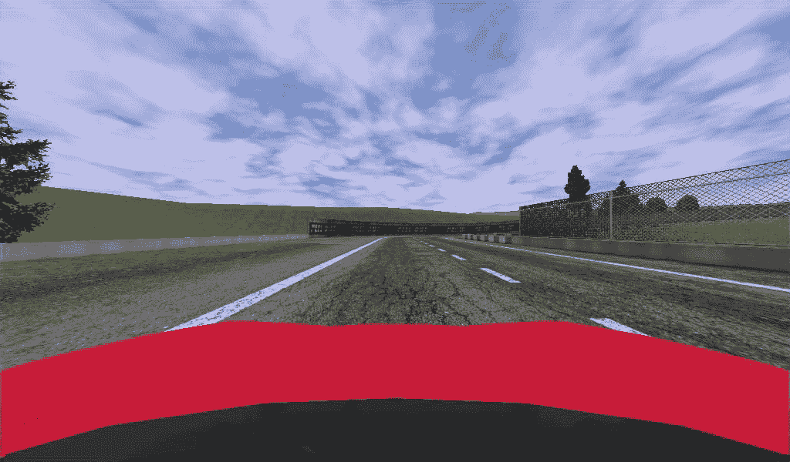

图 3.13 – 直线车道，来自 Speed Dreams

如果我们飞越道路，并从鸟瞰的角度观察，车道线将是平行的，但在图片中，由于透视，它们并不是平行的。

透视取决于镜头的焦距（焦距较短的镜头显示的透视更强）和摄像机的位置。一旦摄像机安装在汽车上，透视就固定了，因此我们可以考虑这一点并校正图像。

OpenCV 有一个计算透视变换的方法：`getPerspectiveTransform()`。

它需要两个参数，都是四个点的数组，用于标识透视的梯形。一个数组是源，一个数组是目标。这意味着可以使用相同的方法通过交换参数来计算逆变换：

```py
perspective_correction = cv2.getPerspectiveTransform(src, dst)
perspective_correction_inv = cv2.getPerspectiveTransform(dst, src)
```

我们需要选择车道线周围的区域，以及一个小边距：

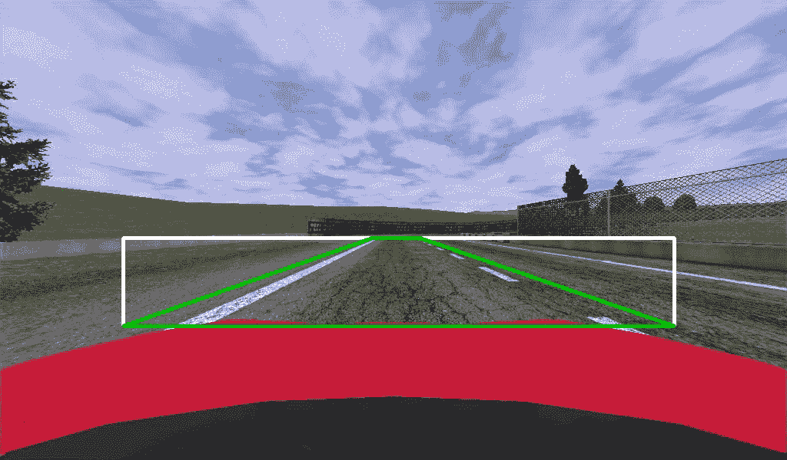

图 3.14 – 带有车道线周围感兴趣区域的梯形

在我们的情况下，目标是一个矩形（因为我们希望它变得笔直）。*图 3.14*显示了带有原始视角的绿色梯形（前一段代码中的`src`变量）和白色矩形（前一段代码中的`dst`变量），这是期望的视角。请注意，为了清晰起见，它们被绘制为重叠的，但矩形的坐标作为参数传递时发生了偏移，就像它从*X*坐标 0 开始一样。

现在我们可以应用透视校正并获取我们的鸟瞰视图：

```py
cv2.warpPerspective(img, perspective_correction, warp_size, flags=cv2.INTER_LANCZOS4)
```

`warpPerspective()`方法接受四个参数：

+   源图像。

+   从`getPerspectiveTransform()`获得的变换矩阵。

+   输出图像的大小。在我们的情况下，宽度与原始图像相同，但高度只是梯形/矩形的宽度。

+   一些标志，用于指定插值。`INTER_LINEAR`是一个常见的选项，但我建议进行实验，并尝试使用`INTER_LANCZOS4`。

这就是使用`INTER_LINEAR`进行扭曲的结果：

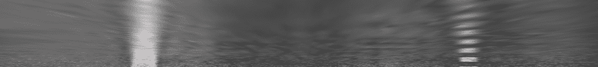

图 3.15 – 使用 INTER_LINEAR 扭曲

这是使用`INTER_LANCZOS4`的结果：

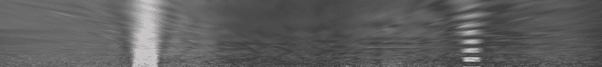

图 3.16 – 使用 INTER_LANCZOS4 扭曲

它们非常相似，但仔细观察会发现，使用`LANCZOS4`重采样进行的插值更清晰。我们将在后面看到，在管道的末端，差异是显著的。

在两张图片中都很清楚的是，我们的线条现在是垂直的，这直观上可能有助于我们。

我们将在下一节中看到如何利用这张图像。

# 边缘检测

下一步是检测边缘，我们将使用绿色通道来完成这项工作，因为在我们的实验中，它给出了良好的结果。请注意，您需要根据您计划运行软件的国家/地区以及许多不同的光照条件对图像和视频进行实验。很可能会根据线条的颜色和图像中的颜色，您可能需要选择不同的通道，可能是来自另一个颜色空间；您可以使用`cvtColor()`等函数将图像转换为不同的颜色空间：

```py
img_hls = cv2.cvtColor(img_bgr, cv2.COLOR_BGR2HLS).astype(np.float)
```

我们将坚持使用绿色。

OpenCV 有几种计算边缘检测的方法，我们将使用 Scharr，因为它表现相当不错。Scharr 计算导数，因此它检测图像中的颜色差异。我们对 X 轴感兴趣，并且希望结果是一个 64 位的浮点数，所以我们的调用将如下所示：

```py
edge_x = cv2.Scharr(channel, cv2.CV_64F, 1, 0)
```

由于 Scharr 计算导数，值可以是正的也可以是负的。我们感兴趣的并不是符号，而只是存在边缘的事实。因此，我们将取绝对值：

```py
edge_x = np.absolute(edge_x)
```

另一个问题是我们期望的单通道图像上的 0-255 值范围内的值没有界限，而值是浮点数，而我们需要一个 8 位的整数。我们可以通过以下行解决这两个问题：

```py
edge_x = np.uint8(255 * edge_x / np.max(edge_x))
```

这是结果：

图 3.17 – 使用 Scharr 进行边缘检测，缩放并取绝对值

图 3.17 – 使用 Scharr 进行边缘检测，缩放并取绝对值

在这一点上，我们可以应用阈值将图像转换为黑白，以便更好地隔离车道像素。我们需要选择要选择的像素强度，在这种情况下，我们可以选择 20-120；我们只选择至少具有 20 的强度值且不超过 120 的像素：

```py
binary = np.zeros_like(img_edge)
binary[img_edge >= 20] = 255
```

`zeros_like()`方法创建一个全零数组，其形状与图像相同，第二行将强度在 20 到 120 之间的所有像素设置为 255。

这是结果：

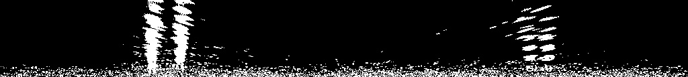

图 3.18 – 应用 20 阈值后的结果

现在，车道非常明显，但有一些噪声。我们可以通过提高阈值来减少噪声：

```py
binary[img_edge >= 50] = 255
```

这就是输出显示的样子：

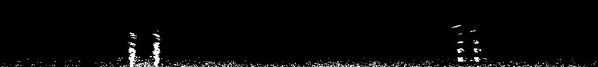

图 3.19 – 应用 50 阈值后的结果

现在，噪声更少，但我们失去了顶部的线条。

现在，噪声更少，但我们失去了顶部的线条。

## 插值阈值

在实践中，我们不必在用很多噪声选择整条线与在检测到部分线的同时减少噪声之间做出选择。我们可以对底部（那里我们分辨率更高，图像更清晰，噪声更多）应用更高的阈值，而在顶部（那里我们得到的对比度更低，检测更弱，噪声更少，因为像素被透视校正拉伸，自然地模糊了）应用较低的阈值。我们可以在阈值之间进行插值：

```py
threshold_up = 15 threshold_down = 60 threshold_delta = threshold_down-threshold_up for y in range(height):  binary_line = binary[y,:]  edge_line = channel_edge[y,:]  threshold_line = threshold_up + threshold_delta * y/height   binary_line[edge_line >= threshold_line] = 255
```

让我们看看结果：

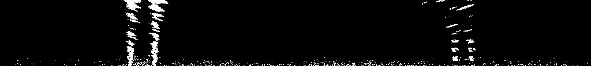

图 3.20 – 应用插值阈值后的结果，从 15 到 60

现在，我们可以在底部有更少的噪声，并在顶部检测到更弱的信号。然而，虽然人类可以直观地识别车道，但对于计算机来说，它们仍然只是图像中的像素，所以还有工作要做。但我们极大地简化了图像，并且我们正在取得良好的进展。

## 组合阈值

如我们之前提到的，我们也想在另一个通道上使用阈值，而不进行边缘检测。我们选择了 HLS 的 L 通道。

这是超过 140 的阈值的结果：

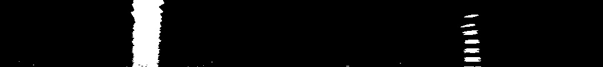

图 3.21 – L 通道，阈值超过 140

还不错。现在，我们可以将其与边缘结合起来：

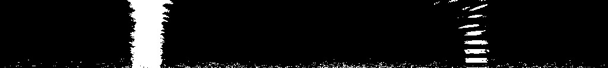

图 3.22 – 两个阈值的组合

结果更嘈杂，但也更稳健。

在继续前进之前，让我们引入一个带有转弯的图片：

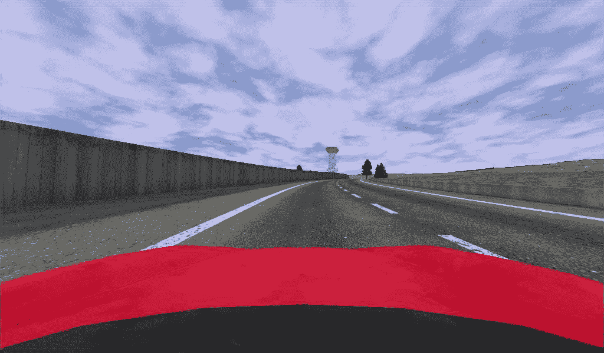

图 3.23 – 转弯车道，来自 Speed Dreams

这是阈值：

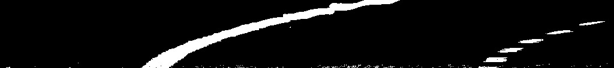

图 3.24 – 转弯车道，阈值之后

它仍然看起来不错，但我们可以看到，由于转弯，我们不再有垂直线。事实上，在图像的顶部，线条基本上是水平的。

# 使用直方图查找车道

我们如何或多或少地理解车道在哪里？对于人类来说，答案是简单的：车道是一条长线。但对于计算机来说呢？

如果我们谈论垂直线，一种方法可以是计算某一列中白色的像素。但是，如果我们检查转弯的图像，那可能不起作用。然而，如果我们把注意力减少到图像的底部，线条就有点更垂直了：

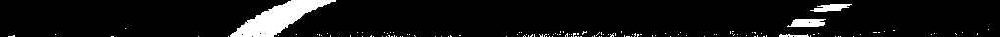

图 3.25 – 转弯车道，阈值之后，底部部分

我们现在可以按列计数像素：

```py
partial_img = img[img.shape[0] // 2:, :]  # Select the bottom part
hist = np.sum(partial_img, axis=0)  # axis 0: columns direction
```

要将直方图保存为文件中的图形，我们可以使用 Matplotlib：

```py
import matplotlib.pyplot as plt

plt.plot(hist)plt.savefig(filename)plt.clf()
```

我们得到了以下结果：

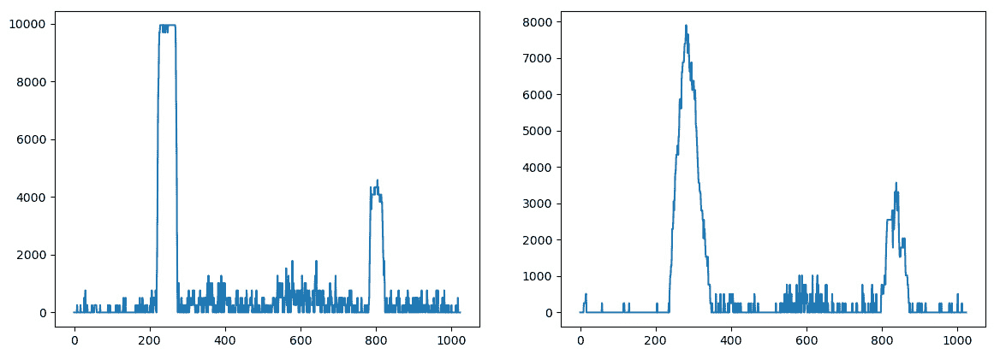

图 3.26 – 左：直线车道的直方图，右：转弯车道的直方图

直方图上的 X 坐标代表像素；由于我们的图像分辨率为 1024x600，直方图显示了 1,024 个数据点，峰值集中在车道所在像素周围。

如我们所见，在直线车道的情况下，直方图清楚地识别了两条线；在转弯的情况下，直方图不太清晰（因为线条转弯，因此白色像素在周围稍微分散），但它仍然可用。我们还可以看到，在虚线线的情况下，直方图中的峰值不太明显，但它仍然存在。

这看起来很有希望！

现在，我们需要一种方法来检测两个峰值。我们可以使用 NumPy 的`argmax()`函数，它返回数组中最大元素的索引，这是我们其中一个峰值。然而，我们需要两个。为此，我们可以将数组分成两半，并在每一半中选择一个峰值：

```py
size = len(histogram)
max_index_left = np.argmax(histogram[0:size//2])
max_index_right = np.argmax(histogram[size//2:]) + size//2
```

现在我们有了索引，它们代表峰值的 X 坐标。这个值本身（例如，`histogram[index]`）可以被认为是识别车道线的置信度，因为更多的像素意味着更高的置信度。

# 滑动窗口算法

当我们在取得进展时，图像仍然有一些噪声，这意味着有一些像素可以降低精度。此外，我们只知道线条的起始位置。

解决方案是专注于线条周围的区域——毕竟，没有必要在整个扭曲的图像上工作；我们可以从线条的底部开始，然后“跟随”它。这可能是图像胜过千言万语的例子，所以这是我们想要达到的：

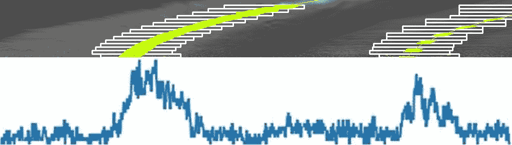

图 3.27 – 顶部：滑动窗口，底部：直方图

在图 3.27 的上部，每个矩形代表一个感兴趣窗口。每个通道底部的第一个窗口位于直方图相应峰值的中心。然后，我们需要一种“跟随线条”的方法。每个窗口的宽度取决于我们想要的边距，而高度取决于我们想要的窗口数量。这两个数字可以改变以达到更好的检测（减少不需要的点以及因此的噪声）和检测更困难转弯的可能性，半径更小（这将要求窗口更快地重新定位）。

由于此算法需要相当多的代码，我们将专注于左侧车道以保持清晰，但相同的计算也需要对右侧车道进行。

## 初始化

我们只对被阈值选择的像素感兴趣。我们可以使用 NumPy 的`nonzero()`函数：

```py
non_zero = binary_warped.nonzero()
non_zero_y = np.array(non_zero[0])
non_zero_x = np.array(non_zero[1])
```

`non_zero`变量将包含白色像素的坐标，然后`non_zero_x`将包含 X 坐标，而`non_zero_y`将包含 Y 坐标。

我们还需要设置 `margin`，即允许车道移动的距离（例如，滑动窗口窗口宽度的一半），以及 `min_pixels`，这是我们想要检测以接受滑动窗口新位置的最小像素数。低于此阈值，我们不会更新它：

```py
margin = 80 min_pixels = 50 
```

## 滑动窗口的坐标

`left_x` 变量将包含左侧车道的位置，我们需要用从直方图获得的价值初始化它。

在设置好场景后，我们现在可以遍历所有窗口，我们将使用的索引变量是 `idx_window`。*X* 范围是从最后的位置计算的，加上 `margin`：

```py
win_x_left_min = left_x - margin
win_x_left_max = left_x + margin
```

*Y* 范围由我们正在分析的窗口的索引确定：

```py
win_y_top = img_height - idx_window * window_height win_y_bottom = win_y_top + window_height
```

现在，我们需要选择白色像素（来自 `non_zero_x` 和 `non_zero_y`）并且被我们正在分析的窗口所约束的像素。

NumPy 数组可以使用重载运算符进行过滤。为了计算所有在 `win_y_bottom` 之上的 *Y* 坐标，我们可以简单地使用以下表达式：

```py
non_zero_y >= win_y_bottom
```

结果是一个数组，选中的像素为 `True`，其他像素为 `False`。

但我们需要的是 `win_y_top` 和 `win_y_bottom` 之间的像素：

```py
(non_zero_y >= win_y_bottom) & (non_zero_y < win_y_top)
```

我们还需要 *X* 坐标，它必须在 `win_x_left_min` 和 `win_x_left_max` 之间。由于我们只需要计数，我们可以添加一个 `nonzero()` 调用：

```py
non_zero_left = ((non_zero_y >= win_y_bottom) &                 (non_zero_y < win_y_top) &                  (non_zero_x >= win_x_left_min) & 
                 (non_zero_x < win_x_left_max)).nonzero()[0]
```

我们需要选择第一个元素，因为我们的数组位于另一个只有一个元素的数组内部。

我们还将把这些值保存在一个变量中，以便稍后绘制车道线：

```py
left_lane_indexes.append(non_zero_left)
```

现在，我们只需要更新左侧车道的位置，取位置的平均值，但前提是有足够多的点：

```py
if len(non_zero_left) > min_pixels:
    left_x = np.int(np.mean(non_zero_x[non_zero_left]))
```

## 多项式拟合

现在，我们可能已经选择了成千上万的点，但我们需要理解它们并得到一条线。为此，我们可以使用 `polyfit()` 方法，该方法可以用指定次数的多项式来近似一系列点；对于二次多项式对我们来说就足够了：

```py
x_coords = non_zero_x[left_lane_indexes]
y_coords = non_zero_y[left_lane_indexes]
left_fit = np.polynomial.polynomial.polyfit(y_coords, x_coords, 2)
```

注意

请注意，`polyfit()` 函数接受参数的顺序为 `(X, Y)`，而我们所提供的顺序为 `(Y, X)`。我们这样做是因为按照数学惯例，在多项式中，*X* 是已知的，而 *Y* 是基于 *X* 计算得出的（例如，*Y = X² + 3*X + 5*）。然而，我们知道 *Y* 并需要计算 *X*，因此我们需要以相反的顺序提供它们。

我们几乎完成了。

*Y* 坐标只是一个范围：

```py
ploty = np.array([float(x) for x in range(binary_warped.shape[0])])
```

然后，我们需要从 *Y* 计算出 *X*，使用二次多项式的通用公式（在 *X* 和 *Y* 上反转）：

*x = Ay² + By + C*；

这是代码：

```py
Left_fitx = left_fit[2] * ploty ** 2 + left_fit[1] * ploty + left_fit[0]
```

这是我们现在的位置：

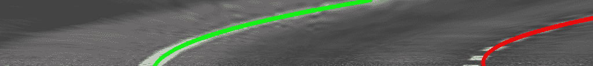

图 3.28 – 在扭曲图像上绘制的车道

我们现在可以使用逆透视变换调用 `perspectiveTransform()` 来移动像素到图像中的相应位置。这是最终结果：

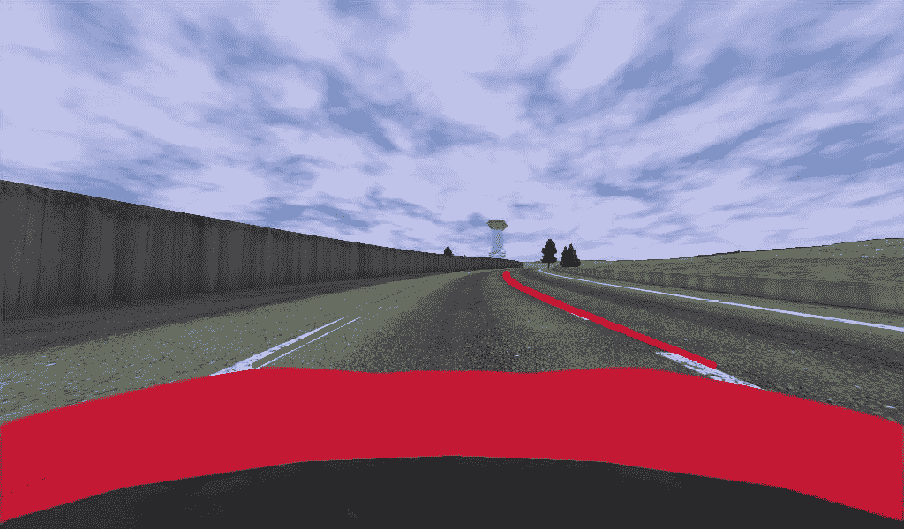

图 3.29 – 图像上检测到的车道

恭喜！这并不特别容易，但现在你可以在正确的条件下检测到帧上的车道。不幸的是，并不是所有的帧都足够好来进行这项检测。让我们在下一节中看看我们如何可以使用视频流的时序演变来过滤数据并提高精度。

# 增强视频

从计算角度来看，实时分析视频流可能是一个挑战，但通常，它提供了提高精度的可能性，因为我们可以在前一帧的知识基础上构建并过滤结果。

现在我们将看到两种技术，当处理视频流时，可以使用这些技术以更高的精度检测车道。

## 部分直方图

如果我们假设在前几帧中正确检测到了车道，那么当前帧上的车道应该处于相似的位置。这个假设受汽车速度和相机帧率的影响：汽车越快，车道变化就越大。相反，相机越快，车道在两帧之间移动就越少。在现实中的自动驾驶汽车中，这两个值都是已知的，因此如果需要，可以将其考虑在内。

从实际的角度来看，这意味着我们可以限制我们分析直方图的区域，以避免错误检测，只分析一些之前帧平均值的周围的一些直方图像素（例如，30）。

# 滚动平均

我们检测的主要结果是每个车道的多项式拟合的三个值。遵循上一节相同的原理，我们可以推断出它们在帧之间不会变化太多，因此我们可以考虑一些之前帧的平均值，以减少噪声。

有一种称为**指数加权移动平均**（或滚动平均）的技术，可以用来轻松计算值流中最后一些值的近似平均值。

给定 `beta`，一个大于零且通常接近一的参数，移动平均可以按以下方式计算：

```py
moving_average = beta * prev_average + (1-beta)*new_value
```

作为一个指示，影响平均值的帧数如下：

```py
1 / (1 - beta)
```

因此，`beta = 0.9` 会平均 10 帧，而 `beta = 0.95` 会平均 20 帧。

这就结束了本章。我邀请您在 GitHub 上查看完整的代码，并尝试对其进行操作。您可以在那里找到一些真实的视频片段并尝试识别车道。

并且不要忘记应用**相机标定**，如果可能的话。

# 摘要

在本章中，我们构建了一个很好的车道检测流程。首先，我们分析了不同的颜色空间，如 RGB、HLS 和 HSV，以查看哪些通道对检测车道更有用。然后，我们使用`getPerspectiveTransform()`进行透视校正，以获得*鸟瞰图*并使道路上的平行线在分析的图像上也看起来平行。

我们使用`Scharr()`进行边缘检测，以检测边缘并使我们的分析比仅使用颜色阈值更稳健，并将两者结合起来。然后我们计算直方图以检测车道开始的位置，并使用“滑动窗口”技术来“跟随”图像中的车道。

然后，我们使用`polyfit()`在检测到的像素上拟合一个二次多项式，使它们有意义，并使用函数返回的系数来生成我们的曲线，在它们上应用反向透视校正后。最后，我们讨论了两种可以应用于视频流以提高精度的技术：部分直方图和滚动平均值。

使用所有这些技术一起，你现在可以构建一个能够检测道路上车道线的管道。

在下一章中，我们将介绍深度学习和神经网络，这些是强大的工具，我们可以使用它们来完成更复杂的计算机视觉任务。

# 问题

1.  你能列举一些除了 RGB 之外的颜色空间吗？

1.  为什么我们要应用透视校正？

1.  我们如何检测车道开始的位置？

1.  你可以使用哪种技术来*跟随图像中的车道*？

1.  如果你有很多点大致形成一个车道，你如何将它们转换成一条线？

1.  你可以使用哪个函数进行边缘检测？

1.  你可以使用什么来计算最后*N*个位置的平均值？
