# 第七章：*第七章*：检测行人和交通灯

恭喜您完成了深度学习的学习，并进入了这个新的章节！现在您已经了解了如何构建和调整神经网络的基础知识，是时候转向更高级的主题了。

如果您还记得，在 *第一章*，*OpenCV 基础和相机标定*，我们已经使用 OpenCV 检测了行人。在本章中，我们将学习如何使用一个非常强大的神经网络——**单次多框检测器**（**SSD**）来检测对象，我们将使用它来检测行人、车辆和交通灯。此外，我们将通过迁移学习训练一个神经网络来检测交通灯的颜色，迁移学习是一种强大的技术，可以帮助您使用相对较小的数据集获得良好的结果。

在本章中，我们将涵盖以下主题：

+   检测行人和交通灯

+   使用 CARLA 收集图像

+   使用 **单次多框检测器**（**SSD**）进行目标检测

+   检测交通灯的颜色

+   理解迁移学习

+   Inception 的理念

+   识别交通灯及其颜色

# 技术要求

要能够使用本章中解释的代码，您需要安装以下工具和模块：

+   Carla 模拟器

+   Python 3.7

+   NumPy 模块

+   TensorFlow 模块

+   Keras 模块

+   OpenCV-Python 模块

+   一个 GPU（推荐）

本章的代码可以在 [`github.com/PacktPublishing/Hands-On-Vision-and-Behavior-for-Self-Driving-Cars/tree/master/Chapter7`](https://github.com/PacktPublishing/Hands-On-Vision-and-Behavior-for-Self-Driving-Cars/tree/master/Chapter7) 找到。

本章的“代码实战”视频可以在以下位置找到：

[`bit.ly/3o8C79Q`](https://bit.ly/3o8C79Q)

# 使用 SSD 检测行人、车辆和交通灯

当自动驾驶汽车在道路上行驶时，它肯定需要知道车道在哪里，并检测可能存在于道路上的障碍物（包括人！），它还需要检测交通标志和交通灯。

在本章中，我们将迈出重要的一步，因为我们将学习如何检测行人、车辆和交通灯，包括交通灯的颜色。我们将使用 Carla 生成所需的图像。

解决我们的任务是两步过程：

1.  首先，我们将检测车辆、行人和交通灯（无颜色信息），我们将使用一个名为 SSD 的预训练神经网络。

1.  然后，我们将检测交通灯的颜色，这需要我们从名为 **Inception v3** 的预训练神经网络开始训练一个神经网络，使用迁移学习技术，并且我们还需要收集一个小数据集。

因此，让我们首先使用 Carla 来收集图像。

## 使用 Carla 收集一些图像

我们需要一些带有行人、车辆和交通灯的街道照片。我们可以使用 Carla 来做这件事，但这次，我们将更详细地讨论如何使用 Carla 收集数据集。您可以在 [`carla.org/`](https://carla.org/) 找到 Carla。

您可以在 Carla GitHub 页面上找到 Linux 和 Windows 的二进制文件：

[`github.com/carla-simulator/carla/releases`](https://github.com/carla-simulator/carla/releases)

安装说明可以在 Carla 网站上找到：

[`carla.readthedocs.io/en/latest/start_quickstart/`](https://carla.readthedocs.io/en/latest/start_quickstart/)

如果您使用 Linux，则使用 `CarlaUE4.sh` 命令启动 Carla，而在 Windows 上，它被称为 `CarlaUE4.exe`。我们将其称为 `CarlaUE4`。您可以在没有参数的情况下运行它，或者您可以手动设置分辨率，如下所示：

```py
CarlaUE4 -windowed -ResX=640 -ResY=480
```

在 Carla 中，您可以使用一些键在轨道周围移动：

+   *W*：向前

+   *S*：向后

+   *A*：向左，侧向

+   *D*：向右，侧向

此外，在 Carla 中，您可以使用鼠标，按住左键并移动光标来改变视角的角度并沿其他角度移动。

您应该看到以下类似的内容：

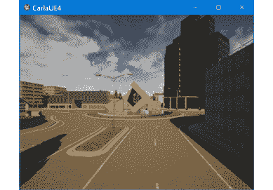

图 7.1 – Carla – 默认轨道

虽然服务器有时很有用，但您可能想运行一些位于 `PythonAPI\util` 和 `PythonAPI\examples` 中的文件。

对于这个任务，我们将使用 `Town01` 改变轨道。您可以使用 `PythonAPI\util\config.py` 文件这样做，如下所示：

```py
python config.py -m=Town01
```

您现在应该看到一个不同的轨道：

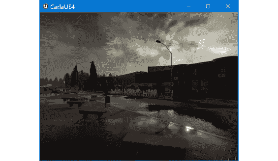

图 7.2 – Town01 轨道

您的城市是空的，因此我们需要添加一些车辆和一些行人。我们可以使用 `PythonAPI\examples\spawn_npc.py` 来完成，如下所示：

```py
python spawn_npc.py  -w=100 -n=100
```

`-w` 参数指定要创建的行人数量，而 `–n` 指定要创建的车辆数量。现在，您应该看到一些动作：

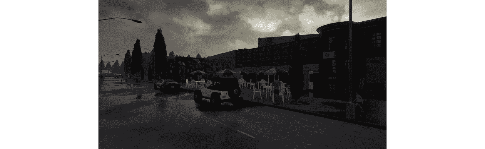

图 7.3 – 带有车辆和行人的 Town01 轨道

好多了。

Carla 设计为作为服务器运行，您可以连接多个客户端，这应该允许进行更有趣的模拟。

当您运行 Carla 时，它启动一个服务器。您可以使用服务器四处走动，但您可能更希望运行一个客户端，因为它可以提供更多功能。如果您运行一个客户端，您将有两个带有 Carla 的窗口，这是预期的：

1.  让我们使用 `PythonAPI\examples\manual_control.py` 运行一个客户端，如下所示：

    ```py
    python manual_control.py
    ```

    您可能会看到以下类似的内容：

    

    图 7.4 – 使用 manual_control.py 的 Town01 轨道

    您可以在左侧看到很多统计数据，并且可以使用 *F1* 键切换它们。您会注意到现在您有一辆车，并且可以使用退格键更改它。

1.  你可以使用与之前相同的按键移动，但这次，行为更加有用和逼真，因为有一些物理模拟。你还可以使用箭头键进行移动。

    你可以使用*Tab*键切换相机，*C*键更改天气，正如我们可以在以下截图中所见：

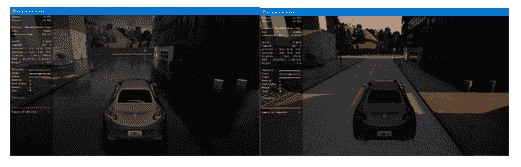

图 7.5 – Town01 赛道；中午大雨和日落时晴朗的天空

Carla 有许多传感器，其中之一是 RGB 相机，你可以使用`` ` ``（反引号键）在它们之间切换。现在，请参考以下截图：

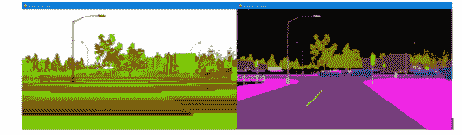

图 7.6 – Town01 赛道 – 左：深度（原始），右：语义分割

上述截图显示了几款非常有趣的传感器：

+   深度传感器，为每个像素提供从摄像机到距离

+   语义分割传感器，使用不同的颜色对每个对象进行分类

在撰写本文时，完整的摄像机传感器列表如下：

+   摄像机 RGB

+   摄像机深度（原始）

+   摄像机深度（灰度）

+   摄像机深度（对数灰度）

+   摄像机语义分割（CityScapes 调色板）

+   激光雷达（射线投射）

+   **动态视觉传感器**（**DVS**）

+   摄像机 RGB 畸变

激光雷达是一种使用激光检测物体距离的传感器；DVS，也称为神经形态相机，是一种记录亮度局部变化的相机，克服了 RGB 相机的一些局限性。摄像机 RGB 畸变只是一个模拟镜头效果的 RGB 相机，当然，你可以根据需要自定义畸变。

以下截图显示了激光雷达摄像机的视图：

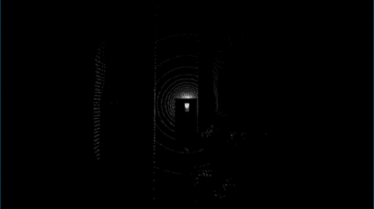

图 7.7 – 激光雷达摄像机视图

以下截图显示了 DVS 的输出：

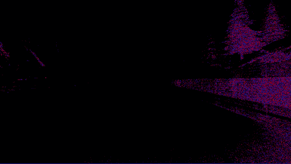

图 7.8 – DVS

你现在可以四处走动，从 RGB 相机收集一些图像，或者你可以使用 GitHub 仓库中的那些。

现在我们有一些图像了，是时候使用名为 SSD 的预训练网络来检测行人、车辆和交通灯了。

## 理解 SSD

在前面的章节中，我们创建了一个分类器，一个能够从预定义的选项集中识别图片中内容的神经网络。在本章的后面部分，我们将看到一个预训练的神经网络，它能够非常精确地对图像进行分类。

与许多神经网络相比，SSD 脱颖而出，因为它能够在同一张图片中检测多个对象。SSD 的细节有些复杂，如果你感兴趣，可以查看“进一步阅读”部分以获取一些灵感。

不仅 SSD 可以检测多个物体，它还可以输出物体存在的区域！在内部，这是通过检查不同宽高比下的 8,732 个位置来实现的。SSD 也足够快，在有良好 GPU 的情况下，它可以用来实时分析视频。

但我们可以在哪里找到 SSD？答案是 TensorFlow 检测模型动物园。让我们看看这是什么。

## 发现 TensorFlow 检测模型动物园

TensorFlow 检测模型动物园是一个有用的预训练神经网络集合，它支持在多个数据集上训练的多个架构。我们感兴趣的是 SSD，因此我们将专注于这一点。

在模型动物园支持的各个数据集中，我们感兴趣的是 COCO。**COCO**是微软的**Common Objects in Context**数据集，一个包含 2,500,000（250 万）张图片的集合，按类型分类。你可以在*进一步阅读*部分找到 COCO 的 90 个标签的链接，但我们感兴趣的是以下这些：

+   `1`: `person`

+   `3`: `car`

+   `6`: `bus`

+   `8`: `truck`

+   `10`: `traffic light`

你可能还对以下内容感兴趣：

+   `2`: `bicycle`

+   `4`: `motorcycle`

+   `13`: `stop sign`

值得注意的是，在 COCO 上训练的 SSD 有多个版本，使用不同的神经网络作为后端以达到所需的速度/精度比。请参考以下截图：

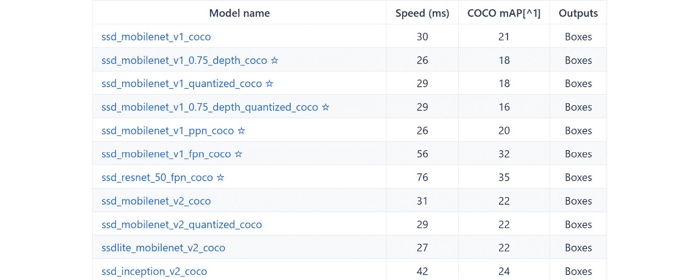

图 7.9 – 在 COCO 上训练的 SSD 的 TensorFlow 检测模型动物园

在这里，`mAP`列是平均精度均值，所以越高越好。MobileNet 是一个专为在移动设备和嵌入式设备上表现良好而开发的神经网络，由于其性能，它是在需要实时进行推理时 SSD 的经典选择。

为了检测道路上的物体，我们将使用以**ResNet50**作为骨干网络的 SSD，这是一个由微软亚洲研究院开发的具有 50 层的神经网络。ResNet 的一个特点是存在**跳跃连接**，这些捷径可以将一层连接到另一层，跳过中间的一些层。这有助于解决**梯度消失问题**。在深度神经网络中，训练过程中的梯度可能会变得非常小，以至于网络基本上停止学习。

但我们如何使用我们选定的模型`ssd_resnet_50_fpn_coco`？让我们来看看！

## 下载和加载 SSD

在模型动物园页面，如果你点击**ssd_resnet_50_fpn_coco**，你会得到一个 Keras 需要从中下载模型的 URL；在撰写本文时，URL 如下：

```py
http://download.tensorflow.org/models/object_detection/ssd_resnet50_v1_fpn_shared_box_predictor_640x640_coco14_sync_2018_07_03.tar.gz
```

模型的全名如下：

```py
ssd_resnet50_v1_fpn_shared_box_predictor_640x640_coco14_sync_2018_07_03.
```

要加载模型，你可以使用以下代码：

```py
url = 'http://download.tensorflow.org/models/object_detection/'
+ model_name + '.tar.gz'
model_dir = tf.keras.utils.get_file(fname=model_name,
untar=True, origin=url)

print("Model path: ", model_dir)
model_dir = pathlib.Path(model_dir) / "saved_model"
model = tf.saved_model.load(str(model_dir))
model = model.signatures['serving_default']
```

如果你第一次运行这段代码，它将花费更多时间，因为 Keras 将下载模型并将其保存在你的硬盘上。

现在我们已经加载了模型，是时候用它来检测一些物体了。

## 运行 SSD

运行 SSD 只需要几行代码。你可以使用 OpenCV 加载图像（分辨率为 299x299），然后你需要将图像转换为张量，这是一种由 TensorFlow 使用的多维数组类型，类似于 NumPy 数组。参考以下代码：

```py
img = cv2.imread(file_name)
img = cv2.cvtColor(img, cv2.COLOR_BGR2RGB)
input_tensor = tf.convert_to_tensor(img)
input_tensor = input_tensor[tf.newaxis, ...]
# Run inference
output = model(input_tensor)
```

请注意，我们向网络输入的是`RGB`图像，而不是`BGR`。你可能还记得前几章中提到的 OpenCV 使用的是`BGR`格式的图片，因此我们需要注意通道的顺序。

如你所见，运行 SSD 相当简单，但输出相对复杂，需要一些代码将其转换为有用且更紧凑的形式。`output`变量是一个 Python 字典，但它包含的值是张量，因此你需要将它们转换。

例如，打印`output['num_detections']`，它包含预测的数量（例如，图像中找到的对象），将得到以下结果：

```py
tf.Tensor([1.], shape=(1,), dtype=float32)
```

对于转换，我们可以使用`int()`。

所有其他张量都是数组，并且可以使用它们的`numpy()`函数进行转换。因此，你的代码可能看起来像这样：

```py
num_detections = int(output.pop('num_detections'))
output = {key: value[0, :num_detections].numpy()
          for key, value in output.items()}
output['num_detections'] = num_detections
```

仍然有以下两个问题需要修复：

+   检测类别是浮点数，而作为我们的标签，它们应该是整数。

+   框的坐标以百分比形式表示。

我们可以用几行代码修复这些问题：

```py
output['detection_classes'] =    output['detection_classes'].astype(np.int64)
output['boxes'] = [
    {"y": int(box[0] * img.shape[0]), 
     "x": int(box[1] * img.shape[1]), 
     "y2": int(box[2] * img.shape[0]),
     "x2": int(box[3] * img.shape[1])} 
        for box in output['detection_boxes']]
```

让我们将 SSD 应用于这张图像：

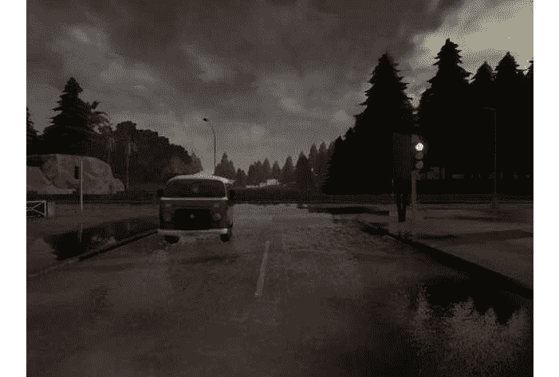

图 7.10 – 来自 Town01 的图像

我们得到以下输出：

```py
{ 'detection_scores': array([0.4976843, 0.44799107, 0.36753723,      0.3548107 ], dtype=float32),    'detection_classes': array([ 8, 10,  6,  3], dtype=int64),  'detection_boxes': array([     [0.46678272, 0.2595877, 0.6488052, 0.40986294],     [0.3679817, 0.76321596, 0.45684734, 0.7875406],     [0.46517858, 0.26020002, 0.6488801, 0.41080648],     [0.46678272, 0.2595877, 0.6488052, 0.40986294]],      dtype=float32),  'num_detections': 4,  'boxes': [{'y': 220, 'x': 164, 'y2': 306, 'x2': 260},            {'y': 174, 'x': 484, 'y2': 216, 'x2': 500},            {'y': 220, 'x': 165, 'y2': 306, 'x2': 260},            {'y': 220, 'x': 164, 'y2': 306, 'x2': 260}]}
```

这就是代码的含义：

+   `detection_scores`：分数越高，预测的置信度越高。

+   `detection_classes`：预测的标签 – 在这种情况下，卡车（`8`）、交通灯（`10`）、公交车（`6`）和汽车（`3`）。

+   `detection_boxes`：原始框，坐标以百分比形式表示。

+   `num_detections`：预测的数量。

+   `boxes`：将坐标转换为原始图像分辨率的框。

请注意，三个预测基本上在同一区域，并且它们按分数排序。我们需要修复这种重叠。

为了更好地看到检测到的内容，我们现在将标注图像。

## 标注图像

为了正确标注图像，我们需要执行以下操作：

1.  只考虑对我们有意义的标签。

1.  移除标签的重叠。

1.  在每个预测上画一个矩形。

1.  写上标签及其分数。

要移除重叠的标签，只需比较它们，如果框的中心相似，我们只保留分数更高的标签。

这是结果：

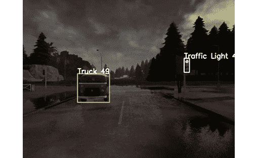

图 7.11 – 来自 Town01 的图像，仅使用 SSD 进行标注

这是一个很好的起点，即使其他图像的识别效果不是很好。车辆被识别为卡车，这并不完全准确，但我们并不真的关心这一点。

主要问题是我们知道有交通灯，但我们不知道它的颜色。不幸的是，SSD 无法帮助我们；我们需要自己来做。

在下一节中，我们将开发一个能够通过称为迁移学习的技术检测交通灯颜色的神经网络。

# 检测交通灯的颜色

原则上，我们可以尝试使用一些计算机视觉技术来检测交通灯的颜色——例如，检查红色和绿色通道可能是一个起点。此外，验证交叉灯底部和上部的亮度也有助于。这可能会有效，即使一些交叉灯可能会有问题。

然而，我们将使用深度学习，因为这项任务非常适合探索更高级的技术。我们还将不遗余力地使用一个小数据集，尽管我们很容易创建一个大数据集；原因在于我们并不总是有轻松增加数据集大小的奢侈。

要能够检测交通灯的颜色，我们需要完成三个步骤：

1.  收集交叉灯的数据集。

1.  训练一个神经网络来识别颜色。

1.  使用带有 SSD 的网络来获取最终结果。

有一个你可以使用的交通灯数据集，即*Bosch Small Traffic Lights*数据集；然而，我们将使用 Carla 生成我们自己的数据集。让我们看看怎么做。

## 创建交通灯数据集

我们将使用 Carla 创建一个数据集。原则上，它可以大如我们所愿。越大越好，但大数据集会使训练变慢，当然，创建它也需要更多的时间。在我们的案例中，由于任务简单，我们将创建一个相对较小的、包含数百张图片的数据集。我们将在稍后探索**迁移学习**，这是一种在数据集不是特别大时可以使用的技巧。

小贴士

在 GitHub 上，你可以找到我为这个任务创建的数据集，但如果你有时间，自己收集数据集可以是一项很好的练习。

创建这个数据集是一个三步任务：

1.  收集街道图片。

1.  找到并裁剪所有的交通灯。

1.  对交通灯进行分类。

收集图片的第一项任务非常简单。只需使用`manual_control.py`启动 Carla 并按*R*键。Carla 将开始录制，并在你再次按*R*键后停止。

假设我们想要记录四种类型的图片：

+   红灯

+   黄灯

+   绿灯

+   交通灯背面（负样本）

我们想要收集交通灯背面的原因是因为 SSD 将其识别为交通灯，但我们没有用，所以我们不希望使用它。这些都是**负样本**，它们也可能包括道路或建筑或任何 SSD 错误分类为交通灯的东西。

因此，在你记录图片时，请尽量为每个类别收集足够的样本。

这些是一些你可能想要收集的图片示例：

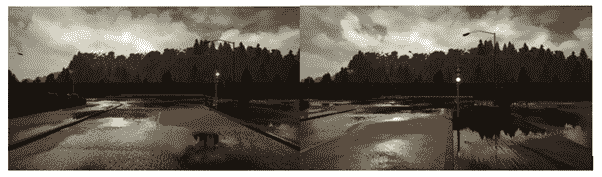

图 7.12 – Town01 – 左：红灯，右：绿灯

第二步是应用 SSD 并提取交叉灯的图像。这很简单；参考以下代码：

```py
obj_class = out["detection_classes"][idx]if obj_class == object_detection.LABEL_TRAFFIC_LIGHT:    box = out["boxes"][idx]    traffic_light = img[box["y"]:box["y2"], box["x"]:box["x2"]]
```

在前面的代码中，假设 `out` 变量包含运行 SSD 的结果，调用 `model(input_tensor)`，并且 `idx` 包含当前预测中的当前检测，你只需要选择包含交通灯的检测，并使用我们之前计算的坐标进行裁剪。

我最终得到了 291 个检测，图像如下：

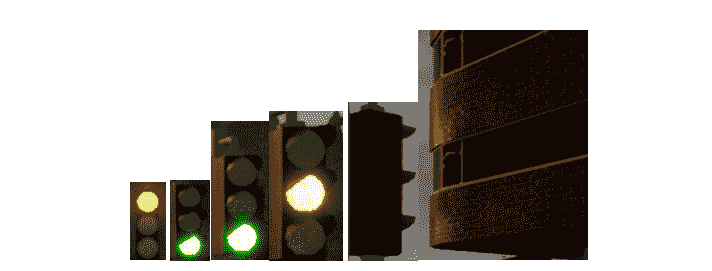

图 7.13 – Town01，从左至右：小红灯，小绿灯，绿灯，黄灯，交通灯背面，被错误分类为交通灯的建筑的一部分

如你所见，图像具有不同的分辨率和比例，这是完全可以接受的。

也有一些图像与交通灯完全无关，例如一块建筑的一部分，这些是很好的负样本，因为 SSD 将它们错误分类，因此这也是提高 SSD 输出的方法之一。

最后一步只是对图像进行分类。有了几百张这种类型的图片，只需要几分钟。你可以为每个标签创建一个目录，并将适当的图片移动到那里。

恭喜你，现在你有一个用于检测交通灯颜色的自定义数据集了。

如你所知，数据集很小，因此，正如我们之前所说的，我们将使用转移学习。下一节将解释它是什么。

## 理解转移学习

转移学习是一个非常恰当的名字。从概念上看，的确，它涉及到将神经网络在一个任务上学习到的知识转移到另一个不同但相关的任务上。

转移学习有几种方法；我们将讨论两种，并选择其中一种来检测交通灯的颜色。在两种情况下，起点都是一个在类似任务上预训练过的神经网络 – 例如，图像分类。我们将在下一节“了解 ImageNet”中更多地讨论这一点。我们专注于用作分类器的 **卷积神经网络** (**CNN**)，因为这是我们识别交通灯颜色的需要。

第一种方法是加载预训练的神经网络，将输出的数量调整到新问题（替换一些或所有密集层，有时只是添加一个额外的密集层），并在新的数据集上基本保持训练。你可能需要使用较小的学习率。如果新数据集中的样本数量小于用于原始训练的数据集，但仍然相当大，这种方法可能有效。例如，我们自定义数据集的大小可能是原始数据集位置的 10%。一个缺点是训练可能需要很长时间，因为你通常在训练一个相对较大的网络。

第二种方法，我们将要采用的方法，与第一种方法类似，但你将冻结所有卷积层，这意味着它们的参数是固定的，在训练过程中不会改变。这有一个优点，即训练速度更快，因为你不需要训练卷积层。这里的想法是，卷积层已经在大型数据集上进行了训练，并且能够检测到许多特征，对于新任务来说也将是可行的，而真正的分类器，由密集层组成，可以被替换并从头开始训练。

中间方法也是可能的，其中你训练一些卷积层，但通常至少保持第一层冻结。

在了解如何使用 Keras 进行迁移学习之前，让我们再思考一下我们刚才讨论的内容。一个关键假设是我们想要从中学习的这个假设网络已经在大型数据集上进行了训练，其中网络可以学习识别许多特征和模式。结果发现，有一个非常大的数据集符合要求——ImageNet。让我们再谈谈它。

## 了解 ImageNet

ImageNet 是一个巨大的数据集，在撰写本文时，它由 14,197,122（超过 1400 万）张图片组成！实际上，它并不提供图片，只是提供下载图片的 URL。这些图片被分类在 27 个类别和总共 21,841 个子类别中！这些子类别，称为 synsets，基于称为**WordNet**的分类层次结构。

ImageNet 已经是一个非常具有影响力的数据集，这也要归功于用于衡量计算机视觉进步的竞赛：**ImageNet 大规模视觉识别挑战**（**ILSVRC**）。

这些是主要类别：

+   `两栖动物`

+   `动物`

+   `家用电器`

+   `鸟类`

+   `覆盖物`

+   `设备`

+   `织物`

+   `鱼类`

+   `花卉`

+   `食物`

+   `水果`

+   `真菌`

+   `家具`

+   `地质构造`

+   `无脊椎动物`

+   `哺乳动物`

+   `乐器`

+   `植物`

+   `爬行动物`

+   `运动`

+   `结构`

+   `工具`

+   `树木`

+   `器具`

+   `蔬菜`

+   `车辆`

+   `人物`

子类别的数量非常高；例如，`树木`类别有 993 个子类别，覆盖了超过五十万张图片！

当然，在这个数据集上表现良好的神经网络将非常擅长识别多种类型图像上的模式，并且它可能也有相当大的容量。所以，是的，它将过度拟合你的数据集，但正如我们所知如何处理过拟合，我们将密切关注这个问题，但不会过于担心。

由于大量研究致力于在 ImageNet 上表现良好，因此许多最有影响力的神经网络都在其上进行了训练，这并不令人惊讶。

在 2012 年首次出现时，其中一个特别引人注目的是 AlexNet。让我们看看原因。

## 发现 AlexNet

当 AlexNet 在 2012 年发布时，它的准确率比当时最好的神经网络高出 10%以上！显然，这些解决方案已经得到了广泛的研究，其中一些现在非常常见。

AlexNet 引入了几个开创性的创新：

+   多 GPU 训练，其中 AlexNet 在一半的 GPU 上训练，另一半在另一个 GPU 上，使得模型的大小翻倍。

+   使用 ReLU 激活而不是 Tanh，这显然使得训练速度提高了六倍。

+   添加了重叠池化，其中 AlexNet 使用了 3x3 的最大池化，但池化区域仅移动 2x2，这意味着池化区域之间存在重叠。根据原始论文，这提高了 0.3–0.4%的准确率。在 Keras 中，你可以使用`MaxPooling2D(pool_size=(3,3), strides=(2,2))`实现类似的重叠池化。

AlexNet 拥有超过 6000 万个参数，相当大，因此为了减少过拟合，它广泛使用了数据增强和 dropout。

虽然 2012 年的 AlexNet 在当时的标准下是当时最先进和开创性的，但按照今天的标准，它相当低效。在下一节中，我们将讨论一个神经网络，它只需 AlexNet 十分之一的参数就能实现显著更高的准确率：**Inception**。

### Inception 背后的理念

拥有一个像 ImageNet 这样的大型数据集是非常好的，但有一个已经用这个数据集训练好的神经网络会更容易。结果发现，Keras 提供了几个这样的神经网络。一个是 ResNet，我们已经遇到了。另一个非常有影响力且具有重大创新的是 Inception。让我们简单谈谈它。

Inception 是一系列神经网络，意味着有多个，它们对初始概念进行了细化。Inception 是由谷歌设计的，在 2014 年 ILSVRC（ImageNet）竞赛中参赛并获胜的版本被称为**GoogLeNet**，以纪念 LeNet 架构。

如果你想知道 Inception 的名字是否来自著名的电影*Inception*，是的，它确实如此，因为他们想要更深入！Inception 是一个深度网络，有一个名为`InceptionResNetV2`的版本达到了惊人的 572 层！当然，这是如果我们计算每个层，包括激活层的话。我们将使用 Inception v3，它只有*159 层*。

我们将重点关注 Inception v1，因为它更容易，我们还将简要讨论后来添加的一些改进，因为它们可以成为你的灵感来源。

谷歌的一个关键观察是，由于一个主题在图片中可能出现的各种位置，很难提前知道卷积层的最佳核大小，所以他们并行添加了 1x1、3x3 和 5x5 卷积，以覆盖主要情况，加上最大池化，因为它通常很有用，并将结果连接起来。这样做的一个优点是网络不会太深，这使得训练更容易。

我们刚才描述的是**天真**的 Inception 块：

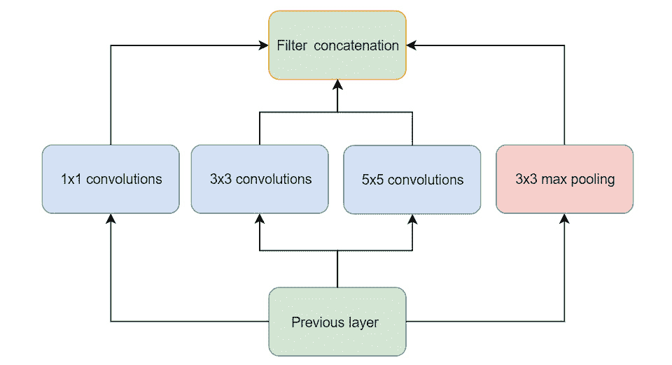

图 7.14 – 天真的 Inception 块

你可能已经注意到了一个 1x1 的卷积。那是什么？只是将一个通道乘以一个数字？并不完全是这样。1x1 卷积执行起来非常便宜，因为它只有 1 次乘法，而不是 3x3 卷积中的 9 次或 5x5 卷积中的 25 次，并且它可以用来改变滤波器的数量。此外，你可以添加一个 ReLU，引入一个非线性操作，这会增加网络可以学习的函数的复杂性。

这个模块被称为天真，因为它计算成本太高。随着通道数的增加，3x3 和 5x5 卷积变得缓慢。解决方案是在它们前面放置 1x1 卷积，以减少更昂贵的卷积需要操作的通道数：

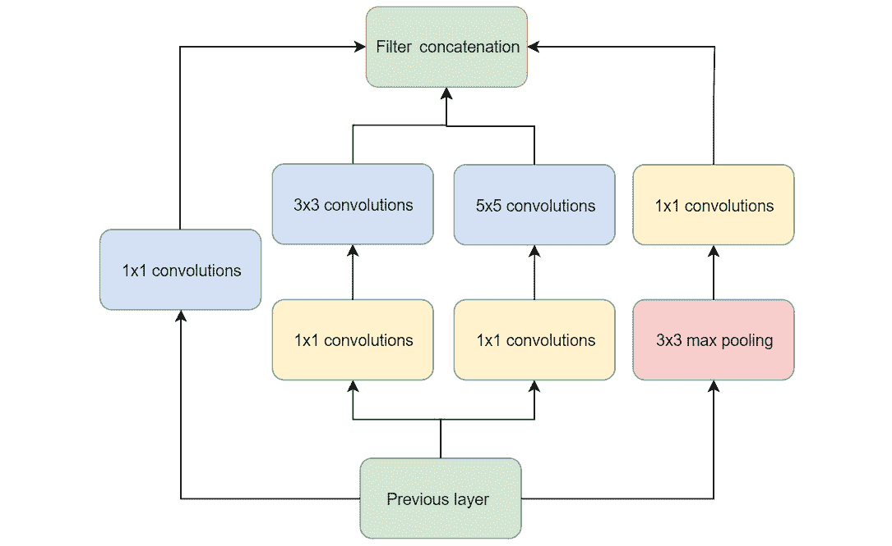

图 7.15 – 包含维度减少的 Inception 块

理解这个块的关键是要记住，1x1 卷积用于减少通道数并显著提高性能。

例如，GoogLeNet 中的第一个 Inception 块有 192 个通道，5x5 的卷积会创建 32 个通道，所以乘法次数将与 25 x 32 x 192 = 153,600 成比例。

他们添加了一个输出为 16 个滤波器的 1x1 卷积，所以乘法次数将与 16 x 192 + 25 x 32 x 16 = 3,072 + 12,800 = 15,872 成比例。几乎减少了 10 倍。不错！

还有一件事。为了使连接操作生效，所有的卷积都需要有相同大小的输出，这意味着它们需要填充，以保持输入图像相同的分辨率。那么最大池化呢？它也需要有与卷积相同大小的输出，所以即使它在 3x3 的网格中找到最大值，也无法减小尺寸。

在 Keras 中，这可能是这样的：

```py
MaxPooling2D(pool_size=(3, 3), padding='same', strides=(1, 1))
```

`strides` 参数表示在计算最大值后移动多少像素。默认情况下，它设置为与 `pool_size` 相同的值，在我们的例子中这将使大小减少 3 倍。将其设置为 `(1, 1)` 并使用相同的填充将不会改变大小。Conv2D 层也有一个 `strides` 参数，可以用来减小输出的大小；然而，通常使用最大池化层这样做更有效。

Inception v2 引入了一些优化，其中以下是一些：

+   5x5 卷积类似于两个堆叠的 3x3 卷积，但速度较慢，因此他们用 3x3 卷积重构了它。

+   3x3 卷积相当于一个 1x3 卷积后跟一个 3x1 卷积，但使用两个卷积要快 33%。

Inception v3 引入了以下优化：

+   使用几个较小的、较快的卷积创建的分解 7x7 卷积

+   一些批量归一化层

Inception-ResNet 引入了 ResNet 典型的残差连接，以跳过一些层。

既然你对 Inception 背后的概念有了更好的理解，让我们看看如何在 Keras 中使用它。

## 使用 Inception 进行图像分类

在 Keras 中加载 Inception 简单得不能再简单了，正如我们在这里可以看到的：

```py
model = InceptionV3(weights='imagenet', input_shape=(299,299,3))
```

由于 Inception 可以告诉我们图像的内容，让我们尝试使用我们在本书开头使用的测试图像：

```py
img = cv2.resize(preprocess_input(cv2.imread("test.jpg")),
(299, 299))
out_inception = model.predict(np.array([img]))
out_inception = imagenet_utils.decode_predictions(out_inception)
print(out_inception[0][0][1], out_inception[0][0][2], "%")
```

这是结果：

```py
sea_lion 0.99184495 %
```

的确是正确的：我们的图像描绘了来自加拉帕戈斯群岛的海狮：

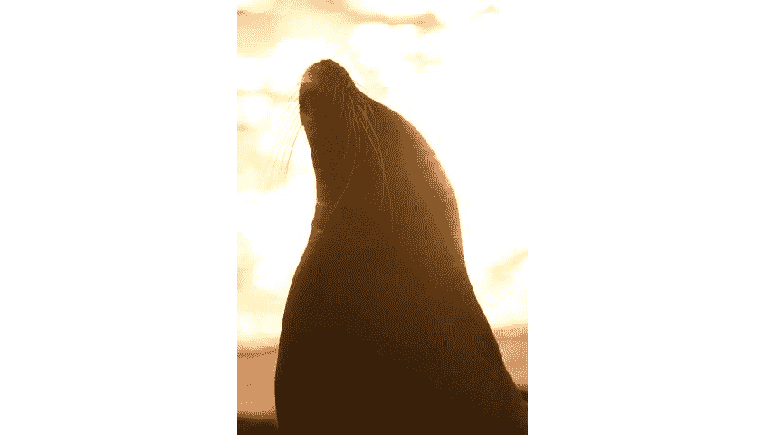

图 7.16 – Inception 以 0.99184495 的置信度识别为海狮

但我们想使用 Inception 进行迁移学习，而不是图像分类，因此我们需要以不同的方式使用它。让我们看看如何。

## 使用 Inception 进行迁移学习

迁移学习的加载略有不同，因为我们需要移除 Inception 上方的分类器，如下所示：

```py
base_model = InceptionV3(include_top=False, input_shape=    (299,299,3))
```

使用 `input_shape`，我们使用 Inception 的原始大小，但你可以使用不同的形状，只要它有 3 个通道，并且分辨率至少为 75x75。

重要的参数是 `include_top`，将其设置为 `False` 将会移除 Inception 的顶部部分——具有密集滤波器的分类器——这意味着网络将准备好进行迁移学习。

我们现在将创建一个基于 Inception 但可以由我们修改的神经网络：

```py
top_model = Sequential()top_model.add(base_model) # Join the networks
```

现在，我们可以在其上方添加一个分类器，如下所示：

```py
top_model.add(GlobalAveragePooling2D())top_model.add(Dense(1024, activation='relu'))top_model.add(Dropout(0.5))top_model.add(Dense(512, activation='relu'))top_model.add(Dropout(0.5))top_model.add(Dense(n_classes, activation='softmax'))
```

我们添加了一些 dropout，因为我们预计 Inception 在我们的数据集上会过度拟合很多。但请注意 `GlobalAveragePooling2D`。它所做的就是计算通道的平均值。

我们可以使用`Flatten`，但由于 Inception 输出 2,048 个 8x8 的卷积通道，而我们使用了一个有 1,024 个神经元的密集层，参数数量会非常大——134,217,728！使用`GlobalAveragePooling2D`，我们只需要 2,097,152 个参数。即使计算 Inception 的参数，节省也是相当显著的——从 156,548,388 个参数减少到 24,427,812 个参数。

我们还需要做一件事：冻结我们不想训练的 Inception 层。在这种情况下，我们想冻结所有层，但这可能并不总是这样。这是冻结它们的方法：

```py
for layer in base_model.layers:
    layer.trainable = False
```

让我们检查一下我们的网络看起来如何。Inception 太大，所以我只会显示参数数据：

```py
Total params: 21,802,784
Trainable params: 21,768,352
Non-trainable params: 34,432
```

请注意，`summary()`实际上会打印出两个摘要：一个用于 Inception，一个用于我们的网络；这是第一个摘要的输出：

`Model: "sequential_1"`

```py
____________________________________________________________
Layer (type)                 Output Shape              Param # 
============================================================
inception_v3 (Model)         (None, 8, 8, 2048)        21802784  
____________________________________________________________
global_average_pooling2d_1 ( (None, 2048)              0 
____________________________________________________________
dense_1 (Dense)              (None, 1024)              2098176 
____________________________________________________________
dropout_1 (Dropout)          (None, 1024)              0 
____________________________________________________________
dense_2 (Dense)              (None, 512)               524800    
____________________________________________________________
dropout_2 (Dropout)          (None, 512)               0 
____________________________________________________________
dense_3 (Dense)              (None, 4)                 2052      
============================================================
Total params: 24,427,812
Trainable params: 2,625,028
Non-trainable params: 21,802,784
____________________________________________________________
```

如您所见，第一层是 Inception。在第二个摘要中，您也确认了 Inception 的层被冻结了，因为我们有超过 2100 万个不可训练的参数，正好与 Inception 的总参数数相匹配。

为了减少过拟合并补偿小数据集，我们将使用数据增强：

```py
datagen = ImageDataGenerator(rotation_range=5, width_shift_
range=[-5, -2, -1, 0, 1, 2, 5], horizontal_flip=True,
height_shift_range=[-30, -20, -10, -5, -2, 0, 2, 5, 10, 20,
30])
```

我只进行了一小点旋转，因为交通灯通常很直，我也只添加了很小的宽度偏移，因为交通灯是由一个神经网络（SSD）检测的，所以切割往往非常一致。我还添加了更高的高度偏移，因为我看到 SSD 有时会错误地切割交通灯，移除其三分之一。

现在，网络已经准备好了，我们只需要给它喂入我们的数据集。

## 将我们的数据集输入到 Inception 中

假设您已经将数据集加载到两个变量中：`images`和`labels`。

Inception 需要一些预处理，将图像的值映射到`[-1, +1]`范围。Keras 有一个函数可以处理这个问题，`preprocess_input()`。请注意，要从`keras.applications.inception_v3`模块导入它，因为其他模块中也有相同名称但不同行为的函数：

```py
from keras.applications.inception_v3 import preprocess_input
images = [preprocess_input(img) for img in images]
```

我们需要将数据集分为训练集和验证集，这很简单，但我们还需要随机化顺序，以确保分割有意义；例如，我的代码加载了所有具有相同标签的图像，所以如果没有随机化，验证集中只会有一两个标签，其中一个甚至可能不在训练集中。

NumPy 有一个非常方便的函数来生成新的索引位置，`permutation()`：

```py
indexes = np.random.permutation(len(images))
```

然后，您可以使用 Python 的一个特性——**for comprehension**，来改变列表中的顺序：

```py
images = [images[idx] for idx in indexes]
labels = [labels[idx] for idx in indexes]
```

如果您的标签是数字，您可以使用`to_categorical()`将它们转换为 one-hot 编码。

现在，只是切片的问题。我们将使用 20%的样本进行验证，所以代码可以像这样：

```py
idx_split = int(len(labels_np) * 0.8)
x_train = images[0:idx_split]
x_valid = images[idx_split:]
y_train = labels[0:idx_split]
y_valid = labels[idx_split:]
```

现在，您可以像往常一样训练网络。让我们看看它的表现如何！

## 迁移学习的性能

模型的性能非常好：

```py
Min Loss: 0.028652783162121116
Min Validation Loss: 0.011525456588399612
Max Accuracy: 1.0
Max Validation Accuracy: 1.0
```

是的，100%的准确率和验证准确率！不错，不错。实际上，这非常令人满意。然而，数据集非常简单，所以预期一个非常好的结果是公平的。

这是损失图的图表：

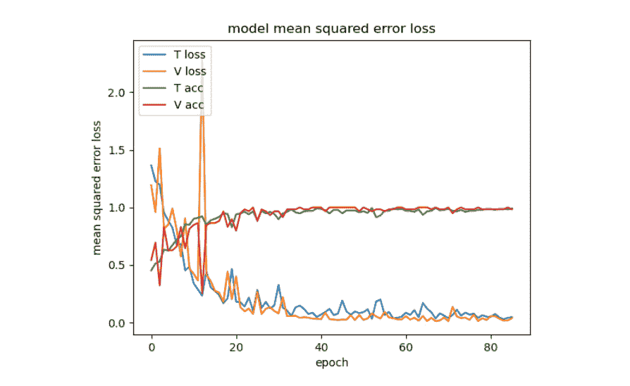

图 7.17 – 使用 Inception 迁移学习的损失

问题在于，尽管结果很好，但网络在我的测试图像上表现并不太好。可能是因为图像通常比 Inception 的原生分辨率小，网络可能会遇到由插值产生的模式，而不是图像中的真实模式，并且可能被它们所困惑，但这只是我的理论。

为了获得好的结果，我们需要更加努力。

## 改进迁移学习

我们可以假设网络正在过拟合，标准的应对措施是增加数据集。在这种情况下，这样做很容易，但让我们假设我们无法这样做，因此我们可以探索其他在这种情况下可能对你有用的选项。

我们可以做一些非常简单的事情来减少过拟合：

+   增加数据增强的多样性。

+   增加 dropout。

尽管 Inception 显然能够处理比这更复杂的任务，但它并不是为此特定任务优化的，而且它也可能从更大的分类器中受益，所以我将添加一个层：

+   这是经过几次测试后的新数据增强：

    ```py
    datagen = ImageDataGenerator(rotation_range=5, width_
    shift_range= [-10, -5, -2, 0, 2, 5, 10],
    zoom_range=[0.7, 1.5],
    height_shift_range=[-10, -5, -2, 0, 2, 5, 10],
    horizontal_flip=True)
    ```

+   这是新模型，具有更多的 dropout 和额外的层：

    ```py
    top_model.add(GlobalAveragePooling2D())top_model.add(Dropout(0.5))top_model.add(Dense(1024, activation='relu'))top_model.add(BatchNormalization())top_model.add(Dropout(0.5))top_model.add(Dense(512, activation='relu'))top_model.add(Dropout(0.5))top_model.add(Dense(128, activation='relu'))top_model.add(Dense(n_classes, activation='softmax'))
    ```

+   我在全局平均池化之后添加了一个 dropout，以减少过拟合，我还添加了一个批量归一化层，这也有助于减少过拟合。

+   然后，我添加了一个密集层，但我没有在上面添加 dropout，因为我注意到网络在大量 dropout 的情况下训练存在问题。

    即使我们不希望增加数据集，我们仍然可以对此采取一些措施。让我们看看类别的分布：

    ```py
    print('Labels:', collections.Counter(labels))
    ```

    这是结果：

    ```py
    Labels: Counter({0: 123, 2: 79, 1: 66, 3: 23})
    ```

如你所见，数据集中绿色比黄色或红色多得多，而且负面样本不多。

通常来说，标签不平衡并不是一个好的现象，因为实际上网络预测的绿灯比实际存在的绿灯要多，这在统计上意味着预测绿灯比预测其他标签更有利可图。为了改善这种情况，我们可以指导 Keras 以这种方式自定义损失函数，即预测错误的红灯比预测错误绿灯更糟糕，这样会产生类似于使数据集平衡的效果。

你可以用这两行代码做到这一点：

```py
n = len(labels)
class_weight = {0: n/cnt[0], 1: n/cnt[1], 2: n/cnt[2], 3: n/cnt[3]}
```

以下结果是：

```py
Class weight: {0: 2.365, 1: 4.409, 2: 3.683, 3: 12.652}
```

如你所见，对于绿色（标签 0）的损失惩罚比其他标签要小。

这是网络的表现方式：

```py
Min Loss: 0.10114006596268155
Min Validation Loss: 0.012583946840742887
Max Accuracy: 0.99568963
Max Validation Accuracy: 1.0
```

与之前没有太大不同，但这次，网络表现更好，并准确识别了我测试图像中的所有交通灯。这应该是一个提醒，不要完全相信验证准确率，除非你确信你的验证数据集非常优秀。

这是损失图的图表：

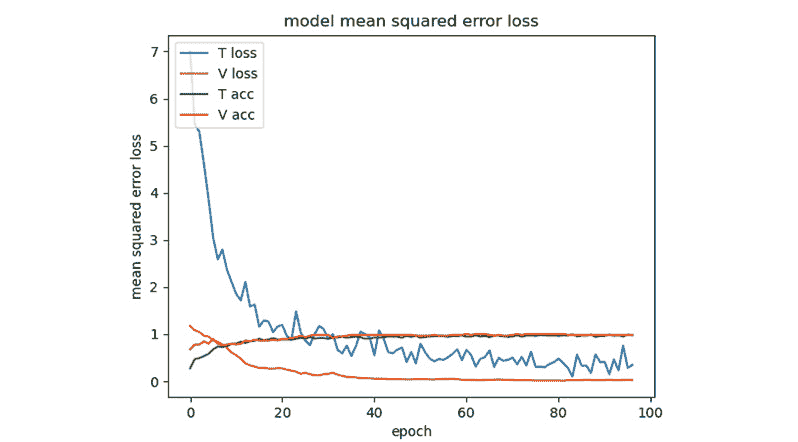

图 7.18 – 使用 Inception 进行迁移学习后的损失，改进

现在我们有一个好的网络，是时候完成我们的任务了，使用新的网络结合 SSD，如下一节所述。

# 识别交通灯及其颜色

我们几乎完成了。从使用 SSD 的代码中，我们只需要以不同的方式管理交通灯。因此，当标签是`10`（交通灯）时，我们需要做以下操作：

+   裁剪带有交通灯的区域。

+   调整大小为 299x299。

+   预处理它。

+   通过我们的网络运行它。

然后，我们将得到预测结果：

```py
img_traffic_light = img[box["y"]:box["y2"], box["x"]:box["x2"]]img_inception = cv2.resize(img_traffic_light, (299, 299))img_inception = np.array([preprocess_input(img_inception)])prediction = model_traffic_lights.predict(img_inception)label = np.argmax(prediction)
```

如果你运行 GitHub 上本章的代码，标签`0`代表绿灯，`1`代表黄灯，`2`代表红灯，而`3`表示不是交通灯。

整个过程首先涉及使用 SSD 检测物体，然后使用我们的网络检测图像中是否存在交通灯的颜色，如以下图解所示：

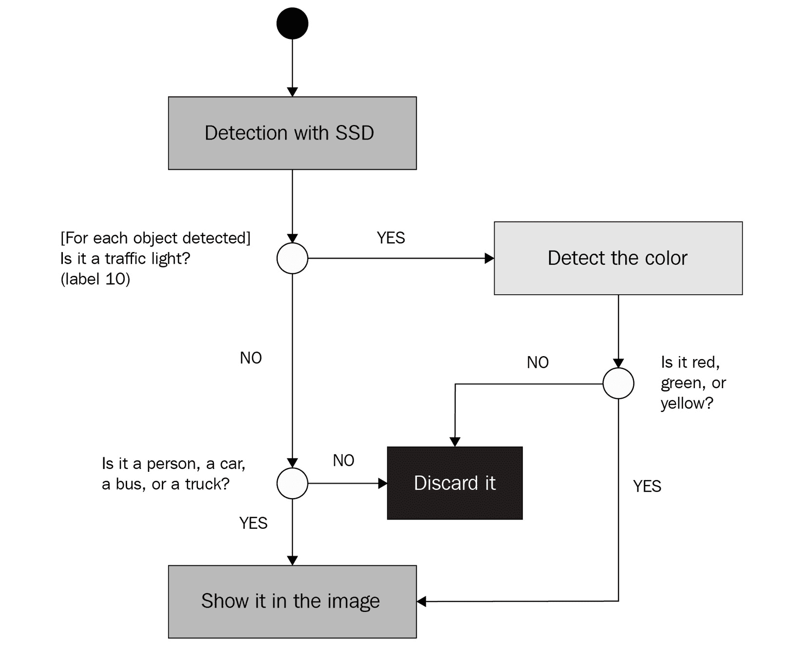

图 7.19 – 展示如何结合使用 SSD 和我们的网络的图解

这些是在运行 SSD 后运行我们的网络获得的示例：

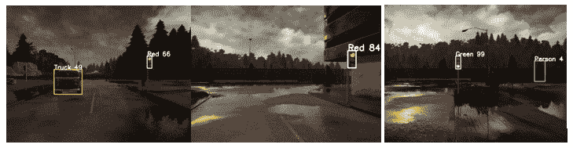

图 7.20 – 带有交通灯的一些检测

现在交通灯的颜色已经正确检测。有一些误检：例如，在前面的图中，右边的图像标记了一个有树的地方。不幸的是，这种情况可能发生。在视频中，我们可以在接受之前要求检测几帧，始终考虑到在真正的自动驾驶汽车中，你不能引入高延迟，因为汽车需要快速对街道上发生的事情做出反应。

# 摘要

在本章中，我们专注于预训练的神经网络，以及我们如何利用它们来实现我们的目的。我们将两个神经网络结合起来检测行人、车辆和交通灯，包括它们的颜色。我们首先讨论了如何使用 Carla 收集图像，然后发现了 SSD，这是一个强大的神经网络，因其能够检测物体及其在图像中的位置而突出。我们还看到了 TensorFlow 检测模型库以及如何使用 Keras 下载在名为 COCO 的数据集上训练的 SSD 的所需版本。

在本章的第二部分，我们讨论了一种称为迁移学习的强大技术，并研究了 Inception 神经网络的一些解决方案，我们使用迁移学习在我们的数据集上训练它，以便能够检测交通灯的颜色。在这个过程中，我们还讨论了 ImageNet，并看到了达到 100%验证准确率是如何具有误导性的，因此，我们必须减少过拟合以提高网络的真正精度。最终，我们成功地使用两个网络一起工作——一个用于检测行人、车辆和交通灯，另一个用于检测交通灯的颜色。

既然我们已经知道了如何构建关于道路的知识，那么现在是时候前进到下一个任务——驾驶！在下一章中，我们将真正地坐在驾驶座上（Carla 的驾驶座），并使用一种称为行为克隆的技术来教我们的神经网络如何驾驶，我们的神经网络将尝试模仿我们的行为。

# 问题

你现在应该能够回答以下问题：

1.  什么是 SSD？

1.  什么是 Inception？

1.  冻结一层意味着什么？

1.  SSD 能否检测交通灯的颜色？

1.  什么是迁移学习？

1.  你能列举一些减少过拟合的技术吗？

1.  你能描述 Inception 块背后的想法吗？

# 进一步阅读

+   SSD：[`arxiv.org/abs/1512.02325`](https://arxiv.org/abs/1512.02325)

+   TensorFlow 模型库：[`github.com/tensorflow/models/blob/master/research/object_detection/g3doc/detection_model_zoo.md`](https://github.com/tensorflow/models/blob/master/research/object_detection/g3doc/detection_model_zoo.md)

+   COCO 标签：[`github.com/tensorflow/models/blob/master/research/object_detection/data/mscoco_label_map.pbtxt`](https://github.com/tensorflow/models/blob/master/research/object_detection/data/mscoco_label_map.pbtxt)

+   梯度消失问题：[`en.wikipedia.org/wiki/Vanishing_gradient_problem`](https://en.wikipedia.org/wiki/Vanishing_gradient_problem)

+   博世小型交通灯数据集：[`hci.iwr.uni-heidelberg.de/content/bosch-small-traffic-lights-dataset`](https://hci.iwr.uni-heidelberg.de/content/bosch-small-traffic-lights-dataset)

+   ImageNet：[`www.image-net.org/`](http://www.image-net.org/)

+   Inception 论文：[`static.googleusercontent.com/media/research.google.com/en//pubs/archive/43022.pdf`](https://static.googleusercontent.com/media/research.google.com/en//pubs/archive/43022.pdf)

+   AlexNet 论文：[`papers.nips.cc/paper/4824-imagenet-classification-with-deep-convolutional-neural-networks.pdf`](https://papers.nips.cc/paper/4824-imagenet-classification-with-deep-convolutional-neural-networks.pdf)
