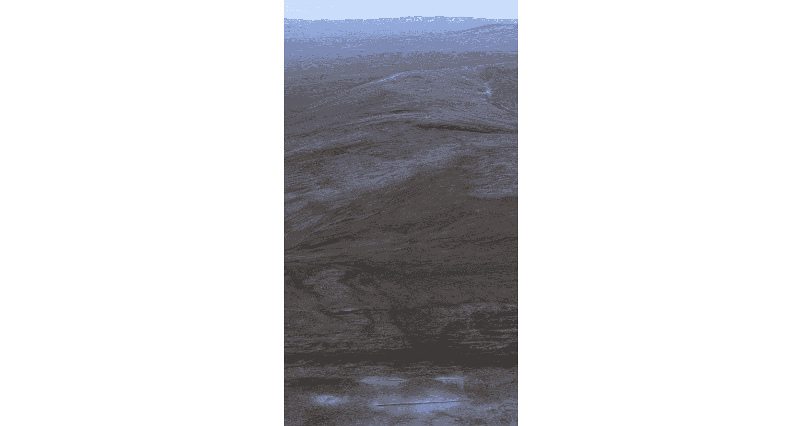
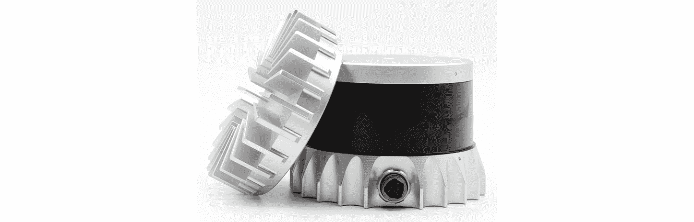
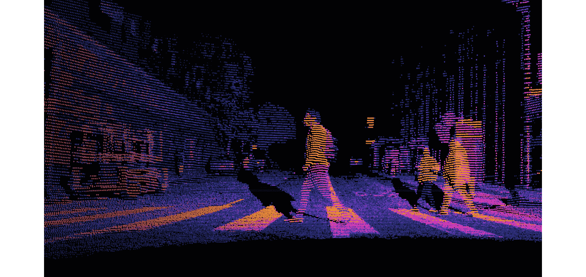
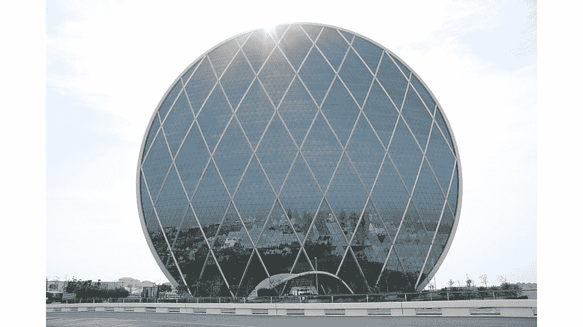
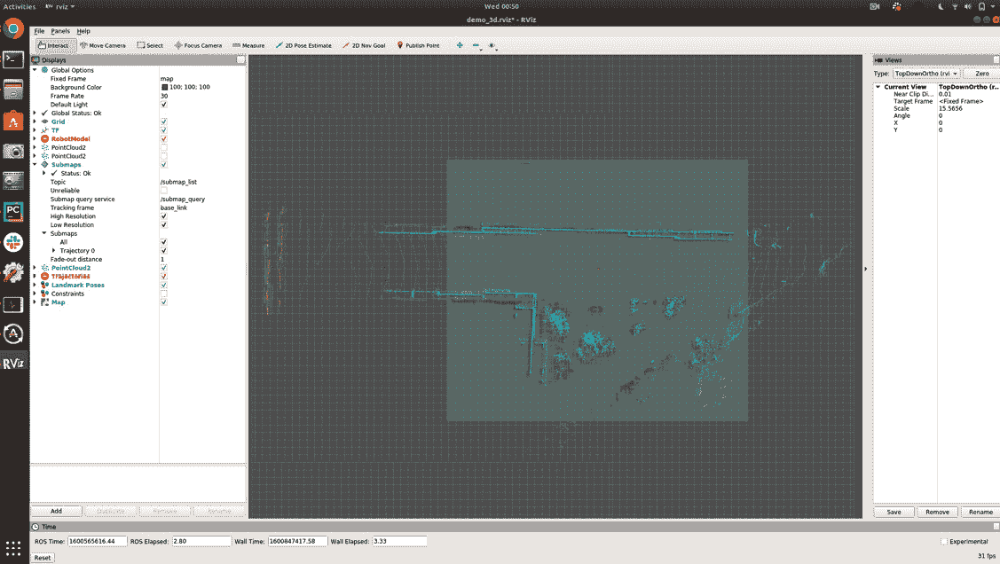
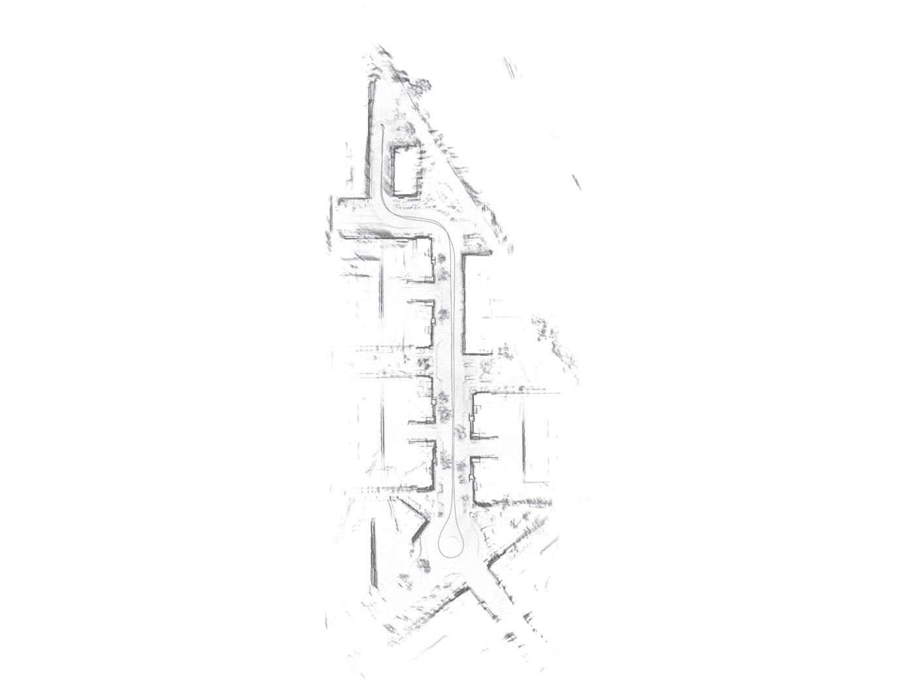
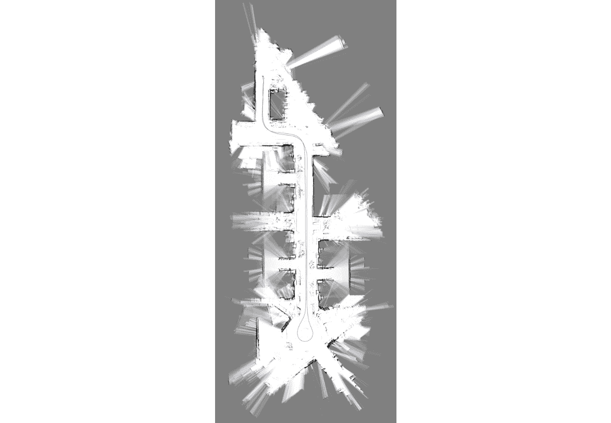
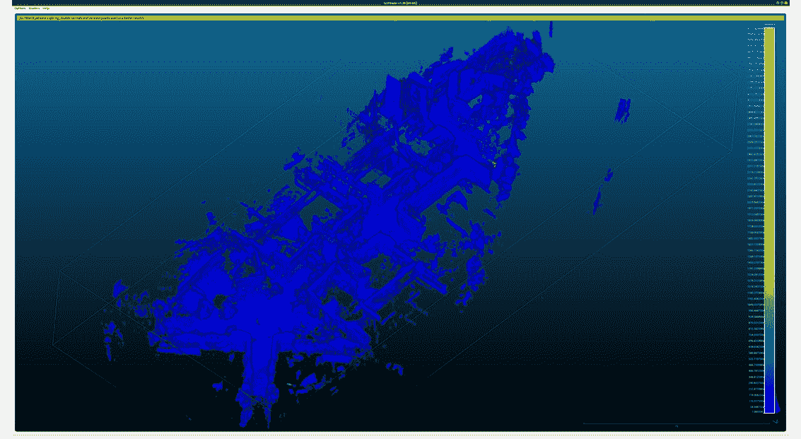
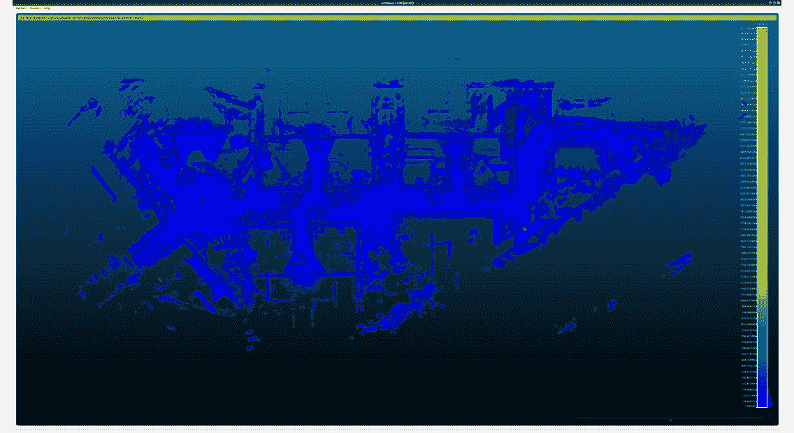

# 第十一章：*第十一章*：绘制我们的环境

你的自动驾驶汽车在导航世界时需要一些基本的东西。

首先，你需要有一个你环境的地图。这个地图与你用来到达你最喜欢的餐厅的手机上的地图非常相似。

其次，你需要一种方法在现实世界中定位你在地图上的位置。在你的手机上，这就是由 GPS 定位的蓝色点。

在本章中，你将了解你的自动驾驶汽车如何通过其环境进行地图和定位的各种方法，以便知道它在世界中的位置。你可以想象这为什么很重要，因为制造自动驾驶汽车的全部原因就是为了去往各个地方！

你将学习以下主题，帮助你构建一个值得被称为麦哲伦的自动驾驶汽车：

+   为什么你需要地图和定位

+   地图和定位的类型

+   开源地图工具

+   使用 Ouster 激光雷达和 Google Cartographer 进行 SLAM

# 技术要求

本章需要以下软件：

+   Linux

+   ROS Melodic: [`wiki.ros.org/melodic/Installation/Ubuntu`](http://wiki.ros.org/melodic/Installation/Ubuntu)

+   Python 3.7: [`www.python.org/downloads/release/python-370/`](https://www.python.org/downloads/release/python-370/)

+   C++

+   Google Cartographer ROS: [`github.com/cartographer-project/cartographer_ros`](https://github.com/cartographer-project/cartographer_ros)

+   `ouster_example_cartographer`: [`github.com/Krishtof-Korda/ouster_example_cartographer`](https://github.com/Krishtof-Korda/ouster_example_cartographer)

本章的代码可以在以下链接找到：

[`github.com/PacktPublishing/Hands-On-Vision-and-Behavior-for-Self-Driving-Cars`](https://github.com/PacktPublishing/Hands-On-Vision-and-Behavior-for-Self-Driving-Cars)

本章动作视频中的代码可以在以下位置找到：

[`bit.ly/2IVkJVZ`](https://bit.ly/2IVkJVZ)

# 为什么你需要地图和定位

在本章中，你将学习地图和定位的重要性，以及它们的结合。在现代世界中，我们常常认为地图和定位是理所当然的，但正如你将看到的，它们非常重要，尤其是在自动驾驶汽车中，那里的人类大脑没有得到充分利用。

## 地图

抽空想象一下，一个没有手机、没有 MapQuest（是的，我是个老千禧一代）、没有纸质地图，也没有希腊的安纳克西曼德的世界！

你认为你能多好地从你家导航到一个你从未去过的小镇，更不用说那些刚刚在几个城市外开业的新 Trader Joe's 了？我敢肯定你可以做到，但你可能会每隔几公里就停下来，向当地人询问接下来的几个方向，以便更接近那个大胆而质朴的两美元一瓶的查克。但你可以看到地图为什么真的让我们的生活变得更轻松，并为我们探索新地方提供了可能性，几乎不用担心迷路，最终到达瓦利世界。

现在，你非常幸运，像谷歌和苹果这样的公司已经不辞辛劳地绘制了你所能想到的每条街道、小巷和支路。这是一项巨大的任务，我们每天都在从中受益。万岁，地图！

## 定位

好的，现在想象一下你被传送到这里：



图 11.1 – 俄罗斯猴脸。图片来源：[`bit.ly/6547672-17351141`](http://bit.ly/6547672-17351141)

你已经得到了该地区的地图，需要找到通往最近的水体的路。在你因为传送而颤抖停止后，你需要做的第一件事是确定你在地图上的位置。你可能会环顾四周，以辨认附近的标志，然后尝试在地图上找到这些标志。“猴脸，我正处在猴脸的正中央！”恭喜你，你已经在地图上定位了自己，并可以使用它来找到生命的灵丹妙药！

现在你明白为什么在导航世界和环境时，既需要地图又需要定位。

现在，你说，“但是等等，如果自从地图生成以来世界发生了变化呢？！”

一定有你在开车时，跟随手机上导航甜美的声音，突然“砰！”你撞到了一些正在施工的道路，道路被封闭，迫使你绕行 30 分钟。你对你的手机大喊，“诅咒你，来自虚无的导航声音！你怎么不知道有施工呢？”

事实是，无论你的导航语音多么更新，总会错过关于世界的实时信息。想象一下一些鸭子正在过马路；语音永远不会警告你这一点。在下一节中，你将学习到许多使用各种类型的制图和定位来拯救鸭子的方法。

# 制图和定位的类型

定位和制图领域绝对充满了惊人的研究，并且一直在不断发展。GPU 和计算机处理速度的进步导致了某些非常激动人心的算法的发展。

快点，让我们回到拯救我们的鸭子！回想一下上一节，我们亲爱的卫星导航语音没有看到在我们面前过马路的鸭子。由于世界一直在变化和演变，地图永远不会完全准确。因此，我们必须有一种方法，不仅能够使用预先构建的地图进行定位，而且还能实时构建地图，以便我们可以在地图上看到新障碍物的出现，并绕过它们。为鸭子介绍 SLAM（不是 dunks）。

虽然有独立的制图和定位方法，但在本章中，我们将重点介绍**同时定位与制图**（**SLAM**）。如果你好奇的话，以下是一些最常用的独立定位和制图算法的快速概述：

+   粒子滤波器

+   马尔可夫定位

+   网格定位

+   用于测距定位的扩展卡尔曼滤波器

+   用于测距（里程计）的卡尔曼滤波器

    注意

    你可以在这里了解更多关于定位的信息：

    [`www.cs.cmu.edu/~motionplanning/lecture/Chap8-Kalman-Mapping_howie.pdf`](https://www.cs.cmu.edu/~motionplanning/lecture/Chap8-Kalman-Mapping_howie.pdf)

    [`robots.stanford.edu/papers/thrun.pf-in-robotics-uai02.pdf`](http://robots.stanford.edu/papers/thrun.pf-in-robotics-uai02.pdf)

    [`www.ri.cmu.edu/pub_files/pub1/fox_dieter_1999_3/fox_dieter_1999_3.pdf`](https://www.ri.cmu.edu/pub_files/pub1/fox_dieter_1999_3/fox_dieter_1999_3.pdf)

以下是一些示例类型的建图：

+   占用网格

+   基于特征的（地标）

+   拓扑（基于图）

+   视觉教学和重复

    注意

    要了解更多关于建图的信息，请参考以下链接：

    [`www.cs.cmu.edu/~motionplanning/lecture/Chap8-Kalman-Mapping_howie.pdf`](https://www.cs.cmu.edu/~motionplanning/lecture/Chap8-Kalman-Mapping_howie.pdf)

    [`www.ri.cmu.edu/pub_files/pub1/thrun_sebastian_1996_8/thrun_sebastian_1996_8.pdf`](https://www.ri.cmu.edu/pub_files/pub1/thrun_sebastian_1996_8/thrun_sebastian_1996_8.pdf)

关于这些算法和实现有很多很好的信息，但在这本书中，我们将重点关注最广泛使用的定位和建图形式，即同时进行的：SLAM。

## 同时定位与建图（SLAM）

让我们暂时回到我们的想象中。

想象一下，你突然在一个晚上醒来，周围一片漆黑，没有月光，没有萤火虫——只有一片漆黑！别担心，你将使用 SLAM 的魔法从床边导航到获取美味的午夜小吃！

你摸索着你的左手，直到感觉到床的边缘。砰，你刚刚在床上定位了自己，并在心中绘制了床的左侧。你假设你在睡觉时没有在床上垂直翻转，所以这确实是你的床的左侧。

接下来，你将双腿从床边放下，慢慢地降低身体，直到你感觉到地板。砰，你刚刚绘制了你地板的一部分。现在，你小心翼翼地站起来，将手臂伸向前方。你像海伦·凯勒寻找蜘蛛网一样，在你面前摆动你的手臂，形成 Lissajous 曲线。同时，你小心翼翼地在地板上扫动你的脚，就像一个现代的诠释舞者寻找任何步骤、过渡、边缘和陷阱，以免摔倒。

每当你向前移动时，你都要仔细地在心里记录你面向的方向和走了多远（**里程计**）。始终，你正在构建一个心理地图，并用你的手和脚作为范围传感器，给你一种你在房间中的位置感（**定位**）。每次你发现障碍物，你都会将它存储在你的心理地图中，并小心翼翼地绕过它。你正在进行 SLAM！

SLAM 通常使用某种测距传感器，例如激光雷达传感器：



图 11.2 – OS1-128 数字激光雷达传感器，由 Ouster, Inc. 提供

当你在房间内导航时，你的手臂和腿就像你的测距仪。激光雷达传感器使用激光光束，它照亮环境并从物体上反射回来。光从发出到返回的时间被用来通过光速估计到物体的距离。例如 OS1-128 这样的激光雷达传感器，可以产生丰富且密集的点云，具有高度精确的距离信息：



图 11.3 – 城市环境中的激光雷达点云，由 Ouster, Inc. 提供

这种距离信息是 SLAM 算法用来定位和绘制世界地图的。

还需要一个**惯性测量单元**（**IMU**）来帮助估计车辆的姿态并估计连续测量之间的距离。Ouster 激光雷达传感器之所以在地图创建中很受欢迎，一个原因是它们内置了 IMU，这使得你可以用单个设备开始制图。在本章的后面部分，你将学习如何使用 Ouster 激光雷达传感器和 Google Cartographer 进行制图。

SLAM 是在没有任何先验信息的情况下实时构建地图并同时在地图中定位的概念。你可以想象这非常困难，有点像“先有鸡还是先有蛋”的问题。为了定位，你需要一个地图（蛋）来定位，但与此同时，为了实时构建你的地图，你需要定位（鸡）并知道你在你试图构建的地图上的位置。这就像一部时间旅行电影中的问题：生存足够长的时间回到过去，首先救自己。你的头还疼吗？

好消息是，这个领域已经研究了 30 多年，并以机器人技术和自动驾驶汽车算法的形式结出了美丽的果实。让我们看看未来有什么在等待我们！

### SLAM 类型

以下是一些在机器人、无人机制图和自动驾驶行业中广泛使用的最先进算法的简要列表。这些算法各有不同的应用。例如，RGB-D SLAM 用于基于摄像头的 SLAM，而 LIO SAM 则专门用于激光雷达传感器。动力融合是另一种有趣的 SLAM 形式，用于绘制室内复杂物体。更完整的列表可以在 KITTI 网站上找到：[`www.cvlibs.net/datasets/kitti/eval_odometry.php`](http://www.cvlibs.net/datasets/kitti/eval_odometry.php)

+   **LIO SAM**：[`arxiv.org/pdf/2007.00258.pdf`](https://arxiv.org/pdf/2007.00258.pdf)

+   **LOAM**：[`ri.cmu.edu/pub_files/2014/7/Ji_LidarMapping_RSS2014_v8.pdf`](https://ri.cmu.edu/pub_files/2014/7/Ji_LidarMapping_RSS2014_v8.pdf)

+   **RGB-D SLAM**：[`felixendres.github.io/rgbdslam_v2/`](https://felixendres.github.io/rgbdslam_v2/)

+   **动态融合**：[`www.microsoft.com/en-us/research/wp-content/uploads/2016/02/ismar2011.pdf`](https://www.microsoft.com/en-us/research/wp-content/uploads/2016/02/ismar2011.pdf)

接下来，你将学习关于在 SLAM 算法中减少误差的一个非常重要的方法。

### SLAM 中的闭环检测

在地图制作和定位时，有一件事需要考虑，那就是没有任何东西是完美的。你永远找不到一个完全准确的传感器。所有传感器都是概率性的，包含一个测量值的平均值和方差。这些值在工厂的校准过程中通过经验确定，并在数据表中提供。你可能会问，*我为什么要关心这个？*

好问题！传感器总是存在一些误差的事实意味着，你使用这些传感器导航的时间越长，你的地图以及你在地图中的位置估计与现实之间的偏差就越大。

几乎所有的 SLAM 算法都有一个应对这种漂移的技巧：**闭环检测**！闭环检测的工作原理是这样的。假设你在前往阿布扎德的旅途中经过了阿达尔大楼：



图 11.4 – 阿布扎比的阿达尔总部大楼，阿联酋

你将这个壮观的圆形建筑注册到你的地图中，然后继续你的旅程。然后，在某个时候，也许在你吃了在黎巴嫩午餐之后，你开车返回，第二次经过阿达尔大楼。现在当你经过它时，你测量你与它的距离，并将其与你第一次在地图上注册它时的位置进行比较。你意识到你并不在你期望的位置。咔嚓！算法利用这些信息，迭代地纠正整个地图，以表示你在世界中的真实位置。

SLAM 会不断地对每个它映射的特征做这件事，并在之后返回。在你接下来几节中玩开源 SLAM 时，你会看到这个动作。在那之前，让我们快速展示一些可用的开源地图工具，供你在地图制作中享受。

# 开源地图工具

SLAM 的实现和理解相当复杂，但幸运的是，有许多开源解决方案可供你在自动驾驶汽车中使用。网站 *Awesome Open Source* ([`awesomeopensource.com/projects/slam`](https://awesomeopensource.com/projects/slam)) 收集了大量的 SLAM 算法，你可以使用。

这里有一些精心挑选的内容来激发你的兴趣：

+   **Google 的 Cartographer** ([`github.com/cartographer-project/cartographer`](https://github.com/cartographer-project/cartographer))

+   **TixiaoShan 的 LIO-SAM** ([`github.com/TixiaoShan/LIO-SAM`](https://github.com/TixiaoShan/LIO-SAM))

+   **RobustFieldAutonomy 的 LeGO-LOAM** ([`github.com/RobustFieldAutonomyLab/LeGO-LOAM`](https://github.com/RobustFieldAutonomyLab/LeGO-LOAM))

由于 Cartographer 迄今为止是最受欢迎和支持的，您将在下一节中有机会体验和探索它所提供的一切。

# 使用 Ouster 激光雷达和 Google Cartographer 进行 SLAM

这就是您一直等待的时刻：使用 Cartographer 和 Ouster 激光雷达传感器亲自动手绘制地图！

在这个动手实验中，选择 Ouster 激光雷达是因为它内置了**IMU**，这是执行 SLAM 所需的。这意味着您不需要购买另一个传感器来提供惯性数据。

您将看到的示例是从 Ouster 传感器收集的数据的离线处理，并改编自 Wil Selby 的工作。请访问 Wil Selby 的网站主页，了解更多酷炫的项目和想法：[`www.wilselby.com/`](https://www.wilselby.com/)。

Selby 还有一个相关的项目，该项目在 ROS 中为 DIY 自动驾驶汽车执行在线（实时）SLAM：[`github.com/wilselby/diy_driverless_car_ROS`](https://github.com/wilselby/diy_driverless_car_ROS)。

## Ouster 传感器

您可以从 OS1 用户指南中了解更多关于 Ouster 数据格式和传感器使用的信息。

[`github.com/PacktPublishing/Hands-On-Vision-and-Behavior-for-Self-Driving-Cars/blob/master/Chapter11/OS1-User-Guide-v1.14.0-beta.12.pdf`](https://github.com/PacktPublishing/Hands-On-Vision-and-Behavior-for-Self-Driving-Cars/blob/master/Chapter11/OS1-User-Guide-v1.14.0-beta.12.pdf)

别担心，您不需要购买传感器就可以在本章中亲自动手。我们已经为您提供了从 OS1-128 收集的一些样本数据，您可以稍后看到如何下载这些数据。

## 仓库

您可以在以下链接中找到本章的代码，位于`ouster_example_cartographer`子模块中：

[`github.com/PacktPublishing/Hands-On-Vision-and-Behavior-for-Self-Driving-Cars/tree/master/Chapter11`](https://github.com/PacktPublishing/Hands-On-Vision-and-Behavior-for-Self-Driving-Cars/tree/master/Chapter11)

为了确保您拥有子模块中的最新代码，您可以从`Chapter11`文件夹中运行以下命令：

```py
$ git submodule update --remote ouster_example_cartographer
```

## 开始使用 cartographer_ros

在我们深入代码之前，我们鼓励您通过阅读算法遍历来学习 Cartographer 的基础知识：

[`google-cartographer-ros.readthedocs.io/en/latest/algo_walkthrough.html`](https://google-cartographer-ros.readthedocs.io/en/latest/algo_walkthrough.html)

让我们从快速概述 Cartographer 配置文件开始，这些配置文件是使它能够使用您的传感器工作的。

## Cartographer_ros 配置

地图绘制器需要以下配置文件来了解您的传感器、机器人、变换等信息。这些文件可以在`ouster_example_cartographer/cartographer_ros/`文件夹中找到：

+   `configuration_files/demo_3d.rviz`

+   `configuration_files/cart_3d.lua`

+   `urdf/os_sensor.urdf`

+   `launch/offline_cart_3d.launch`

+   `configuration_files/assets_writer_cart_3d.lua`

+   `configuration_files/transform.lua`

这里引用的文件是用于在从 Ouster 传感器收集的包上执行离线 SLAM 的。

现在，让我们逐个分析每个文件，并解释它们如何有助于在 ROS 内部实现 SLAM。

### demo_3d.rviz

此文件设置了 `rviz` 图形用户界面窗口的配置。它基于 `cartographer_ros` 源文件中提供的示例文件：

[`github.com/cartographer-project/cartographer_ros/blob/master/cartographer_ros/configuration_files/demo_3d.rviz`](https://github.com/cartographer-project/cartographer_ros/blob/master/cartographer_ros/configuration_files/demo_3d.rviz)

它指定了参考框架。有关各种参考框架的详细信息，请参阅以下链接：

[`www.ros.org/reps/rep-0105.html`](https://www.ros.org/reps/rep-0105.html)

以下代码片段是你在根据项目使用的传感器添加框架名称的位置：

```py
      Frames:
        All Enabled: true
        base_link:
          Value: true
        map:
          Value: true
        odom:
          Value: true
        os:
          Value: true
        os_imu:
          Value: true
```

以下是对前面代码中每个框架定义的说明：

+   `base_link` 是你的机器人的坐标框架。

+   `map` 是世界的固定坐标框架。

+   `odom` 是一个基于惯性测量单元（IMU）、轮编码器、视觉里程计等测量的世界固定框架。这可能会随时间漂移，但可以在没有离散跳跃的情况下保持连续平滑的位置信息。Cartographer 使用这个框架来发布非闭环局部 SLAM 结果。

+   `os` 是 Ouster 传感器或你为项目选择的任何其他激光雷达传感器的坐标框架。这用于将激光雷达距离读数转换到 `base_link` 框架。

+   `os_imu` 是 Ouster 传感器或你为项目选择的任何其他 IMU 的坐标框架。这是 Cartographer 在 SLAM 期间将跟踪的框架。它也将被转换回 `base_link` 框架。

接下来，定义了框架的 `tf` 变换树层次结构，以便你可以在任何框架之间进行转换：

```py
      Tree:
        map:
          odom:
            base_link:
              os:
                {}
              os_imu:
                {}
```

你可以看到 `os` 和 `os_imu` 框架都与 `base_link`（车辆框架）相关。这意味着你不能直接从 `os`（激光雷达框架）转换到 `os_imu`（IMU 框架）。相反，你需要将两者都转换到 `base_link` 框架。从那里，你可以通过 `tf` 树转换到地图框架。这就是 Cartographer 在使用激光雷达距离测量和 IMU 姿态测量构建地图时将执行的操作。

接下来，`RobotModel` 被配置为根据先前定义的 `tf` 变换树显示链接（意味着传感器、机械臂或任何你想要跟踪的具有机器人坐标框架的东西）的正确姿态。

以下代码片段显示了你在 `Frames` 部分之前定义的链接名称放置的位置：

```py
Class: rviz/RobotModel
      Collision Enabled: false
      Enabled: true
      Links:
        All Links Enabled: true
        Expand Joint Details: false
        Expand Link Details: false
        Expand Tree: false
        Link Tree Style: Links in Alphabetic Order
        base_link:
          Alpha: 1
          Show Axes: false
          Show Trail: false
        os:
          Alpha: 1
          Show Axes: false
          Show Trail: false
          Value: true
        os_imu:
          Alpha: 1
          Show Axes: false
          Show Trail: false
          Value: true
```

你可以看到 `base_link`、`os` 激光雷达和 `os_imu` 链接都被添加在这里。

接下来，`rviz/PointCloud2` 被映射到 `PointCloud2` 激光雷达点数据的话题，对于 Ouster 激光雷达传感器文件包，存储在 `/os_cloud_node/points` 话题中。如果您使用任何其他激光雷达传感器，您应将那个激光雷达的话题名称放在 `Topic:` 字段中：

```py
      Name: PointCloud2
      Position Transformer: XYZ
      Queue Size: 200
      Selectable: true
      Size (Pixels): 3
      Size (m): 0.029999999329447746
      Style: Flat Squares
      Topic: /os_cloud_node/points
```

您可以看到激光雷达的主题被映射为 `PointCloud2` 类型。

这就完成了对 `rviz` 中激光雷达和 IMU 传感器的特定配置。接下来，您将看到如何修改 `cart_3d.lua` 文件以匹配您的机器人特定布局。

### cart_3d.lua

此文件设置了机器人 SLAM 调优参数的配置。`.lua` 文件应该是针对特定机器人的，而不是针对特定文件。它基于 `cartographer_ros` 源文件中提供的示例文件：

[`github.com/cartographer-project/cartographer_ros/blob/master/cartographer_ros/configuration_files/backpack_3d.lua`](https://github.com/cartographer-project/cartographer_ros/blob/master/cartographer_ros/configuration_files/backpack_3d.lua)

鼓励您根据具体应用调整 `.lua` 文件中的参数。调整指南可在以下链接中找到：

[`google-cartographer-ros.readthedocs.io/en/latest/algo_walkthrough.html`](https://google-cartographer-ros.readthedocs.io/en/latest/algo_walkthrough.html)

在这里，我们将简要介绍您可以配置的一些自动驾驶汽车选项：

```py
options = {
  map_builder = MAP_BUILDER,
  trajectory_builder = TRAJECTORY_BUILDER,
  map_frame = "map",
  tracking_frame = "os_imu",
  published_frame = "base_link",
  odom_frame = "base_link",
  provide_odom_frame = false,
  publish_frame_projected_to_2d = false,
  use_odometry = false,
  use_nav_sat = false,
  use_landmarks = false,
  num_laser_scans = 0,
  num_multi_echo_laser_scans = 0,
  num_subdivisions_per_laser_scan = 1,
  num_point_clouds = 1,
  lookup_transform_timeout_sec = 0.2,
  submap_publish_period_sec = 0.3,
  pose_publish_period_sec = 5e-3,
  trajectory_publish_period_sec = 30e-3,
  rangefinder_sampling_ratio = 1.,
  odometry_sampling_ratio = 1.,
  fixed_frame_pose_sampling_ratio = 1.,
  imu_sampling_ratio = 1.,
  landmarks_sampling_ratio = 1.,
}
```

上述选项是为从 Ouster 网站提供的文件包中离线 SLAM 配置的。

[`data.ouster.io/downloads/os1_townhomes_cartographer.zip`](https://data.ouster.io/downloads/os1_townhomes_cartographer.zip)

[`data.ouster.io/downloads/os1_townhomes_cartographer.zip`](https://data.ouster.io/downloads/os1_townhomes_cartographer.zip)

如果您在自动驾驶汽车上进行在线（实时）SLAM，则需要修改突出显示的部分。

+   `odom_frame = "base_link"`: 应将其设置为 `odom`，以便 Cartographer 发布非闭环连续位姿为 `odom_frame`。

+   `provide_odom_frame = false`: 应将其设置为 `true`，以便 Cartographer 知道 `odom_frame` 已发布。

+   `num_laser_scans = 0`: 应将其设置为 `1`，以便直接从传感器使用激光雷达传感器的扫描数据，而不是从文件中的点云数据。

+   `num_point_clouds = 1`: 如果不使用文件包，而是使用实时激光雷达扫描，则应将其设置为 `0`。

接下来，您将看到传感器 `urd` 文件的配置。

### os_sensor.urdf

此文件用于配置自动驾驶汽车的物理变换。您在车辆上安装的每个传感器都将是一个链接。将链接想象成链中的刚体，就像链中的链接一样。每个链接在链中都是刚性的，但链接可以相对于彼此移动，并且每个链接都有自己的坐标系。

在此文件中，您可以看到我们已经将 Ouster 传感器设置为机器人，`<robot name="os_sensor">`。

我们添加了表示激光雷达坐标系的链接`<link name="os_lidar">`和传感器的 IMU 坐标系`<link name="os_imu">`。

以下代码显示了如何提供从每个帧到`base_link`帧的变换：

```py
  <joint name="sensor_link_joint" type="fixed">
    <parent link="base_link" />
    <child link="os_sensor" />
    <origin xyz="0 0 0" rpy="0 0 0" />
  </joint>
  <joint name="imu_link_joint" type="fixed">
    <parent link="os_sensor" />
    <child link="os_imu" />
    <origin xyz="0.006253 -0.011775 0.007645" rpy="0 0 0" />
  </joint>
  <joint name="os1_link_joint" type="fixed">
    <parent link="os_sensor" />
    <child link="os_lidar" />
    <origin xyz="0.0 0.0 0.03618" rpy="0 0 3.14159" />
  </joint>
```

你可以看到`os_sensor`被放置在`base_link`坐标系的中心，而`os_imu`和`os_lidar`则相对于`os_sensor`给出了各自的平移和旋转。这些平移和旋转可以在 Ouster 传感器用户指南的*第八部分*中找到：

[`github.com/Krishtof-Korda/ouster_example_cartographer/blob/master/OS1-User-Guide-v1.14.0-beta.12.pdf`](https://github.com/Krishtof-Korda/ouster_example_cartographer/blob/master/OS1-User-Guide-v1.14.0-beta.12.pdf)

接下来，你将学习如何配置启动文件以调用所有之前的配置文件并启动 SLAM 过程。

### offline_cart_3d.launch

此文件用于调用之前讨论的所有配置文件。

它还将`points2`和`imu`主题重新映射到 Ouster `os_cloud_node`主题。如果你使用的是其他类型的激光雷达传感器，只需简单地使用该传感器的主题名称即可：

```py
    <remap from="points2" to="/os_cloud_node/points" />
    <remap from="imu" to="/os_cloud_node/imu" />
```

接下来，你将学习如何使用`assets_writer_cart_3d.lua`文件来保存地图数据。

### assets_writer_cart_3d.lua

此文件用于配置生成将输出为`.ply`格式的完全聚合点云的选项。

你可以设置用于下采样点并仅取质心的`VOXEL_SIZE`值。这很重要，因为没有下采样，你需要巨大的处理周期。

### VOXEL_SIZE = 5e-2

你还设置了`min_max_range_filter`，它只保留位于激光雷达传感器指定范围内的点。这通常基于激光雷达传感器的数据表规格。Ouster OS1 数据表可以在 Ouster([`outser.com/`](https://outser.com/))网站上找到。

以下代码片段显示了你可以配置范围过滤器选项的位置：

```py
  tracking_frame = "os_imu",
  pipeline = {
    {
      action = "min_max_range_filter",
      min_range = 1.,
      max_range = 60.,
    },
```

最后，你将学习如何使用`transform.lua`文件来进行 2D 投影。

### transform.lua 文件

此文件是一个用于执行变换的通用文件，并在上一个文件中使用它来创建 2D 地图 X 射线和概率网格图像。

太棒了，现在你已经了解了每个配置文件的作用，是时候看到它在实际中的应用了！下一节将指导你如何使用预构建的 Docker 镜像运行 SLAM。这可能会让你比说“未来的汽车将带我们走！”更快地开始 SLAM。

## Docker 镜像

已为你创建了一个 Docker 镜像供下载。这将有助于确保所有必需的软件包都已安装，并最小化你需要的时间来让一切正常工作。

如果你正在 Linux 操作系统上运行，你可以简单地使用以下命令运行位于`ouster_example_cartographer`子模块中的[install-docker.sh](http://install-docker.sh)：

```py
$ ./install-docker.sh 
```

如果你使用的是其他操作系统（Windows 10 或 macOS），你可以直接从他们的网站下载并安装 Docker：

[`docs.docker.com/get-docker/`](https://docs.docker.com/get-docker/)

你可以使用以下命令验证 Docker 是否正确安装：

```py
$ docker –version
```

太好了！希望一切顺利，你现在可以准备在容器中运行 Docker 镜像。强烈建议使用带有 Nvidia 显卡的 Linux 机器，以便使代码和 Docker 镜像正常工作。`run-docker.sh`脚本提供了一些选项，以帮助使用正确的图形处理器启动 Docker。强烈建议使用 Nvidia GPU 来高效地处理 SLAM。你也可以使用其他 GPU，但对其支持较低。

以下部分将为你提供一些连接 Docker 与你的 Nvidia GPU 的故障排除步骤。

### Docker Nvidia 故障排除

根据你的 Linux 机器上的 Nvidia 设置，在连接到你的 Docker 容器之前，你可能需要执行以下命令：

```py
# Stop docker before running 'sudo dockerd --add-runtime=nvidia=/usr/bin/nvidia-container-runtime'
$ sudo systemctl stop docker
# Change mode of docker.sock if you have a permission issue
$ sudo chmod 666 /var/run/docker.sock
# Add the nvidia runtime to allow docker to use nvidia GPU
# This needs to be run in a separate shell from run-docker.sh
$ sudo dockerd --add-runtime=nvidia=/usr/bin/nvidia-container-runtime
```

现在，你可以使用以下命令运行 Docker 并将其连接到你的 GPU：

```py
$ ./run-docker.sh
```

此脚本将从 Docker Hub 拉取最新的 Docker 镜像，并在有 Nvidia 运行时的情况下运行该镜像，如果没有，则简单地使用 CPU 运行。

此文件在注释中也有许多有用的命令，用于在 2D 或 3D 模式下运行 Cartographer。你将在这里了解 3D 模式。

接下来的几个部分将指导你执行从 Ouster 下载的数据的 SLAM。

### 获取样本数据

你将要 SLAM 的样本数据可以从 Ouster 网站获取。

使用以下命令下载：

```py
$ mkdir /root/bags
$ cd /root/bags
$ curl -O https://data.ouster.io/downloads/os1_townhomes_cartographer.zip
$ unzip /root/bags/os1_townhomes_cartographer.zip -d /root/bags/
```

### 源工作空间

你需要 source `catkin`工作空间以确保它已设置 ROS：

```py
$ source /root/catkin_ws/devel/setup.bash
```

### 验证 rosbag

使用内置的 cartographer bag 验证工具验证`rosbag`是一个好主意。这将确保数据包具有连续的数据，并将产生以下结果：

```py
$ rosrun cartographer_ros cartographer_rosbag_validate -bag_filename /root/bags/os1_townhomes_cartographer.bag
```

### 准备启动

要在数据包上运行你的离线 SLAM，你首先需要到达发射台：

```py
$ cd /root/catkin_ws/src/ouster_example_cartographer/cartographer_ros/launch
```

### 在数据包上启动离线

现在，你已准备好启动离线 SLAM。这将创建一个`.pbstream`文件，稍后将用于写入你的资产，例如以下内容：

+   `.ply`，点云文件

+   已映射空间的二维 X 射线图像

+   一个开放区域与占用区域的二维概率网格图像

以下命令将在你的数据包文件上启动离线 SLAM 过程：

```py
$ roslaunch offline_cart_3d.launch bag_filenames:=/root/bags/os1_townhomes_cartographer.bag
```

你应该会看到一个打开的`rviz`窗口，其外观类似于以下图示：



图 11.5 – Cartographer 启动的 rviz 窗口

现在，你可以坐下来，惊奇地观看 Cartographer 精心执行 SLAM。

首先，它将生成较小的局部子图。然后，它将扫描匹配子图到全局地图。你会注意到，当它收集到足够的数据以匹配全局地图时，每几秒钟就会捕捉一次点云。

当过程完成后，你将在`/root/bags`文件夹中找到一个名为`os1_townhomes_cartographer.bag.pbstream`的文件。你将使用这个文件来编写你的资产。

### 编写你的甜蜜，甜蜜的资产

我希望你已经准备好了，因为你即将从 SLAM 中获得最终产品——一张你从未见过的随机街道地图。这不正是你梦寐以求的吗？

运行以下命令来领取你的奖品！

```py
$ roslaunch assets_writer_cart_3d.launch bag_filenames:=/root/bags/os1_townhomes_cartographer.bag  pose_graph_filename:=/root/bags/os1_townhomes_cartographer.bag.pbstream
```

这需要一些时间；去吃点你最喜欢的舒适食品。一个小时后我们在这里见。

欢迎回来！欣赏你的奖品吧！

### 打开你的第一个奖品

哇！你自己的 X 射线 2D 地图！

```py
$ xdg-open os1_townhomes_cartographer.bag_xray_xy_all.png
```

这就是输出结果：



图 11.6 – 住宅区的 2D X 射线地图

### 打开你的第二个奖品

哇！你自己的概率网格 2D 地图！

```py
$ xdg-open os1_townhomes_cartographer.bag_probability_grid.png
```

这就是输出结果：



图 11.7 – 住宅区的 2D 概率网格地图

### 你的最终奖品

你将在`/root/bags`文件夹中找到一个名为`os1_townhomes_cartographer.bag_points.ply`的文件。这个奖品需要更多的努力才能真正欣赏。

你可以使用任何能够打开`.ply`文件的工具。CloudCompare 是用于此目的的**FOSS**（即**免费开源软件**）工具，可以从以下链接下载：

[`www.danielgm.net/cc/`](https://www.danielgm.net/cc/)

你还可以使用 CloudCompare 将你的`.ply`文件保存为其他格式，例如 XYZ、XYZRGB、CGO、ASC、CATIA ASC、PLY、LAS、PTS 或 PCD。

`unitycoder`在以下链接提供了制作转换的良好说明：

[`github.com/unitycoder/UnityPointCloudViewer/wiki/Converting-Points-Clouds-with-CloudCompare`](https://github.com/unitycoder/UnityPointCloudViewer/wiki/Converting-Points-Clouds-with-CloudCompare)

这就是输出结果：



图 11.8 – 在 CloudCompare 中查看的点云 3D 地图

看看*图 11.8*和*图 11.9*，它们展示了使用 CloudCompare 查看器查看的 3D 点云地图的样子：



图 11.9 – 在 CloudCompare 中查看的点云 3D 地图，俯视图

恭喜你制作了你的第一张地图，我们希望这只是你旅程的开始，我们迫不及待地想看看你将用你新获得的技术创造出什么！接下来，我们将总结你所学到的所有内容。

# 摘要

哇，你在这一章和这本书中已经走得很远了。你开始时一无所有，只有一部手机和一个蓝色的 GPS 点。你穿越全球来到俄罗斯，在猴脸找到了生命的精华。你通过 SLAM 的方式穿越你的基米里亚黑暗家园，抓了一些小吃。你学习了地图和定位之间的区别，以及每种类型的各种类型。你挑选了一些开源工具，并将它们系在你的冒险带上，以备将来使用。

你还学会了如何将开源的 Cartographer 应用于 Ouster OS1-128 激光雷达传感器数据，并结合内置的 IMU 生成一些非常漂亮的联排别墅的密集和实体地图，你使用 CloudCompare 进行了操作。现在你知道如何创建地图，可以出去绘制你自己的空间并在其中定位！世界是你的 Ouster（请原谅我，牡蛎）！我们迫不及待地想看看你将用你的创造力和知识构建出什么！

我们真心希望你喜欢和我们一起学习；我们当然喜欢与你分享这些知识，并希望你能受到启发去构建未来！

# 问题

现在，你应该能够回答以下问题：

1.  地图绘制和定位之间的区别是什么？

1.  Cartographer 通常使用哪个框架作为跟踪框架？

1.  为什么需要 SLAM？

1.  你在哪个文件中设置了`min_max_range_filter`？

# 进一步阅读

+   W. Hess, D. Kohler, H. Rapp, 和 D. Andor，*2D LIDAR SLAM 中的实时闭环检测*：[`opensource.googleblog.com/2016/10/introducing-cartographer.html`](https://opensource.googleblog.com/2016/10/introducing-cartographer.html) ([`research.google/pubs/pub45466/`](https://research.google/pubs/pub45466/))，在*机器人学与自动化（ICRA）*，2016 年 IEEE 国际会议。IEEE，2016。第 1271-1278 页。

+   地图绘制器：[`github.com/cartographer-project/cartographer_ros`](https://github.com/cartographer-project/cartographer_ros)

+   更多关于 Cartographer 的信息：[`google-cartographer-ros.readthedocs.io/en/latest/compilation.html`](https://google-cartographer-ros.readthedocs.io/en/latest/compilation.html)

+   本地化类型：[`www.cpp.edu/~ftang/courses/CS521/notes/Localization.pdf`](https://www.cpp.edu/~ftang/courses/CS521/notes/Localization.pdf)

+   RGB-D SLAM：[`felixendres.github.io/rgbdslam_v2/`](https://felixendres.github.io/rgbdslam_v2/)

+   机器人学中的概率算法：[`robots.stanford.edu/papers/thrun.probrob.pdf`](http://robots.stanford.edu/papers/thrun.probrob.pdf)
