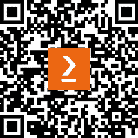

# 前言

在过去十年中，两种自动化趋势已经改变了公司的运营方式。第一种趋势是使用**机器人流程自动化**（**RPA**）技术来自动化后台办公室的计算机任务。第二种趋势，目前正在进行中，旨在自动化以前被认为无法自动化的工作。这是**智能自动化**（**IA**），它将 RPA 与**机器学习**（**ML**）相结合，以自动化工人智能和复杂决策。

IA 这个术语的含义取决于其使用的地方。对一些人来说，IA 意味着将 AI 功能集成到 RPA 产品中，以简化自动化开发，或添加自我修复功能，以帮助数字工作者从错误中恢复。在这本书中，IA 意味着在自动化过程的执行过程中使用 ML 来**替代人类认知工作**。虽然帮助开发者更有效地工作是有价值的，但 IA 应该主要定义为它通过大规模使用 ML 来转型运营和推动商业利益的能力。

目前市面上已经有几本关于 IA 的书。它们大多侧重于推销 IA 的高层次愿景和好处。然而，随着机器学习的惊人发展，大多数公司已经接受了 IA 的想法，并分配预算用于机器学习。这表明我们需要开始从 IA 的**为什么**转向**如何**。

这本书旨在弥合这一差距，向读者展示如何通过使用**Blue Prism**（**BP**），一家在 RPA 和 IA 领域的先驱软件公司，通过实际案例将 IA 付诸实践。许多技术书籍都是通过结合现有资源，如在线文章和课程拼凑而成的。这本书与众不同；它是我在麻省理工学院关于 IA 及其风险管理的研究论文的扩展。我将这项研究与我在 BP 领域的专业知识相结合，编写了一本以实践者为导向的 IA 书籍，其内容据我所知在别处无处可寻。

对于公司来说，IA 不仅仅是一个“锦上添花”的东西。将机器学习预测应用于日常工作的能力可能会成为未来大多数公司生存的条件。那些对 IA 有细微理解，而不是高层次理解的人，将在市场上脱颖而出。这本书将为你提供这种对 IA 的细微理解，并指导你和你所在的公司实现更好的 IA 成果。

# 这本书面向的对象

*这本书是为探索 IA 或希望改进现有 IA 程序的 BP 实践者而写的。无论你是开发者、公民开发者、解决方案设计师还是 COE 团队成员，这本书中都有适合你的内容*。

*专注于实施的读者将学习到设计 BP 解决方案以实现 IA 的不同方法。流程控制器和 IA 项目管理人员也可以阅读这本书，了解机器学习如何增加他们的自动化程序复杂性，以及如何*管理它*。

# 这本书涵盖的内容

*第一章*，*作为服务的机器学习 – 数字交易所和 Web API*，讨论了您如何通过从数字交易所下载的连接器在 BP 过程中实现 ML。

*第二章*，*从命令提示符和 PowerShell 进行预测*，展示了您如何通过命令行调用 ML 预测并捕获 BP 中的输入。

*第三章*，*代码阶段*，展示了如何将 C# ML 程序移植到代码阶段，以便它可以直接从 BP 运行。

*第四章*，*审查预测和人工参与*，解释了为什么人工审查 ML 预测很重要，并实现了两种可以用来启用审查的方案。

*第五章*，*HITL 的 IA 流程和工作队列设计*，探讨了多个不同的 IA 解决方案设计，其中 BP 流程和工作队列的数量各不相同。

*第六章*，*可重用 IA 组件*，展示了在任意 IA 解决方案设计中普遍有用的 BP 设计组件。

*第七章*，*IA 模板和工具 – IA 对象*，将前几章中展示的设计结合成可重用的模板，以加快您的 IA 解决方案和实施。

*第八章*，*LAM、用户角色和 MTE*，讨论了 IA 所需的新用户角色以及他们应该拥有的 BP 权限。

*第九章*，*机器学习部署和数据库操作*，描述了当前的机器学习模型部署方法以及它们如何影响在 BP 中的模型部署和回滚。

*第十章*，*IA 对机器人操作模型的影响*，讨论了 IA 可能对机器人操作模型产生的影响。

*第十一章*，*处理退款*，通过一个场景，重点关注设计 IA 解决方案并使用模板实现其整体结构。

*第十二章*，*电力服务中断*，通过一个场景，说明了 ML 预测审计的重要性。

*第十三章*，*其他智能 Blue Prism 产品*，介绍了四个其他与 IA 相关的 BP 产品以及一些未来的 IA 趋势。

*附录*，*IA 风险管理*，总结了关于 IA 风险的论文研究。

# 为了充分利用这本书

您应该在 BP 大学网站上完成 BP 基础培训课程。理想情况下，读者也应该至少有三个月的 BP 实践经验。

本书重点是 IA，即如何以管理不确定 ML 预测对您的自动化业务流程影响的方式将 RPA 与 ML 连接起来。不需要 ML 经验，并且了解如何构建模型超出了本书的范围。

然而，本书将使用一些基本的 ML 术语。首先，我们有 **回归** 与 **分类**。这两个术语广泛地划分了我们试图进行的 ML 预测类型。对于 **回归** 问题，我们试图预测一个数值，例如，预测销售数字。

对于 **分类** 问题，我们试图对某些事物进行分类。我们试图预测的不同类别被称为 **标签**。例如，我们可能试图将客户支持工单分为不同的类别：*投诉*、*退款*和*销售咨询*。这三个是 **分类** 问题的 **标签**。

**置信度分数**是一个与几乎每个 ML 预测一起返回的数字，它表示服务对该预测的信心程度。此区间将在 0 到 1 之间，或 0 到 100 之间。例如，如果您向 ML 模型发送一张动物的图片，它可能会回复说标签“猫”有 0.96 的 *置信度*，而标签“老虎”有 0.99 的 *置信度*。

本书以示例为主，编写目的是使其能够使用免费工具完成。这包括 BP 和 ML 服务的版本，它们都具有免费每月使用限制。本书需要以下要求。其他每个章节也可能有自己的要求。

| **本书涵盖的软件/硬件** | **操作系统要求** |
| --- | --- |
| Blue Prism Trial 或 Enterprise Edition，版本 6.4 及以上 | Windows |
| SQL Server Management Studio |  |
| Python 3 |  |
| ML.NET / C# |  |
| AWS Comprehend |  |
| Azure Form Recognizer |  |
| Google Cloud Vision |  |

作为所有章节的先决条件，请导入 BP 安装路径下的所有标准 BP `VBO` 子文件夹。默认路径为 `C:\Program Files\Blue Prism Limited\Blue Prism Automate\VBO`。对于大多数章节，将会有需要下载和导入额外 BP 发布文件的动手实践示例，这些文件来自 GitHub。具体说明将在那些章节中提供。

**如果您使用的是本书的数字版，我们建议您亲自输入代码或从本书的 GitHub 仓库（下一节中提供链接）获取代码。这样做将帮助您避免与代码的复制和粘贴相关的任何潜在错误**。

# 下载示例代码文件

您可以从 GitHub 下载本书的示例代码文件，网址为[`github.com/PacktPublishing/Intelligent-Automation-with-Blue-Prism`](https://github.com/PacktPublishing/Intelligent-Automation-with-Blue-Prism)。如果代码有更新，它将在 GitHub 仓库中更新。

我们还有其他来自我们丰富的图书和视频目录的代码包，可在[`github.com/PacktPublishing/`](https://github.com/PacktPublishing/)找到。查看它们吧！

# 使用的约定

本书使用了多种文本约定。

**文本中的代码**：表示文本中的代码单词、数据库表名称、文件夹名称、文件名和文件扩展名。当引用 BP 术语时，它指的是页面名称，如`主页面`，以及数据类型，如`文本`和`数字`。

代码块设置如下：

```py
using System;
using System.IO;
using Microsoft.ML;
```

当我们希望将您的注意力引到代码块的一个特定部分时，相关的行或项目将以粗体显示：

```py
using System;
using System.IO;
using Microsoft.ML;
```

**粗体代码**：当用于 BP 术语时，这指的是数据项和环境变量名称。

任何命令行输入或输出都应如下编写：

```py
> mkdir build
```

**粗体**：表示新术语或重要词汇。当用于 BP 术语时，这指的是动作名称（**实用程序 – 环境::启动进程**）和数据项值。

**斜体**：当用于 BP 术语时，这指的是阶段名称、组名称、块名称、队列名称以及 BP 软件中的其他标题，例如*控制室*。

小贴士或重要注意事项

看起来是这样的。

# 联系我们

我们始终欢迎读者的反馈。

**一般反馈**：如果您对本书的任何方面有疑问，请通过 customercare@packtpub.com 给我们发邮件，并在邮件主题中提及书名。

**勘误**：尽管我们已经尽一切努力确保内容的准确性，但错误仍然可能发生。如果您在这本书中发现了错误，如果您能向我们报告这一点，我们将不胜感激。请访问[www.packtpub.com/support/errata](http://www.packtpub.com/support/errata)并填写表格。

**盗版**：如果您在互联网上以任何形式遇到我们作品的非法副本，如果您能提供位置地址或网站名称，我们将不胜感激。请通过版权@packtpub.com 与我们联系，并提供材料的链接。

**如果您有兴趣成为作者**：如果您在某个主题上具有专业知识，并且您有兴趣撰写或为书籍做出贡献，请访问[authors.packtpub.com](http://authors.packtpub.com)。

# 分享您的想法

一旦您阅读了《使用 Blue Prism 的智能自动化》，我们很乐意听到您的想法！请[点击此处直接进入此书的亚马逊评论页面](https://packt.link/r/1803249692)并分享您的反馈。

您的评论对我们和科技社区都很重要，并将帮助我们确保我们提供高质量的内容。

# 下载此书的免费 PDF 副本

感谢您购买此书！

您喜欢在路上阅读，但无法携带您的印刷书籍到处走？您的电子书购买是否与您选择的设备不兼容？

别担心，现在每购买一本 Packt 图书，你都可以免费获得该书的 DRM 免费 PDF 版本。

在任何地方、任何设备上阅读。直接从您最喜欢的技术书籍中搜索、复制和粘贴代码到您的应用程序中。

好处不止于此，您还可以获得独家折扣、时事通讯和每日免费内容的专属访问权限。

按照以下简单步骤获取好处：

1.  扫描二维码或访问以下链接



[`packt.link/free-ebook/978-1-80324-969-8`](https://packt.link/free-ebook/978-1-80324-969-8)

1.  提交您的购买证明

1.  就这样！我们将直接将免费 PDF 和其他好处发送到您的电子邮件。

# 第一部分：连接 Blue Prism 到 ML 模型

*第一部分* **讨论了**三种将 BP 与 ML 模型接口连接的不同方法，以便 ML 预测可以在自动化过程中使用。第一章 讨论了如何使用 BP 数字交易所的预构建资产连接到基于云的 ML-as-a-service 服务。这是开始使用 ML 的最快方式，因为模型已经准备好使用。我们还将概述目前可用的 ML 服务以及它们可以潜在满足的 IA 用例。

*第二章* 展示了如何通过触发 ML 程序在 Windows 命令提示符或 PowerShell 中运行来将 BP 连接到 ML。我们将介绍哪些 BP VBOs 可以用来调用这些程序，以及如何在 BP 中捕获结果的不同方式。

最后，*第三章* 展示了如何在对象代码阶段直接运行 C#或 VB.NET 代码来将 BP 连接到 ML。在这里，我们将讨论如何将现有 ML 程序源代码移植，以便它可以直接从对象中运行。本章中使用的 ML 程序是由 Microsoft 的 ML 框架 ML.NET 构建的。

本部分包含以下章节：

+   *第一章*，*作为服务的机器学习 – 数字交易所和 Web API*

+   *第二章*，*从命令提示符和 PowerShell 进行预测*

+   *第三章*，*代码阶段*
