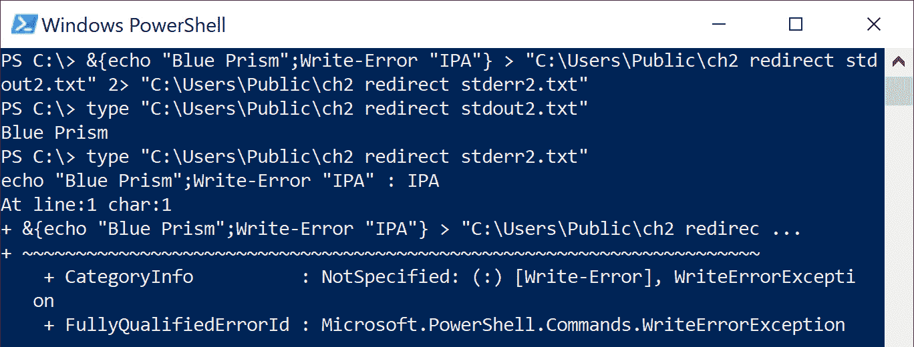
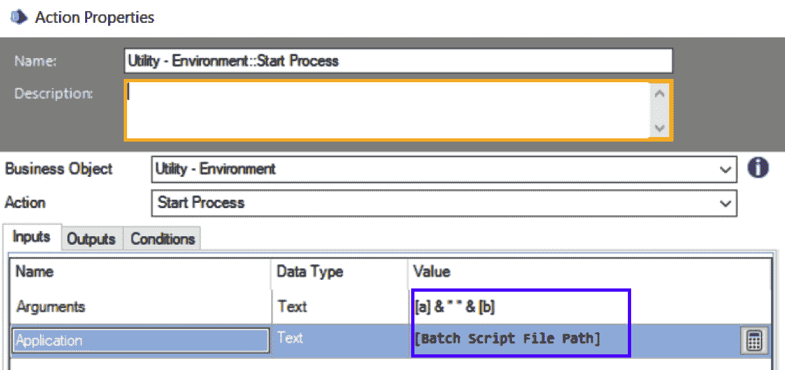
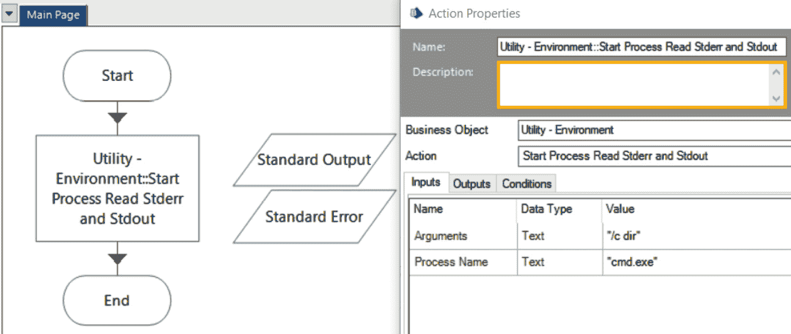
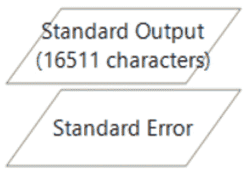
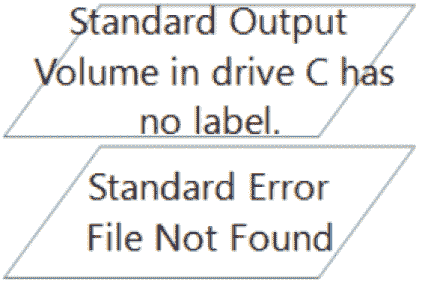
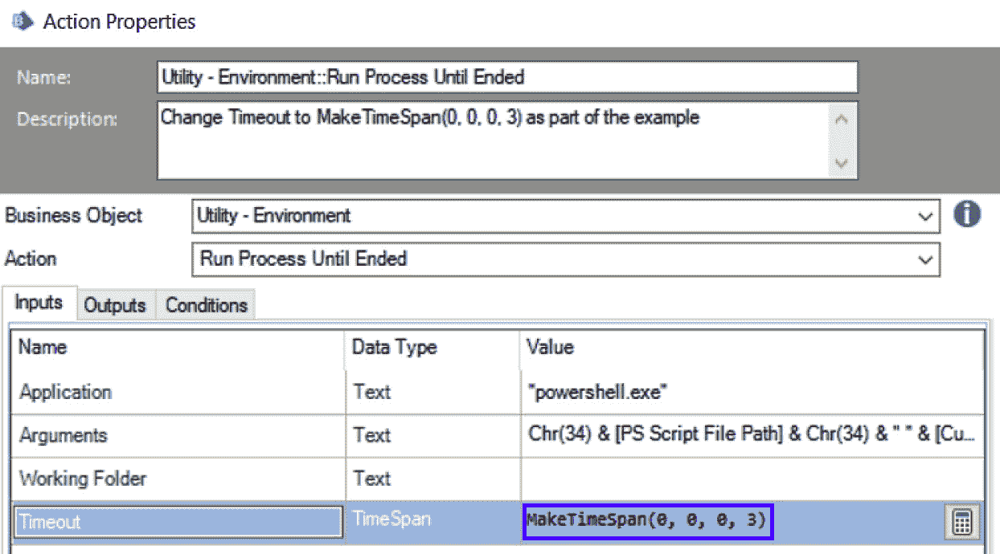
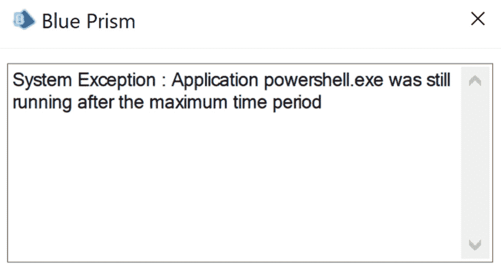
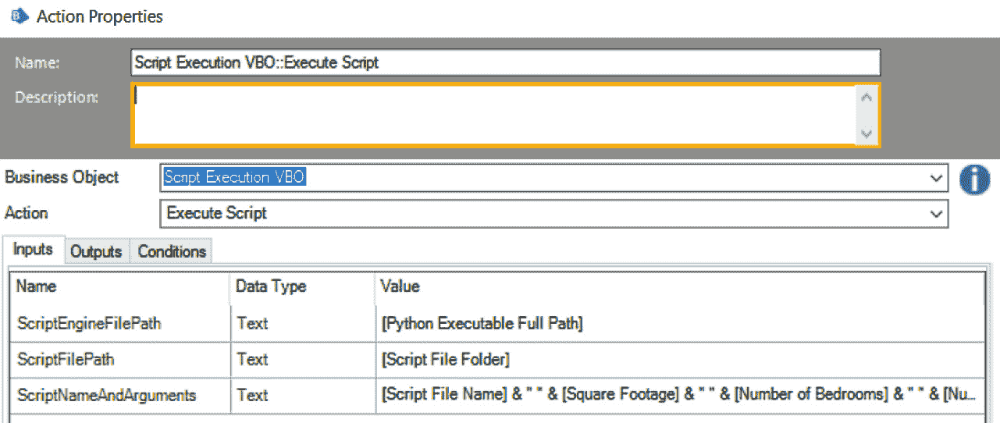
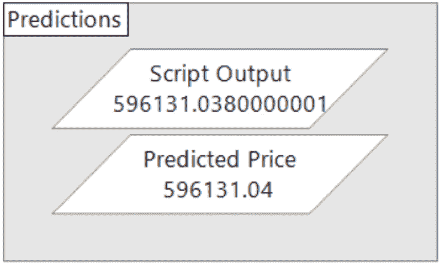

# 第二章：从命令提示符和 PowerShell 进行预测

Web API 是与机器学习服务通信的最常见方式。然而，有许多原因可能无法使用*外部* Web API。例如，合规性和监管要求可能阻止你将数据发送到公司外部，或者可能没有适合你用例的机器学习服务。即使是*内部*开发的机器学习模型，也有不使用 Web API 作为通信方式的原因。一个例子是直接在 Digital Worker API 上运行模型，因为这不需要额外的 Web 服务器基础设施。

本章向您展示了如何通过**BP**以不同的方式在本地运行机器学习模型。我们将通过使用**Windows 命令提示符**（**WCP**）和**PowerShell**（**PS**）的示例来展示如何做到这一点。

在我对**IA**的研究过程中，我试图发现正在使用的底层技术、库和机器学习算法。*Python*是唯一在生产环境中使用的编程语言（除了在**RPA**中使用的内置 C#和 VB.NET），尽管 R 和 Julia 是学校中用来教授机器学习的流行语言。在本章的最终示例中，我们将在 BP 中调用一个 Python 脚本。

在本章中，我们将涵盖以下主要主题：

+   命令行基础

+   使用**Object Utility -** **Environment**从命令行进行预测

+   将预测结果返回到 BP

+   长时间预测超时

+   **DX VBOs** – **Utility PowerShell**和**Script** **Execution VBO**

# 技术要求

在我们开始之前，请确保满足以下要求：

+   从 DX 下载并导入**Utility - Powershell**资产：[`digitalexchange.blueprism.com/dx/entry/9648/solution/utility---powershell`](https://digitalexchange.blueprism.com/dx/entry/9648/solution/utility---powershell)

+   从 DX 下载并导入**Script Execution VBO**资产：[`digitalexchange.blueprism.com/dx/entry/3439/solution/blue-prism---script-execution-vbo-2`](https://digitalexchange.blueprism.com/dx/entry/3439/solution/blue-prism---script-execution-vbo-2)

+   安装 Python 3+：[`www.python.org/downloads`](https://www.python.org/downloads)

+   从 GitHub 下载并导入本章的示例，这些示例包含在一个单独的版本中：[`github.com/PacktPublishing/Intelligent-Automation-with-Blue-Prism/tree/main/ch2`](https://github.com/PacktPublishing/Intelligent-Automation-with-Blue-Prism/tree/main/ch2)

# 命令行基础

当在 Digital Worker 机器上进行预测时，你需要调用命令行，除非你能够通过*Code Stage*（下一章的主题）或通过图形界面以编程方式与之交互。BP 能够通过 WCP 和 PS 启动独立程序或脚本。

可以通过运行*命令提示符*应用程序或从 Windows**开始**菜单中的`cmd.exe`来启动 WCP。它可以以当前登录到 Windows 的用户身份启动，也可以以管理员用户身份启动，通过右键单击命令提示符并选择**以管理员身份运行**。

可以通过运行 PS 应用程序或从 Windows 的`pwsh.exe`来启动 PS，或`powershell.exe`/`pwsh.exe`。`pwsh.exe`是 PS Core 的可执行文件，它是 PS 的新版本，是一个跨平台版本（v6 及以上），必须手动安装，因为它默认情况下并未安装在 Windows 上。`powershell.exe`是旧版本（v5.1 及以下），它是预安装在 Windows 上的。

对于 IA 目的，没有强有力的论据来选择 WCP 而不是 PS，或者反过来。WCP 总体上更简单，功能更少，而 PS 更复杂，功能更全面。然而，这些细节是命令行脚本内部的，这些脚本可能会由 ML 解决方案的开发者提供。BP 可以主要将这些脚本视为黑盒。

当本地预测时，你可能会需要通过一个独立的可执行文件、批处理脚本、PS 脚本或直接运行源代码（通常是 Python）来部署 ML 模型。

接下来，让我们看看三个对于将命令行程序连接到 BP 非常重要的概念。这些是**输出流**、**输出重定向**和**阻塞执行**。

## 输出流

从 WCP 和 PS 中执行的程序可以将文本输出到两个不同的流。第一个流被称为`STDERR`，它被使用取决于脚本的作者。有时，开发者会决定将错误消息打印到`STDOUT`而不是使用`STDERR`。

重要提示

PS 有更多的输出流可用，例如警告和调试消息，但 STDOUT 和 STDERR 是最常用的。

例如，让我们打开`cmd.exe`并输入以下内容（不包含`>`字符）：

```py
> echo "Hello Blue Prism"
```

我们将通过 STDOUT 在屏幕上看到`"Hello Blue Prism"`被打印出来：


图 2.1 – 命令行窗口中显示的输出是 STDOUT

让我们尝试一个我们知道会生成错误的命令。让我们打印一个不存在文件的目录内容：

```py
> type "C:\Users\Public\non existent file.txt"
```

这会显示“系统找不到指定的文件。”错误消息：


图 2.2 – 这条消息是 STDOUT 还是 STDERR？

显示文本的目的是为了展示一个错误，但它是否被写入到 STDOUT 流或 STDERR 流？仅凭窗口中显示的打印文字，我们无法判断，但我们可以通过将 STDOUT 和 STDERR 重定向到文件来找出这一点。

## 输出重定向

STDOUT 和 STDERR 都可以相互重定向，并且可以将它们写入文件。*这是将命令行输出捕获到 BP 的主要方法之一*。这部分是通过使用重定向，即 WCP 和 PS 中的“大于”字符（`>`）来实现的。在 BP 中，你最常见的使用方式是将 STDOUT 重定向到文件，以便可以使用**文件管理**VBO 来读取。 

重要提示

`>`字符用于重定向并覆盖任何之前的内容，而`>>`重定向则用于追加内容。由于追加内容需要更多的开发逻辑来区分之前和当前的内容，因此我们更频繁地使用`>`来将 STDOUT 和 STDERR 重定向到 BP。

让我们将之前命令中的一个 STDOUT 重定向到文件，并在`cmd.exe`中打印该文件的目录内容：

```py
> echo "Hello Blue Prism" > "C:\Users\Public\ch 2 echo.txt"
> type "C:\Users\Public\ch 2 echo.txt"
```

第一个命令不再将`"Hello Blue Prism"`打印到控制台窗口。输出被重定向到了一个文件。只有在第二个命令执行后，文本才会被打印出来，而这个命令没有进行任何重定向：


图 2.3 – 将 STDOUT 重定向到文件

让我们再次尝试打印不存在文件的目录内容，但这次我们将 STDOUT 重定向到文件。然后，我们将打印重定向文件的输出：

```py
> type "C:\Users\Public\non existent file.txt" > "C:\Users\Public\ch 2 redirect.txt"
> type "C:\Users\Public\ch 2 redirect.txt"
```

你会看到错误文本被打印到屏幕上，这与我们之前的例子不同。为什么没有重定向？这是因为“系统找不到指定的文件。”消息不是来自 STDOUT，所以重定向 STDOUT 没有效果：


图 2.4 – 重定向 STDOUT 未捕获消息

由于消息不是 STDOUT，我们可以合理地猜测它是 STDERR。STDERR 可以使用`2>`而不是`>`（这是用于 STDOUT 的）进行重定向。让我们尝试重定向 STDERR：

```py
> type "C:\Users\Public\non existent file.txt" 2> "C:\Users\Public\ch 2 redirect stderr.txt"
> type "C:\Users\Public\ch 2 redirect stderr.txt"
```

我们现在看到第一个命令没有在屏幕上打印任何内容，而第二个命令则打印了内容。这证实了“系统找不到指定的文件。”消息被写入 STDERR 而不是 STDOUT：


图 2.5 – 重定向 STDERR 捕获消息

到目前为止，我们只看到了重定向 STDOUT 或 STDERR 流中的一个示例，但没有同时重定向两个流。有两种方法可以同时重定向两个流。第一种选择是将 STDOUT 和 STDERR 合并到一个流中，并将该单个流重定向到*单个文件*。第二种选择是将两个流重定向到*单独的文件*。

让我们看看如何使用 PS 而不是 WCP 来完成这两件事。幸运的是，我们之前看到的所有重定向命令在 WCP 和 PS 之间都是可互换的。使用 PS 还有一个小的优点，就是将 STDERR 消息的字体改为红色，以便立即识别。打开`powershell.exe`并输入以下命令：

```py
> &{echo "Blue Prism";Write-Error "IA"}
```

这实际上是两个由分号分隔的命令。第一个`echo`命令写入 STDOUT，而第二个`Write-Error`命令写入 STDERR。周围的`&{…}`字符表示在 PS 中将其作为单个脚本块执行。

运行此命令会产生以下输出。我们在 PS 控制台屏幕上看到 STDOUT 消息`Blue Prism`和 STDERR 消息（红色）：


图 2.6 – 红色文本是 STDERR，而正常颜色的文本是 STDOUT

接下来，让我们将 STDERR 合并到 STDOUT 流中，将其重定向到**单个文件**，并打印该文件的内容：

```py
> &{echo "Blue Prism";Write-Error "IA"} > "C:\Users\Public\ch2 redirect both.txt" 2>&1
> type "C:\Users\Public\ch2 redirect both.txt"
```

在第一个`>`实例之后，我们指定 STDOUT 应该重定向到的文件路径。`2>&1`表示我们想要将 STDERR 重定向到 STDOUT 流。在打印文件时，我们可以看到 STDOUT 和 STDERR 消息都存在：


图 2.7 – 将 STDOUT 和 STDERR 重定向到单个文件

接下来，让我们将标准错误输出（STDERR）和标准输出（STDOUT）重定向到**单独的文件**。

```py
> &{echo "Blue Prism";Write-Error "IA"} > "C:\Users\Public\ch2 redirect stdout2.txt" 2> "C:\Users\Public\ch2 redirect stderr2.txt"
> type "C:\Users\Public\ch2 redirect stdout2.txt"
> type "C:\Users\Public\ch2 redirect stderr2.txt"
```

再次，`>`让我们指定我们想要 STDOUT 重定向到的路径。在`2>`之后是我们想要 STDERR 重定向到的位置。当文件被打印出来时，只会显示它们对应流的内容：



图 2.8 – 将 STDOUT 和 STDERR 重定向到不同的文件

在选择将流合并并重定向到单个文件与将 STDOUT 和 STDERR 重定向到单独文件之间，后者**更合理**。这允许我们将错误消息与非错误消息隔离开来。这也是我们为什么更喜欢覆盖之前的输出（`>`）而不是追加（`>>`）的原因。追加需要我们添加更多逻辑，以将最新运行的命令的输出与之前的输出分开。

我们现在已经介绍了将命令行输出重定向到文件的不同方法。这使得我们能够轻松地将基于命令行的机器学习（ML）程序的输出接收进 BP。接下来，让我们看看本节**命令行基础**的最后一个主题，即阻塞与非阻塞执行。

## 阻塞与非阻塞执行

当 BP 启动一个命令行程序时，BP 中的执行可以是**阻塞**或**非阻塞**。如果执行被阻塞，BP 将在程序退出之前等待，然后继续到下一个阶段：


图 2.9 – BP 等待阻塞程序完成

如果脚本不阻塞，它将在 BP 进展的同时在后台继续运行。除非脚本可以显式等待并检查外部条件，例如磁盘上写入的文件的存在，否则 BP 将不知道脚本何时实际完成：


图 2.10 – BP 在非阻塞程序执行时继续运行

作为 BP 开发者，决定你希望触发的程序以阻塞或非阻塞方式运行至关重要。在几乎所有情况下，我们更喜欢 BP 等待脚本完成，即使非阻塞脚本正在运行。这使得过程开发和调试变得更加简单。本章后面将讨论实现这一点的不同方法。

*阻塞与非阻塞* 的概念类似于我们在讨论 Web API 时提到的 *同步与异步*。Web API 调用有一个内置的超时概念。如果一个 API 请求在 BP 中运行时间过长，它最终会被终止，并抛出一个异常。同样，我们还需要考虑如果从命令行触发的程序运行时间过长，我们应该如何**超时**。我们将在本章后面看到如何实现这个功能的示例。

在本节中，我们探讨了与 BP 相关的命令行基础知识。首先是输出流的概念。STDOUT 用于向控制台屏幕显示常规输出，而 STDERR 用于显示错误消息。接下来，我们讨论了如何使用 `>` 重定向运算符在 WCP 和 PS 中将这两个流重定向到文件中。重定向使我们能够在 BP 中捕获命令行程序输出。

然后，我们探讨了阻塞与非阻塞脚本之间的区别，并指出我们更喜欢暂停 BP 执行直到脚本完成，这是出于可预测性的原因。最后，我们介绍了超时的概念，以停止命令行进程运行时间过长。

在下一节中，我们将通过示例回答以下问题：

1.  我应该使用哪个 VBO 和操作来触发预测？

1.  我如何将预测结果返回到 BP？

1.  我如何停止运行时间过长的脚本？

# 使用 Utility – Environment 从命令行进行预测

在 BP 安装子文件夹中的 VBO 子文件夹中找到的 **Utility - Environment** VBO 有三个可以用来启动命令行脚本和外部程序的操作：**启动进程**、**启动进程读取 Stderr 和 Stdout** 和 **运行进程** **直到结束**。

无论你使用哪个操作，你都必须在 BP 中至少填写两个不同的输入参数。一个输入参数指定你想要运行的 *程序*，另一个输入参数指定 *该程序的附加参数*。

让我们看看使用 **Start Process** 和 **Run Process Until** **Ended** 操作运行简单批处理脚本的两种不同方法。

## 示例 1 – 使用 Start Process 运行程序

让我们运行一个从 BP 接收两个参数作为参数的批处理文件。为了简化示例设置，批处理文件内容在流程开始时保存在磁盘上。这个批处理文件本身负责将两个输入参数写入输出文件，`C:\Users\Public\ch2_ex1_output.txt`，这样我们就不需要进行任何重定向。流程结束时，我们删除创建的批处理文件。按照以下步骤操作：

1.  在流程工作室中打开`Ch2`组。

1.  在橙色块中打开**Utility Environment::Start Process**操作。注意我们提供批处理文件的路径作为**应用程序**输入参数，以及两个通过空格分隔的数据项作为**参数**值：



图 2.11 – 将脚本路径作为应用程序，并将两个参数通过空格分隔作为参数

1.  通过按下**Go**按钮或*F5*来运行示例一次。

1.  通过验证输出文本文件的内容，`C:\Users\Public\ch2_ex1_output.txt`来验证批处理脚本是否正确运行。它应包含文本`1234`和`5`：


图 2.12 – 预期的输出文件

我们已经完成了运行批处理文件并检索其输出的最基本示例。由于批处理文件本身将数据写入文件，我们不需要自己进行任何重定向。注意，我们的流程图中有一个**睡眠 1 秒**操作。这是必需的，因为**Utility -** **Environment**

**::Start Process**操作是*非阻塞*的。如果没有睡眠操作，批处理文件可能在完成执行之前就被删除了！

## 示例 2 - 使用运行进程直到结束运行程序

现在，让我们修改之前的示例，以去除可能不可靠的 1 秒睡眠，并使脚本*阻塞*。这次，我们的输出文件将保存在`C:\Users\Public\ch2_ex2_output.txt`：

1.  在流程工作室中打开**示例 2 – 使用运行进程直到结束运行程序** BP 流程。

1.  在橙色块中打开**Utility - Environment::Run Process Until Ended**操作。注意**参数**和**应用程序**输入与*示例 1*相同。不同之处在于操作已从**Start Process**更改为**Run Process Until Ended**。此外，请注意**超时**输入为空。当为空时，默认为 10 秒：


图 2.13 – 此操作配置与示例 1 相同

1.  验证流程图中已移除睡眠阶段。

1.  通过按下**Go**按钮或 F5 来运行示例一次。

1.  验证脚本是否正确运行，请打开 Windows 文件资源管理器，查看 `C:\Users\Public\ch2_ex2_output.txt` 文件是否包含文本 `abcd` 和 `e`。

我们将动作从 *示例 1* 中的 **启动进程** 更改为 *示例 2* 中的 **运行进程直到结束**。在 *示例 1* 中使用 **启动进程**，BP 以非阻塞方式执行进程步骤和批处理脚本。在 *示例 2* 中使用 **运行进程直到结束**，BP 等待最多 10 秒脚本完成，然后继续执行进程步骤。尽管大多数时候更喜欢阻塞执行，但可能存在需要非阻塞执行的情况。

在 **实用工具 - 环境** 中还有一个我们尚未看到示例的动作：**启动进程读取 Stderr 和 Stdout**。正如其名称所暗示的，此动作允许我们直接捕获两个输出流，STDOUT 和 STDERR，作为 BP 中的数据项。接下来，我们将讨论从命令行脚本捕获输出到 BP 的不同方法。

# 将预测结果返回到 BP

从命令行启动的 ML 程序可能会以两种方式提供输出：要么是将预测输出打印到屏幕上，要么是将结果写入文件。当然，还有其他选项，例如将结果发送到单独的系统供您检索，但这些选项超出了本章的范围。*表 2.1* 列出了获取 ML 预测输出的最常见方式，以及您可以使用哪些对象/操作将其读取回 BP：

| **预测输出方法** | **输入方法到 BP** | **使用对象** | **操作** |
| --- | --- | --- | --- |
| 写入屏幕 | 使用直接读取屏幕输出的 VBO 动作 | **实用工具 –** **环境** | **启动进程读取 Stderr** **和 Stdout** |
| **实用工具 –** **PowerShell** | **运行脚本** |
| **脚本执行 VBO** | **执行脚本** |
| 写入屏幕 | 重定向到文件并读取文件 | **实用工具 - 环境** | **启动进程** |
| **实用工具 - 环境** | **运行进程直到结束** |
| 写入文件 | 读取文件 | **实用工具 –** **环境** | **启动进程** |
| **实用工具 - 环境** | **运行进程直到结束** |

表 2.1 – 将预测输出读取回 BP 的不同方式

如果预测结果打印到控制台屏幕，有两种方法可以将结果返回到 BP。第一种，也是最简单的方法是**使用 VBO 操作直接捕获输出**作为 BP 中的数据项。第二种方法是将打印的输出重定向到一个文件，然后读取该文件到 BP 中。让我们看看第一种情况的一个例子。

## 示例 3 – 将 STDOUT 和 STDERR 保存为数据项

在这个例子中，我们将从头开始构建一个进程，该进程使用来自**实用工具 - 环境** VBO 的**启动进程读取标准错误和标准输出**动作。此动作允许我们直接将标准错误和标准输出保存为数据项。本章节的发布中提供了此示例的完整版本供您参考。

此示例还展示了从 BP 运行命令提示符的**内部命令**所需的特殊语法，以防您将来需要这样做。请按照以下步骤操作：

1.  在**Ch2**组中创建一个名为**示例 3**的新进程。在 Process Studio 中打开它。

1.  在图中添加一个**动作**阶段。选择**实用工具 - 环境**作为**业务对象**，并将**启动进程读取标准错误和标准输出**作为**动作**。

1.  设置`"cmd.exe"`（包括双引号）和`"/c dir"`。`dir`命令列出了 BP 安装文件夹内的所有文件和目录。BP 安装文件夹是我们从 Process Studio 内部启动`cmd.exe`命令提示符的位置。`/c`表示在`dir`命令执行完毕后终止`cmd.exe`。

重要提示

为了从 WCP 使用`dir`、`echo`、`copy`等内部命令，我们需要将`cmd.exe`作为**进程名称**，而我们要在 WCP 中运行的命令作为**参数**。

1.  点击动作的`标准输出`和`标准错误`数据项。

1.  在开始和结束阶段之间链接动作。完成的进程应如下所示：



图 2.14 – 示例 3 的完成测试进程

1.  从 Process Studio 运行进程。`标准输出`数据项将包含内容，而`标准错误`数据项将保持为空。这是因为`dir`命令成功执行且无错误：



图 2.15 – 标准输出已填充

1.  修改动作的`"/c dir *.xyz"`。此更改意味着我们想要列出所有具有`.xyz`文件扩展名的文件，这些文件不应存在于 BP 安装文件夹中。

1.  再次运行测试进程。`标准输出`和`标准错误`数据项都应填充，因为有错误：



图 2.16 – 标准输出和标准错误都已填充

注意，在运行**示例 3**时，实际的控制台窗口没有弹出，但我们能够捕获打印到控制台屏幕上的数据。假设 ML 预测将输出打印到屏幕上，捕获这些数据的第二种方法是重定向 STDOUT 和 STDERR 流到 BP 可以读取的文件。让我们看看在下一个示例中如何做到这一点。

## 示例 4 – 将内部命令（dir）重定向到文件

我们已经在*示例 2*中使用了**实用工具 - 环境** VBO 中的**运行进程直到结束**操作。这个操作不允许我们直接将 STDOUT 和 STDERR 捕获为数据项；然而，*示例 2*中的批处理脚本本身创建了一个可以读入 BP 的文件。

在本例中，我们将再次使用此对象和操作创建一个新的进程，除了批处理脚本将输出打印到 STDOUT 和 STDERR。我们需要将 STDOUT 和 STDERR 流重定向到文件，以便它们可以被读入 BP。本章节的发布中提供了此示例的完整版本，供您参考。请按照以下步骤操作：

1.  在*Ch2*组中创建一个名为**示例 4**的新进程。在流程工作室中打开它。

1.  创建两个具有`Text`数据类型的数据项。这些是我们重定向输出将保存的文件路径。按照以下设置：

| **数据项名称** | **初始值** |
| --- | --- |
| `Stdout File` | `C:\Users\Public\ch2_ex4_stdout.txt` |
| `Stderr File` | `C:\Users\Public\ch4_ex4_stderr.txt` |

表 2.2 – 配置两个数据项以保存我们的文件路径

1.  将一个**操作**阶段添加到图中。选择**实用工具 - 环境**作为**业务对象**，并选择`"cmd.exe"`（包括双引号）和`"/c dir *.xyz > " & Chr(34) & [Stdout File] & Chr(34) & " 2>" & Chr(34) & [Stderr File] & Chr(34)`。

    `"/c dir *.xyz"`尝试列出不存在的文件。下一部分`> " & Chr(34) & [Stdout File] & Chr(34)`将 STDOUT 重定向到我们定义的文件。正如你所知，`>`字符表示重定向。`Chr(34)`实例用于在文件路径周围放置双引号，以防有空格。最后一部分`" 2>" & Chr(34) & [Stderr File] & Chr(34)`将 STDERR 重定向到不同的文件。

1.  将操作阶段之间的动作链接起来。完成的流程应如下所示：


图 2.17 – 示例 4 的完成测试流程

1.  在流程工作室中运行进程。

1.  检查`C:\Users\Public`文件夹，并验证是否已从重定向创建了两个输出文件。

在本例中，我们将 WCP 内部命令`dir`的 STDOUT 和 STDERR 流重定向到两个单独的文件。由于该命令是内部的，我们必须将`"cmd.exe"`作为**应用程序**输入。为了执行重定向，我们只需在**参数**输入的末尾添加必要的重定向语法。要将实际输出放入 BP 中，我们需要读取创建的文件。

到目前为止，我们已经涵盖了**实用工具 - 环境**中允许我们从命令行启动外部程序的三个操作。我们看到了它们在阻塞和捕获输出方面的不同。以下表格对此进行了总结：

| **操作** | **是否阻塞？** | **输出保存方法** | **是否有超时功能？** |
| --- | --- | --- | --- |
| **启动进程** | 否 | 无。必须使用重定向并在 BP 中读取文件。 | 否 |
| **运行进程直到** **结束** | 是 | 无。必须使用重定向并在 BP 中读取文件。 | 是 |
| **启动进程读取 Stderr** **和 Stdout** | 是 | 输出以数据项的形式保存。 | 否 |

表 2.3 – 使用三个动作启动命令行程序的总结

表格的最后一列，*是否存在超时功能？*是下一节的主题。这指的是是否存在内置方法来停止外部程序运行时间过长。

# 超时长时间运行的预测

如果命令行脚本遇到问题，它可能会挂起并永久阻止 BP 流程。只有一个动作具有内置功能来超时运行时间过长的脚本：**运行进程** **直到结束**。

重要提示

可以通过将其他脚本包装在脚本中并使用`start`、`timeout`和`taskkill`命令来向任何命令行脚本或程序添加超时功能。然而，与仅使用**运行进程直到结束**加上重定向相比，这些方法更为复杂。

## 示例 5 – PS 脚本超时

让我们看看一个更现实的机器学习例子。在这里，我们有一个 PS 脚本，它调用一个算法来预测客户是否会取消零售店的会员计划。输入从 BP 传递到 PS 脚本，然后到模拟的 ML 程序。模拟的 ML 程序为两个标签返回置信度分数：`流失`和`不流失`。

在这个例子中，我们有一个包含八个客户的集合，以及一些定义性的特征，例如年龄、职业类别、自上次交易以来的天数以及平均购买金额（美元）。我们的流程将遍历所有客户，调用 PS 脚本，并读取预测的*流失*标签的置信度分数。

本例的目标是检查并运行此 PS 脚本，并查看如果它运行时间过长我们如何超时。

1.  在*Ch2*组中打开**示例 5 – PowerShell 脚本超时** BP 流程。我们将一起查看重要细节。

1.  打开`powershell.exe`。尝试将 PS 脚本路径放入**应用程序**输入实际上不会执行脚本，而是使用默认应用程序打开文件，这通常是记事本。**参数**输入应该对你来说很熟悉，因为它包含 PS 脚本参数和重定向文件路径。此外，请注意**超时**输入为空，这意味着脚本最多可以运行 10 秒。

1.  通过按**播放以运行**来运行示例一次。你会看到当脚本运行时 PS 窗口会弹出，之后会关闭。

1.  打开`预测`集合，查看它包含八个客户的置信度分数：


图 2.18 – 成功预测的置信度分数

1.  将`MakeTimeSpan(0, 0, 0, 3)`打开到**Timeout**输入。现在我们允许脚本运行的最大时间是 3 秒：



图 2.19 – 将 MakeTimeSpan(0, 0, 0, 3)添加到 Timeout 输入

1.  重置，然后再次运行示例。当 PS 窗口打开时，您应该在屏幕上看到异常显示，确认超时正在工作：



图 2.20 – PS 脚本已超时

**运行进程直到结束**是唯一一个具有阻塞和超时功能的操作。虽然它没有自动将 STDOUT 和 STDERR 读取到数据项中的能力，但我们可以通过重定向来解决这个问题。因此，**运行进程直到结束**是用于 IA 的**首选操作**，假设您不想自定义构建新的操作或使用第三方 VBO。

用于触发命令行进程的其他两个操作更为特定。如果启动的命令行程序具有内置的超时方法或它创建的任何底层进程，可以使用**启动进程读取 Stderr 和 Stdout**操作。

您可能还会遇到没有良好估计的适当超时值的情况。例如，如果您在批量预测，其中一些批次可能需要几秒钟，而其他批次可能需要几小时，那么使用非阻塞的**启动进程**操作并检查预测是否完成通过其他方法是有意义的。

重要提示

部署的机器学习模型并非**一次性构建，永久运行**。与所有软件一样，它们应该被更新和重新部署；例如，用更多的训练数据更新模型，以不同的方式调整模型参数，应用对所使用的库的安全修复，等等。由于机器学习模型可以独立于 BP 解决方案而改变，因此超时值也应该在进程或对象图中进行更改。我建议在真实解决方案中将超时值存储为*环境变量*。

现在我们已经介绍了内置的**实用工具 - 环境** VBO 的三个操作，让我们看看其他两个可以用来启动命令行程序的 VBO。它们都可以在 DX 上下载。

# DX VBOs – 实用工具 - PowerShell 和脚本执行 VBO

在 DX 上有两个显著的资产可用于调用命令行程序。它们提供了简化接口以触发程序，以及其他一些您可能希望选择它们的附加功能，例如，与**实用工具 - 环境**相比。

## 实用工具 – PowerShell

这个第一个 VBO 专门用于 PS，并包含两个动作，**运行脚本** 和 **使用 PowerShell Core 运行脚本**。PS Core 是 PS 的最新版本；然而，它并不完全与旧版本的 PS 兼容。旧版本的 PS 脚本可能在 PS Core 下无法正确运行。PS Core 也不是大多数 Windows 版本默认安装的。为了避免兼容性问题，我们将在下一个示例中使用 **运行脚本** 动作。

### 示例 6 – 通用 – PowerShell 运行脚本

让我们回顾一下 *示例 5*，在那里我们触发了一个 PS 脚本，它为我们提供了用户流失的预测。这次，我们将使用 DX VBO：

1.  在 *Ch2* 组中打开 **示例 6 – 通用 PowerShell 运行脚本** BP 流程。此示例已经为您构建好了，但我们将一起查看重要细节。

1.  打开 `parameter_name=parameter_value`。多个参数应以逗号分隔。请注意，此动作直接将输出流保存为数据项，因此不需要重定向。

1.  在 Process Studio 中运行此示例一次。与在 *示例 5* 中运行 PS 脚本不同，你不会注意到任何 PS 窗口弹出！

1.  验证 `Predictions` 集合是否包含八个客户的 *churn* 和 *no churn* 的置信度分数。这些分数应与 *图 2**.18* 中的相同。

使用此 DX VBO 的 **运行脚本** 动作，你将获得不需要输出重定向且不会在 **Utility - 环境** 中的动作上看到弹出窗口的好处，这可能对您的用例很重要。然而，也没有内置的超时功能（尽管在 **使用 PowerShell Core 运行脚本** 中有）。如果您有能力安装 PS Core，我建议您这样做，这样您就可以使用具有超时功能的动作。

## 脚本执行 VBO

DX 上可用的第二个资源是 **脚本执行 VBO**。本版本包含两个对象。第一个，**脚本执行 VBO**，是用 C# 实现的，第二个，**脚本执行 VBO Visual Basic**，是用 VB 实现的。这两个对象在功能上没有区别，所以我们将使用 C# 版本在我们的下一个示例中。每个 VBO 只包含一个动作，**执行脚本**。

你可能想要使用此 VBO 的一个表面原因是你的 BP 动作输入将看起来更整洁。正如你所注意到的，添加重定向和完整文件路径，用双引号 `Chr(34)` 包围等，可以使动作的输入参数变得混乱且难以理解。此 VBO 通过为脚本引擎、脚本路径和脚本名称提供单独的输入参数来在一定程度上减少这种混乱。更实际的原因是，它使用期望的默认值启动外部程序，例如阻塞、不弹出命令窗口并将输出捕获到数据项中。然而，它缺少超时功能。

## 示例 7 – 调用一个 Python 程序

让我们称一个基于面积、卧室数量、浴室数量、先前售价和年龄（年）预测房屋售价的 Python 脚本。由于这是一个*回归*问题，Python 脚本返回一个数值预测，而不是标签和置信度分数。按照以下步骤操作：

1.  在*Ch2*组中打开**示例 7 – 脚本执行 VBO 调用 Python 脚本** BP 过程。这个示例已经为您构建好了，但我们将一起查看重要细节。

1.  打开命令行，`cmd.exe`，并找到您的 Python 可执行文件位置。这可能被命名为`py.exe`或`python.exe`。在 WCP 中，输入以下内容（或者如果您找不到结果，将`py.exe`替换为`python.exe`）：

    ```py
    Python Executable Full Path Data Item in the red block:
    ```


图 2.21 – 使 Python 可执行完整路径数据项与您的 Python 位置匹配

1.  在橙色块中打开**Script Execution VBO::Execute Script** Action，注意它看起来相对更干净，因为输入被分离，并且不需要重定向：



图 2.22 – 输入参数被很好地分隔

1.  在 Process Studio 中运行一次 Process。注意，Action *blocks* 并且不会弹出任何窗口。

1.  验证从 Python 预测的值是否已保存为数据项：



图 2.23 – 预测的房产价格

我们现在已经在本章中介绍了如何启动命令行程序的七个示例。每个示例都旨在展示以下方面的不同：

+   运行的脚本类型

+   哪个 VBO 和 Action 被使用

+   如何将输出读回到 BP 中

+   Action 是否阻止或不阻止

+   Action 是否允许超时

下一个表格总结了所有示例：

| **示例** | **脚本类型** | **调用** **脚本 VBO/Action** | **读取** **输出方法** | **阻塞？** | **超时？** |
| --- | --- | --- | --- | --- | --- |
| 1 | `.``bat` | **实用工具 - 环境**/ **启动过程** | 脚本将输出写入文件 | N | N |
| 2 | `.``bat` | **实用工具 - 环境**/ **运行过程直到结束** | 脚本将输出写入文件 | Y | N (尽管留空参数意味着 10 秒) |
| 3 | 内部命令（`dir`） | **实用工具 - 环境**/**启动过程读取标准错误** **和标准输出** | VBO Action 将输出保存为数据项 | Y | N |
| 4 | 内部命令（`dir`） | **实用工具 - 环境**/**运行过程直到结束** | 文件重定向 | Y | N (尽管留空参数意味着 10 秒) |
| 5 | `.``ps1` | **实用工具 - 环境**/**运行过程** **直到结束** | 文件重定向 | Y | Y |
| 6 | `.``ps1` | **实用工具 - PowerShell**/ **运行脚本** | VBO Action 将输出保存为数据项 | Y | N (尽管 PS Core Action 有超时) |
| 7 | `.``py` | **脚本执行** **VBO**/**执行脚本** | VBO 动作将输出保存为数据项 | 是 | 否 |

表 2.4 – 所有示例差异的总结

# 摘要

你可能需要通过可执行文件、批处理脚本、PS 脚本或直接执行源代码将 BP 连接到 ML。本章介绍了在 BP 中通过命令行运行程序背后的三个重要概念。第一个是 *输出流* 的概念。STDOUT 用于在命令行窗口显示常规输出，而 STDERR 用于显示错误。第二个概念是 *重定向*，它允许我们将 STDOUT 和 STDERR 捕获到文件中，以便可以在 BP 中读取它们。第三个概念是 *阻塞与非阻塞* 执行。BP 将在继续进行进一步的自动化步骤之前等待阻塞程序完成。如果我们能够以阻塞方式触发外部程序运行，进程逻辑将更容易理解。

我们还介绍了三个 VBO：一个内置在 BP 中，两个来自 DX。内置的 VBO，**实用工具 - 环境**，有三个可用的动作，但**运行进程直到结束** 是首选的，因为它是唯一一个可以原生超时长时间运行的脚本的动作。其他两个动作有更专业的用途。**启动进程** 可以在不希望阻塞的情况下使用，而**启动进程读取 Stderr 和 Stdout** 可以在脚本知道如何超时的情况下使用。

**实用工具 - PowerShell** DX 资产可以专门用于 PS 脚本。它能够在不显示 PS 窗口的情况下执行脚本，并且 **使用 PowerShell Core 运行脚本** 动作也具有超时功能。**脚本执行 VBO** 更倾向于启动具有复杂可执行输入参数的程序，例如来自 Python 的那些。

在 *第一章* 和 *第二章* 中，我们介绍了如何通过 Web API 和命令行界面将 BP 连接到 ML。在下一章中，我们将探讨将 BP 连接到 ML 的第三种方式，即通过代码阶段。
