# 第三章：代码阶段

虽然 Python 是用于 ML 的主导语言，但微软正在大力投资 AI，而不仅仅是通过其对 OpenAI 和 ChatGPT 的投资。微软正在通过开源的 **ML.NET** 框架积极扩展对 VB.NET 和 C# 中 ML 开发的支持。在本章中，我们将探讨如何通过 **代码阶段** 设置 BP 以使用 ML.NET。

在我的研究中，随机森林是 IA 中最常引用的算法家族，其次是深度学习和梯度提升。所有这些算法在 ML.NET 中都有实现。随机森林和梯度提升算法可以在数字工作者上实际使用以产生及时预测。由于计算和 GPU 要求，深度学习可能不是训练和预测数字工作者的良好候选者。

本章包含三个相互关联的示例。它们是根据现实生活中的场景构建的。想象一下，数据科学家使用 ML.NET 建立了一个 ML 模型（用于情感分析的二元分类）。该模型已经经过审查并被接受用于 IA 用例，IA 团队需要从现在开始负责模型维护和源代码。在我们的示例中，我们将介绍在 BP 中成功运行 ML 代码的步骤。

我们在本章中将涵盖以下主题：

+   在 BP 中设置 ML.NET

+   导入 C# 代码

+   提高 BP 集成

# 技术要求

下载并导入 GitHub 上 `ch3` 文件夹中的三个文件，网址为 [`github.com/PacktPublishing/Intelligent-Automation-with-Blue-Prism/tree/main/ch3`](https://github.com/PacktPublishing/Intelligent-Automation-with-Blue-Prism/tree/main/ch3)。请注意，其中两个文件具有 `.bpobject` 文件扩展名，它们需要作为 `Process / Object` 导入。示例中还将执行其他设置步骤。

# 在 BP 中设置 ML.NET

ML.NET 可以在 BP 代码阶段原生使用。虽然你在 BP 中可以选择 C# 或 VB.NET，但互联网上的几乎所有文档都是用 C# 编写的。本章中的示例也将使用 C#。

开发者在尝试使用 ML.NET 时可能面临的最大挑战之一是导入项目中的所有 `.dll` 文件及其 `.dll` 依赖项。不幸的是，BP 没有这样的功能。在 BP 中，获取程序集导入和命名空间的工作主要是通过试错和检查文档来完成的。我们迭代地添加新的 `.dll` 文件或命名空间，并检查 BP 中显示的错误是否有变化。

由于只有业务对象（而不是流程）可以有代码阶段，因此本章的内容仅适用于对象。

## 在 BP 中添加引用和命名空间

添加 `.dll` 文件和命名空间的区域位于 **代码选项** 选项卡中的对象的属性中。要访问对象的属性，请访问 **初始化** 页面。默认情况下，在 **开始** 阶段左侧有一个包含对象名称、创建日期和最后更改日期的矩形。右键单击此矩形并选择 **属性**。

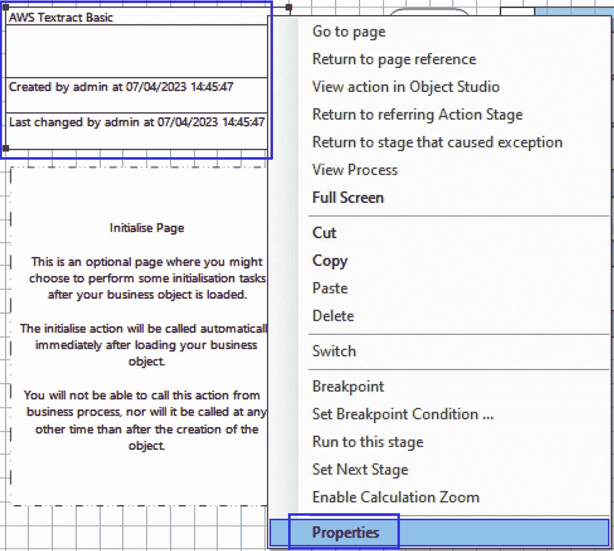

图 3.1 – 从初始化页面访问对象的属性

打开对象属性的另一种方法是双击白色矩形。当 **属性** 窗口打开时，您将看到一个 **代码选项** 选项卡。**代码选项** 选项卡是添加外部程序集和命名空间的地方。也可以在此处选择代码语言（**C#**、**Visual Basic** 或 **Visual J#**）。

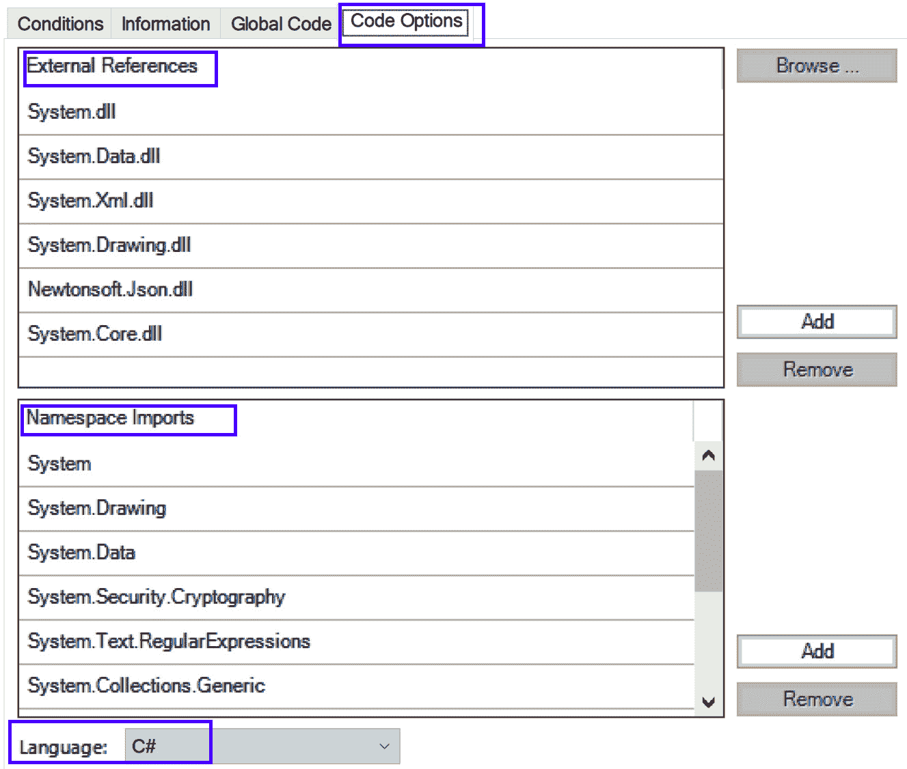

图 3.2 – 对象属性的 **代码选项** 选项卡

虽然 **图 3.2** 显示了 `.dll` 文件，但您也可以通过提供完整路径来指定它们。如果您看不到 `.dll` 的完整路径，这意味着该程序集存储在 BP 安装文件夹中或 Windows 路径的某个位置。在 C# 中，`using` 语句通常在添加相应的程序集后。

接下来，让我们看看我们的第一个示例，我们将向一个对象添加 **外部引用** 和 **命名空间导入**。我们将进行五个高级步骤：

1.  检查源代码中的现有 `using` 语句

1.  从 NuGet 下载 ML.NET 包

1.  从 NuGet 包中提取 `.dll` 文件

1.  将 `.dll` 文件复制到 BP 安装文件夹

1.  在 **代码选项** 选项卡中添加引用和命名空间

本例的总体目标是尽可能在添加实际 C# 代码到代码阶段之前，让 BP 与 ML.NET 一起工作。

## 示例 1 – BP 之前的准备工作

回想本章开头介绍的情景。我们负责将 C# ML 代码移入 BP。有两种方法来确定需要导入哪些 `.dll` 库。第一种方法是将所有源代码复制到一个代码阶段，并查看出现的错误消息。另一种（可能更聪明）的方法是首先检查项目的源代码。这将使我们熟悉代码库，并给我们一个需要添加哪些 `.dll` 文件和命名空间的思路。我们在这里将采用后者。

我们的起始源代码来自微软的 GitHub：

[`github.com/dotnet/machinelearning-samples/tree/main/samples/csharp/getting-started/BinaryClassification_SentimentAnalysis`](https://github.com/dotnet/machinelearning-samples/tree/main/samples/csharp/getting-started/BinaryClassification_SentimentAnalysis)

### 检查 C# 源文件中的 `using` 语句

在 Microsoft GitHub 项目中，只有三个 C# 源文件。让我们逐一检查并注意可能需要导入的任何 `.dll` 文件：

1.  打开第一个源文件 [`github.com/dotnet/machinelearning-samples/blob/main/samples/csharp/getting-started/BinaryClassification_SentimentAnalysis/SentimentAnalysis/SentimentAnalysisConsoleApp/Program.cs`](https://github.com/dotnet/machinelearning-samples/blob/main/samples/csharp/getting-started/BinaryClassification_SentimentAnalysis/SentimentAnalysis/SentimentAnalysisConsoleApp/Program.cs)。该文件的第一个六行包含 `using` 语句：

    ```py
    using System;
    using System.IO;
    using Microsoft.ML;
    using SentimentAnalysisConsoleApp.DataStructures;
    using Common;
    using static Microsoft.ML.DataOperationsCatalog;
    ```

`Microsoft.ML` 和 `Microsoft.ML.DataOperationsCatalog` 是 `Microsoft.ML` 的组成部分。`SentimentAnalysisConsoleApp.DataStructures` 是对当前项目的自引用，而不是外部库。

1.  打开第二个源文件 [`github.com/dotnet/machinelearning-samples/blob/main/samples/csharp/getting-started/BinaryClassification_SentimentAnalysis/SentimentAnalysis/SentimentAnalysisConsoleApp/DataStructures/SentimentIssue.cs`](https://github.com/dotnet/machinelearning-samples/blob/main/samples/csharp/getting-started/BinaryClassification_SentimentAnalysis/SentimentAnalysis/SentimentAnalysisConsoleApp/DataStructures/SentimentIssue.cs)。对于 `Microsoft.ML.Data` 只有一个 `using` 语句。

1.  打开最后一个源文件 [`github.com/dotnet/machinelearning-samples/blob/main/samples/csharp/getting-started/BinaryClassification_SentimentAnalysis/SentimentAnalysis/SentimentAnalysisConsoleApp/DataStructures/SentimentPrediction.cs`](https://github.com/dotnet/machinelearning-samples/blob/main/samples/csharp/getting-started/BinaryClassification_SentimentAnalysis/SentimentAnalysis/SentimentAnalysisConsoleApp/DataStructures/SentimentPrediction.cs)。我们再次只看到 `Microsoft.ML.Data`。

通过检查源文件，我们发现了三个显著的 `using` 语句：`Microsoft.ML`、`Microsoft.ML.Data` 和 `Microsoft.ML.DataOperationsCatalog`。

### 检查 .csproj 文件中的 PackageReferences

`.csproj` 文件也可以包含需要导入的外部库引用。打开 [`github.com/dotnet/machinelearning-samples/blob/main/samples/csharp/getting-started/BinaryClassification_SentimentAnalysis/SentimentAnalysis/SentimentAnalysisConsoleApp/SentimentAnalysisConsoleApp.csproj`](https://github.com/dotnet/machinelearning-samples/blob/main/samples/csharp/getting-started/BinaryClassification_SentimentAnalysis/SentimentAnalysis/SentimentAnalysisConsoleApp/SentimentAnalysisConsoleApp.csproj) 并搜索术语 `PackageReference`。你会看到只有一行包含 `Microsoft.ML`。

到目前为止，我们已经完成了对 C#项目代码中`using`语句的检查。这揭示了需要添加`Microsoft.ML`、`Microsoft.ML.Data`和`Microsoft.ML.DataOperationsCatalog`。`.csproj`文件再次确认了需要添加`Microsoft.ML`。现在我们已经知道了需要添加哪些库，让我们从 NuGet 下载它们。

### 从 NuGet 下载 ML.NET

NuGet 是.NET 的包管理器。在传统的软件开发中，`.dll`管理和依赖通常由您的 IDE 处理。这个功能很遗憾在 BP 中缺失，因此我们需要从 NuGet 网站手动下载包：

1.  在您的网页浏览器中打开[`www.nuget.org/`](https://www.nuget.org/)。搜索`ML.NET`。点击名为**Microsoft.ML**的结果。

1.  点击版本`.nupkg`文件。此文件可以用`.zip`提取程序打开，包括默认的 Windows 程序。

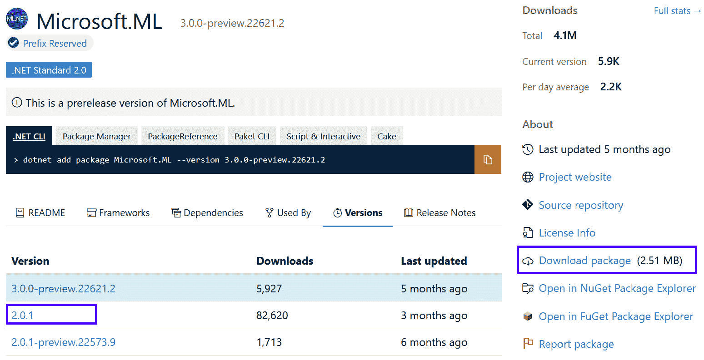


1.  使用 zip 提取工具打开`.nupkg`文件。导航到`lib\netstandard2.0`文件夹。将所有七个`.dll`文件提取到方便的位置，例如您的桌面。我们稍后会使用这些文件。

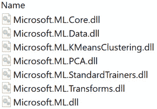


在我们需要导入的三个库中，有两个包含在`Microsoft.ML`包中：`Microsoft.ML`位于`Microsoft.ML.dll`中，而`Microsoft.ML.Data`位于`Microsoft.ML.Data.dll`中。

我们不清楚在哪里可以找到`Microsoft.ML.DataOperationsCatalog`。从 API 文档中，可以在[`learn.microsoft.com/en-us/dotnet/api/microsoft.ml.dataoperationscatalog?view=ml-dotnet`](https://learn.microsoft.com/en-us/dotnet/api/microsoft.ml.dataoperationscatalog?view=ml-dotnet)找到，我们看到它属于`Microsoft.ML.Data.dll`程序集，这意味着`Microsoft.ML`的`.dll`文件涵盖了迄今为止我们所知的所有`using`语句。

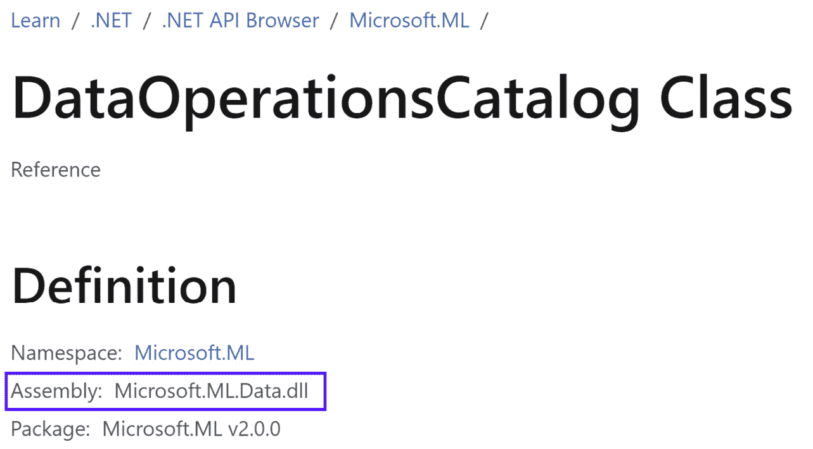


现在我们已经从 NuGet 包中提取了一些必要的`.dll`文件，让我们将它们移动到 BP 可以访问的位置。

### 将.dll 文件复制到 BP 安装文件夹

默认情况下，BP 安装在`C:\Program Files\Blue Prism Limited\Blue Prism Automate`。我们需要将`.dll`文件复制到安装文件夹。如果这不是您的安装路径，请替换为您自己的路径：

1.  将从 NuGet 包中提取的七个`.dll`文件复制到 BP 安装文件夹中。

1.  如果您已经打开了 BP 应用程序，请重新启动。BP 需要重新启动才能加载新的程序集。

重要提示

您可以将程序集复制到多个位置，以便与 BP 一起使用。这包括 Windows 目录、Windows 系统目录以及系统路径环境变量中的任何文件夹。为了使这个例子更不容易出错，我们将它复制到 BP 安装文件夹中。在生产环境中，一个更易于维护的解决方案是将`.dll`文件复制到一个自定义文件夹中，并将该文件夹包含在 Windows 环境路径变量中。

现在库已经被复制到一个 BP 可访问的文件夹中，让我们创建一个示例对象并导入它们。

### 创建一个 BP 对象并添加外部引用和命名空间导入

在这个第一个示例的最后一部分，我们将创建一个 BP 对象，添加所需的`.dll`文件作为引用，添加命名空间，并将语言设置为 C#：

1.  在**工作室** | **对象**内创建一个名为`Ch3`的新组。

1.  在`Ch3`组内创建一个名为`Example 1 – 用户评论的情感分析`的新对象。

1.  在**初始化**页面，双击带有对象名称的白色框。这会打开业务对象的属性。

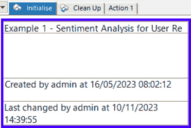

图 3.6 – 双击打开业务对象的属性

1.  点击`Microsoft.ML.dll`。点击`Microsoft.ML.Data.dll`。

1.  点击`Microsoft.ML`。点击`Microsoft.ML.Data`。

1.  在**语言**下拉菜单中选择**C#**。

1.  确认**代码选项**选项卡看起来如下：

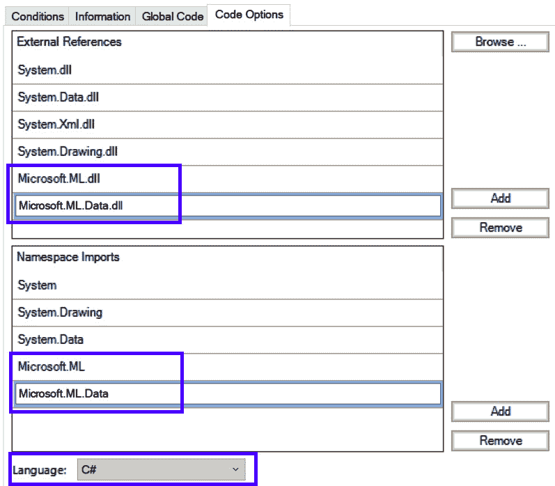

图 3.7 – 在第一个示例末尾的代码选项卡

1.  **保存**对象。

在这个例子中，我们在将 C#代码移动到代码阶段之前完成了所需的前期准备工作。首先，我们检查了项目的代码，以确定所需的某些程序集导入。这些程序集本身以及我们需要添加到代码阶段的进一步代码可能还有尚未导入的附加依赖项。接下来，我们从 NuGet 下载了 ML.NET 包，并提取了`.dll`文件。最后，我们将 ML.NET 程序集复制到 BP 安装文件夹中，并在对象的属性中添加了它们作为引用。在下一节中，我们将专注于将源代码移植到 BP 中。

# 将 ML.NET C#移植到代码阶段

将代码移植到 BP 更像是艺术而非科学。这需要了解 C#的工作原理，并在必要时深入研究 ML.NET API 文档。我们已经讨论了对象的属性中的**代码选项**部分。对象的属性还有一个**全局代码**选项卡，它将在下一个示例中使用。

## 全局代码

**全局代码**选项卡通过对象的属性访问，类似于**代码****选项**选项卡：

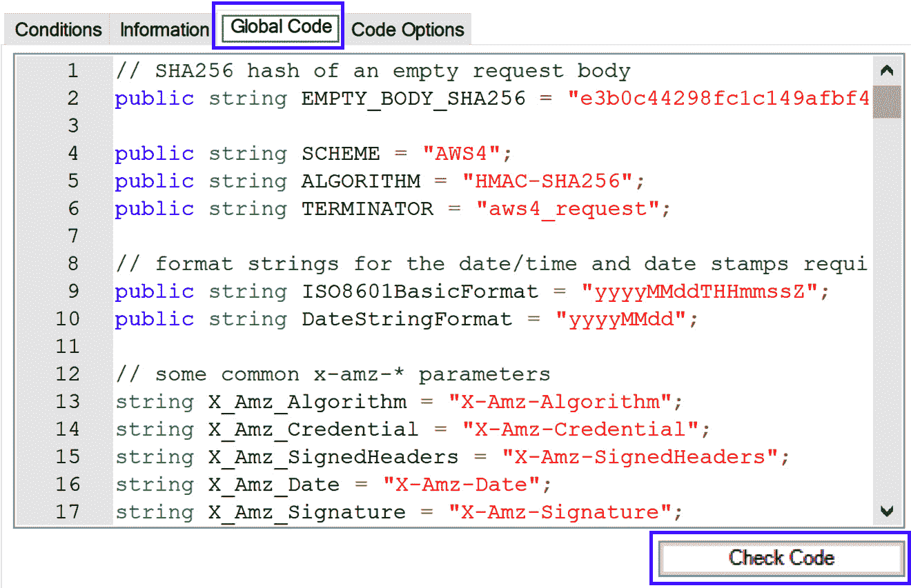

图 3.8 – 通过对象的属性访问全局代码标签

**全局代码**部分用于放置需要在多个代码阶段中使用的**通用代码**。这在概念上类似于需要在不同操作或页面中使用的全局数据项（取消选中“在过程中隐藏其他页面”的复选框），类似于通用数据项。通用代码可以包括**变量**、**类**和**函数**。

您还会注意到一个**检查代码**按钮。此按钮从**全局代码**部分的编译器角度以及对象中的任何其他代码阶段验证代码。我们将频繁使用此按钮来帮助我们确定哪些程序集缺失。

在下一个示例中，我们将使用**全局代码**部分和**检查代码**按钮来帮助将 C#代码移植到 BP。示例将通过五个高级步骤进行：

1.  将两个 C#类移动到对象的**全局代码**部分

1.  将主要源代码复制到代码阶段

1.  通过使用**检查** **代码**按钮迭代修复编译错误

1.  修改 C#控制台打印命令，以便将输出到文件

1.  测试移植的 ML 程序

## 示例 2 - 将源代码移植到 BP

在本例中，我们将把所有源代码移动到一个代码阶段，并修复更多的汇编和命名空间错误。我们的目标是达到一个可以接收 C#代码阶段预测的点。

重要提示

此示例是在 BP 版本 7.1.1 和 7.1.2 上创建和测试的。然而，如果您使用的是 BP 的不同版本，可能需要额外的步骤才能使此示例正常工作。这是因为 BP 的不同版本捆绑了不同版本的 Microsoft 的.dll 库。如果您查看 BP 的安装文件夹，许多这些.dll 文件都是以`System.*`或`Microsoft.*`为前缀。本例中显示的步骤在最坏的情况下应该能让你非常接近通过代码阶段进行预测。您可以通过应用我们下面将看到的技巧来获得一个可工作的解决方案。

### 将类定义移动到 BP

在第一个示例中，我们看到了只有三个`.cs`源文件。其中两个源文件，`SentimentIssue.cs`和`SentimentPrediction.cs`，是类定义。让我们将它们移动到对象的**全局代码**部分：

1.  打开第一个示例中创建的对象。如果需要，一个名为`Example 1 - Sentiment Analysis for User Reviews (Completed)`的完成版对象应该已经导入到`Ch3`组中。

1.  通过双击**初始化**页面上的带有对象名称的白色框来打开对象的属性。

1.  点击**全局** **代码**标签。

1.  将类定义代码从[`github.com/dotnet/machine learning-samples/blob/main/samples/csharp/getting-started/BinaryClassification_SentimentAnalysis/SentimentAnalysis/SentimentAnalysisConsoleApp/DataStructures/SentimentIssue.cs`](https://github.com/dotnet/machinelearning-samples/blob/main/samples/csharp/getting-started/BinaryClassification_SentimentAnalysis/SentimentAnalysis/SentimentAnalysisConsoleApp/DataStructures/SentimentIssue.cs)复制到`public class SentimentIssue { … }`。

1.  对[`github.com/dotnet/machinelearning-samples/blob/main/samples/csharp/getting-started/BinaryClassification_SentimentAnalysis/SentimentAnalysis/SentimentAnalysisConsoleApp/DataStructures/SentimentPrediction.cs`](https://github.com/dotnet/machinelearning-samples/blob/main/samples/csharp/getting-started/BinaryClassification_SentimentAnalysis/SentimentAnalysis/SentimentAnalysisConsoleApp/DataStructures/SentimentPrediction.cs)中的文件重复此操作。这包括`public class SentimentPrediction { … }`之间的所有内容。

1.  确认**全局代码**部分包含如图所示的两个类定义：

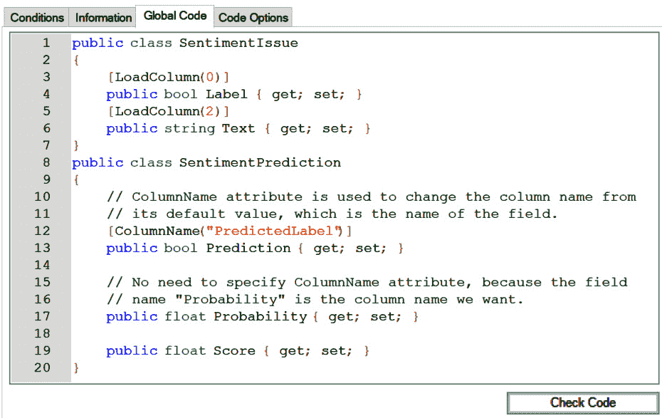

图 3.9 – 全局代码部分包含两个类定义

1.  点击“类型 'Attribute' 在未引用的程序集中定义。您必须添加对程序集 'netstandard,` `Version=2.0.0.0, Culture=neutral' 的引用。”

1.  点击`netstandard.dll`。

1.  返回到**全局代码**选项卡并再次点击**检查代码**。确保没有编译器错误。

1.  点击**确定**以保存业务对象的属性。

1.  保存对象。

到目前为止，我们已经成功将两个类添加到对象的**全局代码**部分。接下来，让我们将主程序代码导入到一个代码阶段。

### 将机器学习程序代码移植到代码阶段

机器学习程序的主要代码在这个文件中：[`github.com/dotnet/machinelearning-samples/blob/main/samples/csharp/getting-started/BinaryClassification_SentimentAnalysis/SentimentAnalysis/SentimentAnalysisConsoleApp/Program.cs`](https://github.com/dotnet/machinelearning-samples/blob/main/samples/csharp/getting-started/BinaryClassification_SentimentAnalysis/SentimentAnalysis/SentimentAnalysisConsoleApp/Program.cs)。

让我们将其移动到一个代码阶段：

1.  导航到“动作 1”页面并添加一个代码阶段。

1.  **链接**它们在**开始**和**结束**之间。

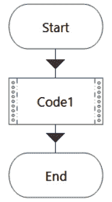

图 3.10 – 向动作 1 添加代码阶段

1.  查看`Program.cs`的第 12-20 行。注意它包含多个`private static readonly string`语句。这些语句定义了训练数据文件（第 15 行）和模型输出文件（第 20 行）的路径。在对象图中添加两个`Text`来表示这些。将一个数据项命名为`DataPath`，另一个命名为`ModelPath`。

1.  将`DataPath`设置为`C:/Users/Public/wikiDetoxAnnotated40kRows.tsv`，将`ModelPath`设置为`C:/Users/Public/ch3_SentimentModel.zip`：

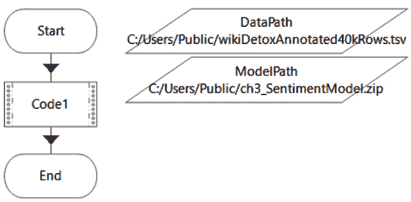

图 3.11 – 设置 DataPath 和 ModelPath 的初始值

1.  双击`Code1`。添加两个与数据项`DataPath`和`ModelPath`对应的输入。

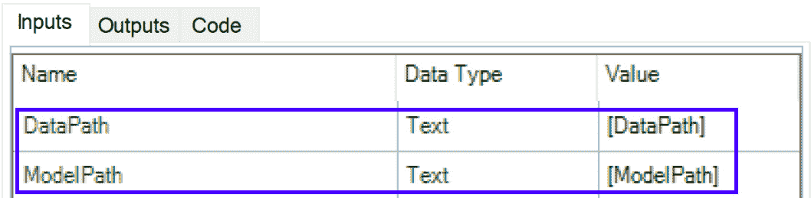

图 3.12 – 将两个数据项作为输入添加到代码阶段

1.  点击代码窗口中的`Main(string[] args) { [Copy the text here] }`。这些是`Program.cs`的第 24 行到第 68 行。你的代码窗口中应该有 45 行代码。

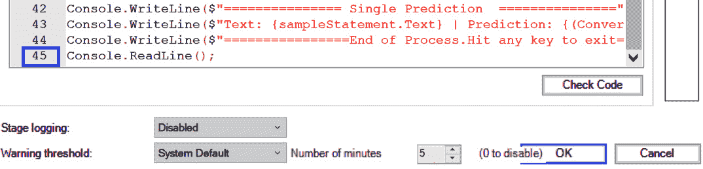

图 3.13 – 应该在窗口中的 45 行代码

1.  点击`.dll`缺失。例如，你可能会遇到`你必须添加对程序集'Microsoft.ML.Core'的引用`或`你必须添加对程序集'Microsoft.ML.DataView'的引用`。关闭**检查代码**窗口并按**确定**保存代码阶段。

1.  通过在 NuGet 网站上搜索`lib\netstandard2.0\Microsoft.ML.DataView.dll`文件从 NuGet 包到 BP 安装文件夹位置找到`Microsoft.ML.DataView.dll`文件。关闭并重新启动 BP。

1.  在`Microsoft.ML.Core.dll`和`Microsoft.ML.DataView.dll`上打开对象的属性作为**外部引用**。按**确定**关闭对象的属性。

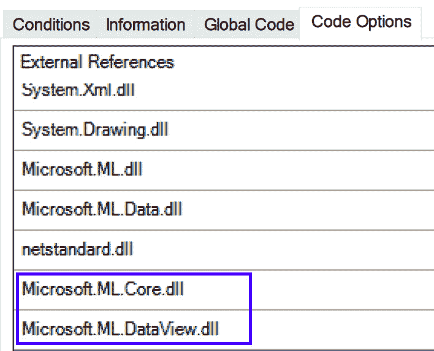

图 3.14 – 将两个新的外部引用添加到对象的属性中

1.  返回到`Code1`阶段并再次点击**检查代码**。应该仍然有四个编译器错误，它们没有给出需要导入哪个程序集或命名空间的明确指示。

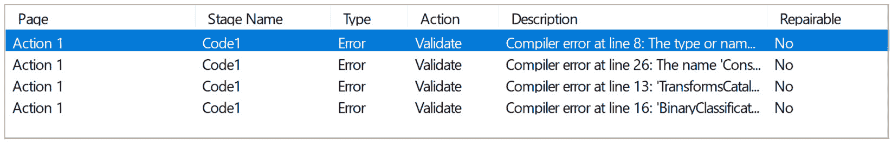

图 3.15 – 剩余的四个编译器错误

到目前为止，我们还没有一个工作的代码阶段，但我们已经接近了！让我们逐一调查和解决剩余的编译器错误。

### 修复单个编译器错误

没有编译器错误有明显的解决方案。我们需要依赖 API 文档来找出需要添加哪些命名空间或程序集。让我们按照错误发生的顺序来处理它们：

1.  查看第 8 行的编译错误。它显示“找不到类型或命名空间名称 'TrainTestData'”。让我们参考 API 以找出`TrainTestData`是什么。在[`learn.microsoft.com/en-us/dotnet/api/microsoft.ml.dataoperationscatalog.traintestdata?view=ml-dotnet`](https://learn.microsoft.com/en-us/dotnet/api/microsoft.ml.dataoperationscatalog.traintestdata?view=ml-dotnet)的文档显示它属于`DataOperationsCatalog`。回想一下，`DataOperationsCatalog`是`Project.cs`文件开头的一个`using`语句之一：

    ```py
    using static Microsoft.ML.DataOperationsCatalog;
    ```

    `using`语句通常通过将它们添加到`using static`语句中移植到 BP，但不能以这种方式添加。相反，我们需要在源代码本身中提供整个命名空间。

1.  在第 8 行打开`Code1`阶段，并在`TrainTestSplit`前加上`Microsoft.ML.DataOperationsCatalog`。现在第 8 行应该是这样的：

    ```py
    Microsoft.ML.DataOperationsCatalog.TrainTestData trainTestSplit = mlContext.Data.TrainTestSplit(dataView, testFraction: 0.2);
    ```

1.  点击**检查代码**。查看第 8 行的编译错误是否已消失。

1.  查看第 13 行的编译错误。它显示：“'TransformsCatalog.TextTransforms' 没有定义 'FeaturizeText'”。在[`learn.microsoft.com/en-us/dotnet/api/microsoft.ml.textcatalog.featurizetext?view=ml-dotnet`](https://learn.microsoft.com/en-us/dotnet/api/microsoft.ml.textcatalog.featurizetext?view=ml-dotnet)的 API 参考中查找`FeaturizeText`。它显示需要`Microsoft.ML.Transforms.dll`程序集：

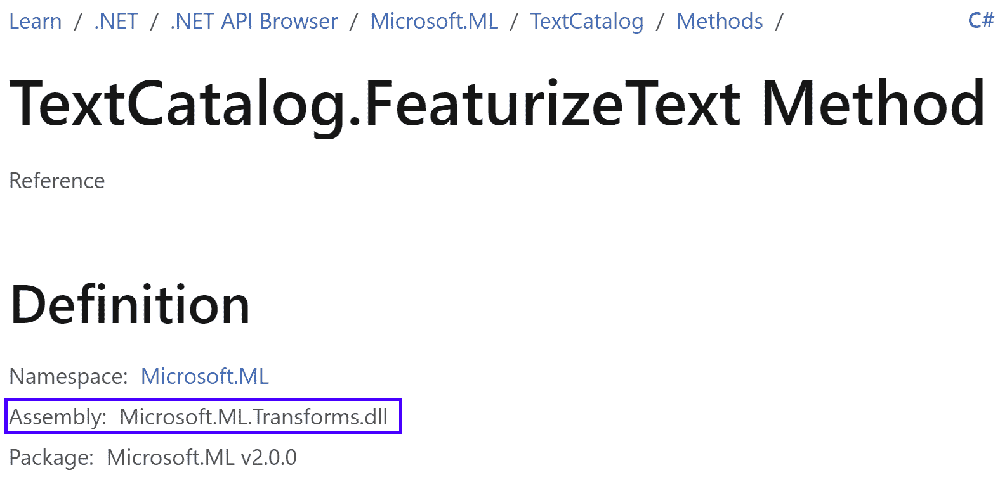

图 3.16 – Microsoft.ML.Transforms.dll 中的 FeaturizeText

1.  在对象的属性中将`Microsoft.ML.Transforms.dll`添加为**外部引用**，并通过按**确定**按钮关闭对象的属性窗口。

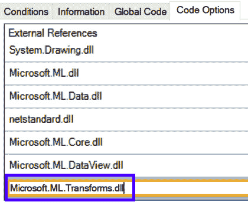

图 3.17 – 添加 Microsoft.ML.Transforms.dll 作为外部引用

1.  验证第 13 行的编译错误是否已消失。

1.  查看第 16 行的编译错误。它显示“'BinaryClassificationCatalog.BinaryClassificationTrainers' 没有定义 'SdcaLogisticRegression'”。在[`learn.microsoft.com/en-us/dotnet/api/microsoft.ml.trainers.sdcalogisticregressionbinarytrainer?view=ml-dotnet`](https://learn.microsoft.com/en-us/dotnet/api/microsoft.ml.trainers.sdcalogisticregressionbinarytrainer?view=ml-dotnet)的 API 页面显示，SdcaLogisticRegression 位于`Microsoft.ML.StandardTrainers.dll`中：

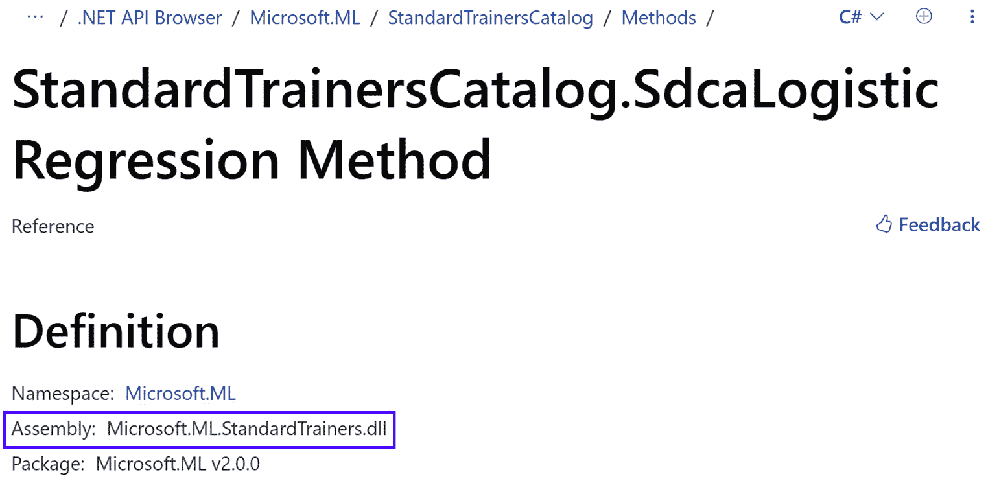

图 3.18 – Microsoft.ML.StandardTrainers.dll 中的 SdcaLogisticRegression

1.  在对象的属性中将`Microsoft.ML.StandardTrainers.dll`添加为**外部引用**。按**确定**按钮关闭属性窗口。

1.  验证第 16 行的编译错误是否已消失。

剩下的第 26 行的最后一个编译错误是关于一个帮助将结果打印到控制台窗口的实用程序 (`ConsoleHelper.PrintBinaryClassificationMetrics`)。由于我们的目标是让这个程序从 BP 运行，我们将不会看到任何控制台窗口。让我们将 C# 代码更改为将输出写入文件。

### 将控制台输出更改为文件

`ConsoleHelper.cs` 文件位于 [`github.com/dotnet/machinelearning-samples/blob/main/samples/csharp/common/ConsoleHelper.cs`](https://github.com/dotnet/machinelearning-samples/blob/main/samples/csharp/common/ConsoleHelper.cs)。我们可以将那个函数的代码复制到我们的对象的属性中的 **全局代码** 部分，并将第 26 行更改为从我们的代码阶段调用该函数。然后，我们将更改打印到控制台窗口为写入文件：

1.  在 GitHub 上打开 `ConsoleHelper.cs` 文件，并将第 41-57 行的 `PrintBinary ClassificationMetrics(…)` 函数复制到你的对象的属性中的 **全局代码** 部分：

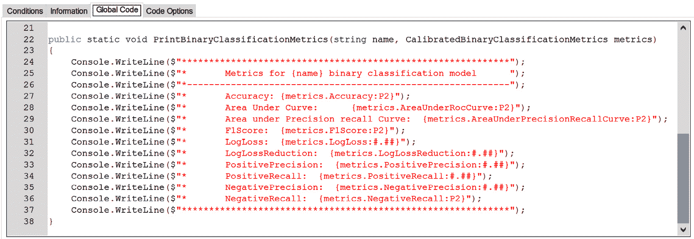

图 3.19 – 将 PrintBinaryClassificationMetrics() 复制到全局代码

1.  打开 `Code1` 阶段，在第 26 行删除 `Console.Helper.` 前缀。第 26 行应显示 `PrintBinaryClassificationMetrics(trainer.ToString(), metrics);`。

1.  点击 **检查代码** 并确认没有更多的编译错误。

1.  打开对象的属性，并将 `System.IO` 添加到 **命名空间导入**。这是写入文件所需的。

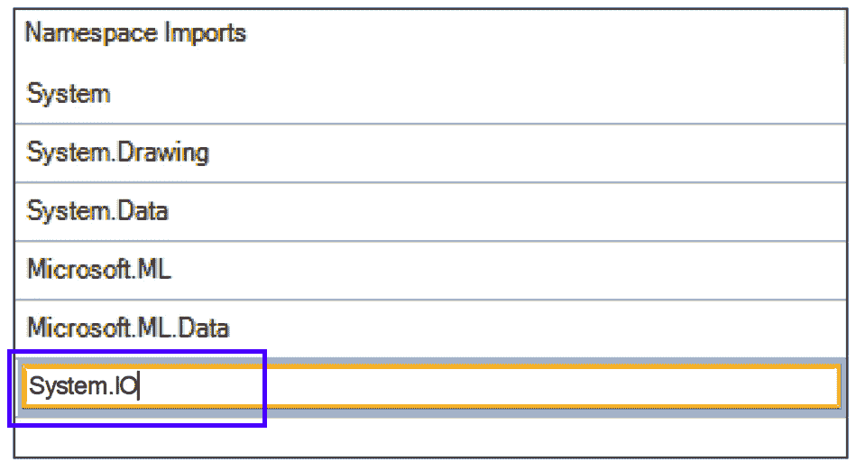

图 3.20 – 将 System.IO 添加到命名空间导入

1.  返回到 `Code1` 阶段，并在代码窗口的开始处添加以下行：

    ```py
    FileStream ostrm;
    StreamWriter writer;
    TextWriter oldOut = Console.Out;
    try {
        ostrm = new FileStream("C:/Users/Public/ch3_output.txt",     FileMode.OpenOrCreate, FileAccess.Write);
        writer = new StreamWriter(ostrm);
    }
    catch (Exception e) {
        return;
    }
    Console.SetOut(writer);
    ```

1.  删除代码窗口底部的最后两行。它们如下所示：

    ```py
    Console.WriteLine($"================End of Process.Hit any key to exit==================================");
    Console.ReadLine();
    ```

    可以安全地删除它们，因为它们的作用是暂停控制台窗口，以便你可以查看打印的文本，这现在不再是必要的。

1.  将以下三行粘贴到代码窗口的底部：

    ```py
    Console.SetOut(oldOut);
    writer.Close();
    ostrm.Close();
    ```

1.  按 **确定** 保存代码窗口。

现在所有编译错误都已解决，我们可以下载训练数据并测试 ML.NET 代码阶段。

### 运行 ML.NET 程序

我们接近终点线了！我们需要下载训练数据，将其复制到正确的位置，并运行我们的模型：

1.  从 [`github.com/dotnet/machinelearning-samples/blob/main/samples/csharp/getting-started/BinaryClassification_SentimentAnalysis/SentimentAnalysis/Data/wikiDetoxAnnotated40kRows.tsv`](https://github.com/dotnet/machinelearning-samples/blob/main/samples/csharp/getting-started/BinaryClassification_SentimentAnalysis/SentimentAnalysis/Data/wikiDetoxAnnotated40kRows.tsv) 下载训练数据。确保文件以 `.tsv` 文件格式下载，*而不是* `.txt` 文件。

1.  将 `.tsv` 文件复制到由 `DataPath` 数据项指定的位置，`C:/Users/Public/wikiDetoxAnnotated40kRows.tsv`。

1.  点击“操作 1”页面，并在对象工作室中运行它。

1.  注意到有一个错误：“内部：无法执行代码阶段，因为代码阶段抛出异常：无法加载文件或程序集`System.Collections.Immutable, Version=1.2.3.0`”。

1.  通过在 NuGet 网站上搜索`lib\netstandard2.0\Systems.Collections.Immutable.dll`文件从 NuGet 包中找到，将其放入 BP 安装文件夹位置。关闭并重新启动 BP。

1.  再次从对象工作室运行“操作 1”页面。注意到有一个错误：“Shuffle 输入游标读取失败，异常”。这个错误不是很有用，但我们可以将代码阶段包裹在 try / catch 语句中，以获取完整的堆栈跟踪。完整的堆栈跟踪揭示了另一个缺失的依赖项，`Microsoft.ML.CpuMath`。

1.  通过在 NuGet 网站上搜索“lib\netstandard2.0\Microsoft.ML.CpuMath.dll”文件从 NuGet 包中找到，将其放入 BP 安装文件夹位置。实际上，此程序集还依赖于一个名为 CpuMathNative.dll 的文件。这个文件通常由机器学习工程师提供，因为它将作为他们代码项目的一部分构建。

1.  从 GitHub 下载`CpuMathNative.dll`（假设这是由机器学习团队提供的）：[`github.com/PacktPublishing/Intelligent-Process-Automation-with-Blue-Prism/blob/main/ch3/CpuMathNative.dll`](https://github.com/PacktPublishing/Intelligent-Process-Automation-with-Blue-Prism/blob/main/ch3/CpuMathNative.dll)，并将其复制到 BP 安装文件夹。关闭并重新启动 BP。

1.  再次从对象工作室运行“操作 1”页面。

1.  打开`C:\Users\Public\ch3_output.txt`并确认其外观类似于以下图示：

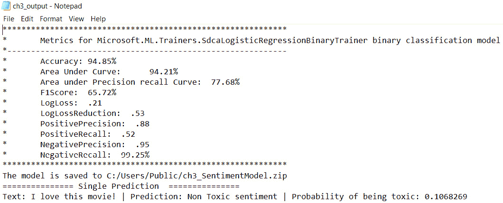

图 3.21 – 包含在 ch3_output.txt 中的重定向控制台输出

此文件显示了句子的训练准确性和对“我爱这部电影！”的样本预测结果。

1.  确认存储在`ModelPath`数据项中的文件`C:/Users/Public/ch3_SentimentModel.zip`已创建。文件大小应约为 13 MB。此文件可以加载进行预测，而无需再次训练模型。

我们已经完成了将机器学习代码移植到 BP 的过程。克服的最大困难是知道应该包含哪些程序集和命名空间导入。我们能在编译器错误和 ML.NET API 文档中找到这些信息。

作为参考，第二个示例的完整对象应该已导入到`Ch3`组中的“Example 2 - 用户评论情感分析（完成）”。现在我们已经训练了模型并且预测工作正常，让我们重构这个示例，使其遵循 BP 最佳实践。

# 改进 BP 集成

虽然第二个例子中的代码从功能角度来看是可行的，但它并没有很好地集成到 BP 中。它被放在一个单独的代码阶段中，这既不可维护也不可重用。数据科学家不一定有软件设计经验，因此你可能会收到一个完整的 ML 程序，它包含在一个源文件或 ML 笔记本中，以便将其导入 BP。

第二个例子中存在的一些问题包括以下内容：

+   日志记录的精确度较低。在添加代码阶段时最大的担忧之一是，你可能完成了许多重要步骤，但没有任何日志发送回 BP 数据库以供记录。

+   每次我们想要进行预测时，都需要重新训练整个模型，这是一项耗时且重复的工作。

+   只有一个动作，这不利于重用。

+   C#代码中缺少异常处理。

让我们看看我们如何在下一个例子中改进列出的四个要点。

## 示例 3 - 重构

在本章的最后一个例子中，我们将查看第二个例子的重构版本，它改进了功能、可重用性和日志记录：

1.  在对象工作室的`Ch3`组中打开`Example 3 – Sentiment Analysis for User Reviews (Refactored)`对象。

1.  无需编辑对象图即可访问`.zip`文件。

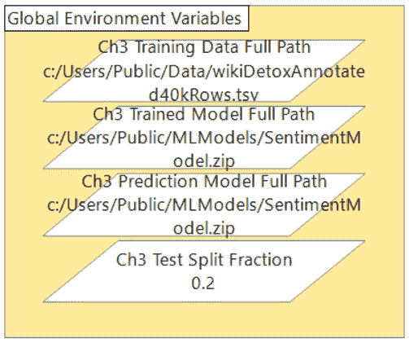

图 3.22 – 训练数据路径和保存的模型路径存储为环境变量

1.  注意，训练模型路径现在与预测模型路径分开。通过保持这些分开，你可以在继续使用之前的模型进行预测的同时重新训练模型。这是至关重要的，因为新训练的模型在使用生产之前需要经过审查。


图 3.23 – 训练模型路径和预测模型路径不同

1.  注意，如果需要更改而不编辑对象图，训练数据与测试数据的比例将作为环境变量暴露出来。构建模型的一部分是围绕训练参数的大量实验。最好不在对象的代码阶段中硬编码训练/测试分割，以防需要更改。另一种有效的设计是将此作为动作的输入。

1.  注意，训练、评分、模型保存和预测制作都已拆分为单独的动作。最重要的是，我们现在可以预测而无需每次都训练模型。这也提高了会话日志的精确度。

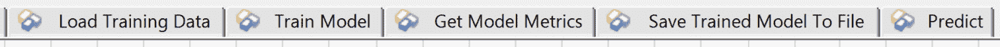

图 3.24 – 每个机器学习阶段都有自己的动作以改进日志记录和可重用性

1.  在每个代码阶段中添加了`try…catch`块，将错误消息和成功标志输出回 BP。

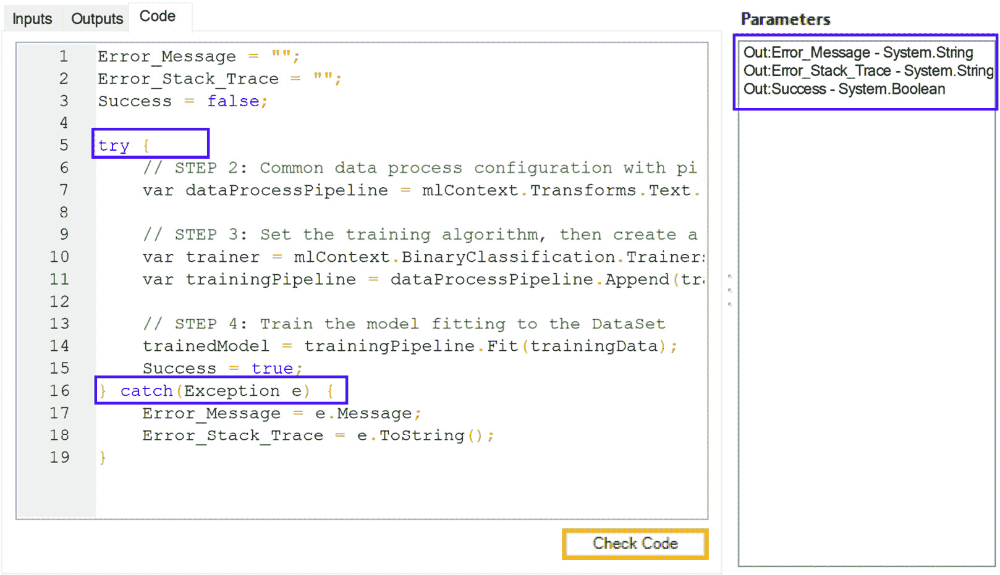

图 3.25 – 添加 try…catch 块以改进错误处理

每一页在结束阶段都将这些内容作为输出返回给调用者，而不是将文本写入文件。

1.  访问**初始化**页面，打开对象的属性，查看**全局代码**。你会看到为了适应所有这些变化，已经添加了许多新的*静态变量*：

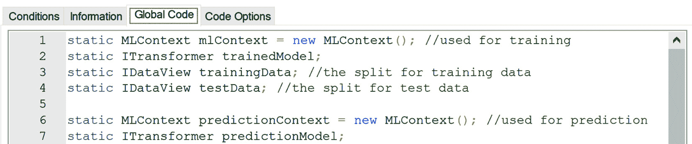

图 3.26 – 添加到全局代码中的静态变量，可在其他代码阶段中使用

这第三个例子到此结束。这是对第二个例子的重构版本，可读性、可重用性和可维护性都得到了提升。将整个 ML 程序完全包含在一个或几个源文件中是非常常见的。将 C#程序移植到*单个*代码阶段会导致的结果远远不符合 BP 的最佳实践。我们需要额外走一步，改进所提供的内容，使其符合 IA 卓越中心的行业标准。

# 摘要

ML.NET 是微软的开源、跨平台机器学习框架。它基于.NET 构建，可以通过代码阶段在 BP 中本地使用。在本章中，我们面临了一个常见的 IA 场景。我们得到了一个用 ML.NET 构建的工作 ML 项目，我们的任务是让源代码在 BP 中工作。

在第一个例子中，我们检查了源代码，以了解需要导入哪些`.dll`库。我们从 NuGet 下载了 ML.NET 包，并将程序集复制到 BP 安装文件夹中。

在第二个例子中，我们开始将代码移动到 BP 代码阶段。一些代码，包括类定义，属于`.dll`或命名空间错误。我们通过阅读编译器错误消息并在必要时查找 API 中的关键术语来解决每个错误。一个需要理解的关键点是，你不需要是 ML 专家，也不需要对你正在使用的 ML 框架有经验，就可以成功将其移植到 BP！我们可以通过使用**检查代码**和文档来成功移植代码。

最后，ML 代码通常以单个源代码程序的形式提供。在第三个例子中，我们将单个代码阶段拆分为多个动作，这些动作更接近 ML 生命周期。主要目标是使我们的对象在未来更具可重用性和可维护性。

这本书的*第一部分*到此结束，我们主要关注了 BP 如何触发 ML 预测。实现这一目标的主要方式是通过 Web API、命令行界面和代码阶段。接下来是本书的*第二部分*，我们将重点转向 IA 解决方案设计。

# 第二部分：设计 IA 解决方案

在本书的*第一部分*中，我们学习了三种将 BP 连接到 ML 模型进行预测的不同方法：Web API、命令行界面和代码阶段。

*第二部分*描述了围绕 ML 预测的 BP 解决方案设计元素。虽然这里的设计概念是通用的，可以与任何 RPA 工具一起使用，但它们在 BP 中得到了展示。在*第四章*中，我们将介绍将回顾 ML 预测作为管理 IA 风险的方法。我们将讨论并设计两种触发人工审查的不同方式：随机抽样和阈值。

*第五章*探讨了通过改变 BP 流程和工作队列的数量来设计 IA 解决方案的不同方法。改变流程和工作队列的数量会影响 IA 解决方案的可审计性和可扩展性。在建立这个更大的解决方案结构后，*第六章*讨论了一些较小、可重用的元素，这些元素可以用于所有不同的设计。

最后，*第七章*将本书这一部分的工作整合成可重用的 IA 流程模板和一个 IA VBO，这些模板可以作为您 IA 解决方案设计和开发的起点。

本部分包含以下章节：

+   *第四章*，*回顾预测和人工参与*

+   *第五章*，*HITL 的 IA 流程和工作队列设计*

+   *第六章*，*可重用 IA 组件*

+   *第七章*，*IA 模板和工具 – IA 对象*
