# 第五章：HITL 的 IA 流程和工作队列设计

RPA 和 IA 之间的主要区别在于结果的**确定性**和**风险**。在某些情况下，人们实施所谓的“IA”，不会产生任何风险。一个将人类输入分类的聊天机器人界面，进而触发传统的 RPA 运行，就属于这一类。虽然聊天机器人部分有 ML，但风险在 RPA 开始之前就被控制并解决了。对于这类 IA 流程，你实际上只需要知道如何与 ML 部分接口（参见第 1、2、3 章），本章可以省略。

对于那些通过创建非确定性流程结果来改变风险配置的 IA 案例来说，你可能会相信，设计一个 IA 流程以适应 HITL 应该是标准做法，即使团队决定保持 HITL 关闭。可能会有预测模型的更新、监管变化、新的业务需求等，这将导致再次启用 HITL 审查。

进程数量和工作队列数量是 IA 解决方案设计师必须做出的两个基本设计决策。几乎所有其他设计元素，例如是否使用标签、状态、延期等，都取决于这两个决策。本章讨论在 BP 中实施 IA 时，何时选择“一个进程与多个进程”以及“一个工作队列与多个工作队列”。重要的是要记住，这次讨论专门针对 IA —— 意味着一种能够实现后续 ML 预测和 HITL 审查的设计。其他涉及工作队列的特定用例设计主题，如父子队列，将不会介绍。

更具体地说，我们将探讨以下内容的优缺点：

+   单 BP 流程、单工作队列设计

+   多 BP 流程、单工作队列设计

+   多个 BP 流程、多个工作队列设计

# 技术要求

下载并导入 GitHub 上 `ch5` 文件夹中的三个 `.bprelease` 文件：[`github.com/PacktPublishing/Intelligent-Automation-with-Blue-Prism/tree/main/ch5`](https://github.com/PacktPublishing/Intelligent-Automation-with-Blue-Prism/tree/main/ch5)

GitHub 文件夹中还有一个 Excel 文件，它将作为本章的 *示例 1* 的一部分保存。

# 单进程、单工作队列设计

如果存在所谓的“默认”解决方案设计，那将是从“蓝 prism 流程模板”创建的单个 BP 流程和单个工作队列。正如我们在第四章的例子中看到的那样，这种“简单”的设计绝对可以用于 IA。

在本节中，我们将讨论涉及单个进程和单个工作队列的两个主要 IA 解决方案设计，包括它们的优缺点以及何时选择它们。

## 异步（非阻塞）审查

在**异步审查**设计中，BP 流程**不等待**当前项目被审查，以便它可以继续处理。相反，流程暂停对当前需要 HITL 审查的项目的工作，并继续处理下一个项目。这可能是大多数 IA 流程应该被设计的方式，因为审查者通常无法预测何时需要审查项目或项目实际审查需要多长时间。

三个例子都来自*第四章*，它们都被设计成异步操作。状态决定项目何时处于待审查状态，而延期防止项目被**获取下一个项目**操作选得太快。

让我们从**功能性**、**可维护性**（从未来修改的难易程度来看）和**可操作性**的角度来评估这种**异步审查**设计。我们将使用这三个标准来评估本章中所有设计。

### 功能性

此设计允许工作队列项目无限期地延期，直到它们被人工审查。未延期的项目可以继续自动化处理。

流程不断在两个不同的操作周期之间切换。第一个周期是创建审查数据和检查完成的 HITL 审查。下一个周期是选择项目进行传统的 RPA 处理。

### 可维护性

在可维护性方面，所有逻辑，无论是业务逻辑还是 IA 相关的逻辑，都包含在一个**单一**的 BP 流程中。这并不明显是好事还是坏事，因为有些人认为它比多流程解决方案更容易维护。我的观点是，在单一流程中包含太多内容——在我们的案例中，业务逻辑、ML 调用代码和 HITL 逻辑——会使解决方案的可维护性降低。将所有内容都包含在一个流程中，防止多个开发者同时编辑它，这在逻辑很多的情况下是不理想的。

### 可操作性

控制器需要知道如何检查项目状态，以便找出哪些项目尚未被审查。他们需要确切知道哪些状态存在，这样他们就可以在控制室中手动编辑状态。这样他们就可以强制项目继续自动化处理，即使它被标记为需要审查。无论选择的具体流程和工作队列设计如何，从 RPA 迁移到 IA 时，总会增加操作复杂性。

控制器还需要找出等待审查的项目是否陷入僵局。有可能数字工作者和审查者之间共享的数据，无论是共享文件夹中的 Excel 文件、数据库记录还是网络界面，被错误生成或意外删除。

### 优点

异步审查设计的优点在于所有内容都包含在一个流程中，这使得会话使用（许可证消耗）易于预测。调度管理也相对简单。这对需要仔细控制许可证使用方式的公司来说是有益的。由于我们只有一个工作队列，所以从控制室中可以清楚地看到关于案件总工作时间的统计数据。

### 缺点

这种设计的缺点之一是，工作队列项目在审查后不能立即开始工作（假设这是可取的）。它必须等待延期时间过去，才能由**获取下一个项目**来获取。

这种设计的另一个缺点是，为了更新已审查预测的状态，检查应可能发生在流程模板的工作块之外。在下面的图中，我们看到流程在处理新项目之前检查了已完成的人工审查：


图 5.1 – 检查已审查的预测应仅在项目之间进行

这是因为检查已完成审查的逻辑与被**获取下一个项目**锁定的项目特定的逻辑无关。我们不希望审查检查逻辑中发生的异常导致正在处理的项目也成为异常。将检查逻辑放在工作块之外所做的妥协是，如果那里发生异常，流程可以终止。一个**双流程**设计可以将审查检查逻辑与实际业务流程逻辑解耦，从而减轻这个问题。

关于这种设计的另一个担忧在于执行审查检查与实际处理案件所花费的时间量。它们是两个相对独立的活动，需要在同一会话中运行。根据实际情况，你可能会在审查检查逻辑上花费大量时间，从而**负面影响处理案件的处理能力**。想象一下，检查已完成审查需要登录到自定义网站。如果这个网站速度慢或需要在多个页面之间进行大量导航，由于检查已完成审查而使用**获取下一个项目**来获取案件之间的差距可能会变得非常大。

一个完整的单一流程、单一工作队列、异步设计的例子可以在*第四章*，*示例 3*中找到。

既然我们已经讨论了异步审查设计的优点和缺点，让我们看看一种不同的单一流程、单一工作队列设计，用于同步审查。

## 同步（阻塞）审查

如果我们有**SLA 要求**，需要手动审查在短时间内完成，我们应该考虑**同步审查**设计。在这个设计中，流程会阻塞并等待工作队列项目审查完成后再继续。

### 功能性

在同步审查流程中，我们必须完成当前项目，包括等待 HITL 审查，然后才能继续处理其他项目。当 IA 支持实时客户互动时，这通常是所希望的。回想一下，有一个真实的 IA 用例，其中 ML 被用来帮助验证药物处方。根据这种设置的使用情况——例如药店、医生办公室或医院——客户对收到药物的需求可以被认为是“实时”的，时间短至几分钟。

在同步审查设计下，BP 流程进入轮询循环，阻塞并持续检查预测是否已审查。如果审查在 SLA 期限内完成，则自动处理继续。如果 ML 审查没有在 SLA 期限内完成，则案件被标记为异常。

### 可维护性

与异步设计类似，所有内容都包含在一个*单个*进程中，这对大多数开发者来说可能是可维护的。实现轮询循环的逻辑比异步设计的逻辑简单，即使是新开发者也能轻松掌握。

### 可操作性

与异步设计相比，控制室操作简单。在时间限制内未审查的项目被标记为异常。控制器实际上不需要与非 IA 解决方案不同的操作。

### 优点

除了解决方案的整体简单性之外，这种设计没有太多优点。它易于理解，修改轮询逻辑，安排和预测许可证使用。选择这种设计的最强理由是能够实现实时审查。

### 缺点

这种设计的最大缺点是*显著降低的案件吞吐量*，这是为了满足个别案件 SLA 而做出的权衡。如果案件数量也很大，需要同时运行更多的 BP 会话，从而导致使用更多许可证。在轮询循环中不可避免地会浪费时间，而且这种浪费随着 SLA 期限的延长而增加。

让我们来看一个医院设置中这种单进程、单工作队列阻塞设计的例子。从高层次来看，我们将进行以下四个步骤：

1.  检查示例的发布文件内容并导入额外的依赖项。

1.  理解创建带有图像的`.html`审查文件的逻辑。

1.  检查用于实现同步审查的轮询逻辑。

1.  运行示例，在控制室中查看结果。

### 示例 1 - 轮询已审查的预测

在本例中，我们将使用之前描述的处方药场景。想象一下，我们正在为一个每天处理约 200 名患者的私人医院项目工作。预计每位患者都需要从医院药房获取药物。为了缩短患者等待时间并提高药房的患者满意度，医院正在寻求使用基于图像的机器学习来自动 *计数常用处方的药片数量*。

机器学习团队已经为多种药物类型构建了模型，并确定了需要人工干预进行手动审阅的阈值。为了满足项目的目标（减少患者等待时间），我们决定采用阻塞过程设计，其中数字工作者最多等待 *两分钟* 进行预测审阅。一支由受过培训的远程工作人员组成的小团队将负责使用简单的 Web 界面进行手动审阅。选择 Web 界面是因为审阅者需要查看药物图片。

数字工作者会将 `.html` 文件保存到网络共享文件夹中。一个 `.html` 文件包含处方药的图片和一个下拉列表，供审阅者选择图片中显示的药物剂量。`.html` 文件名将包含项目 ID。批量大小的概念在此情况下不适用，因为我们不希望在单个 `.html` 文件中审阅多个预测。

我们的第一步是验证 `.bprelease` 文件的内容，并导入本例所需的额外文件。

#### 验证发布内容并导入依赖项

在这里，我们将检查 `.bprelease` 文件内容，并从 DX 导入第三方资产。然后，我们将下载包含人工审阅阈值的 Excel 文件，并确保将其保存到正确的位置：

1.  验证是否已导入 *一个* 流程、*一个* 工作队列和 *四个* 环境变量：

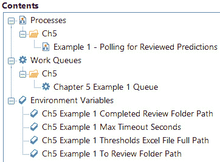

图 5.2 – 示例 1 的发布内容

1.  下载并导入 `.html` 文件。注意，如果您已经完成了*第二章*中“示例 3，GCP Cloud Vision 批量 OCR 处理”部分，则此步骤已完成。如果**实用工具 – 文件操作**已经导入，则忽略此步骤。

1.  从 [`github.com/PacktPublishing/Intelligent-Automation-with-Blue-Prism/blob/main/ch5/Ch5%20Example%201%20Thresholds.xlsx`](https://github.com/PacktPublishing/Intelligent-Automation-with-Blue-Prism/blob/main/ch5/Ch5%20Example%201%20Thresholds.xlsx) 下载 Excel 文件。该文件包含触发不同药物类型审阅的阈值。

1.  将 Excel 文件复制到名为 `C:/Users/Public/Ch5 Example` 的环境变量指定的路径中 `1 Thresholds.xlsx`。

1.  打开 Excel 文件。此文件存储不同类型药物（如果我们有更多药物类型，我们可以在电子表格中添加更多行）的阈值：


图 5.3 – 阈值配置 Excel 文件

1.  定位名为`.html`文件的环境变量，作为审查预测的接口。在审查者审查完预测后，他们预计会按下名为**提交已审查预测**的按钮，这将触发浏览器文件下载对话框弹出或自动将文件下载到您的 PC 上。该行为取决于您的浏览器设置。

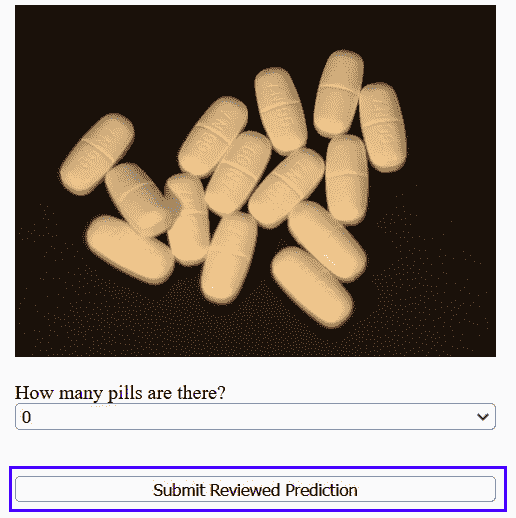

图 5.4 – 静态.html 审查界面

在更现实的情况下，我们不会使用静态的`.html`文件。我们会使用一个提供审查网页的 Web 服务器，按下**提交**按钮会自动将必要的文件复制到共享位置。这将消除用户下载文件的需求。然而，设置 Web 服务器超出了本书的范围，并且对于说明同步审查设计的概念是不必要的。

接下来，让我们看看流程图。大部分流程结构与第四章中的**示例 2 – 阈值**相同。这里将突出显示重要的差异。

#### 检查.html 文件创建逻辑

解决方案的一个重要部分在于我们如何在数字工作者和审查者之间实现数据共享接口。由于图像是审查数据的一部分，我们选择了一个网页浏览器和 HTML 表单作为审查界面。让我们看看这是如何实现的：

1.  在流程工作室的*Ch5*组中打开**示例 1 – 轮询已审查预测**。

1.  定位并打开`03b 将图像写入 HTML 模板`页面。此页面在我们知道需要手动审查预测之后执行。

1.  查看启动后的前三个动作阶段。第一个动作将药物图像写入文件。第二个动作将图像内容以 Base64 字符串的形式读回 BP。第三个动作删除由动作 1 创建的图像文件。其目的是将图像转换为 Base64 编码，以便可以直接嵌入到`.html`文件中。

1.  查看 Multi Calc 阶段。在这里，Base64 图像字符串被替换为包含选择列表 HTML 模板的`Text`数据项，一个`Text`数据项被保存为`.html`文件，以项目 ID 作为文件名，存入由**Ch5 Example 1 To Review Folder Path**环境变量指定的路径：

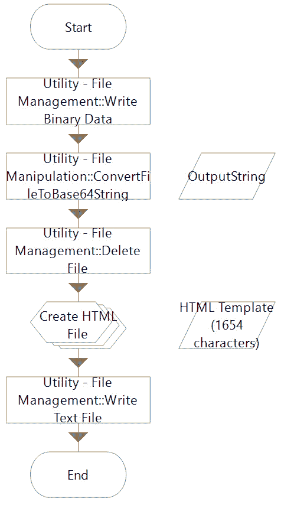

图 5.5 – 将图像作为 Base64 嵌入到 HTML 文件中

1.  打开存储在 CDN 上的`.js`文件，这意味着这个例子**需要互联网连接**才能运行。

1.  检查以下 JavaScript 代码，这是 HTML 模板数据项的一部分。当在 HTML 表单中按下**提交**按钮时，JavaScript 被触发，显示文件下载对话框。此文件下载对话框默认将文件名命名为当前项的 ID，并将已审查的预测值作为文件内容存储：

    ```py
    document.getElementById('saveFile').addEventListener('click', function(e) {
    var text = document.getElementById("reviewed").value;
          var filename = document.title + ".txt";
          var file = new File([text], filename, 
         {type: "text/plain;charset=utf-8"});
          saveAs(file);
    });
    ```

我们现在应该了解数字工作者如何与审查者交换数据。BP 在由**Ch5 Example 1 To Review Folder Path**环境变量指定的路径中创建一个以当前项 ID 命名的`.html`文件。

审查者手动监控此文件夹，并在他们的默认网络浏览器中打开任何出现的`.html`文件。`.html`文件包含药物的图片，一个供审查者选择正确药物剂量的下拉列表，以及一个提交表单的按钮。`.txt`文件被写入磁盘，其中包含下拉列表的值（人工审查的药物量）作为内容。

#### 检查轮询逻辑

现在我们来检查使轮询逻辑工作起来的两个主要部分。第一部分是一个等待循环，如果超过最大等待时间，则抛出异常；第二部分是清理`.html`和`.txt`文件：

1.  前往`主页面`。注意在工作块内部，我们添加了一个名为`等待审查预测`的新页面。此页面包含轮询审查预测的逻辑，如果需要审查，则通过轮询来阻止执行：

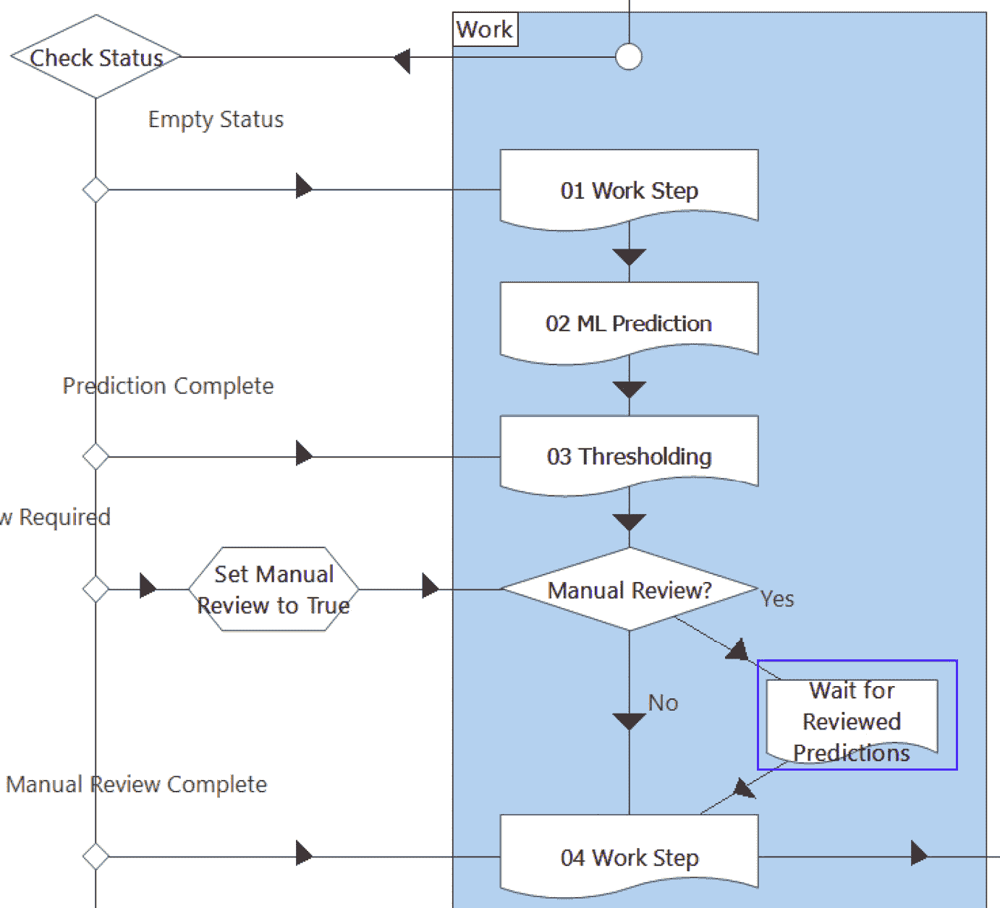

图 5.6 – 等待审查预测页面包含轮询逻辑

1.  打开`等待审查预测`页面。

1.  定位名为当前项 ID 的`.txt`文件块。这是通过按下`.html`审查文件保存的同一`.txt`文件。如果在最大超时值（由**Ch5 Example 1 Max Timeout Seconds**环境变量指定）达到之前没有找到确切的文件，我们将继续轮询。如果在最大允许的超时时间内没有检测到文件，将抛出异常：

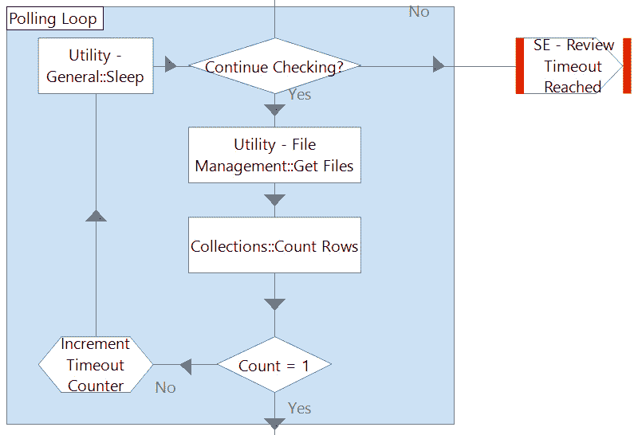

图 5.7 – 轮询逻辑

1.  查看在找到以当前项 ID 命名的`.txt`文件之后的六个阶段，工作队列状态被更新。修订后的预测被读回到 BP 中，并且`.txt`文件被删除：

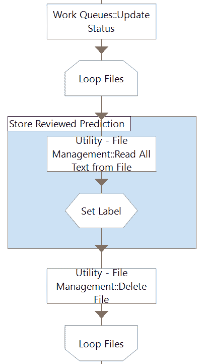

图 5.8 – 读取修订后的预测并删除.txt 文件

重要提示

更新状态对于此单个工作队列轮询设计是否正确运行不是至关重要的。它保留在这里是为了在异常或停止后重试项时跳过`主页面`上的步骤。然而，更新状态对于异步审查设计至关重要。在那里，状态被用来反复推迟项，直到它被审查。

1.  在本页的最后一步，找到已删除的 `.html` 文件。即使它仍在审查员的浏览器中加载，也可以安全地删除 `.html` 文件，因为现代浏览器的工作方式是这样的：


图 5.9 – 删除 .html 文件

#### 运行流程

此流程将 10 个随机生成的项目加载到名为*第五章* *示例 1 队列*的工作队列中。由于随机生成，此流程可能需要多次运行，才能选择一个图像进行人工审查。平均而言，每个会话运行应有四个项目需要人工审查。机器学习算法不是真实的 – 它是一个占位符，基于随机数。

我们将运行查询流程，并让两分钟过去。这应该会导致第一个项目被标记为异常，因为审查没有在超时期间完成。然后，我们将手动审查所有后续项目，在它们的两分钟限制内完成。这应该会导致所有其他项目被标记为已完成：

1.  前往控制室，找到*Ch5*组，并启动名为**示例 1 – 查询已审查预测**的流程。*不要等待会话完成*。

1.  在 Windows 文件资源管理器中打开已配置为**Ch5 示例 1 审查文件夹路径**环境变量的文件夹。

1.  等待出现 `.html` 文件。一旦出现文件，审查员在项目被标记为异常前有 120 秒的时间：


图 5.10 – .html 文件出现在审查文件夹路径中

1.  等待 120 秒，让项目过期，并打开名为*第五章* *示例 1 队列*的工作队列。注意，控制室中显示的项目键与项目 ID（.html 文件的文件名）不同：


图 5.11 – 当超过最大等待时间后，项目将被标记为异常

1.  返回 Windows 文件资源管理器，等待另一个 `.html` 文件出现。尽快在你的网络浏览器中打开文件。通过选择药物剂量并点击**提交已审查****预测**按钮来审查预测：

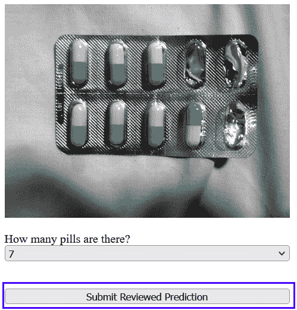

图 5.12 – 进行人工审查并提交

1.  如果出现**另存为**对话框，请确保文件夹与**Ch5 示例 1 已完成审查文件夹路径**环境变量的值匹配。保存文件时不要重命名。如果你的浏览器设置为自动下载文件，则可能不会出现**另存为**对话框。

1.  重复*步骤 5*和*步骤 6*，审查出现的任何 `.html` 文件，直到会话执行完毕。

1.  一旦会话运行完成，打开*第五章* *示例 1 队列*工作队列，你会看到除了一个之外的所有项目都被标记为**完成**：

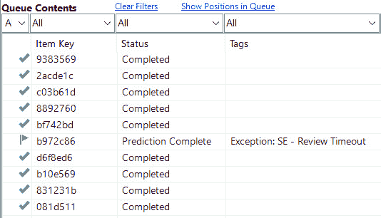

图 5.13 – 除了一个之外的所有项目都已完成

在这个例子中，我们看到了如何通过一个**单个**进程和**单个**工作队列，结合轮询循环，来满足需要实时 HITL 审查的 IA 用例。我们还设计了一种通过将图像写入`.html`文件来审查图像的方法。

接下来，让我们将讨论从**单个**进程设计转移到**多进程**设计。

重要提示

虽然你可以设计一个**单个**BP 流程与**多个**工作队列，但对于 IA 来说，这样做并没有明显的理由。作为一个一般的设计规则，避免为单个 BP 流程拥有多个工作队列。当有多个工作队列可以作为正在处理的项目来源时，很难追踪流程流程，这会降低可维护性。一个例外是，如果额外的队列不是工作项目的来源，例如在父/子工作队列设计中，只有项目状态、标签或数据被更新。

# 多进程、单工作队列设计

在 IA 的背景下，你可能希望有多个 BP 流程在仅**单个**工作队列上工作的三个主要原因。第一个是为了**保持不同逻辑部分的分离**。我们将在本节的后面看到这个例子，其中一个 BP 流程主要用于业务逻辑，其他流程用于存放解决方案设计中的 ML 部分的特定逻辑。将这些逻辑分开使得对业务逻辑的将来修改更容易管理。

下一个原因与第一个原因密切相关。我们可以将解决方案分解为不同的进程来**提高可重用性**。正如你可以想象的那样，实现随机抽样、阈值设置、通知审查员预测已准备好审查等逻辑，在多个 IA 进程中可能是可互换的，并且可以将其作为它们自己的进程来实现。

第三个原因是为了使整体流程的不同部分能够**不同比例地扩展**。想象一下，我们正在将一个新的 IA 流程投入生产，并且随机抽样百分比设置为 100%，以强制在超期期间对每个 ML 预测进行人工审查。如果有一个专门用于检查已审查预测的 BP 流程，我们可以在更多的数字工作者上运行它，以防止在此期间出现瓶颈。一旦我们对 ML 模型的准确性和性能感到满意，随机抽样百分比和需要审查检查流程的会话数量可以降低。

在下一节中，我们将讨论一个**多进程**、**单队列**IA 设计，其中手动审查的逻辑被分割到它自己的进程中。本节还包含一个示例。

## 独立的手动审查逻辑

我们之前看到的审阅检查逻辑可以被放入一个单独的进程，从而将其与业务逻辑解耦。以下图表展示了这在高层次上的设置方式。


图 5.14 – 双进程、单队列设计

图表中的**进程 1**执行所有业务逻辑步骤，包括进行机器学习预测。**进程 2**使用与**进程 1**相同的**工作队列**，仅负责与 HITL 审查相关的逻辑——将数据传输给审稿人并检查完成的审稿。其主要目的是更新工作队列项目状态，以便**进程 1**在项目被审阅后可以继续对项目进行自动化处理。

### 功能性

此设计的主要功能是允许**进程 1**将所有时间都用于执行业务逻辑，而不是 IA 解决方案逻辑（编写共享数据和检查已审阅的预测）。它允许两个活动**独立扩展**。例如，你可以为**进程 1**分配多个会话来运行，而只为**进程 2**分配一个会话，或者相反，具体取决于你的实际需求。

### 可维护性

通过从单个进程转换为两个进程，每个进程总体上变得更加易于维护。但解决方案的整体复杂性增加了，因为开发者需要理解两个进程如何影响项目的执行流程。随着 IA 团队经验的积累和文档实践的提高，这种复杂性显著降低。

### 可操作性

**单进程**、**单队列**示例通过遍历**完成文件夹**的内容来检查审阅是否完成。这个完成文件夹可以是 API 调用、数据库或其他系统。在“完成位置”的文件或记录中*必须*包含对**项目 ID**的引用。BP 必须能够根据项目 ID 锁定项目以更新其状态，以便它可以继续所需的自动化处理。

从操作角度来看，将项目 ID 直接暴露给审稿人是不稳定的。有人可能会意外地（或故意地）修改项目 ID。这可能导致工作队列项目永久卡住，无法再进行审阅，或者更新了与预期不同的项目的状态。

通过遍历数据传输位置的选择方案是遍历待审阅项目的**工作队列**。不幸的是，**获取下一个项目**无法根据状态进行筛选。然而，我们可以根据**标签**筛选工作队列，我们将在接下来的示例中实现这一点。我们还需要将文件路径或第三方系统 ID 存储为工作队列数据，这样就不需要将项目 ID 暴露给审稿人。

此外，由于我们计划遍历每个待审查的项目，我们可以确保审查数据被正确持久化，并在必要时重新创建它。在我们的先前设计中这是不可能的，因为我们只遍历完成文件夹的内容，而不是需要审查的完整集合。

讨论

你可能想知道我们是否可以在我们的单进程、单工作队列示例中添加标签，以防止将项目 ID 暴露给审查者。虽然在技术上可行，但在实践中，这会占用太多时间，无法根据业务逻辑实际处理项目。回想一下，我们先前示例中的审查检查逻辑位于主页面工作块之外。如果待审查的项目数量很多，或者检查待审查项目是否已审查需要超过几秒钟的时间，我们可能会花费大量时间仅进行此检查。

### 优点

在单进程、单队列设计中，审查检查是在流程模板的工作块外进行的。在工作块外发生的异常可能会导致终止。采用双进程设计，可以将审查逻辑放入其自己的工作块。发生的异常不再导致立即终止。这使得这种设计非常适合检查完成的审查具有复杂逻辑的场景，例如登录到网络界面。

虽然有些人可能认为这种解决方案比只有一个进程更难维护，但我认为现在维护包含业务逻辑的主要进程更容易，因为大部分 IA 解决方案逻辑已经被移出。业务逻辑在 IA 解决方案的生命周期中更容易发生变化。转向双进程设计也实现了重用和目标扩展。

### 缺点

与单进程设计相比，这种双进程、单工作队列设计的主要缺点是，获取工作解决方案所需的最小会话数是两个。调度也变得更加复杂。

遍历每个标记为人工审查的项目，无论其是否已审查，都会不必要地增加该项目的总工作时间。这种双进程、单队列设计的负面后果是，案例持续时间统计将高于单进程设计。

另一个缺点是由于将持久化预测数据的逻辑移动到新进程中，以便与审查者共享。由于我们将该任务卸载到不同的进程，我们实际上在 ML 预测后不再立即保存审查数据。我们可能需要频繁地运行进程 2 的会话，以确保及时创建审查数据。

接下来，让我们通过一个示例来查看这种单工作队列、双进程设计的实现。从高层次来看，我们将进行以下五个步骤：

1.  验证发布内容。

1.  确认 HITL 审查逻辑已被移出流程 1。

1.  理解已移入流程 2 的功能。

1.  运行流程 1，并在控制室中查看结果。

1.  运行流程 2，并在控制室中查看结果。

### 示例 2 – 独立手动审查逻辑

假设我们将从*第四章*的*示例 3*中部署客户流失示例到生产环境中，这是第一次。在我们的超期关注期间，我们希望审查每一个机器学习预测。根据案例数量、超期关注期间以及零售购物的整体季节性，我们希望修改我们最初的*单一*流程设计，并将审查逻辑拆分出来，以便它可以独立扩展并在多个会话中启动。我们仍然会保留一个*单一*工作队列。

这个发布已经开发完成。让我们检查审查逻辑是如何拆分到一个单独的流程中，并执行它以了解它如何可以独立扩展和维护。

#### 验证发布内容

这个发布的内容与*第四章*的*示例 3*相似，除了有一个额外的流程：

1.  验证已导入*两个流程*、一个工作队列和五个环境变量（环境变量的描述可以在*第四章*的*示例 3*中找到）！

图 5.15 – 示例 2 的发布内容

1.  验证**Ch5 示例 2 随机抽样目标**环境变量是否设置为**100.0**，这意味着所有机器学习预测都将按照超期关注期间的要求进行审查。

#### 验证主要流程不再包含与审查相关的逻辑

让我们确保包含主要业务逻辑的流程不再包含与创建 Excel 文件和更新项目状态相关的逻辑：

1.  在流程工作室的*Ch5*组中打开名为**示例 2A – 随机抽样**的流程。

1.  在`主页面`上，可以看到在**获取下一项**阶段之前没有页面来检查已审查的预测；这个逻辑已经被从该流程中移除：

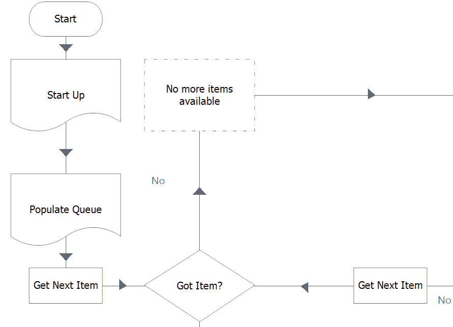

图 5.16 – 没有页面来检查已审查的预测

1.  打开任意的`主页面`。可以看到已添加了一个标签过滤器，以*不*选择任何带有**手动审查** **所需**标签的项目。

1.  看到在`主页面`上的工作队列名称被设置为**第五章** **示例** **2 队列**：

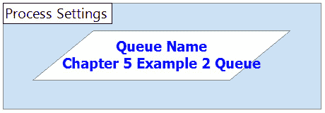

图 5.17 – 注意队列名称

1.  打开名为`更新状态和标签以进行手动审查`的页面。可以看到不再有任何将 Excel 文件写入磁盘的逻辑。还可以看到我们正在将需要 HITL 审查的项目标签设置为**手动** **审查所需**。

我们已经完成验证主流程不包含与 HITL 审核相关的逻辑。接下来，让我们看看这个设计的第二个进程，它包含将审核数据写入磁盘和检查完成审核的 IA 逻辑。

#### 检查审核预测的进程

第二个进程是使用标准的 BP 进程模板开发的。我们将看到所有关于 HITL 审核的逻辑都已移动到这个新进程中：

1.  在流程工作室的*Ch5*组下打开**示例 2B – 人工审核逻辑**流程。

1.  注意到`主页面`上的队列名称也设置为**第五章示例 2 队列**，与**示例 2A – 随机采样**进程中的工作队列相匹配。两个进程都从同一个队列工作。

1.  打开任何`主页面`。注意有一个标签过滤器，用于选择带有**需要人工审核**标签的项目。

1.  查看主页面上的工作块。有两个步骤。首先，审核数据写入共享文件夹。接下来，我们检查项目是否已移动到*完成*文件夹，这表示它已被审核。将这些步骤放入工作块中，使我们能够从异常中优雅地恢复，并从控制室重新尝试项目：

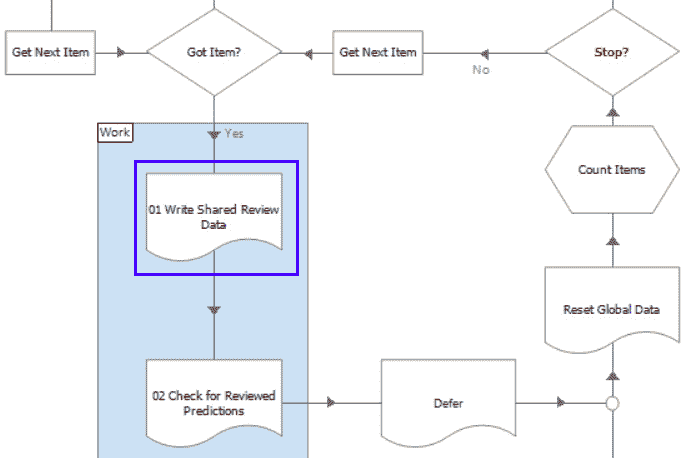

图 5.18 – 与审核逻辑相关的两个步骤在工作块中

1.  打开`02 检查已审核`的`预测`页面。

1.  定位到*更新项目*块。注意当项目被审核时，我们正在更新状态并移除标签。此页面上的剩余逻辑与共享文件夹文件管理相关：


图 5.19 – 更新项目的状态和标签

到目前为止，我们已经看到进程 1 不再包含 HITL 审核逻辑，并且两个进程共享相同的工作队列。进程 2 移除了`主页面`以跳过项目重试时的步骤。

#### 运行主流程

让我们运行主进程并检查工作队列。此进程随机生成 13 个项目以填充工作队列并执行机器学习预测。我们应该看到所有项目都将停止处理，等待人工审核：

1.  定位到*Ch5*文件夹，并在控制室中运行**示例 2A – 随机采样**。等待会话完成。

1.  查看第五章**示例 2 队列**的内容。注意所有 13 个项目都有**需要人工审核**的状态和标签，因为我们的随机采样率设置为 100%：


图 5.20 – 所有项目都需要人工审核状态

1.  打开 Windows 文件资源管理器，导航到在**Ch5 示例 2 审核文件夹路径**环境变量中定义的文件夹。检查此文件夹中是否有 Excel 文件。这是因为将审核文件写入磁盘的逻辑已移动到进程 2，而进程 2 尚未运行。

#### 运行 HITL 审查检查逻辑进程

第二个进程将审查数据写入共享文件夹并检查完成的审查。这应该与之前的进程**同时**运行。然而，为了方便使用 BP 试用版的读者，我们将按顺序运行进程。在这里，我们将在再次运行第二个进程之前审查 13 个预测中的 8 个：

1.  定位到*Ch5*组，并在控制室运行**示例 2B – 手动审查逻辑**进程。等待会话完成。

1.  打开 Windows 文件资源管理器，导航到在**Ch5 Example 2 待审查文件夹路径**环境变量中定义的文件夹。确认该文件夹中有三个 Excel 文件。其中两个 Excel 文件应有五个需要审查的项目（根据批量大小），一个文件应有三个，总共 13 个。注意项目 ID 不再作为文件中的列。

1.  将包含五个预测和一个包含三个预测的文件剪切并粘贴到在**Ch5 Example 2 完成审查文件夹路径**环境变量中定义的文件夹中。这模拟了审查员在完成两个 Excel 文件的审查后所做的工作，总共八个预测。

1.  再次在控制室运行**示例 2B – 手动审查逻辑**。等待会话完成。

1.  查看第**5 章**的**示例 2 队列**工作队列，以确认 8 个项目的状态被设置为**手动审查完成**并且已被取消标记：


图 5.21 – 八个项目已更新其状态并移除其标记

1.  打开 Windows 文件资源管理器，导航到在**Ch5 Example 2 完成审查文件夹路径**环境变量中定义的文件夹。验证该文件夹中不再有任何 Excel 文件。

到目前为止，有 8 个项目已被取消标记，这意味着它们可以被进程 1 的**获取下一个****项目**动作选中。

#### 再次运行主进程

我们将重新运行主进程并假装它从未停止过。虽然将创建 13 个新的工作队列项目，但我们更感兴趣的是看到之前运行中的 8 个项目被标记为**已完成**：

1.  再次在控制室运行**示例 2A – 随机抽样**。等待会话完成。

1.  查看第**5 章**的**示例 2 队列**内容。注意 26 个项目中有 8 个被标记为**已完成**。

在这个例子中，我们看到了如何将审查检查逻辑分离成它自己的进程，独立于主要业务逻辑。这有几个好处，包括促进可重用性，允许业务逻辑与审查检查逻辑独立扩展。通过消除向审查员暴露项目 ID 的需求，并将审查检查逻辑定位在异常处理块内，整体的数据传输设计鲁棒性也得到了提高。

现在，让我们从**多进程**、**单工作队列**的设计转向，探讨为什么我们可能想在 IA 中使用**多进程**和**多工作队列**。

# 多进程、多工作队列设计

添加新的进程和工作队列是向现有的 BP 解决方案**添加机器学习**的好方法，因为大部分原始设计和流程图可以保持不变。虽然添加更多的工作队列会导致整体设计更加复杂，但它们可以在审计等方面为我们提供一些细微的改进，因此值得考虑。

让我们来看看一个**两进程**、**两队列**的 IA 解决方案设计的优缺点，其中需要人工审核的工作队列项被保存在一个单独的工作队列中。

## 完全独立的人工审核

双进程、单工作队列设计的缺点之一是，由于对每个项目的重复检查，案例持续时间统计最终会更高。如果我们将所有需要审核的项目推入一个新的工作队列，我们就可以将处理业务逻辑所花费的时间与审核检查所花费的时间分开。  

这种**两**队列设计在以下图中展示。第一个进程执行业务逻辑，包括进行机器学习预测。如果一个项目需要人工审核，则只有与审核相关的**数据**会被推入工作队列 2。进程 2 将审核数据保存在审核界面中，并检查审核是否完成。如果审核完成，它将在工作队列 1 中更新项目状态，以便自动化处理可以继续：


图 5.22 – 双进程、双工作队列设计

### 功能性

这种设计的功能与多进程、单工作队列设计相同。我们可以将进程 1 的所有时间都用于执行业务逻辑，并且我们可以对两个进程进行**独立扩展**。添加新的工作队列不会影响功能。

### 可维护性

与双进程、单队列设计相比，这种设计实际上提高了可维护性。工作队列的添加导致了业务逻辑和 HITL 审核逻辑之间更加清晰的分离。

### 可操作性

新增工作队列最直接地影响了我们操作 IA 解决方案的方式。虽然能够隔离执行业务逻辑和人工审核逻辑所花费的时间是有用的，但报告和控制室操作可能会变得更加复杂。如果你想要查看一个项目完成所需的时间，包括审核逻辑时间，你需要在报告中将两个队列的案例持续时间相加。这实际上应该是对自动报告的一次性更改。控制器还需要在两个工作队列之间导航，同时记住**项目键**，以全面了解项目的状况，这会给操作带来不便。

### 优点

这种设计的主要好处，这在未来将变得越来越重要，是第二个工作队列使得**简化 HITL 审计**成为可能。由于我们只推送执行人工审核所需的最小数据量，因此可以轻松导出流程 2 的会话日志或工作队列数据，而不会暴露不必要的数据。如果我们需要频繁回答以下问题，我们应该强烈考虑实施这种流程设计：

+   机器学习预测的原始输入是什么？

+   谁进行了审核？

+   修订的标签是什么，为什么？

虽然现在可能看起来并不相关，但这些正是监管机构和法律法院会询问的问题，即机器学习预测是否对用户或客户造成了伤害或损害。

重要提示

如果使用 Windows 文件系统作为数据共享方法，你必须明确启用基于文件夹或文件的审计。这将生成安全事件，允许你找出哪个用户修改了文件（审核了预测）。

仅包含经过人工审核内容的隔离工作队列或会话日志数据可以轻松地**反馈给开发算法的数据科学家**。如果我们没有这个干净的校正数据源，我们就需要通过程序过滤会话日志并删除任何无关数据来生成它。这种设计的主要好处是简化了 HITL 审计，并使数据反馈给机器学习模型开发者成为可能。

最后，这种设计非常适合将现有的 RPA 流程转换为 IA 流程，因为现有的 RPA 设计可以基本保持不变。

### 缺点

大多数的负面因素是之前讨论过的操作不便。现在必须跨多个工作队列跟踪项目，报告变得更加复杂。

既然我们已经讨论了**两个**流程，**两个**工作队列的设计，让我们再进一步，将机器学习预测逻辑也分离出来。

## 将机器学习预测和人工审核分离到它们自己的流程和工作队列中

如果我们需要将简化审计扩展到**涵盖所有机器学习预测**，我们可以将机器学习算法调用步骤和数据移动到它们自己的流程和工作队列中。这将导致**三个**流程，**三个**工作队列的设计，如下面的图所示：


图 5.23 – 三流程，三工作队列设计

我们的第一流程和工作队列包含标准业务逻辑。所有需要做出的机器学习预测都被添加到工作队列 2，由流程 2 处理。流程 2 执行机器学习算法，生成预测，并决定是否需要人工审核。如果不需要人工审核，项目的状态将在工作队列 1 中更新，以便自动化处理继续。如果需要人工审核，项目将被推入工作队列 3。流程 3 创建 HITL 审核所需的数据，并在审核完成后在工作队列 1 中更新项目状态。

### 功能性、可维护性和可操作性

这些与两流程、两工作队列设计大致相同。

### 优点

与两流程、两工作队列设计相比，好处大致相同，但我们获得了对所有机器学习预测的额外**审计选项**。

### 缺点

这种设计与两流程、两工作队列设计存在相同的问题。根据业务需求，如果需要将多个工作队列的执行时间相加，报告可能会更复杂。控制器将更难跟踪三个不同工作队列中案件的情况。

接下来，让我们通过一个示例来查看这种三流程、三工作队列设计的实现。

### 示例 3 – 完全分离

在这个例子（基于一个真实的 IA 案例）中，我们正在自动化一个国家公用事业公司的客户索赔流程。每月处理 5,000 个索赔。当前的未自动化流程需要人工判断，并且有 25 种可能的客户索赔解决方案。

这个国家公用事业公司开发了一个机器学习推荐系统，显示前三个解决方案建议及其置信度分数。当前两个建议的置信度分数相差在 5%以内时，将触发人工审查。这是一种更复杂的**阈值**形式，其中预测标签之间存在依赖关系。

案例通过包含三个建议、它们的置信度水平、相关案例数据和客户数据的 Web 界面进行审查。由于该解决方案是为国家公用事业公司设计的，IA 团队希望走在法规的前面，并实施一个促进所有机器学习预测和人工审查审计的解决方案设计。

本例的目的是说明实现三流程、三工作队列设计所需逻辑。从高层次来看，我们将进行以下 11 个步骤：

1.  验证发布内容并配置环境变量。

1.  检查流程 1 的（业务逻辑）“主页面”。

1.  看看数据是如何推入机器学习队列（队列 2）的。

1.  检查流程 2 的（机器学习预测）“主页面”。

1.  检查流程 3 的（HITL 审查）“主页面”。

1.  运行流程 1 并查看控制室的结果。

1.  运行流程 2 并查看控制室的结果。

1.  运行流程 3 并查看控制室的结果。

1.  审查一个预测。

1.  再次运行流程 3 并查看控制室的结果。

1.  再次运行流程 1，并在控制室查看结果。

#### 验证发布内容并配置环境变量

让我们熟悉`.bprelease`并配置一个环境变量：

1.  确认已导入**三个**流程、**三个**工作队列和**三个**环境变量：


图 5.24 – 示例 3 的发布内容

1.  打开名为**Ch5 示例 3 完成审查文件夹路径**的环境变量。更改值以匹配您网络浏览器的默认下载文件夹。不要在文件夹名称末尾添加尾随斜杠。

#### 检查流程 1 的主页面

接下来，让我们看看第一个流程，它包含主要业务逻辑。这接近于添加任何 IA 组件的 RPA 流程的外观。我们将突出显示使此解决方案设计功能化的区域：

1.  在流程工作室的 *Ch5* 组中打开**示例 3A – IA 业务逻辑**。

1.  打开任何“主页面”。注意已添加了一个**标签过滤器**，以避免选择带有**等待机器学习预测**或**手动审查****必需**标签的项目：

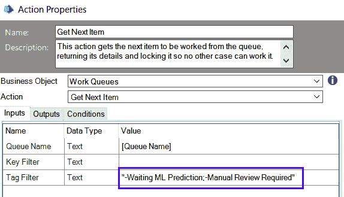

图 5.25 – 获取下一个项目在两个标签上的过滤器

1.  查看工作块。有一个名为“03 推送至队列 2”的页面，负责将此流程连接到执行所有机器学习预测的流程 2。所有执行路径都导向此页面，这意味着所有项目最终都将被推送到队列 2 进行机器学习预测：

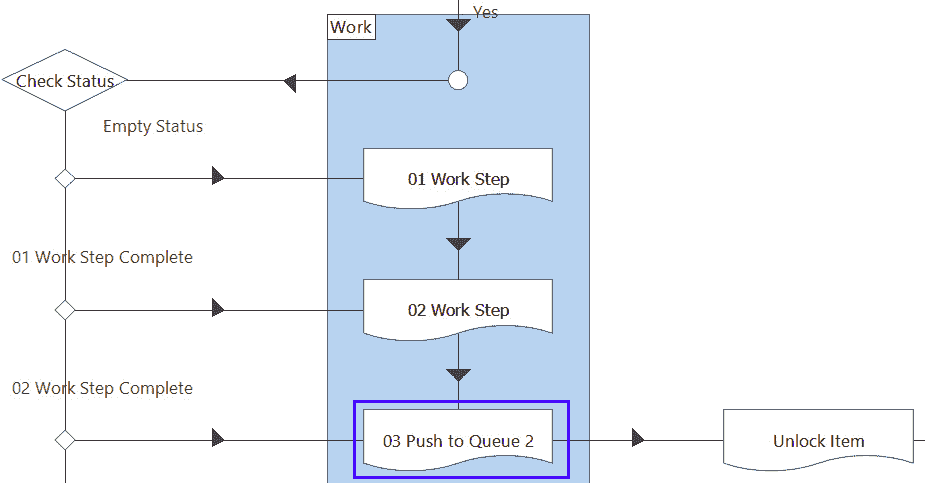

图 5.26 – 03 推送至队列 2 页面

1.  注意在“03 推送至队列 2”之后有一个“解锁项目”页面。

在这里，我们看到了在“获取下一个项目”中使用了标签过滤器，以便不选择需要手动审查或机器学习预测的项目。

接下来，让我们看看在“03 推送至队列 2”页面会发生什么。

#### 将项目推入机器学习工作队列

“03 推送至队列 2”页面在工作队列 2 中添加了一个新项目，**标记**了当前项目，并将对工作队列 2 中新创建项目的引用添加到当前项目的数据中：

1.  打开“03 推送至队列 2”页面。

1.  查看与开始连接的前三个动作。第一个动作将现有项目数据复制到一个新集合中，省略了与机器学习预测无关的任何数据。第二个动作将工作队列 1 的当前项目 ID 添加到这个新集合中。第三个动作将这个新集合添加到工作队列 2：

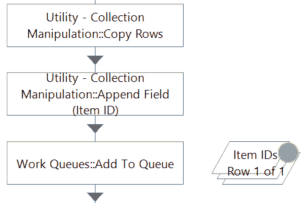

图 5.27 – 03 推送至队列 2 页面的前三个动作

1.  打开名为**工作队列::标记项目**的下一个动作。注意我们给当前项目添加了**等待机器学习预测**标签，这阻止了它在此流程中使用**获取下一个项目**被选中。此标签将在流程 2 中被移除。

流程 1 相对简单。仅对标准流程模板进行了少量修改，即在“获取下一个项目”中添加了*标签过滤器*，添加了一个新页面将项目推入工作队列 2，并解锁当前项目。

接下来，让我们看看机器学习预测流程本身。

#### 检查流程 2 的主页面

让我们快速查看流程 2 的 `Main` 页面，以了解在高级别上正在发生的逻辑。此流程负责运行机器学习预测并检查是否需要通过阈值检查进行 HITL 审查：

1.  在流程工作室的 *Ch5* 组中打开 **示例 3B – 机器学习预测**。

1.  查看主页面上的 *工作* 块中的前两个页面。`01 机器学习预测` 触发机器学习预测并将预测结果持久化到当前项目数据中。`02 检查手动审查` 包含检查两个最高置信度分数推荐解决方案之间的 *阈值* 的逻辑。这两个页面与我们在前面的示例中看到的逻辑类似：

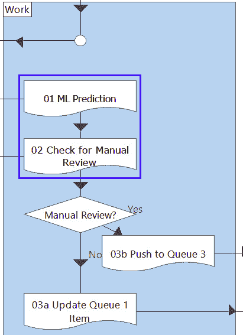

图 5.28 – 流程 2 工作块中的前两个页面

1.  查看名为 `03a 更新队列 1 项目` 的页面。当不需要 HITL 审查时运行。在此页面中，我们尝试锁定工作队列 1 中等效的项目，更新其状态，并移除标签。这允许流程 1 继续处理此项目。

1.  查看名为 `03b 推送到队列 3` 的页面。当需要 HITL 审查时运行。此页面包含创建队列 3 项目所需的逻辑。它与流程 1 中将项目推送到工作队列 2 所做的操作大致相同。

#### 检查流程 3 的主页面

最后，让我们从高级别看一下我们的第三个流程，该流程负责为审阅者保存 `.html` 文件，以及检查完成的审查：

1.  在流程工作室的 *Ch5* 组中打开 **示例 3C – 手动审查逻辑**。

1.  注意到主页面上的 *工作* 块只有两个页面。没有选择阶段和状态检查以跳过步骤，因为我们希望能够在文件缺失时重新创建 `.html` 文件：


图 5.29 – 流程 3 工作块中的两个页面

1.  查看名为 `01 编写共享审查数据` 的页面。该页面将输入数据写入机器学习算法，并将三个预测结果使用查找/替换功能写入一个 .html 文件。一旦文件保存到由 **Ch5 示例 3 审查文件夹路径** 环境变量指定的共享位置，该文件路径就会被保存到当前项目的数据中。这使我们能够检查文件是否存在，并在必要时重新创建它。

1.  查看名为 `02 检查已审查预测` 的页面。该页面检查是否在由 **Ch5 示例 3 已完成审查文件夹路径** 环境变量指定的位置存在 `.txt` 文件。如果是，我们尝试锁定工作队列 1 中等效的项目，更新其状态，并移除标签。这允许流程 1 在使用 **获取下一个项目** 后继续处理此项目。

1.  查看紧随“*项目审查完成？* 决策阶段”的两个页面。根据项目是否手动审查，我们要么推迟项目，要么将其标记为已完成。

在检查这个解决方案的三个进程之后，我们应该注意到，与本章早期示例相比，这里实际上没有什么真正的新内容。然而，我们已经将解决方案结构化，使得三个不同的关注点——业务逻辑、ML 预测逻辑和 HITL 审查逻辑——保持相对独立。

工作队列之间的通信是通过将其他队列的项目 ID 持久化到我们的项目数据中实现的。这允许我们锁定并更新包含主要业务流程的进程 1 的项目标签和状态。

现在，让我们运行示例进程。

#### 运行主进程

我们需要在控制室运行三个进程来完成我们的示例。我们将运行的下一个主要进程将随机生成 10 个项目以填充工作队列。填充后，每个项目都应该设置状态和标签，以便我们可以在继续之前等待 ML 预测：

1.  在控制室中的*Ch5*组运行**示例 3A – IA 业务逻辑**。等待会话完成。

1.  在**队列管理**下查看*第五章* *示例 3 队列 1*的内容。您会看到所有 10 个项目都有**等待 ML** **预测**标签：

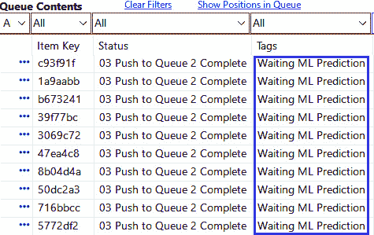

图 5.30 – 队列 1 中的所有项目正在等待 ML 预测

1.  在**队列管理**下查看`第五章` `示例 3 队列 2`的内容。这个队列中应该有 10 个项目，与队列 1 中的项目键相同。

项目现在正在等待进程 2 运行。

#### 运行 ML 进程

我们需要运行的第二个进程生成 ML 预测并确定哪些项目需要 HITL 审查。工作队列 1、2 和 3 都由这个进程修改：

1.  在控制室中的*Ch5*组运行**示例 3B – ML 预测**。等待会话完成。

1.  在**队列管理**下查看*第五章* *示例 3 队列 2*的内容。您会看到所有 10 个项目已完成他们的 ML 预测：

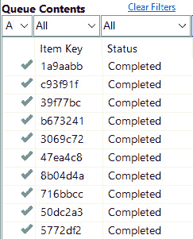

图 5.31 – 队列 2 中的所有项目已完成 ML 预测

1.  在**队列管理**下查看*第五章* *示例 3 队列 1*的内容。您会看到一些项目需要 HITL 审查。请注意，这确实是随机的。如果您没有看到任何需要审查的项目，请再次运行进程 1 和进程 2。计算需要审查的项目数量。在以下图中，它是两个：

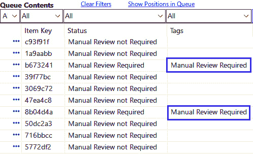

图 5.32 – 队列 1 中的一些项目应该需要人工审查

1.  在**队列管理**下查看*第五章* *示例 3 队列 3*的内容。这个队列中的项目数量应该与*步骤 3*中计数的一样（两个）。您还可以根据项目键比较这两个队列：

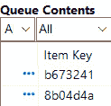

图 5.33 – 需要手动审查的项目在队列 1 中也应在队列 3 中

#### 运行 HITL 审查流程

现在，让我们运行最后一个流程。此流程生成审查数据并检查审查是否完成。如果是，它将更新工作队列 1 中的项目，以便它可以继续自动化处理：

1.  在控制室中的*Ch5*组中运行**示例 3C – 手动审查逻辑**。等待会话完成。此流程将遍历所有需要审查的项目，创建它们的审查文件，并检查审查是否完成。

1.  在文件夹中打开由`.html`文件定义的文件夹，应该与*第五章* *示例 3 队列 1*中的项目数量相同（本例中为两个）。

#### 手动审查一个文件

让我们通过打开一个审查文件并提交网页表单来审查一个预测。此网页表单将尝试将.txt 文件保存到由**Ch5 Example 3 完成审查文件夹路径**环境变量指定的位置：

1.  选择一个`.html`文件并在您的网页浏览器中打开它。

1.  滚动到网页底部，从下拉列表中选择一个随机的**决议**，然后按下**提交已审查**的**预测**按钮：

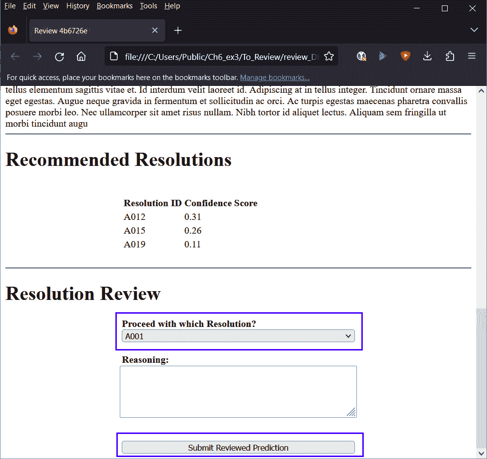

图 5.34 – 手动审查项目

1.  如果出现**另存为**对话框，请保存文件。确保您保存文件的文件夹与**Ch5 Example 3 完成审查文件夹路径**环境变量的值匹配。不要重命名文件。如果您的浏览器设置为自动下载文件，则可能不会出现**另存为**对话框。

#### 再次运行 HITL 审查流程

现在我们已经审查了一个预测，我们可以再次运行第三个流程（这将发现其中一个项目有一个匹配的.txt 文件，并通过移除标签来更新工作队列 1 中的该项目，以便它可以被流程 1 的获取下一个项目所获取）：

1.  在控制室中的*Ch5*组中运行**示例 3C – 手动审查逻辑**。等待会话完成。

1.  在**队列管理**下查看*第五章* *示例 3 队列 3*的内容。其中一个项目应被标记为**完成**：


图 5.35 – 队列 3 中的一个项目已被标记为已完成

1.  在**队列管理**下查看*第五章* *示例 3 队列 1*的内容。具有相同项目键的项目应有一个**手动审查完成**的状态和没有标签：


图 5.36 – 队列 1 中的相同项目应有一个更新的状态和没有标签

#### 再次运行主流程

在此示例中的最后一步是再次运行主流程（请注意，将有 10 个新项目添加到队列 1 和队列 2；我们预计除了标记为**需要手动****审查**的项目外，所有来自上次会话运行的项目都将完成）：。

1.  在控制室中的**Ch5**组中运行**示例 3A – IA 业务逻辑**。等待会话完成。

1.  在**队列管理**下查看*第五章* **示例 3 队列 1**的内容。您会看到在原始会话中添加的所有项目都被标记为**完成**，除了那些标记为**需要手动****审查**的项目。

我们已经完成了**示例 3**。在这个示例中，我们经历了一个**三**流程、**三**工作队列的设计，将机器学习逻辑和 HITL 审查逻辑分别放入它们自己的流程和工作队列中。进程间通信由标签过滤器、状态和引用其他队列中等效的项目 ID 来处理。

此类设计的主要优点是简化了可审计性以及不同 IA 关注点的独立扩展。我们不会走通过导出会话日志的过场，但可以清楚地看到，在客户（或监管机构）对他们的索赔选择的解决方案提出投诉的情况下，我们可以选择性地仅导出机器学习或 HITL 审查日志。

# 设计比较

我们已经介绍了五种不同的 IA 设计，这些设计在流程和工作队列的数量方面有所不同。让我们回顾这些设计，以了解为什么我们可能想要选择一种设计而不是另一种设计。请记住，没有哪种设计比其他设计更好或更差。这关乎它是否适合您的用例、开发人员的技能水平以及 IA 初始化的整体成熟度。

## 设计 1 – 异步审查（一个流程，一个工作队列）

此自包含设计允许人类审查无限期延迟。流程通过在项目上执行工作并检查已审查预测的周期交替。完成的审查检查是通过查询数据共享位置来完成的，而不是通过循环遍历每个待审查的项目。

由于所有内容都在单个流程和工作队列中，因此它非常适合可用的并发会话数量有限或工作量较低的场景。控制室的管理开销也较低。对于新开发团队来说，维护/更新单个流程可能更简单。

如果检查已审查预测需要很长时间才能执行或容易抛出异常，则此设计不太合适。这是因为检查逻辑位于主工作块之外。

## 设计 2 – 同步（轮询）审查（一个流程，一个工作队列）

当需要停止并等待 HITL 审查完成时，应使用此设计。如果未在规定时间内进行人工审查，项目将被标记为异常。由于每个项目都会暂停并等待人工审查，因此此设计的整体案件吞吐量最低。否则，它具有与异步设计相似的优势/劣势。

## 设计 3 – 独立的 HITL 审查逻辑（两个流程，一个工作队列）

此设计将 HITL 审查逻辑拆分为一个单独的流程，同时保持相同的工作队列。此设计的主要优点是，业务逻辑和审查检查可以在会话运行方面独立扩展。在我看来，可维护性也得到了提高。

此设计遍历所有需要人工审查的工作队列项目，而不是在数据共享接口处循环。这允许在缺少审查记录时重新创建它们。这也增加了单个案件的总工作时间，使统计数据看起来更差。

由于存在两个 BP 流程，我们需要至少两个会话来运行此解决方案。如果会话运行审查逻辑流程不频繁，即使审查员有空闲时间工作，数据共享记录也不会及时创建。完成人工审查的项目也依赖于审查检查流程的频繁运行，以便项目可以更新其状态并继续自动化处理。

最后，与单流程解决方案相比，调度更为复杂，尽管这不应该对经验丰富的控制器造成问题。

## 设计 4 – 完全独立的 HITL 审查（两个流程，两个工作队列）

在设计 3 的基础上，我们可以通过将需要人工审查的项目推入单独的工作队列来进一步分离人工审查部分。这使我们能够隔离案件统计信息，将执行审查逻辑（将数据保存以供审查员共享并检查完成的审查）的时间与执行业务逻辑的时间分开。在隔离这些统计信息时做出的权衡是，我们可能希望有一个端到端的时间视图。这需要将两个工作队列的案件时间相加。从操作角度来看，添加另一个工作队列会使控制器在控制室中跟踪案件变得更加困难。

最值得注意的是，添加新的工作队列增加了审查内容的可审计性，并允许这些数据更容易地反馈给数据科学团队，以便改进机器学习算法。通过添加机器学习，此设计也是扩展现有 RPA 流程的好方法。除了这些要点外，此设计具有与设计 3 相似的优势和劣势。

## 设计 5 – 完全分离（三个流程，三个工作队列）

我们最终的设计建立在设计 4 的基础上。它将所有 ML 逻辑（做出预测和检查是否需要 HITL 审查）放入一个新的流程，并将数据放入单独的工作队列。因此，我们获得了一种简单的方式来审计所有 ML 预测。除此之外，我们还有与设计 3 和 4 相似的优势和劣势。

# 摘要

在本章中，我们探讨了五种 IA 设计，这些设计在 BP 流程和工作队列的数量方面有所不同。确定流程和工作队列的数量对于 IA 和通用 RPA 设计都极为重要，因为它几乎影响剩余解决方案的各个方面。这包括潜在的扩展性、案例报告统计、可维护性、日志记录、可审计性、调度以及其他控制室操作。

两种 IA 设计包含单个流程和单个工作队列。一种设计用于同步审查，另一种设计用于异步审查。在我们的第三种设计中，我们将处理 HITL 审查的逻辑分离成独立的流程，从而形成两个流程、一个工作队列的设计。这允许提高重用性，并分别对业务逻辑和 HITL 审查逻辑进行扩展。对于第四种设计，我们添加了一个新的工作队列来存储所有需要人工审查的项目。这提供了一个更简单的审计轨迹，其中人类纠正了预测。这也使我们能够更容易地将这些纠正后的预测反馈给机器学习团队。最后，我们的第五种设计进一步将所有 ML 调用逻辑分离成独立的工作队列和流程，增强了可扩展性并简化了所有 ML 预测的审计。

在下一章中，我们将讨论一些较小的设计元素，这些元素补充了本章学习的基础上选择的大规模流程/工作队列结构。这些元素，例如环境变量、会话变量和凭证，可以改善整体 IA 解决方案的管理和操作。
