# 第十一章：处理退款

在本章中，我们将检查一个场景，目的是巩固本书中提出的概念。这包括如何选择使用哪个 IA 模板开始开发、审计、紧急停止开关等。我们将分析用例的 ML 需求，设计解决方案，并实现解决方案的结构。

本章使用的场景是基于在线零售商的*真实生活*用例。这家零售商希望自动化通过电子邮件收到的退款请求的批准。这个用例包含*多个 ML 模型*，其中一个是内部开发的，其他则不是。我们之前只讨论过只有一个 ML 模型的流程解决方案设计，但我们将看到我们可以将本书中提出的设计和模板扩展到多个模型。

IA 团队正在构建一个解决方案来处理发送到在线零售商客户服务电子邮件的退款请求。业务希望使用 ML 来确定电子邮件是否请求启动退款。如果是这样，案件将继续处理。

接下来，业务用户希望从电子邮件中提取有用的实体，例如订单号和项目成本。如果这些数据以足够的置信度提取，同时满足其他业务标准，则退款请求将自动处理。

如果自动退款请求成功，业务用户将使用生成式 AI 创建一封电子邮件回复发送给客户。公司已经开发了一个用于生成式 AI 模型的提示。公司有一个战略计划，即使用更多 AI 技术并显得技术创新。那些电子邮件退款请求自动批准的客户将被告知，他们的案件是通过自动化和 AI 完成的。

客户支持团队有一个 SLA，在收到电子邮件后的 48 小时内提供第一个客户响应（不是解决方案）。他们希望 IA 解决方案能够在 48 小时内为部分退款请求提供完整的解决方案。

在本章中，我们的角色是 IA 团队中的解决方案设计师和开发者。我们将涵盖以下主要主题：

+   ML 模型背景信息

+   解决方案设计

+   实现

重要提示

本章的示例主要关注设计和实现 IA 解决方案的*结构*。关于正常业务逻辑的细节没有讨论。完整的解决方案，包括 ML API 调用，也不会实现，因为这些细节很容易实现，并且在前面章节中已经介绍过。

# 技术要求

IA 流程模板在第*第七章*中进行了讨论。如果您还没有阅读该章节，请从[`github.com/PacktPublishing/Intelligent-Automation-with-Blue-Prism/tree/main/ch7`](https://github.com/PacktPublishing/Intelligent-Automation-with-Blue-Prism/tree/main/ch7)下载并导入`.bprelease`文件。该章节中的示例将基于其中一个模板。

# ML 模型背景信息

此场景使用三个 ML 模型：一个**电子邮件分类器（EC**），一个**实体识别模型（ER**），以及**生成式 AI（GAI**）。在设计解决方案之前，我们需要了解 ML 模型的一些特定特征。IA 团队与业务用户、数据科学团队和 ML 供应商的文档合作，以回答以下问题：

+   谁开发和维护模型？

+   ML 模型的消费和部署方法是什么？

+   是否需要对 ML 模型进行审计？

+   ML 预测的估计量是多少？

+   HITL 审查的标准是什么？

    +   审查的 SLA 是什么？

    +   是否需要对 HITL 审查进行审计？

    +   将使用什么界面来审查预测？

## EC 模型

业务只想确定一封电子邮件是否请求退款。他们不需要预测其他电子邮件类别，如产品咨询和投诉。在与内部数据科学团队讨论后，他们决定开发一个*二元分类模型*，该模型可以预测*退款请求*和*非退款请求*。

### 消费和部署方法

EC 模型将在内网上托管并通过 HTTP API 调用。由于该模型尚未开发，IA 团队要求 ML 运维团队使用*蓝绿*风格的部署。IA 团队希望给自己留出在需要时进行无停机回滚模型的选择。IA 团队还要求 API 响应中返回一个模型版本，以防他们需要将其存储以供审计目的。数据科学团队同意这些请求。

### 预测量

在采访客户支持人员后，我们发现他们每天收到约 500 封电子邮件，其中 70 封是退款请求。客户支持团队估计，在 70 封退款请求中，大约有 20 封符合自动批准所需的条件。

### HITL 审查、界面和 SLA

从之前对电子邮件进行分类的经验来看，数据科学团队预计二元分类器的准确性非常高。因此，团队决定不要求进行 HITL 审查，而是*随机抽取 5%*的预测（大约每天 25 个）来验证模型是否随着时间的推移正确执行。客户支持团队的员工将在他们的常规任务之外进行这些审查。IA 团队决定使 EC 预测审查*非阻塞*，这意味着我们不会等待审查完成就继续自动化处理。

审查的界面是将客户的电子邮件转发到一个新创建的电子邮件分发列表，该列表将由客户支持监控。审阅者只需简单地回复电子邮件，用*Y*表示这是一份退款请求，或用*N*表示这不是。

### ML 审计

由于模型将由数据科学团队维护，预测输入和输出日志将从 API web 服务器可用。数据科学团队同意将日志保留六个月，这意味着我们有权决定是否希望在 BP 中也保留日志副本以方便使用。

让我们讨论下一个用于从电子邮件中提取数据的模型。

## 实体识别模型

**实体识别**（**ER**）ML 模型需要从电子邮件文本中识别订单号或产品名称和价格，以便继续处理。IA 团队发现，经过测试一些在线商业产品后，有许多现成的服务可以提取所需的数据。

### 消费和部署方法

IA 团队决定使用托管在他们已有关系的云提供商上的预训练模型。由于我们选择了一个通用的托管 ML 解决方案，我们无法控制模型何时更新。我们需要积极监控供应商网站，以查看是否有新模型可用。此模型的 API 端点是*版本化的*，这意味着我们可以根据需要在不同版本的 ER 模型之间切换。

### 预测量

当认为一封电子邮件是退款请求时，仅在使用 EC 模型之后才使用 ER 模型。客户支持给我们提供了一个大致的预期，每天大约有~70 个预测。在考虑使用此 API 的成本后，治理委员会决定这仍然值得追求。

### HITL 审查、界面和 SLA

由于 ER 返回*多个*标签和置信度水平，我们决定使用具有多个条件的阈值方案。在从客户支持获得历史退款请求电子邮件后，我们进行实验以确定 ER 模型预测的 HITL 审查的适当阈值值。

首先，如果我们提取的订单 ID 的置信度低于 97%，则需要手动审查。接下来，我们审查产品名称或价格置信度低于 93%的预测。最后，我们审查所有置信度无论高低，但提取的价格高于$300 的预测。由于审查方法复杂，需要纠正多个标签，团队决定通过自定义构建的 Web 界面向审阅者展示审查数据。

由于我们旨在在 48 小时内解决案件，团队暂定决定审查 SLA 为 24 小时。

### ML 审计

由于 ER 模型是第三方 API，IA 团队需要在 BP 中跟踪预测输入、输出和模型版本。虽然我们可以访问云门户的仪表板来查看历史使用记录，但这些记录隐藏在比从 BP 内部查找数据更复杂的不同审批流程之后。

ER 模型的讨论已经完成。接下来，我们将讨论第三个 ML 模型，即生成式 AI。

## 生成式 AI 模型

客户服务团队希望使用 GAI 为客户自动批准的退款请求创建电子邮件回复。虽然我们可以简单地使用电子邮件模板，但公司希望向客户和投资者保持其以技术为中心和前瞻性的形象。

### 消费和部署方法

由于 IA 团队无法获得足够的 GPU 处理能力以内部开发 GAI 模型，团队决定使用托管 API 解决方案。通过查看 API 文档，我们发现供应商使用了一种*持续模型升级方案*。这意味着 API 端点背后的模型正在不断更新，并且更新不会通知客户。API 响应中返回的确切模型版本，但我们无法明确调用模型的旧版本。这使得模型版本并不那么有用，因为我们只能调用最新版本的模型。发送给 GAI API 的提示将为每位客户相同。

### 预测量

预计每天将发送 20 封电子邮件。在考虑这些成本后，该用例仍然被认为是可行的。

### HITL 审查、界面和 SLA

客户支持团队已经测试了第三方 GAI 服务，并对生成的电子邮件响应感到满意。公司还创建了一个静态免责声明，该声明将在 GAI 响应之后附加到每封电子邮件的底部。这是为了在 GAI 文本不清晰的情况下消除歧义。这个免责声明将清楚地告知客户，他们的退款案例已自动处理并获得批准，并且电子邮件文本是 AI 生成的。正因为如此，团队不打算审查任何由 GAI 生成的电子邮件。选择 GAI 的一个因素是它带来了积极的客户结果，这本质上风险较低。

### 机器学习审计

生成的电子邮件消息必须通过 CRM 系统发送给客户，而不是直接通过邮件服务器。客户收到的电子邮件副本始终可以通过 CRM 找到。由于业务团队不打算更改提示，IA 团队决定保留每个 API 调用的输入副本是不必要的。尽管模型版本在预测响应中返回，但我们实际上无法指定我们想要调用的模型版本。我们可以决定是否要存储模型版本，尽管这并不特别有用。

现在我们已经收集了关于三个机器学习模型的信息，以便制定解决方案设计。

## 机器学习模型总结

与解决方案的设计和实施相关的机器学习模型特性的总结如下：

| **模型** | **部署方法** | **HITL 审查标准** | **HITL 审查界面** | **HITL 审查 SLA** | **机器学习审计** |
| --- | --- | --- | --- | --- | --- |
| EC | 蓝绿 API | 随机抽样，5% | 邮件 | N/A | 在 API 服务器上 |
| ER | 未知，但 API 已版本化 | 基于多个条件的阈值 | 网站 | 24 小时 | 在 IA 解决方案中 |
| GAI | 持续的，API 响应包含模型版本 | N/A | N/A | N/A | 在客户支持系统中 |

表 11.1：机器学习模型特性的总结

在了解机器学习模型的信息后，我们可以开始我们的解决方案设计。

# 解决方案设计

我们需要考虑为我们的解决方案选择多少个进程和工作队列是合适的。回想一下*第五章*，一个机器学习解决方案可以为机器学习模型和 HITL 审查分别有一个独立的进程/工作队列。让我们分别查看每个机器学习模型，以确定是否需要额外的进程和工作队列。

## 邮件分类模型

EC 机器学习模型的日志可以直接从本地 API 服务器访问，因此从日志记录的角度来看，没有必要将它们保存在单独的工作队列中。也没有必要从主进程独立扩展机器学习预测。因此，IA 团队决定 EC 机器学习模型不需要独立的进程和工作队列。

接下来，IA 团队考虑 HITL 审查要求。每天大约随机抽取 25 封邮件进行审查。由于模型是在内部开发的，因此将修正后的预测发送回数据科学家以改进模型是有意义的。团队决定为 EC 模型的 HITL 审查部分设置一个*独立的进程和工作队列*。

## 实体识别模型

由于 ER 模型是外部 API，并执行整体业务流程的关键部分，我们希望记录模型的输入和输出审计轨迹。这导致我们设计了一个方案，其中*ER 模型的预测有一个独立的进程和* *工作队列*。

审查方法也很复杂，需要自定义开发的 Web 界面。我们希望控制用于审查的共享数据创建，并审计对预测的人为修正。出于这些原因，我们决定为 ER 模型的 HITL 审查部分设置一个*独立的进程和工作队列*。

## 生成式 AI 模型

由于提示是静态的，因此不需要在日志中跟踪 GAI 模型的输入。API 响应（电子邮件文本）也将保存在客户支持系统中，因此不需要从 BP 进行 ML 预测结果的审计。由于将随 GAI 生成的电子邮件发送一些模板文本，这降低了误解电子邮件的可能性，因此也不需要 HITL。IA 团队决定**不在解决方案的 GAI 部分有单独的流程和工作队列**。

## 解决方案设计图

总体而言，机器学习部分的 BP 解决方案设计看起来如下。

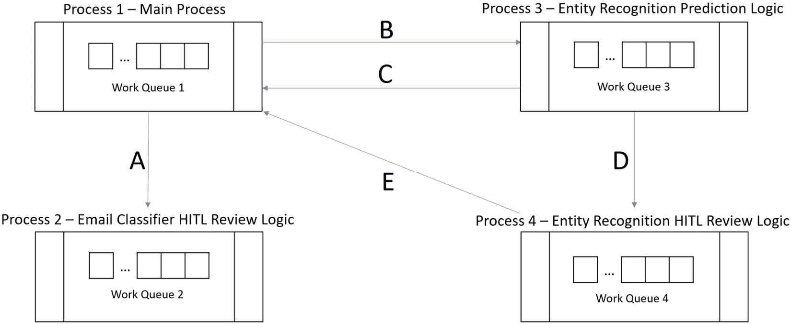

图 11.1：解决方案流程和工作队列的示意图

流程 1 是主要流程，其中包含业务逻辑以及调用 EC 和 GAI 模型的阶段。在 EC 预测完成后，随机抽取的项目被添加到工作队列 2（A）。由于审查是非阻塞的，因此可以安排流程 2 在非高峰时段运行，以检查电子邮件收件箱中关于*Y*和*N*的回复。

对于预测为退款请求的电子邮件，处理将继续，直到我们需要使用 ER 模型进行预测。处理暂停，并将输入数据添加到工作队列 3（B）。如果 ER 预测不需要人工审查（C），项目将在流程 1 中继续其工作。如果 ER 预测需要审查，它将被添加到工作队列 4（D）。一旦 ER 预测的 HITL 审查完成，项目的状态将在队列 1（E）中更新，以便处理可以继续。

# 实现

在根据上述三个模型的特点完成 IA 解决方案设计后，开发者开始构建解决方案的整体结构，从 IA 模板开始。

## 示例 1 – 从 IA 模板创建解决方案结构

我们不想直接进入业务逻辑和对象的开发，而是想创建解决方案设计结构，以确保不同流程和工作队列之间的协调按预期进行。在这个例子中，我们将从九个高级步骤构建解决方案结构：

1.  使用来自*第七章*中的一个模板的**另存为**来创建整体流程结构。

1.  创建工作队列。

1.  在每个流程的`主页`上更改数据项和**获取下一个项目**，以便引用新创建的工作队列。

1.  修改我们的解决方案的流程 1，以添加直接调用 EC 和 GAI ML 模型预测相关的页面。

1.  在每个流程的`IA 数据`页面更改数据项，这些数据项存储用于在解决方案的不同工作队列中保持项目数据一致性的标签、状态和项目数据字段。

1.  在流程 **01 - 处理退款** 中的 `IA 数据` 页面数据项中查找并替换，以修复一些对已重命名数据项的损坏引用。通过手动方式修复剩余问题。

1.  在流程 **02 – 邮件分类器 HITL 审查** 中的 `IA 数据` 页面数据项中查找并替换，以修复对已重命名数据项的损坏引用。删除在审查完成后更新工作队列 1 的不需要的逻辑。

1.  在流程 **03 – 实体识别** 中查找并替换 `IA 数据` 页面的数据项，以修复对已重命名数据项的损坏引用。通过手动方式修复剩余问题。

1.  在流程 **04 – 实体识别 HITL 审查** 中查找并替换 `IA 数据` 页面的数据项。

让我们从保存模板为新流程开始。

### 将模板“流程”保存为新的“流程”

如果查看 *图 11*.1*，我们的解决方案基本上是第七章中的模板 3 (*第七章*，增加了两次 HITL 审查流程和队列。让我们打开相关的流程模板并将它们保存为新流程：

1.  导航到 BP 的工作室部分。在流程下创建一个名为 *Ch11* 的新组。

1.  展开导航到 *Ch7* | *IA 模板 3 - 3 流程 3* *队列* 组。

1.  打开 **01 - 业务逻辑** 流程。使用 *文件* | *另存为* 将其保存为名为 **01 - 处理退款** 的新流程，位于 *Ch11* 组中。关闭生成的流程工作室窗口。

1.  打开 **02 - ML 预测** 流程。使用 *文件* | *另存为* 将其保存为名为 **03 - 实体识别** 的新流程（注意从 02 到 03 的重命名），位于 *Ch11* 组中。关闭生成的流程工作室窗口。

1.  打开 **03 - HITL 审查** 流程。使用 *文件* | *另存为* 将其保存为名为 **04 - 实体识别 HITL 审查** 的新流程（注意从 03 到 04 的重命名），位于 *Ch11* 组中。保持流程工作室窗口打开。

1.  在 **04 - 实体识别 HITL 审查** 流程仍然打开的情况下，使用 *文件* | *另存为* 将其保存为名为 **02 - 邮件分类器 HITL 审查** 的新流程，位于 *Ch11* 组中。关闭生成的流程工作室窗口。

1.  验证你的 *Ch11* 组包含以下四个流程：

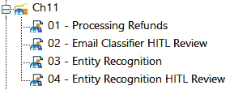

图 11.2：Ch11 组中流程的内容

### 创建工作队列

创建一个功能解决方案结构的下一步是创建四个工作队列：

1.  导航到 BP 的 *系统* | *工作流* | *工作队列* 区域。

1.  右键单击 *队列* 区域并创建一个名为 *Ch11* 的新组。

1.  在 *Ch11* 组内创建四个工作队列。将队列名称与 *图 11*.2* 中显示的流程名称相同。暂时将键名称保留为 *字段 1*。

1.  验证工作队列中的 *Ch11* 组看起来如下：

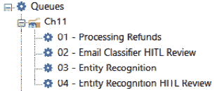

图 11.3：Ch11 组中工作队列的内容

我们已经完成了工作队列和过程解决方案结构的创建。接下来，我们需要更改处理过程以匹配 *图 11*.1* 中的解决方案图。

### 修改模板的工作队列数据项

在 *图 11*.1* 的解决方案图中，箭头显示了每个处理过程需要与之交互的工作队列。对于每个处理过程，我们需要创建一个数据项，引用它有 *出向箭头* 的每个工作队列，以及它自己的工作队列。每个处理过程 `主页面` 所需的数据项完整列表如下表所示：

| **过程名称** | **数据项名称** | **数据项初始值** |
| --- | --- | --- |
| **01 -** **处理退款** | 队列名称 | **01 -** **处理退款** |
| **01 -** **处理退款** | 队列名称 2 | **02 - 邮件分类器** **HITL 审查** |
| **01 -** **处理退款** | 队列名称 3 | **03 -** **实体识别** |
| **02 - 邮件分类器** **HITL 审查** | 队列名称 2 | **02 - 邮件分类器** **HITL 审查** |
| **03 -** **实体识别** | 队列名称 | **01 -** **处理退款** |
| **03 -** **实体识别** | 队列名称 3 | **03 -** **实体识别** |
| **03 -** **实体识别** | 队列名称 4 | **04 - 实体识别** **HITL 审查** |
| **04 - 实体识别** **HITL 审查** | 队列名称 | **01 -** **处理退款** |
| **04 - 实体识别** **HITL 审查** | 队列名称 4 | **04 - 实体识别** **HITL 审查** |

表 11.2：存储工作队列名称所需的数据项

让我们编辑每个处理过程以使用正确的队列：

1.  在过程工作室中打开 **01 - 处理退款** 处理过程。

1.  导航到 `主页面`。

1.  修改 *过程设置* 块中的数据项以匹配 *表 11.2* 的第 1 - 3 行。确保数据项的 *在过程的其他页面中隐藏* 复选框未被勾选。

1.  修改 *两个* **获取下一个项目** 阶段，使它们使用与当前处理过程同名队列。对于 **01 - 处理退款**，将 *队列名称* 设置为 **[****队列名称]**。

1.  对其他三个处理过程重复 *步骤 1 - 4*。对于 *步骤 3*，使用 Process 2 的第 4 行，Process 3 的第 5 - 7 行，以及 Process 4 的第 8 - 9 行。对于 *步骤 4*，使用 **[队列名称 2]** 作为 Process 2，**[队列名称 3]** 作为 Process 3，以及 **[队列名称 4]** 作为 Process 4。

1.  验证对于 **01 - 处理退款** 处理过程，你有以下内容：

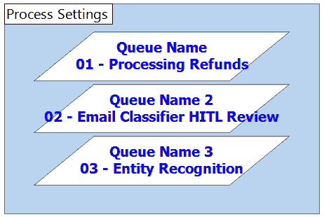

图 11.4：处理 1 的三个队列数据项

对于 **02 - 邮件分类器 HITL 审查** 处理过程，你应该有如下内容：

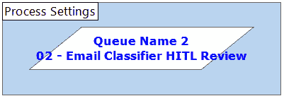

图 11.5：处理 2 的队列数据项

对于 **03 - 实体识别** 处理过程，你应该有如下内容：

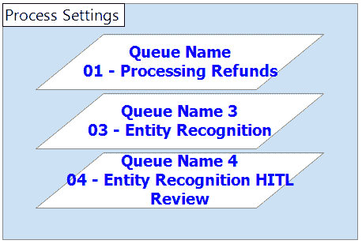

图 11.6：处理 3 的三个队列数据项

对于**04 - 实体识别 HITL 审查**过程，你应该有如下内容：

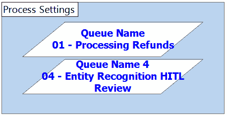

图 11.7：过程 4 的两个队列数据项

确保保存过程，以免丢失更改。接下来，让我们将缺少的机器学习逻辑页面添加到**01 - 处理退款**过程中，因为我们需要调用一些模板中不存在的额外机器学习预测。

### 将缺少的机器学习页面添加到 01 - 处理退款

我们首先通过克隆*IA 模板 3*开始了这个示例。该模板没有让过程 1 直接进行任何机器学习预测。然而，我们的解决方案需要过程 1 直接使用 EC 和 GAI 模型进行预测。我们的解决方案还需要随机采样 EC 模型。最后，我们还需要将数据推入两个队列而不是一个。让我们通过克隆其他模板中的现有页面来将这些更改添加到过程 1 中：

1.  在过程工作室中打开**03 - 实体识别**过程。

1.  右键单击`01 机器学习预测`页面标签并选择**复制**。

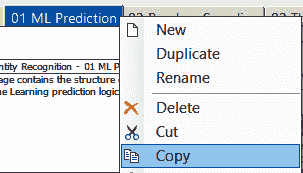

图 11.8：在过程 3 中右键单击 01 机器学习预测页面并选择复制

1.  在过程工作室中打开**01 - 处理退款**过程。

1.  右键单击`主页面`标签并选择**粘贴**。

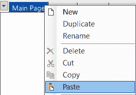

图 11.9：在过程 1 中右键单击主页面并选择粘贴

1.  将新粘贴的页面重命名为**02a 电子邮件** **分类器预测**。

1.  右键单击`主页面`标签并再次选择**粘贴**。

1.  将新粘贴的页面重命名为**05 生成式** **AI 预测**。

1.  在过程工作室中切换回**03 - 实体识别**过程。

1.  右键单击`02 随机采样`页面标签并选择**复制**。

1.  在过程工作室中切换回**01 - 处理退款**过程。

1.  右键单击`主页面`标签并选择**粘贴**。

1.  将新粘贴的页面重命名为**02b 随机采样**。

1.  将`02 推送到队列`页面重命名为**02d 推送到** **队列 3**。

1.  右键单击`02d 推送到队列 3`页面标签并选择**复制**。

1.  右键单击`主页面`标签并选择**粘贴**。

1.  将新粘贴的页面重命名为**02c 推送到** **队列 2**。

1.  修改`主页面`上的*工作*块，使其看起来如下。块中的添加内容以粗体显示。

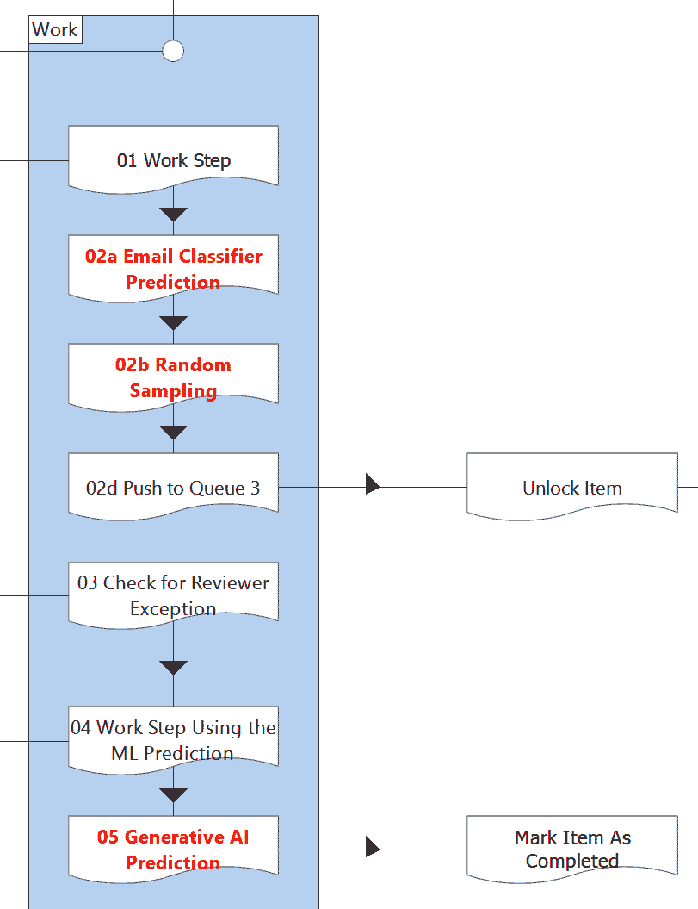

图 11.10：将新页面添加到过程 01 - 处理退款的工作块中

现在，过程 1 的`主页面`为完成解决方案的机器学习部分所需的高级步骤提供了占位符页面。我们的下一个任务将是更改`IA` `数据`页面上的数据项。

### 修改每个模板的 IA 数据页面

请记住，我们模板中的每个流程都有一个名为`IA Data`的页面，其中包含用于协调不同工作队列中**项目数据**列创建的数据项。还有一些包含状态和标签的数据项，用于控制工作队列项目在不同流程中的流动。这些页面上的数据项需要更改以适应解决方案结构。

流程 1，**01 - 处理退款**，在这个页面上有最多的数据项（17 个），因为它的**项目数据**需要存储有关所有三个 ML 模型的信息。

| **数据** **项名称** | **数据** **项值** | **目的** |
| --- | --- | --- |
| 预测项目数据字段名称 - EC | **预测 -** **EC** | 存储 EC 模型预测结果的项目数据字段名称 |
| 置信度项目数据字段名称 - EC | **置信度 -** **EC** | 存储 EC 模型置信分数的项目数据字段名称 |
| 预测项目数据字段名称 - ER | **预测 -** **ER** | 存储 ER 模型预测结果的项目数据字段名称 |
| 审查预测项目数据字段名称 - ER | **审查预测 -** **ER** | 存储 ER 模型审查值的项数据字段名称 |
| 预测项目数据字段名称 - GAI | **预测 -** **GAI** | 存储 GAI 模型预测结果的项目数据字段名称 |
| 置信度项目数据字段名称 - GAI | **置信度 -** **GAI** | 存储 GAI 预测置信分数的项数据字段名称 |
| 队列 1 项目 ID 项数据字段名称 | **队列 1** **项目 ID** | 用于在其他队列中存储工作队列 1 的项目 ID 的项数据字段名称 |
| 队列 2 项目 ID 项数据字段名称 | **队列 2** **项目 ID** | 用于在此队列中存储工作队列 2（EC）的项目 ID 的项数据字段名称 |
| 队列 3 项目 ID 项数据字段名称 | **队列 3** **项目 ID** | 用于在此队列中存储工作队列 3（ER）的项目 ID 的项数据字段名称 |
| 预测完成状态 - EC | **预测完成 -** **EC** | 该状态用于指示 EC 预测已完成 |
| 预测完成状态 - GAI | **预测完成 -** **GAI** | 该状态用于指示 GAI 预测已完成 |
| 手动审查无需状态 - ER | **手动审查无需 -** **ER** | 该状态用于指示 ER 预测不需要 HITL 审查 |
| 手动审查完成状态 - ER | **手动审查完成 -** **ER** | 该状态用于指示 ER 预测的 HITL 审查已完成 |
| 等待机器学习预测标签 - ER | **等待机器学习预测 -** **ER** | 该标签用于显示项目正在等待 ER 模型预测 |
| 手动审查所需标签 - ER | **手动审查所需 -** **ER** | 该标签用于显示项目正在等待 HITL 审查 ER 预测 |
| 抛出异常审查文本 - ER | **BE** | 这是 ER 模型的审查员如何向流程 1 指示应抛出业务异常的方式 |
| 强制 HITL 审查 – EC | **False** | 这是一个会话变量，用于控制我们是否希望强制所有 EC 预测进行审查 |

表 11.3：IA 数据页面上用于流程 1 所需的 17 个数据项

流程 2（IA 数据页面比流程 1 少得多）。

| **数据** **项名称** | **数据** **项值** | **目的** |
| --- | --- | --- |
| 审查预测项数据字段名称 - EC | 审查预测 - EC | 存储人工修正的 EC 预测值的项数据字段名称 |
| 审查理由项数据字段名称 - EC | 审查理由 - EC | 存储预测值被修改原因的项数据字段名称 |
| 审查数据已创建项数据字段名称 - EC | 审查数据已创建 - EC | 此项数据字段名称存储审查数据记录是否已创建 |
| 手动审查完成状态 - EC | 手动审查完成 - EC | 用于指示 EC 预测的 HITL 审查已完成的状况 |
| 禁用 HITL 审查 - EC | False | 这是一个会话变量，可以用来禁用 EC 模型的全部 HITL 审查 |
| 强制创建审查数据 - EC | False | 这是一个会话变量，可以用来强制重新创建所有审查记录 |

表 11.4：IA 数据页面上用于流程 2 所需的 6 个数据项

流程 3（**03 - 实体识别**）需要与流程 1（**01 - 处理退款**）和流程 4（**04 - 实体识别 HITL 审查**）进行通信。因此，需要创建 11 个数据项：

| **数据** **项名称** | **数据** **项值** | **目的** |
| --- | --- | --- |
| 预测项数据字段名称 - ER | 预测 - ER | 存储 ER 模型预测结果的项数据字段名称 |
| 置信度项数据字段名称 - ER | 置信度 - ER | 存储 ER 模型预测置信度分数的项数据字段名称 |
| 队列 1 项 ID 项数据字段名称 | 队列 1 项 ID | 用于在其他队列中存储工作队列 1 的项 ID 的项数据字段名称 |
| 队列 3 项 ID 项数据字段名称 | 队列 3 项 ID | 用于在此队列中存储工作队列 3（ER）的项 ID 的项数据字段名称 |
| 队列 4 项 ID 项数据字段名称 | 队列 4 项 ID | 用于在此队列中存储工作队列 4（GAI）的项 ID 的项数据字段名称 |
| 预测完成状态 - ER | 预测完成 - ER | 用于指示 ER 预测已完成的状况 |
| 手动审查所需标签 - ER | 手动审查所需 - ER | 用于显示项正在等待 ER 预测的 HITL 审查的标签 |
| 不需要手动审查状态 - ER | 不需要手动审查 - ER | 用于指示 ER 预测不需要 HITL 审查的状况 |
| 等待 ML 预测标签 - ER | 等待 ML 预测 - ER | 用于显示项正在等待 ER 模型预测的标签 |
| 手动审查所需标签 - ER | 手动审查所需 - ER | 用于显示项目正在等待 HITL 审查 ER 预测的标签 |
| 强制 HITL 审查 - ER | False | 这是一个会话变量，用于控制我们是否希望强制所有 ER 预测进行审查 |

表 11.5：IA 数据页面流程 3 所需的 11 个数据项

流程 4（**04 - 实体识别 HITL 审查**）有八个数据项需要创建：

| **数据** **项名称** | **数据** **项值** | **目的** |
| --- | --- | --- |
| 已审查预测项数据字段名称 - ER | 已审查预测 - ER | 存储 ER 模型审查值的项数据字段名称 |
| 审查理由项目数据字段名称 - ER | 审查理由 - ER | 存储预测值修改原因的项目数据字段名称 |
| 审查数据创建项目数据字段名称 - ER | 审查数据创建 - ER | 该项目数据字段名称存储审查数据记录是否已创建 |
| 队列 1 项目 ID 项目数据字段名称 | 队列 1 项目 ID | 用于在其他队列中存储工作队列 1 的项目 ID 的项目数据字段名称 |
| 手动审查完成状态 - ER | 手动审查完成 - ER | 用于表示 HITL 审查 ER 预测已完成的状态 |
| 手动审查所需标签 - ER | 手动审查所需 - ER | 用于显示项目正在等待 HITL 审查 ER 预测的标签 |
| 禁用 HITL 审查 - ER | False | 这是一个会话变量，可以用来禁用 ER 模型的全部 HITL 审查 |
| 强制创建审查数据 - ER | False | 这是一个会话变量，可以用来强制重新创建所有审查记录 |

表 11.6：IA 数据页面流程 4 所需的 8 个数据项

现在让我们根据上面的表格对`IA 数据`页面进行更改。

1.  在流程工作室中打开**01 - 处理退款**流程。

1.  删除`IA` `数据`页面上的所有数据项。

1.  根据表 11.3 在此页面上创建新的数据项。所有数据项都需要是全局的，数据类型为`Text`。唯一的例外是会话变量，它们也需要是全局的，但数据类型为`Flag`，曝光设置为*会话*。

1.  重复步骤 1 到 3，除了其他流程。流程 2 应根据*表 11.4*创建数据项，流程 3 应使用*表 11.5*，流程 4 应使用*表 11.6*。

在重新创建`IA 数据`页面上的数据项后，我们将有许多指向先前数据项的断开引用。我们将在下一步修复这些问题。

### 修复 IA 数据页面在流程 1 中的引用和逻辑。

记住，流程 1 应该包含主要业务逻辑，执行 EC 预测，并执行 GAI 预测。虽然我们可以通过流程工作室，点击*错误*按钮，并找到每个错误来修复损坏的数据项引用，但我们可以通过将流程导出为 XML，并进行查找/替换来加快我们的工作。然后我们将重新导入流程，并手动修复剩余的问题。让我们从流程 1 所需的更改开始：

1.  在流程工作室中打开**01 - 处理退款**流程。

1.  点击*文件* | *导出* | *此流程*。将`.bpprocess`文件保存到您选择的文件夹。关闭流程工作室。

1.  在文本编辑器中打开`.bpprocess`文件，例如记事本。

1.  在您的文本编辑器中执行以下七个查找/替换。保存`.``bpprocess`文件：

| **查找文本** | **替换文本** |
| --- | --- |
| [手动审查完成状态] | [手动审查完成状态 - ER] |
| [无需手动审查状态] | [无需手动审查状态 - ER] |
| [手动审查所需标签] | [手动审查所需标签 - ER] |
| [等待 ML 预测标签] | [等待 ML 预测标签 - ER] |
| [抛出异常审查文本] | [抛出异常审查文本 - ER] |
| [强制 HITL 审查] | [强制 HITL 审查 - EC] |
| [已审查预测项数据字段名称] | [已审查预测项数据字段名称 - ER] |

表 11.7 – 流程 1 的七个查找/替换

5. 返回主 BP 软件。点击*文件* | *导入* | *流程/对象*。选择刚刚保存的`.bpprocess`文件，并覆盖现有流程。

6. 在流程工作室中打开**01 - 处理退款**流程。

7. 打开**02a 电子邮件分类器预测**页面。在这个页面上，我们需要重命名三个动作阶段的输入。

8. 打开**[将[置信度分数]添加到[项目数据]**]动作的属性。更改*字段名称*输入**[置信度项目数据字段名称 -** **EC]**。

9. 打开**[将[预测]添加到[项目数据]**]动作的属性。更改*字段名称*输入**[预测项目数据字段名称 -** **EC]**。

10. 打开**[将状态设置为"预测完成"**]动作的属性。更改*状态*输入**[预测完成状态 -** **EC]**。

11. 打开`02b 随机抽样`页面。在这个页面上，我们将删除四个阶段并添加一个新的页面阶段。

12. 删除*需要手动审查？*和*结束*之间的四个阶段。这些阶段是不必要的，因为我们不需要等待 EC 预测被审查才能继续自动化处理。

13. 创建一个新的页面引用到`02c Push to Queue 2`。将决策阶段的*是*路径连接到这个页面阶段，并将页面阶段连接到*结束*。这创建了一个逻辑，随机抽样的预测被推入一个新的队列进行审查。

14. 将*否*路径直接连接到*结束*。

15. 打开`02c Push to Queue 2`页面。在这个页面上，我们将删除一个动作阶段。

16. 删除**添加标签“等待 ML 预测”**动作。将**添加到 Queue 2**动作连接到**将“Queue 2 Item ID”添加到[Item** **Data]****动作。

17. 打开`02d Push to Queue 3`页面。在这里，我们需要重命名一个集合，并相应地更改此页面上使用此重命名集合的每个其他动作阶段。我们还需要更改正在使用的项目数据字段名称。

18. 将集合从**Queue 2 Item Data**重命名为**Queue 3** **Item Data**。

19. 打开**实用工具 - 集合操作：复制行**动作的属性。将*输出集合*输出更改为**Queue 3** **Item Data**。

20. 打开**将“Queue 1 Item ID”添加到[Queue 2 Item Data]**动作的属性。将其重命名为**将“Queue 1 Item ID”添加到[Queue 3 Item Data]**。将*集合*输入更改为**[Queue 3 Item Data]**，并将*附加集合*输出更改为**Queue 3** **Item Data**。

21. 打开**添加到 Queue 2**动作的属性。将其重命名为**添加到 Queue 3**。将*队列名称*输入更改为**[Queue Name 3]**，并将*数据*输入更改为**[Queue 3** **Item Data]**。

22. 打开**将“Queue 2 Item ID”添加到[Item Data]**动作的属性。将其重命名为**将“Queue 3 Item ID”添加到[Item Data]**。将*字段名称*输入更改为**[Queue 3 Item ID Item Data** **字段名称]**。

23. 打开`04 使用 ML 预测的工作步骤`页面。在此页面上，我们需要更改对**[Prediction Item Data Field Name -** **ER]****的引用。

24. 打开**将[Prediction]设置为原始预测**动作的属性。将*字段名称*输入更改为**[Prediction Item Data Field Name -** **ER]**。

25. 打开`05 生成式 AI 预测`页面。在这里，我们需要更改对 GAI 项目数据集合字段和状态的引用。

26. 打开**将[Confidence Score]添加到[Item Data]**动作的属性。将*字段名称*输入更改为**[Confidence Item Data Field name -** **GAI]**。

27. 打开**将[Prediction]添加到[Item Data]**动作的属性。将*字段名称*输入更改为**[Prediction Item Data Field name -** **GAI]**。

28. 打开**将[Status]设置为“Prediction Complete”**动作的属性。将*状态*输入更改为**[Prediction Complete Status -** **GAI]**。

我们已经完成了流程 1 的修改。让我们继续处理流程 2。

### 修复流程 2 的 IA 数据页面引用并删除不需要的逻辑

流程 2 包含 EC 模型的 HITL 审查检查逻辑。再次，我们将使用查找/替换方法来加快我们的工作：

1.  在流程工作室中打开**02 – 电子邮件分类器 HITL 审查**流程。

1.  点击*文件* | *导出* | *此流程*。将`.bpprocess`文件保存到您选择的位置。关闭流程工作室。

1.  在文本编辑器中打开`.bpprocess`文件，例如记事本。

1.  在您的文本编辑器中执行以下六个查找/替换操作。保存`.bpprocess`文件。

| **查找文本** | **替换文本** |
| --- | --- |
| [禁用 HITL 审查] | [禁用 HITL 审查 - EC] |
| [强制创建审查数据] | [强制创建审查数据 - EC] |
| [已审查预测项目数据字段名称] | [已审查预测项目数据字段名称 - EC] |
| [审查理由项目数据字段名称] | [审查理由项目数据字段名称 - EC] |
| [审查数据创建项目数据字段名称] | [审查数据创建项目数据字段名称 - EC] |
| [手动审查完成状态] | [手动审查完成状态 - EC] |

表 11.8 – 流程 2 的六个查找/替换

5. 返回主 BP 软件。点击 *文件* | *导入* | *过程/对象*。选择刚刚保存的 `.bpprocess` 文件并覆盖现有过程。

6. 打开 `02 检查已审查预测` 页面。在这里，我们需要删除用于更新工作队列 1 项目的工作队列项的逻辑，因为那不再需要了。

7. 将 *审查完成？* 决策阶段的 *否* 路径直接连接到 *结束* 阶段。

8. 删除以下图中显示的所有阶段，因为它们与更新工作队列 1 的项目相关。根据设计，当审查完成时不需要更新流程 1。

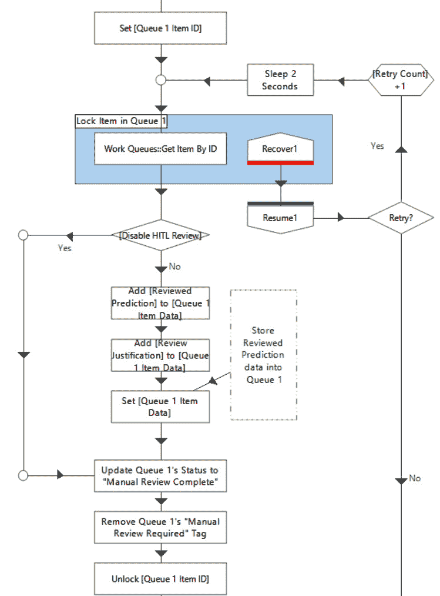

图 11.11：从页面 02 检查已审查预测的删除阶段

9. 将 *设置[项目数据]* 下的锚点直接连接到操作 **更新状态为“手动** **审查完成”**。

我们现在已经完成了对流程 2 的更改。让我们继续处理流程 3。

### 修复流程 3 的 IA 数据页面引用和逻辑

流程 3 执行 ER 模型的 ML 步骤。让我们修复此流程的项目数据引用。我们再次以 `.bpprocess` 格式导出流程，并在文本上执行查找/替换以加快我们的工作：

1.  在流程工作室中打开流程 **03 – 实体识别**。

1.  点击 *文件* | *导出* | *此过程*。将 `.bpprocess` 文件保存到您选择的位置。关闭流程工作室。

1.  在文本编辑器中打开 `.bpprocess` 文件，例如记事本。

1.  在您的文本编辑器中执行以下八个查找/替换。保存 `.bpprocess` 文件。

| **查找文本** | **替换文本** |
| --- | --- |
| [强制 HITL 审查] | [强制 HITL 审查 - ER] |
| [预测项目数据字段名称] | [预测项目数据字段名称 - ER] |
| [置信度项目数据字段名称] | [置信度项目数据字段名称 - ER] |
| [预测完成状态] | [预测完成状态 - ER] |
| [手动审查所需状态] | [手动审查所需状态 - ER] |
| [手动审查不需要状态] | [手动审查不需要状态 - ER] |
| [等待机器学习预测标签] | [等待机器学习预测标签 - ER] |
| [手动审查所需标签] | [手动审查所需标签 - ER] |

表 11.9 – 流程 3 的八个查找/替换

5. 返回主 BP 软件。点击 *文件* | *导入* | *过程/对象*。选择刚刚保存的 `.bpprocess` 文件并覆盖现有过程。

6. 在流程工作室中打开 **03 – 实体识别** 流程。

7. 打开`02 阈值`页面。在这个页面上，我们将用占位符计算阶段替换**智能自动化::通过标签获取阈值**操作。

8. 将**实用工具 – 智能自动化::通过标签获取阈值**操作替换为名为*实现阈值逻辑*的计算阶段。将*表达式*设置为**0.8**，并将*存储结果在*设置为**阈值值**。这将作为实际阈值逻辑的占位符。

9. 打开`03b 推送到队列 3 并更新队列 1 项`页面。将此页面重命名为`03b 推送到队列 4 并更新队列 1 项`。在这里，我们需要重命名一个集合，并相应地更改此页面上所有其他操作阶段以使用此重命名的集合。

10. 将**队列 3 项数据**集合重命名为**队列 4** **项数据**。

11. 打开**实用工具 - 集合操作：复制行**操作的属性。将*输出集合*输出更改为**队列 4** **项数据**。

12. 打开**将"队列 2 项 ID"附加到[队列 3 项数据]**操作的属性。将其重命名为**将"队列 3 项 ID"附加到[队列 4 数据]**。将*集合*输入更改为**[队列 4 数据]**。将*字段名称*输入更改为**[队列 3 项 ID 项数据字段名称]**。将*附加集合*输出更改为**队列 4** **项数据**。

13. 打开**添加到队列 3**操作的属性。将其重命名为**添加到队列 4**。将*队列名称*输入更改为**[队列名称 4]**，并将*数据*输入更改为**[队列 4** **项数据]**。

14. 打开**添加队列 3 项 ID 到[队列 1 项数据]**操作的属性。将其重命名为**添加队列 4 项 ID 到[队列 1 项数据]**。将*字段名称*输入更改为**[队列 4 项 ID 项数据** **字段名称]**。

最后，让我们进行流程 4 所需的引用更改。

### 修复流程 4 的 IA 数据页面引用

流程 4 执行 ER 模型的 HITL 审查步骤。让我们修复此流程的项数据引用。我们只需要执行查找/替换，不需要对流程逻辑进行其他更改：

1.  在流程工作室中打开**04 – 实体识别 HITL 审查**流程。

1.  点击*文件* | *导出* | *此流程*。将`.bpprocess`文件保存到您选择的位置。关闭流程工作室。

1.  在文本编辑器中打开`.bpprocess`文件，例如记事本。

1.  在您的文本编辑器中执行以下七个查找/替换操作。保存`.bpprocess`文件。

| **查找文本** | **替换文本** |
| --- | --- |
| [禁用 HITL 审查] | [禁用 HITL 审查 - ER] |
| [强制创建审查数据] | [强制创建审查数据 - ER] |
| [已审查预测项数据字段名称] | [已审查预测项数据字段名称 - ER] |
| [审查理由项数据字段名称] | [审查理由项数据字段名称 - ER] |
| [创建的审查数据项数据字段名称] | [创建的审查数据项数据字段名称 - ER] |
| [人工审查完成状态] | [人工审查完成状态 - ER] |
| [需要人工审查的标签] | [需要人工审查的标签 - ER] |

表 11.10 – 流程 4 的七个查找/替换

5. 返回主 BP 软件。点击 *文件* | *导入* | *流程/对象*。选择刚刚保存的 `.bpprocess` 文件并覆盖现有流程。

我们已经完成了*图 11**.1*中所示解决方案结构的创建。模型解决方案可以在 GitHub 上找到：[`github.com/PacktPublishing/Intelligent-Automation-with-Blue-Prism/blob/main/ch11/Ex_1_Creating_the_Solution_Structure.bprelease`](https://github.com/PacktPublishing/Intelligent-Automation-with-Blue-Prism/blob/main/ch11/Ex_1_Creating_the_Solution_Structure.bprelease)。对模板所做的更改在流程图中以橙色字体突出显示。流程 1 还将三个项目加载到工作队列 1 中，以方便测试解决方案流程。如果您愿意，发布四个流程并在流程工作室中运行模型解决方案以确认解决方案流程与设计匹配。

现在我们已经建立了解决方案的结构，让我们添加一些我们已知的流程 1 的 IA 详细信息。

## 示例 2 – 在流程 1 中实现 IA 详细信息

在验证解决方案结构正常工作后，我们决定进一步进行 IA 实现。由于 EC 模型是内部开发的，我们目前还没有可用的测试 API。

与业务用户和机器学习团队的先前讨论导致在审查标准和审计方面做出了一些决定。这些决定在*表 11.1*中有所体现。其中一些机器学习需求可以在最终确定模型之前实现。在这个例子中，我们将通过八个高级步骤来实现这些细节：

1.  导入模型解决方案作为起点（可选）。

1.  添加一个模拟 EC 预测。

1.  删除 EC 预测 BP 记录。

1.  创建一个 EC 模型关闭开关。

1.  将 EC 预测的随机采样率更改为 5%。

1.  添加一个模拟 GAI 预测。

1.  删除 GAI 预测 BP 记录。

1.  创建一个 GAI 模型关闭开关。

### 下载并导入解决方案结构

如果您尚未完成*示例 1*，这是一个可选步骤。从([`github.com/PacktPublishing/Intelligent-Automation-with-Blue-Prism/blob/main/ch11/Ex_1_Creating_the_Solution_Structure.bprelease`](https://github.com/PacktPublishing/Intelligent-Automation-with-Blue-Prism/blob/main/ch11/Ex_1_Creating_the_Solution_Structure.bprelease))下载发布版本并将其导入 BP。验证它包含四个流程、四个工作队列和一个凭证。

图 11.12 – 开始示例 2 的发布内容

### 添加一个模拟 EC 预测

EC 预测 API 尚未最终确定，但我们仍想根据预测是*退款*还是*非退款*来测试流程的不同分支。我们知道大约 70/500 = 14%的每日收到的电子邮件将是实际的退款请求，所以让我们使用随机数生成器创建假预测，将预测设置为*退款* 14%的时间：

1.  在流程工作室中打开**01 – 处理退款**流程。

1.  打开`02a 电子邮件分类器预测`页面，找到名为*预测*的橙色块。

1.  删除占位符*注意*。

1.  创建一个名为**退款百分比**的`Number`数据项。将初始值设置为**14**。

1.  创建一个名为**随机值**的`Number`数据项。

1.  创建一个名为**预测值**的`Text`数据项。将初始值设置为**非退款**。

1.  添加一个**实用工具 – 智能自动化::在范围内随机整数**动作。将*下限*输入设置为**1**，将*上限*输入设置为**100**。将*输出值*设置为**随机值**。从*日志[模型版本]*计算阶段链接到它。

1.  在上一步的操作下添加一个名为*退款？*的决策阶段。将*表达式*设置为**[随机值] <= [退款百分比]**。从动作阶段链接到这个阶段。

1.  添加一个名为*设置预测值到退款*的计算阶段。将*表达式*设置为**"退款"**，将*存储结果在*设置为**预测值**。将*退款？*决策阶段的*是*路径链接到这个阶段。将这个阶段链接到*设置[预测]和[置信度分数]*多计算阶段。

1.  将*退款？*决策阶段的*否*路径链接到*设置[预测]和[置信度分数]*多计算阶段。

1.  打开*设置[预测]和[置信度分数]*多计算阶段。将第一行的表达式更改为**[****预测值]**。

1.  确认你的图表看起来如下：

图 11.13 – 创建模拟 EC 预测

现在我们有了 EC 模拟预测，让我们删除模型版本日志。

### 删除 EC 模型日志

记住，EC 模型调用将在 API 服务器端进行日志记录。我们不需要从 BP 进行日志记录。关闭日志记录将减少数据库中存储的数据量。

1.  删除*日志[模型版本]*计算阶段。将删除此阶段之前和之后的阶段链接起来以填补空白。确保将前一个决策阶段的*否*路径链接起来。

1.  打开*设置[预测]和[置信度分数]*多计算阶段。将*阶段日志*设置为*仅错误*。

1.  删除**temp**和**模型版本**数据项。

当我们仍在`02a 电子邮件分类器预测`页面时，我们也应该为这个模型创建一个独特的关闭开关。

### 为 EC 预测创建一个独特的关闭开关

模板中的关闭开关是一个占位符。让我们通过创建凭证和环境变量并编辑关闭开关逻辑来替换一个真实的：

1.  访问 *系统* | *安全* | *凭证*。

1.  点击 *新建* 并将名称设置为 **Ch11 EC** **Kill Switch**。

1.  点击 *访问权限* 选项卡。在 *安全角色* 下选择 *所有角色*。在 *流程（旧版）* 下选择 *所有流程*。在 *资源（旧版）* 下选择 *所有资源*。这并不是最佳实践，只是为了方便演示。

1.  访问 *系统* | *流程* | *环境变量*。

1.  点击 *添加变量*。将其命名为 `Text` 并将值设置为 **Ch11 EC** **Kill Switch**。

1.  返回到流程工作室的 `02a 电子邮件分类器` **预测** 页面。

1.  将 **Kill Switch 凭证名称** 数据项曝光设置为 *环境*。将名称设置为 **Ch11 Example 2 EC Kill** **Switch Name**。

1.  打开 *获取 Kill Switch 凭证* 动作的属性。将 *凭证名称* 输入更改为 **[Ch11 Example 2 EC Kill** **Switch Name]**。

我们已经完成了 EC 模型的 kill switch 创建。接下来，让我们根据要求设置 EC 模型的随机采样率。

### 将 EC 采样率更改为 5%

要更改随机采样率，我们将创建一个 `Number` 环境变量并将其设置为 *5*。然后我们将更改图表以使用此环境变量：

1.  访问 *系统* | *流程* | *环境变量*。

1.  点击 *添加变量*。将其命名为 `Number` 并将值设置为 **5.0**。

1.  返回到流程工作室的 **01 –** **处理退款**。

1.  打开 `02b 随机` `采样` 页面。

1.  将 **随机采样率** 数据项的曝光设置为 *环境*。选择 **Ch11 Example 2 EC Random Sampling Target** 作为 *名称*。

1.  将 *需要手动审核？* 决策阶段的表达式更改为 **[强制 HITL 审核 - EC] OR [随机数] < [Ch11 Example 2 EC Random** **采样目标]**。

我们已经完成了 EC 模型的一些要求。接下来，让我们转向 GAI 模型，并创建一个模拟的 GAI 预测调用。

### 添加一个模拟的 GAI 预测

当 GAI 模型可以调用时，这样做会产生成本。我们仍然想要一个模拟的 GAI 调用，并保存实际调用直到以后。为此，我们将简单地硬编码一个电子邮件文本消息作为 GAI 预测的结果：

1.  打开 `05 生成式 AI 预测` 页面并找到名为 *预测* 的橙色块。

1.  删除占位符 *注意*。

1.  创建一个名为 **GAI 电子邮件** 的 `Text` 数据项。

1.  创建一个名为 *设置 GAI 电子邮件* 的计算阶段。将 *表达式* 设置为 **"您的退款请求已自动处理"**。将 *存储结果在* 设置为 **GAI 电子邮件**。

1.  打开 *设置 [预测] 和 [置信度分数]* 多计算阶段。将第一行的表达式更改为 **[****GAI Email]**。

1.  将计算阶段 *Log [模型版本]* 连接到计算阶段 *设置 GAI 电子邮件* 和多计算阶段 *设置 [预测] 和 [**置信度分数]*。

### 移除 GAI 模型日志

记住，GAI 模型结果不需要记录。输入提示是静态的，输出电子邮件在 CRM 系统中记录。虽然返回了模型版本号，但我们实际上对模型回滚没有控制权，因为它是一个第三方服务。关闭记录将减少数据库中存储的数据量：

1.  删除 *日志 [模型版本]* 计算阶段。将此删除阶段之前和之后的阶段链接起来以填补空白。确保您链接了之前决策阶段的 *无* 路径。

1.  打开 *设置 [预测] 和 [置信度分数]* 多计算阶段。将 *阶段日志记录* 设置为 *仅错误*。

1.  删除 **temp** 和 **模型版本** 数据项。

### 为 GAI 预测创建一个独特的断开开关

模板中的断开开关是一个占位符。让我们通过创建凭证和环境变量并编辑断开开关逻辑来放置一个真实的断开开关：

1.  访问 *系统* | *安全* | *凭证*。

1.  点击 *新建* 并将名称设置为 **Ch11 GAI** **断开开关**。

1.  点击 *访问权限* 选项卡。在 *安全角色* 下选择 *所有角色*。在 *流程（旧版）* 下选择 *所有流程*。在 *资源（旧版）* 下选择 *所有资源*。这不是最佳实践，只是为了方便演示。

1.  访问 *系统* | *流程* | *环境变量*。

1.  点击 *添加变量*。将其命名为 `Text` 并将值设置为 **Ch11 GAI** **断开开关**。

1.  返回到流程工作室，到 `05 生成式 AI` `预测` 页面。

1.  将 **断开开关凭证名称** 数据项曝光设置为 *环境*。将名称设置为 **Ch11 Example 2 GAI 断** **开开关名称**。

1.  打开 *获取断开开关凭证* 动作的属性。将 *凭证名称* 输入更改为 **[Ch11 Example 2 GAI 断** **开开关名称]**。

我们完成了第二个示例。在这里，我们为 EC 和 GAI 模型实施了一些模拟预测。我们还满足了审计和随机抽样的要求。虽然我们可以继续修改其他流程，但程序基本上是相同的。继续进一步开发需要深入了解对象和业务逻辑细节。

# 摘要

在本章中，我们讨论了一个实际用例的要求，该用例使用了三种不同的机器学习模型。我们单独分析了每个机器学习模型的要求，这让我们了解了它们的审计和扩展需求。这有助于我们确定在 IA 解决方案中使用适当数量的流程和工作队列。

我们通过一个示例来实现解决方案结构。我们从三个流程和三个工作队列模板开始，并使用每个模板的 `IA 数据` 页面来明确定义在解决方案中将使用哪些项目数据字段名称、状态、标签和会话变量。最后，我们编辑 IA 解决方案逻辑以利用这些新的数据项。

这个例子将帮助你构建关于如何设计复杂的 IA 解决方案的思考，如何考虑机器学习需求，以及如何选择合适的模板来帮助你开始。请记住，如果你遇到这本书中的模板没有涵盖的情况，你应该创建自己的模板。

然后，我们看到了第二个例子，其中我们为两个机器学习模型实现了简单的模拟预测。创建模拟预测很重要，因为它允许你从调用商业 API 中节省成本，并且它防止你在继续前进之前等待机器学习模型构建完成。机器学习模型几乎总是与 IA 并行构建，模拟允许你在模型尚未准备好之前测试整个流程。

在下一章中，我们将探讨另一个现实生活中的 IA 场景，但我们将从开发和设计转向，而是专注于 IA 解决方案的持续管理和部署方面。
