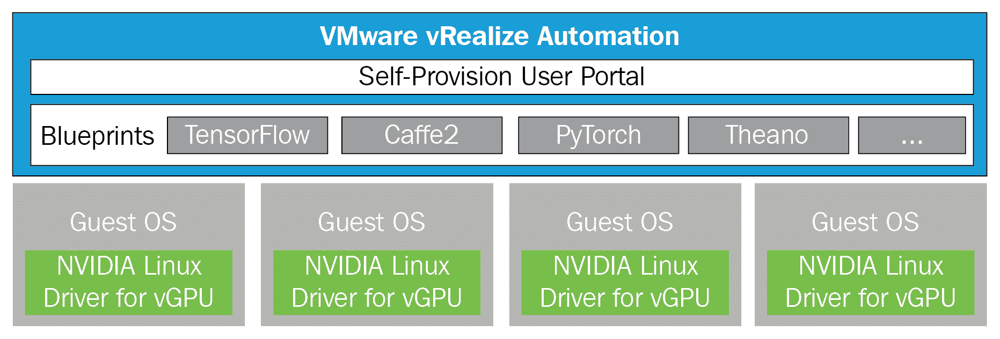
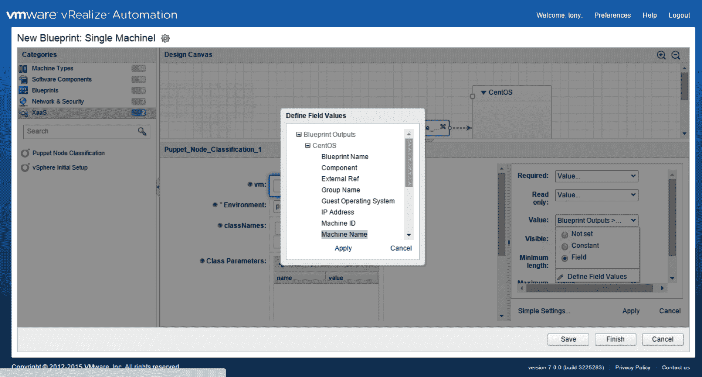
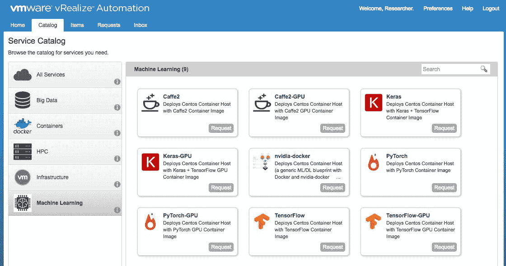
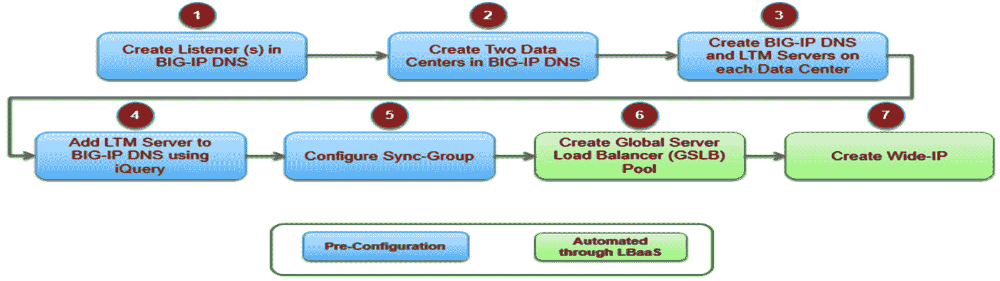
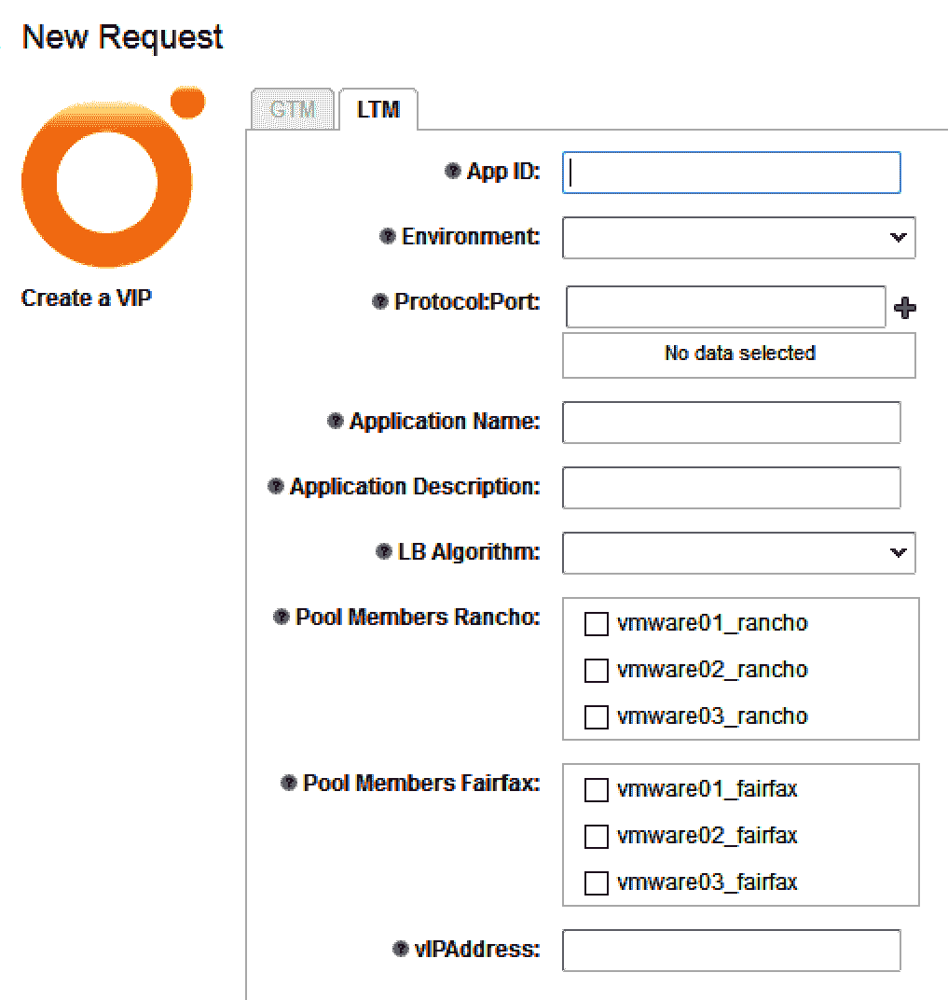

# 第七章：云中的机器学习即服务

本章将帮助您通过使用 vRealize Automation 了解**机器学习即服务**（**MLaaS**）。机器学习工作流程包括数据清洗、模型选择、特征工程、模型训练和推理。机器学习基础设施的生产开发和管理比较复杂，因为所有机器学习过程都需要对其硬件和软件进行修改。

我们可以通过自动化硬件资源的配置、配置操作系统和应用程序包以及向相关 IT 团队提供访问权限来最小化这种复杂性。这个过程定制可以引入为 MLaaS。我们将学习 vRealize Automation 如何通过 MLaaS 的用例提供 MLaaS。它还将有助于在 vRealize Automation 中设计和配置蓝图，以定义具有工作流程的过程。我们还将探讨**负载均衡即服务**（**LBaaS**）以及**网络即服务**（**NaaS**）如何消除基于硬件的网络架构中的瓶颈。

本章我们将涵盖以下主题：

+   VMware 的 MLaaS 方法和其架构

+   带用例的 LBaaS

+   转换网络和安全服务

# 技术要求

您可以从[`my.vmware.com/web/vmware/details?downloadGroup=VROVA_750&productId=742`](https://my.vmware.com/web/vmware/details?downloadGroup=VROVA_750&productId=742)下载 VMware vRealize Orchestrator Appliance 7.5.0。

# 私有云中的 MLaaS

机器学习帮助计算机在不进行大量编程的情况下获取知识，并且通过改进其开发，其计算和数据性能得到提升。

高性能计算和大数据应用利用虚拟化，因为它有助于支持不同的软件基础设施的并发，创建资源池，一致的研究环境，多域数据安全，问题诊断和弹性，有效的负载均衡，以及 QoS。**高性能计算**（**HPC**）和大数据合并在一起，因此机器学习可以作为服务从不同的云环境中消费。这些应用具有巨大的数据量，需要遵循数据合规性和安全策略。客户喜欢选择私有云来托管这些具有大量数据且需要更多计算资源的机器学习应用。

我们可以使用 vRealize Automation 在私有云中配置 MLaaS，以提供由 GPU 驱动的机器学习服务，为设计/高级用户提供服务。该工作流程可以帮助构建一个基于机器学习的蓝图，以满足设计用户的特定需求。

# VMware 的 MLaaS 方法

我们有两个私有云选项来使用 VMware 构建**基础设施即服务**（**IaaS**）：

+   vRealize Automation

+   集成 OpenStack

vRealize Automation 通过创建混合云中托管的自定义基础设施、工作负载和应用程序来帮助实现 IT 自动化。VMware Integrated OpenStack 是一个具有 VMware 直接支持的 OpenStack 发行版，帮助客户在始终可靠的 vSphere 引擎上构建企业级 OpenStack 云。它通过易于使用且供应商独立的 OpenStack API 访问 VMware 环境来提高性能。本章将简要介绍如何使用 VMware vRealize Automation 创建 MLaaS。

# 使用 vRealize Automation 和 vGPU 的 MLaaS

我们可以配置一个 TensorFlow 服务，最终用户可以通过使用 vRealize Automation 构建的自助服务配置门户来消费。我们已经在 vSphere、vRealize Automation、NVIDIA GRID 驱动程序中安装了 NVIDIA 显卡，以支持 NVIDIA vGPU，并在认证服务器上推荐了客户操作系统。

ESXi 上的 NVIDIA GRID vGPU Manager 驱动程序应配置为提供 vGPU。物理 GPU 应在 ESXi 中显示为 vGPU 设备，而不是默认的 vSGA 设备。

# 在 vSphere ESXi 上配置 NVIDIA vGPU

我们可以为最终用户构建一个 vRealize Automation 模板，让他们可以利用 TensorFlow 服务。创建和配置 TensorFlow 服务的流程在下一图中提到。为最终用户构建和配置 TensorFlow 服务的步骤将包括以下五个步骤，使用 CentOS 虚拟机：

1.  将 NVIDIA GRID vGPU 添加到虚拟机

1.  自定义客户操作系统环境

1.  将虚拟机转换为模板并创建自定义规范

1.  设计蓝图

1.  发布蓝图

在第一章，“使用 vSphere 6.7 的机器学习功能”，我们了解到前三个步骤是在 vCenter 控制台中配置的，最后两个步骤可以使用 vRealize Automation 进行配置。最后两个步骤在以下图中提到：

# 自定义 vRealize Automation 蓝图

首先，我们必须关闭安装有驱动程序/所有工具和配置了 vGPU 的虚拟机。我们必须将其转换为模板，这样我们就可以使用 vRealize Automation 将其作为蓝图。一旦创建了模板，我们就可以在创建了所需的模板后构建一个具有定义参数的统一自定义蓝图。云管理员可以使用此功能为 TensorFlow 虚拟机创建克隆蓝图：

1.  以管理员身份登录 vSphere web 客户端。

1.  右键单击虚拟机对象，选择模板 | 转换为模板。

1.  点击“自定义规范管理器”并基于主页上的模板创建一个新的规范。

1.  在创建虚拟机时创建一个软件堆栈，该堆栈定义了要在蓝图内安装和配置的所有软件的软件生命周期。

1.  蓝图必须设计为利用 vRealize Automation 的自定义功能：

1.  将软件堆栈捆绑在一起，以设计如何在 vRealize Automation 的蓝图虚拟机中安装、配置、启动、升级和卸载软件。我们可以在设计控制台上将此软件堆栈拖放到特定的容器变体上。

1.  通过创建软件组件来安装 TensorFlow。探索“设计”选项卡，然后选择“软件组件”，并选择“新建”。

1.  为软件堆栈定义一个名称和详细信息。在“常规”部分中，我们必须提及容器规范作为机器，然后点击“下一步”继续。

1.  创建一个命令脚本，用于获取 TensorFlow GPU 容器镜像，并自定义`/etc/motd`文件，以便用户登录到 TensorFlow 虚拟机时显示指令。vRealize Automation 将安装容器镜像，示例 bash 脚本类型可以根据所需的配置和安装步骤进行更改。

1.  设计蓝图。蓝图定义了使用 vRealize Automation 实施服务的流程。我们可以选择一个基本的蓝图，它只能部署单个虚拟机，以及一个多虚拟机蓝图，该蓝图具有软件堆栈、网络、安全性和存储策略：

1.  创建一个蓝图，其中只包含 CentOS 虚拟机、TensorFlow 应用程序和相关虚拟网络：探索“设计”选项卡，选择“蓝图”，并选择“新建”。

1.  在新的蓝图部分中提及名称和详细信息，以便生成一个唯一的 ID。

1.  通过从“类别”部分选择机器类型并将 ESXi 主机拖放到设计控制台，将 ESXi 主机添加到 TensorFlow 蓝图。我们必须在“常规”选项卡中定义其他参数，并提及蓝图构建的所有虚拟机名称的名称前缀，以及为用户提供最多四个 TensorFlow 虚拟机的自助配置访问权限。

1.  访问“机器资源”选项卡，以获取为该蓝图创建的虚拟机配置的虚拟 CPU、内存和存储信息。

1.  当虚拟机创建时，在“网络”选项卡下指定虚拟网络。

1.  从下拉菜单中选择所需的网络，并选择 DHCP 或静态。如果我们将一个 passthrough PCI 设备包含到虚拟机中，我们必须为此配置分配完整的内存预留。在克隆过程中，名为“虚拟机内存预留”的模板将无法保持此配置。为了管理这一点，我们必须通过探索“属性”选项卡添加特定的`VMware.Memory.Reservation`参数，并定义一个内存大小。

我们可以通过 vRealize Automation 服务目录中的“机器学习”类别将此蓝图作为服务进行配置，并提名用户使用它。编辑“自定义属性”选项卡，并按照以下步骤操作：

1.  在蓝图中选择 TensorFlow-GPU

1.  点击发布：

我们可以从前面的截图中的自助服务配置门户中看到带有和没有 GPU 的各种 ML/DL 服务，设计用户可以使用定义的资源。

# LBaaS 概述

客户可以通过将其与 NSX 和 vRealize 自动化引擎集成来使用 LBaaS，这创建了一个包含应用程序要求的流程。他们还可以通过此服务与第三方工具集成，以实现服务的自动化部署和监控。我们有很多选项，通过使用 VMware 软件定义方法来设计作为服务的负载均衡器。

负载均衡器必须卸载 SSL 以提高性能并输出。全局负载均衡器必须在多个数据中心之间将故障转移到应用程序服务。它必须使用最有效的负载均衡算法来提高应用程序服务的效率。它可以在发现任何威胁时立即监控应用程序服务并生成警报。

VMware **vRealize Orchestrator** (**vRO**) 通过自动化 F5 虚拟服务器的部署，根据预定义的工作流（包含步骤数量、与 IP 地址关联的虚拟服务器添加、协议、端口、配置文件和特定虚拟服务器的监控报告等参数）帮助我们构建 LBaaS。LBaaS 必须提供 HTTPS 作为服务并卸载 SSL。vRO 可以在 PowerShell 服务器上执行脚本以生成由 Microsoft CA 签名的证书并将其传输到 F5 服务器。它确保 SSL 已附加到 F5 配置文件。

# LBaaS 设计用例

LBaaS 应用场景如下：

+   部署单站点负载均衡器

+   部署多站点负载均衡器

+   定制负载均衡器

+   删除 VM

让我们详细看看应用场景：

+   **部署单站点负载均衡器**：创建虚拟机，然后使用特定的虚拟机定义负载均衡器。用户可以通过 **Self-Service Portal** (**SSP**) 登录并请求虚拟服务器。根据设计，负载均衡器在单个站点配置。用户可以通过列表框和组合框以及预填充数据来选择数据，以提供数据输入过程。vRealize 有能力调用 vRO，而 vRO 将执行预定义的工作流步骤以为用户选择的虚拟服务器组配置 F5 虚拟服务器。

    一旦 vRealize Automation 收到特定应用程序的数据，它可以使用 **VMware Infrastructure Planner** (**VIP**) 和 DNS 名称创建一个 F5 **Local Traffic Manager** (**LTM**) 虚拟服务器，并根据工作流：

| **步骤** | **参与者** | **操作** |
| --- | --- | --- |
| 1 | 用户 |

1.  登录到 vRealize SSP

1.  使用 XaaS 蓝图请求 LBaaS 配置

1.  向请求表单提供必要的数据

|

| 2 | vRealize Automation |
| --- | --- |

1.  接收并验证用户输入的数据

1.  调用 vRO 工作流以配置 F5 虚拟服务器

|

| 3 | vRO |
| --- | --- |

1.  配置 F5 虚拟服务器

1.  将 F5 虚拟服务器附加到用户选择的虚拟机上

|

+   **部署多站点负载均衡器**:多站点负载均衡器配置与单站点负载均衡器不同，因为与 Big-IP DNS 关联的两个 F5 LTM 配置在两个数据中心。Big-IP DNS 不是必需的，仅作为全局负载均衡器需要。其工作流帮助用户在两个站点之间选择各种流量流方法（即 50/50、80/20、60/40、40/60 和 20/80）的替代方案。

    用户将数据输入到 vRealize Automation 请求表单中。vRealize Automation 将调用 vRO 工作流处理数据，创建两个 F5 虚拟服务器（每个站点一个），以及一个 F5 Big-IP DNS 系统：

| **步骤** | **角色** | **操作** |
| --- | --- | --- |
| 1 | 用户 |

1.  登录到 vRealize SSP

1.  使用 XaaS 蓝图请求 LBaaS 分配

1.  选择**全局流量管理器**（**GTM**）复选框以创建多站点负载均衡器

1.  将 LTM 和 GTM 信息输入到请求表单中

|

| 2 | vRealize Automation |
| --- | --- |

1.  接收并验证用户输入的数据

1.  调用 vRO 工作流分配三个 F5 虚拟服务器——每个站点一个 LTM 和一个 Big-IP DNS

|

| 3 | vRO |
| --- | --- |

1.  提供 F5 虚拟服务器

1.  将用户选择的虚拟机与 F5 虚拟服务器关联

|

+   **修改负载均衡器**:可以在 F5 上使用新虚拟机自定义负载均衡器，然后我们可以执行 XaaS 蓝图到配置有负载均衡器的新虚拟机。如果用户在负载均衡器部署期间选择了错误的负载均衡器算法，他们可以通过 XaaS 蓝图进行修正。

    下表描述了此用例的操作：

| **步骤** | **角色** | **操作** |
| --- | --- | --- |
| 1 | 用户 |

1.  登录到 vRealize SS

1.  使用 XaaS 蓝图请求 LBaaS 修改

1.  提供修改现有负载均衡器所需的数据

|

| 2 | vRealize Automation |
| --- | --- |

1.  接收并验证用户输入的数据

1.  调用 vRO 工作流以修改 F5 虚拟服务器

|

| 3 | vRO |
| --- | --- |

1.  修改 F5 虚拟服务器

|

+   **取消分配虚拟机**:我们可以使用 vRealize Automation 工作流取消分配 F5 虚拟服务器成员池中的任何成员虚拟机，否则 F5 将发布带有消息“虚拟机不可用”的警报。

    用户还可以使用修改后的 XaaS 工作流从 F5 虚拟服务器池中删除虚拟机。当最后一个虚拟机被删除时，F5 虚拟服务器成员池将自动完成：

| **步骤** | **角色** | **操作** |
| --- | --- | --- |
| 1 | 用户 |

1.  登录到 vRealize SSP

1.  使用现有蓝图请求虚拟机取消分配

|

| 2 | vRealize Automation |
| --- | --- |

1.  在虚拟机取消分配蓝图部分调用 LBaaS XaaS 工作流

|

| 3 | LBaaS XaaS 工作流 |
| --- | --- |

1.  接收虚拟机取消分配请求的所有必要数据

1.  调用 vRO 工作流

|

| 4 | vRO |
| --- | --- |

1.  创建 XaaS 工作流以将虚拟机添加/删除到 F5 虚拟服务器成员池

|

+   **LBaaS 工作流程**：为了部署多站点负载均衡器，在多站点设计中每个站点部署两个相同的负载均衡器。还会创建一个 Big-IP DNS wide-IP，并要求用户输入其他输入，包括主站点和流量流比率：

| ** Lane** | **Action** | **Notes** |
| --- | --- | --- |
| vRO | 使用 REST API 的高级 F5 GTM 工作流程 |

1.  点击 GTM 复选框并输入 Big-IP DNS 参数以运行工作流程来构建 BIG-IP DNS 全局负载均衡器

|

下面的图显示了工作流程：

让我们逐一介绍前面图中提到的所有功能。正如我们所知，前五个步骤已经在 LBaaS 工作流程中讨论过，并且需要执行 LBaaS 工作流程。所有功能都是从参考点的角度给出的：

1.  创建一个监听器。从 Big-IP DNS UI 中选择 DNS | 交付以提供监听器参数的值。每个站点都需要创建一个监听器。这是 LBaaS 工作流程的前提条件。

1.  创建数据中心。从 Big-IP DNS UI 中选择 DNS | GSLB | 数据中心 | 数据中心列表 | 新数据中心以提供数据中心名称和其他参数。您需要为两个数据中心重复此步骤。这是 LBaaS 工作流程的前提条件。

1.  创建 Big-IP DNS 和 LTM 服务器。从 Big-IP DNS UI 中选择 DNS | GSLB | 服务器 | 服务器列表 | 新服务器以将 LTM 服务器添加到 Big-IP DNS。您需要为两个数据中心重复此步骤：主站点和辅助站点。这是 LBaaS 工作流程的前提条件。

1.  配置`(bigip_add utility)`iQuery：

    1.  登录到 Rancho Cordova 的 BIG-IP DNS。

    1.  运行`# bigip_add <rc-ltm-ip>`命令以将 Rancho Cordova LTM 添加到 GTM。

    1.  当 BIG-IP DNS 和 LTMs 之间成功通信时，BIG-IP DNS UI 中的状态将变为绿色。这是 LBaaS 工作流程的前提条件。

1.  配置 sync-group：

    1.  将 DNS 服务器（`RC_DNS`和`FX_DNS`）添加到 BIG-IP DNS 系统中。

    1.  创建 sync-group。

    1.  使用`#gtm _add <fx-gtm-ip>`命令将 Fairfield Annex BIG-IP GTM 设备添加。

    1.  使用`#bigip_add <fx-ltm-ip>`命令将 Fairfield Annex BIG-IP LTM 设备添加。这是 LBaaS 工作流程的前提条件

1.  创建**全局服务器负载均衡器**（**GSLB**）池：

    1.  GSLB 池将作为 LBaaS 工作流程的一部分创建。池名称将由用户作为 XaaS UI 的一部分提供。

    1.  如果手动创建，选择 GSLB | 池。点击“创建”以创建全局池。

1.  创建 wide-IP：

    1.  Wide-IP 将作为 LBaaS 工作流程的一部分创建。

    1.  如果手动创建，选择 GSLB | Wide IPs。点击“创建”以创建 wide-IP。wide-IP 名称将由用户作为 XaaS UI 的一部分提供。

    1.  wide-IP 将通过从 Infoblox 的 vRO IP 保留工作流程分配 IP 地址。

# 网络和安全服务的挑战

网络和安全一直是基础设施的瓶颈。

以下是在刚性硬件定义的基础设施中存在的重大痛点：

+   放置和移动受到物理端口的限制

+   由于缺乏先进的自动化能力且未设计用于自动化，因此配置速度缓慢

+   它需要大量的操作和硬件依赖

为了实现 IT 即服务（ITaaS）模型，以下是可以采取的措施：

+   云网络架构和运营模型支持**IT 即服务（ITaaS**）模型的演进

+   实时监控和故障排除（跨越虚拟和物理网络）的端到端可见性，以实现集成网络可用性和性能管理

+   按需自动网络配置和部署以支持快速应用部署

+   新的组织模型以促进新的云/SDDC 团队和现有功能团队（应用、服务器、网络和存储）之间的协作

+   支持新操作模型和服务导向方法所需的技能

为了理解新 IT 运营模型的概念以及为什么网络和安全应该成为其一部分。

**NaaS 模型的不同阶段**

+   审查 ITaaS 和 NaaS 操作模型

+   确定提供和运营 NaaS 所需的各项能力

+   从运营和组织角度理解走向 NaaS 操作模型的过程

# NaaS 操作模型

NaaS 是 ITaaS 操作模型的重要组成部分，它帮助客户实现特定的 IT（网络、安全等）成果。我们必须审查当前的网络和安全运营模型，包括人员、流程和技术，以及如何使用 VMware 运营转型模型和框架提供 NaaS。

我们应该首先以结构化的方法发现管理和运营 NaaS 服务所需的运营能力。

它主要关注三个主要领域：

+   积极的运营管理

+   网络和安全服务配置

+   安全操作

确定了关键运营能力，以及如何从当前的运营能力转型到支持 NaaS 愿景的网络虚拟化环境，以下是对以下各个领域的描述：

+   定义愿景和战略

+   定义关键运营能力

+   评估运营准备情况

+   制定运营转型路线图和计划

+   开发和实施具有 NaaS 愿景的目标运营模型

VMware NaaS 转型工作坊服务向客户提供了如何利用网络虚拟化架构向 NaaS 操作模型以及最终向 ITaaS 操作模型过渡的操作和组织视角。

VMware 将 ITaaS 定义为一种新的交付和运营模式，该模式利用云计算技术，通过提供价格透明、服务级别已确立的易于消费的 IT 服务，以实现业务敏捷性和基于价值的选项。网络在实现 ITaaS 愿景中扮演着关键角色。直到现在，网络被视为敏捷性和速度的障碍，但基于网络虚拟化和 SDDC 云计算的新兴网络架构，为部署、管理和运营网络和安全开辟了新的方式。

新的运营模式意味着从以设备为中心的运营模式向以服务为中心的运营模式（称为 NaaS）的转变。尽管网络虚拟化是技术推动者，但仅靠技术本身不足以实现软件定义网络（以及 SDDC 总体上）的全部好处，但它必须由简化、集成和自动化的流程以及打破壁垒的新技能的跨职能组织来补充。

这种范式转变实际上是一种超越技术方面的运营转型，它影响了运营和组织方面。运营和组织方面不应被视为事后考虑——它们应该与技术计划和平行设计和规划。

NaaS 转型工作坊旨在支持客户在愿景和战略定义阶段，以及在规划部署、管理和运营客户将要实施的网络虚拟化解决方案所需的运营和组织能力。

工作坊的目标是帮助客户理解 NaaS 运营模式，并识别网络虚拟化采用在运营和组织方面的影响和挑战，以及充分利用新兴网络架构带来的好处所需的能力。

工作坊服务还介绍了 VMware 运营转型模型和框架，以及它如何应用于推动向 NaaS 运营模式的运营和组织成熟度增长。

NaaS 服务可以分为两部分：

+   **NaaS 转型展望**：我们必须帮助客户清晰地理解 VMware NaaS 运营模式，它在 ITaaS 运营模式中的作用，以及采用该模式在 IT 成果方面的好处。我们还将讨论客户的运营策略、目标和目标，以及跨人员、流程和技术当前的网络和安全运营模式，以及如何使用 VMware 运营转型模型和框架将其转变为 NaaS。这面向愿意探索网络虚拟化如何推动采用新的网络和安全运营模式，使 IT 更加敏捷、灵活、高效和业务对齐的网络和 IT 基础设施及运营团队。

+   **NaaS 转型发现**：从流程角度出发，发现管理和运营 NaaS 所需的操作能力。端到端操作流程被分解为常见流程元素，并确定了执行流程元素所需的操作能力。发现活动集中在三个主要领域：主动操作管理、网络和安全服务自动化提供以及生命周期管理和安全操作。对于每个领域，都确定了关键操作能力，并对如何从当前的操作能力发展到运营一个支持 NaaS 愿景的网络虚拟化环境进行了高级观察。

通过使用 NaaS 转型传统网络：

+   **传统网络挑战**：网络涉及端口及其与性能、配置和定制**应用特定集成电路**（ASICs）功耗相关的功能。它还与相关技能集和网络操作相关的 OpEx 成本相关。如果网络服务依赖于特定的物理设备并采用手动部署，则不会具有敏捷性，这会增加配置更改和人为错误的风险。为每个设备接口编写脚本以编排自动化是不合理的，因为它阻碍了利用虚拟化和云模型全部功能。

+   **网络是一种服务**：它始终是，并将继续通过抽象化、创建资源池和自动化网络来提供一种服务。网络服务可以即时从容量池中提供，与特定硬件解耦，实现同等移动性，使用模板部署，并通过策略进行控制和管理工作。NaaS 运营模式使我们能够提供未来的敏捷数据中心，满足现代应用程序所需的服务速度和敏捷性，以及我们期望的 OpEx 和 CapEx 效率和成本节约。

# 使用 NSX 进行 LBaaS 网络设计

VMware NSX 可以帮助我们构建基于**V**irtual **E**xtensible **L**AN（VXLAN）的虚拟网络自动化部署，以在不同的 Web、应用程序和数据库服务器之间实现微分段。将配置一个**D**istributed **L**ogical **R**outer（DLR），以启用利用 NSX 逻辑交换机产生的网络之间的路由。由于 DLR 支持多达 1,000 个逻辑接口，因此可以将多个应用程序的逻辑交换机连接到 DLR，以利用其路由功能。

可以使用 NSX 服务组合器的功能，如安全组和安全策略，提供应用层分段。BIG-IP DNS 通过原生智能帮助维护应用程序冗余。在两个地点部署的两个 BIG-IP DNS 系统将作为一个单一单元工作，但负责主和辅助权威名称服务。

根据定义的规则，如资源冗余、服务级别协议（SLA）、负载、地理位置或服务质量（QoS），用户从站点 A（主）或站点 B（辅助）获取最合适的 IP 地址（即 LTM VIP）。

当广泛使用**A**类型查询时，BIG-IP DNS 协助处理各种类型的查询。一个 BIG-IP DNS 通过匹配域名和类型与广域 IP 来获取查询，然后选择一个池（GSLB 池）来确认响应。然后，它通过响应一个 IP 地址从池中获取虚拟服务器。GSLB 池将帮助根据每个站点的负载均衡策略和运行时的资源可用性，在两个站点之间选择虚拟服务器。

# BIG-IP DNS 高级设计

广域 IP 是一个**完全限定域名**（**FQDN**），用于获取应用程序 URL，这是一个托管在多个 Web 服务器（如 Apache 或 IIS）上的 Web 应用程序。BIG-IP DNS 通过将查询解析为与广域 IP 关联的虚拟服务器（VIP）来定义广域 IP FQDN 的关联，该虚拟服务器来自具有每个站点两个虚拟服务器的全局负载均衡（GSLB）池。

LTM 虚拟服务器和 BIG-IP DNS 虚拟服务器的负载均衡器算法不同，LTM 虚拟服务器的负载均衡器算法由用户从下拉字段中选择。BIG-IP DNS GSLB 池算法由用户输入定义。LBaaS 设计选择了三种 GSLB 池算法：全球交付、比例和轮询。

# 定制 BIG-IP DNS 组件

BIG-IP DNS 配置包含以下组件：

+   **监听器**：这是 BIG-IP DNS 对象，它操作并响应 DNS 查询。在执行 LBaaS 工作流程之前，应在 BIG-IP DNS 上定义监听器配置。

+   **数据中心**：这是一个容器对象，用于托管应用程序交付组件，并且每个站点有两个 LTM 虚拟服务器。在执行 LBaaS 工作流程之前，应在 BIG-IP DNS 上定义数据中心配置。

+   **服务器**：这是一个容器对象，应用程序组件驻留其中，可以是 BIG-IP DNS、LTM 服务器或物理服务器实例。在执行 LBaaS 工作流程之前，应在 BIG-IP DNS 上定义服务器配置。

+   **虚拟服务器**：虚拟服务器在物理服务器上配置了 IP 地址和服务端口。BIG-IP DNS 使用这些 IP 地址和服务端口来解析查询并选择合适的虚拟服务器。

+   **池**：这是一个在 BIG-IP DNS 系统上配置的逻辑对象。虚拟服务器可以设置不同的池以智能地解决查询。可以通过分组所有相关的虚拟服务器来创建 GSLB 池。LBaaS 的池配置将根据 LBaaS 工作流程按需定制。

+   **广域 IP**：这是一个逻辑容器，通过分组 GSLB 池和所有相关的虚拟服务器而被称为 FQDN。此对象在 LBaaS 工作流程中开发和定制。FQDN 的 IP 地址将通过利用 vRO 工作流程在 Infoblox 上受到限制。

+   **DIG**: DNS 解析实用工具是一个用于实验宽 IP 配置的工具，可以下载到系统中。用户喜欢将实用工具下载到 PowerShell 桌面，以检查 LBaaS 工作流程中宽 IP 配置的接受情况。`#dig @listener-ip wide-ip-name`命令将向监听器发送 DNS 查询，并显示 BIG-IP DNS 的响应。

# BIG-IP DNS 负载均衡算法

我们基于 LBaaS 设计有三种类型的负载均衡算法，我们将在下面探讨；它们应该有效地注册到 BIG-IP DNS GSLB 池中。

# 全球可用性

此负载均衡算法适用于活动/备用场景，BIG-IP DNS 将 DNS 名称解析请求分散到配置列表中的第一个可访问虚拟服务器，如果虚拟服务器不可访问，则 BIG-IP DNS 将请求发送到配置列表中的下一个虚拟服务器。

当用户在 XaaS 表单中选择活动/备用时，vRO 工作流程应将 GSLB 池负载均衡算法定义为全局可用。它还确保第一个可到达的虚拟服务器来自活动站点。

# 比率

LBaaS 工作流程必须管理两个站点之间的流量。BIG-IP DNS 的**比率**负载均衡算法可以帮助您满足此用例。比率负载均衡方法通过使用加权轮询在池中的虚拟服务器之间分散 DNS 名称解析请求。两个虚拟服务器的权重应在 vRO 工作流程中测量并通过使用 REST API 进行注册。我们可以在 XaaS 表单中选择比率作为用户从下拉列表中的一项。

# 轮询

LBaaS 工作流程可以通过保持两个站点的活动状态来分配入站请求。可以配置 BIG-IP DNS 轮询算法用于 GSLB 池。BIG-IP DNS 名称解析请求可以在 GSLB 池的虚拟服务器之间按顺序分配，这样每个虚拟服务器都将获得相似数量的请求。

# LBaaS LTM 设计

LBaaS 设计曾假设 BIG-IP 虚拟版本在两个站点都安装了。它还假设**设备服务集群**（**DSC**）可以在每个 BIG-IP 设备的活动/活动场景中使用。LBaaS 设计还理解，同步故障转移设备配置在虚拟版本对中持续存在，以便在成员对之间同步设备配置，这样设备就可以相互故障转移。

# 配置 BIG-IP LTM 对象

以下对象是通过 F5 LTM 中的 LBaaS 工作流程自动配置的：

+   **节点**：它代表网络中物理或虚拟实例的 IP 地址，例如 Web 服务器或应用服务器。单个节点可以运行许多应用程序服务，这些服务与池成员关联的不同或相同类型的服务。

+   **池成员**：它是 IP 地址和端口号的联合，定义了位于节点上的应用程序服务。池成员是通过 BIG-IP 系统获得的。

+   **池**：通过分组一个或多个池成员并选择合适的池成员，可以实现负载均衡。应在具有特定池成员的池上配置负载均衡策略。

+   **虚拟服务器**：它是一种监听器，允许匹配由虚拟服务器 IP 和端口组成的流量类型，并根据负载均衡策略将它们转发到池成员。由于 F5 LTM 是默认拒绝系统，所有流量都会被阻止。虚拟服务器是连接客户端的理想单元。

# 设计 LTM 负载均衡方法

我们可以使用 LTM 虚拟服务器流量操作配置许多负载均衡技术。用户会得到一个下拉框来选择以下负载均衡技术之一：

+   轮询（默认）

+   最少连接数

+   加权最少连接数

+   比率

+   观察

+   动态比率

+   最少会话数

+   最快

+   预测性

下面的屏幕截图显示了 LTM 选项卡：

# 设计 LTM 虚拟服务器

VMware Cloud on the AWS L2 网络扩展服务通过创建具有单个广播域的子网，使用 SSL VPN 隧道（L2VPN）将本地网络扩展到 VMware Cloud on AWS 上的任何 IP 网络上，为用户提供扩展本地网络的能力。这使客户能够在不更改 IP 地址的情况下，在本地网络和 VMware Cloud on AWS 之间迁移工作负载。

此服务从介绍其产品开始，收集详细信息以执行技术差距分析和推荐，这有助于客户为 L2 网络扩展准备环境。配置 VMware Cloud on the AWS 环境，并执行扩展网络功能测试。

本服务倡议的目标是执行以下两项活动：

+   在本地和 VMware Cloud on the AWS 网络之间建立 SSL 隧道（L2VPN）

+   使用 SSL 隧道在本地和 VMware Cloud on AWS 网络之间扩展 L2 子网

# 摘要

我们可以从各种基于云的服务中选择，包括 SaaS 和 IaaS。**机器学习即服务**（**MLaaS**）是 IT 行业最新的创新之一。ML 部署基本上需要大量的数据和能够从数据量中调查模式的高级用户。ML 算法始终是一种试错场景。MLaaS 将在 AI 采用中发挥关键作用，因为它将帮助开发者和企业获得 ML 特性的好处。它将帮助将 AI 嵌入商业应用程序，并使组织能够以更好的方式使用数据来实现其商业目标。

VMware SDDC 产品和方法可以用于自动化各种服务，不仅限于 VMware 提供的产品，甚至包括第三方工具。使用 vRealize 产品提供和取消提供服务的整个流程可以与 vRealize Orchestrator、vRealize Log Insight 以及运行在 vSphere 虚拟机管理程序之上的 NSX 一起自动化。

下一章，第八章，*基于 Skyline 的机器学习规则引擎*，将为您详细概述 VMware Skyline。我们将从客户那里收集信息，并使用机器学习作为智能规则引擎来监控并提供主动支持，通过预防即将到来的威胁来加快问题的解决速度。
