# 第十二章：在 vSphere 上虚拟化大数据

在本章中，您将学习如何利用现代大数据平台中的共享存储。我们将评估 vSphere 虚拟化平台上的当前内存大数据应用。这些平台内存功能使得它们对 I/O 和存储协议的依赖性降低。我们将探讨管理员在创建 Hadoop 集群时的生产力和控制，并展示使用 Hadoop 管理工具在虚拟机上安装软件的方法。此外，我们将了解可扩展性和缩减性的能力，这样平台上的任何工作负载都可以通过多个虚拟 Hadoop 集群的资源共享来扩展，以利用所有可用的集群资源，从而提高平均资源利用率。

我们将详细介绍以下主题：

+   大数据基础设施

+   开源软件

# 技术需求

您可以从[`my.vmware.com/web/vmware/details?downloadGroup=BDE_232&productId=676&rPId=28154`](https://my.vmware.com/web/vmware/details?downloadGroup=BDE_232&productId=676&rPId=28154)下载 VMware vSphere Big Data Extensions 2.3.2。

# 大数据基础设施

云实施始终包含一个服务目录，其中包含所有可供消费的服务。它还包括服务设计、目录管理和知识管理系统。这些服务将使组织能够加速运营并构建敏捷的云服务框架。我们必须定义一些角色、责任和功能来管理流程：

+   **服务所有者**：负责服务的价值和管理服务积压

+   **服务积压管理器**：负责定义包含所有积压的服务优先级，包括功能、非功能和技术需求

+   **服务发布经理**：负责规划、调度和控制构建、测试和发布，通过提供新功能以及照顾现有服务来负责

# Hadoop 作为服务

VMware vSphere **大数据扩展**（**BDE**）是运行可扩展集群 Hadoop 应用的平台。它通过单个控制台提供更改配置的敏捷性，以及通过 vSphere 平台提供更好的可靠性和安全性来扩展和缩减计算和存储资源：

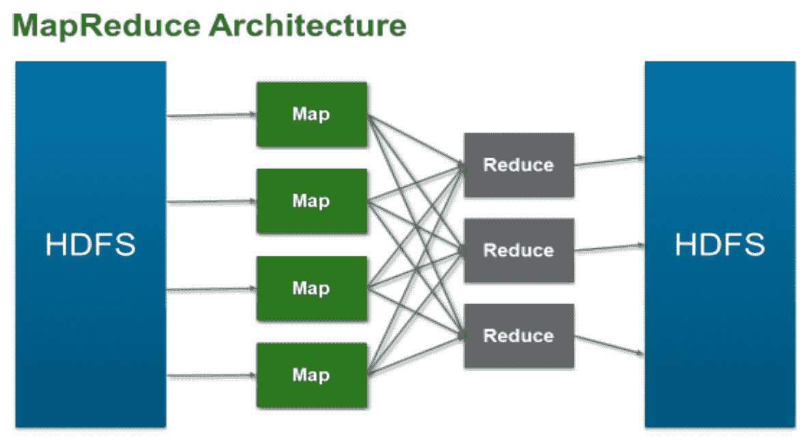

我们将 Hadoop 之旅分为三个阶段：

+   **阶段 1**：这是我们所说的试点阶段；我们通常看到的集群规模在 20 个节点以下。在这个阶段，客户正在尝试了解 Hadoop 的价值，并在许多情况下，证明 Hadoop 在提供新的业务洞察力方面的价值。通常，这个过程从业务线开始，有人希望将 Hadoop 应用于一个或两个用例，通常是在企业收集但未充分利用的数据上。例如，我们与一家石油和天然气公司交谈时，他们收集了所有这些来自油井和钻平台的传感器数据。通过 Hadoop，他们进行了一些有趣的统计分析，并获得了许多有趣的见解。

+   **阶段 2**：一旦在大数据上证明了 Hadoop 的初始价值，企业通常会将其用例规范化，并定期作为生产工作负载运行。在这个阶段，我们常见的一个现象是，随着人们了解到这个生产 Hadoop 集群，他们希望利用它来探索他们的数据；越来越多的作业被添加到集群中，集群开始扩展和增长。我们看到的另一个常见现象是，这不仅仅关乎 MapReduce 和 **Hadoop 分布式文件系统**（**HDFS**）等核心 Hadoop 组件。Hive、Pig、HBase 等其他非核心 Hadoop 组件通常也会添加到集群中。通常，我们看到的生产集群从几十个节点到几百个节点不等，并且可能迅速增长。在这里，通常有专门的 Hadoop 管理员来确保系统的健康。

+   **阶段 3**：在这个阶段，客户在其整个组织中广泛使用 Hadoop，并围绕它建立了关键业务工作流程。例如，对于一家电子商务零售商，推荐引擎现在是其业务的关键部分，而 Hadoop 是工作流程的关键部分。通常，在这个阶段，我们会看到企业将 Hadoop 扩展到其他大数据技术和服务。通常，**大规模并行处理**（**MPP**）数据库、NoSQL 数据库以及更多非核心 Hadoop 组件都是大数据生产系统的一部分。在 Hadoop 节点方面，我们通常看到数百到数千个节点。在极端情况下，像 Yahoo 和 Facebook 这样的公司有数千个节点。

# 部署 BDE 设备

VMware 通过 vSphere BDE 使您能够轻松高效地在现有的虚拟基础设施上部署和使用 Hadoop。BDE 使 Hadoop 具备虚拟化意识，提高了虚拟环境中的性能，并能在几分钟内部署高可用性的 Hadoop 集群。vSphere BDE 自动部署 Hadoop 集群，从而提供更好的 Hadoop 管理性和可用性。

让我们从以下步骤开始：

1.  在 VMware vSphere 客户端中选择“文件”，然后转到部署 VMware-BigDataExtensions-x.x_OVF10.ova。

1.  在“选择源位置”对话框中，点击“本地文件”单选按钮，点击“浏览...”，浏览到身份设备的位置，点击“打开”，然后点击“下一步”：

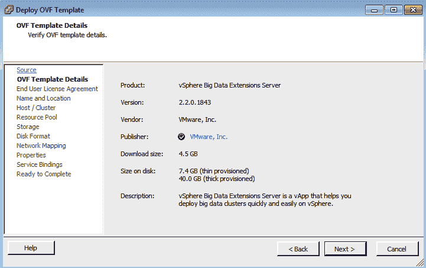

1.  在“查看详细信息”对话框中，查看摘要详细信息，然后点击“下一步”。

1.  在“接受 EULAs”对话框中，通过点击“接受”按钮接受许可协议，然后点击“下一步”。

1.  在“选择名称和文件夹”对话框中，在“名称”文本框中输入虚拟设备的唯一名称。

1.  选择部署虚拟设备所需的文件夹或数据中心位置，然后点击“下一步”。对于 QA 部署，选择 East FP | Pumulus | QA 文件夹。

1.  在“选择资源”对话框中，选择您想要部署虚拟设备的集群，然后点击“下一步”。对于 QA 部署，选择 ECHADMIN01 集群。

1.  在“资源池”对话框中，选择所需的资源池。

1.  选择 QumulusQA VMs 资源组。

1.  在“选择存储”对话框中，从“选择虚拟磁盘格式”下拉列表中选择您想要为虚拟设备使用的磁盘格式。

1.  通过在列表中点击选择您希望放置虚拟设备的存储区域。点击“下一步”。对于 QA 部署，选择 ECHADMIN01-DEV 和 QA-VMX 数据存储区域。

1.  在“磁盘格式”对话框中，选择“精简配置”并点击“下一步”。

1.  在“设置网络”对话框中，使用“目标”下拉列表选择您想要连接虚拟设备的网络，然后点击“下一步”。

1.  对于 QA 部署，选择 xx.xxx.0.0/22。

1.  在“准备完成”对话框中，选中“部署后开启电源”复选框，然后点击“完成”。

# 配置 VMware BDE

我们将部署 vApp，开启电源，然后浏览管理服务器的控制台。在这个 vSphere 环境中配置了四个 Hadoop 集群。右侧的列视图指示每个集群的名称、状态、运行的 Hadoop 发行版、所属的资源池以及节点列表。资源池管理 Hadoop 如何消耗底层物理资源。

在 vSphere 上配置 BDE 的步骤如下：

1.  以 Serengeti 身份登录，并使用以下命令更改 Serengeti 用户密码：

```py
run sudo /opt/serengeti/sbin/set-password –u
```

1.  关闭管理控制台，使用 serengeti 用户 SSH。通过运行以下命令配置 YUM 仓库：

```py
# cd /opt/serengeti/www/yum/repos/centos/6/base/RPMS/
wget http://mirror.centos.org/centos/6/os/x86_64/Packages/mailx-12.4-7.el6.x86_64.rpm
wget http://mirror.centos.org/centos/6/os/x86_64/Packages/wsdl4j-1.5.2-7.8.el6.noarch.rpm
```

1.  如果我们无法使用`wget`连接，请下载`.rpm`文件，然后使用 winscp（开源工具）上传。要创建仓库，请运行以下命令：

```py
createrepo ..
```

# BDE 插件

我们将通过点击主页图标然后选择大数据扩展来访问 BDE 插件。

1.  打开网页浏览器，导航到`https://xx.xxx.x.xx:8443/register-plugin`。请记住，IP 地址将是用户特定的。

1.  选择“安装”单选按钮，填写 vCenter 信息，然后点击“提交”：

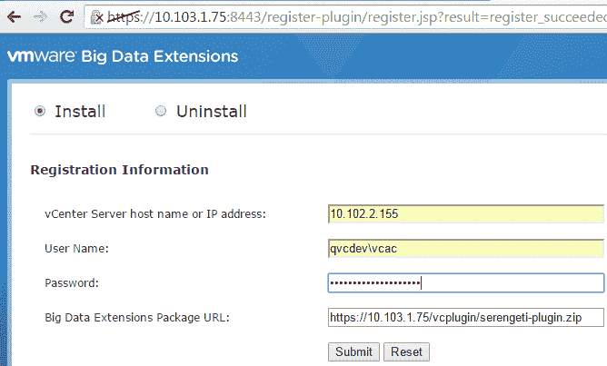

1.  在 vSphere Web 客户端中点击大数据扩展，然后在摘要选项卡中点击“连接服务器...”超链接，通过库存树导航以找到管理服务器：

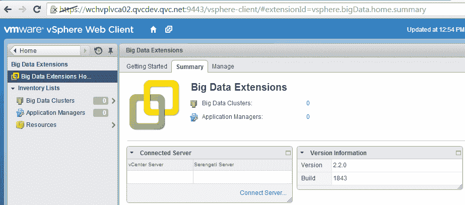

1.  点击 OK 以接受证书。现在服务器已在摘要选项卡中连接。

1.  要设置 Hadoop YUM 仓库，以 root 用户身份 SSH 进入 YUM 仓库服务器。输入 VMware KB 文章中显示的命令（[`kb.vmware.com/s/article/2091054`](https://kb.vmware.com/s/article/2091054)）以配置 Hortonworks 数据平台（HDP）2 YUM。

1.  浏览到新的仓库地址 `http://puppet2.qvcdev.qvc.net/hdp/2/`。我们将为此环境使用现有的 YUM 仓库服务器。

# 在 BDE 上配置发行版。

我们现在将通过 SSH 使用 Serengeti 用户帐户登录到 Serengeti 管理服务器：

1.  使用 PuTTY 通过 SSH 连接到管理服务器，然后在桌面上双击 PuTTY 图标。

1.  点击 SerengetiCLI 会话，然后点击打开。

1.  运行以下命令：

```py
# navigating to the scripts directory

cd /opt/serengeti/sbin
[root@10 sbin]# ./config-dist
ro.rb \
> --name qumulusqahdp \
> --vendor HDP \
> --version 2.x.x \
> --repos http://puppet2.qvcdev.qvc.net/hdp/2/hortonworks-hdp2.repo
```

`qumulushdp` 发行版已成功添加到 `/opt/serengeti/www/distros/manifest`。

旧的清单已备份到 `/opt/serengeti/www/distros/manifest.bak`。

```py
[root@10 sbin]# sudo service tomcat restart
```

1.  登录到 vCenter Web 客户端，并从左侧树中选择大数据扩展。

1.  点击大数据集群，然后点击图标添加新的集群（一个绿色的+号）。

我们现在可以在 Hadoop 发行版中看到新的 HDP 发行版名称。请注意，名称将与运行 `./config-distro.rb` 时指定的参数匹配（`pumulushdp`）。

# vRO 中的 Hadoop 插件。

我们现在可以看到 vRO 如何集成 BDE 插件并运行工作流：

1.  登录到 vRO 配置页面 `https://xx.xxx.x.xx:8283/config_general/General.action`：

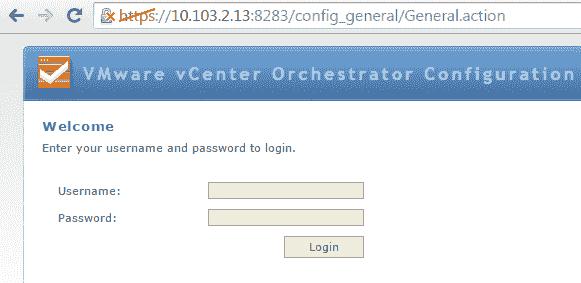

1.  在左侧点击插件选项卡：

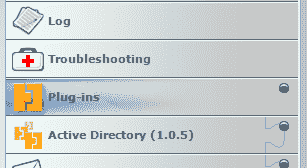

1.  滚动到页面底部并点击放大镜。找到放大镜并选择所需的插件文件：

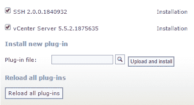

1.  点击上传并安装按钮。

1.  接受许可协议。

这是 VMware vRealize Orchestrator 控制台，通过它可以管理任务：

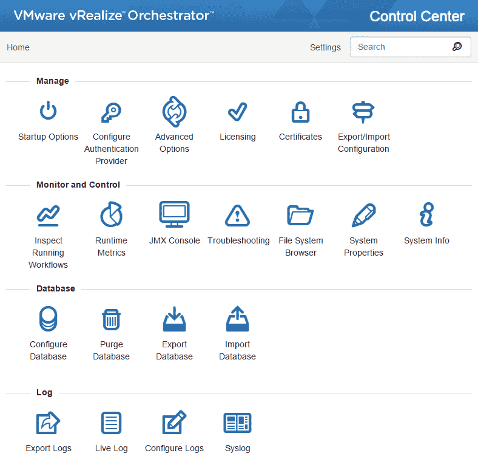

1.  点击启动选项以重启 vRO 服务和重启 vRO 配置服务器。

1.  登录到 vRO 客户端，然后在“运行”下选择工作流。

1.  在库中，你应该能看到 Hadoop 集群作为服务。

1.  展开 Hadoop 集群作为服务，然后展开配置。右键单击配置 Serengeti 主机并点击启动工作流：

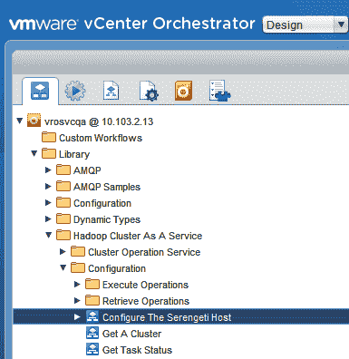

1.  将 Serengeti 管理服务器的 URL 输入为 `https://xx.xxx.x.xx:8443/serengeti`。

1.  以 UPN 格式输入 vCenter 管理员的用户名（例如，`user@domain.com`）。输入管理员的密码并点击提交：

    +   Serengeti 主机的连接 url：例如，`` `https://10103.3.18:8443/serengeti` ``

    +   vCenter Server 用户名：例如，`vrasvcqa@qvcdev.qvc.net`：

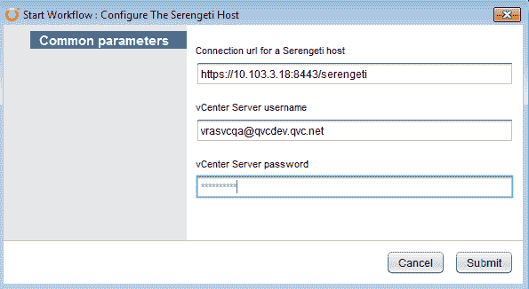

1.  我们遇到了关于导入证书的问题。在表单的最后页，从下拉菜单中选择安装证书…：

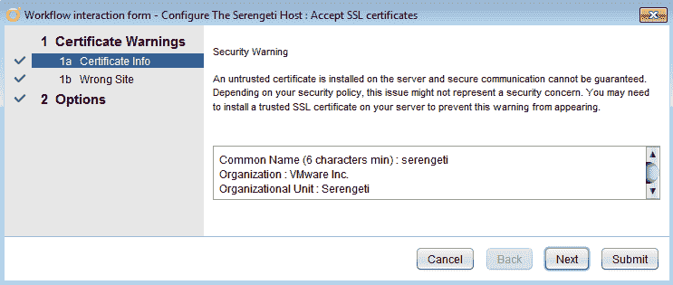

1.  点击下一步，然后点击提交：

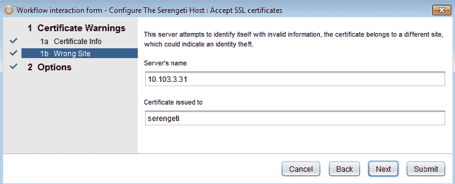

Serengeti 主机现在已完全配置。

我们可以使用 VRO 来配置集群，因为工作流“配置 Serengeti 主机”中硬编码了 30 秒的宿主连接和操作超时值。

以下截图显示了工作流创建设置；用户可以根据他们的需求创建不同的工作流：

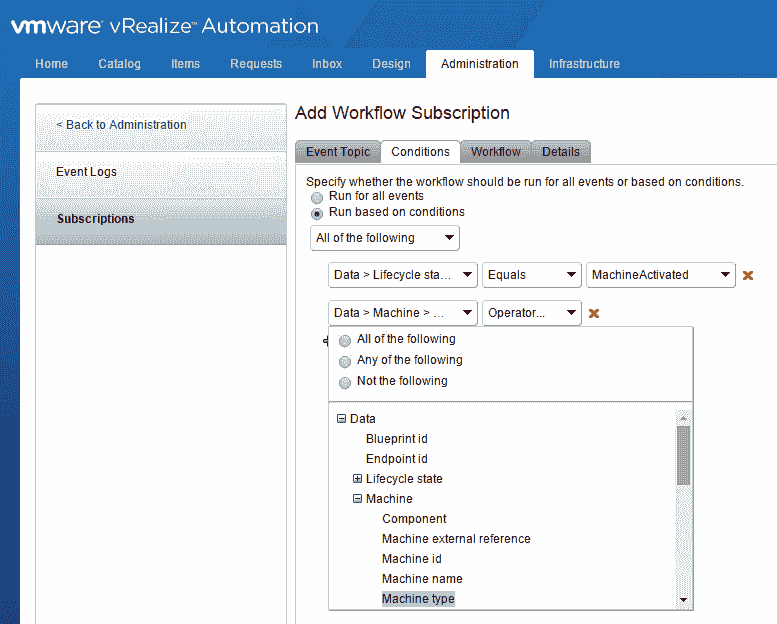

我们必须在 vRA 的 BDE 集群蓝图中选择网络或数据存储资源选项。在 Web 客户端侧应该有一个下拉选项来选择特定的 BDE 资源。这需要在 vRA 蓝图表单中进行定制。配置 Serengeti 主机以添加连接和操作的超时值。我们还有一个从 vSphere Web 控制台选择 BDE 集群大小（小型、中型、大型）的选项。这需要在 vRA 蓝图侧进行定制。

# 开源软件

与传统的专有解决方案相比，组织需要具备很高的技能集来接受开源，因为从头开始构建一个具有所有集成支持的解决方案与利用经过验证的供应商解决方案之间存在很大差异。对于许多企业来说，这些挑战过于艰巨，削弱了开源选择对他们的价值。商业策略、投资以及许多其他因素都会发挥作用。在这些情况下，企业发现，商业支持的开放源代码解决方案或专有解决方案更好地支持他们的战略。客户将数字和在线销售渠道作为其市场进入策略的支柱，开发符合其业务用例独特需求的 OpenStack 的专有实现。

客户已经投入了时间、人才和资源来优化 OpenStack 以满足他们的特定需求。一家主要体育零售商选择了基于开源的解决方案，而不是实施商业版的 OpenStack。VMware Integrated OpenStack 帮助客户节省时间和资源，将他们的技术人才投入到优化其战略中面向客户的输出部分。开源无疑是当今每个公司软件组合中的战略部分。虽然开源软件有其优势，但生产就绪并不是其最突出的属性。还有很多工作要做：将代码达到商业销售产品的标准不是一项微不足道的投资，并且需要专业技能。

从选择到测试、集成和安全，都需要一些组装。对于大多数企业来说，这不是他们想要的投资；他们更愿意投资于他们的核心能力，而不是成为开源项目单一实现的专家。这就是商业提供商，如 VMware，介入提供企业可以依赖的实用、实用的开源软件的地方。

**Open vSwitch**（**OVS**）是 VMware 贡献的另一个例子。该代码已转让给 Linux 基金会协作项目，以获得 VMware 和社区持续的支持，并继续发挥积极作用，因为 VMware 工程师负责 OVS 活跃提交的 70%以上。这些贡献被视为个人贡献，并且整个行业的社区支持持续增长。VMware 正在通过 EdgeX 和**网络功能虚拟化**（**NFV**）在物联网空间进行战略投资，并在**开放网络自动化平台**（**ONAP**）方面拥有专业知识。

**清晰性**是内部创建软件并选择将其开源以惠及更广泛社区的绝佳例子。清晰性是一个 UX/UI 设计框架，因为它帮助开发者和设计师处理应用程序的视觉方面。清晰性是在 VMware 内部开发的，以满足产品的 UI/UX 需求，但它不依赖于 VMware 产品的工作或提供价值。它可以应用于几乎任何环境，因此选择将其开源。清晰性因其活跃的社区、下载次数超过 10 万次以及主页上近 100 万次的浏览量而迅速发展。我们的开源项目还包括帮助开发者提高效率的工具和套件。

挑战式握手认证协议（CHAP）是一个分析未配置的 ELF 核心文件以查找泄漏、内存增长和损坏的工具。

VMware 产品基于开源，我们支持并为其做出贡献，但我们不是开源软件公司。VMware 软件，无论是专有软件还是基于开源，都是生产就绪的：它得到全面支持、全面测试和优化——它是安全的，并准备好部署。

# 考虑包含资本支出（CapEx）和运营支出（OpEx）的解决方案

我们可以看到，使用开源解决方案，资本支出成本随着许可成本的潜在减少而降低，而运营支出成本则随着

部署和维护开源解决方案所需的支持和熟练的技术人力。我们看到资本支出在流行度上上升，这反映了商业现成软件解决方案的许可和支持合同成本，而运营支出则下降，因为修补、升级、增强和保障软件的负担落在供应商身上，而不是企业 IT 部门。

这不是一对一的权衡，而是你必须在整个企业中考虑的事情；这不是一个短期决定；它具有长期、结构和战略影响。如果你在招聘或留住员工方面遇到困难，转向依赖你的知识产权和技术专长来使解决方案工作的开源解决方案可能会使你处于非常脆弱的地位。你可能会被咨询公司或外包公司“牵着鼻子走”，他们承诺在生产操作过程中“手把手”地帮助你。这些成本很少随着时间的推移而降低。另一个要考虑的选项是混合解决方案：商业支持的开放源代码发行版或开源项目的商业化版本。另一个要探索的选项是双层选项：一些公司提供“社区版”，这是他们免费提供的开源项目，并提供第二个版本，通常标记为“企业版”，这是一个销售产品，提供更健壮的软件版本，并得到全面支持。我们可以利用开源来构建我们的策略，并为业务做出正确的决策。因此，从基础开始，我们必须知道我们的应用程序开发人员或 IT 人员在哪里以及如何利用开源，并了解他们选择背后的决策，包括好处以及差距。

当我们的团队开始参与开源项目时，给他们提供指南，让他们对自己的贡献有信心。我们应该有一个单一的联系点，用于关于知识产权、许可类型和合规性以及最佳实践的问题，并首先考虑安全选项。如果我们想创建一个新的开源项目或更深入地参与现有的项目，务必了解战略意图。这是一个长期承诺，需要人才和时间投资，否则我们的努力将徒劳无功，因为它们耗时、分散注意力、花钱，还可能令人烦恼。我们必须评估开源解决方案和专有、供应商支持并销售解决方案之间的选择，因为这是一个战略选择，而不仅仅是购买决定。我们需要权衡资本支出和运营支出的利弊，并仔细评估我们的长期承诺和招聘员工的能力。我们可以讨论以了解成本和好处，以及技术曲线。

# 虚拟化 Hadoop 的好处

虚拟化 Hadoop 的好处如下：

+   **按需配置**：根据定义的政策自动化集群部署过程

+   **持续可用性**：vSphere 内置的 HA 保护保护了单点故障

+   **灵活性**：资源（CPU、内存、网络和存储）可以根据您的需求按需扩展和缩减

+   **多租户环境**：根据安全合规性，运行 Hadoop 的不同租户可以在共享基础设施中隔离

# 用例 - 安全和配置隔离

Hadoop 的认证和授权模型较弱。敏感数据难以保护。它有多个 MapReduce 工作负载，用于生产批处理分析、即席分析和实验任务，不同作业有不同的服务级别协议（SLA）。

我们需要考虑以下因素：

+   在合理的地方，将 HDFS 合并以最小化数据重复

+   高优先级作业获得更多资源，以确保它们按时完成

+   每种类型的作业都可以在任何时候获得尽可能多的资源

+   避免 CPU 和内存争用，以便更好地利用资源，按时完成工作

我们的目的是通过一个大型的共享基础设施来集成 Hadoop 工作负载和其他工作负载。Hadoop MapReduce 框架使用 HDFS 作为底层文件系统来处理大量数据，并使用自己的存储机制。我们还有其他技术，如 HBase 和 Pivotal。

# 案例研究 - 为一家主要媒体提供商自动化应用程序交付

以下是一些挑战：

+   客户要求任何应用程序都必须能够部署到任意数量的后端基础设施，跨越多个私有云

+   一个特定的应用程序（占地面积超过 10,000 台服务器）需要更好的配置程序和工具，以确保达到规定的目标

+   客户当前的配置模型需要彻底改革，因为启动时间长达数周甚至数月，主要是由手动程序组成

以下是解决方案：

+   通过**业务流程管理**（**BPM**）平台/工作流引擎和底层 Java 服务，实现了一个基于版本控制、软件定义的基础设施自动化工作流程方法

+   利用 Puppet 架构进行构建流程和打包，以及面包房工作流程进行镜像

+   通过基于 Ruby 的控制台和报告用户界面（UX）提供操作洞察

+   将 Jira 集成到配置工作流程中，将使交付更加易于使用，因为可以使用熟悉的工具

+   配置了应用程序服务器以及所需的 Memcached 和相关实例数量

+   新系统验证了新配置的基础设施，自动清理任何故障，并自动切换路由规则以提供新基础设施

+   为客户提供必要的工具和模式，以实现可重复操作

+   创建了更好的构建程序和流程，从而产生了更稳定的基础设施变更

+   目标基础设施的部署时间从数周/数月减少到 270 台服务器的 90 分钟

# 摘要

对于许多企业来说，Hadoop 仍然相当新颖，不同的公司在 Hadoop 采用之旅中处于不同的阶段。与几位客户合作后，很明显，根据客户所处的阶段，存在不同的 Hadoop 用例和需求。虚拟化可以帮助解决每个阶段的关键需求。公司内的不同部门可以使用多个 Hadoop 集群。

在公司中管理多个部门的不同集群并保持它们都运行良好是很困难的。我们正在运行多个用例，包括数据挖掘、推荐引擎，以及为我们的在线服务，我们有一个共享的数据集，而不是到处都是重复的数据。我们现在管理的是一个集群，而不是多个集群。

在下一章中，我们将学习如何通过为开发者提供访问传统和现代应用程序开发框架和资源（包括容器服务和开放 API）的权限，在共同的 vSphere 平台上支持云原生应用程序开发。这使基于微服务的架构能够实现更快和更频繁的开发，同时不牺牲安全性、可靠性和治理。

# 进一步阅读

查阅以下资源，以获取本章涵盖主题的更多信息：

+   *Adobe 在 VMware vSphere 上部署 Hadoop 作为服务*，请参阅[`www.vmware.com/files/pdf/products/vsphere/VMware-vSphere-Adobe-Deploys-HAAS-CS.pdf`](http://www.vmware.com/files/pdf/products/vsphere/VMware-vSphere-Adobe-Deploys-HAAS-CS.pdf)

+   *在大型基础设施中虚拟化 Hadoop，EMC 技术白皮书*，请参阅[`community.emc.com/docs/DOC-41473`](https://community.emc.com/docs/DOC-41473)

+   *在高性能服务器上使用 VMware vSphere 6 虚拟化 Hadoop 的性能*，请参阅[`www.vmware.com/resources/techresources/10452`](http://www.vmware.com/resources/techresources/10452)

+   *在 vSphere 上虚拟化 Hadoop 性能的基准测试案例研究*，请参阅[`www.vmware.com/resources/techresources/10222`](http://www.vmware.com/resources/techresources/10222)

+   *事务处理委员会—TPCx-HS 基准测试结果（Dell 提交的 Cloudera 在 VMware 上的性能）*，请参阅[`www.tpc.org/tpcx-hs/results/tpcxhs_results.asp`](http://www.tpc.org/tpcx-hs/results/tpcxhs_results.asp)

+   *ESG 实验室评论：VCE vBlock/systems 与 EMC Isilon 用于企业 Hadoop*，请参阅[`www.esg-global.com/lab-reports/esg-lab-review-vce-vblock-systems-with-emc-isilon-for-enterprise-hadoop/`](http://www.esg-global.com/lab-reports/esg-lab-review-vce-vblock-systems-with-emc-isilon-for-enterprise-hadoop/)

+   *VMware BDE 文档站点：vSphere 大数据扩展 (BDE)*，请参阅[`www.vmware.com/support/pubs/vsphere-big-data-extensions-pubs.html`](https://www.vmware.com/support/pubs/vsphere-big-data-extensions-pubs.html)

+   *VMware vSphere 大数据扩展—管理员和用户指南以及命令行界面用户指南*，请参阅[`www.vmware.com/support/pubs/vsphere-big-data-extensions-pubs.html`](https://www.vmware.com/support/pubs/vsphere-big-data-extensions-pubs.html)

+   *关于 BDE 版本 2.1 的博客文章*，请参阅[`blogs.vmware.com/vsphere/2014/10/whats-new-vsphere-big-data-extensions-version-2-1.html`](http://blogs.vmware.com/vsphere/2014/10/whats-new-vsphere-big-data-extensions-version-2-1.html)

+   *VMware 大数据扩展（BDE）社区讨论*，请参阅[`communities.vmware.com/message/2308400`](https://communities.vmware.com/message/2308400)

+   *使用 VMware vSphere 大数据扩展进行 Apache Hadoop 存储配置*，请参阅[`www.vmware.com/files/pdf/VMware-vSphere-BDE-Storage-Provisioning.pdf`](https://www.vmware.com/files/pdf/VMware-vSphere-BDE-Storage-Provisioning.pdf)

+   *在 VMware vSphere 5 上使用 Hadoop 虚拟化扩展*，请参阅[`www.vmware.com/files/pdf/Hadoop-Virtualization-Extensions-on-VMware-vSphere-5.pdf`](http://www.vmware.com/files/pdf/Hadoop-Virtualization-Extensions-on-VMware-vSphere-5.pdf)

+   *使用大数据扩展在 vSphere 上进行容器编排*，请参阅[`labs.vmware.com/flings/big-data-extensions-for-vsphere-standard-edition`](https://labs.vmware.com/flings/big-data-extensions-for-vsphere-standard-edition)
