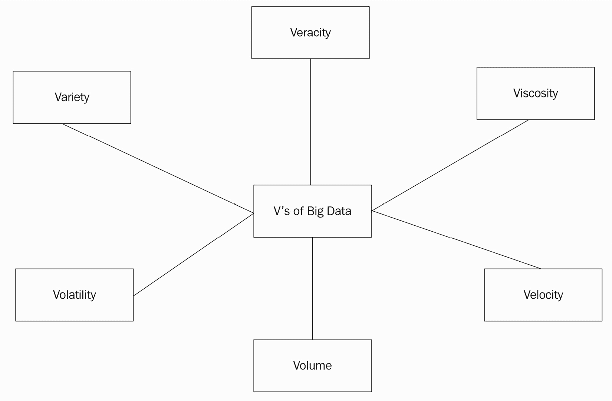
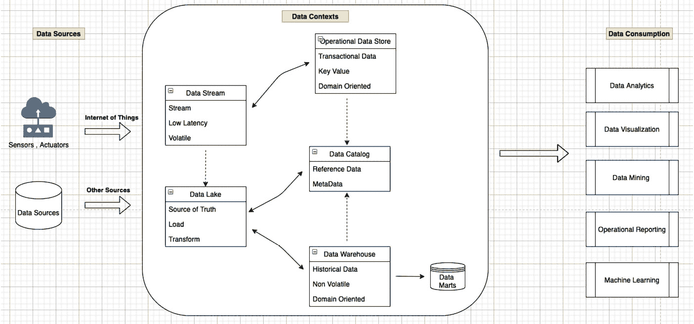
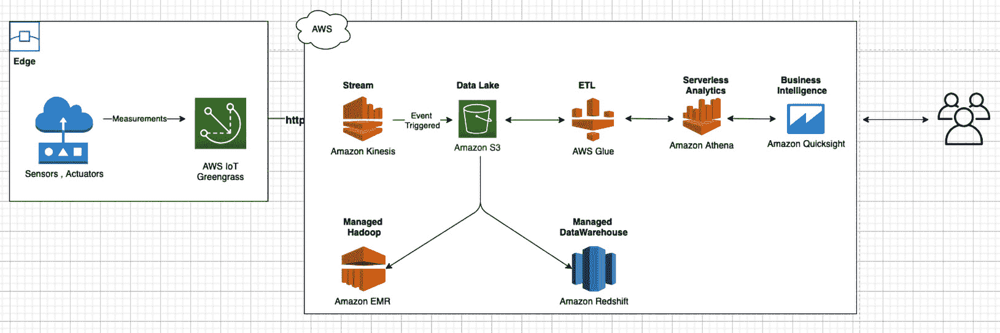
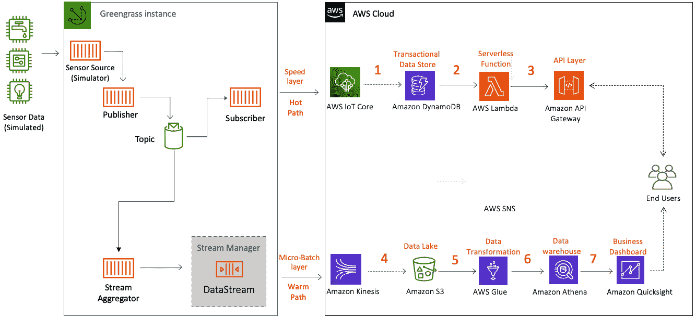
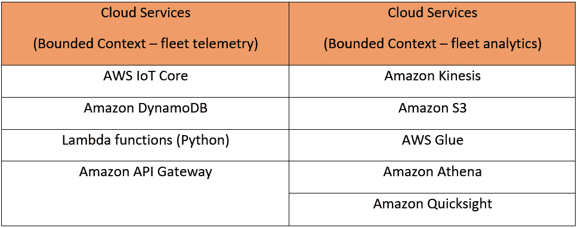
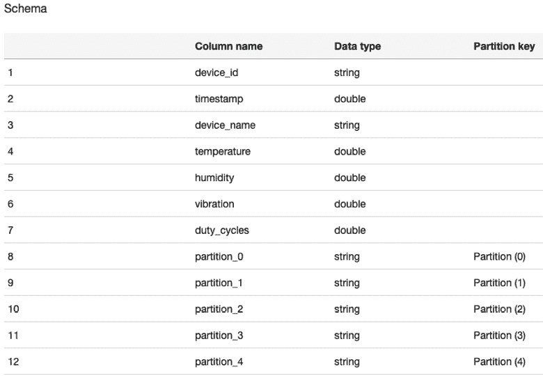

# 第六章：*第六章*：在云上处理和消费数据

边缘计算的价值主张是在数据源附近处理数据，并为不同用例中的不同类型的应用提供智能近实时响应。此外，边缘计算减少了需要传输到云中的数据量，从而节省了网络带宽成本。通常，高性能边缘应用程序需要本地计算、本地存储、网络、数据分析以及机器学习能力，以在低延迟下处理高保真数据。尽管 AWS IoT Greengrass 允许你在设备和网关上运行复杂的边缘应用程序，但与云端的强大计算能力相比，它将受到资源限制。因此，对于不同的用例，利用云计算的规模来满足大量复杂数据处理需求是非常常见的。

在上一章中，你学习了关于边缘数据转换策略的不同设计模式。本章将重点解释如何根据从运行 Greengrass 实例的 HBS 中心收集到的数据速度、数据种类和数据量，在云上构建不同的数据工作流。具体来说，你将学习如何将数据持久化到事务性数据存储中，开发 API 驱动访问，并构建无服务器数据仓库以向最终用户提供数据。因此，本章分为以下主题：

+   为物联网工作负载定义大数据

+   **领域驱动设计**（DDD）概念简介

+   在云上设计数据流模式

+   记住边缘工作负载的数据流反模式

# 技术要求

本章的技术要求与*第二章**，边缘工作负载基础*中概述的要求相同。完整的要求数据见该章节。

# 为物联网工作负载定义大数据

在**大数据**中的“大”是相对的，因为随着企业数字化和连接生态系统的转型，数据流入在过去二十年里从太字节增长到艾字节，数据量大幅增加。大数据技术的出现使得人们（如社交媒体）和企业（如数字化转型）能够生成、存储和分析大量数据。为了分析如此大量的数据集，需要复杂的计算基础设施，该基础设施可以根据输入数据量和所需结果弹性扩展。大数据工作负载的这一特性，加上云计算的可用性，使得所有规模的公司都能够民主化地采用大数据技术。即使在边缘计算的演变中，云上的大数据处理在物联网工作负载中也发挥着关键作用，因为当数据靠近并与其他数据系统丰富时，数据更有价值。在本章中，我们将学习大数据生态系统如何允许对从边缘收集的大量原始测量或事件进行高级处理和分析，从而使得不同角色能够消费可操作信息。

物联网与大数据生态系统的集成开辟了一系列分析能力，这允许生成额外的业务洞察。以下是一些例子：

+   **描述性分析**：这种分析类型帮助用户回答“发生了什么以及为什么？”的问题。例如，传统的查询和报告仪表板。

+   **预测分析**：这种分析形式帮助用户根据历史事件或检测到的异常情况，预测未来某个事件的概率。例如，在银行交易中早期欺诈检测和不同系统的预防性维护。

+   **规范性分析**：这种分析帮助用户提供具体的（清晰的）建议。它们解决的是“如果发生 x，我应该做什么？”的问题。例如，选举活动接触目标选民或财富管理中的统计建模以最大化回报。

这些流程的结果使得组织能够对新的信息、新兴趋势或隐藏的数据相关性有更高的可见性，以提高效率或产生新的收入来源。在本章中，你将了解对从边缘收集的数据进行描述性和预测性分析的方法。此外，你还将学习如何实现设计模式，如将流式传输到数据湖或云上的事务性数据存储，以及利用 API 驱动的访问，这些都被认为是边缘的反模式。因此，让我们开始学习与物联网工作负载相关的大数据设计方法。

## 什么是大数据处理？

大数据处理通常按照三个 V 来分类：数据量（例如，太字节、拍字节或更多），数据种类（即结构化、半结构化或非结构化），以及数据速度（即数据产生或消费的速度）。然而，随着越来越多的组织开始采用大数据技术，V 列表中又增加了以下内容：

+   **粘度**：这强调数据的易用性；例如，可能存在从边缘收集的噪声数据，这些数据不易解析。

+   **易变性**：这指的是数据变化的频率以及因此数据的有用性持续时间；例如，捕捉家庭中的特定事件可能比其他所有活动更有用。

+   **真实性**：这指的是数据的可信度，例如，如果从户外摄像头捕获的图像质量差，那么它们不能被信赖用于识别入侵。

对于边缘计算和物联网（**IoT**），所有六个 V 都相关。以下图表展示了随着物联网和大数据技术的出现而变得可用的数据范围。这要求你考虑根据各自特征以不同方式组织大规模数据：



图 6.1 – 大数据的发展

因此，你已经学习了关于数据建模概念的内容，在*第五章*“从边缘摄取和流式传输数据”，这是一种基于数据类型和关系组织数据到有意义结构的标准方式，并从中提取价值。然而，收集数据，将其存储在流或持久层中，并快速处理以采取智能行动只是故事的一方面。下一个挑战是如何在整个生命周期中保持数据的高质量，以确保它能够为下游应用持续产生业务价值，而不是不一致或风险。对于物联网工作负载，这一点至关重要，因为设备或网关位于物理世界，有时具有间歇性的连接性，并可能受到不同形式的干扰。这就是领域驱动设计（DDD）方法可以提供帮助的地方。

## 什么是领域驱动设计？

为了更好地管理数据质量，我们需要学习如何通过内容如数据域或主题领域来组织数据。其中最常见的方法之一是通过 DDD，这是由埃里克·埃文斯（Eric Evans）在 2003 年提出的。在他的书中，埃里克表示“软件的核心是其解决用户领域相关问题的能力。所有其他功能，尽管它们可能很重要，但都支持这一基本目的”。因此，DDD 是一种围绕业务领域的需求、规则和流程的软件开发方法。

DDD 方法包括两个核心概念：有界上下文和通用语言。让我们更深入地探讨每个概念：

+   **有界上下文**：有界上下文有助于你定义解决方案的逻辑边界。它们可以根据组织的需要，在应用层或业务层实现。然而，核心概念是一个有界上下文应该拥有自己的应用、数据和流程。这允许相关团队在特定领域内清楚地定义他们拥有的组件。这些边界对于管理数据质量和最小化数据孤岛至关重要，因为随着不同的 V 值增长，它们会在组织内部或外部与不同的消费者一起重新分配。例如，使用连接的 HBS 解决方案，HBS 的内部业务功能及其最终消费者可能需要不同的业务能力。这可以包括以下内容：

    +   内部能力（针对组织实体）：

        +   *产品工程*：利用不同的服务或功能

        +   *车队运营*：监控车队健康状况

        +   *信息安全*：监控遵守不同的监管要求，例如 GDPR

        +   更多如 CRM、ERP 和营销

    +   外部能力（针对最终消费者）：

        +   *车队遥测*：处理如恒温器或 HVAC 设备从设备中近实时读取的数据流

        +   *车队监控*：捕获车队健康状况信息或关键事件，例如传感器的故障

        +   *车队分析*：通过其他元数据丰富遥测数据，以考虑不同环境因素（如时间、位置和海拔）进行分析

    以下图表展示了有界上下文的示例：



图 6.2 – 有界上下文

所有这些不同的业务能力都可以定义为有界上下文。因此，现在我们已经确定了业务能力，我们可以在有界上下文中定义技术要求，以实现所需的企业成果。一般规则是，应用、数据或流程应该是内聚的，不应跨越其他上下文的使用。在本章中，我们将主要关注构建外部能力所需的有界上下文，这些能力是由最终消费者使用不同技术实现的。

注意

然而，在现实世界中，在定义一个有界上下文时，可能需要考虑许多额外的因素，例如组织结构、产品所有权等。我们不会深入探讨这些因素，因为它们与这里讨论的主题无关。

+   **通用语言**：DDD 的第二个概念是通用语言。每个边界上下文都应该有自己的通用语言。属于同一边界上下文的应用程序都应该遵循相同的语言。如果边界上下文发生变化，通用语言也应该是不同的。这允许一个团队开发和管理工作负载的边界上下文，因此与 DevOps 方法相一致。这种运营模式使得一个熟悉通用语言的单一团队能够更快地拥有和解决不同的应用程序或数据依赖关系。在本章的后面部分，您将发现不同的边界上下文（或工作流程）是如何使用多种不同的语言实现的。

    备注

    DDD 模型没有规定如何在应用程序或数据管理中确定边界上下文。因此，建议您从您的用例开始，逆向确定适当的内聚性。

因此，基于这个基础，让我们定义一些在云上管理数据的设计原则 – 其中一些将在本章的剩余部分使用。

## 使用 DDD 设计数据工作流程的原则是什么？

我们将概述一系列指导原则（即原则），以了解如何使用领域驱动设计（DDD）设计数据工作负载：

+   *原则 1：通过领域管理数据所有权* – 使用领域的优势在于数据的质量以及易用性。最了解数据的团队拥有并管理它。因此，数据所有权是分散的，而不是集中的。

+   *原则 2：使用边界上下文定义领域* – 领域实现一个边界上下文，反过来，这个上下文又与一个业务能力相联系。

+   *原则 3：将一个边界上下文链接到一个或多个应用程序工作负载* – 一个边界上下文可以包括一个或多个应用程序。如果有多个应用程序，所有这些应用程序都应提供相同业务能力的价值。

+   *原则 4：在边界上下文中共享通用语言* – 负责在其边界上下文中分发数据的应用程序使用相同的通用语言，以确保不同的术语和数据语义不会冲突。每个边界上下文与一个概念数据模型有一对一的关系。

+   *原则 5：保留原始源数据* – 需要保留摄入的原始数据作为集中解决方案中的真相来源。这通常被称为黄金数据集。这将允许不同的边界上下文在发生故障的情况下重复处理数据。

+   *原则 6：将数据与元数据关联* – 随着数据在多样性和数量上的增长，任何数据集都应易于发现和分类。这有助于不同下游应用程序的数据重用，并建立数据血缘。

+   *原则 7：使用合适的工具做合适的工作* – 根据数据工作流程，如速度层或批量层，持久性和计算工具将不同。

+   *原则 8：分层数据存储* – 根据数据的访问模式选择最佳存储层。通过将数据集分布到不同的存储服务中，你可以构建一个成本优化的存储基础设施。

+   *原则 9：保护和管理数据管道* – 实施控制以保护和管理所有静态和传输中的数据。需要一个机制来仅允许授权实体可视化、访问、处理和修改数据资产。这有助于我们保护数据机密性和数据安全。

+   *原则 10：设计以规模为基础* – 最后但同样重要的是，云的一切都是关于规模经济。因此，利用托管服务弹性扩展并可靠地处理任何数据量。

在本章的剩余部分，我们将深入探讨这些设计原则（如果不是全部）作为我们深入研究不同的设计模式、数据流和动手实验室。

# 在云上设计数据模式

当数据通过不同的通道（如通过速度层或批量层）安全地从边缘流向云端时，根据数据速度或数据多样性，将数据存储在不同的临时区域或集中位置是一种常见做法。这些数据源作为单一的真实来源，有助于确保各自边界上下文中数据的品质。因此，在本节中，我们将讨论不同的数据存储选项、数据流模式以及云上的反模式。让我们从数据存储开始。

## 数据存储

正如我们在前面的章节中学到的，由于边缘解决方案在计算资源方面受到限制，根据用例优化应用程序的数量或本地持久化的数据量是很重要的。另一方面，云没有这种限制，因为它几乎拥有无限的资源，以及不同的计算和存储选项。这使得它非常适合大数据应用根据需求增长和收缩。此外，它还提供了轻松访问全球基础设施的便利，以满足不同下游或终端消费者在更靠近他们的地区所需的数据。最后，当数据与其他数据或元数据相结合时，数据更有价值；因此，在最近几年，如数据湖等模式变得非常流行。那么，什么是数据湖呢？

数据湖是一个集中式、安全且耐用的存储平台，允许您摄取、存储结构化和非结构化数据，并根据需要转换原始数据。您可以将数据湖视为在*第五章**，*从边缘摄取和流式传输数据*中引入的数据池塘概念的超集。由于物联网设备或网关的存储相对较低，只有与边缘操作高度相关的、具有高度价值的数据才能在数据池塘中本地持久化：


图 6.3 – 数据湖架构

数据湖架构的一些基本特性在此进行解释：

+   存储原始数据，并确保数据在最小或无转换的情况下安全存储的中心存储。这是数据的单一事实来源。计算层、存储层、模式、摄取频率和数据质量的选取由数据生产者决定。Amazon S3 通常被选作中心存储，因为它是一个高度可扩展、高度耐用且成本效益高的服务，允许计算层和存储层的解耦。AWS 在 Amazon S3 内提供不同的分层选项，以及一个称为 Amazon Glacier 的全面归档服务。

+   存储特定领域的数据集市或以列式格式（如 Parquet、ORC 或 Avro）转换的数据的持久层，以通过边界上下文实现隔离、提高性能或降低成本。AWS 提供不同的服务，如 AWS Glue 进行数据转换和数据目录，Amazon Athena 或 Amazon Redshift 进行数据仓库和数据集市，以及 Amazon EMR 或 EMR 上的 Spark 进行大数据处理管理。

+   存储从边缘安全摄取的事务数据的持久层。这一层通常被称为**操作数据存储**（**ODS**）。AWS 提供不同的服务，可以根据给定的数据结构和访问模式利用这些服务，例如 Amazon DynamoDB、Amazon RDS 和 Amazon Timestream。

您可能想知道数据湖中的数据是如何提供给数据仓库或 ODS 的。这正是数据集成模式发挥关键作用的地方。

## 数据集成模式

**数据集成与互操作性**（**DII**）通过批量、速度和服务层实现。大数据世界中将这些所有层交织在一起的一种常见方法是**提取、转换和加载**（**ETL**）或**提取、加载和转换**（**ELT**）。我们已经在*第五章*，*从边缘摄取和流式传输数据*中详细解释了这些概念，并讨论了它们如何随着时间的推移演变成不同数据流模式，如事件驱动、批量、lambda 和复杂事件处理。因此，我们在此不再重复这些概念。但在下一节中，我们将解释它们如何与云中的数据工作流相关。

## 数据流模式

在本章前面，我们讨论了如何使用边界上下文来隔离针对最终消费者的不同外部能力，如*车队遥测*、*车队监控*或*车队分析*。现在，是时候学习如何使用不同的数据流模式来实现这些概念了。

### 批量（或聚合处理）

让我们考虑一个场景；你发现过去六个月你的电费账单越来越高，你想要比较这段时间内不同设备的利用率。或者，你想要查看更细粒度的信息，比如在过去六个月中洗衣机一天运行了多少次？运行了多长时间？这导致了多少 X 瓦特的消耗？

这就是批量处理发挥作用的地方。在事件驱动架构变得流行之前，它一直是行业的实际标准，并且仍然被广泛用于不同的用例，如订单管理、账单、工资单、财务报表等。在这种处理模式下，大量数据，如数千或数百万条记录（或更多），通常以文件格式（如`TXT`或`CSV`）传输，清洗、转换并加载到关系数据库或数据仓库中。之后，数据用于数据核对或分析目的。典型的批量处理环境还包括一个作业调度器，可以根据数据馈送可用性或业务需求触发生成分析工作流。

为了设计*车队分析*边界上下文，我们设计了以下批量工作流：



图 6.4 – 批量架构

在这个模式中，以下活动正在进行：

+   来自边缘的事件通过流服务（即 Amazon Kinesis）路由到数据湖（即 Amazon S3）。

+   Amazon Kinesis 允许在将数据持久化到数据湖之前，使用额外的元数据对数据进行预处理或增强（如果需要）。

+   数据可以通过 ETL 引擎（即 AWS Glue）进行爬取或转换，并可以使用无服务器分析服务（即 Amazon Athena）轻松查询。Amazon Athena 在底层使用 Presto 引擎，并兼容 ANSI SQL。

+   不同的服务，如 Amazon S3 和 Amazon Athena，通过 JDBC 和 ODBC 连接器提供与 Amazon QuickSight 和不同的第三方**商业智能**（**BI**）工具的集成。

+   Amazon S3 是一个高度可用且耐用的对象存储，它与其他大数据服务集成，例如完全管理的 Hadoop 集群（即 Amazon EMR）或数据仓库（即 Amazon Redshift）。

    有趣的事实

    Amazon EMR 和 Amazon Redshift 通过解耦计算层和存储层来支持大数据处理，这意味着不需要从数据湖将所有数据复制到本地存储。因此，处理变得更加成本效益高，并且从操作上更加优化。

在此边界上下文中使用的通用语言包括以下内容：

+   用于 Amazon Kinesis 流处理的 REST API、Amazon S3 桶上的数据处理和 AWS Glue 上的 ETL 处理

+   在 Amazon Athena 和 Amazon Redshift 上使用 SQL 进行数据分析

+   用于 Amazon EMR 上的数据处理 MapReduce 或 Spark

+   与 Amazon QuickSight 或第三方 BI 工具的 REST API、JDBC 或 ODBC 连接器

批处理非常强大，因为它没有任何窗口限制。在如何关联单个数据点与整个数据集方面有很多灵活性，无论是为了所需的分析结果而以千兆字节或太字节的大小。

### 事件驱动处理

让我们考虑以下场景：您匆匆忙忙离开了家，在通勤途中收到通知，您忘记关上烹饪炉灶。由于您有一个连接的炉灶，您可以从应用程序中立即远程关闭它，以避免火灾风险。 Bingo！

这看起来很简单，但在本地枢纽（如 HBS 枢纽）需要一定程度的智能，并且需要一系列事件来促进这个工作流程。这些可能包括以下内容：

+   从运动传感器、占用传感器或摄像头检测到家中无人。

+   在一段时间内从炉灶传感器捕获多个测量值。

+   使用边缘的本地过程关联事件，以识别这是一个危害场景。

+   将事件流式传输到消息代理，并将其持久化存储在 ODS 中。

+   触发微服务（s）以通知最终用户此事件。

+   根据用户响应解决问题。

因此，正如您所观察到的，在边缘、云和最终用户之间，在短短几秒钟内发生了很多事情，以帮助减轻风险。这就是为什么在过去十年左右的时间里，事件驱动架构等模式变得非常受欢迎。

在 EDA 之前，轮询和 Webhooks 是用于在不同组件之间通信事件的常见机制。轮询效率低下，因为总是存在从数据源获取新更新并将其与下游服务同步的滞后。Webhooks 并不总是首选，因为它们可能需要自定义授权和身份验证配置。简而言之，这两种方法都需要额外的工作来集成或存在扩展问题。因此，您有事件的概念，它可以被过滤、路由，并以较小的带宽和较低的资源利用率推送到不同的其他服务或系统，因为数据是以小事件或数据集的流的形式传输的。类似于边缘，流式处理允许数据在到达时进行处理，而不会产生任何延迟。

通常，事件驱动架构有两种拓扑，即中介拓扑和代理拓扑。我们在这里进行了解释：

+   **中介拓扑**：在事件处理中需要一个中央控制器或协调器。这在存在一系列处理事件的步骤时通常很有用。

+   **代理拓扑**：没有中介，因为事件通过代理广播到不同的后端消费者。

由于它将边缘与云解耦并允许整体解决方案更好地扩展，因此边缘工作负载中非常常见的代理拓扑。因此，对于车队遥测边界上下文，我们设计了一个使用代理拓扑的事件驱动架构，如下所示。

在以下数据流中，从连接的 HBS 中心（即边缘）流出的事件通过 MQTT 路由到物联网网关（即 AWS IoT Core），这允许通过内置的规则引擎（如果需要）过滤数据，并将数据持久化到 ODS（即 Amazon DynamoDB）。Amazon DynamoDB 是一个高性能的非关系型数据库服务，可以根据从数百万边缘设备流出的数据量自动扩展。从上一章，您应该已经熟悉了如何建模数据以及如何优化 NoSQL 数据库以适应时间序列数据。一旦数据在 Amazon DynamoDB 中持久化，就可以使用无服务器函数（即 AWS Lambda）在数据上执行**创建、读取、更新和删除**（**CRUD**）操作。最后，数据通过 API 访问层（即 Amazon API 网关）以同步或异步的方式提供。

![图 6.5 – 流式架构]

![图片 B17595_06_05.jpg]

![图 6.5 – 流式架构]

在此边界上下文中使用的通用语言包括以下内容：

+   使用 SQL 访问 DynamoDB 表

+   使用 Python 开发 lambda 函数

+   用于 API 网关和 DynamoDB 访问的 REST API

流处理和事件驱动架构（EDA）对于许多需要近乎实时关注的物联网用例非常强大，例如警报、异常检测等，因为它在数据到达时立即分析数据。然而，每个架构都有权衡，EDA 也不例外。由于流处理的结果可以立即提供，因此对特定数据点的分析不能考虑未来的值。即使是过去的数据，也受到较短的间隔限制，这通常通过不同的窗口机制（如滑动、滚动等）来指定。这正是批量处理发挥关键作用的地方。

### 复杂事件处理

让我们考虑以下场景，您计划在家减少食物浪费。因此，每次您在杂货店签到时，您都会收到一个通知，列出了冰箱（或食品架）中即将过期的易腐物品，因为这些物品甚至还没有被打开或利用率低，即将到期。

这可能听起来像是一个容易解决的问题，但需要在本地枢纽（例如 HBS 枢纽）有一定的智能处理，以及在云端的复杂事件处理工作流程来促进这一点。它可能包括以下内容：

+   基于位置共享和用户行为，识别用户计划进行购物的事件模式（或特殊事件）。

+   从冰箱或食品架中安装的摄像头传感器检测到一些易腐物品即将到期。或者，使用气味传感器来检测腐烂食品的模式。

+   通过状态机关联所有这些模式（即用户、位置和食品到期日期），并应用业务规则以识别需要关注的物品清单。

+   触发微服务（s）将此信息通知最终用户。

对于餐饮业来说，由于易腐物品的数量和它们运营的规模，这个问题可能会变得更加复杂。在这种情况下，基于当前实践对浪费的近实时可见性可以帮助企业优化其供应链并节省大量成本。因此，正如你可以想象的那样，边缘和物联网与 CEP（复杂事件处理）等大数据处理能力的结合可以帮助解决具有挑战性的用例。

与通过关联事件来识别模式相比，以小块或批量处理到达的事件进行处理和查询相对容易。这就是 CEP 发挥作用的地方。它被认为是流处理的一个子集，重点是通过对多个来源的事件进行关联或通过监听更长时间段的遥测数据来识别特殊（或复杂）事件。实现 CEP 的常见模式之一是通过构建状态机。

在以下流程中，从连接的 HBS 枢纽（即边缘）流出的事件通过 MQTT 路由到物联网网关（即 AWS IoT Core），该网关根据设定的标准过滤复杂事件，并将它们推送到复杂事件处理引擎（即 AWS IoT 事件）内部定义的不同状态机。AWS IoT 事件是一个完全管理的 CEP 服务，允许您监控设备或设备车队以检测故障或操作变化，然后根据定义的事件触发操作：

![图 6.6 – CEP 架构

![img/B17595_06_06.jpg]

图 6.6 – CEP 架构

在车队监控的边界上下文中使用的通用语言包括以下内容：

+   复杂事件处理的状态机

+   用于通知或订阅的 REST API 通过**Amazon Simple Notification Service**（**SNS**）

CEP 对于许多需要根据来自多个传感器、时间线或其他环境因素的事件进行关注的物联网用例非常有用。

在设计现实生活中的物联网工作负载时，可能需要考虑许多其他设计模式。这些可能是功能性的或非功能性的要求，例如为了合规要求进行数据归档、为了冗余进行数据复制以及为了实现所需的 RTO 或 RPO 进行灾难恢复；然而，这些内容超出了本书的范围，因为这些是通用原则，并不一定与边缘计算或物联网工作负载相关。如果这些主题对您感兴趣，有许多其他书籍或资源可供参考。

## 云端数据流反模式

使用边缘设备在云端处理数据的反模式可以通过三个定律——物理学定律、经济学定律和土地法——来更好地解释：

+   **物理学定律**：对于需要低延迟的使用案例，通常将数据处理更靠近事件源是最佳方法，因为我们无法超越光速，因此往返延迟可能无法承受。让我们考虑一个场景，自动驾驶汽车在检测到行人后需要紧急制动；它无法承受从云端返回的往返延迟。这一因素对于物理上偏远的环境也很相关，例如采矿、石油和天然气设施，这些地方网络覆盖差或间歇性。即使在我们这里的使用案例中，如果出现电力或网络故障，中心节点仍然需要足够智能，能够通过分析本地事件来检测入侵。

+   **经济学定律**：与网络成本相比，过去几十年中计算和存储的成本呈指数级下降，但网络成本在规模上可能仍然过高。尽管数字化转型导致了不同行业数据量的激增，但其中大部分数据质量较低。因此，边缘的数据聚合和过滤将允许您仅将高价值数据发布到云端，从而降低网络带宽成本。

+   **土地法**：大多数行业需要遵守与数据主权相关的法规或合规要求。因此，在特定设施、地区或国家本地保留数据可能是数据处理的关键因素。即使在我们这里与连接的 HBS 相关的使用案例中，工作负载可能需要符合 GDPR 要求。

AWS 提供不同的边缘服务来支持需要遵守上述法律的使用案例，而不仅限于物联网服务。例如，考虑以下情况：

+   **基础设施**：AWS Local Zones、AWS Outposts 和 AWS Wavelength

+   **网络**：Amazon CloudFront 和 POP 位置

+   **存储**：AWS Storage Gateway

+   **坚固且断开连接的边缘设备**：AWS Snowball Edge 和 AWS Snowcone

+   **机器人技术**：AWS Robomaker

+   **视频分析**：Amazon Kinesis Video Streams

+   **机器学习**：Amazon Sagemaker Neo、Amazon Sagemaker Edge Manager、Amazon Monitron 和 AWS Panorama

上述服务超出了本书的范围，信息仅提供给你，以便你能够全面了解 AWS 边缘服务的广度和深度。

# 通过实验室的动手方法

在本节中，你将学习如何利用本章学到的概念在云上设计一个架构。具体来说，你将继续使用在*第五章*，“从边缘摄取和流式传输数据”中引入的 lambda 架构模式，在云上处理数据：



图 6.7 – 动手架构

在上一章中，你已经完成了步骤 1 和 4。本章将帮助你完成步骤 2、3、5、6 和 7，包括消费遥测数据和构建用于执行 BI 的分析管道：



图 6.8 – 动手实验室组件

在本节动手实践中，你的目标包括以下内容：

1.  查询 ODS。

1.  构建一个 API 接口层以启用数据消费。

1.  在数据湖中为处理遥测数据构建 ETL 层。

1.  通过 BI 工具可视化数据。

## 构建云资源

本实验建立在你在*第五章*，“从边缘摄取和流式传输数据”中已部署的云资源之上。因此，请确保你在继续以下步骤之前已经完成了那里的动手实践部分。此外，请继续从`chapter 6/cfn`文件夹部署 CloudFormation 模板，以创建本实验所需的资源，例如 AWS API 网关、lambda 函数和 AWS Glue 爬虫。

注意

请从*第五章*，“从边缘摄取和流式传输数据”中已部署的 CloudFormation 堆栈的*输出*部分检索此 CloudFormation 模板所需的参数（例如 S3 存储桶）。

此外，你还可以从已部署的 CloudFormation 堆栈的*资源*或*输出*部分找到本实验所需的具体资源名称（例如 lambda 函数）。将它们复制到本地记事本中是一个好习惯，这样你可以快速参考它们。

一旦 CloudFormation 成功部署，请继续以下步骤。

## 查询 ODS

导航到 AWS 控制台，并尝试从操作（或事务）数据存储中持久化的数据中生成洞察。正如你在上一章所学，所有近实时处理的数据都持久保存在 DynamoDB 表中（`packt_sensordata`）：

1.  要查询数据，请导航到**DynamoDB 控制台**，从左侧面板中选择**表**，点击表，然后点击**查看项目**。

1.  在 `device_id` 分区键中点击 `1`，然后点击**运行**。这应该会返回包含所有属性的数据点集。

1.  展开过滤器部分，并添加以下属性的过滤器：

    +   `温度`。

    +   `湿度`。

    +   **类型** – **数字**。

    +   **条件** – **大于或等于**。

    +   **值** – **35**。

    +   点击**运行**。

    在这里，查询接口允许您根据不同的标准快速过滤数据。如果您熟悉 SQL，您还可以尝试 DynamoDB 控制台上的 PartiQL 编辑器。

1.  此外，DynamoDB 允许您扫描整个表或索引，但这通常是一个昂贵的操作，尤其是对于大数据集。要扫描表，请点击**扫描**标签（位于**查询**标签旁边），然后点击**运行**。

为了获得更好的性能和更快的响应时间，我们建议您使用**查询**而不是**扫描**。

### AWS Lambda

除了在数据上具有交互式查询功能外，您通常还需要为各种其他角色（如消费者、车队运营商等）构建表示层和业务逻辑来访问数据。您可以使用 Lambda 定义业务逻辑层：

1.  导航到 **AWS Lambda** 控制台。点击左侧面板中的**函数**，然后选择之前使用 CloudFormation 模板创建的函数。

1.  您还记得我们在*第五章*，“从边缘摄取和流式传输数据”的数据建模练习中创建了两个方面（`getItems` 和 `putItems`）来访问数据吗？以下是在 Lambda 函数中嵌入的逻辑，以实现等效的功能结构。请审查代码以了解 `get` 和 `put` 功能是如何工作的：

    ```py
      try {
        switch (event.routeKey) {
          case "GET /items/{device_id}":
            var nid = String(event.pathParameters.id);
            body = await dynamo
              .query({
                TableName: "<table-name>",
                KeyConditionExpression: "id = :nid",
                ExpressionAttributeValues: {
                  ":nid" : nid
                }
              })
              .promise();
            break;
          case "GET /items":
            body = await dynamo.scan({ TableName: "<table-name>" }).promise();
            break;
          case "PUT /items":
            let requestJSON = JSON.parse(event.body);
            await dynamo
              .put({
                TableName: "<table-name>",
                Item: {
                  device_id: requestJSON.id,
                  temperature: requestJSON.temperature,
                  humidity: requestJSON.humidity,
                  device_name: requestJSON.device_name
                }
              })
              .promise();
            body = `Put item ${requestJSON.id}`;
            break;
          default:
            throw new Error(`Unsupported route: "${event.routeKey}"`);
        }
      } catch (err) {
        statusCode = 400;
        body = err.message;
      } finally {
        body = JSON.stringify(body);
      }
      return {
        statusCode,
        body,
        headers
      };};
    ```

请注意，在这里，我们使用 Lambda 函数。这是因为无服务器函数已成为处理近实时事件驱动数据的一种常见模式。由于它减轻了您在整个应用程序生命周期中管理或操作任何服务器的需求，您的唯一责任是使用支持的语言编写代码并将其上传到 Lambda 控制台。

有趣的事实

AWS IoT Greengrass 为边缘设备提供 Lambda 运行时环境，以及 Python、Java、Node.js 和 C++ 等多种语言。这意味着您不需要管理两个不同的代码库（例如嵌入式和云）或多个开发团队。这将缩短您的开发时间，从边缘到云实现统一的开发生态，并加速您的上市时间。

### Amazon API 网关

现在业务逻辑已经使用 Lambda 函数开发，让我们使用 Amazon API 网关创建 HTTP 接口（即表示层）。这是一个用于创建、管理和大规模部署 API 的托管服务：

1.  导航到使用 CloudFormation 模板创建的 `MyPacktAPI`。

1.  展开 REST 方法。

1.  您应该观察以下操作：

    ```py
    /items GET – allows accessing all the items on the DynamoDB table (can be an expensive operation)
    ```

1.  在**开发**下拉菜单下继续操作。点击**授权**并检查相应的操作。在这个实验室中，我们没有附加任何授权者，但在实际工作中推荐使用。API 网关提供了不同形式的授权者，包括内置的 IAM 集成、**JSON Web Tokens**（**JWT**）或使用 lambda 函数的自定义逻辑。

1.  接下来，点击`/items GET`)。在右侧面板中，您将看到相关的 lambda 函数。为了简化，我们在这里对所有操作使用相同的 lambda 函数，但您可以选择其他函数或目标，例如 Amazon SQS、Amazon Kinesis、您 VPC 中的私有资源，或者根据您的实际用例需要，任何其他 HTTP URI。

1.  API 网关提供了许多与 CORS、重新导入/导出和节流相关的附加选项，但它们不在本实验室的范围内。相反，我们将专注于执行 HTTP API 并检索传感器数据。

1.  在您的设备终端中点击`GET`) `items`：

    ```py
    a. Query all items from the table 
    curl https://xxxxxxxx.executeapi.<region>.amazonaws.com/items
    ```

    您应该在终端上看到一个长列表的项目，这些项目是从`dynamodb`表中检索出来的。

亚马逊 API 网关允许您创建不同类型的 API，之前配置的那个就属于 HTTP API 类别，它允许访问 lambda 函数和其他 HTTP 端点。此外，我们在这里也可以使用 REST API，但选择了 HTTP 选项，因为它使用简单，可以自动部署所需的 API 而无需额外努力，并且可能更经济高效。总之，您现在已经通过查询或 API 接口完成了 ODS 边界上下文的实现。

## 构建分析工作流

在下一节中，您将在 Amazon S3 上持久化的批量数据上构建一个分析管道（即数据湖）。为此，您可以使用 AWS Glue 爬取数据并生成数据目录。之后，您将使用 Athena 进行交互式查询，并使用 QuickSight 通过图表/仪表板可视化数据。

### AWS Glue

AWS Glue 是一项托管服务，提供了许多 ETL 功能，如数据爬虫、数据目录、批量作业、与 CI/CD 管道的集成、Jupyter 笔记本集成等。主要来说，您将在本实验室中使用数据爬虫和目录功能。我们认为这应该足够满足物联网专业人士的需求，因为数据工程师在现实世界中将主要负责这些活动。然而，如果您相信学习并对此好奇，请随意探索其他功能：

1.  导航到**AWS Glue**控制台，点击左侧面板中的**爬虫**，并使用 CloudFormation 模板选择之前创建的爬虫。

1.  查看爬虫定义的一些关键属性，如下所示：

    +   状态：爬虫是否已准备好运行？

    +   调度：爬虫的频率设置正确吗？

    +   数据存储：S3。

    +   包含路径：数据集的位置是否正确？这应该指向原始传感器数据存储桶。

    +   配置选项：表定义是否根据上游更改在目录中更新？

1.  此外，Glue 允许您通过其分类器功能处理不同的数据格式。您可以使用内置的分类器处理最常见的数据格式，如 Grok、XML、JSON 和 CSV，如果您有专有格式的数据，还可以指定自定义模式。

1.  在这里，爬虫应该按照通过 CloudFormation 配置的指定计划运行；然而，您也可以通过点击 **运行爬虫** 来按需运行它。如果您这样做，请等待爬虫完成从 **启动** -> **运行** -> **停止** -> **就绪** 状态的转换。

1.  现在数据抓取已完成，导航到 `*packt*` 已创建。如果您已经创建了大量的表，另一个快速选项是使用搜索按钮并筛选 `packt_gluedb`。

1.  点击表以验证属性，例如数据库、位置、输入/输出格式和表架构。确认架构是否显示了您希望保留的属性。如果不是，您可以点击 **编辑** 架构并进行必要的更改：

    图 6.9 – Glue 中的表架构

1.  记录数据库和表名，因为您在下一两个部分中需要它们。

在这个实验中，您只使用了一个数据源进行爬取；然而，如果您的用例需要，您可以添加多个数据源。一旦数据目录更新并且数据（或元数据）可用，您可以通过不同的 AWS 服务来消费它们。您可能还需要经常清理、筛选或转换您的数据。然而，这些责任通常不是由物联网从业者执行的，主要是由数据分析师或数据科学家负责。

### Amazon Athena

Amazon Athena 作为无服务器数据仓库，您可以在由 Glue 等 ETL 引擎整理的数据上运行分析查询。Athena 使用读取时模式；因此，当您运行查询时，架构会被投影到您的数据上。由于 Athena 允许计算层和存储层的解耦，您可以将不同的数据湖服务（如 S3）连接起来以运行这些查询。Athena 使用 Apache Hive 进行 DDL 操作，如定义表和创建数据库。对于通过查询支持的不同功能，底层使用 Presto。Hive 和 Presto 都是开源 SQL 引擎：

1.  导航到 **AWS Athena** 控制台，并从左侧面板中选择 **数据源**。

1.  保持数据源为 `packt_gluedb`：

    +   这是在上一节中由 Glue 爬虫自动创建的，在扫描存储批处理传感器数据的 S3 目标存储桶之后。

1.  这应该会填充在此数据库下创建的表列表。

1.  点击与`*mysensordatabucket*`名称相似的表旁边的三个点，选择**预览表**。这将自动构建并执行 SQL 查询。

这应该会显示只有 10 条记录的数据结果。如果您想查看整个数据集，请从查询末尾删除 10 个参数的限制。如果您熟悉 SQL，请随意调整查询并尝试不同的属性或连接条件。

备注

在这里，您处理了从 HBS 中心设备流出的 JSON 数据。但如果您的组织希望利用更轻量级的数据格式呢？Athena 通过使用**序列化-反序列化**（**SerDe**）库原生支持各种数据格式，如`CSV`、`AVRO`、`Parquet`和`ORC`。即使是复杂的模式也通过正则表达式得到支持。

到目前为止，您已经从数据湖中爬取了数据，创建了表，并成功查询了数据。现在，在最后一步，让我们学习如何构建可以在此数据上启用 BI 的仪表板和图表。

### QuickSight

作为物联网从业者，构建业务仪表板可能不是您核心职责的一部分。然而，一些基本知识总是有用的。如果您考虑传统的 BI 解决方案，数据工程师可能需要几周或几个月的时间来构建复杂的交互式即席数据探索和可视化能力。因此，业务用户被限制在预定义的报告和预选查询中。此外，这些传统的 BI 解决方案需要大量的前期投资，并且当数据源规模增长时，其性能不如 Amazon QuickSight。这就是 Amazon QuickSight 发挥作用的地方。它是一个易于使用、高度可扩展且支持业务所需复杂功能的管理服务：

1.  导航到 Amazon QuickSight 控制台并完成如这里所述的一次性设置：

    +   如果您之前没有使用过，请注册标准版。

    +   为实验室购买 SPICE 容量

    +   注意，这有一个 60 天的试用期，所以请确保在研讨会结束后取消订阅，以防止被收费。

    +   点击右上角的登录用户，然后选择**管理 QuickSight** | **安全与权限** | **添加和删除** | **检查 Amazon Athena** | **应用**。

    +   点击左上角的 QuickSight 标志以导航到主页。

    +   点击右上角的登录用户，您将观察到您的区域首选项列在您的语言首选项下方。

    +   确认或更新区域，使其与您的作业区域相匹配。

1.  点击**新建分析**，然后**新建数据集**，并选择**Athena**。

1.  将数据源名称输入为`packt-data-visualization`，保持工作组为其默认设置，然后点击**创建数据源**。

1.  保持目录为**默认**，选择**数据库**，然后选择在*AWS Glue*部分的*步骤 5*中创建的表。

1.  点击**选择**，选择直接查询你的数据，然后再次点击**可视化**。

1.  现在构建仪表板：

    +   选择 X 轴的日期时间戳（从**值**下拉菜单中选择**分钟**）。

    +   选择其他读取值，如**device_id**、**温度**和**湿度**作为 Y 轴（从每个读取的**值**下拉菜单中选择**平均值**）。

随意尝试不同的字段或视觉类型来可视化其他智能家居相关的信息。正如你可能观察到的，在创建数据集时，QuickSight 原生支持不同的 AWS 和第三方数据源，如 Salesforce、ServiceNow、Adobe Analytics、Twitter、Jira 等。此外，它允许通过移动应用（如 iOS 和 Android）为商业用户或操作快速推断特定工作负载的数据洞察，同时还集成了机器学习增强。

恭喜！你已经使用不同的 AWS 应用程序和数据服务完成了云上数据处理的整个生命周期。现在，让我们通过摘要和知识检查问题来结束本章。

挑战区域（可选）

在*Amazon API 网关*部分，你构建了一个接口来检索`dynamodb`表中的所有项目。然而，如果你需要提取特定设备（如 HVAC）的特定项目（或项目集），这可以比扫描所有数据更节省成本。

`GET /items {device_id}`. 检查 lambda 函数以更好地理解它如何映射到后端逻辑。

# 摘要

在本章中，你了解了与物联网工作负载相关的大数据概念。你学习了如何使用 DDD 方法设计数据流，以及与物联网工作负载常见的不同数据存储和数据集成模式。你实现了一个 lambda 架构来处理车队遥测数据和数据分析管道。最后，你通过通过 API 消费数据和通过业务仪表板可视化来验证了工作流程。在下一章中，你将学习如何使用所有这些数据来构建、训练和部署机器学习模型。

# 知识检查

在继续下一章之前，通过回答这些问题来测试你的知识。答案可以在书的末尾找到：

1.  你能想到至少两个从边缘工作负载的角度来看领域驱动设计的优势吗？

1.  对或错：边界上下文和通用语言是相同的。

1.  你认为要有一个可操作的数据存储或数据湖/数据仓库需要什么？

1.  你能回忆起将流式处理和批量工作流程结合在一起的设计模式名称吗？

1.  你可以采用什么策略来将云上的原始数据转换？

1.  对或错：你不能通过 API 访问 NoSQL 数据存储中的数据。

1.  你会在什么情况下使用中介拓扑而不是代理拓扑来处理事件驱动的工作负载？

1.  你能想到使用无服务器函数处理物联网数据至少一个好处吗？

1.  你可以使用哪些**商业智能**（**BI**）服务向最终消费者展示数据？

1.  对或错：JSON 是云上大数据处理最优化数据格式。

1.  你会如何在你的运营数据存储（或数据湖）上构建 API 接口？

# 参考文献

查看以下资源，以获取本章讨论的概念的更多信息：

+   *数据管理 - 知识体系*：[`www.dama.org/cpages/body-of-knowledge`](https://www.dama.org/cpages/body-of-knowledge)

+   *埃里克·埃文斯的领域驱动设计*：[`www.amazon.com/Domain-Driven-Design-Tackling-Complexity-Software-ebook/dp/B00794TAUG`](https://www.amazon.com/Domain-Driven-Design-Tackling-Complexity-Software-ebook/dp/B00794TAUG)

+   *领域语言*：[`www.domainlanguage.com/ddd`](https://www.domainlanguage.com/ddd)

+   *AWS 上的大数据*：[`aws.amazon.com/big-data/use-cases/`](https://aws.amazon.com/big-data/use-cases/)

+   *AWS 无服务器数据分析管道*：[`d1.awsstatic.com/whitepapers/aws-serverless-data-analytics-pipeline.pdf`](https://d1.awsstatic.com/whitepapers/aws-serverless-data-analytics-pipeline.pdf)

+   AWS 上的现代无服务器架构：[`d1.awsstatic.com/architecture-diagrams/ArchitectureDiagrams/mobile-web-serverless-RA.pdf?did=wp_card&trk=wp_card`](https://d1.awsstatic.com/architecture-diagrams/ArchitectureDiagrams/mobile-web-serverless-RA.pdf?did=wp_card&trk=wp_card)

+   *BI 工具*：[`aws.amazon.com/blogs/big-data/tag/bi-tools/`](https://aws.amazon.com/blogs/big-data/tag/bi-tools/)
