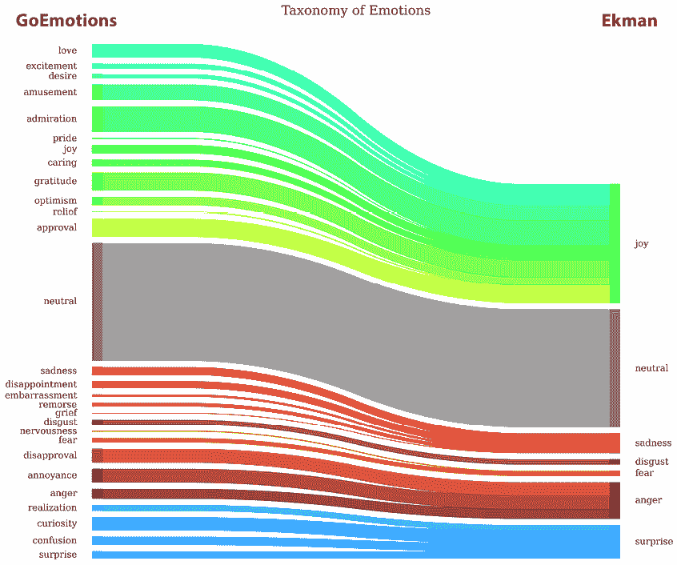
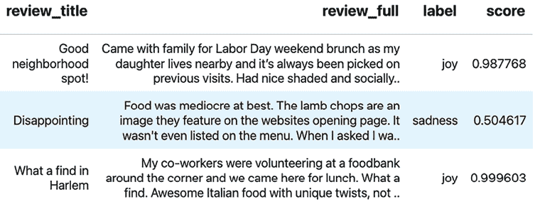
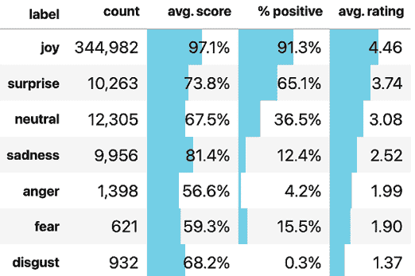
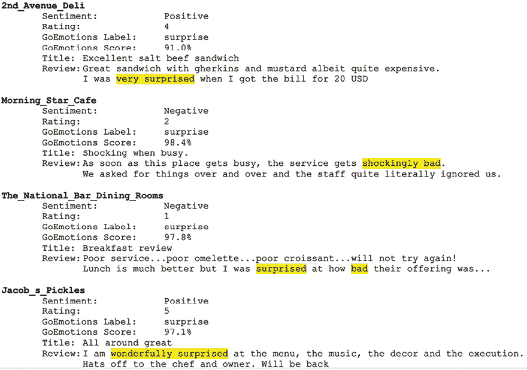
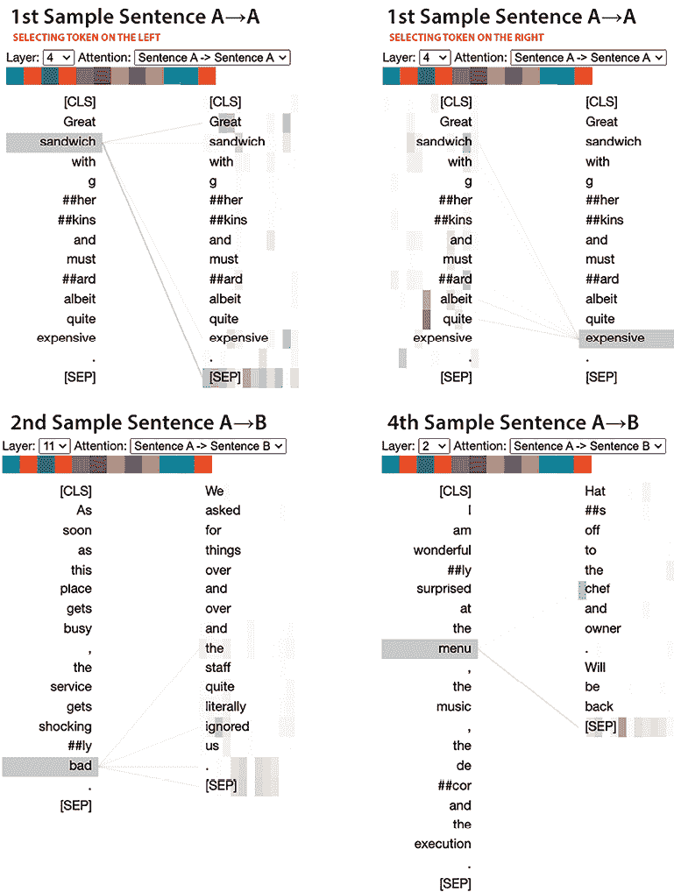
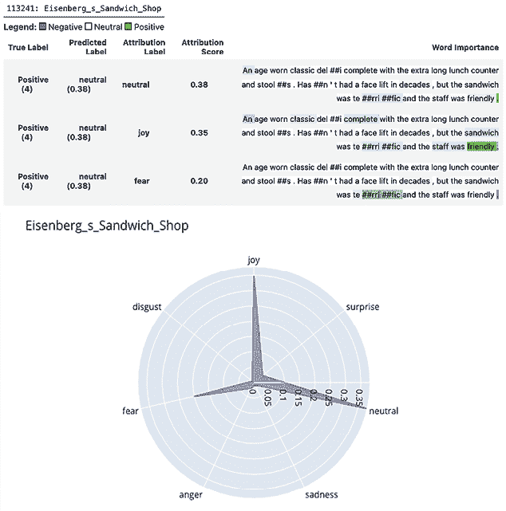
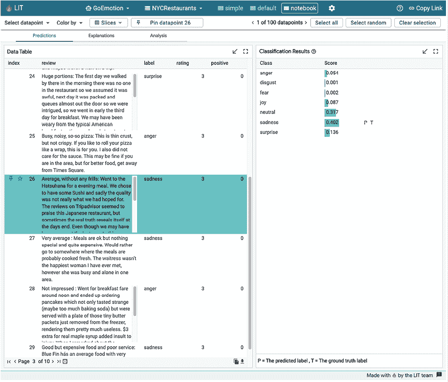
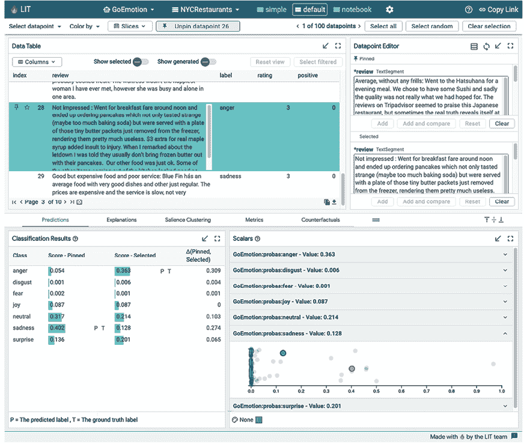
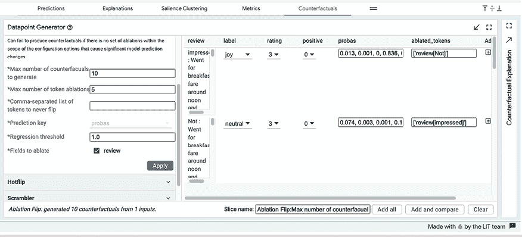

# 第八章：解释 NLP Transformer

在上一章中，我们学习了如何将解释方法应用于特定类型的深度学习模型架构，即卷积神经网络。在本章中，我们将提供一些工具来对 Transformer 模型架构执行相同的操作。Transformer 模型越来越受欢迎，它们最常见的使用案例是**自然语言处理**（**NLP**）。我们在*第五章*，*局部模型无关解释方法*中提到了 NLP。在本章中，我们也将这样做，但使用 Transformer 特定的方法和工具。首先，我们将讨论如何可视化注意力机制，然后是解释集成梯度属性，最后是探索瑞士军刀般的**学习可解释性工具**（**LIT**）。

我们将涵盖的主要主题包括：

+   使用 BertViz 可视化注意力

+   使用集成梯度解释标记属性

+   LIME、反事实和其他 LIT 的可能性

# 技术要求

本章的示例使用了`mldatasets`、`pandas`、`numpy`、`torch`、`transformers`、`bertviz`、`captum`和`lit-nlp`库。如何安装所有这些库的说明在*序言*中。

本章的代码位于此处：[`packt.link/Yzf2L`](https://packt.link/Yzf2L)

# 使命

你是一名在纽约市一家即将推出的初创公司工作的数据科学家。这家初创公司旨在成为寻找城市中最佳、最新和最激动人心的美食目的地的首选之地！

目标是超越关于餐厅的典型结构化数据，深入挖掘网络上丰富的文本数据，从社交媒体网站到目录网站。初创公司认为，虽然评分可能提供对体验的简单量化，但评论包含更丰富的细节，可以提供多维度见解，了解什么使餐厅变得特别。

评论表达详细的情感，捕捉多样化的用户体验，与提供单一、非比较视角的评分不同。通过利用评论中的粒度，初创公司可以更精确地定制其推荐，以满足各种受众群体。

你们团队一直在讨论如何利用评论中的情感分析来确定如何最好地寻找体现用户在推荐系统中寻求体验感受的情感。二元情感分析（正面/负面）无法提供区分通常和独特体验，或针对特定群体（如旅行者、家庭或情侣）所需的细微差别。此外，初创公司的创始人认为用餐体验是多方面的。一种可能被视为“正面”的体验可能从“温馨而怀旧”到“刺激而冒险”。区分这些细微差别将使推荐系统能够更加个性化且有效。

你的经理遇到了一个情感分类模型，该模型使用名为 GoEmotions 的数据集进行训练，该数据集由谷歌发布。GoEmotions 提供了一种更详细的情感分类，比二元分类模型更有效地捕捉人类情感的丰富性。然而，首席策略师决定分类太多，决定将它们分组到另一个名为埃克曼的不同情绪分类法中（参见*图 8.1*）：



图 8.1：情绪分类法

埃克曼的情绪分类法是由心理学家保罗·埃克曼开发的一种分类系统，它识别出六种基本情绪，他认为这些情绪在所有人类文化中都是普遍体验到的。这六种情绪是快乐、悲伤、恐惧、愤怒、厌恶和惊讶。埃克曼提出，这些是基本情绪，它们被硬编码在我们的大脑中，并且世界各地的人们都以相同的方式表达，无论他们的文化如何。这些情绪可以通过特定的面部表情来识别，理解它们可以帮助心理学、沟通和社会学等领域。埃克曼的分类法提供了一套更简洁的情绪类别，同时仍然保留了细微差别。这使得对情绪的解释对开发团队和其他利益相关者来说更加可管理和可操作。然而，我们不得不保持中立，这不能归类到任何埃克曼类别中。

现在，下一步是使用 Tripadvisor 评论数据集来解释 GoEmotions Ekman 分类器模型，以了解模型学到了什么，并揭示可能对推荐系统开发有用的模式。这是一个开放性的任务。一般目标是理解模型在评论中识别出的模式以及这些模式如何与埃克曼的分类相对应。然而，这条路径可能导致许多发现或陷入死胡同。领导层强调，像你这样的数据科学家必须运用他们的判断力，在数据探索和模型解释中寻找机会。

通过揭示这些模式，初创公司可以微调其算法，寻找与这些情绪产生共鸣的评论。这些见解还可以指导餐厅合作、营销策略和平台功能增强。

# 方法

你决定采取三管齐下的方法：

1.  你将深入到转换器模型的内部，使用 BertViz 可视化注意力权重，以寻找这些机制中的相关模式。

1.  然后，你将生成显著性图，其中每个感兴趣的评论中的每个标记的归因都使用集成梯度法进行着色编码。

1.  最后，你将使用 LIT 来检验反事实情况。

你希望这些步骤能够向领导团队提供一些可操作的见解。

# 准备工作

你可以在这里找到这个示例的代码：[`github.com/PacktPublishing/Interpretable-Machine-Learning-with-Python-2E/tree/master/08/ReviewSentiment.ipynb`](https://github.com/PacktPublishing/Interpretable-Machine-Learning-with-Python-2E/tree/master/08/ReviewSentiment.ipynb)

## 加载库

要运行此示例，您需要安装以下库：

+   `mldatasets` 用于加载数据集

+   `pandas` 和 `numpy` 用于操作

+   `torch`（PyTorch）和 `transformers` 用于加载和配置模型

+   `bertviz`、`captum` 和 `lit-nlp` 用于生成和可视化模型解释

您应该首先加载所有这些库：

```py
import math
import os, random, re, gc
import warnings
warnings.filterwarnings("ignore")
import mldatasets
import numpy as np
import pandas as pd
import torch
from transformers import AutoTokenizer,\
                         AutoModelForSequenceClassification, pipeline
from bertviz import head_view, model_view
from captum.attr import LayerIntegratedGradients,\
                        TokenReferenceBase, visualization
from lit_nlp import notebook
from lit_nlp.api import dataset as lit_dataset
from lit_nlp.api import model as lit_model
from lit_nlp.api import types as lit_types 
```

接下来，我们进行数据处理和理解。

## 理解和准备数据

我们将数据这样加载到我们称为 `reviews_df` 的 DataFrame 中：

```py
reviews_df = mldatasets.load("nyc-reviews", prepare=True) 
```

应该有超过 380,000 条记录和 12 列。我们可以使用 `info()` 来验证这一点：

```py
reviews_df.info() 
```

输出检查无误。没有缺失值。然而，只有三个数值特征，一个日期，其余的都是对象数据类型，因为它们大多是文本。鉴于本章重点介绍 NLP，这并不令人惊讶。让我们检查数据字典，以了解我们将从该 DataFrame 中使用什么。

### 数据字典

这些是 DataFrame 中的 12 列，其中大部分是为了参考：

+   `review_id`: ID – 评论的唯一标识符（仅作参考）

+   `author_id`: ID – 作者的唯一标识符（仅作参考）

+   `restaurant_name`: 文本 – 餐厅的名称（仅作参考）

+   `url_restaurant`: **URL** – **统一资源标识符**，用于定位包含餐厅评论的网页（仅作参考）

+   `review_date`: 日期 – 评论制作的日期（仅作参考）

+   `review_title`: 文本 – 作者为评论写的标题

+   `review_preview`: 文本 – 为审查生成的预览

+   `review_full`: 文本 – 作者撰写的完整评论

+   `rating`: 序数 – 作者对场所给出的评级（1–5 级别）

+   `positive_sentiment`: 二进制 – 根据二元情感模型，评论是否有积极情感（积极/消极）

+   `label`: 分类 – GoEmotions 分类器预测的情绪（根据 Ekman 七类分类：快乐、中性、悲伤、厌恶、恐惧、愤怒和惊讶）

+   `score`: 连续 – 预测评论属于预测类别的概率

这是一个多分类模型，因此它为每个类别预测了分数。然而，我们只存储了最可能类别的 `score`（标签）。因此，最后两列代表模型的输出。至于输入，让我们检查前三行来说明：

```py
reviews_df[["review_title","review_full","label","score"]].head(3) 
Figure 8.2:
```



图 8.2：数据集的前三个评论

在*图 8.2*的前两列中，`review_title`和`review_full`代表模型的输入。它将它们作为一段单独的文本，因此当我们讨论*评论*时，我们指的是将这两个字符串通过冒号和空格连接起来的字符串，如下所示：*令人失望：食物最多只是平庸。羊排是他们网站上首页展示的图片*。

但这些并不是分析中唯一可能重要的列。我们当然可以按作者、餐厅、日期等分析评论，甚至将餐厅与地图上的特定坐标连接起来，以了解情感在地理上的变化。这一切都非常有趣。然而，我们不会在这里深入探讨，因为尽管这可能对情感分析的一般任务相关，但它会偏离本章的技术主题，即解释 Transformer 模型。

尽管如此，我们将探索一些与模型结果高度相关的特征，即作者提供的`评分`和二元情感分析模型的`正面情感`结果。你肯定期望这些会匹配，因为评论通常与评分一致——也就是说，正面评论的评分会比负面评论高。同样，一些情绪比负面情绪更积极。

为了更好地理解这些相关性，让我们将评论汇总起来，为每种情绪计算平均`评分`和`正面情感`，如下所示：

```py
sum_cols_l = ["score","positive_sentiment","rating"]
summary_df = reviews_df.groupby("label")[sum_cols_l].agg(
    {"score":["count","mean"], "positive_sentiment":"mean", "rating":"mean"}
)
summary_df.columns = ["count", "avg. score", "% positive", "avg. rating"]
summary_df.sort_values(by="avg. rating", ascending=False).style.format(
    {
        "count":"{:,}",
        "avg. score":"{:.1%}",
        "% positive":"{:.1%}" ,
        "avg. rating":"{:.2f}"
    }
).bar(subset=["avg. score", "% positive", "avg. rating"],\
              color="#4EF", width=60) 
```

上述代码将在*图 8.3*中生成输出：



图 8.3：预测的评论数据集情绪的汇总表

正如你在*图 8.3*中可以看到的，380,000 条评论中的大多数都被放在了“喜悦”标签或类别中。喜悦是一种积极的情绪，因此我们的二元情感分类器将超过 90%的它们分类为正面，并且喜悦评论的平均评分几乎为 4.5。DataFrame 按平均评分排序，因为它不是模型（可能出错）的结果，所以它可能给我们提供最清晰的预测情绪的指示，即最终用户认为最积极的情绪。随着你向下查看列表，首先是积极的情绪，然后是中性的，最后是负面的。请注意，二元分类器认为正面评论的百分比与平均评分提供的相同顺序大致一致。

另一方面，每个标签的平均分数告诉我们平均来说预测有多自信它属于该标签。快乐、悲伤和惊讶是最自信的。由于多类预测是七个加起来等于 1 的数字，愤怒的平均分数为 56.6%表明，在愤怒是最可能情绪的许多预测中，其他情绪也可能有很大的概率——甚至可能是看似不兼容的情绪。我们将对此进行标记，因为这将会很有趣，以后可以探索这个问题。

你可以对*图 8.3*做出另一个有趣的解释，即尽管惊讶通常被认为是一种积极的情绪，但其中很大一部分是负面的。此外，平均评分低于 4，可能有很多负面评分拖累了它们。我们不会在本章中探索数据，但确实有很多表达惊讶情绪的负面评论。鉴于这一发现，为了适应任务，假设你向老板展示了这一点，他们决定关注惊讶是有道理的，因为市场研究显示人们喜欢发现和被“隐藏的宝藏”所惊喜。因此，一个推荐引擎能够帮助挖掘任何令人惊喜的餐厅，同时抑制那些持续令人失望的餐厅，这是至关重要的。

## 加载模型

之后，我们将从我们的数据集中随机选择，为了保持一致性，最好设置一个随机种子。在所有相关的库中初始化种子总是好的做法，尽管在这种情况下，它对 PyTorch 推理操作没有影响：

```py
rand = 42
os.environ["PYTHONHASHSEED"]=str(rand)
random.seed(rand)
np.random.seed(rand)
torch.manual_seed(rand) 
```

接下来，让我们定义一个`device`变量，因为如果你有一个 CUDA 支持的 GPU，模型推理将执行得更快。然后，我们将使用`from_pretrained`函数从 Hugging Face 加载分词器（`goemotions_tok`）和模型（`goemotions_mdl`）。最后，我们将使用`model.to(device)`函数将所有权重和偏差移动到你的设备上，并使用`model.eval()`将模型设置为评估模式：

```py
device = torch.device("cuda:0" if torch.cuda.is_available() else "cpu")
goemotions_mdl_path = "monologg/bert-base-cased-goemotions-ekman"
goemotions_tok = AutoTokenizer.from_pretrained(goemotions_mdl_path)
goemotions_mdl = AutoModelForSequenceClassification.from_pretrained(
    goemotions_mdl_path, output_attentions=True
)
goemotions_mdl.to(device)
goemotions_mdl.eval() 
```

模型加载后，我们总是使用`print(goemotions_mdl)`检查其架构。然而，在解释 Transformer 模型时，从广义上讲，最重要的是它们有多少层和注意力头。我们可以使用以下代码片段轻松检查：

```py
num_layers = goemotions_mdl.config.num_hidden_layers
num_attention_heads = goemotions_mdl.config.num_attention_heads
print(f"The model has {num_layers} layers.")
print(f"Each layer has {num_attention_heads} attention heads.") 
```

应该说明的是，有 12 层和 12 个注意力头。在下一节中，我们将深入了解注意力机制的工作原理，以及如何使用 BertViz 可视化层和头：

# 使用 BertViz 可视化注意力

注意力是什么？让我们想象你正在阅读一本书，遇到一个提到你之前读过的角色的句子，但你忘记了关于他们的某些细节。你不太可能从头开始重新阅读，而是可能会快速浏览前面的页面，专注于具体讨论这个角色的部分。你的大脑会给予相关信息“注意力”，同时过滤掉不那么相关的部分。

变换器模型（如 BERT）中的注意力机制以类似的方式工作。在处理信息时，它不会平等地对待所有数据片段。相反，它“关注”最相关的部分，在当前任务的上下文中给予它们更多的重视。这种选择性地关注特定部分的能力有助于模型理解数据中的复杂模式和关系。

变换器由两个主要组件组成：编码器和解码器。每个组件都利用注意力机制，但它们以不同的方式使用：

+   **编码器**: 编码器的任务是理解输入数据。它通过使用注意力机制来确定输入的每个部分（如句子中的一个单词）如何与其他所有部分相关联。这使得编码器能够创建一个丰富的输入表示，捕捉其中的关系和上下文。这就像阅读一个句子并理解在这个句子中每个单词的含义。

+   **解码器**: 一旦编码器创建了这种表示，解码器就会使用它来生成输出。解码器还使用注意力机制，但以两种方式使用。首先，它关注编码器的表示来理解输入是什么。其次，它关注自己的先前输出，以确保当前输出与其迄今为止产生的输出一致。这就像根据你所读的和已经写下的内容来写一个有意义的句子。

然而，并非所有变换器模型都具有这两个组件。本质上，用例决定了变换器需要哪些部分：

+   **编码器模型**（如 BERT）：这些模型只使用变换器的编码器组件。它们通常用于涉及理解输入数据的任务，如情感分析（确定文本是积极的还是消极的）、命名实体识别（在文本中识别人、组织和地点）或其他分类任务。这是因为编码器的任务是创建一个表示输入数据的表示，捕捉其中的关系和上下文。

+   **解码器模型**（如 GPT、LLaMa 等）：这些用于涉及生成新数据的任务，如文本生成。变换器的解码器部分确保生成的输出与迄今为止产生的输出一致。

+   **编码器-解码器模型**（如 FLAN）：这些用于涉及将一块数据转换为另一块数据的任务，如翻译。编码器理解输入，解码器生成输出。

既然我们已经涵盖了注意力模型，那么让我们深入探讨 BERT。

**BERT**，代表**来自转换器的双向编码器表示**，是由 Google 开发的一种转换器模型。它用于理解和分析各种语言的文本数据。BERT 是一种读取文本双向以更好地理解单词上下文的转换器模型。它只使用转换器的编码部分，因为它的任务是理解文本，而不是生成文本。这使得 BERT 对于涉及理解文本的广泛任务非常有效。

因此，我们的 BERT 转换器模型有 12 层和 12 个注意力头。但这些是什么，它们是如何工作的呢？

+   **BERT 层**：12 个隐藏层是 BERT 层，这些层是构成这个编码器转换器的其他层的堆叠。与我们在*第七章*中检查的 CNN 中的卷积层类似，*可视化卷积神经网络*，BERT 层代表抽象层。随着输入数据通过层传递，模型学习数据的越来越抽象的表示。在文本的上下文中，底层可能捕获基本句法信息，如单词在句子中的作用。随着你向上移动到层，它们倾向于捕获更高级别的语义，如整体句子意义或主题。层的数量，称为模型的深度，通常与其理解上下文和表示复杂关系的能力相关。然而，更多的层也需要更多的计算资源，并且如果没有足够的数据，可能会更容易过拟合。

+   **注意力头**：自注意力机制是任何转换器模型的核心。注意力头包含几个并行工作的自注意力机制。在**多头自注意力机制**内部，有多个独立的注意力头并行工作。每个注意力头都学会关注输入数据的不同部分（如不同标记之间的关系，这些通常是指单词）。拥有多个注意力头允许模型同时捕捉各种类型的关系。例如，一个头可能关注形容词和名词之间的关系，而另一个头可能捕捉动词-主语关系。在每个头计算其自己的注意力加权值表示之后，所有头的输出被连接起来并线性转换，以产生下一层的最终值表示。

让我们使用一些真实的评论来检查 GoEmotions 模型的内部工作原理。为此，我们将取四个样本评论，并使用以下代码打印它们的详细信息。在此过程中，我们将样本评论保存到字典（`sample_reviews_dict`）中，以便以后参考：

```py
surprise_sample_reviews_l = [174067, 284154, 480395, 47659]
line_pattern = r"(?<=[.!?])\s+"
sample_reviews_dict = {}
for i, review_idx in enumerate(surprise_sample_reviews_l):
    review_s = reviews_df.loc[review_idx, :]
    sentiment = "Positive" if review_s["positive_sentiment"]\
                            else "Negative"
    review_lines_l = re.split(
        line_pattern, review_s["review_full"], maxsplit=1
    )
    review_txt = "\r\n\t\t".join(review_lines_l)
    print(f"{review_s["restaurant_name"]}") 
    print(f"\tSentiment:\t\t{sentiment}")
    print(f"\tRating:\t\t\t{review_s["rating"]}")
    print(f"\tGoEmotions Label:\t{review_s["label"]}")
    print(f"\tGoEmotions Score:\t{review_s["score"]:.1%}")
    print(f"\tTitle:\t{review_s["review_title"]}")
    print(f"\tReview:\t {review_txt}")
    sample_reviews_dict[i] = review_lines_l 
Figure 8.4:
```



图 8.4：数据集中的一些样本惊喜评论

正如你在*图 8.4*中看到的，所有评论样本的共同点是惊喜，无论是积极的还是消极的。

接下来，我们将利用 BertViz，尽管名字叫这个名字，但它可以可视化仅编码器 transformer 模型（如 BERT 及其所有变体）、仅解码器 transformer（如 GPT 及其所有变体）以及编码器-解码器 transformer（如 T5）的注意力。它非常灵活，但重要的是要注意，它是一个交互式工具，所以本节中用图表示的打印屏幕并不能完全体现其功能。

接下来，我们将创建一个函数，该函数使用分词器、模型和句子元组，可以创建两种不同的 BertViz 可视化：

```py
def view_attention(tokenizer, model, sentences, view="model"):
    sentence_a, sentence_b = sentences
    # Encode sentences with tokenizer
    inputs = tokenizer.encode_plus(
        sentence_a, sentence_b, return_tensors="pt"
    )
    # Extract components from inputs
    input_ids = inputs["input_ids"]
    token_type_ids = inputs["token_type_ids"]
    # Get attention weights from model given the inputs
    attention = model(input_ids, token_type_ids=token_type_ids)[-1]
    # Get 2nd sentence start and tokens
    sentence_b_start = token_type_ids[0].tolist().index(1)
    input_id_list = input_ids[0].tolist()
    tokens = tokenizer.convert_ids_to_tokens(input_id_list)
    # BertViz visualizers
    if view=="head":
        head_view(attention, tokens, sentence_b_start)
    elif view=="model":
        model_view(attention, tokens, sentence_b_start) 
```

为了可视化注意力，我们需要取一对输入`句子`并使用我们的分词器（`inputs`）对它们进行编码。然后，我们提取这些输入的标记 ID（`input_ids`）和值，这些值表示每个标记属于哪个句子（`token_type_ids`）——换句话说，`0`代表第一句话，`1`代表第二句话。然后，我们将输入（`input_ids`和`token_type_ids`）传递给模型并提取`attention`权重。最后，有两个 BertViz 可视化器，`head_view`和`model_view`，为了使它们工作，我们只需要我们的输入产生的`attention`权重，将标记 ID 转换为`tokens`，以及第二句话开始的`position`（`sentence_b_start`）。

接下来，我们将使用`model view`在整个模型中可视化注意力。

## 使用模型视图绘制所有注意力

```py
 sentences in the 1st sample review:
```

```py
view_attention(
    goemotions_tok, goemotions_mdl, sample_reviews_dict[0], view="model"
) 
```

上述代码创建了一个大图，就像*图 8.5*中描绘的那样：


图 8.5：2nd Avenue Deli 的第一个样本评论的模型视图

*图 8.5*是一个 12 x 12 的网格，其中包含了 BERT 模型中的每个注意力头。我们可以点击任何注意力头来查看 BERT 输入中的两个句子，它们之间有线条相连，代表从左边的标记（一个句子）到右边的标记（另一个句子）的注意力权重。我们可以选择“Sentence A -> Sentence A”、“Sentence A -> Sentence B”以及所有介于两者之间的组合，以查看所有注意力权重的一个子集。权重接近一的线条看起来非常不透明，而接近零的权重则显示为透明，以至于几乎看不见。

一眼就能看出，有些注意力头有更多的线条、更粗的线条，或者看起来比另一个方向更明显的线条。我们可以点击单个注意力头来单独检查它们——例如：

+   **层 1 头部 11** 主要关注，从同一句子中的一个标记移动到下一个标记。这是一个非常常见的模式，并且完全符合逻辑，因为我们从左到右阅读英语，并且主要按照这个顺序理解它，尽管当然还有其他无疑在注意力头部中的模式。我们还看到了另一个常见模式的证据，即一个或多个标记对 `[CLS]` 标记具有注意力权重。`[CLS]` 标记是一个特殊的标记，在为分类任务使用类似 BERT 的模型时，会添加到每个输入序列的开头。它通常用于获取整个序列的聚合表示，以便进行分类。这意味着对于这个特定的注意力头部，标记在分类决策中起着作用。当注意力从分隔符标记 `[SEP]` 转移到分类标记 `[CLS]` 时，这可以被视为模型识别上下文或句子的结束，并反映其语义结论，从而可能影响分类决策。

+   **层 9 头部** 似乎执行一个更复杂的任务，即关联单词与“伟大”和“惊讶”，甚至跨越句子。这是另一个常见模式，其中连接的单词预测一个单词。

注意注意力头部中的模式，并注意一些其他模式，比如句子中的注意力向后移动，或者连接同义词。然后，将 `sample_reviews_dict[0]` 中的零改为一、二或三，看看注意力头部是否显示相同的模式。样本相当不同，但如果注意力头部没有做相同的事情，那么它们可能正在做非常相似的事情。然而，对于更大的图景，最好眯起眼睛，看看不同层中明显的模式。

接下来，我们将通过头部视图使这个任务变得更简单。

## 通过头部视图深入层注意力

我们可以通过以下代码开始选择第一个样本：

```py
view_attention(
    goemotions_tok, goemotions_mdl, sample_reviews_dict[0], view="head"
) 
```

我们可以选择 12 层中的任何一层（0-11）。线条透明度意味着与模型视图相同的意思。然而，区别在于我们可以通过点击它们来隔离单个标记的注意力权重，因此当我们选择左侧的任何标记时，我们会看到线条与右侧的标记相连。此外，右侧将出现彩色编码的方框，表示每个 12 个注意力头部中每个的注意力权重。

如果我们恰好选择右侧的任何标记，我们将获得来自左侧标记的所有指向它的注意力。在 *图 8.6* 中，我们可以看到几个样本句子如何出现：



图 8.6：样本 1、2 和 4 的头部视图

在*图 8.6*中，看看我们如何像处理模型视图一样深入挖掘模式。例如，我们可以检查不同的注意力模式，从相邻的相关的单词（“伟大的三明治”和“尽管相当昂贵”）到仅在句子上下文中存在关系的那些（“三明治”和“昂贵”），甚至跨句子（“坏”和“被忽视的”，“厨师”和“菜单”）。

通过这样做，我们可以意识到可视化注意力头不仅仅是出于好奇，还可以帮助我们理解模型如何将单词之间的点连接起来，从而完成下游任务，如分类。也许这可以帮助我们了解下一步该做什么，无论是进一步微调模型以包含代表性不足的单词和情况，还是以不同的方式准备数据，以防止模型被特定的单词或一组单词所困惑。然而，考虑到注意力头的复杂性，寻找模型问题就像在 haystack 中找针一样。我们之所以在本章中从层和注意力头开始，是因为它提供了一种直观的方式来理解变压器如何编码标记之间的关系。

一个更好的开始方式是使用归因。归因方法是一种将计算输入的一部分对模型预测的贡献程度的方法。在第七章中，关于*可视化卷积神经网络*的图像中，我们计算归因的输入部分是像素。对于文本，等效的部分是标记，在这种情况下，由（主要是）单词组成，所以接下来，我们将生成标记归因。

# 使用集成梯度解释标记归因

集成梯度是一种流行的方法，在*第七章*中，我们解释并利用它为图像中的每个像素生成归因。该方法具有相同的步骤：

1.  **选择一个基线输入**：基线代表没有信息。对于图像，通常是一个纯黑色图像。对于文本，这可能是一个所有单词都被占位符如`[PAD]`替换的句子，或者只是一个空句子。

1.  **逐步将这个基线输入**变为实际的输入句子（例如，评论），一步一步地。在每一步中，你将基线稍微改变一点，使其接近实际输入。

1.  **计算输出变化**：对于每一步，计算模型预测的变化量。

1.  **总结句子中每个单词的所有变化**。这将为每个单词提供一个分数，表示它对模型最终预测的贡献程度。

然而，在我们能够使用集成梯度之前，最好定义一个将输入分词并在一步中执行模型推理的变压器管道：

```py
goemotions = pipeline(
    model=goemotions_mdl,
    tokenizer=goemotions_tok,
    task="text-classification",
    function_to_apply="softmax",
    device=device,
    top_k=None
) 
```

你可以这样测试`goemotions`管道：

```py
goemotions(["this restaurant was unexpectedly disgusting!",
            "this restaurant was shockingly amazing!"]) 
```

应该输出以下列表的列表字典：

```py
[[{"label": "disgust", "score": 0.961812436580658},
  {"label": "surprise", "score": 0.022211072966456413},
  {"label": "sadness", "score": 0.004870257806032896},
  {"label": "anger", "score": 0.0034139526542276144},
  {"label": "joy", "score": 0.003016095608472824},
  {"label": "fear", "score": 0.0027414397336542606},
  {"label": "neutral", "score": 0.0019347501220181584}],
 [{"label": "joy", "score": 0.6631762385368347},
  {"label": "surprise", "score": 0.3326122760772705},
  {"label": "neutral", "score": 0.001732577453367412},
  {"label": "anger", "score": 0.0011324150254949927},
  {"label": "sadness", "score": 0.0010195496724918485},
  {"label": "fear", "score": 0.00021178492170292884},
  {"label": "disgust", "score": 0.00011514205834828317}]] 
```

如您所见，在第一个列表中，有两个预测（每个文本一个），每个预测都有一个包含七个字典的列表，其中一个字典包含每个类别的分数。由于字典是按最高分数到最低分数排序的，您可以判断第一个餐厅评论主要被预测为厌恶，第二个评论为喜悦，占 66%，但也有相当数量的惊讶。

接下来，我们将创建一个函数，该函数可以接受任何包含我们的评论和我们的转换器的 DataFrame 行，并为每个超过 10%概率的预测生成和输出归因：

```py
def visualize_ig_review(interpret_s:pd.Series,
                          pline:pipeline,
                          max_prob_thresh:float=0.1,
                          max_classes=np.PINF,
                          concat_title=True,
                          summary_df=None
) -> pd.DataFrame:
    print(f"{interpret_s.name}: {interpret_s['restaurant_name']}")
    # Init some variables
    if concat_title:
        text = interpret_s["review_title"] + ":" + interpret_s["review_full"]
    else:
        text = interpret_s["review_full"]
    true_label = "Positive" if interpret_s["positive_sentiment"]\
                            else "Negative"
    rating = interpret_s["rating"]
    # Get predictions
    prediction = pline(text)[0]
    prediction_df = pd.DataFrame(prediction)
    if summary_df is not None:
        prediction_df["label_avg_rating"] = prediction_df.label.\
            replace(summary_df["avg. rating"].to_dict())
        prediction_df = prediction_df.sort_values("label_avg_rating",\
           ascending=False).reset_index(drop=True)
    # Process predictions
    prediction_tuples = [(p["label"], p["score"]) for p in prediction]
    sorted_prediction_tuples = sorted(prediction_tuples,\
        key=lambda x: x[1], reverse=True)
    pred_class, pred_prob = sorted_prediction_tuples[0]
    # Initialize Integrated Gradients
    forward_func = lambda inputs, position=0: pline.model(
        inputs, attention_mask=torch.ones_like(inputs)
    )[position]
    layer = getattr(pline.model, "bert").embeddings
    lig = LayerIntegratedGradients(forward_func, layer)
    # Prepare tokens and baseline
    device = torch.device("cuda:0" if torch.cuda.is_available()\
                            else "cpu")
    inputs = torch.tensor(pline.tokenizer.encode(text,\
        add_special_tokens=False), device = device).unsqueeze(0)
    tokens = pline.tokenizer.convert_ids_to_tokens(
        inputs.detach().numpy()[0]
    )
    sequence_len = inputs.shape[1]
    baseline = torch.tensor(
        [pline.tokenizer.cls_token_id]\
        + [pline.tokenizer.pad_token_id] * (sequence_len - 2)\
        + [pline.tokenizer.sep_token_id],\
        device=device
    ).unsqueeze(0)
    # Iterate over every prediction
    vis_record_l = []
    for i, (attr_class, attr_score) in\ 
        enumerate(sorted_prediction_tuples):
        if (attr_score > max_prob_thresh) and (i < max_classes):
            # Sets the target class
            target = pline.model.config.label2id[attr_class]
            # Get attributions
            with torch.no_grad():
                attributes, delta = lig.attribute(
                    inputs=inputs,
                    baselines=baseline,
                    target=target,
                    return_convergence_delta = True
                )
            # Post-processing attributions
            attr = attributes.sum(dim=2).squeeze(0)
            attr = attr / torch.norm(attr)
            attr = attr.cpu().detach().numpy()
            # Generate & Append Visualization Data Record
            vis_record = visualization.VisualizationDataRecord(
                    word_attributions=attr,
                    pred_prob=pred_prob,
                    pred_class=pred_class,
                    true_class=f"{true_label} ({rating})",
                    attr_class=attr_class,
                    attr_score=attr_score,
                    raw_input_ids=tokens,
                    convergence_score=delta
            )
            vis_record_l.append(vis_record)
    # Display list of visualization data records
    _ = visualization.visualize_text(vis_record_l)
    return prediction_df 
```

虽然代码量看起来很复杂，但单独解释时，有很多步骤相对简单。我们将从模型推理开始，逐步进行：

1.  **获取预测结果**：这是一个非常直接的步骤。它只需将`text`输入到管道（`pline`）中。它只取返回的第一个项目（`[0]`），因为它只预期输入并由此通过管道返回一个预测。接下来的几行显示了如果函数**接收**到`sample_df`，模型会做什么，它实际上只需要按平均最佳评分的顺序对预测进行排序。

1.  **处理预测**：在这里，代码确保预测被排序并放入元组中，以便在后续的`for`循环中更容易迭代。

1.  **初始化集成梯度**：定义了一个正向函数，它接受输入并返回给定位置的模型输出，以及一个用于计算归因的层，在这个例子中是嵌入层。然后，使用正向函数和指定的层初始化一个`LayerIntegratedGradients`（`lig`）实例。

1.  **准备标记和基线**：首先，对文本进行标记并转换为张量，然后将其移动到指定的设备。然后，将标记 ID 转换回`tokens`，以供潜在的视觉化或分析使用。为集成梯度方法创建一个`baseline`。它由`[CLS][ token at the start, ]{custom-style="P - Code"}[SEP][ token at the end, and ]{custom-style="P - Code"}[PAD][ tokens in the middle matching the length of the input ]{custom-style="P - Code"}text`组成。

1.  **遍历每个预测**：这是一个`for`循环，它遍历每个预测，只要概率超过由`max_prob_threshold`定义的 10%，我们将在循环中进行以下操作：

    1.  **设置目标类别**：集成梯度是一种有向归因方法，因此我们需要知道为哪个`target`类别生成归因；因此，我们需要模型内部用于预测类别的 ID。

    1.  **获取归因**：使用与*第七章*中使用的相同的 Captum `attribute`方法，我们为我们的文本（`inputs`）、基线、目标和决定是否返回 IG 方法的增量（一个近似误差的度量）生成 IG 归因。

    1.  **后处理归因**：IG 方法返回的归因形状为 (`num_inputs`, `sequence_length`, `embedding_dim`)，其中对于此模型，`embedding_dim=768`，`sequence_length`对应输入中的标记数量，而`num_inputs=1`，因为我们一次只执行一个归因。因此，每个标记的嵌入都有一个归因分数，但我们需要的每个标记一个归因。因此，这些分数在嵌入维度上求和，以得到序列中每个标记的单个归因值。然后，对归因进行归一化，确保归因的幅度在 0 到 1 之间，并且处于可比较的尺度。最后，将归因从计算图中分离出来，移动到 CPU，并转换为`numpy`数组以进行进一步处理或可视化。

    1.  **生成并附加可视化数据记录**：Captum 有一个名为`VisualizationDataRecord`的方法，用于创建每个归因的记录以供可视化，因此在这一步中，我们使用这些归因、增量、标记和与预测相关的元数据创建这些记录。然后，将此数据记录附加到列表中。

1.  **显示可视化数据记录列表**：利用`visualize_text`显示记录列表。

现在，让我们创建一些样本以执行集成梯度归因：

```py
neg_surprise_df = reviews_df[
    (reviews_df["label"]=="surprise")
    & (reviews_df["score"]>0.9)
    & (reviews_df["positive_sentiment"]==0)
    & (reviews_df["rating"]<3)
] #43
neg_surprise_samp_df = neg_surprise_df.sample(
    n=10, random_state=rand
) 
```

在上述代码片段中，我们选取所有概率超过 90%的惊喜评论，但为了确保它们是负面的，我们将选择一个负面情感和低于三的评分。然后，我们将从这些评论中随机抽取 10 条。

接下来，我们将遍历列表中的每个评论并生成一些可视化。其他一些可视化显示在*图 8.7*的屏幕截图上：

```py
for i in range(10):
    sample_to_interpret = neg_surprise_samp_df.iloc[i]
    _ = visualize_ig_review(
        sample_to_interpret, goemotions, concat_title=True, summary_df=summary_df
) 
Figure 8.7:
```


图 8.7：IG 可视化对于负面惊喜

如*图 8.7*所示，惊喜预测归因于“震惊”、“意识到”和“神秘”等单词，以及“不确定如何”等短语。这些都很有意义，因为它们表明某件事是未知的。自然地，也有一些情况，单词“surprise”或“surprised”就足以得到惊喜预测。然而，有时事情并不那么简单。在最后一个例子中，并不是一个单词似乎表明了惊喜，而是许多单词，大意是某件事不协调。更具体地说，这些来自伦敦的游客对纽约市的一家熟食店如此昂贵感到非常惊讶。请注意，“负面”和“正面”的颜色编码并不意味着一个单词是负面的或正面的，而是它对（负面）或有利于（正面）归因标签的权重。

接下来，我们将重复运行与生成样本惊喜负面评论的 IG 解释相似的代码，但这次是为了正面评论。为了确保它们是正面的，我们将使用 4 分以上的评分。这次，我们将确保从样本中移除包含“惊喜”一词的任何评论，以使事情更有趣：

```py
pos_surprise_df = reviews_df[
    (reviews_df["label"]=="surprise")
    & (reviews_df["score"]>0.97)
    & (reviews_df["positive_sentiment"]==1)
    & (reviews_df["rating"]>4)
]
pos_surprise_samp_df = pos_surprise_df[
    ~pos_surprise_df["review_full"].str.contains("surprise")
]
for i in range(10):
    sample_to_interpret = pos_surprise_samp_df.iloc[i]
    _ = visualize_ig_review(
        sample_to_interpret, goemotions,\
        concat_title=False, summary_df=summary_df
) 
```

上一段代码将在*图 8.8*中生成可视化。


图 8.8：积极惊喜的 IG 可视化

*图 8.8*展示了“困惑”和“难以置信”等单词，以及“难以置信的是”这样的短语如何表明惊喜。还有一些情况，标记对惊喜预测有负面影响。例如，对于最后一家餐厅，“适合每个人”并不使其非常令人惊讶。此外，您会注意到中间的日本餐厅被预测为同时体现惊喜和快乐情绪。有趣的是，有些单词与一种情绪相关，但与另一种情绪不太相关，有时它们甚至表示相反的意思，比如“很难找到地方”中的“hard”表示惊喜但不表示快乐。

找到像日本餐厅这样的混合情感评论可能有助于解释为什么有些评论难以完全用单一情感进行分类。因此，现在我们将生成一些正负混合评论样本。我们可以通过确保预测标签的分数永远不会超过 50%来轻松做到这一点：

```py
pos_mixed_samp_df = reviews_df[
    (~reviews_df["label"].isin(["neutral","joy"]))
    & (reviews_df["score"] < 0.5)
    & (reviews_df["positive_sentiment"]==1)
    & (reviews_df["rating"]< 5)
].sample(n=10, random_state=rand)
neg_mixed_samp_df = reviews_df[
    (~reviews_df["label"].isin(["neutral","joy"]))
    & (reviews_df["score"] < 0.5)
    & (reviews_df["positive_sentiment"]==0)
    & (reviews_df["rating"]>2)
].sample(n=10, random_state=rand) 
mldatasets.plot_polar, which plots a polar line chart for the predictions with plotly. You’ll need both plotly and kaleido to make this work:
```

```py
for i in range(10):
    sample_to_interpret = pos_mixed_samp_df.iloc[i]
    prediction_df = visualize_ig_review(
        sample_to_interpret,\
        goemotions, concat_title=False,\
        summary_df=summary_df
    )
    rest_name = sample_to_interpret["restaurant_name"]
    mldatasets.plot_polar(
    prediction_df, "score", "label", name=rest_name
) 
```

上一段代码将在*图 8.9*中生成 IG 可视化和极线图：



图 8.9：混合情感评论的 IG 可视化

*图 8.9*展示了这家三明治店的评论似乎表现出快乐、恐惧和中性情绪。单词“terrific”和“friendly”与快乐相连，但与中性不相干。然而，奇怪的是，“terrific”这个词也与恐惧相关。也许这与对这个词进行的 WordPiece 分词有关。注意，“terrific”以三个子词标记出现，分别是 te、##rri 和##fic。这很可能是因为用于训练模型的原语料库（Reddit 评论）中“terrific”这个词的频率不够高，无法将其作为独立单词包含，但这些子词却包含了。这种技术的缺点是，可能“te”和“rri”标记经常用于像“terrifying”这样的单词，以及像“horrific”和“mortific”这样的其他可怕单词中的“fic”。另一方面，“fic”出现在“magnificent”和“beneficial”中。所以，尽管有上下文嵌入，子词标记可能会引起一些歧义。

我们现在可以运行与之前相同的代码，但针对`neg_mixed_samp_df`，以检查其他示例并得出自己的结论。接下来，我们可以使用 LIT 扩展我们的 XAI NLP 特定工具集。

# LIT、反事实以及其他可能性

LIT 是一个由**People+AI Research**（**PAIR**）倡议开发的开源平台，用于可视化和理解 NLP 模型。PAIR 开发了第六章中特色展示的“如果工具”（What-If Tool）。

LIT 提供了一个交互式和可视化的界面，以便深入探究 NLP 模型的行为。使用 LIT，用户可以：

+   识别模型表现不佳的示例类型。

+   确定特定模型预测背后的原因。

+   测试模型在文本变化（如风格、动词时态或代词性别）下的一致性。

LIT 提供了各种内置功能，包括显著性图、注意力可视化、指标计算和反事实生成。然而，它也支持定制，允许添加专门的解释性技术、可视化等。

尽管 LIT 的主要关注点是文本语言数据，但它也支持在图像和表格数据上操作的模式。它与包括 TensorFlow 和 PyTorch 在内的多种机器学习框架兼容。该工具可以作为独立服务器运行，也可以在 Colab、Jupyter 和 Google Cloud Vertex AI 笔记本等笔记本环境中运行。

为了与任何自定义数据集一起工作，LIT 提供了一个`Dataset`子类来创建一个兼容 LIT 的数据集加载器。您必须包含一个`__init__`，它加载数据集，以及一个 spec 函数，它指定数据集中返回的数据类型，而`lit_nlp.api.types`提供了一种确保 LIT 识别您数据集中的每个特征的方法。在这种情况下，我们提供了评论（`TextSegment`），标签（`CategoryLabel`）以及七个标签，以及两个额外的类别，这些类别可用于切片和分箱：

```py
class GEDataset(lit_dataset.Dataset):
    GE_LABELS = ["anger", "disgust", "fear", "joy",\
                 "neutral", "sadness", "surprise"]
    def __init__(self, df: pd.DataFrame):
        self._examples = [{
            "review": row["review_title"] + ":" + row["review_full"],
            "label": row["label"],
            "rating": row["rating"],
            "positive": row["positive_sentiment"]
        } for _, row in df.iterrows()]
    def spec(self):
        return {
            "review": lit_types.TextSegment(),
            "label": lit_types.CategoryLabel(vocab=self.GE_LABELS),
            "rating": lit_types.CategoryLabel(),
            "positive": lit_types.CategoryLabel()
        } 
```

为了使 LIT 能够适应任何模型，有一个`Model`子类来创建一个 LIT 兼容的模型加载器。它还需要`__init__`函数来初始化模型，以及一个`predict_minibatch`函数来使用它进行预测。为此，我们还需要为`predict`函数的输入（`input_spec`）和输出（`output_spec`）创建规范。在这种情况下，我们输入一个评论（类型为`TextSegment`），并返回类型为`MulticlassPreds`的概率。请注意，模型的输出并不总是一致的，因为每个预测都是从最高分到最低分排列的。注意，为了使`predict_minibatch`的输出符合`MulticlassPreds`，我们必须将概率作为与标签（`GE_LABELS`）相对应的列表排列，与提供给`vocab`的顺序相同：

```py
class GEModel(lit_model.Model):
    GE_LABELS = ["anger", "disgust", "fear", "joy",\
                 "neutral", "sadness", "surprise"]
    def __init__(self, model, tokenizer, **kw):
        self._model = pipeline(
            model=model,
            tokenizer=tokenizer,
            task="text-classification",
            function_to_apply="softmax",
            device=device,
            top_k=None
        )
    def input_spec(self):
        return {
            "review": lit_types.TextSegment()
        }
    def output_spec(self):
        return {
            "probas": lit_types.MulticlassPreds(vocab=self.GE_LABELS,\
                                                parent="label")
        }
    def predict_minibatch(self, inputs):
        examples = [d["review"] for d in inputs]
        with torch.no_grad():
            preds = self._model(examples)
        preds = [{p["label"]:p["score"] for p in pred_dicts}\
                for pred_dicts in preds]
        preds = [dict(sorted(pred_dict.items())) for pred_dict in preds]
        preds = [{"probas": list(pred_dict.values())} for pred_dict in preds]
        return preds 
```

好的，现在我们拥有了 LIT 运行所需的两个类。GoEmotions 模型初始化器（`GEModel`）接收模型（`goemotions_mdl`）和分词器（`goemotions_tok`）。我们将这些放入字典中，因为 LIT 可以接受多个模型和多个数据集进行比较。对于数据集，为了使其快速加载，我们将使用 100 个样本（`samples100_df`），由我们迄今为止创建的四个 10 样本 DataFrame 组成，再加上从整个评论数据集中随机抽取的 60 个额外样本。然后，我们将我们的 100 样本 DataFrame 输入到 GoEmotions 数据集初始化器（`GEDataset`）中，并将其放置到我们的数据集字典中，命名为`NYCRestaurants`。最后，我们通过输入我们的模型和数据集字典以及`render`它来创建小部件（`notebook.LitWidget`）。请注意，如果您想在笔记本环境之外运行此代码，可以使用`Server`命令使其在 LIT 服务器上运行：

```py
models = {"GoEmotion":GEModel(goemotions_mdl, goemotions_tok)}
samples100_df = pd.concat(
    [
        neg_surprise_samp_df,
        pos_surprise_samp_df,
        neg_mixed_samp_df,
        pos_mixed_samp_df,
        reviews_df.sample(n=60, random_state=rand)
    ]
)
datasets = {"NYCRestaurants":GEDataset(samples100_df)}
widget = notebook.LitWidget(models, datasets)
widget.render(height=600)
# litserver = lit_nlp.dev_server.Server(models, datasets, port=4321)
# litserver.serve() 
Figure 8.10:
```



图 8.10：打开预测标签的笔记本视图

正如您在*图 8.10*中可以看到的，LIT 具有：

+   一个顶部栏，有一个下拉菜单用于选择模型和数据集（但在这里您不能选择，因为每种只有一个）和三种不同的视图（**简单**、**默认**和**笔记本**）。**笔记本**是默认选项。

+   一个选择栏，用于选择数据点和查看哪些被固定。

+   一个标签栏，有三个标签（**预测**、**解释**和**分析**）。默认情况下，**预测**被选中，此标签页左侧有**数据表**，您可以在其中选择和固定单个数据点，右侧有**分类结果**面板。

尽管**笔记本**视图比**简单**视图有更多功能，但它缺少**默认**视图中许多可用的功能。从现在开始，我们将检查*图 8.11*中描述的**默认**视图：



图 8.11：打开预测标签的默认视图

如你在*图 8.11*中看到的，默认视图有两个永久窗格，顶窗格中有**数据表**和**数据点编辑器**，底窗格中有标签页。这不是一个小笔记本单元格的好布局，但它可以让你轻松固定、选择和编辑数据点，同时在下面的标签页上执行任务。注意，标签页不止三个。我们将简要解释每个标签页：

+   **预测**: 这让你可以看到所选和固定的数据点的分类结果。注意，它用“P”表示预测标签，用“T”表示真实标签。然而，由于我们没有用这个数据集训练模型，提供的标签与预测的标签没有区别，但这可以证明在检查错误分类时非常有用。在**分类结果**的右侧，我们有**标量**，这允许我们比较固定和所选数据点的分数与数据集中所有其他数据点的分数。

+   **解释**: 在这里，我们可以对我们的数据点使用多种解释/归因方法，例如 LIME 和集成梯度。

+   **显著性聚类**: 我们对许多数据点进行归因，并将结果聚类以了解标记是如何聚类的。鉴于我们只使用 100 个数据集，我们不会在这里详细介绍。

+   **指标**: 如果我们使用带有真实标签的训练数据集，这个标签页将非常有用，因为它可以以多种方式切片和分组性能指标。

+   **反事实**: 与*第六章*类似，这里的反事实概念是相同的，即找出你可以改变的特征（在这种情况下是一个标记），这样就可以修改模型结果（预测标签）。这里提供了几种反事实发现方法。

因此，我们将按顺序处理这个列表，排除**显著性聚类**和**预测**（我们已经在*图 8.11*中解释过），所以接下来，我们将查看**解释**，如图*8.12*所示：


图 8.12：在“解释”标签页中，比较了固定和选择的评论的 LIME 解释

*图 8.12*展示了 LIME 解释在固定数据和选定点之间的差异。LIME 之前在*第五章*，*局部模型无关解释方法*中，以及在 NLP 的背景下都有涉及。这里也是一样。顺便提一下，尽管至少有四种方法可用，包括积分梯度，但只有 LIME 能与这个模型一起工作。这是因为 LIME 是一种模型无关的基于排列的方法，它不需要访问模型的所有内在参数，而其他方法不是模型无关的。如果你还记得，我们的`GEModel`没有暴露任何内在参数。如果我们想在 LIT 中使用基于梯度的方法如 IG，我们就需要不使用管道，然后以这种方式指定输入和输出，即暴露标记嵌入。LIT 网站上有一些示例可以帮助你完成这项工作。

接下来，我们将查看**指标**选项卡，如图 8.13 所示：


图 8.13：指标选项卡中的混淆矩阵

在*图 8.13*中的**指标**面板中，通常会有关于整个数据集、你所做的选择以及你可能定义的任何附加维度的信息性指标。然而，如果你展开选项卡，你总是会看到这个数据集的 100%准确率，因为没有真实标签。也许右侧的**混淆矩阵**面板在这种情况下更有信息性，因为我们可以看到标签和评分，或标签和正面的交叉表，因为我们定义了评分和正为`CategoryLabel`。请注意，从技术上讲，这并不是一个混淆矩阵，因为它没有将预测情感标签与相应的真实标签进行比较，但你可以看到预测标签和评分之间有多少一致性。

最后，让我们检查**反事实**选项卡，如图 8.14 所示：



图 8.14：在反事实选项卡中生成消融翻转反事实

*图 8.14*中的**反事实**选项卡提供了几种方法来改变输入，从而修改预测标签。由于一些反事实方法是模型无关的，而其他方法需要内在参数，因此并非所有方法都适用于`GEModel`。在这里，我们使用模型无关的方法消融翻转，从输入中移除标记。消融翻转简单地尝试从输入中删除标记，以找出哪个标记改变了预测。正如你所看到的，第一个移除的是“Not”从“review”中，第二个移除的是“impressed”。

通过反事实，你可以测试在 te ##rri ##fic（如图 8.9 所示）中添加和删除子词标记是否会在许多不同的上下文中引起歧义。例如，你可以从被认为具有中性或负面情绪的评论中逐个移除 te ##rri ##fic 中的一个标记，看看预测是否向积极方向改变。你也可以用“magnificent”这样的同义词替换所有三个标记。

# 任务完成

从摘要表（*图 8.3*）中很明显，并且通过集成梯度和一定程度上的注意力可视化练习得到证实，许多 Ekman 情绪在评论中难以辨别，恐惧、厌恶、愤怒和悲伤产生了许多混合情绪的评论。而这些难以辨别的都是负面情绪。

此外，在 GoEmotions 和 Ekman 分类法中，许多情绪在推荐引擎的上下文中并不重要，因此考虑合并一些负面情绪是有意义的。鉴于惊喜类别有时是积极的，有时是消极的，因此将它们拆分以包括好奇心和困惑是有道理的。

另一个重要的发现是，鉴于你发现的许多一致模式，惊喜并不难分类，但却是预测的关键情绪。然而，有好的惊喜和坏的惊喜。并且，在适当的训练数据下，模型很可能以高精度区分两者。我们可以确保标记化永远不会将传达情感的单词分开。

# 摘要

阅读本章后，你应该了解如何利用 BertViz 可视化变压器模型、层和注意力头，以及如何使用 Captum 的归因方法，特别是集成梯度，以及可视化数据记录来查看哪些标记负责预测的标签。最后，你应该对如何开始使用 LIT 有一个扎实的掌握。在下一章中，我们将探讨解释多元时间序列模型。

# 进一步阅读

+   Vig, J., 2019, *Transformer 模型中的注意力多尺度可视化*。ArXiv：[`arxiv.org/abs/1906.05714`](https://arxiv.org/abs/1906.05714)

+   Kokhlikyan, N., Miglani, V., Martin, M., Wang, E., Alsallakh, B., Reynolds, J., Melnikov, A., Kliushkina, N., Araya, C., Yan, S., & Reblitz-Richardson, O., 2020, *Captum：PyTorch 的一个统一和通用的模型可解释性库*。ArXiv：[`arxiv.org/abs/2009.07896`](https://arxiv.org/abs/2009.07896)

+   Tenney, I., Wexler, J., Bastings, J., Bolukbasi, T., Coenen, A., Gehrmann, S., Jiang, E., Pushkarna, M., Radebaugh, C., Reif, E., & Yuan, A., 2020, *《语言可解释性工具：NLP 模型的可扩展、交互式可视化和分析工具》。实证自然语言处理方法会议：[`arxiv.org/abs/2008.05122`](https://arxiv.org/abs/2008.05122)

# 在 Discord 上了解更多信息

要加入本书的 Discord 社区——在那里您可以分享反馈、向作者提问，并了解新书发布——请扫描下面的二维码：

`packt.link/inml`


