# 第一章：开始使用 Julia 编程

Julia 是一种高级、高性能的动态编程语言，专注于数值计算和通用编程。它相对较新——四位创建者，Jeff Bezanson、Stefan Karpinski、Viral Shah 和 Alan Edelman，于 2009 年着手创建它，2012 年首次公开提及该语言，当时他们发布了一篇博客文章，解释了他们的愿景和目标。2012 年被认为是 Julia 的官方诞生年份，使其仅有六岁。自其首次公开发布以来，Julia 已经收到了来自世界各地数百名科学家、程序员和工程师的代码贡献。它是开源的，源代码可在 GitHub 上找到，并且是拥有近 20,000 个星标（截至写作时，仍在计数）的最受欢迎的仓库之一。备受期待的第一个稳定版本 Julia v1.0 在 2018 年 8 月的伦敦 Julia 大会上发布，这是超过 700 名开源贡献者和数千名包创建者及早期用户的卓越合作的成果。到那时，该语言已经被下载超过两百万次了！

Julia 作为一种全新的替代品出现，用于传统的科学计算语言，这些语言要么是高效的，要么是快速的，但两者都不是。这被称为**两种语言问题**，其中初始原型代码是用动态、高效的语言（如 R 或 Python）编写的，这允许探索性编码和快速迭代，跳过了耗时的构建和编译时间。但后来，开发者被迫重写他们的程序（或者至少是程序中性能关键的部分），使用编译语言来满足科学计算的高性能要求。

Julia 的创建者认为，软件开发技术已经发展到足以支持一种结合高生产力和高性能的语言。这是他们的宣言，也是他们为 Julia 设定的目标：

"我们希望有一种开源的语言，拥有宽松的许可证。我们希望拥有 C 的速度和 Ruby 的动态性。我们希望有一种同构语言，拥有像 Lisp 一样的真正宏，但又有像 MATLAB 一样明显、熟悉的数学符号。我们希望它对通用编程的可用性像 Python 一样，对统计学的易用性像 R 一样，对字符串处理的自然性像 Perl 一样，对线性代数的强大性像 MATLAB 一样，在粘合程序方面像 shell 一样出色。一种学习起来非常简单，但又能让最严肃的黑客满意的简单语言。我们希望它是交互式的，我们希望它是编译的。"

"(我们提到它应该和 C 一样快吗？)"

看起来可能难以置信，Julia 已经成功满足了所有这些要求，创造了一种易于学习、直观、友好、高效且快速的独特语言。让我们更深入地了解一下所有这些特性。

本章我们将涵盖的主题包括：

+   快速了解 Julia——它是什么，主要功能和优势，以及为什么它可能是您下一个项目的最佳选择

+   如何设置和与本地机器上的 Julia 语言交互

+   最好的 IDE 和编辑器用于高效的 Julia 开发

+   通过了解其强大的 REPL 开始使用 Julia

+   如何使用内置的包管理器`Pkg`通过第三方库扩展语言

# 技术要求

Julia 的包生态系统正在持续发展中，并且每天都有新的包版本发布。大多数时候，这是一个好消息，因为新版本带来了新功能和错误修复。然而，由于许多包仍在测试版（版本 0.x）中，任何新版本都可能引入破坏性更改。因此，书中展示的代码可能会停止工作。为了确保您的代码会产生与书中描述相同的结果，建议使用相同的包版本。以下是本章使用的外部包及其特定版本：

```py
 IJulia@v1.14.1
OhMyREPL@v0.4.1
Revise@v0.7.14
```

为了安装特定版本的包，您需要运行：

```py
pkg> add PackageName@vX.Y.Z 
```

例如：

```py
pkg> add IJulia@v1.14.1
```

或者，您可以通过下载章节中提供的`Project.toml`文件，并使用`pkg>`实例化来安装所有使用的包：

```py
julia> download("https://raw.githubusercontent.com/PacktPublishing/Julia-Programming-Projects/master/Chapter01/Project.toml", "Project.toml")
pkg> activate . 
pkg> instantiate
```

# 为什么选择 Julia？

简而言之，Julia 确实是一种新型的编程语言，它成功地结合了编译语言的高性能和动态语言的高灵活性，通过一种友好且直观的语法，从开始就让人感觉自然。Julia 是*快速*的（程序在运行时编译成针对多个平台的高效原生代码），*通用*的（标准库支持开箱即用的强大编程任务，包括异步 I/O、进程控制、并行和分布式计算、日志记录、性能分析、包管理等等），*动态和可选类型*的（它是动态类型的，具有可选的类型声明，并附带一个强大的**读取-评估-打印循环**（REPL）用于交互式和探索性编码）。它也是*技术*的（擅长数值计算）和*可组合*的（得益于其丰富的生态系统，这些包被设计成无缝且高性能地协同工作）。

尽管最初它专注于解决高性能数值分析和计算科学的需求，但最近的版本已经将语言定位在通用计算领域，许多专门的函数被从核心移动到专用模块中。因此，它也非常适合客户端和服务器端编程，这得益于其在并发、并行和分布式计算方面的强大能力。

Julia 实现了一种基于参数多态和多重调用的类型系统，它采用垃圾回收机制，使用即时求值，内置强大的正则表达式引擎，并且可以调用 C 和 Fortran 函数而无需粘合代码。

让我们来看看语言最重要的特性，那些使 Julia 突出的部分。如果您正在考虑将 Julia 用于您的下一个项目，您可以使用这个快速清单来对照您的需求。

# 良好的性能

Julia 性能的关键在于基于 LLVM 的即时编译器（**JIT**）和一系列战略性的设计决策，这些决策允许编译器生成接近甚至大多数情况下匹配 C 语言性能的代码。

为了让您了解 Julia 在这个方面的位置，官方网站提供了一系列针对其他主流语言的微基准测试（包括 C、Python、R、Java、JavaScript、Fortran、Go、Rust、MATLAB 和 Octave），这些语言实现了计算斐波那契数列、Mandelbrot 集合、快速排序以及其他一些算法。它们旨在评估编译器对常见代码模式（如函数调用、字符串解析、排序、迭代、递归等）的性能。基准测试的图表可在[`julialang.org/benchmarks/`](https://julialang.org/benchmarks/)找到，该图表展示了 Julia 在所有测试中的一致性顶级性能。以下图表展示了这一点：

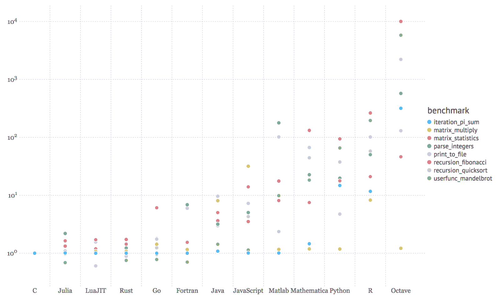

如需了解更多关于测试方法的信息，您可以访问[`julialang.org/benchmarks/`](https://julialang.org/benchmarks/)。 [](https://julialang.org/benchmarks/)

# 简洁、易读且直观的语法

Julia 的创造者从其他语言中精心挑选了最成功的语法元素，目的是生成表达性强、简洁且易于阅读的代码。与 R、MATLAB 和 Python 等语言一样，Julia 提供了强大的表达式性语言结构，用于高级数值计算。它建立在现有数学编程语言的经验之上，同时也借鉴了流行的动态语言，如 Lisp、Perl、Python、Lua 和 Ruby。

为了让您快速了解 Julia 的惯用法，以下是如何打开一个文件、读取它、输出它，然后由 Julia 自动关闭文件的示例：

```py
open(".viminfo") do io
    read(io, String) |> println
end  
.viminfo file for reading passing io, an IOStream instance, into the underlying code block. The stream is then read into a String that is finally displayed onto the console by piping it into the println function. The code is very readable and easy to understand if you have some coding experience, even if this is your first time looking at Julia code.
```

这种所谓的 `do` 语法（以 `open` 函数后的 `do` 部分为名）受到了 Ruby 的 blocks 的启发——实际上，它是将匿名函数作为方法参数传递的语法糖。在先前的例子中，它被有效地使用，以简洁地表达一个强大的设计模式，用于安全地处理文件，确保资源不会意外地被留下打开。

这表明了语言设计者对 Julia 的安全性、易用性、表达性、简洁性、易读性和直观性的关注程度。

# 强大且高效的动态类型系统

Julia 的类型系统是语言的关键特性，它对性能和生产力都有重大影响。类型系统是动态和可选的，这意味着开发者可以选择但不必须向编译器提供类型信息。如果没有提供，Julia 将执行类型推断，即从输入值的类型推断后续值的类型的过程。这是一种非常强大的技术，因为它使程序员从担心类型中解放出来，使他们能够专注于应用程序逻辑，并使学习曲线更加平缓。这对于原型设计和探索性编程特别有用，当事先不知道完整的约束和要求时。

然而，理解和正确使用类型系统提供了重要的性能优势。Julia 允许可选地添加类型信息，这使得可以指明某个值必须是特定类型。这是语言的一个基石，允许高效的函数分发，并促进为不同参数类型自动生成高效、专门的代码。类型系统允许定义丰富的类型层次结构，用户定义的类型与内置类型一样快速且紧凑。

# 设计用于并行性和分布式计算

如果 70 年代和 80 年代的语言是在有限的 CPU 和 RAM 资源严格要求的约束下设计的，那么 90 年代和 2000 年代的语言则持有乐观的预期，认为这些资源将永远扩展。然而，在过去的十年中，在这方面出现了一些停滞，转向了多 CPU、多核和分布式计算。在这方面，Julia 仅 6 年前才出现，与较老的语言相比，它具有优势，将并行和分布式计算作为其最重要的特性之一。

# 与其他语言的高效互操作

在采用新语言时，最严重的障碍之一是生态系统需要时间才能赶上——在最初，它无法提供与已经建立的语言质量相当和丰富的库。现在这个问题已经不那么严重了，因为 Julia 受益于一个庞大、热情且持续增长的开发者社区。但能够与其他语言无缝通信是一种非常有效的方式来丰富现有功能，并轻松补充任何缺失的功能。

Julia 具有直接调用 C 和 Fortran 函数的能力（即，无需粘合代码）——这对于科学计算尤为重要，在这些语言中，它们具有强大的存在感和悠久的历史。

可选包通过添加对其他语言编写的函数的调用支持来扩展这一功能，最值得注意的是通过 `PyCall` 调用 Python，还有其他一些，支持与 Java、C++、MATLAB、Rust 等语言交互。

# 强大的 REPL 和类似 shell 的功能

REPL 代表一个语言外壳，是一个命令行上的交互式计算机编程环境。Julia 拥有出色的 REPL，支持复杂的代码输入和评估。它包括一些强大的编辑功能，如可搜索的历史记录、自动补全和语法高亮，仅举几例。

它还包含三种特殊模式——*shell*，允许像在操作系统终端一样执行命令；*help*，提供在不离开 REPL 的情况下访问文档的功能；以及 pkg，用于安装和管理应用程序依赖项。

# 更多...

Julia 自带强大的包管理器，可以解决依赖关系，并处理额外包的添加和删除。像大多数现代语言一样，Julia 完全支持 Unicode。最后，它遵循宽松的 MIT 许可协议——它是免费和开源的。

# 安装 Julia

如果前面的部分让您决定为您的下一个项目使用 Julia，或者至少让您对了解更多感到好奇，那么是时候设置您的 Julia 开发环境了。

Julia 拥有出色的跨平台支持，可以在所有主要操作系统上运行。安装过程很简单——该语言可以在您的本地机器、虚拟机（VM）、Docker 容器或云中的某个服务器上设置。

让我们先看看本地安装选项，针对三大操作系统（Windows、Linux 和 macOS）。您可以自由地直接跳转到适合您的选项。

# Windows

Windows 作为一个开发平台已经取得了长足的进步，并且有一些很好的替代方案可以让 Julia 运行起来。

# 官方 Windows 安装程序

最简单的方法是下载适用于您平台（32 位或 64 位）的 Windows 安装程序，从[`julialang.org/downloads/`](https://julialang.org/downloads/)。获取`.exe`文件并运行它。按照标准安装程序进行操作，最后，您将拥有安装为程序的 Julia。双击`julia.exe`将打开一个带有 Julia REPL 的命令提示符，就像这里所示：

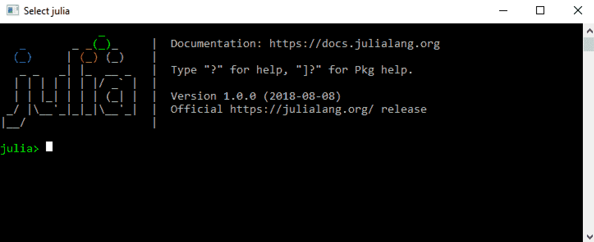

# 使用 Chocolatey

Chocolatey 是 Windows 的包管理器，类似于 Linux 上的`apt`或`yum`，或 Mac 上的`brew`。如果您还没有它，请按照[`chocolatey.org`](https://chocolatey.org)上的说明获取。

Chocolatey 拥有最新的 Julia 版本，可以通过以下搜索进行确认：

```py
$ choco search julia 
Chocolatey v0.10.11 
Julia 1.0.0 [Approved] 
1 packages found. 
```

安装过程就像这样简单：

```py
$ choco install julia 
Chocolatey v0.10.11 
Installing the following packages: 
julia 
By installing you accept licenses for the packages. 
Progress: Downloading Julia 1.0.0... 100% 
Julia v1.0.0 [Approved] 
Chocolatey installed 1/1 packages. 
```

# Windows 子系统对于 Linux

Windows 10 最近新增的功能之一是 Linux 子系统。这允许在 Windows 上直接设置 Linux 开发环境，包括大多数命令行工具、实用程序和应用程序——无需修改，无需运行虚拟机（VM）的开销。

为了能够使用 Linux 子系统，你的 PC 必须运行 Windows 10 周年更新或更高版本的 64 位版本（构建 1607+）。它还需要首先启用——因此以管理员身份打开 PowerShell 并运行以下命令：

```py
$ Enable-WindowsOptionalFeature -Online -FeatureName Microsoft-Windows-Subsystem-Linux 
```

一旦子系统被启用（可能需要重启计算机），你可以直接从 Windows Store 选择可用的 Linux 版本。在撰写本文时，有五个版本可供选择——Ubuntu、openSUSE、SLES、Debian 和 Kali。

Ubuntu 是 Windows 10 的默认选项，在 Windows Store 中拥有最好的用户评分，所以让我们选择它。它可以从 [`www.microsoft.com/en-us/store/p/ubuntu/9nblggh4msv6`](https://www.microsoft.com/en-us/store/p/ubuntu/9nblggh4msv6) 安装。或者，你只需打开一个命令提示符并输入 `$ bash`。这将触发 Ubuntu Linux 子系统的安装。

一旦你发现自己处于 Linux 子系统的 shell 提示符，你就可以继续并输入安装 Julia 的命令。对于 Ubuntu，你需要运行以下命令：

```py
$ sudo apt-get install julia
```

确保确认所需的选择——然后几分钟后，你应该就可以运行 Julia 了。

# macOS

在 macOS 上安装 Julia 非常简单。主要有两种选择，取决于你是否更喜欢图形安装程序还是更习惯于在终端提示符前操作。

# 官方镜像

访问 [`julialang.org/downloads/`](https://julialang.org/downloads/) 并查找 macOS 软件包（`.dmg`）。下载完成后，双击 `.dmg` 文件，将 Julia 应用程序拖放到 `/Applications` 文件夹。现在你可以简单地打开 Julia 应用程序——它将启动一个新的终端会话，加载 Julia 环境，如下所示：

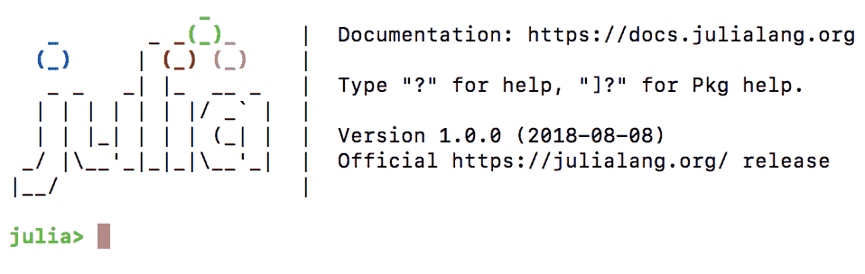

# Homebrew

`Homebrew` 是 macOS 上一个知名的包管理器，类似于 Linux 上的 `apt` 和 `yum`。虽然安装 Julia 并非必需，但值得设置它，因为它在开发过程中非常有用，因为它可以无缝地安装数据库服务器、库和其他项目组件。

根据在 [`brew.sh`](https://brew.sh) 的说明，可以在终端窗口中运行以下命令来安装：

```py
$ /usr/bin/ruby -e "$(curl -fsSL https://raw.githubusercontent.com/Homebrew/install/master/install)" 
```

可能需要一段时间，但一旦 `Homebrew` 安装完成，一个新的命令行工具 `brew` 将会可用。

最后，使用 `$ brew cask install julia` 将下载并安装 Julia 的最新版本。在这个过程中，它还会将 `julia` 二进制文件链接到 `/usr/local/bin/julia`，这样你就可以通过简单地输入 `$ julia` 来从命令行与语言交互。

一旦你收到安装成功的确认，你可以运行 `$ julia` 来启动一个新的 REPL 会话：

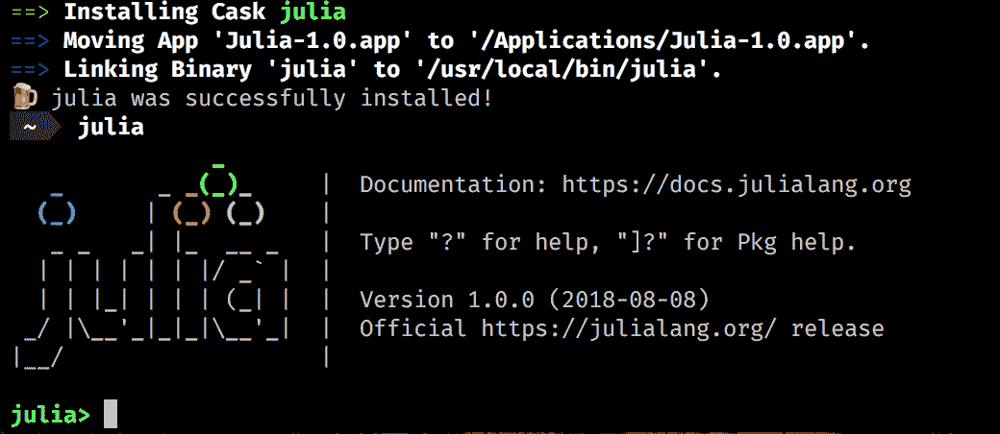

# Linux 和 FreeBSD

Julia 已经可用在主要 Linux 发行版的软件仓库中，但遗憾的是，这些并不都是最新的。例如，在撰写本文时，Ubuntu 提供的是 v0.4.5，Debian 是 v0.4.7。最佳方法是使用 Julia 下载页上提供的通用 Linux 二进制文件，在[`julialang.org/downloads/`](https://julialang.org/downloads/)。

请遵循对应您 Linux 发行版的说明，如[`julialang.org/downloads/platform.html#generic-binaries`](https://julialang.org/downloads/platform.html#generic-binaries)所示。

# Docker

Docker 是一种提供操作系统级别虚拟化抽象额外层的软件技术。简单来说，Docker 设置了像 VM 一样的*容器*，但无需启动和维护 VM 的开销。您可以在所有主要操作系统上运行 Docker。

Docker 被广泛用作开发和部署策略，因此许多技术都以 Docker 镜像的形式 readily 可用，Julia 也不例外。

首先为您的平台安装 Docker。官方的 Julia 容器可以在 Docker 商店的[`store.docker.com/images/julia`](https://store.docker.com/images/julia)找到。去获取它。

如果您需要帮助设置 Docker 或安装容器，请参阅[`www.docker.com`](https://www.docker.com)上的说明。

在命令提示符下，输入`$ docker pull julia`。一旦 Docker 配置了 Julia 镜像，使用`$ docker exec -it --rm julia`运行它。这将启动容器并加载一个新的 Julia REPL：

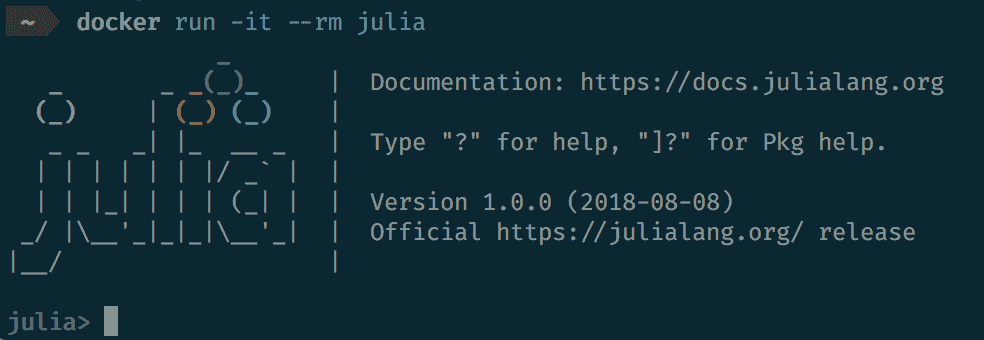

# JuliaPro

Julia 编程语言背后的公司 Julia Computing 提供了一种包含所有组件的发行版。它被称为**JuliaPro**，可以说是立即开始使用 Julia 的最简单方法。它包括编译器、分析器、Juno IDE 以及超过 160 个高质量的精选包，用于绘图、数据可视化、机器学习、数据库等。

您可以在[`shop.juliacomputing.com/Products/`](https://shop.juliacomputing.com/Products/)免费下载 JuliaPro（需要注册）。一旦您获得它，请遵循您平台特定的安装过程。完成后，您将拥有开始高效使用 Julia 所需的一切。

付费的企业版也提供了一些额外功能，例如 Excel 集成和支持 SLA。

# JuliaBox

最后，还有 JuliaBox ([`www.juliabox.com`](https://www.juliabox.com))，这是 Julia Computing 提供的另一项免费服务。JuliaBox 允许在他们的云中即时运行 Julia Docker 容器。它提供了对 IJulia Jupyter 笔记本([`github.com/JuliaLang/IJulia.jl`](https://github.com/JuliaLang/IJulia.jl))的访问、与 Google Drive 的文件同步、导入 GitHub 仓库以及许多其他功能。

如果你不太熟悉 Jupyter 笔记本，你可以通过访问 [`jupyter.org`](http://jupyter.org) 来了解更多信息。

# 选择 IDE

在使用编程语言时，IDE 非常重要。一个强大的源代码编辑器、代码补全、以及良好的代码检查器和调试器可以显著影响学习曲线和使用该语言的效率。你会很高兴地了解到，对于 Julia 来说，有一些非常好的 IDE 和编辑器选项——你可能会在这些选项中找到你最喜欢的一个。

IDE 的选择反映了整个语言的实用主义。从选择 LLVM 作为编译器，到提供从其他语言调用函数的高效方式，再到使用 `git` 和 GitHub 来驱动包管理器，Julia 核心团队采取了“不重复造轮子”的方法。遵循同样的思路，Julia 社区在现有的行业建立编辑器的基础上构建了强大的 IDE，例如 Atom 和 Visual Studio Code。

# Juno (Atom)

Juno ([`junolab.org`](http://junolab.org)) 是最先进的 Julia 集成开发环境（IDE），也是 Julia 专业人士首选的默认编辑器。它基于 Atom 编辑器，可以被认为是官方的开发工具，因为它也随之前提到的 JuliaPro 发行版一起分发。

要获取它，你可以从 [`juliacomputing.com/products/juliapro.html`](https://juliacomputing.com/products/juliapro.html) 下载并安装 JuliaPro，或者[手动安装 Atom 和所需的插件。](https://juliacomputing.com/products/juliapro.html)

如果你选择手动安装，首先需要从 [`atom.io`](https://atom.io) 下载 Atom。一旦启动并运行，转到设置面板（你可以使用快捷键 *Ctrl*/*cmd* 和 *,*)，然后转到安装面板。在搜索框中输入 `uber-juno` 并按 *Enter*。接下来，点击具有相同名称的包的安装按钮。Atom 将从这里开始，安装所有必需的 Atom 和 Julia 包。

一旦配置完成，IDE 选项将在 Atom 的菜单中可用，在 Packages > Julia 下。也可以从这里启用各种面板，以列出变量、可视化图表或搜索文档。

如需更多信息，请查看 [`junolab.org`](http://junolab.org) 和 [`github.com/JunoLab/uber-juno/blob/master/setup.md`](https://github.com/JunoLab/uber-juno/blob/master/setup.md)。

# Visual Studio Code

Visual Studio Code 是微软的一个跨平台可扩展编辑器。它适用于所有三大平台，可在 [`code.visualstudio.com`](https://code.visualstudio.com) 获取。安装后，运行它并从菜单中选择视图 > 扩展或使用快捷键 *Shift* 和 *Ctrl*/*cmd* 和 *X*。搜索 `julia` 并从 *julialang* 安装 Julia 扩展。

Visual Studio Code 中的 Julia 支持（目前）不如 Juno 强大，但如果你更喜欢它，它也能提供极佳的编码体验，包括语法高亮、代码补全、悬停帮助、Julia 代码评估、代码检查、代码导航等功能。Visual Studio Code 比 Atom 更轻快，使用的资源也更少，这使得它在运行在性能较弱的工作站上时成为一个吸引人的选择（尽管 Atom 在最近版本中在这方面有了很大改进）。

扩展可能需要一点帮助来确定它在哪里可以找到 Julia 的二进制文件。如果是这种情况，你会收到一个信息丰富的错误消息，要求你设置`julia.executablePath`配置选项。这应该指向 julia 的二进制文件，并且取决于你的操作系统和安装 Julia 的方式（有关安装的详细信息，请参阅上一节）。

要设置配置，请转到“首选项”>“设置”（*Ctrl*/*cmd*和*，*），然后在右侧面板中，用于覆盖默认设置的面板，添加以下内容：

```py
"julia.executablePath": "/path/to/your/julia/folder/bin/julia" 
```

# IJulia (JuliaBox)

我们在上一节中已经提到了 JuliaBox ([`www.juliabox.com`](https://www.juliabox.com))——它允许在云中创建、编辑和运行 IJulia Jupyter 笔记本。IJulia 也可以安装在本地的开发机器上。

IJulia 是 Jupyter 交互式环境（也被 IPython 使用）的 Julia 语言后端。它允许我们通过 Jupyter/IPython 强大的图形笔记本与 Julia 语言进行交互，该笔记本将代码、格式化文本、数学和多媒体结合在一个文档中。

虽然 IJulia/Jupyter 并不是真正的 IDE，也不是经典的编辑器，但它是一个强大的编辑和执行 Julia 脚本的编程环境，特别受数据科学和科学计算领域的欢迎。让我们花几分钟时间来设置它。

启动一个新的 Julia REPL 并执行以下命令：

```py
julia> using Pkg
julia> Pkg.add("IJulia")
```

这将安装`IJulia`包，同时还会添加一个名为**Miniconda**的必需的最小 Python 和 Jupyter 发行版。这个 Python 发行版是 Julia 专有的（不在你的`PATH`中）。完成后，继续执行以下命令：

```py
julia> using IJulia
julia> notebook()
```

这将在你的默认浏览器中打开本地 Jupyter 安装的主页，在[`localhost:8888/tree`](http://localhost:8888/tree)。从工具栏中选择`新建 > Julia 1.0.0`（或你当前运行的版本）来创建一个新的笔记本。你现在可以使用嵌入的可执行 Julia 代码创建丰富的文档。

还有另一种运行 IJulia 作为桌面应用程序的方式，通过`Interact`。你可以下载它并尝试使用[`nteract.io/desktop`](https://nteract.io/desktop)。

如果你刚开始使用 Jupyter，了解它将很有帮助。可以去[`jupyter.org`](http://jupyter.org)查看。

你也可以在本书每一章的支持文件仓库中找到每个章节的 IJulia 笔记本。这些笔记本将允许你逐步查看我们编写的代码。例如，你可以在这个章节中找到代码 [`github.com/PacktPublishing/Julia-Programming-Projects/blob/master/Chapter01/Chapter%201.ipynb`](https://github.com/PacktPublishing/Julia-Programming-Projects/blob/master/Chapter01/Chapter%201.ipynb)。你可以在你的电脑上下载它，并用本地 IJulia 安装打开，或者通过他们的 Google Drive 集成上传到 JuliaBox。

# 其他选项

上述选择是 Julia 最常见的 IDE 和编辑器选项。但还有一些其他的选择。

对于 `vim` 爱好者，也有 `julia-vim` ([`github.com/JuliaEditorSupport/julia-vim`](https://github.com/JuliaEditorSupport/julia-vim))。

如果你更喜欢使用 Emacs，你会很高兴地知道 Julia 也支持它 [`github.com/JuliaEditorSupport/julia-emacs`](https://github.com/JuliaEditorSupport/julia-emacs)。

如果你更愿意使用 JetBrains 提供的 IDE（如 IntelliJ IDEA），你会很高兴地听说有一个插件可用，在 [`plugins.jetbrains.com/plugin/10413-julia`](https://plugins.jetbrains.com/plugin/10413-julia)。

最后，还有对 Sublime Text 的支持，可在 [`github.com/JuliaEditorSupport/Julia-sublime`](https://github.com/JuliaEditorSupport/Julia-sublime) 找到。该插件提供了良好的 Julia 编辑体验，支持语法高亮、代码补全和跳转到定义等功能。

# 开始使用 Julia

如果你跟随着本章的第一部分，到现在你应该已经有一个功能齐全的本地 Julia 安装，了解如何启动 Julia REPL 会话，并且你的首选 IDE 已经准备好进行编码。如果不是这样，请参考前面的部分。从现在开始，我们将进入正题——是时候编写一些 Julia 代码了！

# Julia REPL

我们首先需要了解的是如何使用强大的 REPL。作为一名 Julia 开发者，你将花费大量时间进行探索性编程，与壳和文件系统交互，以及管理包。REPL 将是你的忠实伙伴。了解它将节省你很多时间。

缩写 REPL 代表读取-评估-打印循环。简单来说，它是一种特定语言的壳，一个交互式编码环境，允许输入表达式，评估它们，并输出结果。

REPL 非常有用，因为它们提供了一种简单的方式来与语言交互，尝试想法和原型，促进探索性编程和调试。在数据分析的上下文中，它尤其强大，因为可以快速连接到数据源，加载数据样本，然后进行切片和切块，快速测试不同的假设。

Julia 提供了一个出色的 REPL 体验，具有丰富的功能，涵盖了快速评估 Julia 语句、可搜索的历史记录、自动补全、语法高亮、专用帮助和 shell 模式等，仅举几例。

如果您没有安装有效的 Julia，请参阅*安装 Julia*部分。

# 与 REPL 交互

根据您的操作系统和偏好，REPL 可以通过简单地使用无参数的`$ julia`命令启动，或者通过双击`julia`可执行文件。

您将看到一个类似这样的屏幕（Julia 版本可能与我不同）：

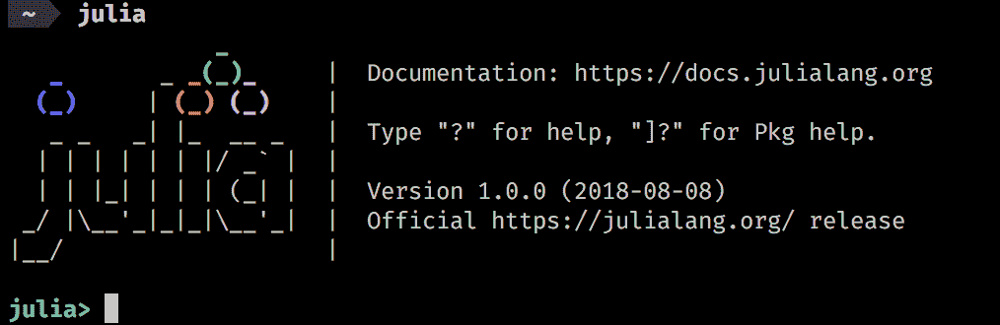

现在，Julia 正在等待我们输入代码，逐行评估。您可以通过检查终端提示符来确认，它说`julia>`。这被称为**julian** **模式**。让我们试试看。

您可以按照本章支持文件中提供的 IJulia Jupyter 笔记本进行操作。如果您不熟悉 Jupyter 且不知道如何在本地运行它，可以使用 Juliabox ([juliabox.com](http://juliabox.com))。您只需创建一个账户，登录，然后从[`github.com/PacktPublishing/Julia-Programming-Projects/blob/master/Chapter01/Chapter%201.ipynb`](https://github.com/PacktPublishing/Julia-Programming-Projects/blob/master/Chapter01/Chapter%201.ipynb)加载笔记本。

输入以下行，每行输入后按*Enter*键：

```py
julia> 2+2 
julia> 2³ 
```

因此，我们可以像使用简单计算器一样使用 Julia。虽然不是很实用，但这只是开始，展示了当我们处理复杂计算时，这种快速输入和反馈循环是多么强大。

`println`是一个非常有用的函数，它会打印接收到的任何值，并在之后添加一个新行。输入以下代码：

```py
julia> println("Welcome to Julia") 
```

在每一行下面，您应该能看到每个表达式生成的输出。现在您的窗口应该看起来像这样。

```py
julia> 2+2 
4 
julia> 2³ 
8 
julia> println("Welcome to Julia") 
Welcome to Julia 
```

让我们再试一些。REPL 一次解释一行，但所有内容都在一个共同的范围内评估。这意味着我们可以定义变量并在以后引用它们，如下所示：

```py
julia> greeting = "Hello" 
"Hello" 
```

看起来很棒！让我们使用`greeting`变量和`println`：

```py
julia> println(greting) 
ERROR: UndefVarError: greting not defined 
```

哦！这里有个小错误，REPL 迅速返回了一个错误。不是`greting`，而是`greeting`。这也告诉我们，Julia 不允许在不正确初始化的情况下使用变量。它只是查找了`greting`变量，但没有成功——并抛出了一个未定义变量的错误。让我们再次尝试，这次更加小心：

```py
julia> println(greeting) 
Hello 
```

好多了！我们可以看到输出：存储在`greeting`变量中的`Hello`值。

# `ans`变量

REPL 提供了一些帮助功能，特定于这个交互式环境（在执行 Julia 脚本时不可用）。其中之一是`ans`变量，由 Julia 自动设置和更新。

如果你输入 `julia> 2³`——不出所料，你会得到 `8`。现在输入 `julia> ans`——你又会得到 `8`！这是怎么回事？`ans` 是一个只在 REPL 中存在的特殊变量，它会自动存储最后一个返回的值。当与 REPL 一起工作时，这可以非常有用，但更重要的是，你需要意识到它的存在，以免不小心声明了一个同名变量。否则，你可能会遇到一些非常难以理解的错误，因为你的变量值会不断被覆盖。

# 提示粘贴

REPL 内置了一个非常强大的功能，称为 **提示粘贴**。这允许我们复制粘贴并执行包含 `julia>` 提示和表达式输出的 Julia 代码和代码片段。当粘贴以 `julia>` 开头的文本时，它会激活。在这种情况下，只有以 `julia>` 开头的表达式会被解析，其他所有内容都会被忽略。这使得能够粘贴从另一个 REPL 会话或文档中复制出来的代码块，而无需清除提示和输出。

提示粘贴在 IJulia Jupyter 笔记本中不起作用。

要查看此功能的效果，请复制并粘贴以下代码片段，无需修改：

```py
julia> using Dates 

julia> Dates.now() 
2018-09-02T21:13:03.122 
julia> ans 
2018-09-02T21:13:03.122 
```

如果一切顺利，两个表达式都应该输出你当前的时间，而不是代码片段中的时间，从而有效地替换代码片段中的结果为 Julia 会话中的结果。

由于默认 Windows 命令提示符的限制，此功能无法使用。

# Tab 完成功能

在 Julian、pkg 和 help 模式下，你可以在输入函数的前几个字符后按 *Tab* 键，以获取所有匹配项的列表：

```py
julia> pri[TAB] 
primitive type   print             print_shortest    print_with_color  println           printstyled  
```

它还可以用来将 LaTeX 数学符号替换为其 Unicode 等效符号。为此，输入一个反斜杠作为第一个字符，然后输入符号的前几个字符，然后按 *Tab*。这将完成符号的名称，或者如果存在多个匹配名称，将显示一个选项列表。再次按 *Tab* 在符号的完整名称上将会执行替换：

```py
julia> \pi[TAB] 
julia> π 
π = 3.1415926535897... 

julia> \om[TAB] \omega \ominus 
julia> \ome[TAB] 
julia> \omega[TAB] 
julia> ω 
```

# 清理 REPL 作用域

Julia 没有空值的概念，所以你实际上无法从内存中释放变量。然而，如果你需要释放一个由变量引用的昂贵资源，你可以将其值替换为类似 `0` 的东西，之前的值将会自动被垃圾回收。你甚至可以直接通过调用 `gc()` 来立即调用垃圾回收器。

# 附加 REPL 模式

Julia REPL 内置了四种操作模式——并且可以根据需要定义附加模式。当前活动模式由其提示表示。在之前的例子中，我们使用了 *julian* 模式 `julia>`，它评估输入的表达式。其他三个可用模式是 *help*、`help?>`、*shell*、`shell>` 和包管理，`pkg>`。

可以通过在行首输入特定的字符来切换活动模式。提示符将相应地更改，以指示当前模式。模式将保持活动状态，直到当前行被评估，自动切换回 julian（`pkg>`模式除外，它是*粘性的*，即它将保持活动状态，直到通过在行首按退格键显式退出）。可以通过删除整行直到提示符变回`julia>`或按*Ctrl* + *C*来退出替代模式，而无需评估表达式。

# 使用帮助模式访问文档

帮助模式提供访问文档的功能，无需离开 REPL。要访问它，只需在行首输入`?`。你应该会看到`help?>`提示符。现在你可以输入文本，Julia 将会搜索匹配的文档条目，如下所示：

```py
julia> ?  
help?> println 
search: println printstyled print_with_color print print_shortest sprint isprint 

  println([io::IO], xs...) 

  Print (using print) xs followed by a newline. If io is not supplied, prints to stdout. 

  Examples 
  ≡≡≡≡≡≡≡≡≡≡ 

  julia> println("Hello, world") 
  Hello, world 

  julia> io = IOBuffer(); 

  julia> println(io, "Hello, world") 

  julia> String(take!(io)) 
  "Hello, world\n"  
```

在 IJulia 中，通过在输入前加上所需的模式激活器来激活额外的模式。例如，要访问之前`println`函数的帮助，我们需要输入`?println.`。

输出支持丰富的格式化，通过 Markdown：

```py
julia> using Profile 
help?> Profile.print 
```

结果如以下截图所示：

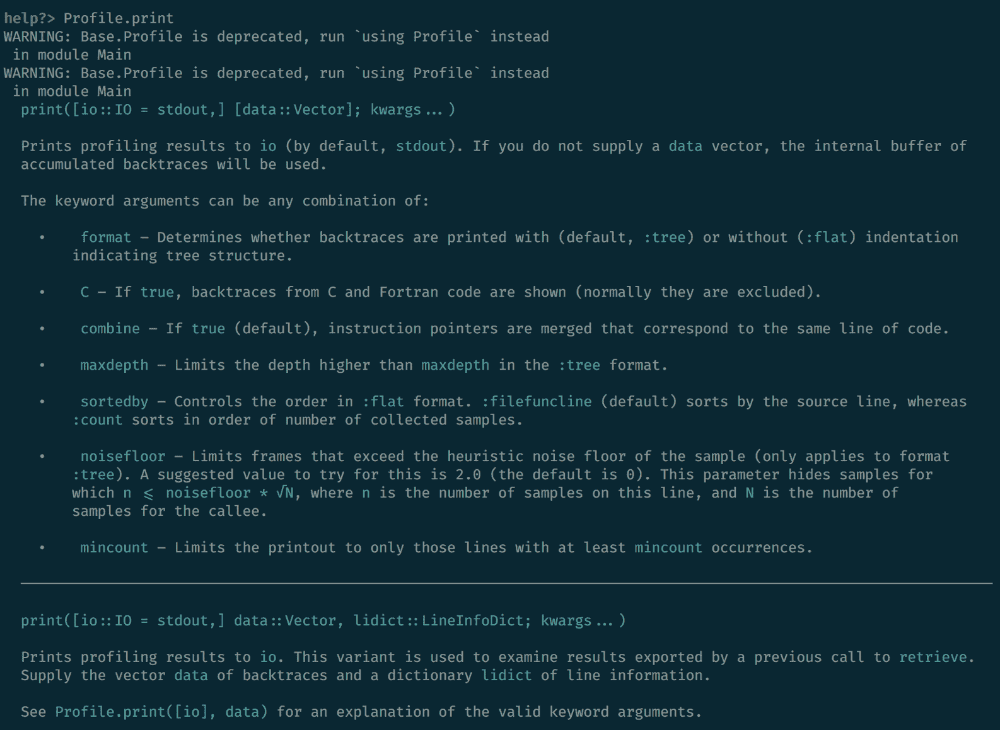

可以查询更复杂的表达式，包括宏、类型和变量。

例如，`help?> @time`：

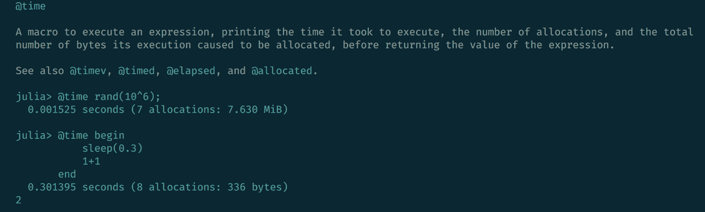

或者`help?> IO`：

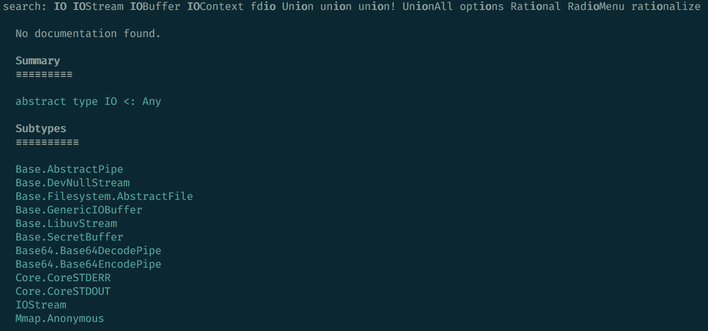

# Shell 模式

使用 shell 模式可以切换到类似于系统 shell 的命令行界面，以便直接执行操作系统命令。要进入该模式，请在 julian 提示符的非常开始处输入一个分号`;`：

```py
julia> ;  
```

输入`;`后，提示符（就地）变为`shell>`：

要在 IJulia 中进入 shell 模式并执行 shell 命令，请在命令前加上`;`，例如`;ls`。

现在，我们可以直接执行系统范围内的命令，无需将它们包裹在 Julia 代码中。这将列出你的`repl_history.jl`文件的最后十行。此文件由 Julia 用于记录在 REPL 中执行的命令的历史，因此你的输出将与我不同：

```py
julia> using REPL
shell> tail -n 10 ~/.julia/logs/repl_history.jl
IO
# time: 2018-09-02 21:56:47 CEST
# mode: julia
REPL.find_hist_file()
# time: 2018-09-02 21:58:47 CEST
# mode: shell
tail -n 10 ~/.julia/logs/repl_history.jl 
```

当处于 REPL 模式时，我们可以访问 Julia 的 API，这使得这是一个非常强大的组合。例如，为了以编程方式获取 REPL 历史文件的路径，我们可以使用`REPL.find_hist_file()`函数，如下所示：

```py
julia> REPL.find_hist_file() 
"/Users/adrian/.julia/logs/repl_history.jl" 
```

文件的路径将因人而异。

我们可以在 shell 模式下使用它，通过将命令用`$()`括起来：

```py
shell> tail -n 10 $(REPL.find_hist_file()) 
    REPL.find_hist_file() 
# time: 2018-09-02 21:58:47 CEST 
# mode: shell 
    tail -n 10 ~/.julia/logs/repl_history.jl 
# time: 2018-09-02 22:00:03 CEST 
# mode: shell 
    tail -n 10 $(REPL.find_hist_file()) 
```

与帮助模式类似，shell 模式可以通过在行首按退格键或输入*Ctrl* + *C*来退出，而无需执行任何命令。

在 IJulia 中，可以通过在输入前加上`;`来执行命令，如下所示：

```py
;tail -n 10 ~/.julia/logs/repl_history.jl 
```

# 搜索模式

除了帮助和 shell 模式之外，还有两种搜索模式。这些模式不一定是 Julia 特有的，它们是许多*nix 风格编辑应用程序的共同点。

同时按下*Ctrl*键和*R*键以启动反向增量搜索。提示符将变为`(reverse-i-search)`。开始输入你的查询，最近的搜索结果将显示出来。要找到更早的结果，再次按*Ctrl* + *R*。

*Ctrl* + *R*的对应操作是*Ctrl* + *S*，它启动增量搜索。这两个可以一起使用，分别用于移动到上一个或下一个匹配结果。

# `startup.jl`文件

如果你想每次运行 Julia 时自动执行一些代码，你可以将其添加到一个名为`startup.jl`的特殊文件中。这个文件不是自动创建的，所以你需要自己将它添加到你的 Julia 配置目录中。你添加到其中的任何代码都会在 Julia 启动时运行。让我们用 Julia 来做这个实验，并且练习一下我们学到的东西。

首先，进入 shell 模式并运行以下三个命令：

```py
shell> mkdir $(dirname(REPL.find_hist_file()))/../config 

shell> cd $(dirname(REPL.find_hist_file()))/../config 
/Users/adrian/.julia/config 

shell> touch startup.jl 
```

然后，在 julian 模式下，执行以下操作：

```py
julia> write("startup.jl", "println(\"Welcome to Julia!\")") 
28 
```

我们刚才做了什么？在 shell 模式下，我们在历史文件所在目录的上一级创建了一个名为`config`的新目录。然后我们`cd`进入新创建的文件夹，在那里我们创建了一个名为`startup.jl`的新文件。最后，我们让 Julia 向`startup.jl`文件添加了这一行代码`"println(\"Welcome to Julia!\")"`。下次我们启动 Julia REPL 时，我们会看到这个欢迎信息。看看这个：

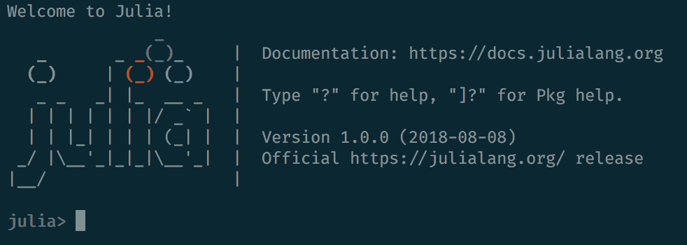

# REPL 钩子

还可以在启动 REPL 会话之前定义一个将被自动调用的函数。为了实现这一点，你需要使用`atreplinit(f)`函数，它将一个单参数函数`f`注册为在交互式会话中初始化 REPL 界面之前调用。这个函数应该从`startup.jl`文件内部调用。

假设我们编辑了`startup.jl`文件，使其现在看起来像这样：

```py
println("Welcome to Julia!") 

atreplinit() do (f) 
  println("And welcome to you too!") 
end 
```

我们的 REPL 现在会两次问候我们：

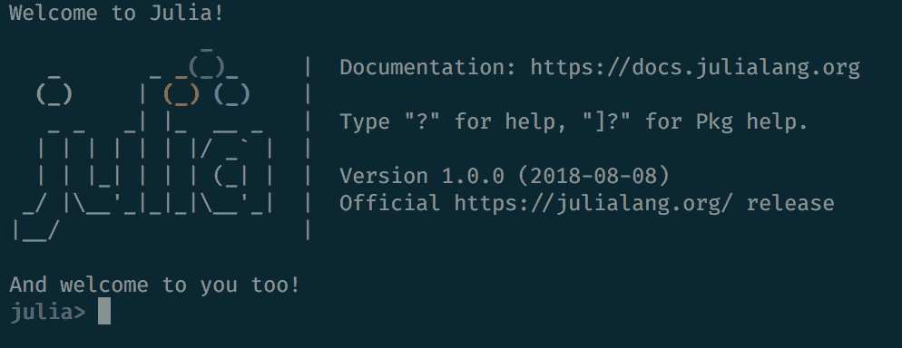

可以使用`atreplinit`函数与`isinteractive`一起使用，`isinteractive`返回一个`Boolean true`或`false`值，告诉我们 Julia 是否正在运行一个交互式会话。

# 退出 REPL

要退出 REPL，你可以输入`^ D`（*Ctrl* + *D*）。但是，这只有在行首（当文本缓冲区为空时）才会起作用。否则，只需输入`^C`（*Ctrl* + *C*）来首先中断（或取消）并清除行。你也可以运行`exit()`，这将停止当前 Julia 进程的执行。

要查看 REPL 中的完整键绑定列表以及如何自定义它们，你可以阅读官方文档[`docs.julialang.org/en/v1.0/stdlib/REPL/#Key-bindings-1`](https://docs.julialang.org/en/v1.0/stdlib/REPL/#Key-bindings-1)。

# 包系统

你的 Julia 安装附带了一个名为`Pkg`的强大包管理器。它处理所有预期的操作，例如添加和删除包、解决依赖关系、保持已安装包的更新、运行测试，甚至帮助我们发布自己的包。

包通过提供广泛的功能，无缝地扩展了核心语言，发挥着至关重要的作用。让我们看看最重要的包管理功能。

# 添加一个包

为了让`Pkg`知道，包必须添加到一个 Julia 可用的注册表中。`Pkg`支持同时与多个注册表一起工作——包括位于企业防火墙后面的私有注册表。默认情况下，`Pkg`配置为使用 Julia 的通用注册表，这是一个由 Julia 社区维护的免费和开源包的存储库。

`Pkg`是一个非常强大的工具，我们将在整本书中广泛使用它。在使用 Julia 进行开发时，包管理是一个常见的任务，因此我们将有多次机会逐步深入了解。现在，我们将迈出第一步，学习如何添加包——我们将通过添加一些强大的新功能到我们的 Julia 设置中来实现这一点。

# OhMyREPL

我最喜欢的包之一叫做`OhMyREPL`。它为 Julia 的 REPL 实现了一些超级高效的功能，最显著的是语法高亮和括号配对。这是一个非常好的补充，使得交互式编码体验更加愉快和高效。

Julia 的`Pkg`以 GitHub 为中心。创建者将包作为 git 仓库分发，托管在 GitHub 上——甚至通用注册表本身也是一个 GitHub 仓库。`OhMyREPL`也不例外。在安装它之前，如果你想了解更多信息——使用第三方代码时，这总是一个好主意——你可以在[`github.com/KristofferC/OhMyREPL.jl`](https://github.com/KristofferC/OhMyREPL.jl)查看。

请记住，即使它属于通用注册表，这些包也不提供任何保证，它们不一定经过 Julia 社区检查、验证或认可。然而，有一些常识性的指标可以提供关于包质量的洞察，最值得注意的是星标数量、测试状态以及最新 Julia 版本的兼容性。

为了添加一个包，我们首先需要进入`Pkg`的 REPL 模式。我们通过在行首输入`]`来实现这一点：

```py
julia>] 
```

光标将改变以反映我们现在可以管理包了：

```py
(v1.0) pkg> 
```

IJulia 目前不支持`pkg>`模式，但我们可以通过将它们包裹在`pkg"..."`中来执行`Pkg`命令，例如`pkg"add OhMyREPL"`。

`Pkg`使用*环境*的概念，允许我们根据项目定义不同的和独立的包集合。这是一个非常强大且有用的功能，因为它消除了由依赖于同一包的不同版本的项目（所谓的**依赖地狱**）引起的依赖冲突。

由于我们尚未创建任何项目，`Pkg`将仅使用默认项目`v1.0`，由括号中的值指示。这代表您正在运行的 Julia 版本——并且您可能会根据您自己的 Julia 版本得到不同的默认项目。

现在，我们只需继续添加`OhMyREPL`：

```py
(v1.0) pkg> add OhMyREPL 
  Updating registry at `~/.julia/registries/General` 
  Updating git-repo `https://github.com/JuliaRegistries/General.git` 
 Resolving package versions... 
  Updating `~/.julia/environments/v1.0/Project.toml` 
  [5fb14364] + OhMyREPL v0.3.0 
  Updating `~/.julia/environments/v1.0/Manifest.toml` 
  [a8cc5b0e] + Crayons v1.0.0 
  [5fb14364] + OhMyREPL v0.3.0 
  [0796e94c] + Tokenize v0.5.2 
  [2a0f44e3] + Base64 
  [ade2ca70] + Dates 
  [8ba89e20] + Distributed 
  [b77e0a4c] + InteractiveUtils 
  [76f85450] + LibGit2 
  [8f399da3] + Libdl 
  [37e2e46d] + LinearAlgebra 
  [56ddb016] + Logging 
  [d6f4376e] + Markdown 
  [44cfe95a] + Pkg 
  [de0858da] + Printf 
  [3fa0cd96] + REPL 
  [9a3f8284] + Random 
  [ea8e919c] + SHA 
  [9e88b42a] + Serialization 
  [6462fe0b] + Sockets 
  [8dfed614] + Test 
  [cf7118a7] + UUIDs 
  [4ec0a83e] + Unicode  
```

上一条命令在 IJulia 中的等效命令是`pkg"add OhMyREPL"`。

当在新的 Julia 安装上运行`pkg> add`时，`Pkg`将克隆 Julia 的通用注册表，并使用它来查找我们请求的包名。尽管我们只明确请求了`OhMyREPL`，但大多数 Julia 包都有外部依赖项，也需要安装。正如我们所见，我们的包有很多——但它们被`Pkg`迅速安装了。

# 自定义包安装

有时候我们可能想使用未添加到通用注册表的包。这通常适用于处于（早期）开发中的包或私有包。对于这种情况，我们可以传递`pkg> add`存储库的 URL，而不是包名：

```py
(v1.0) pkg> add https://github.com/JuliaLang/Example.jl.git 
   Cloning git-repo `https://github.com/JuliaLang/Example.jl.git` 
  Updating git-repo `https://github.com/JuliaLang/Example.jl.git` 
 Resolving package versions... 
  Updating `~/.julia/environments/v1.0/Project.toml` 
  [7876af07] + Example v0.5.1+ #master (https://github.com/JuliaLang/Example.jl.git) 
  Updating `~/.julia/environments/v1.0/Manifest.toml` 
  [7876af07] + Example v0.5.1+ #master (https://github.com/JuliaLang/Example.jl.git) 
```

另一个常见场景是我们想安装包存储库的某个分支。这可以通过在包名或 URL 的末尾附加`#name_of_the_branch`轻松实现：

```py
(v1.0) pkg> add OhMyREPL#master 
   Cloning git-repo `https://github.com/KristofferC/OhMyREPL.jl.git` 
  Updating git-repo `https://github.com/KristofferC/OhMyREPL.jl.git` 
 Resolving package versions... 
 Installed Crayons ─ v0.5.1 
  Updating `~/.julia/environments/v1.0/Project.toml` 
  [5fb14364] ~ OhMyREPL v0.3.0 ⇒ v0.3.0 #master (https://github.com/KristofferC/OhMyREPL.jl.git) 
  Updating `~/.julia/environments/v1.0/Manifest.toml`
```

```py
  [a8cc5b0e] ↓ Crayons v1.0.0 ⇒ v0.5.1 
  [5fb14364] ~ OhMyREPL v0.3.0 ⇒ v0.3.0 #master (https://github.com/KristofferC/OhMyREPL.jl.git)
```

或者，对于未注册的包，使用以下命令：

```py
(v1.0) pkg> add https://github.com/JuliaLang/Example.jl.git#master 
```

如果我们想回到使用已发布的分支，我们需要`free`这个包：

```py
(v1.0) pkg> free OhMyREPL 
 Resolving package versions... 
  Updating `~/.julia/environments/v1.0/Project.toml` 
  [5fb14364] ~ OhMyREPL v0.3.0 #master (https://github.com/KristofferC/OhMyREPL.jl.git) ⇒ v0.3.0 
  Updating `~/.julia/environments/v1.0/Manifest.toml` 
  [a8cc5b0e] ↑ Crayons v0.5.1 ⇒ v1.0.0 
  [5fb14364] ~ OhMyREPL v0.3.0 #master (https://github.com/KristofferC/OhMyREPL.jl.git) ⇒ v0.3.0 
```

# Revise

这很简单，但熟能生巧。让我们再添加一个！这次我们将安装`Revise`，这是另一个必不可少的包，它通过监控和检测您的 Julia 文件中的更改，并在需要时自动重新加载代码，从而实现流畅的开发工作流程。在`Revise`之前，加载当前 Julia 进程中的更改是出了名的困难，开发者通常被迫重启 REPL——这是一个耗时且低效的过程。`Revise`可以消除重启、加载包和等待代码编译的开销。

您可以通过阅读其文档来了解更多关于 Revise 的信息，文档位于[`timholy.github.io/Revise.jl/latest/`](https://timholy.github.io/Revise.jl/latest/)。

出乎意料的是，我们只需要再次调用`add`命令，这次传递`Revise`作为包名：

```py
(v1.0) pkg> add Revise 
Resolving package versions... 
 Installed Revise ─ v0.7.5 
  Updating `~/.julia/environments/v1.0/Project.toml` 
  [295af30f] + Revise v0.7.5 
  Updating `~/.julia/environments/v1.0/Manifest.toml` 
  [bac558e1] + OrderedCollections v0.1.0
```

```py
  [295af30f] + Revise v0.7.5 
  [7b1f6079] + FileWatching 
```

`add`命令也可以一次接受多个包。我们现在一个接一个地添加它们，为了学习目的，但否则，我们本可以执行`(v1.0) pkg> add OhMyREPL Revise`。

# 检查包状态

我们可以通过使用恰如其分的`status`命令来检查我们项目的状态，以确认操作是否成功：

```py
 (v1.0) pkg> status 
    Status `~/.julia/environments/v1.0/Project.toml` 
  [7876af07] Example v0.5.1+ #master (https://github.com/JuliaLang/Example.jl.git) 
  [5fb14364] OhMyREPL v0.3.0 
  [295af30f] Revise v0.7.5 
```

`status`命令显示所有已安装的包，包括从左到右的包的 ID 简短版本（称为**UUID**）、包名和版本号。在适当的情况下，它还会指示我们正在跟踪的分支，例如在`Example`的情况下，我们处于`master`分支。

`Pkg` 还支持一系列快捷方式，如果您想节省一些按键。在这种情况下，`st` 可以用来代替 `status`。

# 使用包

一旦添加了包，为了访问其功能，我们必须将其引入作用域。这就是我们告诉 Julia 我们打算使用它的方法，请求编译器使其对我们可用。为此，首先，我们需要退出 pkg 模式。一旦我们处于 julian 提示符，为了使用 `OhMyREPL`，我们只需要执行：

```py
julia> using OhMyREPL
[ Info: Precompiling OhMyREPL [5fb14364-9ced-5910-84b2-373655c76a03]
```

这就是全部——`OhMyREPL` 现在会自动增强当前的 REPL 会话。要看到它的实际效果，这里是一个 *常规* REPL 的样子：

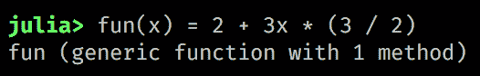

这里是相同的代码，通过 `OhMyREPL` 增强后的样子：

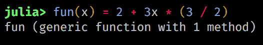

语法高亮和括号匹配使代码更易读，减少了语法错误。看起来很棒，不是吗？

`OhMyREPL` 还有更多酷炫的功能——您可以通过查看官方文档了解它们：[`kristofferc.github.io/OhMyREPL.jl/latest/index.html`](https://kristofferc.github.io/OhMyREPL.jl/latest/index.html)。

# 再多一步

`OhMyREPL` 和 `Revise` 是出色的开发工具，在所有 Julia 会话中自动加载它们非常有用。这正是 `startup.jl` 文件存在的原因——现在我们有了一个将其用于实际的机会（尽管我们诚挚的欢迎问候已经足够令人印象深刻了！）。

这里有一个小技巧，让我们开始——Julia 提供了一个 `edit` 函数，它会在配置的编辑器中打开一个文件。让我们用它来打开 `startup.jl` 文件：

```py
julia> edit("~/.julia/config/startup.jl") 
```

这将使用默认编辑器打开文件。如果您还没有删除我们之前添加的欢迎信息，现在可以自由地这样做（除非您真的很喜欢它们，在这种情况下，您当然可以保留它们）。现在，`Revise` 需要在我们想要跟踪的任何其他模块之前使用——所以我们将希望它在文件顶部。至于 `OhMyREPL`，它可以放在下面。您的 `startup.jl` 文件应该看起来像这样：

```py
using Revise 
using OhMyREPL 
```

保存并关闭编辑器。下次您启动 Julia 时，`Revise` 和 `OhMyREPL` 将已经加载。

# 更新包

Julia 提供了一个繁荣的生态系统，并且包的更新速度非常快。定期使用 `pkg> update` 检查更新是一个好习惯：

```py
(v1.0) pkg> update 
```

当发出此命令时，Julia 首先检索通用仓库的最新版本，然后检查是否有任何包需要更新。

注意，发出 `update` 命令将更新所有可用的包。正如我们之前讨论的，当提到 *依赖地狱* 时，这可能不是最好的做法。在接下来的章节中，我们将看到如何与单个项目一起工作，并按单个应用程序管理依赖项。不过，了解您可以通过传递它们的名称来选择您想要更新的包是很重要的：

```py
(v1.0) pkg> update OhMyREPL Revise 
```

`Pkg` 还提供了一个预览模式，它将显示运行特定命令时会发生什么，而实际上不会进行任何更改：

```py
(v1.0) pkg> preview update OhMyREPL 
(v1.0) pkg> preview add HTTP 
```

`pkg> update` 的快捷键是 `pkg> up`。

# 固定包

有时我们可能想要确保某些包不会被更新。这就是我们“固定”它们的时候：

```py
(v1.0) pkg> pin OhMyREPL 
 Resolving package versions... 
  Updating `~/.julia/environments/v1.0/Project.toml` 
  [5fb14364] ~ OhMyREPL v0.3.0 ⇒ v0.3.0
  Updating `~/.julia/environments/v1.0/Manifest.toml` 
  [5fb14364] ~ OhMyREPL v0.3.0 ⇒ v0.3.0
```

固定包会标记为 `⚲` 符号——现在在检查状态时也会出现：

```py
(v1.0) pkg> st 
    Status `~/.julia/environments/v1.0/Project.toml` 
  [5fb14364] OhMyREPL v0.3.0
  [295af30f] Revise v0.7.5 
```

如果我们想取消固定一个包，我们可以使用 `pkg> free`：

```py
(v1.0) pkg> free OhMyREPL 
  Updating `~/.julia/environments/v1.0/Project.toml` 
  [5fb14364] ~ OhMyREPL v0.3.0 ⇒ v0.3.0 
  Updating `~/.julia/environments/v1.0/Manifest.toml` 
  [5fb14364] ~ OhMyREPL v0.3.0 ⇒ v0.3.0 

(v1.0) pkg> st 
    Status `~/.julia/environments/v1.0/Project.toml` 
  [5fb14364] OhMyREPL v0.3.0 
  [295af30f] Revise v0.7.5 
```

# 移除包

如果你不再打算使用某些包，你可以删除（或使用 `pkg> remove` 命令移除它们）。例如，假设我们有以下配置：

```py
(v1.0) pkg> st 
    Status `~/.julia/environments/v1.0/Project.toml` 
  [7876af07] Example v0.5.1+ #master (https://github.com/JuliaLang/Example.jl.git) 
  [5fb14364] OhMyREPL v0.3.0 
  [295af30f] Revise v0.7.5 
```

我们可以使用以下代码移除 `Example` 包：

```py
(v1.0) pkg> remove Example 
  Updating `~/.julia/environments/v1.0/Project.toml` 
  [7876af07] - Example v0.5.1+ #master (https://github.com/JuliaLang/Example.jl.git) 
  Updating `~/.julia/environments/v1.0/Manifest.toml` 
  [7876af07] - Example v0.5.1+ #master ([`github.com/JuliaLang/Example.jl.git`](https://github.com/JuliaLang/Example.jl.git)) 
```

当然，它现在已经消失了：

```py
(v1.0) pkg> st 
    Status `~/.julia/environments/v1.0/Project.toml` 
  [5fb14364] OhMyREPL v0.3.0 
  [295af30f] Revise v0.7.5 
```

`pkg> remove` 的快捷键是 `pkg> rm`。

除了显式删除不需要的包外，`Pkg` 还有一个内置的自动清理功能。随着包版本的发展和包依赖关系的变化，一些已安装的包可能会变得过时，并且不再在任何现有项目中使用。`Pkg` 会记录所有使用过的项目，以便它可以遍历日志并确切地看到哪些项目仍然需要哪些包——从而识别出不再必要的包。这些可以使用 `pkg> gc` 命令一次性删除：

```py
(v1.0) pkg> gc Active manifests at: `/Users/adrian/.julia/environments/v1.0/Manifest.toml` `/Users/adrian/.julia/environments/v0.7/Manifest.toml` Deleted /Users/adrian/.julia/packages/Acorn/exWWb: 40.852 KiB Deleted /Users/adrian/.julia/packages/BufferedStreams/hCA7W: 102.235 KiB Deleted /Users/adrian/.julia/packages/Crayons/e1SsX: 49.133 KiB Deleted /Users/adrian/.julia/packages/Example/ljaU2: 4.625 KiB Deleted /Users/adrian/.julia/packages/Genie/XOia2: 2.031 MiB Deleted /Users/adrian/.julia/packages/HTTPClient/ZQR55: 37.669 KiB Deleted /Users/adrian/.julia/packages/Homebrew/l8kUw: 277.296 MiB Deleted /Users/adrian/.julia/packages/LibCURL/Qs5og: 11.599 MiB Deleted /Users/adrian/.julia/packages/LibExpat/6jLDP: 127.247 KiB Deleted /Users/adrian/.julia/packages/LibPQ/N7lDU: 134.734 KiB Deleted /Users/adrian/.julia/packages/Libz/zMAun: 80.744 KiB Deleted /Users/adrian/.julia/packages/Nettle/LMDZh: 50.371 KiB
```

```py
   Deleted /Users/adrian/.julia/packages/OhMyREPL/limOC: 448.493 KiB 
   Deleted /Users/adrian/.julia/packages/WinRPM/rDDZz: 24.925 KiB 
   Deleted 14 package installations : 292.001 MiB 
```

除了专门的 `Pkg` REPL 模式外，Julia 还提供了一个强大的 API，用于以编程方式管理包。我们不会涉及它，但如果你想了解它，你可以查看官方文档，链接为 [`docs.julialang.org/en/latest/stdlib/Pkg/#References-1`](https://docs.julialang.org/en/latest/stdlib/Pkg/#References-1)。

# 发现包

包发现还不是像它本可以那样简单，但有一些很好的选项。我建议从以下精心挑选的 Julia 包列表开始：[`github.com/svaksha/Julia.jl`](https://github.com/svaksha/Julia.jl)。它按领域分组了一个大量的包集合，包括人工智能、生物学、化学、数据库、图形、数据科学、物理学、统计学、超级计算等多个主题。

如果这还不够，你总是可以访问 [`discourse.julialang.org`](https://discourse.julialang.org/)，在那里 Julia 社区讨论与语言相关的多种主题。你可以搜索和浏览现有的线程，特别是位于 [`discourse.julialang.org/c/community/packages`](https://discourse.julialang.org/c/community/packages) 的包公告部分。

当然，你总是可以向社区寻求帮助——Julians 非常友好和欢迎，社区投入了大量精力进行管理，以保持讨论文明和建设性。创建新主题和回复需要免费 Discourse 账户。

最后，[`juliaobserver.com/packages`](https://juliaobserver.com/packages) 是一个第三方网站，提供了一种更精致的方式来查找包——它还执行 GitHub 搜索，因此也包括未注册的包。

# 注册与非注册

尽管我已在之前的段落中提到了这个话题，但我仍想以一个警告来结束对 `Pkg` 的讨论。一个包是否注册并不一定意味着它在功能或安全性方面经过了审查。它仅仅意味着该包已被创建者提交，并且它满足了一些技术要求，以便被添加到通用注册表中。包源代码可在 GitHub 上找到，就像任何开源软件一样，请确保你了解它做什么，应该如何使用，以及你接受许可条款。

这就结束了我们对包管理的初步讨论。但鉴于这是最常见的任务之一，我们将在未来的章节中反复回到这个话题，我们还将看到一些更高级使用的场景。

# 摘要

Julia 是一种新的编程语言，它利用了编译技术方面的最新创新，以提供动态编程语言的函数性、易用性和直观语法，同时以 C 的速度运行。其目标之一是消除所谓的**两种语言问题**——当用户用高级语言（如 R 和 Python）编写代码时，但性能关键部分必须用 C 或 C++ 重新编写。Julia 感觉像是一种动态语言，并提供了与这些语言相关的所有生产力特性。但与此同时，它消除了性能权衡，证明对于原型设计和探索性编程来说足够高效，对于性能关键的应用来说也足够高效。

它的内置包管理器提供了访问 2000 多个第三方库的权限，这些库无缝地扩展了语言，并提供了强大的新功能——我们已经学会了如何利用这些功能。而且如果还不够，Julia 还具有调用其他语言（如 C、Fortran、Python 或 Java）编写的函数的能力，仅举几个例子。

Julia 是免费且开源的（MIT 许可），可以在所有主要的操作系统上部署，包括 Windows、主要的 Linux 发行版和 macOS。它还提供了一些非常好的 IDE 和编辑器选项。

现在我们已经成功设置了我们的开发环境，是时候深入探讨 Julia 的语法了。在下一章中，我们将查看语言的一些基本构建块——定义变量和常量、操作和使用 `Strings` 和数值类型，以及与 `Arrays` 一起工作。作为 Julia 生产力的一种证明，这就是我们（连同我们将添加的一些额外包）在 Iris 花卉数据集上进行强大的探索性数据分析所需的一切（together with some extra packages that we'll add）。下一章见！
