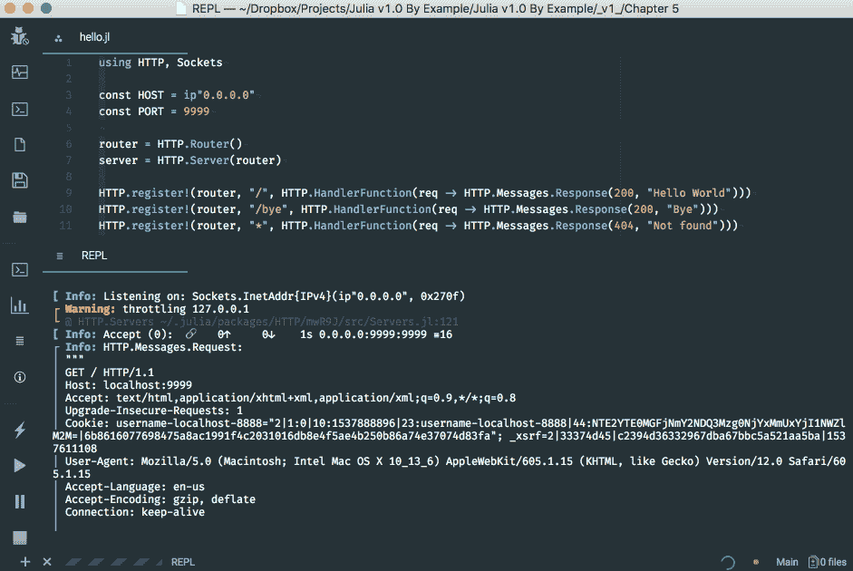
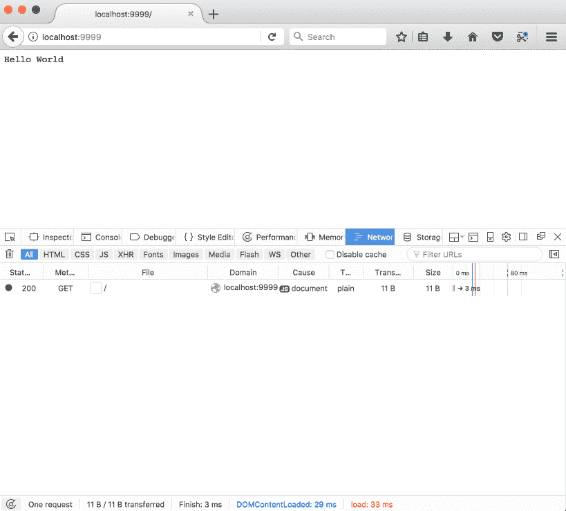
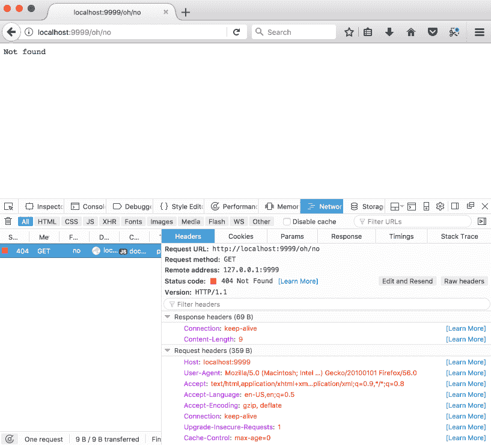
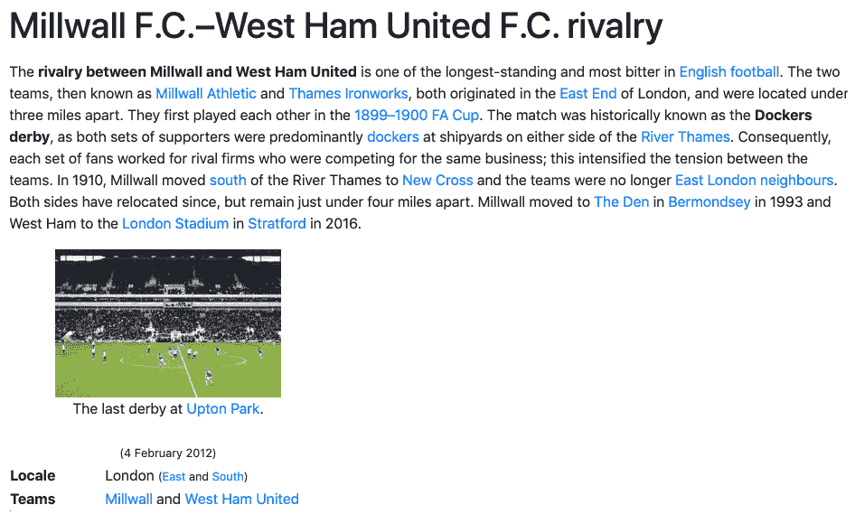
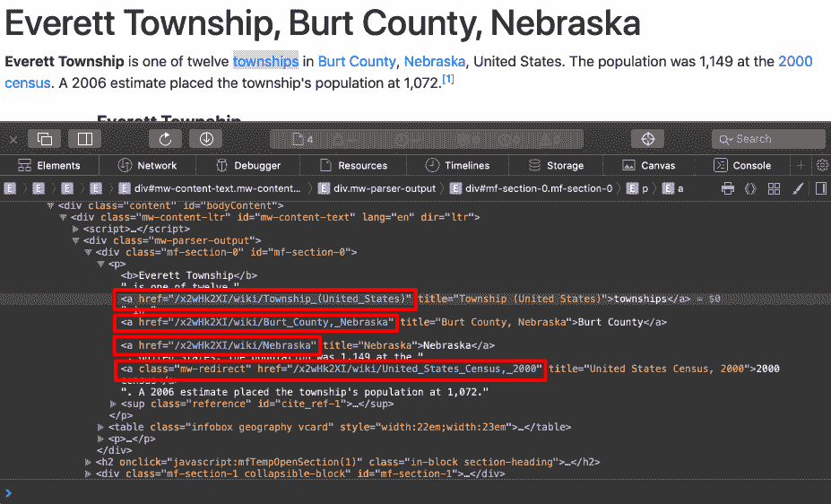
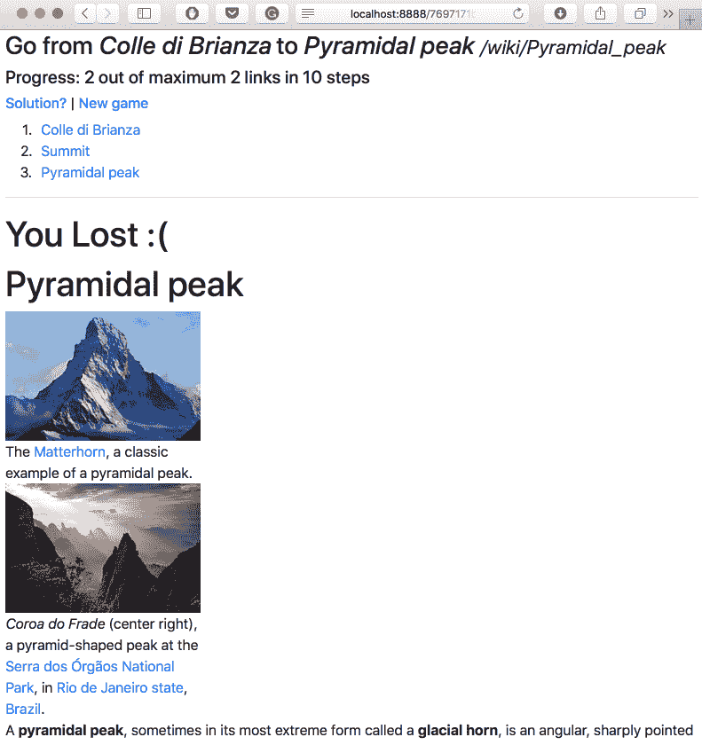
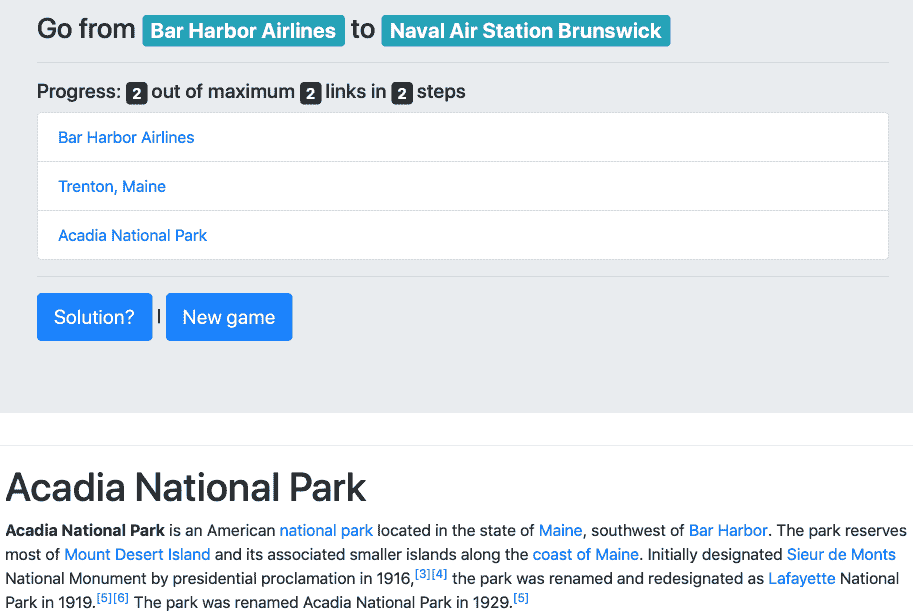

# 第五章：为维基游戏添加 Web 用户界面

开发我们游戏的后端是一个相当有学习经验的过程。这个坚实的基础将为我们带来很多好处——模块化的方法将使我们能够轻松地将**读取-评估-打印循环**（**REPL**）应用程序转换为 Web 应用程序，而我们对类型的理解在处理 Julia 的 Web 堆栈及其丰富的分类法时将证明是无价的。

我们现在正进入游戏开发旅程的最后阶段——为*维基百科六度分隔*构建 Web 用户界面。由于构建一个功能齐全的 Web 应用程序并非易事，这部分内容将专门用于这项任务。在这个过程中，我们将学习以下主题：

+   Julia 的 Web 堆栈；即`HTTP`包及其主要组件——`Server`、`Router`、`HandlerFunction`和`Response`

+   构建一个 Web 应用程序以利用`HTTP`并集成现有 Julia 模块

+   通过定义将 URL 映射到 Julia 函数的路由来在 Web 上公开功能

+   启动一个 Web 服务器来处理用户请求并向客户端发送适当的响应

本章的结尾带来了一份酷炫的回报——我们的游戏将准备就绪，我们将玩几轮*维基百科六度分隔*！

# 技术要求

Julia 的包生态系统正在持续发展中，并且每天都有新的包版本发布。大多数时候这是个好消息，因为新版本带来了新功能和错误修复。然而，由于许多包仍在测试版（版本 0.x）中，任何新版本都可能引入破坏性更改。因此，书中展示的代码可能无法正常工作。为了确保您的代码将产生与书中描述相同的结果，建议使用相同的包版本。以下是本章使用的外部包及其特定版本：

```py
Cascadia@v0.4.0
Gumbo@v0.5.1
HTTP@v0.7.1
IJulia@v1.14.1
```

为了安装特定版本的包，您需要运行：

```py
pkg> add PackageName@vX.Y.Z 
```

例如：

```py
pkg> add IJulia@v1.14.1
```

或者，您也可以通过下载本章提供的`Project.toml`文件并使用`pkg>`实例化来安装所有使用的包，如下所示：

```py
julia> download("https://raw.githubusercontent.com/PacktPublishing/Julia-Programming-Projects/master/Chapter05/Project.toml", "Project.toml")
pkg> activate . 
pkg> instantiate
```

# 游戏计划

我们的项目已经进入最后阶段——Web 用户界面。让我们先讨论一下规格说明；在我们可以进行实现之前，我们需要制定蓝图。

玩家将从着陆页开始。这将显示规则，并提供启动新游戏的选择，让用户选择难度级别。从这个起点开始，玩家将被重定向到新游戏页面。在这里，考虑到所选的难度级别，我们将通过获取我们在上一章中编写的算法来启动一个新的游戏会话。一旦我们选择了代表维基百科“六度分隔”的文章，我们将显示一个带有游戏目标的标题——起始和结束文章的标题。我们还将显示第一篇文章的内容，从而启动游戏。当玩家点击这篇文章中的链接时，我们必须相应地检查玩家是否找到了结束文章并赢得了游戏。如果没有，渲染新文章并增加所采取的步骤数。

我们还需要一个区域来显示游戏的进度——当前会话中查看的文章、总共采取了多少步骤，以及一种导航方式，允许玩家在发现自己走错路时返回并重新考虑他们的选择。因此，我们需要存储玩家的导航历史。最后，提供一种解决谜题的选项会很好——当然，作为结果，玩家将输掉游戏。

规范中非常重要的一部分是，在无状态的浏览器请求和服务器响应之间，在浏览维基百科文章时，我们需要某种机制来允许我们保持游戏的状态，也就是说，检索带有相应数据的游戏——难度、路径（文章）、进度、导航历史、所采取的步骤数等等。这将通过在每个游戏会话开始时创建一个唯一的游戏标识符，并将其作为 URL 的一部分与每个请求一起传递来实现。

# 了解朱莉娅的 Web 栈

朱莉娅的包生态系统长期以来为构建 Web 应用提供了各种库。其中一些最成熟的包括 `HttpServer`、`Mux`、`WebSockets` 和 `JuliaWebAPI`（仅举几个例子；这个列表并不全面）。但随着朱莉娅版本 1 的生态系统稳定下来，社区投入了大量努力开发了一个新的包，简单地称为 `HTTP`。它提供了一个 Web 服务器、一个 HTTP 客户端（我们已经在之前的章节中使用它从维基百科获取网页），以及各种使 Web 开发更简单的实用工具。我们将了解关键的 `HTTP` 模块，如 `Server`、`Router`、`Request`、`Response` 和 `HandlerFunction`，并将它们用于良好的用途。

# 从一个简单的例子——Hello World 开始

让我们来看一个使用 `HTTP` 服务器栈的简单示例。这将帮助我们理解在深入探讨将我们的游戏公开在网络上这一更复杂问题之前的基础构建块。

如果你跟随着上一章的内容，你应该已经安装了 `HTTP` 包。如果没有，你知道该怎么做——在 Julia 的 REPL 中运行 `pkg> add HTTP`。

现在，在你的电脑上的某个位置，创建一个名为 `hello.jl` 的新文件。由于这将是一个仅包含一个文件的简单软件，因此不需要定义模块。以下是完整的代码，全部八行，全部的辉煌。我们将在下一部分中讲解它们：

```py
using HTTP, Sockets
const HOST = ip"0.0.0.0"
const PORT = 9999
router = HTTP.Router()
server = HTTP.Server(router)
HTTP.register!(router, "/", HTTP.HandlerFunction(req -> HTTP.Messages.Response(200, "Hello World")))
HTTP.register!(router, "/bye", HTTP.HandlerFunction(req -> HTTP.Messages.Response(200, "Bye")))
HTTP.register!(router, "*", HTTP.HandlerFunction(req -> HTTP.Messages.Response(404, "Not found")))
HTTP.serve(server, HOST, PORT) 
```

使用 `HTTP` 处理网页请求的工作流程需要四个实体——`Server`（服务器）、`Router`（路由器）、`HandlerFunction`（处理函数）和 `Response`（响应）。

从代码的最简单部分开始分析，在最后一行，我们通过调用 `HTTP.serve` 来启动服务器。`serve` 函数接受一个 `server`，一个类型为 `Server` 的对象，以及用于附加和监听请求的 `HOST` 信息（一个 IP 字符串）和 `PORT`（一个整数）作为参数。我们在文件顶部定义了 `HOST` 和 `PORT` 作为常量。`HOST` 的值使用非标准的 `ip""` 字面量定义。我们在讨论 `String` 类型时学习了非标准字符串字面量。在这方面，`ip"..."` 语法类似于正则表达式 (`r"..."`)、版本字符串 (`v"..."`) 或 `Pkg` 命令 (`pkg"..."`)。

实例化一个新的 `Server` 需要一个 `Router` 对象，我们将它命名为 `router`。`Router` 的任务是注册一个映射列表（称为 **路由**），这些映射是在互联网上由我们的应用程序公开的链接（URI）和我们的 Julia 函数（称为 `HandlerFunctions`）之间。我们使用 `register!` 函数设置了路由，传递了 `router` 对象、URI 结构（如 `/` 或 `/bye`）和相应的 `HandlerFunction` 对象作为参数。

现在，如果你查看 `HandlerFunction` 的主体，你会看到根页面 `/` 将显示字符串 `"Hello World"`；`/bye` URL 将显示字符串 `"Bye"`；最后，所有其他由星号符号 `*` 表示的 URI 将返回一个 `"Not found"` 文本，并伴随正确的 `404 Not Found` 标头。

我相信你现在可以识别出箭头 `->` 操作符，这暗示了使用 lambda 函数。每个 `HandlerFunction` 构造函数都接受一个匿名函数。这个函数负责处理请求并生成适当的 `Response`。作为其参数，它接受名为 `req` 的 `Request` 对象，并预期返回一个 `Response` 实例。

在我们的示例代码中，我们使用了两种可用的 HTTP 状态码（`200` 表示 `OK` 和 `404` 表示页面未找到），以及一些用于响应体的字符串（分别是简单的字符串 `"Hello World"`、`"Bye"` 和 `"Not found"`）来构建了三个 `Response` 对象。

总结来说，当服务器收到请求时，它会将其委托给路由器，路由器将请求的 URI 与最合适的映射 URI 模式匹配，并调用相应的 `HandlerFunction`，将 `Request` 作为参数传入。处理函数返回一个 `Response` 对象，该对象由服务器发送回客户端。

让我们看看它的实际效果。您可以在编辑器中使用 `Run` 功能，或者您可以在终端中执行 `$ julia hello.jl`。或者，您也可以在本章的配套 IJulia 笔记本中运行代码：



上一张截图显示了在 Juno 中运行的 `hello.jl` 文件。REPL 窗格显示了在接收和处理请求时来自网络服务器的调试信息。

服务器一准备好，您就会收到一条日志消息，说明服务器正在监听指定的套接字。此时，您可以在网络浏览器中导航到 `http://localhost:9999`。您将看到（或许）著名的 **Hello World** 消息，如下所示：



恭喜——我们刚刚用 Julia 开发了我们的第一个网络应用！

当您导航到 `http://localhost:9999/bye` 时，猜猜会发生什么，没有加分。 

最后，您可以通过尝试导航到 `http://localhost:9999/bye` 来确认任何其他请求都将导致 `404 Not Found` 页面。



这里是 **未找到** 页面，正确地返回了 `404` 状态码。

# 开发游戏的网络用户界面

请启动您最喜欢的 Julia 编辑器并打开我们在上一章中使用的 `sixdegrees/` 文件夹。它应该包含我们之前已经工作过的所有文件——`six_degrees.jl`，以及 `Articles`、`Database`、`Gameplay` 和 `Wikipedia` 模块。

如果您还没有跟上到这一点的代码，您可以下载本章的配套支持文件，这些文件可在以下网址找到：[`github.com/PacktPublishing/Julia-Programming-Projects/tree/master/Chapter05`](https://github.com/PacktPublishing/Julia-Programming-Projects/tree/master/Chapter05)。

为我们的网络应用添加一个新文件。由于这次代码会更复杂，并且应该与我们的其他模块集成，让我们在新的 `WebApp.jl` 文件中定义一个 `WebApp` 模块。然后，我们可以添加以下几行代码：

```py
module WebApp 

using HTTP, Sockets 

const HOST = ip"0.0.0.0" 
const PORT = 8888 
const ROUTER = HTTP.Router() 
const SERVER = HTTP.Server(ROUTER) 

HTTP.serve(SERVER, HOST, PORT) 

end 
```

没有惊喜——与之前的例子类似，我们定义了 `HOST` 和 `PORT` 的常量，然后实例化一个 `Router` 和一个 `Server` 并开始监听请求。代码应该可以正常工作，但现在运行它还没有什么实际作用。我们需要定义和注册我们的路由，然后设置生成游戏页面的处理函数。

# 定义我们的路由

通过回顾我们在本章开头定义的高级规范，我们可以确定以下页面：

+   **着陆页面**：我们网络应用的起始页面和主页，玩家可以在这里开始新游戏并选择难度。

+   **新游戏页面**：根据难度设置启动新游戏。

+   **维基百科文章页面**：这将显示链中链接对应的维基百科文章，并更新游戏的统计数据。在这里，我们还将检查当前文章是否是目标（结束）文章，即以胜利者的身份完成游戏。如果不是，我们将检查是否达到了文章的最大数量，如果是，则以失败者的身份结束游戏。

+   **返回页面**：这将允许玩家在解决方案未找到时返回链。我们将显示相应的维基百科文章，同时正确更新游戏的统计数据。

+   **解决方案页面**：如果玩家放弃，此页面将显示链中的最后一篇文章，以及到达该文章的路径。游戏以失败结束。

+   任何其他页面都应该最终显示为`未找到`。

考虑到路由处理程序将会相当复杂，最好我们不要在路由定义中直接定义它们。相反，我们将使用单独定义的函数。我们的路由定义将看起来像这样——请按照以下方式将它们添加到`WebApp`模块中：

```py
HTTP.register!(ROUTER, "/", landingpage) # root page 
HTTP.register!(ROUTER, "/new/*", newgamepage) # /new/$difficulty_level -- new game 
HTTP.register!(ROUTER, "/*/wiki/*", articlepage) # /$session_id/wiki/$wikipedia_article_url -- article page 
HTTP.register!(ROUTER, "/*/back/*", backpage) # /$session_id/back/$number_of_steps -- go back the navigation history 
HTTP.register!(ROUTER, "/*/solution", solutionpage) # /$session_id/solution -- display the solution 
HTTP.register!(ROUTER, "*", notfoundpage) # everything else -- not found
```

你可能想知道为什么 URI 模式前面有额外的`*`。我们提到我们需要一种方法来识别在无状态的网络请求之间的运行游戏会话。`articlepage`、`backpage`和`solutionpage`函数都将需要一个现有的游戏会话。我们将把会话 ID 作为 URL 的第一部分传递。实际上，它们的路径将被解释为`/$session_id/wiki/*`、`/$session_id/back/*`和`/$session_id/solution`，其中`$session_id`变量代表唯一的游戏标识符。至于尾随的`*`，对于不同的路由有不同的含义——在`new`的情况下，它是游戏的难度级别；对于`articlepage`，它是实际的维基百科 URL，也是我们的文章标识符；对于`backpage`，它代表导航堆栈中的索引。类似于正则表达式，对于路由匹配也是如此，`*`将匹配任何内容。如果这听起来很复杂，不要担心——看到并运行代码会让事情变得清晰。

让我们为每个处理程序函数添加占位符定义——请在路由列表之前添加这些定义：

```py
const landingpage = HTTP.HandlerFunction() do req 
end 
const newgamepage = HTTP.HandlerFunction() do req 
end 
const articlepage = HTTP.HandlerFunction() do req 
end 
const backpage = HTTP.HandlerFunction() do req  
end 
const solutionpage = HTTP.HandlerFunction() do req 
end 
const notfoundpage = HTTP.HandlerFunction() do req 
end 
```

# 准备着陆页面

立即，我们可以处理着陆页面处理程序。它需要做的只是显示一些静态内容，描述游戏规则，并提供以不同难度级别开始新游戏的方式。记住，游戏的难度决定了文章链的长度，我们在开始新游戏时需要这个信息。我们可以将其作为 URL 的一部分传递给新游戏页面，格式为`/new/$difficulty_level`。难度级别已经在`Gameplay`模块中定义，所以别忘了声明我们正在`使用 Gameplay`。

考虑到这一点，我们将得到以下`WebApp`模块的代码。我们正在将所有内容组合在一起，同时也添加了`landingpage` `HandlerFunction`。这与第一个路由`HTTP.register!(ROUTER, "/", landingpage)`相关联。这意味着当我们通过浏览器访问`/`路由时，`landingpage` `HandlerFunction`将被执行，其输出将作为响应返回。在这种情况下，我们只是返回一些 HTML 代码。如果你不熟悉 HTML，以下是标记的作用——我们包含了 Twitter Bootstrap CSS 主题来使我们的页面更美观，我们显示了一些解释游戏规则的段落，并显示了三个用于开始新游戏的按钮——每个难度级别一个按钮。

这里是代码：

```py
module WebApp 

using HTTP, Sockets 
using ..Gameplay 

# Configuration 
const HOST = ip"0.0.0.0" 
const PORT = 8888 
const ROUTER = HTTP.Router() 
const SERVER = HTTP.Server(ROUTER) 

# Routes handlers 
const landingpage = HTTP.HandlerFunction() do req 
  html = """ 
  <!DOCTYPE html> 
  <html> 
  <head> 
    <meta charset="utf-8" /> 
    <link rel="stylesheet" href="https://stackpath.bootstrapcdn.com/bootstrap/4.1.3/css/bootstrap.min.css" integrity="sha384-MCw98/SFnGE8fJT3GXwEOngsV7Zt27NXFoaoApmYm81iuXoPkFOJwJ8ERdknLPMO" crossorigin="anonymous"> 
    <title>6 Degrees of Wikipedia</title> 
  </head> 

  <body> 
    <div class="jumbotron"> 
      <h1>Six degrees of Wikipedia</h1> 
      <p> 
        The goal of the game is to find the shortest path between two random Wikipedia articles.<br/> 
        Depending on the difficulty level you choose, the Wiki pages will be further apart and less related.<br/> 
        If you can't find the solution, you can always go back up the articles chain, but you need to find the solution within the maximum number of steps, otherwise you lose.<br/> 
        If you get stuck, you can always check the solution, but you'll lose.<br/> 
        Good luck and enjoy! 
      </p> 

      <hr class="my-4"> 

      <div> 
        <h4>New game</h4> 
          <a href="/new/$(Gameplay.DIFFICULTY_EASY)" class="btn btn-primary btn-lg">Easy ($(Gameplay.DIFFICULTY_EASY) links away)</a> | 
          <a href="/new/$(Gameplay.DIFFICULTY_MEDIUM)" class="btn btn-primary btn-lg">Medium ($(Gameplay.DIFFICULTY_MEDIUM) links away)</a> | 
          <a href="/new/$(Gameplay.DIFFICULTY_HARD)" class="btn btn-primary btn-lg">Hard ($(Gameplay.DIFFICULTY_HARD) links away)</a> 
        </div> 
    </div> 
  </body> 
  </html> 
  """ 

  HTTP.Messages.Response(200, html) 
end 

const newgamepage = HTTP.HandlerFunction() do req 
end 

const articlepage = HTTP.HandlerFunction() do req 
end 

const backpage = HTTP.HandlerFunction() do req 
end 

const solutionpage = HTTP.HandlerFunction() do req 
end 

const notfoundpage = HTTP.HandlerFunction() do req 
end 

# Routes definitions 
HTTP.register!(ROUTER, "/", landingpage) # root page 
HTTP.register!(ROUTER, "/new/*", newgamepage) # /new/$difficulty_level -- new game 
HTTP.register!(ROUTER, "/*/wiki/*", articlepage) # /$session_id/wiki/$wikipedia_article_url -- article page 
HTTP.register!(ROUTER, "/*/back/*", backpage) # /$session_id/back/$number_of_steps -- go back the navigation history 
HTTP.register!(ROUTER, "/*/solution", solutionpage) # /$session_id/solution -- display the solution 
HTTP.register!(ROUTER, "*", notfoundpage) # everything else -- not found 

# Start server 
HTTP.serve(SERVER, HOST, PORT) 

end 
```

让我们更新`six_degrees.jl`文件以启动我们的 Web 应用。请确保它现在如下所示：

```py
using Pkg 
pkg"activate ." 

include("Database.jl") 
include("Wikipedia.jl") 
include("Gameplay.jl") 
include("WebApp.jl") 

using .Wikipedia, .Gameplay, .WebApp 
```

使用你喜欢的途径运行`six_degrees.jl`，无论是编辑器还是终端（`$ julia six_degrees.jl`）。寻找消息`Info: Listening on:...`，这会通知我们 Web 服务器已启动。在你的浏览器中访问`http://localhost:8888/`，欣赏我们的着陆页！我相信你会注意到包含 Twitter Bootstrap CSS 文件的效果——只需在我们的代码中添加几个 CSS 类，就能产生很大的视觉冲击力！


上一张截图是我们游戏着陆页在本地主机`8888`端口上运行时的样子。

# 开始新游戏

太棒了！现在，让我们专注于开始新游戏的功能。在这里，我们需要实现以下步骤：

1.  从 URL 中提取难度设置。

1.  开始新游戏。这个游戏应该有一个 ID，即我们的`session id`。此外，它应该跟踪文章列表、进度、导航历史、总步数和难度。

1.  渲染第一篇维基百科文章。

1.  设置文章内导航。我们需要确保维基百科文章内的链接能够正确链接回我们的应用，而不是维基百科网站本身。

1.  显示有关游戏会话的信息，例如目标（起始和结束文章）、所走步数等。

我们将在下一节中查看所有这些步骤。

# 从页面 URL 中提取难度设置

这是第一步。记住，在我们的`HandlerFunction`中，我们可以访问`Request`对象，`req`。所有的`Request`对象都暴露一个名为`target`的字段，它引用请求的 URL。`target`不包括协议或域名，所以它的形式将是`/new/$difficulty_level`。提取`$difficulty_level`值的一个快速方法是简单地用空字符串`""`替换 URI 的第一部分，从而有效地删除它。结果将用于一个函数`newgamesession`，以创建指定难度的游戏。用代码表示，它将看起来像这样：

```py
game = parse(UInt8, (replace(req.target, "/new/"=>""))) |> newgamesession 
```

由于我们将难度级别表示为整数（文章数量），我们在使用它之前将字符串解析为整数（具体为 `UInt8` 类型）。

# 开始一个新的游戏会话

开始一个新的游戏会话是第二步。游戏会话管理器，应该包括前面的 `newgamesession` 函数，完全缺失，所以现在是时候添加它了。我们将游戏会话表示为相应类型的实例。让我们将 `type` 定义和操作它的方法打包到一个专用模块中。我们可以将模块命名为 `GameSession`，类型命名为 `Game`。请在 `"sixdegrees/"` 文件夹中创建 `GameSession.jl` 文件。

我们的 `Game` 类型需要一个自定义构造函数。我们将提供难度级别，构造函数将负责设置所有内部设置——它将使用之前创建的 `Gameplay.newgame` 函数获取正确数量的维基百科文章；它将创建一个唯一的游戏 ID（这将是我们会话 ID）；并且它将使用默认值初始化其余字段。

第一次尝试可能看起来像这样：

```py
module GameSession 

using ..Gameplay, ..Wikipedia, ..Wikipedia.Articles 
using Random 

mutable struct Game 
  id::String 
  articles::Vector{Article} 
  history::Vector{Article} 
  steps_taken::UInt8 
  difficulty::UInt8 

  Game(game_difficulty) = 
    new(randstring(), newgame(game_difficulty), Article[], 0, game_difficulty) 
end 

const GAMES = Dict{String,Game}() 

end
```

`Random.randstring` 函数创建一个随机字符串。这是我们游戏和会话的 ID。

我们还定义了一个 `GAMES` 字典，它将存储所有活动游戏，并允许我们通过其 `id` 字段查找它们。记住，我们的游戏是在网络上公开的，所以我们将有多个并行运行的游戏会话。

我们现在可以添加其余的函数。在模块的关闭 `end` 之前添加以下定义，如下所示：

```py
export newgamesession, gamesession, destroygamesession 

function newgamesession(difficulty) 
  game = Game(difficulty) 
  GAMES[game.id] = game 
  game 
end 

function gamesession(id) 
  GAMES[id] 
end 

function destroygamesession(id) 
  delete!(GAMES, id) 
end
newgamesession function, which creates a new Game of the indicated difficulty and stores it into the GAMES dict data structure. There's also a getter function, gamesession, which retrieves a Game by id. Finally, we add a destructor function, which removes the corresponding Game from the GAMES dict, effectively making it unavailable on the frontend and leaving it up for garbage collection. All of these functions are exported.
```

值得注意的是，为了这个学习项目，将我们的游戏存储在内存中是可以的，但在实际生产中，随着玩家数量的增加，你可能会很快耗尽内存。对于生产使用，我们最好将每个 `Game` 持久化到数据库中，并在需要时检索它。

# 从链中渲染第一篇维基百科文章

这是第三步。回到我们的 `WebApp` 模块（在 `WebApp.jl` 中），让我们继续处理 `newgamepage` 处理器的逻辑。实现方式如下：

```py
using ..GameSession, ..Wikipedia, ..Wikipedia.Articles 

const newgamepage = HTTP.HandlerFunction() do req 
  game = parse(UInt8, (replace(req.target, "/new/"=>""))) |> newgamesession 
  article = game.articles[1] 
  push!(game.history, article) 

  HTTP.Messages.Response(200, wikiarticle(article)) 
end
```

一旦我们创建了一个新的游戏，我们需要引用它的第一篇文章。我们将起始文章添加到游戏的历史记录中，然后使用以下 `wikiarticle` 函数将其渲染为 HTML：

```py
function wikiarticle(article) 
  html = """ 
  <!DOCTYPE html> 
  <html> 
  <head> 
    <meta charset="utf-8" /> 
    <link rel="stylesheet" href="https://stackpath.bootstrapcdn.com/bootstrap/4.1.3/css/bootstrap.min.css" integrity="sha384-MCw98/SFnGE8fJT3GXwEOngsV7Zt27NXFoaoApmYm81iuXoPkFOJwJ8ERdknLPMO" crossorigin="anonymous"> 
    <title>6 Degrees of Wikipedia</title> 
  </head> 

  <body> 
    <h1>$(article.title)</h1> 
    <div id="wiki-article"> 
      $(article.content) 
    </div> 
  </body> 
  </html> 
  """ 
end

```

我们简单地显示维基百科文章的标题作为主标题，然后是内容。

最后，别忘了通过将其添加到 `"six_degrees.jl"` 中将 `GameSession` 加载到我们的应用中。请注意，它需要在 `WebApp` 之前加载，以便 `WebApp` 可以使用。现在，完整的 `"six_degrees.jl"` 文件应该看起来像这样：

```py
using Pkg pkg"activate ." include("Database.jl") include("Wikipedia.jl") include("Gameplay.jl") include("GameSession.jl") include("WebApp.jl") using .Wikipedia, .Gameplay, .GameSession, .WebApp 
```

如果你重新运行我们的代码并导航到 `http://localhost:8888/new/2`，你会看到我们的应用正在渲染一个随机的维基百科文章：


这是一个不错的开始，但也有一些问题。首先，我们在从维基百科获取内容时有点过于贪婪。它包含了完整的页面 HTML，其中包含我们实际上并不需要的东西，比如不可见的`<head>`部分和文章文本上方的所有太明显的维基百科内容（搜索表单、菜单等等）。这很容易解决——我们只需要通过使用更明确的 CSS 选择器来更具体地定义我们想要的内容。在浏览器的检查器中稍微玩一下，就可以发现所需的选择器是`#bodyContent`。

带着这个知识，我们需要更新`Wikipedia`模块。请用以下函数替换现有的`articleinfo`函数：

```py
function articleinfo(content) 
  dom = articledom(content) 
  (extractcontent(dom.root), extractlinks(dom.root), extracttitle(dom.root), extractimage(dom.root)) 
end 
```

我们现在将只提取所需 CSS 选择器的内容，而不是使用整个 HTML。

```py
function extractcontent(elem) 
  matchFirst(Selector("#bodyContent"), elem) |> string 
end 
```

请在`Wikipedia.jl`文件中，在`extractimage`函数下添加`extractcontent`的定义。

通过重新访问`http://localhost:8888/new/2`页面，我们将看到我们的努力得到了一个看起来好得多的替代品：



# 设置文章内导航

好吧，这并不难！但下一个问题更难。第四步完全是关于设置。我们确定我们需要捕获所有内部维基百科链接，这样当玩家点击链接时，他们会转到我们的应用而不是去原始的维基百科文章。这项工作的一半是由维基百科的内容本身完成的，因为它使用相对 URL。也就是说，它不是使用形式为`https://en.wikipedia.org/wiki/Wikipedia:Six_degrees_of_Wikipedia`的绝对 URL，而是使用相对形式`/wiki/Wikipedia:Six_degrees_of_Wikipedia`。这意味着当在浏览器中渲染时，这些链接将继承当前主机的域名（或基础 URL）。也就是说，当在`http://localhost:8888/`上渲染维基百科文章的内容时，它的相对 URL 将被解释为`http://localhost:8888/wiki/Wikipedia:Six_degrees_of_Wikipedia`。因此，它们将自动指向我们的网络应用。这很好，但拼图中还缺一块大拼图：我们说过，我们想要通过将会话 ID 作为 URL 的一部分来保持游戏的状态。因此，我们的 URL 应该是形式为`http://localhost:8888/ABCDEF/wiki/Wikipedia:Six_degrees_of_Wikipedia`，其中`ABCDEF`代表游戏（或会话）ID。最简单的解决方案是在渲染内容时将`/wiki/`替换为`/ABCDEF/wiki/`——当然，使用实际的游戏 ID 而不是`ABCDEF`。

在`WebApp.wikiarticle`函数的定义中，请查找以下内容：

```py
<div id="wiki-article"> 
     $(article.content) 
</div> 
```

用以下内容替换它：

```py
<div id="wiki-article"> 
    $(replace(article.content, "/wiki/"=>"/$(game.id)/wiki/")) 
</div> 
```

因为我们现在需要`game`对象，我们必须确保将其传递到函数中，所以它的声明应该变成以下这样：

```py
function wikiarticle(game, article) 
```

这意味着我们还需要更新`newgamepage`路由处理程序，以正确调用更新的`wikiarticle`函数。`WebApp.newgamepage`函数的最后一行现在应该是这样的：

```py
HTTP.Messages.Response(200, wikiarticle(game, article))  
```

如果你执行`six_degrees.jl`并将你的浏览器导航到`http://localhost:8888/new/2`，你应该会看到一个包含所有包含游戏 ID 的内部链接的维基百科文章的渲染效果：



在前面的屏幕截图中，我们可以看到所有 URL 都以`/x2wHk2XI`开头——我们的游戏 ID。

# 显示游戏会话信息

对于我们规格说明的第五部分和最后一部分，我们需要显示游戏信息并提供一种方式来导航回之前的文章。我们将定义以下函数：

```py
function objective(game) 
  """ 
  <h3> 
    Go from <i>$(game.articles[1].title)</i>  
    to <i>$(game.articles[end].title)</i> 
  </h3> 
  <h5> 
    Progress: $(size(game.history, 1) - 1)  
    out of maximum $(size(game.articles, 1) - 1) links  
    in $(game.steps_taken) steps 
  </h5> 
  <h6> 
    <a href="/$(game.id)/solution">Solution?</a> |  
    <a href="/">New game</a> 
  </h6>""" 
end 
```

`objective`函数会告知玩家起始和结束文章以及当前进度。它还提供了一个小的菜单，以便你可以查看解决方案或开始新游戏。

为了导航回上一页，我们需要生成游戏历史链接：

```py
function history(game) 
  html = "<ol>" 
  iter = 0 
  for a in game.history 
    html *= """ 
    <li><a href="/$(game.id)/back/$(iter + 1)">$(a.title)</a></li> 
    """ 
    iter += 1 
  end 

  html * "</ol>" 
end
```

最后，我们需要一些额外的逻辑来检查游戏是否获胜或失败：

```py
function puzzlesolved(game, article) 
  article.url == game.articles[end].url 
end
```

如果当前文章的 URL 与游戏中最后一条文章的 URL 相同，我们就有了胜者。

如果玩家用完了移动次数，游戏就输了：

```py
function losinggame(game) 
  game.steps_taken >= Gameplay.MAX_NUMBER_OF_STEPS 
end
```

到目前为止，完整的代码应该看起来像这样：

```py
module WebApp 

using HTTP, Sockets 
using ..Gameplay, ..GameSession, ..Wikipedia, ..Wikipedia.Articles 

# Configuration 
const HOST = ip"0.0.0.0" 
const PORT = 8888 
const ROUTER = HTTP.Router() 
const SERVER = HTTP.Server(ROUTER) 

# Functions 
function wikiarticle(game, article) 
  html = """ 
  <!DOCTYPE html> 
  <html> 
  $(head()) 

  <body> 
    $(objective(game)) 
    $(history(game)) 
    <hr/> 
    $( 
      if losinggame(game) 
        "<h1>You Lost :( </h1>" 
      else 
        puzzlesolved(game, article) ? "<h1>You Won!</h1>" : "" 
      end 
    ) 

    <h1>$(article.title)</h1> 
    <div id="wiki-article"> 
      $(replace(article.content, "/wiki/"=>"/$(game.id)/wiki/")) 
    </div> 
  </body> 
  </html> 
  """ 
end 

function history(game) 
  html = "<ol>" 
  iter = 0 
  for a in game.history 
    html *= """ 
    <li><a href="/$(game.id)/back/$(iter + 1)">$(a.title)</a></li> 
    """ 
    iter += 1 
  end 

  html * "</ol>" 
end 

function objective(game) 
  """ 
  <h3> 
    Go from <i>$(game.articles[1].title)</i>  
    to <i>$(game.articles[end].title)</i> 
  </h3> 
  <h5> 
    Progress: $(size(game.history, 1) - 1)  
    out of maximum $(size(game.articles, 1) - 1) links  
    in $(game.steps_taken) steps 
  </h5> 
  <h6> 
    <a href="/$(game.id)/solution">Solution?</a> |  
    <a href="/">New game</a> 
  </h6>""" 
end 

function head() 
  """ 
  <head> 
    <meta charset="utf-8" /> 
    <link rel="stylesheet" href="https://stackpath.bootstrapcdn.com/bootstrap/4.1.3/css/bootstrap.min.css" integrity="sha384-MCw98/SFnGE8fJT3GXwEOngsV7Zt27NXFoaoApmYm81iuXoPkFOJwJ8ERdknLPMO" crossorigin="anonymous"> 
    <title>6 Degrees of Wikipedia</title> 
  </head> 
  """ 
end 

function puzzlesolved(game, article) 
  article.url == game.articles[end].url 
end 

function losinggame(game) 
  game.steps_taken >= Gameplay.MAX_NUMBER_OF_STEPS 
end 

# Routes handlers 
const landingpage = HTTP.HandlerFunction() do req 
  html = """ 
  <!DOCTYPE html> 
  <html> 
  $(head()) 

  <body> 
    <div class="jumbotron"> 
      <h1>Six degrees of Wikipedia</h1> 
      <p> 
        The goal of the game is to find the shortest path between two random Wikipedia articles.<br/> 
        Depending on the difficulty level you choose, the Wiki pages will be further apart and less related.<br/> 
        If you can't find the solution, you can always go back up the articles chain, but you need to find the solution within the maximum number of steps, otherwise you lose.<br/> 
        If you get stuck, you can always check the solution, but you'll lose.<br/> 
        Good luck and enjoy! 
      </p> 

      <hr class="my-4"> 

      <div> 
        <h4>New game</h4> 
          <a href="/new/$(Gameplay.DIFFICULTY_EASY)" class="btn btn-primary btn-lg">Easy ($(Gameplay.DIFFICULTY_EASY) links away)</a> | 
          <a href="/new/$(Gameplay.DIFFICULTY_MEDIUM)" class="btn btn-primary btn-lg">Medium ($(Gameplay.DIFFICULTY_MEDIUM) links away)</a> | 
          <a href="/new/$(Gameplay.DIFFICULTY_HARD)" class="btn btn-primary btn-lg">Hard ($(Gameplay.DIFFICULTY_HARD) links away)</a> 
        </div> 
    </div> 
  </body> 
  </html> 
  """ 

  HTTP.Messages.Response(200, html) 
end 

const newgamepage = HTTP.HandlerFunction() do req 
  game = parse(UInt8, (replace(req.target, "/new/"=>""))) |> newgamesession 
  article = game.articles[1] 
  push!(game.history, article) 

  HTTP.Messages.Response(200, wikiarticle(game, article)) 
end 

const articlepage = HTTP.HandlerFunction() do req 
end 

const backpage = HTTP.HandlerFunction() do req 
end 

const solutionpage = HTTP.HandlerFunction() do req 
end 

const notfoundpage = HTTP.HandlerFunction() do req 
end 

# Routes definitions 
HTTP.register!(ROUTER, "/", landingpage) # root page 
HTTP.register!(ROUTER, "/new/*", newgamepage) # /new/$difficulty_level -- new game 
HTTP.register!(ROUTER, "/*/wiki/*", articlepage) # /$session_id/wiki/$wikipedia_article_url -- article page 
HTTP.register!(ROUTER, "/*/back/*", backpage) # /$session_id/back/$number_of_steps -- go back the navigation history 
HTTP.register!(ROUTER, "/*/solution", solutionpage) # /$session_id/solution -- display the solution HTTP.register!(ROUTER, "*", notfoundpage) # everything else -- not found # Start server HTTP.serve(SERVER, HOST, PORT) 

end
```

请注意，我们还重构了页面的`<head>`部分，将其抽象到`head`函数中，该函数由`landingpage`和`wikiarticle`共同使用。这样，我们保持了代码的 DRY 原则，避免了重复的`<head>` HTML 元素。

现在，让我们确保将`Gameplay.MAX_NUMBER_OF_STEPS`添加到`Gameplay.jl`中。在难度常量下面添加它：

```py
const MAX_NUMBER_OF_STEPS = 10 
```

# 显示维基百科文章页面

玩家已经阅读了起始文章并点击了内容中的链接。我们需要添加渲染链接文章的逻辑。我们将必须获取文章（或者如果它已经被获取，则从数据库中读取），显示它，并更新游戏状态。

这里是代码：

```py
const articlepage = HTTP.HandlerFunction() do req 
  uri_parts = parseuri(req.target) 
  game = gamesession(uri_parts[1]) 
  article_uri = "/wiki/$(uri_parts[end])" 
  existing_articles = Articles.find(article_uri) 
  article = isempty(existing_articles) ?  
    persistedarticle(fetchpage(article_uri)...) :  
    existing_articles[1] 
  push!(game.history, article) 
  game.steps_taken += 1 
  puzzlesolved(game, article) && destroygamesession(game.id) 
  HTTP.Messages.Response(200, wikiarticle(game, article)) 
end
```

我们首先解析`Request` URI 以提取通过 GET 发送的所有值。它是一个格式为`/$session_id/wiki/$article_name`的字符串，例如，`/c701b1b0b1/wiki/Buenos_Aires`。我们希望将其分解成各个部分。由于这是一个我们需要多次执行的操作，我们将这个功能抽象到`parseuri`函数中：

```py
function parseuri(uri) 
  map(x -> String(x), split(uri, "/", keepempty = false)) 
end
```

在这里，我们使用 Julia 的`split`函数将 URI 字符串分解成一个由`SubString`组成的`Array`，对应于正斜杠`/`之间的各个部分。然后，我们将得到的`SubString`的`Array`转换成一个`String`的`Array`，它被返回并存储在`uri_parts`变量中。

继续定义`articlepage`处理程序，我们使用`uri_parts`数组的第一元素，它对应于会话 ID，通过调用`gamesession(uri_parts[1])`来检索我们的游戏对象。使用最后一个元素，我们生成维基百科文章 URL。然后，我们通过 URL 查找文章，要么从数据库中检索它，要么从网站上获取它。

一旦我们有了文章，我们就将其添加到游戏的历史记录中，并增加`game.steps_taken`计数器。然后，我们检查是否应该以胜利结束游戏：


这是胜利文章页面的截图。设计不是很好，但胜利的甜蜜滋味肯定是的！

最后，类似于新游戏页面，我们通过渲染文章和所有游戏信息来响应。

# 在文章链中向上导航

请记住，后退导航 URL 看起来像`/c701b1b0b1/back/1`，其中第一部分是会话 ID，最后一部分是历史堆栈中项目的索引。为了实现它，工作流程与`articlepage`类似——我们解析`Request` URI，通过会话 ID 检索游戏，并从游戏的历史堆栈中获取文章。由于我们在游戏历史中后退，所以当前文章索引之后的所有内容都应该从导航堆栈中删除。完成后，我们通过渲染相应的维基百科文章来响应。代码简短且易于阅读：

```py
const backpage = HTTP.HandlerFunction() do req 
  uri_parts = parseuri(req.target) 
  game = gamesession(uri_parts[1]) 
  history_index = parse(UInt8, uri_parts[end]) 

  article = game.history[history_index] 
  game.history = game.history[1:history_index] 

  HTTP.Messages.Response(200, wikiarticle(game, article)) 
end 
```

# 显示解决方案

对于解决方案页面，我们只需要从`Request` URI 中获取会话 ID。然后，我们遵循相同的流程来获取当前的`Game`对象。一旦我们有了它，我们将文章列表复制到历史堆栈中，以使用现有的渲染逻辑显示游戏的解决方案。我们还把`steps_taken`计数器设置为最大值，因为游戏被认为是失败的。最后，我们显示最后一条文章：

```py
const solutionpage = HTTP.HandlerFunction() do req 
  uri_parts = parseuri(req.target) 
  game = gamesession(uri_parts[1]) 
  game.history = game.articles 
  game.steps_taken = Gameplay.MAX_NUMBER_OF_STEPS 
  article = game.articles[end]
  HTTP.Messages.Response(200, wikiarticle(game, article)) 
end
```

解决方案页面如下所示，将游戏判定为失败：



# 处理任何其他请求

与我们的`Hello World`示例类似，我们将对任何其他请求以`404 Not Found`响应：

```py
const notfoundpage = HTTP.HandlerFunction() do req 
  HTTP.Messages.Response(404, "Sorry, this can't be found") 
end 
```

# 总结

我在`WebApp.jl`文件中添加了一些更多的 UI 调整，以使事情变得更有趣。以下是重要部分——请从[`github.com/PacktPublishing/Julia-Programming-Projects/blob/master/Chapter05/sixdegrees/WebApp.jl`](https://github.com/PacktPublishing/Julia-Programming-Projects/blob/master/Chapter05/sixdegrees/WebApp.jl)下载完整文件：

```py
module WebApp 

# code truncated #

function history(game) 
  html = """<ol class="list-group">""" 
  iter = 0 
  for a in game.history 
    html *= """ 
      <li class="list-group-item"> 
        <a href="/$(game.id)/back/$(iter + 1)">$(a.title)</a> 
      </li> 
    """ 
    iter += 1 
  end 

  html * "</ol>" 
end 

function objective(game) 
  """ 
  <div class="jumbotron"> 
    <h3>Go from 
      <span class="badge badge-info">$(game.articles[1].title)</span> 
      to 
      <span class="badge badge-info">$(game.articles[end].title)</span> 
    </h3> 
    <hr/> 
    <h5> 
      Progress: 
      <span class="badge badge-dark">$(size(game.history, 1) - 1)</span> 
      out of maximum 
      <span class="badge badge-dark">$(size(game.articles, 1) - 1)</span> 
      links in 
      <span class="badge badge-dark">$(game.steps_taken)</span> 
      steps 
    </h5> 
    $(history(game)) 
    <hr/> 
    <h6> 
      <a href="/$(game.id)/solution" class="btn btn-primary btn-lg">Solution?</a> | 
      <a href="/" class="btn btn-primary btn-lg">New game</a> 
    </h6> 
  </div> 
  """ 
end 

# code truncated #

end 
```

你会看到我稍微调整了布局，并添加了一些额外的样式来使我们的 UI 更漂亮。以下是我们的游戏及其更新的外观：



至于其他文件，如果您需要，它们可以在本章的 GitHub 仓库中下载，该仓库可通过以下链接访问：[`github.com/PacktPublishing/Julia-Programming-Projects/tree/master/Chapter05/sixdegrees`](https://github.com/PacktPublishing/Julia-Programming-Projects/tree/master/Chapter05/sixdegrees)。

这就是我们运行一整场 *维基百科六度分隔* 所需要做的全部。现在，是时候享受它了！

# 摘要

Julia 专注于科学计算和数据科学。但得益于其作为通用编程语言的优秀品质、原生并行计算特性和性能，我们在网络开发领域对 Julia 的应用非常出色。

包含生态系统提供了访问一组强大的库，这些库专门用于网络编程。它们相对较低级，但仍然抽象掉了直接与网络栈工作的大部分复杂性。`HTTP` 包在可用性、性能和灵活性之间提供了良好的平衡。

我们能够用如此少的代码构建一个相当复杂（尽管规模较小）的 Web 应用，这证明了该语言的力量和表现力，以及第三方库的质量。我们在学习项目中做得很好——现在是时候稍微放松一下，以 Julia 风格享受一轮 *维基百科六度分隔* 了！
