# 第八章：利用无监督学习技术

我们的无监督机器学习项目取得了成功，我们正在稳步成为推荐系统专家。现在是时候告别我们整洁标记的数据的安全，进入未知领域。是的，我说的就是无监督机器学习。在本章中，我们将训练一个模型，帮助我们找到大量数据中的隐藏模式。既然我们在学习 Julia 的旅程上已经走了这么远，是时候摘下训练轮子，迎接我们的第一个客户了。

开个玩笑——目前，我们将假装，但确实会解决一个可能成为初级数据科学家第一个任务的机器学习问题。我们将帮助我们的想象中的客户发现支持他们广告策略的关键见解，这是他们开始在旧金山运营的重要部分。

在此过程中，我们将了解以下内容：

+   无监督机器学习是什么以及何时以及如何使用它

+   聚类的基础知识，这是最重要的无监督学习任务之一

+   如何借助查询进行高效的数据清洗

+   Julia 中的元编程

+   使用聚类进行无监督机器学习模型的训练和运行

# 技术要求

Julia 的包生态系统正在不断发展，并且每天都有新的包版本发布。大多数时候这是个好消息，因为新版本带来了新功能和错误修复。然而，由于许多包仍在测试版（版本 0.x）中，任何新版本都可能引入破坏性更改。因此，书中展示的代码可能无法正常工作。为了确保您的代码将产生与书中描述相同的结果，建议使用相同的包版本。以下是本章使用的外部包及其特定版本：

```py
CSV@v.0.4.3
DataFrames@v0.15.2
DataValues@v0.4.5
Gadfly@v1.0.1
IJulia@v1.14.1
Query@v0.10.1
```

为了安装特定版本的包，您需要运行：

```py
pkg> add PackageName@vX.Y.Z 
```

例如：

```py
pkg> add IJulia@v1.14.1
```

或者，您也可以通过下载章节提供的`Project.toml`文件并使用`pkg>`实例化来安装所有使用的包：

```py
julia> download("https://raw.githubusercontent.com/PacktPublishing/Julia-Programming-Projects/master/Chapter08/Project.toml", "Project.toml")
pkg> activate . 
pkg> instantiate
```

# 无监督机器学习

在第七章《推荐系统机器学习》中，我们学习了监督机器学习。我们使用了数据中的各种特征（如用户的评分）来执行分类任务。在监督机器学习中，我们有点像老师——我们向算法提供大量的示例，一旦它获得足够的数据（并且其训练完成），就能够对新项目进行概括，并推断它们的类别或类别。

但并非所有数据都适合这些任务。有时我们的数据根本没有任何标签。想象一下像网站流量日志或牙科诊所客户预约这样多样化的项目。这些只是未经分类的原始观察结果，没有任何含义。在这种情况下，数据分析师会使用无监督机器学习算法。

无监督机器学习用于在未标记的数据中发现隐藏的结构和模式。这是一个非常强大的机器学习任务，在各个领域都得到了成功应用，例如市场营销（用于识别具有相似购买偏好的客户群体）、医学（用于发现肿瘤）、IT 安全（通过标记异常用户行为或网络流量）、税收征收（警告可能的逃税行为），以及许多其他领域。

如果我们简单地忽略提供数据分类的特征，任何监督机器学习任务都可以被视为无监督的。例如，如果我们不想考虑物种列，我们可以使用著名的鸢尾花数据集进行无监督学习。这将使我们只剩下未标记的花瓣长度和宽度，它们可以形成有趣的簇。

如我们在第一章，“Julia 编程入门”，中看到的，**setosa**可以可靠地识别，因为它花瓣长度和宽度始终较低。但是**versicolor**和**virginica**呢？就不那么明显了。你可以在下面的图中查看：

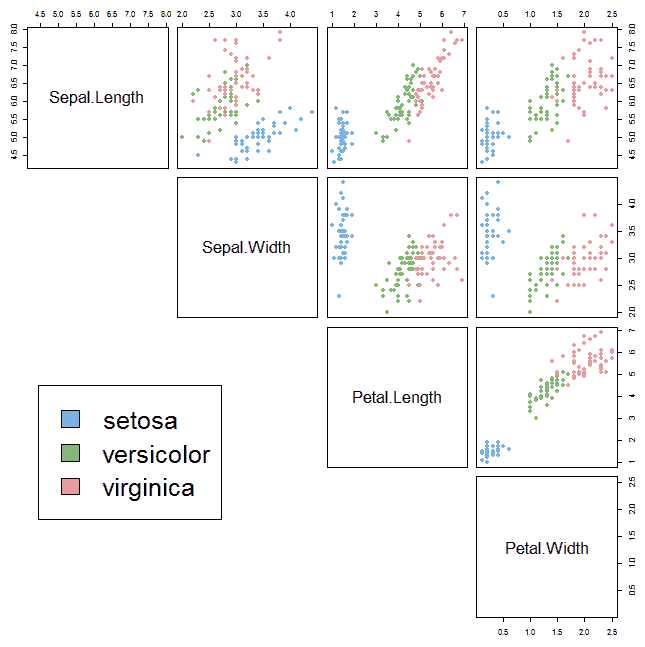

图表显示了**setosa**在几乎所有图表中形成独特的簇——但是**versicolor**和**virginica**没有。这是无监督学习。简单，对吧？

不完全是——这比那更复杂。在我们的鸢尾花例子中，我们在用颜色编码图表时有点作弊，因为我们按物种给图表着色。所以，数据并不是真正未标记的。在一个真正的无监督学习场景中，图表将看起来像这样，所有物种信息都被移除：

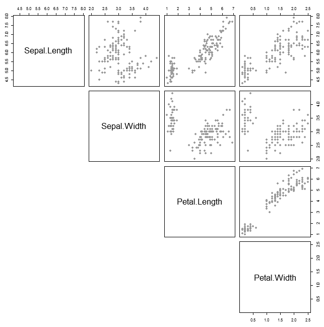

即使没有颜色和标签，由于点的分布相同，我们仍然可以轻松地识别出**setosa**簇。但是，显然，如果没有物种标签，我们根本不知道它代表什么。这是一个非常重要的观点——*算法不能自己标记簇*。它可以在各种数据点之间识别出相似度，但它无法解释那*意味着什么*（它不会知道它是**setosa**）。这个观点的一个推论是，没有定义簇的正确方法。它们是探索性数据挖掘技术的结果——就像探索未知领土一样，走不同的路径（从不同的角度观察数据）会导致不同的结果。用一句名言来概括，簇在观察者的眼中。

无监督机器学习最常见的任务定义如下：

+   **聚类（或聚类分析）**：聚类用于识别和分组那些与其他潜在分组或聚类中的项目相比更相似的对象。这种比较是通过使用数据特征中的一些度量来完成的。

+   **异常检测**：它用于标记那些不符合由数据集中其他项目定义的预期模式的项目。它们很重要，因为通常，异常代表某种问题，如银行或税务欺诈、软件错误或医疗状况。

在本章的剩余部分，我们将专注于聚类——这是一个非常有用且宝贵的无监督机器学习任务。我们将更深入地研究聚类背后的理论，然后我们将使用旧金山商业数据实现一个无监督机器学习项目。

# 聚类

如您现在可能已经意识到的，在数据科学领域，几乎总是有多个途径来解决问题。在算法层面，根据数据的特定性和我们试图解决的特定问题，我们通常会有不止一个选择。丰富的选择通常是好消息，因为一些算法可能比其他算法产生更好的结果，具体取决于具体情况。聚类也不例外——有一些众所周知的算法可用，但我们必须了解它们的优点和局限性，以避免得到无关的聚类。

以 Scikit-learn 这个著名的 Python 机器学习库为例，通过使用一些玩具数据集来说明这一点。这些数据集产生易于识别的图表，使得人类能够轻松识别聚类。然而，应用无监督学习算法将导致截然不同的结果——其中一些与我们的模式识别能力所告诉我们的明显相矛盾：


前面的四个图示说明了以下内容：

1.  两个同心圆状聚类

1.  两个曲线

1.  三个团块

1.  由均匀分布的值构成的单个聚类的正方形

对聚类进行颜色编码将产生以下图表：


利用我们天生的模式识别能力，我们可以轻松地看到定义良好的聚类。

如果对于您来说聚类非常明显，您可能会惊讶地发现，在机器学习领域，事情并不那么清晰。以下是一些最常见算法如何解释数据（以下图表和测试的所有细节都可以在 Scikit-learn 网站上找到：[`scikit-learn.org`](http://scikit-learn.org))：

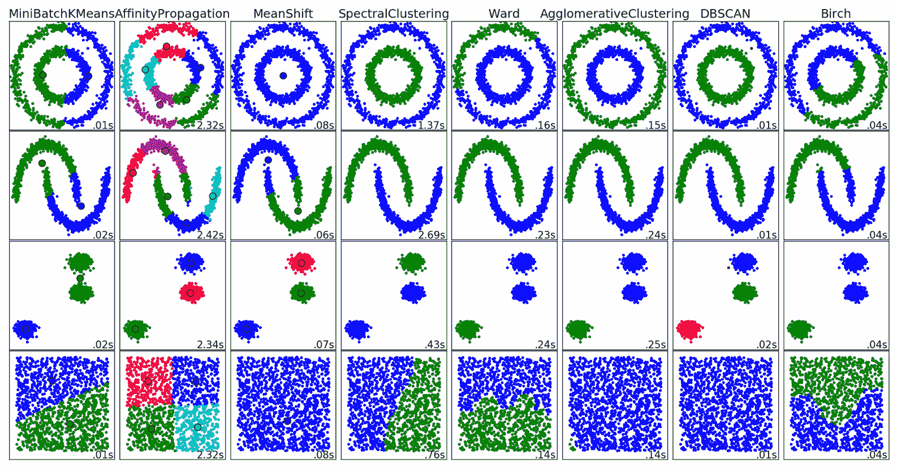

图表显示了颜色编码的聚类以及八个知名算法的计算时间——MiniBatchKMeans、Affinity Propagation、Mean Shift、Spectral Clustering、Ward、Agglomerative Clustering、DBSCAN 和 Birch。

# 旧金山商业数据分析

作为本章的学习项目，让我们假设我们被一家新客户，著名的 ACME 招聘公司雇佣。他们是一家主要的人力资源公司，并希望在旧金山开设一家新办公室。他们正在制定一项非常雄心勃勃的营销策略来配合他们的开业。ACME 希望通过广告牌进行户外宣传活动；在公交车、出租车和自行车上张贴海报进行交通广告；并通过邮寄传单进行直接邮件营销。

他们针对的是商业客户，并来找我们帮助他们做两件事：

+   他们想知道最佳的竞选区域，在哪里放置广告牌，在哪些公交线路上投放广告，以及向哪些邮寄地址发送传单。

+   他们希望了解市场的招聘需求，以便他们可以联系到具有所需资格的专业人士。

我们的计划是使用有关旧金山注册公司的数据库，并使用无监督学习，即聚类，来检测公司密度最高的区域。这就是 ACME 应该花费他们的广告费用的地方。一旦我们确定了他们将要针对的公司，我们就能看到他们从事的活动领域。我们的客户将使用这些信息来评估他们的招聘需求。

在数据方面，我们有一个良好的开端，因为旧金山市公开提供了大量有趣的数据，可以在[`data.sfgov.org`](https://data.sfgov.org)网站上找到。浏览该网站，我们可以找到一个注册纳税企业的数据库。它提供了丰富的信息，包括名称、地址、开业和停业日期（如果企业已关闭）、地理位置坐标（有时还有街区名称）等。

您可以通过点击工具栏中的导出按钮，从[`data.sfgov.org/Economy-and-Community/Map-of-Registered-Business-Locations/ednt-jx6u`](https://data.sfgov.org/Economy-and-Community/Map-of-Registered-Business-Locations/ednt-jx6u)下载文件，或者使用直接下载 URL：[`data.sfgov.org/api/views/ednt-jx6u/rows.csv?accessType=DOWNLOAD`](https://data.sfgov.org/api/views/ednt-jx6u/rows.csv?accessType=DOWNLOAD)。

然而，我强烈建议使用本章支持文件中提供的文件，以确保我们使用确切相同的数据，并在你继续操作时得到相同的结果。请从[`github.com/PacktPublishing/Julia-Programming-Projects/blob/master/Chapter08/data/Map_of_Registered_Business_Locations.csv.zip`](https://github.com/PacktPublishing/Julia-Programming-Projects/blob/master/Chapter08/data/Map_of_Registered_Business_Locations.csv.zip)下载。

对于每个条目，我们还得到了 **北美行业分类系统**（**NAICS**）代码，该代码是（联邦统计机构用于分类商业机构以收集、分析和发布与美国商业经济相关的统计数据的标准）。这很重要，因为我们将使用它来识别最常见的商业类型，这将帮助我们的客户吸引相关候选人。

在我们的数据集中，NAICS 代码表示为一个范围，例如，4400–4599。幸运的是，我们还得到了相应活动部门的名称。在这个例子中，4400–4599 代表 *零售业*。

是时候加载数据并进行切片和切块了！到现在为止，我相信你已经知道了该怎么做：

```py
julia> using CSV, DataFrames  
julia> df = CSV.read("Map_of_Registered_Business_Locations.csv") 
```

使用 `describe(df)` 可以给我们提供关于每一列的宝贵信息。为了简洁起见，我在下一张截图里只包括了 `nunique` 和 `nmissing`，但你可以自由地作为练习更详细地检查数据：

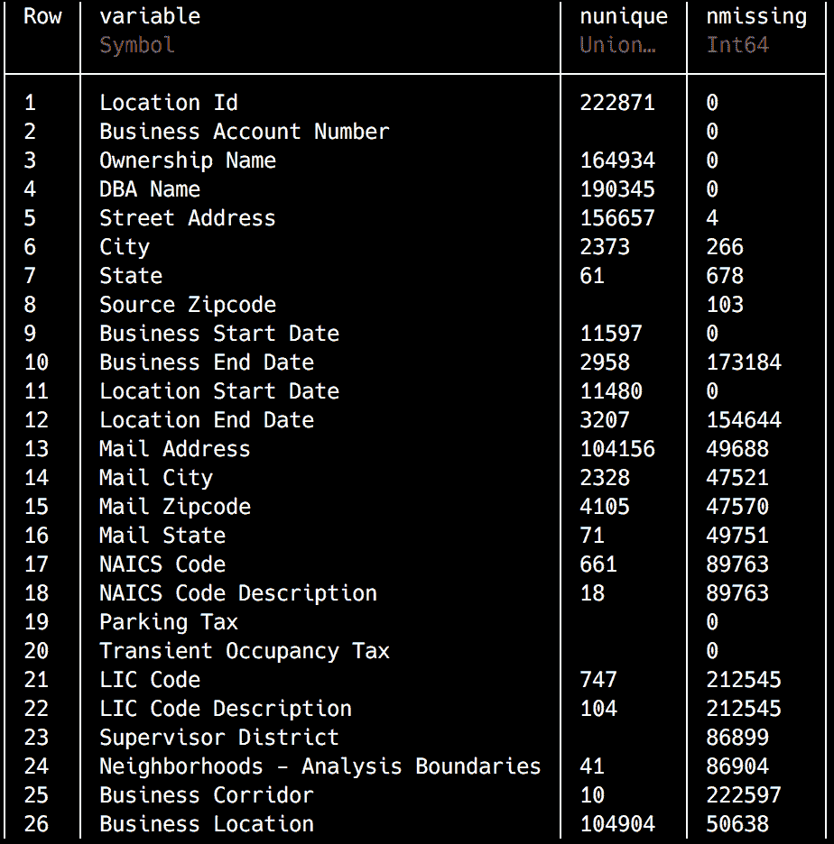

检查缺失值的数量和百分比（在 `nmissing` 列下）以及唯一值的数量（作为 `nunique`）。我们可以看到，对于 `Location Id` 列，我们得到了 `222871` 个唯一值和零缺失条目。唯一的位置 ID 数量等于数据集的行数：

```py
julia> size(df, 1) 
222871  
```

接下来，`Ownership Name` 代表注册商业的实体（无论是个人还是另一家公司），而 `DBA Name` 则代表商业本身的名称。对于这两者，我们可以看到 `Number Unique` 小于 `Location Id`，这意味着一些公司由相同的实体拥有——并且一些公司会有相同的名称。进一步查看 `Street Address`，我们发现大量公司与其他商业共享位置（对于 `222871` 家公司有 156,658 个唯一的地址）。最后，我们可以看到我们几乎所有的记录都有 `City`、`State` 和 `Zipcode` 信息。

数据集还提供了关于商业注册日期（`Business Start Date`）、关闭日期（`Business End Date`）以及在该位置开始和结束运营的日期（分别对应 `Location Start Date` 和 `Location End Date`）的信息。还有更多细节，但它们对于我们分析大多不相关，例如 `Parking Tax`、`Transient Occupancy Tax` 和 `LIC Code` 数据（超过 95%的记录缺失）以及 `Supervisor District`、`Neighborhoods Analysis Boundaries` 和 `Business Corridor` 信息（尽管商业走廊数据在 99.87%的情况下缺失）。

是时候清理我们的数据，为分析做好准备！

# 使用查询进行数据处理

到目前为止，我们已经看到了如何使用`DataFrames` API 来操作`DataFrame`实例。我相信你现在已经知道，我们可以通过使用`delete!(df::DataFrame, column_name::Symbol)`等方法来删除不感兴趣的列。你可能还记得，在前一章中，你可以通过结合方括号表示法和点元素操作符来过滤`DataFrame`实例，例如以下示例：

```py
julia> df[df[Symbol("Parking Tax")] .== true, :][1:10, [Symbol("DBA Name"), Symbol("Parking Tax")]] 
DBA Name and Parking Tax columns only) where the business pays parking tax:
```

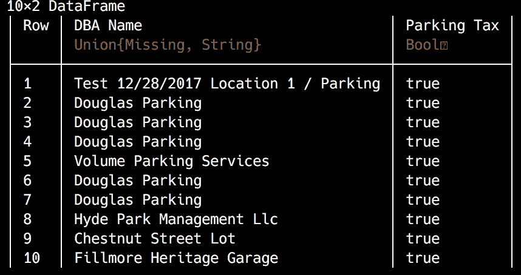

现在，如果你认为 Julia 以其美丽的语法和出色的可读性而宠爱我们，而前面的代码既不美丽也不易读——那么，你是对的！虽然前面的语法是可用的，但肯定可以改进。而且，我相信你不会对听到 Julia 的包生态系统已经提供了更好的方法来处理`DataFrames`而感到惊讶。现在，让我们来看看`Query`！

Query 是一个用于查询 Julia 数据的包。它与多种数据源一起工作，包括 Array、DataFrame、CSV、SQLite、ODBC 等。它提供了过滤、投影、连接和分组功能，并且深受微软的**语言集成查询**（**LINQ**）的启发。如果你对此不太了解，不要担心；你很快就会看到它的实际应用。

下面是如何重构前面的操作，使用查询来过滤出支付停车税的企业：

```py
julia> @from i in df begin 
           @where i[Symbol("Parking Tax")] == true 
           @select i 
           @collect DataFrame 
       end
```

如果你熟悉 SQL，你很容易就能识别出熟悉的查询语言结构，如`from`、`where`和`select`。这非常强大！

然而，为了将诸如`Parking Tax`之类的列名转换为符号以便访问我们的数据，不得不使用这种冗长的语法，这确实不方便。在我们开始之前，最好将列名重命名为更符合符号的格式，并将空格替换为下划线。我们将使用`DataFrames.rename!`函数结合列表推导来完成这项工作：

```py
julia> rename!(df, [n => replace(string(n), " "=>"_") |> Symbol for n in names(df)]) 
```

`rename!`函数接受一个`DataFrame`和一个形式为`:current_column_name => :new_current_name`的`Array{Pair}`。我们使用列表推导来构建数组，通过遍历每个当前列名（由`names(df)`返回），将结果符号转换为字符串，将`" "`替换为`"_"`，然后将字符串转换回符号。

现在，我们可以使用更简洁的点符号表示法与查询结合，所以前面的代码片段将看起来像这样：

```py
@from i in df begin 
    @where i.Parking_Tax == true 
    @select i 
    @collect DataFrame 
end 
```

# Julia 中的元编程

```py
@ prefix represents a macro—which introduces a very powerful programming technique called metaprogramming.
```

如果你之前没有听说过它，它基本上意味着一个程序具有在运行时读取、分析、转换，甚至修改自己的能力。一些被称为 **同构** 的语言，提供了非常强大的元编程功能。在同构语言中，程序本身在内部被表示为程序可以访问并操作的数据结构。Lisp 是典型的同构编程语言，因此这种元编程是通过 Lisp 风格的宏来实现的。它们与 C 和 C++ 中的预处理宏不同，预处理宏在解析和评估之前会操作包含代码的文本文件。

Julia 语言在一定程度上受到 Lisp 语言的影响，也是一种同构语言。因此，在 Julia 中的元编程，我们需要了解两个关键方面——通过表达式和符号表示代码，以及使用宏来操作代码。如果我们把 Julia 程序的执行看作是一系列步骤，元编程就会在解析步骤之后、代码被编译器评估之前介入并修改代码。

# 学习元编程中的符号和表达式

理解元编程并不容易，所以如果你一开始觉得它不太自然，请不要慌张。我认为其中一个原因是它发生在比我们习惯的常规编程更高的抽象层次上。我希望通过从符号开始讨论，可以使介绍更加具体。我们在整本书中广泛使用了符号，特别是作为各种函数的参数。它们看起来是这样的——`:x` 或 `:scientific` 或 `:Celsius`。正如你可能已经注意到的，符号代表一个标识符，我们非常像使用常量一样使用它。然而，它不仅仅是这样。它代表了一段代码，这段代码不是作为变量来评估，而是用来引用变量本身。

要理解符号和变量之间的关系，一个很好的类比是短语中的单词。以句子为例：*理查德很高*。在这里，我们理解到 *理查德* 是一个人的名字，很可能是男性。理查德这个人很高。然而，在句子：*理查德有七个字母*中，很明显我们现在谈论的不是理查德这个人。假设理查德这个人有七个字母，这并没有太多意义。我们谈论的是单词 *理查德* 本身。

在 Julia 中，与第一句话（*理查德很高*）等价的表达方式是 `julia> x`。在这里，`x` 被立即评估以产生其值。如果它没有被定义，将会导致错误，如下所示：

```py
julia> x 
ERROR: UndefVarError: x not defined 
```

Julia 的符号模仿了第二句话，其中我们谈论的是单词本身。在英语中，我们用单引号将单词括起来，写成`'Richard'`，以表明我们不是指人，而是指单词本身。同样，在 Julia 中，我们在变量名前加一个冒号，`:x`：

```py
julia> :x 
:x 
```

```py
julia> typeof(:x) 
Symbol 
```

因此，冒号`:`前缀是一个运算符，它停止评估。未评估的表达式可以通过使用`eval()`函数或`@eval`宏按需评估，如下所示：

```py
julia> eval(:x) 
ERROR: UndefVarError: x not defined 
```

但我们可以超越符号。我们可以编写更复杂的类似符号的语句，例如，`:(x = 2)`。这工作方式与符号非常相似，但实际上它是一个`Expr`类型，代表表达式。表达式，像任何其他类型一样，可以通过变量名引用，并且像符号一样，它们可以被评估：

```py
julia> assign = :(x = 2) 
:(x = 2) 
julia> eval(assign) 
2 
julia> x 
2 
Expr type with the assign variable and then eval it. Evaluation produces side effects, the actual value of the variable x now being 2.
```

更加强大的是，由于`Expr`是一个类型，它具有暴露其内部结构的属性：

```py
julia> fieldnames(typeof(assign)) 
(:head, :args) 
```

每个`Expr`对象都有两个字段——`head`代表其类型，`args`代表参数。我们可以通过使用`dump()`函数查看`Expr`的内部结构：

```py
julia> dump(assign)
Expr
head: Symbol =
args: Array{Any}((2,))
1: Symbol x
2: Int64 2  
```

这引出了更加重要的发现。首先，这意味着我们可以通过其属性程序化地操作`Expr`：

```py
julia> assign.args[2] = 3 
3 
julia> eval(assign) 
3 
julia> x 
3 
```

我们的表达式不再是`:(x = 2)`；现在它是`:(x = 3)`。通过操作`assign`表达式的`args`，`x`的值现在是`3`。

其次，我们可以使用类型的构造函数程序化地创建`Expr`的新实例：

```py
julia> assign4 = Expr(:(=), :x, 4) :(x = 4) 
julia> eval(assign4) 4
 julia> x 4 
```

请注意，在这里我们用括号将等号（`=`）括起来，以指定一个表达式，因为否则 Julia 会困惑，认为我们想要在那里立即执行赋值操作。

# 引用表达式

之前的过程，即我们在`:(...)`中包装一个表达式以创建`Expr`对象，被称为**引用**。它也可以使用 quote 块来完成。quote 块使引用变得更加容易，因为我们可以将看起来像常规代码的内容传递给它们（而不是将所有内容转换为符号），并且支持引用多行代码以构建随机复杂的表达式：

```py
julia> quote 
           y = 42 
           x = 10 
       end
 julia> eval(ans) 
10
 julia> y 
42
 julia> x 
10 
```

# 字符串插值

就像字符串插值一样，我们可以在表达式中引用变量：

```py
julia> name = "Dan" 
"Dan" 

julia> greet = :("Hello " * $name) 
:("Hello " * "Dan") 

julia> eval(greet) 
"Hello Dan" 
```

# 宏

现在，我们终于有了理解宏的知识。它们是语言结构，在代码解析之后、评估之前执行。它可以可选地接受一个参数元组，并且必须返回一个`Expr`。生成的`Expression`将被直接编译，因此我们不需要对它调用`eval()`。

例如，我们可以将之前的`greet`表达式作为一个宏实现为可配置版本：

```py
julia> macro greet(name) 
           :("Hello " * $name) 
       end 
@greet (macro with 1 method)
julia> @greet("Adrian") 
"Hello Adrian" 
macro keyword and are invoked using the @... syntax. The brackets are optional when invoking macros, so we could also use @greet "Adrian".
```

宏是功能强大的语言结构，允许在运行完整程序之前对代码的部分进行自定义。官方 Julia 文档有一个很好的例子来说明这种行为：

```py
julia> macro twostep(arg) 
         println("I execute at parse time. The argument is: ", arg) 
         return :(println("I execute at runtime. The argument is: ", $arg)) 
       end 
@twostep (macro with 1 method) 
```

我们定义了一个名为 `twostep` 的宏，其主体调用 `println` 函数将文本输出到控制台。它返回一个表达式，当评估时，也会通过相同的 `println` 函数输出一段文本。

现在，我们可以看到它的实际应用：

```py
julia> ex = macroexpand(@__MODULE__, :(@twostep :(1, 2, 3))); 
I execute at parse time. The argument is: $(Expr(:quote, :((1, 2, 3)))) 
macroexpand, which takes as an argument the module in which to expand the expression (in our case, @__MODULE__ stands for the current module) and an expression that represents a macro invocation. The call to macroexpand converts (expands) the macro into its resulting expressions. The output of the macroexpand call is suppressed by appending ; at the end of the line, but the resulting expression is still safely stored in ex. Then, we can see that the expanding of the macro (its parsing) takes place because the I execute at parse time message is output. Now look what happens when we evaluate the expression, ex:
```

```py
julia> eval(ex) 
I execute at runtime. The argument is: (1, 2, 3) 
```

输出了 `I execute at runtime` 消息，但没有输出 `I execute at parse time` 消息。这是一件非常强大的事情。想象一下，如果我们有一些计算密集型或耗时操作，而不是简单的文本输出。在一个简单的函数中，我们每次都必须运行这段代码，但使用宏，这只需在解析时运行一次。

# 关于宏的结束语

除了它们非常强大之外，宏也非常方便。它们可以用最小的开销提供很多功能，并且可以简化接受表达式作为参数的函数的调用。例如，`@time` 是一个非常有用的宏，它在测量执行时间的同时执行一个 `Expression`。而且，最棒的是，我们可以将参数表达式作为 *常规* 代码传递，而不是手动构建 `Expr`：

```py
julia> @time rand(1000); 
  0.000007 seconds (5 allocations: 8.094 KiB) 
```

宏——以及一般意义上的元编程——是强大的概念，需要整本书来详细讨论。我们必须在这里停下来，以便回到我们的机器学习项目。ACME 招聘公司热切地等待我们的发现。我建议查看官方文档 [`docs.julialang.org/en/stable/manual/metaprogramming/`](https://docs.julialang.org/en/stable/manual/metaprogramming/)。

# 从 Query.jl 基础开始

可以用标准方式添加 `Query` 包——`pkg> add Query`。一旦使用 `Query` 将其引入作用域，它就提供了一个丰富的 API 用于查询 Julia 数据源，其中 `DataFrames` 是最常见的数据源。使用 `@from` 宏来启动查询。

# @from

查询的一般结构如下：

```py
@from var in data_source begin 
    # query statements here 
end 
```

在 `begin...end` 块中，`var` 代表 `data_source` 中的行。查询语句每行给出一个，可以包括任何可用的查询命令的组合，例如 `@select`、`@orderby`、`@join`、`@group` 和 `@collect`。让我们更详细地看看其中最重要的几个。

# @select

`@select` 查询命令，类似于其 `SQL SELECT` 对应命令，表示要返回哪些值。其一般语法是 `@select condition`，其中 `condition` 可以是任何 `Julia` 表达式。最常见的情况是我们希望返回整行，在这种情况下，我们只需传递 `var` 本身。例如，让我们创建一个新的 `DataFrame` 来保存购物清单：

```py
julia> shopping_list = DataFrame(produce=["Apples", "Milk", "Bread"], qty=[5, 2, 1]) 
```

输出如下：

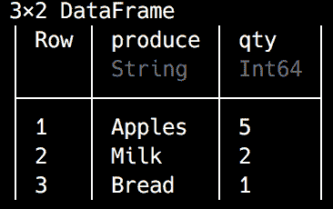

一个酷（极客！）且实用的购物清单。

我们可以用以下方式 `@select` 整行：

```py
@from p in shopping_list begin 
    @select p 
end 
```

这不是很实用，因为这基本上返回整个 `DataFrame`，但我们也可以使用点符号引用列，例如，`p.produce`：

```py
julia> @from p in shopping_list begin 
           @select p.produce 
       end 
3-element query result 
 "Apples" 
 "Milk" 
 "Bread" 
```

由于 `@select` 接受任何随机的 `Julia` 表达式，我们可以自由地按需操作数据：

```py
julia> @from p in shopping_list begin 
           @select uppercase(p.produce), 2p.qty 
       end 
3-element query result 
 ("APPLES", 10) 
 ("MILK", 4) 
 ("BREAD", 2) 
produce and two times the qty.
```

然而，更好的方法是返回 `NamedTuple`，使用特殊的查询花括号语法：

```py
julia> @from p in shopping_list begin 
           @select { produce = uppercase(p.produce), qty = 2p.qty } 
       end 
```

输出如下：


在这里，我们传递了 `NamedTuple` 的键和值，但它们不是强制的。然而，如果我们想要有正确命名的列（谁不想呢，对吧？）：

```py
julia> @from p in shopping_list begin 
           @select { uppercase(p.produce), 2p.qty } 
       end 
```

输出如下：


没有明确的标签，`query` 将分配如 `__1__`、`__2__` 等之类的列名。这并不太易读！

# @collect

你可能已经注意到在前面的屏幕截图中的返回值类型是 `query result`。一个查询将返回一个迭代器，可以进一步用于遍历结果集的各个元素。但我们可以使用 `@collect` 语句将结果实体化到特定的数据结构中，最常见的是 `Array` 或 `DataFrame`。如下所示：

```py
julia> @from p in shopping_list begin 
           @select { PRODUCE = uppercase(p.produce), double_qty = 2p.qty } 
           @collect 
       end 
```

我们得到以下内容：


默认情况下，`@collect` 将生成一个 `NamedTuple` 元素的 `Array`。但我们可以传递一个额外的参数来指定我们想要的数据类型：

```py
julia> @from p in shopping_list begin 
           @select {PRODUCE = uppercase(p.produce), double_qty = 2p.qty} 
           @collect DataFrame 
       end 
```

输出看起来如下：

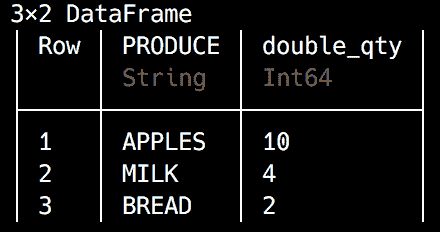

我们的结果现在是一个 `DataFrame`。

# @where

最有用的命令之一是 `@where`，它允许我们过滤数据源，以便只返回满足条件的元素。类似于 `@select`，条件可以是任何任意的 `Julia` 表达式：

```py
julia> @from p in shopping_list begin 
           @where p.qty < 2 
           @select p 
           @collect DataFrame 
       end 
```

我们得到以下输出：

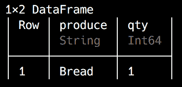

只有面包的 `qty` 小于 `2`。

通过范围变量，过滤功能可以变得更加强大。这些变量类似于属于 `query` 表达式的新变量，可以使用 `@let` 宏引入：

```py
julia> @from p in shopping_list begin 
           @let weekly_qty = 7p.qty 
           @where weekly_qty > 10 
           @select { p.produce, week_qty=weekly_qty } 
           @collect DataFrame 
       end 
```

输出如下：

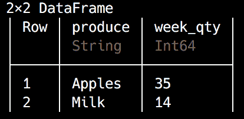

在这里，你可以看到如何在 `begin...end` 块内定义一个名为 `weekly_qty` 的局部变量，其值等于 `7 * p.qty`。我们使用了 `@let` 宏来引入新变量。在下一行，我们使用它来过滤出 `weekly_qty` 小于 `10` 的行。然后最终，我们选择它并将其收集到一个 `DataFrame` 中。

# @join

让我们让事情变得更加有趣：

```py
julia> products_info = DataFrame(produce = ["Apples", "Milk", "Bread"], price = [2.20, 0.45, 0.79], allergenic = [false, true, true]) 
```

输出如下：

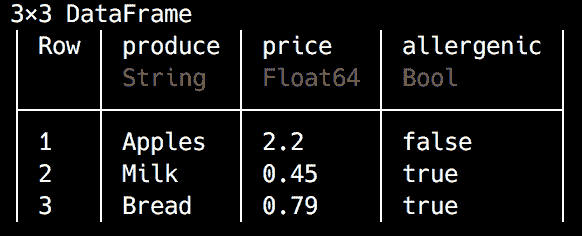

我们实例化一个新的 `DataFrame`，称为 `products_info`，它包含关于购物清单中物品的重要信息——它们的价格以及它们是否可以被认为是过敏原。我们可以使用 `DataFrames.hcat!` 将 `products_info` 的一些列追加到 `shopping_list` 中，但再次强调，语法并不那么优雅，这种方法也不够灵活。我们已经习惯了 Julia，我们喜欢这种方式！幸运的是，Query 提供了一个 `@join` 宏：

```py
shopping_info = @from p in shopping_list begin 
    @join pinfo in products_info on p.produce equals pinfo.produce 
    @select { p.produce, p.qty, pinfo.price, pinfo.allergenic } 
    @collect DataFrame 
end 
shopping_list as p, adding an inner join, @join, with products_info as pinfo, on the condition that p.produce equals pinfo.produce. We basically put together the produce and qty columns from shopping_list DataFrame with the price and allergenic columns from products_info. The resulting DataFrame can now be referenced as shopping_info:
```


`@join` 命令的一般语法如下：

```py
@from var1 in datasource1 begin 
    @join var2 in datasource2 on var1.column equals var2.column  
end 
```

查询提供了 `@join` 的两种其他变体：分组连接和左外连接。如果您想了解更多信息，请查看官方文档[`www.queryverse.org/Query.jl/stable/querycommands.html#Joining-1`](http://www.queryverse.org/Query.jl/stable/querycommands.html#Joining-1)。

# @group

`@group` 语句按某些属性对元素进行分组：

```py
julia> @from p in shopping_info begin 
           @group p.produce by p.allergenic 
           @collect 
       end 
2-element Array{Grouping{Bool,String},1}: 
 ["Apples"] 
 ["Milk", "Bread"]  
```

还不错，但我们真正想要的是总结数据。Query 在此提供了名为 `split-apply-combine`（也称为 `dplyr`）的功能。这需要一个聚合函数，该函数将根据 `Grouping` 变量来折叠数据集。如果这太抽象了，一个例子肯定会澄清一切。

假设我们想要获取过敏物品的数量以及它们名称的逗号分隔列表，这样我们就可以知道要避免什么：

```py
@from p in shopping_info begin
    @group p by p.allergenic into q
    @select { allergenic = key(q),
    count = length(q.allergenic),
    produce = join(q.produce, ", ") }
    @collect DataFrame
end  
q variable and then pass the aggregation function, length, to get a count of the values of the allergenic column. We then use the join function to concatenate the values in the produce column.
```

结果将是一个两行的 `DataFrame`：


# @orderby

查询还提供了一个名为 `@orderby` 的排序宏。它接受一个属性列表，用于应用排序。类似于 SQL，默认情况下是升序排序，但我们可以通过使用 `descending` 函数来更改它。

给定我们之前定义的 `products_info` `DataFrame`，我们可以轻松地按需对其进行排序，例如，首先按价格最高的产品排序，然后按产品名称排序：

```py
julia> @from p in products_info begin 
           @orderby descending(p.price), p.produce 
           @select p 
           @collect DataFrame 
        end 
@orderby to sort the values in the source. Unsurprisingly, the resulting DataFrame will be properly sorted with the most expensive products on top:
```

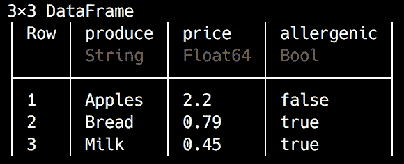

好吧，这确实是一个相当大的绕路！但现在我们已经了解了伟大的 `Query` 包，我们准备好高效地切割和剖析我们的数据了。让我们开始吧！

# 准备我们的数据

我们的数据清理计划是只保留在旧金山、加利福尼亚注册的企业，我们有它们的地址、邮编、NAICS 代码和业务位置，并且它们尚未关闭（因此没有业务结束日期）且未搬迁（没有位置结束日期）。

使用 `DataFrame` API 应用过滤器将是繁琐的。但有了 Query，这就像散步一样简单：

```py
pkg> add DataValues 
julia> using DataValues 
julia> clean_df = @from b in df begin 
 @where lowercase(b.City) == "san francisco" && b.State == "CA" &&
 ! isna(b.Street_Address) && ! isna(b.Source_Zipcode) &&
 ! isna(b.NAICS_Code) && ! isna(b.NAICS_Code_Description) &&
 ! isna(b.Business_Location) &&
 occursin(r"\((.*), (.*)\)", get(b.Business_Location)) &&
 isna(b.Business_End_Date) && isna(b.Location_End_Date)
 @select { b.DBA_Name, b.Source_Zipcode, b.NAICS_Code, 
 b.NAICS_Code_Description, b.Business_Location }
 @collect DataFrame
end 
```

我们可以看到 `@where` 过滤器是如何应用的，要求 `lowercase(b.City)` 等于 `"san francisco"`，并且 `b.State` 等于 `"CA"`。然后，我们使用 `! isna` 确保只保留 `b.Street_Address`、`b.Source_Zipcode`、`b.NAICS_Code`、`b.NAICS_Code_Description` 和 `b.Business_Location` 不为空的行。`isna` 函数由 `DataValues` 包提供（该包由 Query 本身使用），这就是为什么我们要添加并使用它的原因。

我们还确保 `b.Business_Location` 与对应于地理坐标的特定格式匹配。最后，我们确保 `b.Business_End_Date` 和 `b.Location_End_Date` 实际上是缺失的。

执行查询会产生一个包含近 57,000 行的新的 `DataFrame`。

下一步是从 `clean_df` 数据中提取 `Business_Location` 列中的地理坐标。同样，Query 来帮忙：

```py
clean_df_geo = @from b in clean_df begin
 @let geo = split(match(r"(\-?\d+(\.\d+)?),\s*(\-?\d+(\.\d+)?)", 
 get(b.Business_Location)).match, ", ")
 @select {b.DBA_Name, b.Source_Zipcode, b.NAICS_Code,
 b.NAICS_Code_Description,
 lat = parse(Float64, geo[1]), long = parse(Float64, geo[2])}
 @collect DataFrame
end 
```

我们充分利用了范围变量特性（由 `@let` 定义）来引入一个 `geo` 变量，它使用 `match` 从 `Business_Location` 数据中提取经纬度对。接下来，在 `@select` 块内部，geo 数组中的两个值被转换为适当的浮点值并添加到结果 `DataFrame` 中：


我们完成了！我们的数据现在已整洁地表示在 `clean_df_geo` `DataFrame` 中，包含企业的名称、邮政编码、NAICS 代码、NAICS 代码描述、纬度和经度。

如果我们运行 `describe(clean_df_geo)`，我们会看到我们有 56,549 家企业，有 53,285 个独特的名称，只有 18 个 NAICS 代码描述。我们不知道公司分布在多少个邮政编码中，但很容易找到：

```py
julia> unique(clean_df_geo[:, :Source_Zipcode]) |> length 
79 
```

我们的业务在旧金山市的 `79` 个邮政编码内注册。

# 基于聚类的无监督机器学习

Julia 的包生态系统提供了一个专门的库用于聚类。不出所料，它被称为 **聚类**。我们可以简单地执行 `pkg> add Clustering` 来安装它。`Clustering` 包实现了一些常见的聚类算法——k-means、亲和传播、DBSCAN 和 kmedoids。

# K-means 算法

K-means 算法是最受欢迎的算法之一，在广泛的应用中提供了良好的结果和良好的性能的平衡组合。然而，一个复杂的问题是，我们事先必须给它指定簇的数量。更确切地说，这个数字称为 **k**（因此算法名称的首字母），代表质心的数量。**质心**是代表每个簇的点。

K-means 算法采用迭代方法——它使用由种子过程定义的算法放置质心，然后它将每个点分配到其对应的质心，即最近的均值。算法在收敛时停止，也就是说，当点分配在新一轮迭代中不改变时。

# 算法种子

有几种方法可以选择质心。聚类提供了三种，其中一种是随机（在聚类中标记为 `:rand` 选项），它随机选择一个点的子集作为种子（因此所有质心都是随机的）。这是经典 k-means 的默认种子策略。还有 k-means++，这是一种在 2007 年由 David Arthur 和 Sergei Vassilvitskii 提出的更好变体（标记为 `:kmpp`），它随机选择一个簇中心，然后根据第一个中心搜索其他中心。最后一种可用方法是中心性种子（`:kmcen`），它选择具有最高中心性的样本。

# 寻找拥有最多企业的区域

在上一节中，我们成功清理了数据，现在它整洁地存储在`clean_df_geo``DataFrame`中。如果你在数据清理过程中遇到任何问题，你可以直接使用本章支持文件中提供的`clean_df_geo.tsv`文件从头开始加载数据集（[`github.com/PacktPublishing/Julia-Programming-Projects/blob/master/Chapter08/data/clean_df_geo.tsv.zip`](https://github.com/PacktPublishing/Julia-Programming-Projects/blob/master/Chapter08/data/clean_df_geo.tsv.zip)）。为了加载它，你只需要运行以下命令：

```py
julia> using CSV 
julia> clean_df_geo = CSV.read("clean_df_geo.tsv", delim = '\t', nullable = false) 
```

因此，我们想要识别企业密度最高的地区。一种方法是通过无监督机器学习，根据邮政编码和注册的企业数量来识别地区。

我们将使用`:zipcode`列中的数据以及该地区注册的企业数量来训练我们的模型。我们需要每个邮政编码的企业数量：

```py
julia> model_data = @from b in clean_df_geo begin 
    @group b by b.Source_Zipcode into g 
    @let bcount = Float64(length(g)) 
    @orderby descending(bcount) 
    @select { zipcode = Float64(get(key(g))), businesses_count = bcount } 
    @collect DataFrame 
end 
```

我们对`clean_df_geo``DataFrame`执行查询，按`:Source_Zipcode`分组到`g`。我们将当前邮政编码的企业数量存储在`bcount`范围变量中，这是由`length(g)`返回的，但在转换成`Float64`之前。我们这样做的原因是，正如我们马上就会看到的，聚类期望输入为`Float64`，因此这将节省我们后续的另一个处理步骤。回到我们的查询。我们还通过`bcount`进行排序，以便我们人类更好地理解数据（对训练模型不是必需的）。最后，我们实例化一个新的`DataFrame`，包含两列，一个邮政编码和一个`businesses_count`，同时不要忘记将邮政编码也转换为`Float64`，原因与之前相同。在转换`key(g)`时，请注意，我们首先调用了`get`函数。这是因为，在查询块中，计算值表示为`DataValues`，要访问包装的值，我们需要调用`get`：

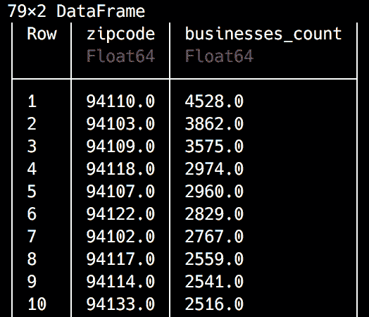

我们的训练数据由`79`个邮政编码及其对应的企业数量组成。前 22 个地区每个地区有超过 1000 家企业，其余地区的数量急剧下降：

```py
julia> last(model_data) 
```

输出如下：

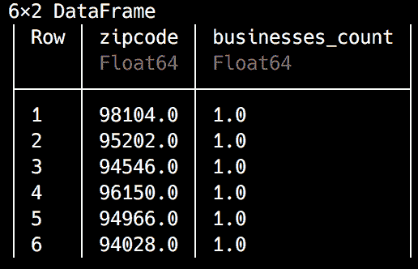

你可能还记得`Gadfly`，这是我们在第一章《Julia 编程入门》中使用的 Julia 绘图库，用于可视化 Iris 花朵数据集。让我们用它快速浏览一下我们的数据：

```py
julia> using Gadfly 
julia> plot(model_data, x=:businesses_count, Geom.histogram) 
```

这将生成以下直方图：


我们可以很容易地看出，大多数地区只有一个注册的企业，然后是一些只有几个企业的其他地区。我们可以安全地从我们的训练数据集中移除这些，因为它们对我们的客户没有帮助。我们唯一需要做的是在查询`model_data`时添加`@where bcount > 10`过滤器，在`@let`和`@orderby`语句之间：

```py
model_data = @from b in clean_df_geo begin 
    @group b by b.Source_Zipcode into g 
    @let bcount = Float64(length(g)) 
    @where bcount > 10 
    @orderby descending(bcount) 
    @select { zipcode = Float64(get(key(g))), businesses_count = bcount } 
    @collect DataFrame 
end 
```

一旦我们移除了所有少于`10`家公司的区域，我们就只剩下`28`个邮编。

# 训练我们的模型

只需一小步，我们就可以准备好训练我们的模型。我们需要将`DataFrame`转换为数组，并重新排列数组的维度，以便`DataFrame`的列成为行。在新结构中，每个列（邮编和计数对）被视为一个训练样本。让我们来做：

```py
julia> training_data = permutedims(convert(Array, model_data), [2, 1]) 
```

我们的训练数据已经准备好了！是时候好好利用它了：

```py
julia> using Clustering
julia> result = kmeans(training_data, 3, init=:kmpp, display=:iter)

 Iters               objv        objv-change | affected  
------------------------------------------------------------- 
      0       6.726516e+06 
      1       4.730363e+06      -1.996153e+06 |        0 
      2       4.730363e+06       0.000000e+00 |        0 
K-means converged with 2 iterations (objv = 4.73036279655838e6) 
```

我们通过调用同名函数来使用 k-means 算法。作为参数，我们提供`training_data`数组，并给它三个聚类。我们希望将区域分为三个等级——低、中、高密度。训练不应该超过几秒钟。由于我们提供了`display=:iter`参数，我们在每次迭代时都会得到渐进的调试信息。对于种子算法，我们使用了 k-means++（`:kmpp`）。

# 解释结果

现在，我们可以看看点是如何分配的：

```py
julia> result.assignments 
28-element Array{Int64,1}: 
 3 
 3 
 3 
 1 
 1 
 # some 1 values omitted from the output for brevity 
 1 
 1 
 2 
 2 
 # some 2 values omitted from the output for brevity 
 2 
 2 
```

数组中的每个元素对应于`model_data`中相同索引处的元素。让我们合并数据，使其更容易跟踪：

```py
julia> model_data[:cluster_id] = result.assignments 
28-element Array{Int64,1}: 
# output truncated #
```

现在让我们看看我们最终得到的是什么：

```py
julia> model_data
```

输出结果如下：

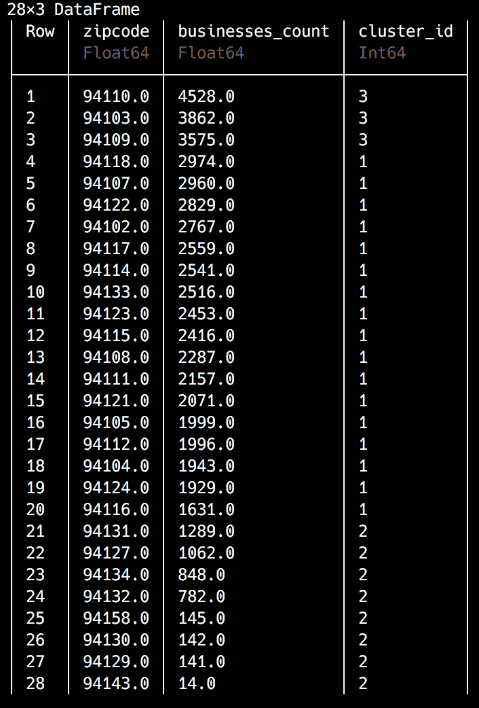

我们可以看到，前三个邮编被分配到了聚类`3`，最后八个被分配到了聚类`2`，其余的分配到了聚类`1`。你可能已经注意到，聚类的 ID 并不遵循实际的计数值，这是正常的，因为数据是无标签的。我们必须解释聚类的含义。而且我们的算法已经决定，商业密度最高的区域将保持在聚类`3`，低密度区域在聚类`2`，平均密度区域在聚类`1`。使用`Gadfly`绘制数据将证实我们的发现：

```py
julia> plot(model_data, y = :zipcode, x = :businesses_count, color = result.assignments, Geom.point, Scale.x_continuous(minvalue=0, maxvalue=5000), Scale.y_continuous(minvalue=94050, maxvalue=94200), Scale.x_continuous(format=:plain)) 
```

它生成了以下图表：

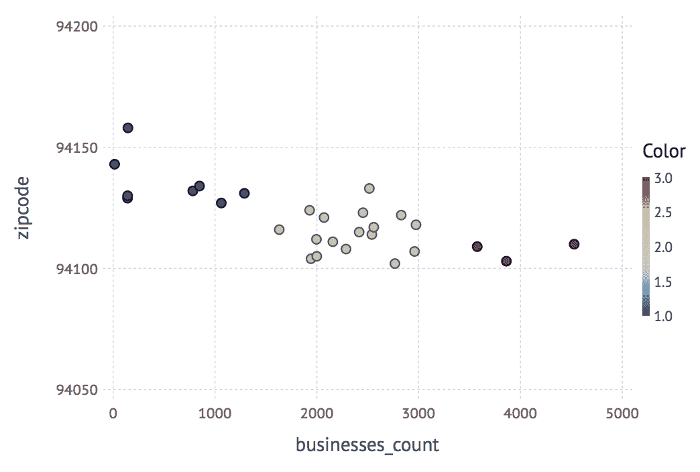

极好！现在我们可以通知我们的客户，最佳的目标区域是邮编 94110、94103 和 94109，这样他们就可以接触到这些城市密集区域中的 11,965 家企业。他们还想知道这些是哪些公司，让我们准备一个列表：

```py
companies_in_top_areas = @from c in clean_df_geo begin 
       @where in(c.Source_Zipcode, [94110, 94103, 94109]) 
       @select c 
       @collect DataFrame 
end 
```

我们使用在聚类步骤中提取的邮编来过滤`clean_df_geo`数据集：


我们最终在三个区域代码中集中了 11,965 家公司。让我们使用`geo`坐标绘制这些点：

```py
julia> plot(companies_in_top_areas, y = :long, x = :lat, Geom.point, Scale.x_continuous(minvalue=36, maxvalue=40), Scale.y_continuous(minvalue=-125, maxvalue=-120), color=:Source_Zipcode) 
```

输出结果如下：

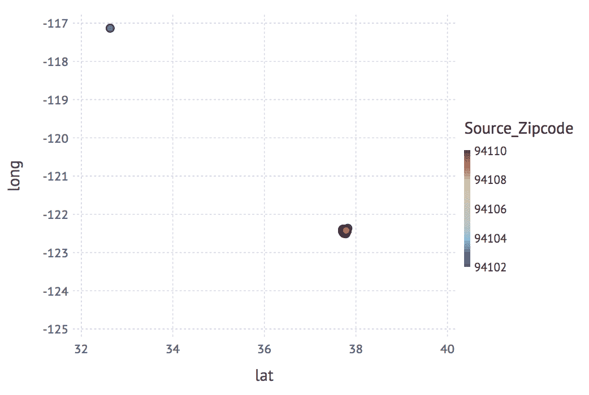

如预期，位置很接近，但有一个异常值，其坐标远远偏离。也许我们的数据中存在错误。使用查询，我们可以轻松地移除这个罪魁祸首：

```py
julia> companies_in_top_areas = @from c in companies_in_top_areas begin 
           @where c.lat != minimum(companies_in_top_areas[:lat]) 
           @select c 
           @collect DataFrame 
      end 
```

通过我们清理后的列表，我们现在可以探索这些公司的活动领域。这将帮助我们的客户接触到符合市场需求的候选人，如下所示：

```py
julia> activities = @from c in companies_in_top_areas begin 
           @group c by c.NAICS_Code_Description into g 
           @orderby descending(length(g)) 
           @select { activity = key(g), number_of_companies = length(g) } 
           @collect DataFrame 
       end 
```

那很简单：

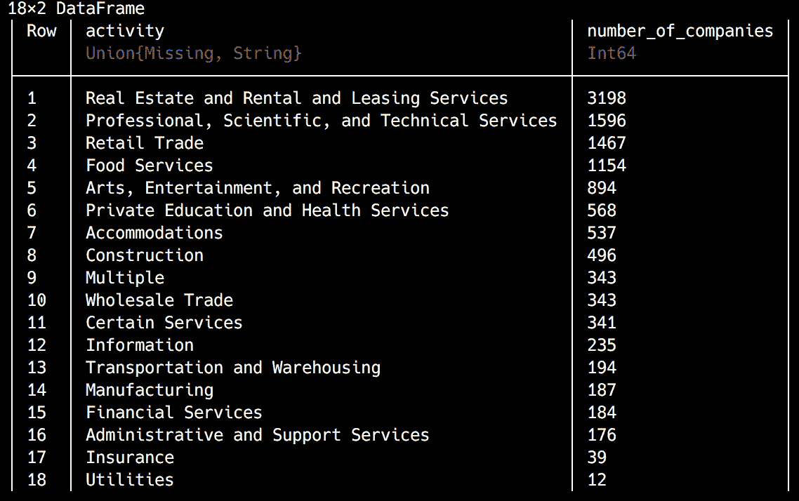

目标区域内的所有公司都活跃在仅`18`个领域，其中房地产业是最常见的一个。当然，我们的客户的高级管理人员会欣赏一张图表：

```py
julia> plot(activities, y=:number_of_companies, Geom.bar, color=:activity, Scale.y_continuous(format=:plain), Guide.XLabel("Activities"), Guide.YLabel("Number of companies")) 
```

这就是我们所得到的：

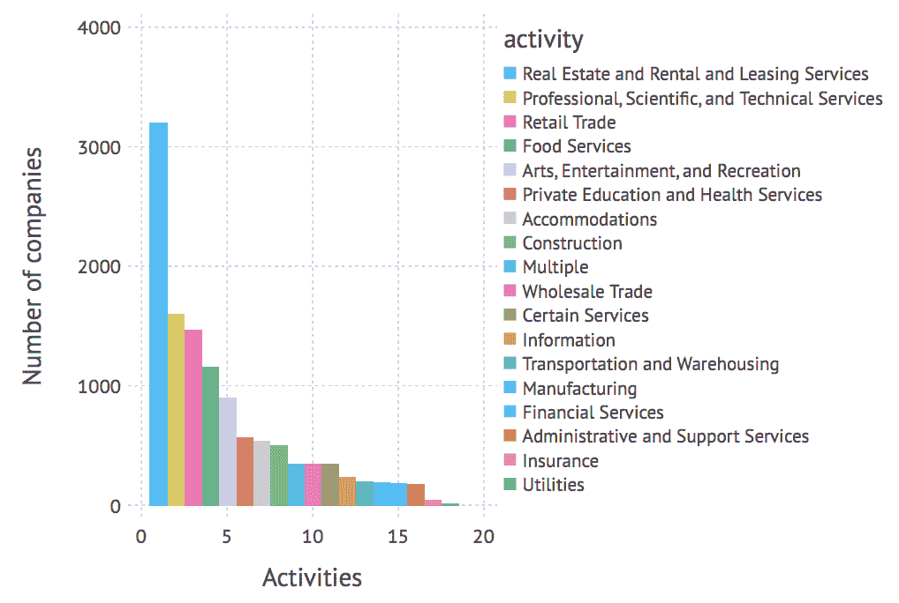

是的，图表清楚地显示，房地产业是大多数企业参与的活动，其次是技术和零售业。

# 精炼我们的发现

到目前为止，进展顺利，但几乎有 12,000 家公司的列表仍然难以处理。我们可以通过将其分解为位于邻近地区的商业集群来帮助我们的客户。这与之前的工作流程相同。首先，我们提取我们的训练数据：

```py
julia> model_data = @from c in companies_in_top_areas begin 
           @select { latitude = c.lat, longitude = c.long } 
           @collect DataFrame 
       end 
```

输出如下：


现在我们对维度进行排列，以设置符合聚类所需的数据格式（就像我们之前做的那样）：

```py
julia> training_data = permutedims(convert(Array{Float64}, model_data), [2, 1]) 
```

我们的训练数组已准备就绪！

我们将使用相同的 k-means 算法，并使用 k-means++ 种子。

请注意，k-means 通常不是聚类地理位置数据的最佳选择。DBSCAN 通常更适合，我建议您在生产应用中考虑它。例如，当处理超过 180 度的接近点时，k-means 算法会失败。对于我们的示例项目和我们所处理的数据，k-means 工作得很好，但请记住这个限制。

训练方式相同。我们将选择 `12` 个集群，以便每个组大约有 1,000 家公司：

```py
julia> result = kmeans(training_data, 12, init=:kmpp, display=:iter) 
  # output truncated 
K-means converged with 24 iterations (objv = 0.28192820139520336) 
```

这次需要 `24` 次迭代才能达到收敛。让我们看看我们得到了什么：

```py
julia> result.counts 
12-element Array{Int64,1}: 
 1076 
 1247 
  569 
 1180 
 1711 
 1191 
  695 
    1 
 1188 
   29 
 1928 
 1149 
```

大部分数据分布均匀，但我们可以找到一些没有那么多企业的集群。绘制数字给我们一个清晰的画面：

```py
julia> plot(result.counts, Geom.bar, y=result.counts, Guide.YLabel("Number of businesses"), Guide.XLabel("Cluster ID"), color=result.counts) 
```

这里是图表：


现在，我们可以将集群分配粘贴到 `companies_in_top_areas` `DataFrame`：

```py
julia> companies_in_top_areas[:cluster_id] = result.assignments 
```

# 在地图上可视化我们的集群

为了更好地理解我们的数据，从点密度和位置邻近度的角度，我们可以使用 `Gadfly` 绘制一个图表：

```py
julia> plot(companies_in_top_areas, color=:cluster_id, x=:lat, y=:long) 
```

输出如下：

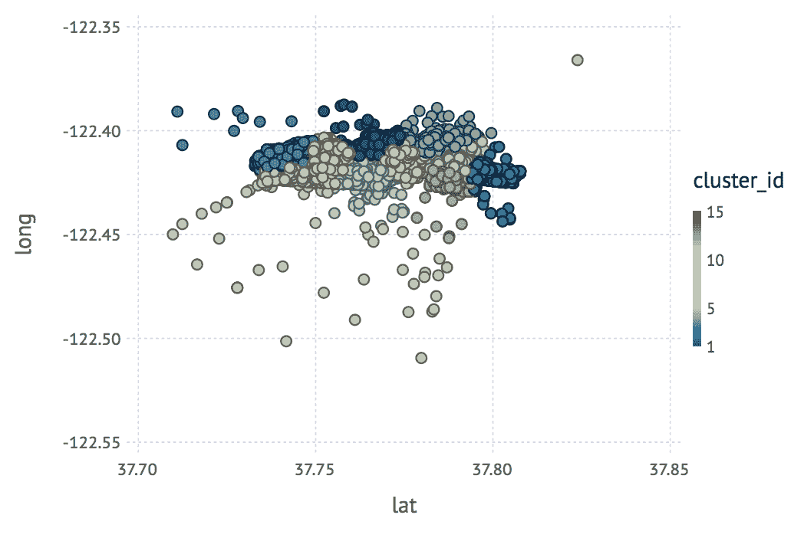

我们可以看到相当好的集群分布，所以我们的方法有效！

然而，如果我们能够在地图上显示集群，那就更好了。不幸的是，目前 Julia 中没有简单的方法来做这件事，所以我们将使用第三方工具。

PlotlyJS ([`github.com/sglyon/PlotlyJS.jl`](https://github.com/sglyon/PlotlyJS.jl)) 提供了相关的功能，但鉴于旧金山地区的坐标紧密排列，我的测试没有产生好的结果。

# 使用 BatchGeo 快速构建我们的数据地图

BatchGeo ([`batchgeo.com`](https://batchgeo.com)) 是一个流行的基于地图的数据可视化网络应用程序。它使用来自谷歌的高清地图，并提供一个无需登录、尽管有限但免费的版本，我们可以立即尝试。

BatchGeo 期望一个包含一系列列的 CSV 文件，因此我们的首要任务是设置它。使用 Query，这 couldn't be any simpler。

```py
julia> export_data = @from c in companies_in_top_areas begin 
                           @select { Name = c.DBA_Name, 
 Zip = c.Source_Zipcode, 
                                     Group = string("Cluster $(c.cluster_id)"), 
                                     Latitude = c.lat, Longitude = c.long,  
                                     City = "San Francisco", State = "CA" } 
                           @collect DataFrame 
                     end 
```

输出如下：


结构化数据可用在一个名为`export_data`的新`DataFrame`中。不幸的是，BatchGeo 为免费账户添加了 250 行的限制，因此我们只能将导出限制在顶部 250 行。

这是我们如何导出的方法：

```py
julia> CSV.write("businesses.csv", head(export_data, 250)) 
```

成功！剩下的唯一事情就是用你喜欢的网络浏览器打开[`batchgeo.com`](https://batchgeo.com)，并将`business.csv`文件拖放到指定位置：

1.  这是通过执行以下截图所示的步骤完成的：


1.  点击“验证并设置选项”。你会看到列被正确选择，默认值是好的：


1.  点击“制作地图”将在旧金山地图上渲染我们的聚类：

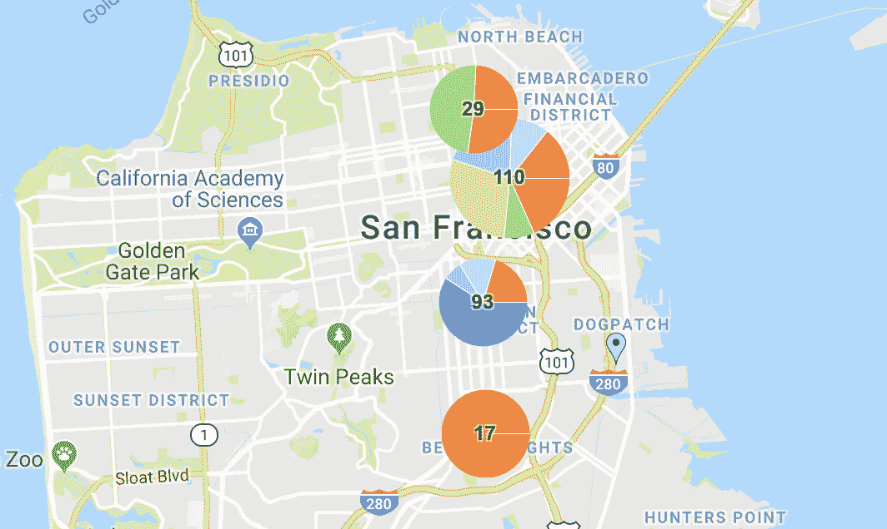

胜利——我们数据的美丽呈现！

我们还可以禁用聚类，以便每个单独的商业将被绘制：


最后，我们可以保存我们的地图，遵循说明，并获取我们可视化的唯一 URL。我的可以在[`batchgeo.com/map/7475bf3c362eb66f37ab8ddbbb718b87`](https://batchgeo.com/map/7475bf3c362eb66f37ab8ddbbb718b87)找到。

太好了，正好赶上与客户的会议！

# 为 k-means（和其他算法）选择最佳簇数量

根据数据的性质和你要解决的问题，簇的数量可能是一个业务需求，或者它可能是一个明显的选择（就像在我们的案例中，我们想要识别低、中、高商业密度区域，因此最终得到三个簇）。然而，在某些情况下，答案可能并不那么明显。在这种情况下，我们需要应用不同的算法来评估最佳簇数量。

最常见的方法之一是“肘部法”。这是一种迭代方法，我们通过不同的 k 值运行聚类算法，例如在 1 到 10 之间。目标是通过对每个点与其聚类均值之间的平方误差之和进行绘图，来比较总簇内变异。使用可视化，我们可以识别出类似“肘部”的拐点，如下所示：

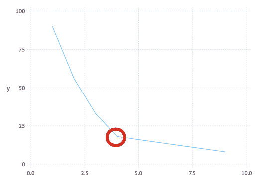

这就是肘部。

你可以在[`www.sthda.com/english/articles/29-cluster-validation-essentials/96-determining-the-optimal-number-of-clusters-3-must-know-methods/`](http://www.sthda.com/english/articles/29-cluster-validation-essentials/96-determining-the-optimal-number-of-clusters-3-must-know-methods/)（R 语言示例）中了解更多关于此内容。

# 聚类验证

除了选择最佳聚类数量之外，另一个方面是聚类验证，即确定项目如何适合分配的聚类。这可以用来确认确实存在模式，并比较竞争的聚类算法。

聚类提供了三种技术的小型 API 用于聚类验证，包括最常见的轮廓（Silhouettes）。您可以在[`clusteringjl.readthedocs.io/en/latest/validate.html`](http://clusteringjl.readthedocs.io/en/latest/validate.html)找到文档，并可以在[`www.sthda.com/english/articles/29-cluster-validation-essentials/97-cluster-validation-statistics-must-know-methods/`](http://www.sthda.com/english/articles/29-cluster-validation-essentials/97-cluster-validation-statistics-must-know-methods/)了解更多关于验证理论的内容。

# 摘要

在本章中，我们探讨了使用 Julia 的未监督机器学习技术。我们专注于聚类，这是未监督学习最广泛的应用之一。我们从关于旧金山注册企业的数据集开始，进行了复杂但并不复杂的——多亏了 Query——数据清洗。在这个过程中，我们还了解了元编程，这是一种非常强大的编码技术，也是 Julia 最强大和最具定义性的特性之一。

当我们的数据处于最佳状态，并且掌握了聚类理论的基础之后，我们开始使用 k-means 算法投入实际操作。我们进行了聚类以识别公司密度最高的区域，帮助我们的虚构客户 ACME 招聘定位最佳的广告区域。在确定给 ACME 带来最佳覆盖范围的区域后，我们进行了数据分析，以获取客户所需的活动领域的顶级域名，以便他们能够建立一个相关候选人的数据库。

最后，我们对目标区域的商业地理位置数据进行了聚类，然后在地图上渲染这些数据。我们的客户对我们的发现感到非常满意，他们的营销人员现在拥有了开始规划活动的所有必要信息。恭喜！

在下一章中，我们将离开迷人的机器学习世界，去发现数据科学中的另一个关键概念——时间序列。我们将学习如何在 Julia 中处理日期和时间，如何处理时间序列数据，以及如何进行预测。这难道不令人兴奋吗？
