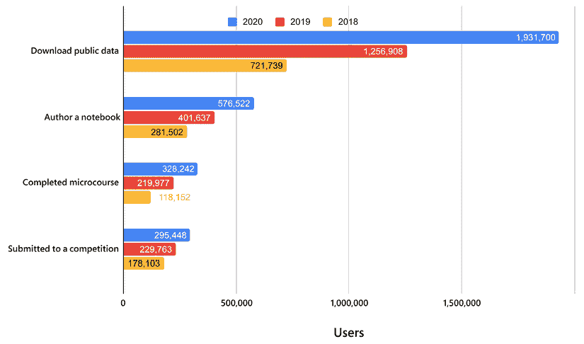
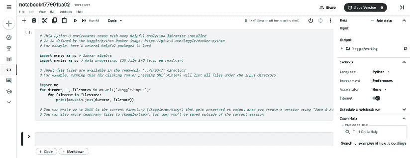
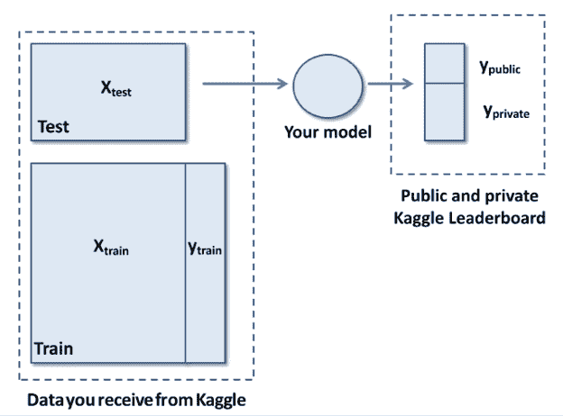
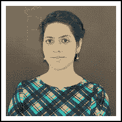

# 第一章：介绍 Kaggle 和其他数据科学竞赛

数据科学竞赛已经存在很长时间了，随着时间的推移，它们经历了不断增长的成功，从一个小众的充满热情的竞争者社区开始，吸引了越来越多的关注，并达到了数百万数据科学家的更大受众。作为最受欢迎的数据科学竞赛平台 Kaggle 上的长期竞争者，我们多年来亲眼目睹并直接体验了所有这些变化。

目前，如果你在寻找有关 Kaggle 和其他竞赛平台的信息，你很容易找到大量的聚会、讨论小组、播客、访谈，甚至在线课程，这些课程解释了如何在这样的竞赛中获胜（通常建议你使用不同比例的毅力、计算资源和投入的时间）。然而，除了你现在正在阅读的这本书之外，你不会找到任何关于如何导航这么多数据科学竞赛以及如何从中获得最大利益的系统指南——不仅是在分数或排名方面，还包括专业经验。

在这本书中，我们不仅仅是要打包一些关于如何在 Kaggle 和其他数据科学竞赛中获胜或获得高分的提示，我们的意图是为你提供一份如何在 Kaggle 上更好地竞争并获得竞赛体验最大可能的指南，尤其是从你职业生活的角度。此外，书中还附有 Kaggle 大师和特级大师的访谈。我们希望他们能为你提供一些关于在 Kaggle 上竞争的具体方面的不同视角和见解，并激励你以测试自己和学习竞技数据科学的方式。

到这本书结束时，你将吸收我们从自己的经验、资源和竞赛中学到的知识，以及你需要为自己铺路学习和成长的一切，一场比赛接着一场比赛。

作为起点，在本章中，我们将探讨竞技编程如何演变为数据科学竞赛，为什么 Kaggle 平台是此类竞赛最受欢迎的网站，以及它是如何运作的。

我们将涵盖以下主题：

+   数据科学竞赛平台兴起

+   常见任务框架范式

+   Kaggle 平台和一些其他替代方案

+   Kaggle 竞赛的工作方式：阶段、竞赛类型、提交和排行榜动态、计算资源、网络等

# 数据科学竞赛平台兴起

竞技编程有着悠久的历史，始于 20 世纪 70 年代，当时是**国际大学生程序设计竞赛**（**ICPC**）的第一轮。在最初的 ICPC 中，来自大学和公司的小型团队参加了一项比赛，要求使用计算机程序解决一系列问题（最初，参与者使用 FORTRAN 编程）。为了获得良好的最终排名，团队必须在团队合作、问题解决和编程方面展示出色的技能。

参加这样竞赛的热烈体验和站在招聘公司聚光灯下的机会为学生提供了充足的动力，这使得竞赛多年以来一直很受欢迎。在 ICPC 决赛中，有几位选手成为了知名人士：有 Facebook 前首席技术官和 Quora 创始人**亚当·达格诺**（Adam D’Angelo），Telegram Messenger 的联合创始人**尼古拉伊·杜罗夫**（Nikolai Durov），以及 Apache Spark 的创造者**马泰伊·扎哈里亚**（Matei Zaharia）。他们与其他许多专业人士一样，都分享了同样的经历：参加过 ICPC。

在 ICPC 之后，编程竞赛蓬勃发展，尤其是在 2000 年之后，远程参与变得更加可行，使得国际竞赛更容易进行且成本更低。大多数这些竞赛的格式相似：有一系列问题，你必须编写代码来解决它们。获胜者会获得奖品，同时也会让招聘公司或简单地成名。

通常，竞技编程中的问题范围从组合数学和数论到图论、算法博弈论、计算几何、字符串分析和数据结构。近年来，与人工智能相关的问题成功出现，特别是在**KDD 杯**（知识发现与数据挖掘竞赛）启动之后，该竞赛由**计算机协会**（**ACM**）的**特别兴趣小组**（**SIG**）在其年度会议期间举办（[`kdd.org/conferences`](https://kdd.org/conferences)）。

首届 KDD 杯比赛于 1997 年举行，涉及电梯曲线优化的直接营销问题，这开启了一系列持续至今的竞赛。您可以在[`www.kdd.org/kdd-cup`](https://www.kdd.org/kdd-cup)找到包含数据集、说明和获奖者的存档。以下是撰写本文时的最新资料：[`ogb.stanford.edu/kddcup2021/`](https://ogb.stanford.edu/kddcup2021/)。KDD 杯在建立最佳实践方面证明非常有效，许多发表的论文描述了解决方案、技术和竞赛数据集共享，这些都对许多从业者进行实验、教育和基准测试非常有用。

竞赛编程事件和 KDD 杯的成功案例激发了公司（如 Netflix）和企业家（如 Kaggle 的创始人*安东尼·戈德布卢姆*）创建第一个数据科学竞赛平台，公司可以在这些平台上举办难以解决的数据科学挑战，并可能从众包中受益。事实上，鉴于没有适用于数据科学中所有问题的黄金方法，许多问题需要耗时的方法，可以总结为*尝试所有你能尝试的方法*。

事实上，从长远来看，没有任何算法能在所有问题上击败其他所有算法，正如大卫·沃尔珀特（David Wolpert）和威廉·麦克雷迪（William Macready）提出的**“无免费午餐”定理**所述。该定理告诉你，每个机器学习算法只有在它的假设空间包含解决方案时才会表现良好。因此，由于你事先无法知道某个机器学习算法是否最适合解决你的问题，你必须尝试它，直接在你问题上进行测试，以确保你正在做正确的事情。在机器学习中没有理论上的捷径或其他圣杯——只有经验实验才能告诉你什么有效。

更多细节，你可以查阅“无免费午餐”定理，以了解这一实际真理的理论解释。以下是 Analytics India Magazine 关于该主题的完整文章：[`analyticsindiamag.com/what-are-the-no-free-lunch-theorems-in-data-science/`](https://analyticsindiamag.com/what-are-the-no-free-lunch-theorems-in-data-science/)。

在需要广泛测试算法和数据转换以找到最佳可能组合，但缺乏人力和计算机能力的情况下，众包证明是理想的。这就是为什么政府和企业会求助于比赛，以便在某些领域取得进展：

+   在政府方面，我们可以引用 DARPA 及其围绕自动驾驶汽车、机器人操作、机器翻译、说话人识别、指纹识别、信息检索、OCR、自动目标识别等许多其他领域的众多比赛。

+   在商业方面，我们可以引用 Netflix 这样的公司，它将比赛的成果委托给改进其预测用户电影选择的算法。

Netflix 比赛基于改进现有协同过滤的想法。其目的仅仅是根据用户对其他电影的评分来预测用户对电影的潜在评分，而不需要具体知道用户是谁或电影是什么。由于没有用户描述或电影标题或描述可用（所有这些都用身份代码代替），比赛要求参赛者开发智能方法来使用可用的过去评分。只有当解决方案能够将现有的 Netflix 算法 Cinematch 提升到一定阈值以上时，才会颁发 100 万美元的巨额奖金。

该比赛从 2006 年持续到 2009 年，最终获胜的是由多个先前比赛团队融合而成的团队：来自 Commendo Research & Consulting GmbH 的团队，包括*安德烈亚斯·托舍尔*和*迈克尔·耶雷尔*，他们在 Kaggle 比赛中也相当知名；来自 AT&T 实验室的两名研究人员；以及来自 Yahoo!的两名研究人员。最终，赢得比赛需要如此多的计算能力和不同解决方案的集成，以至于团队不得不合并以保持竞争力。这种情况也反映在 Netflix 实际使用该解决方案上，Netflix 更愿意不实施它，而是简单地从中提取最有趣的见解来改进其现有的 Cinematch 算法。您可以在这篇 Wired 文章中了解更多信息：[`www.wired.com/2012/04/netflix-prize-costs/`](https://www.wired.com/2012/04/netflix-prize-costs/).

在 Netflix 比赛的最后，重要的是解决方案本身，因为 Netflix 的业务重点从 DVD 转向在线电影，该解决方案很快就被取代了。对于在协同过滤中获得巨大声誉的参与者，以及能够将其改进的推荐知识转移到新业务的该公司来说，真正的益处是从比赛中获得的见解。

## Kaggle 比赛平台

除了 Netflix 之外，其他公司也从数据科学比赛中受益。名单很长，但我们可以引用一些例子，其中举办比赛的公司的报告显示从中获得了明确的好处。例如：

+   保险公司 Allstate 能够通过涉及数百名数据科学家的比赛改进他们自己专家构建的精算模型（[`www.kaggle.com/c/ClaimPredictionChallenge`](https://www.kaggle.com/c/ClaimPredictionChallenge)）。

+   作为另一个有详细记录的例子，通用电气通过类似的比赛（[`www.kaggle.com/c/flight`](https://www.kaggle.com/c/flight)）将预测航空公司航班到达时间的行业标准性能（通过均方根误差指标衡量）提高了 40%。

到目前为止，Kaggle 比赛平台已经举办了数百场比赛，这两个只是公司成功使用 Kaggle 的几个例子。让我们暂时从具体的比赛中退一步，谈谈 Kaggle 公司，这是贯穿本书的线索。

### Kaggle 的历史

Kaggle 的起步是在 2010 年 2 月，归功于*安东尼·戈德布卢姆*，一位受过经济学和计量经济学学位训练的澳大利亚经济学家。在澳大利亚财政部和澳大利亚储备银行的研究部门工作后，戈德布卢姆在伦敦的《经济学人》国际时事、国际商业、政治和技术周刊实习。在《经济学人》杂志，他有机会撰写一篇关于大数据的文章，这激发了他建立一个竞赛平台的想法，该平台可以众包最佳分析专家来解决有趣的机器学习问题（[`www.smh.com.au/technology/from-bondi-to-the-big-bucks-the-28yearold-whos-making-data-science-a-sport-20111104-1myq1.html`](https://www.smh.com.au/technology/from-bondi-to-the-big-bucks-the-28yearold-whos-making-data-science-a-sport-20111104-1myq1.html)）。由于众包动态在这个平台商业理念中发挥了重要作用，他创造了名字*Kaggle*，这个名称通过押韵回忆了*gaggle*这个词，意为一群鹅，鹅也是该平台的象征。

在搬到美国硅谷后，他的 Kaggle 初创公司从知名风险投资公司 Khosla Ventures 和 Index Ventures 的一轮投资中获得了 1125 万美元的 A 轮融资。推出了第一批竞赛，社区规模扩大，一些最初的竞争者变得相当突出，例如澳大利亚数据科学家和企业家*杰里米·豪沃德*，他在 Kaggle 上赢得了几场比赛后，成为了公司的总裁和首席科学家。

杰里米·豪沃德在 2013 年 12 月辞去了总裁的职位，并成立了一家新的初创公司`fast.ai`（[www.fast.ai](https://www.fast.ai)），为程序员提供机器学习课程和深度学习库。

在当时，还有一些其他杰出的 Kagglers（这个名字表明了经常参加 Kaggle 举办的竞赛的参与者），例如*杰里米·阿钦*和*托马斯·德·戈多伊*。在达到平台上的全球前 20 名排名后，他们迅速决定退休并创立了自己的公司，DataRobot。不久之后，他们开始从 Kaggle 竞赛中的最佳参与者中招聘员工，以便将最好的机器学习知识和实践融入到他们正在开发的软件中。如今，DataRobot 是开发 AutoML 解决方案（自动机器学习软件）的领先公司之一。

Kaggle 竞赛吸引了越来越多的观众的关注。即使是深度学习的“教父”杰弗里·辛顿，也在 2012 年参加了由默克公司主办的 Kaggle 竞赛（[`www.kaggle.com/c/MerckActivity/overview/winners`](https://www.kaggle.com/c/MerckActivity/overview/winners)），并赢得了比赛。Kaggle 也是*弗朗索瓦·肖莱特*在*奥托集团产品分类挑战赛*（[`www.kaggle.com/c/otto-group-product-classification-challenge/discussion/13632`](https://www.kaggle.com/c/otto-group-product-classification-challenge/discussion/13632)）期间推出他的深度学习包 Keras，以及*田奇*在*希格斯玻色子机器学习挑战赛*（[`www.kaggle.com/c/higgs-boson/discussion/10335`](https://www.kaggle.com/c/higgs-boson/discussion/10335)）中推出 XGBoost，这是一种更快、更精确的梯度提升机版本的平台。

除了 Keras，弗朗索瓦·肖莱特还在 Quora 网站上提供了一份关于如何在 Kaggle 竞赛中获胜的最有用和最有洞察力的观点：[`www.quora.com/Why-has-Keras-been-so-successful-lately-at-Kaggle-competitions`](https://www.quora.com/Why-has-Keras-been-so-successful-lately-at-Kaggle-competitions)。

通过多次尝试的快速迭代，以经验（而非理论）证据为指导，实际上这就是你所需要的全部。我们认为，赢得 Kaggle 竞赛的秘密并不比他在回答中指出的更多。

值得注意的是，弗朗索瓦·肖莱特还在 Kaggle 上举办了属于自己的竞赛（[`www.kaggle.com/c/abstraction-and-reasoning-challenge/`](https://www.kaggle.com/c/abstraction-and-reasoning-challenge/))，这被广泛认为是世界上第一个通用人工智能竞赛。

一场又一场的比赛，围绕 Kaggle 的社区在 2017 年增长到一百万，同年，在谷歌 Next 大会的演讲中，谷歌首席科学家*李飞飞*宣布谷歌 Alphabet 将收购 Kaggle。从那时起，Kaggle 成为了谷歌的一部分。

今天，Kaggle 社区仍然活跃并持续增长。在他的推文中（[`twitter.com/antgoldbloom/status/1400119591246852096`](https://twitter.com/antgoldbloom/status/1400119591246852096)），安东尼·戈德布卢姆报告说，除了参加比赛外，大多数用户还下载了公共数据（Kaggle 已成为一个重要的数据枢纽），在 Python 或 R 中创建了一个公共 Notebook，或在提供的课程中学习了一些新知识：

图 1.1：一个条形图显示了用户在 2020 年、2019 年和 2018 年使用 Kaggle 的情况

几年来，Kaggle 为其参与者提供了更多的机会，例如：

+   创立自己的公司

+   推出机器学习软件和包

+   在杂志上获得采访机会 ([`www.wired.com/story/solve-these-tough-data-problems-and-watch-job-offers-roll-in/`](https://www.wired.com/story/solve-these-tough-data-problems-and-watch-job-offers-roll-in/))

+   撰写机器学习书籍 ([`twitter.com/antgoldbloom/status/745662719588589568`](https://twitter.com/antgoldbloom/status/745662719588589568))

+   寻找他们的梦想工作

最重要的是，学习更多关于数据科学中涉及到的技能和技术细节。

## 其他竞赛平台

虽然这本书主要关注 Kaggle 上的竞赛，但我们不能忘记，许多数据竞赛是在私人平台或其他竞赛平台上举行的。实际上，你在这本书中找到的大部分信息也适用于其他竞赛，因为它们本质上都遵循相似的原则，参与者的好处也或多或少相同。

尽管许多其他平台仅限于特定国家或仅针对某些类型的竞赛进行本地化，为了完整性，我们将简要介绍其中一些，至少是我们有一些经验和知识的一些：

+   **DrivenData** ([`www.drivendata.org/competitions/`](https://www.drivendata.org/competitions/)) 是一个致力于社会挑战的众包竞赛平台（参见[`www.drivendata.co/blog/intro-to-machine-learning-social-impact/`](https://www.drivendata.co/blog/intro-to-machine-learning-social-impact/)）。该公司本身是一家社会企业，其目标是利用数据科学解决方案帮助解决世界上的最大挑战，这得益于数据科学家为公共利益构建算法。例如，正如你在这篇文章中可以读到的，[`www.engadget.com/facebook-ai-hate-speech-covid-19-160037191.html`](https://www.engadget.com/facebook-ai-hate-speech-covid-19-160037191.html)，Facebook 选择了 DrivenData 来举办其针对仇恨言论和虚假信息的竞赛模型。

+   **Numerai** ([`numer.ai/`](https://numer.ai/)) 是一家位于旧金山的基于人工智能的众包对冲基金。它举办每周一次的锦标赛，你可以提交你对对冲基金加密数据的预测，并使用公司的加密货币 Numeraire 赢得奖品。

+   **CrowdANALYTIX** ([`www.crowdanalytix.com/community`](https://www.crowdanalytix.com/community)) 现在活动相对较少，但这个平台之前举办过一些颇具挑战性的竞赛，你可以从这篇博客文章中了解到这一点：[`towardsdatascience.com/how-i-won-top-five-in-a-deep-learning-competition-753c788cade1`](https://towardsdatascience.com/how-i-won-top-five-in-a-deep-learning-competition-753c788cade1)。社区博客对于了解这个平台上可以找到的挑战非常有帮助：[`www.crowdanalytix.com/jq/communityBlog/listBlog.html`](https://www.crowdanalytix.com/jq/communityBlog/listBlog.html)。

+   **Signate** ([`signate.jp/competitions`](https://signate.jp/competitions)) 是一个日本数据科学竞赛平台。它竞赛种类非常丰富，并提供类似于 Kaggle 的排名系统（[`signate.jp/users/rankings`](https://signate.jp/users/rankings)）。

+   **Zindi** ([`zindi.africa/competitions`](https://zindi.africa/competitions)) 是来自非洲的数据科学竞赛平台。它举办专注于解决非洲最紧迫的社会、经济和环境问题的竞赛。

+   **Alibaba Cloud** ([`www.alibabacloud.com/campaign/tianchi-competitions`](https://www.alibabacloud.com/campaign/tianchi-competitions)) 是一家中国云计算和 AI 提供商，已推出**天池学术竞赛**，与 SIGKDD、IJCAI-PRICAI 和 CVPR 等学术会议合作，并包括基于图像的 3D 形状检索、3D 物体重建和实例分割等挑战。

+   **Analytics Vidhya** ([`datahack.analyticsvidhya.com/`](https://datahack.analyticsvidhya.com/)) 是最大的印度数据科学社区，提供了一个数据科学黑客松的平台。

+   **CodaLab** ([`codalab.lri.fr/`](https://codalab.lri.fr/)) 是一个基于法国的数据科学竞赛平台，由微软和斯坦福大学于 2013 年共同创立。他们提供了一个名为 Worksheets 的免费云笔记本来进行知识共享和可重复建模（[`worksheets.codalab.org/`](https://worksheets.codalab.org/)）。

其他较小的平台包括来自瑞士洛桑联邦理工学院的 CrowdAI ([`www.crowdai.org/`](https://www.crowdai.org/))，InnoCentive ([`www.innocentive.com/`](https://www.innocentive.com/))，Grand-Challenge ([`grand-challenge.org/`](https://grand-challenge.org/)) 生物医学成像，DataFountain ([`www.datafountain.cn/business?lang=en-US`](https://www.datafountain.cn/business?lang=en-US))，OpenML ([`www.openml.org/`](https://www.openml.org/))，等等。你总能在俄罗斯社区 Open Data Science ([`ods.ai/competitions`](https://ods.ai/competitions)) 找到大量正在进行的主要竞赛，甚至不时发现新的竞赛平台。

你可以在 mlcontests.com 网站上看到正在进行的竞赛概述，以及租用 GPU 的当前费用。该网站经常更新，是快速了解不同平台上的数据科学竞赛动态的便捷方式。

Kaggle 始终是你可以找到最有趣竞赛并获得最广泛认可的平台。然而，在它之外接受挑战是有意义的，我们建议当你找到一个符合你个人和职业兴趣的竞赛时，将其作为一种策略。正如你所看到的，除了 Kaggle 之外，还有很多替代方案和机会，这意味着如果你考虑更多的竞赛平台与 Kaggle 一起，你可以更容易地找到一个可能因为其专业或数据而引起你兴趣的竞赛。

此外，你可以在这些挑战中期待较少的竞争压力（因此排名更好，甚至可能赢得一些东西），因为它们不太为人所知且宣传较少。只需预期参与者之间的分享较少，因为没有任何其他竞赛平台像 Kaggle 一样拥有如此丰富的分享和网络机会。

# 介绍 Kaggle

到目前为止，我们需要更深入地了解 Kaggle 是如何运作的。在接下来的段落中，我们将讨论 Kaggle 平台及其竞赛的各个方面，你将了解在 Kaggle 竞赛中的体验。之后，我们将在本书的剩余章节中更详细地讨论许多这些话题，并提供更多建议和策略。

## 竞赛的各个阶段

Kaggle 上的竞赛被安排成不同的步骤。通过查看每个步骤，你可以更好地理解数据科学竞赛是如何运作的，以及你可以期待什么。

当竞赛启动时，社交媒体上通常会有一些帖子，例如在 Kaggle 的 Twitter 个人资料上，[`twitter.com/kaggle`](https://twitter.com/kaggle)，宣布它，并且在**竞赛**页面上的 Kaggle 部分会出现一个新的标签页关于**活跃竞赛**（[`www.kaggle.com/competitions`](https://www.kaggle.com/competitions)）。如果你点击某个特定竞赛的标签页，你将被带到其页面。一眼就能看出，你可以检查竞赛是否有奖品（以及它是否颁发分数和奖牌，这是参与竞赛的次要后果），目前有多少团队参与，以及你还有多少时间来工作解决方案：

图 1.2：Kaggle 上的竞赛页面

在那里，你可以首先探索**概览**菜单，它提供了以下信息：

+   竞赛的主题

+   其评估指标（你的模型将根据此进行评估）

+   竞赛的日程安排

+   奖项

+   法律或竞争要求

通常时间表会被忽视，但它应该是您首先检查的事项之一；它不仅告诉您比赛开始和结束的时间，而且还会提供**规则接受截止日期**，这通常是在比赛结束前七天到两周。规则接受截止日期是您可以加入比赛的最后一天（通过接受其规则）。还有**团队合并截止日期**：您可以在该截止日期之前安排与另一位竞争对手的团队合并，但在此之后将不可能合并。

**规则**菜单也经常被忽视（人们只是跳到**数据**），但检查它很重要，因为它可以告诉您比赛的各项要求。从规则中您可以获得的关键信息包括：

+   您是否有资格获奖

+   您是否可以使用外部数据来提高您的分数

+   您每天可以提交多少次（对您的解决方案的测试）

+   您可以选择多少个最终解决方案

一旦您接受了规则，您可以从**数据**菜单下载任何数据，或者直接从**代码**菜单开始工作在**Kaggle 笔记本**（在线、基于云的笔记本），重用他人提供的代码或从头开始创建自己的代码。

如果您决定下载数据，也要考虑您有一个**Kaggle API**，它可以帮助您以几乎自动化的方式运行下载和提交。如果您在本地计算机或云实例上运行模型，这是一个重要的工具。您可以在[`www.kaggle.com/docs/api`](https://www.kaggle.com/docs/api)找到更多关于 API 的详细信息，您可以从 GitHub[`github.com/Kaggle/kaggle-api`](https://github.com/Kaggle/kaggle-api)获取代码。

如果您仔细检查 Kaggle GitHub 仓库，您还可以找到他们用于在线笔记本的 Docker 镜像，Kaggle 笔记本：

图 1.3：一个准备编码的 Kaggle 笔记本

在这个阶段，随着您开发解决方案，我们热切建议您不要独自一人继续，而是通过**讨论**论坛联系其他竞争对手，在那里您可以提出和回答与比赛具体相关的问题。通常您还会找到关于数据特定问题的有用提示，甚至有助于改进您自己解决方案的想法。许多成功的 Kagglers 报告说，在论坛上找到的想法帮助他们表现更好，更重要的是，他们更多地了解了数据科学中的建模。

一旦您的解决方案准备就绪，您可以根据比赛的规格将其提交给 Kaggle 评估引擎。一些比赛将接受 CSV 文件作为解决方案，而另一些比赛则要求您在 Kaggle 笔记本中编写代码并生成结果。您可以在整个比赛期间提交解决方案。

每次你提交一个解决方案后，排行榜会很快为你提供一个得分和你在竞争对手中的位置（等待时间取决于评分评估所需的计算）。这个位置只是一个大致的指示，因为它反映了你的模型在测试集的一部分，即**公共测试集**上的表现，因为你在竞赛期间的表现是公开的，以便让每个人都知道。

在竞赛关闭之前，每位参赛者可以选择他们用于最终评估的解决方案数量（通常是两个）。

图 1.4：一个展示数据如何转化为公共和私人排行榜得分的图表

只有当竞赛关闭时，基于参赛者决定评分的模型，他们的得分才会被揭示在测试集的另一部分，称为**私人测试集**。这个新的排行榜，即私人排行榜，构成了竞赛的最终、有效得分，但其在排名上仍然不是官方和最终的。事实上，Kaggle 团队将花一些时间来检查一切是否正确，以及所有参赛者是否都遵守了竞赛规则。

经过一段时间（有时由于取消资格而导致排名变化），私人排行榜将变为官方和最终版，获胜者将被宣布，许多参与者将在竞赛讨论论坛上公布他们的策略、解决方案和代码。此时，取决于你检查其他解决方案并尝试改进自己的方案。我们强烈建议你这样做，因为这是 Kaggle 中另一个重要的学习来源。

## 竞赛类型及示例

Kaggle 竞赛根据*竞赛类别*进行分类，每个类别在如何竞争以及预期内容方面都有不同的含义。类别内部的数据类型、问题难度、奖金以及竞赛动态都相当多样，因此事先了解每个类别的含义非常重要。

这里是你可以用来筛选不同竞赛的官方类别：

+   特色

+   大师级

+   年度竞赛

+   研究

+   招聘

+   入门

+   操场

+   分析学

+   社区

**特色**竞赛是最常见的一种类型，涉及赞助公司提出的与商业相关的问题以及给顶尖表现者的奖金。获胜者将授予其作品给赞助公司的非独家许可；他们必须准备一份关于其解决方案的详细报告，有时甚至需要参加与赞助公司的会议。

每次访问 Kaggle 时，都会有一些特色竞赛的例子。目前，许多竞赛都与将深度学习方法应用于非结构化数据（如文本、图像、视频或声音）的应用相关。在过去，表格数据竞赛很常见，即基于可以在数据库中找到的结构的化数据问题的竞赛。最初是通过随机森林，然后是使用巧妙特征工程的梯度提升方法，从 Kaggle 得出的表格数据解决方案确实可以改善现有的解决方案。如今，这些竞赛举办得越来越少，因为众包解决方案通常不会比一支优秀的数据科学家团队或甚至 AutoML 软件做得更好。鉴于更好软件和良好实践的普及，竞赛结果质量的提高确实微乎其微。然而，在非结构化数据领域，一个好的深度学习解决方案仍然可以产生重大影响。例如，预训练网络如 BERT 为许多著名的 NLP 任务基准带来了两位数的标准提升。

**大师级**竞赛现在较少见，但它们是私人的、仅限邀请的竞赛。其目的是为专家（通常是根据 Kaggle 奖牌排名被评为大师或特级大师的竞争者）创建仅针对他们的竞赛，基于他们在 Kaggle 上的排名。

**年度竞赛**是一年中的特定时期内总会出现的竞赛。在年度竞赛中，我们有圣诞老人竞赛（通常基于算法优化问题）和*三月机器学习狂热*竞赛，自 2014 年以来每年在美国大学篮球锦标赛期间举行。

**研究**竞赛意味着具有研究或科学目的，而不是商业目的，有时是为了服务于公共利益。这就是为什么这些竞赛并不总是提供奖品。此外，这些竞赛有时要求获胜者将他们的解决方案作为开源发布。

Google 过去发布过一些研究竞赛，例如*Google 地标识别 2020* ([`www.kaggle.com/c/landmark-recognition-2020`](https://www.kaggle.com/c/landmark-recognition-2020))，其目标是标记图像中的著名（和不那么著名）地标。

想要测试潜在求职者能力的赞助商举办**招聘**竞赛。这些竞赛仅限于单人团队，并为排名靠前的竞争者提供与赞助商面试的机会作为奖品。如果竞争者希望在竞赛结束后被考虑联系，他们必须在竞赛结束时上传他们的简历。

招聘竞赛的例子包括：

+   *Facebook 招聘竞赛* ([`www.kaggle.com/c/FacebookRecruiting`](https://www.kaggle.com/c/FacebookRecruiting)); Facebook 已经举办过几次此类活动

+   *Yelp 招聘竞赛* ([`www.kaggle.com/c/yelp-recruiting`](https://www.kaggle.com/c/yelp-recruiting))

**入门**比赛不提供任何奖品，但提供友好且简单的题目，让初学者熟悉 Kaggle 的原则和动态。它们通常是半永久性的比赛，其排行榜会不时更新。如果您正在寻找机器学习的教程，这些比赛是开始的好地方，因为您可以在一个高度协作的环境中找到许多 Kaggle 笔记本，这些笔记本展示了如何处理数据并创建不同类型的机器学习模型。

著名的正在进行中的**入门**比赛包括：

+   *数字识别器* ([`www.kaggle.com/c/digit-recognizer`](https://www.kaggle.com/c/digit-recognizer))

+   *泰坦尼克号——灾难中的机器学习* ([`www.kaggle.com/c/titanic`](https://www.kaggle.com/c/titanic))

+   *房价——高级回归技术* ([`www.kaggle.com/c/house-prices-advanced-regression-techniques`](https://www.kaggle.com/c/house-prices-advanced-regression-techniques))

**Playground**比赛比入门比赛稍微难一些，但它们也是为了让参赛者学习并测试他们的能力，而不受完整 Featured 比赛的压力（尽管在 Playground 比赛中，竞争的激烈程度有时也可能相当高）。此类比赛的常规奖品只是周边产品（“我们都能得到的东西”的缩写，例如，例如，一个杯子、一件 T 恤或 Kaggle 品牌的袜子；参见[`www.kaggle.com/general/68961`](https://www.kaggle.com/general/68961)）或一点钱。

一个著名的 Playground 比赛是原始的*Dogs vs. Cats*比赛([`www.kaggle.com/c/dogs-vs-cats`](https://www.kaggle.com/c/dogs-vs-cats))，任务是为区分狗和猫创建一个算法。

应当提及**数据分析**比赛，其中评估是定性的，参与者需要提供想法、解决方案草案、PowerPoint 幻灯片、图表等；以及**社区**（之前称为 InClass）比赛，这些比赛由学术机构和 Kagglers 举办。您可以在[`www.kaggle.com/product-feedback/294337`](https://www.kaggle.com/product-feedback/294337)上了解社区比赛的启动情况，您可以在[`www.kaggle.com/c/about/host`](https://www.kaggle.com/c/about/host)和[`www.kaggle.com/community-competitions-setup-guide`](https://www.kaggle.com/community-competitions-setup-guide)上获得举办自己比赛的建议。

Parul Pandey

[`www.kaggle.com/parulpandey`](https://www.kaggle.com/parulpandey)

我们采访了 Parul Pandey，Kaggle 笔记本大师、数据集大师以及 H2O.ai 的数据科学家，她分享了她在数据分析比赛中的经验和更多内容。

您最喜欢的竞赛类型是什么？为什么？在技术和解决方法方面，您在 Kaggle 上的专长是什么？

*我真的很喜欢数据分析竞赛，这些竞赛要求您分析数据，并在最后提供一个全面的分析报告。这些包括数据科学竞赛（DS4G）、体育数据分析竞赛（NFL 等）以及一般的调查挑战。与传统竞赛不同，这些竞赛没有排行榜来跟踪您与其他人的表现；您也不会得到任何奖牌或分数。*

*另一方面，这些竞赛要求提供端到端的解决方案，涉及数据科学的多个方面，如数据清洗、数据挖掘、可视化以及传达见解。这类问题提供了一种模拟现实场景的方式，让您提供自己的见解和观点。可能没有唯一的最佳答案来解决这些问题，但它给了您深思熟虑和权衡潜在解决方案的机会，并将它们融入您的解决方案中。*

您是如何处理 Kaggle 竞赛的？这种处理方式与您日常工作的方式有何不同？

*我的第一步始终是分析数据作为 EDA（探索性数据分析）的一部分。这也是我日常工作流程中遵循的事情。通常，我会探索数据以寻找潜在的红旗，如数据的不一致性、缺失值、异常值等，这些都可能在以后造成问题。下一步是创建一个良好且可靠的交叉验证策略。然后我会阅读讨论论坛，并查看一些人们分享的 Notebooks。这通常是一个良好的起点，然后我可以从过去的经验中在这个工作流程中融入一些东西。跟踪模型性能也是至关重要的。*

*然而，对于数据分析竞赛，我喜欢将问题分解成多个步骤。例如，第一步可能是理解问题，这可能需要几天时间。之后，我喜欢探索数据，然后创建一个基本的基线解决方案。然后我通过逐步添加来增强这个解决方案。这可能与逐步添加乐高积木以创建最终杰作相似。*

告诉我们您参加的一个特别具有挑战性的竞赛，以及您使用了哪些见解来应对这项任务。

*正如我之前提到的，我大多数时候喜欢参加数据分析竞赛，尽管偶尔也会尝试参加常规的竞赛。我想特别指出一个非常有吸引力的数据科学竞赛，名为“环境洞察探索者”（https://www.kaggle.com/c/ds4g-environmental-insights-explorer）。这项任务要求使用遥感技术来理解环境排放，而不是从当前的方法中计算排放因子。*

*真正让我印象深刻的是用例。我们的地球正在应对气候变化问题，这个竞赛触及了这一方面。在我为竞赛进行研究时，我惊讶地发现在这个卫星图像领域取得的进展，这给了我一个机会去理解和更深入地研究这个话题。它给了我一个机会去了解像 Landsat、Modis 和 Sentinel 这样的卫星是如何工作的，以及它们如何使卫星数据可用。这是一个很好的竞赛，让我了解了一个我之前几乎一无所知的话题。*

在你的经验中，不经验的 Kagglers 经常忽略什么？你现在知道什么，而你在最初开始时希望知道的？

*我将列举一些我在 Kaggle 初期年份中犯的错误。*

*首先，大多数新手认为 Kaggle 只是一个竞赛平台。如果你喜欢竞赛，这里有很多，但 Kaggle 也为其他专业的人士提供了东西。你可以编写代码并与他人分享，参与健康的讨论，并建立人脉。为社区整理和分享好的数据集。我最初只使用 Kaggle 下载数据集，直到几年前我才真正活跃起来。现在当我回顾过去，我发现自己当初是多么的错误。很多人被竞赛吓到了。你可以先熟悉平台，然后逐渐开始参与竞赛。*

*我想提到的另一件重要的事情是，许多人独自工作，失去动力，并最终放弃。在 Kaggle 上组队有许多看不到的优势。它教会你团队合作，从经验中学习，并在有限的时间内共同追求一个目标。*

你使用其他竞赛平台吗？它们与 Kaggle 相比如何？

*虽然* *我现在大部分时间都花在 Kaggle 上，但在过去，我曾使用过 Zindi，这是一个专注于非洲用例的数据科学竞赛平台。这是一个获取专注于非洲的数据集的好地方。Kaggle 是一个多功能的平台，但来自世界各地的竞赛题目相对较少。最近，我们也看到了一些多样化的题目，比如最近举办的 chaii 竞赛——这是一个专注于印度语言的 NLP 竞赛。我相信类似专注于不同国家的竞赛将对研究和整个数据科学社区都有帮助*。

在 Kaggle 竞赛的分类中，你还得考虑竞赛可能具有不同的格式。通常的格式是所谓的**简单格式**，其中你提供解决方案，然后按照我们之前描述的方式进行评估。更复杂的是**两阶段竞赛**，它将比赛分为两个部分，并且只有在第一阶段完成后，才会向第一阶段参与者发布最终数据集。两阶段竞赛格式出现是为了限制某些竞争者作弊和违反规则的机会，因为评估是在一个完全未尝试的测试集上进行的，而这个测试集只短暂可用。与原始的 Kaggle 竞赛格式相反，在这种情况下，竞争者有更短的时间，更少的提交来从测试集中找出任何有用的模式。

由于同样的原因，最近出现了**代码**竞赛，在这种竞赛中，所有提交都是通过 Kaggle 笔记本完成的，并且禁止直接上传提交。

对于处于不同竞赛阶段的 Kagglers，参与任何类型的竞赛都没有限制。然而，根据你在数据科学方面的经验水平和计算资源，我们有一些关于竞赛格式或类型的建议：

+   对于完全的初学者来说，**入门**或**游乐场**竞赛是开始的好地方，因为你可以轻松地了解更多关于 Kaggle 如何工作，而不必面对高竞争压力。话虽如此，许多初学者都是从特色和研究竞赛开始的，因为压力帮助他们更快地学习。因此，我们的建议是根据你的学习风格来决定：一些 Kagglers 需要通过探索和协作来学习（入门或游乐场竞赛非常适合这种情况），而其他人则需要快速竞争的热度来找到他们的动力。

+   对于**特色**和**研究**竞赛，也要考虑到这些竞赛通常涉及人工智能和机器学习的边缘应用，因此，你通常需要扎实的背景知识或愿意研究该竞赛应用领域的所有相关研究。

最后，请记住，大多数竞赛要求你能够访问通常在工作场所中大多数数据科学家都无法获得的计算资源。如果你使用 Kaggle 以外的云平台，这可能会变成不断增长的支出。因此，**代码**竞赛和有时间或资源限制的竞赛可能就是投入你努力的理想场所，因为它们努力将所有参与者置于相同的资源水平。

## 提交和排行榜动态

Kaggle 的工作方式看似简单：测试集对参与者保密；你拟合你的模型；如果你的模型在测试集上的预测最佳，那么你的得分会很高，你可能会赢得比赛。不幸的是，这种描述过于简化了 Kaggle 竞赛的内部运作。它没有考虑到竞争者之间直接和间接的互动动态，或者你所面临的问题及其训练集和测试集的细微差别。

### 解释共同任务框架范式

对 Kaggle 工作原理的更全面描述实际上是由斯坦福大学统计学教授**大卫·多诺霍**（[`web.stanford.edu/dept/statistics/cgi-bin/donoho/`](https://web.stanford.edu/dept/statistics/cgi-bin/donoho/))在其论文《数据科学 50 年》中给出的。该论文最初发表在《计算与图形统计杂志》上，随后被发布在麻省理工学院计算机科学与人工智能实验室（[`courses.csail.mit.edu/18.337/2015/docs/50YearsDataScience.pdf`](http://courses.csail.mit.edu/18.337/2015/docs/50YearsDataScience.pdf)）。

多诺霍教授并没有具体提到 Kaggle，而是提到了所有数据科学竞赛平台。引用计算语言学家**马克·利伯曼**的话，他将数据科学竞赛和平台视为**共同任务框架**（**CTF**）范式的一部分，这种范式在过去几十年中默默而稳步地推进了许多领域的科学数据。他指出，CTF 可以从经验角度非常有效地改善数据科学问题的解决方案，引用 Netflix 竞赛和许多 DARPA 竞赛作为成功的例子。CTF 范式对许多领域问题的最佳解决方案进行了重塑。

CTF 由**成分**和**秘密配方**组成。**成分**很简单：

1.  一个公开可用的数据集和相关的预测任务

1.  一组共同承担着为任务提供最佳预测的预测任务的竞争者

1.  一个系统，以公平和客观的方式对参与者的预测进行评分，同时不提供过于具体的解决方案提示（或者至少限制它们）

如果任务定义得很好且数据质量良好，系统工作得最好。从长远来看，解决方案的性能通过小的增益逐渐提高，直到达到一个渐近线。通过允许参与者之间进行一定程度的共享（如在 Kaggle 上通过讨论和共享 Kaggle Notebooks 以及数据集部分中找到的额外数据）可以加快这个过程。根据 CTF 范式，竞赛中的竞争压力足以产生不断改进的解决方案。当竞争压力与参与者之间的一定程度的共享相结合时，改进的速度会更快——这就是为什么 Kaggle 引入了许多共享激励措施的原因。

这是因为在 CTF 范式中的**秘密配方**就是竞赛本身，在解决一个需要提高经验性能的实际问题的框架内，它总是导致新的基准、新的数据和建模解决方案的出现，总的来说，是提高了机器学习在竞赛提出的问题上的应用。因此，一个竞赛可以提供一种解决预测问题的新方法，新的特征工程方法，以及新的算法或建模解决方案。例如，深度学习并非仅仅源于学术研究，它首先因为成功的竞赛而获得了巨大的推动力，这些竞赛标志着其有效性（例如，我们已经提到了*杰弗里·辛顿*的团队赢得的默克竞赛：[`www.kaggle.com/c/MerckActivity/overview/winners`](https://www.kaggle.com/c/MerckActivity/overview/winners))。

结合开放软件运动，它允许每个人都能访问强大的分析工具（如 Scikit-learn、TensorFlow 或 PyTorch），CTF 范式带来了更好的结果，因为所有竞争者从开始就处于同一水平。另一方面，竞赛解决方案对专用或改进硬件的依赖可能会限制可达到的结果，因为它可能阻止无法访问这些资源的竞争者正确参与并直接贡献解决方案，或者通过在其他参与者身上施加竞争压力间接贡献。可以理解的是，这就是为什么 Kaggle 开始向其竞赛的参与者免费提供云服务的原因，我们将在*计算资源*部分介绍 Kaggle Notebooks。它可以平息一些硬件密集型竞赛（如大多数深度学习竞赛）中的某些差异，并增加整体竞争压力。

### 理解竞赛中可能出错的地方

根据我们之前对 CTF 范式的描述，你可能倾向于想象，所有比赛需要的只是在一个合适的平台上设置，并且好的结果，如参与者积极的参与和赞助公司出色的模型，将自动出现。然而，也有一些事情可能会出错，并可能导致比赛结果令人失望，无论是对于参与者还是组织该比赛的机构：

+   数据泄露

+   从排行榜（评分系统）进行探测

+   过度拟合和随之而来的排行榜动荡

+   私有共享

当解决方案的一部分可以在数据本身中追踪到时，你就有数据泄露。例如，某些变量可能是目标变量的后继变量，因此它们揭示了关于它的某些信息。这在欺诈检测中发生，当你使用在欺诈发生后更新的变量时，或者在销售预测中处理与产品有效分布相关的信息时（更多的分布意味着对产品的更多请求，因此更多的销售）。

另一个问题可能是训练和测试示例以可预测的方式排序，或者示例标识符的值暗示了解决方案。例如，当标识符基于目标的排序时，或者标识符值与时间的流动相关，而时间影响目标发生的概率。

这种解决方案泄露，有时被竞争对手称为*金特征*（因为数据中这样的细微差别可能会变成参与者的金奖），不可避免地导致一个不可重复使用的解决方案。这也意味着对于赞助商来说，结果可能不是最优的，但他们至少能够了解一些可能影响他们问题解决方案的泄露特征。

另一个问题是有可能从排行榜中探测到一个解决方案。在这种情况下，你可以利用展示给你的评估指标，通过在排行榜上重复提交试验来窃取解决方案。同样，在这种情况下，该解决方案在不同的环境中完全不可用。一个明显的例子发生在比赛*Don’t Overfit II*中。获胜者*Zachary Mayers*将每个单独的变量作为一个单独的提交，从而获得了关于每个变量可能权重的信息，这使他能够估计他模型中正确的系数（你可以在 Zach 的详细解决方案中阅读：[`www.kaggle.com/c/dont-overfit-ii/discussion/91766`](https://www.kaggle.com/c/dont-overfit-ii/discussion/91766)）。一般来说，时间序列问题或其他测试数据中存在系统性变化的問題可能会受到探测的严重影响，因为它们可以帮助竞争对手成功定义某种*后处理*（如将他们的预测乘以一个常数），这对于在*特定*测试集上获得高分最为合适。

另一种形式的排行榜窥探（即，获取关于测试集的线索并对其过度拟合）发生在参与者更多地依赖公共排行榜的反馈而不是他们自己的测试时。有时这会导致比赛的完全失败，造成剧烈的动荡——最终排行榜位置的完全不可预测的重新洗牌。在这种情况下，获胜的解决方案可能并不那么适合问题，甚至可能只是由机会决定的。这导致了分析训练集和公共测试集之间潜在差距的技术扩散。这种分析被称为**对抗性测试**，可以提供关于应该依赖排行榜多少的见解，以及是否存在训练集和测试集之间差异如此之大，以至于最好完全避免的特征。

例如，您可以查看*Bojan Tunguz*的此笔记本：[`www.kaggle.com/tunguz/adversarial-ieee`](https://www.kaggle.com/tunguz/adversarial-ieee)。

防止排行榜过度拟合的另一种方式是选择安全策略，以避免提交过于依赖排行榜结果的解决方案。例如，由于（通常）每个参与者允许选择两个解决方案进行最终评估，一个好的策略是提交基于排行榜表现最佳的一个，以及基于你自己的交叉验证测试表现最佳的一个。

为了避免排行榜探测和过度拟合的问题，Kaggle 最近推出了基于代码竞赛的不同创新，正如我们之前讨论的那样，评估被分为两个不同的阶段，参与者对实际测试数据完全不知情，因此被迫更多地考虑他们自己的本地验证测试。

最后，竞争可能出现的另一种扭曲是由于**私下分享**（在参与者封闭圈中分享想法和解决方案）以及其他非法行为，如通过多个账户或多个团队进行游戏并窃取想法。所有这些行为都会在参与者之间造成信息不对称，这对少数人有利，而对大多数人有害。再次强调，由于比赛期间分享并不完美，且较少的团队能够充分发挥竞争压力，因此产生的解决方案可能会受到影响。此外，如果参与者意识到这些情况（例如，参见[`www.kaggle.com/c/ashrae-energy-prediction/discussion/122503`](https://www.kaggle.com/c/ashrae-energy-prediction/discussion/122503)），可能会导致对比赛或后续比赛的信任度降低和参与度减少。

## 计算资源

一些竞赛为了使可行的解决方案可用于生产而设定了限制。例如，*博世生产线性能*竞赛([`www.kaggle.com/c/bosch-production-line-performance`](https://www.kaggle.com/c/bosch-production-line-performance))对解决方案的执行时间、模型文件输出和内存限制有严格的限制。基于笔记本（之前称为 Kernel-Only）的竞赛，要求在 Kaggle 笔记本上执行训练和推理，对所需资源没有问题。这是因为 Kaggle 会为你提供所有需要的资源（这也是为了使所有参与者站在同一起跑线上，以获得更好的竞赛结果）。

当竞赛仅限制笔记本的使用时间为推理时间时，问题就出现了。在这些情况下，你可以在自己的机器上训练模型，唯一的限制是在测试时间，即你产生的模型的数量和复杂性。由于目前大多数竞赛都需要深度学习解决方案，你必须意识到，为了取得有竞争力的成绩，你需要专门的硬件，如 GPU。

即使在一些现在很少见的表格竞赛中，你很快就会意识到，你需要一台强大的机器，拥有相当数量的处理器和大量内存，以便轻松应用特征工程到数据，运行实验，并快速构建模型。

标准变化迅速，因此很难指定一个标准硬件，以便至少与其他团队在同一联赛中竞争。我们可以通过观察其他竞争对手使用什么硬件来获得关于当前标准的线索，无论是他们自己的机器还是云上的机器。

例如，惠普推出了一项计划，通过提供 HP Z4 或 Z8 服务器作为奖励，以换取品牌曝光度，奖励给一些精选的 Kaggle 参与者。例如，Z8 机器最多拥有 72 个核心，3TB 内存，48TB 存储（按照固态硬盘的标准，这是一个不错的配置），通常配备双 NVIDIA RTX 作为 GPU。我们理解这对很多人来说可能有些难以触及；即使在谷歌的 GCP 或亚马逊的 AWS 云实例上短期租赁类似的机器，考虑到即使是中等使用量的费用，这也超出了讨论的范围。

每个竞赛的云成本自然取决于要处理的数据量以及你构建的模型的数量和类型。Kaggle 竞赛中，GCP 和 AWS 云平台通常提供的免费信用额度通常在 200 美元到 500 美元之间。

因此，当你开始攀登 Kaggle 参与者排名的旅程时，我们的建议是使用 Kaggle 提供的免费机器，Kaggle 笔记本（之前被称为 Kaggle Kernels）。

### Kaggle 笔记本

Kaggle 笔记本是基于在云机器上运行的 Docker 容器版本化的计算环境，允许你使用 R 和 Python 语言编写和执行脚本和笔记本。Kaggle 笔记本：

+   集成到 Kaggle 环境中（你可以从它们提交并跟踪哪些提交与哪个笔记本相关）

+   预装了大多数数据科学包

+   允许一些定制（你可以下载文件并安装更多包）

基本 Kaggle 笔记本仅基于 CPU，但你可以使用由 NVIDIA Tesla P100 或 TPU v3-8 增强的版本。TPU 是专门针对深度学习任务硬件加速器。

尽管受到使用数量和时间配额限制的约束，Kaggle 笔记本仍然为你提供了访问计算工作站的权限，以便在 Kaggle 竞赛中构建基准解决方案：

| **笔记本类型** | **CPU 核心** | **内存** | **同时可运行的笔记本数量** | **每周配额** |
| --- | --- | --- | --- | --- |
| CPU | 4 | 16 GB | 10 | 无限制 |
| GPU | 2 | 13 GB | 2 | 30 hours |
| TPU | 4 | 16 GB | 2 | 30 hours |

除了总运行时间外，CPU 和 GPU 笔记本可以在会话中运行最多 12 小时（TPU 笔记本为 9 小时）然后停止，这意味着除了你在磁盘上保存的内容外，你不会从运行中获得任何结果。你有一个 20 GB 的磁盘保存额度来存储你的模型和结果，还有一个额外的临时使用磁盘，可以在脚本运行期间超过 20 GB。

在某些情况下，Kaggle 笔记本提供的 GPU 增强机器可能不足以满足需求。例如，最近的*Deepfake Detection Challenge* ([`www.kaggle.com/c/deepfake-detection-challenge`](https://www.kaggle.com/c/deepfake-detection-challenge)) 需要处理大约 500 GB 的视频数据。这尤其具有挑战性，因为每周使用时间限制为 30 小时，并且你不能同时运行超过两台带有 GPU 的机器。即使你可以通过将代码修改为利用 TPU 而不是 GPU（你可以在以下位置找到一些易于实现的指导：[`www.kaggle.com/docs/tpu`](https://www.kaggle.com/docs/tpu)）来加倍你的机器时间，这也许仍然不足以在数据密集型竞赛如*Deepfake Detection Challenge*中进行快速实验。

因此，在*第三章*，*使用 Kaggle 笔记本工作和学习*中，我们将为你提供一些技巧，帮助你成功应对这些限制，在不购买高性能机器的情况下产生令人满意的结果。我们还将向你展示如何将 Kaggle 笔记本与 GCP 集成，或者，在*第二章*，*使用数据集组织数据*中，如何将所有工作迁移到另一个基于云的解决方案，Google Colab。

## 团队和网络

虽然计算能力在其中扮演了一定的角色，但在 Kaggle 竞赛中，真正能产生差异的还是人类的专长和能力。为了成功应对竞赛，有时需要一群参赛者的协作努力。除了招募竞赛，赞助商可能需要个别参与者以更好地评估他们的能力外，通常没有限制组建团队。通常，团队可以由最多五名参赛者组成。

团队合作有其自身的优势，因为它可以放大努力以找到更好的解决方案。一个团队可以共同花更多时间解决问题，不同的技能可以大有裨益；并不是所有数据科学家在处理不同模型和数据操作时都会拥有相同的技能或相同水平的技能。

然而，团队合作并非全是积极的。协调不同个体和努力以实现共同目标可能并不容易，可能会出现一些次优情况。一个常见的问题是，一些参与者没有参与或只是闲置，无疑最糟糕的是当有人违反竞赛规则——这对所有人都是一种损害，因为整个团队可能会被取消资格——或者甚至间谍活动，以给另一队提供优势，正如我们之前提到的。

尽管有负面影响，但在 Kaggle 竞赛中团队合作是一个了解其他数据科学家、为了共同目标协作并取得更多成就的绝佳机会，因为 Kaggle 规则确实奖励团队而非孤独的竞争者。事实上，对于较小的团队，你获得的总额百分比要高于平均份额。虽然在 Kaggle 中建立联系的唯一可能性并不是团队合作，但这无疑对参与者来说更有利和有趣。你还可以通过论坛上的讨论或通过在竞赛期间共享数据集和笔记本来与其他人建立联系。平台上的所有这些机会都可以帮助你了解其他数据科学家并在社区中获得认可。

在 Kaggle 平台之外，也有很多机会与其他 Kagglers 建立联系。首先，有几个 Slack 频道可能会有所帮助。例如，**KaggleNoobs** ([`www.kaggle.com/getting-started/20577`](https://www.kaggle.com/getting-started/20577)) 是一个在 2016 年开放的频道，其中包含许多关于 Kaggle 竞赛的讨论。他们有一个支持性的社区，如果你在代码或模型上遇到特定问题，他们可以提供帮助。

还有许多其他频道专门用于交换关于 Kaggle 比赛和数据科学相关主题的意见。有些频道是在地区或国家层面组织的，例如，日本的频道 **Kaggler-ja** ([`kaggler-ja-wiki.herokuapp.com/`](http://kaggler-ja-wiki.herokuapp.com/)) 或 2015 年成立的俄罗斯社区 **Open Data Science Network** ([`ods.ai/`](https://ods.ai/))，后来也向非俄语使用者开放。Open Data Science Network 不仅提供 Slack 频道，还提供如何赢得比赛的课程、活动，以及对所有已知数据科学平台上正在进行的活跃比赛的报道（见 [`ods.ai/competitions`](https://ods.ai/competitions)）。

除了 Slack 频道，围绕 Kaggle 主题或特定比赛的地方聚会也相当多，有些只是临时性的，而有些则更加正式。一个专注于 Kaggle 比赛的聚会，通常围绕一位想要分享经验或建议的竞争者的演讲而建立，这是面对面结识其他 Kagglers、交流意见和共同参加数据科学竞赛联盟的最好方式。

在这个联盟中，应该提到由 *Maria Parysz* 和 *Paweł Jankiewicz* 建立的 **Kaggle Days** ([`kaggledays.com/`](https://kaggledays.com/))。Kaggle Days 组织在世界各地的主要地点安排了一些活动([`kaggledays.com/about-us/`](https://kaggledays.com/about-us/))，目的是聚集一场 Kaggle 专家的会议。它还在不同国家建立了当地聚会网络，这些网络仍然非常活跃([`kaggledays.com/meetups/`](https://kaggledays.com/meetups/))。

Paweł Jankiewicz

[`www.kaggle.com/paweljankiewicz`](https://www.kaggle.com/paweljankiewicz)

我们有机会与 Paweł 交流他在 Kaggle 上的经验。他是一位竞赛大师，也是 LogicAI 的联合创始人。

你最喜欢的比赛类型是什么？为什么？在技术和解决方法方面，你在 Kaggle 上的专长是什么？

*代码竞赛是我最喜欢的竞赛类型，因为在受限的环境中工作迫使你考虑不同类型的预算：时间、CPU、内存。在之前的许多比赛中，我需要利用多达 3-4 台强大的虚拟机。我不喜欢为了获胜而不得不利用这些资源，因为这使比赛变得非常不平等。*

你是如何处理 Kaggle 比赛的？这种处理方式与你在日常工作中所做的工作有何不同？

*我对待每个比赛都有一些不同的方法。我倾向于为每个比赛构建一个框架，使我能够尽可能多地创建实验。例如，在一个我们需要创建深度学习卷积神经网络的比赛中，我创建了一种通过指定格式 C4-MP4-C3-MP3（其中每个字母代表不同的层）来配置神经网络的方法。那是在很多年前，所以现在神经网络的配置可能是由选择骨干模型来完成的。但规则仍然适用。你应该创建一个框架，使你能够快速更改管道中最敏感的部分。*

*在日常工作方面，建模方法和适当的验证与 Kaggle 比赛有一些重叠。Kaggle 比赛教给我的重要性包括验证、防止数据泄露等。例如，如果数据泄露在许多比赛中发生，当准备它们的人是该领域的最佳人选时，你可以问问自己有多少生产模型在训练中存在数据泄露；我个人认为 80%以上的生产模型可能没有正确验证，但不要引用我的话。*

*在日常工作中的另一个重要区别是，没有人真正告诉你如何定义建模问题。例如：*

1.  *您报告或优化的指标应该是 RMSE、RMSLE、SMAPE 还是 MAPE？*

1.  *如果问题是基于时间的，你如何分割数据以尽可能真实地评估模型？*

*而且，这些并不是商业中唯一重要的事情。您还必须能够传达您的选择以及您为什么做出这些选择。*

告诉我们您参加的一个特别具有挑战性的比赛，以及您使用了哪些见解来应对任务。

*最具挑战性和趣味性的是 Mercari 价格预测代码比赛。它与任何其他比赛都大不相同，因为它仅限于 1 小时的计算时间，只有 4 个核心和 16GB 的内存。克服这些限制是挑战中最激动人心的部分。我从这次比赛中得到的启示是更加相信网络在表格数据中的应用。在与我的队友 Konstantin Lopukhin* ([`www.kaggle.com/lopuhin`](https://www.kaggle.com/lopuhin))* 合并之前，我有一系列复杂的模型，包括神经网络，还有一些其他提升算法。合并后，结果证明 Konstantin 只使用了一种非常优化的架构（epoch 数量、学习率）。这次比赛另一个相当独特的地方是，仅仅平均团队解决方案是不够的。我们必须重新组织我们的工作流程，以便我们有一个单一的连贯解决方案，而不是快速拼凑起来的东西。我们花了三周时间将我们的解决方案结合起来。*

在您的经验中，没有经验的 Kagglers 通常忽略了什么？您现在知道什么，而您希望在开始时就知道？

*软件工程技能可能被低估了很多。每个比赛和问题都有所不同，需要一些框架来简化解决方案（看看 https://github.com/bestfitting/instance_level_recognition 以及他们的代码是如何组织的）。良好的代码组织可以帮助你更快地迭代，并最终尝试更多的事情。*

当人们参加比赛时，他们应该记住或做些什么最重要的事情？

*最重要的是要享受乐趣。*

## 性能层级和排名

除了货币奖金和其他物质物品，如奖杯、T 恤、连帽衫和贴纸外，Kaggle 还提供了许多非物质奖励。Kagglers 在比赛中投入了大量的时间和精力（更不用说在发展他们用于竞争的技能上，这些技能在普通人中实际上相当罕见）。通常，货币奖金覆盖了排名前几位 Kagglers 的努力，如果不是只有排名第一的人，那么其他人就会自愿投入大量的时间而几乎没有什么回报。从长远来看，参加没有实质性结果的比赛可能会导致不满和兴趣下降，降低竞争强度。

因此，Kaggle 找到了一种通过基于奖牌和积分的荣誉体系来奖励竞争者的方法。其理念是，你拥有的奖牌和积分越多，你的技能就越相关，这为你提供了在求职或其他基于你声誉的相关活动中的机会。

首先，有一个**通用排行榜**，它结合了所有个人比赛的排行榜（[`www.kaggle.com/rankings`](https://www.kaggle.com/rankings)）。根据他们在每个比赛中达到的位置，Kagglers 获得一定数量的积分，所有积分加起来提供了他们在通用排行榜上的排名。乍一看，比赛中积分计分的公式可能看起来有点复杂：

然而，在现实中，它仅仅基于几个要素：

+   在比赛中你的排名

+   你的团队规模

+   比赛的受欢迎程度

+   比赛的历史

直觉上，在流行的比赛中排名靠前会带来很多积分。不那么直观的是，团队的大小以非线性方式影响排名。这是因为公式中的倒数平方根部分，因为你必须放弃的积分比例随着参与人数的增加而增长。

如果你的团队相对较小（最多 2 至 3 人），由于协作带来的智慧和计算能力的优势，这仍然相当有利。

另一点需要记住的是，积分会随着时间的推移而减少。这种减少不是线性的，但可以作为一个经验法则记住，一年后，你获得的积分所剩无几。因此，在 Kaggle 的一般排行榜上的荣耀是短暂的，除非你继续参加与之前相似结果的竞赛。作为安慰，在你的个人资料中，你将始终保留你曾经达到的最高排名。

比起排行榜，更持久的是涵盖 Kaggle 竞赛所有四个方面的奖牌系统。你将根据你的结果获得竞赛、笔记本、讨论和数据集的奖牌。在竞赛中，奖牌是根据你在排行榜上的位置颁发的。在其他三个领域，奖牌是根据其他竞争者的点赞数颁发的（这实际上可能导致一些次优情况，因为点赞是一个不那么客观的指标，也取决于人气）。你获得的奖牌越多，你能够进入的 Kaggle 精通等级就越高。等级包括**新手**、**贡献者**、**专家**、**大师**和**宗师**。[`www.kaggle.com/progression`](https://www.kaggle.com/progression)页面解释了如何获得奖牌以及需要多少以及什么类型的奖牌才能进入不同的等级。

请记住，这些排名和荣誉总是相对的，并且会随时间而变化。实际上，几年前，评分系统和排名相当不同。很可能会在未来，排名将再次改变，以使更高的排名更加罕见和有价值。

## 批评和机会

自 Kaggle 开始以来，它已经受到了不少批评。参与数据科学竞赛至今仍是一个有争议的话题，外界有各种各样的观点，既有积极的也有消极的。

在负面批评方面：

+   Kaggle 给人一种关于机器学习真正是什么的错觉，因为它只是专注于排行榜的动态

+   Kaggle 只是一个超参数优化和集成多个模型的游戏，只是为了获得一点更高的准确率（而实际上是在过度拟合测试集）

+   Kaggle 充斥着缺乏经验的热心爱好者，他们愿意尝试任何可能的事情，只为获得分数和聚光灯，希望被招聘者发现

+   作为进一步的后果，竞赛解决方案过于复杂，通常过于特定于测试集，以至于无法实施

许多人认为 Kaggle，就像许多其他数据科学竞赛平台一样，与数据科学的实际情况相去甚远。批评者提出的问题是，商业问题并非凭空而来，你很少一开始就有一个准备好的数据集来开始，因为你通常是在根据细化后的商业规格和对当前问题的理解过程中逐步构建它的。此外，许多批评者强调，Kagglers 并不擅长或精通创建*生产就绪*的模型，因为一个获胜的解决方案不能受限于资源限制或技术债务的考虑（尽管这并不总是适用于所有竞赛）。

所有这些批评最终都与雇主眼中 Kaggle 排名如何与其他类型的经验相比较有关，特别是与数据科学教育和工作经验相比较。一个持续的神话是，Kaggle 竞赛不能帮助你获得工作或更好的数据科学工作，而且它们并不使你比完全不参加竞赛的数据科学家处于更高的层次。

我们对此的看法是，认为 Kaggle 排名在 Kaggle 社区之外没有自动价值的观点是误导性的。例如，在求职过程中，Kaggle 可以为你提供一些非常有用的建模数据和问题的能力以及有效的模型测试。它还可以让你接触到许多技术和不同的数据/商业问题，这些超出了你的实际经验和舒适区，但它不能为你提供作为数据科学家成功进入公司的所有所需。

你可以用 Kaggle 来学习（网站上也有一个专门用于学习的部分，即课程部分）和在求职中区别于其他候选人；然而，这一点如何被考虑在不同的公司中差异很大。无论如何，你在 Kaggle 上学到的知识将不可避免地在你的整个职业生涯中证明是有用的，并在你需要用数据建模解决复杂和不同寻常的问题时为你提供保障。通过参加 Kaggle 竞赛，你将建立起强大的建模和验证能力。你还可以与其他数据科学家建立联系，这可以使你更容易地获得工作推荐，并为你提供另一种处理超出你技能范围困难问题的方法，因为你可以接触到其他人的能力和观点。

因此，我们的观点是，Kaggle 以更间接的方式帮助你作为数据科学家在职业生涯中取得成功，以各种不同的方式。当然，有时 Kaggle 会帮助你基于你的成功直接作为求职者被联系，但更常见的是，Kaggle 会为你提供成功所需的智力技能和经验，首先是作为候选人，然后是作为从业者。

实际上，在 Kaggle 上玩弄数据和模型一段时间后，你将有机会看到足够多的不同数据集、问题和在时间压力下处理它们的不同方式，当面对现实环境中的类似问题时，你将能够快速有效地找到解决方案。

正是这种技能提升的机会激励我们最初写这本书，这本书实际上也是关于这个主题的。你不会在这里找到关于如何在 Kaggle 竞赛中获胜或得分很高的指南，但你绝对会找到关于如何在 Kaggle 上更好地竞争以及如何从竞赛经验中获得最大回报的指南。

智能地使用 Kaggle 和其他竞赛平台。Kaggle 不是一个万能的解决方案——在竞赛中取得第一并不能保证你获得高薪工作或超越 Kaggle 社区的荣耀。然而，持续参与竞赛是一张明智的牌，可以展示你对数据科学职位的兴趣和热情，并提高一些可以让你作为数据科学家脱颖而出而不是被 AutoML 解决方案淘汰的特定技能。

如果你跟随我们阅读这本书，我们将向你展示如何做到这一点。

# 摘要

在本章的开头，我们首先讨论了数据科学竞赛平台是如何兴起以及它们实际上是如何运作的，特别是提到了 David Donoho 教授讨论过的令人信服的 CTF 模式。

我们展示了 Kaggle 的工作原理，同时不忘提及其他值得注意的竞赛平台，以及如何在你参加 Kaggle 以外的挑战中也能派上用场。关于 Kaggle，我们详细介绍了竞赛的不同阶段是如何工作的，竞赛之间有何不同，以及 Kaggle 平台可以为你提供哪些资源。

在接下来的几章中，我们将更详细地探讨 Kaggle，从如何处理数据集开始。

# 加入我们本书的 Discord 空间

加入本书的 Discord 工作空间，参加每月一次的作者“问我任何问题”活动：

[`packt.link/KaggleDiscord`](https://packt.link/KaggleDiscord)

