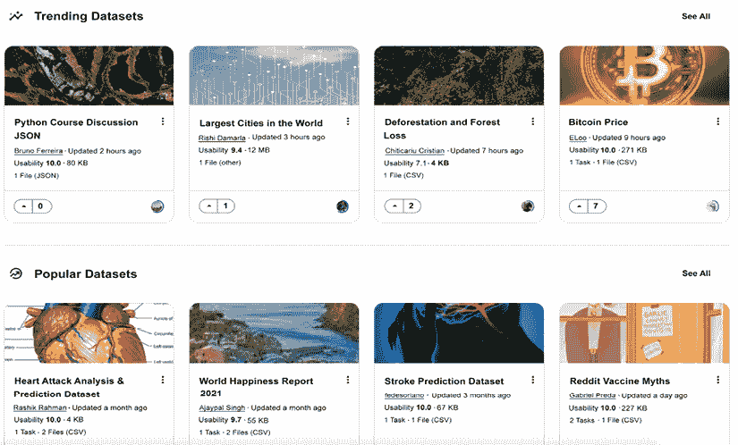
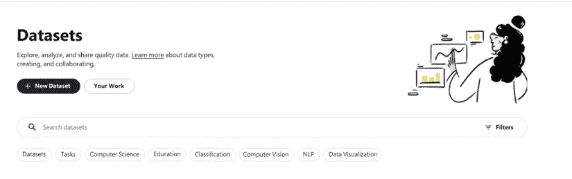
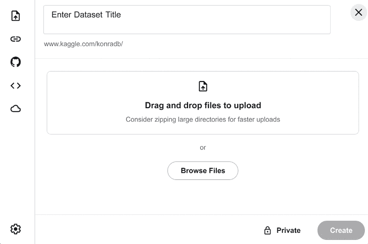
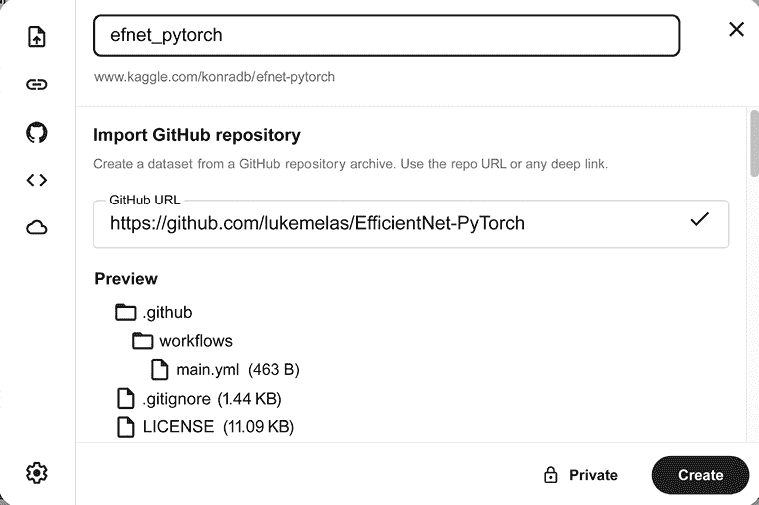
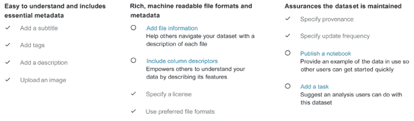
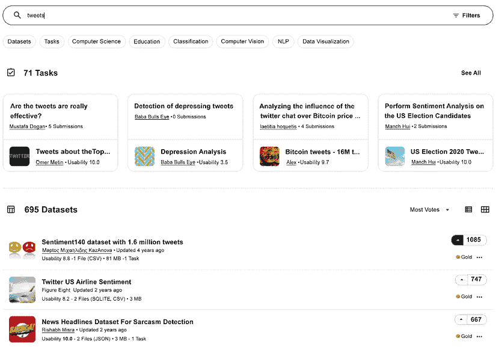
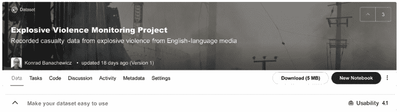
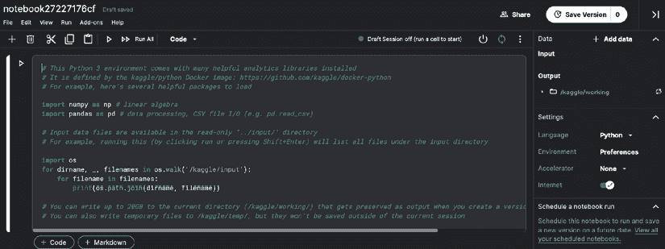
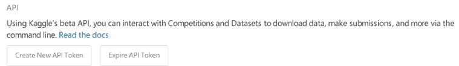

# 第二章：使用数据集组织数据

在他的故事《铜 Beeches 的冒险》中，亚瑟·柯南·道尔让夏洛克·福尔摩斯喊道“*数据！数据！数据！没有粘土我无法制造砖块*。”这种心态为文学中最著名的侦探提供了很好的服务，每个数据科学家都应该采纳这种心态。因此，我们以一个专门介绍数据的章节开始这本书的更技术性部分：具体来说，在 Kaggle 的背景下，利用 Kaggle 数据集功能为我们服务。

在本章中，我们将涵盖以下主题：

+   设置数据集

+   收集数据

+   与数据集一起工作

+   在 Google Colab 中使用 Kaggle 数据集

+   法律注意事项

# 设置数据集

原则上，你可以使用的任何数据都可以上传到 Kaggle（受限制；请参阅后面的 *法律注意事项* 部分）。写作时的具体限制是 **每个私有数据集 100 GB** 和 **总共 100 GB** 的配额。请注意，单个数据集的大小限制是计算未压缩的；上传压缩版本可以加快传输速度，但不会帮助克服限制。你可以通过此链接检查数据集的最新文档：[`www.kaggle.com/docs/datasets`](https://www.kaggle.com/docs/datasets)。

Kaggle 自称为“数据科学之家”，并且从该网站提供的令人印象深刻的数据集集合确实为这一说法增添了一些可信度。你不仅可以找到从石油价格到动漫推荐等主题的数据，而且数据迅速出现在那里的速度也令人印象深刻。当 2021 年 5 月根据《信息自由法》发布 *安东尼·福奇* 的电子邮件时([`www.washingtonpost.com/politics/interactive/2021/tony-fauci-emails/`](https://www.washingtonpost.com/politics/interactive/2021/tony-fauci-emails/))，它们仅仅在 48 小时后就被上传为一个 Kaggle 数据集。



图 2.1：Kaggle 上的趋势和热门数据集

在将你的项目数据上传到数据集之前，请确保检查现有内容。对于几个流行的应用（图像分类、NLP、金融时间序列），有可能它已经被存储在那里。

为了介绍的目的，让我们假设你将在项目中使用的数据尚未存在，因此你需要创建一个新的数据集。当你点击左侧带有三条线的菜单并点击 **数据** 时，你将被重定向到 **数据集** 页面：



图 2.2：数据集页面

当你点击 **+ 新数据集** 时，你将被提示输入基本信息：上传实际数据和给它一个标题：



图 2.3：输入数据集详细信息

左侧的图标对应于您可以为数据集利用的不同来源。我们按页面显示的顺序描述它们：

+   从本地驱动器上传文件（如图所示）

+   从远程 URL 创建

+   导入 GitHub 仓库

+   使用现有笔记本的输出文件

+   导入 Google Cloud Storage 文件

**关于 GitHub 选项的一个重要观点**：当涉及到实验性库时，此功能特别有用。虽然它们经常提供以前不可用的功能，但它们通常不包括在 Kaggle 环境中，因此如果您想在代码中使用此类库，您可以将其作为数据集导入，如下所示：

1.  前往**数据集**并点击**新建数据集**。

1.  选择 GitHub 图标。

1.  插入仓库链接以及数据集的标题。

1.  在右下角点击**创建**：



图 2.4：来自 GitHub 仓库的数据集

在**创建**按钮旁边，还有一个标记为**私有**的按钮。默认情况下，您创建的任何数据集都是私有的：只有您，即创建者，可以查看和编辑它。在数据集创建阶段保持此设置为默认值，并在稍后阶段将其公开（可供选定列表的参与者或所有人使用）可能是一个好主意。

请记住，Kaggle 是一个流行的平台，许多人上传他们的数据集——包括私有的——所以尽量想一个非通用标题。这将增加您的数据集真正被注意到的机会。

完成所有步骤并点击**创建**后，哇！您的第一个数据集就准备好了。然后您可以前往**数据**选项卡：



图 2.5：数据选项卡

上面的截图展示了您可以提供有关数据集的不同信息；您提供的信息越多，**可用性指数**就越高。这个指数是一个综合指标，总结了您的数据集描述得有多好。具有更高可用性指数的数据集在搜索结果中显示得更高。对于每个数据集，可用性指数基于多个因素，包括文档水平、相关公共内容（如笔记本）的可用性、文件类型和关键元数据的覆盖范围。

在原则上，您不需要填写上图所示的所有字段；您新创建的数据集无需它们即可完全使用（如果它是私有的，您可能也不在乎；毕竟，您知道里面有什么）。然而，社区礼仪建议填写您公开的数据集的信息：您指定的信息越多，数据对他人就越有用。

# 收集数据

除了法律方面，在数据集中存储的内容类型实际上没有真正的限制：表格数据、图像、文本；如果它符合大小要求，就可以存储。这包括从其他来源收集的数据；在撰写本文时，按标签或主题收集的推文是流行的数据集之一：



图 2.6：推文是最受欢迎的数据集之一

讨论从社交媒体（Twitter、Reddit 等）收集数据的不同框架超出了本书的范围。


安德烈·马拉尼亚奥

[`www.kaggle.com/andrewmvd`](https://www.kaggle.com/andrewmvd)

我们采访了安德烈·马拉尼亚奥（又名 Larxel），数据集大师（在撰写本文时数据集排名第一）和圣保罗艾伯特·爱因斯坦医院的资深数据科学家，关于他如何取得数据集的成功，他创建数据集的技巧以及他在 Kaggle 上的总体经验。

你最喜欢的比赛类型是什么？为什么？在技术和解决方法方面，你在 Kaggle 上的专长是什么？

*医学影像通常是我在 Kaggle 上最喜欢的。它与我的人生目标和职业相关。在医学竞赛中，NLP 受语言限制，表格数据在医院之间差异很大，但影像学大多是相同的，因此在这个背景下任何进步都可以为世界上的许多国家带来好处，我热爱这种影响潜力。我也喜欢 NLP 和表格数据，但我想这很常见。*

告诉我们你参加的一个特别具有挑战性的比赛，以及你用来应对任务的见解。

*在 X 光图像结核病检测比赛中，我们有大约 1,000 张图像，这对于捕捉疾病的全部表现来说数量相当少。我提出了两个想法来弥补这一点：*

1.  *在外部肺炎检测数据（约 20k 张图像）上进行预训练，因为肺炎可能会被误诊为肺结核。*

1.  *在肺异常的多标签分类（约 600k 张图像）上进行预训练，并使用简单的 SSD 与 grad-CAM 生成分类标签的边界框注释。*

*最终，这两种简单混合的方法比第二名团队的结果高出 22%。这发生在一次医学会议上，大约有 100 个团队参加。*

你已经成为数据集大师，并在数据集上取得了第一名。你是如何选择主题，以及如何在 Kaggle 上找到、收集和发布数据集的？

*这是一个很大的问题；我会一点一点地把它分解。*

1.  **设定自己的目标**

*在选择主题时，我首先考虑的是我最初为什么要做这件事。*

*当有一个更深层次的原因时，伟大的数据集只是作为一个结果出现，而不是作为一个目标本身。ImageNet 创建实验室的负责人李飞飞在 TED 演讲中透露，她* *希望创造一个世界，机器能够用他们的视觉以她孩子的方式推理和欣赏世界。*

*有一个目的在心中会使你更有可能参与并随着时间的推移而改进，这也会使你和你数据集与众不同。你当然可以靠日常主题的表格数据为生，尽管我发现这不太可能留下持久的影响。*

1.  **一个伟大的数据集是一个伟大问题的体现**

*如果我们看看当前文献中最伟大的数据集，比如 ImageNet 和其他数据集，我们可以看到一些共同的主题：*

+   *这是一个大胆、相关的问题，对我们所有人（科学或现实世界应用）都有巨大的潜力。*

+   *数据收集得很好，质量得到控制，并且有很好的记录*

+   *当前硬件的数据量和多样性是足够的*

+   *它有一个活跃的社区，不断改进数据并/或在此基础上构建问题*

*正如我之前提到的，我认为提问是数据科学家的主要角色，并且随着自动机器学习和深度学习解决方案的进步，它可能会变得更加突出。这正是数据集可以肯定地发挥你技能的独特之处。*

1.  **创造你的成功过程，而不仅仅是追求成功本身**

*质量远远超过数量；你只需要 15 个数据集就可以成为大师，而 AI 的旗舰数据集很少且制作精良。*

*我已经丢弃了与我发布的同样多的数据集。这需要时间，而且它不是许多人所认为的一次性事情——数据集有维护和持续改进的一面。*

*经常被忽视的一点是支持围绕你的数据聚集的社区。笔记本和数据集是共同努力的结果，因此支持那些花时间分析你数据的人对你的数据集也有很大的帮助。分析他们的瓶颈和选择可以为你提供指导，关于哪些预处理步骤可以完成和提供，以及你文档的清晰度。*

*总的来说，我推荐的过程是从设定你的目的开始，将其分解为目标和主题，制定问题以满足这些主题，调查可能的数据来源，选择和收集，预处理，记录，发布，维护和支持，最后是改进措施。*

*例如，假设你想要提高社会福利；你将其分解为一个目标，比如，种族平等。从那里，你分析与目标相关的主题，并找到“黑人的命也是命”运动。从这里，你提出问题：我如何理解数百万人在谈论它？*

*这缩小了你的数据类型到 NLP，你可以从新闻文章、YouTube 评论和推文中（你选择的，因为它似乎更能代表你的问题和可行性）收集数据。你预处理数据，去除标识符，并记录收集过程和数据集用途。*

*完成这些后，你发布它，一些 Kagglers 尝试主题建模，但很难做到，因为一些推文中包含许多外语，这造成了编码问题。你通过提供建议和突出他们的工作来支持他们，并决定回到推文，将其缩小到英语，以彻底解决这个问题。*

*他们的分析揭示了与运动相关的需求、动机和恐惧。通过他们的努力，有可能将数百万条推文分解成一系列可能改善社会种族平等的建议。*

4. **做好工作是你在控制范围内的所有事情*

*最终，是其他人让你成为大师，投票并不总是转化为努力或影响。在我的一个关于《赛博朋克 2077》的数据集中，我总共工作了大约 40 小时，时至今日，它仍然是我最少点赞的数据集之一。*

*但这没关系。我付出了努力，我尝试了，我学到了我能学到的东西——那是我能控制的，下周无论发生什么，我都会再次尝试。尽你所能，继续前进。*

你会推荐哪些特定的工具或库用于数据分析/机器学习？

*奇怪的是，我既推荐也不建议使用库。LightGBM 是一个出色的表格机器学习库，具有出色的性能与计算时间的比率，CatBoost 有时可以超越它，但代价是增加了计算时间，在这段时间里，你可以尝试和测试新的想法。Optuna 非常适合超参数调整，Streamlit 适用于前端，Gradio 适用于 MVP，Fast API 适用于微服务，Plotly 和 Plotly Express 适用于图表，PyTorch 及其衍生品适用于深度学习。*

*虽然图书馆很棒，但我还建议在职业生涯的某个阶段，你花些时间自己实现它。我第一次从 Andrew Ng 那里听到这个建议，后来又从许多同等水平的人那里听到。这样做可以创造非常深入的知识，这些知识可以让你对模型的功能以及它如何响应调整、数据、噪声等有新的认识。*

在你的经验中，不经验的 Kagglers 经常忽视什么？你现在知道什么，而你在最初开始时希望知道的呢？

*多年来，我最希望早点意识到的事情是：*

1.  *在竞赛结束时吸收所有知识*

1.  *在完成竞赛中复制获胜的解决方案*

*在一场即将结束的竞争压力下，你可以看到排行榜比以往任何时候都更加动荡。这使得你不太可能冒险，也不太愿意花时间去细致观察。当比赛结束后，你不再有那种紧迫感，可以花尽可能多的时间去思考；你也可以复制获胜者的逻辑，让他们知道他们的解决方案。*

*如果你有自律，这将对你的数据科学技能产生神奇的效果，所以底线是：在你完成时停止，而不是在比赛结束时停止。我还从 Andrew Ng 的闭幕演讲中听到过这个建议，他建议复制论文是他作为 AI 实践者自我发展的最佳方式之一。*

*此外，在比赛结束时，你可能会感到筋疲力尽，只想结束这一天。没问题；但请记住，比赛结束后，讨论论坛是地球上知识最丰富的地方之一，主要是因为* *许多获胜解决方案的理据和代码都公开发布在那里。花时间去阅读和学习获胜者所做的事情；不要屈服于想要转向其他事物的欲望，因为你可能会错过一个极好的学习机会。*

Kaggle 是否帮助了你的职业生涯？如果是的话，是如何帮助的？

*Kaggle 通过提供丰富的知识、经验和建立我的作品集来帮助了我的职业生涯。我作为数据科学家的第一份工作很大程度上得益于 Kaggle 和 DrivenData 竞赛。在我的整个职业生涯中，我研究了竞赛解决方案，并参与了一些更多的竞赛。在数据集和笔记本上的进一步参与也在学习新技术和提出更好的问题方面证明非常有益。*

*在我看来，提出优秀问题是数据科学家面临的主要挑战。回答它们当然也很棒，尽管我相信我们离一个自动化解决方案在建模中越来越普遍的未来并不遥远。建模始终有空间，但我认为在这方面会有很多工作流程简化。然而，提出优秀问题要远比自动化困难——如果问题本身不好，即使是最好的解决方案也可能毫无意义。*

你是否曾使用在 Kaggle 竞赛中完成的项目来构建你的作品集，以展示给潜在雇主？

*绝对如此。我于 2017 年通过 Kaggle 作为知识证明，获得了我的第一份数据科学家工作。时至今日，它仍然是一个极好的简历组成部分，因为教育背景和学位在数据科学知识和经验方面不如作品集来得有代表性。*

*拥有竞赛项目的作品集不仅展示了额外的经验，还显示了超越常规进行发展的意愿，这在长期成功中可能更为重要。*

你使用其他竞赛平台吗？它们与 Kaggle 相比如何？

*我也使用 DrivenData 和 AICrowd。它们的好处是允许那些没有相同财务资源访问权的组织，如初创公司和研究机构，创建比赛。*

*伟大的竞赛来自于优秀的问题和优秀的数据的结合，这无论公司规模大小都是可能的。Kaggle 拥有一个更大、更活跃的社区，以及他们提供的硬件，结合数据集和笔记本功能，使其成为最佳选择；然而，DrivenData 和 AICrowd 也提供了同样有趣挑战，并允许更多样化的选择。*

当人们参加比赛时，他们应该记住或做什么最重要的事情？

*假设你的主要目标是开发，我的建议是选择一个你感兴趣的主题和之前没有做过的任务的比赛。批判性思维和技能需要深度和多样性。专注于并全力以赴将保证深度，而多样性是通过做你以前没有做过的事情或以不同的方式做事情来实现的。*

# 与数据集一起工作

一旦你创建了一个数据集，你可能希望将其用于你的分析。在本节中，我们将讨论不同的实现方法。

很可能，最重要的是在参加比赛时，应该记住或做的事情是开始一个笔记本，其中你使用你的数据集作为主要来源。你可以通过访问数据集页面，然后点击**新建笔记本**来完成：



图 2.7：从数据集页面创建笔记本

完成这些操作后，你将被重定向到你的**笔记本**页面：



图 2.8：使用你的数据集开始笔记本

关于这一点，这里有一些提示：

+   阿拉伯数字和字母标题是自动生成的；你可以通过点击它来编辑它。

+   在右侧的**数据**部分，你可以看到附加到你的笔记本上的数据源列表；我选择的数据集可以在`../input/`或`/kaggle/input/`下访问。

+   开头块（包含导入的包、描述性注释和打印可用文件列表）会自动添加到新的 Python 笔记本中。

在这个基本设置下，你可以开始编写用于分析的笔记本，并将你的数据集作为数据源使用。我们将在*第四章*，*利用讨论论坛*中更详细地讨论笔记本。

# 在 Google Colab 中使用 Kaggle 数据集

Kaggle 笔记本免费使用，但并非没有限制（更多内容请见*第四章*），你很可能会遇到的时间限制。一个流行的替代方案是迁移到 Google Colab，这是一个完全在云端运行的免费 Jupyter Notebook 环境：[`colab.research.google.com`](https://colab.research.google.com)。

即使我们将计算移动到那里，我们可能仍然需要访问 Kaggle 数据集，因此将它们导入 Colab 是一个相当方便的功能。本节剩余部分将讨论使用 Colab 通过 Kaggle 数据集所需的步骤。

假设我们已经在 Kaggle 上注册，我们首先去账户页面生成**API 令牌**（一个包含登录会话安全凭证、用户标识、权限等的访问令牌）：

1.  前往你的账户，可以在 `https://www.kaggle.com/USERNAME/account` 找到，然后点击**创建新的 API 令牌**：



图 2.9：创建新的 API 令牌

将包含你的用户名和令牌的名为 kaggle.json 的文件创建出来。

1.  下一步是在你的 Google Drive 中创建一个名为 `Kaggle` 的文件夹，并将 `.json` 文件上传到那里：

![图片 B17574_02_10.png]

图 2.10：将 .json 文件上传到 Google Drive

1.  完成后，你需要在 Colab 中创建一个新的笔记本，并通过在笔记本中运行以下代码来挂载你的驱动器：

    ```py
    from google.colab import drive
    drive.mount('/content/gdrive') 
    ```

1.  从 URL 提示中获取授权代码，并在出现的空框中提供，然后执行以下代码以提供 `.json` 配置的路径：

    ```py
    import os
    # content/gdrive/My Drive/Kaggle is the path where kaggle.json is 
    # present in the Google Drive
    os.environ['KAGGLE_CONFIG_DIR'] = "/content/gdrive/My Drive/Kaggle"
    # change the working directory
    %cd /content/gdrive/My Drive/Kaggle
    # check the present working directory using the pwd command 
    ```

1.  现在我们可以下载数据集了。首先前往数据集在 Kaggle 上的页面，点击**新建笔记本**旁边的三个点，然后选择**复制 API 命令**：

![图片 B17574_02_11.png]

图 2.11：复制 API 命令

1.  运行 API 命令以下载数据集（对命令细节感兴趣的读者可以查阅官方文档：[`www.kaggle.com/docs/api`](https://www.kaggle.com/docs/api)）：

    ```py
    !kaggle datasets download -d ajaypalsinghlo/world-happiness-report-2021 
    ```

1.  数据集将以 `.zip` 归档的形式下载到 `Kaggle` 文件夹中——解压后即可使用。

如上表所示，在 Colab 中使用 Kaggle 数据集是一个简单的过程——你只需要一个 API 令牌，切换后你就有可能使用比 Kaggle 授予的更多 GPU 小时数。

# 法律免责声明

只因为你可以在 Kaggle 上放置一些数据，并不意味着你一定应该这样做。一个很好的例子是 *Tinder 的人* 数据集。2017 年，一位开发者使用 Tinder API 爬取了网站上的半私密资料，并将数据上传到了 Kaggle。问题曝光后，Kaggle 最终将该数据集下架。你可以在这里阅读完整的故事：[`www.forbes.com/sites/janetwburns/2017/05/02/tinder-profiles-have-been-looted-again-this-time-for-teaching-ai-to-genderize-faces/?sh=1afb86b25454`](https://www.forbes.com/sites/janetwburns/2017/05/02/tinder-profiles-have-been-looted-again-this-time-for-teaching-ai-to-genderize-faces/?sh=1afb86b25454)。

通常，在将任何内容上传到 Kaggle 之前，问问自己两个问题：

1.  **从版权角度来看，这是否允许？** 记得始终检查许可证。如有疑问，您始终可以咨询[`opendefinition.org/guide/data/`](https://opendefinition.org/guide/data/)或联系 Kaggle。

1.  **这个数据集是否有隐私风险？** 仅因为发布某些类型的信息在严格意义上并不违法，但这可能对另一人的隐私造成伤害。

这些限制符合常识，因此不太可能妨碍您在 Kaggle 上的努力。

# 摘要

在本章中，我们介绍了 Kaggle 数据集，这是在平台上存储和使用数据的标准化方式。我们讨论了数据集创建、在 Kaggle 之外工作的方法以及最重要的功能：在您的笔记本中使用数据集。这为我们下一章提供了一个很好的过渡，我们将重点关注 Kaggle 笔记本。

# 加入我们本书的 Discord 空间

加入本书的 Discord 工作空间，参加每月一次的作者“问我任何问题”活动：

[`packt.link/KaggleDiscord`](https://packt.link/KaggleDiscord)


