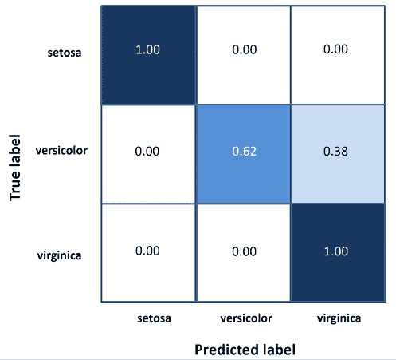
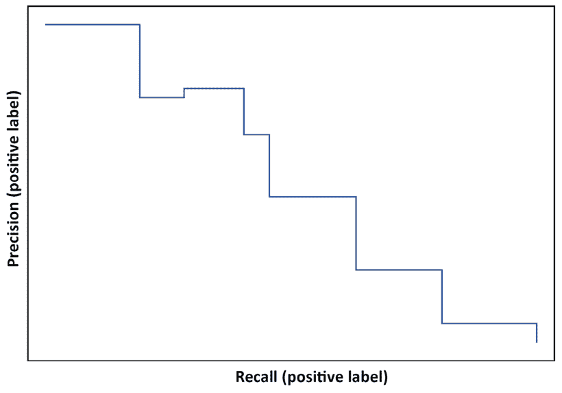
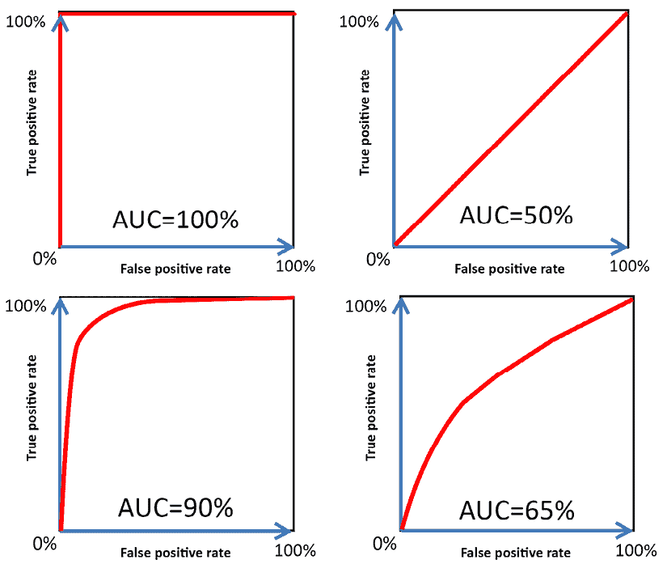
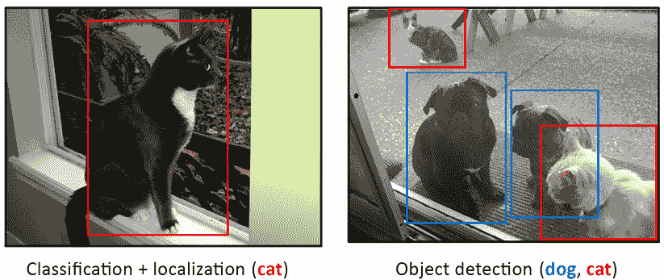
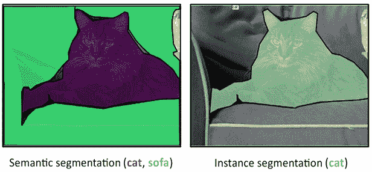
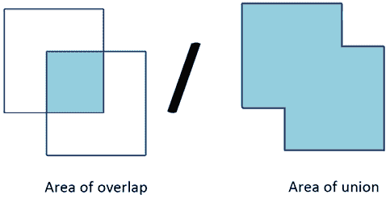

# 第五章：竞赛任务和指标

在竞赛中，你首先检查目标指标。理解你的模型错误是如何评估的是在每一场竞赛中取得高分的关键。当你的预测提交到 Kaggle 平台时，它们将与基于目标指标的真实数据进行比较。

例如，在*泰坦尼克号*竞赛([`www.kaggle.com/c/titanic/`](https://www.kaggle.com/c/titanic/))中，你所有的提交都将根据*准确率*进行评估，即正确预测的幸存乘客百分比。组织者选择这个指标是因为竞赛的目的是找到一个模型，该模型可以估计在类似情况下乘客生存的概率。在另一个知识竞赛*房价 - 高级回归技术*([`www.kaggle.com/c/house-prices-advanced-regression-techniques`](https://www.kaggle.com/c/house-prices-advanced-regression-techniques))中，你的工作将根据你的预测与真实数据之间的*平均差异*进行评估。这涉及到计算对数、平方和开方，因为模型预计能够尽可能准确地量化待售房屋价格的高低顺序。

在现实世界的数据科学中，目标指标也是你项目成功的关键，尽管现实世界与 Kaggle 竞赛之间肯定存在差异。我们可以简单地总结说，现实世界中有更多的复杂性。在现实世界的项目中，你将经常面对不止一个而是多个指标，你的模型将根据这些指标进行评估。通常，一些评估指标甚至与你的预测与用于测试的真实数据之间的表现无关。例如，你正在工作的知识领域，项目的范围，你的模型考虑的特征数量，整体内存使用量，对特殊硬件（例如 GPU）的任何要求，预测过程的延迟，预测模型的复杂性，以及许多其他方面，最终可能比单纯的预测性能更重要。

现实世界的问题确实比你在参与其中之前想象的要更多地受到商业和技术基础设施的关注。

尽管如此，你无法回避这样一个事实：无论是现实世界项目还是 Kaggle 竞赛的核心基本原则都是相同的。你的工作将根据某些标准进行评估，理解这些标准的细节，以智能的方式优化你模型的拟合度，或者根据这些标准选择其参数，这些都将为你带来成功。如果你能更多地了解 Kaggle 中模型评估的流程，你的现实世界数据科学工作也将从中受益。

在本章中，我们将详细说明某些类型问题的评估指标如何强烈影响你在数据科学竞赛中构建模型解决方案时的操作方式。我们还讨论了 Kaggle 竞赛中可用的各种指标，以给你一个关于什么最重要的概念，并在边缘讨论了指标对预测性能的不同影响以及如何正确地将它们转化为你的项目。我们将涵盖以下主题：

+   评估指标和目标函数

+   基本任务类型：回归、分类和序型

+   Meta Kaggle 数据集

+   处理未见过的指标

+   回归指标（标准型和序型）

+   二元分类指标（标签预测和概率）

+   多类分类指标

+   目标检测问题的指标

+   多标签分类和推荐问题的指标

+   优化评估指标

# 评估指标和目标函数

在 Kaggle 竞赛中，你可以在竞赛的**概述**页面的左侧菜单中找到评估指标。通过选择**评估**选项卡，你可以获得关于评估指标的具体信息。有时你会找到指标公式、重现它的代码以及一些关于指标的讨论。在同一页面上，你还可以获得关于提交文件格式的说明，提供文件的标题和一些示例行。

评估指标与提交文件之间的关联很重要，因为你必须考虑到指标在训练模型并产生一些预测后基本上才会工作。因此，作为第一步，你必须考虑**评估指标**和**目标函数**之间的区别。

将一切简化到基本原理，目标函数在训练过程中服务于你的模型，因为它涉及到错误最小化（或根据问题进行分数最大化）。相比之下，评估指标在模型**训练后**提供服务，通过提供一个分数。因此，它不能影响模型如何拟合数据，但以间接方式影响它：通过帮助你选择模型中最出色的超参数设置，以及竞争中的最佳模型。在继续本章的其余部分之前，这部分将向你展示这如何影响 Kaggle 竞赛以及为什么分析 Kaggle 评估指标应该是你在竞赛中的首要行动，让我们首先讨论一些你可能在讨论论坛中遇到的术语。

你经常会听到关于目标函数、损失函数和损失函数的讨论，有时可以互换使用。然而，它们并不完全相同，我们在这里解释了区别：

+   **损失函数**是在单个数据点上定义的函数，它考虑了模型的预测和该数据点的真实值，计算一个惩罚。

+   **代价函数**考虑了用于训练的整个数据集（或其一部分批次），通过计算其数据点的损失惩罚的总和或平均值。它可以包括进一步的约束，例如 L1 或 L2 惩罚，例如。代价函数直接影响到训练过程。

+   **目标函数**是与机器学习训练中优化范围最通用（且安全使用）的术语：它包括代价函数，但不仅限于它们。实际上，目标函数还可以考虑与目标无关的目标：例如，要求估计模型的稀疏系数或系数值的极小化，如在 L1 和 L2 正则化中。此外，虽然损失和代价函数暗示基于最小化的优化过程，但目标函数是中立的，可以暗示学习算法执行的是最大化或最小化活动。

同样，当涉及到评估指标时，你会听到关于评分函数和误差函数的讨论。区分它们很容易：一个**评分函数**如果函数的分数更高，则暗示更好的预测结果，这意味着一个最大化过程。

**误差函数**则暗示如果函数报告较小的误差量，则会有更好的预测，这意味着一个最小化过程。

# 基本任务类型

并非所有目标函数都适用于所有问题。从一般的角度来看，你会在 Kaggle 竞赛中找到两种类型的问题：**回归**任务和**分类**任务。最近，也出现了**强化学习**（**RL**）任务，但 RL 不使用指标进行评估；相反，它依赖于与其他竞争对手的直接对抗产生的排名，假设这些竞争对手的解决方案与你的表现相当（在这个对抗中表现优于你的同伴将提高你的排名，表现较差将降低它）。由于 RL 不使用指标，我们仍将继续提到回归-分类的二分法，尽管**序数**任务，其中你预测由整数表示的有序标签，可能逃避这种分类，并且可以使用回归或分类方法成功处理。

## 回归

**回归**需要你构建一个可以预测实数的模型；通常是一个正数，但也有预测负数的例子。一个经典的回归问题示例是 *房价 - 高级回归技术*，因为你需要猜测房屋的价值。回归任务的评估涉及计算你的预测与真实值之间的距离。这种差异可以通过不同的方式来评估，例如通过平方它来惩罚较大的错误，或者通过对其应用对数来惩罚错误尺度的预测。

## 分类

当你在 Kaggle 面对分类任务时，需要考虑更多的细微差别。实际上，分类可以是 **二元**、**多类** 或 **多标签**。

在 **二元**问题中，你必须猜测一个示例是否应该被分类到特定的类别中（通常称为 *正* 类，并与 *负* 类进行比较）。在这里，评估可能包括对类归属的直接预测，或者对这种归属概率的估计。一个典型的例子是 *泰坦尼克号* 比赛，你必须猜测一个二元结果：是否幸存。在这种情况下，比赛的要求仅仅是预测，但在许多情况下，提供概率是必要的，因为在某些领域，特别是医疗应用中，需要对不同选项和情况下的阳性预测进行排序，以便做出最佳决策。

虽然在二元分类中计算正确匹配的确切数量似乎是一个有效的方法，但当正负类之间存在不平衡时，这实际上并不会很好地工作，也就是说，正负类中的示例数量不同。基于类别不平衡分布的分类需要考虑不平衡的评估指标，如果你想正确跟踪模型上的改进。

当你有超过两个类别时，你面临的是一个 **多类** 预测问题。这也需要使用合适的评估函数，因为需要跟踪模型的总体性能，同时也要确保跨类别的性能是可比的（例如，你的模型可能在某些类别上表现不佳）。在这里，每个案例只能属于一个类别，而不能属于其他任何类别。一个很好的例子是 *叶分类* ([`www.kaggle.com/c/leaf-classification`](https://www.kaggle.com/c/leaf-classification))，其中每张叶片样本的图像都必须与正确的植物物种相关联。

最后，当你的类别预测不是互斥的，并且你可以为每个示例预测多个类别所有权时，你就遇到了一个**多标签**问题，这需要进一步的评估来控制你的模型是否正在预测正确的类别，以及正确的类别数量和组合。例如，在*希腊媒体监测多标签分类（WISE 2014）*（[`www.kaggle.com/c/wise-2014`](https://www.kaggle.com/c/wise-2014)）中，你必须将每篇文章与它所涉及的所有主题关联起来。

## 有序

在一个涉及对有序尺度预测的问题中，你必须猜测有序的整数数值标签，这些标签自然是按顺序排列的。例如，地震的震级就属于有序尺度。此外，市场调研问卷中的数据通常也记录在有序尺度上（例如，消费者的偏好或意见一致性）。由于有序尺度由有序值组成，因此有序任务可以被视为介于回归和分类之间的一种任务，你可以用这两种方式来解决它们。

最常见的方法是将你的有序任务视为一个**多类**问题。在这种情况下，你将得到一个整数值（类别标签）的预测，但预测不会考虑这些类别有一定的顺序。如果你查看类别的预测概率，你会感觉到将问题作为多类问题处理可能存在问题。通常，概率将分布在所有可能值的整个范围内，描绘出一个多模态且通常不对称的分布（而你应该期望最大概率类周围有一个高斯分布）。

解决有序预测问题的另一种方法是将它视为一个**回归**问题，然后对结果进行后处理。这样，类之间的顺序将被考虑在内，尽管预测输出不会立即用于评估指标上的评分。实际上，在回归中，你得到的是一个浮点数作为输出，而不是表示有序类的整数；此外，结果将包括你有序分布中的整数之间的全部值，甚至可能还包括它之外的值。通过裁剪输出值并将它们通过单位舍入转换为整数可能可行，但这可能会导致一些需要更复杂后处理的误差（我们将在本章后面进一步讨论这个问题）。

现在，你可能想知道为了在 Kaggle 上取得成功，你应该掌握哪种类型的评估。显然，你必须掌握你所参加的竞赛的评估指标。然而，一些指标比其他指标更常见，这是你可以利用的信息。最常见的指标是什么？我们如何确定在使用了类似评估指标的竞赛中寻找洞察力的地方？答案是查阅 Meta Kaggle 数据集。

# Meta Kaggle 数据集

Meta Kaggle 数据集([`www.kaggle.com/kaggle/meta-kaggle`](https://www.kaggle.com/kaggle/meta-kaggle))是 Kaggle 社区和活动的丰富数据集合，由 Kaggle 本身作为公共数据集发布。它包含 CSV 表格，其中充满了来自竞赛、数据集、笔记本和讨论的公共活动。你只需要开始一个 Kaggle 笔记本（如你在第二章和第三章中看到的），添加 Meta Kaggle 数据集，并开始分析数据。CSV 表格每天都会更新，因此你将不得不经常刷新你的分析，但考虑到你可以从中获得的见解，这是值得的。

我们有时会在这本书中提到 Meta Kaggle 数据集，既作为许多有趣竞赛动态的灵感来源，也是为了收集有用的例子用于你的学习和竞赛策略。在这里，我们将用它来确定在过去七年里最常用于竞赛的评价指标。通过查看本章中最常见的指标，你将能够从稳固的起点开始任何竞赛，然后通过在论坛中找到的讨论来细化你对指标的了解，并掌握竞赛特有的细微差别。

在下面，我们介绍了生成指标及其每年计数的表格所需代码。它设计为可以直接在 Kaggle 平台上运行：

```py
import numpy as np
import pandas as pd
comps = pd.read_csv("/kaggle/input/meta-kaggle/Competitions.csv")
evaluation = ['EvaluationAlgorithmAbbreviation',
              'EvaluationAlgorithmName',
              'EvaluationAlgorithmDescription',]
compt = ['Title', 'EnabledDate', 'HostSegmentTitle']
df = comps[compt + evaluation].copy()
df['year'] = pd.to_datetime(df.EnabledDate).dt.year.values
df['comps'] = 1
time_select = df.year >= 2015
competition_type_select = df.HostSegmentTitle.isin(
						['Featured', 'Research'])
pd.pivot_table(df[time_select&competition_type_select],
               values='comps',
               index=['EvaluationAlgorithmAbbreviation'],
               columns=['year'],
               fill_value=0.0,
               aggfunc=np.sum,
               margins=True
              ).sort_values(
                by=('All'), ascending=False).iloc[1:,:].head(20) 
```

在此代码中，我们读取包含竞赛相关数据的 CSV 表格。我们关注代表评估的列以及告诉我们竞赛名称、开始日期和类型的列。我们将行限制在自 2015 年以来举行且为特色或研究类型的竞赛（这些是最常见的类型）。我们通过创建 pandas 交叉表，结合评估算法和年份，并计算使用该算法的竞赛数量来完成分析。我们只显示前 20 个算法。

这里是生成的表格（截至写作时）：

| **年份** | **2015** | **2016** | **2017** | **2018** | **2019** | **2020** | **2021** | **总计** |
| --- | --- | --- | --- | --- | --- | --- | --- | --- |
| **评估算法** |
| AUC | 4 | 4 | 1 | 3 | 3 | 2 | 0 | 17 |
| LogLoss | 2 | 2 | 5 | 2 | 3 | 2 | 0 | 16 |
| MAP@{K} | 1 | 3 | 0 | 4 | 1 | 0 | 1 | 10 |
| CategorizationAccuracy | 1 | 0 | 4 | 0 | 1 | 2 | 0 | 8 |
| MulticlassLoss | 2 | 3 | 2 | 0 | 1 | 0 | 0 | 8 |
| RMSLE | 2 | 1 | 3 | 1 | 1 | 0 | 0 | 8 |
| QuadraticWeightedKappa | 3 | 0 | 0 | 1 | 2 | 1 | 0 | 7 |
| MeanFScoreBeta | 1 | 0 | 1 | 2 | 1 | 2 | 0 | 7 |
| MeanBestErrorAtK | 0 | 0 | 2 | 2 | 1 | 1 | 0 | 6 |
| MCRMSLE | 0 | 0 | 1 | 0 | 0 | 5 | 0 | 6 |
| MCAUC | 1 | 0 | 1 | 0 | 0 | 3 | 0 | 5 |
| RMSE | 1 | 1 | 0 | 3 | 0 | 0 | 0 | 5 |
| Dice | 0 | 1 | 1 | 0 | 2 | 1 | 0 | 5 |
| GoogleGlobalAP | 0 | 0 | 1 | 2 | 1 | 1 | 0 | 5 |
| MacroFScore | 0 | 0 | 0 | 1 | 0 | 2 | 1 | 4 |
| 分数 | 0 | 0 | 3 | 0 | 0 | 0 | 0 | 3 |
| CRPS | 2 | 0 | 0 | 0 | 1 | 0 | 0 | 3 |
| OpenImagesObjectDetectionAP | 0 | 0 | 0 | 1 | 1 | 1 | 0 | 3 |
| MeanFScore | 0 | 0 | 1 | 0 | 0 | 0 | 2 | 3 |
| RSNAObjectDetectionAP | 0 | 0 | 0 | 1 | 0 | 1 | 0 | 2 |

使用我们刚刚实例化的相同变量来生成表格，你还可以检查数据以找到采用你选择指标的竞赛：

```py
metric = 'AUC'
metric_select = df['EvaluationAlgorithmAbbreviation']==metric
print(df[time_select&competition_type_select&metric_select]
        [['Title', 'year']]) 
```

在上面的片段中，我们决定表示使用 AUC 指标的竞赛。你只需更改表示所选指标的字符串，结果列表将相应更新。

回到生成的表格，我们可以检查在 Kaggle 主办的竞赛中最受欢迎的评估指标：

+   两个最重要的指标彼此之间以及与二进制概率分类问题密切相关。**AUC** 指标有助于衡量你的模型预测概率是否倾向于以高概率预测阳性案例，而 **Log Loss** 指标有助于衡量你的预测概率与真实值之间的差距（并且当你优化 Log Loss 时，你也在优化 AUC 指标）。

+   在第 3 位，我们发现 **MAP@{K}**，这是推荐系统和搜索引擎中常用的一个指标。在 Kaggle 竞赛中，这个指标主要用于信息检索评估，例如在 *座头鲸识别* 竞赛（[`www.kaggle.com/c/humpback-whale-identification`](https://www.kaggle.com/c/humpback-whale-identification)）中，你需要在五个可能的猜测中精确识别一只鲸鱼。**MAP@{K}** 的另一个应用示例是在 *快速绘画！涂鸦识别挑战*（[`www.kaggle.com/c/quickdraw-doodle-recognition/`](https://www.kaggle.com/c/quickdraw-doodle-recognition/)）中，你的目标是猜测所画草图的内容，并且你有三次尝试的机会。本质上，当 MAP@{K} 是评估指标时，你可以评分的不仅仅是能否正确猜测，还包括你的正确猜测是否在一定的其他错误预测数量（函数名称中的“K”）中。

+   只有在第 6 位，我们才能找到一个回归指标，即 **RMSLE** 或 **Root Mean Squared Logarithmic Error**，在第 7 位是 **Quadratic Weighted Kappa**，这是一个特别有用的指标，用于估计模型在涉及猜测递增整数数（有序尺度问题）的问题上的性能。

当你浏览顶级指标列表时，你将不断发现这些指标在机器学习教科书中经常被讨论。在接下来的几节中，首先讨论当你遇到从未见过的指标时应该做什么（这种情况在 Kaggle 竞赛中发生的频率可能比你预期的要高），然后我们将回顾回归和分类竞赛中最常见的指标。

# 处理从未见过的指标

在继续之前，我们必须考虑的是，前 20 名表格并没有涵盖所有比赛中使用的指标。我们应该意识到，近年来有一些指标只被使用过一次。

让我们继续使用之前代码的结果来找出它们是什么：

```py
counts = (df[time_select&competition_type_select]
          .groupby('EvaluationAlgorithmAbbreviation'))
total_comps_per_year = (df[time_select&competition_type_select]
                        .groupby('year').sum())
single_metrics_per_year = (counts.sum()[counts.sum().comps==1]
                           .groupby('year').sum())
single_metrics_per_year
table = (total_comps_per_year.rename(columns={'comps': 'n_comps'})
         .join(single_metrics_per_year / total_comps_per_year)
         .rename(columns={'comps': 'pct_comps'}))
print(table) 
```

因此，我们得到了以下表格，展示了每年有多少比赛使用了此后从未再被使用的指标（`n_comps`），以及这些比赛在每年中的比例（`pct_comps`）：

```py
 n_comps pct_comps
year                   
2015       28  0.179
2016       19  0.158
2017       34  0.177
2018       35  0.229
2019       36  0.278
2020       43  0.302
2021        8  0.250 
```

观察从未再被使用过的指标的竞赛相对份额，我们立即注意到它逐年增长，并在近年来达到了 25%-30%的水平，这意味着通常每三到四个竞赛中就有一个需要你从头开始研究和理解一个指标。

你可以通过一个简单的代码片段获取过去发生过的此类指标列表：

```py
print(counts.sum()[counts.sum().comps==1].index.values) 
```

通过执行代码，你会得到一个类似这样的列表：

```py
['AHD@{Type}' 'CVPRAutoDrivingAveragePrecision' 'CernWeightedAuc'
'FScore_1' 'GroupMeanLogMAE' 'ImageNetObjectLocalization'
'IndoorLocalization'  'IntersectionOverUnionObjectSegmentationBeta'
'IntersectionOverUnionObjectSegmentationWithClassification'
'IntersectionOverUnionObjectSegmentationWithF1' 'Jaccard'
'JaccardDSTLParallel' 'JigsawBiasAUC' 'LaplaceLogLikelihood'
'LevenshteinMean' 'Lyft3DObjectDetectionAP' 'M5_WRMSSE' 'MASpearmanR' 'MCRMSE' 'MCSpearmanR' 'MWCRMSE' 'MeanColumnwiseLogLoss' 'MulticlassLossOld' 'NDCG@{K}' 'NQMicroF1' 'NWRMSLE' 'PKUAutoDrivingAP' 'R2Score' 'RValue' 'RootMeanSquarePercentageError' 'SIIMDice' 'SMAPE' 'SantaResident' 'SantaRideShare' 'SantaWorkshopSchedule2019' 'TrackML'
 'TravelingSanta2' 'TwoSigmaNews' 'WeightedAUC' 'WeightedMulticlassLoss' 'WeightedPinballLoss' 'WeightedRowwisePinballLoss' 'YT8M_MeanAveragePrecisionAtK' 'ZillowMAE' 'football' 'halite' 'mab'] 
```

通过仔细检查，你可以找到许多与深度学习和强化学习比赛相关的指标。

当你遇到一个以前从未使用过的指标时，你会怎么做？当然，你可以依赖 Kaggle 讨论论坛中的讨论，在那里你总能找到好的灵感，以及许多愿意帮助你的 Kagglers。然而，如果你想建立自己对这一指标的知识，除了在谷歌上搜索之外，我们建议你尝试通过自己编写评估函数来实验它，即使是不完美的，并尝试模拟指标对模型产生的不同类型错误的反应。你也可以直接测试它在比赛训练数据样本或你准备好的合成数据上的功能。

我们可以引用一些 Kagglers 使用此方法的一些例子：

+   *卡洛·莱佩拉尔斯* 使用斯皮尔曼相关系数：[`www.kaggle.com/carlolepelaars/understanding-the-metric-spearman-s-rho`](https://www.kaggle.com/carlolepelaars/understanding-the-metric-spearman-s-rho)

+   卡洛·莱佩拉尔斯使用二次加权 Kappa：[`www.kaggle.com/carlolepelaars/understanding-the-metric-quadratic-weighted-kappa`](https://www.kaggle.com/carlolepelaars/understanding-the-metric-quadratic-weighted-kappa)

+   *罗汉·拉奥* 使用拉普拉斯对数似然：[`www.kaggle.com/rohanrao/osic-understanding-laplace-log-likelihood`](https://www.kaggle.com/rohanrao/osic-understanding-laplace-log-likelihood)

这可以让你对评估有更深入的了解，并比那些只依赖谷歌搜索和 Kaggle 论坛答案的竞争对手有优势。


罗汉·拉奥

[`www.kaggle.com/rohanrao`](https://www.kaggle.com/rohanrao)

在我们开始探索不同的指标之前，让我们了解一下罗汉·拉奥（又名 Vopani）本人，他是`H2O.ai`的超级大师级高级数据科学家，关于他在 Kaggle 上的成功以及他要与我们分享的智慧。

你最喜欢的比赛类型是什么？为什么？在 Kaggle 上，你在技术和解决方法方面有什么专长？

*我喜欢尝试不同类型的比赛，但我的最爱无疑是时间序列比赛。我不太喜欢行业中对时间序列的典型方法和概念，所以我倾向于通过以非常规的方式构建解决方案来创新和跳出思维定势，这对我的成功非常有帮助。*

你如何处理 Kaggle 比赛？这种处理方式与你的日常工作有何不同？

*对于任何 Kaggle 比赛，我的典型工作流程如下：*

+   *理解问题陈述，并阅读所有与规则、格式、时间表、数据集、指标和交付成果相关的信息。*

+   *深入数据。以任何可能的方式切割和分解它，并探索/可视化它，以便能够回答关于它的任何问题。*

+   *使用基线模型构建一个简单的流水线，并提交以确认流程是否有效。*

+   *工程师特征，调整超参数，并且* *尝试多个模型以了解哪些通常有效，哪些无效。*

+   *不断地回到分析数据，阅读论坛上的讨论，并尽可能调整特征和模型。也许在某个时刻可以组建团队。*

+   *集成多个模型，并决定哪些提交作为最终版本。*

*在我的数据科学日常工作中，这些事情也经常发生。但还有两个额外需要的关键要素：*

+   *为问题陈述准备和整理数据集。*

+   *将最终模型或解决方案部署到生产环境中。*

*我在过去参与的大多数项目中，大部分时间都花在这两个活动上。*

Kaggle 是否帮助了你的职业生涯？如果是，是如何帮助的？

*我在机器学习中学到的绝大多数东西都来自 Kaggle。社区、平台和内容都是纯金，你可以学到的东西非常多。*

*对我最有益的是参加 Kaggle 比赛的经验；它使我在理解、构建和解决跨领域问题方面有了巨大的信心，我能够成功地将其应用于 Kaggle 之外的公司和项目中。*

*许多招聘人员联系我，寻求查看我的 Kaggle 成就的机会，主要是在竞赛方面。它相当好地表明了候选人在解决数据科学问题方面的能力，因此这是一个展示你的技能和建立作品集的绝佳平台。*

你在过去比赛中犯过哪些错误？

*我在每一场比赛中都犯过一些错误！这就是你学习和进步的方式。有时是编码错误，有时是验证设置有缺陷，有时是提交选择不正确！*

*重要的是要从这些经验中学习，并确保你不会重复它们。自动迭代这个过程有助于提高你在 Kaggle 上的整体表现。*

你会推荐使用哪些特定的工具或库来进行数据分析/机器学习？

*我坚信永远不要与一项技术结婚。使用最好的，最舒适和最有效的，但始终开放学习新的工具和库。*

# 回归的度量（标准和序数）

当处理回归问题时，即涉及估计一个连续值（可能从负无穷大到正无穷大）的问题时，最常用的误差度量是**RMSE**（根均方误差）和**MAE**（平均绝对误差），但你也可以发现一些稍微不同的误差度量很有用，例如 RMSLE 或 MCRMSLE。

## 均方误差（MSE）和 R 平方

根均方误差是**均方误差**（MSE）的平方根，这实际上就是你在学习回归如何工作时学到的**平方误差和**（SSE）的平均值。

这是 MSE 的公式：


让我们先解释一下公式是如何工作的。首先，*n*表示案例数量，是真实值，是预测值。你首先得到你的预测值和真实值之间的差异。然后你对差异进行平方（这样它们就变成正数或简单地为零），然后将它们全部相加，得到你的 SSE。然后你只需将这个度量除以预测的数量，以获得平均值，即 MSE。通常，所有回归模型都最小化 SSE，所以你不会在尝试最小化 MSE 或其直接导数（如**R 平方**，也称为**确定系数**）时遇到太大问题，它由以下公式给出：


在这里，SSE（平方误差和）与**平方和总**（SST）进行比较，这实际上是响应的方差。实际上，在统计学中，SST 被定义为你的目标值与它们的平均值之间的平方差：


换句话说，R 平方比较了模型平方误差与可能的最简单模型（响应平均值）的平方误差。由于 SSE 和 SST 具有相同的尺度，R 平方可以帮助你确定转换目标是否有助于获得更好的预测。

请记住，线性变换，如 minmax（[`scikit-learn.org/stable/modules/generated/sklearn.preprocessing.MinMaxScaler.html`](https://scikit-learn.org/stable/modules/generated/sklearn.preprocessing.MinMaxScaler.html)）或标准化（[`scikit-learn.org/stable/modules/generated/sklearn.preprocessing.StandardScaler.html`](https://scikit-learn.org/stable/modules/generated/sklearn.preprocessing.StandardScaler.html)），不会改变任何回归器的性能，因为它们是目标值的线性变换。**非线性**变换，如平方根、立方根、对数、指数及其组合，则应该肯定地修改你的回归模型在评估指标上的性能（如果你选择了正确的变换，希望是更好的）。

MSE 是用于比较应用于同一问题的回归模型的一个很好的工具。坏消息是 MSE 在 Kaggle 竞赛中很少使用，因为 RMSE 更受欢迎。实际上，通过取 MSE 的根，其值将类似于你的目标原始尺度，这将更容易一眼看出你的模型是否做得很好。此外，如果你正在考虑跨不同数据问题（例如，跨各种数据集或数据竞赛）的相同回归模型，R 平方更好，因为它与 MSE 完美相关，其值介于 0 和 1 之间，这使得所有比较都更容易。

## 根均方误差（RMSE）

RMSE 只是 MSE 的平方根，但这意味着一些微妙的变化。以下是它的公式：


在上述公式中，*n*表示案例数量，是真实值，是预测值。在 MSE 中，由于平方操作，大的预测误差会受到极大的惩罚。在 RMSE 中，由于根效应，这种主导性减弱（然而，你应该始终注意异常值；无论你是基于 MSE 还是 RMSE 进行评估，它们都可能对你的模型性能产生很大影响）。

因此，根据问题，你可以在将目标值开平方（如果可能的话，因为这需要正值）然后平方结果之后，使用均方误差（MSE）作为目标函数来获得更好的算法拟合。Scikit-learn 中的`TransformedTargetRegressor`等函数可以帮助你适当地转换回归目标，以便在评估指标方面获得更好的拟合结果。

最近使用 RMSE 的竞赛包括：

+   *Avito Demand Prediction Challenge*：[`www.kaggle.com/c/avito-demand-prediction`](https://www.kaggle.com/c/avito-demand-prediction)

+   *Google Analytics Customer Revenue Prediction*：[`www.kaggle.com/c/ga-customer-revenue-prediction`](https://www.kaggle.com/c/ga-customer-revenue-prediction)

+   *Elo 商家类别推荐* [`www.kaggle.com/c/elo-merchant-category-recommendation`](https://www.kaggle.com/c/elo-merchant-category-recommendation)

## 根均方对数误差 (RMSLE)

MSE（均方误差）的另一种常见转换是**根均方对数误差**（**RMSLE**）。MCRMSLE 只是由 COVID-19 预测竞赛推广的一种变体，它是当存在多个单一目标时，每个目标 RMSLE 值的列平均值。以下是 RMSLE 的公式：


在公式中，*n*表示案例数量，是真实值，是预测值。由于你在所有其他平方、平均和开根运算之前对预测值和真实值应用了对数变换，因此你不会对预测值和实际值之间的大差异进行惩罚，尤其是在两者都是大数的情况下。换句话说，当你使用 RMSLE 时，你最关心的是*预测值与真实值规模的比例*。与 RMSE 一样，如果你在拟合之前对目标应用对数变换，机器学习算法可以更好地优化 RMSLE（然后使用指数函数逆转效果）。

最近使用 RMSLE 作为评估指标的竞赛包括：

+   *ASHRAE - 伟大能源预测者 III*: [`www.kaggle.com/c/ashrae-energy-prediction`](https://www.kaggle.com/c/ashrae-energy-prediction)

+   *Santander 价值预测挑战*: [`www.kaggle.com/c/santander-value-prediction-challenge`](https://www.kaggle.com/c/santander-value-prediction-challenge)

+   *Mercari 价格建议挑战*: [`www.kaggle.com/c/mercari-price-suggestion-challenge`](https://www.kaggle.com/c/mercari-price-suggestion-challenge)

+   *Sberbank 俄罗斯住房市场*: [`www.kaggle.com/olgabelitskaya/sberbank-russian-housing-market`](https://www.kaggle.com/olgabelitskaya/sberbank-russian-housing-market)

+   *Recruit 餐厅访客预测*: [`www.kaggle.com/c/recruit-restaurant-visitor-forecasting`](https://www.kaggle.com/c/recruit-restaurant-visitor-forecasting)

到目前为止，RMSLE（Root Mean Squared Log Error，根均方对数误差）是 Kaggle 竞赛中回归问题最常用的评估指标。

## 均值绝对误差 (MAE)

**MAE**（**平均绝对误差**）评估指标是预测值与目标之间的差异的绝对值。以下是 MAE 的公式：


在公式中，*n*代表案例数量，是真实值，而是预测值。MAE 对异常值不敏感（与 MSE 不同，其中误差是平方的），因此你可能会发现它是在许多竞赛中使用的评估指标，这些竞赛的数据集包含异常值。此外，你可以轻松地与之合作，因为许多算法可以直接将其用作目标函数；否则，你可以通过仅对目标的平方根进行训练，然后对预测值进行平方来间接优化它。

在下行方面，使用 MAE 作为目标函数会导致收敛速度大大减慢，因为你实际上是在优化预测目标的中位数（也称为 L1 范数），而不是均值（也称为 L2 范数），正如 MSE 最小化所发生的那样。这导致优化器需要进行更复杂的计算，因此训练时间甚至可以根据你的训练案例数量呈指数增长（例如，参见这个 Stack Overflow 问题：[`stackoverflow.com/questions/57243267/why-is-training-a-random-forest-regressor-with-mae-criterion-so-slow-compared-to`](https://stackoverflow.com/questions/57243267/why-is-training-a-random-forest-regressor-with-mae-criterion-so-slow-compared-to))。

最近一些使用 MAE 作为评估指标的著名竞赛包括：

+   *LANL 地震预测*: [`www.kaggle.com/c/LANL-Earthquake-Prediction`](https://www.kaggle.com/c/LANL-Earthquake-Prediction)

+   *降雨量有多少？II*: [`www.kaggle.com/c/how-much-did-it-rain-ii`](https://www.kaggle.com/c/how-much-did-it-rain-ii)

在之前提到了 ASHRAE 竞赛之后，我们也应该提到回归评估指标与预测竞赛的相关性。例如，最近举办了 M5 预测竞赛([`mofc.unic.ac.cy/m5-competition/`](https://mofc.unic.ac.cy/m5-competition/))，而且所有其他 M 竞赛的数据也是可用的。如果你对预测竞赛感兴趣，其中 Kaggle 上有几个，请参阅[`robjhyndman.com/hyndsight/forecasting-competitions/`](https://robjhyndman.com/hyndsight/forecasting-competitions/)以了解 M 竞赛的概述以及 Kaggle 在从这些竞赛中获得更好的实际和理论结果方面的重要性。

从本质上讲，预测竞赛并不需要与回归竞赛非常不同的评估方法。在处理预测任务时，确实可以获取一些不寻常的评估指标，例如**加权均方根误差**（[`www.kaggle.com/c/m5-forecasting-accuracy/overview/evaluation`](https://www.kaggle.com/c/m5-forecasting-accuracy/overview/evaluation)）或**对称平均绝对百分比误差**，更广为人知的缩写为**sMAPE**（[`www.kaggle.com/c/demand-forecasting-kernels-only/overview/evaluation`](https://www.kaggle.com/c/demand-forecasting-kernels-only/overview/evaluation)）。然而，最终它们只是常规 RMSE 或 MAE 的变体，你可以通过正确的目标转换来处理。

# 分类（标签预测和概率）的指标

在讨论了回归问题的指标之后，我们现在将说明分类问题的指标，从二元分类问题（当你需要预测两个类别之间）开始，然后到多类别（当你有超过两个类别），最后到多标签（当类别重叠时）。

## 准确率

在分析二元分类器的性能时，最常用且易于获取的指标是**准确率**。误分类错误是指你的模型对一个例子预测了错误的类别。准确率仅仅是误分类错误的补数，它可以计算为正确数字的数量除以答案数量的比率：


这个指标已经在例如*木薯叶病分类*（[`www.kaggle.com/c/cassava-leaf-disease-classification`](https://www.kaggle.com/c/cassava-leaf-disease-classification)）和*文本规范化挑战 - 英语语言*（[`www.kaggle.com/c/text-normalization-challenge-english-language`](https://www.kaggle.com/c/text-normalization-challenge-english-language)）中使用过，在这些挑战中，只有当你的预测文本与实际字符串匹配时，你才被认为做出了正确的预测。

作为指标，准确率强烈关注模型在实际环境中的有效性能：它告诉你模型是否按预期工作。然而，如果你的目的是评估和比较，并清楚地了解你的方法实际上有多有效，那么在使用准确率时你必须谨慎，因为它可能导致错误的结论，尤其是在类别不平衡（它们有不同的频率）时。例如，如果一个特定的类别仅占数据的 10%，那么一个只预测多数类别的预测器将会有 90%的准确率，尽管准确率很高，但它实际上相当无用。

如何发现这样的问题？您可以通过使用**混淆矩阵**轻松做到这一点。在混淆矩阵中，您创建一个双向表，比较行上的实际类别与列上的预测类别。您可以使用 Scikit-learn 的`confusion_matrix`函数创建一个简单的混淆矩阵：

```py
sklearn.metrics.confusion_matrix(
    y_true, y_pred, *, labels=None, sample_weight=None,
    normalize=None
) 
```

提供`y_true`和`y_pred`向量就足以返回一个有意义的表格，但您也可以提供行/列标签和考虑中的示例的样本权重，并在真实示例（行）、预测示例（列）或所有示例上归一化（将边缘设置为求和为 1）。一个完美的分类器将所有案例都位于矩阵的主对角线上。如果对角线上的某个单元格中案例很少或没有，则突出显示预测器的有效性问题。

为了让您更好地了解其工作原理，您可以尝试 Scikit-learn 提供的图形示例，网址为[`scikit-learn.org/stable/auto_examples/model_selection/plot_confusion_matrix.html#sphx-glr-auto-examples-model-selection-plot-confusion-matrix-py`](https://scikit-learn.org/stable/auto_examples/model_selection/plot_confusion_matrix.html#sphx-glr-auto-examples-model-selection-plot-confusion-matrix-py)：



图 5.1：混淆矩阵，每个单元格归一化到 1.00，以表示匹配的份额

您可以通过考虑每个类别的相对精度并取平均值来尝试提高准确性的可用性，但您会发现依赖其他指标如**精确度**、**召回率**和**F1 分数**更有用。

## 精确度和召回率

为了获得精确度和召回率指标，我们再次从混淆矩阵开始。首先，我们必须命名每个单元格：

|  | **预测** |
| --- | --- |
|  |  | **负** | **正** |
| **实际** | **负** | 真阴性 | 假阳性 |
| **正** | 假阴性 | 真阳性 |

表 5.1：带有单元格名称的混淆矩阵

这里是我们定义单元格的方式：

+   **TP**（**真阳性**）：这些位于左上角单元格中，包含被正确预测为正例的示例。

+   **FP**（**假阳性**）：这些位于右上角单元格中，包含被预测为正但实际上是负的示例。

+   **FN**（**假阴性**）：这些位于左下角单元格中，包含被预测为负但实际上是正的示例。

+   **TN**（**真阴性**）：这些位于右下角单元格中，包含被正确预测为负例的示例。

使用这些单元格，您可以实际上获取更多关于您的分类器如何工作以及如何更好地调整模型的信息。首先，我们可以轻松地修改准确度公式：


然后，第一个有意义的度量指标被称为**精度**（或**特异性**），它实际上是正例的准确率：


在计算中，只涉及真正例的数量和假正例的数量。本质上，这个度量指标告诉你，当你预测正例时，你有多正确。

显然，你的模型可以通过只对它有高置信度的示例预测正例来获得高分。这实际上是这个度量指标的目的：迫使模型只在它们确定并且这样做是安全的时候预测正类。

然而，如果你还希望尽可能多地预测出正例，那么你还需要关注**召回率**（或**覆盖率**、**灵敏度**甚至**真正例率**）指标：


在这里，你还需要了解假阴性。这两个度量指标有趣的地方在于，由于它们基于示例分类，而分类实际上是基于概率（通常在正负类之间设置在`0.5`阈值），你可以改变阈值，其中一个度量指标会得到改善，而另一个则会付出代价。

例如，如果你提高阈值，你会得到更高的精度（分类器对预测更有信心），但召回率会降低。如果你降低阈值，你会得到较低的精度，但召回率会提高。这也被称为**精度/召回率权衡**。

Scikit-learn 网站提供了一个简单实用的概述，介绍了这个权衡：[`scikit-learn.org/stable/auto_examples/model_selection/plot_precision_recall.html`](https://scikit-learn.org/stable/auto_examples/model_selection/plot_precision_recall.html)，帮助你绘制**精度/召回率曲线**，从而理解这两个度量指标如何相互交换以获得更适合你需求的结果：



图 5.2：具有特征步骤的两类精度-召回率曲线

与精度/召回率权衡相关的一个度量指标是**平均精度**。平均精度计算从 0 到 1 的召回值对应的平均精度（基本上，当你将阈值从 1 变到 0 时）。平均精度在涉及对象检测的任务中非常受欢迎，我们稍后会讨论这一点，但它对于表格数据的分类也非常有用。在实践中，当你想要以更精确和准确的方式监控模型在非常罕见的类别（当数据极度不平衡时）上的性能时，它非常有价值，这在欺诈检测问题中通常是这种情况。

对于这方面的更具体见解，请阅读*Gael Varoquaux*的讨论：[`gael-varoquaux.info/interpreting_ml_tuto/content/01_how_well/01_metrics.html#average-precision`](http://gael-varoquaux.info/interpreting_ml_tuto/content/01_how_well/01_metrics.html#average-precision)。

## F1 分数

到目前为止，你可能已经意识到使用精确度或召回率作为评估指标并不是一个理想的选择，因为你在优化一个的同时必须牺牲另一个。因此，没有 Kaggle 竞赛只使用这两个指标中的任何一个。你应该将它们结合起来（如平均精确度）。一个单一的指标，**F1 分数**，即精确度和召回率的调和平均数，通常被认为是最佳解决方案：


如果你得到一个高的**F**1 分数，那是因为你的模型在精确度或召回率或两者方面都有所提高。你可以在*Quora* *Insincere Questions Classification*竞赛中找到一个使用此指标的精彩示例（[`www.kaggle.com/c/quora-insincere-questions-classification`](https://www.kaggle.com/c/quora-insincere-questions-classification)）。

在某些竞赛中，你还会得到**F-beta**分数。这实际上是精确度和召回率之间的加权调和平均数，而 beta 决定了召回率在组合分数中的权重：


由于我们已经介绍了阈值和分类概率的概念，我们现在可以讨论对数损失和 ROC-AUC，这两个都是相当常见的分类指标。

## 对数损失和 ROC-AUC

让我们从**对数损失**开始，它在深度学习模型中也被称为**交叉熵**。对数损失是预测概率与真实概率之间的差异：


在上述公式中，*n* 代表示例数量， 是第 *i* 个案例的真实值，而  是预测值。

如果一个竞赛使用对数损失，这意味着目标是尽可能准确地估计示例属于正类的概率。你实际上可以在很多竞赛中找到对数损失。

我们建议你看看最近的*Deepfake Detection Challenge*（[`www.kaggle.com/c/deepfake-detection-challenge`](https://www.kaggle.com/c/deepfake-detection-challenge)）或较老的*Quora Question Pairs*（[`www.kaggle.com/c/quora-question-pairs`](https://www.kaggle.com/c/quora-question-pairs)）。

**ROC 曲线**，或**受试者工作特征曲线**，是一种用于评估二元分类器性能并比较多个分类器的图表。它是 ROC-AUC 指标的基础，因为该指标简单地是 ROC 曲线下方的面积。ROC 曲线由真正例率（召回率）与假正例率（错误地将负例分类为正例的负例比例）的对比组成。它等同于 1 减去真正例率（正确分类的负例比例）。以下是一些示例：



图 5.3：不同的 ROC 曲线及其 AUC 值

理想情况下，表现良好的分类器的 ROC 曲线应该在低假阳性率的情况下迅速上升真阳性率（召回率）。ROC-AUC 在 0.9 到 1.0 之间被认为是非常好的。

一个不好的分类器可以通过 ROC 曲线看起来非常相似，如果不是完全相同，与图表的对角线相似来识别，这代表了一个纯粹随机分类器的性能，如图中左上角所示；ROC-AUC 分数接近 0.5 被认为是几乎随机的结果。如果您正在比较不同的分类器，并且您正在使用**曲线下面积**（**AUC**），则面积更大的分类器性能更好。

如果类别是平衡的，或者不平衡程度不是太高，AUC 的增加与训练模型的效率成正比，并且可以直观地认为这是模型输出更高概率的正例的能力。我们也可以将其视为从正例到负例更正确地排序示例的能力。然而，当正例类别很少时，AUC 的起始值很高，其增量在预测稀有类别方面可能意义不大。正如我们之前提到的，在这种情况下，平均精度是一个更有帮助的指标。

最近，AUC 已经被用于许多不同的竞赛。我们建议您查看以下三个：

+   *IEEE-CIS 欺诈检测*：[`www.kaggle.com/c/ieee-fraud-detection`](https://www.kaggle.com/c/ieee-fraud-detection)

+   *Riiid 回答正确性预测*：[`www.kaggle.com/c/riiid-test-answer-prediction`](https://www.kaggle.com/c/riiid-test-answer-prediction)

+   *Jigsaw 多语言有毒评论分类*：[`www.kaggle.com/c/jigsaw-multilingual-toxic-comment-classification/`](https://www.kaggle.com/c/jigsaw-multilingual-toxic-comment-classification/)

您可以在以下论文中阅读详细的论述：Su, W., Yuan, Y., and Zhu, M. *平均精度与 ROC 曲线下面积之间的关系.* 2015 年国际信息检索理论会议论文集。2015。

## 马修斯相关系数（MCC）

我们通过介绍**马修斯相关系数**（**MCC**）来完成对二元分类指标的概述，它在*VSB 电力线故障检测* ([`www.kaggle.com/c/vsb-power-line-fault-detection`](https://www.kaggle.com/c/vsb-power-line-fault-detection)) 和 *Bosch 生产线性能* ([`www.kaggle.com/c/bosch-production-line-performance`](https://www.kaggle.com/c/bosch-production-line-performance)) 中首次出现。

MCC 的公式是：


在上述公式中，*TP* 代表真阳性，*TN* 代表真阴性，*FP* 代表假阳性，*FN* 代表假阴性。这与我们在讨论精确率和召回率时遇到的命名法相同。

作为相关系数的行为，换句话说，从+1（完美预测）到-1（反向预测），这个指标可以被认为是分类质量的一个度量，即使类别相当不平衡。

尽管公式复杂，但它可以被重新表述和简化，正如神经元工程师([`www.kaggle.com/ratthachat`](https://www.kaggle.com/ratthachat))在他的笔记本中所展示的：[www.kaggle.com/ratthachat/demythifying-matthew-correlation-coefficients-mcc](https://www.kaggle.com/ratthachat/demythifying-matthew-correlation-coefficients-mcc)。

神经元工程师在理解评估指标比率方面所做的工作确实值得称赞。事实上，他重新表述的 MCC 变为：


公式中的每个元素是：


重新表述有助于更清晰地阐明，通过提高正负类别的精确度，你可以获得更高的性能，但这还不够：你还需要有与真实标签成比例的正负预测，否则你的提交将受到严重惩罚。

# 多类别分类的指标

当转向多类别分类时，你只需将我们刚刚看到的二进制分类指标应用于每个类别，然后使用一些常用的多类别情况下的平均策略来总结它们。

例如，如果你想根据 *F*1 分数评估你的解决方案，你有三种可能的平均选择：

+   **宏平均**：简单地对每个类别的 *F*1 分数进行计算，然后对所有结果进行平均。这样，每个类别的权重与其他类别相同，无论其正例出现的频率如何，或者它们对于你的问题的重要性如何，因此当模型在任一类别上表现不佳时，将产生相等的惩罚：


+   **微平均**：这种方法将每个类别的所有贡献相加来计算一个综合的 *F*1 分数。由于所有计算都是不考虑每个类别的，因此它不会特别偏向或惩罚任何类别，因此它可以更准确地反映类别不平衡：


+   **加权**：与宏平均一样，你首先计算每个类别的 *F*1 分数，但然后使用一个依赖于每个类别的真实标签数量的权重，对所有这些分数进行加权平均。通过使用这样一套权重，你可以考虑每个类别的正例频率或该类别对于你的问题的相关性。这种方法明显偏向多数类别，在计算中将给予更多的权重：


你可能在 Kaggle 竞赛中遇到的常见多类度量包括：

+   **多类准确率（加权）**：*孟加拉文手写图形分类* ([`www.kaggle.com/c/bengaliai-cv19`](https://www.kaggle.com/c/bengaliai-cv19))

+   **多类对数损失（平均列对数损失）**：*作用机制（MoA）预测* ([`www.kaggle.com/c/lish-moa/`](https://www.kaggle.com/c/lish-moa/))

+   **宏-F1**和**微-F1（NQMicroF1）**：*利物浦大学 - 离子开关* ([`www.kaggle.com/c/liverpool-ion-switching`](https://www.kaggle.com/c/liverpool-ion-switching))，*人类蛋白质图谱图像分类* ([`www.kaggle.com/c/human-protein-atlas-image-classification/`](https://www.kaggle.com/c/human-protein-atlas-image-classification/))，*TensorFlow* *2.0 问答* ([`www.kaggle.com/c/tensorflow2-question-answering`](https://www.kaggle.com/c/tensorflow2-question-answering))

+   **平均-F1**：*Shopee - 价格匹配保证* ([`www.kaggle.com/c/shopee-product-matching/`](https://www.kaggle.com/c/shopee-product-matching/))。在这里，*F*1 得分是对每一预测行计算的，然后取平均值，而宏-F1 得分定义为类/标签*F*1 得分的平均值。

然后还有**二次加权 Kappa**，我们稍后会探讨它作为序数预测问题的智能评估指标。在其最简单形式中，**Cohen Kappa**得分只是衡量你的预测与真实值之间的一致性。该度量实际上是为了测量**互标注一致性**而创建的，但它非常灵活，并且已经找到了更好的用途。

互标注一致性是什么？让我们想象一下，你有一个标注任务：根据照片中是否包含猫、狗或两者都不是的图像来对照片进行分类。如果你要求一组人帮你完成任务，你可能会因为有人（在这种任务中被称为*评委*）可能将狗误认为是猫或反之，而得到一些错误的标签。正确完成这项工作的聪明方法是让多个评委对同一照片进行标注，然后根据 Cohen Kappa 得分衡量他们的协议水平。

因此，Cohen Kappa 被设计为一个表示两个标注者在标注（分类）问题上一致程度的得分：


在公式中，*p*[0]是评分者之间观察到的相对一致性，而*p*[e]是偶然一致性的假设概率。使用混淆矩阵的命名法，这可以重写为：


这个公式的有趣之处在于，得分考虑了协议仅仅是通过偶然发生的经验概率，因此该度量对所有最可能的分类都有修正。该度量范围从 1，表示完全一致，到-1，表示评委完全对立（完全不一致）。

值在 0 附近的表示评委之间的同意和不同意完全是偶然发生的。这有助于你判断模型是否在大多数情况下真的比随机情况表现更好。


安德烈·卢克扬诺夫

[`www.kaggle.com/artgor`](https://www.kaggle.com/artgor)

本章的第二次采访是与安德烈·卢克扬诺夫，笔记本和讨论大师以及比赛大师。在他的日常工作岗位上，他是 MTS 集团的机器学习工程师和技术负责人。他对自己的 Kaggle 经历有很多有趣的事情要说！

你最喜欢的比赛类型是什么？为什么？在技术、解决方法方面，你在 Kaggle 上的专长是什么？

*我更喜欢那些解决方案足够通用，可以转移到其他数据集/领域的比赛。我对尝试各种神经网络架构、最先进的方法和后处理技巧感兴趣。我不喜欢那些需要逆向工程或创建某些“黄金特征”的比赛，因为这些方法在其他数据集中不适用。*

当你在 Kaggle 上竞争时，你也成为了笔记本（排名第一）和讨论的大师。你在这两个目标上投入了吗？

*我在编写笔记本上投入了大量的时间和精力，但讨论大师排名似乎是自然而然发生的。*

*让我们从笔记本排名开始。*

*2018 年有一个特别的比赛叫做 DonorsChoose.org 应用筛选。DonorsChoose 是一个基金，它赋予全国各地的公立学校教师请求他们学生所需的大量材料和体验的能力。它组织了一场比赛，获胜的解决方案不是基于排行榜上的分数，而是基于笔记本的点赞数。这看起来很有趣，我为比赛写了一个笔记本。许多参与者都在社交媒体上宣传他们的分析，我也是这样做的。结果，我获得了第二名，赢得了一台 Pixelbook（我还在使用它！）*

*这次成功让我非常兴奋，我继续写笔记本。起初，我只是想分享我的分析并得到反馈，因为我想要尝试比较我的分析和可视化技能与其他人，看看我能做什么，人们对此有何看法。人们开始喜欢我的内核，我想进一步提高我的技能。另一个动力是提高制作快速 MVP（最小可行产品）的技能。当一个新的比赛开始时，许多人开始写笔记本，如果你想成为其中之一，你必须能够快速完成而不牺牲质量。这很有挑战性，但很有趣，也很值得。*

*我能在 2019 年 2 月获得笔记本大师排名；过了一段时间，我达到了第一名，并保持了超过一年的记录。现在我不太频繁地写笔记本，但我仍然喜欢这样做。*

*至于讨论，我认为它似乎自然而然地发生了。我回答了 Notebooks 上的评论，并分享和讨论了我参与的比赛中的一些想法，我的讨论排名稳步上升。*

请告诉我们您参加的一个特别具有挑战性的比赛，以及您使用了哪些见解来应对这项任务。

*这是一场*预测分子性质*的比赛。我在这里详细写了一篇博客文章（[`towardsdatascience.com/a-story-of-my-first-gold-medal-in-one-kaggle-competition-things-done-and-lessons-learned-c269d9c233d1`](https://towardsdatascience.com/a-story-of-my-first-gold-medal-in-one-kaggle-competition-things-done-and-lessons-learned-c269d9c233d1)）。这是一场针对预测分子中原子之间相互作用的特定领域比赛。核磁共振（NMR）是一种使用与 MRI 类似原理的技术，用于理解蛋白质和分子的结构和动态。全球的研究人员通过进行 NMR 实验来进一步了解分子的结构和动态，涉及环境科学、药理学和材料科学等领域。在这场比赛中，我们试图预测分子中两个原子之间的磁相互作用（标量耦合常数）。量子力学中最先进的方法可以在仅提供 3D 分子结构作为输入的情况下计算出这些耦合常数。但这些计算非常资源密集，因此不能总是使用。如果机器学习方法能够预测这些值，这将真正帮助药物化学家更快、更便宜地获得结构洞察。*

*我通常为新的 Kaggle 比赛编写 EDA 内核，这次也不例外。在 Kaggle 比赛中，表格数据的常见方法是进行广泛的特征工程和使用梯度提升模型。我在早期的尝试中也使用了 LGBM，但我知道应该有更好的方法来处理图。我意识到领域专业知识将提供重大优势，所以我寻找了所有这样的信息。当然，我也注意到了几位活跃的专家，他们在论坛上撰写文章并创建了内核，所以我阅读了他们的一切。有一天，我收到了一位该领域专家的电子邮件，他认为我们的技能可以互补。通常，我更喜欢自己独立工作一段时间，但在这个情况下，联合力量似乎是一个好主意。而且这个决定证明是一个非常好的决定！随着时间的推移，我们能够聚集一个惊人的团队。*

*经过一段时间，我们注意到在比赛中神经网络有潜力：一位知名的 Kaggler，Heng，发布了一个 MPNN（消息传递神经网络）模型的示例。过了一段时间，我甚至能够运行它，但结果比我们的模型要差。尽管如此，我们的团队知道，如果我们想取得好成绩，我们就需要与这些神经网络合作。看到 Christof 能够极快地构建新的神经网络，真是令人惊叹。很快，我们就只专注于开发这些模型。*

*在那之后，我的角色转变为支持性角色。我对我们的神经网络进行了大量实验：尝试各种超参数、不同的架构、训练计划的各种小调整等等。有时我对我们的预测进行 EDA，以找到有趣或错误的案例，后来我们使用这些信息进一步改进了我们的模型。*

*我们获得了第 8 名，我在这次比赛中学到了很多。*

Kaggle 是否帮助你在职业生涯中取得进展？如果是的话，是如何帮助的？

*Kaggle 确实在很大程度上帮助了我，特别是在我的技能和个人品牌方面。撰写和发布 Kaggle 笔记本不仅教会了我 EDA 和 ML 技能，而且迫使我变得适应性强，能够快速理解新的主题和任务，在方法之间更有效地迭代。同时，它也为我提供了一定程度的可见性，因为人们欣赏我的工作。*

*我的第一个作品集（[`erlemar.github.io/`](https://erlemar.github.io/)）有很多不同的笔记本，其中一半是基于旧 Kaggle 比赛的。这无疑有助于我获得第一份工作。我的 Kaggle 成就也帮助我吸引了来自好公司的招聘人员，有时甚至可以跳过面试流程的某些步骤，甚至让我获得了几个咨询项目。*

在你的经验中，缺乏经验的 Kaggler 通常忽略了什么？你现在知道什么，而当你刚开始时希望知道的呢？

*我认为我们需要将缺乏经验的 Kaggler 分为两组：那些在数据科学方面缺乏经验的人和那些在 Kaggle 上缺乏经验的人。*

*那些在一般情况下缺乏经验的人会犯许多不同的错误（这是可以理解的，每个人都是从某个地方开始的）：*

+   *最严重的问题之一：缺乏批判性思维和不知道如何进行自己的研究；*

+   *不知道何时以及使用哪些工具/方法；*

+   *盲目地使用公开的笔记本，而不知道它们是如何工作的；*

+   *专注于某个想法并花费太多时间追求它，即使它不起作用；*

+   *当他们的实验失败时感到绝望和失去动力。*

*至于那些在数据科学方面有经验但没有 Kaggle 经验的人，我认为他们最严重的问题是低估了 Kaggle 的难度。他们没有预料到 Kaggle 竞争激烈，需要尝试许多不同的事情才能成功，有很多只在比赛中有效的技巧，还有专业参加比赛的人。*

*此外，人们往往高估了领域专业知识。我承认，有一些比赛是拥有领域专家的团队赢得了金牌和奖项，但在大多数情况下，经验丰富的 Kagglers 取得了胜利。*

*此外，我多次见过以下情况：有些人宣称赢得 Kaggle 很容易，并且他（或他的团队）将在不久的将来获得金牌或许多金牌。在大多数情况下，他们默默失败。*

你在过去比赛中犯过哪些错误？

+   *对数据的观察不足。有时我无法生成更好的特征或应用更好的后处理，就是由于这一点。而且逆向工程和“黄金特征”是一个完全额外的主题。*

+   *因为希望它能够成功，所以在单一想法上花费太多时间。这被称为沉没成本谬误。*

+   *实验不足。努力会得到回报——如果你不花足够的时间和资源在比赛中，你不会在排行榜上获得高分。*

+   *参加“错误”的比赛。有些比赛存在泄露、逆向工程等问题。有些比赛的公共和私有测试数据分配不合理，导致动荡。有些比赛对我来说不够有趣，我不应该开始参加。*

+   *与错误的人组队。有些情况下，我的队友没有像我预期的那样活跃，这导致了更差的团队得分。*

当人们参加比赛时，他们应该记住什么最重要的事情或做什么？

*我认为重要的是记住你的目标，了解你愿意为这次比赛投入什么，并考虑可能的结果。人们在参加比赛时有许多可能的目标：*

+   *赢得金钱或获得奖牌；*

+   *获取新技能或提高现有技能；*

+   *处理新的任务/领域；*

+   *建立人脉；*

+   *公共关系；*

+   *等等；*

*当然，有多种动机是可能的。*

*至于你准备投入什么，通常是指你愿意投入的时间和精力，以及你拥有的硬件。*

*当我提到结果时，我的意思是比赛结束时会发生什么。你可能会在这个比赛中投入很多并赢得胜利，但你也可能失败。你准备好接受这个现实了吗？赢得某个特定的比赛对你来说至关重要吗？也许你需要准备投入更多的努力；另一方面，也许你有长期目标，一次失败的比赛不会造成太大的伤害。*

# 目标检测问题的指标

近年来，在 Kaggle 上，深度学习竞赛越来越普遍。大多数这些竞赛，专注于图像识别或自然语言处理任务，并没有要求使用与我们迄今为止探索的不同的评估指标。然而，一些特定的问题需要一些特殊的指标来正确评估：与**目标检测**和**分割**相关的问题。



图 5.4：计算机视觉任务。（来源：https://cocodataset.org/#explore?id=38282, https://cocodataset.org/#explore?id=68717）

在**目标检测**中，你不需要对图像进行分类，而是需要找到图片中的相关部分并相应地进行标记。例如，在图 5.4 中，一个目标检测分类器被委托在照片中定位到有狗或猫存在的部分，并对每个部分使用适当的标签进行分类。左边的例子展示了使用矩形框（称为**边界框**）定位猫的位置。右边的例子展示了如何通过边界框检测图片中的多只猫和狗，并正确地进行分类（蓝色边界框用于狗，红色边界框用于猫）。

为了描述物体的空间位置，在目标检测中，我们使用**边界框**，它定义了一个矩形区域，其中包含该物体。边界框通常使用两个(*x*, *y*)坐标来指定：左上角和右下角。从机器学习算法的角度来看，找到边界框的坐标相当于将回归问题应用于多个目标。然而，你可能不会从头开始构建问题，而是依赖于预先构建的、通常是预先训练的模型，例如 Mask R-CNN ([`arxiv.org/abs/1703.06870`](https://arxiv.org/abs/1703.06870))、RetinaNet ([`arxiv.org/abs/2106.05624v1`](https://arxiv.org/abs/2106.05624v1))、FPN ([`arxiv.org/abs/1612.03144v2`](https://arxiv.org/abs/1612.03144v2))、YOLO ([`arxiv.org/abs/1506.02640v1`](https://arxiv.org/abs/1506.02640v1))、Faster R-CNN ([`arxiv.org/abs/1506.01497v1`](https://arxiv.org/abs/1506.01497v1))或 SDD ([`arxiv.org/abs/1512.02325`](https://arxiv.org/abs/1512.02325))。

在**分割**中，你实际上是在**像素**级别进行分类，所以如果你有一个 320x200 的图像，你实际上需要进行 64,000 个像素分类。根据任务的不同，你可能需要进行**语义分割**，即对照片中的每个像素进行分类，或者进行**实例分割**，你只需要对代表特定类型感兴趣对象的像素进行分类（例如，如图 5.5 所示，我们例子中的猫）：



图 5.5：同一图像上的语义分割和实例分割。（来源：https://cocodataset.org/#explore?id=338091）

让我们从这些任务的特定度量指标概述开始，这些指标可以很好地适用于这两个问题，因为在两种情况下，你都在预测整个区域（在目标检测中是矩形区域，在分割中是多边形区域），并且你必须将你的预测与真实情况进行比较，真实情况再次表示为区域。在分割方面，最简单的度量指标是**像素精度**，正如其名所示，是像素分类的准确性。

它不是一个很好的度量指标，因为，就像在二元和多类问题上的准确性一样，如果你的相关像素在图像中占的面积不大（你只是预测了主要主张，因此你没有分割），你的分数可能看起来很好。

因此，有两种度量指标被使用得更多，尤其是在竞赛中：**交并比**和**dice 系数**。

## 交并比（IoU）

**交并比**（**IoU**）也被称为**Jaccard 指数**。在分割问题中使用 IoU 意味着你有两个图像要比较：一个是你的预测，另一个是揭示真实情况的掩码，这通常是一个二元矩阵，其中值 1 代表真实情况，否则为 0。在多个对象的情况下，你有多个掩码，每个掩码都标记了对象的类别。

当用于目标检测问题时，你有两个矩形区域的边界（预测和真实情况的边界），由它们的顶点坐标表示。对于每个分类类别，你计算你的预测和真实情况掩码之间的重叠面积，然后你将这个面积除以你的预测和真实情况之间的并集面积，这个总和考虑了任何重叠。这样，如果你预测的面积大于应有的面积（分母将更大）或更小（分子将更小），你都会按比例受到惩罚：



图 5.6：IoU 计算的视觉表示

在*图 5.6*中，你可以看到涉及计算的区域视觉表示。通过想象方块重叠得更多，你可以弄清楚当你的预测，即使覆盖了真实情况，也超过了它（并集的面积变得更大）时，度量如何有效地惩罚你的解决方案。

这里有一些使用 IoU 的竞赛示例：

+   *TGS 盐识别挑战* ([`www.kaggle.com/c/tgs-salt-identification-challenge/`](https://www.kaggle.com/c/tgs-salt-identification-challenge/)) 使用交并比对象分割

+   *iMaterialist (时尚) 2019 at FGVC6* ([`www.kaggle.com/c/imaterialist-fashion-2019-FGVC6`](https://www.kaggle.com/c/imaterialist-fashion-2019-FGVC6)) 使用交并比对象分割及分类

+   *空中客车船舶检测挑战赛* ([`www.kaggle.com/c/airbus-ship-detection`](https://www.kaggle.com/c/airbus-ship-detection)) 使用交集与并集对象分割 Beta 版

## Dice

另一个有用的度量标准是**Dice 系数**，它是预测和真实值重叠区域的面积加倍，然后除以预测和真实值区域的总和：


图 5.7：Dice 计算的视觉表示

在这种情况下，与 Jaccard 指数相比，你不会在分母中考虑预测与真实值之间的重叠。这里，期望的是，随着你最大化重叠区域，你预测正确的区域大小。再次强调，如果你预测的区域大于你应该预测的区域，你会受到惩罚。事实上，这两个度量标准是正相关，对于单个分类问题，它们产生几乎相同的结果。

实际上，差异出现在你处理多个类别时。实际上，无论是使用 IoU 还是 Dice 系数，当你有多个类别时，你会平均所有类别的结果。然而，在这样做的时候，IoU 度量标准往往会因为单个类别的预测错误而更多地惩罚整体平均值，而 Dice 系数则更为宽容，更倾向于表示平均性能。

使用 Dice 系数的 Kaggle 竞赛示例（它常在具有医疗目的的竞赛中出现，但不仅限于此，因为它也可以用于云层和汽车）：

+   *HuBMAP - 激活肾脏*: [`www.kaggle.com/c/hubmap-kidney-segmentation`](https://www.kaggle.com/c/hubmap-kidney-segmentation)

+   *超声神经分割*: [`www.kaggle.com/c/ultrasound-nerve-segmentation`](https://www.kaggle.com/c/ultrasound-nerve-segmentation)

+   *从卫星图像中理解云层*: [`www.kaggle.com/c/understanding_cloud_organization`](https://www.kaggle.com/c/understanding_cloud_organization)

+   *Carvana 图像遮罩挑战*: [`www.kaggle.com/c/carvana-image-masking-challenge`](https://www.kaggle.com/c/carvana-image-masking-challenge)

IoU 和 Dice 构成了分割和目标检测中所有更复杂度量的基础。通过为 IoU 或 Dice 选择一个适当的阈值水平（通常为 0.5），你可以决定是否确认一个检测，即分类。在这个时候，你可以使用之前讨论的分类度量，如精确度、召回率和*F*1，就像在流行的目标检测和分割挑战赛（如 Pascal VOC [`host.robots.ox.ac.uk/pascal/VOC/voc2012`](http://host.robots.ox.ac.uk/pascal/VOC/voc2012)）或 COCO [`cocodataset.org`](https://cocodataset.org)）中所做的那样。

# 多标签分类和推荐问题的度量标准

推荐系统是数据分析与机器学习最受欢迎的应用之一，在 Kaggle 上有很多使用推荐方法的竞赛。例如，*Quick, Draw! Doodle Recognition Challenge*被评估为推荐系统的一个预测。然而，Kaggle 上的一些其他竞赛真正致力于构建有效的推荐系统（例如*Expedia Hotel Recommendations*：[`www.kaggle.com/c/expedia-hotel-recommendations`](https://www.kaggle.com/c/expedia-hotel-recommendations)）和 RecSYS，推荐系统会议([`recsys.acm.org/`](https://recsys.acm.org/))，甚至在其年度竞赛中在 Kaggle 上举办了一次（*RecSYS 2013*：[`www.kaggle.com/c/yelp-recsys-2013`](https://www.kaggle.com/c/yelp-recsys-2013)）。

**K 值平均平均精度**（**MAP@{K}**）通常是评估推荐系统性能的指标，也是你在 Kaggle 上遇到的最常见指标，在所有试图将问题作为推荐系统构建或处理的竞赛中。

此外，还有一些其他指标，例如**k 值精度**，或**P@K**，以及**k 值平均精度**，或**AP@K**，这些都是损失函数，换句话说，是在每个单个预测的层面上计算的。了解它们是如何工作的可以帮助你更好地理解 MAP@K 以及它在推荐系统和多标签分类中的表现。

事实上，与推荐系统类似，多标签分类意味着你的模型输出一系列类别预测。这些结果可以使用一些二元分类指标的均值（例如在*希腊媒体监控多标签分类（WISE 2014）*中，使用了平均*F*1 分数：[`www.kaggle.com/c/wise-2014`](https://www.kaggle.com/c/wise-2014)）以及更典型的推荐系统指标进行评估，例如 MAP@K。最终，你可以将推荐和多标签预测都视为**排序任务**，这在推荐系统中转化为一系列排序建议，在多标签分类中转化为一系列标签（没有精确的顺序）。

## MAP@{K}

MAP@K 是一个复杂的指标，它源于许多计算。为了完全理解 MAP@K 指标，让我们从其最简单的组成部分开始，即**k 值精度**（**P@K**）。在这种情况下，由于一个示例的预测是一个从最可能到最不可能的排序预测序列，该函数只考虑了前*k*个预测，然后计算它与真实情况的匹配数量，并将该数字除以*k*。简而言之，它与平均精度度量在*k*个预测上的平均相当。

在计算上稍微复杂一些，但在概念上很简单，**平均精度** **@** **k** （**AP@K**）是所有从 *1* 到 *k* 的值上计算的 P@K 的平均值。这样，该指标评估了预测的整体效果，使用最顶部的预测，然后是前两个预测，以此类推，直到前 *k* 个预测。

最后，**MAP@K** 是整个预测样本的 AP@K 的平均值，因为它包含了评估中的所有预测，所以它是一个指标。以下是你在 *Expedia Hotel Recommendations* 竞赛（[`www.kaggle.com/c/expedia-hotel-recommendations`](https://www.kaggle.com/c/expedia-hotel-recommendations)）中可以找到的 MAP@5 公式：


在公式中， 是用户推荐的数量，*P(k)* 是截止 *k* 的精度，*n* 是预测的酒店集群数量（你可以为每个推荐预测最多 5 家酒店）。

这显然比我们的解释要复杂一些，但公式只是表达了 MAP@K 是所有预测的 AP@K 评估的平均值。

在完成了对不同回归和分类指标的特定指标的概述之后，让我们讨论如何在 Kaggle 竞赛中处理评估指标。

# 优化评估指标

总结我们到目前为止所讨论的内容，目标函数是学习算法内部的一个函数，用于衡量算法的内部模型如何拟合提供的数据。目标函数还向算法提供反馈，以便它在后续迭代中改进其拟合。显然，由于整个算法的努力都是为了根据目标函数表现良好，如果 Kaggle 评估指标完美匹配你的算法的目标函数，你将获得最佳结果。

不幸的是，这种情况并不常见。通常，提供的评估指标只能通过现有的目标函数来近似。获得一个好的近似，或者努力使你的预测在评估标准上表现得更好，是 Kaggle 竞赛中表现良好的秘诀。当你的目标函数与评估指标不匹配时，你有几种替代方案：

1.  修改你的学习算法，使其包含一个与你的评估指标相匹配的目标函数，尽管并非所有算法都允许这样做（例如，LightGBM 和 XGBoost 算法允许你设置自定义目标函数，但大多数 Scikit-learn 模型不允许这样做）。

1.  调整你模型的超参数，选择那些在使用评估指标时使结果最耀眼的选择。

1.  后处理您的结果，使其更接近评估标准。例如，您可以为预测执行转换的优化器编写代码（概率校准算法是一个例子，我们将在本章末尾讨论它们）。

将竞赛指标纳入您的机器学习算法中，实际上是最有效的提高预测准确性的方法，尽管只有少数算法可以被修改为使用竞赛指标作为目标函数。因此，第二种方法更为常见，许多竞赛最终都陷入了一场为了使模型在评估指标上表现最佳而争夺最佳超参数的斗争。

如果您已经编写了评估函数的代码，那么进行正确的交叉验证或选择合适的测试集就占据了主导地位。如果您手头没有编码函数，您必须首先以合适的方式编写它，遵循 Kaggle 提供的公式。

不容置疑，执行以下操作将产生差异：

+   在搜索引擎上查找有关评估指标及其编码函数的所有相关信息

+   浏览最常用的包（例如 Scikit-learn：[`scikit-learn.org/stable/modules/model_evaluation.html#model-evaluation`](https://scikit-learn.org/stable/modules/model_evaluation.html#model-evaluation) 或 TensorFlow：[`www.tensorflow.org/api_docs/python/tf/keras/losses`](https://www.tensorflow.org/api_docs/python/tf/keras/losses)）

+   浏览 GitHub 项目（例如，*本·哈默的* 指标项目：[`github.com/benhamner/Metrics`](https://github.com/benhamner/Metrics)）

+   在论坛上提问或在可用的 Kaggle 笔记本（包括当前竞赛和类似竞赛）中寻找

+   此外，正如我们之前提到的，查询 Meta Kaggle 数据集（[`www.kaggle.com/kaggle/meta-kaggle`](https://www.kaggle.com/kaggle/meta-kaggle)）并在 **竞赛** 表中查找将帮助您找出哪些其他 Kaggle 竞赛使用了相同的评估指标，并立即为您提供有用的代码和尝试的想法

让我们更详细地讨论当评估指标与算法的目标函数不匹配时您可以选择的替代方案。我们将从探索自定义指标开始。

## 自定义指标和自定义目标函数

当目标函数与评估指标不匹配时，作为第一个选项，我们上面已经了解到您可以通过创建自己的自定义目标函数来解决这个问题，但只有少数算法可以轻松修改以包含特定的目标函数。

好消息是，允许这样做的一些算法在 Kaggle 竞赛和数据科学项目中是最有效的。当然，创建自己的自定义目标函数可能听起来有点棘手，但这是提高竞赛分数的一种非常有益的方法。例如，当使用 XGBoost、CatBoost 和 LightGBM 等梯度提升算法，以及所有基于 TensorFlow 或 PyTorch 的深度学习模型时，都有这样的选项。

您可以在这里找到关于 TensorFlow 和 PyTorch 中自定义指标和目标函数的精彩教程：

+   [`towardsdatascience.com/custom-metrics-in-keras-and-how-simple-they-are-to-use-in-tensorflow2-2-6d079c2ca279`](https://towardsdatascience.com/custom-metrics-in-keras-and-how-simple-they-are-to-use-in-tensorflow2-2-6d079c2ca279)

+   [`petamind.com/advanced-keras-custom-loss-functions/`](https://petamind.com/advanced-keras-custom-loss-functions/)

+   [`kevinmusgrave.github.io/pytorch-metric-learning/extend/losses/`](https://kevinmusgrave.github.io/pytorch-metric-learning/extend/losses/)

这些将为您提供基本的功能模板以及一些关于如何编写自定义目标或评估函数的有用建议。

如果您只想直接获取所需的自定义目标函数，可以尝试这个 RNA 的 Notebook（[`www.kaggle.com/bigironsphere`](https://www.kaggle.com/bigironsphere)）：[`www.kaggle.com/bigironsphere/loss-function-library-keras-pytorch/notebook`](https://www.kaggle.com/bigironsphere/loss-function-library-keras-pytorch/notebook）。它包含了一系列适用于 TensorFlow 和 PyTorch 的自定义损失函数，这些函数在不同的竞赛中都有出现。

如果您需要在 LightGBM、XGBoost 或 CatBoost 中创建自定义损失，如它们各自的文档中所述，您必须编写一个函数，该函数接受预测和真实值作为输入，并返回梯度和对角线作为输出。

您可以参考 Stack Overflow 上的这篇帖子，以更好地理解梯度和对角线是什么：[https://stats.stackexchange.com/questions/231220/how-to-compute-the-gradient-and-hessian-of-logarithmic-loss-question-is-based](https://stats.stackexchange.com/questions/231220/how-to-compute-the-gradient-and-hessian-of-logarithmic-loss-question-is-based)。

从代码实现的角度来看，您只需创建一个函数，如果您需要传递除预测标签和真实标签向量之外的更多参数，可以使用闭包。以下是一个简单的**focal loss**（一个旨在在损失计算中为少数类赋予较大权重的损失函数，如 Lin, T-Y. 等人在 *Focal loss for dense object detection* 中所述：[`arxiv.org/abs/1708.02002`](https://arxiv.org/abs/1708.02002)）函数示例，您可以用它作为自己自定义函数的模板：

```py
from scipy.misc import derivative
import xgboost as xgb
def focal_loss(alpha, gamma):
    def loss_func(y_pred, y_true):
        a, g = alpha, gamma
        def get_loss(y_pred, y_true):
            p = 1 / (1 + np.exp(-y_pred))
            loss = (-(a * y_true + (1 - a)*(1 - y_true)) * 
                    ((1 - (y_true * p + (1 - y_true) * 
                     (1 - p)))**g) * (y_true * np.log(p) + 
                    (1 - y_true) * np.log(1 - p)))
            return loss
        partial_focal = lambda y_pred: get_loss(y_pred, y_true)
        grad = derivative(partial_focal, y_pred, n=1, dx=1e-6)
        hess = derivative(partial_focal, y_pred, n=2, dx=1e-6)
        return grad, hess
    return loss_func
xgb = xgb.XGBClassifier(objective=focal_loss(alpha=0.25, gamma=1)) 
focal_loss, which is then fed into an XGBoost instance’s object parameters. The example is worth showing because the focal loss requires the specification of some parameters in order to work properly on your problem (alpha and gamma). The more simplistic solution of having their values directly coded into the function is not ideal, since you may have to change them systematically as you are tuning your model. Instead, in the proposed function, when you input the parameters into the focal_loss function, they reside in memory and they are referenced by the loss_func function that is returned to XGBoost. The returned cost function, therefore, will work, referring to the alpha and gamma values that you have initially instantiated.
```

示例的另一个有趣方面是，它确实使得通过 SciPy 的导数函数计算成本函数的梯度和对偶函数变得容易。如果你的成本函数是可微分的，你不必担心手动进行任何计算。然而，创建一个自定义目标函数需要一些数学知识，并且需要相当多的努力来确保它适用于你的目的。你可以阅读关于*Max Halford*在实现 LightGBM 算法的焦点损失时遇到的困难以及他是如何克服它们的，这里：[`maxhalford.github.io/blog/lightgbm-focal-loss/`](https://maxhalford.github.io/blog/lightgbm-focal-loss/)。尽管困难重重，但能够创造出自定义损失函数确实可以决定你在 Kaggle 竞赛中的成功，在那里你必须从你的模型中提取最大可能的结果。

如果你构建自己的目标函数不起作用，你可以简单地降低你的雄心，放弃将你的函数作为优化器使用的目标函数，而是将其编码为自定义*评估指标*。尽管你的模型不会直接优化以执行此函数，但你仍然可以通过基于它的超参数优化来提高其预测性能。这是我们在上一节中讨论的第二个选项。

只需记住，如果你是从头开始编写一个指标，有时你可能需要遵守某些代码约定以确保你的函数正常工作。例如，如果你使用 Scikit-learn，你必须使用`make_scorer`函数来转换你的函数。`make_scorer`函数实际上是一个包装器，它使你的评估函数适合与 Scikit-learn API 一起工作。它将在考虑一些元信息的同时包装你的函数，例如是否使用概率估计或预测，是否需要指定预测的阈值，以及最后但同样重要的是，优化的方向性，即你是否希望最大化或最小化返回的分数：

```py
from sklearn.metrics import make_scorer
from sklearn.metrics import average_precision_score
scorer = make_scorer(average_precision_score, 
average='weighted', greater_is_better=True, needs_proba=False) 
```

在上述示例中，你基于平均精度指标准备了一个评分器，指定它应该在使用多类分类问题时使用加权计算。

如果你正在优化你的评估指标，你可以应用网格搜索、随机搜索或更复杂的优化，如贝叶斯优化，并找到使你的算法在评估指标上表现最优的参数集，即使它与不同的成本函数一起工作。在讨论了模型验证之后，我们将探讨如何在 Kaggle 竞赛中最佳地安排参数优化并获得最佳结果，特别是在处理表格数据问题的章节中。

## 处理你的预测结果

后处理调优意味着你的预测通过一个函数转换成其他东西，以便更好地展示评估结果。在构建你自定义的损失函数或优化你的评估指标之后，你也可以通过应用一个特定的函数到你的预测上，利用你评估指标的特征来提高你的结果。以二次加权 Kappa 为例。我们之前提到，这个指标在处理有序值预测时很有用。为了回顾，原始的 Kappa 系数是算法与真实值之间一致性的调整概率指数。它是一种经过概率校正的准确度测量方法，该概率是指预测与真实值之间的匹配是由于幸运的机会。

这里是之前提到的 Kappa 系数的原始版本：


在公式中，*p*[0] 是评分者之间观察到的相对一致性，而 *p*[e] 是假设的偶然一致性概率。在这里，你需要两个矩阵，一个是观察到的分数矩阵，另一个是基于偶然一致性预期的分数矩阵。当 Kappa 系数加权时，你还需要考虑一个权重矩阵，公式变为：


矩阵 *p*[p] 包含了不同错误权重的惩罚，这对于有序预测非常有用，因为当预测偏离真实值更远时，这个矩阵可以施加更多的惩罚。使用二次形式，即对结果 *k* 进行平方，使得惩罚更加严重。然而，优化这样一个指标确实不容易，因为它很难将其实现为一个成本函数。后处理可以帮助你。

一个例子可以在 *PetFinder.my 预测领养比赛* ([`www.kaggle.com/c/petfinder-adoption-prediction`](https://www.kaggle.com/c/petfinder-adoption-prediction)) 中找到。在这个比赛中，由于结果可能有 5 个可能的评级（0、1、2、3 或 4），你可以通过分类或回归来处理它们。如果你使用回归，对回归输出的后处理变换可以提高模型在二次加权 Kappa 度量标准上的性能，从而超越直接输出离散预测的分类方法。

在 PetFinder 竞赛的情况下，后处理包括一个优化过程，该过程首先将回归结果转换为整数，首先使用边界[0.5, 1.5, 2.5, 3.5]作为阈值，并通过迭代微调，找到一组更好的边界，以最大化性能。边界的微调需要计算优化器，如 SciPy 的`optimize.minimize`，它基于 Nelder-Mead 算法。优化器找到的边界通过交叉验证方案进行了验证。你可以直接从竞赛期间*Abhishek Thakur*发布的帖子中了解更多关于这种后处理细节：[`www.kaggle.com/c/petfinder-adoption-prediction/discussion/76107`](https://www.kaggle.com/c/petfinder-adoption-prediction/discussion/76107)。

除了 PetFinder 竞赛之外，许多其他竞赛已经证明，智能后处理可以提高结果和排名。我们在这里将指出几个例子：

+   [`www.kaggle.com/khoongweihao/post-processing-technique-c-f-1st-place-jigsaw`](https://www.kaggle.com/khoongweihao/post-processing-technique-c-f-1st-place-jigsaw)

+   [`www.kaggle.com/tomooinubushi/postprocessing-based-on-leakage`](https://www.kaggle.com/tomooinubushi/postprocessing-based-on-leakage)

+   [`www.kaggle.com/saitodevel01/indoor-post-processing-by-cost-minimization`](https://www.kaggle.com/saitodevel01/indoor-post-processing-by-cost-minimization)

不幸的是，后处理通常非常依赖于你使用的度量标准（理解度量标准对于设计任何有效的后处理至关重要）并且通常也针对特定数据，例如在时间序列数据和泄露的情况下。因此，为任何竞赛概括任何确定正确后处理程序的步骤都非常困难。尽管如此，始终要意识到这种可能性，并在竞赛中寻找任何表明后处理结果有利的线索。你可以从之前类似竞赛中获得有关后处理的提示，并通过论坛讨论——最终，有人会提出这个话题。

### 预测概率及其调整

在上述关于度量标准优化（预测的后处理）的讨论完成后，我们将讨论在预测正确概率至关重要，但你不确定你使用的算法是否做得好的情况下。正如我们之前详细说明的，分类概率涉及二分类和多分类问题，并且通常使用对数损失（也称为 log loss 或逻辑损失或交叉熵损失）的二元或多元版本进行评估（更多细节，请参阅关于*分类度量标准（标签预测和概率）*和*多分类度量标准*的先前章节）。

然而，评估或优化对数损失可能并不足够。在努力使用你的模型实现正确的概率预测时，需要注意的主要问题包括：

+   不返回真正概率估计的模型

+   你在问题中的类别分布不平衡

+   训练数据和测试数据之间的类别分布不同（在公共和私人排行榜上）

单独的第一点就提供了检查和验证分类预测质量（就建模不确定性而言）的理由。事实上，即使 Scikit-learn 包中提供了许多算法以及`predict_proba`方法，这也并不能保证它们会返回真正的概率。

以决策树为例，它是许多有效建模表格数据的有效方法的基石。分类决策树输出的概率基于终端叶子；也就是说，它依赖于包含待预测案例的叶子上类别的分布。如果树完全生长，案例很可能位于一个包含非常少其他案例的小叶子上，因此预测的概率会非常高。如果你改变`max_depth`、`max_leaf_nodes`或`min_samples_leaf`等参数，结果概率将随着树的生长从高值急剧变化到低值。

决策树是集成模型（如 bagging 模型和随机森林）以及提升模型（如梯度提升，包括其高性能实现 XGBoost、LightGBM 和 CatBoost）中最常见的基模型。但是，由于同样的原因——概率估计并非真正基于坚实的概率估计——这个问题影响了许多其他常用的模型，例如支持向量机和*k*最近邻。这些方面在 Kagglers 中大多鲜为人知，直到在*Otto Group Product Classification Challenge*（[`www.kaggle.com/c/otto-group-product-classification-challenge/overview/`](https://www.kaggle.com/c/otto-group-product-classification-challenge/overview/））中，由*Christophe Bourguignat*和其他人在比赛中提出（参见[https://www.kaggle.com/cbourguignat/why-calibration-works](https://www.kaggle.com/cbourguignat/why-calibration-works)），当时使用最近添加到 Scikit-learn 中的校准函数可以轻松解决。

除了你将使用的模型之外，你的问题中类别之间的不平衡也可能导致模型完全不可靠。因此，在处理不平衡分类问题时，一个好的方法是通过使用欠采样或过采样策略重新平衡类别，或者当算法计算损失时为每个类别应用不同的自定义权重。所有这些策略都可能使你的模型表现更佳；然而，它们肯定会扭曲概率估计，你可能需要调整它们以在排行榜上获得更好的模型分数。

最后，第三个需要关注的问题是关于测试集的分布。这类信息通常被隐藏，但通常有方法可以估计它并找出它（例如，通过基于公开排行榜结果的试错法，正如我们在*第一章*，*介绍 Kaggle 和其他数据科学竞赛*中提到的）。

例如，这种情况发生在*iMaterialist Furniture Challenge*([`www.kaggle.com/c/imaterialist-challenge-furniture-2018/`](https://www.kaggle.com/c/imaterialist-challenge-furniture-2018/))和更受欢迎的*Quora Question Pairs*([`www.kaggle.com/c/quora-question-pairs`](https://www.kaggle.com/c/quora-question-pairs))竞赛中。这两场竞赛都引发了关于如何进行后处理以调整概率以符合测试预期的各种讨论（参见[`swarbrickjones.wordpress.com/2017/03/28/cross-entropy-and-training-test-class-imbalance/`](https://swarbrickjones.wordpress.com/2017/03/28/cross-entropy-and-training-test-class-imbalance/)和[`www.kaggle.com/dowakin/probability-calibration-0-005-to-lb`](https://www.kaggle.com/dowakin/probability-calibration-0-005-to-lb)以获取关于所用方法的更多详细信息）。从一般的角度来看，即使你不知道要预测的类别的测试分布，根据从训练数据中获得的先验概率来正确预测概率仍然非常有好处（并且直到你得到相反的证据，这就是你的模型应该模仿的概率分布）。实际上，如果你的预测概率分布与训练集中的分布相匹配，那么纠正你的预测概率将会容易得多。

当你的预测概率与目标训练分布不匹配时，解决方案是使用 Scikit-learn 提供的**校准函数**，`CalibratedClassifierCV`：

```py
sklearn.calibration.CalibratedClassifierCV(base_estimator=None, *,
    method='sigmoid', cv=None, n_jobs=None, ensemble=True) 
```

校准函数的目的是对你的预测概率应用一个后处理函数，以便使其更接近于在真实数据中看到的经验概率。假设你的模型是 Scikit-learn 模型或类似行为，该函数将作为你的模型包装器，并将其预测直接传递到后处理函数。你可以在两种后处理方法之间进行选择。第一种是**sigmoid**方法（也称为 Plat 的缩放），这实际上就是逻辑回归。第二种是**等调回归**，这是一种非参数回归；注意，如果示例很少，它往往会过拟合。

你还必须选择如何拟合这个校准器。记住，它是一个应用于你模型结果的模型，因此你必须通过系统地重新工作预测来避免过拟合。你可以使用**交叉验证**（关于这一点，下一章将详细介绍*设计良好的验证*），然后生成多个模型，一旦平均，将提供你的预测（`ensemble=True`）。否则，这是我们通常的选择，求助于**折叠外预测**（关于这一点，下一章将详细介绍）并使用所有可用数据对其进行校准（`ensemble=False`）。

即使`CalibratedClassifierCV`可以处理大多数情况，你还可以找出一些经验方法来调整测试时的概率估计，以获得最佳性能。你可以使用任何转换函数，从手工制作的到由遗传算法推导出的复杂函数，例如。你唯一的限制是应该交叉验证它，并可能从公共排行榜中获得一个好的最终结果（但不一定，因为你应该更信任你的本地交叉验证分数，正如我们将在下一章中讨论的那样）。这样的策略的一个好例子是由 Silogram ([`www.kaggle.com/psilogram`](https://www.kaggle.com/psilogram))提供的，他在*Microsoft Malware Classification Challenge*中找到了一种方法，通过将输出提升到由网格搜索确定的幂来调整随机森林不可靠的概率输出，使其成为概率输出（见[`www.kaggle.com/c/malware-classification/discussion/13509`](https://www.kaggle.com/c/malware-classification/discussion/13509))）。


Sudalai Rajkumar

[`www.kaggle.com/sudalairajkumar`](https://www.kaggle.com/sudalairajkumar)

在本章的最后一次采访中，我们与 Sudalai Rajkumar，SRK，这位在竞赛、数据集和笔记本方面的围棋大师，以及讨论大师进行了交谈。他在 Analytics Vidhya 数据科学平台上排名#1，并为初创公司担任 AI/ML 顾问。

你最喜欢的比赛类型是什么？为什么？在技术和解决方法方面，你在 Kaggle 上的专长是什么？

*我最喜欢的竞赛类型是那些涉及大量特征工程的竞赛。我认为这也是我的优势。我通常对数据探索感兴趣，以深入理解数据（你可以从我的系列简单探索笔记本中推断出来[*https://www.kaggle.com/sudalairajkumar/code*]），然后基于它创建特征。*

你是如何处理 Kaggle 竞赛的？这种处理方式与你在日常工作中所做的是如何不同的？

*竞赛的框架包括数据探索、找到合适的验证方法、特征工程、模型构建和集成/堆叠。所有这些都在我的日常工作中涉及。但除此之外，还有大量的利益相关者讨论、数据收集、数据标记、模型部署、模型监控和数据故事讲述。*

告诉我们你参加的一个特别具有挑战性的竞赛，以及你使用了哪些见解来应对这项任务。

Santander 产品推荐*是我们参加的一个令人难忘的竞赛。我和 Rohan 进行了大量的特征工程，并构建了多个模型。在最终的集成中，我们为不同的产品使用了不同的权重，其中一些权重加起来并不等于 1。从数据探索和理解中，我们手动挑选了这些权重，这帮了我们。这让我们意识到领域/数据在解决问题中的重要性，以及数据科学既是艺术也是科学。*

Kaggle 是否帮助你在职业生涯中取得进步？如果是的话，你是如何做到的？

*Kaggle 在我的职业生涯中发挥了非常重要的作用。我能够获得我最后两个工作主要是因为 Kaggle。此外，Kaggle 的成功帮助我轻松地与其他数据科学领域的杰出人物建立联系，并向他们学习。这也极大地帮助我在当前作为初创公司 AI/ML 顾问的角色中，因为它增加了我的可信度。*

在你的经验中，不经验的 Kagglers 通常忽视了什么？你现在知道什么，而当你刚开始时希望知道的呢？

*深入理解数据。这往往被忽视，人们直接进入模型构建阶段。探索数据在 Kaggle 竞赛的成功中扮演着非常重要的角色。这有助于创建适当的交叉验证，创建更好的特征，并从数据中提取更多价值。*

你在过去竞赛中犯过哪些错误？

*这是一个非常长的列表，我认为这些都是学习机会。在每一场竞赛中，我尝试了 20-30 个想法，可能只有 1 个会成功。这些错误/失败比实际的成功或有效的事物能带来更多的学习。例如，我在我参加的第一个竞赛中，由于过度拟合，从顶尖的十分之一跌到了最底部的十分之一，这是我对过度拟合的非常艰难的学习方式。但这次学习一直伴随着我。*

*有没有任何特定的工具或库，你会推荐用于数据分析/机器学习？*

*我主要在处理表格数据时使用 XGBoost/LightGBM。如今，我也使用开源的 AutoML 库和 Driverless AI 来获取早期的基准测试。对于深度学习模型，我使用 Keras、Transformers 和 PyTorch。*

当人们参加竞赛时，他们应该记住或做最重要的事情是什么？

*一致性是关键。每个竞赛都会有起有落。可能会有多天没有任何进展，但我们不应该放弃，继续尝试。我认为这适用于任何事，而不仅仅是 Kaggle 竞赛。*

你使用其他竞赛平台吗？它们与 Kaggle 相比如何？

*我也在其他平台如 Analytics Vidhya DataHack 平台、Driven Data、CrowdAnalytix 等参与过。它们也很好，但 Kaggle 的采用范围更广，具有全球性质，因此与其他平台相比，Kaggle 上的竞争量要大得多。*

# 摘要

在本章中，我们讨论了 Kaggle 竞赛中的评估指标。首先，我们解释了评估指标如何与目标函数不同。我们还提到了回归问题和分类问题之间的区别。对于每种类型的问题，我们分析了在 Kaggle 竞赛中可以找到的最常见的指标。

之后，我们讨论了在竞赛中从未见过且不太可能再次出现的指标。最后，我们探索并研究了不同的常见指标，给出了它们在以前的 Kaggle 竞赛中使用的例子。然后，我们提出了一些优化评估指标的策略。特别是，我们建议尝试编写自己的自定义成本函数，并提供了可能的实用后处理步骤的建议。

你现在应该已经掌握了在 Kaggle 竞赛中评估指标的作用。你也应该有一个策略来处理每一个常见或不常见的指标，通过回顾过去的竞赛并全面理解指标的工作方式。在下一章中，我们将讨论如何通过验证策略使用评估指标，并正确估计你的 Kaggle 解决方案的性能。

# 加入我们书籍的 Discord 空间

加入我们书籍的 Discord 工作空间，参加每月的“问我任何问题”活动，与作者交流：

[Kaggle Discord 链接](https://packt.link/KaggleDiscord)


