# 第十章：计算机视觉建模

计算机视觉任务是机器学习实际应用中最受欢迎的问题之一；它们是许多 Kagglers（包括我本人，即 Konrad）进入深度学习的门户。在过去的几年里，该领域取得了巨大的进步，新的 SOTA 库仍在不断发布。在本章中，我们将为您概述计算机视觉中最受欢迎的竞赛类型：

+   图像分类

+   目标检测

+   图像分割

我们将从图像增强的简短部分开始，这是一组任务无关的技术，可以应用于不同的问题以提高我们模型的一般化能力。

# 增强策略

虽然深度学习技术在图像识别、分割或目标检测等计算机视觉任务中取得了极大的成功，但底层算法通常非常数据密集：它们需要大量数据以避免过拟合。然而，并非所有感兴趣的领域都满足这一要求，这就是**数据增强**发挥作用的地方。这是指一组图像处理技术，它们创建图像的修改版本，从而增强训练数据集的大小和质量，导致深度学习模型性能的改善。增强数据通常代表一组更全面的可能数据点，从而最小化训练集和验证集之间的距离，以及任何未来的测试集。

在本节中，我们将回顾一些更常见的增强技术，以及它们软件实现的选项。最常用的变换包括：

+   **翻转**：沿水平或垂直轴翻转图像

+   **旋转**：按给定角度（顺时针或逆时针）旋转图像

+   **裁剪**：随机选择图像的一个子区域

+   **亮度**：修改图像的亮度

+   **缩放**：将图像增加到更大的（向外）或更小的（向内）尺寸

下面，我们将通过使用美国演员和喜剧传奇人物贝蒂·怀特的图像来展示这些变换在实际中的应用：

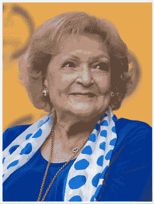

图 10.1：贝蒂·怀特图像

我们可以沿垂直或水平轴翻转图像：

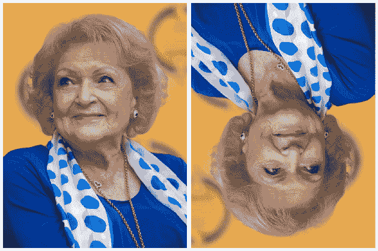

图 10.2：贝蒂·怀特图像 – 垂直翻转（左侧）和水平翻转（右侧）

旋转相当直观；注意背景中图像的自动填充：


图 10.3：贝蒂·怀特图像 – 顺时针旋转

我们还可以将图像裁剪到感兴趣的区域：

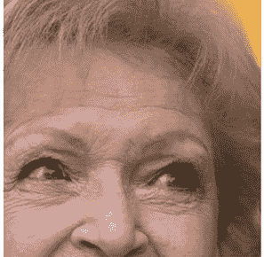

图 10.4：Betty White 图像 – 裁剪

在高层次上，我们可以这样说，增强可以以两种方式之一应用：

+   **离线**：这些通常用于较小的数据集（较少的图像或较小的尺寸，尽管“小”的定义取决于可用的硬件）。想法是在数据集预处理步骤中生成原始图像的修改版本，然后与“原始”图像一起使用。

+   **在线**：这些用于较大的数据集。增强后的图像不会保存到磁盘上；增强操作是在小批量中应用，并馈送到模型中。

在接下来的几节中，我们将为您概述两种最常用的图像数据集增强方法：内置的 Keras 功能和`albumentations`包。还有其他一些选项可供选择（`skimage`、OpenCV、`imgaug`、Augmentor、SOLT），但我们将重点关注最受欢迎的几种。

本章讨论的方法侧重于由 GPU 驱动的图像分析。**张量处理单元**（**TPUs**）的使用是一个新兴但仍然相对小众的应用。对图像增强与 TPU 驱动分析感兴趣的读者被鼓励查看 Chris Deotte（**@cdeotte**）的出色工作：

[`www.kaggle.com/cdeotte/triple-stratified-kfold-with-tfrecords`](https://www.kaggle.com/cdeotte/triple-stratified-kfold-with-tfrecords)

Chris 是一位四重 Kaggle 大师，也是一位出色的教育者，通过他创建的笔记本和参与的讨论；总的来说，任何 Kaggler 都值得关注的一个人，无论你的经验水平如何。

我们将使用来自*甘薯叶病分类*竞赛（[`www.kaggle.com/c/cassava-leaf-disease-classification`](https://www.kaggle.com/c/cassava-leaf-disease-classification)）的数据。像往常一样，我们首先进行基础工作：首先，加载必要的包：

```py
import os
import glob
import numpy as np
import scipy as sp
import pandas as pd
import cv2
from skimage.io import imshow, imread, imsave
# imgaug
import imageio
import imgaug as ia
import imgaug.augmenters as iaa
# Albumentations
import albumentations as A
# Keras
# from keras.preprocessing.image import ImageDataGenerator, array_to_img, img_to_array, load_img
# Visualization
import matplotlib.pyplot as plt
import matplotlib.image as mpimg
%matplotlib inline
import seaborn as sns
from IPython.display import HTML, Image
# Warnings
import warnings
warnings.filterwarnings("ignore") 
```

接下来，我们定义一些辅助函数，以便稍后简化演示。我们需要一种将图像加载到数组中的方法：

```py
def load_image(image_id):
    file_path = image_id 
    image = imread(Image_Data_Path + file_path)
    return image 
```

我们希望以画廊风格显示多张图像，因此我们创建了一个函数，该函数接受一个包含图像以及所需列数的数组作为输入，并将该数组重塑为具有给定列数的网格：

```py
def gallery(array, ncols=3):
    nindex, height, width, intensity = array.shape
    nrows = nindex//ncols
    assert nindex == nrows*ncols
    result = (array.reshape(nrows, ncols, height, width, intensity)
              .swapaxes(1,2)
              .reshape(height*nrows, width*ncols, intensity))
    return result 
```

在处理完模板后，我们可以加载用于增强的图像：

```py
data_dir = '../input/cassava-leaf-disease-classification/'
Image_Data_Path = data_dir + '/train_images/'
train_data = pd.read_csv(data_dir + '/train.csv')
# We load and store the first 10 images in memory for faster access
train_images = train_data["image_id"][:10].apply(load_image) 
```

让我们加载一张单独的图像，以便我们知道我们的参考是什么：

```py
curr_img = train_images[7]
plt.figure(figsize = (15,15))
plt.imshow(curr_img)
plt.axis('off') 
```

下面就是：

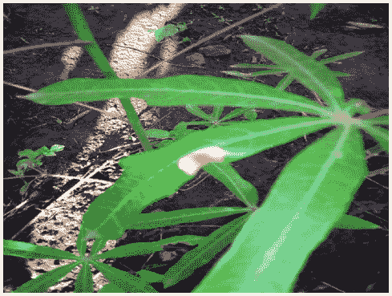

图 10.5：参考图像

在接下来的几节中，我们将演示如何使用内置的 Keras 功能和`albumentations`库从参考图像生成增强图像。

## Keras 内置增强

Keras 库具有内置的增强功能。虽然不如专用包那么全面，但它具有易于与代码集成的优势。我们不需要单独的代码块来定义增强变换，而可以将它们包含在 `ImageDataGenerator` 中，这是我们可能无论如何都会使用的一个功能。

我们首先检查的 Keras 方法是基于 `ImageDataGenerator` 类。正如其名所示，它可以用来生成带有实时数据增强的图像数据批次。

### ImageDataGenerator 方法

我们首先以以下方式实例化 `ImageDataGenerator` 类的对象：

```py
import tensorflow as tf
from tensorflow.keras.preprocessing.image import ImageDataGenerator,
array_to_img, img_to_array, load_img 
datagen = ImageDataGenerator( 
        rotation_range = 40, 
        shear_range = 0.2, 
        zoom_range = 0.2, 
        horizontal_flip = True, 
        brightness_range = (0.5, 1.5)) 
curr_img_array = img_to_array(curr_img)
curr_img_array = curr_img_array.reshape((1,) + curr_img_array.shape) 
```

我们将所需的增强作为 `ImageDataGenerator` 的参数。官方文档似乎没有涉及这个话题，但实际结果表明，增强是按照它们作为参数定义的顺序应用的。

在上面的例子中，我们只使用了可能选项的一个有限子集；对于完整的列表，建议读者查阅官方文档：[`keras.io/api/preprocessing/image/`](https://keras.io/api/preprocessing/image/).

接下来，我们使用 `ImageDataGenerator` 对象的 `.flow` 方法遍历图像。该类提供了三种不同的函数来将图像数据集加载到内存中并生成增强数据批次：

+   `flow`

+   `flow_from_directory`

+   `flow_from_dataframe`

它们都达到相同的目标，但在指定文件位置的方式上有所不同。在我们的例子中，图像已经存储在内存中，因此我们可以使用最简单的方法进行迭代：

```py
i = 0
for batch in datagen.flow(
    curr_img_array,
    batch_size=1,
    save_to_dir='.',
    save_prefix='Augmented_image',
    save_format='jpeg'):
    i += 1
    # Hard-coded stop - without it, the generator enters an infinite loop
    if i > 9: 
        break 
```

我们可以使用之前定义的辅助函数来检查增强图像：

```py
aug_images = []
for img_path in glob.glob("*.jpeg"):
    aug_images.append(mpimg.imread(img_path))
plt.figure(figsize=(20,20))
plt.axis('off')
plt.imshow(gallery(np.array(aug_images[0:9]), ncols = 3))
plt.title('Augmentation examples') 
```

这里是结果：

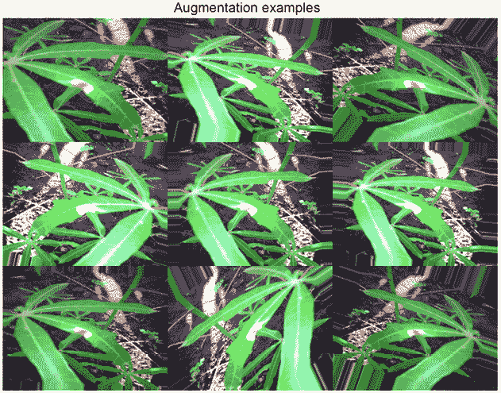

图 10.6：增强图像的集合

增强是一个非常有用的工具，但有效地使用它们需要做出判断。首先，显然是一个好主意可视化它们，以了解对数据的影响。一方面，我们希望引入一些数据变化以增加我们模型的一般化；另一方面，如果我们过于激进地改变图像，输入数据将变得不那么有信息量，模型的性能可能会受到影响。此外，选择使用哪些增强也可能具有问题特异性，正如我们通过比较不同的竞赛所看到的那样。

如果您查看上面的 *图 10.6*（来自 *Cassava Leaf Disease Classification* 竞赛的参考图像），我们应识别疾病的叶子可能具有不同的尺寸，指向不同的角度等，这既是因为植物的形状，也是因为图像拍摄方式的不同。这意味着垂直或水平翻转、裁剪和旋转等变换在这个上下文中都是有意义的。

相比之下，我们可以查看来自*Severstal：钢铁缺陷检测*竞赛的样本图像（[`www.kaggle.com/c/severstal-steel-defect-detection`](https://www.kaggle.com/c/severstal-steel-defect-detection)）。在这个竞赛中，参与者必须在钢板上定位和分类缺陷。所有图像都具有相同的大小和方向，这意味着旋转或裁剪会产生不真实的图像，增加了噪声，并对算法的泛化能力产生不利影响。

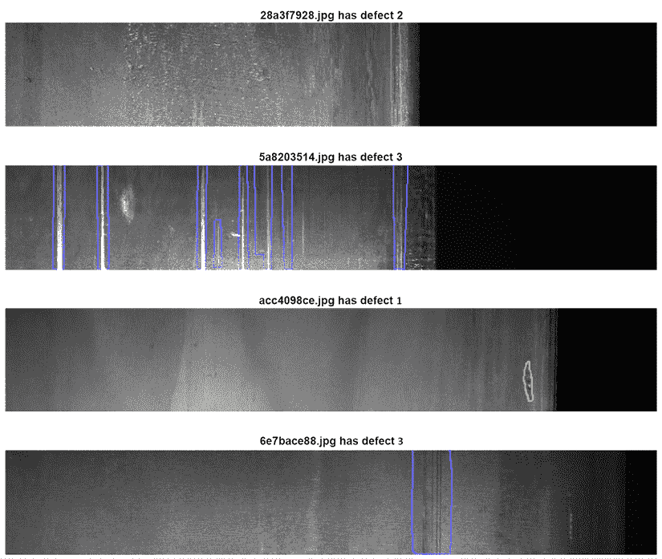

图 10.7：Severstal 竞赛的样本图像

### 预处理层

作为原生 Keras 中的预处理步骤的数据增强的另一种方法是使用`preprocessing`层 API。该功能非常灵活：这些管道可以与 Keras 模型结合使用或独立使用，类似于`ImageDataGenerator`。

下面我们简要说明如何设置预处理层。首先，导入：

```py
from tensorflow.keras.layers.experimental import preprocessing
from tensorflow.keras import layers 
```

我们以标准的 Keras 方式加载预训练模型：

```py
pretrained_base = tf.keras.models.load_model(
    '../input/cv-course-models/cv-course-models/vgg16-pretrained-base',
)
pretrained_base.trainable = False 
```

预处理层可以使用与其他层在`Sequential`构造函数内部使用相同的方式；唯一的要求是它们需要在我们的模型定义的开始处指定，在所有其他层之前：

```py
model = tf.keras.Sequential([
    # Preprocessing layers
    preprocessing.RandomFlip('horizontal'), # Flip left-to-right
    preprocessing.RandomContrast(0.5), # Contrast change by up to 50%
    # Base model
    pretrained_base,
    # model head definition 
    layers.Flatten(),
    layers.Dense(6, activation='relu'),
    layers.Dense(1, activation='sigmoid'),
]) 
```

## albumentations

`albumentations`软件包是一个快速图像增强库，它作为其他库的某种包装构建。

该软件包是经过在多个 Kaggle 竞赛中密集编码的结果（参见[`medium.com/@iglovikov/the-birth-of-albumentations-fe38c1411cb3`](https://medium.com/@iglovikov/the-birth-of-albumentations-fe38c1411cb3)），其核心开发者和贡献者中包括一些知名的 Kagglers，包括*尤金·赫维琴亚* ([`www.kaggle.com/bloodaxe`](https://www.kaggle.com/bloodaxe))、*弗拉基米尔·伊格洛维科夫* ([`www.kaggle.com/iglovikov`](https://www.kaggle.com/iglovikov))、*亚历克斯·帕里诺夫* ([`www.kaggle.com/creafz`](https://www.kaggle.com/creafz))和*ZFTurbo* ([`www.kaggle.com/zfturbo`](https://www.kaggle.com/zfturbo))。

完整的文档可以在[`albumentations.readthedocs.io/en/latest/`](https://albumentations.readthedocs.io/en/latest/)找到。

下面我们列出重要特性：

+   针对不同数据类型的统一 API

+   支持所有常见的计算机视觉任务

+   与 TensorFlow 和 PyTorch 的集成

使用`albumentations`功能转换图像非常简单。我们首先初始化所需的转换：

```py
import albumentations as A
horizontal_flip = A.HorizontalFlip(p=1)
rotate = A.ShiftScaleRotate(p=1)
gaus_noise = A.GaussNoise() 
bright_contrast = A.RandomBrightnessContrast(p=1) 
gamma = A.RandomGamma(p=1) 
blur = A.Blur() 
```

接下来，我们将转换应用于我们的参考图像：

```py
img_flip = horizontal_flip(image = curr_img)
img_gaus = gaus_noise(image = curr_img)
img_rotate = rotate(image = curr_img)
img_bc = bright_contrast(image = curr_img)
img_gamma = gamma(image = curr_img)
img_blur = blur(image = curr_img) 
```

我们可以通过`'image'`键访问增强图像并可视化结果：

```py
img_list = [img_flip['image'],img_gaus['image'], img_rotate['image'],
            img_bc['image'], img_gamma['image'], img_blur['image']]
plt.figure(figsize=(20,20))
plt.axis('off')
plt.imshow(gallery(np.array(img_list), ncols = 3))
plt.title('Augmentation examples') 
```

这里是我们的结果：

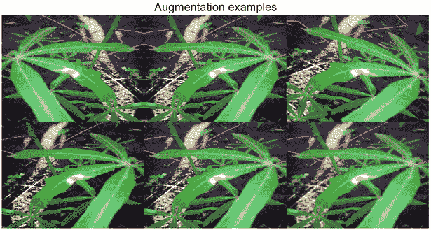

图 10.8：使用 albumentations 库增强的图像

在讨论了增强作为处理计算机视觉问题的一个关键预处理步骤之后，我们现在可以应用这一知识到以下章节中，从一个非常常见的任务开始：图像分类。


Chris Deotte

[`www.kaggle.com/cdeotte`](https://www.kaggle.com/cdeotte)

在我们继续之前，让我们回顾一下我们与 Chris Deotte 的简短对话，我们在本书中多次提到他（包括在本章的早期），这有很好的理由。他是四届 Kaggle 大师级选手，也是 NVIDIA 的高级数据科学家和研究员，于 2019 年加入 Kaggle。

您最喜欢的竞赛类型是什么？为什么？在技术和解决方法方面，您在 Kaggle 上的专长是什么？

*我喜欢与有趣数据相关的竞赛，以及需要构建创新新颖模型的竞赛。我的专长是分析训练好的模型，以确定它们的优点和缺点。之后，我喜欢改进模型和/或开发后处理来提升 CV LB。*

您是如何处理 Kaggle 竞赛的？这种处理方式与您日常工作的处理方式有何不同？

*我每次开始竞赛都会进行 EDA（探索性数据分析），创建本地验证，构建一些简单的模型，并将它们提交到 Kaggle 以获取排行榜分数。这有助于培养一种直觉，了解为了构建一个准确且具有竞争力的模型需要做什么。*

请告诉我们您参加的一个特别具有挑战性的竞赛，以及您用来应对任务的见解。

Kaggle 的 Shopee – 价格匹配保证*是一个具有挑战性的竞赛，需要图像模型和自然语言模型。一个关键的见解是从两种模型中提取嵌入，然后确定如何结合使用图像和语言信息来找到产品匹配。

Kaggle 是否帮助了您的职业生涯？如果是的话，是如何帮助的？

*是的。Kaggle 帮助我通过提高我的技能和增强我的简历的市场价值，成为 NVIDIA 的高级数据科学家。*

*许多雇主浏览 Kaggle 上的作品，以寻找具有特定技能的员工来帮助他们解决特定的项目。这样，我收到了许多工作机会的邀请。*

在您的经验中，经验不足的 Kagglers 通常忽略了什么？您现在知道什么，而您希望在最初开始时就了解的呢？

*在我看来，经验不足的 Kagglers 往往忽略了本地验证的重要性。看到自己的名字在排行榜上是很兴奋的。而且很容易专注于提高我们的排行榜分数，而不是交叉验证分数。*

在过去的竞赛中，您犯过哪些错误？

*很多时候，我犯了一个错误，就是过分相信我的排行榜分数，而不是交叉验证分数，从而选择了错误的最终提交。*

对于数据分析或机器学习，您会推荐使用哪些特定的工具或库？

*当然。在优化表格数据模型时，特征工程和快速实验非常重要。为了加速实验和验证的周期，使用 NVIDIA RAPIDS cuDF 和 cuML 在 GPU 上至关重要。*

当人们参加比赛时，他们应该记住或做最重要的事情是什么？

*最重要的是要享受乐趣并学习。不要担心你的最终排名。如果你专注于学习和享受乐趣，那么随着时间的推移，你的最终排名会越来越好。*

您是否使用其他比赛平台？它们与 Kaggle 相比如何？

*是的，我在 Kaggle 之外也参加过比赛。像 Booking.com 或 Twitter.com 这样的个别公司偶尔会举办比赛。这些比赛很有趣，涉及高质量的真实数据。*

# 分类

在本节中，我们将演示一个端到端流程，该流程可以用作处理图像分类问题的模板。我们将逐步介绍必要的步骤，从数据准备到模型设置和估计，再到结果可视化。除了提供信息（并且很酷）之外，这一最后步骤如果需要深入检查代码以更好地理解性能，也可以非常有用。

我们将继续使用来自*Cassava Leaf Disease Classification*比赛的数据（[`www.kaggle.com/c/cassava-leaf-disease-classification`](https://www.kaggle.com/c/cassava-leaf-disease-classification)）。

如往常一样，我们首先加载必要的库：

```py
import numpy as np
import pandas as pd
import matplotlib.pyplot as plt
import datetime
from sklearn.model_selection import train_test_split
from sklearn.metrics import accuracy_score
import tensorflow as tf
from tensorflow.keras import models, layers
from tensorflow.keras.preprocessing import image
from tensorflow.keras.preprocessing.image import ImageDataGenerator
from tensorflow.keras.callbacks import ModelCheckpoint, EarlyStopping, ReduceLROnPlateau
from tensorflow.keras.applications import EfficientNetB0
from tensorflow.keras.optimizers import Adam
import os, cv2, json
from PIL import Image 
```

通常，定义几个辅助函数是个好主意；它使得代码更容易阅读和调试。如果您正在处理一个通用的图像分类问题，2019 年由谷歌研究大脑团队在论文中引入的**EfficientNet**系列模型可以作为一个良好的起点（[`arxiv.org/abs/1905.11946`](https://arxiv.org/abs/1905.11946)）。基本思想是平衡网络深度、宽度和分辨率，以实现所有维度的更有效扩展，从而获得更好的性能。对于我们的解决方案，我们将使用该系列中最简单的成员，**EfficientNet B0**，这是一个具有 1100 万个可训练参数的移动尺寸网络。

对于 EfficientNet 网络的详细解释，您可以从[`ai.googleblog.com/2019/05/efficientnet-improving-accuracy-and.html`](https://ai.googleblog.com/2019/05/efficientnet-improving-accuracy-and.html)作为起点进行探索。

我们以 B0 为基础构建模型，随后是一个用于提高平移不变性的池化层和一个适合我们多类分类问题的激活函数的密集层：

```py
class CFG:    
    # config
    WORK_DIR = '../input/cassava-leaf-disease-classification'
    BATCH_SIZE = 8
    EPOCHS = 5
    TARGET_SIZE = 512
def create_model():
    conv_base = EfficientNetB0(include_top = False, weights = None,
                               input_shape = (CFG.TARGET_SIZE,
                               CFG.TARGET_SIZE, 3))
    model = conv_base.output
    model = layers.GlobalAveragePooling2D()(model)
    model = layers.Dense(5, activation = "softmax")(model)
    model = models.Model(conv_base.input, model)
    model.compile(optimizer = Adam(lr = 0.001),
                  loss = "sparse_categorical_crossentropy",
                  metrics = ["acc"])
    return model 
```

关于我们传递给`EfficientNetB0`函数的参数的一些简要说明：

+   `include_top` 参数允许你决定是否包含最终的密集层。由于我们想将预训练模型用作特征提取器，默认策略将是跳过它们，然后自己定义头部。

+   如果我们想从头开始训练模型，可以将 `weights` 设置为 `None`，或者如果我们要利用在大图像集合上预训练的权重，可以设置为 `'imagenet'` 或 `'noisy-student'`。

下面的辅助函数允许我们可视化激活层，这样我们可以从视觉角度检查网络性能。这在开发一个在透明度方面臭名昭著的领域的直觉时非常有帮助：

```py
def activation_layer_vis(img, activation_layer = 0, layers = 10):
    layer_outputs = [layer.output for layer in model.layers[:layers]]
    activation_model = models.Model(inputs = model.input,
                                    outputs = layer_outputs)
    activations = activation_model.predict(img)

    rows = int(activations[activation_layer].shape[3] / 3)
    cols = int(activations[activation_layer].shape[3] / rows)
    fig, axes = plt.subplots(rows, cols, figsize = (15, 15 * cols))
    axes = axes.flatten()

    for i, ax in zip(range(activations[activation_layer].shape[3]), axes):
        ax.matshow(activations[activation_layer][0, :, :, i],
                   cmap = 'viridis')
        ax.axis('off')
    plt.tight_layout()
    plt.show() 
```

我们通过为给定的模型创建基于“受限”模型的预测来生成激活，换句话说，使用整个架构直到倒数第二层；这是到 `activations` 变量的代码。函数的其余部分确保我们展示正确的激活布局，对应于适当卷积层中过滤器的形状。

接下来，我们处理标签并设置验证方案；数据中没有特殊结构（例如，时间维度或类别间的重叠），因此我们可以使用简单的随机分割：

```py
train_labels = pd.read_csv(os.path.join(CFG.WORK_DIR, "train.csv"))
STEPS_PER_EPOCH = len(train_labels)*0.8 / CFG.BATCH_SIZE
VALIDATION_STEPS = len(train_labels)*0.2 / CFG.BATCH_SIZE 
```

若想了解更多详细的验证方案，请参阅 *第六章*，*设计良好的验证*。

我们现在可以设置数据生成器，这对于我们的基于 TF 的算法循环图像数据是必要的。

首先，我们实例化两个 `ImageDataGenerator` 对象；这是当我们引入图像增强的时候。为了演示目的，我们将使用 Keras 内置的增强。之后，我们使用 `flow_from_dataframe()` 方法创建生成器，该方法用于生成具有实时数据增强的批处理张量图像数据：

```py
train_labels.label = train_labels.label.astype('str')
train_datagen = ImageDataGenerator(
    validation_split = 0.2, preprocessing_function = None,
        rotation_range = 45, zoom_range = 0.2,
        horizontal_flip = True, vertical_flip = True,
        fill_mode = 'nearest', shear_range = 0.1,
        height_shift_range = 0.1, width_shift_range = 0.1)
train_generator = train_datagen.flow_from_dataframe(
    train_labels, 
    directory = os.path.join(CFG.WORK_DIR, "train_images"),
    subset = "training", 
    x_col = "image_id",y_col = "label", 
    target_size = (CFG.TARGET_SIZE, CFG.TARGET_SIZE),
    batch_size = CFG.BATCH_SIZE, 
    class_mode = "sparse")
validation_datagen = ImageDataGenerator(validation_split = 0.2)
validation_generator = validation_datagen.flow_from_dataframe(
        train_labels,
        directory = os.path.join(CFG.WORK_DIR, "train_images"),
        subset = "validation", 
        x_col = "image_id",y_col = "label", 
        target_size = (CFG.TARGET_SIZE, CFG.TARGET_SIZE),
        batch_size = CFG.BATCH_SIZE, class_mode = "sparse") 
```

在指定了数据结构之后，我们可以创建模型：

```py
model = create_model()
model.summary() 
```

当我们的模型创建完成后，我们可以快速查看一个摘要。这主要用于检查，因为除非你有 photographic memory，否则你不太可能记住像 EffNetB0 这样复杂模型的层组成批次。在实践中，你可以使用摘要来检查输出过滤器的维度是否正确，或者参数计数（可训练的/不可训练的）是否符合预期。为了简洁起见，我们只展示了输出下面的前几行；检查 B0 的架构图将给你一个完整输出将有多长的概念。

```py
Model: "functional_1"
__________________________________________________________________________
Layer (type)                  Output Shape         Param # Connected to
==========================================================================
input_1 (InputLayer)          [(None, 512, 512, 3) 0
__________________________________________________________________________
rescaling (Rescaling)         (None, 512, 512, 3)  0       input_1[0][0]
__________________________________________________________________________
normalization (Normalization) (None, 512, 512, 3)  7       rescaling[0][0]
___________________________________________________________________________
stem_conv_pad (ZeroPadding2D) (None, 513, 513, 3)  0       normalization[0][0]
___________________________________________________________________________
stem_conv (Conv2D)              (None, 256, 256, 32) 864    stem_conv_pad[0][0]
___________________________________________________________________________
stem_bn (BatchNormalization)    (None, 256, 256, 32) 128    stem_conv[0][0]
___________________________________________________________________________
stem_activation (Activation)    (None, 256, 256, 32) 0      stem_bn[0][0]
___________________________________________________________________________
block1a_dwconv (DepthwiseConv2D (None, 256, 256, 32) 288    stem_activation[0][0]
___________________________________________________________________________
block1a_bn (BatchNormalization) (None, 256, 256, 32) 128    block1a_dwconv[0][0]
___________________________________________________________________________ 
```

在完成上述步骤后，我们可以继续拟合模型。在这一步中，我们还可以非常方便地定义回调。第一个是 `ModelCheckpoint`：

```py
model_save = ModelCheckpoint('./EffNetB0_512_8_best_weights.h5', 
                             save_best_only = True, 
                             save_weights_only = True,
                             monitor = 'val_loss', 
                             mode = 'min', verbose = 1) 
```

检查点使用了一些值得详细说明的参数：

+   通过设置 `save_best_only = True`，我们可以保留最佳模型权重集。

+   我们通过只保留权重而不是完整的优化器状态来减小模型的大小。

+   我们通过找到验证损失的最低点来决定哪个模型是最优的。

接下来，我们使用防止过拟合的流行方法之一，**早期停止**。我们监控模型在保留集上的性能，如果给定数量的 epoch 内指标不再提升，则停止算法，在这个例子中是`5`：

```py
early_stop = EarlyStopping(monitor = 'val_loss', min_delta = 0.001,
                           patience = 5, mode = 'min',
                           verbose = 1, restore_best_weights = True) 
```

`ReduceLROnPlateau`回调监控保留集上的损失，如果在`patience`数量的 epoch 内没有看到改进，则降低学习率，在这个例子中是通过 0.3 的因子降低。虽然这不是万能的解决方案，但它可以经常帮助收敛：

```py
reduce_lr = ReduceLROnPlateau(monitor = 'val_loss', factor = 0.3, 
                              patience = 2, min_delta = 0.001, 
                              mode = 'min', verbose = 1) 
```

我们现在准备好拟合模型：

```py
history = model.fit(
    train_generator,
    steps_per_epoch = STEPS_PER_EPOCH,
    epochs = CFG.EPOCHS,
    validation_data = validation_generator,
    validation_steps = VALIDATION_STEPS,
    callbacks = [model_save, early_stop, reduce_lr]
) 
```

我们将简要解释我们之前没有遇到的两个参数：

+   训练生成器在每个训练 epoch 中产生`steps_per_epoch`批次的批次。

+   当 epoch 结束时，验证生成器产生`validation_steps`批次的批次。

在调用`model.fit()`之后的一个示例输出如下：

```py
Epoch 00001: val_loss improved from inf to 0.57514, saving model to ./EffNetB0_512_8_best_weights.h5 
```

模型拟合后，我们可以使用我们在开头编写的辅助函数检查样本图像上的激活。虽然这对于模型的成功执行不是必需的，但它可以帮助确定我们的模型在应用顶部的分类层之前提取了哪些类型的特征：

```py
activation_layer_vis(img_tensor, 0) 
```

这是我们可能会看到的情况：

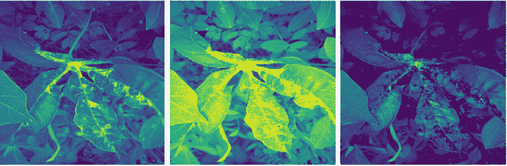

图 10.9：拟合模型的样本激活

我们可以使用`model.predict()`生成预测：

```py
ss = pd.read_csv(os.path.join(CFG.WORK_DIR, "sample_submission.csv"))
preds = []
for image_id in ss.image_id:
    image = Image.open(os.path.join(CFG.WORK_DIR,  "test_images",
                                    image_id))
    image = image.resize((CFG.TARGET_SIZE, CFG.TARGET_SIZE))
    image = np.expand_dims(image, axis = 0)
    preds.append(np.argmax(model.predict(image)))
ss['label'] = preds 
```

我们通过遍历图像列表来构建预测。对于每一张图像，我们将图像重塑到所需的维度，并选择具有最强信号的通道（模型预测类别概率，我们通过`argmax`选择最大的一个）。最终的预测是类别编号，与竞赛中使用的指标一致。

我们现在已经演示了一个用于图像分类的最小化端到端流程。当然，许多改进都是可能的——例如，更多的增强、更大的架构、回调定制——但基本模板应该为你提供一个良好的起点。

我们现在继续讨论计算机视觉中的第二个流行问题：目标检测。

# 目标检测

**目标检测**是计算机视觉/图像处理任务，我们需要在图像或视频中识别特定类别的语义对象实例。在前面章节讨论的分类问题中，我们只需要为每个图像分配一个类别，而在目标检测任务中，我们希望在感兴趣的对象周围绘制一个**边界框**来定位它。

在本节中，我们将使用来自 *全球小麦检测* 竞赛的数据（[`www.kaggle.com/c/global-wheat-detection`](https://www.kaggle.com/c/global-wheat-detection)）。在这个竞赛中，参与者必须检测小麦穗，即植物顶部含有谷物的穗状物。在植物图像中检测这些穗状物用于估计不同作物品种中小麦穗的大小和密度。我们将展示如何使用 **Yolov5**，一个在目标检测中建立已久的模型，并在 2021 年底之前是最先进的模型，直到它（基于初步结果）被 YoloX 架构超越，来训练一个解决此问题的模型。Yolov5 在竞赛中产生了极具竞争力的结果，尽管由于许可问题最终被组织者禁止使用，但它非常适合本演示的目的。

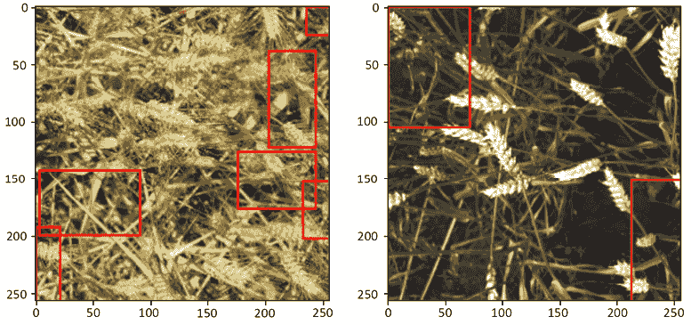

图 10.10：检测到的小麦穗的样本图像可视化

在我们开始之前，有一个重要的问题需要提及，那就是边界框注释的不同格式；有不同（但数学上等价）的方式来描述矩形的坐标。

最常见的类型是 coco、voc-pascal 和 yolo。它们之间的区别可以从下面的图中清楚地看出：

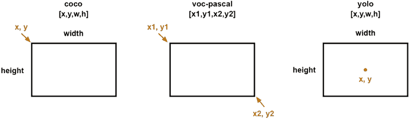

图 10.11：边界框的注释格式

我们还需要定义的一个部分是网格结构：Yolo 通过在图像上放置一个网格并检查是否有感兴趣的对象（在我们的例子中是小麦穗）存在于任何单元格中来检测对象。边界框被重新塑形以在图像的相关单元格内偏移，并且 *(x, y, w, h)* 参数被缩放到单位区间：


图 10.12：Yolo 注释定位

我们首先加载训练数据的注释：

```py
df = pd.read_csv('../input/global-wheat-detection/train.csv')
df.head(3) 
```

让我们检查几个：

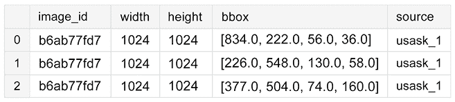

图 10.13：带有注释的训练数据

我们从 `bbox` 列中提取边界框的实际坐标：

```py
bboxs = np.stack(df['bbox'].apply(lambda x: np.fromstring(x[1:-1],
                                  sep=',')))
bboxs 
```

让我们看看这个数组：

```py
array([[834., 222.,  56.,  36.],
       [226., 548., 130.,  58.],
       [377., 504.,  74., 160.],
       ...,
       [134., 228., 141.,  71.],
       [430.,  13., 184.,  79.],
       [875., 740.,  94.,  61.]]) 
```

下一步是从 Yolo 格式中提取坐标到单独的列：

```py
for i, column in enumerate(['x', 'y', 'w', 'h']):
    df[column] = bboxs[:,i]
df.drop(columns=['bbox'], inplace=True)
df['x_center'] = df['x'] + df['w']/2
df['y_center'] = df['y'] + df['h']/2
df['classes'] = 0
df = df[['image_id','x', 'y', 'w', 'h','x_center','y_center','classes']]
df.head(3) 
```

Ultralytics 的实现对数据集的结构有一些要求，特别是注释存储的位置以及训练/验证数据的文件夹。

以下代码中文件夹的创建相当简单，但鼓励更好奇的读者查阅官方文档（[`github.com/ultralytics/yolov5/wiki/Train-Custom-Data`](https://github.com/ultralytics/yolov5/wiki/Train-Custom-Data)）：

```py
# stratify on source
source = 'train'
# Pick a single fold for demonstration's sake
fold = 0 
val_index = set(df[df['fold'] == fold]['image_id'])
# Loop through the bounding boxes per image
for name,mini in tqdm(df.groupby('image_id')):
    # Where to save the files
    if name in val_index:
        path2save = 'valid/'
    else:
        path2save = 'train/'   
    # Storage path for labels
    if not os.path.exists('convertor/fold{}/labels/'.
                          format(fold)+path2save):
        os.makedirs('convertor/fold{}/labels/'.format(fold)+path2save)
    with open('convertor/fold{}/labels/'.format(fold)+path2save+name+".
              txt", 'w+') as f:
   # Normalize the coordinates in accordance with the Yolo format requirements
        row = mini[['classes','x_center','y_center','w','h']].
        astype(float).values
        row = row/1024
        row = row.astype(str)
        for j in range(len(row)):
            text = ' '.join(row[j])
            f.write(text)
            f.write("\n")
    if not os.path.exists('convertor/fold{}/images/{}'.
                          format(fold,path2save)):
        os.makedirs('convertor/fold{}/images/{}'.format(fold,path2save))
    # No preprocessing needed for images => copy them as a batch
    sh.copy("../input/global-wheat-detection/{}/{}.jpg".
            format(source,name),
            'convertor/fold{}/images/{}/{}.jpg'.
            format(fold,path2save,name)) 
```

我们接下来要做的是安装 Yolo 包本身。如果你在 Kaggle Notebook 或 Colab 中运行此代码，请确保已启用 GPU；实际上，即使没有 GPU，Yolo 的安装也可以工作，但你可能会因为 CPU 与 GPU 性能差异而遇到各种超时和内存问题。

```py
!git clone https://github.com/ultralytics/yolov5  && cd yolov5 &&
pip install -r requirements.txt 
```

我们省略了输出，因为它相当广泛。最后需要准备的是 YAML 配置文件，其中我们指定训练和验证数据的位置以及类别数。我们只对检测麦穗感兴趣，而不是区分不同类型，所以我们有一个类别（其名称仅用于符号一致性，在这种情况下可以是任意字符串）：

```py
yaml_text = """train: /kaggle/working/convertor/fold0/images/train/
            val: /kaggle/working/convertor/fold0/images/valid/
            nc: 1
            names: ['wheat']"""
with open("wheat.yaml", 'w') as f:
    f.write(yaml_text)
%cat wheat.yaml 
```

有了这些，我们就可以开始训练我们的模型：

```py
!python ./yolov5/train.py --img 512 --batch 2 --epochs 3 --workers 2 --data wheat.yaml --cfg "./yolov5/models/yolov5s.yaml" --name yolov5x_fold0 --cache 
```

除非您习惯于从命令行启动事物，否则上述咒语肯定是晦涩难懂的，因此让我们详细讨论其组成：

+   `train.py` 是用于从预训练权重开始训练 YoloV5 模型的主脚本。

+   `--img 512` 表示我们希望原始图像（如您所见，我们没有以任何方式预处理）被缩放到 512x512。为了获得有竞争力的结果，您应该使用更高的分辨率，但此代码是在 Kaggle 笔记本中执行的，它对资源有一定的限制。

+   `--batch` 指的是训练过程中的批量大小。

+   `--epochs 3` 表示我们希望训练模型三个周期。

+   `--workers 2` 指定数据加载器中的工作线程数。增加此数字可能会帮助性能，但在版本 6.0（截至本文写作时在 Kaggle Docker 图像中可用的最新版本）中存在已知错误，当工作线程数过高时，即使在有更多可用资源的机器上也是如此。

+   `--data wheat.yaml` 是指向我们上面定义的数据规范 YAML 文件的文件。

+   `--cfg "./yolov5/models/yolov5s.yaml"` 指定模型架构和用于初始化的相应权重集。您可以使用与安装提供的版本（请参阅官方文档以获取详细信息），或者您可以自定义自己的并保持它们以相同的 `.yaml` 格式。

+   `--name` 指定结果模型要存储的位置。

我们将以下训练命令的输出分解。首先，基础工作：

```py
Downloading the pretrained weights, setting up Weights&Biases https://wandb.ai/site integration, GitHub sanity check.
Downloading https://ultralytics.com/assets/Arial.ttf to /root/.config/Ultralytics/Arial.ttf...
wandb: (1) Create a W&B account
wandb: (2) Use an existing W&B account
wandb: (3) Don't visualize my results
wandb: Enter your choice: (30 second timeout) 
wandb: W&B disabled due to login timeout.
train: weights=yolov5/yolov5s.pt, cfg=./yolov5/models/yolov5s.yaml, data=wheat.yaml, hyp=yolov5/data/hyps/hyp.scratch-low.yaml, epochs=3, batch_size=2, imgsz=512, rect=False, resume=False, nosave=False, noval=False, noautoanchor=False, evolve=None, bucket=, cache=ram, image_weights=False, device=, multi_scale=False, single_cls=False, optimizer=SGD, sync_bn=False, workers=2, project=yolov5/runs/train, name=yolov5x_fold0, exist_ok=False, quad=False, cos_lr=False, label_smoothing=0.0, patience=100, freeze=[0], save_period=-1, local_rank=-1, entity=None, upload_dataset=False, bbox_interval=-1, artifact_alias=latest
github: up to date with https://github.com/ultralytics/yolov5 
YOLOv5  v6.1-76-gc94736a torch 1.9.1 CUDA:0 (Tesla P100-PCIE-16GB, 16281MiB)
hyperparameters: lr0=0.01, lrf=0.01, momentum=0.937, weight_decay=0.0005, warmup_epochs=3.0, warmup_momentum=0.8, warmup_bias_lr=0.1, box=0.05, cls=0.5, cls_pw=1.0, obj=1.0, obj_pw=1.0, iou_t=0.2, anchor_t=4.0, fl_gamma=0.0, hsv_h=0.015, hsv_s=0.7, hsv_v=0.4, degrees=0.0, translate=0.1, scale=0.5, shear=0.0, perspective=0.0, flipud=0.0, fliplr=0.5, mosaic=1.0, mixup=0.0, copy_paste=0.0
Weights & Biases: run 'pip install wandb' to automatically track and visualize YOLOv5  runs (RECOMMENDED)
TensorBoard: Start with 'tensorboard --logdir yolov5/runs/train', view at http://localhost:6006/
Downloading https://github.com/ultralytics/yolov5/releases/download/v6.1/yolov5s.pt to yolov5/yolov5s.pt...
100%|██████████████████████████████████████| 14.1M/14.1M [00:00<00:00, 40.7MB/s] 
```

然后是模型。我们看到架构的摘要、优化器设置和使用的增强：

```py
Overriding model.yaml nc=80 with nc=1
                 from  n    params  module                                  arguments
  0                -1  1    3520  models.common.Conv                      [3, 32, 6, 2, 2]
  1                -1  1    18560  models.common.Conv                      [32, 64, 3, 2]
  2                -1  1    18816  models.common.C3                        [64, 64, 1]
  3                -1  1    73984  models.common.Conv                      [64, 128, 3, 2]
  4                -1  2    115712  models.common.C3                        [128, 128, 2]
  5                -1  1    295424  models.common.Conv                      [128, 256, 3, 2]
  6                -1  3    625152  models.common.C3                        [256, 256, 3]
  7                -1  1   1180672  models.common.Conv                      [256, 512, 3, 2]
  8                -1  1   1182720  models.common.C3                        [512, 512, 1]
  9                -1  1    656896  models.common.SPPF                      [512, 512, 5]
 10                -1  1    131584  models.common.Conv                      [512, 256, 1, 1]
 11                -1  1         0  torch.nn.modules.upsampling.Upsample    [None, 2, 'nearest']
 12           [-1, 6]  1         0  models.common.Concat                    [1]
 13                -1  1    361984  models.common.C3                        [512, 256, 1, False]
 14                -1  1     33024  models.common.Conv                      [256, 128, 1, 1]
 15                -1  1         0  torch.nn.modules.upsampling.Upsample    [None, 2, 'nearest']
 16           [-1, 4]  1         0  models.common.Concat                    [1]
 17                -1  1     90880  models.common.C3                        [256, 128, 1, False]
 18                -1  1    147712  models.common.Conv                      [128, 128, 3, 2]
 19          [-1, 14]  1         0  models.common.Concat                    [1]
 20                -1  1    296448  models.common.C3                        [256, 256, 1, False]
 21                -1  1    590336  models.common.Conv                      [256, 256, 3, 2]
 22          [-1, 10]  1         0  models.common.Concat                    [1]
 23                -1  1   1182720  models.common.C3                        [512, 512, 1, False]
 24      [17, 20, 23]  1     16182  models.yolo.Detect                      [1, [[10, 13, 16, 30, 33, 23], [30, 61, 62, 45, 59, 119], [116, 90, 156, 198, 373, 326]], [128, 256, 512]]
YOLOv5s summary: 270 layers, 7022326 parameters, 7022326 gradients, 15.8 GFLOPs
Transferred 342/349 items from yolov5/yolov5s.pt
Scaled weight_decay = 0.0005
optimizer: SGD with parameter groups 57 weight (no decay), 60 weight, 60 bias
albumentations: Blur(always_apply=False, p=0.01, blur_limit=(3, 7)), MedianBlur(always_apply=False, p=0.01, blur_limit=(3, 7)), ToGray(always_apply=False, p=0.01), CLAHE(always_apply=False, p=0.01, clip_limit=(1, 4.0), tile_grid_size=(8, 8))
train: Scanning '/kaggle/working/convertor/fold0/labels/train' images and labels
train: New cache created: /kaggle/working/convertor/fold0/labels/train.cache
train: Caching images (0.0GB ram): 100%|██████████| 51/51 00:00<00:00, 76.00it/
val: Scanning '/kaggle/working/convertor/fold0/labels/valid' images and labels..
val: New cache created: /kaggle/working/convertor/fold0/labels/valid.cache
val: Caching images (2.6GB ram): 100%|██████████| 3322/3322 [00:47<00:00, 70.51i
Plotting labels to yolov5/runs/train/yolov5x_fold0/labels.jpg... 
AutoAnchor: 6.00 anchors/target, 0.997 Best Possible Recall (BPR). Current anchors are a good fit to dataset ![Image sizes 512 train, 512 valUsing 2 dataloader workers ```这后面是实际的训练日志：```pyStarting training for 3 epochs...     Epoch   gpu_mem       box       obj       cls    labels  img_size       0/2    0.371G    0.1196   0.05478         0        14       512: 100%|███               Class     Images     Labels          P          R     mAP@.5 mAP@WARNING: NMS time limit 0.120s exceeded               Class     Images     Labels          P          R     mAP@.5 mAP@                 all       3322     147409    0.00774     0.0523    0.00437   0.000952     Epoch   gpu_mem       box       obj       cls    labels  img_size       1/2    0.474G    0.1176   0.05625         0         5       512: 100%|███               Class     Images     Labels          P          R     mAP@.5 mAP@WARNING: NMS time limit 0.120s exceeded               Class     Images     Labels          P          R     mAP@.5 mAP@WARNING: NMS time limit 0.120s exceeded               Class     Images     Labels          P          R     mAP@.5 mAP@                 all       3322     147409    0.00914     0.0618    0.00493    0.00108     Epoch   gpu_mem       box       obj       cls    labels  img_size       2/2    0.474G    0.1146   0.06308         0        12       512: 100%|███               Class     Images     Labels          P          R     mAP@.5 mAP@                 all       3322     147409    0.00997     0.0674    0.00558    0.001233 epochs completed in 0.073 hours.Optimizer stripped from yolov5/runs/train/yolov5x_fold0/weights/last.pt, 14.4MBOptimizer stripped from yolov5/runs/train/yolov5x_fold0/weights/best.pt, 14.4MBValidating yolov5/runs/train/yolov5x_fold0/weights/best.pt...Fusing layers... YOLOv5s summary: 213 layers, 7012822 parameters, 0 gradients, 15.8 GFLOPs               Class     Images     Labels          P          R     mAP@.5 mAP@WARNING: NMS time limit 0.120s exceeded               Class     Images     Labels          P          R     mAP@.5 mAP@WARNING: NMS time limit 0.120s exceeded               Class     Images     Labels          P          R     mAP@.5 mAP@WARNING: NMS time limit 0.120s exceeded               Class     Images     Labels          P          R     mAP@.5 mAP@WARNING: NMS time limit 0.120s exceeded               Class     Images     Labels          P          R     mAP@.5 mAP@WARNING: NMS time limit 0.120s exceeded               Class     Images     Labels          P          R     mAP@.5 mAP@WARNING: NMS time limit 0.120s exceeded               Class     Images     Labels          P          R     mAP@.5 mAP@WARNING: NMS time limit 0.120s exceeded               Class     Images     Labels          P          R     mAP@.5 mAP@WARNING: NMS time limit 0.120s exceeded               Class     Images     Labels          P          R     mAP@.5 mAP@WARNING: NMS time limit 0.120s exceeded               Class     Images     Labels          P          R     mAP@.5 mAP@WARNING: NMS time limit 0.120s exceeded               Class     Images     Labels          P          R     mAP@.5 mAP@                 all       3322     147409    0.00997     0.0673    0.00556    0.00122Results saved to yolov5/runs/train/yolov5x_fold0 ```训练和验证阶段的结果都可以进行检查；它们存储在 `yolov5` 文件夹下的 `./yolov5/runs/train/yolov5x_fold0`：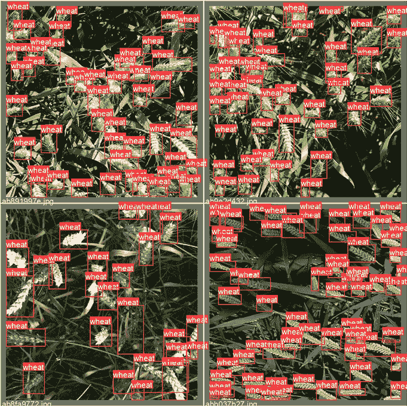

图 10.14：带有注释的验证数据

一旦我们训练了模型，我们可以使用表现最佳模型的权重（Yolov5 有一个很酷的功能，可以自动保留最佳和最后一个周期的模型，将它们存储为 `best.pt` 和 `last.pt`）来生成测试数据上的预测：

```py
!python ./yolov5/detect.py --weights ./yolov5/runs/train/yolov5x_fold0/weights/best.pt --img 512 --conf 0.1 --source /kaggle/input/global-wheat-detection/test --save-txt --save-conf --exist-ok 
```

我们将讨论特定于推理阶段的参数：

+   `--weights` 指向我们上面训练的模型中最佳权重的位置。

+   `--conf 0.1`指定模型生成的候选边界框中哪些应该被保留。通常，这是一个在精确度和召回率之间的折衷（太低的阈值会导致大量误报，而将阈值调得太高则可能根本找不到任何麦穗头）。

+   `--source`是测试数据的位置。

为我们的测试图像创建的标签可以在本地进行检查：

```py
!ls ./yolov5/runs/detect/exp/labels/ 
```

这是我们可能会看到的内容：

```py
2fd875eaa.txt  53f253011.txt  aac893a91.txt  f5a1f0358.txt
348a992bb.txt  796707dd7.txt  cc3532ff6.txt 
```

让我们看看一个单独的预测：

```py
!cat 2fd875eaa.txt 
```

它具有以下格式：

```py
0 0.527832 0.580566 0.202148 0.838867 0.101574
0 0.894531 0.587891 0.210938 0.316406 0.113519 
```

这意味着在图像`2fd875eaa`中，我们的训练模型检测到了两个边界框（它们的坐标是行中的 2-5 项），并在行末给出了大于 0.1 的置信度分数。

我们如何将预测组合成所需格式的提交？我们首先定义一个辅助函数，帮助我们将坐标从 yolo 格式转换为 coco（如本竞赛所需）：这是一个简单的顺序重排和通过乘以图像大小来归一化到原始值范围的问题：

```py
def convert(s):
    x = int(1024 * (s[1] - s[3]/2))
    y = int(1024 * (s[2] - s[4]/2))
    w = int(1024 * s[3])
    h = int(1024 * s[4])

    return(str(s[5]) + ' ' + str(x) + ' ' + str(y) + ' ' + str(w)
           + ' ' + str(h)) 
```

然后，我们继续生成一个提交文件：

1.  我们遍历上述列出的文件。

1.  对于每个文件，所有行都被转换为所需格式的字符串（一行代表一个检测到的边界框）。

1.  这些行随后被连接成一个字符串，对应于这个文件。

代码如下：

```py
with open('submission.csv', 'w') as myfile:
    # Prepare submission
    wfolder = './yolov5/runs/detect/exp/labels/'
    for f in os.listdir(wfolder):
        fname = wfolder + f
        xdat = pd.read_csv(fname, sep = ' ', header = None)
        outline = f[:-4] + ' ' + ' '.join(list(xdat.apply(lambda s:
                                     convert(s), axis = 1)))
        myfile.write(outline + '\n')

myfile.close() 
```

让我们看看它的样子：

```py
!cat submission.csv 
```

```py
53f253011 0.100472 61 669 961 57 0.106223 0 125 234 183 0.1082 96 696 928 126 0.108863 515 393 86 161 0.11459 31 0 167 209 0.120246 517 466 89 147
aac893a91 0.108037 376 435 325 188
796707dd7 0.235373 684 128 234 113
cc3532ff6 0.100443 406 752 144 108 0.102479 405 87 4 89 0.107173 576 537 138 94 0.113459 256 498 179 211 0.114847 836 618 186 65 0.121121 154 544 248 115 0.125105 40 567 483 199
2fd875eaa 0.101398 439 163 204 860 0.112546 807 440 216 323
348a992bb 0.100572 0 10 440 298 0.101236 344 445 401 211
f5a1f0358 0.102549 398 424 295 96 
```

生成的`submission.csv`文件完成了我们的流程。

在本节中，我们展示了如何使用 YoloV5 解决目标检测问题：如何处理不同格式的注释，如何为特定任务定制模型，训练它，并评估结果。

基于这些知识，你应该能够开始处理目标检测问题。

现在我们转向计算机视觉任务中的第三大流行类别：语义分割。

# 语义分割

考虑到**分割**，最简单的方式是它将图像中的每个像素分类，将其分配给相应的类别；这些像素组合在一起形成感兴趣的区域，例如医学图像中器官上的病变区域。相比之下，目标检测（在上一节中讨论）将图像的片段分类到不同的对象类别，并在它们周围创建边界框。

我们将使用来自*Sartorius – Cell Instance Segmentation*竞赛（[`www.kaggle.com/c/sartorius-cell-instance-segmentation`](https://www.kaggle.com/c/sartorius-cell-instance-segmentation)）的数据展示建模方法。在这个竞赛中，参与者被要求使用一组显微镜图像训练用于神经细胞实例分割的模型。

我们将围绕**Detectron2**构建解决方案，这是一个由 Facebook AI Research 创建的库，支持多种检测和分割算法。

Detectron2 是原始 Detectron 库 ([`github.com/facebookresearch/Detectron/`](https://github.com/facebookresearch/Detectron/)) 和 Mask R-CNN 项目 ([`github.com/facebookresearch/maskrcnn-benchmark/`](https://github.com/facebookresearch/maskrcnn-benchmark/)) 的继任者。

我们首先安装额外的包：

```py
!pip install pycocotools
!pip install 'git+https://github.com/facebookresearch/detectron2.git' 
```

我们安装 `pycocotools` ([`github.com/cocodataset/cocoapi/tree/master/PythonAPI/pycocotools`](https://github.com/cocodataset/cocoapi/tree/master/PythonAPI/pycocotools))，这是我们格式化注释和 Detectron2（我们在这个任务中的工作马）所需的，以及 Detectron2 ([`github.com/facebookresearch/detectron2`](https://github.com/facebookresearch/detectron2))。

在我们能够训练我们的模型之前，我们需要做一些准备工作：注释需要从组织者提供的 **run-length encoding** (**RLE**) 格式转换为 Detectron2 所需的 COCO 格式。RLE 的基本思想是节省空间：创建一个分割意味着以某种方式标记一组像素。由于图像可以被视为一个数组，这个区域可以用一系列直线（行或列方向）表示。

您可以通过列出索引或指定起始位置和后续连续块长度来编码每一行。下面给出了一个视觉示例：

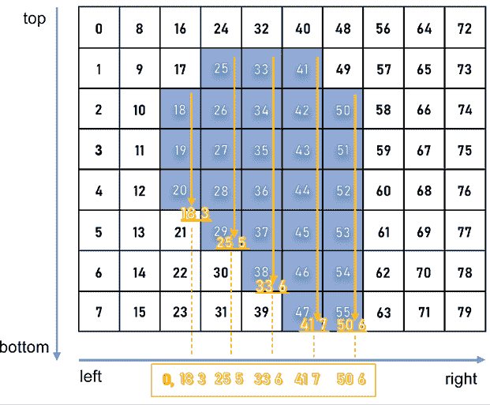

图 10.15：RLE 的视觉表示

微软的 **Common Objects in Context** (**COCO**) 格式是一种特定的 JSON 结构，它规定了图像数据集中标签和元数据的保存方式。下面，我们演示如何将 RLE 转换为 COCO 并与 *k*-fold 验证分割结合，以便为每个分割获得所需的训练/验证 JSON 文件对。

让我们从这里开始：

```py
# from pycocotools.coco import COCO
import skimage.io as io
import matplotlib.pyplot as plt
from pathlib import Path
from PIL import Image
import pandas as pd
import numpy as np
from tqdm.notebook import tqdm
import json,itertools
from sklearn.model_selection import GroupKFold
# Config
class CFG:
    data_path = '../input/sartorius-cell-instance-segmentation/'
    nfolds = 5 
```

我们需要三个函数将 RLE 转换为 COCO。首先，我们需要将 RLE 转换为二值掩码：

```py
# From https://www.kaggle.com/stainsby/fast-tested-rle
def rle_decode(mask_rle, shape):
    '''
    mask_rle: run-length as string formatted (start length)
    shape: (height,width) of array to return 
    Returns numpy array, 1 - mask, 0 - background
    '''
    s = mask_rle.split()
    starts, lengths = [np.asarray(x, dtype=int)
                       for x in (s[0:][::2], s[1:][::2])]
    starts -= 1
    ends = starts + lengths
    img = np.zeros(shape[0]*shape[1], dtype=np.uint8)
    for lo, hi in zip(starts, ends):
        img[lo:hi] = 1
    return img.reshape(shape)  # Needed to align to RLE direction 
```

第二个将二值掩码转换为 RLE：

```py
# From https://newbedev.com/encode-numpy-array-using-uncompressed-rle-for-
# coco-dataset
def binary_mask_to_rle(binary_mask):
    rle = {'counts': [], 'size': list(binary_mask.shape)}
    counts = rle.get('counts')
    for i, (value, elements) in enumerate(
            itertools.groupby(binary_mask.ravel(order='F'))):
        if i == 0 and value == 1:
            counts.append(0)
        counts.append(len(list(elements)))
    return rle 
```

最后，我们将两者结合起来以生成 COCO 输出：

```py
def coco_structure(train_df):
    cat_ids = {name: id+1 for id, name in enumerate(
        train_df.cell_type.unique())}
    cats = [{'name': name, 'id': id} for name, id in cat_ids.items()]
    images = [{'id': id, 'width': row.width, 'height': row.height,
               'file_name':f'train/{id}.png'} for id,
               row in train_df.groupby('id').agg('first').iterrows()]
    annotations = []
    for idx, row in tqdm(train_df.iterrows()):
        mk = rle_decode(row.annotation, (row.height, row.width))
        ys, xs = np.where(mk)
        x1, x2 = min(xs), max(xs)
        y1, y2 = min(ys), max(ys)
        enc =binary_mask_to_rle(mk)
        seg = {
            'segmentation':enc, 
            'bbox': [int(x1), int(y1), int(x2-x1+1), int(y2-y1+1)],
            'area': int(np.sum(mk)),
            'image_id':row.id, 
            'category_id':cat_ids[row.cell_type], 
            'iscrowd':0, 
            'id':idx
        }
        annotations.append(seg)
    return {'categories':cats, 'images':images,'annotations':annotations} 
```

我们将我们的数据分割成非重叠的分割：

```py
train_df = pd.read_csv(CFG.data_path + 'train.csv')
gkf = GroupKFold(n_splits = CFG.nfolds)
train_df["fold"] = -1
y = train_df.width.values
for f, (t_, v_) in enumerate(gkf.split(X=train_df, y=y,
                             groups=train_df.id.values)):
    train_df.loc[v_, "fold"] = f

fold_id = train_df.fold.copy() 
```

我们现在可以遍历分割：

```py
all_ids = train_df.id.unique()
# For fold in range(CFG.nfolds):
for fold in range(4,5):    
    train_sample = train_df.loc[fold_id != fold]
    root = coco_structure(train_sample)
    with open('annotations_train_f' + str(fold) + 
              '.json', 'w', encoding='utf-8') as f:
        json.dump(root, f, ensure_ascii=True, indent=4)

    valid_sample = train_df.loc[fold_id == fold]
    print('fold ' + str(fold) + ': produced')
for fold in range(4,5):    
    train_sample = train_df.loc[fold_id == fold]
    root = coco_structure(train_sample)
    with open('annotations_valid_f' + str(fold) + 
              '.json', 'w', encoding='utf-8') as f:
        json.dump(root, f, ensure_ascii=True, indent=4)

    valid_sample = train_df.loc[fold_id == fold]
    print('fold ' + str(fold) + ': produced') 
```

循环必须分块执行的原因是 Kaggle 环境的大小限制：笔记本输出的最大大小限制为 20 GB，5 个分割，每个分割有 2 个文件（训练/验证），总共 10 个 JSON 文件，超过了这个限制。

当在 Kaggle 笔记本中运行代码时，这些实际考虑因素值得记住，尽管对于这种“预备”工作，您当然可以在其他地方产生结果，并在之后将其作为 Kaggle 数据集上传。

在生成分割后，我们可以开始为我们的数据集训练 Detectron2 模型。像往常一样，我们首先加载必要的包：

```py
from datetime import datetime
import os
import pandas as pd
import numpy as np
import pycocotools.mask as mask_util
import detectron2
from pathlib import Path
import random, cv2, os
import matplotlib.pyplot as plt
# Import some common detectron2 utilities
from detectron2 import model_zoo
from detectron2.engine import DefaultPredictor, DefaultTrainer
from detectron2.config import get_cfg
from detectron2.utils.visualizer import Visualizer, ColorMode
from detectron2.data import MetadataCatalog, DatasetCatalog
from detectron2.data.datasets import register_coco_instances
from detectron2.utils.logger import setup_logger
from detectron2.evaluation.evaluator import DatasetEvaluator
from detectron2.engine import BestCheckpointer
from detectron2.checkpoint import DetectionCheckpointer
setup_logger()
import torch 
```

虽然一开始从 Detectron2 导入的数量可能看起来令人畏惧，但随着我们对任务定义的深入，它们的功能将变得清晰；我们首先指定输入数据文件夹、注释文件夹和定义我们首选模型架构的 YAML 文件路径：

```py
class CFG:
    wfold = 4
    data_folder = '../input/sartorius-cell-instance-segmentation/'
    anno_folder = '../input/sartoriusannotations/'
    model_arch = 'mask_rcnn_R_50_FPN_3x.yaml'
    nof_iters = 10000 
    seed = 45 
```

这里值得提一下的是迭代参数（`nof_iters` 上方）。通常，模型训练是以完整遍历训练数据的次数（即周期数）来参数化的。Detectron2 的设计不同：一次迭代指的是一个 mini-batch，模型的不同部分使用不同的 mini-batch 大小。

为了确保结果可重复，我们固定了模型不同组件使用的随机种子：

```py
def seed_everything(seed):
    random.seed(seed)
    os.environ['PYTHONHASHSEED'] = str(seed)
    np.random.seed(seed)
    torch.manual_seed(seed)
    torch.cuda.manual_seed(seed)
    torch.backends.cudnn.deterministic = True
seed_everything(CFG.seed) 
```

竞赛指标是不同**交并比**（**IoU**）阈值下的平均平均精度。作为对 *第五章*，*竞赛任务和指标* 的回顾，建议的一组对象像素与一组真实对象像素的 IoU 计算如下：

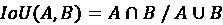

该指标遍历一系列 IoU 阈值，在每个点上计算平均精度值。阈值值从 0.5 到 0.95，增量为 0.05。

在每个阈值值处，根据预测对象与所有地面真实对象比较后产生的**真正例**（**TP**）、**假阴性**（**FN**）和**假阳性**（**FP**）的数量计算一个精度值。最后，竞赛指标返回的分数是测试数据集中每个图像的个体平均精度的平均值。

下面，我们定义计算该指标所需的函数，并将其直接用于模型内部作为目标函数：

```py
# Taken from https://www.kaggle.com/theoviel/competition-metric-map-iou
def precision_at(threshold, iou):
    matches = iou > threshold
    true_positives = np.sum(matches, axis=1) == 1  # Correct objects
    false_positives = np.sum(matches, axis=0) == 0  # Missed objects
    false_negatives = np.sum(matches, axis=1) == 0  # Extra objects
    return np.sum(true_positives), np.sum(false_positives),
    np.sum(false_negatives)
def score(pred, targ):
    pred_masks = pred['instances'].pred_masks.cpu().numpy()
    enc_preds = [mask_util.encode(np.asarray(p, order='F'))
                 for p in pred_masks]
    enc_targs = list(map(lambda x:x['segmentation'], targ))
    ious = mask_util.iou(enc_preds, enc_targs, [0]*len(enc_targs))
    prec = []
    for t in np.arange(0.5, 1.0, 0.05):
        tp, fp, fn = precision_at(t, ious)
        p = tp / (tp + fp + fn)
        prec.append(p)
    return np.mean(prec) 
```

指标定义后，我们可以在模型中使用它：

```py
class MAPIOUEvaluator(DatasetEvaluator):
    def __init__(self, dataset_name):
        dataset_dicts = DatasetCatalog.get(dataset_name)
        self.annotations_cache = {item['image_id']:item['annotations']
                                  for item in dataset_dicts}

    def reset(self):
        self.scores = []
    def process(self, inputs, outputs):
        for inp, out in zip(inputs, outputs):
            if len(out['instances']) == 0:
                self.scores.append(0)    
            else:
                targ = self.annotations_cache[inp['image_id']]
                self.scores.append(score(out, targ))
    def evaluate(self):
        return {"MaP IoU": np.mean(self.scores)} 
```

这为我们创建 `Trainer` 对象提供了基础，它是围绕 Detectron2 构建的解决方案的核心：

```py
class Trainer(DefaultTrainer):
    @classmethod
    def build_evaluator(cls, cfg, dataset_name, output_folder=None):
        return MAPIOUEvaluator(dataset_name)
    def build_hooks(self):
        # copy of cfg
        cfg = self.cfg.clone()
        # build the original model hooks
        hooks = super().build_hooks()
        # add the best checkpointer hook
        hooks.insert(-1, BestCheckpointer(cfg.TEST.EVAL_PERIOD, 
                                         DetectionCheckpointer(self.model,
                                         cfg.OUTPUT_DIR),
                                         "MaP IoU",
                                         "max",
                                         ))
        return hooks 
```

我们现在继续以 Detectron2 风格加载数据集的训练/验证数据：

```py
dataDir=Path(CFG.data_folder)
register_coco_instances('sartorius_train',{}, CFG.anno_folder + 
                        'annotations_train_f' + str(CFG.wfold) + 
                        '.json', dataDir)
register_coco_instances('sartorius_val',{}, CFG.anno_folder + 
                        'annotations_valid_f' + str(CFG.wfold) + 
                        '.json', dataDir)
metadata = MetadataCatalog.get('sartorius_train')
train_ds = DatasetCatalog.get('sartorius_train') 
```

在我们实例化 Detectron2 模型之前，我们需要注意配置它。大多数值都可以保留为默认值（至少在第一次尝试时是这样）；如果你决定进一步调整，从 `BATCH_SIZE_PER_IMAGE`（为了提高泛化性能）和 `SCORE_THRESH_TEST`（为了限制假阴性）开始：

```py
cfg = get_cfg()
cfg.INPUT.MASK_FORMAT='bitmask'
cfg.merge_from_file(model_zoo.get_config_file('COCO-InstanceSegmentation/' +
                    CFG.model_arch))
cfg.DATASETS.TRAIN = ("sartorius_train",)
cfg.DATASETS.TEST = ("sartorius_val",)
cfg.DATALOADER.NUM_WORKERS = 2
cfg.MODEL.WEIGHTS = model_zoo.get_checkpoint_url('COCO-InstanceSegmentation/'
                    + CFG.model_arch)
cfg.SOLVER.IMS_PER_BATCH = 2
cfg.SOLVER.BASE_LR = 0.001
cfg.SOLVER.MAX_ITER = CFG.nof_iters
cfg.SOLVER.STEPS = []
cfg.MODEL.ROI_HEADS.BATCH_SIZE_PER_IMAGE = 512
cfg.MODEL.ROI_HEADS.NUM_CLASSES = 3  
cfg.MODEL.ROI_HEADS.SCORE_THRESH_TEST = .4
cfg.TEST.EVAL_PERIOD = len(DatasetCatalog.get('sartorius_train')) 
                           // cfg.SOLVER.IMS_PER_BATCH 
```

训练模型很简单：

```py
os.makedirs(cfg.OUTPUT_DIR, exist_ok=True)
trainer = Trainer(cfg) 
trainer.resume_or_load(resume=False)
trainer.train() 
```

你会注意到训练过程中的输出含有丰富的关于该过程进度的信息：

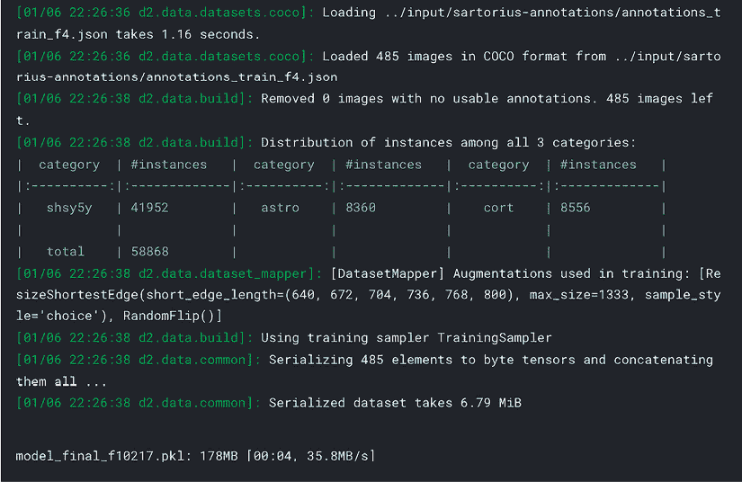

图 10.16：Detectron2 的训练输出

模型训练完成后，我们可以保存权重并用于推理（可能在一个单独的笔记本中 – 参见本章前面的讨论）和提交准备。我们首先添加新的参数，允许我们正则化预测，设置置信度阈值和最小掩码大小：

```py
THRESHOLDS = [.18, .35, .58]
MIN_PIXELS = [75, 150, 75] 
```

我们需要一个辅助函数来将单个掩码编码成 RLE 格式：

```py
def rle_encode(img):
    '''
    img: numpy array, 1 - mask, 0 - background
    Returns run length as string formatted
    '''
    pixels = img.flatten()
    pixels = np.concatenate([[0], pixels, [0]])
    runs = np.where(pixels[1:] != pixels[:-1])[0] + 1
    runs[1::2] -= runs[::2]
    return ' '.join(str(x) for x in runs) 
```

下面是生成每张图像所有掩码的主要函数，过滤掉可疑的（置信度分数低于`THRESHOLDS`）和面积小的（包含的像素少于`MIN_PIXELS`）：

```py
def get_masks(fn, predictor):
    im = cv2.imread(str(fn))
    pred = predictor(im)
    pred_class = torch.mode(pred['instances'].pred_classes)[0]
    take = pred['instances'].scores >= THRESHOLDS[pred_class]
    pred_masks = pred['instances'].pred_masks[take]
    pred_masks = pred_masks.cpu().numpy()
    res = []
    used = np.zeros(im.shape[:2], dtype=int) 
    for mask in pred_masks:
        mask = mask * (1-used)
        # Skip predictions with small area
        if mask.sum() >= MIN_PIXELS[pred_class]:
            used += mask
            res.append(rle_encode(mask))
    return res 
```

我们然后准备存储图像 ID 和掩码的列表：

```py
dataDir=Path(CFG.data_folder)
ids, masks=[],[]
test_names = (dataDir/'test').ls() 
```

大型图像集的竞赛——如本节中讨论的——通常需要训练模型超过 9 小时，这是代码竞赛中规定的时限（见[`www.kaggle.com/docs/competitions`](https://www.kaggle.com/docs/competitions)）。这意味着在同一笔记本中训练模型和运行推理变得不可能。一个典型的解决方案是首先作为一个独立的笔记本在 Kaggle、Google Colab、GCP 或本地运行训练笔记本/脚本。第一个笔记本的输出（训练好的权重）被用作第二个笔记本的输入，换句话说，用于定义用于预测的模型。

我们通过加载我们训练好的模型的权重以这种方式继续进行：

```py
cfg = get_cfg()
cfg.merge_from_file(model_zoo.get_config_file("COCO-InstanceSegmentation/"+
                    CFG.arch+".yaml"))
cfg.INPUT.MASK_FORMAT = 'bitmask'
cfg.MODEL.ROI_HEADS.NUM_CLASSES = 3 
cfg.MODEL.WEIGHTS = CFG.model_folder + 'model_best_f' + 
                    str(CFG.wfold)+'.pth' 
cfg.MODEL.ROI_HEADS.SCORE_THRESH_TEST = 0.5
cfg.TEST.DETECTIONS_PER_IMAGE = 1000
predictor = DefaultPredictor(cfg) 
```

我们可以通过加载我们训练好的模型的权重来可视化一些预测：

```py
encoded_masks = get_masks(test_names[0], predictor)
_, axs = plt.subplots(1,2, figsize = (40, 15))
axs[1].imshow(cv2.imread(str(test_names[0])))
for enc in encoded_masks:
    dec = rle_decode(enc)
axs[0].imshow(np.ma.masked_where(dec == 0, dec)) 
```

这里有一个例子：

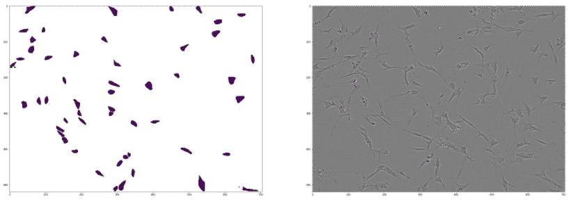

图 10.17：可视化 Detectron2 的样本预测与源图像

使用上面定义的辅助函数，以 RLE 格式生成提交的掩码非常简单：

```py
for fn in test_names:
    encoded_masks = get_masks(fn, predictor)
    for enc in encoded_masks:
        ids.append(fn.stem)
        masks.append(enc)
pd.DataFrame({'id':ids, 'predicted':masks}).to_csv('submission.csv', 
                                                   index=False)
pd.read_csv('submission.csv').head() 
```

这里是最终提交的前几行：

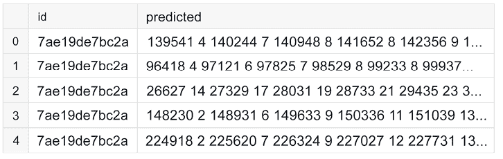

图 10.18：训练好的 Detectron2 模型的格式化提交

我们已经到达了本节的结尾。上面的流程演示了如何设置语义分割模型并进行训练。我们使用了少量迭代，但要达到有竞争力的结果，需要更长时间的训练。

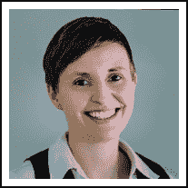

Laura Fink

[`www.kaggle.com/allunia`](https://www.kaggle.com/allunia)

为了总结本章，让我们看看 Kaggler Laura Fink 对她在平台上的时间的看法。她不仅是 Notebooks 大师，制作了许多精湛的 Notebooks，还是 MicroMata 的数据科学负责人。

你最喜欢的竞赛类型是什么？为什么？在技术和解决方法方面，你在 Kaggle 上的专长是什么？

*我最喜欢的竞赛是那些能为人类带来好处的竞赛。我特别喜欢所有与健康相关的挑战。然而，对我来说，每个竞赛都像一场冒险，有自己的谜题需要解决。我真的很享受学习新技能和探索新的数据集或问题。因此，我并不专注于特定的技术，而是专注于学习新事物。我认为我因在探索性数据分析（EDA）方面的优势而闻名。*

你是如何参加 Kaggle 竞赛的？这种方法和你在日常工作中所做的工作有什么不同？

*当参加比赛时，我首先阅读问题陈述和数据描述。浏览论坛和公开的笔记本以收集想法后，我通常开始开发自己的解决方案。在初始阶段，我花了一些时间进行 EDA（探索性数据分析）以寻找隐藏的组并获取一些直觉。这有助于设置适当的验证策略，我认为这是所有后续步骤的基础。然后，我开始迭代机器学习管道的不同部分，如特征工程或预处理，改进模型架构，询问数据收集的问题，寻找泄漏，进行更多的 EDA，或构建集成。我试图以贪婪的方式改进我的解决方案。Kaggle 比赛非常动态，需要尝试不同的想法和不同的解决方案才能最终生存下来。*

*这肯定与我的日常工作不同，我的日常工作更侧重于从数据中获得见解，并找到简单但有效的解决方案来改进业务流程。在这里，任务通常比使用的模型更复杂。要解决的问题必须非常明确地定义，这意味着必须与不同背景的专家讨论应达到的目标，涉及哪些流程，以及数据需要如何收集或融合。与 Kaggle 比赛相比，我的日常工作需要更多的沟通而不是机器学习技能。*

告诉我们您参加的一个特别具有挑战性的比赛，以及您使用了哪些见解来应对这项任务。

*G2Net 引力波探测比赛是我最喜欢的之一。目标是检测隐藏在来自探测器组件和地球力量的噪声中的模拟引力波信号。在这场比赛中的一个重要见解是，你应该批判性地看待分析数据的标准方法，并尝试自己的想法。在我阅读的论文中，数据主要是通过使用傅里叶变换或常 Q 变换，在数据白化并应用带通滤波器后准备的。*

*很快就很明显，白化没有帮助，因为它使用了功率谱密度的样条插值，这本身就很嘈杂。将多项式拟合到噪声数据的小子集会增加另一个错误来源，因为过度拟合。*

*在去除白化之后，我尝试了不同超参数的 Constant-Q 变换，这长期以来一直是论坛和公共* *Notebooks 中的领先方法。由于有两种引力波源可以覆盖不同的 Q 值范围，我尝试了一个在这些超参数上有所不同的模型集合。这证明在提高我的分数方面很有帮助，但后来我达到了一个极限。Constant-Q 变换对时间序列应用一系列滤波器，并将它们转换到频域。我开始问自己，是否有一种方法可以以更好、更灵活的方式执行这些滤波任务。就在这时，社区中提出了使用 1 维卷积神经网络的想法，我非常喜欢它。我们都知道，2 维卷积神经网络的滤波器能够根据图像数据检测边缘、线条和纹理。同样，可以使用“经典”滤波器，如拉普拉斯或索贝尔滤波器。因此，我自问：我们能否使用 1 维 CNN 来学习最重要的滤波器，而不是应用某种方式已经固定的变换？*

*我无法让我的 1 维卷积神经网络解决方案工作，但结果证明许多顶级团队都做得很好。G2Net 比赛是我最喜欢的之一，尽管我错过了赢得奖牌的目标。然而，我在过程中获得的知识和关于所谓标准方法的教训都是非常宝贵的。*

Kaggle 是否帮助了你的职业生涯？如果是的话，是如何帮助的？

*我在大学毕业后开始了我的第一份工作，成为一名 Java 软件开发者，尽管我在硕士论文期间已经接触过机器学习。我对进行更多数据分析很感兴趣，但在那时，几乎没有什么数据科学的工作，或者它们没有被这样命名。当我第一次听说 Kaggle 时，我立刻被它吸引。从那时起，我经常在晚上去 Kaggle 上玩。当时我并没有打算改变我的职位，但后来有一个研究项目需要机器学习技能。我能够通过在 Kaggle 上参与获得的知识证明我是这个项目的合适人选。这最终成为了我数据科学生涯的起点。*

*Kaggle 一直是我尝试新想法、学习新方法和工具、获取实践经验的好地方。通过这种方式获得的能力对我在工作中的数据科学项目非常有帮助。这就像是一次知识上的提升，因为 Kaggle 为你提供了一个沙盒，让你可以尝试不同的想法，发挥创造力而无需承担风险。在比赛中失败意味着至少有一个教训可以学习，但项目中的失败可能会对自己和其他人产生巨大的负面影响。*

*除了参加比赛外，另一种建立你个人作品集的绝佳方式是编写 Notebooks。这样做，你可以向世界展示你如何解决问题，以及如何传达洞察力和结论。当你必须与管理人员、客户和来自不同背景的专家合作时，后者非常重要。*

在你的经验中，不经验的 Kagglers 通常忽略了什么？你现在知道什么，而当你最初开始时希望知道的呢？

*我认为许多参加比赛的初学者被公开排行榜所吸引，没有良好的验证策略就构建模型。当他们在排行榜上衡量自己的成功时，他们很可能会对公开测试数据进行过度拟合。比赛结束后，他们的模型无法泛化到未见的私有测试数据，他们通常会下降数百名。我仍然记得在*梅赛德斯-奔驰绿色制造*比赛中，由于我无法爬升公开排行榜，我有多么沮丧。但当最终排名公布时，人们在上榜和下榜之间的波动让我感到惊讶。从那时起，我总是牢记，一个适当的验证方案对于管理欠拟合和过拟合的挑战非常重要。*

你在比赛中犯过哪些错误？

*我迄今为止犯的最大错误是在比赛开始时花费太多时间和精力在解决方案的细节上。实际上，在建立适当的验证策略之后，快速迭代不同的想法会更好。这样，找到改进的潜在方向更容易、更快，陷入某个地方的危险也小得多。*

您会推荐使用哪些特定的工具或库来进行数据分析或机器学习？

*在 Kaggle 社区活跃时，你可以学习和实践许多常见的工具和库，我唯一能做的就是推荐它们。保持灵活并了解它们的优缺点很重要。这样，你的解决方案不依赖于你的工具，而更多地依赖于你的想法和创造力。*

当人们参加比赛时，他们应该记住或做哪件事是最重要的？

*数据科学不是关于构建模型，而是关于理解数据和收集数据的方式。我迄今为止参加的许多比赛都显示了数据泄露或测试数据中隐藏的组，这些组可以通过探索性数据分析找到。*

# 摘要

在本章中，我们从 Kaggle 比赛的角度为您概述了与计算机视觉相关的重要主题。我们介绍了增强，这是一种用于扩展算法泛化能力的技巧的重要类别，随后展示了三个最常见问题的端到端管道：图像分类、目标检测和语义分割。

在下一章中，我们将注意力转向自然语言处理，这是另一个极其广泛且受欢迎的问题类别。

# 加入我们书籍的 Discord 空间

加入书籍的 Discord 工作空间，每月与作者进行一次 *问我任何问题* 的活动：

[`packt.link/KaggleDiscord`](https://packt.link/KaggleDiscord)


