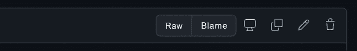
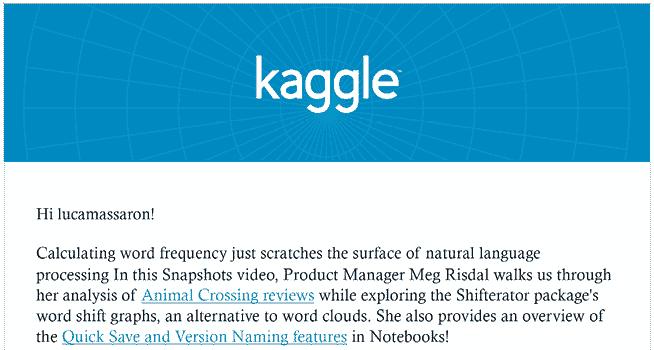

# 第十三章：创建你的项目和想法作品集

在 Kaggle 上的参与有其好处：在四个领域表现良好，并在其他 Kagglers 中的声望中排名靠前，无疑会带来满足感和成就感。然而，你在 Kaggle 上的经验也会超出 Kaggle 本身，并有助于推进你的职业生涯。这不仅仅是你在参加比赛、对从未处理过的数据进行实验或用新技术重复实验中获得的经验；还包括你与其他数据科学家建立的联系以及你可能会从公司那里获得的关注。

尽管 Kaggle 在很多公司中并未被完全认可为一种资格证明，但你参加比赛所做的工作可以充分展示你的能力，并帮助你从人群中脱颖而出。在本章中，我们将探讨如何通过在 Kaggle 本身以及其他网站上以适当的方式展示你的工作来脱颖而出。我们将涵盖以下主题：

+   用 Kaggle 建立你的作品集

+   在 Kaggle 之外安排你的在线存在

+   监控竞争更新和新闻通讯

在下一章中，我们将通过探讨 Kaggle 如何通过增强你的专业网络和为你提供职业机会来直接影响你的职业生涯来结束本书。

# 用 Kaggle 建立你的作品集

Kaggle 声称自己是“*数据科学的家园*”，这一点必须放在正确的角度来考虑。正如我们详细讨论过的，Kaggle 对所有愿意竞争、根据给定的评估指标找出预测任务中最佳模型的人都是开放的。

在世界各地、教育背景或预测建模熟练程度方面没有限制。有时也有一些非预测性质的竞赛，例如强化学习竞赛、算法挑战和适合比数据科学家更广泛受众的分析竞赛。然而，根据指标从数据中做出最佳预测是 Kaggle 竞赛的核心目的。

实际数据科学有许多方面。首先，你的首要任务是解决问题，衡量你的模型的标准只是对解决问题好坏的或多或少精确的测量。你可能不仅要处理一个指标，还必须考虑多个指标。此外，问题可以以不同的方式解决，很大程度上取决于你如何表述它们。

关于数据，你很少能得到关于你必须使用的数据的规格说明，你可以修改任何现有的数据集以适应你的需求。有时，如果你需要，你甚至可以从头创建自己的数据集。没有关于如何组合数据或处理数据的指示。在解决问题时，你还必须考虑：

+   技术债务

+   随时间推移的解决方案的可维护性

+   运行解决方案的时间和计算成本

+   解释模型工作原理的可解释性

+   对运营收入的影响（如果现实世界中的项目是商业项目，增加利润和/或降低成本是主导思想）

+   在不同复杂性和抽象层次上沟通结果

通常，所有这些方面比原始性能对评估指标的影响更为重要。

**技术债务**这个术语在软件开发中比在数据科学中更为常见，尽管它也是一个相关的概念。对于技术债务，你应该考虑为了更快地交付你的项目而必须做的事情，但你将在以后以更高的成本重新做。由 David Sculley 和其他谷歌研究人员撰写的经典论文《机器学习系统中的隐藏技术债务》应该能让你了解该问题对于数据科学的相关性：[`proceedings.neurips.cc/paper/2015/file/86df7dcfd896fcaf2674f757a2463eba-Paper.pdf`](https://proceedings.neurips.cc/paper/2015/file/86df7dcfd896fcaf2674f757a2463eba-Paper.pdf)

并非所有这些专业知识都可以通过 Kaggle 竞赛来补充。其中大部分应该通过在企业环境中直接实践和经验积累来获得。然而，与 Kaggle 竞赛相关的知识和技能并不完全独立于我们上面讨论的许多考虑因素，并且它们是许多企业级数据科学流程的良好补充。通过在 Kaggle 上竞赛，你将接触到不同类型的数据和问题；你需要执行广泛的特征工程和模型假设的快速迭代；你还必须设计使用通用开源包组合最先进解决方案的方法。这是一套宝贵的技能，应该在你的方面得到推广。做到这一点最好的方式是建立一个**作品集**，它收集了你基于 Kaggle 竞赛和其他 Kaggle 资源的解决方案和工作。

为了从 Kaggle 竞赛中构建作品集，你可以采取多种方法。最简单的方法是利用 Kaggle 提供的设施，特别是数据集、笔记本和讨论区。


Gilberto Titericz

[`www.kaggle.com/titericz`](https://www.kaggle.com/titericz)

在我们继续之前，我们在与 Gilberto Titericz 的访谈中提出了一份关于从 Kaggle 衍生出的职业机会的讨论。他是竞赛和讨论的大师，曾是排名第一，现在是 Kaggle 竞赛总金牌数排名第一。他还是 NVIDIA 的高级数据科学家，不久前在一篇关于 Wired 的文章中被提及（[`www.wired.com/story/solve-these-tough-data-problems-and-watch-job-offers-roll-in/`](https://www.wired.com/story/solve-these-tough-data-problems-and-watch-job-offers-roll-in/))。

你最喜欢的竞争类型是什么？为什么？在技术和解决方法方面，你在 Kaggle 上的专长是什么？

*自从我于 2011 年开始在 Kaggle 上比赛以来，我最喜欢的比赛类型是那些具有结构化表格数据的比赛。我在 Kaggle 中使用最多的技术是分类特征的编码（错误的方法有无限种）和堆叠集成。*

你是如何应对 Kaggle 比赛的？这种方法与你在日常工作中所做的方法有何不同？

*Kaggle 是一个机器学习的绝佳游乐场。与真实项目相比，Kaggle 中的问题已经非常明确和格式化，数据集已经创建，目标变量已经建立，指标也已经选定。因此，我总是带着 EDA（探索性数据分析）的心态开始参加 Kaggle 比赛。理解问题和了解数据集是超越其他玩家的关键之一。之后，我会花一些时间来定义一个合适的验证策略。这对于正确验证你的模型以及与 Kaggle 私有测试集评分方式保持一致非常重要。除了使用分层 K 折交叉验证对于大多数二分类问题都有效之外，我们还必须评估是否需要使用分组 K 折交叉验证或基于时间的分割来正确验证，避免过拟合，并在尽可能的情况下模拟私有测试集。之后，花一些时间进行特征工程和超参数优化实验也非常重要。此外，我总是在比赛中至少使用一个梯度提升树模型和一个基于深度学习的方法。这种不同方法的结合对于增加预测的多样性并提高比赛指标非常重要。*

Kaggle 是否帮助你在职业生涯中取得进步？如果是的话，是如何帮助的？

*是的，Kaggle 是我改变职业方向的主要原因。截至 2016 年，我是一名电子工程师，由于自 2011 年以来在比赛中学到的所有知识，我能够转向数据科学领域。Kaggle 帮助我理解机器学习的概念，并将从理论中学到的所有知识应用到实践中。此外，Kaggle 是一个出色的实验场所，你可以下载数据集并与之互动，以从数据中提取尽可能多的信息。结合比赛环境，这使得它成为学习编码和机器学习的完美场所，同时，它具有上瘾性，让你想要学习更多。赢得一些比赛可以使你的名字登上排行榜的顶端，这对任何人的职业生涯来说都是无价的。全球的猎头都在关注 Kaggle，以找到适合他们职位的合适人选，而通过比赛获得的知识和经验可以提升任何人的职业生涯。*

你是如何利用 Kaggle 建立你的作品集的？

*一旦我加入 Kaggle，我就花了几年的时间学习所有从数据中提取更多信息以及尽可能提高指标的技术、算法和技巧。高精度是大多数比赛的主要目标，但仅靠运气几乎是不可能的；知识和经验在目标是赢得比赛或至少进入金牌区时起着重要作用。我在 Kaggle 比赛中的奖牌数量是我的作品集；截至 2021 年 11 月，有 58 枚金牌和 47 枚银牌，这很好地总结了我在 Kaggle 获得的机器学习经验。考虑到每个比赛至少持续 1 个月，这超过了 105 个月的连续竞争性机器学习经验。*

在您的经验中，不经验丰富的 Kagglers 通常忽视什么？您现在知道什么，而您希望自己在最初开始时就知道？

*新手们经常* *忽视合适的验证策略。这不仅仅发生在 Kaggle 上；我见过世界各地的数据科学家在构建模型时忽略了实验理论中最重要的事情之一。设置合适的验证策略没有普遍的规则，但数据科学家必须考虑模型未来将如何被使用，并使验证尽可能接近这一点。*

在过去的比赛中，您犯过哪些错误？

*犯过几个错误；不可能一一列举。我可能犯过所有可能的错误组合。错误的好处是你可以从中学习。一旦你犯了一个错误并且发现了它，你再次犯同样的错误的可能性就非常小。人们在 Kaggle 上犯的主要错误是相信排行榜的分数而不是他们本地的验证分数。过度拟合排行榜在 Kaggle 上是常态，这是与真实世界的最大区别。在真实项目中，我们必须构建一个我们信任的强大验证策略，因为在真实世界中，模型将在真实数据上被测试，而你只有一次机会命中目标，而不是每天多次提交。*

您是否推荐使用特定的工具或库来进行数据分析与机器学习？

*几年前我会推荐 R 语言，但考虑到 Python 在机器学习领域的快速发展以及它在生产中的通用性和易用性，我建议任何开始机器学习的人学习它。在表格数据库方面，我推荐使用 pandas 进行操作，如果您需要速度，则选择 cuDF（pandas 的 RAPIDS.ai GPU 版本）。对于数据探索分析（EDA），我推荐使用 Seaborn 或 Matplotlib 库中的 DataFrame，对于机器学习，推荐使用 Scikit-learn、SciPy、cuML（GPU）、XGBoost、LightGBM、CatBoost 和 PyTorch。请记住，使用原始特征构建简单的 XGBoost 模型既快又能够提供一个良好的基准，以便与后续模型进行比较。*

当人们参加竞赛时，他们应该记住或做哪件事是最重要的？

*参加 Kaggle 竞赛并提交公开的 Notebooks 很容易，但要在金牌区完成竞赛可能极具挑战性。所以对我来说，最重要的是记住，无论最终排名如何，我们都应该利用 Kaggle 来娱乐和学习，从讨论论坛、公开的 Notebooks，甚至从赛后获胜者的帖子中学习他们的想法和成功之处。*

*还要记住，使竞赛获胜者脱颖而出的不仅仅是复制别人的做法，而是跳出思维定式，提出新颖的想法、策略、架构和方法。*

你使用其他竞赛平台吗？它们与 Kaggle 相比如何？

*我在其他竞赛平台上赢得过几场比赛，但与 Kaggle 相比，主要区别在于用户数量。截至 2021 年 11 月，Kaggle 有 17.1 万活跃用户，这使得论坛、Notebooks 和数据集交互在内容上更加丰富。此外，Kaggle 还提供了一些独特的东西：你可以使用 Google 服务器免费编写和运行代码的 Notebooks，如果你没有好的硬件，这可能价值连城。*

## 利用 Notebooks 和讨论

除了排名本身，Notebooks 是你在 Kaggle 上引起注意的方式，因为它们同时展示了你解决问题的方法、你展示想法的方式以及你编写代码的方式。作为在参与者之间轻松和公开分享解决方案和想法的一种方式，Notebooks 是展示雇主欣赏的能力的最重要工具（仅次于排名）。

事实上，近年来数据科学领域最重要的变化之一是其从杰出人才（独角兽数据科学家）的游戏转变为团队游戏，数据科学家必须与其他数据科学家和部门合作，以确保项目的成功。因此，在他们的招聘过程中，公司更关心你能否有效地沟通想法和结果，以及以干净和有效的方式编写代码。

在上一节中，我们讨论了现实世界项目需要更广泛的技术技能，从处理技术债务到设计成本效益解决方案。即使这些技能不会让你在竞赛中获胜，你仍然可以在 Kaggle 上展示这些技能。Notebooks 是完成这项工作的最佳工具。

参考第三章，*使用 Kaggle Notebooks 工作和学习*，了解 Kaggle Notebooks 的介绍。

你会在 Kaggle 上找到不同类型的 Notebooks。作为一个好的近似，我们可以将它们分为四类：

+   竞赛排名的解决方案和想法

+   **探索性数据分析**（**EDA**）对数据进行分析

+   解释机器学习模型或数据科学原理的教程

+   从论文或其他原创解决方案中派生出的模型的新实现

这些中的每一个都可以通过一组有趣的技能为您提供优势。如果解决方案和竞赛的想法是展示您知道如何解决复杂数据科学问题的经典方式，那么其他三种可以展示给世界您能够：

+   从数据中操作、表示和提取视觉和非视觉洞察力（EDA），这是一种在每个环境中都被认为非常重要的技能，从科学研究到商业

+   在数据科学上进行教育，打开教育、导师和开发者倡导角色的门

+   将研究转化为实践，在数据科学（尤其是在深度学习）创新每日出现并需要迅速转化为工作解决方案的时代，这是一项关键技能

即使您在 Kaggle 竞赛中排名不高或没有惊人的解决方案可以展示，如果您能以最佳方式推广这些其他三种类型的笔记本（EDA、教程和论文实现），这些笔记本也可以在现实世界中为您提供机会。为此，您需要了解如何编写可读且有趣的笔记本，这是从实践和经验中学习的东西。由于这是一门艺术，我们的建议是向他人学习，尤其是从笔记本大师那里学习，他们在笔记本用户排名中位居前列 ([`www.kaggle.com/rankings?group=notebooks&page=1&pageSize=20`](https://www.kaggle.com/rankings?group=notebooks&page=1&pageSize=20))。

我们建议您看看他们开发了什么样的笔记本，他们是如何使用图表来安排他们的工作的，他们是如何结构化他们的代码的，然后，最后，根据您的技能和兴趣，尝试模仿他们的其中一个笔记本。我们还建议您不要只把成功的机会赌在代码和图表上，还要赌在您所呈现的**叙述**上。无论您是在展示解决方案、教学还是在 TensorFlow 中实现神经网络架构，用文字解释笔记本单元格的方式对于留下持久积极的印象非常重要。

除了浏览高排名者的笔记本之外，还有一种方式可以通知您关于最近出现在 Kaggle 上的一些不太主流——但仍然精心制作的——笔记本。天体物理学家和热情的 Kaggle 用户 Heads or Tails，*马丁·亨泽* ([`www.kaggle.com/headsortails`](https://www.kaggle.com/headsortails))，在讨论论坛上发布了一个每周的帖子“本周笔记本：隐藏的宝石”，这是一系列最有趣的笔记本的集合。目前，已经有超过 100 卷，作者继续在 Kaggle 上寻找任何可能有趣的东西。如果您想了解有关酷笔记本的最新信息，只需关注马丁·亨泽在 Kaggle 上的个人资料，或者不时检查他是否在他的讨论中发布了新内容。

如果你喜欢挖掘笔记本寻找灵感并从中学习，我们永远不会厌倦强调你不应该盲目复制他人的工作。Kaggle 上有很多笔记本，经常有人复制一个，做一些小的修改，然后将其作为自己的原创想法重新展示给其他 Kagglers。通常，人们还会从笔记本中挑选一个函数或代码的一部分，并将其插入到自己的工作中。在这两种情况下，请记住始终引用来源和作者。如果你无法追溯到原始作者，甚至只引用你找到所使用代码的最后一个笔记本也足够了。虽然展示的主要目的是展示你自己的努力和技能，但认识到你的代码或某些想法是从其他地方借鉴的非常重要。除了对其他 Kagglers 表示尊重的标志外，来源归属还表明你足够了解他人的努力和发明，并且知道如何在你的工作中应用它们。

在一定程度上，Kaggle 论坛上的讨论可以帮助你在数据科学和软件开发中引起对特定角色的关注。最初，Kaggle 上的讨论只是为了与组织者沟通或询问有关比赛本身的紧迫问题。然而，随着讨论获得了自己的用户排名和掌握等级，你可以在论坛上找到更多关于这些讨论的信息。

参考第 *4* 章，*利用讨论论坛*，了解 Kaggle 上的讨论介绍。

根据我们的经验，Kaggle 上的讨论可以分为四个类别：

+   竞赛解决方案，详细解释（有时辅以相关笔记本）团队如何达到私人排行榜上的某个位置

+   在比赛中帮助并解释需求

+   感谢，赞美和闲聊

+   帮助和指导其他竞争对手，向他们解释事情

我们观察到，在最后一种帖子中表现出色并因此广受关注可以帮助你获得开发者倡导者的角色，特别是如果你还有其他活跃的渠道与你的数据科学家同行互动（例如，Twitch 或 YouTube 频道、Twitter 账户或 Medium 博客）。

随着大型公司和初创公司中开发者倡导者角色的增长，对能够帮助其他数据科学家和开发者在项目中取得成功的专家的需求日益重要。如果你想了解更多关于这个角色的信息，以下在 [draft.dev](https://draft.dev) 上的文章解释得相当详细和全面：[`draft.dev/learn/what-is-a-developer-advocate`](https://draft.dev/learn/what-is-a-developer-advocate)。

## 利用数据集

Kaggle 竞赛经常受到批评，因为它们展示的数据已经过清洗、井然有序，并且与现实世界中的数据相去甚远。我们的观点略有不同；我们发现 Kaggle 在竞赛中展示的数据也可能相当杂乱或噪声。有时展示的数据在质量和数量上可能不足以获得高分，你将需要在网上寻找额外的数据。

在数据科学项目中，Kaggle 缺失的是在组织的数据仓库和文件中收集和整理数据的过程，这个过程在现实世界中是不可能标准化的，因为它因公司而异，因问题而异。在现实世界中的数据处理主要应在现场学习。

将数据集引入 Kaggle 的目的是为了缓解人们认为 Kaggle 仅仅关注建模问题的想法。在这一点上，Kaggle 数据集非常有帮助，因为它们允许你创建和上传自己的数据，并记录特征及其值；同时，它们还要求你通过规划更新或完全替换数据的频率来管理你的数据。

请参阅**第二章**，**使用数据集组织数据**，以了解 Kaggle 数据集的介绍。

更有趣的是，在 Kaggle 数据集中，你还被赋予了将使用 Kaggle Notebooks 构建的不同分析和模型附加到数据集的机会，这些模型可以是你在竞赛中想出的，或者是因为你仔细研究了上传的数据，发现了一些可以用它解决的问题。

此外，Kaggle 数据集还为你提供了一个模板，用于检查伴随你的数据的元信息的完整性。描述、标签、许可、来源和更新频率：这些只是所需信息（用于计算可用性评分）的一小部分，这些信息将帮助任何使用你数据的人了解如何使用它。你甚至可以在描述或讨论中指出与你想用它完成的工作相关的数据集任务。这是一种很好的方式来传达你对已上传数据的潜在价值的全面理解。

以前，任务曾是 Kaggle 数据集功能的一部分，但最近已经被移除：[`www.kaggle.com/product-feedback/292674`](https://www.kaggle.com/product-feedback/292674)。尽管如此，你可以使用数据描述和讨论来指出你期望你的数据可以用于什么。

所有这些特性使 Kaggle 数据集成为展示你在 Kaggle 上解决问题的经验以及一般的数据和机器学习算法能力的一个非常好的方式，因为它们允许你：

+   发布和维护数据集

+   用任务路线图展示你已理解数据的价值

+   展示编码和完全工作的解决方案（因为 Kaggle Notebooks 可以立即在相同的数据上工作，无需任何准备），从数据准备到解释性数据分析再到预测建模

我们强烈推荐使用 Kaggle Datasets 来展示你在 Kaggle 竞赛或任何其他项目中完成的工作，因为它们将你的工作与其他人的工作区分开来，并整合了数据和 Notebooks。简而言之，Kaggle Datasets 可以向任何人展示你已实施的解决方案。然而，也存在一个缺点：你大部分时间都绑定在 Notebook 环境中（即使你使用脚本），这在包和版本要求方面并不完全透明，其他人需要知道才能在其他环境中运行代码。

事实上，Kaggle Notebooks 依赖于由配置文件、**Dockerfile**设置的 Docker 环境，该文件决定了已安装的版本。在浏览 Notebook 时，除非检查此配置文件，否则无法立即看出正在使用哪些版本的包。为此目的，以及为了复制设置，可以在 GitHub 上的 Kaggle 仓库中找到 Dockerfile（[`github.com/Kaggle/docker-python/blob/main/Dockerfile.tmpl`](https://github.com/Kaggle/docker-python/blob/main/Dockerfile.tmpl)），尽管它随时间变化，你可能需要跟踪你工作中使用的版本。

最后，除了这个方面，别忘了，即使只是浏览一下 Dataset 及其相关的 Notebooks，也需要访问 Kaggle 社区。


加布里埃尔·普雷达

[`www.kaggle.com/gpreda`](https://www.kaggle.com/gpreda)

我们与数据集、Notebooks 和讨论方面的 Kaggle 大师、Endava 的首席数据科学家*加布里埃尔·普雷达*进行了一次鼓舞人心的职业导向谈话。加布里埃尔拥有计算电磁学的博士学位，在完全投身数据科学之前，他在软件开发领域有着漫长的职业生涯。当他发现 Kaggle 时，他感觉在这个平台上如鱼得水，并投入了大量时间和精力，这在职业上为他带来了回报。

Kaggle 是否帮助你在职业生涯中取得进展？如何？

*Kaggle 帮助我加速了在数据科学领域的学习曲线。在 Kaggle 之前，我四处寻找信息来源或要解决的问题，但方法并不系统，效果也不明显。在 Kaggle 上，我找到了一个与我兴趣相同的人组成的社区。我能够看到领域顶级专家的工作，从他们发布的带有分析或模型的 Notebooks 中学习，从他们那里获得洞察，向他们提问，甚至与他们竞争。在我加入 Kaggle 的时候，我主要在数据分析领域，但很快我就开始竞争；这意味着学习如何构建、验证和迭代改进模型。在 Kaggle 上大约两年后，我改变了我的职业道路；我从管理软件项目转变为全职数据科学工作。Kaggle 也给了我一些知名度，在我目前公司的面试中，候选人提到他们想加入我们，因为他们看到我在那里工作。*

你是否曾经将你在 Kaggle 上完成的项目作为你的作品集的一部分，向潜在雇主展示？

*我将我的 Kaggle 作品集作为潜在雇主的主要信息来源；我的 LinkedIn 个人资料指向我的 Kaggle 个人资料。此外，近年来，雇主对 Kaggle 的了解越来越多，其中一些雇主会具体询问你的 Kaggle 个人资料。还有一些潜在雇主明确表示他们不认为 Kaggle 相关。我不同意这种观点；就我个人而言，在面试候选人之前，我通常会检查他们的 GitHub 和 Kaggle 个人资料。我发现它们极其相关。一个好的 Kaggle 个人资料不仅能展示技术技能和某些语言、工具、技术或解决问题的经验，还能展示一个人通过讨论和 Notebooks 进行沟通的能力。这对于数据科学家来说是一个非常重要的品质。*

你首先在 Notebooks（Kernels）中达到了大师级别，然后在讨论中，最后在数据集中。你能告诉我们你的经历吗？

*我成为了第七位 Kernels 大师，并达到了第三名的排名。我想可能有两年的时间我在 Kernels 等级结构中排名前十。我开始写 Kernels 主要是为了在分析我发现更有趣的数据集的同时提高我对 R 语言的知识。我还尝试了各种技术，包括多边形裁剪、构建 Voronoi 多边形的双网格和 2D Delaunay 三角剖分。我逐渐开始专注于探索性数据分析，然后是构建数据集和比赛的模型。此外，一旦我开始更多地参加比赛，我就开始用 Python 编写用于比赛的 Kernels。大约在同一时间，我开始注意到我的某些 Kernels 引起了 Kagglers 的注意，主要是点赞和分支，但也有积极的评论。我写的某些用于在活跃比赛中探索数据的 Kernels 达到了非常广泛的受众，并为我赢得了许多金牌；因此，我达到了大师级，然后是大师级。目前，我很少发布与比赛相关的 Kernels；大部分我创建的是与发布的数据集相关的起始 Kernels。*

*接下来，我还获得了讨论大师级别。我从未预料到我会达到这个讨论层级。首先，我开始评论他人的 Kernels。然后，随着我越来越多地参与比赛，我的大部分评论都是在活跃比赛的讨论部分，要么是询问这些比赛中感兴趣的话题，要么是开始新的话题，例如，为比赛中的一个问题提出解决方案或收集资源来解决与比赛相关的各种开放性问题。我想提到我添加的一组特殊评论。作为一名 Kaggle Kernels 大师（第一批之一），当我发现非常好的内容时，我经常点赞新 Kagglers 的 Notebooks。*

*在这种情况下，我会尽量找一些时间来赞扬（尤其是如果内容质量很高）作者的成就。特别是对于初学者来说，除了通过点赞来表达你的赞赏之外，还能提供一些关于他们贡献的积极反馈，可能会给他们带来信心上的提升，使他们更愿意投入学习和在 Kaggle 上做出更多贡献。我喜欢这样做，并希望这能有所帮助。我曾经还编制了一份关于如何在 Kaggle 上评论的推荐清单。这是清单：简短（但不要太简短）；具体；提供信息，而不是意见；有机会时赞扬他人的工作；保持冷静并尽量提供帮助；除非有意义（例如，如果是一个讨论，你需要将评论直接指向在那一线程中回应你的人），否则不要在评论中提及他人。*

*我达到的最后大师级别是在数据集领域。这也是我达到最高排名，第二名的级别。我在排名上的进步很慢。我从我喜欢的事情开始。在数据集中获得高知名度需要投资于数据的整理、清洗和文档化。如果你不喜欢这样的事情，你很可能不会继续下去。我追求的是对我个人和更广泛的社区都重要的事情：对我的国家、我的大陆，甚至是整个世界。我发布了关于我国家选举的数据集，以及关于欧洲各种社会、人口和经济主题的数据集。我专注于时事主题，这些主题对社区既有相关性又非常重要。例如，在疫情期间，我发布了关于 COVID-19 病例、疫苗接种、检测和病毒变种的全球数据集。我收集了超越简单数值、表格值的数据。文本数据，尤其是来自人们的直接贡献，为许多人提供了重要的见解。我获得最高点赞的数据集之一包括关于疫苗神话、板球、大流行、体育赛事和政治人物等多样化主题的 Reddit 帖子和评论或 Twitter 帖子（推文）。我在自动化数据收集、数据清洗和数据处理脚本上投入了大量精力。这为我节省了宝贵的时间（特别是对于频繁更新的数据集——其中一些是每小时通过脚本收集的）但同时也使我对整个过程有了更好的控制。每次我发布一个新的数据集时，我也会写一个或多个起始核。这些核并不是为了吸引大量观众。我创建它们作为潜在用户的数据集辅助核，以便他们更容易使用数据。在许多情况下，我更喜欢保留原始数据（正如我收集的，或从替代来源下载的）并包括一个用于数据清洗、转换和初步分析的核，以及这个过程的结果，即以更易访问的格式呈现的数据。通过这种方式，我试图在数据集中捕捉到比数据本身更多的内容；我还提供了关于数据转换技术的信息。*

# 在 Kaggle 之外安排你的在线存在

由于 Kaggle 数据集和笔记本需要 Kaggle 账户，你必须考虑到并非每个人都已经有一个，或者只是为了查看你的作品而想要创建一个。你还必须考虑更易于访问的替代方案。更常见的是，Kagglers 选择在 GitHub ([`github.com/`](https://github.com/)) 上创建一个项目，在 Medium ([`medium.com/`](https://medium.com/)) 上写文章，以及其他发布平台，或者在自己的博客上发布。然而，还有其他机会来推广你的作品和技能，例如：

+   在[`deepnote.com/`](https://deepnote.com/)上发布与 Kaggle 竞赛相关的代码，这些代码可以在浏览器中执行

+   设置一个聚集 Kagglers 的 Discord 社区，例如*Abhishek Thakur*的 MLSpace ([`discord.com/invite/4RMwz64gdH`](https://discord.com/invite/4RMwz64gdH))，或者运营一个 YouTube 频道（同样来自 Abhishek Thakur: [`www.youtube.com/channel/UCBPRJjIWfyNG4X-CRbnv78A`](https://www.youtube.com/channel/UCBPRJjIWfyNG4X-CRbnv78A)))

+   设置一个像*Rob Mulla*的 Twitch 频道，他在那里展示与 Kaggle 竞赛相关的编码：[`www.twitch.tv/medallionstallion`](https://www.twitch.tv/medallionstallion)（同样在 GitHub 上：[`github.com/RobMulla/twitch-stream-projects`](https://github.com/RobMulla/twitch-stream-projects)))

+   发布关于 Kaggle 新闻的每周通讯，例如*Shotaro Ishihara*：[`www.getrevue.co/profile/upura`](https://www.getrevue.co/profile/upura)

+   采访 Kagglers 和其他数据科学专家，如*Sanyam Bhutani*所做的那样，并使用视频、播客和博客文章来播放采访：[`chaitimedatascience.com/`](https://chaitimedatascience.com/)（你可以浏览由*Rohan Rao*准备的包含迄今为止所有采访数据的数据集：[`www.kaggle.com/rohanrao/chai-time-data-science`](https://www.kaggle.com/rohanrao/chai-time-data-science)）

如你所推断，确实有很多机会和媒体可以通过它们来传播你在 Kaggle 上的工作和技能，具体取决于你想要达到的目标。在本章中，我们的重点是仅仅博客和 GitHub 的存在（这是最常见的选项，而且相当有效），但你完全可以根据自己的需求选择任何不同的方法。

## 博客和出版物

写作可以是一种既能够精炼你的知识——因为你需要阅读某个主题以便撰写关于它的文章——又可以让他人了解你和你技能的方式。因你的写作而出名可以帮助你在多个方面，从被招聘人员和公司注意到到为 Kaggle 竞赛以及你更广泛的专业生活建立联系。

社交媒体（LinkedIn、Twitter 和 Facebook）允许你发布想法和短篇文字，这是我们建议你利用的资源。鉴于数据科学和 Kaggle 竞赛主题需要长时间的讨论和推理，然而，最佳的方法是撰写**长篇文章**并通过博客或发布写作的网站来发布。理想情况下，我们建议你协调社交媒体和你的文章之间的沟通，以推广它们，通过专门的帖子宣布它们或讨论你写作中的关键点。

让我们先讨论一下你可以在哪里发表你的文章。

Medium 上的文章，尤其是像**Towards Data Science** ([`towardsdatascience.com/`](https://towardsdatascience.com/))这样的**Medium 出版物**，可以获得很多关注。Medium 出版物是围绕一个共同的主题或话题撰写的故事的共享空间，通常由多位作者共同完成。作为一个网站，Medium 可以触及广泛的读者群，并且一些出版物在数据科学社区中以文章质量而享有很好的声誉。一个出版物可以有一位或多位编辑来挑选作品并确保其内容与出版物的政策和质量水平保持一致。你可以发布文章的 Medium 出版物包括：

+   **Towards Data Science**，如前所述 ([`towardsdatascience.com/questions-96667b06af5`](https://towardsdatascience.com/questions-96667b06af5))

+   **Better Programming** ([`betterprogramming.pub/write-for-us-5c4bcba59397`](https://betterprogramming.pub/write-for-us-5c4bcba59397))

+   **Mlearning.ai** ([`medium.com/mlearning-ai/mlearning-ai-submission-suggestions-b51e2b130bfb`](https://medium.com/mlearning-ai/mlearning-ai-submission-suggestions-b51e2b130bfb))

+   **Becoming Human** ([`becominghuman.ai/write-for-us-48270209de63`](https://becominghuman.ai/write-for-us-48270209de63))

+   **Towards AI** ([`pub.towardsai.net/submit-your-medium-story-to-towards-ai-a4fa7e8b141d`](https://pub.towardsai.net/submit-your-medium-story-to-towards-ai-a4fa7e8b141d))

每一份这些出版物都拥有一个巨大的优势，那就是它们已经拥有了一个庞大的读者群，可能比你社交媒体上的关注者还要多。你将获得的读者数量可能会超出你的预期，能够触及到公司以及其他你可以建立联系的专业人士。

除了 Medium 之外，这些其他网站也可能接受你的出版物：

+   **Hacker Noon** ([`www.publish.hackernoon.com/`](https://www.publish.hackernoon.com/)): 在技术博客作者中非常受欢迎，包含任何与技术相关的内容（相当广泛）。每月有四百万的读者，如果你想要触及众多对技术感兴趣的人，这是一个合适的地方。出现在首页非常困难，是一把双刃剑：你将获得很多关注，同时也会面临许多批评。

+   **Dev.to** ([`dev.to/`](https://dev.to/)): 主要面向开发者（近八十万人）的读者群，提供关于编码的文章和教程。你的帖子应该更注重你代码的质量和效果（建模处于幕后）。

+   **FreeCodeCamp** ([`www.freecodecamp.org/news/developer-news-style-guide/`](https://www.freecodecamp.org/news/developer-news-style-guide/)): 更专注于教程；人们去那里学习如何编码。对于推广机器学习课程和推广新软件包来说，这是一个理想的地方。

+   **Analytics Vidhya** ([`www.analyticsvidhya.com/about/write/`](https://www.analyticsvidhya.com/about/write/))：在印度非常受欢迎；它更多地围绕解释机器学习和深度学习基础的文章。

+   **KDnuggets** ([`www.kdnuggets.com/news/submissions.html`](https://www.kdnuggets.com/news/submissions.html))：数据挖掘领域中最古老的出版物之一。它仍然在数据科学家和学者中拥有相当多的追随者（2021 年 3 月有 100 万独立访客）。

每个出版物都有其优点和缺点，并且在其触及的受众方面有所不同，因此你必须决定哪一个更适合你的内容。首先浏览他们提供的出版物，以便了解你的写作如何融入其中。

当然，如果你愿意，你也可以使用你自己的博客。拥有自己的博客有其优点，比如没有广告或编辑对你所写内容的审查。另一方面，你不能利用现有的受众，你必须通过在社交媒体上推广你的文章来努力创建一个受众群体。你可以在你选择的网络域名上从头开始建立自己的网站，或者你也可以在 GitHub 上创建自己的博客。

如果你决定使用 GitHub（因为它免费，你可能已经用它作为代码的存储库），这里有一个创建 GitHub 博客文章的简单快速指南：[`jmcglone.com/guides/github-pages/`](http://jmcglone.com/guides/github-pages/)

如果你需要更加自动化的服务，可以使用像**杰里米·霍华德**的**fastpages**（[`github.com/fastai/fastpages`](https://github.com/fastai/fastpages)）这样的平台，因为它可以简化你处理带有代码示例的内容的方式，因为它会自动将笔记本和 Word 文档转换为博客页面，并为你发布。

如果你希望完全独立并建立自己的网站，这将需要更多的努力和一些费用；域名和网站空间并不是免费的。在这种情况下，自我推广你的内容变得至关重要。

写作关于你解决方案的主要优势是叙事元素，因为你必须伴随你的代码片段进行描述和解释，并且你需要以一种比在笔记本中更详细的方式写作。从某种意义上说，你描述你的工作的重要性与你所写的代码一样。通过调整你写作的语气，你可以接触到不同类型的受众。以易于理解的方式写作概念意味着你会扩大你的受众群体并与更多专业人士建立联系。相反，以高度技术化的方式写作可能会给那些可能考虑雇佣你的潜在公司留下深刻印象，尽管这限制了你的读者数量。

由于写作是一个非常个人化的行为，我们的提示和建议可能不适用于每个场景，因此我们的一般建议是在事先决定你写作的目的以及你希望通过它接触到的人。

## GitHub

除了撰写文章和提供可以直接引导读者访问的代码仓库外，将您的代码放在 GitHub 上还可以帮助您在参加的每个比赛中不必重新发明轮子。您可以将希望重用的代码存储在项目或**Gists**（[`docs.github.com/en/github/writing-on-github/editing-and-sharing-content-with-gists`](https://docs.github.com/en/github/writing-on-github/editing-and-sharing-content-with-gists)）中，这些是单独可访问的小段代码。

即使您可能希望将所有代码都留在 Kaggle 上，但随着时间的推移，您会发现很难访问，甚至可能完全找不到。这是因为您无法将 Kaggle 笔记本组织成单独的项目；它们将仅作为一个可以按一些属性（如投票数或您上次运行笔记本的时间）排序的长列表呈现。GitHub 使您更容易找到所需内容并重用它们。例如，您可以创建包含所有代码的脚本，然后将其下载并导入 Kaggle 笔记本，而无需复制任何内容。

在以下示例中，我们下载并重用了用于`tabular`神经网络的辅助函数：

```py
!wget https://raw.githubusercontent.com/lmassaron/deep_learning_for_tabular_data/master/tabular.py
# Importing from Tabular
from tabular import gelu, Mish, mish
from tabular import TabularTransformer, DataGenerator 
```

使用`wget`命令可以直接访问 GitHub 上的代码并将其下载到笔记本的磁盘上；之后，您只需从其中导入所需的函数和类即可。要获取提供直接访问您代码的链接，您只需在 GitHub 仓库中找到包含该代码的文件，然后点击页面顶部的**原始**按钮：



图 13.1：GitHub 上可视化文件的标题。注意标题栏右上角的原始按钮。

点击**原始**按钮后，您将被带到 GitHub 上存储文件的网页地址。您可以使用该网址从 GitHub 外部引用该文件。

GitHub 对于存储您可以在 Kaggle 讨论中使用的图像也非常有用（因为您不能再上传 Kaggle 论坛上的图像）。在图像的情况下，您不会有一个可以点击的**原始**按钮，但您可以右键单击图像并在另一个标签页中打开文件；这将产生相同的效果。

GitHub 是展示您工作的另一种绝佳方式，但鉴于网站的性质（针对开发者）以及您可以上传的内容（包含代码的文件），您应该预期会有一个非常技术性的观众。在公司中，人力资源部门可能不会深入查看您的 GitHub 账户，而是停留在`README.md`上，因此它应该写得很好，视觉效果吸引人。另一方面，招聘经理会更关注您项目中的代码。您应该在文件、程序和类中投入精力，使其结构良好，同时包括安装和复制您结果的必要说明。

你将不得不使用`conda`([`docs.conda.io/en/latest/`](https://docs.conda.io/en/latest/))或`poetry`([`python-poetry.org/`](https://python-poetry.org/))等工具来确保为你的代码安装了正确的包。为了给你的项目提供最佳的结构，你可能需要像`CookieCutter`([`drivendata.github.io/cookiecutter-data-science/`](https://drivendata.github.io/cookiecutter-data-science/))这样的东西。使用 CookieCutter 提供的`模板`为你的项目，可以轻松地将你的代码组织到特定的目录中，并提供允许其使用和理解的文件。一个 CookieCutter 模板将使你的项目更容易阅读、理解和维护。

最后，为了管理你的实验和数据源，你还需要为所使用的数据提供一个**版本控制系统**，而不仅仅是代码的版本控制系统，例如使用**数据版本控制**（**DVC**：[`dvc.org/`](https://dvc.org/)）。所有这些资源和你需要正确运行它们的技能（创建你的环境、构建你的项目、版本化数据和模型）更接近于软件工程而不是数据科学能力。它们在 Kaggle 上不是那么相关——或者可以以简单的方式进行——并且将需要努力和学习。然而，它们将成为你将在 GitHub 项目上展示的能力的一部分，提高你在面试官面前留下好印象的机会。

如果你想要展示你模型的实时演示，你有几种不同的选择。最简单的方法是将代码运行在原始 Notebooks 上（只需在 GitHub 项目的`README.md`文件中放入你的 Kaggle Notebook 的链接）或**Google Colab**上。要让存储在 GitHub 上的 Notebook 在 Google Colab 中自动运行，只需将链接的域名从[github.com](https://github.com)更改为[githubtocolab.com](https://githubtocolab.com)：链接将在 Colab 中打开你的 Notebook。

然而，你可以准备的最具印象的展示方式是使用**HuggingFace Spaces**([`huggingface.co/spaces`](https://huggingface.co/spaces))来展示你的 Kaggle 模型如何在在线应用中使用。Spaces 是一种简单的方式来托管机器学习演示和创建你的在线作品集，如文档([`huggingface.co/docs/hub/spaces`](https://huggingface.co/docs/hub/spaces))中所述。它们限制在 16GB 的 RAM 和 8 个 CPU 核心，但它们是免费的，足以展示你的模型如何在专用应用程序中运行。你可以在 HuggingFace 远程机器上安装你的依赖项，与 GitHub 同步代码和模型，或者使用`Streamlit`([`streamlit.io/`](https://streamlit.io/))或`Gradio`([`gradio.app/`](https://gradio.app/))来构建应用程序。

例如，Kaggle 专家和哈佛大学教学助理*Rashmi Banthia*（[`www.kaggle.com/rashmibanthia`](https://www.kaggle.com/rashmibanthia)）发布了她从*Sartorious Cell Instance Segmentation*比赛中的模型演示：[`huggingface.co/spaces/rashmi/Cell-Instance-Segmentation-MMDetection`](https://huggingface.co/spaces/rashmi/Cell-Instance-Segmentation-MMDetection)。通过将您的模型与一些示例一起在实时演示中展示，您甚至可以立即向非机器学习受众传达其有效性。

# 监控比赛更新和通讯

到现在为止，您可以看到在 Kaggle 上展示您的工作非常重要，这样您就可以向世界传达您对某些类型模型和数据问题的兴趣。从这个角度来看，您始终意识到竞赛提供的机会非常重要。

完成这一目标的主要方式是经常访问 Kaggle 网站，并同意接收他们的电子邮件。您可以从个人资料中的**通知和电子邮件设置**页面设置此选项，在那里您可以同意接收网站和电子邮件通知。您还可以选择接收包含 Kaggle 新功能和倡议提示的电子邮件，以及关于最近启动的比赛的新闻：



图 13.2：Kaggle 发出的宣布一系列视频的电子邮件

如果您是 Twitter 用户，您会发现关注几个个人资料来了解 Kaggle 上的新内容很有用。**Kagoole**（[`twitter.com/kagoole`](https://twitter.com/kagoole)）是一个网络应用程序，可以通知您有关新比赛的信息，同时在其 Heroku 应用程序形式（[`kagoole.herokuapp.com/`](https://kagoole.herokuapp.com/)）中，为您提供过去比赛的解决方案。它是由`Doarakko`（[`github.com/Doarakko/`](https://github.com/Doarakko/)）创建的。您还可以关注的另一个 Twitter 个人资料是**Is he Kerneler?**（[`twitter.com/HKerneler`](https://twitter.com/HKerneler)），由`Regonn`（[`github.com/regonn/`](https://github.com/regonn/)）创建，它会告诉您每个活跃的 Kaggle 比赛关闭前还有多少时间。

如我们从*第一章*所知，Kaggle 并非唯一举办数据科学竞赛的组织。为了更好地跟踪 Kaggle 和其他数据科学竞赛网站上的实际情况，我们建议使用[`mlcontests.com/`](https://mlcontests.com/)或[`ods.ai/competitions`](https://ods.ai/competitions)等网站，这些网站监控 Kaggle 以及其他平台（如 AICrowd 和 DrivenData）上所有正在进行的比赛。例如，[mlcontests.com](https://mlcontests.com)为每个比赛提供有关奖项、截止日期和有用链接的信息。

它还从性能、机器和价格等方面提供了云 GPU 的比较。您可以通过注册邮箱直接接收大量此类信息到您的收件箱。

# 摘要

在本章中，我们讨论了如何展示您的工作，以及这如何有助于您的事业发展。它帮助您展示能力，虽然（当然）没有涵盖您整个数据科学知识和经验的全部范围，但仍然是一笔巨大的财富。

为了展示您的工作，您可以使用 Kaggle 资源或外部资源。Kaggle 资源为您提供了一个集成环境，如果您已经准备好了所有东西，那么它们相当容易访问且快速设置。外部资源（Medium 发布物、GitHub、HuggingFace Spaces 等）对于大多数招聘人员、人力资源官员和招聘经理来说更为人所知且易于访问，因为他们经常使用它们。

在下一章中，我们将通过讨论网络构建以及如何利用您的 Kaggle 努力获得面试机会，来完成我们对 Kaggle 竞赛为您提供的机遇的讨论。

# 加入我们书籍的 Discord 空间

加入书籍的 Discord 工作空间，每月与作者进行一次 *问我任何问题* 的活动：

[`packt.link/KaggleDiscord`](https://packt.link/KaggleDiscord)


