# 第一章：Spark 数据分析简介

本章概述了 Apache Spark、其计算范式和安装开始。它将简要描述 Spark 的主要组件，并专注于其新的计算进展。将讨论**弹性分布式数据集**（**RDD**）和数据集作为本书其余部分的基础知识。然后将专注于 Spark 机器学习库。然后演示如何安装和打包一个简单的机器学习应用程序与 Spark 和 Maven。简而言之，本章将涵盖以下主题：

+   Spark 概述

+   具有 Spark 的新计算范式

+   Spark 生态系统

+   Spark 机器学习库

+   安装和开始使用 Spark

+   打包您的应用程序与依赖项

+   运行一个简单的机器学习应用程序

# Spark 概述

本节介绍了 Spark（[`spark.apache.org/`](https://spark.apache.org/)）的基础知识，然后介绍了传统并行和分布式计算的问题，接着介绍了 Spark 的演变，以及它为大数据处理和分析带来了新的计算范式。此外，我们还介绍了一些令人兴奋的 Spark 功能，这些功能很容易吸引大数据工程师、数据科学家和研究人员，包括：

+   数据处理和计算的简单性

+   计算速度

+   在大规模数据集上的可伸缩性和吞吐量

+   对各种数据类型的复杂性

+   使用不同的集群管理器轻松进行集群计算和部署

+   与各种大数据存储和来源的工作能力和支持

+   广泛使用和新兴编程语言编写的多样化 API

## Spark 基础知识

在赞美 Spark 及其许多优点之前，有必要进行简要概述。Apache Spark 是一个快速、内存中的大数据处理和通用集群计算框架，具有一系列复杂的高级 API，用于高级数据分析。与基于 Hadoop 的 MapReduce 只适用于批处理作业的速度和易用性不同，Spark 可以被认为是一个适用于对静态（批处理）和实时数据应用高级分析的通用执行引擎：

+   Spark 最初是在加州大学伯克利分校的 AMPLab 基于**弹性分布式数据集**（**RDDs**）开发的，它为内存集群计算设施提供了容错抽象。然而，后来 Spark 的代码库被捐赠给了 Apache 软件基金会，使其成为开源，自那时起，开源社区一直在照顾它。Spark 提供了一个接口，通过其高级 API（Java、Scala、Python 和 R 编写）在整个集群上以规模执行数据分析，具有隐式数据并行性和容错性。

在 Spark 2.0.0 中，实现了提升的库（最广泛使用的数据分析算法），包括：

+   用于查询和处理大规模结构化数据的 Spark SQL

+   SparkR 用于统计计算，使用 R 语言进行分布式计算规模化

+   MLlib 用于机器学习（ML）应用程序，内部分为两部分；MLlib 用于基于 RDD 的机器学习应用程序开发和 Spark ML 用于开发完整的计算数据科学和机器学习工作流的高级抽象

+   用于大规模图形数据处理的 GraphX

+   Spark Streaming 用于处理大规模实时流数据，为静态机器学习提供动态工作环境

自其首个稳定版本发布以来，Spark 已经经历了戏剧性和迅速的发展，并得到了全球范围内各种 IT 解决方案提供商、开源社区和研究人员的积极倡导。最近，它已成为大数据处理和集群计算领域最活跃、最大的开源项目之一，不仅因为其广泛的采用，还因为全球范围内 IT 人员、数据科学家和大数据工程师对其部署和调查。正如 Spark 的创始人、Databricks 的 CTO Matei Zaharia 在*Big Data analytics*新闻网站上所说：

> *这是一件有趣的事情。在商业上并没有引起太多噪音，但实际的开发者社区通过实际行动投票，人们实际上正在完成工作并与项目合作。*

尽管许多科技巨头如雅虎、百度、Conviva、ClearStory、Hortonworks、Gartner 和腾讯已经在生产中使用 Spark，另一方面，IBM、DataStax、Cloudera 和 BlueData 为企业提供了商业化的 Spark 分发。这些公司已经热情地在规模庞大的集群上部署了 Spark 应用程序，共同处理了数百 PB 的数据，这是已知的最大的 Spark 集群。

## Spark 的优点

您计划开发机器学习（ML）应用程序吗？如果是这样，您可能已经有一些数据在训练模型之前进行预处理，最终，您将使用训练好的模型对新数据进行预测以查看适应性。这就是您需要的全部吗？我们猜想不是，因为您还必须考虑其他参数。显然，您希望您的 ML 模型在准确性、执行时间、内存使用、吞吐量、调整和适应性方面都能完美运行。等等！还没有结束；如果您希望您的应用程序能够处理大规模的训练和新数据集呢？或者作为数据科学家，如果您可以构建您的 ML 模型，以克服这些问题，从数据整合到训练和错误再到生产的多步旅程，通过在大集群和个人计算机上运行相同的机器学习代码而不会进一步崩溃？您可以简单地依靠 Spark 并闭上眼睛。

Spark 相对于其他大数据技术（如 MapReduce 和 Storm）具有几个优势。首先，Spark 提供了一个全面统一的引擎，以满足各种数据集（文本、表格、图形数据）和数据源（批处理和实时流数据）的大数据处理需求。作为用户（数据科学工程师、学者或开发人员），您可能会从 Spark 的快速应用程序开发中受益，因为它具有简单易懂的 API，可用于批处理、交互和实时流应用程序。

使用 Spark 进行工作和编程是简单易行的。让我们来展示一个例子。雅虎是 Spark 的贡献者和早期采用者之一，他们用 120 行 Scala 代码实现了一个 ML 算法。仅仅 30 分钟的大型数据集训练，包含 1 亿条记录，Scala ML 算法就准备好投入使用了。令人惊讶的是，之前使用 C++编写相同算法需要 15000 行代码（请参考以下网址获取更多信息：[`www.datanami.com/2014/03/06/apache_spark_3_real-world_use_cases/`](https://www.datanami.com/2014/03/06/apache_spark_3_real-world_use_cases/)）。您可以使用 Java、Scala、R 或 Python 开发您的应用程序，并使用 100 多个高级操作符（大多数在 Spark 1.6.1 发布后支持）来转换数据集，并熟悉数据框 API，以操作半结构化、结构化和流数据。除了 Map 和 Reduce 操作，它还支持 SQL 查询、流数据、机器学习和图数据处理。此外，Spark 还提供了用 Scala 和 Python 编写的交互式 shell，用于顺序执行代码（如 SQL 或 R 风格）。

Spark 之所以迅速被采用的主要原因是因为两个主要因素：速度和复杂性。Spark 为许多应用程序提供了数量级的性能，使用粗粒度、不可变和复杂的数据，称为弹性分布式数据集，这些数据集分布在集群中，并且可以存储在内存或磁盘中。RDD 提供了容错性，即一旦创建就无法更改。此外，Spark 的 RDD 具有从其血统中重新创建的属性，如果在计算过程中丢失，它可以重新创建。此外，RDD 可以通过分区自动分布到集群中，并且可以保存您的数据。您还可以通过 Spark 的缓存机制将数据保存在内存中，并且这种机制使得基于 Hadoop 的 MapReduce 集群中的大数据应用程序在内存中执行时速度提高了 100 倍，甚至在基于磁盘的操作中提高了 10 倍。

让我们来看一下关于 Spark 及其计算能力的一个令人惊讶的统计数据。最近，Spark 通过完成 2014 年 Gray Sort Benchmark 中的 100 TB 类别，取代了基于 Hadoop 的 MapReduce，这是一个关于系统能够多快地对 100 TB 数据（1 万亿条记录）进行排序的行业基准（请参考[`spark.apache.org/news/spark-wins-daytona-gray-sort-100tb-benchmark.html`](http://spark.apache.org/news/spark-wins-daytona-gray-sort-100tb-benchmark.html)和[`sortbenchmark.org/`](http://sortbenchmark.org/)）。最终，它成为了用于对 PB 级数据进行排序的开源引擎（请参考以下网址获取更多信息[`databricks.com/blog/2014/11/05/spark-officially-sets-a-new-record-in-large-scale-sorting.html`](https://databricks.com/blog/2014/11/05/spark-officially-sets-a-new-record-in-large-scale-sorting.html)）。相比之下，之前由 Hadoop MapReduce 创下的世界纪录需要使用 2100 台机器，执行时间为 72 分钟，这意味着 Spark 使用了 10 倍少的机器，以三倍的速度对相同的数据进行了排序。此外，您可以无缝地结合多个库来开发大规模机器学习和数据分析管道，以在各种集群管理器（如 Hadoop YARN、Mesos 或通过访问数据存储和源（如 HDFS、Cassandra、HBase、Amazon S3 甚至 RDBMs）在云中执行作业。此外，作业可以作为独立模式在本地 PC 或集群上执行，甚至在 AWS EC2 上执行。因此，将 Spark 应用程序部署到集群上非常容易（我们将在本章后面展示如何在集群上部署 Spark 应用程序）。

Spark 的其他优点是：它是开源的，平台无关的。这两点也是它的最大优势，即可以免费使用、分发和修改，并在任何平台上开发应用程序。开源项目也更安全，因为代码对每个人都是可访问的，任何人都可以在发现错误时修复错误。因此，Spark 发展得如此迅速，以至于它已成为涉及大数据解决方案的最大开源项目，拥有来自 200 多个组织的 750 多名贡献者。

# 具有 Spark 的新计算范式

在本节中，我们将展示 Spark 的发展历程，以及它如何成为大数据处理和集群计算的革命。除此之外，我们还将简要描述 Spark 生态系统，以更详细地了解 Spark 的特点和功能。

## 传统分布式计算

传统的数据处理范式通常被称为客户端-服务器模型，人们过去常常将数据移动到代码中。数据库服务器（或简称服务器）主要负责执行数据操作，然后将结果返回给客户端-服务器（或简称客户端）程序。然而，当需要计算的任务数量增加时，各种操作和客户端设备也开始呈指数级增长。因此，服务器中的计算端点也开始逐渐复杂起来。因此，为了保持这种计算模型，我们需要增加应用程序（客户端）服务器和数据库服务器的平衡，以存储和处理增加的操作数量。因此，节点之间的数据传播和网络中来回传输的数据也急剧增加。因此，网络本身成为性能瓶颈。因此，在这种计算范式中，性能（无论是可伸缩性还是吞吐量）也无疑会下降。如下图所示：

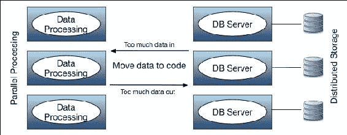

图 1：传统分布式处理的实际应用。

在生命科学中成功完成人类基因组计划后，实时物联网数据、传感器数据、移动设备数据和网络数据正在创造数据洪流，并为大数据做出贡献，这在很大程度上推动了数据密集型计算的发展。如今，数据密集型计算正在以一种新兴的方式不断发展，这需要一个集成的基础设施或计算范式，以便将计算资源和数据带入一个共同的平台，并在其上进行分析。原因是多样的，因为大数据在复杂性（**容量**、**多样性**和**速度**）方面确实非常庞大，从操作角度来看，还有四个 ms（即**移动**、**管理**、**合并**和**整理**）。

此外，由于本书将讨论大规模机器学习应用程序，我们还需要考虑一些额外的关键评估参数，如有效性、真实性、价值和可见性，以促进业务增长。可见性很重要，因为假设你有一个大小为 1PB 的大数据集；但是如果没有可见性，一切都是一个黑洞。我们将在接下来的章节中更详细地解释大数据价值。

在单个系统中存储和处理这些大规模和复杂的大型数据集可能是不可行的；因此，它们需要被分区并存储在多台物理机器上。大型数据集被分区或分布，但为了处理和分析这些严格复杂的数据集，数据库服务器和应用程序服务器可能需要增加，以加强大规模的处理能力。同样，多维度中出现的性能瓶颈问题最糟糕，需要一种新的、更数据密集的大数据处理和相关计算范式。

## 将代码移动到数据

为了克服先前提到的问题，迫切需要一种新的计算范式，这样我们就可以将代码或应用程序移动到数据中，执行数据操作、处理和相关计算（也就是说，数据存储的地方）。由于您已经了解了动机和目标，现在可以将反转的编程模型称为**将代码移动到数据并在分布式系统上进行并行处理**，可以在以下图表中可视化：

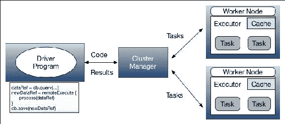

图 2：新的计算（将代码移动到数据并在分布式系统上进行并行处理）。

为了理解*图 2*中所示的工作流程，我们可以设想一个新的编程模型，描述如下：

+   使用您在个人计算机上启动的应用程序执行大数据处理（让我们称之为**驱动程序**），它在集群、网格或更开放地说是云中远程协调执行。

+   现在你需要做的是将开发的应用程序/算法/代码段（可以使用命令行或 shell 脚本调用或撤销）转移到具有大容量存储、主存储器和处理能力的计算/工作节点。我们可以简单地想象要计算或操作的数据已经存储在这些计算节点中，作为分区或块。

+   可以理解的是，由于网络或计算瓶颈，大容量数据不再需要传输（上传/下载）到驱动程序，而是仅在其变量中保存数据引用，基本上是一个地址（主机名/IP 地址和端口），用于在集群中定位存储在计算节点中的物理数据（当然，也可以使用其他解决方案进行大容量上传，例如可扩展的配置，将在后面的章节中讨论）。

+   那么远程计算节点有什么？它们既有数据，也有执行数据计算和必要处理以实现输出或修改数据的代码，而不离开它们的家（更准确地说是计算节点）。

+   最后，根据您的请求，只有结果可以通过网络传输到您的驱动程序进行验证或其他分析，因为原始数据集有许多子集。

值得注意的是，通过将代码移动到数据，计算结构已经发生了巨大变化。最有趣的是，网络传输的数据量显著减少。这里的理由是，您只会将一小部分软件代码传输到计算节点，并收到原始数据的一个小子集作为返回的结果。这是 Spark 为我们带来的大数据处理最重要的范式转变，它引入了 RDD、数据集、DataFrame 和其他有利特性，这意味着在大数据工程和集群计算历史上有着巨大的革命。然而，为了简洁起见，下一节我们将只讨论 RDD 的概念，其他计算特性将在接下来的章节中讨论。

## RDD - 一种新的计算范式

为了理解新的计算范式，我们需要了解**弹性分布式数据集**（**RDDs**）的概念及 Spark 如何实现数据引用的概念。因此，它已经能够轻松地将数据处理扩展。RDD 的基本特点是它帮助您几乎像处理任何其他数据对象一样处理输入数据集。换句话说，它带来了输入数据类型的多样性，这是您在基于 Hadoop 的 MapReduce 框架中极度缺失的。

RDD 以一种弹性的方式提供了容错能力，一旦创建就无法更改，Spark 引擎将尝试在操作失败时迭代操作。它是分布式的，因为一旦执行了分区操作，RDD 会自动通过分区在集群中分布。RDD 允许您更多地处理输入数据集，因为 RDD 也可以快速而稳健地转换为其他形式。同时，RDD 也可以通过操作转储并在逻辑上相关或计算上同质的应用程序之间共享。这是因为它是 Spark 通用执行引擎的一部分，可以获得大规模的并行性，因此几乎可以应用于任何类型的数据集。

然而，为了在输入数据上进行 RDD 和相关操作，Spark 引擎要求您在数据指针（即引用）和输入数据本身之间建立明显的界限。基本上，您的驱动程序不会保存数据，而只会保存数据的引用，数据实际上位于集群中的远程计算节点上。

为了使数据处理更快、更容易，Spark 支持可以在 RDD 上执行的两种操作：转换和操作（请参考*图 3*）。转换操作基本上是从现有数据集创建一个新数据集。另一方面，操作在成功计算远程服务器上的输入数据集后，将一个值实现为驱动程序（更确切地说是计算节点）。

由驱动程序启动的数据执行方式构建了一个**有向无环图**（**DAG**）样式的图表；其中节点表示 RDD，转换操作由边表示。然而，执行本身直到执行操作之前不会在 Spark 集群中的计算节点中开始。然而，在开始操作之前，驱动程序将执行图（表示数据计算流水线或工作流的操作方式）和代码块（作为特定领域的脚本或文件）发送到集群，每个工作节点/计算节点从集群管理节点接收一个副本：

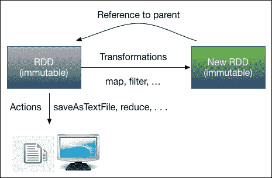

图 3：RDD 的操作（转换和操作操作）。

在继续下一节之前，我们建议您更详细地了解操作和转换操作。虽然我们将在第三章中详细讨论这两种操作，但目前 Spark 支持两种类型的转换操作。第一种是窄转换，其中数据混合是不必要的。典型的 Spark 窄转换操作使用`filter()`、`sample()`、`map()`、`flatMap()`、`mapPartitions()`等方法进行。宽转换对于对输入数据集进行更广泛的更改是必不可少的，以便将数据从多个数据分区中的共同节点中带出。宽转换操作包括`groupByKey()`、`reduceByKey()`、`union()`、`intersection()`、`join()`等。

动作操作通过触发执行作为**有向无环图**（**DAG**）样式返回 RDD 计算的最终结果到驱动程序。但实际上，材料化的结果实际上是写在存储中的，包括数据对象的中间转换结果，并返回最终结果。常见的动作包括：`first()`、`take()`、`reduce()`、`collect()`、`count()`、`saveAsTextFile()`、`saveAsSequenceFile()`等。在这一点上，我们相信您已经掌握了 RDD 的基本操作，因此我们现在可以以自然的方式定义 RDD 和相关程序。Spark 提供的典型 RDD 编程模型可以描述如下：

+   从环境变量中，Spark 上下文（Spark shell 或 Python Pyspark 为您提供了一个 Spark 上下文，或者您可以自己创建，这将在本章后面描述）创建一个初始数据引用 RDD 对象。

+   通过转换初始 RDD 以创建更多的 RDD 对象，遵循函数式编程风格（稍后将讨论）。

+   将代码/算法/应用程序从驱动程序发送到集群管理器节点。然后集群管理器为每个计算节点提供一个副本。

+   计算节点在其分区中保存 RDD 的引用（同样，驱动程序也保存数据引用）。然而，计算节点也可以由集群管理器提供输入数据集。

+   在转换之后（通过窄转换或宽转换），生成的结果将是全新的 RDD，因为原始的 RDD 不会被改变。最后，通过动作将 RDD 对象或更多（具体数据引用）实现为将 RDD 转储到存储中。

+   驱动程序可以请求计算节点为程序的分析或可视化结果请求一部分结果。

等等！到目前为止，我们一切顺利。我们假设您将把应用程序代码发送到集群中的计算节点。但是您仍然需要上传或发送输入数据集到集群中以分发给计算节点。即使在大量上传期间，您也需要通过网络传输数据。我们还认为应用程序代码和结果的大小是可以忽略不计的。另一个障碍是，如果您/我们希望 Spark 进行规模计算的数据处理，可能需要首先从多个分区合并数据对象。这意味着我们需要在工作节点/计算节点之间进行数据洗牌，通常通过`partition()`、`intersection()`和`join()`转换操作来完成。

坦率地说，数据传输并没有完全消除。正如我们和你理解的那样，特别是对于这些操作的大量上传/下载所贡献的开销，它们对应的结果如下：

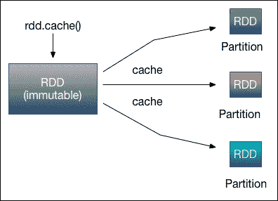

图 4：RDD 的操作（缓存机制）。

好吧，我们已经受到了这些负担的影响是事实。然而，使用 Spark 的缓存机制可以显著减少或解决这些情况。想象一下，您将在相同的 RDD 对象上多次执行操作，这些对象具有很长的血统；这将导致执行时间的增加以及计算节点内部的数据移动。您可以使用 Spark 的缓存机制（*图 4*）来消除（或至少减少）这种冗余，该机制将 RDD 的计算结果存储在内存中。这样就可以消除每次的重复计算。因为当您在 RDD 上进行缓存时，其分区将加载到主内存中，而不是节点的磁盘（但是，如果内存空间不足，将使用磁盘）。这种技术使得 Spark 集群上的大数据应用程序在每一轮并行处理中明显优于 MapReduce。我们将在第三章中详细讨论 Spark 数据操作和其他技术，*通过了解数据来理解问题*。

# Spark 生态系统

为了提供更多增强和额外的大数据处理能力，Spark 可以配置并在现有基于 Hadoop 的集群上运行。正如已经提到的，尽管 Hadoop 提供了**Hadoop 分布式文件系统**（**HDFS**）以便廉价高效地存储大规模数据；然而，MapReduce 提供的计算完全基于磁盘。MapReduce 的另一个限制是；只能使用高延迟批处理模型执行简单计算，或者更具体地说是静态数据。另一方面，Spark 的核心 API 是用 Java、Scala、Python 和 R 编写的。与 MapReduce 相比，Spark 具有更通用和强大的编程模型，还提供了几个库，这些库是 Spark 生态系统的一部分，用于大数据分析、处理和机器学习领域的冗余功能。如*图 5*所示，Spark 生态系统包括以下组件：

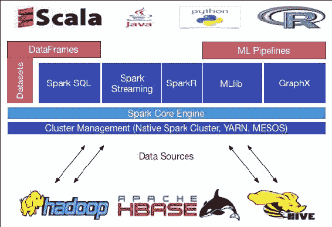

图 5：Spark 生态系统（截至 Spark 1.6.1）。

正如我们已经提到的，可以无缝地结合这些 API 来开发大规模的机器学习和数据分析应用程序。此外，可以通过访问 HDFS、Cassandra、HBase、Amazon S3 甚至 RDBMs 等数据存储和源，在各种集群管理器上执行作业，如 Hadoop YARN、Mesos、独立或云端。

然而，Spark 还具有其他功能和 API。例如，最近思科宣布向 Spark 生态系统投资 1.5 亿美元，用于思科 Spark 混合服务（[`www.cisco.com/c/en/us/solutions/collaboration/cloud-collaboration/index.html`](http://www.cisco.com/c/en/us/solutions/collaboration/cloud-collaboration/index.html)）。因此，思科 Spark 开放 API 可以提高其在开发人员中的受欢迎程度（高度安全的协作和将智能手机系统连接到云端）。除此之外，Spark 最近集成了 Tachyon（[`ampcamp.berkeley.edu/5/exercises/tachyon.html`](http://ampcamp.berkeley.edu/5/exercises/tachyon.html)），这是一个分布式内存存储系统，可以经济地适应内存，进一步提高 Spark 的性能。

## Spark 核心引擎

Spark 本身是用 Scala 编写的，它是一种功能性的面向对象编程语言，运行在 JVM 之上。此外，如图 5 所示，Spark 的生态系统是建立在通用和核心执行引擎之上的，该引擎在不同语言中实现了一些可扩展的 API。较低级别的层或较高级别的层也使用 Spark 核心引擎作为通用执行作业执行引擎，并在其上提供所有其他功能。Spark Core 已经提到是用 Scala 编写的，并且在 Java 虚拟机上运行，高级 API（即 Spark MLlib、SparkR、Spark SQL、Dataset、DataFrame、Spark Streaming 和 GraphX）在执行时使用核心。

Spark 已经使内存计算模式得到了很大的可见度。这个概念（内存计算）使得 Spark 核心引擎能够通过通用执行模型来提高速度，从而开发多样化的应用程序。

用 Java、Scala、R 和 Python 编写的通用数据计算和机器学习算法的低级实现对大数据应用程序开发非常容易。Spark 框架是基于 Scala 构建的，因此在 Scala 中开发 ML 应用程序可以访问最新的功能，这些功能最初可能在其他 Spark 语言中不可用。然而，这并不是一个大问题，开源社区也关注全球开发者的需求。因此，如果您需要开发特定的机器学习算法，并希望将其添加到 Spark 库中，您可以向 Spark 社区做出贡献。Spark 的源代码在 GitHub 上是公开可用的。您可以提交拉取请求，开源社区将在将其添加到主分支之前审查您的更改或算法。有关更多信息，请查看 Spark Jira confluence 网站。

Python 以前是数据科学家的强大工具，Python 在 Spark 中的贡献也不例外。这意味着 Python 也有一些优秀的用于数据分析和处理的库；然而，它相对较慢。另一方面，R 具有丰富的环境，用于数据处理、数据预处理、图形分析、机器学习和统计分析，这可以帮助提高开发者的生产力。对于来自 Java 和 Hadoop 背景的开发者来说，Java 绝对是一个不错的选择。然而，Java 也有与 Python 类似的问题，因为 Java 也比 Scala 慢。

最近在 Databricks 网站上发布的一项调查显示，Spark 用户中有 58%使用 Python，71%使用 Scala，31%使用 Java，18%使用 R 来开发他们的 Spark 应用程序。然而，在本书中，我们将尽量以 Java 为主要示例，必要时会使用少量 Scala 来简化。这是因为许多读者非常熟悉基于 Java 的 MapReduce。然而，我们将在附录中提供一些在 Python 或 R 中使用相同示例的提示。

## Spark SQL

Spark SQL 是用于查询和结构化数据处理的 Spark 组件。需求是显而易见的，因为许多数据科学工程师和商业智能分析师也依赖于交互式 SQL 查询来探索来自 RDBMS 的数据。以前，企业经常使用 MS SQL 服务器、Oracle 和 DB2。然而，这些工具不具备可扩展性或交互性。因此，为了使其更容易，Spark SQL 提供了一个称为 DataFrames 和数据集的编程抽象，它们作为分布式 SQL 查询引擎，支持在现有部署和数据上执行未修改的 Hadoop Hive 查询，速度提高了 100 倍。Spark SQL 与 Spark 生态系统的其他部分强大地集成在一起。

最近，Spark 提供了一个新的实验性接口，通常称为数据集（将在下一节中详细讨论），它提供了与 RDD 相同的好处，可以强大地使用`lambda`函数。Lambda 源自 Lambda 演算（[`en.wikipedia.org/wiki/Lambda_calculus`](http://en.wikipedia.org/wiki/Lambda_calculus)），指的是计算机编程中的匿名函数。这是现代编程语言中的一个灵活概念，允许您快速编写任何函数而不给它们命名。此外，它还提供了一种写闭包的好方法。例如，在 Python 中：

```scala
def adder(x): 
    return lambda y: x + y 
add6 = adder(6) 
add4(4) 

```

它返回结果为`10`。另一方面，在 Java 中，如果一个整数是奇数还是偶数，可以类似地编写：

```scala
Subject<Integer> sub = x -> x % 2 = 0; // Tests if the parameter is even. 
boolean result = sub.test(8); 

true since 8 is divisible by 2.
```

请注意，在 Spark 2.0.0 中，Spark SQL 在 SQL 2003 支持的基础上大幅改进了 SQL 功能。因此，现在 Spark SQL 可以执行所有 99 个 TPC-DS 查询。更重要的是，现在原生 SQL 解析器支持 ANSI_SQL 和 Hive QL。原生 DDL 是一个可以执行的命令，它现在也支持 SQL 的子查询和规范化支持的视图。

## DataFrames 和数据集的统一

在最新的 Spark 2.0.0 版本中，在 Scala 和 Java 中，DataFrame 和数据集已经统一。换句话说，DataFrame 只是行数据集的类型别名。然而，在 Python 和 R 中，由于缺乏类型安全性，DataFrame 是主要的编程接口。对于 Java，不再支持 DataFrame，而只支持基于数据集和 RDD 的计算，DataFrame 已经过时（请注意，它已经过时 - 而不是被折旧）。虽然为了向后兼容性保留了 SQLContext 和 HiveContext；然而，在 Spark 2.0.0 版本中，替代 DataFrame 和数据集 API 的新入口点是 SparkSession。

## Spark Streaming

您可能希望您的应用程序能够处理和分析不仅是静态数据集，还有实时流数据。为了使您的愿望更容易实现，Spark Streaming 提供了将应用程序与流行的批处理和流数据源集成的功能。最常用的数据源包括 HDFS、Flume、Kafka 和 Twitter，它们可以通过它们的公共 API 使用。这种集成允许用户在流和历史数据上开发强大的交互式和分析应用程序。除此之外，容错特性是通过 Spark Streaming 实现的。

## 图计算 - GraphX

**GraphX**是建立在 Spark 之上的弹性分布式图计算引擎。GraphX 为希望以大规模交互方式构建、转换和推理图结构化数据的用户带来了革命。作为开发人员，您将享受到简单性，以便使用少量 Scala、Java 或 Python 代码表示大规模图（社交网络图、普通网络图或天体物理学）。GraphX 使开发人员能够充分利用数据并行和图并行系统，通过简单快速地表达图计算。GraphX 柜中增加的另一个美丽之处是，它可以用于构建实时流数据上的端到端图分析管道，其中图空间分区用于处理具有与每个顶点和边相关的属性的大规模有向多图。为了实现这一点，使用了一些基本的图操作符，如子图、joinVertices 和 aggregateMessages，以及 Pregel API 的优化变体。

## 机器学习和 Spark ML 管道

传统的机器学习应用程序是使用 R 或 Matlab 构建的，存在可扩展性问题。Spark 引入了两个新兴的 API，Spark MLlib 和 Spark ML。这些 API 使得机器学习成为了工程大数据的可行见解，以消除可扩展性约束。建立在 Spark 之上，MLlib 是一个可扩展的机器学习库，拥有众多高质量的算法，具有高精度性能，主要适用于 RDD。Spark 为开发人员提供了许多语言选项，包括 Java、Scala、R 和 Python，以开发完整的工作流程。另一方面，Spark ML 是一个 ALPHA 组件，它增强了一组新的机器学习算法，让数据科学家可以快速组装和配置基于 DataFrames 的实用机器学习管道。

## 统计计算 - SparkR

SparkR 是一个专为熟悉 R 语言并希望分析大型数据集并从 R shell 交互式运行作业的数据科学家设计的 R 包，支持所有主要的 Spark DataFrame 操作，如聚合、过滤、分组、摘要统计等。同样，用户还可以从本地 R 数据框或任何 Spark 支持的数据源（如 Hive、HDFS、Parquet 或 JSON）创建 SparkR 数据框。从技术上讲，Spark DataFrame 的概念类似于 R 的本机 DataFrame（[`cran.r-project.org/web/packages/dplyr/vignettes/data_frames.html`](https://cran.r-project.org/web/packages/dplyr/vignettes/data_frames.html)），另一方面，在语法上类似于`dplyr`（一个 R 包，参见[`cran.rstudio.com/web/packages/dplyr/vignettes/introduction.html`](https://cran.rstudio.com/web/packages/dplyr/vignettes/introduction.html)），但存储在集群设置中。

# Spark 机器学习库

在本节中，我们将描述两个主要的机器学习库（Spark MLib 和 Spark ML）以及最广泛使用的实现算法。最终目标是让您对 Spark 的机器学习宝藏有所了解，因为许多人仍然认为 Spark 只是一个通用的内存大数据处理或集群计算框架。然而，情况并非如此，相反，这些信息将帮助您了解使用 Spark 机器学习 API 可以做些什么。此外，这些信息将帮助您探索并增加使用 Spark MLlib 和 Spark ML 部署实际机器学习管道的可用性。

## 使用 Spark 进行机器学习

在 Spark 时代之前，大数据建模者通常使用统计语言（如 R 和 SAS）构建他们的机器学习模型。然后数据工程师通常会重新在 Java 中实现相同的模型以部署在 Hadoop 上。然而，这种工作流程缺乏效率、可伸缩性、吞吐量和准确性，执行时间也较长。使用 Spark，可以构建、采用和部署相同的机器学习模型，使整个工作流程更加高效、稳健和快速，从而提供实时洞察力以提高性能。Spark 机器学习库的主要目标是使实际的机器学习应用可扩展、更快速和更容易。它包括常见和广泛使用的机器学习算法及其实用工具，包括分类、回归、聚类、协同过滤和降维。它分为两个包：Spark MLlib（`spark.mllib`）和 Spark ML（`spark.ml`）。

## Spark MLlib

MLlib 是 Spark 的机器学习库。它是一个分布式的低级库，使用 Scala、Java 和 Python 针对 Spark 核心运行时编写。MLlib 主要关注学习算法及其适当的实用工具，不仅提供机器学习分析能力。主要的学习工具包括分类、回归、聚类、推荐系统和降维。此外，它还有助于优化用于开发大规模机器学习流水线的通用原语。正如前面所述，MLlib 带有一些令人兴奋的 API，使用 Java、Scala、R 和 Python 编写。Spark MLlib 的主要组件将在以下部分中描述。

### 数据类型

Spark 提供了支持存储在单台机器上的本地向量和矩阵数据类型，以及由一个或多个 RDD 支持的分布式矩阵。本地向量和矩阵是简单的数据模型，用作公共接口。向量和矩阵操作严重依赖于线性代数运算，建议在使用这些数据类型之前先获取一些背景知识。

### 基本统计

Spark 不仅提供了对 RDD 进行列摘要和基本统计的功能，还支持计算两个或多个数据系列之间的相关性，或者更复杂的相关性操作，例如在许多数据系列之间的成对相关性，这是统计学中的常见操作。然而，目前仅支持 Pearson 和 Spearman 的相关性，未来 Spark 版本将添加更多相关性。与其他统计函数不同，Spark 还支持分层抽样，并且可以在 RDD 的键值对上执行；但是，一些功能尚未添加到 Python 开发人员。

Spark 仅提供 Pearson 卡方检验用于假设检验的拟合优度和声明假设的独立性，这是统计学中的一种强大技术，用于确定结果是否在统计上显著以满足声明。Spark 还提供了一些在线实现的测试，以支持诸如 A/B 测试之类的用例，通常在实时流数据上执行显著性测试。Spark 的另一个令人兴奋的功能是生成随机双重 RDD 或向量 RDD 的工厂方法，这对于随机算法、原型、性能和假设检验非常有用。当前 Spark MLib 中的其他功能提供了从样本 RDD 计算核密度估计的计算功能，这是一种用于可视化经验概率分布的有用技术。

### 分类和回归

分类是一个典型的过程，它帮助新的数据对象和组件根据训练数据进行组织、区分和理解，或者以某种方式属于某种方式。在统计计算中，存在两种类型的分类，二元分类（也常常被称为二项分类）和多类分类。二元分类是将给定观察的数据对象分类为两组的任务。**支持向量机**（**SVMs**）、逻辑回归、决策树、随机森林、梯度提升树和朴素贝叶斯已经实现到 Spark 的最新版本。

多类分类，另一方面，是将给定观察的数据对象分类到两组以上的任务。逻辑回归、决策树、随机森林和朴素贝叶斯被实现为多类分类。然而，更复杂的分类算法，如多级分类和多类感知器尚未被实现。回归分析也是一种估计变量或观察之间关系的统计过程。除了分类过程，回归分析还涉及多种建模和分析数据对象的技术。目前，Spark MLlib 库支持以下算法：

+   线性最小二乘

+   套索

+   岭回归

+   决策树

+   随机森林

+   梯度提升树

+   等渗回归

### 推荐系统开发

智能和可扩展的推荐系统是一种新兴的应用，目前许多企业正在开发，以扩大他们的业务和成本，以实现对客户的推荐自动化。协同过滤方法是推荐系统中最广泛使用的算法，旨在填补用户-项目关联矩阵的缺失条目。例如，Netflix 就是一个例子，他们成功地减少了数百万美元的电影推荐。然而，目前 Spark MLlib 的实现只提供了基于模型的协同过滤技术。

基于模型的协同过滤算法的优点是用户和产品可以通过一小组潜在因素来描述，使用**交替最小二乘**（**ALS**）算法来预测缺失的条目。缺点是用户评分或反馈不能被考虑在内以预测兴趣。有趣的是，开源开发人员也在努力开发一种基于内存的协同过滤技术，以纳入 Spark MLib 中，其中用户评分数据可以用于计算用户或项目之间的相似性，使得机器学习模型更加多功能。

### 聚类

聚类是一种无监督的机器学习问题/技术。其目的是根据某种相似性概念将实体的子集彼此分组，通常用于探索性分析和开发分层监督学习管道。Spark MLib 提供了对各种聚类模型的支持，如 K 均值、高斯矩阵、**幂迭代聚类**（**PIC**）、**潜在狄利克雷分配**（**LDA**）、二分 K 均值和来自实时流数据的流式 K 均值。我们将在接下来的章节中更多地讨论监督/无监督和强化学习。

### 降维

处理高维数据既酷又需要满足与大数据相关的复杂性。然而，高维数据的一个问题是不需要的特征或变量。由于所有测量的变量可能对建立模型并不重要，为了回答感兴趣的问题，您可能需要减少搜索空间。因此，基于某些考虑或要求，我们需要在创建任何模型之前减少原始数据的维度，而不损害原始结构。

MLib API 的当前实现支持两种降维技术：**奇异值分解**（**SVD**）和**主成分分析**（**PCA**），用于存储在面向行的格式中的高瘦矩阵和任何向量。SVD 技术存在一些性能问题；然而，PCA 是降维中最广泛使用的技术。这两种技术在大规模 ML 应用中非常有用，但它们需要对线性代数有很强的背景知识。

### 特征提取和转换

Spark 提供了不同的技术，通过**词频-逆文档频率**（**TF-IDF**）、**Word2Vec**、**标准缩放器**、**ChiSqSelector**等，使特征工程易于使用。如果您正在从事或计划从事文本挖掘领域的工作，TF-IDF 将是 Spark MLlib 中一个有趣的选项。TF-IDF 提供了一种特征向量化方法，以反映术语对语料库中文档的重要性，这对开发文本分析管道非常有帮助。

此外，您可能对在文本分析的 ML 应用中使用 Word2Vec 计算机分布式词向量表示感兴趣。Word2Vec 的这一特性最终将使您在新颖模式领域的泛化和模型估计更加健壮。您还可以使用 StandardScaler 来通过基于列摘要统计的单位方差缩放或去除均值来规范提取的特征。在构建可扩展的 ML 应用程序的预处理步骤中通常在训练数据集中执行。假设您已通过这种方法提取了特征，现在您需要选择要纳入 ML 模型的特征。因此，您可能还对 Spark MLlib 的 ChiSqSelector 算法进行特征选择感兴趣。ChiSqSelector 在 ML 模型构建过程中尝试识别相关特征。显然，其目的是减少特征空间的大小以及树状方法中的搜索空间，并改善强化学习算法中的速度和统计学习行为。

### 频繁模式挖掘

在开始构建 ML 模型之前，分析大规模数据集通常是挖掘频繁项、最大频繁模式/项集、连续频繁模式或子序列等的第一步。Spark MLib 的当前实现提供了 FP-growth 的并行实现，用于挖掘频繁模式和关联规则。它还提供了另一个流行算法 PrefixSpan 的实现，用于挖掘序列模式。但是，您将需要根据需要定制算法来挖掘最大频繁模式。我们将在即将到来的章节中提供一个可扩展的 ML 应用程序，用于挖掘隐私并保留最大频繁模式。

## Spark ML

Spark ML 是一个 ALPHA 组件，它为用户提供了一组新的机器学习 API，让用户可以快速组装和配置实用的机器学习管道，基于 DataFrames。在赞扬 Spark ML 的特性和优势之前，我们应该了解可以应用和开发到各种数据类型的 DataFrames 机器学习技术，例如向量、非结构化（即原始文本）、图像和结构化数据。为了支持各种数据类型，使应用程序开发更容易，最近，Spark ML 采用了来自 Spark SQL 的 DataFrame 和 Dataset。

数据框架或数据集可以从支持基本和结构化类型的对象的 RDD 隐式或显式创建。Spark ML 的目标是提供一组统一的高级 API，构建在数据框架和数据集之上，而不是 RDD。它帮助用户创建和调整实际的机器学习管道。Spark ML 还提供了用于开发可扩展 ML 管道的特征估计器和转换器。Spark ML 系统化了许多 ML 算法和 API，使得更容易将多个算法组合成单个管道或数据工作流，使用数据框架和数据集的概念。

特征工程中的三个基本步骤是特征提取、特征转换和选择。Spark ML 提供了几种算法的实现，使这些步骤更容易。提取提供了从原始数据中提取特征的功能，而转换提供了从提取步骤中找到的特征进行缩放、转换或修改的功能，选择则帮助从第二步的较大特征集中选择子集。Spark ML 还提供了几种分类（逻辑回归、决策树分类器、随机森林分类器等）、回归（线性回归、决策树回归、随机森林回归、生存回归和梯度提升树回归）、决策树和树集成（随机森林和梯度提升树）以及聚类（K 均值和 LDA）算法的实现，用于在数据框架之上开发 ML 管道。我们将在第三章中更多地讨论 RDD 和数据框架及其基础操作，*通过了解数据来理解问题*。

# 安装和开始使用 Spark

Spark 是 Apache Hadoop 的继任者。因此，最好将 Spark 安装和工作到基于 Linux 的系统中，即使您也可以尝试在 Windows 和 Mac OS 上。还可以配置 Eclipse 环境以将 Spark 作为 Maven 项目在任何操作系统上运行，并将应用程序作为具有所有依赖项的 jar 文件捆绑。其次，您可以尝试从 Spark shell（更具体地说是 Scala shell）运行应用程序，遵循与 SQL 或 R 编程相同的方式：

第三种方法是从命令行（Windows）/终端（Linux/Mac OS）开始。首先，您需要使用 Scala 或 Java 编写您的 ML 应用程序，并准备具有所需依赖项的 jar 文件。然后，可以将 jar 文件提交到集群以计算 Spark 作业。

我们将展示如何以三种方式开发和部署 Spark ML 应用程序。但是，第一个前提是准备好您的 Spark 应用程序开发环境。您可以在许多操作系统上安装和配置 Spark，包括：

+   Windows（XP/7/8/10）

+   Mac OS X（10.4.7+）

+   Linux 发行版（包括 Debian、Ubuntu、Fedora、RHEL、CentOS 等）

### 注意

请查看 Spark 网站[`spark.apache.org/documentation.html`](https://spark.apache.org/documentation.html)获取与 Spark 版本和操作系统相关的文档。以下步骤向您展示如何在 Ubuntu 14.04（64 位）上安装和配置 Spark。请注意，Spark 2.0.0 运行在 Java 7+、Python 2.6+/3.4+和 R 3.1+上。对于 Scala API，Spark 2.0.0 使用 Scala 2.11。因此，您需要使用兼容的 Scala 版本（2.11.x）。

**步骤 1：Java 安装**

在安装 Spark 时，应将 Java 安装视为安装的强制要求之一，因为基于 Java 和 Scala 的 API 需要在系统上安装 Java 虚拟机。尝试以下命令验证 Java 版本：

```scala
$ java -version 

```

如果 Java 已经安装在您的系统上，您应该看到以下消息：

```scala
java version "1.7.0_80"
Java(TM) SE Runtime Environment (build 1.7.0_80-b15)
Java HotSpot(TM) 64-Bit Server VM (build 24.80-b11, mixed mode)

```

如果您的系统上没有安装 Java，请确保在进行下一步之前安装 Java。请注意，为了使用 lambda 表达式支持，建议在系统上安装 Java 8，最好同时安装 JDK 和 JRE。尽管对于 Spark 1.6.2 和之前的版本，Java 7 应该足够：

```scala
$ sudo apt-add-repository ppa:webupd8team/java
$ sudo apt-get update
$ sudo apt-get install oracle-java8-installer

```

安装后，请不要忘记设置`JAVA_HOME`。只需应用以下命令（我们假设 Java 安装在`/usr/lib/jvm/java-8-oracle`）：

```scala
$ echo "export JAVA_HOME=/usr/lib/jvm/java-8-oracle" >> ~/.bashrc 
$ echo "export PATH=$PATH:$JAVA_HOME/bin" >> ~/.bashrc

```

您可以在主目录中的`.bashrc`文件中手动添加这些环境变量。如果找不到文件，可能是隐藏的，因此需要进行探索。只需转到**视图**选项卡并启用**显示隐藏文件**。

**步骤 2：安装 Scala**

Spark 本身是用 Scala 编写的，因此您的系统上应该安装了 Scala。通过使用以下命令检查这一点非常简单：

```scala
$ scala -version

```

如果 Scala 已经安装在您的系统上，您应该在终端上收到以下消息：

```scala
Scala code runner version 2.11.8 -- Copyright 2002-2016, LAMP/EPFL

```

请注意，在编写此安装过程时，我们使用的是最新版本的 Scala，即 2.11.8。如果您的系统上没有安装 Scala，请确保安装 Scala，因此在进行下一步之前，您可以从 Scala 网站[`www.scala-lang.org/download/`](http://www.scala-lang.org/download/)下载最新版本的 Scala。下载完成后，您应该在下载文件夹中找到 Scala `tar`文件：

1.  通过从其位置提取 Scala `tar`文件来提取，或者在终端中键入以下命令来提取 Scala tar 文件：

```scala
 $ tar -xvzf scala-2.11.8.tgz 

```

1.  现在将 Scala 分发移动到用户的透视图（例如，`/usr/local/scala`）通过以下命令或手动执行：

```scala
 $ cd /home/Downloads/ 
 $ mv scala-2.11.8 /usr/local/scala 

```

1.  设置 Scala 主目录：

```scala
$ echo "export SCALA_HOME=/usr/local/scala/scala-2.11.8" >> 
        ~/.bashrc 
$ echo "export PATH=$PATH:$SCALA_HOME/bin" >> ~/.bashrc

```

1.  安装完成后，您应该使用以下命令进行验证：

```scala
 $ scala -version

```

1.  如果 Scala 已成功配置到您的系统上，您应该在终端上收到以下消息：

```scala
Scala code runner version 2.11.8 -- Copyright 2002-2016, LAMP/EPFL

```

**步骤 3：安装 Spark**

从 Apace Spark 网站[`spark.apache.org/downloads.html`](https://spark.apache.org/downloads.html)下载最新版本的 Spark。对于此安装步骤，我们使用了最新的 Spark 稳定版本 2.0.0 版本，预先构建为 Hadoop 2.7 及更高版本。下载完成后，您将在下载文件夹中找到 Spark `tar`文件：

1.  从其位置提取 Scala `tar`文件，或者在终端中键入以下命令来提取 Scala `tar`文件：

```scala
 $ tar -xvzf spark-2.0.0-bin-hadoop2.7.tgz 

```

1.  现在将 Scala 分发移动到用户的透视图（例如，`/usr/local/spark`）通过以下命令或手动执行：

```scala
 $ cd /home/Downloads/ 
 $ mv spark-2.0.0-bin-hadoop2.7 /usr/local/spark 

```

1.  安装完 Spark 后，只需应用以下命令：

```scala
$ echo "export SPARK_HOME=/usr/local/spark/spark-2.0.0-bin-hadoop2.7" >>
      ~/.bashrc 
$ echo "export PATH=$PATH:$SPARK_HOME/bin" >> ~/.bashrc

```

**步骤 4：使所有更改永久生效**

使用以下命令对`~/.bashrc`文件进行源操作，以使更改永久生效：

```scala
$ source ~/.bashrc

```

如果执行`$ vi ~/. bashrc`命令，您将在`bashrc`文件中看到以下条目如下：

```scala
export JAVA_HOME=/usr/lib/jvm/java-8-oracle
export PATH=/usr/local/sbin:/usr/local/bin:/usr/sbin:/usr/bin:/sbin:/bin:/usr/games:/usr/local/games:/usr/lib/jvm/java-8-oracle/bin:/usr/lib/jvm/java-8-oracle/db/bin:/usr/lib/jvm/java-8-oracle/jre/bin: /usr/lib/jvm/java-8-oracle/bin
export SCALA_HOME=/usr/local/scala/scala-2.11.8
export PATH=/usr/local/sbin:/usr/local/bin:/usr/sbin:/usr/bin:/sbin:/bin:/usr/games:/usr/local/games:/usr/lib/jvm/java-8-oracle/bin:/usr/lib/jvm/java-8-oracle/db/bin:/usr/lib/jvm/java-8-oracle/jre/bin: /bin
export SPARK_HOME=/usr/local/spark/spark-2.0.0-bin-hadoop2.7
export PATH=/usr/local/sbin:/usr/local/bin:/usr/sbin:/usr/bin:/sbin:/bin:/usr/games:/usr/local/games:/usr/lib/jvm/java-8-oracle/bin:/usr/lib/jvm/java-8-oracle/db/bin:/usr/lib/jvm/java-8-oracle/jre/bin: /bin

```

**步骤 5：验证 Spark 安装**

Spark 安装的验证显示在以下截图中：

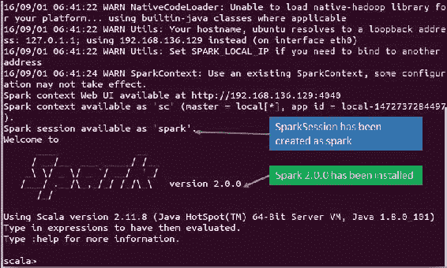

图 6：Spark shell 确认了成功安装 Spark。

写以下命令以打开 Spark shell，以验证 Spark 是否已成功配置：

```scala
$ spark-shell

```

如果 Spark 安装成功，您应该看到以下消息（*图 6*）。

Spark 服务器将在本地主机的端口`4040`上启动，更确切地说是在`http://localhost:4040/`（*图 7*）。只需转到那里，以确保它是否真的在运行：

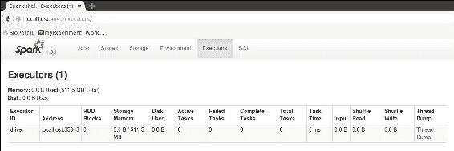

图 7：Spark 作为本地 Web 服务器运行。

干得好！现在您已经准备好在 Spark shell 上开始编写 Scala 代码。

# 使用依赖项打包您的应用程序

现在我们将向您展示如何在 Eclipse 上将应用程序打包为带有所有必需依赖项的 Java 存档（`JAR`）文件，这是一个**集成开发环境**（**IDE**）和一个用于 Java 开发的开源工具，是 Apache Maven 项目（[`maven.apache.org/`](https://maven.apache.org/)）。Maven 是一个软件项目管理和理解工具，就像 Eclipse 一样。基于**项目对象模型**（**POM**）的概念，Maven 可以管理项目的构建、报告和文档编制，从一个中央信息中。

请注意，可以使用命令提示符将用 Java 或 Scala 编写的 ML 应用程序导出为存档/可执行的 jar 文件。但是，为了简化和加快应用程序开发，我们将使用与 Eclipse 相同的 Maven 项目，以便读者可以享受相同的便利性将应用程序提交到主节点进行计算。现在让我们转到讨论如何将频繁模式挖掘应用程序导出为带有所有依赖项的 jar 文件。

**步骤 1：在 Eclipse 中创建一个 Maven 项目**

成功创建示例 Maven 项目后，您将在 Eclipse 中看到以下项目结构，如*图 8*所示：

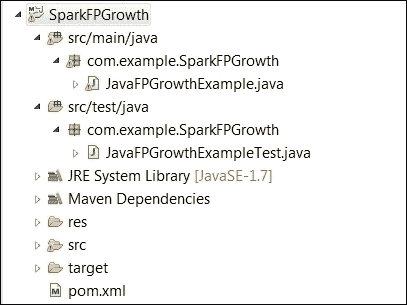

图 8：Eclipse 中的 Maven 项目结构。

**步骤 2：应用程序开发**

创建一个 Java 类，并将以下源代码复制到`src/main/java`目录下，用于挖掘频繁模式。在这里，输入文件名已经通过命令行参数或手动指定源代码来指定文件名字符串。目前，我们只提供了行注释，但是您将从第三章中了解详细信息，*通过了解数据来了解问题*以及之后的内容：

```scala
import java.util.Arrays; 
import java.util.List; 
import org.apache.spark.api.java.JavaRDD; 
import org.apache.spark.api.java.function.Function; 
import org.apache.spark.mllib.fpm.FPGrowth; 
import org.apache.spark.mllib.fpm.FPGrowthModel; 
import org.apache.spark.rdd.RDD; 
import org.apache.spark.sql.SparkSession; 

public class JavaFPGrowthExample { 
  public static void main(String[] args) { 
   //Specify the input transactional as command line argument  
   String fileName = "input/input.txt";  
   //Configure a SparkSession as spark by specifying the application name, master URL, Spark config, and Spark warehouse directory 
  SparkSession spark = SparkSession 
                  .builder() 
                  .appName("JavaFPGrowthExample") 
                  .master("local[*]") 
                  .config("spark.sql.warehouse.dir", "E:/Exp/") 
                  .getOrCreate(); 

   //Create an initial RDD by reading the input database  
   RDD<String> data = spark.sparkContext().textFile(fileName, 1); 

   //Read the transactions by tab delimiter & mapping RDD(data) 
   JavaRDD<List<String>> transactions = data.toJavaRDD().map( 
                   new Function<String, List<String>>(){ 
                   public List<String> call(String line) { 
                          String[] parts = line.split(" "); 
                          return Arrays.asList(parts); 
                                 } 
                             }); 

  //Create FPGrowth object by min. support & no. of partition     
  FPGrowth fpg = new  FPGrowth() 
                       .setMinSupport(0.2) 
                       .setNumPartitions(10); 

  //Train and run your FPGrowth model using the transactions 
  FPGrowthModel<String> model = fpg.run(transactions); 

  //Convert and then collect frequent patterns as Java RDD. After that print the frequent patterns along with their support 
    for (FPGrowth.FreqItemset<String> itemset :      
          model.freqItemsets().toJavaRDD().collect()) {   
       System.out.println(itemset.javaItems()  
                             + "==> " + itemset.freq()); 
      } 
    }   
  }  

```

**步骤 3：Maven 配置**

现在您需要配置 Maven，指定相关依赖项和配置。首先，编辑您现有的`pom.xml`文件，将每个 XML 源代码片段复制到`<dependencies>`标记内。请注意，根据 Spark 版本，您的依赖项可能会有所不同，因此请相应更改版本：

1.  Spark 核心依赖项用于 Spark 上下文和配置：

```scala
      <dependency> 
      <groupId>org.apache.spark</groupId> 
      <artifactId>spark-core_2.11</artifactId> 
      <version>2.0.0</version> 
     </dependency> 

```

1.  Spark MLib 依赖项用于 FPGrowth：

```scala
    <dependency> 
      <groupId>org.apache.spark</groupId> 
      <artifactId>spark-mllib_2.11</artifactId> 
      <version>2.0.0</version> 
     </dependency> 

```

现在您需要添加构建要求。将以下代码片段立即复制到`</dependencies>`标记之后。在这里，我们将`<groupId>`指定为 maven 插件，`<artifactId>`指定为 maven shade 插件，并使用`<finalName>`标记指定 jar 文件命名约定。确保您已经指定了源代码下载插件，设置了编译器级别，并为 Maven 设置了装配插件，如下所述：

1.  使用 Maven 指定源代码下载插件：

```scala
       <plugin> 
        <groupId>org.apache.maven.plugins</groupId> 
        <artifactId>maven-eclipse-plugin</artifactId> 
        <version>2.9</version> 
        <configuration> 
          <downloadSources>true</downloadSources> 
          <downloadJavadocs>false</downloadJavadocs> 
        </configuration> 
      </plugin>  

```

1.  为 Maven 设置编译器级别：

```scala
      <plugin> 
        <groupId>org.apache.maven.plugins</groupId> 
        <artifactId>maven-compiler-plugin</artifactId> 
        <version>2.3.2</version>         
      </plugin> 
      <plugin> 
        <groupId>org.apache.maven.plugins</groupId> 
        <artifactId>maven-shade-plugin</artifactId> 
        <configuration> 
          <shadeTestJar>true</shadeTestJar> 
        </configuration> 
      </plugin> 

```

1.  设置 Maven 装配插件：

```scala
      <plugin> 
        <groupId>org.apache.maven.plugins</groupId> 
        <artifactId>maven-assembly-plugin</artifactId> 
        <version>2.4.1</version> 
        <configuration> 
          <!-- get all project dependencies --> 
          <descriptorRefs> 
            <descriptorRef>jar-with-dependencies</descriptorRef> 
          </descriptorRefs> 
          <!-- MainClass in mainfest make a executable jar --> 
          <archive> 
            <manifest>              <mainClass>com.example.SparkFPGrowth.JavaFPGrowthExample</mainClass>            </manifest> 
          </archive> 
          <property> 
            <name>oozie.launcher.mapreduce.job.user.classpath.first</name> 
            <value>true</value> 
          </property> 
          <finalName>FPGrowth-${project.version}</finalName> 
        </configuration> 
        <executions> 
          <execution> 
            <id>make-assembly</id> 
            <!-- bind to the packaging phase --> 
            <phase>package</phase> 
            <goals> 
              <goal>single</goal> 
            </goals> 
          </execution> 
        </executions> 
      </plugin> 

```

完整的`pom.xml`文件，输入数据和 Java 源文件可以从我们的 GitHub 存储库[`github.com/rezacsedu/PacktMLwithSpark`](https://github.com/rezacsedu/PacktMLwithSpark)下载。请注意，我们使用了 Eclipse Mars Eclipse IDE for Java Developers，并且版本是 Mars Release (4.5.0)。您可以选择这个版本或其他发行版，比如 Eclipse Luna。

**步骤 4：Maven 构建**

在本节中，我们将描述如何在 Eclipse 上创建一个 Maven 友好的项目。在您按照所有步骤后，您将能够成功运行 Maven 项目。步骤应按照以下时间顺序进行：

1.  将您的项目作为 Maven 安装运行。

1.  如果您的代码和 Maven 配置文件没有问题，那么 Maven 构建将成功。

1.  构建 Maven 项目。

1.  右键单击您的项目，运行 Maven 项目为**Maven 构建...**，并在**Goals**选项中写入`clean package`。

1.  检查 Maven 依赖项。

1.  展开 Maven 依赖树，并检查是否已安装所需的 jar 文件。

1.  检查 jar 文件是否生成了依赖项。

1.  如我们所指定的，您应该在`/target`目录树下找到两个 jar 文件（参考*图 9*）。打包文件应该与`<finalName>`标签中指定的名称完全相同。现在将您的代码（jar 文件）移动到与我们的实验对齐的目录（即`/user/local/code`）和您的数据（即`/usr/local/data/`）。我们将在后期使用这个 jar 文件在 AWS EC2 集群上执行 Spark 作业。我们将在下一步讨论输入数据集。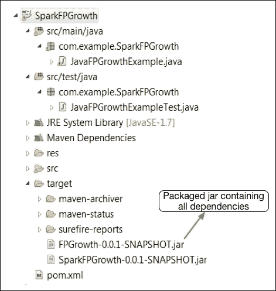

图 9：在 Eclipse 上生成了所有必需依赖项的 Maven 项目的 jar。

# 运行一个样本机器学习应用程序

在本节中，我们将描述如何从 Spark shell 在本地机器上以独立模式运行一个样本机器学习应用程序，最后我们将向您展示如何使用 Amazon EC2（[`aws.amazon.com/ec2/`](https://aws.amazon.com/ec2/)）部署和运行应用程序。

## 从 Spark shell 运行 Spark 应用程序

请注意，这只是一个检查安装和运行样本代码的练习。有关机器学习应用程序开发的详细信息将从第三章开始，*通过了解数据来理解问题*，到*第九章*，*使用流和图数据进行高级机器学习*。

现在我们将进一步进行一种流行的机器学习问题，也称为频繁模式挖掘，使用频繁模式增长或 FP-growth。假设我们有一个如下表所示的交易数据库。每行表示特定客户完成的交易。我们的目标是从数据库中找到频繁模式，这是计算关联规则（[`en.wikipedia.org/wiki/Association_rule_learning`](https://en.wikipedia.org/wiki/Association_rule_learning)）的先决条件，从客户购买规则中。将此数据库保存为`input.txt`，不包括交易 ID，在`/usr/local/data`目录中：

| **交易 ID** | **交易** |
| --- | --- |
| 12345678910 | A B C D FA B C EB C D E FA C D EC D FD E FD EC D FC FA C D E |

表 1：交易数据库。

现在让我们通过指定主机和要使用的计算核心数量来移动到 Spark shell，作为独立模式（这里有四个核心，例如）：

```scala
$ spark-shell --master "local[4]" 

```

第 1 步：加载软件包

加载所需的 FPGrowth 软件包和其他依赖软件包：

```scala
scala>import org.apache.spark.mllib.fpm.FPGrowth
scala>import org.apache.spark.{SparkConf, SparkContext}

```

第 2 步：创建 Spark 上下文

要创建一个 Spark 上下文，首先需要通过提及应用程序名称和主 URL 来配置 Spark 会话。然后，您可以使用 Spark 配置实例变量来创建一个 Spark 上下文，如下所示：

```scala
val conf = new SparkConf().setAppName(s"FPGrowthExample with $params")
val sc = new SparkContext(conf)

```

第 3 步：读取交易

让我们在创建的 Spark 上下文（`sc`）上将交易作为 RDDs 读取（参见*图 6*）：

```scala
scala> val transactions = sc.textFile(params.input).map(_.split(" ")).cache()

```

第 4 步：检查交易数量

这是用于检查交易数量的代码：

```scala
Scala>println(s"Number of transactions: ${transactions.count()}")
Number of transactions: 22
Scala>

```

第 5 步：创建 FPGrowth 模型

通过指定最小支持阈值（也请参阅[`en.wikipedia.org/wiki/Association_rule_learning`](https://en.wikipedia.org/wiki/Association_rule_learning)）和分区数来创建模型：

```scala
scala>val model = new FPGrowth()
 .setMinSupport(0.2)
 .setNumPartitions(2)
 .run(transactions)

```

第 6 步：检查频繁模式的数量

以下代码解释了如何检查频繁模式的数量：

```scala
scala> println(s"Number of frequent itemsets:
    ${model.freqItemsets.count()}")
Number of frequent itemsets: 18
Scala>

```

第 7 步：打印模式和支持

打印频繁模式及其相应的支持/频率计数（参见*图 10*）。Spark 作业将在本地主机上运行（参见*图 11*）：

```scala
scala> model.freqItemsets.collect().foreach { itemset => println(itemset.items.mkString("[", ",", "]") + ", " + itemset.freq)}

```

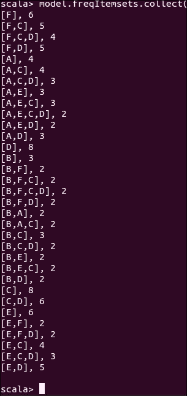

图 10：频繁模式。

## 在本地集群上运行 Spark 应用程序

一旦用户应用程序被打包为 jar 文件（用 Scala 或 Java 编写）或 Python 文件，它可以使用 Spark 分发中 bin 目录下的`spark-submit`脚本启动。

根据 Spark 网站提供的 API 文档[`spark.apache.org/docs/2.0.0-preview/submitting-applications.html`](http://spark.apache.org/docs/2.0.0-preview/submitting-applications.html)，此脚本负责设置带有 Spark 及其依赖项的类路径，并且可以支持 Spark 支持的不同集群管理器和部署模型。简而言之，Spark 作业提交语法如下：

```scala
$spark-submit [options] <app-jar | python-file> [app arguments]

```

在这里，`[options]`可以是：`--class <main-class>``--master <master-url>``--deploy-mode <deploy-mode>`，以及许多其他选项。

更具体地说，`<main-class>`是主类名称，是我们应用程序的入口点。`<master-url>`指定了集群的主 URL（例如，`spark://HOST:PORT`用于连接给定的 Spark 独立集群主节点，local 用于在本地运行具有没有并行性的一个工作线程的 Spark，`local [k]`用于在具有 K 个工作线程的本地运行 Spark 作业，这是您计算机上的核心数，`local[*]`用于在具有与计算机上逻辑核心一样多的工作线程的本地运行 Spark 作业，`mesos://IP:PORT`用于连接到可用的 Mesos 集群，甚至您可以将作业提交到 Yarn 集群-有关更多信息，请参见[`spark.apache.org/docs/latest/submitting-applications.html#master-urls`](http://spark.apache.org/docs/latest/submitting-applications.html#master-urls)）。

`<deploy-mode>`用于在工作节点（集群）上部署我们的驱动程序，或者作为外部客户端（client）在本地部署。`<app-jar>`是我们刚刚构建的 jar 文件，包括所有依赖项。`<python-file>`是使用 Python 编写的应用程序主要源代码。`[app-arguments]`可以是应用程序开发人员指定的输入或输出参数：

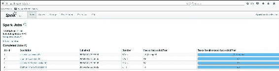

图 11：在本地主机上运行的 Spark 作业

因此，对于我们的情况，作业提交语法将如下所示：

```scala
$./bin/spark-submit --class com.example.SparkFPGrowth.JavaFPGrowthExample --master local[4] FPGrowth-0.0.1-SNAPSHOT-jar-with-dependencies.jar input.txt

```

在这里，`JavaFPGrowthExample`是用 Java 编写的主类文件；local 是主 URL；`FPGrowth-0.0.1-SNAPSHOT-jar-with-dependencies.jar`是我们刚刚通过 maven 项目生成的应用程序`jar`文件；`input.txt`是作为文本文件的事务数据库，output 是要生成输出的目录（在我们的情况下，输出将显示在控制台上）。现在让我们提交此作业以在本地执行。

如果成功执行，您将找到以下消息，包括*图 12*中的输出（摘要）：

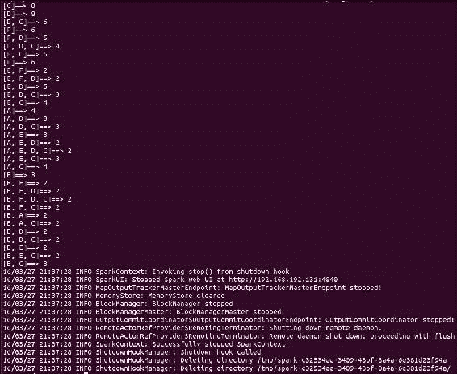

图 12：终端上的 Spark 作业输出。

## 在 EC2 集群上运行 Spark 应用程序

在前一节中，我们说明了如何在本地或独立模式下提交 spark 作业。在这里，我们将描述如何在集群模式下运行 spark 应用程序。为了使我们的应用程序在 spark 集群模式下运行，我们考虑**亚马逊弹性计算云**（**EC2**）服务，作为**基础设施即服务**（**IaaS**）或**平台即服务**（**PaaS**）。有关定价和相关信息，请参阅此网址[`aws.amazon.com/ec2/pricing/`](https://aws.amazon.com/ec2/pricing/)。

**步骤 1：密钥对和访问密钥配置**

我们假设您已经创建了 EC2 帐户。第一个要求是创建 EC2 密钥对和 AWS 访问密钥。EC2 密钥对是您在通过 SSH 进行安全连接到 EC2 服务器或实例时需要的私钥。要创建密钥，您必须通过 AWS 控制台 [`docs.aws.amazon.com/AWSEC2/latest/UserGuide/ec2-key-pairs.html#having-ec2-create-your-key-pair`](http://docs.aws.amazon.com/AWSEC2/latest/UserGuide/ec2-key-pairs.html#having-ec2-create-your-key-pair)。请参考*图 13*，显示了 EC2 帐户的密钥对创建页面：

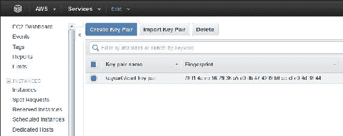

图 13：AWS 密钥对生成窗口。

一旦下载并保存在本地机器上，请将其命名为`my-key-pair.pem`。然后通过执行以下命令确保权限（出于安全目的，您应该将此文件存储在安全位置，比如`/usr/local/key`）：

```scala
$ sudo chmod  400  /usr/local/key/my-key-pair.pem

```

现在您需要的是 AWS 访问密钥，您的帐户凭据，如果您想要使用 spark-ec2 脚本从本地机器提交您的 Spark 作业到计算节点。要生成和下载密钥，请登录到您的 AWS IAM 服务 [`docs.aws.amazon.com/IAM/latest/UserGuide/id_credentials_access-keys.html#Using_CreateAccessKey`](http://docs.aws.amazon.com/IAM/latest/UserGuide/id_credentials_access-keys.html#Using_CreateAccessKey)。下载完成后（即`/usr/local/key`），您需要在本地机器上设置两个环境变量。只需执行以下命令：

```scala
$ echo "export AWS_ACCESS_KEY_ID=<access_key_id>" >> ~/.bashrc 
$ echo " export AWS_SECRET_ACCESS_KEY=<secret_access_key_id>" >> ~/.bashrc 

```

**步骤 2：在 EC2 上配置 Spark 集群**

Spark 分发（即`/usr/local/spark``/ec2`）提供了一个名为`spark-ec2`的脚本，用于从本地机器（驱动程序）在 EC2 实例上启动 Spark 集群，帮助启动、管理和关闭 Spark 集群。

### 注意

请注意，在 AWS 上启动集群将花费金钱。因此，当计算完成时，停止或销毁集群始终是一个好习惯。否则，将产生额外的费用。有关 AWS 定价的更多信息，请参阅此 URL [`aws.amazon.com/ec2/pricing/`](https://aws.amazon.com/ec2/pricing/)。

一旦您执行以下命令启动新实例，它将自动在集群上设置 Spark、HDFS 和其他依赖项：

```scala
$./spark-ec2 --key-pair=<name_of_the_key_pair> --identity-file=<path_of_the key_pair>  --instance-type=<AWS_instance_type > --region=<region> zone=<zone> --slaves=<number_of_slaves> --hadoop-major-version=<Hadoop_version> --spark-version=<spark_version> launch <cluster-name>

```

我们相信这些参数是不言自明的，或者，也可以在[`spark.apache.org/docs/latest/ec2-scripts.html`](http://spark.apache.org/docs/latest/ec2-scripts.html)上查看详细信息。对于我们的情况，应该是这样的：

```scala
$./spark-ec2 --key-pair=my-key-pair --identity-file=/usr/local/key/my-key-pair.pem  --instance-type=m3.2xlarge --region=eu-west-1 --zone=eu-west-1a --slaves=2 --hadoop-major-version=yarn --spark-version=1.6.0 launch ec2-spark-cluster-1

```

如下截图所示：

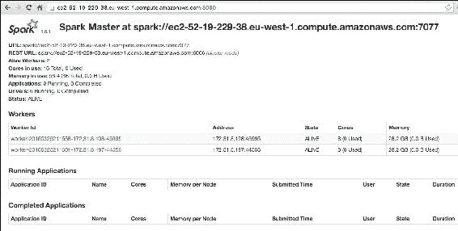

图 14：集群主页。

成功完成后，spark 集群将在您的 EC2 帐户上实例化两个工作（从属）节点。这个任务可能需要大约半个小时，具体取决于您的互联网速度和硬件配置。因此，您可能需要喝杯咖啡休息一下。在集群设置成功完成后，您将在终端上获得 Spark 集群的 URL。

要检查集群是否真的在运行，请在浏览器上检查此 URL `https://<master-hostname>:8080`，其中主机名是您在终端上收到的 URL。如果一切正常，您将发现您的集群正在运行，参见*图 14*中的集群主页。

**步骤 3：在 Spark 集群上运行和部署 Spark 作业**

执行以下命令连接到 SSH 远程 Spark 集群：

```scala
$./spark-ec2 --key-pair=<name_of_the_key_pair> --identity-file=<path_of_the _key_pair> --region=<region> login <cluster-name> 

```

对于我们的情况，应该是这样的：

```scala
$./spark-ec2 --key-pair=my-key-pair --identity-file=/usr/local/key/my-key-pair.pem --region=eu-west-1 login ec2-spark-cluster-1 

```

现在通过执行以下命令将您的应用程序（我们在 Eclipse 上生成的 Maven 项目的 jar 包）复制到远程实例（在我们的情况下是`ec2-52-48-119-121.eu-west-1.compute.amazonaws.com`）（在新终端中）：

```scala
$ scp -i /usr/local/key/my-key-pair.pem  /usr/local/code/FPGrowth-0.0.1-SNAPSHOT-jar-with-dependencies.jar ec2-user@ec2-52-18-252-59.eu-west-1.compute.amazonaws.com:/home/ec2-user/

```

然后，您需要通过执行以下命令将您的数据（在我们的情况下是`/usr/local/data/input.txt`）复制到同一远程实例：

```scala
$ scp -i /usr/local/key/my-key-pair.pem /usr/local/data/input.txt ec2-user@ec2-52-18-252-59.eu-west-1.compute.amazonaws.com:/home/ec2-user/ 

```

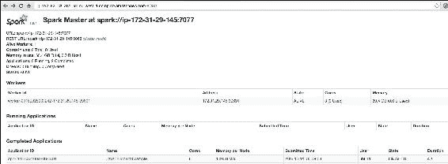

图 15：Spark 集群中作业运行状态。

干得好！您已经快完成了！现在，最后您需要提交您的 Spark 作业，让从节点或工作节点进行计算。要这样做，只需执行以下命令：

```scala
$./bin/spark-submit --class com.example.SparkFPGrowth.JavaFPGrowthExample --master spark://ec2-52-48-119-121.eu-west-1.compute.amazonaws.com:7077 /home/ec2-user/FPGrowth-0.0.1-SNAPSHOT-jar-with-dependencies.jar /home/ec2-user/input.txt

```

作业计算成功完成后，您应该在端口 8080 上看到作业的状态，就像*图 15*一样（输出将显示在终端上）。

第四步：暂停和重新启动 Spark 集群

要停止您的集群，请从本地机器执行以下命令：

```scala
$./ec2/spark-ec2 --region=<ec2-region> stop <cluster-name>

```

对于我们的情况，将会是：

```scala
$./ec2/spark-ec2 --region=eu-west-1 stop ec2-spark-cluster-1

```

要稍后重新启动集群，请执行以下命令：

```scala
$./ec2/spark-ec2 -i <key-file> --region=<ec2-region> start <cluster-name>

```

对于我们的情况，将会是以下内容：

```scala
$./ec2/spark-ec2 --identity-file=/usr/local/key/my-key-pair.pem --region=eu-west-1 start ec2-spark-cluster-1

```

### 提示

要终止您的 Spark 集群：`$./spark-ec2 destroy <cluster-name>`

在我们的情况下，将是：`$./spark-ec2 --region=eu-west-1 destroy ec2-spark-cluster-1`

如果您希望您的应用程序针对大规模数据集进行扩展，最快的方法是将它们从 Amazon S3 或 Amazon EBS 设备加载到节点上的 Hadoop 分布式文件系统（HDFS）中。我们将在后面的章节中通过实际的机器学习示例讨论这种技术。

# 参考文献

+   *弹性分布式数据集*：*内存集群计算的容错抽象*，*Zaharia，Mosharaf Chowdhury，Tathagata Das，Ankur Dave，Justin Ma，Murphy McCauley，Michael J*. *Franklin，Scott Shenker，Ion Stoica。NSDI 2012*。2012 年 4 月。

+   *Spark*：*使用工作集进行集群计算*，*Matei Zaharia，Mosharaf Chowdhury，Michael J*. *Franklin，Scott Shenker，Ion Stoica，HotCloud 2010*。2010 年 6 月。

+   *Spark SQL*：*Spark 中的关系数据处理*，*Michael Armbrust，Reynold S. Xin，Cheng Lian，Yin Huai，Davies Liu，Joseph K. Bradley，Xiangrui Meng，Tomer Kaftan，Michael J. Franklin，Ali Ghodsi，Matei Zaharia，SIGMOD 2015*。2015 年 6 月。

+   *离散化流*：*规模化的容错流计算*，*Matei Zaharia，Tathagata Das，Haoyuan Li，Timothy Hunter，Scott Shenker，Ion Stoica。SOSP 2013*。2013 年 11 月。

+   *离散化流*：*大规模集群上流处理的高效容错模型*。*Matei Zaharia，Tathagata Das，Haoyuan Li，Scott Shenker，Ion Stoica。HotCloud 2012*。2012 年 6 月。

+   *GraphX*：*统一数据并行和图并行分析*。*Reynold S. Xin，Daniel Crankshaw，Ankur Dave，Joseph E.* **Gonzalez，Michael J. Franklin**，*Ion Stoica。OSDI 2014*。2014 年 10 月。

+   *MLlib*：*Apache Spark 中的机器学习*，*Meng 等人*。*arXiv:1505.06807v1，[cs.LG]，2015 年 5 月 26 日。

+   *推荐系统*：*协同过滤技术分析*，*Christopher R. Aberger*，*斯坦福出版物，2014 年*。

# 总结

这结束了我们对 Spark 的相当快速的介绍。我们已经尝试涵盖了 Spark 的一些最基本的特性，它的计算范式，并通过安装和配置开始使用 Spark。如果 Spark ML 适合机器学习流水线概念（例如特征提取、转换和选择），则建议使用它，因为它在 DataFrame 和 Dataset 方面更加灵活多变。然而，根据 Apache 的文档，他们将继续支持和贡献 Spark MLib，并与 Spark ML 的积极开发一起。

另一方面，数据科学开发人员应该熟悉使用 Spark MLlib 的特性，并期待将来有更多的特性。然而，一些算法目前尚不可用，或者有待添加到 Spark ML 中，尤其是降维。尽管如此，开发人员可以无缝地将这些在 Spark MLib 中找到的技术实现与 Spark ML 中找到的其他算法结合起来，作为混合或可互操作的机器学习应用。我们还展示了一些在集群和云服务上部署机器学习应用的基本技术，尽管您也可以尝试其他可用的部署选项。

### 提示

有关更多更新，请感兴趣的读者参考 Spark 网站[`spark.apache.org/docs/latest/mllib-guide.html`](http://spark.apache.org/docs/latest/mllib-guide.html)获取发布日期、API 和规范。由于 Spark 的开源社区和来自全球各地的开发人员不断丰富和更新实现，因此最好保持更新。

在下一章（第二章，*机器学习最佳实践*），我们将讨论在使用 Spark 开发高级机器学习时的一些最佳实践，包括机器学习任务和类、一些实际的机器学习问题及其相关讨论、机器学习应用开发中的一些最佳实践、选择适合 ML 应用的正确算法等。
