# 第二章：机器学习最佳实践

本章的目的是为那些在典型的统计培训中可能不会接触到这些方法的人提供统计机器学习（ML）技术的概念介绍。本章还旨在通过几个步骤，将新手从对机器学习的最小知识带到了解的实践者。本章的第二部分侧重于根据应用类型和要求选择合适的机器学习算法的一些建议。然后，它将引导人们在应用大规模机器学习流程时遵循一些最佳实践。简而言之，本章将讨论以下主题：

+   什么是机器学习？

+   机器学习任务

+   实际机器学习问题

+   Spark 中的大规模机器学习 API

+   实际机器学习最佳实践

+   为您的应用选择合适的算法

# 什么是机器学习？

在本节中，我们将尝试从计算机科学、统计学和数据分析的角度定义机器学习这个术语。然后我们将展示分析机器学习应用的步骤。最后，我们将讨论一些典型和新兴的机器学习任务，并列举一些需要解决的实际机器学习问题。

## 现代文献中的机器学习

让我们看看机器学习著名教授 Tom Mitchell 是如何定义机器学习这个术语的。他是 CMU 机器学习系主任，也是卡内基梅隆大学的教授。在他的文献中（*Tom M. Mitchell, The Discipline of Machine Learning, CMU-ML-06-108, July 2006*，[`www.cs.cmu.edu/~tom/pubs/MachineLearning.pdf`](http://www.cs.cmu.edu/~tom/pubs/MachineLearning.pdf)）中定义了机器学习这个术语：

> *机器学习是计算机科学和统计学交叉的自然产物。我们可以说，计算机科学的定义性问题是“我们如何构建解决问题的机器，哪些问题本质上是可解的/不可解的？”统计学的定义性问题主要是“在数据加上一组建模假设的情况下，可以推断出什么，以及推断的可靠性是什么？”机器学习的定义性问题建立在这两者之上，但它是一个独特的问题。计算机科学主要关注如何手动编程计算机，而机器学习关注的是如何让计算机自己编程（从经验中加上一些初始结构）。统计学主要关注从数据中可以推断出什么结论，而机器学习还包括关于如何最有效地捕获、存储、索引、检索和合并这些数据的计算架构和算法，以及如何在更大的系统中协调多个学习子任务，以及计算可解性的问题。*

我们相信 Tom 教授的这个定义是不言自明的。然而，我们将在接下来的两个小节中从计算机科学、统计学和数据分析的角度提供对机器学习的更清晰的理解。

### 提示

感兴趣的读者应该查阅其他资源，以获取有关机器学习及其理论视角的更多见解。在这里，我们提供了一些链接如下：*机器学习*：[`en.wikipedia.org/wiki/Machine_learning`](https://en.wikipedia.org/wiki/Machine_learning)。

*机器学习：它是什么，为什么重要* - [`www.sas.com/en_us/insights/analytics/machine-learning.html`](http://www.sas.com/en_us/insights/analytics/machine-learning.html)。

*机器学习的初步介绍*：[`www.youtube.com/watch?v=NOm1zA_Cats`](https://www.youtube.com/watch?v=NOm1zA_Cats)。

*什么是机器学习，它是如何工作的*：[`www.youtube.com/watch?v=elojMnjn4kk`](https://www.youtube.com/watch?v=elojMnjn4kk)。

*使用机器学习进行数据分析入门*：[`www.youtube.com/watch?v=U4IYsLgNgoY`](https://www.youtube.com/watch?v=U4IYsLgNgoY)。

### 机器学习和计算机科学

机器学习是计算机科学的一个分支，研究可以从启发式学习中学习的算法，这通常源自于模式识别和人工智能中的计算学习理论。艾伦·图灵脑海中出现了一个有趣的问题，即*机器能思考吗？*实际上，有一些很好的理由相信一个足够复杂的机器有一天可以通过无限制的图灵测试；让我们推迟这个问题，直到图灵测试通过。然而，机器至少可以学习。随后，阿瑟·塞缪尔是第一个在 1959 年将术语**机器学习**定义为*一种研究领域，使计算机能够在没有明确编程的情况下学习*的人。典型的机器学习任务包括概念学习、预测建模、分类、回归、聚类、降维、推荐系统、深度学习以及从大规模数据集中找到有用模式。

最终目标是通过改进学习方式使其变得自动化，以至于不再需要人类干预，或者尽可能减少人类干预的程度。尽管机器学习有时与**知识发现和数据挖掘**（**KDDM**）混淆，但后者更专注于探索性数据分析，被称为无监督学习 - 例如聚类分析、异常检测、**人工神经网络**（**ANN**）等。

其他机器学习技术包括监督学习，其中学习算法分析训练数据并生成可用于映射新示例进行预测的推断函数。分类和回归分析是监督学习的两个典型示例。另一方面，强化学习受行为主义心理学（参见[`en.wikipedia.org/wiki/Behaviorism`](https://en.wikipedia.org/wiki/Behaviorism)）的启发，通常关注软件代理如何通过最大化`奖励`函数在新的*环境*中执行动作。动态规划和智能代理是强化学习的两个示例。

典型的机器学习应用可以分为科学知识发现和更多商业应用，从机器人或**人机交互**（**HCI**）到反垃圾邮件过滤和推荐系统。

### 统计学和数据分析中的机器学习

机器学习是研究和构建算法的学科（参见[`en.wikipedia.org/wiki/Algorithm`](https://en.wikipedia.org/wiki/Algorithm)），这些算法可以从启发式学习（参见[`en.wikipedia.org/wiki/Learning`](https://en.wikipedia.org/wiki/Learning)）并对数据进行有意义的预测。然而，为了进行数据驱动的预测或决策，这些算法通过从训练数据集中构建模型（参见[`en.wikipedia.org/wiki/Mathematical_model`](https://en.wikipedia.org/wiki/Mathematical_model)）来操作，比严格遵循静态程序或指令更快。机器学习也与计算统计学密切相关并经常重叠。另一方面，计算统计学是统计学的一个应用领域，专注于通过计算机化方法进行预测。此外，它与数学优化有着密切的关系，提供了方法和计算任务以及理论和应用领域。由于对数学背景知识的强烈需求，数学中不可行的任务最适合机器学习，并可以作为替代方法应用。

另一方面，在数据分析领域，机器学习是一种用于设计复杂模型和算法的方法，这些模型和算法朝着预测未来结果的方向发展。这些分析模型允许研究人员、数据科学家、工程师和分析师通过从过去的关系（启发式）和数据中的趋势中学习来产生可靠、可重复和可再现的结果，并挖掘隐藏的见解。我们再次引用 Tom 教授的著名定义，他在文献中解释了从计算机科学的角度来看学习的真正含义（*Tom M. Mitchell, The Discipline of Machine Learning, CMU-ML-06-108, July 2006*, [`www.cs.cmu.edu/~tom/pubs/MachineLearning.pdf`](http://www.cs.cmu.edu/~tom/pubs/MachineLearning.pdf)）：

> *如果一个计算机程序在某类任务 T 上的表现，根据性能度量 P，随着经验 E 的积累而提高，那么就可以说它在任务 T 上从经验 E 中学习。*

因此，我们可以得出结论，计算机程序或机器可以：

+   从数据和历史中学习

+   可以通过经验进行改进

+   交互式地增强模型，以用于预测问题的结果

此外，以下图表帮助我们理解机器学习的整个过程：

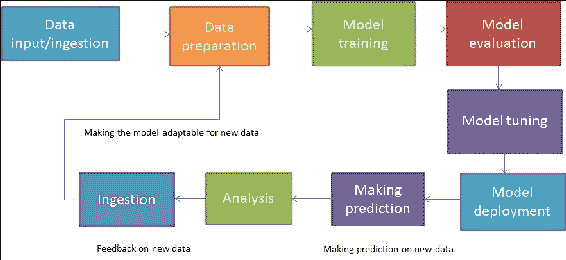

图 1：一览机器学习。

## 典型的机器学习工作流程

典型的机器学习应用包括从输入、处理到输出的几个步骤，形成了一个科学工作流程，如图 2 所示。典型的机器学习应用涉及以下步骤：

1.  加载样本数据。

1.  将数据解析成算法的输入格式。

1.  预处理数据并处理缺失值。

1.  将数据分成两组，一组用于构建模型（训练数据集），另一组用于测试模型（测试数据集或验证数据集）。

1.  运行算法来构建或训练您的机器学习模型。

1.  使用训练数据进行预测并观察结果。

1.  使用测试数据测试和评估模型，或者使用第三个数据集（验证数据集）使用交叉验证技术验证模型。

1.  调整模型以获得更好的性能和准确性。

1.  扩展模型，以便将来能处理大规模数据集。

1.  在商业化中部署机器学习模型：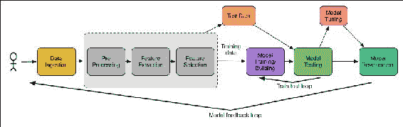

图 2：机器学习工作流程。

通常，机器学习算法有一些方法来处理数据集中的偏斜；这种偏斜有时可能非常严重。在第 4 步中，实验数据集通常被随机分成训练集和测试集，这被称为抽样。训练数据集用于训练模型，而测试数据集用于评估最佳模型的性能。更好的做法是尽可能多地使用训练数据集，以提高泛化性能。另一方面，建议只使用测试数据集一次，以避免在计算预测误差和相关指标时出现过拟合和欠拟合问题。

### 提示

过拟合是一种统计特性，描述了除了正常和基础关系之外的随机误差和噪音。当超参数相对于观察值或特征的数量过多时，它通常会发生。另一方面，欠拟合是指既不能对训练数据建模，也不能对新数据进行泛化，以适应模型评估或适应性。

然而，这些步骤包括几种技术，我们将在第五章中详细讨论这些技术。第 9 步和第 10 步通常被认为是高级步骤，因此它们将在后面的章节中讨论。

# 机器学习任务

机器学习任务或机器学习过程通常根据学习系统可用的学习反馈的性质分为三类。监督学习、无监督学习和强化学习；这三种机器学习任务在*图 3*中显示，并将在本节中讨论：

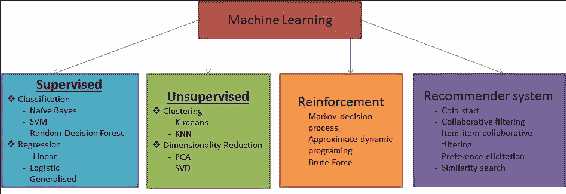

图 3：机器学习任务。

## 监督学习

**监督学习**应用程序基于一组示例进行预测，其目标是学习将输入映射到与现实世界一致的输出的一般规则。例如，用于垃圾邮件过滤的数据集通常包含垃圾邮件和非垃圾邮件。因此，我们可以知道训练集中哪些消息是垃圾邮件或非垃圾邮件。然而，我们可能有机会使用这些信息来训练我们的模型，以便对新的和未见过的消息进行分类。图 4 显示了监督学习的示意图。

换句话说，在这种情况下，用于训练机器学习模型的数据集带有感兴趣的值标签，并且监督学习算法会寻找这些值标签中的模式。算法找到所需的模式后，这些模式可以用于对未标记的测试数据进行预测。这是最流行和有用的机器学习任务类型，对于 Spark 也不例外，其中大多数算法都是监督学习技术：

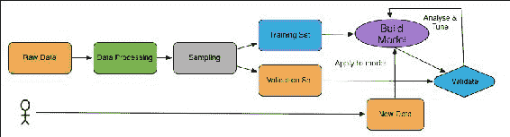

图 4：监督学习实例。

## 无监督学习

在**无监督学习**中，数据点没有相关的标签，或者换句话说，在无监督学习的训练数据集中，正确的类别是未知的，如*图 5*所示。因此，类别必须从非结构化数据集中推断出来，这意味着无监督学习算法的目标是通过描述其结构来对数据进行预处理。

为了克服无监督学习中的这一障碍，通常使用聚类技术来基于某些相似性度量对未标记的样本进行分组，挖掘隐藏模式以进行特征学习。更技术上地说，我们可以编写一个生成模型，然后告诉数据找到解释数据的参数。现在，如果我们对这种阐释的可能性不满意，接下来会发生什么？答案是，我们应该告诉数据再做一次，直到我们使用一些有效的算法或技术为止。

现在你可能会产生一个新的问题，为什么我们必须在数据上贴标签？或者我们不能只欣赏当前顺序的数据，认识到每个数据都是独特的，就像雪花一样？换句话说，通过一点监督，我们的数据可以成长为任何它想成为的东西！那么为什么未标记的数据也应该被考虑进来呢？

嗯，关于这个问题还有一些更深层次的问题。例如，数据中的大部分变化来自于与我们所期望的标记方案无关的现象。一个更现实的例子是 Gmail 如何使用监督学习技术将电子邮件分类为垃圾邮件和正常邮件，其中数据可能使用其参数来解释其语义，而我们关心的只是其句法属性：

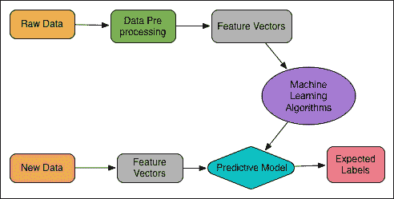

图 5：无监督学习。

## 强化学习

**强化学习**是一种技术，模型本身从一系列行为或行为中学习。在强化学习中，数据集的复杂性或样本复杂性对于算法成功学习目标函数非常重要。此外，为了实现最终目标，与外部环境互动时应确保最大化奖励函数，如*图 6*所示。为了使最大化更容易，奖励函数可以通过惩罚不良行为或奖励良好行为来利用。

为了获得最高的奖励，算法应该通过策略进行修改，也允许机器或软件代理定期学习其行为。这些行为可以一劳永逸地学习，或者随着时间的推移，机器学习模型可以不断适应：

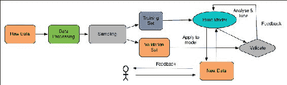

图 6：强化学习。

例如，强化学习在机器人技术中很常见；算法必须基于一组传感器读数选择机器人的下一个动作。它也是**物联网**（**IoT**）应用的自然选择，其中计算机程序与动态环境进行交互，必须实现某个目标，而没有明确的导师。另一个例子是游戏**Flappy Bird**，它已经被训练成自己玩。

## 推荐系统

推荐系统是一种新兴应用，是信息过滤系统的子类，用于预测用户通常对项目提供的评分或偏好。最近几年推荐系统的概念变得非常普遍，并随后应用于不同的应用程序。最流行的可能是产品（例如电影、音乐、书籍、研究文章、新闻、搜索查询、社交标签等）。推荐系统通常可以分为四类：

+   协同过滤系统，其中消费者的偏好和对其他用户的推荐是基于行为模式的相似性积累。

+   基于内容的系统，其中使用监督机器学习来说服分类器区分用户感兴趣和不感兴趣的项目。

+   混合推荐系统是最近的研究和混合方法（即，结合协同过滤和基于内容的过滤）。Netflix 是这样一个推荐系统的良好例子，它使用**受限玻尔兹曼机**（**RBM**）和一种矩阵分解算法来处理大型电影数据库，如 IMDb。这种推荐，通过比较相似用户的观看和搜索习惯简单地推荐电影或戏剧或流媒体，被称为评分预测。

+   基于知识的系统，其中使用有关用户和产品的知识来推理满足用户需求的内容，使用感知树、决策支持系统和基于案例的推理。

## 半监督学习

在**监督学习**和**无监督学习**之间，有一个小小的地方是**半监督学习**；在这种情况下，机器学习模型通常接收不完整的训练信号。更具体地说，机器学习模型接收到一组目标输出部分缺失的训练集。半监督学习更多地基于假设，并且通常使用三种假设算法作为未标记数据集的学习算法。使用以下假设：平滑性、聚类和流形假设。

换句话说，半监督学习还可以被称为**弱监督**或**自举**技术，用于利用未标记示例的隐藏财富来增强从少量标记数据中学习。新兴示例包括*半监督期望最小化和人类认知中的概念学习以及传递 SVM*。

# 实际机器学习问题

机器学习到底是什么意思？我们在本章的开头已经看到了一些令人信服的对这个术语的定义，以及术语“学习”的含义。然而，机器学习本身的定义取决于要解决的问题。在本节中，我们将首先强调机器学习的类别，然后列举一些现实世界中广为人知和广泛使用的机器学习问题的例子。典型的类别包括分类、聚类、规则提取和回归，这些都将被讨论。

此外，我们还将讨论基于标准机器学习问题的主要分类法的问题。这很重要，因为了解我们可能面临的问题类型可以让我们考虑我们需要的数据。另一个重要的事实是，在了解一些实际的机器学习问题之前，你可能会在开发机器学习应用程序的想法上遇到困难。换句话说，要知道问题，我们首先需要了解数据。因此，本章将讨论算法的类型及其优化问题；数据处理将在第三章中进行讨论，*通过了解数据来理解问题*。

## 机器学习类别

我们上面提到的问题类别是我们在日常生活中使用和应用机器学习技术时所指的大多数问题的标准。然而，仅仅知道机器学习类别是不够的，我们还需要知道机器正在学习什么类型的问题，因为你会发现许多问题只是简单的问题解决，并没有帮助机器学习模型或代理进行学习。

当你认为一个问题是一个机器学习问题时，更准确地说，你在考虑一个需要从数据中建模的决策问题，这可以被称为一个机器学习问题。换句话说，作为数据科学家或人类专家，如果你有足够的时间通过了解可用的数据集来回答一个特定的问题，你可以或多或少地应用一个合适的机器学习问题。因此，我们可以假设使用一些机器学习算法可以解决的问题主要有两个部分 - 数据本身，可以用来指向问题的特定观察结果，以及可用解决方案的质量的定量测量。一旦你成功地将一个问题确定为机器学习问题，你可能能够思考如何轻松地制定出什么类型的问题，或者你的客户将会要求什么样的后果，或者需要满足什么样的要求。正如上面所述，更常用的机器学习类别包括：分类、聚类、回归和规则提取。我们现在将对每个类别进行简要概述。

### 分类和聚类

如果实验数据集已经标记，这意味着已经为其分配了一个类别。例如，在垃圾邮件检测中的垃圾邮件/非垃圾邮件，或者在信用卡欺诈识别中的欺诈/非欺诈。然而，如果基本决策的数据集是未标记的，新的标签需要手动或算法地制作。这可能很困难，可以被视为一个判断问题。相反，雕刻出几个群体之间的差异或相似之处可能在计算上更加困难。

另一方面，聚类处理的是未标记或无标记的数据。然而，它仍然可以根据相似性和数据中的自然结构的其他度量来分成组。将数字相册中的图片仅按面孔组织起来而不带有姓名可能是一个例子，人类用户必须手动为组分配名称。同样，手动标记多个图像文件可能会产生相同的计算复杂性；我们将在后面的章节中提供一些示例，说明 Spark 如何提供多个 API 来解决这些问题。

## 规则提取和回归

从给定的数据集中，可以通过前提和结论以*if...then*的方式生成命题规则，定义了机器学习代理的行为。这种规则生成技术通常被称为*规则提取*。你可能会想知道这样的规则是否存在，然而，它们通常不是有针对性的。这意味着用于发现数据中属性之间的统计显著或统计相关关系的方法。

规则提取的一个例子是在面向业务的事务性数据库中挖掘项目之间的关联规则。非技术上，一个实际的例子可能是发现啤酒购买和尿布购买之间的关系或关联，这说明了顾客的愿望和机会。然而，可能会出现一些预测不一定直接涉及规则或数据的情况。

现在让我们谈谈回归，其中数据带有实际值的标签。更确切地说，一些浮点值而不是数据中的标签。理解一个例子的最简单方法是时间序列数据，类似于股票或货币随时间变化的价格。在这些类型的数据中，回归任务是通过一些回归建模技术对新的和不可预测的数据进行预测。

# 最广泛使用的机器学习问题

你会发现在日常生活中使用机器学习相关问题的大量例子，因为它们解决了广泛使用的技术或算法中的困难部分。我们经常使用许多桌面或基于网络的应用程序，即使不知道使用了哪些基础技术，也可以解决你的问题。你会惊讶地发现，其中许多实际上使用了广泛使用的机器学习算法，使你的生活更轻松。周围有许多机器学习问题。在这里，我们将提到一些真正代表机器学习的例子问题：

+   **垃圾邮件检测或垃圾邮件过滤**：给定收件箱中的一些电子邮件，任务是识别哪些电子邮件是垃圾邮件，哪些是非垃圾邮件（通常称为正常）电子邮件。现在具有挑战性的部分是开发一个可以应用的 ML 应用，以便它只能识别非垃圾邮件电子邮件留在收件箱中，并将垃圾邮件移动到相应的垃圾邮件文件夹中，或者永久从电子邮件帐户中删除它们。一个典型的例子可能是在使用 Gmail 时手动执行的操作，但如果你有一个 ML 应用程序，该应用程序将自动执行。

+   **异常检测或异常值检测**：异常检测涉及识别数据集中意外或不符合预期模式的项目、事件或观察结果；换句话说，是怀疑模式的识别。最常见的例子是使用一些机器学习应用进行网络异常检测。现在具有挑战性的任务是开发一个可以成功应用于简单识别网络中传播的异常数据点的 ML 应用。

+   信用卡欺诈检测：信用卡欺诈现在非常普遍。从网上购物中窃取信用卡相关信息，并以非法方式使用在许多国家都有发生。假设你有一个客户一个月的交易数据库。现在具有挑战性的任务是开发一个机器学习应用程序，以识别客户自己进行的交易和他人非法进行的交易。

+   语音识别：识别声音并将其转换为相应的文本命令，然后执行一些操作，就像智能代理一样。最常用的应用包括苹果的 Siri，三星的 S-Voice，亚马逊的 Echo（消费领域）和微软的 Cortana（特别是因为 Cortana 具有用于可扩展性和集成等的 SDK）。另一个例子是使用识别的声音来锁定或解锁智能手机。

+   数字/字符识别：假设你有一个手写的邮政编码、地址或信件，现在数字/字符识别的任务是识别和分类每个不同人写的手写字符的数字或字符。一个高效的机器学习应用可以帮助阅读和理解手写的邮政编码或字符，并按地理区域或更技术上的说法，按图像分割对信封内容进行分类。

+   物联网：大规模传感器数据分析，用于实时流数据的预测和分类。例如，智能客厅监控，包括水位检测，室温检测，家用电器控制等。

+   游戏分析：用于预测升级销售和针对应用内购买和修改的体育、游戏和基于控制台的游戏档案分析

+   人脸检测：给定数百或数千张照片的数字相册，任务是识别与给定人相似的照片。在这种情况下，高效的机器学习应用可以帮助按人员组织照片。

+   产品推荐：根据客户的购买历史和大量的产品库存，目标是识别客户可能有兴趣购买的产品。亚马逊、Facebook 和 Google Plus 等商业和科技巨头为用户提供了这一推荐功能。

+   股票交易：根据股票市场的当前和历史价格，预测是否应该买入或卖出股票，以便利用机器学习系统获利。

以下是一些新兴的机器学习示例和当前研究的需求：

+   隐私保护数据挖掘：从面向业务的零售数据库中挖掘最大频繁模式和关联规则，以增加未来的购买

+   作者姓名消歧：使用手动验证从给定出版物集合的作者列表的聚类结果中的随机样本来评估消歧性能

+   推荐系统：基于点击流数据的推荐系统，使用关联规则挖掘

+   文本挖掘：例如，从给定的文本语料库中检查抄袭

+   情感分析：如今很多商业和科技公司的决策都是基于他人的意见，这将是创新机器学习的好地方

+   语音理解：给定用户的话语，目标是识别用户提出的具体请求。这个问题的模型将允许程序理解并尝试满足该请求。例如，iPhone 的 Siri 和三星的语音记录器在会议模式下都实现了这个功能

其中一些问题是人工智能、自然语言处理和计算机视觉中最困难的问题，可以使用机器学习算法来解决。同样，我们将尝试开发一些强调这些问题的机器学习应用程序，在接下来的章节中进行讨论。

# Spark 中的大规模机器学习 API

在本节中，我们将描述 Spark 机器学习库（Spark MLlib 和 Spark ML）引入的两个关键概念，以及与我们在上述部分讨论的监督和无监督学习技术相一致的最常用的实现算法。

## Spark 机器学习库

如前所述，在 Spark 时代之前，大数据建模者通常使用统计语言（如 R、STATA 和 SAS）构建他们的机器学习模型。然后数据工程师通常会重新用 Java 等语言实现相同的模型，以部署在 Hadoop 上。

然而，这种工作流程缺乏效率、可扩展性、吞吐量和准确性，以及延长的执行时间。

使用 Spark，可以重新构建、采用和部署相同的机器学习模型，使整个工作流程更加高效、稳健和快速，从而使您能够提供实时洞察力以提高性能。Spark 机器学习库分为两个包：Spark MLlib（`spark.mllib`）和 Spark ML（`spark.ml`）。

### Spark MLlib

MLlib 是 Spark 的可扩展机器学习库，它是 Spark Core API 的扩展，提供了一系列易于使用的机器学习算法库。算法是用 Java、Scala 和 Python 实现和编写的。Spark 支持存储在单台机器上的本地向量和矩阵数据类型，以及由一个或多个 RDD 支持的分布式矩阵：

| **Spark MLlib** |   |   |
| --- | --- | --- |
| **ML 任务** | **离散** | **连续** |
| 监督 | 分类：逻辑回归及其正则化变体线性支持向量机朴素贝叶斯决策树随机森林梯度提升树 | 回归：线性回归及其正则化变体线性最小二乘 Lasso 和岭回归等距回归 |
| 无监督 | 聚类：K 均值高斯矩阵幂迭代聚类（PIC）潜在狄利克雷分配（LDA）二分 K 均值流式 K 均值 | 降维、矩阵分解：主成分分析奇异值分解交替最小二乘 |
| 强化 | N/A | N/A |
| 推荐系统 | 协同过滤：Netflix 推荐 | N/A |

表 1：一览 Spark MLlib。

+   **图例**：连续：对连续变量进行预测，例如，预测未来几天的最高温度

+   离散：将离散的类标签分配给特定观察结果作为预测的结果，例如，在天气预报中，可以预测晴天、雨天或雪天

Spark MLlib 的美妙之处在于众多。例如，使用 Scala、Java 和 Python 实现的算法具有高度可扩展性，并利用 Spark 处理大量数据的能力。它们设计快速，用于并行计算，基于内存的操作比 MapReduce 数据处理快 100 倍（它们还支持基于磁盘的操作，比 MapReduce 普通数据处理快 10 倍），使用 Dataset、DataFrame 或基于有向无环图（DAG）的 RDD API。

它们也是多样的，因为它们涵盖了用于回归分析、分类、聚类、推荐系统、文本分析、频繁模式挖掘的常见机器学习算法，显然也涵盖了构建可扩展机器学习应用程序所需的所有步骤。

### Spark ML

Spark ML 添加了一组新的机器学习 API，让用户可以快速组装和配置实用的机器学习管道，构建在数据集之上。Spark ML 旨在提供一组统一的高级 API，构建在 DataFrame 而不是 RDD 之上，帮助用户创建和调整实用的机器学习管道。Spark ML API 标准化了机器学习算法，使学习任务更容易将多个算法组合成单个管道或数据工作流，供数据科学家使用。

Spark ML 使用 DataFrame 的概念（尽管在 Java 中已经过时，但仍然是 Python 和 R 中的主要编程接口），这是在 Spark 1.3.0 版本中从 Spark SQL 引入的机器学习数据集。数据集包含各种数据类型，例如存储文本、特征向量和数据的真实标签的列。除此之外，Spark ML 还使用转换器将一个 DataFrame 转换为另一个，反之亦然，其中估计器的概念用于在 DataFrame 上拟合以生成新的转换器。另一方面，管道 API 可以将多个转换器和估计器一起约束，以指定一个 ML 数据工作流。参数的概念是在开发 ML 应用程序期间引入的，用于指定所有转换器和估计器在一个统一的 API 下共享一个公共 API：

| **Spark ML** |   |   |
| --- | --- | --- |
| **ML 任务** | **离散** | **连续** |
| 监督 | 分类：逻辑回归决策树分类器随机森林分类器梯度提升树分类器多层感知分类器一对多分类器 | 回归：线性回归决策树回归随机森林回归梯度提升树回归生存回归 |
| 无监督 | 聚类：K 均值潜在狄利克雷分配（LDA） | 树集成：随机森林梯度提升树 |
| 强化 | N/A | N/A |
| 推荐系统 | N/A | N/A |

表 2：一览 Spark ML（图例与表 1 相同）。

如表 2 所示，Spark ML 还提供了几种分类、回归、决策树和树集成，以及用于在 DataFrame 上开发 ML 管道的聚类算法。正在积极实施的优化算法称为**正交有限内存拟牛顿**（**OWL-QN**），这也是一种高级算法，是 L-BFGS 的扩展，可以有效处理 L1 正则化和弹性网（也请参阅 Spark ML 高级主题，[`spark.apache.org/docs/latest/ml-advanced.html`](https://spark.apache.org/docs/latest/ml-advanced.html)）。

### 从业者的重要说明

然而，目前仅支持 Pearson 和 Spearman 的相关性，并且将在未来的 Spark 版本中添加更多。与其他统计函数不同，Spark 还支持分层抽样，可以在 RDD 上作为键值对执行；但是，一些功能尚未添加到 Python 开发人员。目前在 Spark 机器学习库中没有强化学习算法模块（请参阅*表 1*和*表 2*）。Spark MLlib 的当前实现提供了 FP-growth 的并行实现，用于挖掘频繁模式和关联规则。但是，您将需要根据需要自定义算法来挖掘最大频繁模式。我们将在即将到来的章节中提供一个可扩展的 ML 应用程序，用于挖掘隐私保护的最大频繁模式。

另一个事实是，Spark 中协同推荐系统的当前实现不支持实时流数据的使用，然而，在后面的章节中，我们将尝试基于点击流数据使用关联规则挖掘来展示一个实际的推荐系统（参见 Mitchell, Tom M. *机器学习的学科*，2006 年，[`www.cs.cmu.edu/`](http://www.cs.cmu.edu/)。CMU. Web. 2014 年 12 月）。然而，一些算法尚未添加到 Spark ML 中，最值得注意的是降维是一个例子。

然而，开发人员可以无缝地将 Spark MLlib 中找到的这些技术的实现与 Spark ML 中找到的其他算法结合起来，作为混合或可互操作的 ML 应用程序。 Spark 的神经网络和感知是基于大脑的学习算法，涵盖了多类、双类和回归问题，这些问题在 Spark ML API 中尚未实现。

# 实际机器学习最佳实践

在本节中，我们将描述在开发特定兴趣的机器学习应用程序之前需要遵循的一些良好的机器学习实践，如*图 7*所示：

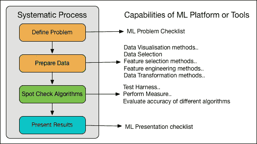

图 7：机器学习系统化流程。

可扩展和准确的 ML 应用需求，需要从问题定义到呈现结果的开发中遵循系统化的方法，可以总结为四个步骤：问题定义和制定、数据准备、寻找适合的机器学习算法，最后，在机器学习模型部署后呈现结果。嗯，这些步骤可以如*图 6*所示。

## 在开发 ML 应用程序之前的最佳实践

机器学习系统的学习可以被公式化为表示、评估和优化的总和。换句话说，根据 Pedro D 等人的说法（Pedro Domingos，*关于机器学习的一些有用的东西*，[`homes.cs.washington.edu/~pedrod/papers/cacm12.pdf`](https://homes.cs.washington.edu/~pedrod/papers/cacm12.pdf)）：

*学习=表示+评估+优化*

考虑到这个公式，我们将在进入 ML 应用程序开发之前为从业者提供一些建议。

### 良好的机器学习和数据科学价值巨大

那么，在开发有效的机器学习应用程序之前，我们需要什么？实际上，在开始开发 ML 应用程序之前，我们需要四种武器，包括：

+   数据基元（或更坦率地说，实验数据）。

+   管道综合工具（用于理解机器学习步骤中的数据和控制流）。

+   有效和健壮的错误分析工具。

+   验证或验证工具（用于验证或验证 ML 模型的预测准确性或性能）。然而，最重要的是，如果没有一些具有良好数据科学的强大理论基础，整个过程将是徒劳的。事实上，许多数据科学家和机器学习专家经常引用类似于这样的声明：*如果你能将你的问题提出为一个简单的优化问题，那么你几乎已经完成了*（见*数据分析与 R*，[`advanceddataanalytics.net/2015/01/31/condensed-news-7/`](http://advanceddataanalytics.net/2015/01/31/condensed-news-7/)）。

这意味着在开始机器学习之前，如果你能确定你的问题是一个机器学习问题，你将能够找到一些合适的算法来一起开发你的 ML 应用。当然，在实践中，大多数机器学习应用无法转化为简单的优化问题。因此，像你这样的数据科学家的职责是管理和维护复杂的数据集。之后，你将不得不处理其他问题，比如在工程化机器学习管道时出现的分析问题，以解决我们之前提到的那些问题。

因此，最佳实践是使用 Spark MLlib、Spark ML、GraphX 和 Spark Core API 以及最佳实践的数据科学启发式方法来共同开发您的机器学习应用程序。现在你可能会想从中获益；是的，好处是显而易见的，它们如下：

+   内置的分布式算法

+   内存和基于磁盘的数据计算和处理

+   迭代工作负载的内存能力

+   算法的准确性和性能

+   更快的数据清理、特征工程和特征选择、训练和测试

+   预测结果的实时可视化

+   朝着更好的性能调整

+   适应新数据集

+   随着数据集的增加而扩展性

### 最佳实践-特征工程和算法性能

在最佳实践中，特征工程应被视为机器学习中最重要的部分之一。关键是在实验数据集中非技术性地找到特征的更好表示。与此同时，使用哪些学习算法或技术也很重要。参数调整当然也很重要，但最终的选择更多取决于您将要开发的 ML 模型的实验。

在实践中，通过“开箱即用”方法（也称为功能性或 OOTB，是指产品安装或配置后立即可用的功能）和良好的数据预处理，轻松掌握天真的性能基线是微不足道的。因此，您可能会不断地这样做，以了解基线在哪里，以及这种性能是否达到了令人满意的水平或足够满足您的要求。

一旦您训练了所有的开箱即用方法，总是建议并且是一个好主意将它们一起尝试。此外，为了解决 ML 问题，您可能经常需要知道计算上困难的问题（例如第二部分中所示）需要领域特定的知识或大量挖掘数据或两者兼而有之。因此，广泛接受的特征工程技术和领域特定知识的结合将有助于您的 ML 算法/应用/系统解决与预测相关的问题。

简而言之，如果您拥有所需的数据集和一个强大的算法，可以利用数据集学习复杂的特征，几乎可以保证您会成功。此外，有时领域专家在选择好的特征时可能会出错；因此，多个领域专家（问题领域专家）、更结构化的数据和 ML 专业知识的整合总是有帮助的。

最后但同样重要的是，有时我们建议考虑错误率而不仅仅是准确性。例如，假设一个 ML 系统的准确率为 99%，错误率为 50%，比起准确率为 90%，错误率为 25%的系统更糟糕。

### 注意过拟合和欠拟合

初学者数据科学家经常犯的一个常见错误是在构建 ML 模型时受到过拟合问题的影响，这可能是由于听而不是泛化。更具体地说，如果您在训练数据上评估模型而不是测试或验证数据，您可能无法确定您的模型是否过拟合。常见的症状包括：

+   用于训练的数据的预测准确性可能过高（有时甚至达到 100%）

+   并且与新数据相比，模型可能会稍微好一些

有时 ML 模型本身对特定调整或数据点变得欠拟合，这意味着模型变得过于简单。我们的建议（我们相信其他人也是如此）如下：

+   将数据集分为两组以检测过拟合情况，第一组用于训练和模型选择，称为训练集；第二组是用于评估模型的测试集，取代了 ML 工作流程部分中所述的模型。

+   或者，您还可以通过使用更简单的模型（例如，线性分类器优先于高斯核 SVM）或通过增加 ML 模型的正则化参数（如果可用）来避免过拟合。

+   调整模型的参数值以避免过拟合和欠拟合

另一方面，Hastie 等人（Hastie Trevor，Tibshirani Robert，Friedman Jerome，《统计学习的要素：数据挖掘、推断和预测》，第二版，2009 年）建议将大规模数据集分为三组：训练集（50%）、验证集（25%）和测试集（25%）（大致）。他们还建议使用训练集构建模型，并使用验证集计算预测误差。建议使用测试集来评估最终模型的泛化误差。

如果在监督学习期间可用的标记数据量较小，则不建议拆分数据集。在这种情况下，使用交叉验证或训练拆分技术（将在第七章中讨论，*调整机器学习模型*，并附有几个示例）。更具体地说，将数据集分为大致相等的 10 部分，然后对这 10 部分中的每一部分进行迭代训练分类器，并使用第十部分来测试模型。

### 保持关注并将 Spark MLlib 与 Spark ML 结合使用

管道设计的第一步是创建构建模块（作为由节点和边组成的有向或无向图）并在这些模块之间建立联系。然而，作为数据科学家，您还应专注于扩展和优化节点（基元），以便在后期处理大规模数据集时能够扩展应用程序，使您的 ML 管道始终保持高性能。管道过程还将帮助您使您的模型适应新数据集。然而，其中一些基元可能会明确定义为特定领域和数据类型（例如文本、图像、视频、音频和时空数据）。

除了这些类型的数据之外，基元还应适用于通用领域的统计学或数学。将您的 ML 模型转换为这些基元的形式将使您的工作流程更加透明、可解释、可访问和可解释。最近的一个例子是 ML-Matrix，它是一个可以在 Spark 之上使用的分布式矩阵库：

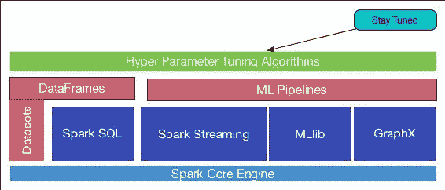

图 8：保持关注并使 ML、MLlib 和 GraphX 互操作。

正如我们在前一节中已经提到的，作为开发人员，您可以无缝地将 Spark MLlib 中的实现技术与 Spark ML、Spark SQL、GraphX 和 Spark Streaming 中开发的算法结合起来，作为基于 RDD、DataFrame 和 Datasets 的混合或可互操作的 ML 应用程序，如图 8 所示。例如，可以使用混合模型开发基于物联网的实时应用程序。因此，建议您与您周围的最新技术保持同步，以改进您的 ML 应用程序。

### 使 ML 应用程序模块化并简化管道合成

在构建 ML 管道时的另一个常用做法是使 ML 系统模块化。一些监督学习问题可以使用常称为广义线性模型的非常简单的模型来解决。然而，这取决于您将要使用的数据，有些数据可能不适用于这些模型。

因此，要将一系列简单的线性二元分类器合并成一个轻量级的模块化架构。这可能是在工作流程或算法级别。优势是显而易见的，因为应用程序的模块化架构以并行和分布式的方式处理大量数据流。因此，我们建议您采用文献中提到的三种关键创新机制：加权阈值抽样、逻辑校准和智能数据分区（例如，Yu Jin；Nick Duffield；Jeffrey Erman；Patrick Haffner；Subhabrata Sen；Zhi Li Zhang，《大型网络中基于流级流量分类的模块化机器学习系统》，ACM 数据发现知识交易，V-6，Issue-1，2012 年 3 月）。目标是在实现高吞吐量的同时，实现 ML 应用/系统预测结果的高准确性。虽然原语可以作为构建块，但您仍需要其他工具来使用户能够构建 ML 管道。

随后，工作流程工具如今变得更加普遍，这些工具适用于数据工程师、数据科学家，甚至适用于业务分析师，如 Alteryx、RapidMiner、Alpine Data 和 Dataiku。在这一点上，我们谈论并强调业务分析师，因为在最后阶段，您的目标客户将是一家重视您的 ML 模型的商业公司，对吧？Spark 的最新版本配备了用于构建机器学习管道的 Spark ML API，并制定了领域特定语言（参见[`en.wikipedia.org/wiki/Domain-specific_language`](https://en.wikipedia.org/wiki/Domain-specific_language)）用于管道。

### 思考一个创新的 ML 系统

然而，为了开发算法以利用可用数据持续学习 ML 模型，机器学习背后的观点是自动化分析模型的创建。不断发展的模型产生越来越积极的结果，并减少了对人类干预的需求。这使得 ML 模型能够自动产生可靠且可重复的预测。

更具体地说，假设您计划使用 ML 算法开发推荐系统。那么，开发该推荐系统的目标是什么？在机器学习产品开发方面有哪些创新的想法？这两个问题在您开始开发 ML 应用程序或系统之前应该考虑。持续的创新可能具有挑战性，特别是在推动新想法的同时，理解最大利益所在也可能很困难。机器学习可以通过各种途径提供创新，例如确定当前产品的弱点、预测分析或识别以前隐藏的模式。

因此，您将不得不考虑大规模计算来离线训练您的 ML 模型，随后您的推荐系统必须能够像传统的搜索引擎分析一样进行在线推荐。因此，如果您的系统：

+   可以使用您的机器学习应用程序预测购买商品

+   可以进行产品分析

+   可以作为生产中的新趋势

### 思考并变得更加聪明，以应对大数据的复杂性

如图 9 所示，新的商业模式是可利用数据的不可避免的延伸，因此考虑大数据及其商业价值可以使业务分析师的工作、生活和思维更加智能，从而使您的目标公司为客户提供价值。除此之外，您还需要调查（更准确地说是分析）竞争对手或更好的公司。

现在的问题是，你如何收集和使用企业数据？大数据不仅仅是关于大小（容量），它还与速度、真实性、多样性和价值有关。对于这些类型的复杂性，例如，速度可以使用 Spark Streaming 来解决，因为基于流的数据也是需要实时分析的大数据。其他参数，如容量和多样性，可以使用 Spark Core 和 Spark MLlib/ML 来处理大数据处理。

好吧，你必须想方设法管理数据。如果你能够管理数据，那么从数据中获得的见解可以真正改变企业运营的方式，利用大数据的有用特征：

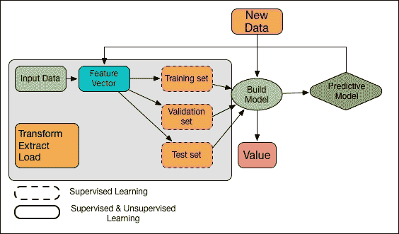

图 9：大数据最佳实践中的机器学习。

在这一点上，仅有数据是不够的（参见 Pedro Domingos，《关于机器学习的一些有用知识》，[`homes.cs.washington.edu/~pedrod/papers/cacm12.pdf`](https://homes.cs.washington.edu/~pedrod/papers/cacm12.pdf)），但是从数据中提取有意义的特征并将数据的语义放入模型更为重要。这就像 LinkedIn 等大多数科技巨头正在通过大规模机器学习框架开发的社区特征定位一样，这多多少少是一种监督学习技术。工作流程如下：

+   获取数据，提取特征，并设置目标

+   特征和目标连接

+   从连接数据创建一个快照

+   将快照分成两部分：训练集和测试集

+   从训练集中，通过采样技术准备样本数据

+   使用采样数据训练模型

+   评分

+   从先前开发的持久模型以及步骤 4 中准备的测试数据中评估模型。

+   如果找到了最佳模型

+   为目标受众部署模型

那么接下来呢？你的模型也应该适应大规模动态数据，比如实时流式物联网数据，而且实时反馈也很重要，这样你的 ML 系统才能从错误中学习。下一小节将讨论这一点。

### 将机器学习应用于动态数据

原因是显而易见的，因为机器学习为物联网项目带来了具体和动态的方面。最近，机器学习在工业公司中的受欢迎程度有所提高，他们从中获利。因此，几乎每个 IT 供应商都在急速宣布物联网平台和咨询服务。但是通过物联网数据实现财务收益并不是一件容易的工作。此外，许多企业未能清楚地确定实施物联网战略将改变哪些领域。

综合考虑这些积极和消极的问题，你的 ML 模型应该适应大规模动态数据，因为大规模数据意味着数十亿条记录、大特征空间和来自稀疏问题的低正率。然而，数据是动态的，因此 ML 模型必须足够适应；否则你将面临糟糕的体验或者迷失在黑洞中。

## 开发 ML 应用程序后的最佳实践

ML 模型/系统开发后的最佳实践步骤包括：可视化以理解预测值，模型验证，错误和准确性分析，模型调整，模型适应和扩展以便轻松处理大规模数据集。

### 如何实现实时 ML 可视化

可视化提供了一个交互界面，以保持 ML 模型本身的关注。因此，如果不可视化预测结果，进一步改善 ML 应用程序的性能将变得困难。最佳实践可能是这样的：

+   为了可视化大规模图形相关数据，可以将一些第三方工具与 GraphX 结合起来（更多内容将在*第九章*中讨论，*流式和图形数据的高级机器学习*)

+   对于非图形数据，Spark ML 算法可以通过集成其他工具如 Apache Kafka 来发送和接收消息的回调接口：

+   算法决定何时发送什么消息

+   算法不关心消息是如何传递的

+   一个任务通道用于处理从 Spark 驱动程序到 Spark 客户端或 Spark 集群节点的消息传递服务。任务通道将使用 Spark 核心在更低的抽象级别进行通信：

+   它不关心消息的内容或消息的接收者

+   消息从 Spark 客户端传递到浏览器或可视化客户端：

+   我们建议同时使用 HTML5 的**服务器发送事件**（SSE）和 HTTP 分块响应（PUSH）。将 Spark 与这种类型的技术结合起来将在第十章中讨论，*配置和使用外部库*

+   拉取是可能的；然而，它需要一个消息队列

+   使用 JavaScript 框架进行可视化，比如`Plot.ly`（请参考[`plot.ly/`](https://plot.ly/)）和`D3.js`（请参考[`d3js.org/`](https://d3js.org/)）

### 进行一些错误分析

随着算法变得更加普遍，我们需要更好的工具来构建复杂的、稳健的和稳定的机器学习系统。像 Apache Spark 这样的流行分布式框架将这些想法应用到了更广泛的大型数据集中。因此，如果我们能够绑定分层管道的近似误差和收敛速度，那将更好。

假设我们可以计算节点的误差范围，下一步将是为这些管道提取误差范围的机制。然而，在实践中，当 ML 模型部署到生产环境时，我们可能需要工具来确认管道将正常工作，不会出现故障或中途停止，并且可以提供一些预期的错误度量。

### 保持你的 ML 应用程序调优

设计一个或两个在简单问题上表现良好的算法可以被认为是一个良好的开端。然而，有时你可能渴望获得最佳的准确性，甚至会牺牲宝贵的时间和可用的计算资源。这将是一个更明智的方式，它不仅可以帮助你挤出额外的性能，还可以改善你之前设计的机器学习算法的准确性结果。为了做到这一点，当你调整模型和相关算法时，你必须对结果有很高的信心。

显然，这些结果将在你指定测试和验证之后可用。这意味着你应该只使用那些减少性能测量方差的技术，以便评估那些运行更顺利的算法。

与大多数数据从业者一样，我们还建议您使用交叉验证技术（也经常称为旋转估计），并且使用相当高数量的折叠（即 K 折交叉验证，其中一个子样本用作验证数据集，用于测试模型本身，其余的 K-1 个子样本用于训练数据）。尽管折叠的确切数量，或 K，取决于你的数据集，但是 10 折交叉验证通常被使用，但是 K 的值通常是不固定的。我们将在这里提到三种策略，你需要调整你的机器学习模型：

+   **算法调优**：使您的机器学习算法参数化。然后，调整这些参数的值（如果它们有多个参数）以影响整个学习过程的结果。

+   **集成**：有时候天真是好的！因此，为了获得改进的结果，不断尝试将多个机器学习方法或算法的结果结合起来。

+   **极端特征工程**：如果您的数据中嵌入了复杂和多维结构，ML 算法知道如何找到并利用它来做出决策。

### 使您的 ML 应用程序适应和扩展

如图 10 所示，自适应学习根据 Rob Munro 的说法，将基于规则的、简单的机器学习和深度学习方法融合到机器智能中。

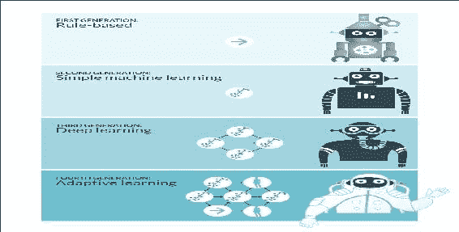

图 10：机器智能的四代（图由 Rob Munro 提供）。

机器学习的第四代：自适应学习，(`http://idibon.com/the-fourth-generation-of-machine-learning-adaptive-learning/#comment-175958`)。

研究还表明，自适应学习在预测人们购买汽车的意图方面准确率达到 95%（请参阅 Rob Munro，《机器学习的第四代：自适应学习》，`http://idibon.com/the-fourth-generation-of-machine-learning-adaptive-learning/#comment-175958`）。此外，如果您的 ML 应用程序能够适应新环境和新数据，那么只要提供足够的基础设施，预计您的 ML 系统可以扩展以处理不断增加的数据负载。

# 为您的应用程序选择正确的算法

*我应该使用什么机器学习算法？*对于天真的机器学习从业者来说，这是一个非常常见的问题，但答案总是*取决于*。更详细地说：

+   这取决于要测试/使用的数据的数量、质量、复杂性和性质

+   这取决于外部环境和参数，例如您的计算系统配置或基础设施

+   这取决于您想要用答案做什么

+   这取决于算法的数学和统计公式如何被转化为计算机的机器指令

+   这取决于你有多少时间

+   *图 11*提供了选择解决 ML 问题的正确算法的完整工作流程。但是，请注意，某些技巧可能会根据数据和问题类型而不起作用：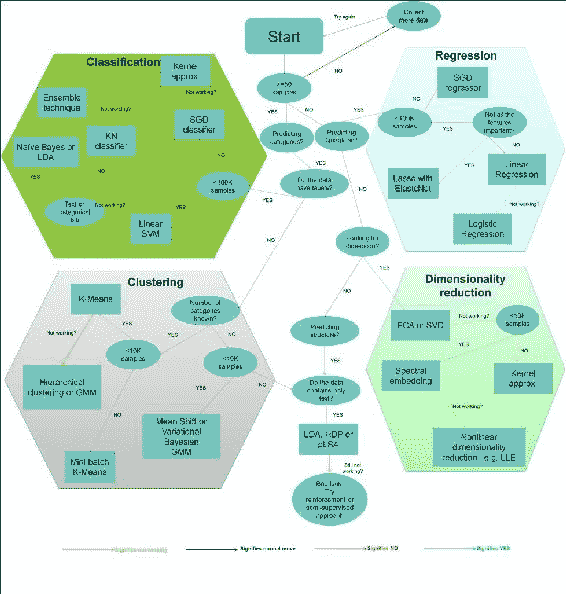

图 11：选择正确算法的工作流程

事实上，即使是最有经验的数据科学家或数据工程师在尝试所有算法之前也无法给出哪种 ML 算法在性能上表现最佳的明确建议。大多数一致/不一致的陈述都以*取决于...嗯...*开始。习惯上，您可能会思考是否有机器学习算法的备忘单，如果有的话，如何使用该备忘单。我们与几位数据科学家交谈时，他们表示找到最佳算法的唯一方法是尝试所有算法；因此，没有捷径！让我们明确一下，假设您有一组数据，并且想要进行一些聚类。因此，从技术上讲，这可能是分类或回归，如果您的数据是标记/未标记的或值或训练集数据。现在，您脑海中首先出现的问题是：

+   在选择适当的算法之前，我应该考虑哪些因素？还是我应该随机选择一个算法？

+   我如何选择可以应用于我的数据的任何数据预处理算法或工具？

+   我应该使用什么样的特征工程技术来提取有用的特征？

+   哪些因素可以提高我的 ML 模型的性能？

+   我如何为新数据类型采用我的 ML 应用程序？

+   我可以将我的 ML 应用程序扩展到大规模数据集吗？等等。

您总是期望得到更合理的最佳答案，并解释应考虑的一切。在本节中，我们将尝试用我们的一点机器学习知识来回答这些问题。

## 在选择算法时的考虑

我们在这里提供的建议或建议是给初学者数据科学家和尝试选择 Spark ML API 的最佳算法的专家数据科学家。这意味着它做了一些概述和过度简化，但它会指引您朝着安全的方向，相信我们！假设您计划开发一个 ML 系统来回答以下问题基于规则：

+   `IF`特征 X 具有属性 Z`THEN`执行 Y

肯定地，应该有这样的规则：

+   如果 X`THEN`，尝试使用属性 Z 并避免 W 是明智的

然而，什么是明智的，什么不是取决于：

+   您的应用程序和问题的预期复杂性。

+   数据集的大小（即有多少行/列，有多少独立案例）。

+   您的数据集是否有标签或无标签？

+   数据类型和测量类型，因为不同类型的数据暗示着不同的顺序或结构，对吧？

+   显然，在实践中，您在应用不同方法时的经验是高效和智能的。

此外，如果您想对一般问题得到一般答案，我们建议初学者从《统计学习的要素》（Hastie Trevor，Tibshirani Robert，Friedman Jerome，*统计学习的要素：数据挖掘、推断和预测*，第二版，2009）开始。然而，我们还建议遵循以下算法属性：

+   展示出色的准确性

+   具有快速的训练时间

+   以及线性的使用

### 准确性

从您的 ML 应用程序中获得最准确的结果并非总是不可或缺的。根据您想要将其用于的情况，有时近似也足够。如果情况是这样，您可以通过合并更好估计的方法来大幅减少处理时间。当您熟悉 Spark 机器学习 API 的工作流程时，您将享受到拥有更多近似方法的优势，因为这些近似方法将自动倾向于避免您的 ML 模型中的过度拟合问题。

### 训练时间

执行时间需要完成数据预处理或构建模型，并且在不同算法、继承复杂性和鲁棒性之间变化很大。训练时间通常与准确性密切相关。此外，您经常会发现，与其他算法相比，您将使用的一些算法对数据点的数量是难以捉摸的。然而，当您的时间足够充裕，特别是当数据集较大时，为了完成所有的程序，选择算法可能会变得轻松。因此，如果您特别关注时间，尝试牺牲准确性或性能，并使用满足您最低要求的简单算法。

### 线性

最近开发了许多利用线性的机器学习算法（也可在 Spark MLlib 和 Spark ML 中使用）。例如，线性分类算法允许通过绘制区分直线或数据集的高维等价物来分离类别。另一方面，线性回归算法假设数据趋势遵循简单的直线。对于一些机器学习问题，这种假设并不天真；然而，在其他一些情况下，准确性可能会下降。尽管存在危险，线性算法对于数据工程师或数据科学家来说是首选。此外，这些算法在整个训练过程中也倾向于算法简单且训练速度快。

## 在选择算法时与您的数据交谈

你可以在[`machinelearningmastery.com/tour-of-real-world-machine-learning-problems/`](http://machinelearningmastery.com/tour-of-real-world-machine-learning-problems/)或 UC Irvine 机器学习库（[`archive.ics.uci.edu/ml/`](http://archive.ics.uci.edu/ml/)）免费找到许多机器学习数据集。还应首先考虑以下数据属性：

+   参数数量

+   特征数量

+   训练数据集的大小

### 参数数量

参数或数据属性是像你这样的数据科学家在设置算法时可以调整的手段。它们是影响算法性能的数字，例如误差容限或迭代次数，或者是算法行为的变体之间的选项。算法的训练时间和准确性有时对于找到合适的设置非常敏感。通常，具有大量参数的算法需要通过试错来找到最佳组合。

尽管这是跨越参数空间的好方法，但随着参数数量的增加，模型构建或训练时间呈指数增长。这既是一个困境，也是一个时间性能的权衡。积极的一面是，拥有许多参数通常表示机器学习算法的更大灵活性。其次，你的机器学习应用可以获得更好的准确性。

### 你的训练集有多大？

如果你的训练集较小，偏差较高且方差较低的分类器（如朴素贝叶斯）比偏差较低且方差较高的分类器（如 kNN）具有优势。因此，后者会过拟合。但是，偏差较低且方差较高的分类器在你的训练集线性或指数增长时开始占优势，因为它们具有更低的渐近误差。这是因为高偏差的分类器不足以提供准确的模型。你也可以将其视为生成模型与判别模型之间的权衡。

### 特征数量

对于某些类型的实验数据集，提取的特征数量可能与数据点数量本身相比非常大。这在基因组学、生物医学或文本数据中经常发生。大量特征可能会淹没一些学习算法，使训练时间变得非常长。支持向量机在这种情况下特别适用，因为它具有高准确性、关于过拟合的良好理论保证以及适当的核函数。

## 广泛使用的机器学习算法的特殊说明

在这一部分，我们将为最常用的机器学习算法或技术提供一些特殊说明。我们将重点介绍的技术包括逻辑回归、线性回归、推荐系统、支持向量机、决策树、随机森林、贝叶斯方法和决策森林、决策丛林以及变种。表 3 显示了一些广泛使用的算法的优缺点，包括何时选择这些算法。

| **算法** | **优点** | **缺点** | **擅长** |
| --- | --- | --- | --- |
| **线性回归（LR）** | 非常快，通常在恒定时间内运行易于理解建模不太容易过拟合和欠拟合本质上简单速度非常快，因此建模时间较短不太容易过拟合和欠拟合方差较低 | 通常无法进行复杂的数据建模无法概念化非线性关系，需要转换输入数据集不适合复杂建模仅适用于单一决策边界需要大样本量才能获得稳定的结果偏差较高 | 具有大量特征的数值数据集广泛用于生物学、行为学和社会科学，以预测变量之间可能的关系对数值和分类变量都有效用于医学和社会科学等各个领域 |
| 决策树（DT） | 模型构建和预测时间较短，对噪声和缺失值具有鲁棒性，准确性高 | 大型和复杂树的解释困难，同一子树内可能出现重复，对角决策边界可能存在问题 | 针对高准确的分类、医学诊断和预后、信用风险分析 |
| 神经网络（NN） | 非常强大和稳健，能够建模非常复杂的关系，可以在不知道基础数据的情况下工作 | 容易过拟合和欠拟合，训练和预测时间长，计算成本高，模型不可读或可重复使用 | 图像处理、视频处理、人工智能、机器人、深度学习 |
| 随机森林（RF） | 适用于装袋树，方差低，准确性高，可以处理过拟合问题 | 不易直观解释，训练和预测时间长 | 处理可能相关的多个特征、生物医学诊断和预后、可用于分类和回归 |
| 支持向量机（SVM） | 准确性高 | 容易过拟合和欠拟合，数值稳定性差，计算成本高，需要大量计算资源 | 图像分类、手写识别 |
| K 最近邻（K-NN） | 简单而强大，需要懒惰训练，可用于多类分类和回归 | 训练和预测时间长，需要准确的距离函数，高维数据集性能低 | 低维数据集、异常检测、半导体故障检测、基因表达、蛋白质相互作用 |
| K-means | 线性执行时间表现优于分层聚类，对超球状聚类效果更好 | 可重复但缺乏一致性，需要先验知识 | 如果数据集中出现的自然聚类是非球状的，则不是一个好选择，适用于大型数据集 |
| 潜在狄利克雷分配（LDA） | 可应用于大规模文本数据集，可以克服 pLSA 的过拟合问题，可用于文档分类和通过主题建模进行聚类 | 不能应用于高维和复杂的文本数据库，需要指定主题数量，无法找到最佳级别，层次狄利克雷过程（HDP）是更好的选择 | 从大规模文本数据集中进行文档分类和通过主题建模进行聚类，可应用于自然语言处理和其他文本分析 |
| 朴素贝叶斯（NB） | 计算速度快，实现简单，适用于高维数据，可以处理缺失值，适应性强，模型可以根据新的训练数据进行修改而无需重建 | 依赖独立性假设，如果假设不成立则表现不佳，准确性相对较低 | 当数据有大量缺失值、特征之间的依赖关系类似、垃圾邮件过滤和分类、对科技、政治或体育新闻文章进行分类、文本挖掘 |
| 奇异值分解（SVD）和主成分分析（PCA） | 反映了关于数据的真实直觉，可以在高维数据中估计概率，数据大小显著减少，两者都基于强大的线性代数 | 对于像 Twitter 和网络分析这样的许多应用来说太昂贵，对于细粒度类别的任务来说灾难性，需要正确理解线性性，复杂度通常是立方的，计算速度较慢 | SVD 用于低秩矩阵逼近、图像处理、生物信息学、信号处理、NLP，PCA 用于利率衍生品投资组合、神经科学等，两者都适用于具有高维和多变量数据的数据集 |

表 3：一些广泛使用算法的优缺点

### 逻辑回归和线性回归

逻辑回归是一种强大的工具，因为它快速且简单，已在全球范围内用于两类和多类分类。事实上，它使用*S*形曲线而不是直线，使其自然适合将数据分成组。它提供线性类边界，因此在使用它时，请确保线性逼近是您可以接受的。与决策树或 SVM 不同，它还具有良好的概率解释，因此您将能够轻松更新模型以适应新数据集。

因此，建议使用它，如果您希望体验概率框架的味道，或者期望将来获得更多的训练数据并将其纳入您的模型。如前所述，线性回归将一条直线、平面或超平面拟合到数据集。它是一个实用、简单且快速的工具，但对于某些问题可能过于简单。

### 推荐系统

我们已经讨论了大多数常用的机器学习算法和工具的准确性和性能问题。然而，除了准确性研究之外，对推荐系统的另一个关注点是寻找其他环境因素和/或参数多样性。因此，一个准确性高且列表内多样性高的推荐系统将是赢家。因此，您的产品将对目标客户非常宝贵。然而，让用户重新对物品进行评分，而不仅仅是显示新物品，可能会更有效。如果您的客户有一些需要满足的额外要求，比如隐私或安全性，您的系统必须能够处理与隐私相关的问题。

这一点特别重要，因为客户必须提供一些个人信息，因此建议不要公开这些敏感信息。

然而，使用一些强大的技术或算法（如协同过滤）来构建用户档案可能会从隐私角度带来问题。此外，该领域的研究发现，用户人口统计信息可能会影响其他用户对推荐的满意程度（另请参阅 Joeran Beel、Stefan Langer、Andreas Nürnberger、Marcel Genzmehr，《人口统计信息（年龄和性别）和其他用户特征对评估推荐系统的影响》，在 Trond Aalberg 和 Milena Dobreva 和 Christos Papatheodorou 和 Giannis Tsakonas 和 Charles Farrugia 的《第 17 届数字图书馆理论与实践国际会议论文集》，Springer，第 400-404 页，2013 年 11 月 1 日检索）。

尽管偶然性是衡量推荐有多么令人惊讶的关键指标，但最终建立信任还是需要通过推荐系统。这可以通过解释它是如何生成推荐的，以及为什么会推荐一个物品，即使用户的人口统计信息很少，来实现。

因此，如果用户根本不信任系统，他们将不会提供任何人口统计信息，也不会重新对物品进行评分。根据*Cowley 等人*（G.C.Cawley 和 N.L.C.Talbot，《模型选择中的过拟合和性能评估中的后续选择偏差》，《机器学习研究杂志》，第 11 卷，第 2079-2107 页，2010 年 7 月），支持向量机有几个优点：

+   您可以通过 SVM 提供的正则化参数来解决过拟合问题

+   SVM 使用核技巧来帮助轻松构建机器学习模型

+   SVM 算法是基于凸优化问题开发、设计和定义的，因此没有局部最小值的概念

+   这是一个对测试错误率的边界的大致估计，其中有一个重要且深入研究的理论可以发挥作用

SVM 的这些有前途的特性确实会帮助您，建议经常使用。另一方面，缺点是：

+   理论只能真正涵盖对给定的正则化和核参数值的参数确定。因此，你只能选择核。

+   也可能存在更糟糕的情况，核模型本身在模型选择标准期间可能非常敏感于过拟合。

### 决策树

决策树很酷，因为它们易于解释和解释围绕机器学习问题。与此同时，它们可以很容易地处理与特征相关的交互。最重要的是，它们通常是非参数的。因此，即使你是一个工作能力有限的普通数据科学家，你也不需要担心异常值、参数设置和调整等问题。有时，基本上，你可以依赖决策树，这样它们将减轻你处理数据线性问题的压力，或者更技术上说，你的数据是否是线性可分的，你不需要担心。相反，也有一些缺点。例如：

+   在某些情况下，决策树可能不合适，有时它们不支持实时数据集的在线学习。在这种情况下，当出现新的示例或数据集时，你必须重新构建你的树；更技术上说，获得模型的适应性是不可能的。

+   其次，如果你没有意识到，它们很容易过拟合。

### 随机森林

随机森林非常受欢迎，对于数据科学家来说是一个赢家，因为它们对于大量分类问题来说是非常好用的。它们通常在可用性方面略领先于支持向量机，并且对于大多数分类问题的操作速度更快。此外，它们在增加可用数据集时也是可扩展的。与此同时，你不需要担心调整一系列参数。相反，当处理数据时，你需要关注许多参数和调整。

### 决策森林、决策丛林和变体

决策森林、决策丛林和提升决策树都是基于决策树的，决策树是一个基础的机器学习概念，使用较少。决策树有许多变体；尽管如此，它们都做同样的事情，即将特征空间细分为具有相同标签的区域。为了避免过拟合问题，使用数学和统计公式构建了大量的树，这些树之间没有任何相关性。

其平均值被称为决策森林；这是一种避免过拟合问题的树，如前所述。然而，决策森林可能会使用大量内存。另一方面，决策丛林是一种通过牺牲略长的训练时间来消耗较少内存的变体。幸运的是，提升决策树通过限制分区的数量和每个区域允许的数据点数量来避免过拟合。

### 贝叶斯方法

当实验或样本数据集规模较大时，贝叶斯方法通常会为参数模型提供与其他经典统计方法产生的结果非常相似的结果。使用贝叶斯方法的一些潜在优势由 Elam 等人总结（W.T. Elam, B. Scruggs, F. Eggert, and J.A. Nicolosi，《获取 XRF NET 强度方法的优缺点》，版权所有©JCPDS-国际衍射数据中心 2011 ISSN 1097-0002）。例如，它提供了一种将先验信息与数据结合的自然方式。因此，作为一名数据科学家，你可以将过去关于参数的信息并入未来分析新数据集的先验分布。它还提供了在不需要算法渐近逼近的情况下，条件于数据的推断。

它为各种模型提供了一些合适的设置，比如层次模型和缺失数据问题。使用贝叶斯分析也有一些缺点。例如，它不告诉你如何选择先验世界模型，甚至没有正确选择先验的方法。因此，如果你不小心进行，你可能会产生许多伪阳性或伪阴性的结果，这往往伴随着高昂的计算成本，如果模型中的参数数量很大的话。

# 总结

这结束了我们对机器学习和需要遵循的最佳实践的相当快速的介绍。虽然我们试图涵盖一些最基本的要点，但合适的数据往往胜过更好的算法和更高的需求。最重要的是，从数据中设计出好的特征可能需要很长时间；然而，这将对你非常有帮助。然而，如果你有一个大规模的数据集要应用到你的机器学习算法或模型中，无论你使用哪种分类、聚类或回归算法，都可能不是关于机器学习类别及其相应的分类性能的事实。

因此，选择一个能够满足速度、内存使用、吞吐量、可扩展性或可用性等要求的合适的机器学习算法将是一个明智的决定。除了我们在上面的部分中所说的内容之外，如果你真的关心准确性，你应该毫无疑问地尝试一组不同的分类器，使用交叉验证技术找到最佳的一个，或者使用集成方法来一起选择它们。

你也可以从 Netflix Prize PLUS 中得到启发并吸取教训。我们详细讨论了 Spark 机器学习 API、ML 应用开发中的一些最佳实践、机器学习任务和类别、一些广泛使用的最佳实践等等。然而，我们并没有深入分析机器学习技术。我们打算在第四章中更详细地讨论这个问题，*通过特征工程提取知识*。

在下一章中，我们将详细介绍 DataFrame、Dataset 和**Resilient Distributed Dataset**（**RDD**）API，以处理结构化数据，旨在提供对可用数据进行机器学习问题的基本理解。因此，最终，你将能够轻松地应用从基本到复杂的数据操作。
