# 第三章：通过了解数据来了解问题

本章将详细介绍 DataFrame、Datasets 和**Resilient Distributed Dataset**（**RDD**）API，用于处理结构化数据，旨在提供对可用数据进行机器学习问题的基本理解。在本章结束时，您将能够轻松应用从基本到复杂的数据操作。将提供一些比较，使用 RDD、DataFrame 和 Dataset 进行数据操作的基本抽象，以展示在编程和性能方面的收益。此外，我们将指导您走上正确的道路，以便您能够使用 Spark 将 RDD 或数据对象持久化在内存中，从而在后期的并行操作中高效地重复使用。简而言之，本章将涵盖以下主题：

+   分析和准备您的数据

+   Resilient Distributed Dataset（RDD）基础知识

+   数据集基础知识

+   来自字符串和类型类的数据集

+   Spark 和数据科学家，工作流程

+   深入 Spark

# 分析和准备您的数据

在实践中，有几个因素会影响给定任务上机器学习（ML）应用的成功。因此，实验数据集的表示和质量首先被视为一流实体。拥有更好的数据总是明智的。例如，不相关和冗余的数据，具有空值或嘈杂数据的数据特征会导致不可靠的信息来源。数据集中的不良属性使得在机器学习模型训练阶段的知识发现过程更加繁琐和时间低效。

因此，数据预处理将在总体 ML 工作流程步骤中占据相当大的计算时间。正如我们在上一章中所述，除非您了解可用数据，否则很难理解问题本身。此外，了解数据将帮助您制定问题。同时，更重要的是，在尝试将 ML 算法应用于问题之前，首先您必须确定问题是否真的是一个机器学习问题，以及 ML 算法是否可以直接应用于解决问题。您需要采取的下一步是了解机器学习类别。更具体地说，您需要知道已识别的问题是否属于分类、聚类、规则重构或回归类别。

为了简单起见，我们假设您有一个机器学习问题。现在，您需要进行一些数据预处理，包括一些步骤，如数据清理、归一化、转换、特征提取和选择。数据预处理工作流程步骤的产物通常用于构建/训练 ML 模型的最终训练集。

在上一章中，我们还论证了机器学习算法是从数据和模型构建和反馈活动中学习的。关键是，您需要为您想要解决的问题为算法提供正确的数据。即使您拥有良好的数据（或者更准确地说是结构良好的数据），您也需要确保数据处于适当的规模，并且具有编程语言可以解析的良好格式，最重要的是，是否还包括最有意义的特征。

在本节中，您将学习如何准备数据，使您的机器学习算法对最佳性能变得自发。总体数据处理是一个庞大的主题；然而，我们将尝试覆盖一些基本技术，以便在*第六章*，*构建可扩展的机器学习管道*中进行一些大规模的机器学习应用。

## 数据准备过程

如果您在数据处理和准备步骤中更加专注和纪律，您很可能会在第一时间获得更一致和更好的结果。然而，数据准备是一个包含多个步骤的繁琐过程。然而，为了让数据准备好用于机器学习算法，可以总结为三个步骤：

+   数据选择

+   数据预处理

+   数据转换

### 数据选择

这一步将专注于选择您将在机器学习应用程序开发和部署中使用和处理的所有可用数据集的子集。在机器学习应用程序开发中，总是有一种强烈的冲动，即包含所有可用数据，因为更多的数据将提供更多的特征。换句话说，按照众所周知的格言，*越多越好*。然而，实际上，在所有情况下，这可能并不正确。在实际回答问题之前，您需要考虑需要哪些数据。最终目标是提供特定假设的解决方案。在一开始，您可能对数据做出一些假设。虽然这很困难，但如果您是该问题的领域专家，您可以在应用 ML 算法之前做出一些假设以至少了解一些见解。但是，要小心记录这些假设，以便在需要时在以后的阶段进行测试。我们将提出一些常见问题，以帮助您思考数据选择过程：

+   第一个问题是，*您可用的数据范围是多少？*例如，范围可能是整个时间、数据库表、连接的系统文件等。因此，最好的做法是确保您清楚地了解并低级结构化您可以使用的一切，或者非正式地持有可用资源（当然包括可用的数据和计算资源）。

+   第二个问题有点奇怪！*哪些数据尚未可用，但对解决问题很重要？*在这种情况下，您可能需要等待数据可用，或者您可以至少使用一些生成器或软件生成或模拟这些类型的数据。

+   第三个问题可能是：*您不需要哪些数据来解决问题？*这意味着再次排除冗余数据，因此排除这些冗余或不需要的数据几乎总是比全部包含它更容易。您可能会想知道是否需要记录排除的数据以及原因？我们认为应该是的，因为您可能在以后的阶段需要一些琐碎的数据。

此外，在实践中，对于小问题或游戏，玩具竞赛数据已经为您选择好了；因此，您无需担心！

### 数据预处理

在选择要处理的数据后，您需要考虑如何使用数据和所需的适当利用。这个预处理步骤将解决一些步骤或技术，以便将所选数据转换为您可以在模型构建和验证步骤中使用和应用的形式。最常用的三个数据预处理步骤是格式化、清理和抽样数据：

+   **格式化**：所选数据可能不够完善，因此可能不适合直接使用。您的数据很可能是原始数据格式（如文本格式或较少使用的专有格式的平面文件格式），如果您足够幸运，数据可能是在关系数据库中。如果是这种情况，最好应用一些转换步骤（即，例如将关系数据库转换为其格式，因为使用 Spark 您无法进行任何转换）。正如已经说明的，Spark 的美妙之处在于其对多种文件格式的支持。因此，我们将能够在接下来的部分中利用这一点。

+   **清洗**：您将要使用的数据往往带有许多不需要的记录，有时甚至有缺失的记录。这个清洗过程涉及到删除或修复缺失的数据。可能总会有一些微不足道或不完整的数据对象，处理它们应该是首要任务。因此，这些实例可能需要从数据集中删除、忽略或删除以摆脱这个问题。此外，如果由于某些属性中存在敏感信息的存在而导致隐私或安全成为问题，那么这些属性需要被匿名化或从数据中完全删除（如果适用）。

+   **抽样**：第三步将是在格式化和清理的数据集上进行抽样。由于可用数据量可能很大或记录数量很多，因此通常需要抽样。然而，我们建议尽可能使用数据。另一个原因是更多的数据可能导致整个机器学习过程的执行时间更长。如果是这种情况，这也会增加算法的运行时间，并需要更强大的计算基础设施。因此，您可以对所选数据进行较小的代表性样本，这样在考虑整个数据集之前，探索和原型化机器学习解决方案可能会更快。显然，无论您为机器学习应用开发和商业化应用的机器学习工具，数据都将影响您需要执行的预处理。

### 数据转换

在选择适当的数据源并对这些数据进行预处理后，最后一步是转换已处理的数据。您特定的机器学习算法和对问题领域的了解将在这一步中受到影响。三种常见的数据转换技术是属性缩放、分解和属性聚合。这一步通常也被称为特征工程，在下一章中将更详细地讨论：

+   **缩放**：预处理的数据可能包含具有各种数量和单位的混合比例的属性，例如美元、千克和销售量。然而，机器学习方法要求数据属性在相同的比例内，例如对于给定特征的最小值和最大值之间的 0 到 1 之间。因此，考虑您可能需要执行适当的特征缩放来对已处理的数据进行适当的缩放。

+   **分解**：数据可能具有一些代表复杂概念的特征，当您将数据集分解为基本部分时，可以使机器学习算法产生更强大的响应。例如，考虑一天由 24 小时、1,440 分钟和 86,400 秒组成，这些时间又可以进一步分解。可能一些特定的小时或一天中的小时对于需要调查和解决的问题是相关的。因此，考虑适当的特征提取和选择来执行已处理数据的适当分解。

+   **聚合**：通常，分散或零散的特征可能在其自身上是微不足道的。然而，这些特征可以被聚合成一个更有意义的特征，对您试图解决的问题更有意义。例如，一些数据实例可以在在线购物网站上呈现，每次客户登录网站时都会产生数据对象。这些数据对象可以通过丢弃额外的实例来聚合成登录次数的计数。因此，考虑适当的特征聚合来正确处理数据。

Apache Spark 具有其分布式数据结构，包括 RDD、DataFrame 和 Datasets，您可以使用这些数据结构高效地进行数据预处理。这些数据结构在处理数据时具有不同的优势和性能。在接下来的章节中，我们将分别描述这些数据结构，并展示如何使用它们处理大型数据集的示例。

# 弹性分布式数据集基础知识

在第一章中，*使用 Spark 进行数据分析简介*，我们简要描述了弹性分布式数据集，包括数据转换和操作以及缓存机制。我们还指出 RDD 基本上是一个不可变的记录集合，只能通过 map、filter、group by 等操作来创建。在本章中，我们将使用 Spark 的这种本机数据结构进行数据操作和数据预处理，用于一个常被称为垃圾邮件过滤的实际机器学习应用。Spark 还提供了另外两个更高级别的 API，如 DataFrame 和 Datasets，用于数据操作。

然而，我们将展示包括 RDD 在内的所有 API，因为您可能需要这个 API 来处理更复杂的数据操作。我们已经从 Spark 编程指南中引用了一些关于 Spark 操作和操作的常用定义。

正如我们已经讨论过使用操作和转换的 RDD 操作的一些基础知识。RDD 可以通过稳定的存储（如 Hadoop 分布式文件系统（HDFS））和对现有 RDD 的转换来创建。Spark 定期记录这些转换，而不是实际数据，因此从技术上讲，原始 RDD 和数据集不会发生变化。

可以从现有数据集创建一个转换后的数据集；但是在 Spark 中不可能反过来。在数据集上完成计算后，操作将返回一个值给驱动程序。例如，根据 Spark 编程指南，map 是一种通过函数传递每个数据集元素并返回一个全新的 RDD 来表示和保存结果的转换。相反，reduce 也是一种通过函数聚合 RDD 的所有元素并返回一个全新的 RDD 作为最终结果返回给驱动程序的操作。

更具体地说，假设我们有一个包含以逗号分隔的数字序列的文本文件（即 CSV 文件）。现在在读取完毕后，您将拥有一个 RDD，因此您可能希望计算每个数字的频率。为此，您需要将 RDD 转换为键值对，其中键是数字，值将是每个数字的频率。

另一方面，您可能需要通过一些操作在驱动程序中收集结果。在接下来的几节中，我们将通过基于实际机器学习问题的一些示例，提供有关转换和操作等一些有用主题的更多细节。

## 读取数据集

为了从不同的数据源（如本地文件系统、HDFS、Cassandra、HBase 等）读取数据集，Spark 提供了易于使用的不同 API。它支持包括文本文件、序列文件、Hadoop 输入格式、CSV、TSV、TXT、MD、JSON 和其他数据格式在内的不同数据表示。输入 API 或方法支持在压缩文件、目录和通配符上运行。例如，*表 1*显示了读取格式的列表。`textFile()`方法从目录`/my/directory`中读取不同的文件格式，如`.txt`和`.gz`。

| textFile("/my/directory"),textFile("/my/directory/*.txt"),textFile("/my/directory/*.gz"). |
| --- |

表 1：读取文件格式

### 从文件中读取

您可能需要从本地或 HDFS 读取数据集。以下代码展示了从存储在本地机器或 HDFS 上的给定数据集创建 RDD 的不同方法。

然而，在使用 Spark 进行读取和写入之前，我们需要通过 Spark 会话创建 Spark 入口点，可以通过以下方式实例化：

```scala
static SparkSession spark = SparkSession 
      .builder() 
      .appName("JavaLDAExample") 
      .master("local[*]") 
      .config("spark.sql.warehouse.dir", "E:/Exp/") 
      .getOrCreate(); 

```

在这里，Spark SQL 仓库设置为`E:/Exp/`路径。您应该根据您所在的操作系统类型设置您的路径。好了，现在我们有了变量`spark`作为我们的 Spark 会话，让我们看看如何轻松地使用它来从文本文件中读取。

#### 从文本文件中读取

它使用`SparkContext()`的`textFile()`方法，并返回一个包含行集合的字符串的 RDD。在第一章中，我们解释了什么是 SparkContext。尽管如此，Spark Context 是 Spark 应用程序的入口点。假设我们有一个名为`1.txt`的数据集，其中包含一些推文数据作为非结构化文本。您可以从 Packt 材料中下载数据，并将其存储在`project_path/input/test/`目录下，定义如下：

```scala
String csvFile = "input/test/1.txt"; 
RDD<String> distFile = spark.sparkContext().textFile(csvFile, 2); 

```

在这里，我们已经创建了一个存储在变量`distFile`中的字符串的两个分区的 RDD。但是，要使用 Java，RDD 必须转换为 JavaRDD。通过调用`toJavaRDD()`方法来实现：

```scala
JavaRDD<String> distFile2 = distFile.toJavaRDD(); 

```

#### 从目录中读取多个文本文件

它将返回 RDD 作为（文件名和内容）对。假设我们有多个文件存储在`csvFiles/`目录中以供读取，定义如下：

```scala
RDD<Tuple2<String, String>> distFile = spark.sparkContext().wholeTextFiles("csvFiles/*.txt", 2); 
JavaRDD<Tuple2<String, String>> distFile2 = distFile.toJavaRDD(); 

```

请注意，当 RDD 中的数据对象不存储在主内存或 HDD 中时，我们需要对 RDD 执行分区以增加并行性。

### 从现有集合中读取

创建 RDD 的第二个来源是从驱动程序程序的集合中，例如包含整数的列表。在深入讨论之前，让我们以另一种方式初始化 Spark，如下所示：

```scala
SparkConf conf = new SparkConf().setAppName("SampleAppliation").setMaster("local[*]"); 
JavaSparkContext sc = new JavaSparkContext(conf); 

```

这里 Java Spark 上下文可用作变量`sc`。这一次，我们已经创建了 Spark 上下文，因此我们将能够创建字符串的 Java RDD，而无需使用`toJavaRDD()`方法。

现在，您可以使用 Spark Context 的并行化方法来实现：

+   **读取整数列表**：它返回一个并行化的整数 RDD：

```scala
      List<Integer> list = Arrays.asList(1,2,3,4,5); 
      JavaRDD<Integer> rdd = sc.parallelize(list); 

```

+   **读取成对列表**：它返回一个并行化的`pairRDD`，其中包含成对的整数和字符串：

```scala
      List<Tuple2<Integer, String>> pairs = Arrays.asList( 
                new Tuple2<>(1, "Hello"), 
                new Tuple2<>(2, "World"), 
                new Tuple2<>(3, "How are you?")); 
      JavaPairRDD<Integer, String> pairRDD = sc.parallelizePairs(pairs); 

```

## RDD 的预处理

为了继续讨论我们在上一节开始的数据预处理，我们将在本节中展示一个机器学习问题的示例，以及如何使用 RDD 对数据集进行预处理。

我们正在考虑的是**垃圾邮件过滤器**应用程序，这是一个受欢迎的监督学习问题的典型示例。问题是从传入的电子邮件中预测和识别垃圾邮件消息（请参阅*表 2*）。通常，为了训练模型，您必须使用历史数据（您在几天、几小时或几个月甚至一年内收到的历史电子邮件）来训练模型。预处理任务的最终输出是制作特征向量或提取包括其标签或类别的特征。通常，您可能会执行以下步骤：

+   **停用词去除**：文本文件可能包含一些对于特征向量无用或多余的单词，例如*and*、*the*和*of*，因为这些单词在所有形式的英语句子中都非常常见。另一个原因是它们在决定垃圾邮件或正常邮件状态时没有太多意义，或者它们可能包含微不足道的意义。因此，在进行下一步之前，需要从电子邮件数据集中过滤掉这些单词。

+   **词形还原**：一些具有相同含义但不同结尾的单词需要被调整，以使它们在整个数据集中保持一致，如果它们都具有相同的形式，将更容易将它们转换为特征向量。例如，*attached*、*attachment*和*attach*都可以表示为电子邮件*attachments*。`SMSSpamCollection`数据集可以从 UCI ML 存储库[`archive.ics.uci.edu/ml/machine-learning-databases/00228/`](https://archive.ics.uci.edu/ml/machine-learning-databases/00228/)下载。

请注意，在这个阶段，电子邮件正文中的所有单词通常都会被转换为小写。现在，让我们来看一下下表：

| ham: 你在干什么？你好吗？ham: 好的啦...只是和你开玩笑。ham: 不要这么早说...你已经看到了然后说。ham: 我的号码在卢顿 0125698789，如果你在附近给我打电话！H*spam: 免费信息：短信：拨打 86888 号码，领取您的 3 小时通话时间奖励，现在可以在您的手机上使用！订阅 6 英镑/月，包括 3 小时 16 次停止？txtStop ham: 西瓦在宿舍哈哈。ham: 因为我刚才和达伦出去购物，我给他打电话问他想要什么礼物。然后他开始猜我和谁在一起，最后他猜到了是达伦。spam: 阳光测验！如果你能说出澳大利亚的首都，就赢得一个超级索尼 DVD 录像机！发送 MQUIZ 到 82277\. B |
| --- |

表 2：包含正常邮件和垃圾邮件消息的训练集的测试文件

+   **去除非单词**：数字和标点也必须被去除。然而，由于页面限制和简洁性，我们不会在这里展示所有可能的预处理数据的转换，但我们将尝试展示一些基本的预处理数据的转换和操作，其中包含一些标签数据，如*表 2*中所示。数据集或电子邮件被标记为正常邮件或垃圾邮件，后面跟着消息或电子邮件。正常邮件意味着非垃圾邮件，垃圾邮件被识别为垃圾邮件消息。

使用 RDD 进行的整体预处理可以用以下步骤描述。我们需要的第一步是使用 RDD 操作和转换准备特征向量。其余步骤如下：

+   **读取数据集**：以下代码用于读取数据集，从`SMSSpamCollection`数据集创建一个字符串的`linesRDD`。请从 Packt 材料中下载这个数据集，并将其存储在您的磁盘或 HDFS 中的`Project+path/input/`目录中。稍后将提供有关此数据集的详细描述：

```scala
      String filePath = "input/SMSSpamCollection.txt"; 
      JavaRDD<String> linesRDD = sc.textFile(filePath); 

```

然而，`linesRDD`包含了垃圾邮件和正常邮件消息。因此，我们需要从文件中分离垃圾邮件和正常邮件。

+   **过滤垃圾邮件**：为了从现有的 RDD 中过滤数据，Spark 提供了一个名为`filter()`的方法，它返回一个只包含所选元素的新数据集。在下面的代码中，您可以看到我们已经将`new Function()`作为参数传递给了`filter()`方法，它接受两个类型为 String 和 Boolean 的参数。基本上，Spark API 在集群上运行时大量依赖于将函数传递给驱动程序。有两种方法可以创建包含函数的函数，包括：

+   实现函数接口，无论是创建匿名内部类还是命名内部类，并将其实例传递给 Spark

+   使用 lambda 表达式（尽管您需要安装 Java 8 才能利用 lambda 表达式）

+   以下代码片段说明了我们使用的匿名类概念作为包含`call()`方法的参数，如果行包含单词`spam`，则返回`true`： 

```scala
      JavaRDD<String> spamRDD = linesRDD.filter(new Function<String,   
        Boolean>() { 
        @Override 
        public Boolean call(String line) throws Exception { 
          return line.split("\t")[0].equals("spam");}}); 

```

+   过滤掉正常邮件：同样，我们可以过滤掉正常邮件，如下所示：

```scala
      JavaRDD<String> hamRDD = linesRDD.filter(new Function<String,  
       Boolean>() { 
       @Override 
       public Boolean call(String line) throws Exception { 
         return line.split("\t")[0].equals("ham"); 
        } 
     }); 

```

+   **从行中分割单词**：为了从每行中提取特征和标签，我们需要使用空格或制表符来分割它们。之后，我们可以得到不包含垃圾邮件或正常邮件单词的行。

以下代码段显示了从行中分离垃圾邮件和正常邮件特征。我们使用了`map`转换，它返回一个新的 RDD，通过将现有 RDD 的每一行传递给`call`函数来形成。这里`call`方法总是返回一个单个项目。您将在后面的部分中发现与`flatMap`的区别：

```scala
      JavaRDD<String> spam = spamRDD.map(new Function<String, String>() { 
        @Override 
        public String call(String line) throws Exception {       
         return line.split("\t")[1]; 
        } 
     }); 

```

输出：`ham.collect()`：


图 1：垃圾邮件 RDD 的快照

```scala
      JavaRDD<String> ham = hamRDD.map(new Function<String, String>() { 
        @Override 
        public String call(String line) throws Exception {     
          return line.split("\t")[1]; 
      } 
      }); 

```

输出：`ham.collect()`：

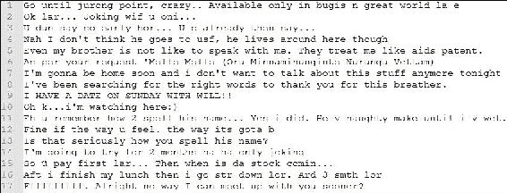

图 2：正常邮件 RDD 的快照

+   **从垃圾邮件 RDD 的行中拆分单词**：在我们分别得到垃圾邮件和正常邮件 RDD 的特征行之后，我们需要拆分单词以便在将来创建特征向量。以下代码通过使用空格进行拆分并返回单词列表 RDD。调用方法返回每行的单词列表：

```scala
      JavaRDD<ArrayList<String>> spamWordList = spam.map(new  
        Function<String, ArrayList<String>>() { 
          @Override 
      public ArrayList<String> call(String line) throws Exception{ 
            ArrayList<String> words = new ArrayList<>(); 
            words.addAll(Arrays.asList(line.split(" "))); 
            return words; 
          }}); 
      JavaRDD<ArrayList<String>> hamWordList = ham.map(new Function<String,  
        ArrayList<String>>() { 
          @Override 
      public ArrayList<String> call(String line) throws Exception{   
            ArrayList<String> words = new ArrayList<>(); 
            words.addAll(Arrays.asList(line.split(" "))); 
            return words;} 
      }); 

```

+   **创建标签和特征对 RDD**：现在我们有了垃圾邮件和正常邮件的两个 RDD。我们想要用 1.0 或 0.0 来标记它们，分别表示垃圾邮件和正常邮件的单词或特征。为了方便使用，我们可以再次创建一个新的 RDD，每行包含一个标签和特征或单词列表的元组。在下面的代码中，我们使用了`Tuple2`来创建一对。您也可以使用`JavaPairRDD`来创建标签和特征的一对：

```scala
      JavaRDD<Tuple2<Double, ArrayList<String>>> spamWordsLabelPair =  
      spamWordList.map(new Function<ArrayList<String>, Tuple2<Double,  
          ArrayList<String>>>() { 
          @Override 
            public Tuple2<Double, ArrayList<String>> call( 
            ArrayList<String> v1) throws Exception {     
            return new Tuple2<Double, ArrayList<String>>(1.0, v1); 
          }}); 
      JavaRDD<Tuple2<Double, ArrayList<String>>> hamWordsLabelPair =  
      hamWordList.map(new Function<ArrayList<String>, Tuple2<Double,  
          ArrayList<String>>>() { 
          @Override 
          public Tuple2<Double, ArrayList<String>> call( 
            ArrayList<String> v1) throws Exception {     
            return new Tuple2<Double, ArrayList<String>>(0.0, v1); 
          }}); 

      [Output: print spamWordsLabelPair2.collect() using for loop] 
      1.0: [FreeMsg:, Txt:, CALL, to, No:, 86888, &, claim, your, reward, 
      of, 3, hours, talk, time, to, use, from, your, phone, now!, 
      ubscribe6GBP/, mnth, inc, 3hrs, 16, stop?txtStop] 
      1.0: [Sunshine, Quiz!, Win, a, super, Sony, DVD, recorder,
      if, you, canname, the, capital, of, Australia?, Text, MQUIZ, 
      to, 82277., B] 

```

+   **两个 RDD 的并集**：现在我们在*表 2*中有数据集的两个标签，即垃圾邮件和正常邮件的特征对 RDD。现在要创建训练数据集，我们可以将这两个 RDD 合并成一个。Spark 有一个`union()`方法可以做到这一点，它返回一个新的 RDD，包含数据集和参数或另一个数据集的并集：

```scala
      JavaRDD<Tuple2<Double, ArrayList<String>>> train_set =  
      spamWordsLabelPair.union(hamWordsLabelPair); 

```

+   对于前面的所有操作，称为转换。这在每种情况下都会从现有的工作节点中返回一个新的数据集。如果您想要将返回结果带回驱动程序或打印结果，那将被称为动作操作。Spark 支持几种内置方法作为动作。`count()`方法用于计算数据集中的元素数量：

```scala
      System.out.println(train_set.count()); 
      The following output is 8

```

+   **打印 RDD**：`collect()`和`take()`也是用于打印或收集数据集作为驱动程序中的数组的动作方法，其中，`take()`接受一个参数，比如*n*，返回数据集的前 n 个元素。以下代码段打印出训练集中的前 10 个元素或元组：

```scala
      for (Tuple2<Double, ArrayList<String>> tt : train_set.collect()) { 
          System.out.println(tt._1 + ": " + tt._2.toString()); } 

```

输出如下：

```scala
      1.0: [FreeMsg:, Txt:, CALL, to, No:, 86888,
       &, claim, your, reward, of, 3, hours, talk, time, to, use, from,
       your, phone, now!, ubscribe6GBP/, mnth, inc, 3hrs, 16, stop?txtStop] 
      1.0: [Sunshine, Quiz!, Win, a, super, Sony, DVD, recorder, if, 
      you, canname, the, capital, of, Australia?, Text, MQUIZ, 
      to, 82277., B] 
      0.0: [What, you, doing?, how, are, you?] 
      0.0: [Ok, lar..., Joking, wif, u, oni...] 
      0.0: [dun, say, so, early, hor..., U, c, already, then, say...] 
      0.0: [MY, NO., IN, LUTON, 0125698789, RING, ME, IF, UR, AROUND!, H*] 
      0.0: [Siva, is, in, hostel, aha:-.] 
      0.0: [Cos, i, was, out, shopping, wif, darren, jus, now,
       n, i, called, 
      him, 2, ask, wat, present, he, wan, lor., Then, he, 
      started, guessing, 
      who, i, was, wif, n, he, finally, guessed, darren, lor.] 

```

+   **将结果保存在本地文件系统中**：有时您可能需要将 RDD 保存在文件系统中。您可以使用以下代码直接保存您的 RDD：

```scala
      train_set.saveAsTextFile("output.txt"); 

```

### 从 SMSSpamCollection 数据集中获取见解

以下源代码显示了基本的正常邮件和垃圾邮件统计信息：

```scala
String path = "input/SMSSpamCollection.txt";     
RDD<String> lines = spark.sparkContext().textFile(path, 2); 
System.out.println(lines.take(10)); 

JavaRDD<Row> rowRDD = lines.toJavaRDD().map( new Function<String, Row>() { 
    public Row call(String line) throws Exception { 
      return RowFactory.create(line); 
      }}); 
System.out.println(rowRDD.collect()); 
List<StructField> fields = new ArrayList<StructField>(); 
fields.add(DataTypes.createStructField("line", DataTypes.StringType, true)); 
org.apache.spark.sql.types.StructType schema = DataTypes.createStructType(fields); 
Dataset<Row> df = spark.sqlContext().createDataFrame(rowRDD, schema); 
df.select("line").show(); 
Dataset<Row> spam = df.filter(df.col("line").like("%spam%")); 
Dataset<Row> ham = df.filter(df.col("line").like("%ham%")); 
System.out.println(spam.count()); 
System.out.println(ham.count()); 
spam.show(); 

```

上述代码生成了以下垃圾邮件和正常邮件计数：

```scala
747 
4831 

```

这意味着在 5578 封电子邮件中，有 747 封是垃圾邮件，4831 封被标记为正常邮件或非垃圾邮件。换句话说，垃圾邮件和正常邮件的比例分别为 13.40%和 86.6%。

## 处理键值对

本小节描述了在数据分析中经常需要的键值对，特别是在文本处理中。

### mapToPair()

这个方法将返回一个(K，V)对的数据集，其中 K 是键，V 是值。例如，如果您有一个包含整数列表的 RDD，然后想要计算列表中重复条目的数量，那么第一步是将每个数字映射为 1。之后您可以对其进行 reduce 操作。该代码产生了如下所示的输出和缓存：

```scala
JavaRDD<Integer> rdd = sc.parallelize(Arrays.asList(1,2,1,3,4,5)); 
JavaPairRDD<Integer, Integer> pairs = rdd.mapToPair( 
  new PairFunction<Integer, Integer, Integer>() { 
    @Override 
    public Tuple2<Integer, Integer> call(Integer x) { 
      return new Tuple2<>(x, 1); 
    } 
}).cache(); 

[Output: pairs.collect()] 
[(1,1), (2,1), (1,1), (3,1), (4,1), (5,1)] 

```

## 更多关于转换的内容

在本节中，您可以了解更多关于转换的内容，包括一些类似方法之间的差异。主要将讨论`map`和`flatMap`，`groupByKey`，`reduceByKey`和`aggregateByKey`，`sortByKey`和`sortBy`。然而，有兴趣的读者可以参考[2]中的 Spark 编程指南了解 RDD 操作。

### map 和 flatMap

`flatMap`类似于我们在前面的示例中展示的`map`，但是每个输入项或每次调用匿名类的`call()`方法都可以映射到零个或多个输出项。因此，`call()`函数返回的是一个序列，而不是像`map`那样返回单个项。例如，对于以下 RDD 的输入，输出应该如下所示：

```scala
JavaRDD<String> rdd = sc.parallelize(Arrays.asList("Hello World!", 
  "How are you.")); 
JavaRDD<String> words = rdd 
  .flatMap(new FlatMapFunction<String, String>() { 
    @Override 
    public Iterable<String> call(String t) throws Exception { 
      return Arrays.asList(t.split(" ")); 
    }}); 

[output: words.collect()] 
[Hello, World!, How, are, you.] 

```

对于前面的示例，您无法执行映射操作，因为`map`的`call()`方法只返回一个对象，而不是一系列对象。

### groupByKey，reduceByKey 和 aggregateByKey

为了在预处理数据集时执行一些操作，您可能需要根据键值进行一些汇总，例如求和和平均值。Spark 提供了一些方法来执行这些类型的操作。假设您有以下 RDD 对，并且您想根据键对值进行分组并进行一些汇总：

```scala
JavaPairRDD<Integer, Integer> rdd_from_integer = sc 
.parallelizePairs(Arrays.asList( new Tuple2<>(1, 1),  
new Tuple2<>(1, 1), new Tuple2<>(3, 2), 
new Tuple2<>(5, 1), new Tuple2<>(5, 3)), 2);  

```

您想要执行的汇总可以通过 Spark 的三种方法来完成，包括`groupByKey`，`reduceByKey`和`aggregateByKey`。但它们在性能、效率和灵活性方面有所不同，可以执行诸如计数、计算摘要统计信息、从数据集中找到唯一元素等操作。`groupByKey`方法返回一个(k，`Iterable<v>`)对的数据集，其中 k 是键，`Iterable<v>`是键 k 的值序列。使用此方法的先前数据集的输出如下所示，显示了每个键的集合值：

```scala
[Output: pairs.groupByKey(2).collect() ] 

```

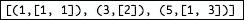

图 3：使用 groupBykey 的对

为了对每个唯一键的值进行求和，`groupByKey`在性能上是低效的，因为它不执行组合的映射。您必须进行更多的转换来明确进行这种求和。因此，它会增加网络 I/O 和洗牌大小。通过`reduceByKey`或`aggregateByKey`可以获得更好的性能，因为它们执行映射端的组合。

这些方法返回具有每个键聚合结果的数据集，例如每个键的值的总和。以下代码显示了这些方法的操作，它们返回由给定函数聚合键的值的(k,v)对的数据集。

`reduceByKey`需要一个函数，用于减少每个键的值，而`aggregateByKey`需要两个函数，其中第一个函数用于指定如何在每个分区内进行聚合，第二个函数用于指定如何在分区之间进行聚合：

+   代码：`reduceByKey()`：

```scala
      JavaPairRDD<Integer, Integer> counts = rdd 
        .reduceByKey(new Function2<Integer, Integer, Integer>() { 
          @Override 
          public Integer call(Integer a, Integer b) { 
            return a + b;}}); 

```

+   代码：`aggregateByKey()`：

```scala
      JavaPairRDD<Integer, Integer> counts = pairs.aggregateByKey(0, 
          new Function2<Integer, Integer, Integer>() { 
            @Override 
            public Integer call(Integer v1, Integer v2) { 
              return v1 + v2; 
            } 
            }, new Function2<Integer, Integer, Integer>() { 
            @Override 
            public Integer call(Integer v1, Integer v2) { 
                  return v1 + v2; 
                } 
              }); 

```

对于这两种情况，输出将如下所示：

`counts.collect()`的输出：

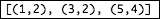

图 4：使用计数的 RDD

### sortByKey 和 sortBy

排序是数据预处理中的常见操作。Spark 提供了两种方法，可以将一个数据集转换为另一个排序的配对数据集，包括`sortByKey`和`sortBy`。例如，我们有一个如下所示的数据集：

```scala
List<Tuple2<Integer, Integer>> pairs = new ArrayList<>(); 
pairs.add(new Tuple2<>(1, 5)); 
pairs.add(new Tuple2<>(4, 2)); 
pairs.add(new Tuple2<>(-1, 1)); 
pairs.add(new Tuple2<>(1, 1)); 

```

`sortByKey()`方法在(k,v)对上执行，并按键的升序或降序返回(k,v)对。您还可以通过提供比较器来自定义排序。以下代码显示了对前面数据集的键进行排序：

+   代码：`sortByKey()`：

```scala
      JavaPairRDD<Integer, Integer> rdd = sc.parallelizePairs(pairs); 
      JavaPairRDD<Integer, Integer> sortedRDD=rdd.sortByKey(Collections.
      <Integer> reverseOrder(), false); 
      [Output: sortedRDD.collect()] 

```

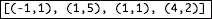

图 5：使用 sortByKey 的对

`sortBy()`方法接受一个函数作为参数，您可以在其中指定排序方法，无论是按键还是按值。以下代码显示了对前面数据集的值进行排序：

+   代码：`sortBy()`：

```scala
      JavaRDD<Tuple2<Integer, Integer>> rdd_new = sc.parallelize(pairs); 
      JavaRDD<Tuple2<Integer, Integer>> sortedRDD=rdd.sortBy( 
      new Function<Tuple2<Integer, Integer>, Integer>() { 
      @Override 
          public Integer call(Tuple2<Integer, Integer> t) { 
              return t._2(); 
          } 
      ,} true, 2);
```

`sortedRDD.collect()`的输出：

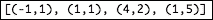

图 6：使用 sortBy 的对

# 数据集基础知识

如在第一章中讨论的，*使用 Spark 进行数据分析简介*，在 Spark 2.0.0 发布中，DataFrame 仍然是 Scala、Python 和 R 的主要计算抽象，但在使用 Java 时，将使用 Dataset 替换。因此，本书中将始终使用类型为 Row 的 Dataset。

Dataset 是一个分布式的数据集合，结构化为行。这是与 Spark SQL 模块交互的更方便的方式之一。

换句话说，它可以被视为类似于关系数据库（RDB）格式的等价实体。与 DataFrame 和 RDD 等其他数据抽象一样，Dataset 也可以从各种数据源创建，如结构化数据文件（TSV、CSV、JSON 和 TXT）、Hive 表、辅助存储、外部数据库或现有的 RDD 和 DataFrame。然而，在 Spark 2.0.0 发布后，基于 Java 的计算不支持 DataFrame，但如果您使用 Python、Scala 或 R 开发应用程序，仍然可以使用 DataFrame。

在接下来的几节中，您将找到使用 Dataset 的操作和操作，以及如何从不同的来源创建 Dataset。

## 读取数据集以创建 Dataset

如上所述，Dataset 是从 Spark 1.5.0 版本开始引入的 Spark SQL 模块的一个组件。因此，所有功能的入口都始于初始化 Spark `SQLContext`。基本上，Spark SQL 用于执行 SQL 查询，可以使用基本的 SQL 语法或 HiveQL 编写。

在另一种编程语言中运行 SQL 时，将返回一个 Dataset 对象。以下代码段将在 Spark 上下文中初始化`SQLContext`。另一方面，您可能需要初始化`HiveContext`以从 Hive 中读取数据集。您还可以创建一个不同的上下文，如`HiveContext`，它提供了`SQLContext`基本功能的超集：

```scala
JavaSparkContext sc = new JavaSparkContext("local","DFDemo"); 
SQLContext sqlContext = new org.apache.spark.sql.SQLContext(sc); 

```

### 从文件中读取

例如，您有一个如下所示的 JSON 文件。现在您想要使用 SQL 上下文读取此文件，基本上返回一个 DataFrame，您可以执行所有基本的 SQL 操作和其他 Spark 的 DSL 操作：

```scala
[Input File] 
{"name":"Michael"} 
{"name":"Andy", "age":30} 
{"name":"Justin", "age":19} 
[Code]    
Dataset<Row> df = sqlContext.read().json("people.json");    

[Output: df.show()] 
+----+-------+ 
| age|   name| 
+----+-------+ 
|null|Michael| 
|  30|   Andy| 
|  19| Justin| 
+----+-------+ 

```

### 从 Hive 中读取

以下代码连接到 Hive 上下文，其中创建了一个表，并将 people JSON 文件加载到 Hive 中。DataFrame 的输出将与上述相同：

```scala
The code is as follows:]hiveContext.sql("CREATE TEMPORARY TABLE people USING  
org.apache.spark.sql.json OPTIONS ( path "people.json" )"); 
Dataset<Row> results = hiveContext.sql("SELECT * FROM people "); 
results.show(); 

```

## 使用 Dataset 进行预处理

在前一节中，我们已经描述了在实际机器学习应用程序中使用 RDD 进行预处理。现在我们将使用 DataFrame（DF）API 进行相同的示例。您会发现很容易操作`SMSSpamCollection`数据集（请参阅[`www.dt.fee.unicamp.br/~tiago/smsspamcollection/`](http://www.dt.fee.unicamp.br/~tiago/smsspamcollection/)）。我们将展示相同的示例，通过对垃圾邮件和正常消息进行标记化，以准备一个训练集：

+   **读取数据集**：您可以使用初始化之前的 Spark 会话变量`spark`来读取该数据集。读取文件作为 Dataset 后，输出将是单列的表格格式。此列的默认名称是`value`：

```scala
      Dataset<Row> df = spark.read().load("input/SMSSpamCollection.txt"); 
      df.show(); 

```

输出：

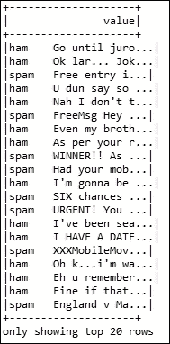

图 7：SMS 垃圾邮件数据集的快照

+   **从现有数据集创建 Row RDD**：从前面的输出中，您可以看到一个包含所有行在一起的列。为了使两列，如标签和特征，我们必须将其拆分。由于 Dataset 是不可变的，您无法修改现有的列或 Dataset。因此，您必须使用现有的 Dataset 创建新的 Dataset。这里的代码将 Dataset 转换为 Row 数据集的集合。Row 是一个接口，表示来自关系运算符的输出的一行。您可以使用 Spark 的`RowFactory`类创建一个新的 Row：

```scala
         JavaRDD<Row> rowRDD = df.toJavaRDD(); 

```

+   从现有的行 RDD 创建新的行 RDD：在拥有行 RDD 之后，您可以执行常规的 map 操作，其中包含所有包含两个值的行数据集。以下代码拆分每一行并返回一个新的行：

```scala
      JavaRDD<Row> splitedRDD = rowRDD.map(new Function<Row, Row>() { 
           @Override 
          public Row call(Row r) throws Exception { 
            String[] split = r.getString(0).split("\t"); 
            return RowFactory.create(split[0],split[1]); 
          }}); 

```

+   从行 RDD 创建数据集：现在您有了包含每行两个值的行 RDD。要创建 DF，您必须定义列名或模式及其数据类型。有两种方法可以定义，包括使用反射推断模式和以编程方式指定模式。方法如下：

+   第一种方法基本上使用 POJO 类和字段名称将成为模式

+   第二种方法通过定义数据类型并创建 structype 来创建 StruchFields 列表。在本例中，我们使用了第二种方法来从现有行 RDD 创建 DF，如下所示：

```scala
      List<StructField> fields  = new ArrayList<>(); 
      fields.add(DataTypes.createStructField("labelString", 
      DataTypes.StringType, true)); 
      fields.add(DataTypes.createStructField("featureString",  
      DataTypes.StringType, true)); 
      org.apache.spark.sql.types.StructType schema = DataTypes 
      .createStructType(fields); 
      Dataset<Row> schemaSMSSpamCollection = sqlContext 
      .createDataFrame(splitedRDD, schema); 
      schemaSMSSpamCollection.printSchema(); 
      [Output: schemaSMSSpamCollection.printSchema()] 

```

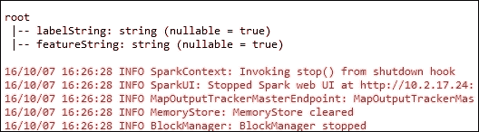

图 8：集合的模式

+   添加新列：现在我们有了两列的 DF。但是我们想要添加新列，将`labledSting`转换为`labedDouble`，将`featureString`转换为`featureTokens`。您可以像以前的代码一样进行操作。在添加新字段后，创建新模式。然后在现有 DF 中进行常规 map 转换后创建新 DF。以下代码给出了具有四列的新 DF 的输出：

```scala
      fields.add(DataTypes.createStructField("labelDouble",  
      DataTypes.DoubleType, true)); 
      fields.add(DataTypes.createStructField("featureTokens",  
      DataTypes.StringType, true)); 
      org.apache.spark.sql.types.StructType schemaUpdated =  
      DataTypes.createStructType(fields); 
      Dataset Row> newColumnsaddedDF = sqlContext 
      .createDataFrame(schemaSMSSpamCollection.javaRDD().map( 
      new Function<Row, Row>() { 
          @Override 
          public Row call(Row row) throws Exception { 
            double label; 
            if(row.getString(0).equalsIgnoreCase("spam")) 
              label = 1.0; 
            else 
              label = 0.0; 
            String[] split = row.getString(1).split(" "); 
            ArrayList<String> tokens = new ArrayList<>(); 
            for(String s:split) 
              tokens.add(s.trim()); 
            return RowFactory.create(row.getString(0), 
       row.getString(1),label, tokens.toString()); 
          }}), schemaUpdated);   
      [Output: newColumnsaddedDF.show()] 

```

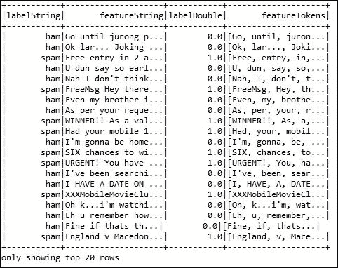

图 9：添加新列后的数据集

+   一些数据集操作：对于数据操作，DF 提供了 Java、Scala 等领域特定语言。您可以对 DF 进行选择、计数、过滤、`groupBy`等操作。以下代码展示了对上述 DF 的一些操作：

```scala
      newColumnsaddedDF.select(newColumnsaddedDF.col("labelDouble"),
      newColumnsaddedDF.col("featureTokens")).show(); 

```

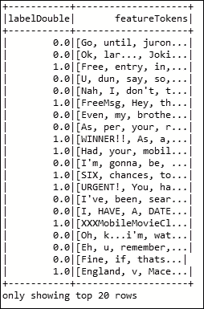

图 10：显示标签和特征的数据集

```scala
      newColumnsaddedDF.filter(newColumnsaddedDF.col
      ("labelDouble").gt(0.0)).show(); 

```

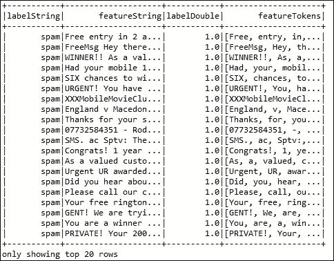

图 11：数据集显示标签已转换为双值

```scala
      newColumnsaddedDF.groupBy("labelDouble").count().show(); 

```

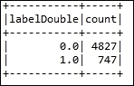

图 12：显示操作后的数据集统计信息

## 更多关于数据集操作

本节将描述如何在 DF 上使用 SQL 查询以及在数据集之间创建不同方式的数据集。主要讨论在 DataFrame 上运行 SQL 查询以及从 JavaBean 创建 DataFrame。然而，有兴趣的读者可以参考 Spark 编程指南中有关 SQL 操作的内容[3]。

### 在数据集上运行 SQL 查询

Spark 的`SQLContext`具有`sql`方法，使应用程序能够运行 SQL 查询。该方法返回一个 DataFrame 作为结果：

+   [`FilternewColumnsAddedDF.createOrReplaceTempView`(`SMSSpamCollection`)]:

```scala
      Dataset<Row> spam = spark.sqlContext().sql("SELECT * FROM 
      SMSSpamCollection
      WHERE labelDouble=1.0"); 
      spam.show();  

```

以下是上述代码的输出：

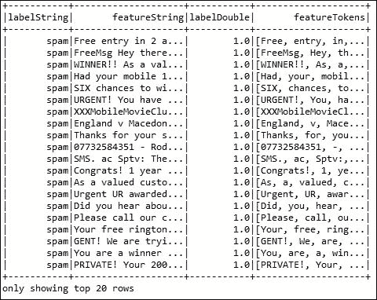

图 13：使用 SQL 查询检索与图 11 相同的结果

+   计数：

```scala
      Dataset<Row> counts = sqlContext.sql("SELECT labelDouble, COUNT(*)  
      AS count FROM SMSSpamCollection GROUP BY labelDouble"); 
      counts.show(); 

```

输出：

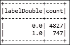

图 14：显示数据集统计信息

## 从 Java Bean 创建数据集

您可以从 Java Bean 创建数据集；在这种情况下，您不需要以编程方式定义模式。例如，您可以在以下代码中看到名为 Bean 的**普通旧 Java 对象**（**POJO**）：

```scala
public class SMSSpamBean implements Serializable { 
  private String labelString; 
  private String featureString; 
public SMSSpamBean(String labelString, String featureString) { 
    super(); 
    this.labelString = labelString; 
    this.featureString = featureString; 
  } 
  public String getLabelString() { 
    return labelString; 
  } 
  public void setLabelString(String labelString) { 
    this.labelString = labelString; 
  } 
  public String getFeatureString() { 
    return featureString; 
  }  public void setFeatureString(String featureString) {    this.featureString = featureString; 
  }}  

```

创建 DF：

```scala
JavaRDD<SMSSpamBean> smsSpamBeanRDD =  rowRDD.map(new Function<Row, SMSSpamBean>() { 
      @Override 
    public SMSSpamBean call(Row r) throws Exception { 
        String[] split = r.getString(0).split("\t"); 
        return new SMSSpamBean(split[0],split[1]); 
      }});   
Dataset<Row> SMSSpamDF = spark.sqlContext().createDataFrame(smsSpamBeanRDD, SMSSpamBean.class); 
SMSSpamDF.show();   

```

以下输出如下：

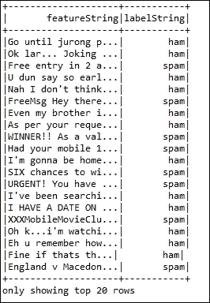

图 15：相应的特征和标签字符串

# 从字符串和类型化类创建数据集

如前所述，数据集是一组对象的类型化和不可变集合。数据集基本上映射到关系模式。使用数据集抽象，Spark 引入了一个新概念，称为编码器。编码器有助于实体转换，例如 JVM 对象与相应的表格表示之间的转换。您会发现这个 API 与 RDD 的转换非常相似，比如`map、mapToPair、flatMap`或`filter`。

我们将在下一节中展示使用数据集 API 的垃圾邮件过滤示例。它使用文本文件读取并返回数据集作为表格格式。然后执行类似 RDD 的映射转换，以添加额外的编码器参数（标签、令牌列）。在这里，我们使用了`SMSSpamTokenizedBean`类的 bean 编码器。

在本小节中，我们将展示如何从字符串和类型类`SMSSpamTokenizedBean`创建数据集。首先让我们创建 Spark 会话，如下所示：

```scala
static SparkSession spark = SparkSession.builder() 
      .appName("DatasetDemo") 
      .master("local[*]") 
      .config("spark.sql.warehouse.dir", "E:/Exp/") 
      .getOrCreate(); 

```

现在从`smm`过滤数据集创建一个新的 String 类型的数据集，即`Dataset<String>`，并显示结果如下：

```scala
Dataset<String> ds = spark.read().text("input/SMSSpamCollection.txt").as(org.apache.spark.sql.Encoders.STRING()); 
ds.show(); 

```

以下是前面代码的输出：

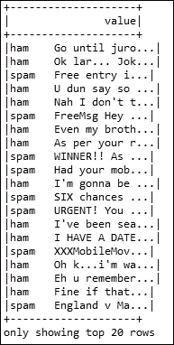

图 16：显示使用数据集进行垃圾邮件过滤的快照

现在让我们通过将我们之前创建的字符串数据集映射为`SMSSpamTokenizedBean`类型的第二个数据集，来创建第二个数据集，如下所示：

```scala
Dataset<SMSSpamTokenizedBean> dsSMSSpam = ds.map( 
new MapFunction<String, SMSSpamTokenizedBean>() { 
          @Override 
public SMSSpamTokenizedBean call(String value) throws Exception { 
      String[] split = value.split("\t"); 
      double label; 
      if(split[0].equalsIgnoreCase("spam")) 
          label = 1.0; 
      else 
          label=0.0; 
ArrayList<String> tokens = new ArrayList<>(); 
  for(String s:split) 
    tokens.add(s.trim());           
      return new SMSSpamTokenizedBean(label, tokens.toString()); 
         } 
}, org.apache.spark.sql.Encoders.bean(SMSSpamTokenizedBean.class)); 

```

现在让我们打印数据集及其模式，如下所示：

```scala
dsSMSSpam.show(); 
dsSMSSpam.printSchema(); 

```

以下输出为：

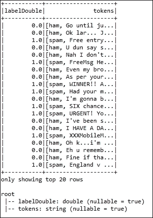

图 17：显示令牌和标签，下方是模式

现在，如果您想将此类型的数据集转换为 Row 类型，那么您可以使用`toDF()`方法，并且可以轻松地使用`createOrReplaceTempView()`方法创建新的`Dataset<Row>`的临时视图，如下所示：

```scala
Dataset<Row> df = dsSMSSpam.toDF(); 
df.createOrReplaceTempView("SMSSpamCollection");      

```

同样，您可能希望通过调用`show()`方法查看相同的数据集，如下所示：

```scala
df.show(); 

```

输出：

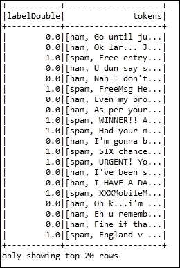

图 18：相应的标签和令牌。标签转换为双值

现在让我们探索类型类`SMSSpamTokenizedBean`。该类作为用于标记文本的 Java 标记化 bean 类。更具体地说，该类接受输入，然后设置标签，然后获取标签。其次，它还设置和获取用于垃圾邮件过滤的令牌。包括 setter 和方法，以下是该类：

```scala
public class SMSSpamTokenizedBean implements Serializable { 
private Double labelDouble; 
private String tokens;     
public SMSSpamTokenizedBean(Double labelDouble, String tokens) { 
  super(); 
  this.labelDouble = labelDouble; 
  this.tokens = tokens; 
  } 
  public Double getLabelDouble() { 
    return labelDouble; 
  } 
  public void setLabelDouble(Double labelDouble) { 
    this.labelDouble = labelDouble; 
  } 
  public String getTokens() { 
    return tokens; 
  } 
  public void setTokens(String tokens) { 
    this.tokens = tokens; 
  }} 

```

## RDD、DataFrame 和 Dataset 之间的比较

将数据集作为 Spark 的新数据结构带来一些目标。虽然 RDD API 非常灵活，但有时很难优化处理。另一方面，DataFrame API 很容易优化，但缺少 RDD 的一些好特性。因此，数据集的目标是允许用户轻松表达对象上的转换，并提供 Spark SQL 执行引擎的优势（性能和鲁棒性）。

数据集可以执行许多操作，如排序或洗牌，而无需对对象进行反序列化。为此，它需要一个显式的编码器，用于将对象序列化为二进制格式。它能够将给定对象（Bean）的模式映射到 Spark SQL 类型系统。另一方面，RDD 基于运行时反射的序列化，而改变数据集对象类型的操作也需要新类型的编码器。

# Spark 和数据科学家的工作流程

正如已经说明的，数据科学家的一个常见任务是选择数据、数据预处理（格式化、清理和抽样）和数据转换（缩放、分解和聚合）原始数据，以便将其传递到机器学习模型中构建模型。随着实验数据集的增加，传统的单节点数据库将无法处理这些类型的数据集，因此，您需要切换到像 Spark 这样的大数据处理计算。幸运的是，我们有 Spark 作为可扩展的分布式计算系统，可以处理您的数据集。

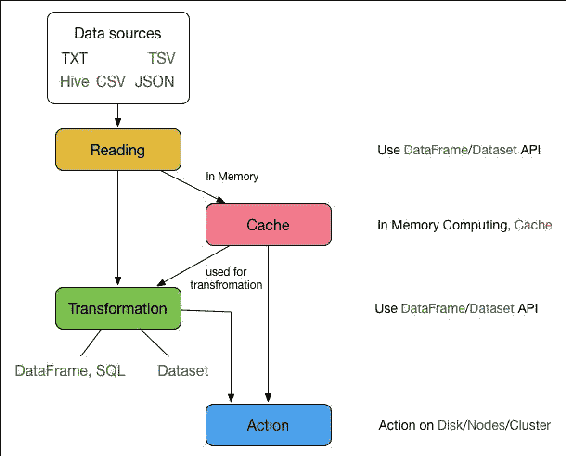

图 19：数据科学家使用 Spark 的工作流程

现在让我们来到确切的点，作为一名数据科学家，首先你将不得不阅读以各种格式提供的数据集。然后阅读数据集将为你提供我们已经描述的 RDDs、DataFrames 和 Datasets 的概念。你可以将数据集缓存到主内存中；你可以从 DataFrame、SQL 或 Datasets 转换读取的数据集。最后，你将执行一个操作，将数据转储到磁盘、计算节点或集群。我们在这里描述的步骤基本上形成了一个工作流程，你将按照这个工作流程进行使用 Spark 进行基本数据处理，如*图 1*所示。

# 深入了解 Spark

在这一部分，我们将展示 Spark 的高级特性，包括使用共享变量（广播变量和累加器），并讨论它们的基本概念。然而，我们将在后面的章节中讨论数据分区。

## 共享变量

在编程上下文中，共享变量的概念并不新鲜。需要许多函数和方法并行使用的变量称为共享变量。Spark 有一些机制来使用或实现共享变量。在 Spark 中，传递给 Spark 操作的函数（如 map 或 reduce）在远程集群节点上执行。代码或函数在节点上作为变量的独立副本工作，结果的更新不会传播回驱动程序。然而，Spark 提供了两种常见用法模式的共享变量：广播变量和累加器。

### 广播变量

在 Spark API 中有许多类型和方法需要了解。然而，更多和更详细的讨论超出了本书的范围。

```scala
Broadcast<int[]> broadcastVariable=sc.broadcast(new int[] {2,3,4}); 
int[] values = broadcastVariable.value(); 
for(int i:values){ 
  System.out.println(i);} 

```

### 累加器

累加器是另一种共享变量，可以用于实现计数器（如 MapReduce 中）或求和。Spark 只支持累加器为数值类型。然而，你也可以使用现有技术为新的数据类型添加支持[1]。通过调用以下初始值为`val`的方法创建：

```scala
SparkContext. accumulator(val) 

```

以下代码显示了使用累加器将数组元素相加的用法：

```scala
Accumulator<Integer> accumulator = sc.accumulator(0); 
sc.parallelize(Arrays.asList(1, 5, 3, 4)) 
.foreach(x -> accumulator.add(x));   
System.out.println(accumulator.value()); 

```

Spark 编程指南：[`spark.apache.org/docs/latest/programming-guide.html`](http://spark.apache.org/docs/latest/programming-guide.html)。

### 提示

有兴趣的读者应该参考以下网页上关于 Spark 和相关材料的内容：

在本章中，我们使用了 RDDs、Dataset 和 DataFrame API 进行了基本的数据操作。我们还学习了如何通过这些 API 进行一些复杂的数据操作。我们试图专注于数据操作，以理解一个实际的机器学习问题——垃圾邮件过滤。除此之外，我们还展示了如何从不同的来源读取数据。分析和准备你的数据，以理解垃圾邮件过滤作为一个例子。

Spark RDD 操作：[`spark.apache.org/docs/latest/programming-guide.html#rdd-operations`](http://spark.apache.org/docs/latest/programming-guide.html#rdd-operations)。

Spark SQL 操作：[`spark.apache.org/docs/latest/sql-programming-guide.html`](http://spark.apache.org/docs/latest/sql-programming-guide.html)。

# 总结

广播变量提供了将只读变量持久化缓存在本地机器上的功能，而不是将副本发送到计算节点或驱动程序。以一种高效的方式将大型输入数据集的副本提供给 Spark 中的每个节点。它还减少了通信成本，因为 Spark 使用了高效的广播。广播变量可以通过调用`SparkContext.broadcast(v)`从变量`v`创建。以下代码显示了这一点：

然而，我们并没有开发任何完整的机器学习应用程序，因为我们的目标只是向您展示实验数据集上的基本数据操作。我们打算在第六章*构建可扩展的机器学习管道*中开发完整的 ML 应用程序。

创建预测模型应该使用哪些特征不仅是一个重要的问题，而且可能是一个需要深入了解问题领域才能回答的困难问题。可以自动选择数据中对某人正在处理的问题最有用或最相关的特征。考虑到这些问题，下一章将详细介绍特征工程，解释为什么要应用它以及一些特征工程的最佳实践。一些仍不清楚的主题将在下一章中更清晰。
