# 第四章：通过特征工程提取知识

应该使用哪些特征来创建预测模型不仅是一个重要问题，而且可能是一个需要深入了解问题领域才能回答的难题。可以自动选择数据中对某人正在处理的问题最有用或最相关的特征。考虑到这些问题，本章详细介绍了特征工程，解释了为什么要应用它以及一些特征工程的最佳实践。

除此之外，我们还将提供特征提取、转换和选择的理论描述和示例，这些示例应用于大规模机器学习技术，使用 Spark MLlib 和 Spark ML API。此外，本章还涵盖了高级特征工程的基本思想（也称为极端特征工程）。

请注意，在继续本章之前，您需要在计算机上安装 R 和 RStudio，因为将使用 R 来展示探索性数据分析的示例。

简而言之，本章将涵盖以下主题：

+   特征工程的最新技术

+   特征工程的最佳实践

+   使用 Spark 进行特征工程

+   高级特征工程

# 特征工程的最新技术

尽管特征工程是一个非正式的话题，但它被认为是应用机器学习中的一个重要部分。安德鲁·吴（Andrew Ng）是机器学习领域的领先科学家之一，他在他的书《通过大脑模拟的机器学习和人工智能》中定义了特征工程这个术语（另请参见：[`en.wikipedia.org/wiki/Andrew_Nghttps://en.wikipedia.org/wiki/Andrew_Ng`](https://en.wikipedia.org/wiki/Andrew_Nghttps://en.wikipedia.org/wiki/Andrew_Ng)）。如下所示：

> *提出特征是困难的，耗时的，需要专业知识。应用机器学习基本上就是特征工程。*

基于前述定义，我们可以认为特征工程实际上是人类智慧，而不是人工智能。此外，我们将从其他角度解释特征工程是什么。特征工程还可以被定义为将原始数据转换为有用特征（通常称为特征向量）的过程。这些特征有助于更好地表示基本问题，最终用于预测模型；因此，预测建模可以应用于新数据类型，以获得高预测准确性。

或者，我们可以将特征工程定义为使用或重复使用某人对基本问题和可用数据的高级领域知识的软件工程过程，以创建使机器学习算法轻松工作的特征。

这就是我们如何定义特征工程的术语。如果您仔细阅读，您会发现这些定义中有四个依赖关系：

+   问题本身

+   你将使用的原始数据来找出有用的模式或特征

+   机器学习问题或类别的类型

+   您将使用的预测模型

现在基于这四个依赖关系，我们可以得出一个工作流程。首先，您必须了解您的问题本身，然后您必须了解您的数据以及它是否有序，如果没有，处理您的数据以找到某种模式或特征，以便您可以构建您的模型。

一旦您确定了特征，您需要知道您的问题属于哪些类别。换句话说，您必须能够根据特征确定它是分类、聚类还是回归问题。最后，您将使用诸如随机森林或**支持向量机**（**SVMs**）等著名方法在测试集或验证集上构建模型进行预测。

在本章中，你将看到并论证特征工程是一门处理不确定和常常无结构数据的艺术。也是真实的，有许多明确定义的程序可以应用于分类、聚类、回归模型，或者像 SVM 这样的方法，这些程序既有条理又可证明；然而，数据是一个变量，经常在不同时间具有各种特征。

## 特征提取与特征选择

你将会知道何时以及如何通过经验学徒的实践来决定应该遵循哪些程序。特征工程涉及的主要任务是：

+   **数据探索和特征提取**：这是揭示原始数据中隐藏宝藏的过程。一般来说，这个过程在消耗特征的算法中并不会有太大变化。然而，在这方面，对实际经验、业务领域和直觉的更好理解起着至关重要的作用。

+   **特征选择**：这是根据你所处理的机器学习问题决定选择哪些特征的过程。你可以使用不同的技术来选择特征；然而，它可能会因算法和使用特征而有所不同。

## 特征工程的重要性

当最终目标是从预测模型中获得最准确和可靠的结果时，你必须投入你所拥有的最好的东西。在这种情况下，最好的投资将是三个参数：时间和耐心，数据和可用性，以及最佳算法。然而，“如何从数据中获取最有价值的宝藏用于预测建模？”是特征工程的过程和实践以新兴方式解决的问题。

事实上，大多数机器学习算法的成功取决于你如何正确和智能地利用价值并呈现你的数据。通常认为，从你的数据中挖掘出的隐藏宝藏（即特征或模式）将直接刺激预测模型的结果。

因此，更好的特征（即你从数据集中提取和选择的内容）意味着更好的结果（即你将从模型中获得的结果）。然而，在你为你的机器学习模型概括之前，请记住一件事，你需要一个很好的特征，尽管具有描述数据固有结构的属性。

总之，更好的特征意味着三个优点：灵活性、调整和更好的结果：

+   **更好的特征（更好的灵活性）**：如果你成功地提取和选择了更好的特征，你肯定会获得更好的结果，即使你选择了一个非最佳或错误的模型。事实上，可以根据你拥有的原始数据的良好结构来选择或挑选最佳或最合适的模型。此外，良好的特征将使你能够最终使用更简单但高效、更快速、易于理解和易于维护的模型。

+   **更好的特征（更好的调整）**：正如我们已经提到的，如果你没有聪明地选择你的机器学习模型，或者如果你的特征不够好，你很可能会从 ML 模型中获得更糟糕的结果。然而，即使在构建模型过程中选择了一些错误的参数，如果你有一些经过良好设计的特征，你仍然可以期望从模型中获得更好的结果。此外，你不需要过多担心或者更加努力地选择最优模型和相关参数。原因很简单，那就是好的特征，你实际上已经很好地理解了问题，并准备使用更好地代表问题本身的所有数据。

+   **更好的特征（更好的结果）**：即使你把大部分精力投入到更好的特征选择上，你很可能会获得更好的结果。

我们还建议读者不要过分自信地只依赖特征。前面的陈述通常是正确的；然而，有时它们会误导。我们想进一步澄清前面的陈述。实际上，如果你从一个模型中获得了最佳的预测结果，实际上是由三个因素决定的：你选择的模型，你拥有的数据，以及你准备的特征。

因此，如果你有足够的时间和计算资源，总是尝试使用标准模型，因为通常简单并不意味着更好的准确性。尽管如此，更好的特征将在这三个因素中做出最大的贡献。你应该知道的一件事是，不幸的是，即使你掌握了许多实践经验和研究其他人在最新技术领域做得很好的特征工程，一些机器学习项目最终也会失败。

## 特征工程和数据探索

很多时候，对训练和测试样本进行智能选择，选择更好的特征会导致更好的解决方案。尽管在前一节中我们认为特征工程有两个任务：从原始数据中提取特征和特征选择。然而，特征工程没有明确或固定的路径。

相反，特征工程中的整个步骤很大程度上受到可用原始数据的指导。如果数据结构良好，你会感到幸运。然而，现实往往是原始数据来自多种格式的多源数据。因此，在进行特征提取和特征选择之前，探索这些数据非常重要。

### 提示

我们建议您使用直方图和箱线图来找出数据的偏度和峰度，并使用数据辅助技术（由 Abe Gong 介绍）对数据进行自举（参见：[`curiosity.com/paths/abe-gong-building-for-resilience-solid-2014-keynote-oreilly/#abe-gong-building-for-resilience-solid-2014-keynote-oreilly`](https://curiosity.com/paths/abe-gong-building-for-resilience-solid-2014-keynote-oreilly/#abe-gong-building-for-resilience-solid-2014-keynote-oreilly)）。

在应用特征工程之前，需要通过数据探索来回答和了解以下问题：

+   对于所有可用字段，总数据的百分比是存在还是不存在空值或缺失值？然后尝试处理这些缺失值，并在不丢失数据语义的情况下进行解释。

+   字段之间的相关性是多少？每个字段与预测变量的相关性是多少？它们取什么值（即，是分类还是非分类，是数值还是字母数字，等等）？

+   然后找出数据分布是否倾斜。你可以通过查看离群值或长尾（略微向右倾斜或正向倾斜，略微向左倾斜或负向倾斜，如*图 1*所示）来确定偏斜程度。现在确定离群值是否有助于预测。

+   之后，观察数据的峰度。更技术性地，检查你的峰度是否是 mesokurtic（小于但几乎等于 3），leptokurtic（大于 3），或者 platykurtic（小于 3）。请注意，任何一元正态分布的峰度被认为是 3。

+   现在尝试调整尾部并观察（预测是否变得更好？）当你去除长尾时会发生什么？

图 1：数据分布的偏斜（x 轴=数据，y 轴=密度）。

你可以使用简单的可视化工具，如密度图来做到这一点，如下例所示。

示例 1\. 假设您对健身步行感兴趣，并且在过去的四周（不包括周末）在体育场或乡村散步。您花费了以下时间（以分钟为单位完成 4 公里步行道）：15, 16, 18, 17.16, 16.5, 18.6, 19.0, 20.4, 20.6, 25.15, 27.27, 25.24, 21.05, 21.65, 20.92, 22.61, 23.71, 35, 39 和 50。现在让我们使用 R 计算和解释这些值的偏度和峰度。

### 提示

我们将展示如何在第十章中配置和使用 SparkR，*配置和使用外部库*并展示如何在 SparkR 上执行相同的代码。这样做的原因是一些绘图包，如`ggplot2`，在当前用于 SparkR 的版本中仍未直接实现。但是，`ggplot2`在 GitHub 上作为名为`ggplot2.SparkR`的组合包可用，可以使用以下命令安装和配置：

**`devtools::install_github("SKKU-SKT/ggplot2.SparkR")`**

然而，在配置过程中需要确保许多依赖项。因此，我们应该在以后的章节中解决这个问题。目前，我们假设您具有使用 R 的基本知识，如果您已经在计算机上安装和配置了 R，则请按照以下步骤操作。然而，将在第十章中逐步演示如何使用 RStudio 安装和配置 SparkR。

现在只需复制以下代码片段并尝试执行，以确保您有 Skewness 和 Kurtosis 的正确值。

安装`moments`包以计算 Skewness 和 Kurtosis：

```scala
install.packages("moments")  

```

使用`moments`包：

```scala
library(moments) 

```

在锻炼期间所花费的时间制作一个向量：

```scala
time_taken <- c (15, 16, 18, 17.16, 16.5, 18.6, 19.0, 20.4, 20.6, 25.15, 27.27, 25.24, 21.05, 21.65, 20.92, 22.61, 23.71, 35, 39, 50) 

```

将时间转换为 DataFrame：

```scala
df<- data.frame(time_taken) 

```

现在计算`skewness`：

```scala
skewness(df) 
[1]1.769592  

```

现在计算`kurtosis`：

```scala
> kurtosis(df) 
[1]5.650427  

```

**结果的解释**：您的锻炼时间的偏度为 1.769592，这意味着您的数据向右倾斜或呈正偏态。另一方面，峰度为 5.650427，这意味着数据的分布是尖峰的。现在检查异常值或尾部，请查看以下直方图。同样，为了简单起见，我们将使用 R 来绘制解释您的锻炼时间的密度图。

安装`ggplot2package`以绘制直方图：

```scala
install.packages("ggplot2") 

```

使用`moments`包：

```scala
library(ggplot2)

```

现在使用`ggplot2`的`qplot()`方法绘制直方图：

```scala
ggplot(df, aes(x = time_taken)) + stat_density(geom="line", col=  
"green", size = 1, bw = 4) + theme_bw() 

```

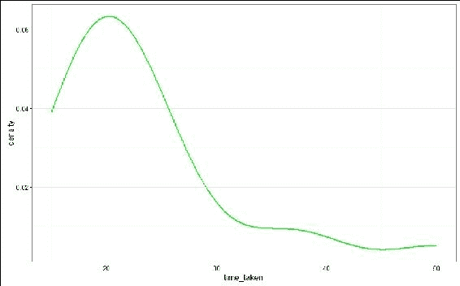

图 2\. 锻炼时间的直方图（右偏）。

在数据（锻炼时间）的*图 2*中呈现的解释显示密度图向右倾斜，因此是尖峰。除了密度图，您还可以查看每个特征的箱线图。箱线图根据五数总结显示数据分布：**最小值**，**第一四分位数**，中位数，**第三四分位数**和**最大值**，如*图 3*所示，我们可以查找超出三（3）个**四分位距**（**IQR**）的异常值：

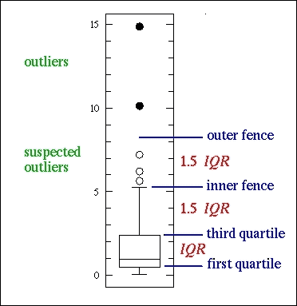

图 3\. 锻炼时间的直方图（图表由箱线图提供，[`www.physics.csbsju.edu/stats/box2.htmlhttp://www.physics.csbsju.edu/stats/box2.html`](http://www.physics.csbsju.edu/stats/box2.htmlhttp://www.physics.csbsju.edu/stats/box2.html)）。

有时，对数据集进行自举也可以提供有关异常值的见解。如果数据量太大（即大数据），进行数据辅助、评估和预测也是有用的。数据辅助的想法是利用可用数据的一小部分来确定可以从数据集中得出什么见解，这也通常被称为“使用小数据来放大大数据的价值”。

这对大规模文本分析非常有用。例如，假设您有大量文本语料库，当然您可以使用其中的一小部分来测试各种情感分析模型，并选择在性能方面效果最好的模型（计算时间、内存使用、可扩展性和吞吐量）。

现在我们想要引起您对特征工程的其他方面的注意。此外，将连续变量转换为分类变量（具有一定特征组合）会产生更好的预测变量。

### 提示

在统计语言中，数据中的变量要么代表某些连续尺度上的测量，要么代表某些分类或离散特征。例如，运动员的体重、身高和年龄代表连续变量。另外，以时间为标准的生存或失败也被视为连续变量。另一方面，一个人的性别、职业或婚姻状况是分类或离散变量。从统计学上讲，某些变量可以以两种方式考虑。例如，电影观众对电影的评分可能被视为连续变量，也可以被视为具有 10 个类别的离散变量。时间序列数据或实时流数据通常用于连续变量直到某个时间点。

同时，考虑特征的平方或立方甚至使用非线性模型也可以提供更好的见解。此外，明智地考虑前向选择或后向选择，因为它们都需要大量计算。

最后，当特征数量变得显著大时，使用主成分分析（PCA）或奇异值分解（SVD）技术找到正确的特征组合是明智的决定。

## 特征提取 - 从数据中创建特征

特征提取是从您已有或将要收集的原始数据中自动构建新特征的方式。在特征提取过程中，通常通过将观察结果自动转换为可以在后续阶段建模的更小的集合来降低复杂原始数据的维度。投影方法，如 PCA 和无监督聚类方法，用于 TXT、CSV、TSV 或 RDB 格式的表格数据。然而，从另一种数据格式中提取特征非常复杂。特别是解析诸如 XML 和 SDRF 之类的许多数据格式，如果要提取的字段数量很大，这是一个繁琐的过程。

对于诸如图像数据之类的多媒体数据，最常见的技术类型包括线条或边缘检测或图像分割。然而，受限于领域和图像，视频和音频观察本身也适用于许多相同类型的数字信号处理（DSP）方法，其中通常模拟观察结果以数字格式存储。

特征提取的最大优点和关键在于，已经开发和可用的方法是自动的；因此，它们可以解决高维数据难以处理的问题。正如我们在第三章中所述，*通过了解数据来理解问题*，更多的数据探索和更好的特征提取最终会提高您的 ML 模型的性能（因为特征提取也涉及特征选择）。事实上，更多的数据最终将提供更多关于预测模型性能的见解。然而，数据必须是有用的，丢弃不需要的数据将浪费宝贵的时间；因此，在收集数据之前，请考虑这个陈述的意义。

特征提取过程涉及几个步骤，包括数据转换和特征转换。正如我们多次提到的，如果模型能够从原始数据中提取更好的特征，那么机器学习模型很可能会提供更好的结果。优化学习和泛化是好数据的关键特征。因此，通过一些数据处理步骤（如清洗、处理缺失值以及从文本文档到单词转换等中间转换），将数据以最佳格式组合起来的过程是通过一些数据处理步骤实现的。

帮助创建新特征作为预测变量的方法被称为特征转换，实际上是一组方法。特征转换基本上是为了降维。通常，当转换后的特征具有描述性维度时，与原始特征相比，可能会有更好的顺序。

因此，在构建机器学习模型时，可以从训练或测试样本中删除较少描述性的特征。特征转换中最常见的任务包括非负矩阵分解、主成分分析和使用缩放、分解和聚合操作的因子分析。

特征提取的例子包括图像中轮廓的提取、从文本中提取图表、从口语文本录音中提取音素等。特征提取涉及特征的转换，通常是不可逆的，因为在降维过程中最终会丢失一些信息。

## 特征选择 - 从数据中筛选特征

特征选择是为了为预测建模和分析准备训练数据集或验证数据集的过程。特征选择在大多数机器学习问题类型中都有实际意义，包括分类、聚类、降维、协同过滤、回归等。

因此，最终目标是从原始数据集的大量特征中选择一个子集。通常会应用降维算法，如**奇异值分解**（**SVD**）和**主成分分析**（**PCA**）。

特征选择技术的一个有趣的能力是，最小的特征集可以被应用来表示可用数据中的最大方差。换句话说，特征的最小子集足以有效地训练您的机器学习模型。

这个特征子集用于训练模型。特征选择技术有两种类型，即前向选择和后向选择。前向选择从最强的特征开始，不断添加更多特征。相反，后向选择从所有特征开始，删除最弱的特征。然而，这两种技术都需要大量计算。

### 特征选择的重要性

由于并非所有特征都同等重要；因此，您会发现一些特征比其他特征更重要，以使模型更准确。因此，这些属性可以被视为与问题无关。因此，您需要在准备训练和测试集之前删除这些特征。有时，相同的技术可能会应用于验证集。

与重要性并行的是，您总是会发现一些特征在其他特征的背景下是多余的。特征选择不仅涉及消除不相关或多余的特征，还有其他重要目的，可以增加模型的准确性，如下所述：

+   特征选择通过消除不相关、空/缺失和冗余特征来提高模型的预测准确性。它还处理高度相关的特征。

+   特征选择技术通过减少特征数量，使模型训练过程更加稳健和快速。

### 特征选择与降维

虽然通过使用特征选择技术可以在数据集中选择某些特征来减少特征数量。然后，使用子集来训练模型。然而，整个过程通常不能与术语**降维**互换使用。

事实上，特征选择方法用于从数据中提取子集，而不改变其基本属性。

另一方面，降维方法利用已经设计好的特征，可以通过减少变量的数量来将原始特征转换为相应的特征向量，以满足机器学习问题的特定考虑和要求。

因此，它实际上修改了基础数据，通过压缩数据从原始和嘈杂的特征中提取原始特征，但保持了原始结构，大多数情况下是不可逆的。降维方法的典型例子包括主成分分析（PCA）、典型相关分析（CCA）和奇异值分解（SVD）。

其他特征选择技术使用基于过滤器的、包装器方法和嵌入方法的特征选择，通过在监督上下文中评估每个特征与目标属性之间的相关性。这些方法应用一些统计量来为每个特征分配一个得分，也被称为过滤方法。

然后基于评分系统对特征进行排名，可以帮助消除特定特征。这些技术的例子包括信息增益、相关系数得分和卡方检验。作为特征选择过程的包装器方法的一个例子是递归特征消除算法。另一方面，最小绝对值收缩和选择算子（LASSO）、弹性网络和岭回归是特征选择的嵌入方法的典型例子，也被称为正则化方法。

Spark MLlib 的当前实现仅为`RowMatrix`类提供了对 SVD 和 PCA 的降维支持。另一方面，从原始数据收集到特征选择的一些典型步骤包括特征提取、特征转换和特征选择。

### 提示

建议感兴趣的读者阅读特征选择和降维的 API 文档：[`spark.apache.org/docs/latest/mllib-dimensionality-reduction.html`](http://spark.apache.org/docs/latest/mllib-dimensionality-reduction.html)。

# 特征工程的最佳实践

在这一部分，我们已经找出了在可用数据上进行特征工程时的一些良好做法。机器学习的一些最佳实践在第二章中进行了描述，*机器学习最佳实践*。然而，这些对于整体机器学习的最新技术来说还是太笼统了。当然，这些最佳实践在特征工程中也会很有用。此外，我们将在接下来的子章节中提供更多关于特征工程的具体示例。

## 理解数据

尽管术语“特征工程”更加技术化，但它是一门艺术，可以帮助你理解特征的来源。现在也出现了一些重要的问题，需要在理解数据之前回答：

+   这些特征的来源是什么？数据是实时的还是来自静态来源？

+   这些特征是连续的、离散的还是其他的？

+   特征的分布是什么样的？分布在很大程度上取决于正在考虑的示例子集是什么样的吗？

+   这些特征是否包含缺失值（即 NULL）？如果是，是否可能处理这些值？是否可能在当前、未来或即将到来的数据中消除它们？

+   是否存在重复或冗余条目？

+   我们是否应该进行手动特征创建，这样会证明有用吗？如果是，将这些特征纳入模型训练阶段会有多难？

+   是否有可以用作标准特征的特征？

了解前面的问题的答案很重要。因为数据来源可以帮助你更快地准备特征工程技术。你需要知道你的特征是离散的还是连续的，或者请求是否是实时响应。此外，你需要了解数据的分布以及它们的偏斜和峰度，以处理异常值。

你需要为缺失或空值做好准备，无论是将它们移除还是需要用替代值填充。此外，你需要首先移除重复的条目，这非常重要，因为重复的数据点可能会严重影响模型验证的结果，如果不适当地排除的话。最后，你需要了解你的机器学习问题本身，因为了解问题类型将帮助你相应地标记你的数据。

## 创新的特征提取方式

在提取和选择特征时要有创新性。在这里，我们总共提供了八条提示，这些提示将帮助你在机器学习应用开发过程中进行泛化。

### 提示

通过将现有数据字段汇总到更广泛的级别或类别来创建输入。

更具体地说，让我们给你一些例子。显然，你可以根据同事的职称将他们分类为战略或战术。例如，你可以将*副总裁或 VP*及以上职位的员工编码为战略，*总监*及以下职位的员工编码为战术。

将几个行业整合到更高级别的行业可能是这种分类的另一个例子。将石油和天然气公司与大宗商品公司整合在一起；黄金、白银或铂金作为贵金属公司；高科技巨头和电信行业作为*技术*；将营收超过 10 亿美元的公司定义为*大型*，而净资产 100 万美元以下的公司定义为*小型*。

### 提示

将数据分成单独的类别或区间。

更具体地说，让我们举几个例子。假设你正在对年收入在 5000 万美元到 10 亿美元以上的公司进行一些分析。因此，显然，你可以将收入分成一些连续的区间，比如 5000 万美元至 2 亿美元，2.01 亿美元至 5 亿美元，5.01 亿美元至 10 亿美元，以及 10 亿美元以上。现在，如何以一种可呈现的格式表示这些特征？很简单，尝试在公司落入收入区间时将值设为 1；否则，值为 0。现在从年收入字段中创建了四个新的数据字段，对吧？

### 提示

想出一种创新的方法将现有数据字段组合成新的字段。

更具体地说，让我们举几个例子。在第一个提示中，我们讨论了如何通过将现有字段合并成更广泛的字段来创建新的输入。现在，假设你想创建一个布尔标志，用于识别是否有人在拥有 10 年以上经验的情况下属于 VP 或更高级别。因此，在这种情况下，你实际上是通过将一个数据字段与另一个数据字段相乘、相除、相加或相减来创建新的字段。

### 提示

同时考虑手头的问题，并且要有创造性。

在之前的提示中，假设你已经创建了足够的箱子和字段或输入。现在，不要太担心一开始创建太多的变量。最好就让头脑风暴自然地进行特征选择步骤。

### 提示

不要愚蠢。

谨慎创建不必要的字段；因为从少量数据中创建太多特征可能会导致模型过拟合，从而产生虚假结果。当面对数据相关性时，记住相关性并不总是意味着因果关系。我们对这个常见观点的逻辑是，对观测数据进行建模只能告诉我们两个变量之间的关系，但不能告诉我们原因。

《奇迹经济学》一书中的研究文章（也可参见*史蒂文·D·莱维特，斯蒂芬·J·杜布纳，《奇迹经济学：一位流氓经济学家探索一切的隐藏面》，[`www.barnesandnoble.com/w/freakonomics-steven-d-levitt/1100550563http://www.barnesandnoble.com/w/freakonomics-steven-d-levitt/1100550563`](http://www.barnesandnoble.com/w/freakonomics-steven-d-levitt/1100550563http://www.barnesandnoble.com/w/freakonomics-steven-d-levitt/1100550563)）发现，公立学校的考试成绩数据表明，家中拥有更多书籍的孩子倾向于比家中书籍较少的孩子有更高的标准化考试成绩。

因此，在创建和构建不必要的特征之前要谨慎，这意味着不要愚蠢。

### 提示

不要过度设计。

在特征工程阶段，判断迭代花费几分钟还是半天的时间差异是微不足道的。因为特征工程阶段最有效的时间通常是在白板上度过的。因此，确保做得正确的最有效的方法是向你的数据提出正确的问题。如今，“大数据”这个词正在取代“特征工程”这个词。没有空间进行黑客攻击，所以不要过度设计：

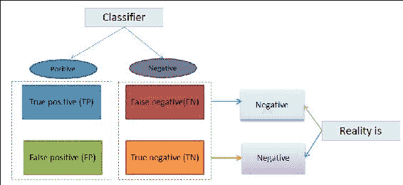

图 4：对假阳性和假阴性的真实解释。

### 提示

谨防假阳性和假阴性。

另一个重要的方面是比较假阴性和假阳性。根据问题，获得其中一个更高的准确性是重要的。例如，如果你在医疗领域进行研究，试图开发一个机器学习模型来预测疾病，那么获得假阳性可能比获得假阴性结果更好。因此，我们在这方面的建议是查看混淆矩阵，这将帮助你以一种可视化的方式查看分类器的预测结果。

行表示每个观察的真实类别，而列对应于模型本身预测的类别，如*图 4*所示。然而，*图 5*将提供更多的见解。请注意，对角线元素，也称为正确决策，用粗体标记。最后一列**Acc**表示每个关键的准确性如下：

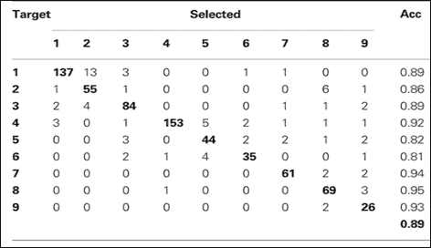

图 5：一个简单的混淆矩阵。

### 提示

在选择特征之前考虑精确度和召回率。

最后，还有两个重要的量需要考虑，即精确度和召回率。更技术性地说，您的分类器正确预测正值结果的频率称为召回率。相反，当您的分类器预测正值输出时，它实际上是真实的频率称为精确度。

预测这两个值确实非常困难。然而，仔细的特征选择将有助于在最后一个位置更好地获得这两个值。

您将在*Matthew Shardlow*撰写的研究论文中找到更多有趣和优秀的特征选择描述（也可参见 Matthew Shardlow，*特征选择技术分析*，[`studentnet.cs.manchester.ac.uk/pgt/COMP61011/goodProjects/Shardlow.pdf`](https://studentnet.cs.manchester.ac.uk/pgt/COMP61011/goodProjects/Shardlow.pdf)）。现在让我们在下一节中探索 Spark 的特征工程功能。

# 使用 Spark 进行特征工程

基于大数据的机器学习是一个深度和广泛的领域，它需要一个新的配方，其中的成分将是特征工程和对数据模型的稳定优化。优化后的模型可以称为大模型（也可参见*S. Martinez*，*A. Chen*，*G. I. Webb*和*N. A. Zaidi*，*Bayesian network classifiers 的可扩展学习*，已被接受发表在*Journal of Machine Learning Research*中），它可以从大数据中学习，并且是突破的关键，而不仅仅是大数据。

大模型还表示，您从多样化和复杂的大数据中得到的结果将具有低偏差（请参见*D. Brain 和 G. I. Webb*，*分类学习中对小数据集需要低偏差算法*，*在 PKDD*，*pp. 62, 73, 2002*），并且可以使用多类机器学习算法进行外部核心学习（请参见外部核心学习定义，[`en.wikipedia.org/wiki/Out-of-core_algorithm`](https://en.wikipedia.org/wiki/Out-of-core_algorithm)和[`en.wikipedia.org/wiki/Out-of-core_algorithm`](https://en.wikipedia.org/wiki/Out-of-core_algorithm)）并且具有最小的调整参数。

Spark 为我们引入了这个大模型，以便我们能够规模化部署我们的机器学习应用。在本节中，我们将描述 Spark 如何开发机器学习库和 Spark 核心来有效处理大规模数据集和不同数据结构的高级特征工程功能。

正如我们已经提到的，Spark 的机器学习模块包含两个 API，包括`spark.mllib`和`spark.ml`。MLlib 包建立在 RDD 之上，而 ML 包建立在 DataFrame 和 Dataset 之上，为构建 ML 流水线提供了更高级别的 API。接下来的几节将向您展示 ML 的细节（MLlib 将在第五章中讨论，*通过示例进行监督和无监督学习*），其中包括一个实际的机器学习问题。

## 机器学习流水线-概述

Spark 的 ML 包提供了一组统一的高级 API，帮助创建一个实用的机器学习流水线。这个流水线的主要概念是将多个机器学习算法组合在一起，形成一个完整的工作流程。在机器学习领域，经常会运行一系列算法来处理和学习可用的数据。

例如，假设您想要开发一个文本分析机器学习应用程序。对于一系列简单的文本文档，总体过程可以分为几个阶段。自然地，处理工作流程可能包括几个阶段。在第一步中，您需要从每个文档中将文本拆分为单词。一旦您拆分了单词，您应该将这些单词转换为每个文档的数值特征向量。

最后，您可能希望使用第 2 阶段得到的特征向量学习预测模型，并且还想要为使用监督机器学习算法的每个向量进行标记。简而言之，这四个阶段可以总结如下。对于每个文档，执行以下操作：

+   拆分文本=>单词

+   将单词转换为数值特征向量

+   数值特征向量=>标记

+   使用向量和标签构建 ML 模型作为预测模型

这四个阶段可以被视为一个工作流程。Spark ML 将这些类型的工作流程表示为由一系列 PipelineStages 组成的管道，其中转换器和估计器在管道的每个阶段中以特定顺序运行。转换器实际上是一个将一个数据集转换为另一个数据集的算法。

另一方面，估计器也是一种算法，负责在数据集上进行拟合以生成一个转换器。从技术上讲，估计器实现了一个称为`fit()`的方法，它接受一个数据集并生成一个模型，这是一个转换器。

### 提示

有兴趣的读者应该参考此网址[`spark.apache.org/docs/latest/ml-pipeline.html`](http://spark.apache.org/docs/latest/ml-pipeline.html)了解有关管道中转换器和估计器的更多详细信息。

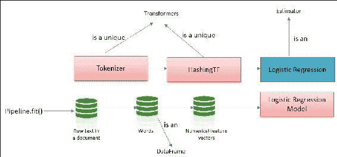

图 6：管道是一个估计器。

更具体地说，让我们举个例子，假设使用诸如逻辑回归（或线性回归）之类的机器学习算法作为估计器。现在通过调用`fit()`方法，训练一个**逻辑回归模型**（它本身也是一个模型，因此是一个转换器）。从技术上讲，转换器实现了一种方法，即`transform()`，它将一个数据集转换为另一个数据集。

在转换过程中，还会有一个列取决于选择和列位置。需要注意的是，Spark 开发的管道概念大多受到 Scikit-learn 项目的启发，这是一个用于数据挖掘和数据分析的简单高效的工具（也可以参见 Scikit-learn 项目，[`scikit-learn.org/stable/`](http://scikit-learn.org/stable/)）。

如第一章中所讨论的，Spark 已将 RDD 操作实现为**有向无环图**（**DAG**）风格。同样的方式也适用于管道，其中每个 DAG 管道的阶段都被指定为一个有序数组。我们之前描述的具有四个阶段的文本处理管道实际上是一个线性管道；在这种管道中，每个阶段都消耗前一阶段产生的数据。只要特征工程图的数据流以 DAG 样式形成和对齐，也可以创建非线性管道。

需要注意的是，如果管道形成一个 DAG，那么阶段需要按拓扑顺序指定。我们所讨论的管道可以在包括各种文件类型的数据集上运行，因此需要对管道一致性进行运行时和编译时检查。不幸的是，Spark 管道的当前实现不提供使用编译时类型检查。但是，Spark 提供了运行时检查，由管道和管道模型使用，使用数据集模式进行。

由于 RDD 的概念是不可变的，这意味着一旦创建了 RDD，就不可能更改 RDD 的内容，同样，流水线阶段的唯一性应该是持久的（请参考*图 6*和*图 7*以获得清晰的视图）具有唯一的 ID。为简单起见，前述文本处理工作流程可以像图 5 一样进行可视化；我们展示了具有三个阶段的文本处理流水线。**Tokenizer**和**HashingTF**是两个独特的转换器。

另一方面，LogisticRegression 是一个估计器。在底部一行，一个圆柱表示一个数据集。在原始包含带有标签的文本文档的数据集上调用了 pipeline 的`fit()`方法。现在`Tokenizer.transform()`方法将原始文本文档分割成单词，而`HashingTF.transform()`方法则将单词列转换为特征向量。

请注意，在每种情况下，数据集上都添加了一列。现在调用`LogisticRegression.fit()`方法来生成`LogisticRegressionModel`：

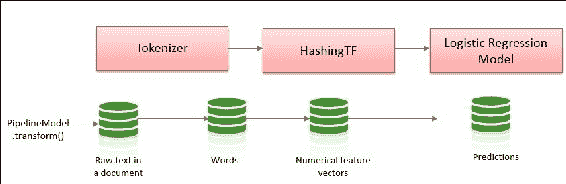

图 7：Pipeline 是一个估计器。

在*图 7*中，PipelineModel 具有与原始 Pipeline 相同数量的阶段。然而，在这种情况下，原始 Pipeline 中的所有估计器都需要转换为转换器。

当在测试数据集（即数值特征向量）上调用**PipelineModel**的`transform()`方法时，数据按特定顺序通过已安装的流水线传递。

总之，流水线和 PipelineModel 有助于确保训练和测试数据经过相同的特征处理步骤。以下部分展示了我们描述的前述流水线过程的实际示例。

## 流水线-使用 Spark ML 的示例

本节将展示一个名为**垃圾邮件过滤**的实际机器学习问题，该问题在第三章中介绍了，*通过了解数据来理解问题*，使用 Spark 的流水线。我们将使用从[`archive.ics.uci.edu/ml/datasets/SMS+Spam+Collection`](https://archive.ics.uci.edu/ml/datasets/SMS+Spam+Collection)下载的`SMSSpamCollection`数据集来展示 Spark 中的特征工程。以下代码使用**普通的旧 Java 对象**（**POJO**）类将样本数据集读取为数据集（更多信息请参见[`en.wikipedia.org/wiki/Plain_Old_Java_Object`](https://en.wikipedia.org/wiki/Plain_Old_Java_Object)）。请注意，`SMSSpamHamLabelDocument`类包含标签（`label: double`）和短信行（`text: String`）。

要运行代码，只需在 Eclipse IDE 中创建一个 Maven 项目，指定提供的`pom.xml`文件下的 Maven 项目和包的依赖关系，并将应用程序打包为 jar 文件。或者，作为独立的 Java 应用程序在 Eclipse 上运行示例。

Spark 会话创建的代码如下：

```scala
  static SparkSession spark = SparkSession 
      .builder().appName("JavaLDAExample") 
      .master("local[*]") 
      .config("spark.sql.warehouse.dir", "E:/Exp/") 
      .getOrCreate(); 

```

在这里，Spark SQL 仓库设置为`E:/Exp/`目录，用于 Windows。根据操作系统类型设置您的路径。

`smsspamdataset`样本的代码如下：

```scala
public static void main(String[] args) { 
 // Prepare training documents, which are labelled. 
 Dataset<Row> smsspamdataset = spark.createDataFrame(Arrays.asList( 
      new SMSSpamHamLabelDocument(0.0, "What you doing how are you"), 
      new SMSSpamHamLabelDocument(0.0, "Ok lar Joking wif u oni"), 
      new SMSSpamHamLabelDocument(1.0, "FreeMsg Txt CALL to No 86888 & claim your reward of 3 hours talk time to use from your phone now ubscribe6GBP mnth inc 3hrs 16 stop txtStop"), 
      new SMSSpamHamLabelDocument(0.0, "dun say so early hor U c already then say"), 
      new SMSSpamHamLabelDocument(0.0, "MY NO IN LUTON 0125698789 RING ME IF UR AROUND H"), 
      new SMSSpamHamLabelDocument(1.0, "Sunshine Quiz Win a super Sony DVD recorder if you canname the capital of Australia Text MQUIZ to 82277 B") 
    ), SMSSpamHamLabelDocument.class); 

```

现在，通过调用`show()`方法来查看数据集的结构：

```scala
Smsspamdataset.show(); 

```

输出如下所示：


POJO 类的代码如下：

```scala
public class SMSSpamHamLabelDocument implements Serializable { 
    private double label; 
    private String wordText; 
    public SMSSpamHamLabelDocument(double label, String wordText) { 
      this.label = label; 
      this.wordText = wordText; 
    } 
    public double getLabel() { return this.label; } 
    public void setLabel(double id) { this.label = label; } 
    public String getWordText() { return this.wordText; }    public void setWordText(String wordText) { this.wordText = wordText; } 
}  } 

```

现在，让我们将数据集分割为`trainingData`（60%）和`testData`（40%）以进行模型训练。

分割的代码如下：

```scala
Dataset<Row>[] splits = smsspamdataset.randomSplit(new double[] { 0.6, 0.4 }); 
Dataset<Row> trainingData = splits[0]; 
Dataset<Row> testData = splits[1]; 

```

数据集的目标是使用分类算法构建预测模型，我们从数据集中知道，有两种类型的消息。一种是垃圾邮件，表示为 1.0，另一种是正常邮件，表示为 0.0 标签。我们可以考虑使用 LogisticRegression 或线性回归算法来训练模型以简化训练和使用。

然而，使用回归等更复杂的分类器，如广义回归，将在第八章, *调整您的机器学习模型*中进行讨论。因此，根据我们的数据集，我们的工作流程或管道将如下所示：

+   将训练数据的文本行标记为单词

+   使用哈希技术提取特征

+   应用逻辑回归估计器构建模型

前面的三个步骤可以通过 Spark 的管道组件轻松完成。您可以将所有阶段定义为单个 Pipeline 类，该类将以高效的方式构建模型。以下代码显示了构建预测模型的整个管道。分词器类定义了输入和输出列（例如，`wordText`到单词），`HashTF`类定义了如何从分词器类的单词中提取特征。

`LogisticRegression`类配置其参数。最后，您可以看到 Pipeline 类，该类将前面的方法作为 PipelineStage 数组，并返回一个估计器。在训练集上应用`fit()`方法后，它将返回最终模型，该模型已准备好进行预测。您可以在应用模型进行预测后看到测试数据的输出。

管道的代码如下：

```scala
Tokenizer tokenizer = new Tokenizer() 
      .setInputCol("wordText") 
      .setOutputCol("words"); 
HashingTF hashingTF = new HashingTF() 
      .setNumFeatures(100) 
      .setInputCol(tokenizer.getOutputCol()) 
      .setOutputCol("features"); 
LogisticRegression logisticRegression = new LogisticRegression() 
      .setMaxIter(10) 
      .setRegParam(0.01); 
Pipeline pipeline = new Pipeline().setStages(new PipelineStage[] {tokenizer, hashingTF, logisticRegression}); 
    // Fit the pipeline to training documents. 
PipelineModel model = pipeline.fit(trainingData); 
Dataset<Row> predictions = model.transform(testData); 
for (Row r: predictions.select("label", "wordText", "prediction").collectAsList()) { 
  System.out.println("(" + r.get(0) + ", " + r.get(1) + ") --> prediction=" + r.get(2)); 
    } } 

```

输出如下：

```scala
(0.0, What you doing how are you)  
--> prediction=0.0 
(0.0, MY NO IN LUTON 0125698789 RING ME IF UR AROUND H)  
--> prediction=0.0 
(1.0, Sunshine Quiz Win a super Sony DVD recorder if you canname the capital of Australia Text MQUIZ to 82277 B)  
--> prediction=0.0 

```

## 特征转换、提取和选择

前面的部分向您展示了管道的整体流程。这个管道或工作流基本上是一些操作的集合，例如将一个数据集转换为另一个数据集，提取特征和选择特征。这些是我们在前几节中已经描述过的特征工程的基本操作符。本节将向您展示如何使用 Spark 机器学习包中的这些操作符的详细信息。Spark 提供了一些高效的特征工程 API，包括 MLlib 和 ML。

在本节中，我们将继续使用垃圾邮件过滤器示例开始 ML 包。让我们从文本文件中读取一个大型数据集作为数据集，其中包含以 ham 或 spam 单词开头的行。此数据集的示例输出如下。现在我们将使用此数据集来提取特征并使用 Spark 的 API 构建模型。

`Input DF`的代码如下：

```scala
Dataset<Row> df = spark.read().text("input/SMSSpamCollection.txt"); 
df.show();  

```

输出如下：

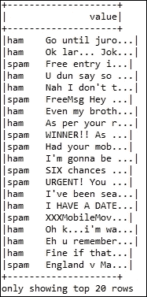

### 转换 - RegexTokenizer

从前面的输出中，您可以看到我们必须将其转换为两列以识别垃圾邮件和 ham 消息。为此，我们可以使用`RegexTokenizer`转换器，该转换器可以从正则表达式（`regex`）中获取输入并将其转换为新数据集。此代码生成`labelFeatured`。例如，请参阅以下输出中显示的数据集：

```scala
// Feature Transformers (RegexTokenizer) 
RegexTokenizer regexTokenizer1 = new RegexTokenizer() 
        .setInputCol("value") 
        .setOutputCol("labelText") 
        .setPattern("\\t.*$");     
Dataset<Row> labelTextDataFrame = regexTokenizer1.transform(df); 
RegexTokenizer regexTokenizer2 = new RegexTokenizer() 
        .setInputCol("value").setOutputCol("text").setPattern("\\W"); 
Dataset<Row> labelFeatureDataFrame = regexTokenizer2 
        .transform(labelTextDataFrame); 
for (Row r : labelFeatureDataFrame.select("text", "labelText").collectAsList()) { 
      System.out.println( r.getAs(1) + ": " + r.getAs(0)); 
    } 

```

以下是`labelFeature`数据集的输出：

```scala
WrappedArray(ham): WrappedArray(ham, what, you, doing, how, are, you) 
WrappedArray(ham): WrappedArray(ham, ok, lar, joking, wif, u, oni) 
WrappedArray(ham): WrappedArray(ham, dun, say, so, early, hor, u, c, already, then, say) 
WrappedArray(ham): WrappedArray(ham, my, no, in, luton, 0125698789, ring, me, if, ur, around, h) 
WrappedArray(spam): WrappedArray(spam, freemsg, txt, call, to, no, 86888, claim, your, reward, of, 3, hours, talk, time, to, use, from, your, phone, now, ubscribe6gbp, mnth, inc, 3hrs, 16, stop, txtstop) 
WrappedArray(ham): WrappedArray(ham, siva, is, in, hostel, aha) 
WrappedArray(ham): WrappedArray(ham, cos, i, was, out, shopping, wif, darren, jus, now, n, i, called, him, 2, ask, wat, present, he, wan, lor, then, he, started, guessing, who, i, was, wif, n, he, finally, guessed, darren, lor) 
WrappedArray(spam): WrappedArray(spam, sunshine, quiz, win, a, super, sony, dvd, recorder, if, you, canname, the, capital, of, australia, text, mquiz, to, 82277, b) 

```

现在让我们通过以下方式从我们刚刚创建的`labelFeatured`数据集创建一个新的数据集，选择标签文本：

```scala
Dataset<Row> newDF = labelFeatureDataFrame.withColumn("labelTextTemp",        labelFeatureDataFrame.col("labelText").cast(DataTypes.StringType))        .drop(labelFeatureDataFrame.col("labelText"))        .withColumnRenamed("labelTextTemp", "labelText"); 

```

现在让我们通过调用`show()`方法进一步探索新数据集中的内容：

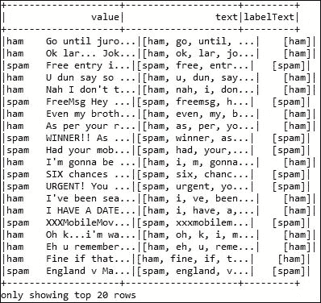

### 转换 - 字符串索引器

前面的输出显示了 ham 和 spam 消息的分类，但我们必须将 ham 和 spam 文本转换为双精度值。`StringIndexer`转换器可以轻松完成此操作。它可以将标签的字符串列编码为另一列中的索引。索引按标签频率排序。`StringIndexer`为我们的数据集生成了两个索引，0.0 和 1.0：

```scala
// Feature Transformer (StringIndexer) 
StringIndexer indexer = new StringIndexer().setInputCol("labelText") 
        .setOutputCol("label"); 
Dataset<Row> indexed = indexer.fit(newDF).transform(newDF); 
    indexed.select(indexed.col("labelText"), indexed.col("label"), indexed.col("text")).show();  

```

`indexed.show()`函数的输出如下：

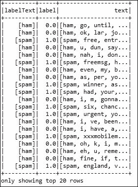

### 转换 - 停用词移除器

前述输出包含单词或标记，但有些单词并不像特征那样重要。因此，我们需要删除这些单词。为了使这项任务更容易，Spark 通过`StopWordsRemover`类提供了停用词列表，这将在第六章中更多地讨论，*构建可扩展的机器学习管道*。

我们可以使用这些单词来过滤不需要的单词。此外，我们将从文本列中删除垃圾邮件和垃圾邮件单词。`StopWordsRemover`类将通过删除特征中的停用词将前述数据集转换为过滤后的数据集。下面的输出将显示没有垃圾邮件和垃圾邮件单词标记的单词：

```scala
// Feature Transformers (StopWordsRemover) 
StopWordsRemover remover = new StopWordsRemover(); 
String[] stopwords = remover.getStopWords(); 
String[] newStopworks = new String[stopwords.length+2]; 
newStopworks[0]="spam"; 
newStopworks[1]="ham"; 
for(int i=2;i<stopwords.length;i++){ 
      newStopworks[i]=stopwords[i];}   
remover.setStopWords(newStopworks).setInputCol("text").setOutputCol("filteredWords"); 
Dataset<Row> filteredDF = remover.transform(indexed); 
filteredDF.select(filteredDF.col("label"), filteredDF.col("filteredWords")).show();  

```

输出如下：

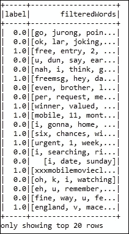

### TF 提取

现在我们有了包含双精度值标签和过滤后的单词或标记的数据集。下一个任务是对特征进行向量化（使其成为数值）或从单词或标记中提取特征。

**TF-IDF**（`HashingTF`和`IDF`；也称为**词频-逆文档频率**）是一种广泛用于提取特征的特征向量化方法，基本上计算了术语在语料库中对文档的重要性。

`TF`计算文档或行中术语的频率，`IDF`计算文档或行的频率，即包含特定术语的文档或行的数量。以下代码使用 Spark 的高效`HashingTF`类解释了前述数据集的词频。`HashingTF`是一个将术语集合转换为固定长度特征向量的转换器。还显示了特征数据的输出：

```scala
// Feature Extractors (HashingTF transformer) 
int numFeatures = 100; 
HashingTF hashingTF = new HashingTF().setInputCol("filteredWords") 
        .setOutputCol("rawFeatures").setNumFeatures(numFeatures); 
Dataset<Row> featurizedData = hashingTF.transform(filteredDF); 
    for (Row r : featurizedData.select("rawFeatures", "label").collectAsList()) { 
Vector features = r.getAs(0); ////Problematic line 
Double label = r.getDouble(1); 
System.out.println(label + "," + features); 
    }  

```

输出如下：

```scala
0.0,(100,[19],[1.0]) 
0.0,(100,[9,16,17,48,86,96],[1.0,1.0,1.0,1.0,1.0,1.0]) 
0.0,(100,[17,37,43,71,99],[1.0,1.0,2.0,1.0,2.0]) 
0.0,(100,[4,41,42,47,92],[1.0,1.0,1.0,1.0,1.0]) 
1.0,(100,[3,12,19,26,28,29,34,41,46,51,71,73,88,93,94,98],[1.0,1.0,1.0,1.0,1.0,1.0,1.0,1.0,1.0,1.0,1.0,1.0,1.0,1.0,1.0,2.0]) 
0.0,(100,[19,25,38],[1.0,1.0,1.0]) 
0.0,(100,[8,10,16,30,37,43,48,49,50,55,76,82,89,95,99],[1.0,4.0,2.0,1.0,1.0,2.0,1.0,1.0,1.0,1.0,1.0,1.0,1.0,1.0,2.0]) 
1.0,(100,[0,24,36,39,42,48,53,58,67,86,95,97,98],[1.0,1.0,1.0,1.0,1.0,1.0,1.0,1.0,2.0,1.0,1.0,2.0,1.0]) 

```

### 提取 - IDF

同样，我们可以将`IDF`应用于特征数据以计算文档频率。`IDF`是一个适合于前述数据集的估计器，并产生一个将转换为包含特征和标签的重新缩放数据集的`IDFModel`：

```scala
// Feature Extractors (IDF Estimator) 
IDF idf = new IDF().setInputCol("rawFeatures").setOutputCol("features"); 
IDFModel idfModel = idf.fit(featurizedData); 
Dataset<Row> rescaledData = idfModel.transform(featurizedData); 
for (Row r : rescaledData.select("features", "label").collectAsList()) { 
Vector features = r.getAs(0); 
Double label = r.getDouble(1); 
System.out.println(label + "," + features); 
    }  

```

输出如下：

```scala
0.0,(100,[19],[0.8109302162163288]) 
0.0,(100,[9,16,17,48,86,96],[1.5040773967762742,1.0986122886681098,1.0986122886681098,0.8109302162163288,1.0986122886681098,1.5040773967762742]) 
0.0,(100,[17,37,43,71,99],[1.0986122886681098,1.0986122886681098,2.1972245773362196,1.0986122886681098,2.1972245773362196]) 
0.0,(100,[4,41,42,47,92],[1.5040773967762742,1.0986122886681098,1.0986122886681098,1.5040773967762742,1.5040773967762742]) 
1.0,(100,[3,12,19,26,28,29,34,41,46,51,71,73,88,93,94,98],[1.5040773967762742,1.5040773967762742,0.8109302162163288,1.5040773967762742,1.5040773967762742,1.5040773967762742,1.5040773967762742,1.0986122886681098,1.5040773967762742,1.5040773967762742,1.0986122886681098,1.5040773967762742,1.5040773967762742,1.5040773967762742,1.5040773967762742,2.1972245773362196]) 
0.0,(100,[19,25,38],[0.8109302162163288,1.5040773967762742,1.5040773967762742]) 
0.0,(100,[8,10,16,30,37,43,48,49,50,55,76,82,89,95,99],[1.5040773967762742,6.016309587105097,2.1972245773362196,1.5040773967762742,1.0986122886681098,2.1972245773362196,0.8109302162163288,1.5040773967762742,1.5040773967762742,1.5040773967762742,1.5040773967762742,1.5040773967762742,1.5040773967762742,1.0986122886681098,2.1972245773362196]) 
1.0,(100,[0,24,36,39,42,48,53,58,67,86,95,97,98],[1.5040773967762742,1.5040773967762742,1.5040773967762742,1.5040773967762742,1.0986122886681098,0.8109302162163288,1.5040773967762742,1.5040773967762742,3.0081547935525483,1.0986122886681098,1.0986122886681098,3.0081547935525483,1.0986122886681098]) 

```

前述输出从原始文本中提取特征。第一个条目是标签，其余是提取的特征向量。

### 选择 - ChiSqSelector

前述输出已准备好使用分类算法进行训练，例如`LogisticRegression`。但是我们可以从分类特征中使用更重要的特征。为此，Spark 提供了一些特征选择器 API，如`ChiSqSelector`。`ChiSqSelector`被称为**卡方特征选择**。

它在具有分类特征的标记数据上运行。它根据卡方检验对特征进行排序，该检验独立于类，并过滤出类标签最依赖的前几个特征。此选择器对提高模型的预测能力很有用。以下代码将从特征向量中选择前三个特征，以及给出的输出：

```scala
org.apache.spark.ml.feature.ChiSqSelector selector = new org.apache.spark.ml.feature.ChiSqSelector(); 
selector.setNumTopFeatures(3).setFeaturesCol("features") 
        .setLabelCol("label").setOutputCol("selectedFeatures"); 
Dataset<Row> result = selector.fit(rescaledData).transform(rescaledData); 
    for (Row r : result.select("selectedFeatures", "label").collectAsList()) { 
  Vector features = r.getAs(0); 
  Double label = r.getDouble(1); 
  System.out.println(label + "," + features); 
    } 

```

### 提示

我们将在第六章中更多地讨论`ChiSqSelector`，`IDFModel`，`IDF`，`StopWordsRemover`和`RegexTokenizer`类，*构建可扩展的机器学习管道*。

输出如下：

```scala
0.0,(3,[],[]) 
0.0,(3,[],[]) 
0.0,(3,[],[]) 
0.0,(3,[],[]) 
1.0,(3,[1,2],[1.5040773967762742,2.1972245773362196]) 
0.0,(3,[],[]) 
0.0,(3,[],[]) 
1.0,(3,[0,2],[1.5040773967762742,1.0986122886681098]) 

```

现在，当构建具有特征向量的模型时，您可以应用`LogisticRegression`。Spark 提供了许多不同的特征工程 API。但是，出于简洁和页面限制的原因，我们没有使用 Spark 的其他机器学习（即 Spark MLlib）。我们将在未来的章节中逐渐讨论使用`spark.mllib`进行特征工程的示例。

# 高级特征工程

在本节中，我们将讨论一些高级特性，这些特性也涉及到特征工程过程，如手动特征构建，特征学习，特征工程的迭代过程和深度学习。

## 特征构建

最好的结果来自于您通过手动特征工程或特征构建。因此，手动构建是从原始数据中创建新特征的过程。基于特征重要性的特征选择可以告诉您有关特征的客观效用；然而，这些特征必须来自其他地方。事实上，有时候，您需要手动创建它们。

与特征选择相比，特征构建技术需要花费大量的精力和时间，不是在聚合或挑选特征上，而是在实际的原始数据上，以便新特征能够有助于提高模型的预测准确性。因此，它还涉及思考数据的潜在结构以及机器学习问题。

在这方面，要从复杂和高维数据集中构建新特征，您需要了解数据的整体结构。除此之外，还需要知道如何在预测建模算法中使用和应用它们。在表格、文本和多媒体数据方面将有三个方面：

+   处理和手动创建表格数据通常意味着混合组合特征以创建新特征。您可能还需要分解或拆分一些原始特征以创建新特征。

+   对于文本数据，通常意味着设计文档或上下文特定的指标与问题相关。例如，当您在大型原始数据上应用文本分析，比如来自 Twitter 标签的数据。

+   对于多媒体数据，比如图像数据，通常需要花费大量时间以手动方式挑选出相关结构。

不幸的是，特征构建技术不仅是手动的，整个过程也更慢，需要人类像你和我们一样进行大量的研究。然而，从长远来看，它可能会产生重大影响。事实上，特征工程和特征选择并不是互斥的；然而，在机器学习领域，它们都很重要。

## 特征学习

是否可能避免手动指定如何从原始数据中构建或提取特征的过程？特征学习可以帮助您摆脱这一点。因此，特征学习是一个高级过程；或者说是从原始数据中自动识别和使用特征的过程。这也被称为表示学习，有助于您的机器学习算法识别有用的特征。

特征学习技术通常用于深度学习算法。因此，最近的深度学习技术在这一领域取得了一些成功。自动编码器和受限玻尔兹曼机就是使用特征学习概念的例子。特征学习的关键思想是使用无监督或半监督学习算法以压缩形式自动和抽象地表示特征。

语音识别、图像分类和物体识别是一些成功的例子；研究人员在这些领域取得了最新的支持结果。由于篇幅有限，本书中无法详细介绍更多细节。

不幸的是，Spark 还没有实现任何自动特征提取或构建的 API。

## 特征工程的迭代过程

特征工程的整个过程不是独立的，而是更多或少是迭代的。因为您实际上是在数据选择到模型评估之间反复交互，直到您完全满意或时间用尽。迭代可以想象为一个随时间迭代运行的四步工作流程。当您聚合或收集原始数据时，您可能没有进行足够的头脑风暴。然而，当您开始探索数据时，您真的深入了解问题。

之后，您将会看到大量数据，研究特征工程的最佳技术以及现有技术中提出的相关问题，您将看到自己能够偷取多少。当您进行了足够的头脑风暴后，您将开始设计所需的特征或根据问题类型或类别提取特征。您可以使用自动特征提取或手动特征构建（有时两者都有）。如果对性能不满意，您可能需要重新进行特征提取以改进。请参考*图 7*，以清晰地了解特征工程的迭代过程：

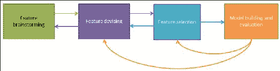

图 8：特征工程中的迭代处理。

当您设计或提取了特征后，您需要选择特征。您可以根据特征重要性应用不同的评分或排名机制。同样，您可能需要迭代相同的过程，如设计特征以改进模型。最后，您将评估模型，以估计模型在新数据上的准确性，使您的模型具有适应性。

您还需要一个明确定义的问题，这将帮助您停止整个迭代。完成后，您可以继续尝试其他模型。一旦您在想法或准确性增量上达到平台，未来将有收益等待着您的 ML 管道。

## 深度学习

我们可以说，数据表示中最有趣和有前途的举措之一是深度学习。它在张量计算应用和**人工智能神经网络**（**AINN**）系统中非常受欢迎。使用深度学习技术，网络学习如何在不同层次表示数据。

因此，您将具有表示您拥有的线性数据的指数能力。Spark 可以利用这一优势，用于改进深度学习。有关更一般的讨论，请参阅以下网址[`en.wikipedia.org/wiki/Deep_learning`](https://en.wikipedia.org/wiki/Deep_learning)，要了解如何在 TensorFlow 集群上部署管道，请参见[`www.tensorflow.org/`](https://www.tensorflow.org/)。

Databricks 最近的研究和开发（也请参阅[`databricks.com/`](https://databricks.com/)）表明，Spark 也可以用于找到 AINN 训练的最佳超参数集。优势在于，Spark 的计算速度比普通的深度学习或神经网络算法快 10 倍。

因此，您的模型训练时间将大幅减少多达 10 倍，错误率将降低 34%。此外，Spark 可以应用于大量数据上训练的 AINN 模型，因此您可以大规模部署您的 ML 模型。我们将在后面的章节中更多地讨论深度学习作为高级机器学习。

# 总结

特征工程、特征选择和特征构建是准备训练和测试集以构建机器学习模型时最常用的三个步骤。通常，首先应用特征工程从可用数据集中生成额外的特征。之后，应用特征选择技术来消除不相关、缺失或空值、冗余或高度相关的特征，以便获得高预测准确性。

相比之下，特征构建是一种高级技术，用于构建在原始数据集中要么不存在要么微不足道的新特征。

请注意，并不总是需要进行特征工程或特征选择。是否进行特征选择和构建取决于您拥有或收集的数据，您选择了什么样的 ML 算法，以及实验本身的目标。

在本章中，我们已经详细描述了所有三个步骤，并提供了实际的 Spark 示例。在下一章中，我们将详细描述使用两个机器学习 API（Spark MLlib 和 Spark ML）的监督学习和无监督学习的一些实际示例。
