# 第五章：通过示例进行监督和无监督学习

在第二章中，《机器学习最佳实践》读者学习了一些基本机器学习技术的理论基础。而第三章中，《通过了解数据来理解问题》，描述了使用 Spark 的 API（如 RDD、DataFrame 和 Datasets）进行基本数据操作。另一方面，第四章描述了特征工程的理论和实践。然而，在本章中，读者将学习到快速而强大地在可用数据上应用监督和无监督技术以解决新问题所需的实际知识，这些知识是基于前几章的理解，并且将从 Spark 的角度演示这些例子。简而言之，本章将涵盖以下主题：

+   机器学习课程

+   监督学习

+   无监督学习

+   推荐系统

+   高级学习和泛化

# 机器学习课程

正如在第一章中所述，《使用 Spark 进行数据分析简介》和第二章中，《机器学习最佳实践》，机器学习技术可以进一步分为三类主要算法：监督学习、无监督学习和推荐系统。分类和回归算法在监督学习应用开发中被广泛使用，而聚类则属于无监督学习的范畴。在本节中，我们将描述一些监督学习技术的示例。

接下来我们将提供一些使用 Spark 呈现的相同示例的例子。另一方面，聚类技术的示例将在“无监督学习”部分中讨论，回归技术经常模拟变量之间的过去关系，以预测它们的未来变化（上升或下降）。在这里，我们分别展示了分类和回归算法的两个现实生活中的例子。相比之下，分类技术接受一组带有已知标签的数据，并学习如何基于该信息为新记录打上标签：

+   **示例（分类）**：Gmail 使用一种称为分类的机器学习技术，根据电子邮件的数据来确定电子邮件是否为垃圾邮件。

+   **示例（回归）**：举个例子，假设你是一名在线货币交易员，你在外汇或 Fortrade 上工作。现在你心里有两个货币对要买入或卖出，比如：GBP/USD 和 USD/JPY。如果你仔细观察这两对货币，USD 是这两对货币的共同点。现在，如果你观察 USD、GBP 或 JPY 的历史价格，你可以预测未来的结果，即你应该开仓买入还是卖出。这些问题可以通过使用回归分析的监督学习技术来解决：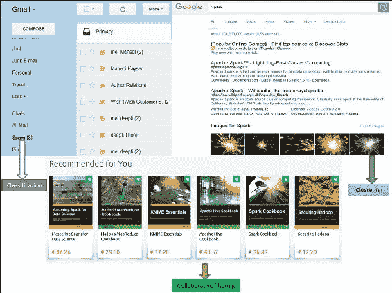

图 1：分类、聚类和协同过滤-大局观

另一方面，聚类和降维常用于无监督学习。以下是一些示例：

+   **示例（聚类）**：Google 新闻使用一种称为聚类的技术，根据标题和内容将新闻文章分成不同的类别。聚类算法发现数据集中出现的分组。

+   **示例（协同过滤）**：协同过滤算法经常用于推荐系统的开发。像亚马逊和 Netflix 这样的知名公司使用一种称为协同过滤的机器学习技术，根据用户的历史和与其他用户的相似性来确定用户会喜欢哪些产品。

+   **示例（降维）**：降维通常用于使高维数据集变得更加可用。例如，假设您有一张尺寸为 2048x1920 的图像，并且希望将其降维到 1080x720，而不会牺牲太多质量。在这种情况下，可以使用流行的算法，如**主成分分析**（**PCA**）或**奇异值分解**（**SVD**），尽管您也可以实现 SVD 来实现 PCA。这就是为什么 SVD 更广泛使用的原因。

## 监督学习

正如已经说明的，监督学习应用程序基于一组示例进行预测，其目标是学习将输入与与现实世界相一致的输出相映射的一般规则。例如，垃圾邮件过滤的数据集通常包含垃圾邮件和非垃圾邮件。因此，我们可以知道训练集中哪些消息是垃圾邮件或非垃圾邮件。因此，监督学习是从标记的训练数据中推断函数的机器学习技术。监督学习任务涉及以下步骤：

+   使用训练数据集训练 ML 模型

+   使用测试数据集测试模型性能

因此，在这种情况下，用于训练 ML 模型的数据集被标记为感兴趣的值，监督学习算法会寻找这些值标签中的模式。算法找到所需的模式后，这些模式可以用于对未标记的测试数据进行预测。

监督学习的典型用途多种多样，通常用于生物信息学、化学信息学、数据库营销、手写识别、信息检索、计算机视觉中的对象识别、光学字符识别、垃圾邮件检测、模式识别、语音识别等应用中，这些应用中主要使用分类技术。另一方面，监督学习是生物系统中向下因果关系的特例。

### 提示

有关监督学习技术如何从理论角度工作的更多信息可以在以下书籍中找到：Vapnik, V. N. *统计学习理论的本质（第二版）*，Springer Verlag，2000 年；以及 Mehryar M.，Afshin R. Ameet T.（2012）机器学习基础，麻省理工学院出版社 ISBN 9780262018258。

### 监督学习示例

分类是一类监督机器学习算法，将输入指定为预定义类别之一。分类的一些常见用例包括：

+   信用卡欺诈检测

+   电子邮件垃圾邮件检测

分类数据被标记，例如垃圾邮件/非垃圾邮件或欺诈/非欺诈。机器学习为新数据分配标签或类别。您根据预先确定的特征对某物进行分类。特征是您提出的“如果问题”。标签是这些问题的答案。例如，如果一个对象像鸭子一样走路，游泳和呱呱叫，那么标签将是*鸭子*。或者假设航班延误超过 1 小时，那么它将是延误；否则不是延误。

# 使用 Spark 进行监督学习-一个例子

我们将通过分析航班延误来演示一个示例。将使用美国交通部网站上的名为`On_Time_Performance_2016_1.csv`的数据集[`www.transtats.bts.gov/`](http://www.transtats.bts.gov/)。

## 使用 Spark 进行航班延误分析

我们使用 2016 年的航班信息。对于每次航班，我们在*表 1*中提供了以下信息（截至 2016 年 5 月 17 日，共 444,827 行和 110 列）：

| **数据字段** | **描述** | **示例值** |
| --- | --- | --- |
| `DayofMonth` | 月份 | 2 |
| `DayOfWeek` | 星期几 | 5 |
| `TailNum` | 飞机尾号 | N505NK |
| `FlightNum` | 航班号 | 48 |
| `AirlineID` | 航空公司 ID | 19805 |
| `OriginAirportID` | 起飞机场 ID | JFK |
| `DestAirportID` | 目的地机场 ID | LAX |
| `Dest` | 目的地机场代码 | 1424 |
| `CRSDepTime` | 计划起飞时间 | 10:00 |
| `DepTime` | 实际起飞时间 | 10:30 |
| `DepDelayMinutes` | 起飞延误时间 | 30 |
| `CRSArrTime` | 计划到达时间 | 22:45 |
| `ArrTime` | 实际到达时间 | 23:45 |
| `ArrDelayMinutes` | 到达延误时间 | 60 |
| `CRSElapsedTime` | 飞行时间 | 825 |
| `Distance` | 总距离 | 6200 |

表 1：来自“准时表现 2016_1”数据集的样本数据

在这种情况下，我们将构建一棵树，根据图中显示的以下特征来预测延误或未延误的标签，这是航班数据集的一个小快照。这里`ArrDelayMinutes`为 113，应该被分类为延误（1.0），其他行的延误时间少于 60 分钟，因此标签应为 0.0（未延误）。从这个数据集中，我们将进行一些操作，如特征提取、转换和选择。*表 2*显示了我们将在此示例中考虑的与特征相关的前五行：

+   **标签**：延误和未延误 - 如果延误>60 分钟，则为延误

+   **特征**：{`DayOfMonth`, `WeekOfday`, `CRSdeptime`, `CRSarrtime`, `Carrier`, `CRSelapsedtime`, `Origin`, `Dest`, `ArrDelayMinutes`}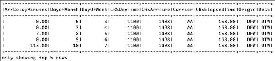

图 2：用于航班延误预测的选定特征

### 加载和解析数据集

在执行特征提取之前，我们需要加载和解析数据集。这一步还包括：加载包和相关依赖项，将数据集读取为 DataFrame，创建 POJO 或 Bean 类，并根据要求添加新的标签列。

**步骤 1：加载所需的包和依赖项**

为了读取 csv 文件，我们使用了 Databricks 提供的 csv 读取器：

```scala
import org.apache.log4j.Level; 
import org.apache.log4j.Logger; 
import org.apache.spark.api.java.JavaRDD; 
import org.apache.spark.api.java.function.Function; 
import org.apache.spark.ml.Pipeline; 
import org.apache.spark.ml.PipelineModel; 
import org.apache.spark.ml.PipelineStage; 
import org.apache.spark.ml.classification.DecisionTreeClassificationModel; 
import org.apache.spark.ml.classification.DecisionTreeClassifier; 
import org.apache.spark.ml.evaluation.MulticlassClassificationEvaluator; 
import org.apache.spark.ml.feature.IndexToString; 
import org.apache.spark.ml.feature.LabeledPoint; 
import org.apache.spark.ml.feature.StringIndexer; 
import org.apache.spark.ml.feature.StringIndexerModel; 
import org.apache.spark.ml.feature.VectorAssembler; 
import org.apache.spark.ml.feature.VectorIndexer; 
import org.apache.spark.ml.feature.VectorIndexerModel; 
import org.apache.spark.ml.linalg.Vector; 
import org.apache.spark.rdd.RDD; 
import org.apache.spark.sql.Dataset; 
import org.apache.spark.sql.Row; 
import org.apache.spark.sql.SparkSession; 
import scala.Tuple2; 

```

**步骤 2：创建 Spark 会话**

以下是创建 Spark 会话的代码：

```scala
  static SparkSession spark = SparkSession 
      .builder() 
      .appName("JavaLDAExample") 
      .master("local[*]") 
      .config("spark.sql.warehouse.dir", "E:/Exp/") 
      .getOrCreate(); 

```

**步骤 3：使用数据集读取和解析 csv 文件**

这个数据集包含许多列，我们在这个示例中不会将其作为特征。因此，我们将从 DataFrame 中仅选择我们之前提到的特征。这个 DataFrame 的输出已经在*图 2*中显示过了：

```scala
String csvFile = "input/On_Time_On_Time_Performance_2016_1.csv"; 
Dataset<Row> df = spark.read().format("com.databricks.spark.csv").option("header", "true").load(csvFile);  
RDD<Tuple2<String, String>> distFile = spark.sparkContext().wholeTextFiles("input/test/*.txt", 2); 
JavaRDD<Tuple2<String, String>> distFile2 = distFile.toJavaRDD(); 
JavaRDD<Row> rowRDD = df.toJavaRDD(); 
Dataset<Row> newDF = df.select(df.col("ArrDelayMinutes"), 
df.col("DayofMonth"), df.col("DayOfWeek"), 
df.col("CRSDepTime"), df.col("CRSArrTime"), df.col("Carrier"), 
df.col("CRSElapsedTime"), df.col("Origin"), df.col("Dest")); 
newDF.show(5); 

```

以下是前 5 行的输出：

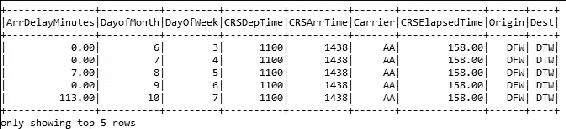

**步骤 4：创建 POJO 或 Bean 类**

我们开发的 POJO 类名为`Flight`，其中将使用相应的 setter 和 getter 定义所需的特征和标签字段。

```scala
public class Flight implements Serializable { 
  double label; 
  double monthDay; 
  double weekDay; 
  double crsdeptime; 
  double crsarrtime; 
  String carrier; 
  double crselapsedtime; 
  String origin; 
  String dest; 

public Flight(double label, double monthDay, double weekDay, double crsdeptime, double crsarrtime, String carrier, 
      double crselapsedtime, String origin, String dest) { 
    super(); 
    this.label = label; 
    this.monthDay = monthDay; 
    this.weekDay = weekDay; 
    this.crsdeptime = crsdeptime; 
    this.crsarrtime = crsarrtime; 
    this.carrier = carrier; 
    this.crselapsedtime = crselapsedtime; 
    this.origin = origin; 
    this.dest = dest; 
  } 
  public double getLabel() { 
    return label; 
  } 
  public void setLabel(double label) { 
    this.label = label; 
  } 
  public double getMonthDay() { 
    return monthDay; 
  } 
  public void setMonthDay(double monthDay) { 
    this.monthDay = monthDay; 
  } 
  public double getWeekDay() { 
    return weekDay; 
  } 
  public void setWeekDay(double weekDay) { 
    this.weekDay = weekDay; 
  } 
  public double getCrsdeptime() { 
    return crsdeptime; 
  } 
  public void setCrsdeptime(double crsdeptime) { 
    this.crsdeptime = crsdeptime; 
  } 
  public double getCrsarrtime() { 
    return crsarrtime; 
  } 
  public void setCrsarrtime(double crsarrtime) { 
    this.crsarrtime = crsarrtime; 
  } 
  public String getCarrier() { 
    return carrier; 
  } 
  public void setCarrier(String carrier) { 
    this.carrier = carrier; 
  } 
  public double getCrselapsedtime() { 
    return crselapsedtime; 
  } 
  public void setCrselapsedtime(double crselapsedtime) { 
    this.crselapsedtime = crselapsedtime; 
  } 
  public String getOrigin() { 
    return origin; 
  } 
  public void setOrigin(String origin) { 
    this.origin = origin; 
  } 
  public String getDest() { 
    return dest; 
  } 
  public void setDest(String dest) { 
    this.dest = dest; 
  } 
  @Override 
  public String toString() { 
    return "Flight [label=" + label + ", monthDay=" + monthDay + ", weekDay="
       + weekDay + ", crsdeptime=" 
        + crsdeptime + ", crsarrtime=" + crsarrtime + ", carrier=" + 
      carrier + ", crselapsedtime=" 
        + crselapsedtime + ", origin=" + origin + ", dest=" +
       dest + "]"; 
  } 

```

我们相信前面的类是不言自明的，它用于从原始数据集中设置和获取特征值。

**步骤 5：根据延误列添加新的标签列**

如果延误超过 40 分钟，则标签应为 1，否则应为 0。使用 Flight bean 类创建一个新的数据集。这个数据集可以在`ArrDelayMinutes`列中包含空字符串。因此，在映射之前，我们从数据集中过滤掉包含空字符串的行：

```scala
JavaRDD<Flight> flightsRDD = newDF.toJavaRDD().filter(new Function<Row, Boolean>() { 
          @Override 
          public Boolean call(Row v1) throws Exception { 
            return !v1.getString(0).isEmpty(); 
          } 
        }).map(new Function<Row, Flight>() { 
          @Override 
          public Flight call(Row r) throws Exception { 
            double label; 
            double delay = Double.parseDouble(r.getString(0)); 
            if (delay > 60) 
              label = 1.0; 
else 
      label = 0.0; 
double monthday = Double.parseDouble(r.getString(1)) - 1; 
double weekday = Double.parseDouble(r.getString(2)) - 1; 
double crsdeptime = Double.parseDouble(r.getString(3)); 
double crsarrtime = Double.parseDouble(r.getString(4)); 
String carrier = r.getString(5); 
double crselapsedtime1 = Double.parseDouble(r.getString(6)); 
String origin = r.getString(7); 
String dest = r.getString(8); 
Flight flight = new Flight(label, monthday, weekday,crsdeptime, crsarrtime, carrier,crselapsedtime1, origin, dest); 
        return flight; 
    }}); 

```

现在从上面创建的 RDD 中创建一个新的数据集：

```scala
Dataset<Row> flightDelayData = spark.sqlContext().createDataFrame(flightsRDD,Flight.class); 
flightDelayData.printSchema(); 

```

现在在下面的*图 3*中显示数据帧`flightDelayData`的前 5 行：

```scala
flightDelayData.show(5); 

```

[输出：]

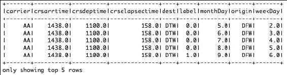

图 3：显示新标签列的 DataFrame

### 特征提取

为了提取特征，我们必须制作数值，并且如果有任何文本值，那么我们必须制作一个标记向量，以应用机器学习算法。

第 1 步：转向特征提取

在这里，我们将把包含文本的列转换为双值列。在这里，我们使用`StringIndexer`为每个唯一的文本制作一个唯一的索引：

```scala
StringIndexer carrierIndexer = new StringIndexer().setInputCol("carrier").setOutputCol("carrierIndex"); 
Dataset<Row> carrierIndexed = carrierIndexer.fit(flightDelayData).transform(flightDelayData); 
StringIndexer originIndexer = new StringIndexer().setInputCol("origin").setOutputCol("originIndex"); 
Dataset<Row> originIndexed = originIndexer.fit(carrierIndexed).transform(carrierIndexed); 
StringIndexer destIndexer = new StringIndexer().setInputCol("dest").setOutputCol("destIndex"); 
Dataset<Row> destIndexed = destIndexer.fit(originIndexed).transform(originIndexed); 
destIndexed.show(5); 

```

[输出]：

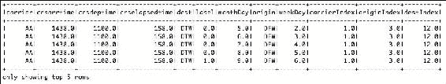

图 4：每个唯一文本的唯一索引

第 2 步：使用向量组装器制作特征向量

使用向量组装器制作特征向量，并将其转换为标记向量，以应用机器学习算法（决策树）。请注意，这里我们使用决策树只是举个例子，因为它显示了更好的分类准确性。根据算法和模型的选择和调整，您将能够进一步探索和使用其他分类器：

```scala
VectorAssembler assembler = new VectorAssembler().setInputCols( 
        new String[] { "monthDay", "weekDay", "crsdeptime", 
            "crsarrtime", "carrierIndex", "crselapsedtime", 
            "originIndex", "destIndex" }).setOutputCol( 
        "assembeledVector"); 

```

现在将组装器转换为行数据集，如下所示：

```scala
Dataset<Row> assembledFeatures = assembler.transform(destIndexed); 

```

现在将数据集转换为`JavaRDD`，以制作特征向量，如下所示：

```scala
JavaRDD<Row> rescaledRDD = assembledFeatures.select("label","assembeledVector").toJavaRDD(); 

```

按如下方式将 RDD 映射为`LabeledPoint`：

```scala
JavaRDD<LabeledPoint> mlData = rescaledRDD.map(new Function<Row, LabeledPoint>() { 
          @Override 
          public LabeledPoint call(Row row) throws Exception { 
            double label = row.getDouble(0); 
            Vector v = row.getAs(1); 
            return new LabeledPoint(label, v); 
          } 
        }); 

```

现在按如下方式打印前五个值：

```scala
System.out.println(mlData.take(5));  

```

[输出]：

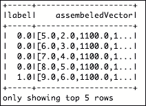

图 5：相应的组装向量

### 准备训练和测试集

在这里，我们将从标记向量的数据集中准备训练数据集。最初，我们将制作一个训练集，其中 15%的记录将是非延迟记录，85%将是延迟记录。最后，训练和测试数据集将分别准备为 70%和 30%。

第 1 步：从整个数据集中制作训练和测试集

首先，根据之前创建的标签（即 1 和 0）来过滤 RDD，创建一个新的 RDD，如下所示：

```scala
JavaRDD<LabeledPoint> splitedData0 = mlData.filter(new Function<LabeledPoint, Boolean>() { 
          @Override 
          public Boolean call(LabeledPoint r) throws Exception { 
              return r.label() == 0; 
          } 
        }).randomSplit(new double[] { 0.85, 0.15 })[1]; 

    JavaRDD<LabeledPoint> splitedData1 = mlData.filter(new Function<LabeledPoint, Boolean>() { 
          @Override 
          public Boolean call(LabeledPoint r) throws Exception { 
            return r.label() == 1; 
          } 
        }); 

    JavaRDD<LabeledPoint> splitedData2 = splitedData1.union(splitedData0); 
    System.out.println(splitedData2.take(1)); 

```

现在使用`union()`方法将两个 RDD 联合起来，如下所示：

```scala
JavaRDD<LabeledPoint> splitedData2 = splitedData1.union(splitedData0); 
System.out.println(splitedData2.take(1)); 

```

现在将合并的 RDD 进一步转换为行数据集，如下所示（最大类别设置为 4）：

```scala
Dataset<Row> data = spark.sqlContext().createDataFrame(splitedData2, LabeledPoint.class); 
data.show(100); 

```

现在我们需要对分类变量进行向量索引，如下所示：

```scala
VectorIndexerModel featureIndexer = new VectorIndexer() 
          .setInputCol("features") 
          .setOutputCol("indexedFeatures") 
          .setMaxCategories(4) 
          .fit(data); 

```

现在我们已经使用`VectorIndexerModel`估计器进行了特征索引。现在下一个任务是使用`StringIndexerModel`估计器进行字符串索引，如下所示：

```scala
StringIndexerModel labelIndexer = new StringIndexer() 
          .setInputCol("label") 
          .setOutputCol("indexedLabel") 
          .fit(data); 

```

最后，将行数据集分割为训练和测试集（分别为 70%和 30%，但您应根据您的需求调整值），如下所示：

```scala
Dataset<Row>[] splits = data.randomSplit(new double[]{0.7, 0.3}); 
Dataset<Row> trainingData = splits[0]; 
Dataset<Row> testData = splits[1]; 

```

干得好！现在我们的数据集已经准备好训练模型了，对吧？暂时，我们会天真地选择一个分类器，比如说让我们使用决策树分类器来解决我们的目的。您可以根据第六章, *构建可扩展的机器学习管道*，第七章, *调整机器学习模型*，和 第八章, *调整您的机器学习模型*中提供的示例尝试其他多类分类器。

### 训练模型

如*图 2*所示，训练和测试数据将从原始数据中收集。在特征工程过程完成后，带有标签或评级的特征向量的 RDD 将在构建预测模型之前通过分类算法进行处理（如*图 6*所示），最后测试数据将用于测试模型的性能：

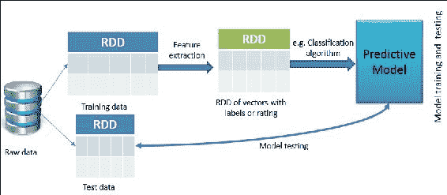

图 6：使用 Spark 进行监督学习

接下来，我们为决策树所需的参数值做准备。也许你会想为什么我们要谈论决策树。原因很简单，因为我们观察到使用决策树（即**二叉决策树**）相比朴素贝叶斯方法有更好的预测准确度。参考*表 2*，描述了分类特征及其重要性如下：

| **分类特征** | **映射** | **重要性** |
| --- | --- | --- |
| categoricalFeaturesInfo | 0 -> 31 | 指定特征索引 0（代表月份的天数）有 31 个类别[值{0，...，31}] |
| categoricalFeaturesInfo | 1 -> 7 | 表示一周的天数，并指定特征索引 1 有七个类别 |
| Carrier | 0 -> N | N 表示从 0 到不同航空公司的数量 |

表 2：分类特征及其重要性

现在我们将简要描述决策树构建的方法。我们将使用 CategoricalFeaturesInfo 来指定哪些特征是分类的，以及在树构建过程中每个特征可以取多少个分类值。这是一个从特征索引到该特征的类别数的映射。

然而，该模型是通过将输入特征与与这些特征相关联的标记输出进行关联来训练的。我们使用`DecisionTreeClassifier`方法训练模型，最终返回一个`DecisionTreeModel`，如*图 7*所示。构建树的详细源代码将在本节后面显示。

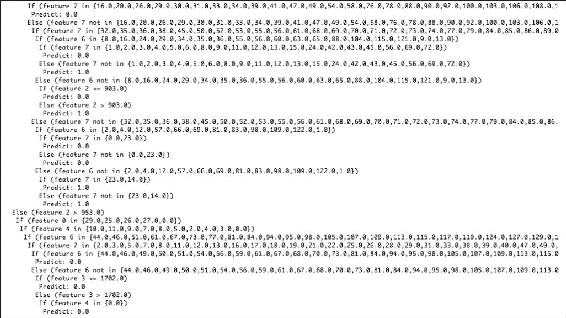

图 7：为航班延误分析生成的二叉决策树（部分显示）

**步骤 1：训练决策树模型**

要训练决策树分类器模型，我们需要有必要的标签和特征：

```scala
DecisionTreeClassifier dt = new DecisionTreeClassifier() 
      .setLabelCol("indexedLabel") 
      .setFeaturesCol("indexedFeatures"); 

```

**步骤 2：将索引标签转换回原始标签**

要创建决策树管道，我们需要除了索引标签之外的原始标签。因此，让我们按照以下方式进行：

```scala
IndexToString labelConverter = new IndexToString() 
      .setInputCol("prediction") 
      .setOutputCol("predictedLabel")         
        .setLabels(labelIndexer.labels());  

```

**步骤 3：将索引器和树链接成一个单一管道**

创建一个新的管道，其中阶段如下：`labelIndexer`，`featureIndexer`，`dt`，`labelConverter`如下：

```scala
Pipeline pipeline = new Pipeline() 
      .setStages(new PipelineStage[]{labelIndexer,  
        featureIndexer, dt, labelConverter}); 

```

现在使用我们在*步骤 8*中创建的训练集来拟合管道如下：

```scala
PipelineModel model = pipeline.fit(trainingData); 

```

### 测试模型

在接下来的步骤中，我们将测试模型：

**步骤 1：对测试数据集进行预测**

通过转换`PipelineModel`对测试集进行预测，并显示性能参数如下：

```scala
Dataset<Row> predictions = model.transform(testData); 
predictions.select("predictedLabel", "label", "features").show(5); 

```

**步骤 2：评估模型**

通过多类分类评估器评估模型，并打印准确度和测试错误如下：

```scala
MulticlassClassificationEvaluator evaluator = new MulticlassClassificationEvaluator() 
      .setLabelCol("indexedLabel") 
      .setPredictionCol("prediction") 
      .setMetricName("accuracy"); 
    double accuracy = evaluator.evaluate(predictions); 
    System.out.println("accuracy: "+accuracy); 
    System.out.println("Test Error = " + (1.0 - accuracy)); 

```

前面的代码段生成了分类准确度和测试错误如下：

```scala
Accuracy: 0.7540472721385786 
Test Error = 0.24595272786142142 

```

请注意，由于我们随机将数据集分成训练集和测试集，你可能会得到不同的结果。分类准确度为 75.40%，这并不好，我们认为。

现在轮到你使用不同的分类器和调整模型了。有关调整 ML 模型的更多详细讨论将在第七章中进行，*调整机器学习模型*。

**步骤 3：打印决策树**

以下是打印决策树的代码：

```scala
DecisionTreeClassificationModel treeModel = 
      (DecisionTreeClassificationModel) (model.stages()[2]); 
System.out.println("Learned classification tree model:\n" + treeModel.toDebugString()); 

```

此代码段生成一个决策树，如*图 7*所示。

**步骤 4：停止 Spark 会话**

使用 Spark 的`stop()`方法停止 Spark 会话如下：

```scala
spark.stop();
```

这是一个很好的做法，你要正确启动和关闭或停止 Spark 会话，以避免应用程序中的内存泄漏。

# 无监督学习

在无监督学习中，数据点没有与之相关的标签；因此，我们需要通过算法给它们贴上标签。换句话说，在无监督学习中，训练数据集的正确类别是未知的。

因此，必须从非结构化数据集中推断出类别，这意味着无监督学习算法的目标是通过描述其结构以某种结构化方式预处理数据。无监督学习算法或技术的主要目标是探索大多数未标记的输入数据的未知模式。这样，它与理论和应用统计学中使用的密度估计问题密切相关。

然而，无监督学习还包括许多其他技术，以总结和解释数据的关键特征，包括用于发现这些隐藏模式的探索性数据分析，甚至对数据点或特征进行分组，并根据数据挖掘方法应用无监督学习技术进行数据预处理。

为了克服无监督学习中的这一障碍，通常使用聚类技术根据某些相似性度量对未标记的样本进行分组，挖掘隐藏的模式以进行特征学习。

### 提示

要深入了解理论知识，了解无监督算法的工作原理，请参考以下三本书：Bousquet, O.; von Luxburg, U.; Raetsch, G., eds. (2004). *Advanced Lectures on Machine Learning*. Springer-Verlag. ISBN 978-3540231226。或者 Duda, Richard O.; Hart, Peter E.; Stork, David G. (2001). *Unsupervised Learning and Clustering*. *Pattern Classification (2nd Ed.)*. Wiley. ISBN 0-471-05669-3 和 Jordan, Michael I.; Bishop, Christopher M. (2004). *Neural Networks*. In Allen B. Tucker. Computer *Science Handbook, Second Edition (Section VII: Intelligent Systems)*. Boca Raton, FL: Chapman & Hall/CRC Press LLC. ISBN 1-58488-360-X。

## 无监督学习示例

在聚类中，算法通过分析输入示例之间的相似性将对象分组到类别中，其中相似的对象或特征被聚类并用圆圈标记。

聚类的用途包括：**搜索结果分组**，如客户分组，**异常检测**用于发现可疑模式，**文本分类**用于在测试中发现有用的模式，**社交网络分析**用于找到连贯的群体，**数据中心计算集群**用于找到将相关计算机放在一起以提高性能的方法，**天文数据分析**用于星系形成，以及**房地产数据分析**用于基于相似特征识别社区。此外，聚类使用无监督算法，事先没有输出。

使用 K 均值算法进行聚类是通过将所有坐标初始化为质心开始的。请注意，Spark 还支持其他聚类算法，如**高斯混合**，**幂迭代聚类**（**PIC**），**潜在狄利克雷分配**（**LDA**），二分 K 均值和流式 K 均值。而高斯混合主要用于期望最小化作为优化算法，另一方面，LDA 用于文档分类和聚类。PIC 用于根据边属性的成对相似性对图的顶点进行聚类。二分 K 均值比常规 K 均值更快，但通常会产生不同的聚类。因此，为了使讨论更简单，我们将在我们的目的中使用 K 均值算法。

有兴趣的读者应该参考 Spark ML 和基于 Spark MLlib 的聚类技术，分别在[`spark.apache.org/docs/latest/ml-clustering.html`](https://spark.apache.org/docs/latest/ml-clustering.html)和[`spark.apache.org/docs/latest/mllib-clustering.html`](https://spark.apache.org/docs/latest/mllib-clustering.html)网页上获取更多见解。在算法的每次迭代中，根据某种距离度量，通常是**欧几里得距离**，每个点都被分配到其最近的质心。

请注意，还有其他计算距离的方法，例如，**切比雪夫距离**用于仅考虑最重要的维度来测量距离。**汉明距离算法**用于逐位识别两个字符串的不同。**马哈 alanobis 距离**用于将协方差矩阵标准化，使距离度量在尺度上不变。

**曼哈顿距离**用于仅遵循轴对齐方向的距离。**闵可夫斯基距离算法**用于使欧几里德距离、曼哈顿距离和切比雪夫距离泛化。**Haversine 距离**用于测量球面上两点之间的大圆距离，根据它们的经度和纬度。考虑这些距离测量算法，很明显，欧几里得距离算法将是解决我们问题最合适的方法。

然后更新质心为该通行中分配给它的所有点的中心。这一过程重复，直到中心发生最小变化。K 均值算法是一个迭代算法，分为两步：

+   **簇分配步骤**：该算法将遍历每个数据点，并根据它离哪个质心更近来分配该质心，进而分配它代表的簇。

+   **移动质心步骤**：该算法将取每个质心并将其移动到簇中数据点的平均值

### 使用 Spark 进行无监督学习-一个例子

我们将使用从 URL [`course1.winona.edu/bdeppa/Stat%20425/Datasets.html`](http://course1.winona.edu/bdeppa/Stat%20425/Datasets.html) 下载的*Saratoga NY Homes*来演示使用 Java 中的 Spark 作为无监督学习技术的聚类的一个例子。数据集包含以下几个特征：价格、地块大小、水边、年龄、土地价值、新建、中央空调、燃料类型、加热类型、下水道类型、居住面积、大学百分比、卧室、壁炉、浴室和房间数量。然而，在这些列中，我们只在*表 3*中显示了一些选择的列。请注意，原始数据集是下载的，后来转换为相应的文本文件作为制表符分隔符：

| **价格** | **地块大小** | **水边** | **年龄** | **土地价值** | **房间** |
| --- | --- | --- | --- | --- | --- |
| 132500 | 0.09 | 0 | 42 | 5000 | 5 |
| 181115 | 0.92 | 0 | 0 | 22300 | 6 |
| 109000 | 0.19 | 0 | 133 | 7300 | 8 |
| 155000 | 0.41 | 0 | 13 | 18700 | 5 |
| 86060 | 0.11 | 0 | 0 | 15000 | 3 |
| 120000 | 0.68 | 0 | 31 | 14000 | 8 |
| 153000 | 0.4 | 0 | 33 | 23300 | 8 |
| 170000 | 1.21 | 0 | 23 | 146000 | 9 |
| 90000 | 0.83 | 0 | 36 | 222000 | 8 |
| 122900 | 1.94 | 0 | 4 | 212000 | 6 |
| 325000 | 2.29 | 0 | 123 | 126000 | 12 |

表 3：来自“Saratoga NY Homes”数据集的样本数据

我们进一步仅使用前两个特征（即价格和地块大小），以简化前一章中介绍的 Spark 特征学习算法。我们的目标是基于这两个特征对位于同一区域的房屋可能的邻域进行探索性分析。首先，看一下基于数据集中的值的基本散点图：

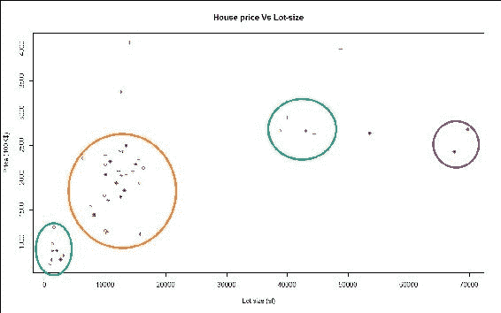

图 8：邻域的簇

很明显，在*图 8*中标有圆圈的图中有四个簇。然而，确定簇的数量是一项棘手的任务。在这里，我们有视觉检查的优势，这对于超平面或多维数据上的数据是不可用的。现在我们需要使用 Spark 找到相同的结果。为简单起见，我们将使用 Spark 的 K 均值聚类 API。原始数据的使用和查找特征向量如*图 9*所示：

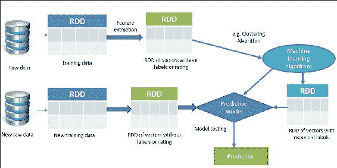

图 9：使用 Spark 进行无监督学习

### 邻域的 K 均值聚类

在执行特征提取之前，我们需要加载和解析 Saratoga NY Homes 数据集。这一步还包括：加载包和相关依赖项，将数据集读取为 RDD，模型训练和预测，收集本地解析的数据，并进行聚类比较。

**步骤 1：导入统计和相关类**

以下是导入统计和相关类的代码：

```scala
import java.io.Serializable; 
import java.util.List; 
import org.apache.spark.api.java.JavaRDD; 
import org.apache.spark.api.java.function.Function; 
import org.apache.spark.mllib.clustering.KMeans; 
import org.apache.spark.mllib.clustering.KMeansModel; 
import org.apache.spark.mllib.linalg.Vector; 
import org.apache.spark.mllib.linalg.Vectors; 
import org.apache.spark.rdd.RDD; 
import org.apache.spark.sql.SparkSession;  

```

**步骤 2：创建 Spark 会话**

以下是创建 Spark 会话的代码：

```scala
  static SparkSession spark = SparkSession 
      .builder().appName("JavaLDAExample") 
      .master("local[*]") 
      .config("spark.sql.warehouse.dir", "E:/Exp/") 
      .getOrCreate(); 

```

**步骤 3：加载 Saratoga NY Homes.txt**

从数据集中读取、解析和创建 RDD：

```scala
RDD<String> data = spark.sparkContext().textFile("input/Saratoga_ NY_Homes.txt", 2); 

```

**步骤 4：将数据转换为密集向量的 RDD**

如果您仔细遵循前面的步骤，实际上我们已经创建了普通的 RDD。因此，在将其映射为密集向量之前，该 RDD 必须转换为相应的`JavaRDD`：

```scala
JavaRDD<Vector> parsedData = data.toJavaRDD().map(new Function<String, Vector>() { 
      @Override 
      public Vector call(String s) throws Exception { 
        String[] sarray = s.split(","); 
        double[] values = new double[sarray.length]; 
        for (int i = 0; i < sarray.length; i++) 
          values[i] = Double.parseDouble(sarray[i]); 
        return Vectors.dense(values); 
      } 
    });  

```

**步骤 5：训练模型**

通过指定四个聚类和五次迭代来训练模型。只需参考以下代码来执行：

```scala
int numClusters = 4; 
int numIterations = 10; 
int runs = 2; 
KMeansModel clusters = KMeans.train(parsedData.rdd(), numClusters, numIterations, runs , KMeans.K_MEANS_PARALLEL());  
Now estimate the cost to compute the clsuters as follows: 
double cost = clusters.computeCost(parsedData.rdd()); 
System.out.println("Cost: " + cost);  

```

您应该收到以下结果：

```scala
Cost: 3.60148995801542E12   

```

**步骤 6：显示聚类中心**

```scala
Vector[] centers = clusters.clusterCenters(); 
System.out.println("Cluster Centers: "); 
for (Vector center : centers)  
{ 
  System.out.println(center); 
} 

```

前面的代码应该产生如下的聚类中心：

```scala
[545360.4081632652,0.9008163265306122,0.1020408163265306,21.73469387755102,111630.61224489794,0.061224489795918366,0.7551020408163265,2.3061224489795915,2.1632653061224487,2.714285714285714,2860.755102040816,59.346938775510196,3.510204081632653,1.1020408163265305,2.714285714285714,10.061224489795917] 
[134073.06845637583,0.3820000000000002,0.0026845637583892616,33.72617449664429,19230.76510067114,0.012080536912751677,0.22818791946308722,2.621476510067114,2.7234899328859057,2.6630872483221477,1332.9234899328858,52.86040268456375,2.7395973154362414,0.38120805369127514,1.4946308724832214,5.806711409395973] 
[218726.0625,0.5419711538461538,0.0,25.495192307692307,32579.647435897434,0.041666666666666664,0.3830128205128205,2.3205128205128203,2.4615384615384617,2.692307692307692,1862.3076923076922,57.4599358974359,3.3894230769230766,0.7019230769230769,2.032852564102564,7.44551282051282] 
[332859.0580645161,0.6369354838709671,0.025806451612903226,19.803225806451614,63188.06451612903,0.13870967741935483,0.6096774193548387,2.2225806451612904,2.2483870967741937,2.774193548387097,2378.4290322580646,57.66774193548387,3.6225806451612903,0.8516129032258064,2.479032258064516,8.719354838709677] 

```

**步骤 7：评估模型错误率**

```scala
double WSSSE = clusters.computeCost(parsedData.rdd()); 
System.out.println("Within Set Sum of Squared Errors = " + WSSSE); 

```

这应该产生如下结果：

```scala
Within Set Sum of Squared Errors = 3.60148995801542E12 

```

**步骤 8：预测第二个元素的聚类**

```scala
List<Vector> houses = parsedData.collect(); 
int prediction  = clusters.predict(houses.get(18)); 
System.out.println("Prediction: "+prediction);  

```

输出预测：0

**步骤 9：停止 Spark 会话**

使用`stop()`方法停止 Spark 会话如下：

```scala
spark.stop(); 

```

**步骤 10：聚类比较**

现在让我们比较 k-means 与我们单独完成的聚类分配。k-means 算法从 0 开始给出聚类 ID。一旦您检查数据，您会发现我们在表 4 中给出的 A 到 D 聚类 ID 与 k-means 之间的以下映射：

| **聚类名称** | **聚类编号** | **聚类分配** |
| --- | --- | --- |
| A | 3 | A=>3 |
| B | 1 | B=>1 |
| C | 0 | C=>0 |
| D | 2 | D=>2 |

表 4：邻域 k-means 聚类示例的聚类分配

现在，让我们从图表的不同部分挑选一些数据，并预测它属于哪个聚类。让我们看一下房屋（以 1 为例）的数据，它的占地面积为 876 平方英尺，售价为 65.5 万美元：

```scala
int prediction  = clusters.predict(houses.get(18)); 
    System.out.println("Prediction: "+prediction); 

```

[输出] 预测：2

这意味着具有前述属性的房屋属于聚类 2。当然，您可以通过更多数据测试预测能力。让我们进行一些邻域分析，看看这些聚类承载着什么含义。我们可以假设聚类 3 中的大多数房屋都靠近市中心。例如，聚类 2 中的房屋位于多山的地形上。

在这个例子中，我们处理了一组非常少的特征；常识和视觉检查也会导致我们得出相同的结论。然而，如果您想获得更准确的结果，当然，您应该构建更有意义的特征，不仅考虑占地面积和房价，还要考虑其他特征，如房间数量、房龄、土地价值、供暖类型等。

然而，将*滨水*作为一个有意义的特征是不明智的，因为在这个例子中没有房子的前面有水上花园。我们将在下一章节中对更准确地预测的更有意义的特征的准确性进行详细分析。

k-means 算法的美妙之处在于它可以对具有无限特征的数据进行聚类。当您有原始数据并想了解数据中的模式时，这是一个很好的工具。然而，在进行实验之前决定聚类的数量可能不成功，有时可能会导致过拟合问题或欠拟合问题。

### 提示

为了克服 K 均值的上述局限性，我们有一些更健壮的算法，如**马尔可夫链蒙特卡洛**（MCMC，也见[`en.wikipedia.org/wiki/Markov_chain_Monte_Carlo`](https://en.wikipedia.org/wiki/Markov_chain_Monte_Carlo)）在 Tribble, Seth D.，*Markov chain Monte Carlo algorithms using completely uniformly distributed driving sequences*，2007 年斯坦福大学博士论文中提出。此外，更多技术讨论可以在[`www.autonlab.org/tutorials/kmeans11.pdf`](http://www.autonlab.org/tutorials/kmeans11.pdf)的网址中找到。

# 推荐系统

推荐系统是一种原始的杀手级应用程序，是信息过滤系统的一个子类，旨在预测用户通常对项目提供的评分或偏好。推荐系统的概念近年来变得非常普遍，并随后被应用于不同的应用程序。最流行的可能是产品（例如电影、音乐、书籍、研究文章）、新闻、搜索查询、社交标签等。推荐系统可以分为四类，如第二章中所述，*机器学习最佳实践*。这些显示在*图 10*中：

+   **协同过滤系统**：这是根据行为模式的相似性累积消费者的偏好和对其他用户的推荐**基于内容的系统**：这里使用监督机器学习来说服分类器区分用户感兴趣和不感兴趣的项目

+   **混合推荐系统**：这是最近的研究和混合方法（即，结合协同过滤和基于内容的过滤）

+   **基于知识的系统**：这里使用关于用户和产品的知识来理解用户的需求，使用感知树、决策支持系统和基于案例的推理：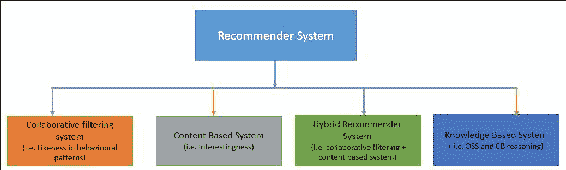

图 10：推荐系统的层次结构

从技术角度来看，我们可以进一步将它们分类如下：

+   物品**层次结构**是最弱的，它天真地假设一个物品与另一个物品相关，例如，如果你买了打印机，你更有可能购买墨水。之前**BestBuy**使用过这种方法

+   **基于属性的推荐**：假设你喜欢史泰龙主演的动作电影，因此你可能会喜欢兰博系列。Netflix 曾经使用过这种方法

+   **协同过滤**（用户-用户相似性）：假设并且举例说，那些像你一样购买了婴儿奶粉的人也购买了尿布。Target 使用这种方法

+   **协同过滤**（物品-物品相似性）：假设并且举例说，喜欢教父系列的人也喜欢《疤面煞星》。Netflix 目前使用这种方法

+   **社交、兴趣和基于图的方法**：例如，假设喜欢迈克尔·杰克逊的朋友也会喜欢《Just Beat It》。像**LinkedIn**和**Facebook**这样的科技巨头使用这种方法

+   **基于模型的方法**：这使用高级算法，如**SVM**、**LDA**和**SVD**基于隐含特征

如*图 11*所示，基于模型的推荐系统广泛使用高级算法，如 SVM、LDA 或 SVD，是推荐系统类中最健壮的方法：

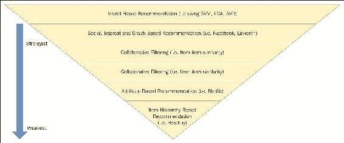

图 11：从技术角度看的推荐系统

## Spark 中的协同过滤

如前所述，协同过滤技术通常用于推荐系统。然而，Spark MLlib 目前仅支持基于模型的协同过滤。在这里，用户和产品由一小组潜在因素描述。这些潜在因素后来用于预测缺失的条目。根据 Spark API 参考协同过滤[`spark.apache.org/docs/latest/mllib-collaborative-filtering.html`](http://spark.apache.org/docs/latest/mllib-collaborative-filtering.html)：**交替最小二乘法**（**ALS**）（也称为非线性最小二乘法，即 NLS；更多信息请参见[`en.wikipedia.org/wiki/Non-linear_least_squares`](https://en.wikipedia.org/wiki/Non-linear_least_squares)）算法用于通过考虑以下参数来学习这些潜在因素：

+   `numBlocks`是使用本机 LAPACK 进行并行计算的块数

+   `rank`是在构建机器学习模型期间的潜在因素的数量

+   `iterations`是需要进行更准确预测的迭代次数

+   `lambda`表示 ALS 算法的正则化参数

+   `implicitPrefs`指定要使用的反馈（显式反馈 ALS 变体或适用于隐式反馈数据的变体）

+   `alpha`指定 ALS 算法中偏好观察的基线置信度

首先，ALS 是一种迭代算法，用于将评分矩阵建模为低秩用户和产品因子的乘积。之后，通过最小化观察到的评分的重建误差来使用这些因子进行学习任务。

然而，未知的评分可以通过将这些因素相乘来逐步计算。在 Spark MLlib 中使用的协同过滤技术进行的移动推荐或其他推荐的方法已被证明是一个高性能的方法，具有高预测准确性，并且可扩展到像 Netflix 这样的公司使用的商品集群上的数十亿个评分。按照这种方式，Netflix 这样的公司可以根据预测的评分向其订阅者推荐电影。最终目标是增加销售额，当然也包括客户满意度。

为了简洁和页面限制，我们将不在本章中展示使用协同过滤方法进行电影推荐。但是，将在第九章中展示使用 Spark 的逐步示例，*流式数据和图数据的高级机器学习*。

### 提示

目前，建议感兴趣的读者访问 Spark 网站获取最新的 API 和相同代码，网址为：[`spark.apache.org/docs/latest/mllib-collaborative-filtering.html`](http://spark.apache.org/docs/latest/mllib-collaborative-filtering.html)，其中提供了一个示例，展示了使用 ALS 算法进行样本电影推荐。

# 高级学习和泛化

在本节中，我们将讨论一些学习的高级方面，例如如何将监督学习技术泛化为半监督学习、主动学习、结构化预测和强化学习。此外，将简要讨论强化学习和半监督学习。

## 监督学习的泛化

标准监督学习问题可以泛化的几种方式：

+   **半监督学习**：在这种泛化技术中，仅为所选特征的一部分训练数据提供所需的输出值，以构建和评估机器学习模型。另一方面，其余数据保持不变或未标记。

+   **主动学习**：相比之下，在主动学习中，算法通常通过向人类用户提出查询来交互地收集新特征，而不是假设所有训练特征都已给出。因此，这里使用的查询是基于未标记数据的。有趣的是，这也是将半监督学习与主动学习相结合的一个例子。

+   **结构化预测**：有时需要从复杂对象（如解析树或带标签的图）中提取或选择所需的特征，然后必须改进标准监督或无监督方法以使其适应于泛化。更准确地说，例如，当监督机器学习技术尝试预测结构化或非结构化文本时，如将自然语言处理句子翻译成句法表示时，需要处理大规模解析树的结构化预测。为了简化这个任务，通常使用结构化 SVM 或马尔可夫逻辑网络或受限条件模型，这些技术上扩展和更新了经典的监督学习算法。

+   **学习排名**：当输入本身是对象的子集并且期望的输出是这些对象的排名时，必须类似于结构预测技术来扩展或改进标准方法。

### 提示

感兴趣的读者可以参考以下两个网址：[`en.wikipedia.org/wiki/Learning_to_rank`](https://en.wikipedia.org/wiki/Learning_to_rank) 和 [`en.wikipedia.org/wiki/Structured_prediction`](https://en.wikipedia.org/wiki/Structured_prediction)，在这里可以找到更详细的讨论。

# 总结

我们已经从理论和 Spark 的角度讨论了一些监督、无监督和推荐系统。然而，监督、无监督、强化或推荐系统也有许多例子。尽管如此，我们已经尽力提供一些简单的例子以求简单。

我们将在第六章*构建可扩展的机器学习管道*中提供更多关于这些示例的见解。还将讨论使用 Spark ML 和 Spark MLlib 管道进行更多特征合并、提取、选择、模型扩展和调整。我们还打算提供一些包括数据收集到模型构建和预测的示例。
