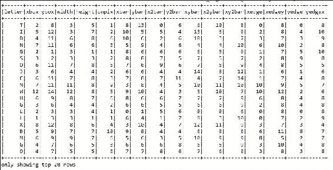

# 第六章： 构建可扩展的机器学习管道

机器学习的最终目标是使机器能够自动从数据中构建模型，而无需繁琐和耗时的人类参与和交互。 因此，本章将指导读者通过使用 Spark MLlib 和 Spark ML 创建一些实用和广泛使用的机器学习管道和应用。 将详细描述这两个 API，并且还将为两者都涵盖一个基线用例。 然后，我们将专注于扩展 ML 应用程序，以便它可以应对不断增加的数据负载。 阅读本章的所有部分后，读者将能够区分这两个 API，并选择最适合其要求的 API。 简而言之，本章将涵盖以下主题：

+   Spark 机器学习管道 API

+   使用 Spark Core 进行癌症诊断管道

+   使用 Spark 进行癌症预后管道

+   使用 Spark Core 进行市场篮子分析

+   Spark 中的 OCR 管道

+   使用 Spark MLlib 和 ML 进行主题建模

+   使用 Spark 进行信用风险分析管道

+   扩展 ML 管道

+   提示和性能考虑

# Spark 机器学习管道 API

MLlib 的目标是使实用的机器学习（ML）可扩展且易于使用。 Spark 引入了管道 API，用于轻松创建和调整实用的 ML 管道。 如第四章中所讨论的，实用的 ML 管道涉及一系列数据收集，预处理，特征提取，特征选择，模型拟合，验证和模型评估阶段。 例如，对文档进行分类可能涉及文本分割和清理，提取特征以及使用交叉验证训练分类模型。 大多数 ML 库都不是为分布式计算而设计的，或者它们不提供管道创建和调整的本地支持。

## 数据集抽象

如第一章中所述，当在另一种编程语言中运行 SQL 时，结果将返回为 DataFrame。 DataFrame 是一个分布式的数据集合，组织成命名列。 另一方面，数据集是一种接口，试图提供 Spark SQL 中 RDD 的好处。

数据集可以由 JVM 对象构建，这些对象可以在 Scala 和 Java 中使用。 在 Spark 管道设计中，数据集由 Spark SQL 的数据集表示。 ML 管道涉及一系列数据集转换和模型。 每个转换都接受输入数据集并输出转换后的数据集，这成为下一阶段的输入。

因此，数据导入和导出是 ML 管道的起点和终点。 为了使这些更容易，Spark MLlib 和 Spark ML 提供了一些特定于应用程序的类型的数据集，DataFrame，RDD 和模型的导入和导出实用程序，包括：

+   用于分类和回归的 LabeledPoint

+   用于交叉验证和潜在狄利克雷分配（LDA）的 LabeledDocument

+   协同过滤的评分和排名

然而，真实数据集通常包含许多类型，例如用户 ID，项目 ID，标签，时间戳和原始记录。

不幸的是，当前的 Spark 实现工具无法轻松处理包含这些类型的数据集，特别是时间序列数据集。如果您回忆起第四章中的*机器学习管道-概述*部分，*通过特征工程提取特征*，特征转换通常占据实际 ML 管道的大部分。特征转换可以被视为从现有列创建新列或删除新列。

在*图 1*中，*用于机器学习模型的文本处理*，您将看到文本标记器将文档分解为一袋词。之后，TF-IDF 算法将一袋词转换为特征向量。在转换过程中，标签需要被保留以用于模型拟合阶段：


图 1：用于机器学习模型的文本处理（DS 表示数据源）

如果您回忆起第四章中的*图 5*和*图 6*，*通过特征工程提取特征*，在转换步骤中，ID、文本和单词都被让步。它们在进行预测和模型检查时非常有用。但是，它们实际上对于模型拟合来说是不必要的。根据 Databricks 关于 ML 管道的博客[`databricks.com/blog/2015/01/07/ml-pipelines-a-new-high-level-api-for-mllib.html`](https://databricks.com/blog/2015/01/07/ml-pipelines-a-new-high-level-api-for-mllib.html)，如果预测数据集只包含预测标签，它并没有提供太多信息。

因此，如果您想检查预测指标，如准确性、精确度、召回率、加权真正例和加权假正例，查看预测标签以及原始输入文本和标记化单词是非常有用的。相同的建议也适用于使用 Spark ML 和 Spark MLlib 的其他机器学习应用。

因此，已经实现了在内存、磁盘或外部数据源（如 Hive 和 Avro）之间进行 RDD、数据集和数据框之间的简单转换。虽然使用用户定义的函数从现有列创建新列很容易，但数据集的表现是一种延迟操作。

相比之下，数据集仅支持一些标准数据类型。然而，为了增加可用性并使其更适合机器学习模型，Spark 还添加了对向量类型的支持，作为一种支持密集和稀疏特征向量的用户定义类型，支持`mllib.linalg.DenseVector`和`mllib.linalg.Vector`。

### 提示

可以在 Spark 分发的`examples/src/main/`文件夹下找到 Java、Scala 和 Python 的完整 DataFrame、Dataset 和 RDD 示例。感兴趣的读者可以参考 Spark SQL 的用户指南[`spark.apache.org/docs/latest/sql-programming-guide.html`](http://spark.apache.org/docs/latest/sql-programming-guide.html)了解更多关于 DataFrame、Dataset 以及它们支持的操作。

## 管道

Spark 在 Spark ML 下提供了管道 API。如前所述，管道由一系列阶段组成，包括转换器和估计器。管道阶段有两种基本类型，称为转换器和估计器。

转换器将数据集作为输入，并产生增强的数据集作为输出，以便将输出馈送到下一步。例如，**Tokenizer**和**H**ashingTF****是两个转换器。 Tokenizer 将具有文本的数据集转换为具有标记化单词的数据集。另一方面，HashingTF 产生术语频率。标记化和 HashingTF 的概念通常用于文本挖掘和文本分析。

相反，估计器必须是输入数据集的第一个，以产生模型。在这种情况下，模型本身将被用作转换器，将输入数据集转换为增强的输出数据集。例如，在拟合训练数据集与相应的标签和特征之后，可以使用**逻辑回归**或线性回归作为估计器。

之后，它产生一个逻辑或线性回归模型。这意味着开发管道是简单而容易的。好吧，你所需要做的就是声明所需的阶段，然后配置相关阶段的参数；最后，将它们链接在一个管道对象中，如*图 2*所示：


图 2：使用逻辑回归估计器的 Spark ML 管道模型（DS 表示数据存储，虚线内的步骤仅在管道拟合期间发生）

如果您看一下*图 2*，拟合模型由分词器、哈希 TF 特征提取器和拟合的逻辑回归模型组成。拟合的管道模型充当了可以用于预测、模型验证、模型检查和最终模型部署的转换器。然而，为了提高预测准确性，模型本身需要进行调整。我们将在第七章*调整机器学习模型*中更多地讨论如何调整机器学习模型。

为了更实际地展示流水线技术，以下部分展示了如何使用 Spark ML 和 MLlib 创建癌症诊断的实际管道。

# 使用 Spark 的癌症诊断管道

在本节中，我们将看看如何使用 Spark ML 和 MLlib 开发癌症诊断管道。将使用真实数据集来预测乳腺癌的概率，这种癌症几乎是可以治愈的，因为这种癌症类型的罪魁祸首基因已经成功地被确定。然而，我们想要讨论一下这种癌症类型，因为在非洲和亚洲的第三世界国家，它仍然是一种致命疾病。

### 提示

我们建议读者对这种疾病的结果或状态保持开放的态度，因为我们将展示 Spark ML API 如何通过整合和组合来自威斯康星乳腺癌（原始）、威斯康星诊断乳腺癌（WDBC）和威斯康星预后乳腺癌（WPBC）数据集的数据来预测癌症，这些数据集来自以下网站：[`archive.ics.uci.edu/ml`](http://archive.ics.uci.edu/ml)。

## Spark 乳腺癌诊断管道

在本小节中，我们将开发一个逐步的癌症诊断管道。步骤包括对乳腺癌的背景研究、数据集收集、数据探索、问题形式化和基于 Spark 的实现。

### 背景研究

根据 Salama 等人的研究（*使用多分类器在三个不同数据集上进行乳腺癌诊断，国际计算机和信息技术杂志*（*2277-0764*）*第 01-01 期，2012 年 9 月*），乳腺癌在 20 至 29 岁的女性中排名第四，仅次于甲状腺癌、黑色素瘤和淋巴瘤。

乳腺癌是由乳腺组织突变引起的，原因包括性别、肥胖、酒精、家族史、缺乏体育锻炼等。此外，根据**疾病控制和预防中心**（**TCDCP**）的统计数据（[`www.cdc.gov/cancer/breast/statistics/`](https://www.cdc.gov/cancer/breast/statistics/)），2013 年，美国共有 230,815 名妇女和 2,109 名男性被诊断出患有乳腺癌。不幸的是，40,860 名妇女和 464 名男性死于此病。

研究发现，约 5-10%的病例是由父母的一些遗传因素引起的，包括 BRCA1 和 BRCA2 基因突变等。早期诊断可以帮助拯救全球数千名乳腺癌患者。尽管罪魁祸首基因已经被确定，但化疗并不十分有效。基因沉默正在变得流行，但需要更多的研究。

正如前面提到的，机器学习中的学习任务严重依赖分类、回归和聚类技术。此外，传统的数据挖掘技术正在与这些机器学习技术一起应用，这是最基本和重要的任务。因此，通过与 Spark 集成，这些应用技术在生物医学数据分析领域得到了广泛的接受和应用。此外，正在使用多类和多级分类器和特征选择技术对生物医学数据集进行大量实验，以进行癌症诊断和预后。

### 数据集收集

**癌症基因组图谱**（**TCGA**），**癌症体细胞突变目录**（**COSMIC**），**国际癌症基因组联盟**（**ICGC**）是最广泛使用的癌症和肿瘤相关数据集，用于研究目的。这些数据来源已经从麻省理工学院、哈佛大学、牛津大学等世界知名研究所进行了整理。然而，这些可用的数据集是非结构化的、复杂的和多维的。因此，我们不能直接使用它们来展示如何将大规模机器学习技术应用于它们。原因是这些数据集需要大量的预处理和清洗，这需要大量的页面。

通过练习这个应用程序，我们相信读者将能够将相同的技术应用于任何类型的生物医学数据集，用于癌症诊断。由于页面限制，我们应该使用结构化和手动策划的简单数据集，用于机器学习应用开发，当然，其中许多显示出良好的分类准确性。

例如，来自 UCI 机器学习库的威斯康星州乳腺癌数据集，可在[`archive.ics.uci.edu/ml`](http://archive.ics.uci.edu/ml)上找到，这些数据是由威斯康星大学的研究人员捐赠的，并包括来自乳腺肿块细针穿刺的数字图像的测量。这些值代表数字图像中细胞核的特征，如下一小节所述。

### 提示

关于威斯康星州乳腺癌数据的更多信息，请参考作者的出版物：*乳腺肿瘤诊断的核特征提取。IS＆T/SPIE 1993 年国际电子成像研讨会：科学与技术，卷 1905，第 861-870 页，作者为 W.N. Street，W.H. Wolberg 和 O.L. Mangasarian，1993 年*。

### 数据集描述和准备

如**威斯康星州乳腺癌数据集**（**WDBC**）手册所示，可在[`archive.ics.uci.edu/ml/machine-learning-databases/breast-cancer-wisconsin/wdbc.names`](https://archive.ics.uci.edu/ml/machine-learning-databases/breast-cancer-wisconsin/wdbc.names)上找到，肿块厚度良性细胞往往成片状分组，而癌细胞通常成多层分组。因此，在应用机器学习技术之前，手册中提到的所有特征和字段都很重要，因为这些特征将有助于确定特定细胞是否患癌。

乳腺癌数据包括 569 个癌症活检样本，每个样本有 32 个特征。一个特征是患者的识别号码，另一个是癌症诊断，标记为良性或恶性，其余的是数值型的生物测定，是在分子实验室工作中确定的。诊断编码为 M 表示恶性或 B 表示良性。

类别分布如下：良性：357（62.74%）和恶性：212（37.25%）。训练和测试数据集将按照此处给出的数据集描述进行准备。30 个数值测量包括均值、标准误差和最坏值，即三个最大值的均值。字段 3 是均值半径，13 是半径 SE，23 是最坏半径。通过对数字化的细胞核的不同特征进行计算，为每个细胞核计算了 10 个实值特征，这些特征描述在*表 1，10 个实值特征及其描述*中：

| **编号** | **数值** | **解释** |
| --- | --- | --- |
| 1 | 半径 | 中心到周边点的距离的平均值 |
| 2 | 纹理 | 灰度值的标准偏差 |
| 3 | 周长 | 细胞核的周长 |
| 4 | 面积 | 细胞核覆盖周长的面积 |
| 5 | 光滑度 | 半径长度的局部变化 |
| 6 | 紧凑性 | 计算如下：(周长)² / 面积 - 1.0 |
| 7 | 凹度 | 轮廓凹陷部分的严重程度 |
| 8 | 凹点 | 轮廓的凹陷部分的数量 |
| 9 | 对称性 | 表示细胞结构是否对称 |
| 10 | 分形维数 | 计算如下：海岸线近似 - 1 |

表 1：10 个实值特征及其描述

所有特征值都记录了四个有效数字，没有缺失或空值。因此，我们不需要进行任何数据清理。但是，从前面的描述中，很难让某人获得有关数据的任何良好知识。例如，除非您是肿瘤学家，否则您不太可能知道每个字段与良性或恶性肿块的关系。随着我们继续进行机器学习过程，这些模式将被揭示。数据集的样本快照如*图 3*所示：


图 3：数据快照（部分）

### 问题形式化

*图 4*，*乳腺癌诊断和预后管道模型*，描述了提出的乳腺癌诊断模型。该模型包括两个阶段，即训练和测试阶段：

+   训练阶段包括四个步骤：数据收集、预处理、特征提取和特征选择

+   测试阶段包括与训练阶段相同的四个步骤，另外还有分类步骤

在数据收集步骤中，首先进行预处理，以检查是否存在不需要的值或任何缺失值。我们已经提到没有缺失值。但是，检查是一种良好的做法，因为即使特殊字符的不需要值也可能中断整个训练过程。之后，通过特征提取和选择过程进行特征工程步骤，以确定适用于后续逻辑或线性回归分类器的正确输入向量：


图 4：乳腺癌诊断和预后管道模型

这有助于对与模式向量相关联的类做出决定。基于特征选择或特征提取，完成了降维技术。但是，请注意，我们不会使用任何正式的降维算法来开发这个应用程序。有关降维的更多信息，您可以参考第四章中的*降维*部分，*通过特征工程提取知识*。

在分类步骤中，应用逻辑回归分类器以获得肿瘤诊断和预后的最佳结果。

### 使用 Spark ML 开发癌症诊断管道

如前所述，在 WDBC 数据集中找到的属性的详细信息在[`archive.ics.uci.edu/ml/machine-learning-databases/breast-cancer-wisconsin/breast-cancer-wisconsin.names`](https://archive.ics.uci.edu/ml/machine-learning-databases/breast-cancer-wisconsin/breast-cancer-wisconsin.names)包括患者 ID、诊断（M = 恶性，B = 良性）和为每个细胞核计算的 10 个实值特征，如*表 1*、*10 个实值特征及其描述*所述。

这些特征是从乳腺肿块的**细针穿刺**（**FNA**）的数字化图像计算出来的，因为我们对数据集有足够的了解。在本小节中，我们将逐步看看如何开发乳腺癌诊断机器学习流水线，包括在*图 4*中描述的 10 个步骤中从数据集输入到预测的数据工作流程。

第 1 步：导入必要的包/库/API

这是导入包的代码：

```scala
import org.apache.spark.api.java.JavaRDD; 
import org.apache.spark.api.java.function.Function; 
import org.apache.spark.ml.Pipeline; 
import org.apache.spark.ml.PipelineModel; 
import org.apache.spark.ml.PipelineStage; 
import org.apache.spark.ml.classification.LogisticRegression; 
import org.apache.spark.ml.feature.LabeledPoint; 
import org.apache.spark.ml.linalg.DenseVector; 
import org.apache.spark.ml.linalg.Vector; 
import org.apache.spark.sql.Dataset; 
import org.apache.spark.sql.Row; 
import org.apache.spark.sql.SparkSession; 

```

第 2 步：初始化 Spark 会话

可以使用以下代码初始化 Spark 会话：

```scala
static SparkSession spark = SparkSession 
        .builder() 
        .appName("BreastCancerDetectionDiagnosis") 
       .master("local[*]") 
       .config("spark.sql.warehouse.dir", "E:/Exp/") 
       .getOrCreate();
```

在这里，我们将应用程序名称设置为`BreastCancerDetectionDiagnosis`，主 URL 设置为`local`。Spark 上下文是程序的入口点。请相应地设置这些参数。

第 3 步：将乳腺癌数据作为输入并准备 JavaRDD

这是准备`JavaRDD`的代码：

```scala
  String path = "input/wdbc.data"; 
  JavaRDD<String> lines = spark.sparkContext().textFile(path, 3).toJavaRDD();
```

要了解更多关于数据的信息，请参考*图 3*：*数据快照（部分）*。

第 4 步：为回归创建标记点 RDD

为诊断（B = 良性，M = 恶性）创建`LabeledPoint` RDDs：

```scala
JavaRDD<LabeledPoint> linesRDD = lines 
        .map(new Function<String, LabeledPoint>() { 
          public LabeledPoint call(String lines) { 
            String[] tokens = lines.split(","); 
            double[] features = new double[30]; 
            for (int i = 2; i < features.length; i++) { 
              features[i - 2] = Double.parseDouble(tokens[i]); 
            } 
            Vector v = new DenseVector(features); 
            if (tokens[1].equals("B")) { 
              return new LabeledPoint(1.0, v); // benign 
            } else { 
              return new LabeledPoint(0.0, v); // malignant 
            } 
          } 
        }); 

```

第 5 步：从 linesRDD 创建 Row 数据集并显示顶部特征

这是所示代码：

```scala
Dataset<Row> data = spark.createDataFrame(linesRDD,LabeledPoint.class); 
data.show(); 

```

以下图显示了顶部特征及其对应的标签：


图 5：顶部特征及其对应的标签

第 6 步：拆分数据集以准备训练和测试集

在这里，我们将原始数据框拆分为训练集和测试集，比例分别为 60%和 40%。在这里，`12345L`是种子值。这个值表示每次拆分都是相同的，这样 ML 模型在每次迭代中都会产生相同的结果。我们在每一章中都遵循相同的转换来准备测试和训练集：

```scala
Dataset<Row>[] splits = data.randomSplit(new double[] { 0.6, 0.4 }, 12345L); 
Dataset<Row> trainingData = splits[0]; 
Dataset<Row> testData = splits[1]; 

```

要快速查看这两个集合的快照，只需写`trainingData.show()`和`testData.show()`分别用于训练和测试集。

第 7 步：创建一个逻辑回归分类器

通过指定最大迭代次数和回归参数创建一个逻辑回归分类器：

```scala
LogisticRegression logisticRegression = new LogisticRegression() 
                          .setMaxIter(100) 
                             .setRegParam(0.01) 
                             .setElasticNetParam(0.4); 

```

### 提示

逻辑回归通常需要三个参数：最大迭代次数、回归参数和弹性网络正则化。请参考以下行以更清楚地了解：

```scala
      LogisticRegression lr = new 
      LogisticRegression().setMaxIter(100)
      .setRegParam(0.01).setElasticNetParam(0.4); 

```

### 提示

上述语句创建了一个逻辑回归模型`lr`，最大迭代次数为`100`，回归参数为`0.01`，弹性网络参数为`0.4`。

第 8 步：创建和训练流水线模型

这是所示代码：

```scala
Pipeline pipeline = new Pipeline().setStages(new PipelineStage[] {logisticRegression}); 
PipelineModel model = pipeline.fit(trainingData); 

```

在这里，我们创建了一个流水线，其阶段由逻辑回归阶段定义，这也是我们刚刚创建的一个估计器。请注意，如果您处理的是文本数据集，可以尝试创建分词器和 HashingTF 阶段。

然而，在这个癌症数据集中，所有的值都是数字。因此，我们不创建这样的阶段来链接到流水线。

第 9 步：创建数据集，转换模型和预测

创建一个类型为 Row 的数据集，并根据测试数据集进行预测转换模型：

```scala
Dataset<Row> predictions=model.transform(testData); 

```

第 10 步：显示预测及预测精度

```scala
predictions.show(); 
long count = 0; 
for (Row r : predictions.select("features", "label", "prediction").collectAsList()) { 
    System.out.println("(" + r.get(0) + ", " + r.get(1) + r.get(2) + ", prediction=" + r.get(2)); 
      count++; 
    } 

```


图 6：预测及预测精度

*图 7*显示了测试集的预测数据集。所示的打印方法本质上生成输出，就像下面的例子一样：


图 7：朝向预测的样本输出。第一个值是特征，第二个是标签，最后一个值是预测值

现在让我们计算精度分数。我们通过将计数器乘以 100，然后除以完成的预测数量来做到这一点，如下所示：

```scala
System.out.println("precision: " + (double) (count * 100) / predictions.count()); 
Precision - 100.0 

```

因此，精度为 100%，这是很棒的。但是，如果您仍然不满意或有任何困惑，下一章将演示如何调整几个参数，以提高预测准确性，因为可能有许多假阴性预测。

此外，由于随机拆分的性质和您一侧的数据集处理，结果可能会有所不同。

# 使用 Spark 的癌症预后管道

在上一节中，我们展示了如何开发一个癌症诊断管道，用于基于两个标签（良性和恶性）预测癌症。在本节中，我们将看看如何使用 Spark ML 和 MLlib API 开发癌症预后管道。**威斯康星预后乳腺癌**（**WPBC**）数据集将用于预测乳腺癌的概率，以预测复发和非复发的肿瘤细胞。同样，数据集是从[`archive.ics.uci.edu/ml/datasets/Breast+Cancer+Wisconsin+(Prognostic)`](https://archive.ics.uci.edu/ml/datasets/Breast+Cancer+Wisconsin+(Prognostic))下载的。要了解问题的形式化，请再次参考*图 1*，因为在癌症预后管道开发过程中，我们将几乎遵循相同的阶段。

## 数据集探索

在[`archive.ics.uci.edu/ml/machine-learning-databases/breast-cancer-wisconsin/wpbc.names`](https://archive.ics.uci.edu/ml/machine-learning-databases/breast-cancer-wisconsin/wpbc.names)中找到的 WPBC 数据集的属性详细信息如下：

+   ID 编号

+   结果（R = 复发，N = 非复发）

+   时间（如果字段 2 => R，则为复发时间，如果字段 2 => N，则为无病时间）

+   3 到 33：为每个细胞核计算了十个实值特征：半径、纹理、周长、面积、光滑度、紧凑性、凹度、凹点、对称性和分形维度。三十四是肿瘤大小，三十五是淋巴结状态，如下所示：

+   肿瘤大小：切除肿瘤的直径（厘米）

+   淋巴结状态：阳性腋窝淋巴结的数量

如果您比较*图 3*和*图 9*，您会发现诊断和预后具有相同的特征，但预后有两个额外的特征（如前面提到的 34 和 35）。请注意，这些是在 1988 年至 1995 年手术时观察到的，在 198 个实例中，有 151 个是非复发（N），47 个是复发（R），如*图 8*所示。

当然，今天的真实癌症诊断和预后数据集以结构化或非结构化的方式包含许多其他特征和字段：


图 8：数据快照（部分）

### 提示

对于更详细的讨论和有意义的见解，感兴趣的读者可以参考以下研究论文：*威斯康星乳腺癌问题：使用概率和广义回归神经分类器进行诊断和 DFS 时间预后，2005 年第四季度 Ioannis A.等人在以下链接中找到：*[`citeseerx.ist.psu.edu/viewdoc/download?doi=10.1.1.65.2463&rep=rep1&type=pdf`](http://citeseerx.ist.psu.edu/viewdoc/download?doi=10.1.1.65.2463&rep=rep1&type=pdf)。

## 使用 Spark ML/MLlib 的乳腺癌预后管道

在本小节中，我们将逐步介绍如何开发乳腺癌预后机器学习管道，包括从数据集输入到预测的 10 个不同步骤，这些步骤在*图 1*中有描述，作为数据工作流。

### 提示

建议读者从 Packt 材料中下载数据集和项目文件，以及 Maven 项目配置的`pom.xml`文件。我们已经在之前的章节中介绍了如何使代码工作，例如第一章，*Spark 数据分析简介*。

**步骤 1：导入必要的包/库/API**

```scala
import org.apache.spark.api.java.JavaRDD; 
import org.apache.spark.api.java.function.Function; 
import org.apache.spark.ml.Pipeline; 
import org.apache.spark.ml.PipelineModel; 
import org.apache.spark.ml.PipelineStage; 
import org.apache.spark.ml.classification.LogisticRegression; 
import org.apache.spark.ml.feature.LabeledPoint; 
import org.apache.spark.ml.linalg.DenseVector; 
import org.apache.spark.ml.linalg.Vector; 
import org.apache.spark.sql.Dataset; 
import org.apache.spark.sql.Row; 
import org.apache.spark.sql.SparkSession; 

```

**步骤 2：初始化必要的 Spark 环境**

```scala
static SparkSession spark = SparkSession 
        .builder() 
        .appName("BreastCancerDetectionPrognosis") 
       .master("local[*]") 
       .config("spark.sql.warehouse.dir", "E:/Exp/") 
       .getOrCreate(); 

```

在这里，我们将应用程序名称设置为`BreastCancerDetectionPrognosis`，主 URL 设置为`local[*]`。Spark Context 是程序的入口点。请相应地设置这些参数。

**步骤 3：将乳腺癌数据作为输入并准备 JavaRDD 数据**

```scala
String path = "input/wpbc.data"; 
JavaRDD<String> lines = spark.sparkContext().textFile(path, 3).toJavaRDD(); 

```

### 提示

要了解更多关于数据的信息，请参考*图 5*及其描述以及数据集探索子部分。

**步骤 4：创建带标签的点 RDD**

使用以下代码段为 N=复发和 R=非复发的预后创建`LabeledPoint` RDD：

```scala
JavaRDD<LabeledPoint> linesRDD = lines.map(new Function<String, LabeledPoint>() { 
      public LabeledPoint call(String lines) { 
        String[] tokens = lines.split(","); 
        double[] features = new double[30]; 
        for (int i = 2; i < features.length; i++) { 
          features[i - 2] = Double.parseDouble(tokens[i]); 
        } 
        Vector v = new DenseVector(features); 
        if (tokens[1].equals("N")) { 
          return new LabeledPoint(1.0, v); // recurrent 
        } else { 
          return new LabeledPoint(0.0, v); // non-recurrent 
        } 
      } 
    });  

```

**步骤 5：从行 RDD 创建数据集并显示顶部特征**

```scala
Dataset<Row> data = spark.createDataFrame(linesRDD,LabeledPoint.class); 
data.show(); 

```

顶部特征及其相应标签显示在*图 9*中：


图 9：顶部特征及其相应标签

**步骤 6：将数据集拆分为训练集和测试集**

在这里，我们将数据集分为测试集和训练集，比例分别为 60%和 40%。请根据您的要求进行调整：

```scala
Dataset<Row>[] splits = data.randomSplit(new double[] { 0.6, 0.4 }, 12345L); 
Dataset<Row> trainingData = splits[0];   
Dataset<Row> testData = splits[1]; 

```

要快速查看这两个集合的快照，只需编写`trainingData.show()`和`testData.show()`，分别用于训练和测试集。

**步骤 7：创建逻辑回归分类器**

通过指定最大迭代次数和回归参数创建逻辑回归分类器：

```scala
LogisticRegression logisticRegression = new LogisticRegression() 
.setMaxIter(100) 
.setRegParam(0.01) 
.setElasticNetParam(0.4); 

```

**步骤 8：创建管道并训练管道模型**

```scala
Pipeline pipeline = new Pipeline().setStages(new PipelineStage[]{logisticRegression}); 
PipelineModel model=pipeline.fit(trainingData); 

```

在这里，类似于诊断管道，我们创建了预后管道，其阶段仅由逻辑回归定义，这又是一个估计器，当然也是一个阶段。

**步骤 9：创建数据集并转换模型**

创建数据集并进行转换，以基于测试数据集进行预测：

```scala
Dataset<Row> predictions=model.transform(testData); 

```

**步骤 10：显示预测及其精度**

```scala
predictions.show(); 

```


图 10：预测精度

```scala
long count = 0; 
for (Row r : predictions.select("features", "label", "prediction").collectAsList()) { 
      System.out.println("(" + r.get(0) + ", " + r.get(1) + r.get(2) + ", prediction=" + r.get(2)); 
      count++; 
    } 

```

这段代码将产生类似于*图 7*的输出，其中包含不同的特征、标签和预测：

```scala
System.out.println("precision: " + (double) (count * 100) / predictions.count());  
Precision: 100.0  

```

因此，精度几乎达到 100%，这是非常棒的。然而，根据数据准备的不同，你可能会得到不同的结果。

如果您有任何困惑，下一章将演示如何调整参数，以提高预测准确性，因为可能会有许多假阴性预测。

### 提示

在他们的书中《Machine Learning with R, Packt Publishing, 2015》，Brett Lantz 等人认为，通过将每个肿块分类为恶性、良性、复发或非复发，可以完全消除假阴性。显然，这不是一个现实的策略。但是，这说明了预测涉及在假阳性率和假阴性率之间取得平衡的事实。

如果您仍然不满意，我们将在第七章中调整多个参数，*调整机器学习模型*，以便预测准确性朝着更复杂的测量预测准确性的方法增加，这些方法可以用于确定可以根据每种错误类型的成本来优化错误率的地方。

# 使用 Spark Core 进行市场篮分析

在本节中，我们将探讨如何开发大规模机器学习管道，以进行市场篮分析。除了使用 Spark ML 和 MLlib 之外，我们还将演示如何使用 Spark Core 来开发这样的应用程序。

## 背景

在一篇早期的论文《在 Hadoop 上改进的 MapReduce 框架上的高效市场篮分析技术：电子商务视角》（可在[`onlinepresent.org/proceedings/vol6_2012/8.pdf`](http://onlinepresent.org/proceedings/vol6_2012/8.pdf)获取），作者们认为**市场篮分析**（MBA）技术对于日常业务决策非常重要，因为可以通过发现顾客频繁购买和一起购买的物品来提取顾客的购买规则。因此，可以根据这些关联规则为经常购物的顾客揭示购买规则。

您可能仍然想知道为什么我们需要市场篮分析，为什么它很重要，以及为什么它在计算上很昂贵。如果您能够识别高度特定的关联规则，例如，如果顾客喜欢芒果或橙子果酱以及牛奶或黄油，您需要有大规模的交易数据进行分析和处理。此外，一些大型连锁零售商或超市，例如 E-mart（英国）、HomePlus（韩国）、Aldi（德国）或 Dunnes Stores（爱尔兰）使用数百万甚至数十亿的交易数据库，以找到特定物品之间的关联，例如品牌、颜色、原产地甚至口味，以增加销售和利润的可能性。

在本节中，我们将探讨使用 Spark 库进行大规模市场篮分析的高效方法。阅读并实践后，您将能够展示 Spark 框架如何将现有的单节点管道提升到可在多节点数据挖掘集群上使用的管道。结果是我们提出的关联规则挖掘算法可以以相同的好处并行重复使用。

我们使用 SAMBA 作为 Spark-based Market Basket Analysis 的缩写，*min_sup*表示最小支持度，*min_conf*表示最小置信度。我们还将频繁模式和频繁项集这两个术语互换使用。

## 动机

传统的主存储器或基于磁盘的计算和关系型数据库管理系统无法处理不断增加的大规模交易数据。此外，正如第一章中讨论的，*使用 Spark 进行数据分析简介*，MapReduce 在 I/O 操作、算法复杂性、低延迟和完全基于磁盘的操作方面存在一些问题。因此，找到空交易并随后从未来方案中消除它们是这种方法的初始部分。

通过识别那些不出现在至少一个频繁 1 项集中的交易，很可能找到所有的空交易。正如前面提到的，Spark 将中间数据缓存到内存中，并提供**弹性分布式数据集**（RDDs）的抽象，可以通过这种方式克服这些问题，过去三年在处理分布式计算系统中的大规模数据方面取得了巨大成功。这些成功是有希望的，也是激励人的例子，可以探索将 Spark 应用于市场篮分析的研究工作。

## 探索数据集

请从[`github.com/stedy/Machine-Learning-with-R-datasets/blob/master/groceries.csv`](https://github.com/stedy/Machine-Learning-with-R-datasets/blob/master/groceries.csv)下载购物篮分析的杂货数据集。原始`grocery.csv`数据的前五行如*图 11*所示。这些行表示 10 个独立的杂货店交易。第一笔交易包括四件商品：柑橘类水果、半成品面包、人造黄油和即食汤。相比之下，第三笔交易只包括一件商品，全脂牛奶：


图 11：杂货数据集的快照

## 问题陈述

我们相信我们有足够的动机和理由来分析使用事务或零售数据集的购物篮。现在，让我们讨论一些背景研究，这些研究需要应用我们基于 Spark 的购物篮分析技术。

假设您有一组不同的项目*I = {i1, i2...in}*，*n*是不同项目的数量。事务数据库*T = {t1, t2...tN}*是一组*N*个事务，*|N|*是总事务数。集合*X*称为模式或项集。我们假设输入是作为事务序列给出的，其中项目用逗号分隔，如*表 1*所示。

为了简单起见描述背景研究，相同的交易在*表 2*中用单个字符表示：

| 交易 1 交易 2 交易 3 交易 4... | 饼干，冰淇淋，可乐，橙子，牛肉，比萨，可乐，面包法棍，苏打水，洗发水，饼干，百事可乐汉堡，奶酪，尿布，牛奶... |
| --- | --- |

表 1. 顾客的样本交易

| **TID** | **Itemset (Sequence of items)** |
| --- | --- |
| 10 | A, B, C, F |
| 20 | C, D, E |
| 30 | A, C, E, D |
| 40 | A |
| 50 | D, E, G |
| 60 | B, D |
| 70 | B |
| 80 | A, E, C |
| 90 | A, C, D |
| 100 | B, E, D |

表 2. 事务数据库

如果，则称*X*发生在*t*中或*t*包含*X*。支持计数是项集在所有事务中出现的频率，可以描述如下：


换句话说，如果*支持*，我们说*X*是频繁项集。例如，在*表 2*中，项集*CD*、*DE*和*CDE*的出现次数分别为*3*、*3*和*2*，如果*min_sup*为*2*，所有这些都是频繁项集。

另一方面，关联规则是形式为或更正式地：


因此，我们可以说关联规则是一种模式，它陈述了当*X*发生时，*Y*以一定概率发生。方程 1 中定义的关联规则的置信度可以表示为*Y*中的项目在包含*X*的事务中出现的频率，如下所示：


现在我们需要引入一个称为`lift`的新参数，作为一个度量，它衡量了一个项目相对于其典型购买率更有可能被购买的程度，假设您知道另一个项目已被购买。这由以下方程定义：


简而言之，给定一个事务数据库，现在购物篮分析的问题是通过关联规则找到支持和置信度都不低于*min_sup*和*min_conf*阈值的频繁项集的完整一组顾客购买规则。

## 使用 Spark 进行大规模购物篮分析

如*图 12*所示，我们假设事务数据库以分布方式存储在一组 DB 服务器的集群中。DB 服务器是具有大存储和主存储器的计算节点。因此，它可以存储大型数据集，因此可以计算分配给它的任何任务。驱动 PC 也是一个计算节点，主要作为客户端并控制整个过程。

显然，它需要有大内存来处理和保存 Spark 代码，以便发送到计算节点。这些代码包括 DB 服务器 ID、最小支持度、最小置信度和挖掘算法：


图 12：使用 Spark 的 SAMBA 算法的工作流程

从模式中，使用 reduce 阶段 1 生成频繁模式，满足约束条件*min_sup*。在计算频繁模式上应用 map 阶段，以生成最终帮助生成关联规则的子模式。从子模式中，应用 reduce 阶段 2 生成满足约束条件*min_conf*的关联规则。

由于 Spark 生态系统对 Spark 核心和相关 API 的支持，可以实现两个 Map 和 Reduce 阶段的结合。最终结果是完整的关联规则集，以及它们各自的支持计数和置信度。

这些商店根据商品之间的关联关系，有完整的形式来放置它们的商品，以增加对频繁和非频繁购物者的销售。由于空间限制，我们无法展示*表 2*中呈现的样本交易数据库的逐步示例。

然而，我们相信工作流程和伪代码足以理解整个情景。DB 服务器接收来自驱动 PC 的代码输入并开始计算。从环境变量 Spark 会话中，我们创建一些初始数据引用或 RDD 对象。然后，初始 RDD 对象被转换以在 DB 服务器中创建更多和全新的 RDD 对象。首先，它以纯文本（或其他支持的格式）读取数据集，并使用窄/宽转换（即`flatMap`、`mapToPair`和`reduceByKey`）来处理空事务。

因此，过滤连接 RDD 操作提供了一个没有空事务的数据段。然后，RDD 对象被实现以将 RDD 转储到 DB 服务器的存储中作为筛选后的数据集。Spark 的间 RDD 连接操作允许在单个数据节点内合并多个 RDD 的内容。总之，在获得筛选后的数据集之前，我们遵循这里给出的步骤：

1.  将分布式处理模型和集群管理器（即 Mesos）的系统属性设置为 true。这个值可以保存在你的应用开发中作为标准的 Spark 代码。

1.  设置 SparkConf、AppName、Master URL、Spark 本地 IP、Spark 驱动主机 IP、Spark 执行器内存和 Spark 驱动内存。

1.  使用`SparkConf`创建`JavaSparkContext`。

1.  创建`JavaRDD`并将数据集作为纯文本读取，作为事务，并执行必要的分区。

1.  对 RDD 执行`flatMap`操作以将事务拆分为项目。

1.  执行`mapToPair`操作以便于查找项目的键/值对。

1.  执行过滤操作以删除所有空事务。

当我们有了筛选后的数据库时，我们会实现一个动作间 RDD 连接操作，将数据集保存在 DB 服务器或分区上，如果单台机器的存储空间不够，或者缓存，如果内存不够。

*图 12*显示了使用 Spark 的 API 获取关联规则作为最终结果的完整工作流程。另一方面，图 13 显示了该算法的伪代码，即**基于 Spark 的市场篮分析**（**SAMBA**）。这里实际上有两个 Map 和 Reduce 操作：

+   **Map/Reduce 阶段 1**：映射器从 HDFS 服务器读取交易并将交易转换为模式。另一方面，减速器找到频繁模式。

+   **Map/Reduce 阶段 2**：映射器将频繁模式转换为子模式。另一方面，减速器根据给定的约束条件（`min_conf`和`lift`）生成关联规则：

图 13：SAMBA 算法

之后，SAMBA 算法读取**过滤数据库**（**FTDB**），并应用映射阶段 1 生成模式的所有可能组合。然后`mapToPair()`方法将它们作为具有相应支持的模式。

## 使用 Spark Core 的算法解决方案

在这里，我们将看看如何使用 Spark Core 进行购物篮分析。请注意，我们将不使用 Spark ML 或 MLlib，因为虽然 MLlib 提供了计算关联规则的技术，但它不显示如何计算其他参数，例如计算置信度，支持和提升，这些参数对于完整分析杂货数据集非常重要。因此，我们将逐步展示一个完整的示例，从数据探索到关联规则生成。

第 1 步：导入必要的包和 API

以下是导入包和 API 的代码：

```scala
import java.util.ArrayList; 
import java.util.Iterator; 
import java.util.List; 
import org.apache.spark.api.java.JavaPairRDD; 
import org.apache.spark.api.java.JavaRDD; 
import org.apache.spark.api.java.function.Function; 
import org.apache.spark.api.java.function.Function2; 
import org.apache.spark.api.java.function.PairFlatMapFunction; 
import org.apache.spark.rdd.RDD; 
import org.apache.spark.sql.SparkSession; 
import scala.Tuple2;  
import scala.Tuple4; 

```

第 2 步：通过指定 Spark 会话创建入口点

可以使用以下代码创建入口点：

```scala
SparkSession spark = SparkSession 
.builder() 
.appName("MarketBasketAnalysis") 
.master("local[*]") 
.config("spark.sql.warehouse.dir", "E:/Exp/") 
.getOrCreate(); 

```

第 3 步：为交易创建 Java RDD

可以使用以下代码创建交易的 Java RDD：

```scala
String transactionsFileName = "Input/groceries.data"; 
RDD<String> transactions = spark.sparkContext().textFile(transactionsFileName, 1); 
transactions.saveAsTextFile("output/transactions"); 

```

第 4 步：创建创建列表的方法

创建一个名为`toList`的方法，从创建的交易 RDD 中添加所有交易中的项目：

```scala
  static List<String> toList(String transaction) { 
    String[] items = transaction.trim().split(","); 
    List<String>list = new ArrayList<String>(); 
    for (String item :items) { 
      list.add(item); 
    } 
    returnlist; 
  } 

```

第 5 步：删除不频繁的项目和空交易

创建一个名为`removeOneItemAndNullTransactions`的方法，以删除不频繁的项目和空交易：

```scala
static List<String> removeOneItemAndNullTransactions(List<String>list, int i) { 
    if ((list == null) || (list.isEmpty())) { 
      returnlist; 
    } 
    if ((i< 0) || (i> (list.size() - 1))) { 
      returnlist; 
    } 
    List<String>cloned = new ArrayList<String>(list); 
    cloned.remove(i); 
    return cloned; 
  } 

```

第 6 步：扁平映射和创建 1 项集（映射阶段 1）

进行`flatmap`并创建 1 项集。最后，保存模式：

```scala
JavaPairRDD<List<String>, Integer> patterns = transactions.toJavaRDD() 
        .flatMapToPair(new PairFlatMapFunction<String, List<String>, Integer>() { 
          @Override 
  public Iterator<Tuple2<List<String>, Integer>> call(String transaction) { 
  List<String> list = toList(transaction); 
  List<List<String>> combinations = Combination.findSortedCombinations(list); 
  List<Tuple2<List<String>, Integer>> result = new ArrayList<Tuple2<List<String>, Integer>>(); 
for (List<String> combList : combinations) { 
  if (combList.size() > 0) { 
  result.add(new Tuple2<List<String>, Integer>(combList, 1)); 
              } 
            } 
    return result.iterator(); 
          } 
        }); 
    patterns.saveAsTextFile("output/1itemsets"); 

```

### 注意

请注意，模式 RDD 的最后保存是为了可选的参考目的，以便您可以查看 RDD 的内容。

以下是 1 项集的屏幕截图：


图 14：1 项集

第 7 步：组合和减少频繁模式（减少阶段 1）

组合和减少所有频繁模式，并保存它们：

```scala
JavaPairRDD<List<String>, Integer> combined = patterns.reduceByKey(new Function2<Integer, Integer, Integer>() { 
      public Integer call(Integer i1, Integer i2) { 
        int support = 0; 
        if (i1 + i2 >= 2) { 
          support = i1 + i2; 
        } 
        // if(support >= 2) 
        return support; 
      } 
    }); 
  combined.saveAsTextFile("output/frequent_patterns"); 

```

以下是具有相应支持的频繁模式的快照（*图 15*）：


图 15：具有相应支持的频繁模式（频率）

第 8 步：生成所有候选频繁模式（映射阶段 2）

通过从频繁模式中删除 1 项集来生成所有候选频繁模式或子模式，并最终保存候选模式：

```scala
JavaPairRDD<List<String>, Tuple2<List<String>, Integer>> candidate-patterns = combined.flatMapToPair( 
new PairFlatMapFunction<Tuple2<List<String>, Integer>, List<String>, Tuple2<List<String>, Integer>>() { 
          @Override 
public Iterator<Tuple2<List<String>, Tuple2<List<String>, Integer>>> call( 
Tuple2<List<String>, Integer> pattern) { 
List<Tuple2<List<String>, Tuple2<List<String>, Integer>>> result = new ArrayList<Tuple2<List<String>, Tuple2<List<String>, Integer>>>(); 
  List<String> list = pattern._1; 
  frequency = pattern._2; 
  result.add(new Tuple2(list, new Tuple2(null, frequency))); 
            if (list.size() == 1) { 
              return result.iterator(); 
            } 

  // pattern has more than one item 
  // result.add(new Tuple2(list, new Tuple2(null,size))); 
    for (int i = 0; i < list.size(); i++) { 
    List<String> sublist = removeOneItem(list, i); 
              result.add(new Tuple2<List<String>, Tuple2<List<String>, Integer>>(sublist, 
                  new Tuple2(list, frequency))); 
            } 
            return result.iterator(); 
          } 
        }); 
candidate-patterns.saveAsTextFile("output/sub_patterns"); 

```

以下是子模式的快照：


图 16：项目的子模式

第 9 步：组合所有子模式

组合所有子模式并将它们保存在磁盘上或持久保存在内存中：

```scala
JavaPairRDD<List<String>, Iterable<Tuple2<List<String>, Integer>>>rules = candidate_patterns.groupByKey(); 
rules.saveAsTextFile("Output/combined_subpatterns"); 

```

以下是组合形式的候选模式（子模式）的屏幕截图：


图 17：组合形式的候选模式（子模式）

第 10 步：生成关联规则

通过指定`置信度`和`提升`从子模式生成所有关联规则（减少阶段 2）：

```scala
JavaRDD<List<Tuple4<List<String>, List<String>, Double, Double>>> assocRules = rules.map( 
        new Function<Tuple2<List<String>, Iterable<Tuple2<List<String>, Integer>>>, List<Tuple4<List<String>, List<String>, Double, Double>>>() { 
          @Override 
public List<Tuple4<List<String>, List<String>, Double, Double>> call( 
Tuple2<List<String>, Iterable<Tuple2<List<String>, Integer>>> in) throws Exception { 

List<Tuple4<List<String>, List<String>, Double, Double>> result = new ArrayList<Tuple4<List<String>, List<String>, Double, Double>>(); 
  List<String> fromList = in._1; 
  Iterable<Tuple2<List<String>, Integer>> to = in._2; 
  List<Tuple2<List<String>, Integer>> toList = new ArrayList<Tuple2<List<String>, Integer>>(); 
Tuple2<List<String>, Integer> fromCount = null; 
      for (Tuple2<List<String>, Integer> t2 : to) { 
        // find the "count" object 
      if (t2._1 == null) { 
                fromCount = t2; 
              } else { 
                toList.add(t2); 
              } 
            } 
            if (toList.isEmpty()) { 
              return result; 
            } 
for (Tuple2<List<String>, Integer> t2 : toList) { 
  double confidence = (double) t2._2 / (double) fromCount._2; 
double lift = confidence / (double) t2._2; 
double support = (double) fromCount._2; 
List<String> t2List = new ArrayList<String>(t2._1); 
t2List.removeAll(fromList); 
if (support >= 2.0 && fromList != null && t2List != null) { 
  result.add(new Tuple4(fromList, t2List, support, confidence)); 
System.out.println(fromList + "=>" + t2List + "," + support + "," + confidence + "," + lift); 
              } 
            } 
            return result; 
          } 
        }); 
assocRules.saveAsTextFile("output/association_rules_with_conf_lift"); 

```

以下是包括置信度和提升的关联规则的输出。有关支持，置信度和提升的更多详细信息，请参阅问题说明部分。

[前提=>结论]，支持，置信度，提升：


图 18：包括置信度和提升的关联规则

## 在 SAMBA 中调整和设置正确的参数

请注意，如果您尝试使用默认参数设置，如支持=0.1 和置信度=0.6，可能会得到空规则，或者从技术上讲，没有规则生成。您可能会想知道为什么。实际上，0.1 的默认支持意味着为了生成关联规则，一个项目必须至少出现在*0.1 * 9385 = 938.5*交易中，或者 938.5 次（对于我们使用的数据集，|N| = 9385）。

然而，在这方面，在他们的书中，Brett Lantz 等人认为有一种方法可以解决这个问题，同时设置支持。他们建议考虑在您认为模式有趣之前需要的最小交易数量。此外，例如，您还可以认为，如果一个项目每天购买两次（大约每月 60 次），那么考虑该交易可能是非平凡的。

从这个角度来看，可以估计如何设置支持值，以便仅找到至少匹配那么多交易的规则。因此，您可以将最小支持值设置为 0.006，因为 9,835 中的 60 等于 0.006；我们将首先尝试设置支持值。

另一方面，设置最小置信度也需要一个棘手的平衡，在这方面，我们再次想参考 Brett Lantz 等人的书，题为*Machine Learning with R, Packt Publishing, 2015*。如果置信度太低，显然我们可能会对相当多的不可靠规则产生怀疑的假阳性结果。

因此，最小置信度阈值的最佳值严重取决于您分析的目标。因此，如果您从保守值开始，可以随时将其降低以扩大搜索，如果您找不到可操作的情报。如果将最小置信度阈值设置为 0.25，这意味着为了包含在结果中，规则必须至少有 25%的时间是正确的。这将消除最不可靠的规则，同时为我们留出一些空间，以通过有针对性的产品促销来修改行为。

现在，让我们谈谈第三个参数，“提升”。在建议如何设置“提升”的值之前，让我们先看一个实际例子，看看它可能如何影响首次生成关联规则。这是第三次，我们参考了 Brett Lantz 等人的书，题为*Machine Learning with R, Packt Publishing, 2015*。

例如，假设在超市里，很多人经常一起购买牛奶和面包。因此，自然地，您期望找到许多包含牛奶和面包的交易。然而，如果`提升`（牛奶=>面包）大于 1，则意味着这两种物品一起出现的频率比预期的要高。因此，较大的`提升`值是规则重要性的强烈指标，并反映了交易中物品之间的真实联系。

总之，我们需要仔细考虑这些参数的值，考虑前面的例子。然而，作为一个独立的模型，算法可能需要几个小时才能完成。因此，请花足够的时间运行应用程序。或者，减少长交易以减少时间开销。

# Spark 的 OCR 流水线

图像处理和计算机视觉是两个经典但仍在不断发展的研究领域，它们经常充分利用许多类型的机器学习算法。有几种用例，其中将图像像素的模式与更高概念的关系联系起来是极其复杂且难以定义的，当然，也是计算上费时的。

从实际角度来看，人类相对容易识别物体是脸、狗，还是字母或字符。然而，在某些情况下定义这些模式是困难的。此外，与图像相关的数据集通常存在噪音。

在本节中，我们将开发一个类似于用于**光学字符识别**（**OCR**）的核心的模型，用于将打印或手写文本转换为电子形式以保存在数据库中，以便处理基于纸张的文档。

当 OCR 软件首次处理文档时，它将纸张或任何对象分成一个矩阵，以便网格中的每个单元格包含一个单个字形（也称为不同的图形形状），这只是一种指代字母、符号、数字或来自纸张或对象的任何上下文信息的复杂方式。

为了演示 OCR 流水线，我们将假设文档只包含英文的字母，与 26 个字母 A 到 Z 中的一个匹配的字形。我们将使用 UCI 机器学习数据存储库（[`archive.ics.uci.edu/ml`](http://archive.ics.uci.edu/ml)）中的 OCR 字母数据集。该数据集是由 W. Frey 和 D. J. Slate 等人捐赠的。我们已经发现数据集包含 20,000 个例子，使用 20 种不同的随机重塑和扭曲的黑白字体作为不同形状的字形的 26 个英文字母大写字母。

### 提示

有关这些数据的更多信息，请参阅 W. Frey 和 D.J. Slate（1991 年）的文章《使用荷兰式自适应分类器进行字母识别，机器学习，第 6 卷，第 161-182 页》。

*图 19*中显示的图像是由 Frey 和 Slate 发表的，提供了一些印刷字形的示例。以这种方式扭曲，这些字母对计算机来说很具挑战性，但对人类来说很容易识别。前 20 行的统计属性显示在*图 20*中：


图 19：一些印刷字形[由 W. Frey 和 D.J. Slate（1991 年）的文章《使用荷兰式自适应分类器进行字母识别，机器学习，第 6 卷，第 161-182 页》提供]

## 探索和准备数据

根据 Frey 和 Slate 提供的文档，当使用 OCR 阅读器扫描字形到计算机时，它们会自动转换为像素。因此，提到的 16 个统计属性也被记录到计算机中。

请注意，字符所在的方框各个区域的黑色像素的浓度应该提供一种区分字母表中的 26 个字母的方法，使用 OCR 或机器学习算法进行训练。

### 提示

要跟随本示例，从 Packt Publishing 网站下载`letterdata.data`文件，并将其保存到您的项目目录中的一个或另一个目录中。

在从 Spark 工作目录中读取数据之前，我们确认已收到定义每个字母类的 16 个特征的数据。如预期的那样，字母有 26 个级别，如*图 20*所示：



图 20：显示为数据框的数据集的快照

请记住，SVM、朴素贝叶斯分类器或任何其他分类器算法以及它们的相关学习器都需要所有特征都是数字。此外，每个特征都被缩放到一个相当小的区间。

此外，SVM 在密集向量化特征上表现良好，因此在稀疏向量化特征上表现不佳。在我们的情况下，每个特征都是整数。因此，我们不需要将任何值转换为数字。另一方面，这些整数变量的一些范围似乎相当宽。

在实际情况下，可能需要对所有少数特征点对数据进行归一化。

## 使用 Spark ML 和 Spark MLlib 的 OCR 流水线

由于其准确性和健壮性，让我们看看 SVM 是否能胜任。正如您在*图 17*中所看到的，我们有一个多类 OCR 数据集（具体来说有 26 个类）；因此，我们需要一个多类分类算法，例如逻辑回归模型，因为 Spark 中的线性 SVM 的当前实现不支持多类分类。

### 提示

有关更多详细信息，请参阅以下网址：[`spark.apache.org/docs/latest/mllib-linear-methods.html#linear-support-vector-machines-svms`](http://spark.apache.org/docs/latest/mllib-linear-methods.html#linear-support-vector-machines-svms)。

**步骤 1：导入必要的包/库/接口**

以下是导入必要包的代码：

```scala
import java.util.HashMap; 
import java.util.Map; 
import org.apache.spark.api.java.JavaRDD; 
import org.apache.spark.api.java.function.Function; 
import org.apache.spark.mllib.classification.LogisticRegressionWithLBFGS; 
import org.apache.spark.mllib.evaluation.MulticlassMetrics; 
import org.apache.spark.mllib.evaluation.MultilabelMetrics; 
import org.apache.spark.mllib.linalg.DenseVector; 
import org.apache.spark.mllib.linalg.Vector; 
import org.apache.spark.mllib.regression.LabeledPoint; 
import org.apache.spark.sql.Dataset; 
import org.apache.spark.sql.Row; 
import org.apache.spark.sql.SparkSession; 
import scala.Tuple2; 

```

**步骤 2：初始化必要的 Spark 环境**

以下是初始化 Spark 环境的代码：

```scala
  static SparkSession spark = SparkSession 
        .builder() 
        .appName("OCRPrediction") 
            .master("local[*]") 
            .config("spark.sql.warehouse.dir", "E:/Exp/"). 
            getOrCreate(); 

```

在这里，我们将应用程序名称设置为`OCRPrediction`，主 URL 设置为`local`。Spark 会话是程序的入口点。请相应地设置这些参数。

**步骤 3：读取数据文件并创建相应的数据集，并显示前 20 行**

以下是读取数据文件的代码：

```scala
String input = "input/letterdata.data"; 
Dataset<Row> df = spark.read().format("com.databricks.spark.csv").option("header", "true").load(input);  
  df.show();  

```

对于前 20 行，请参阅*图 5*。正如我们所看到的，有 26 个字符呈现为需要预测的单个字符；因此，我们需要为每个字符分配一个随机双精度值，以使该值与其他特征对齐。因此，在下一步中，这就是我们要做的。

**步骤 4：创建一个字典，为每个字符分配一个随机双精度值**

以下代码是为每个字符分配一个随机双精度值的字典：

```scala
final Map<String, Integer>alpha = newHashMap(); 
    intcount = 0; 
    for(chari = 'A'; i<= 'Z'; i++){ 
      alpha.put(i + "", count++); 
      System.out.println(alpha); 
    } 

```

以下是从前面的代码段生成的映射输出：


图 21：映射分配

**步骤 5：创建标记点和特征向量**

为来自 16 个特征（即 16 列）的组合特征创建标记点和特征向量。还将它们保存为 Java RDD，并将其转储或缓存在磁盘或内存中，并显示样本输出：

```scala
JavaRDD<LabeledPoint> dataRDD = df.toJavaRDD().map(new Function<Row, LabeledPoint>() { 
      @Override 
      public LabeledPoint call(Row row) throws Exception { 

        String letter = row.getString(0); 
        double label = alpha.get(letter); 
        double[] features= new double [row.size()]; 
        for(int i = 1; i < row.size(); i++){ 
          features[i-1] = Double.parseDouble(row.getString(i)); 
        } 
        Vector v = new DenseVector(features);         
        return new LabeledPoint(label, v); 
      } 
    }); 

dataRDD.saveAsTextFile("Output/dataRDD"); 
System.out.println(dataRDD.collect()); 

```

如果您仔细观察前面的代码段，我们已经创建了一个名为 features 的数组，其中包含 16 个特征，并创建了密集向量表示，因为密集向量表示是一种更紧凑的表示，其中内容可以显示如下截图所示：


图 22：相应标签和特征的 Java RDD

**步骤 6：生成训练和测试集**

以下是生成测试集的代码：

```scala
JavaRDD<LabeledPoint>[] splits = dataRDD.randomSplit(new double[] {0.7, 0.3}, 12345L); 
JavaRDD<LabeledPoint> training = splits[0]; 
JavaRDD<LabeledPoint> test = splits[1];  

```

如果您希望查看训练或测试数据集的快照，您应该将它们转储或缓存。以下是一个示例代码：

```scala
training.saveAsTextFile("Output/training"); 
test.saveAsTextFile("Output/test"); 

```

### 提示

我们已随机生成了要训练和测试的模型的训练集和测试集。在我们的案例中，分别为 70%和 30%，长种子为 11L。根据您的数据集重新调整这些值。请注意，如果向随机数添加种子，每次运行代码时都会获得相同的结果，这些结果一直为质数，最多为 1062348。

**步骤 7：训练模型**

正如您所看到的，我们有一个包含 26 个类的多类数据集；因此，我们需要一个多类分类算法，例如逻辑回归模型：

```scala
Boolean useFeatureScaling= true; 
final LogisticRegressionModel model = new LogisticRegressionWithLBFGS() 
  .setNumClasses(26).setFeatureScaling(useFeatureScaling) 
  .run(training.rdd()); 

```

前面的代码段通过指定类别数（即`26`）和特征缩放为`Boolean true`来使用训练数据集构建模型。正如您所看到的，我们使用了训练数据集的 RDD 版本，使用`training.rdd()`，因为训练数据集是以正常向量格式的。

### 提示

Spark 支持多类逻辑回归算法，支持**有限内存 Broyden-Fletcher-Goldfarb-Shanno**（**LBFGS**）算法。在数值优化中，**Broyden-Fletcher-Goldfarb-Shanno**（**BFGS**）算法是用于解决无约束非线性优化问题的迭代方法。

步骤 8：计算测试数据集上的原始分数

以下是计算原始分数的代码：

```scala
JavaRDD<Tuple2<Object, Object>> predictionAndLabels = test.map( 
    new Function<LabeledPoint, Tuple2<Object, Object>>() { 
    public Tuple2<Object, Object> call(LabeledPoint p) { 
    Double prediction = model.predict(p.features()); 
    return new Tuple2<Object, Object>(prediction, p.label()); 
          } 
        } 
      );  
predictionAndLabels.saveAsTextFile("output/prd2");  

```

如果您仔细查看前面的代码，您会发现我们实际上是通过将它们作为 Java RDD 来计算模型中创建的预测特征，从而计算出*步骤 7*中的预测特征。

步骤 9：预测标签为 8.0（即 I）的结果并获取评估指标

以下代码说明了如何预测结果：

```scala
MulticlassMetrics metrics = new MulticlassMetrics(predictionAndLabels.rdd()); 
MultilabelMetrics(predictionAndLabels.rdd()); 
System.out.println(metrics.confusionMatrix()); 
double precision = metrics.precision(metrics.labels()[0]); 
double recall = metrics.recall(metrics.labels()[0]); 
double tp = 8.0; 
double TP = metrics.truePositiveRate(tp); 
double FP = metrics.falsePositiveRate(tp); 
double WTP = metrics.weightedTruePositiveRate(); 
double WFP =  metrics.weightedFalsePositiveRate(); 
System.out.println("Precision = " + precision); 
System.out.println("Recall = " + recall); 
System.out.println("True Positive Rate = " + TP); 
System.out.println("False Positive Rate = " + FP); 
System.out.println("Weighted True Positive Rate = " + WTP); 
System.out.println("Weighted False Positive Rate = " + WFP); 

```


图 23：精度和召回率的性能指标

因此，精度为 75%，显然不令人满意。然而，如果您仍然不满意，下一章将讨论如何调整参数以提高预测准确性。

### 提示

要了解如何计算精度、召回率、真正率和真负率，请参阅维基百科页面[`en.wikipedia.org/wiki/Sensitivity_and_specificity`](https://en.wikipedia.org/wiki/Sensitivity_and_specificity)，其中详细讨论了敏感性和特异性。您还可以参考*Powers, David M W (2011). Evaluation: From Precision, Recall and F-Measure to ROC, Informedness, Markedness & Correlation(PDF). Journal of Machine Learning Technologies 2 (1): 37-63*。

# 使用 Spark MLlib 和 ML 进行主题建模

主题建模技术广泛用于从大量文档中挖掘文本的任务。这些主题可以用来总结和组织包括主题术语及其相对权重的文档。自 Spark 1.3 发布以来，MLlib 支持 LDA，这是文本挖掘和自然语言处理领域中最成功使用的主题建模技术之一。此外，LDA 也是第一个采用 Spark GraphX 的 MLlib 算法。

### 提示

要了解 LDA 背后的理论如何工作，请参考*David M. Blei, Andrew Y. Ng and Michael I. Jordan, Latent Dirichlet Allocation, Journal of Machine Learning Research 3 (2003) 993-1022*。

*图 24*显示了从随机生成的推文文本中的主题分布的输出，将在第九章中进一步讨论，*使用流式和图数据进行高级机器学习*。此外，我们将进一步解释为什么我们在第九章中使用 LDA 而不是其他主题建模算法。


图 24：主题分布及其外观

在本节中，我们将介绍使用 Spark MLlib 的 LDA 算法处理非结构化原始推文数据集的主题建模示例。

## 使用 Spark MLlib 进行主题建模

在这一小节中，我们使用 Spark 表示了一种半自动的主题建模技术。以下步骤展示了从数据读取到打印主题及其术语权重的主题建模，同时使用其他选项作为默认值，我们在从 GitHub URL 下载的数据集上训练 LDA，网址为[`github.com/minghui/Twitter-LDA/tree/master/data/Data4Model/test`](https://github.com/minghui/Twitter-LDA/tree/master/data/Data4Model/test)。

步骤 1：加载所需的软件包和 API

以下是加载所需软件包的代码：

```scala
import java.io.File; 
import java.io.FileNotFoundException; 
import java.io.Serializable; 
import java.util.ArrayList; 
import java.util.List; 
import java.util.Scanner; 
import org.apache.spark.ml.clustering.LDA; 
import org.apache.spark.ml.clustering.LDAModel; 
import org.apache.spark.ml.feature.ChiSqSelector; 
import org.apache.spark.ml.feature.HashingTF; 
import org.apache.spark.ml.feature.IDF; 
import org.apache.spark.ml.feature.IDFModel; 
import org.apache.spark.ml.feature.RegexTokenizer; 
import org.apache.spark.ml.feature.StopWordsRemover; 
import org.apache.spark.ml.feature.StringIndexer; 
import org.apache.spark.sql.Dataset; 
import org.apache.spark.sql.Row; 
import org.apache.spark.sql.SparkSession; 
import org.apache.spark.sql.types.DataTypes; 

```

步骤 2：创建 Spark 会话

以下是创建 Spark 会话的代码：

```scala
static SparkSession spark = SparkSession 
        .builder() 
        .appName("JavaLDAExample") 
        .master("local[*]") 
        .config("spark.sql.warehouse.dir", "E:/Exp/") 
        .getOrCreate(); 

```

**步骤 3：读取和查看数据集的内容**

以下代码说明了如何读取和查看数据集的内容：

```scala
Dataset<Row> df = spark.read().text("input/test/*.txt"); 

```

请注意，使用字符`***`表示读取项目路径中 input/text 目录中的所有文本文件。如果要打印前 20 行，只需使用以下代码，您将看到以下文本：

```scala
df.show(); 

```


图 25：文本的前 20 行

从前面的屏幕截图可以清楚地看出，我们使用的文本文件只是包含列名标签的非常不规则的文本。因此，我们需要使用正则表达式分词器进行特征转换预处理，然后才能用于我们的目的。

**步骤 4：使用 RegexTokenizer 进行特征转换**

以下是`RegexTokenizer`的代码：

```scala
RegexTokenizer regexTokenizer1 = new RegexTokenizer().setInputCol("value").setOutputCol("labelText").setPattern("\\t.*$"); 

```

仔细观察前面的代码段，您会发现我们指定了输入列名为`value`，输出列名为`labelText`和模式。现在使用以下代码段使用刚刚标记的正则表达式分词器创建另一个数据框：

```scala
Dataset<Row> labelTextDataFrame = regexTokenizer1.transform(df); 

```

现在，让我们使用以下语句查看新数据框`labelTextDataFrame`包含什么：

```scala
labelTextDataFrame.show(); 

```


图 26：一个新列，其中的字符转换为相应的小写字符

在前面的屏幕截图（*图 26*）中显示，分词器创建了一个新列，大多数大写单词或字符已转换为相应的小写字符。由于主题建模关心每个输入词的词权重和频率，我们需要从标签文本中分离单词，这是通过使用以下代码段完成的：

```scala
RegexTokenizer regexTokenizer2 = new RegexTokenizer().setInputCol("value").setOutputCol("text").setPattern("\\W"); 

```

现在让我们创建另一个数据框，并使用以下代码查看转换的结果：

```scala
Dataset<Row> labelFeatureDataFrame = regexTokenizer2.transform(labelTextDataFrame); 
labelFeaturedDataFrame.show(); 

```


图 27：标签文本作为逗号分隔的单词

从前面的屏幕截图（*图 27*）中，我们可以看到添加了一个新列`label`，其中显示标签文本作为逗号分隔的单词。

现在，由于我们有一堆文本可用，为了使预测和主题建模更容易，我们需要对我们分割的单词进行索引。但在此之前，我们需要在新数据框中交换`labelText`和`text`，如*图 28*所示。要检查是否真的发生了这种情况，只需打印新创建的数据框：

```scala
Dataset<Row> newDF = labelFeatureDataFrame 
        .withColumn("labelTextTemp",          labelFeatureDataFrame.col("labelText") 
          .cast(DataTypes.StringType))        .drop(labelFeatureDataFrame.col("labelText")).withColumnRenamed("labelTextTemp", "labelText"); 
newDF.show(); 

```


图 28：在新数据框中交换 labelText 和 text

**步骤 5：通过字符串索引器进行特征转换**

以下是特征转换的代码：

```scala
StringIndexer indexer = new StringIndexer().setInputCol("labelText").setOutputCol("label"); 

```

现在为*步骤 2*中创建的数据框`newDF`创建一个新数据框，并查看数据框的内容。请注意，我们选择了旧列`labelText`，并将新列简单设置为`label`：

```scala
Dataset<Row> indexed = indexer.fit(newDF).transform(newDF); 
indexed.select(indexed.col("labelText"), indexed.col("label"), indexed.col("text")).show(); 
Indexed.show(); 

```


图 29：与 labelText 列相对应的标签

因此，如*图 29*所示，我们得到了一个新列`label`，其中包含与`labelText`列相对应的标签。接下来的步骤是去除停用词。

**步骤 6：特征转换（去除停用词）**

以下是去除停用词的特征转换的代码：

```scala
StopWordsRemover remover = new StopWordsRemover(); 
String[] stopwords = remover.getStopWords(); 
remover.setStopWords(stopwords).setInputCol("text").setOutputCol("filteredWords"); 

```

Spark 的`StopWordsRemover`类的当前实现包含以下单词作为停用词。由于我们没有任何先决条件，我们直接使用了这些单词：


图 30：Spark 提供的用于文本分析的一些停用词

**步骤 7：通过去除停用词创建一个过滤后的数据集**

以下是通过去除停用词创建过滤后数据集的代码：

```scala
Dataset<Row> filteredDF = remover.transform(indexed); 
filteredDF.show(); 
filteredDF.select(filteredDF.col("label"), filteredDF.col("filteredWords")).show(); 

```

现在为过滤后的单词（即不包括停用词）创建一个新数据框。让我们查看过滤后数据集的内容： 

```scala
Dataset<Row> featurizedData = hashingTF.transform(filteredDF); 
featurizedData.show(); 

```


图 31：排除停用词的过滤词

第 8 步：使用 HashingTF 进行特征提取

以下是使用 HashingTF 进行特征提取的代码：

```scala
int numFeatures = 5; 
HashingTF hashingTF = new HashingTF().setInputCol("filteredWords").setOutputCol("rawFeatures").setNumFeatures(numFeatures); 

```

在前面的代码中，我们只对五个特征进行了 HashingTF，以简化操作。现在从旧数据框架（即`filteredDF`）中提取特征创建另一个数据框架，并显示相同的输出：

```scala
Dataset<Row> featurizedData = hashingTF.transform(filteredDF); 
       featurizedData.show();   

```


图 32：从旧数据框架`filteredDF`中提取特征创建的数据框架

### 提示

有关特征转换、估计器和哈希的更多信息和 API 文档细节，请参考 Spark 网站[`spark.apache.org/docs/latest/ml-features.html`](https://spark.apache.org/docs/latest/ml-features.html)。

第 9 步：使用 IDF 估计器进行特征提取

```scala
IDF idf = new IDF().setInputCol("rawFeatures").setOutputCol("features"); 
IDFModel idfModel = idf.fit(featurizedData); 

```

前面的代码通过拟合`idfModel`从原始特征中创建新特征，该模型接受第 5 步中的特征数据框架（即`featurizedData`）。现在让我们创建并显示使用我们刚刚创建的估计器（即`idfModel`）的重新缩放数据的新数据框架，该估计器消耗了用于特征化数据的旧数据框架（即`featurizedData`）：

```scala
Dataset<Row> rescaledData = idfModel.transform(featurizedData); 
rescaledData.show(). 

```


图 33：使用估计器重新缩放的数据

第 10 步：卡方特征选择

卡方特征选择选择要用于预测分类标签的分类特征。以下代码段执行此选择：

```scala
ChiSqSelector selector = new org.apache.spark.ml.feature.ChiSqSelector(); 
selector.setNumTopFeatures(5).setFeaturesCol("features").setLabelCol("label").setOutputCol("selectedFeatures"); 

```

现在创建另一个选定特征的数据框架，如下所示：

```scala
Dataset<Row> result = selector.fit(rescaledData).transform(rescaledData); 
result.show(); 

```


图 34：卡方特征选择

您可以从前面的输出/屏幕截图中看到，我们的数据已准备好用于训练 LDA 模型并进行主题建模。

第 11 步：创建并训练 LDA 模型

使用训练数据集（即数据框架结果）创建并训练 LDA 模型，指定*K*（主题建模必须大于 1 的聚类数，其中默认值为 10）和最大迭代次数：

```scala
long value = 5;     
LDA lda = new LDA().setK(10).setMaxIter(10).setSeed(value); 
LDAModel model = lda.fit(result); 

```

现在我们已经训练、拟合并准备好用于我们目的的模型，让我们来看看我们的输出。但在这之前，我们需要有一个能够捕获与主题相关的指标的数据框架。使用以下代码：

```scala
System.out.println(model.vocabSize()); 
Dataset<Row> topics = model.describeTopics(5); 
org.apache.spark.ml.linalg.Matrix metric = model.topicsMatrix(); 

```

现在让我们看一下主题分布。看看前面的数据集：

```scala
System.out.println(metric); 
topics.show(false); 

```


图 35：相应的术语权重、主题名称和术语索引

仔细观察前面的输出，我们找到了相应的术语权重、主题名称和术语索引。前述术语及其相应的权重将在第九章中使用，*使用流式和图数据进行高级机器学习*，用于使用 GraphX 和 Scala 查找连接组件。

但是，我们还需要实际的术语。我们将在第九章中展示检索术语的详细技术，*使用流式和图数据进行高级机器学习*，这在很大程度上取决于需要开发或生成的术语词汇的概念。

## 可扩展性

前面的例子展示了如何使用 LDA 算法进行主题建模作为独立应用。然而，根据 Joseph B.在 Databricks 博客中的一篇文章[`databricks.com/blog/2015/03/25/topic-modeling-with-lda-mllib-meets-graphx.html`](https://databricks.com/blog/2015/03/25/topic-modeling-with-lda-mllib-meets-graphx.html)，LDA 的并行化并不直接，已经有许多研究论文提出了不同的策略。在这方面的关键障碍是所有方法都涉及大量的通信。根据 Databricks 网站上的博客，以下是在实验过程中使用的数据集和相关训练和测试集的统计数据：

+   训练集大小：460 万份文件

+   词汇量：110 万个术语

+   训练集大小：11 亿个标记（~每份文件 239 个单词）

+   100 个主题

+   16 个工作节点的 EC2 集群，例如 M4.large 或 M3.medium，具体取决于预算和要求

+   时间结果：平均每次迭代 176 秒/次

# 使用 Spark 进行信用风险分析流程

在本节中，我们将开发一个信用风险流程，这在银行和信用合作社等金融机构中通常使用。首先，我们将讨论信用风险分析是什么以及为什么它很重要，然后使用基于 Spark ML 的流程开发基于随机森林的分类器。最后，我们将提供一些建议以提高性能。

## 什么是信用风险分析？为什么它很重要？

当申请人申请贷款并且银行收到申请时，基于申请人的资料，银行必须决定是否批准贷款申请。

在这方面，银行对贷款申请的决定涉及两种风险：

+   **申请人是良好的信用风险**：这意味着客户或申请人更有可能偿还贷款。那么，如果贷款未获批准，银行可能会遭受业务损失。

+   **申请人是不良的信用风险**：这意味着客户或申请人很可能无法偿还贷款。在这种情况下，向客户批准贷款将导致银行财务损失。

我们的常识告诉我们，第二种风险是更大的风险，因为银行更有可能无法收回借款金额。

因此，大多数银行或信用合作社评估向客户、申请人或顾客放贷所涉及的风险。在商业分析中，最小化风险往往会最大化银行自身的利润。换句话说，从财务角度来看，最大化利润和最小化损失是重要的。

通常，银行会根据申请人的不同因素和参数对贷款申请做出决定。例如，他们的贷款申请的人口统计和社会经济状况。

## 使用 Spark ML 开发信用风险分析流程

在本节中，我们将首先详细讨论信用风险数据集，以便获得一些见解。之后，我们将看看如何开发大规模的信用风险流程。最后，我们将提供一些性能改进建议，以提高预测准确性。

### 数据集探索

德国信用数据集是从 UCI 机器学习库[`archive.ics.uci.edu/ml/machine-learning-databases/statlog/german/`](https://archive.ics.uci.edu/ml/machine-learning-databases/statlog/german/)下载的。尽管链接中提供了数据集的详细描述，但我们在*表 3*中提供了一些简要见解。数据包含 21 个变量的与信用有关的数据，以及 1000 个贷款申请人被认为是良好还是不良信用风险的分类。*表 3*显示了在将数据集提供在线之前考虑的每个变量的详细信息：

| **条目** | **变量** | **解释** |
| --- | --- | --- |
| 1 | `creditability` | 有偿还能力 |
| 2 | `balance` | 当前余额 |
| 3 | `duration` | 申请贷款的期限 |
| 4 | `history` | 是否有不良贷款历史？ |
| 5 | `purpose` | 贷款目的 |
| 6 | `amount` | 申请金额 |
| 7 | `savings` | 每月储蓄 |
| 8 | `employment` | 就业状态 |
| 9 | `instPercent` | 利息百分比 |
| 10 | `sexMarried` | 性别和婚姻状况 |
| 11 | `guarantors` | 是否有担保人？ |
| 12 | `residenceDuration` | 目前地址居住时间 |
| 13 | `assets` | 净资产 |
| 14 | `age` | 申请人年龄 |
| 15 | `concCredit` | 并发信用 |
| 16 | `apartment` | 住宅状况 |
| 17 | `credits` | 当前信用 |
| 18 | `occupation` | 职业 |
| 19 | `dependents` | 受抚养人数 |
| 20 | `hasPhone` | 申请人是否使用电话 |
| 21 | `foreign` | 申请人是否是外国人 |

表 3：德国信用数据集属性

请注意，尽管*表 3*描述了数据集中的变量，但没有相关的标题。在*表 3*中，我们显示了每个变量的位置和相关重要性。

## Spark ML 的信用风险流程

涉及到几个步骤，从数据加载、解析、数据准备、训练测试集准备、模型训练、模型评估和结果解释。让我们逐步进行这些步骤。

**步骤 1：加载所需的 API 和库**

以下是加载所需 API 和库的代码：

```scala
import org.apache.spark.api.java.JavaRDD; 
import org.apache.spark.api.java.function.Function; 
import org.apache.spark.ml.classification.RandomForestClassificationModel; 
import org.apache.spark.ml.classification.RandomForestClassifier; 
import org.apache.spark.ml.evaluation.BinaryClassificationEvaluator; 
import org.apache.spark.ml.feature.StringIndexer; 
import org.apache.spark.ml.feature.VectorAssembler; 
import org.apache.spark.mllib.evaluation.RegressionMetrics; 
import org.apache.spark.sql.Dataset; 
import org.apache.spark.sql.Row; 
import org.apache.spark.sql.SparkSession; 

```

**步骤 2：创建 Spark 会话**

以下是另一个创建 Spark 会话的代码：

```scala
  static SparkSession spark = SparkSession.builder() 
      .appName("CreditRiskAnalysis") 
      .master("local[*]") 
      .config("spark.sql.warehouse.dir", "E:/Exp/") 
      .getOrCreate();  

```

**步骤 3：加载和解析信用风险数据集**

请注意，数据集采用**逗号分隔值**（**CSV**）格式。现在使用 Databricks 提供的 CSV 读取器加载和解析数据集，并准备一个 Row 数据集，如下所示：

```scala
String csvFile = "input/german_credit.data"; 
Dataset<Row> df = spark.read().format("com.databricks.spark.csv").option("header", "false").load(csvFile); 

```

现在，显示数据集以了解确切的结构，如下所示：

```scala
df.show(); 

```


图 36：信用风险数据集快照

**步骤 4：创建 Credit 类型的 RDD**

创建一个类型为`Credit`的 RDD，如下所示：

```scala
JavaRDD<Credit> creditRDD = df.toJavaRDD().map(new Function<Row, Credit>() { 
      @Override 
      public Credit call(Row r) throws Exception { 
        return new Credit(parseDouble(r.getString(0)), parseDouble(r.getString(1)) - 1, 
            parseDouble(r.getString(2)), parseDouble(r.getString(3)), parseDouble(r.getString(4)), 
            parseDouble(r.getString(5)), parseDouble(r.getString(6)) - 1, parseDouble(r.getString(7)) - 1, 
            parseDouble(r.getString(8)), parseDouble(r.getString(9)) - 1, parseDouble(r.getString(10)) - 1, 
            parseDouble(r.getString(11)) - 1, parseDouble(r.getString(12)) - 1, 
            parseDouble(r.getString(13)), parseDouble(r.getString(14)) - 1, 
            parseDouble(r.getString(15)) - 1, parseDouble(r.getString(16)) - 1, 
            parseDouble(r.getString(17)) - 1, parseDouble(r.getString(18)) - 1, 
            parseDouble(r.getString(19)) - 1, parseDouble(r.getString(20)) - 1); 
      } 
    }); 

```

前面的代码段在使用`parseDouble()`方法将变量作为双精度值创建了一个`Credit`类型的 RDD，该方法接受一个字符串并以`Double`格式返回相应的值。`parseDouble()`方法如下所示：

```scala
  public static double parseDouble(String str) { 
    return Double.parseDouble(str); 
  } 

```

现在我们需要了解`Credit`类的结构，以便结构本身有助于使用类型化类创建 RDD。

嗯，`Credit`类基本上是一个单例类，通过构造函数初始化数据集中的 21 个变量的所有 setter 和 getter 方法。以下是该类：

```scala
public class Credit { 
  private double creditability; 
  private double balance; 
  private double duration; 
  private double history; 
  private double purpose; 
  private double amount; 
  private double savings; 
  private double employment; 
  private double instPercent; 
  private double sexMarried; 
  private double guarantors; 
  private double residenceDuration; 
  private double assets; 
  private double age; 
  private double concCredit; 
  private double apartment; 
  private double credits; 
  private double occupation; 
  private double dependents; 
  private double hasPhone; 
  private double foreign; 

  public Credit(double creditability, double balance, double duration, 
  double history, double purpose, double amount, 
      double savings, double employment, double instPercent, 
      double sexMarried, double guarantors, 
      double residenceDuration, double assets, double age, 
      double concCredit, double apartment, double credits, 
      double occupation, double dependents, double hasPhone, double foreign) { 
    super(); 
    this.creditability = creditability; 
    this.balance = balance; 
    this.duration = duration; 
    this.history = history; 
    this.purpose = purpose; 
    this.amount = amount; 
    this.savings = savings; 
    this.employment = employment; 
    this.instPercent = instPercent; 
    this.sexMarried = sexMarried; 
    this.guarantors = guarantors; 
    this.residenceDuration = residenceDuration; 
    this.assets = assets; 
    this.age = age; 
    this.concCredit = concCredit; 
    this.apartment = apartment; 
    this.credits = credits; 
    this.occupation = occupation; 
    this.dependents = dependents; 
    this.hasPhone = hasPhone; 
    this.foreign = foreign; 
  } 

  public double getCreditability() { 
    return creditability; 
  } 

  public void setCreditability(double creditability) { 
    this.creditability = creditability; 
  } 

  public double getBalance() { 
    return balance; 
  } 

  public void setBalance(double balance) { 
    this.balance = balance; 
  } 

  public double getDuration() { 
    return duration; 
  } 

  public void setDuration(double duration) { 
    this.duration = duration; 
  } 

  public double getHistory() { 
    return history; 
  } 

  public void setHistory(double history) { 
    this.history = history; 
  } 

  public double getPurpose() { 
    return purpose; 
  } 

  public void setPurpose(double purpose) { 
    this.purpose = purpose; 
  } 

  public double getAmount() { 
    return amount; 
  } 

  public void setAmount(double amount) { 
    this.amount = amount; 
  } 

  public double getSavings() { 
    return savings; 
  } 

  public void setSavings(double savings) { 
    this.savings = savings; 
  } 

  public double getEmployment() { 
    return employment; 
  } 

  public void setEmployment(double employment) { 
    this.employment = employment; 
  } 

  public double getInstPercent() { 
    return instPercent; 
  } 

  public void setInstPercent(double instPercent) { 
    this.instPercent = instPercent; 
  } 

  public double getSexMarried() { 
    return sexMarried; 
  } 

  public void setSexMarried(double sexMarried) { 
    this.sexMarried = sexMarried; 
  } 

  public double getGuarantors() { 
    return guarantors; 
  } 

  public void setGuarantors(double guarantors) { 
    this.guarantors = guarantors; 
  } 

  public double getResidenceDuration() { 
    return residenceDuration; 
  } 

  public void setResidenceDuration(double residenceDuration) { 
    this.residenceDuration = residenceDuration; 
  } 

  public double getAssets() { 
    return assets; 
  } 

  public void setAssets(double assets) { 
    this.assets = assets; 
  } 

  public double getAge() { 
    return age; 
  } 

  public void setAge(double age) { 
    this.age = age; 
  } 

  public double getConcCredit() { 
    return concCredit; 
  } 

  public void setConcCredit(double concCredit) { 
    this.concCredit = concCredit; 
  } 

  public double getApartment() { 
    return apartment; 
  } 

  public void setApartment(double apartment) { 
    this.apartment = apartment; 
  } 

  public double getCredits() { 
    return credits; 
  } 

  public void setCredits(double credits) { 
    this.credits = credits; 
  } 

  public double getOccupation() { 
    return occupation; 
  } 

  public void setOccupation(double occupation) { 
    this.occupation = occupation; 
  } 

  public double getDependents() { 
    return dependents; 
  } 

  public void setDependents(double dependents) { 
    this.dependents = dependents; 
  } 

  public double getHasPhone() { 
    return hasPhone; 
  } 

  public void setHasPhone(double hasPhone) { 
    this.hasPhone = hasPhone; 
  } 

  public double getForeign() { 
    return foreign; 
  } 

  public void setForeign(double foreign) { 
    this.foreign = foreign; 
  } 
} 

```

如果您查看类的流程，首先它声明了 21 个变量，对应数据集中的 21 个特征。然后使用构造函数对它们进行初始化。其余的是简单的 setter 和 getter 方法。

**步骤 5：从 Credit 类型的 RDD 创建类型为 Row 的数据集**

以下代码显示如何创建类型为 Row 的数据集：

```scala
Dataset<Row> creditData = spark.sqlContext().createDataFrame(creditRDD, Credit.class); 

```

现在将数据集保存为临时视图，或更正式地说，保存为内存中的表以供查询，如下所示：

```scala
creditData.createOrReplaceTempView("credit"); 

```

现在让我们了解表的模式，如下所示：

```scala
creditData.printSchema(); 

```


图 37：数据集的模式

**步骤 6：使用 VectorAssembler 创建特征向量**

使用 Spark 的`VectorAssembler`类为 21 个变量创建一个新的特征向量，如下所示：

```scala
VectorAssembler assembler = new VectorAssembler() 
        .setInputCols(new String[] { "balance", "duration", "history", "purpose", "amount", "savings", 
            "employment", "instPercent", "sexMarried", "guarantors", "residenceDuration", "assets", "age", 
            "concCredit", "apartment", "credits", "occupation", "dependents", "hasPhone", "foreign" }) 
        .setOutputCol("features"); 

```

**步骤 7：通过组合和转换组装器创建数据集**

通过使用先前创建的`creditData`数据集转换组装器来创建一个数据集，并打印数据集的前 20 行，如下所示：

```scala
Dataset<Row> assembledFeatures = assembler.transform(creditData); 
assembledFeatures.show(); 

```


图 38：新创建的特色信用数据集

**步骤 8：创建用于预测的标签**

从前面的数据集（*图 38*）的信用度列创建一个标签列，如下所示：

```scala
StringIndexer creditabilityIndexer = new StringIndexer().setInputCol("creditability").setOutputCol("label"); 
Dataset<Row> creditabilityIndexed = creditabilityIndexer.fit(assembledFeatures).transform(assembledFeatures); 

```

现在让我们使用`show()`方法来探索新的数据集，如下所示：

```scala
creditabilityIndexed.show(); 

```


图 39：带有新标签列的数据集

从前面的图中，我们可以了解到与数据集相关的标签只有两个，分别是 1.0 和 0.0。这表明问题是一个二元分类问题。

**步骤 9：准备训练和测试集**

按以下方式准备训练和测试集：

```scala
long splitSeed = 12345L; 
Dataset<Row>[] splits = creditabilityIndexed.randomSplit(new double[] { 0.7, 0.3 }, splitSeed); 
Dataset<Row> trainingData = splits[0]; 
Dataset<Row> testData = splits[1]; 

```

在这里，训练集和测试集的比例分别为 70%和 30%，种子值较长，以防止在每次迭代中生成随机结果。

**步骤 10：训练随机森林模型**

要训练随机森林模型，请使用以下代码：

```scala
RandomForestClassifier classifier = new RandomForestClassifier() 
        .setImpurity("gini") 
        .setMaxDepth(3) 
        .setNumTrees(20) 
        .setFeatureSubsetStrategy("auto") 
        .setSeed(splitSeed); 

```

如前所述，问题是一个二元分类问题。因此，我们将使用二元评估器对`label`列评估随机森林模型，如下所示：

```scala
RandomForestClassificationModel model = classifier.fit(trainingData); 
BinaryClassificationEvaluator evaluator = new BinaryClassificationEvaluator().setLabelCol("label"); 

```

现在我们需要在测试集上收集模型性能指标，如下所示：

```scala
Dataset<Row> predictions = model.transform(testData); 
model.toDebugString(); 

```

**步骤 11：打印性能参数**

我们将观察二元评估器的几个性能参数，例如拟合模型后的准确性，**均方误差**（**MSE**），**平均绝对误差**（**MAE**），**均方根误差**（**RMSE**），R 平方和解释变量等。让我们按照以下方式进行：

```scala
double accuracy = evaluator.evaluate(predictions); 
System.out.println("Accuracy after pipeline fitting: " + accuracy); 
RegressionMetrics rm = new RegressionMetrics(predictions); 
System.out.println("MSE: " + rm.meanSquaredError()); 
System.out.println("MAE: " + rm.meanAbsoluteError()); 
System.out.println("RMSE Squared: " + rm.rootMeanSquaredError()); 
System.out.println("R Squared: " + rm.r2()); 
System.out.println("Explained Variance: " + rm.explainedVariance() + "\n"); 

```

前面的代码段生成了以下输出：

```scala
Accuracy after pipeline fitting: 0.7622000403307129 
MSE: 1.926235109206349E7 
MAE: 3338.3492063492063 
RMSE Squared: 4388.8895055655585 
R Squared: -1.372326447615067 
Explained Variance: 1.1144695981899707E7 

```

### 性能调优和建议

如果您查看第 11 步的性能指标，显然信用风险预测不尽如人意，特别是在准确性方面，只有 76.22%。这意味着对于给定的测试数据，我们的模型可以以 76.22%的精度预测是否存在信用风险。由于我们需要对这些敏感的金融领域更加小心，因此无疑需要更高的准确性。

现在，如果您想提高预测性能，您应该尝试使用除基于随机森林的分类器之外的其他模型进行模型训练。例如，逻辑回归或朴素贝叶斯分类器。

此外，您可以使用基于 SVM 的分类器或基于神经网络的多层感知器分类器。在第七章中，*调整机器学习模型*，我们将看看如何调整超参数以选择最佳模型。

# 扩展 ML 管道

数据挖掘和机器学习算法对并行和分布式计算平台提出了巨大挑战。此外，并行化机器学习算法高度依赖于任务的特定性，并且通常取决于前面提到的问题。在第一章中，*使用 Spark 进行数据分析简介*，我们讨论并展示了如何在集群或云计算基础设施（即 Amazon AWS/EC2）上部署相同的机器学习应用。

按照这种方法，我们可以处理具有巨大批量大小或实时处理的数据集。除此之外，扩展机器学习应用还涉及到成本、复杂性、运行时间和技术要求等其他权衡。此外，为了进行大规模机器学习的任务，需要了解可用选项的优势、权衡和约束，以做出适合任务的算法和平台选择。

为了解决这些问题，在本节中，我们将提供一些处理大型数据集以部署大规模机器学习应用的理论方面。然而，在进一步进行之前，我们需要知道一些问题的答案。例如：

+   我们如何收集大型数据集以满足我们的需求？

+   大数据集有多大，我们如何处理它们？

+   有多少训练数据足以扩展大型数据集上的 ML 应用？

+   如果我们没有足够的训练数据，有什么替代方法？

+   应该使用什么样的机器学习算法来满足我们的需求？

+   应选择哪种平台进行并行学习？

在这里，我们讨论了部署和扩展处理前述大数据挑战的机器学习应用的一些重要方面，包括大小、数据偏斜、成本和基础设施。

## 大小很重要

大数据是指量、种类、真实性、速度和价值都太大，以至于传统的内存计算机系统无法处理。通过处理大数据来扩展机器学习应用涉及任务，如分类、聚类、回归、特征选择、提升决策树和支持向量机。我们如何处理 10 亿或 1 万亿的数据实例？此外，50 亿部手机、Twitter 等社交网络以前所未有的方式产生大数据集。另一方面，众包是现实，即在一周内标记 10 万个以上的数据实例。

就稀疏性而言，大数据集不能太稀疏，而从内容角度来看要密集。从机器学习的角度来看，为了证明这一点，让我们想象一个数据标记的例子。例如，100 万个数据实例不可能属于 100 万个类别，因为拥有 100 万个类别是不切实际的，而且多个数据实例属于特定类别。因此，基于如此大规模数据集的稀疏性和大小，进行预测分析是另一个需要考虑和处理的挑战。

## 大小与偏斜度考虑

机器学习还取决于标记数据的可用性，其可信度取决于学习任务，如监督、无监督或半监督。您可能拥有结构化数据，但存在极端的偏斜。更具体地说，假设您有 1K 个标记和 1M 个未标记的数据点，因此标记和未标记的比例为 0.1%。

因此，您认为只有 1K 标签点足以训练监督模型吗？再举一个例子，假设您有 1M 个标记和 1B 个未标记的数据点，其中标记和未标记的比例也是 0.1%。同样，又出现了同样的问题，即，仅有 1M 个标签足以训练监督模型吗？

现在的问题是，使用现有标签作为半监督聚类、分类或回归的指导而不是指令，可以采取什么措施或方法。或者，标记更多的数据，要么手动标记，要么在众包的帮助下。例如，假设有人想对某种疾病进行聚类或分类分析。更具体地说，假设我们想对推文进行分类，看特定的推文是否指示出与埃博拉或流感相关的疾病。在这种情况下，我们应该使用半监督方法来标记推文。

然而，在这种情况下，数据集可能非常偏斜，或者标记可能存在偏见。通常，训练数据来自不同的用户，其中显式用户反馈可能经常具有误导性。

因此，从隐式反馈中学习是一个更好的主意；例如，通过点击网络搜索结果收集数据。在这些类型的大规模数据集中，训练数据的偏斜很难检测到，如在第四章中讨论的，*通过特征工程提取知识*。因此，在大数据集中要警惕这种偏斜。

## 成本和基础设施

要扩展您的机器学习应用，您将需要更好的基础设施和计算能力来处理如此庞大的数据集。最初，您可能希望利用本地集群。然而，有时，如果数据集呈指数增长，集群可能不足以扩展您的机器学习应用。

在部署 ML 管道到强大基础设施（如亚马逊 AWS 云计算，如 EC2）的章节中，您将不得不选择按使用量付费，以享受云作为平台即服务和基础设施即服务，即使您使用自己的 ML 应用作为软件即服务。

# 提示和性能考虑

Spark 还支持用于超参数调整的交叉验证，这将在下一章中广泛讨论。Spark 将交叉验证视为一种元算法，它使用用户指定的参数组合来拟合底层估计器，交叉评估拟合模型并输出最佳模型。

然而，对于底层估计器并没有特定的要求，它可以是一个管道，只要它能够与一个评估器配对，输出预测的标量度量，如精度和召回率。

让我们回顾 OCR 预测，我们发现精度为 75%，显然是不令人满意的。现在让我们进一步调查原因，打印出标签 8.0 或“I”的混淆矩阵。如果您查看*图 40*中的矩阵，您会发现正确预测的实例数量很少：


图 40：标签 8.0 或“I”的混淆矩阵

现在让我们尝试使用随机森林模型进行预测。但在进入模型训练步骤之前，让我们对随机森林分类器所需的参数进行一些初始化，它也支持多类分类，如 LBFGS 的逻辑回归模型：

```scala
Integer numClasses = 26; 
HashMap<Integer, Integer>categoricalFeaturesInfo = new HashMap<Integer, Integer>(); 
Integer numTrees = 5; // Use more in practice. 
String featureSubsetStrategy = "auto"; // Let the algorithm choose. 
String impurity = "gini"; 
Integer maxDepth = 20; 
Integer maxBins = 40; 
Integer seed = 12345; 

```

现在通过指定先前的参数来训练模型，如下所示：

```scala
final RandomForestModelmodel = RandomForest.trainClassifier(training, numClasses, categoricalFeaturesInfo, numTrees, featureSubsetStrategy, impurity, maxDepth, maxBins, seed); 

```

现在让我们看看它的表现。我们将重用我们在第 9 步中使用的相同代码段。请参考以下截图：


图 41：精度和召回率的性能指标


图 42：标签 8.0 或“I”的改进混淆矩阵

如果您查看*图 42*，您会发现在所有打印的参数方面有显著的改善，精度已从 75.30%提高到 89.20%。这背后的原因是随机森林模型对于全局最大值计算的改进解释，以及混淆矩阵，如*图 38*所示；您会发现由对角箭头标记的预测实例数量有显著改善。

通过反复试验，您可以确定一组显示潜力的算法，但是您如何知道哪个是最好的呢？此外，如前所述，很难为您的数据集找到表现良好的机器学习算法。因此，如果您对 89.20%的准确性仍然不满意，我建议您调整参数值并查看精度和召回率。

# 总结

在本章中，我们展示了几个机器学习应用，并试图区分 Spark MLlib 和 Spark ML。我们还表明，仅使用 Spark ML 或 Spark MLlib 开发完整的机器学习应用是非常困难的。

然而，我们想要提出一个结合的方法，或者说这两个 API 之间的互操作性，对于这些目的来说是最好的。此外，我们学习了如何使用 Spark ML 库构建 ML 管道，以及如何通过考虑一些性能考虑因素来扩展基本模型。

调整算法或机器学习应用可以简单地被认为是一个过程，通过这个过程，您可以优化影响模型的参数，以使算法在其最佳状态下运行（就运行时间和内存使用而言）。

在第七章中，*调整机器学习模型*，我们将更多地讨论调整机器学习模型的内容。我们将尝试重用本章和第五章中的一些应用，通过调整几个参数来提高性能。
