# 第七章：调整机器学习模型

调整算法或机器学习应用程序只是一个过程，通过这个过程，可以使算法在优化影响模型的参数时以最佳方式运行（以运行时间和内存使用方面）。本章旨在指导读者进行模型调整。它将涵盖用于优化 ML 算法性能的主要技术。技术将从 MLlib 和 Spark ML 的角度进行解释。在第五章和第六章中，我们描述了如何从数据收集到模型评估开发一些完整的机器学习应用程序和管道。在本章中，我们将尝试重用其中一些应用程序，通过调整一些参数（如超参数调整、MLlib 和 Spark ML 的网格搜索参数调整、随机搜索参数调整和交叉验证）来提高性能。还将讨论假设，这也是一个重要的统计测试。总之，本章将涵盖以下主题：

+   有关机器学习模型调整的详细信息

+   模型调整中的典型挑战

+   评估机器学习模型

+   验证和评估技术

+   机器学习的参数调整

+   假设检验

+   机器学习模型选择

# 有关机器学习模型调整的详细信息

基本上，可以说机器学习（ML）的最终目标是制造一台可以自动从数据中构建模型的机器，而不需要繁琐和耗时的人类参与。你会发现机器学习中的一个困难是学习算法，如决策树、随机森林和聚类技术，需要在使用模型之前设置参数。或者，您需要对这些参数设置一些约束。

如何设置这些参数取决于一系列因素和规格。在这方面，您的目标通常是将这些参数设置为最佳值，以使您以最佳方式完成学习任务。因此，调整算法或 ML 技术可以简单地被认为是一个过程，通过这个过程，您可以优化影响模型性能的参数，以使算法以最佳方式运行。

在第三章，“通过了解数据来理解问题”，和第五章，“通过示例进行监督和无监督学习”，我们讨论了一些根据数据选择最佳算法的技术，并讨论了最广泛使用的算法。为了从模型中获得最佳结果，您必须首先定义“最佳”是什么。我们将以抽象和具体的方式讨论调整。

在机器学习的抽象意义上，调整涉及使用已经确定影响系统性能的变量或基于参数，通过一些适当的度量来评估。因此，改进的性能揭示了哪些参数设置更有利（即调整）或不利（即未调整）。在常识层面上，调整实质上是选择算法的最佳参数，以优化其性能，考虑到硬件的工作环境、特定工作负载等。机器学习中的调整是一个自动化的过程。

好吧，让我们通过一些例子更具体地讨论这个问题。如果你选择一个用于聚类的 ML 算法，比如 KNN 或 K-Means，作为开发者/数据科学家/数据工程师，你需要指定模型或质心中的 K 的数量。

因此，问题是“你如何做到这一点？”从技术上讲，没有绕过调整模型的必要。计算上，一个天真的方法是尝试不同的 K 值作为模型，当然观察当你改变模型中的 K 的数量时，它如何转向组内和组间误差。

第二个例子可能是使用**支持向量机**（**SVM**）进行分类任务。正如你所知，SVM 分类需要一个初始学习阶段，其中训练数据用于调整分类参数。这实际上表示一个初始的参数调整阶段，你可能会尝试调整模型以获得高质量的结果。

第三个实际例子表明，没有一套完美的优化适用于所有 Apache Web 服务器的部署。系统管理员从工作中的数据中学习，适当地优化其特定环境的 Apache Web 服务器配置。现在想象一个自动化过程来完成这三件事，也就是说，一个可以自行从数据中学习的系统；这就是机器学习的定义。一个以这种基于数据的方式调整自己参数的系统将是机器学习中调整的一个实例。现在，让我们总结为什么我们评估模型的预测性能的主要原因：

+   我们希望估计泛化误差，即我们的模型在未来（未见过的）数据上的预测性能。

+   我们希望通过调整学习算法并从给定的假设空间中选择表现最佳的模型来提高预测性能。

+   我们想要确定最适合手头问题的机器学习算法；因此，我们想要比较不同的算法，选择表现最佳的算法以及该算法假设空间中表现最佳的模型。

简而言之，在找到最佳参数集的过程中有四个步骤：

+   **定义参数空间**：首先，我们需要决定我们想要考虑的算法的确切参数值。

+   **定义交叉验证设置**：其次，我们需要决定如何为数据选择最佳的交叉验证折叠（将在本章后面讨论）。

+   **定义度量标准**：第三，我们需要决定使用哪种度量标准来确定最佳参数组合。例如，准确度、均方根误差、精确度、召回率或 F 分数等等。

+   **训练、评估和比较**：第四，对于每个参数值的唯一组合，进行交叉验证，并根据用户在第三步中定义的错误度量，可以选择表现最佳的模型。

模型调整有许多可用的技术和算法，比如超参数优化或模型选择、超参数调整、网格搜索参数调整、随机搜索参数调整和**交叉验证**（**CV**）。不幸的是，Spark 的当前实现只开发了其中的一部分，包括交叉验证器和训练验证拆分。

因此，我们将尝试使用这两个超参数来调整不同的模型，包括随机森林、线性回归和逻辑回归。一些来自第五章和第六章的应用将被重新使用，而不再提供许多细节，以使模型调整更容易。

# 模型调优中的典型挑战

在以下讨论之后，您可能会认为这个过程很困难，您是对的。事实上，由于确定最佳模型参数的困难，通常在有效地尝试更简单的选项之前会使用一些更复杂的学习算法，这些选项具有更好调整的参数。正如我们已经讨论过的，机器学习涉及大量的实验。调整学习算法的内部旋钮，通常称为超参数，从模型构建到预测以及部署之前同样重要。

从技术上讲，在训练数据集上使用不同超参数设置运行学习算法将导致不同的模型，当然也会有不同的性能参数。据 Oracle 开发人员称，不建议在没有首先确立清晰目标的情况下开始调优，因为如果没有成功的定义，就不可能成功。

随后，我们通常有兴趣从训练数据集中选择表现最佳的模型；我们需要找到一种方法来估计它们各自的性能，以便将它们彼此排名。在超越纯粹的算法微调之后，我们通常不仅仅是在尝试我们认为在给定情况下是最佳解决方案的单一算法。往往我们想要将不同的算法相互比较，通常是在预测和计算性能方面。

通常有一个非常基本的问题，即使用网格搜索和随机搜索进行参数调优。通常，一些机器学习方法需要使用其中之一来调整参数。例如，根据 Wei Ch.等人的说法，(*支持向量机的一般公式，第 9 届国际神经信息处理会议论文集（ICONIP，02），V-5，2002 年 11 月 18-22 日*) SVM 的标准公式如下：

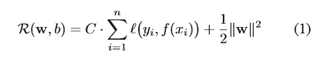

图 1：SVM 的标准公式

现在，假设我们需要调整模型参数 C，并且需要轻松地进行调整。从方程中可以清楚地看到，调整 C 还涉及其他参数，如*xi*，*i*和*w*；其中，正则化参数 C > 0，是 w 的范数。在 RHS 中，它是稳定器，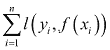是依赖于目标函数 f(xi)的经验损失项。在标准 SVM（线性 SVM 或其他变体）中，可以通过解决凸二次优化问题进一步最小化正则化功能。一旦问题解决了，它就保证了获得最佳预测性能的唯一全局最小解。因此，整个过程多多少少是一个优化问题。

总之，*图 2，模型调优过程、考虑和工作流程*显示了调优过程及其考虑作为工作流程：

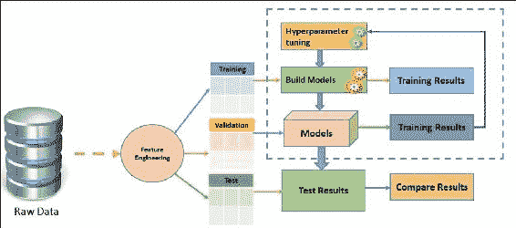

图 2：模型调优过程、考虑和工作流程

现在，如果您获得了原始数据集，您很可能会进行预处理并将数据集分成训练集和测试集。因此，要调整超参数 C，您需要首先将训练集分成验证训练集和验证测试集。

之后，您可以尝试使用验证训练集和验证测试集来调整参数。然后使用您得到的最佳参数在完整的训练集上重新训练模型。现在您可以在测试集上执行测试作为最后一步。

到目前为止，您的方法似乎还可以，但以下两个选项中哪一个平均更好呢？

+   使用在验证训练集上训练的最终模型进行最终测试会更好吗？

+   或者最好使用整个训练集，并使用网格或随机搜索的最佳参数重新训练模型吗？尽管这些参数未针对此集进行优化，但在这种情况下，我们有最终的训练数据。

您打算选择选项 1 吗，因为参数已经在此训练（即验证训练集）集上进行了优化？还是您打算选择选项 2，因为尽管这些参数未针对训练集进行优化，但在这种情况下，您有最终的训练数据？我们建议您选择选项 2，但前提是您信任选项 2 中的验证设置。原因是您已执行了**交叉验证**（**CV**）以确定最通用的参数设置，否则模型选择或您尝试优化的任何其他内容。这些发现应该应用于整个训练集，并在测试集上进行一次测试。

好吧，假设您选择了选项 2；现在第二个挑战正在发展。我们如何估计机器学习模型的性能？从技术上讲，您可能会认为我们应该将训练数据提供给我们的学习算法，以学习最佳模型。然后，我们可以基于测试标签预测标签。其次，我们计算测试数据集上的错误预测数量，以计算模型的错误率。

就这样？朋友，不要那么着急！根据我们的目标，不幸的是，估计该模型的性能并不那么微不足道。也许我们应该从另一个角度来解决前面的问题：我们为什么要关心性能估计？理想情况下，模型的估计性能告诉我们它在未观察到的数据上的表现如何-在应用机器学习或开发新算法的应用中，对未来数据进行预测通常是我们想要解决的主要问题。

最后，还有其他几个挑战，取决于数据结构、问题类型、问题领域和适当的用例，当您开始大量练习时，您将遇到这些挑战。

# 评估机器学习模型

在这一部分，我们将讨论如何评估机器学习模型，因为您应该始终评估模型，以确定它是否准备好始终表现良好，预测新数据和未来数据的目标。显然，未来的数据可能有许多未知的目标值。因此，您需要检查性能相关的指标，如数据上的 ML 模型的准确度指标。在这方面，您需要提供一个包含从训练模型生成的分数的数据集，然后评估模型以计算一组行业标准的评估指标。

要适当评估模型，您需要提供一个已标记目标的数据样本，这些数据将用作来自训练数据源的地面真相或事实数据集。正如我们已经讨论过的那样，使用相同的训练数据集评估 ML 模型的预测准确度可能没有用。

原因是模型本身可以根据其接收的奖励记住训练数据，而不是从中概括。因此，当 ML 模型训练完成时，您可以从模型中呈现的观察中了解要预测的目标值。之后，您可以将您训练的 ML 模型返回的预测值与已知的目标值进行比较。

最后，您可能对计算总结指标感兴趣，该指标显示性能指标，以指示预测值和真实值匹配的准确度参数，如精确度、召回率、加权真正例、加权真负例、提升等。然而，在这一部分，我们将特别讨论如何首先评估回归、分类（即二元分类、多类分类）和聚类模型。

## 评估回归模型

假设您是一名在线货币交易员，您在外汇或 Fortrade 上工作。现在您心中有两个货币对要买入或卖出，例如 GBP/USD 和 USD/JPY。如果您仔细观察这两个货币对，您会发现 USD 在这两个货币对中都是共同的。现在，如果您观察 USD、GBP 或 JPY 的历史价格，您可以预测未来的结果，即您应该开仓买入还是卖出。

这种问题可以被视为典型的回归问题。在这里，目标变量（在这种情况下是价格）是一个随时间变化的连续数值，基于市场开盘时间。因此，为了根据给定的某种货币（例如本例中的 USD、GBP 或 JPY）的特征值做出价格预测，我们可以拟合一个简单的线性回归或逻辑回归模型。

在这种情况下，特征值可以是历史价格和一些外部因素，这些因素会使某种货币或货币对的价值发生变化。通过这种方式，训练好的模型可以预测某种货币的价格。

回归模型（即线性、逻辑或广义线性回归模型）可用于找到或计算我们训练的相同数据集的分数，现在可以使用所有货币的预测价格或这三种货币的历史价格。我们可以通过分析预测价格与实际价格相比平均偏离多少来进一步评估模型的性能。通过这种方式，人们可以猜测预测价格是上涨还是下跌，并可以从外汇或 Fortrade 等在线货币网站赚钱。

## 评估二元分类模型

正如我们在二元分类场景中已经讨论过的，目标变量只有两种可能的结果。例如：{0, 1}，{垃圾邮件，快乐}，{B，N}，{false，true}和{负面，正面}等。现在假设您获得了一个包含世界各地研究人员的人口统计学、社会经济和就业变量的数据集，并且您想要预测博士奖学金金额（即薪水水平）作为一个二元变量，其值为，比如{<=1.5K$，>=4.5K$}。

在这个特定的例子中，负类将代表薪水或奖学金每月低于或等于 1500 美元的研究人员。因此，另一方面，正类代表薪水高于或等于 4500 美元的所有其他研究人员。

现在，从问题场景中可以清楚地看出，这也是一个回归问题。因此，您将训练模型，对数据进行评分，并评估结果，看看它与实际标签相差多少。因此，在这种类型的问题中，您将进行实验，评估两类（即二元类）逻辑回归模型的性能，这是 ML 领域中最常用的二元分类器之一。

## 评估多类分类模型

在第六章中，*构建可扩展的机器学习管道*，我们开发了几个应用程序和管道，您可能还记得我们还使用逻辑回归为 OCR 数据集开发了一个多类分类问题，并使用多类指标显示了结果。在该示例中，有 26 个类别对应 26 个字符（即从 A 到 Z）。我们必须预测某个字符的类别或标签，以及它是否真的属于正确的类别或标签。这种回归问题可以使用多类分类方法解决。

因此，在这种类型的问题中，您还将进行实验，评估多类（即两类以上）逻辑回归模型的性能。

## 评估聚类模型

由于聚类模型在许多不同方面与分类和回归模型有显著差异，如果您评估一个聚类模型，您将找到一组不同的统计数据和与聚类模型相关的性能指标。在聚类模型评估技术中返回的性能指标描述了每个簇分配了多少数据点，簇之间的分离程度以及数据点在每个簇内的紧密程度。

例如，如果您回忆一下，在第五章中，*通过示例进行监督和无监督学习*，您会发现我们讨论并使用 Spark ML 和 MLlib 解决了一个聚类问题，在*使用 Spark 进行无监督学习：示例部分*。在这个特定的例子中，我们展示了使用 Saratoga NY Homes 数据集的 K-Means 聚类，并基于价格和地块大小特征对位于同一地区的房屋可能的邻域进行了探索性分析。这种问题可以使用聚类模型解决和评估。然而，Spark 的当前实现尚未为模型评估提供任何发展的算法。

# 验证和评估技术

在机器学习应用开发中有一些广泛使用的术语可能有点棘手和令人困惑，所以让我们一起讨论并梳理一下。这些术语包括模型、目标函数、假设、混淆矩阵、模型部署、归纳算法、分类器、学习算法、交叉验证和参数：

+   **目标函数**：在强化学习或预测建模中，假设我们专注于对一个对象进行建模。最终目标是学习或逼近一个特定且未知但有针对性的函数。目标函数表示为*f(x) = y*；其中*x*和*y*都是变量，*f(x)*是我们想要建模的真实函数，它也表示我们试图最大化或实现目标值*y*。

+   **假设**：统计假设（不要将其与研究者提出的研究假设混淆）是一个可通过观察过程进行测试的广义函数。该过程类似于通过训练数据集中的一组随机变量对建模的真实函数进行测试。假设检验的目标是提出一个假设，以测量两个数据集之间的统计关系，例如训练集和测试集，其中，这两个数据集都必须与理想化模型（记住不是随机化或标准化模型）具有统计显著性。

+   **学习算法**：如前所述，机器学习应用的最终目标是找到或逼近目标函数。在这个持续的过程中，学习算法是一组指令，它使用训练数据集对目标函数进行建模。从技术上讲，学习算法通常伴随着一个假设空间，并制定最终的假设。

+   **模型**：统计模型是一个数学模型，它在生成样本和类似数据时体现了一组假设。最终，该模型通常代表了数据生成过程的一个显著理想化形式。此外，在机器学习领域，假设和模型这两个术语经常可以互换使用。

+   **归纳算法**：归纳算法接受特定实例的输入，以产生超出这些输入实例的广义模型。

+   **模型部署**：模型部署通常表示将已构建和开发的模型应用于实际数据，以对一个示例进行预测。

+   交叉验证：这是一种通过将数据分成大约相等大小的 K 个互斥子集或折叠来估计机器学习模型的准确性的方法。然后，模型在迭代中进行 K 次训练和测试，每次在可用数据集上排除一个折叠，然后在该折叠上进行测试。

+   分类器：分类器是假设或离散值函数的特殊情况，用于为特定数据点分配最分类类别标签。

+   回归器：回归器也是假设的一种特殊情况，它将未标记的特征映射到预定义度量空间内的值。

+   超参数：超参数是机器学习算法的调整参数，学习算法将训练数据拟合到这些参数上。

根据 Pedro D. 等人在[`homes.cs.washington.edu/~pedrod/papers/cacm12.pdf`](http://homes.cs.washington.edu/~pedrod/papers/cacm12.pdf)中的 *关于机器学习的一些有用的东西*，我们还需要概述一些其他事项，如下所示：

+   表示：分类器或回归器必须用计算机可以处理的某种形式语言表示，从而创建适当的假设空间。

+   评估：需要一个评估函数（即目标函数或评分函数）来区分好的分类器或回归器与坏的分类器或回归器，该函数由算法内部使用，用于构建或训练模型。

+   优化：我们还需要一种在分类器或回归器中搜索的方法，以寻求最高得分。因此，优化是决定学习者效率的关键，有助于确定最佳参数。

简而言之，在机器学习算法中学习的关键公式是：

> *学习 = 表示 + 评估 + 优化*

因此，为了验证和评估训练好的模型，您需要非常清楚地理解上述术语，以便能够概念化机器学习问题以及 Spark ML 和 MLlib API 的正确用法。

# 机器学习模型的参数调整

在本节中，我们将讨论调整参数和技术，例如超参数调整、随机搜索参数调整、网格搜索参数调整和交叉验证等机器学习模型的调整参数和技术。

## 超参数调整

超参数调整是一种根据所呈现数据的性能选择正确参数组合的技术。这是从实践中获得机器学习算法的有意义和准确结果的基本要求之一。例如，假设我们有两个要调整的超参数，用于 *图 3* 中呈现的管道，即使用逻辑回归估计器的 Spark ML 管道模型（虚线仅在管道拟合期间发生）。

我们可以看到我们为每个参数放入了三个候选值。因此，总共会有九种组合。然而，图中只显示了四种，即 **Tokenizer**、**HashingTF**、**Transformer** 和 **Logistic Regression**（**LR**）。现在我们要找到最终会导致最佳评估结果的模型。正如我们在第六章中已经讨论的那样，拟合模型由分词器、哈希 TF 特征提取器和拟合的逻辑回归模型组成：

超参数调整

图 3：使用逻辑回归估计器的 Spark ML 管道模型（虚线仅在管道拟合期间发生）

*图 3* 显示了先前提到的管道的典型工作流程。然而，虚线仅在管道拟合期间发生。

如前所述，拟合的管道模型是一个转换器。转换器可用于预测、模型验证和模型检查。此外，我们还提到 ML 算法的一个不幸的特点是，它们通常有许多需要调整以获得更好性能的超参数。

例如，这些超参数中的正则化程度与 Spark MLlib 优化的模型参数不同。因此，如果没有对数据和要使用的算法的专业知识，很难猜测或衡量最佳的超参数组合。由于复杂数据集是基于 ML 问题类型的，管道的大小和超参数的数量可能呈指数级增长（或线性增长），即使对于 ML 专家来说，超参数调整也变得繁琐，更不用说调整参数的结果可能变得不可靠。

根据[`spark.apache.org/docs/latest/ml-guide.html`](http://spark.apache.org/docs/latest/ml-guide.html)提供的 Spark API 文档，用于指定 Spark ML 估计器和转换器的是一个独特且统一的 API。`ParamMap`是一组具有`Param`作为命名参数的（参数，值）对，由 Spark 提供自包含文档。从技术上讲，有两种方式可以传递参数给算法，如下所示：

+   设置参数。例如，如果 LR 是`LogisticRegression`的一个实例（即估计器），您可以调用`setMaxIter()`方法如下：`LR.setMaxIter(5)`。这本质上是将回归实例指向模型的拟合：`LR.fit()`。在这个特定的例子中，最多会有五次迭代。

+   第二个选项涉及将`ParamMaps`传递给`fit()`或`transform()`（有关详细信息，请参阅*图 1*）。在这种情况下，任何参数都将被先前通过 ML 应用程序特定代码或算法中的 setter 方法指定的`ParamMaps`覆盖。

### 提示

为您的数据集创建一个表现良好的算法的简短列表的一个很好的方法是使用 R 中的 Caret 包，因为 Spark 中的调整不够健壮。Caret 是由辉瑞公司的 Max Kuhn 创建和维护的 R 中的一个包。开发始于 2005 年，后来被开源并上传到 CRAN，实际上 CRAN 是**分类和回归训练**（**CARET**）的缩写。最初开发是出于运行给定问题的多个不同算法的需求。有兴趣的读者可以访问[`topepo.github.io/caret/index.html`](http://topepo.github.io/caret/index.html)查看该包的理论和实际考虑。

## 网格搜索参数调整

假设您已经选择了您的超参数，并通过调整应用了调整，现在您还需要找到特征。在这方面，对超参数和特征空间进行完整的网格搜索计算量太大。因此，您需要执行 K 折交叉验证的一次折叠，而不是进行完整的网格搜索：

+   使用折叠的训练集在交叉验证上调整所需的超参数，使用所有可用的特征。

+   使用这些超参数选择所需的特征

+   对 K 中的每个折叠重复计算

+   最终模型是在使用从 CV 的每个折叠中选择的 N 个最常见特征的所有数据上构建的

有趣的是，超参数也将在交叉验证循环中再次使用所有数据进行调整。与完整的网格搜索相比，这种方法会有很大的缺点吗？实质上，我在每个自由参数的维度上进行线性搜索（找到一个维度上的最佳值，将其保持不变，然后找到下一个维度上的最佳值），而不是每个参数设置的每个组合。

沿着单个参数搜索而不是一起优化的最重要的缺点是忽略了相互作用。很常见的情况是，例如，不止一个参数影响模型复杂性。在这种情况下，您需要查看它们的相互作用，以成功地优化超参数。根据您的数据集有多大以及您比较了多少模型，返回最大观察性能的优化策略可能会遇到麻烦（这对于网格搜索和您的策略都是如此）。

原因是在大量性能估计中搜索最大值会忽略性能估计的方差：您可能最终得到一个看起来不错的模型和训练/测试拆分组合。更糟糕的是，您可能会得到几个看起来完美的组合，然后优化就无法知道选择哪个模型，因此变得不稳定。

## 随机搜索参数调整

在训练中优化调整参数的默认方法是使用网格搜索。这种方法通常是有效的，但是在存在许多调整参数的情况下，可能效率低下。有一些模型可以在相对较短的时间内找到调整参数的合理值，这是有益的。然而，有一些模型在小范围搜索中的效率可能会抵消其他优化。不幸的是，Spark 目前对超参数调整的实现没有提供任何随机搜索调整的技术。

### 提示

相反，例如，CARET 中的许多模型利用*子模型技巧*，其中评估了 M 个调整参数组合；可能远少于 M 个模型拟合所需的数量。当使用简单的网格搜索时，这种方法最有效。因此，使用随机搜索可能效率低下。最后，训练包装的许多模型具有少量参数。平均参数数量为 1.7。要使用随机搜索，**trainControl**中还有一个选项叫做 search。该参数的可能值是`grid`和`random`。CARET 中包含的内置模型包含生成随机调整参数组合的代码。唯一组合的总数由 train 的**tuneLength**选项指定。

## 交叉验证

交叉验证（也称为**旋转估计**（**RE**））是一种评估统计分析和结果质量的模型验证技术。目标是使模型向独立测试集泛化。

交叉验证技术的一个完美用途是从机器学习模型中进行预测。从技术上讲，如果您想要估计预测模型在实践中的准确性，当您将其部署为 ML 应用程序时，它将会有所帮助。

在交叉验证过程中，模型通常使用已知类型的数据集进行训练。相反，它使用未知类型的数据集进行测试。在这方面，交叉验证有助于使用验证集在训练阶段描述数据集以测试模型。

然而，为了最小化机器学习模型中的缺陷，如过拟合和欠拟合，交叉验证技术提供了关于模型如何泛化到独立集的见解。

有两种类型的交叉验证，可以如下分类：

+   **穷尽交叉验证**：包括留 p 法交叉验证和留一法交叉验证

+   **非穷尽交叉验证**：包括 K 折交叉验证和重复随机子采样验证交叉验证

由于页面限制，本书不会对这些进行详细讨论。此外，使用 Spark ML 和 Spark MLlib，读者将能够在下一节中按照我们的示例执行交叉验证。

除了时间序列数据外，在大多数情况下，研究人员/数据科学家/数据工程师使用 10 折交叉验证，而不是在验证集上进行测试（其中 K = 10）。这是最广泛应用的交叉验证技术，适用于各种用例和问题类型。此外，为了减少变异性，使用不同分区进行多次交叉验证迭代；最后，对多轮验证结果进行平均。

使用交叉验证而不是传统验证有两个主要优点，如下所述：

+   首先，如果没有足够的数据可用于在单独的训练和测试集之间进行分区，就有可能失去重要的建模或测试能力。

+   其次，K 折交叉验证估计器的方差低于单个留出集估计器。这种低方差限制了变异性，如果可用数据量有限，则这一点非常重要。

在这些情况下，正确估计模型预测和相关性能的公平方法是使用交叉验证作为一种强大的通用技术进行模型选择和验证。

*机器学习模型选择*部分将展示一个更加技术性的例子。让我们举一个具体的例子来说明这一点。假设我们需要对模型调整进行手动特征和参数选择，之后，在整个数据集上进行 10 折交叉验证的模型评估。什么才是最佳策略？我们建议您选择提供乐观分数的策略如下：

+   将数据集分为训练集（80%）和测试集（20%）或其他比例

+   使用 K 折交叉验证来调整你的模型

+   重复交叉验证，直到找到优化的模型，因此调整。

+   现在使用你的模型在测试集上进行预测，以获得模型外误差的估计

# 假设检验

假设检验是用于确定结果是否具有统计学意义的统计工具。此外，它还可以用来证明你所得到的结果是偶然发生的还是实际结果。

在这方面，此外，根据 Oracle 开发人员在[`docs.oracle.com/cd/A57673_01/DOC/server/doc/A48506/method.htm`](https://docs.oracle.com/cd/A57673_01/DOC/server/doc/A48506/method.htm)上的说法，某种工作流程将提供更好的性能调整。他们建议的典型步骤如下：

+   为调整设定明确的目标

+   创建最小可重复测试

+   测试假设

+   保留所有记录

+   避免常见错误

+   当达到目标时停止调整

通常，首先计算测试统计量 T 的观察值 tobs。之后，在零假设下计算概率，也称为 p 值。最后，只有当 p 值小于显著性水平（所选概率）阈值时，才会拒绝零假设，支持备择假设。

要了解更多信息，请参考以下出版物：*R.A. Fisher 等人，《生物农业和医学研究的统计表》，第 6 版，表 IV，Oliver & Boyd，Ltd.，爱丁堡*。

以下是两个经验法则（尽管这些可能因数据质量和类型而有所不同）：

+   如果 p 值为 p > 0.05，则接受你的假设。请注意，如果偏差足够小，可能是由于机会而接受水平。例如，0.6 的 p 值意味着有 60%的概率出现任何偏离预期结果的情况。然而，这在可接受的偏差范围内。

+   如果 p 值为 p < 0.05，则拒绝你的假设，得出结论是除了机会之外还有其他因素在起作用，使得偏差完美。同样，0.01 的 p 值意味着只有 1%的机会是由于机会而产生的偏差，这意味着其他因素必须参与，并且这些因素需要解决。

然而，这两条规则可能并不适用于每个假设检验。在下一小节中，我们将展示使用 Spark MLlib 进行假设检验的示例。

## 使用 Spark MLlib 的 ChiSqTestResult 进行假设检验

根据 Apache 提供的 API 文档[`spark.apache.org/docs/latest/mllib-statistics.html#hypothesis-testing`](http://spark.apache.org/docs/latest/mllib-statistics.html#hypothesis-testing)，Spark MLlib 的当前实现支持 Pearson 卡方（*χ2*）拟合度和独立性测试：

+   拟合度的好坏，或者是否正在进行独立性检验，由输入数据类型决定

+   拟合度检验需要一个向量类型的输入（主要是密集向量，尽管对于稀疏向量也适用）。另一方面，独立性检验需要一个矩阵作为输入格式。

除此之外，Spark MLlib 还支持输入类型 RDD [LabeledPoint]，以通过卡方独立性检验实现特征选择，特别是对于 SVM 或基于回归的测试，其中统计类提供了运行 Pearson 卡方检验所需的方法。

此外，Spark MLlib 提供了**Kolmogorov-Smirnov**（**KS**）概率分布相等的 1 样本、2 边实现的检验。Spark MLlib 提供了一些在线实现的测试，以支持 A/B 测试等用例。这些测试可以在 Spark Streaming DStream 上执行，其中每个元组的第一个元素表示对照组（false）或处理组（true），第二个元素是观察值的值。

然而，由于简洁和页面限制，这两种测试技术将不会被讨论。以下示例演示了如何通过`ChiSqTestResult`运行和解释假设检验。在示例中，我们将展示三个测试：对从乳腺癌诊断数据集创建的密集向量的拟合度检验，对随机创建的矩阵的独立性检验，以及对癌症数据集本身的列联表进行独立性检验。

**步骤 1：加载所需的包**

以下是加载所需包的代码：

```scala
import java.io.BufferedReader; 
import java.io.FileReader; 
import java.io.IOException; 
import org.apache.spark.api.java.JavaRDD; 
import org.apache.spark.api.java.function.Function; 
import org.apache.spark.mllib.linalg.DenseVector; 
import org.apache.spark.mllib.linalg.Matrices; 
import org.apache.spark.mllib.linalg.Matrix; 
import org.apache.spark.mllib.linalg.Vector; 
import org.apache.spark.mllib.regression.LabeledPoint; 
import org.apache.spark.mllib.stat.Statistics; 
import org.apache.spark.mllib.stat.test.ChiSqTestResult; 
import org.apache.spark.rdd.RDD; 
import org.apache.spark.sql.SparkSession; 
import com.example.SparkSession.UtilityForSparkSession; 

```

**步骤 2：创建一个 Spark 会话**

以下代码帮助我们创建一个 Spark 会话：

```scala
static SparkSession spark = UtilityForSparkSession.mySession(); 

```

`UtilityForSparkSession`类的实现如下：

```scala
public class UtilityForSparkSession { 
  public static SparkSession mySession() { 
  SparkSession spark = SparkSession 
               .builder() 
               .appName("JavaHypothesisTestingOnBreastCancerData ") 
               .master("local[*]") 
              .config("spark.sql.warehouse.dir", "E:/Exp/") 
              .getOrCreate(); 
    return spark; 
  } 
} 

```

**步骤 3：执行拟合度检验**

首先，我们需要从类别数据集（如威斯康星州乳腺癌诊断数据集）准备一个密集向量。由于我们已经在这个数据集上提供了许多示例，所以在本节中我们将不再讨论数据探索。以下代码行收集了我们使用`myVector()`方法创建的向量：

```scala
Vector v = myVector(); 

```

`myVector()`方法的实现如下：

```scala
public static Vector myVector() throws NumberFormatException, IOException {     
BufferedReader br = new BufferedReader(new FileReader(path)); 
    String line = nulNow let's compute the goodness of the fit. Note, if a second vector tol; 
    Vector v = null; 
    while ((line = br.readLine()) != null) { 
      String[] tokens = line.split(","); 
      double[] features = new double[30]; 
      for (int i = 2; i < features.length; i++) { 
        features[i-2] =     
                       Double.parseDouble(tokens[i]); 
      } 
      v = new DenseVector(features); 
    } 
    return v; 
  } 

```

现在让我们计算拟合度。请注意，如果没有提供第二个要测试的向量作为参数，测试将自动针对均匀分布进行：

```scala
ChiSqTestResult goodnessOfFitTestResult = Statistics.chiSqTest(v); 

```

现在让我们打印拟合度的结果：

```scala
System.out.println(goodnessOfFitTestResult + "\n"); 

```

请注意，测试的摘要包括 p 值、自由度、检验统计量、使用的方法和零假设。我们得到了以下输出：

```scala
Chi squared test summary: 
method: pearson 
degrees of freedom = 29  
statistic = 4528.611649568829  
pValue = 0.0  

```

对于零假设：观察结果遵循与预期相同的分布，存在非常强烈的假设。

由于 p 值低到足够不显著，因此我们不能根据数据接受假设。

**步骤 4：对列联表进行独立性检验**

首先让我们随机创建一个 4x3 的列联表。在这里，矩阵如下所示：

```scala
 ((1.0, 3.0, 5.0, 2.0), (4.0, 6.0, 1.0, 3.5), (6.9, 8.9, 10.5, 12.6)) 
Matrix mat = Matrices.dense(4, 3, new double[] { 1.0, 3.0, 5.0, 2.0, 4.0, 6.0, 1.0, 3.5, 6.9, 8.9, 10.5, 12.6});     

```

现在让我们对输入的列联表进行 Pearson 独立性检验：

```scala
ChiSqTestResult independenceTestResult = Statistics.chiSqTest(mat); 

```

现在让我们评估测试结果，并给出包括 p 值和自由度在内的测试摘要：

```scala
System.out.println(independenceTestResult + "\n"); 

```

我们得到了以下统计摘要：

```scala
Chi squared test summary: 
method: pearson 
degrees of freedom = 6  
statistic = 6.911459343085576  
pValue = 0.3291131185252161  
No presumption against null hypothesis: the occurrence of the outcomes is statistically independent.  

```

**步骤 5：对列联表进行独立性检验**

首先，让我们通过 RDDs 从癌症数据集创建一个列联表如下：

```scala
static String path = "breastcancer/input/wdbc.data"; 
RDD<String> lines = spark.sparkContext().textFile(path, 2);     
JavaRDD<LabeledPoint> linesRDD = lines.toJavaRDD().map(new Function<String, LabeledPoint>() { 
    public LabeledPoint call(String lines) { 
    String[] tokens = lines.split(","); 
    double[] features = new double[30]; 
    for (int i = 2; i < features.length; i++) { 
    features[i - 2] = Double.parseDouble(tokens[i]); 
            } 
    Vector v = new DenseVector(features); 
    if (tokens[1].equals("B")) { 
    return new LabeledPoint(1.0, v); // benign 
      } else { 
    return new LabeledPoint(0.0, v); // malignant 
        } 
      } 
    }); 

```

我们已经从原始（特征，标签）对构建了一个列联表，并用它进行了独立性测试。现在让我们对每个特征针对标签进行`ChiSquaredTestResult`测试：

```scala
ChiSqTestResult[] featureTestResults = Statistics.chiSqTest(linesRDD.rdd()); 

```

现在让我们使用以下代码段观察每列（即每 30 个特征点）的测试结果：

```scala
int i = 1; 
for (ChiSqTestResult result : featureTestResults) { 
System.out.println("Column " + i + ":"); 
System.out.println(result + "\n");  
i++; 
} 

Column 1: 
Chi-squared test summary: 
method: Pearson 
degrees of freedom = 455  
statistic = 513.7450859274513  
pValue = 0.02929608473276224  
Strong presumption against null hypothesis: the occurrence of the outcomes is statistically independent. 

Column 2: 
Chi-squared test summary: 
method: Pearson 
degrees of freedom = 478  
statistic = 498.41630331377735  
pValue = 0.2505929829141742  
No presumption against null hypothesis: the occurrence of the outcomes is statistically independent. 

Column 3: 
Chi-squared test summary: 
method: Pearson 
degrees of freedom = 521  
statistic = 553.3147340697276  
pValue = 0.1582572931194156  
No presumption against null hypothesis: the occurrence of the outcomes is statistically independent. 
. 
. 
Column 30: 
Chi-squared test summary: 
method: Pearson 
degrees of freedom = 0  
statistic = 0.0  
pValue = 1.0  
No presumption against null hypothesis: the occurrence of the outcomes is statistically independent.  

```

从这个结果，我们可以看到对于一些特征点（即列），我们有一个与其他特征点相比较大的 p 值。因此，建议读者在应用超参数调整之前选择适当的数据集并进行假设检验。在这方面没有具体的例子，因为结果可能会根据您拥有的数据集而有所不同。

## 使用 Spark MLlib 的 Kolmogorov-Smirnov 测试进行假设检验

自 Spark 1.1.0 发布以来，Spark 还提供了使用 Kolmogorov-Smirnov 测试进行实时流数据的假设检验的功能。在这里，获得测试统计结果（至少与实际观察到的结果一样极端）的概率。它实际上假设零假设始终为真。

### 提示

有关更多详细信息，感兴趣的读者应参考 Spark 分发中的 Java 类（`JavaHypothesisTestingKolmogorovSmirnovTestExample.java`）在以下目录下：`spark-2.0.0-bin-hadoop2.7\examples\src\main\java\org\apache\spark\examples\mllib`。

## Spark MLlib 的流显著性测试

除了 Kolmogorov-Smirnov 测试之外，Spark 还支持流显著性测试，这是假设测试的在线实现，类似于 A/B 测试？这些测试可以在 Spark 流中使用 DStream 进行（关于这个主题的更多技术讨论将在第九章中进行，*使用流和图数据进行高级机器学习*）。

基于 MLlib 的流显著性测试支持以下两个参数：

+   **peacePeriod**：这是要忽略的来自流的初始数据点的数量。这实际上用于减轻新颖性效应和您将收到的流的质量。

+   **windowSize**：这是进行假设检验的过去批次数量。如果将其值设置为 0，它将使用所有先前接收和处理的批次进行累积处理。

感兴趣的读者应参考 Spark API 文档[`spark.apache.org/docs/latest/mllib-statistics.html#hypothesis-testing`](http://spark.apache.org/docs/latest/mllib-statistics.html#hypothesis-testing)。

# 机器学习模型选择

大多数机器学习算法依赖于各种参数。当我们训练模型时，我们需要为这些参数提供值。训练模型的有效性取决于我们选择的模型参数。找到最佳参数集的过程称为模型选择。

## 通过交叉验证技术进行模型选择

在使用 Python 的 scikit-learn 库或 R 进行机器学习时，通常可以通过使用模型的开箱即用设置获得相当好的预测性能。然而，如果您花一些时间调整模型以适应您的特定问题和数据集，回报可能会很大。

然而，我们还需要考虑其他问题，如过度拟合、交叉验证和偏差-方差权衡。这些想法对于优化算法的超参数至关重要。

在本节中，我们将探讨超参数优化的概念，并演示调整和训练逻辑回归分类器以用于著名的垃圾邮件过滤数据集。目标是调整并应用逻辑回归到这些特征，以预测给定的电子邮件/短信是否为垃圾邮件或非垃圾邮件：

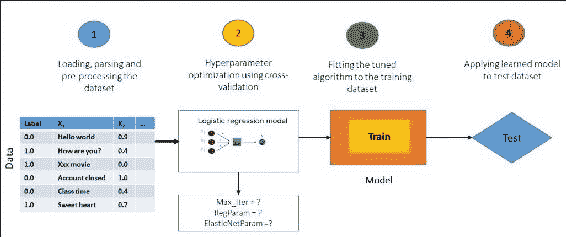

图 4：通过交叉验证进行模型选择

### 交叉验证和 Spark

管道通过一次调整整个管道来实现模型选择，而不是分别调整管道中的每个元素。请参阅[`spark.apache.org/docs/latest/ml-guide.html`](http://spark.apache.org/docs/latest/ml-guide.html)中的 API 文档。

当前的 Spark ML 实现支持使用`CrossValidator`类进行模型选择。它接受一个 Estimator、一组`ParamMaps`和一个 Evaluator。模型选择任务始于拆分数据集（即将其拆分为一组折叠），这些折叠随后被用作单独的训练和测试数据集。

例如，对于 K=10 个折叠，`CrossValidator`将生成 10 个（训练，测试）数据集对。其中每个使用数据的三分之二（2/3）进行训练，另外三分之一（1/3）进行测试。之后，`CrossValidator`遍历`ParamMaps`集合。对于每个`ParamMap`，它训练给定的 Estimator 并使用可用的 Evaluator 进行评估。Evaluator 可以是相关的 ML 任务，例如：

+   `RegressionEvaluator` 用于回归相关问题

+   `BinaryClassificationEvaluator` 用于二进制数据及其相关问题

+   `MultiClassClassificationEvaluator` 用于多类问题

在选择最佳的`ParamMap`时，使用默认指标。请注意，`ParamMap`也可以被这些评估器中的`setMetric()`方法覆盖。相反，当涉及到最佳模型选择时：

+   `ParamMap`产生最佳的评估指标

+   这些评估指标然后在 K 个折叠上进行平均

+   最后，选择最佳模型

一旦选择了最佳的`ParamMap`和模型，`CrossValidator`将使用它们来拟合整个数据集的 Estimator。

为了更清楚地了解`CrossValidator`并从参数网格中进行选择，Spark 使用`ParamGridBuilder`实用程序来构建参数网格。例如，假设参数网格中`hashingTF.numFeatures`的值为 4，LR.`regParam`的值为 3。还假设`CrossValidator`使用 10 个折叠。

一旦这些值相乘的结果为 120（即 4*3*10=120），这意味着有大量不同的模型（即 120 个）正在被训练。因此，使用`CrossValidator`有时可能非常昂贵。然而，与基于启发式手工调整相比，它也是一种选择相关性能和超参数的统计上更可靠的方法。

### 提示

有兴趣的读者可以参考以下三本书以获得更多见解：

Evan R. Sparks 等人，《大规模机器学习的模型搜索自动化》，ACM，978-1-4503-3651-2/15/08，[`dx.doi.org/10.1145/2806777.2806945`](http://dx.doi.org/10.1145/2806777.2806945)。

Cawley, G. C. & Talbot, N. L 关于模型选择中的过度拟合和随后的选择偏差在性能评估中的影响，《机器学习研究杂志》，JMLR.org，2010 年，11，2079-2107。

N. Japkowicz 和 M. Shah，《评估学习算法：分类视角》，剑桥大学出版社，2011 年。

在下一个小节中，我们将展示如何使用 Spark ML API 对数据集进行交叉验证以进行模型选择。

### 使用 Spark ML 进行垃圾邮件过滤数据集的交叉验证

在这个小节中，我们将向您展示如何对电子邮件垃圾邮件数据集进行交叉验证以进行模型选择。我们将首先使用逻辑回归，然后我们将继续使用其他模型。最后，我们将推荐最适合电子邮件垃圾邮件分类的模型。

第一步：导入必要的包/库/API

以下是导入必要的包/库/API 的代码：

```scala
import java.io.Serializable; 
import java.util.Arrays; 
import java.util.logging.Level; 
import java.util.logging.Logger; 
import org.apache.spark.api.java.JavaPairRDD; 
import org.apache.spark.api.java.JavaRDD; 
import org.apache.spark.api.java.function.Function; 
import org.apache.spark.ml.Pipeline; 
import org.apache.spark.ml.PipelineStage; 
import org.apache.spark.ml.classification.LogisticRegression; 
import org.apache.spark.ml.evaluation.BinaryClassificationEvaluator; 
import org.apache.spark.ml.feature.HashingTF; 
import org.apache.spark.ml.feature.Tokenizer; 
import org.apache.spark.ml.param.ParamMap; 
import org.apache.spark.ml.tuning.CrossValidator; 
import org.apache.spark.ml.tuning.CrossValidatorModel; 
import org.apache.spark.ml.tuning.ParamGridBuilder; 
import org.apache.spark.sql.Dataset; 
import org.apache.spark.sql.Row; 
import org.apache.spark.sql.SparkSession; 
import scala.Tuple2; 

```

第二步：初始化必要的 Spark 环境

以下代码帮助我们初始化必要的 Spark 环境：

```scala
  static SparkSession spark = SparkSession 
        .builder() 
        .appName("CrossValidationforSpamFiltering") 
        .master("local[*]") 
        .config("spark.sql.warehouse.dir", "E:/Exp/") 
        .getOrCreate(); 

```

在这里，我们将应用程序名称设置为交叉验证，主 URL 设置为`local[*]`，Spark 会话设置为程序的入口点。请相应地设置这些参数。最重要的是，将仓库目录设置为`E:/Exp/`，并将其替换为适当的路径。

**步骤 3：从 SMS 垃圾短信数据集准备数据集**

以电子邮件垃圾邮件数据作为输入，从数据中准备一个数据集，将其用作原始文本，并通过调用`show()`方法检查数据是否被正确读取：

```scala
Dataset<Row> df = spark.read().text("input/SMSSpamCollection.txt"); 
df.show(); 

```

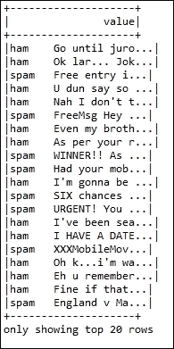

图 5：前 20 行

要了解更多关于数据的信息，请参考*Pipeline - an example with Spark ML*部分，在第四章中，*通过特征工程提取知识*，以及数据集探索的描述。正如您在*图 5*中所看到的，前 20 行，只有两个标签 - 垃圾邮件或正常邮件（即，这是一个二元分类问题），与文本值（即，每行）相关联。

然而，没有数字标签或 ID。因此，我们需要准备数据集（训练集），使数据框还包含 ID 和标签以及文本（即值），以便我们可以准备测试集，并使用任何分类算法（即逻辑回归）预测相应的标签，并决定我们的模型选择是否合适。

然而，为了做到这一点，我们需要先准备训练数据集。如您所见，上面显示的数据框只有一列，并且如前所述，我们确实需要三列。如果我们从先前的数据集（即`df`）准备一个 RDD，那么对我们来说将更容易进行转换。

**步骤 4：创建用于存储行和索引的 Java RDD 对**

通过将 DataFrame（即`df`）转换为 Java RDD，并通过压缩索引来创建 Java RDD 对：

```scala
JavaPairRDD<Row, Long> rowRDD = df.toJavaRDD().zipWithIndex(); 

```

**步骤 5：创建 LabeledDocument RDDs**

通过基于两个标签拆分数据集并将文本标签转换为数字标签（即，如果是正常邮件则为`1.0`，否则为 0.0）来创建`LabeledDocument` Java RDDs。请注意，`LabeledDocument`是一个在*步骤 6*中讨论的用户定义类：

```scala
JavaRDD<LabeledDocument> splitedRDD = rowRDD.map(new Function<Tuple2<Row, Long>, LabeledDocument>() { 
@Override 
public LabeledDocument call(Tuple2<Row, Long> v1) throws Exception {   
  Row r = v1._1; 
  long index = v1._2; 
  String[] split = r.getString(0).split("\t"); 
  if(split[0].equals("ham")) 
    return new LabeledDocument(index,split[1], 1.0); 
  else 
    return new LabeledDocument(index,split[1], 0.0); 
      } 
    });  

```

**步骤 6：准备训练数据集**

使用`createDataFrame()`方法从`LabeledDocument` RDDs 准备训练数据集，并指定类。最后，使用`show()`方法查看数据框结构，如下所示：

```scala
Dataset<Row> training = spark.createDataFrame(splitedRDD, LabeledDocument.class); 
training.show(false); 

```

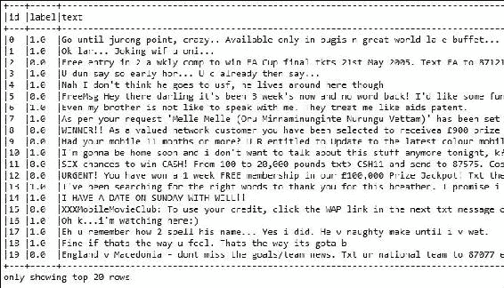

图 6：从数据集中新创建的标签和 ID；其中 ID 是行数。

从*图 6*中，*从数据集中新创建的标签和 ID；其中 ID 是行数*，我们可以看到新的训练数据集有三列：ID、测试和标签。实际上，可以通过在原始文档的每一行（即每一行）添加一个新的 ID 来完成。让我们为此创建一个名为`Document`的类，它应该为每行文本设置一个唯一的 ID。类的结构可以是以下内容：

```scala
public class Document implements Serializable { 
  private long id; 
  private String text; 
  //Initialise the constructor that should take two parameters: id and text// 
  Set the id 
  Get the id 
  Set the text 
  Get the text   
  } 

```

现在让我们来看一下类构造函数的结构：

```scala
  public LabeledDocument (long id, String text) {   
      this.id = id; 
           this.text = text; 
  } 

```

ID 的 setter 和 getter 可以是这样的：

```scala
  public void setId(long id) { 
    this.id = id; 
  } 
  public long getId() { 
    return this.id; 
  } 

```

类似地，文本的 setter 和 getter 方法可能是这样的：

```scala
  public String getText() { 
    return this.text; 
  } 

  public void setText(String text) { 
    this.text = text; 
  } 

```

因此，如果我们总结一下，`Document`类可能是这样的：

```scala
import java.io.Serializable; 
public class Document implements Serializable { 
  private long id; 
  private String text; 
  public Document(long id, String text) { 
    this.id = id; 
    this.text = text; 
  } 
  public long getId() { 
    return this.id; 
  } 
  public void setId(long id) { 
    this.id = id; 
  } 
  public String getText() { 
    return this.text; 
  } 
  public void setText(String text) { 
    this.text = text; 
  } 
} 

```

另一方面，`LabeledDocument`类的结构可能如下所示，并且可以从`Document`类扩展（稍后讨论）：

现在让我们来看一下类构造函数的结构：

```scala
  public LabeledDocument(long id, String text, double label) {   
    this.label = label; 
  } 

```

然而，我们还没有完成，因为我们将扩展`Document`类，我们需要使用`super()`方法从`Document`类继承构造函数，如下所示：

```scala
  public LabeledDocument(long id, String text, double label) { 
    super(id, text); 
    this.label = label; 
  }  

```

现在 setter 方法可以是这样的：

```scala
  public void setLabel(double label) { 
    this.label = label; 
  } 

```

当然，标签的 getter 方法可能是这样的：

```scala
  public double getLabel() { 
    return this.label; 
  } 

```

因此，简而言之，`LabelDocument`类如下：

```scala
import java.io.Serializable; 
public class LabeledDocument extends Document implements Serializable { 
  private double label; 
  public LabeledDocument(long id, String text, double label) { 
    super(id, text); 
    this.label = label; 
  } 
  public double getLabel() { 
    return this.label; 
  } 
  public void setLabel(double label) { 
    this.label = label; 
  } 
} 

```

第 7 步：配置 ML 管道

配置一个 ML 管道，包括三个阶段：`tokenizer`，`hashingTF`和`lr`：

```scala
Tokenizer tokenizer = new Tokenizer().setInputCol("text").setOutputCol("words"); 
HashingTF hashingTF = new HashingTF().setNumFeatures(1000).setInputCol(tokenizer.getOutputCol()).setOutputCol("features"); 
LogisticRegression lr = new LogisticRegression().setMaxIter(10).setRegParam(0.01); 
Pipeline pipeline = new Pipeline().setStages(new PipelineStage[] { tokenizer, hashingTF, lr }); 

```

第 8 步：构建要搜索的参数网格

目前，Spark 使用`ParamGridBuilder`来构建要搜索的参数网格。在这方面，假设我们有`hashingTF.numFeatures`的三个值和`lr.regParam`的两个值，那么这个网格将有 3 x 2 = 6 个参数设置供`CrossValidator`选择：

```scala
ParamMap[] paramGrid = new ParamGridBuilder() 
.addGrid(hashingTF.numFeatures(), new int[] { 10, 100, 1000 }).addGrid(lr.regParam(), new double[] { 0.1, 0.01 }) 
 .build(); 

```

我们现在将管道视为一个估计器，并将其包装在`CrossValidator`实例中。这将允许我们共同为所有管道阶段选择参数。`CrossValidator`需要一个估计器，一组估计器`ParamMaps`和一个评估器。请注意，这里的评估器是`BinaryClassificationEvaluator`，其默认指标是`areaUnderROC`。

第 9 步：创建一个 CrossValidator 实例

以下是创建`CrossValidator`实例的代码：

```scala
    CrossValidator cv = new CrossValidator() 
        .setEstimator(pipeline) 
        .setEvaluator(new BinaryClassificationEvaluator())                  
        .setEstimatorParamMaps(paramGrid) 
        .setNumFolds(5); // 5-fold cross validation 

```

第 10 步：运行交叉验证

运行交叉验证并选择最佳参数集。只需使用以下代码段：

```scala
CrossValidatorModel cvModel = cv.fit(training); 

```

现在您的`CrossValidator`模型已准备好执行预测。但在此之前，我们需要一个测试集或验证集。现在让我们准备一个样本测试集。只需使用以下代码段创建数据集：

```scala
    Dataset<Row> test = spark.createDataFrame(Arrays.asList( 
      new Document(4L, "FreeMsg CALL j k"),  
      new Document(5L, "Siva  hostel"), 
      new Document(6L, "darren now"),  
     new Document(7L, "Sunshine Quiz! Win a super Sony")),Document.class); 

```

现在让我们通过调用*图 7*中的`show()`方法来查看测试集的结构：

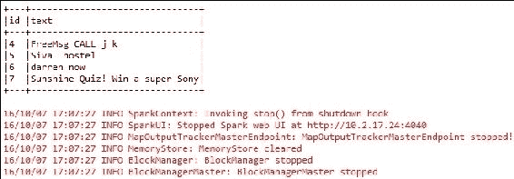

图 7：测试集

第 11 步：创建一个数据集来收集预测参数

以下代码说明了如何创建数据集：

```scala
Dataset<Row> predictions = cvModel.transform(test); 

```

第 12 步：显示测试集中每个文本的预测参数

借助以下代码，我们可以显示预测参数：

```scala
for (Row r : predictions.select("id", "text", "probability", "prediction").collect()) 
    { 
System.out.println("(" + r.get(0) + ", " + r.get(1) + ") --> prob=" + r.get(2) + ", prediction=" + r.get(3)); 
    }  

```

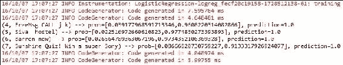

图 8：针对每个文本和 ID 的预测

因此，如果您比较*图 6*中显示的结果，“从数据集中新创建的标签和 ID；其中 ID 是行数”，您会发现预测准确性从更复杂的方法中增加，用于测量预测准确性的方法可以用于识别可以根据每种错误类型的成本来优化错误率的地方。

## 通过训练验证拆分进行模型选择

根据 Spark 在[`spark.apache.org/docs/latest/ml-guide.html`](http://spark.apache.org/docs/latest/ml-guide.html)提供的 API 文档，Spark 还为超参数调整提供了`TrainValidationSplit`，以及`CrossValidator`。`TrainValidationSplit`的想法是它只评估参数的每个组合，而不是像交叉验证那样迭代 k 次。因此，它在计算上更便宜，产生结果更快。然而，结果可能不像`CrossValidator`那样可靠。有一个例外：如果训练数据集足够大，那么它也可以产生可靠的结果。

`TrainValidationSplit`背后的理论是它将以下三个作为输入：

+   一个估计器

+   在`estimatorParamMaps`参数中提供的一组`ParamMap`

+   一个评估器

因此，它通过使用`trainRatio`参数将模型选择分为两部分开始。另一方面，`trainRatio`参数用于单独的训练和测试数据集。

例如，对于*trainRatio = 0.75*（默认值也是 0.75），`TrainValidationSplit`算法生成一个训练和测试对。在这种情况下，总数据的 75%用于训练模型。因此，其余的 25%用作验证集。

与`CrossValidator`类似，`TrainValidationSplit`也会遍历一组 ParamMaps，如前所述。对于参数的每种组合，它在每次迭代中训练给定的估计器。

因此，使用给定的评估器评估模型。之后，最佳模型被选为最佳选项，因为`ParamMap`产生了最佳的评估指标，从而简化了模型选择。`TrainValidationSplit`最终使用最佳的`ParamMap`拟合估计器，并用于整个数据集。

### 基于线性回归的 OCR 数据集模型选择

在本小节中，我们将展示如何为 OCR 数据执行训练验证分割调整。首先将使用逻辑回归，然后我们将继续使用其他模型。最后，我们将为 OCR 数据分类推荐最合适的参数。

**步骤 1：导入必要的包/库/API：**

```scala
import org.apache.spark.ml.evaluation.MulticlassClassificationEvaluator; 
import org.apache.spark.ml.param.ParamMap; 
import org.apache.spark.ml.regression.LinearRegression; 
import org.apache.spark.ml.tuning.ParamGridBuilder; 
import org.apache.spark.ml.tuning.TrainValidationSplit; 
import org.apache.spark.ml.tuning.TrainValidationSplitModel; 
import org.apache.spark.sql.Dataset; 
import org.apache.spark.sql.Row; 
import org.apache.spark.sql.SparkSession;
```

**步骤 2：初始化必要的 Spark 环境**

```scala
  SparkSession spark = SparkSession 
          .builder() 
          .appName("TrainSplitOCR") 
              .master("local[*]") 
               .config("spark.sql.warehouse.dir",  
                 "E:/Exp/") 
              .getOrCreate(); 

```

在这里，我们将应用名称设置为`TrainValidationSplit`，主 URL 设置为`local[*]`，Spark 上下文是程序的入口点。请相应地设置这些参数。

**步骤 3：将 OCR 数据准备为 libsvm 格式**

如果您回忆一下第六章中的*图 19*，*构建可扩展的机器学习管道*，您将记得数据如下所示*图 9*，*原始 OCR 数据集的数据框快照*：

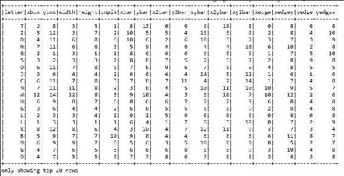

图 9：原始 OCR 数据集的数据框快照

然而，`TrainValidationSplitModel` API 的当前实现仅适用于已经处于`libsvm`格式的数据集。

### 提示

感兴趣的读者应参考以下研究文章以获取更深入的知识：Chih-Chung Chang 和 Chih-Jen Lin，*LIBSVM - 支持向量机库*。ACM 智能系统和技术交易，2:27:1--27:27，2011 年。该软件可在[`www.csie.ntu.edu.tw/~cjlin/libsvm`](http://www.csie.ntu.edu.tw/~cjlin/libsvm)上获得。

因此，我们确实需要将数据集从当前的制表符分隔的 OCR 数据转换为`libsvm`格式。

### 提示

读者应该使用 Packt 软件包提供的数据集，或者可以将 CSV/CSV 文件转换为相应的`libsvm`格式。感兴趣的读者可以参考我们在 GitHub 上提供的公共脚本[`github.com/rezacsedu/CSVtoLibSVMConverterinR`](https://github.com/rezacsedu/CSVtoLibSVMConverterinR)，该脚本可以直接将 CSV 文件转换为`libsvm`格式。只需正确显示输入和输出文件路径，并在 RStudio 上运行脚本。

**步骤 4：准备 OCR 数据集，并准备训练和测试集**

我们假设读者已经下载了数据或使用我们的 GitHub 脚本或使用自己的脚本转换了 OCR 数据。现在，将 OCR `libsvm`格式数据作为输入，并准备数据集作为原始文本，并通过调用`show()`方法检查数据是否被正确读取，如下所示：

```scala
Dataset<Row> data = spark.read().format("libsvm").load("input/Letterdata_libsvm.data"); 
data.show(false); 

```

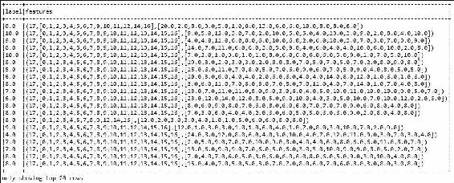

图 10：前 20 行

```scala
// Prepare training and test data. 
Dataset<Row>[] splits = data.randomSplit(new double[] {0.9, 0.1}, 12345); 
Dataset<Row> training = splits[0]; 
Dataset<Row> test = splits[1]; 

```

要了解更多关于数据的信息，请参考章节*Pipeline - An Example with Spark ML*，在第四章中，*通过特征工程提取知识*，以及数据集探索的描述。正如您在*图 2*中所看到的，*使用逻辑回归估计器的 Spark ML 管道模型（虚线仅在管道拟合期间发生）*，只有两个标签（垃圾邮件或正常邮件）与文本值（即每行）相关联。然而，没有数字标签或 ID。

因此，我们需要准备数据集（训练集），使得数据集还包含 ID 和标签以及文本（即值），以便我们可以准备一个测试集，并对任何分类算法（即逻辑回归）预测其相应的标签，并决定我们的模型选择是否合适。

但是，为了做到这一点，我们首先需要准备训练数据集。正如您所看到的，上面显示的数据框只有一列，正如之前提到的，我们确实需要三列。如果我们从上述数据集（即`df`）准备一个 RDD，那么我们更容易进行转换。

**步骤 5：使用线性回归配置 ML 管道**

```scala
LinearRegression lr = new LinearRegression(); 

```

**步骤 6：构建要搜索的参数网格**

目前，Spark 使用`ParamGridBuilder`来构建要搜索的参数网格。在这方面，对于`hashingTF.numFeatures`有三个值，对于`lr.regParam`有两个值，因此这个网格将有 3 x 2 = 6 个参数设置供`CrossValidator`选择：

```scala
ParamMap[] paramGrid = new ParamGridBuilder() 
.addGrid(hashingTF.numFeatures(), new int[] { 10, 100, 1000 }).addGrid(lr.regParam(), new double[] { 0.1, 0.01 }) 
.build(); 

```

我们现在将管道视为一个估计器，并将其包装在`CrossValidator`实例中。这将允许我们共同选择所有管道阶段的参数。正如已经讨论的，`CrossValidator`需要一个估计器，一组估计器`ParamMaps`和一个评估器。

### 注意

请注意，这里的评估器是`BinaryClassificationEvaluator`，其默认指标是`areaUnderROC`。

**步骤 7：创建 TrainValidationSplit 实例：**

```scala
TrainValidationSplit trainValidationSplit = new TrainValidationSplit() 
    .setEstimator(lr) 
    .setEvaluator(new MulticlassClassificationEvaluator()) 
    .setEstimatorParamMaps(paramGrid) 
    .setTrainRatio(0.7); 

```

在这种情况下，估计器只是我们在*步骤 4*中创建的线性回归。`TrainValidationSplit`需要一个估计器，一组估计器`ParamMaps`和一个评估器。在这种情况下，70%的数据将用于训练，剩下的 30%用于验证。

**步骤 8：运行 TrainValidationSplit，并选择参数**

运行`TrainValidationSplit`并使用训练集选择最佳参数集。只需使用以下代码段：

```scala
TrainValidationSplitModel model = trainValidationSplit.fit(training); 

```

**步骤 9：对测试集进行预测**

对测试数据进行预测，其中模型是表现最佳的参数组合的模型。最后，要显示预测，请使用以下代码段：

```scala
Dataset<Row> per_param = model.transform(test); 
per_param.show(false);   

```

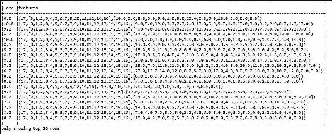

图 11：对每个特征和标签的预测

在*图 11*中，我们展示了行预测与实际标签的对比。第一列是实际标签，第二列表示特征向量，第三列显示基于`TrainValidationSplitModel`创建的特征向量的原始预测。

### 基于逻辑回归的癌症数据集模型选择

在这个子部分中，我们将展示如何对 OCR 数据执行训练验证分割调整。我们将首先使用逻辑回归；然后我们将继续其他模型。最后，我们将为 OCR 数据分类推荐最合适的参数。

**步骤 1：导入必要的包/库/API**

```scala
import org.apache.spark.api.java.JavaRDD; 
import org.apache.spark.api.java.function.Function; 
import org.apache.spark.ml.classification.LogisticRegression; 
import org.apache.spark.ml.evaluation.RegressionEvaluator; 
import org.apache.spark.ml.feature.LabeledPoint; 
import org.apache.spark.ml.linalg.DenseVector; 
import org.apache.spark.ml.linalg.Vector; 
import org.apache.spark.ml.param.ParamMap; 
import org.apache.spark.ml.tuning.ParamGridBuilder; 
import org.apache.spark.ml.tuning.TrainValidationSplit; 
import org.apache.spark.ml.tuning.TrainValidationSplitModel; 
import org.apache.spark.rdd.RDD; 
import org.apache.spark.sql.Dataset; 
import org.apache.spark.sql.Row; 
import org.apache.spark.sql.SparkSession; 

```

**步骤 2：初始化必要的 Spark 环境**

```scala
static SparkSession spark = SparkSession 
  .builder() 
  .appName("CrossValidationforSpamFiltering") 
  .master("local[*]") 
  .config("spark.sql.warehouse.dir", "C:/Exp/"). 
  getOrCreate(); 

```

在这里，我们将应用名称设置为`CancerDiagnosis`，主 URL 设置为`local[*]`，Spark 上下文设置为程序的入口点。请相应地设置这些参数。

**步骤 3：创建 Java RDD**

解析癌症诊断数据并为字符串准备 Java RDD：

```scala
String path = "breastcancer/input/wdbc.data"; 
RDD<String> lines = spark.sparkContext().textFile(path, 3); 

```

**步骤 4：准备癌症诊断 LabeledPoint RDD**

正如在第六章中已经讨论的，癌症诊断数据集包含良性和恶性的两个标签*B*和*M*。但是，我们需要将它们转换为数字标签。只需使用以下代码将它们全部从标签转换为`LabeledPoint` RDDs 准备：

```scala
JavaRDD<LabeledPoint> linesRDD = lines.toJavaRDD().map(new Function<String, LabeledPoint>() { 
      public LabeledPoint call(String lines) { 
      String[] tokens = lines.split(","); 
      double[] features = new double[30]; 
      for (int i = 2; i < features.length; i++) { 
          features[i - 2] =             
                 Double.parseDouble(tokens[i]); 
        } 
           Vector v = new DenseVector(features); 
           if (tokens[1].equals("B")) { 
      return new LabeledPoint(1.0, v); // benign 
    } else { 
    return new LabeledPoint(0.0, v); // malignant 
    } 
      } 
    }); 

```

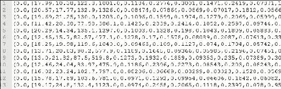

图 12：标签点 RDDs 快照

正如您在*图 9*中所看到的，*前 20 行*，标签 B 和 M 已经转换为 1.0 和 0.0。现在我们需要从标签点 RDDs 创建一个数据框。

**步骤 5：创建数据集并准备训练和测试集**

通过指定标签点类从先前的 RDDs（即`linesRDD`）创建一个数据集：

```scala
Dataset<Row> data = spark.sqlContext().createDataFrame(linesRDD, LabeledPoint.class); 
data.show(); 

```

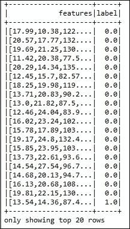

图 13：显示前 20 行的创建的数据集。

```scala
Dataset<Row>[] splits=data.randomSplit(new double[] {0.8, 0.2}); 
Dataset<Row> training = splits[0]; 
Dataset<Row> test = splits[1];
```

请注意，您将不得不根据您的数据和问题类型设置随机拆分的比率。

**步骤 6：使用逻辑回归配置 ML 管道：**

```scala
LogisticRegression lr = new LogisticRegression(); 

```

**步骤 7：构建要搜索的参数网格**

目前，Spark 使用`ParamGridBuilder`来构建要搜索的参数网格。在这方面，假设我们有三个值用于`hashingTF.numFeatures`和两个值用于`lr.regParam`，这个网格将有 3 x 2 = 6 个参数设置供`CrossValidator`选择：

```scala
ParamMap[] paramGrid = new ParamGridBuilder() 
.addGrid(lr.regParam(), new double[] {0.1, 0.01}) 
.addGrid(lr.fitIntercept()) 
.addGrid(lr.elasticNetParam(), new double[] {0.0, 0.5, 1.0}) 
.build();
```

请注意，您将不得不根据您的数据和问题类型设置上述参数的值。

**步骤 8：创建一个 TrainValidationSplit 实例：**

```scala
TrainValidationSplit trainValidationSplit = new TrainValidationSplit() 
.setEstimator(lr) 
.setEvaluator(new RegressionEvaluator()) 
.setEstimatorParamMaps(paramGrid) 
.setTrainRatio(0.8); 

```

在这种情况下，估计器只是我们在*步骤 4*中创建的线性回归。准备癌症诊断`LabeledPoint` RDDs。一个`TrainValidationSplit`需要一个估计器，一组估计器`ParamMaps`，以及一个支持二元分类的评估器，因为我们的数据集只有两个类，其中 80%用于训练，剩下的 20%用于验证。

**步骤 9：运行 TrainValidationSplit 并选择参数**

运行`TrainValidationSplit`，并使用训练集选择问题的最佳参数集。只需使用以下代码段：

```scala
TrainValidationSplitModel model = trainValidationSplit.fit(training); 

```

**步骤 10：对测试集进行预测**

对测试数据进行预测，其中模型是表现最佳的参数组合的模型。最后，显示预测结果。只需使用以下代码段：

```scala
Dataset<Row> per_param = model.transform(test); 
per_param.show(); 

```

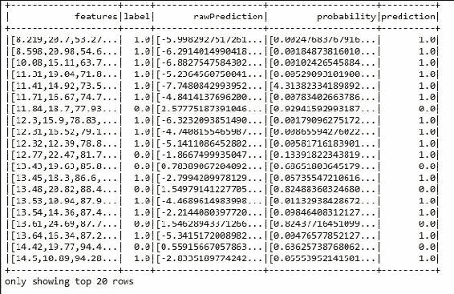

图 14：针对每个特征和标签的预测

因此，如果您将这些结果与*图 6*中显示的结果进行比较，*从数据集中新创建的标签和 ID；其中 ID 是行数*，您会发现预测准确性增加了，用于识别可以优化错误率的更复杂的预测准确性测量方法，这些方法可以根据每种错误的成本来确定可以使用的地方。

# 总结

调整算法或机器学习应用可以被认为是一个简单的过程，通过这个过程，人们优化影响模型的参数，以使算法在运行时间和内存使用方面表现最佳。在本章中，我们展示了如何使用 Spark ML 的训练验证拆分和交叉验证技术来进行 ML 模型调优。

我们还想提到，直到 2016 年 10 月 14 日的当前 Spark 发布日期，调整相关的支持和算法仍然不够丰富。鼓励感兴趣的读者访问 Spark 调整页面[`spark.apache.org/docs/latest/ml-tuning.html`](http://spark.apache.org/docs/latest/ml-tuning.html)以获取更多更新，因为我们相信 Spark 网站将添加更多功能，并且他们肯定会提供足够的文档。

在下一章中，我们将讨论如何使您的机器学习算法或模型适应新的数据集。本章涵盖了高级机器学习技术，以使算法能够适应新数据。它将主要关注批处理/流式架构和使用 Spark 流的在线学习算法。

最终目标是为静态机器学习模型带来活力。读者还将看到机器学习算法如何逐渐学习数据；也就是说，模型在看到新的训练实例时会进行更新。
