# 第八章：调整您的机器学习模型

本章涵盖了高级**机器学习**（**ML**）技术，以便能够使算法适应新数据。读者还将看到机器学习算法如何逐渐学习数据，也就是说，每次看到新的训练实例时，模型都会更新。还将讨论在动态环境中通过让步不同的约束来学习。总之，本章将涵盖以下主题：

+   适应机器学习模型

+   ML 模型的泛化

+   通过增量算法进行适应

+   通过重用 ML 模型进行适应

+   动态环境中的机器学习

# 机器学习模型的适应

正如我们之前讨论的，作为 ML 训练过程的一部分，模型是使用一组数据进行训练的（即训练、测试和验证集）。能够适应其环境并从经验中学习的机器学习模型吸引了来自不同领域的消费者和研究人员，包括计算机科学、工程、数学、物理学、神经科学和认知科学。在本节中，我们将提供如何为新数据和需求采用机器学习模型的技术概述。

## 技术概述

从技术上讲，如果需要，同样的模型可能需要在以后的阶段进行重新训练以改进。这实际上取决于几个因素，例如新数据何时可用，或者 API 的使用者是否有自己的数据来训练模型，或者数据是否需要被过滤并且模型需要用数据子集进行训练。在这些情景中，ML 算法应该提供足够的 API，以便为其消费者提供方便的方式，使他们能够一次或定期地使用客户端，以便他们可以使用自己的数据重新训练模型。

因此，客户将能够评估重新训练和更新 Web 服务 API 的结果。或者，他们将能够使用新训练的模型。在这方面，域自适应有几种不同的情境。但是，它们在考虑应用类型和需求方面有所不同：

+   **无监督域自适应**：学习样本包含一组标记的源示例、一组未标记的源示例和一组未标记的目标示例

+   **半监督域自适应**：在这种情况下，我们还考虑了一小部分标记的目标示例

+   **监督域自适应**：所有考虑的示例都应该被标记：

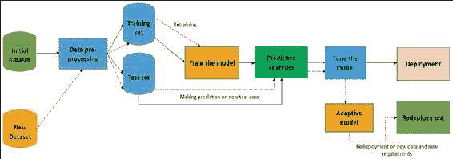

图 1：重新训练过程概述（虚线表示重新训练步骤）

从技术上讲，制作 ML 模型适应的方法应该有三种选择：

+   最广泛使用的机器学习技术和算法包括决策树、决策规则、神经网络、统计分类器和概率图模型，它们都需要进行开发，以便能够适应新的需求

+   其次，先前提到的算法或技术应该被泛化，以便能够以最小的努力使用

+   此外，还需要开发更加健壮的理论框架和算法，如贝叶斯学习理论、经典统计理论、最小描述长度理论和统计力学方法，以便理解计算学习理论

这三种适应性属性和技术的好处将为实验结果提供见解，也将指导机器学习社区为不同的学习算法做出贡献。

# ML 模型的泛化

在第五章中，*通过示例进行监督和无监督学习*，我们讨论了如何以及为什么将学习算法推广到适应半监督学习、主动学习、结构化预测和强化学习。在本节中，我们将讨论如何将线性回归算法推广到光学字符识别（OCR）数据集上，以展示线性回归模型的推广示例。

## 广义线性回归

如在第五章中讨论的，*通过示例进行监督和无监督学习*，线性回归和逻辑回归技术假设输出遵循高斯分布。另一方面，广义线性模型（GLMs）是线性模型的规范，其中响应变量 Yi 遵循来自分布的指数家族的线性分布。

Spark 的`GeneralizedLinearRegression` API 允许我们灵活地指定 GLMs。Spark 中广义线性回归的当前实现可用于多种类型的预测问题，例如线性回归、泊松回归、逻辑回归等。

然而，当前实现的 Spark GLM 算法仅支持指数家族分布的子集。此外，还存在另一个可伸缩性问题，即其`GeneralizedLinearRegression` API 仅支持 4096 个特征。因此，如果特征数量超过 4096，算法将抛出异常。

幸运的是，可以使用 LinearRegression 和 LogisticRegression 估计器训练具有增加特征数量的模型，正如在第六章中的几个示例中所示，*构建可扩展的机器学习管道*。

## 使用 Spark 进行广义线性回归

在本小节中，我们将讨论一个逐步示例，展示如何在我们在第七章中讨论的光学字符识别（OCR）数据的`libsvm`版本上应用广义线性回归。由于这里将重复使用相同的数据集，我们决定不再详细描述它们。

**步骤 1：加载必要的 API 和软件包**

以下是加载必要 API 和软件包的代码：

```scala
import java.util.Arrays; 
import org.apache.spark.ml.regression.GeneralizedLinearRegression; 
import org.apache.spark.ml.regression.GeneralizedLinearRegressionModel; 
import org.apache.spark.ml.regression.GeneralizedLinearRegressionTrainingSummary; 
import org.apache.spark.sql.Dataset; 
import org.apache.spark.sql.Row; 
import org.apache.spark.sql.SparkSession; 

```

**步骤 2：创建 Spark 会话**

以下代码显示了如何创建 Spark 会话：

```scala
SparkSession spark = SparkSession 
    .builder() 
    .appName("JavaGeneralizedLinearRegressionExample") 
    .master("local[*]") 
    .config("spark.sql.warehouse.dir", "E:/Exp/") 
    .getOrCreate();  

```

**步骤 3：加载和创建数据集**

从 OCR 数据集加载和创建数据集。在这里，我们指定了数据集格式为`libsvm`。

```scala
Dataset<Row>dataset = spark.read().format("libsvm").load("input/Letterdata_libsvm.data"); 

```

**步骤 4：准备训练和测试集**

以下代码说明了如何准备训练和测试集：

```scala
double[] weights = {0.8, 0.2}; 
long seed = 12345L; 
Dataset<Row>[] split = dataset.randomSplit(weights, seed); 
Dataset<Row> training = split[0]; 
Dataset<Row> test = split[1]; 

```

**步骤 5：创建广义线性回归估计器**

通过指定家族、链接和最大迭代和回归参数来创建广义线性回归估计器。在这里，我们选择了家族为“高斯”和链接为“身份”：

```scala
GeneralizedLinearRegression glr = new GeneralizedLinearRegression() 
.setFamily("gaussian") 
.setLink("identity") 
.setMaxIter(10) 
.setRegParam(0.3); 

```

请注意，根据 Spark 的 API 文档[`spark.apache.org/docs/latest/ml-classification-regression.html#generalized-linear-regression`](http://spark.apache.org/docs/latest/ml-classification-regression.html#generalized-linear-regression)，此算法实现与 Spark 支持以下选项：

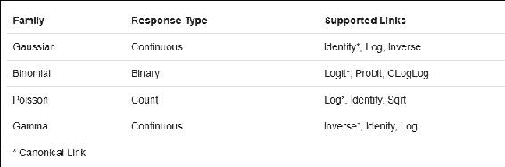

图 2：当前实现的广义线性回归支持的家族

**步骤 6：拟合模型**

以下是拟合模型的代码：

```scala
GeneralizedLinearRegressionModel model = glr.fit(training); 

```

**步骤 7：检查系数和截距**

打印我们在第 6 步创建的线性回归模型的系数和截距：

```scala
System.out.println("Coefficients: " + model.coefficients()); 
System.out.println("Intercept: " + model.intercept()); 

```

这两个参数的输出将类似于以下内容：

```scala
Coefficients: [-0.0022864381796305487,-0.002728958263362158,0.001582003618682323,-0.0027708788253722914,0.0021962329827476565,-0.014769839282003813,0.027752802299957722,0.005757124632688538,0.013869444611365267,-0.010555326094498824,-0.006062727351948948,-0.01618167221020619,0.02894330366681715,-0.006180003317929849,-0.0025768386348180294,0.015161831324693125,0.8125261496082304] 
Intercept: 1.2140016821111255  

```

需要注意的是`System.out.println`方法在集群模式下不起作用。这只在独立模式或伪模式下起作用。这仅用于验证结果。

**步骤 8：总结模型**

总结训练集上的模型并打印出一些指标：

```scala
GeneralizedLinearRegressionTrainingSummary summary = model.summary(); 

```

**步骤 9：验证一些广义指标**

让我们打印一些广义指标，如**系数标准误差**（**CSE**）、T 值、P 值、离散度、零偏差、零残差自由度、AIC 和偏差残差。由于页面限制，我们没有展示这些值的重要性或计算过程：

```scala
System.out.println("Coefficient Standard Errors: " 
      + Arrays.toString(summary.coefficientStandardErrors())); 
System.out.println("T Values: " + Arrays.toString(summary.tValues())); 
System.out.println("P Values: " + Arrays.toString(summary.pValues())); 
System.out.println("Dispersion: " + summary.dispersion()); 
System.out.println("Null Deviance: " + summary.nullDeviance()); 
System.out.println("Residual Degree Of Freedom Null: " + summary.residualDegreeOfFreedomNull()); 
System.out.println("Deviance: " + summary.deviance()); 
System.out.println("Residual Degree Of Freedom: " + summary.residualDegreeOfFreedom()); 
    System.out.println("AIC: " + summary.aic()); 

```

让我们看看我们之前创建的训练集的值：

```scala
Coefficient Standard Errors:[2.877963555951775E-4, 0.0016618949921257992, 9.147115254397696E-4, 0.001633197607413805, 0.0013194682048354774, 0.001427648472211677, 0.0010797461071614422, 0.001092731825368789, 7.922778963434026E-4, 9.413717346009722E-4, 8.746375698587989E-4, 9.768068714323967E-4, 0.0010276211138097238, 0.0011457739746946476, 0.0015025626835648176, 9.048329671989396E-4, 0.0013145697411570455, 0.02274018067510297] 
T Values:[-7.944639100457261, -1.6420762300218703, 1.729510971146599, -1.6965974067032972, 1.6644834446931607, -10.345571455081481, 25.703081600282317, 5.2685613240426585, 17.50578259898057, -11.212707697212734, -6.931702411237277, -16.56588695621814, 28.165345454527458, -5.3937368577226055, -1.714962485760994, 16.756497468951743, 618.0928437414578, 53.385753589911985] 
P Values:[1.9984014443252818E-15, 0.10059394323065063, 0.08373705354670546, 0.0897923347927514, 0.09603552109755675, 0.0, 0.0, 1.3928712139232857E-7, 0.0, 0.0, 4.317657342767234E-12, 0.0, 0.0, 6.999167956323049E-8, 0.08637155105770145, 0.0, 0.0, 0.0] 
Dispersion: 0.07102433332236015  
Null Deviance: 41357.85510971454 
Residual Degree Of Freedom Null: 15949 
Deviance: 1131.5596784918419 
Residual Degree Of Freedom: 15932 
AIC: 3100.6418768238423  

```

**步骤 10：显示偏差残差**

以下代码用于显示偏差残差：

```scala
summary.residuals().show(); 

```

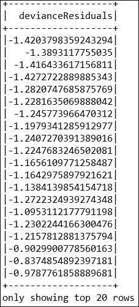

图 3：OCR 数据集的偏差残差总结

### 提示

有兴趣的读者应参考以下网页，以获取有关该算法及其实现细节的更多信息和见解：[`spark.apache.org/docs/latest/ml-classification-regression.html`](http://spark.apache.org/docs/latest/ml-classification-regression.html)

# 通过增量算法进行适应

根据 Robi Polikar 等人的说法（*Learn++: An Incremental Learning Algorithm for Supervised Neural Networks, IEEE Transactions on Systems, Man, And Cybernetics, V-21, No-4, November 2001*），已经提出了各种算法用于增量学习。因此，增量学习被暗示用于解决不同的问题。在一些文献中，增量学习一词被用来指代分类器的生长或修剪。或者，它可能指的是以增量方式选择最具信息量的训练样本来解决问题。

在其他情况下，使常规的 ML 算法增量意味着通过对分类器中的权重进行一定形式的受控修改，通过对错误分类的信号进行重新训练。一些算法能够学习新信息；然而，它们并不同步满足先前提到的所有标准。此外，它们要么需要访问旧数据，要么需要在途中忘记先前的知识，由于它们无法适应新类别，因此对新数据集不具有适应性。

考虑到先前提到的问题，在本节中，我们将讨论如何使用原始算法的增量版本来采用 ML 模型。我们将简要讨论增量 SVM、贝叶斯网络和神经网络。此外，如果适用，我们将提供这些算法的常规 Spark 实现。

## 增量支持向量机

使常规 ML 算法增量是相当困难的。简而言之，这是可能的，但并不十分容易。如果您想要这样做，您必须更改您正在使用的 Spark 库的底层源代码，或者自己实现训练算法。

不幸的是，Spark 没有实现增量版本的 SVM。然而，在使线性 SVM 增量之前，您需要先了解线性 SVM 本身。因此，我们将在下一个子节中使用 Spark 为新数据集提供一些线性 SVM 的概念。

### 提示

据我们所知，我们发现了只有两种可能的解决方案，称为 SVMHeavy ([`people.eng.unimelb.edu.au/shiltona/svm/`](http://people.eng.unimelb.edu.au/shiltona/svm/)) 和 LaSVM ([`leon.bottou.org/projects/lasvm`](http://leon.bottou.org/projects/lasvm))，它们支持增量训练。但我们没有使用任何一种。有兴趣的读者应该阅读这两篇关于增量 SVM 的论文以获取一些见解。这两篇论文都很简单，展示了很好的研究，如果您刚开始学习的话：

[`cbcl.mit.edu/cbcl/publications/ps/cauwenberghs-nips00.pdf`](http://cbcl.mit.edu/cbcl/publications/ps/cauwenberghs-nips00.pdf)。

[`www.jmlr.org/papers/volume7/laskov06a/laskov06a.pdf`](http://www.jmlr.org/papers/volume7/laskov06a/laskov06a.pdf)。

### 使用 Spark 适应新数据的 SVM

在本节中，我们将首先讨论如何使用 Spark 实现的线性 SVM 进行二元分类。然后我们将展示如何将相同的算法应用于新数据类型。

步骤 1：数据收集和探索

我们从[`www.csie.ntu.edu.tw/~cjlin/libsvmtools/datasets/binary.html`](https://www.csie.ntu.edu.tw/~cjlin/libsvmtools/datasets/binary.html)收集了一个结肠癌数据集。最初，数据集的标签为-1.0 和 1.0 如下：

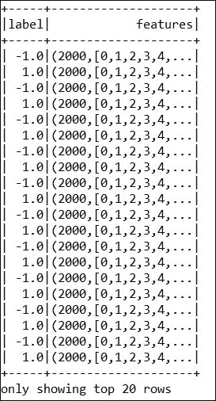

图 4：原始结肠癌数据快照

### 提示

该数据集在以下出版物中使用：*U. Alon, N. Barkai, D. A. Notterman, K. Gish, S.Ybarra, D.Mack, and A. J. Levine. Broad patterns of gene expression revealed by clustering analysis of tumour and normal colon tissues probed by oligonucleotide arrays*. *Cell Biology, 96:6745-6750, 1999*。感兴趣的读者应参考该出版物以获取有关数据集的更多见解。

之后，进行实例归一化以使均值为零，方差为一。然后进行特征归一化以获得零均值和方差为一作为预处理步骤。然而，为简单起见，我们将-1.0 视为 0.1，因为 SVM 不识别符号（即+或-）。因此，数据集现在包含两个标签 1 和 0（即，这是一个二元分类问题）。经过预处理和缩放后，有两个类别和 2000 个特征。以下是数据集的示例*图 5*：

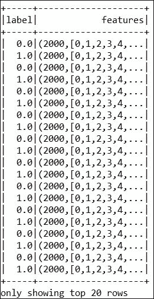

图 5：预处理的结肠癌数据

步骤 2：加载必要的软件包和 API

以下是加载必要软件包的代码：

```scala
import org.apache.spark.api.java.JavaRDD; 
import org.apache.spark.api.java.function.Function; 
import org.apache.spark.mllib.classification.SVMModel; 
import org.apache.spark.mllib.classification.SVMWithSGD; 
import org.apache.spark.mllib.evaluation.BinaryClassificationMetrics; 
import org.apache.spark.mllib.evaluation.MulticlassMetrics; 
import org.apache.spark.mllib.optimization.L1Updater; 
import org.apache.spark.mllib.regression.LabeledPoint; 
import org.apache.spark.mllib.util.MLUtils; 
import org.apache.spark.sql.SparkSession; 

```

步骤 3：配置 Spark 会话

以下代码帮助我们创建 Spark 会话：

```scala
SparkSession spark = SparkSession 
    .builder() 
    .appName("JavaLDAExample") 
    .master("local[*]") 
    .config("spark.sql.warehouse.dir", "E:/Exp/") 
    .getOrCreate(); 

```

步骤 4：从数据中创建数据集

以下是创建数据集的代码：

```scala
String path = "input/colon-cancer.data"; 
JavaRDD<LabeledPoint>data = MLUtils.loadLibSVMFile(spark.sparkContext(), path).toJavaRDD(); 

```

步骤 5：准备训练和测试集

以下是准备训练和测试集的代码：

```scala
    JavaRDD<LabeledPoint>training = data.sample(false, 0.8, 11L); 
training.cache(); 
    JavaRDD<LabeledPoint>test = data.subtract(training); 

```

步骤 6：构建和训练 SVM 模型

以下代码说明了如何构建和训练 SVM 模型：

```scala
intnumIterations = 500; 
final SVMModel model = SVMWithSGD.train(training.rdd(), numIterations); 

```

步骤 7：在测试集上计算原始预测分数

以下是计算原始预测的代码：

```scala
JavaRDD<Tuple2<Object, Object>>scoreAndLabels = test.map( 
newFunction<LabeledPoint, Tuple2<Object, Object>>() { 
public Tuple2<Object, Object> call(LabeledPoint p) { 
          Double score = model.predict(p.features()); 
returnnew Tuple2<Object, Object>(score, p.label()); 
        }}); 

```

步骤 8：评估模型

以下是评估模型的代码：

```scala
BinaryClassificationMetrics metrics = new BinaryClassificationMetrics(JavaRDD.toRDD(scoreAndLabels)); 
System.out.println("Area Under PR = " + metrics.areaUnderPR()); 
System.out.println("Area Under ROC = " + metrics.areaUnderROC()); 
Area Under PR = 0.6266666666666666 
Area Under ROC = 0.875  

```

然而，ROC 的值在 0.5 和 1.0 之间。当值大于 0.8 时，这表明是一个好的分类器，如果 ROC 的值小于 0.8，则表示是一个糟糕的分类器。`SVMWithSGD.train()`方法默认执行二级（L2）正则化，正则化参数设置为 1.0。

如果要配置此算法，应通过直接创建新对象来进一步定制`SVMWithSGD`。之后，可以使用 setter 方法来设置对象的值。

有趣的是，所有其他 Spark MLlib 算法都可以以这种方式定制。然而，在定制完成后，您需要构建源代码以进行 API 级别的更改。有兴趣的读者可以加入 Apache Spark 邮件列表，如果他们想为开源项目做出贡献。

请注意，Spark 的源代码可以在 GitHub 上找到，网址为[`github.com/apache/spark`](https://github.com/apache/spark)，作为开源项目，它发送拉取请求来丰富 Spark。更多技术讨论可以在 Spark 网站上找到，网址为[`spark.apache.org/`](http://spark.apache.org/)。

例如，以下代码生成了一个正则化变体（`L1`）的 SVM，正则化参数设置为 0.1，并且运行训练算法 500 次，如下所示：

```scala
SVMWithSGD svmAlg = new SVMWithSGD(); 
svmAlg.optimizer() 
      .setNumIterations(500) 
      .setRegParam(0.1) 
      .setUpdater(new L1Updater()); 
final SVMModel model = svmAlg.run(training.rdd()); 

```

您的模型现在已经训练好了。现在，如果您执行*步骤 7*和*步骤 8*，将生成以下指标：

```scala
Area Under PR = 0.9380952380952381 
Area Under ROC = 0.95 

```

如果您将这个结果与*步骤 8*中产生的结果进行比较，现在它会好得多，不是吗？然而，根据数据准备的不同，您可能会得到不同的结果。

它指示了更好的分类（请参见[`www.researchgate.net/post/What_is_the_value_of_the_area_under_the_roc_curve_AUC_to_conclude_that_a_classifier_is_excellent`](https://www.researchgate.net/post/What_is_the_value_of_the_area_under_the_roc_curve_AUC_to_conclude_that_a_classifier_is_excellent)）。通过这种方式，支持向量机可以针对新的数据类型进行优化或自适应。

然而，参数（即迭代次数、回归参数和更新器）应该相应地设置。

## 增量神经网络

R 或 Matlab 中的神经网络的增量版本使用 adapt 函数提供了适应性。这种更新是否是迭代地而不是覆盖地进行？为了验证这个说法，读者可以尝试使用 R 或 Matlab 版本的增量神经网络分类器，可能需要选择第一个数据块的子集作为训练中的第二个块。如果是覆盖的，当您使用经过训练的网络与子集一起测试第一个数据块时，它可能会对不属于子集的数据进行糟糕的预测。

### 使用 Spark 进行多层感知器分类

迄今为止，Spark 尚未实现神经网络的增量版本。根据提供在[`spark.apache.org/docs/latest/ml-classification-regression.html#multilayer-perceptron-classifier`](https://spark.apache.org/docs/latest/ml-classification-regression.html#multilayer-perceptron-classifier)的 API 文档，Spark 的**多层感知器分类器**（**MLPC**）是基于**前馈人工神经网络**（**FANN**）的分类器。MLPC 包括多层节点，包括隐藏层。每一层都与下一层等等完全连接在一起。输入层中的节点表示输入数据。所有其他节点通过输入的线性组合与节点的权重*w*和偏差*b*以及应用激活函数将输入映射到输出。输出层中的节点数*N*对应于类的数量。

MLPC 还执行反向传播来学习模型。Spark 使用逻辑损失函数进行优化，**有限内存的 Broyden-Fletcher-Goldfarb-Shanno**（**L-BFGS**）作为优化例程。请注意，L-BFGS 是**拟牛顿法**（**QNM**）家族中的一种优化算法，它使用有限的主内存来近似 Broyden-Fletcher-Goldfarb-Shanno 算法。为了训练多层感知器分类器，需要设置以下参数：

+   层

+   迭代的容限

+   学习的块大小

+   种子大小

+   最大迭代次数

请注意，层包括输入层、隐藏层和输出层。此外，收敛容限的较小值将导致更高的准确性，但需要更多的迭代。默认的块大小参数为 128，最大迭代次数默认设置为 100。我们建议您相应地和谨慎地设置这些值。

在这个小节中，我们将展示 Spark 如何通过 Iris 数据集实现了神经网络学习算法的多层感知器分类器。

**步骤 1：数据集收集、处理和探索**

原始的鸢尾植物数据集是从 UCI 机器学习仓库（[`www.ics.uci.edu/~mlearn/MLRepository.html`](http://www.ics.uci.edu/~mlearn/MLRepository.html)）收集的，然后由 Chang 等人进行了预处理，缩放到 libsvm 格式，并放置在 libsvm 支持向量机的综合库中，网址为（[`www.csie.ntu.edu.tw/~cjlin/libsvmtools/datasets/multiclass.html`](https://www.csie.ntu.edu.tw/~cjlin/libsvmtools/datasets/multiclass.html)）用于二进制、多类别和多标签分类任务。鸢尾花数据集包含三个类别和四个特征，其中萼片和花瓣的长度根据 libsvm 格式进行了缩放。更具体地说，这是属性信息：

+   类别：鸢尾花 Setosa、鸢尾花 Versicolour、鸢尾花 Virginica（第 1 列）

+   厘米的萼片长度（第 2 列）

+   厘米的萼片宽度（第 3 列）

+   厘米的花瓣长度（第 4 列）

+   厘米的花瓣宽度（第 5 列）

数据集的快照显示在*图 6*中：

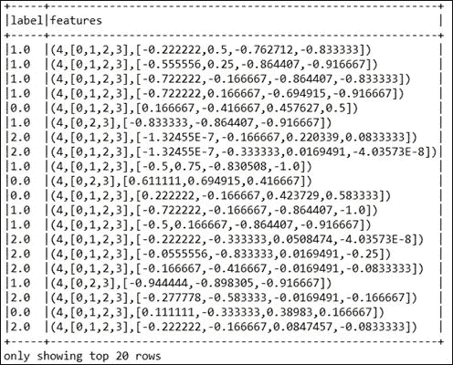

图 6：鸢尾花数据集快照

**步骤 2：加载所需的包和 API**

以下是加载所需包和 API 的代码：

```scala
import org.apache.spark.ml.classification.MultilayerPerceptronClassificationModel; 
import org.apache.spark.ml.classification.MultilayerPerceptronClassifier; 
import org.apache.spark.ml.evaluation.MulticlassClassificationEvaluator; 
import org.apache.spark.sql.Dataset; 
import org.apache.spark.sql.Row; 
import org.apache.spark.sql.SparkSession; 
import com.example.SparkSession.UtilityForSparkSession; 

```

**步骤 3：创建一个 Spark 会话**

以下代码帮助我们创建 Spark 会话：

```scala
SparkSession spark = UtilityForSparkSession.mySession(); 

```

注意，创建并返回 Spark 会话对象的`mySession()`方法如下：

```scala
public static SparkSession mySession() { 
SparkSession spark = SparkSession.builder() 
.appName("MultilayerPerceptronClassificationModel") 
.master("local[*]") 
.config("spark.sql.warehouse.dir", "E:/Exp/") 
.getOrCreate(); 
    return spark; 
  } 

```

**步骤 4：解析和准备数据集**

将输入数据加载为`libsvm`格式：

```scala
String path = "input/iris.data"; 
Dataset<Row> dataFrame = spark.read().format("libsvm").load(path); 

```

**步骤 5：准备训练和测试集**

准备训练和测试集：训练= 70%，测试= 30%，种子= 12345L：

```scala
Dataset<Row>[] splits = dataFrame.randomSplit(new double[] { 0.7, 0.3 }, 12345L); 
Dataset<Row> train = splits[0]; 
Dataset<Row> test = splits[1]; 

```

**步骤 6：为神经网络指定层**

为神经网络指定层。这里，输入层大小为 4（特征），两个中间层（即隐藏层）的大小分别为 4 和 3，输出大小为 3（类别）：

```scala
int[] layers = newint[] { 4, 4, 3, 3 }; 

```

**步骤 7：创建多层感知器估计器**

创建`MultilayerPerceptronClassifier`训练器并设置其参数。在这里，使用*步骤 6*中的`setLayers()`方法设置`param [[layers]]`的值。使用`setTol()`方法设置迭代的收敛容限，因为较小的值会导致更高的准确性，但需要更多的迭代。

注意默认值为`1E-4`。使用`setBlockSize()`方法设置 Param `[[blockSize]]`的值，默认为 128KB。如果未设置权重，可以使用`setInitialWeights()`设置权重初始化的种子。最后，使用`setMaxIter()`方法设置最大迭代次数，默认为 100：

```scala
MultilayerPerceptronClassifier trainer = new MultilayerPerceptronClassifier() 
        .setLayers(layers)        
        .setTol(1E-4)         
        .setBlockSize(128)         
        .setSeed(12345L)  
        .setMaxIter(100); 

```

**步骤 8：训练模型**

使用*步骤 7*中的先前估计器训练`MultilayerPerceptronClassificationModel`：

```scala
MultilayerPerceptronClassificationModel model = trainer.fit(train); 

```

**步骤 9：在测试集上计算准确率**

以下是在测试集上计算准确率的代码：

```scala
Dataset<Row> result = model.transform(test); 
Dataset<Row> predictionAndLabels = result.select("prediction", "label"); 

```

**步骤 10：评估模型**

评估模型，计算指标，并打印准确率、加权精度和加权召回率：

```scala
MulticlassClassificationEvaluator evaluator = new MulticlassClassificationEvaluator().setMetricName("accuracy"); 
MulticlassClassificationEvaluator evaluator2 = new MulticlassClassificationEvaluator().setMetricName("weightedPrecision"); 
MulticlassClassificationEvaluator evaluator3 = new MulticlassClassificationEvaluator().setMetricName("weightedRecall"); 
System.out.println("Accuracy = " + evaluator.evaluate(predictionAndLabels)); 
System.out.println("Precision = " + evaluator2.evaluate(predictionAndLabels)); 
System.out.println("Recall = " + evaluator3.evaluate(predictionAndLabels)); 

```

输出应如下所示：

```scala
Accuracy = 0.9545454545454546  
Precision = 0.9595959595959596 
Recall = 0.9545454545454546  

```

**步骤 11：停止 Spark 会话**

以下代码用于停止 Spark 会话：

```scala
spark.stop(); 

```

从先前的预测指标可以看出，分类任务相当令人印象深刻。现在轮到你使你的模型适应了。现在尝试使用新数据集进行训练和测试，并使你的 ML 模型适应。

## 增量贝叶斯网络

正如我们之前讨论的，朴素贝叶斯是一种简单的多类别分类算法，假设每对特征之间都是独立的。基于朴素贝叶斯的模型可以被训练得非常高效。该模型可以计算每个特征在给定标签的条件概率分布，因为通过对训练数据的传递。之后，它应用贝叶斯定理来计算用于进行预测的标签的条件概率分布。

然而，目前还没有将增量版本的贝叶斯网络实现到 Spark 中。根据提供的 API 文档[`spark.apache.org/docs/latest/mllib-naive-bayes.html`](http://spark.apache.org/docs/latest/mllib-naive-bayes.html)，每个观察结果是一个文档，每个特征代表一个术语。观察结果的值是术语的频率或零或一。这个值表示了术语是否在多项式朴素贝叶斯和伯努利朴素贝叶斯的文档分类中是否被发现。

请注意，与基于线性 SVM 的学习一样，这里的特征值也必须是非负的。模型的类型是通过可选参数选择的，多项式或伯努利。默认模型类型是多项式。此外，可以通过设置参数λ来使用加法平滑（即 lambda）。请注意，默认的 lambda 值为 1.0。

有关基于大数据方法的贝叶斯网络学习的更多技术细节，请参阅论文：*Jianwu W.等人的大数据贝叶斯网络学习的可扩展数据科学工作流方法* ([`users.sdsc.edu/~jianwu/JianwuWang_files/A_Scalable_Data_Science_Workflow_Approach_for_Big_Data_Bayesian_Network_Learning.pdf`](http://users.sdsc.edu/~jianwu/JianwuWang_files/A_Scalable_Data_Science_Workflow_Approach_for_Big_Data_Bayesian_Network_Learning.pdf))。

对于增量贝叶斯网络的更多见解，感兴趣的读者还应参考以下出版物：

+   [`www.jmlr.org/papers/volume11/henderson10a/henderson10a.pdf`](http://www.jmlr.org/papers/volume11/henderson10a/henderson10a.pdf)

+   [`www.machinelearning.org/proceedings/icml2007/papers/351.pdf`](http://www.machinelearning.org/proceedings/icml2007/papers/351.pdf)

+   [`tel.archives-ouvertes.fr/tel-01284332/document`](https://tel.archives-ouvertes.fr/tel-01284332/document)

### 使用 Spark 进行朴素贝叶斯分类

Spark MLlib 中的当前实现支持多项式朴素贝叶斯和伯努利朴素贝叶斯。然而，增量版本尚未实现。因此，在本节中，我们将向您展示如何使用 Spark MLlib 版本的朴素贝叶斯对车辆规模数据集进行分类，以便为您提供基于朴素贝叶斯的学习的一些概念。

请注意，由于使用 Spark ML 的低准确性和精度，我们没有提供 Pipeline 版本，而是仅使用 Spark MLlib 实现了相同的功能。此外，如果您有合适且更好的数据，可以轻松尝试实现 Spark ML 版本。

**步骤 1：数据收集、预处理和探索**

数据集是从[`www.csie.ntu.edu.tw/~cjlin/libsvmtools/datasets/multiclass.html#aloi`](https://www.csie.ntu.edu.tw/~cjlin/libsvmtools/datasets/multiclass.html#aloi)下载的，并由 David D. Lewis，Yiming Yang，Tony G. Rose 和 Fan Li 提供。RCV1：文本分类研究的新基准集。*机器学习研究杂志*，5：361-397，2004 年。

**预处理：** 对于预处理，考虑了两个步骤如下：

+   标签层次结构通过将数据集映射到 RCV1 的第二级（即修订）主题层次结构进行重新组织。具有第三或第四级的文档仅映射到其第二级的父类别。因此，不考虑具有第一级的文档来创建映射。

+   由于 Spark 中多级分类器的当前实现不够健壮，已删除了多标签实例。

完成这两个步骤后，最终收集到 53 个类别和 47,236 个特征。以下是数据集的快照，显示在*图 7*中：

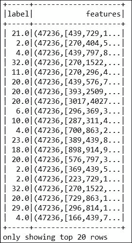

图 7：RCV1 主题层次数据集

**步骤 2：加载所需的库和包**

以下是加载库和包的代码：

```scala
import org.apache.spark.api.java.JavaPairRDD; 
import org.apache.spark.api.java.JavaRDD; 
import org.apache.spark.api.java.function.Function; 
import org.apache.spark.api.java.function.PairFunction; 
import org.apache.spark.mllib.classification.NaiveBayes; 
import org.apache.spark.mllib.classification.NaiveBayesModel; 
import org.apache.spark.mllib.regression.LabeledPoint; 
import org.apache.spark.mllib.util.MLUtils; 
import org.apache.spark.sql.SparkSession; 
importscala.Tuple2; 

```

**步骤 3：初始化 Spark 会话**

以下代码帮助我们创建 Spark 会话：

```scala
static SparkSession spark = SparkSession 
      .builder() 
      .appName("JavaLDAExample").master("local[*]") 
      .config("spark.sql.warehouse.dir", "E:/Exp/") 
      .getOrCreate();  

```

第 4 步：准备 LabeledPoint RDDs

以 libsvm 格式解析数据集并准备`LabeledPoint` RDDs：

```scala
static String path = "input/rcv1_train.multiclass.data"; 
JavaRDD<LabeledPoint> inputData = MLUtils.loadLibSVMFile(spark.sparkContext(), path).toJavaRDD();  

```

对于文档分类，输入特征向量通常是稀疏的，应该提供稀疏向量作为输入以利用稀疏性。由于训练数据只使用一次，因此不需要将其缓存。

第 5 步：准备训练和测试集

以下是准备训练和测试集的代码：

```scala
JavaRDD<LabeledPoint>[] split = inputData.randomSplit(new double[]{0.8, 0.2}, 12345L); 
JavaRDD<LabeledPoint> training = split[0];  
JavaRDD<LabeledPoint> test = split[1]; 

```

第 6 步：训练朴素贝叶斯模型

通过指定模型类型为多项式和 lambda = 1.0 来训练朴素贝叶斯模型，这是默认值，适用于任何特征的多类分类。但是，请注意，伯努利朴素贝叶斯要求特征值为 0 或 1：

```scala
final NaiveBayesModel model = NaiveBayes.train(training.rdd(), 1.0, "multinomial"); 

```

第 7 步：计算测试数据集上的预测

以下是计算预测的代码：

```scala
JavaPairRDD<Double,Double> predictionAndLabel = 
test.mapToPair(new PairFunction<LabeledPoint, Double, Double>() { 
@Override 
public Tuple2<Double, Double> call(LabeledPoint p) { 
return new Tuple2<>(model.predict(p.features()), p.label()); 
          } 
        }); 

```

第 8 步：计算预测准确度

以下是计算预测准确度的代码：

```scala
double accuracy = predictionAndLabel.filter(new Function<Tuple2<Double, Double>, Boolean>() { 
@Override 
public Boolean call(Tuple2<Double, Double>pl) { 
returnpl._1().equals(pl._2()); 
        } 
      }).count() / (double) test.count(); 

```

第 9 步：打印准确度

以下是打印准确度的代码：

```scala
System.out.println("Accuracy of the classification: "+accuracy); 

```

这提供了以下输出：

```scala
Accuracy of the classification: 0.5941753719531497  

```

这很低，对吧？这正如我们在第七章中调整 ML 模型时所讨论的。通过选择适当的算法（即分类器或回归器）进行交叉验证和训练分割，可以进一步提高预测准确度。

# 通过重用 ML 模型进行适应

在本节中，我们将描述如何使机器学习模型适应新数据集。将展示一个用于预测心脏病的示例。首先我们将描述问题陈述，然后我们将探索心脏疾病数据集。在数据集探索之后，我们将训练并保存模型到本地存储。之后将评估模型的表现。最后，我们将重用/重新加载相同的模型，以适用于新的数据类型。

更具体地说，我们将展示如何使用 Spark 机器学习 API，包括 Spark MLlib、Spark ML 和 Spark SQL 来预测未来心脏病的可能性。

## 问题陈述和目标

机器学习和大数据的结合是一个激进的组合，在研究、学术界以及生物医学领域都产生了巨大的影响。在生物医学数据分析领域，这对诊断和预后的真实数据集产生了更好的影响，以实现更好的医疗保健。此外，生命科学研究也正在进入大数据领域，因为数据集以前所未有的方式被生成和产生。这给机器学习和生物信息学工具和算法带来了巨大的挑战，以从大数据标准（如容量、速度、多样性、真实性、可见性和价值）中找到价值。

## 数据探索

近年来，生物医学研究取得了巨大进展，越来越多的生命科学数据集正在生成，其中许多是开放源代码的。然而，为了简单和便利起见，我们决定使用克利夫兰数据库。迄今为止，大多数将机器学习技术应用于生物医学数据分析的研究人员都使用了这个数据集。根据数据集描述，这个心脏病数据集是生物医学数据分析和机器学习领域的研究人员最常使用和研究的数据集之一。

该数据集可以在 UCI 机器学习数据集存储库[`archive.ics.uci.edu/ml/machine-learning-databases/heart-disease/`](https://archive.ics.uci.edu/ml/machine-learning-databases/heart-disease/)免费获取。该数据包含共 76 个属性，但大多数已发表的研究论文只使用了该领域的 14 个特征的子集。"goal"字段用于指代心脏疾病是否存在。它有 5 个可能的值，范围从 0 到 4。值 0 表示没有心脏疾病。而值 1 和 2 表示疾病存在，但处于初期阶段。另一方面，值 3 和 4 表示心脏疾病的强烈可能性。克利夫兰数据集的生物医学实验仅仅试图区分存在（值 1、2、3、4）和不存在（值 0）。简而言之，数值越高，疾病可能性越大，存在的证据也越多。另一件事是，隐私在生物医学数据分析领域以及所有类型的诊断和预后中都是一个重要关注点。因此，最近已从数据集中删除了患者的姓名和社会安全号码，以避免隐私问题。因此，这些值已被替换为虚拟值。 

需要注意的是，已经处理了三个文件，其中包含了克利夫兰、匈牙利和瑞士的数据集。所有四个未处理的文件也存在于此目录中。为了演示示例，我们将使用克利夫兰数据集来训练和评估模型。然而，匈牙利数据集将用于重新使用保存的模型。正如我们已经说过的，尽管属性数量为 76（包括预测属性），但像其他 ML/生物医学研究人员一样，我们也将只使用 14 个属性，具体属性信息如下：

| **编号** | **属性名称** | **解释** |
| --- | --- | --- |
| 1 | age | 年龄（以年为单位） |
| 2 | sex | 男性或女性：性别（1 = 男性；0 = 女性） |
| 3 | cp | 胸痛类型：— 值 1：典型心绞痛— 值 2：非典型心绞痛— 值 3：非心绞痛— 值 4：无症状 |
| 4 | trestbps | 静息血压（入院时以 mm Hg 为单位） |
| 5 | chol | 血清胆固醇（以 mg/dl 为单位） |
| 6 | fbs | 空腹血糖。如果> 120 mg/dl)(1 = 真; 0 = 假) |
| 7 | restecg | 静息心电图结果：— 值 0：正常— 值 1：ST-T 波异常— 值 2：根据 Estes 标准显示可能或明确的左心室肥大。 |
| 8 | thalach | 达到的最大心率 |
| 9 | exang | 运动诱发的心绞痛（1 = 是; 0 = 否） |
| 10 | oldpeak | 相对于休息引起的 ST 段压低 |
| 11 | slope | 峰值运动 ST 段的斜率— 值 1：上斜— 值 2：平坦— 值 3：下斜 |
| 12 | ca | 荧光镜检查染色的主要血管数（0-3） |
| 13 | thal | 心率：—值 3 = 正常；—值 6 = 固定缺陷—值 7 = 可逆缺陷 |
| 14 | num | 心脏疾病诊断（血管造影疾病状态）— 值 0：<50%直径狭窄— 值 1：>50%直径狭窄 |

表 1：数据集特征

数据集的样本快照如下所示：

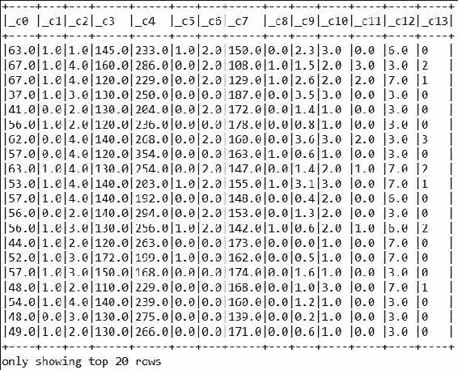

图 8：心脏疾病数据集的样本快照

## 开发心脏疾病预测模型

**步骤 1：加载所需的包和 API**

为了我们的目的，需要导入以下包和 API。我们相信，如果您对 Spark 2.0.0 有最低的工作经验，这些包是不言自明的：

```scala
import java.util.HashMap; 
import java.util.List; 
import org.apache.spark.api.java.JavaPairRDD; 
import org.apache.spark.api.java.JavaRDD; 
import org.apache.spark.api.java.function.Function; 
import org.apache.spark.api.java.function.PairFunction; 
import org.apache.spark.ml.classification.LogisticRegression; 
import org.apache.spark.mllib.classification.LogisticRegressionModel; 
import org.apache.spark.mllib.classification.NaiveBayes; 
import org.apache.spark.mllib.classification.NaiveBayesModel; 
import org.apache.spark.mllib.linalg.DenseVector; 
import org.apache.spark.mllib.linalg.Vector; 
import org.apache.spark.mllib.regression.LabeledPoint; 
import org.apache.spark.mllib.regression.LinearRegressionModel; 
import org.apache.spark.mllib.regression.LinearRegressionWithSGD; 
import org.apache.spark.mllib.tree.DecisionTree; 
import org.apache.spark.mllib.tree.RandomForest; 
import org.apache.spark.mllib.tree.model.DecisionTreeModel; 
import org.apache.spark.mllib.tree.model.RandomForestModel; 
import org.apache.spark.rdd.RDD; 
import org.apache.spark.sql.Dataset; 
import org.apache.spark.sql.Row; 
import org.apache.spark.sql.SparkSession; 
import com.example.SparkSession.UtilityForSparkSession; 
import javassist.bytecode.Descriptor.Iterator; 
import scala.Tuple2; 

```

**步骤 2：创建一个活动的 Spark 会话**

以下代码帮助我们创建 Spark 会话：

```scala
SparkSession spark = UtilityForSparkSession.mySession(); 

```

这是`UtilityForSparkSession`类，它创建并返回一个活动的 Spark 会话：

```scala
import org.apache.spark.sql.SparkSession; 
public class UtilityForSparkSession { 
  public static SparkSession mySession() { 
    SparkSession spark = SparkSession 
                          .builder() 
                          .appName("UtilityForSparkSession") 
                          .master("local[*]") 
                          .config("spark.sql.warehouse.dir", "E:/Exp/") 
                          .getOrCreate(); 
    return spark; 
  } 
} 

```

请注意，在 Windows 7 平台上，我们已将 Spark SQL 仓库设置为`E:/Exp/`，但根据您的操作系统设置您的路径。

**步骤 3：数据解析和标签点的 RDD 创建**

将输入作为简单文本文件，将它们解析为文本文件，并创建一个用于分类和回归分析的标签点的 RDD。还要指定输入源和分区数。根据数据集大小调整分区数。这里分区数已设置为 2：

```scala
String input = "heart_diseases/processed_cleveland.data"; 
Dataset<Row> my_data = spark.read().format("com.databricks.spark.csv").load(input); 
my_data.show(false); 
RDD<String> linesRDD = spark.sparkContext().textFile(input, 2); 

```

由于`JavaRDD`无法直接从文本文件创建，我们已经创建了一个简单的 RDD，以便在必要时将它们转换为`JavaRDD`。现在让我们创建一个带有标签点的`JavaRDD`。但是，我们首先需要将 RDD 转换为`JavaRDD`以满足我们的目的，如下所示：

```scala
JavaRDD<LabeledPoint> data = linesRDD.toJavaRDD().map(new Function<String, LabeledPoint>() { 
      @Override 
  public LabeledPoint call(String row) throws Exception { 
      String line = row.replaceAll("\\?", "999999.0"); 
      String[] tokens = line.split(","); 
      Integer last = Integer.parseInt(tokens[13]); 
      double[] features = new double[13]; 
      for (int i = 0; i < 13; i++) { 
      features[i] = Double.parseDouble(tokens[i]); 
      } 
      Vector v = new DenseVector(features); 
      Double value = 0.0; 
      if (last.intValue() > 0) 
        value = 1.0; 
      LabeledPoint lp = new LabeledPoint(value, v); 
    return lp; 
      } 
    }); 

```

使用`replaceAll()`方法，我们处理了原始文件中指定的缺失值等无效值，使用了*?*字符。为了摆脱缺失或无效值，我们用一个非常大的值替换它们，这对原始分类或预测结果没有副作用。原因是缺失或稀疏数据可能导致高度误导性的结果。

**步骤 4：将标签点的 RDD 分割为训练集和测试集**

在上一步中，我们创建了可以用于回归或分类任务的 RDD 标签点数据。现在我们需要将数据分割为训练集和测试集，如下所示：

```scala
double[] weights = {0.7, 0.3}; 
long split_seed = 12345L; 
JavaRDD<LabeledPoint>[] split = data.randomSplit(weights, split_seed); 
JavaRDD<LabeledPoint> training = split[0]; 
JavaRDD<LabeledPoint> test = split[1]; 

```

如果您查看前面的代码段，您会发现我们已将 RDD 标签点分为 70%的训练集和 30%的测试集。`randomSplit()`方法执行此分割。请注意，我们已将此 RDD 的存储级别设置为在第一次计算后跨操作持久化其值。只有在 RDD 尚未设置存储级别时才能用于分配新的存储级别。拆分种子值是一个长整数，表示拆分将是随机的，但结果不会在模型构建或训练的每次运行或迭代中发生变化。

**步骤 5：训练模型**

首先我们将训练线性回归模型，这是最简单的回归分类器：

```scala
final double stepSize = 0.0000000009; 
final int numberOfIterations = 40;  
LinearRegressionModel model = LinearRegressionWithSGD.train(JavaRDD.toRDD(training), numberOfIterations, stepSize); 

```

如您所见，前面的代码使用随机梯度下降训练了一个没有正则化的线性回归模型。这解决了最小二乘回归公式 f *(weights) = 1/n ||A weights-y||²^*，即均方误差。这里数据矩阵有*n*行，输入 RDD 保存了 A 的一组行，每行都有其相应的右手边标签 y。此外，为了训练模型，它需要训练集、迭代次数和步长。我们在这里为最后两个参数提供了一些随机值。

**步骤 6：将模型保存以备将来使用**

现在让我们保存刚刚创建的模型以备将来使用。很简单 - 只需使用以下代码指定存储位置如下：

```scala
String model_storage_loc = "models/heartModel";   
model.save(spark.sparkContext(), model_storage_loc); 

```

一旦模型保存在您想要的位置，您将在 Eclipse 控制台中看到以下输出：

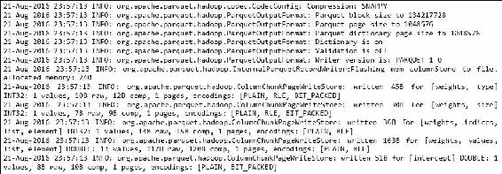

图 9：模型保存到存储后的日志

**步骤 7：使用测试集评估模型**

现在让我们在测试数据集上计算预测分数：

```scala
JavaPairRDD<Double,Double> predictionAndLabel = 
  test.mapToPair(new PairFunction<LabeledPoint, Double, Double>() { 
            @Override 
    public Tuple2<Double, Double> call(LabeledPoint p) { 
       return new Tuple2<>(model.predict(p.features()), p.label()); 
            } 
          });   

```

预测预测的准确性：

```scala
double accuracy = predictionAndLabel.filter(new Function<Tuple2<Double, Double>, Boolean>() { 
          @Override 
          public Boolean call(Tuple2<Double, Double> pl) { 
            return pl._1().equals(pl._2()); 
          } 
        }).count() / (double) test.count(); 
System.out.println("Accuracy of the classification: "+accuracy);   

```

输出如下：

```scala
Accuracy of the classification: 0.0 

```

**步骤 8：使用不同的分类器进行预测分析**

不幸的是，根本没有预测准确性，对吧？可能有几个原因，包括以下原因：

+   数据集特征

+   模型选择

+   参数选择 - 也称为超参数调整

为简单起见，我们假设数据集是可以接受的，因为正如我们已经说过的那样，它是一个广泛使用的数据集，被全球许多研究人员用于机器学习研究。现在，接下来呢？让我们考虑另一个分类器算法，例如随机森林或决策树分类器。随机森林呢？让我们选择随机森林分类器。只需使用以下代码使用训练集训练模型：

```scala
Integer numClasses = 26; //Number of classes 

```

现在使用`HashMap`来限制树构造中的细微差别：

```scala
HashMap<Integer, Integer> categoricalFeaturesInfo = new HashMap<Integer, Integer>(); 

```

现在声明训练随机森林分类器所需的其他参数：

```scala
Integer numTrees = 5; // Use more in practice 
String featureSubsetStrategy = "auto"; // Let algorithm choose the best 
String impurity = "gini"; // info. gain & variance also available 
Integer maxDepth = 20; // set the value of maximum depth accordingly 
Integer maxBins = 40; // set the value of bin accordingly 
Integer seed = 12345; //Setting a long seed value is recommended       
final RandomForestModel model = RandomForest.trainClassifier(training, numClasses,categoricalFeaturesInfo, numTrees, featureSubsetStrategy, impurity, maxDepth, maxBins, seed); 

```

我们认为`trainClassifier()`方法使用的参数是不言自明的，所以我们将让读者了解每个参数的重要性。太棒了！我们已经使用随机森林分类器训练了模型，并管理云端保存了模型以备将来使用。现在，如果您重用我们在*使用测试集评估模型*步骤中描述的相同代码，您应该会得到以下输出：

```scala
Accuracy of the classification: 0.7843137254901961  

```

现在预测准确度应该会好得多。如果您仍然不满意，可以尝试使用另一个分类器模型，比如朴素贝叶斯分类器，并进行第七章中讨论的超参数调整，*调整机器学习模型*。

**步骤 9：使模型适应新数据集**

我们已经提到我们已经保存了模型以备将来使用，现在我们应该抓住机会使用相同的模型来处理新数据集。原因是，如果您回忆一下步骤，我们已经使用训练集训练了模型，并使用测试集进行了评估。现在，如果您有更多数据或新数据可供使用，您会怎么做？您会重新训练模型吗？当然不会，因为您将不得不迭代多个步骤，而且还要牺牲宝贵的时间和成本。

因此，明智的做法是使用已经训练好的模型，并预测在新数据集上的性能。好了，现在让我们重用存储的模型。请注意，您将不得不重用要训练相同模型的模型。例如，如果您使用随机森林分类器进行模型训练并保存了模型，那么在重用时，您将不得不使用相同的分类器模型来加载保存的模型。因此，我们将使用随机森林来加载模型，同时使用新数据集。使用以下代码来实现这一点。现在从新数据集（即具有相同 14 个属性的匈牙利数据库）创建一个 RDD 标签点：

```scala
String new_data = "heart_diseases/processed_hungarian.data"; 
RDD<String> linesRDD = spark.sparkContext().textFile(new_data, 2); 
JavaRDD<LabeledPoint> data = linesRDD.toJavaRDD().map(new Function<String, LabeledPoint>() { 
      @Override 
  public LabeledPoint call(String row) throws Exception { 
  String line = row.replaceAll("\\?", "999999.0"); 
  String[] tokens = line.split(","); 
  Integer last = Integer.parseInt(tokens[13]); 
    double[] features = new double[13]; 
             for (int i = 0; i < 13; i++) { 
          features[i] = Double.parseDouble(tokens[i]); 
                } 
      Vector v = new DenseVector(features); 
      Double value = 0.0; 
      if (last.intValue() > 0) 
        value = 1.0; 
      LabeledPoint p = new LabeledPoint(value, v); 
      return p; 
      } }); 

```

现在让我们使用随机森林模型算法加载保存的模型如下：

```scala
RandomForestModel model2 =  
RandomForestModel.load(spark.sparkContext(), model_storage_loc); 

```

现在让我们计算测试集上的预测：

```scala
JavaPairRDD<Double, Double> predictionAndLabel = 
  data.mapToPair(new PairFunction<LabeledPoint, Double, Double>() { 
          @Override 
          public Tuple2<Double, Double> call(LabeledPoint p) { 
      return new Tuple2<>(model2.predict(p.features()), p.label()); 
            } 
          }); 

```

现在按如下方式计算预测的准确度：

```scala
double accuracy = predictionAndLabel.filter(new Function<Tuple2<Double, Double>, Boolean>() { 
          @Override 
          public Boolean call(Tuple2<Double, Double> pl) { 
            return pl._1().equals(pl._2()); 
          } 
        }).count() / (double) data.count(); 
System.out.println("Accuracy of the classification: "+accuracy);   

```

我们应该得到以下输出：

```scala
Accuracy of the classification: 0.9108910891089109 

```

现在训练朴素贝叶斯分类器并查看预测性能。只需下载朴素贝叶斯分类器的源代码，并使用包含所需 JAR 和 API 依赖项的`pom.xml`文件将代码作为 Maven 友好项目运行。

以下表显示了三个分类器（即线性回归、随机森林和朴素贝叶斯分类器）之间的预测准确性的比较。请注意，根据训练，您得到的模型可能会有不同的输出，因为我们随机将数据集分成训练集和测试集。

| **分类器** | **模型构建时间** | **模型保存时间** | **准确度** |
| --- | --- | --- | --- |
| 线性回归 | 1199 毫秒 | 2563 毫秒 | 0.0% |
| 朴素贝叶斯 | 873 毫秒 | 2514 毫秒 | 45% |
| 随机森林 | 2120 毫秒 | 2538 毫秒 | 91% |

表 2：三个分类器之间的比较

### 注意

我们在一台 Windows 7（64 位）、Core i7（2.90GHz）处理器和 32GB 主内存的机器上获得了上述输出。因此，根据您的操作系统类型和硬件配置，您可能会收到不同的结果。

这样，ML 模型可以适应新的数据类型。但是，请确保您使用相同的分类器或回归器来训练和重用模型，以使 ML 应用程序具有适应性。

# 动态环境中的机器学习

在动态环境中进行预测并不总是能够产生期望的结果，特别是在复杂和非结构化的数据中。

有几个原因。例如，如何从少量数据中推断出真实的结果，或者处理被发现过于繁琐的非结构化和高维数据？此外，使用有效策略对现实环境进行模型修订也是昂贵的。

此外，有时输入数据集的维度很高。因此，数据可能过于密集或非常稀疏。在这种情况下，如何处理非常大的设置以及如何将静态模型应用于新兴应用领域，如机器人技术、图像处理、深度学习、计算机视觉或网络挖掘，是具有挑战性的。另一方面，集成方法越来越受欢迎，用于从现有模型中选择和组合模型，使 ML 模型更具适应性。*图 10*显示了基于分层和动态环境的学习：

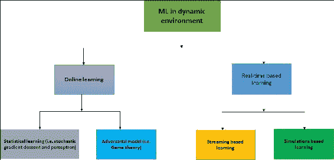

图 10：动态环境中机器学习的层次结构

在这种情况下，诸如神经网络和基于统计的学习等 ML 技术也因其在生物系统等行业和研究中的成功而变得越来越受欢迎。特别是，诸如神经网络、决策树或矢量量化等经典学习算法通常受到纯前馈设置和简单矢量数据的限制，而不是动态环境。矢量化的特征通常提供更好的预测，因为具有丰富的结构。总之，在开发动态环境中的 ML 应用程序时存在三个挑战：

+   数据结构如何在自主环境中形成？

+   我们如何处理统计稀疏和高维的输入数据？更具体地说，如何使用在线算法对大规模数据集进行预测分析，应用降维等？

在只有有限的强化信号、不适当的域或部分未规定的设置下，我们如何在动态环境中开发受控和有效的策略？考虑到这些问题和研究中的有希望的进展，在本节中，我们将通过统计和对抗模型提供一些关于在线学习技术的见解。由于学习动态环境，如流式处理将在第九章中讨论，我们将不在本章讨论基于流式处理的学习。

## 在线学习

批处理学习技术通过一次性学习整个训练数据集生成最佳预测器，通常被称为静态学习。静态学习算法使用训练数据的批次来训练模型，然后使用测试样本和找到的关系进行预测，而在线学习算法则使用初始猜测模型，然后从训练人口中挑选一个观察值，并重新校准每个输入参数的权重。数据通常按顺序作为批次可用。顺序数据用于在每个步骤更新结果的最佳预测器，如*图 11*中所述。在线学习有三种用例：

+   首先，当在整个数据集上训练 ML 模型在计算上是不可行的时，通常使用在线学习

+   其次，它还用于需要算法动态适应数据中新模式的情况

+   第三，当数据本身是随时间生成的函数时，例如股票价格预测

因此，在线学习需要考虑网络约束的算法，即可以执行的算法。存在两种用于在线学习模型的一般建模策略：

+   **统计学习模型**：例如，随机梯度下降和感知器

+   **对抗模型**：例如，垃圾邮件过滤属于这一类别，因为对手将根据垃圾邮件检测器的当前行为动态生成新的垃圾邮件。

虽然在线和增量学习技术相似，但也略有不同。在线学习通常是单次通过（epoch=1）或可以配置的若干次通过，而增量意味着您已经有一个模型。无论模型是如何构建的，新的示例都可以改变模型。此外，通常需要在线和增量的组合。

数据正在以前所未有的方式随处生成。这些庞大的数据对于构建能够处理高容量、高速度和高准确性数据的机器学习工具构成了巨大挑战。简而言之，在线生成的数据也是大数据。因此，我们需要了解学习处理这种高容量和高速度数据的在线学习算法的技术，而这些算法是为了在性能有限的机器上处理数据而设计的。

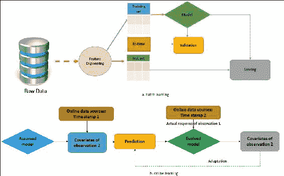

图 11：批处理（静态）与在线学习，概述

## 统计学习模型

如已概述，在基于统计的学习模型中，如随机梯度下降（SGD）和人工神经网络或感知器，数据样本被假定为彼此独立。除此之外，还假定数据集是作为随机变量相同分布的。换句话说，它们不会随时间改变。因此，机器学习算法对数据的访问是有限的。

在统计学习模型领域，有两种被认为是重要的解释：

+   **第一种解释：** 这将随机梯度下降方法视为最小化期望风险的问题。在无限的数据流中，预测分析被假定来自正态分布。因此，只使用随机梯度下降方法来限制偏差。这种解释对有限的训练集也是有效的。

+   **第二种解释：** 这适用于有限的训练集情况，并将 SGD 算法视为增量梯度下降方法的一个实例。在这种情况下，人们会看到经验风险：由于增量梯度下降的梯度，迭代也是对梯度的随机估计，这种解释适用于最小化经验风险而不是期望风险。为什么允许多次通过数据，并且实际上会导致对偏差的更严格的界限。

## 对抗模型

经典机器学习，尤其是在课堂上教授的，强调静态环境，通常使用不变的数据进行预测。因此，与统计或因果推断或动态环境相比，形式上更容易。另一方面，在动态环境中将学习问题视为两个玩家之间的游戏，例如学习者与数据生成器之间的游戏，是对对抗模型的一个例子。这种建模和进行预测分析是非常繁琐的，因为世界并不知道您试图正式对其进行建模。

此外，您的模型对世界没有任何积极或消极的影响。因此，这种模型的最终目标是最小化由其他玩家的举动产生的情况所造成的损失。对手可以根据学习算法的输出在运行时或动态地调整生成的数据。由于对数据没有分布假设，因此在整个可能提前查看的序列中表现良好成为最终目标。此外，遗憾应该在最后一步的假设上最小化。根据 Cathy O.等人的说法（*数学毁灭的武器*，Cathy O'Neil 和 Crown，2016 年 9 月 6 日），对抗性机器学习可以定义如下：

对抗性机器学习是研究在假设这些类型的情况下让步甚至略微更现实的替代方案时会发生什么的正式名称（无害地称为**放松假设**）。

### 提示

在 Spark 2.0.0 发布之前，没有在发布中实现正式算法。因此，我们无法提供任何可以进一步详细解释的具体示例。感兴趣的读者应该查看最新的 Spark 发布以了解更新情况。

# 总结

在本章中，我们试图涵盖一些高级机器学习技术，使机器学习模型和应用程序能够适应新的问题和数据类型。

我们展示了几个机器学习算法的例子，这些算法通过批处理或静态学习来学习模型数据，每次看到新的训练实例时都会更新模型。

我们还讨论了如何通过泛化、增量学习、模型重用和动态环境使模型具有适应性。

在第九章中，*流式和图数据的高级机器学习*，我们将指导您如何使用 Spark MLlib 和 Spark ML 在流式和图数据上应用机器学习技术，例如主题建模。
