# 第九章：流式和图形数据的高级机器学习

本章将指导读者如何借助 Spark MLlib、Spark ML 和 Spark Streaming 应用机器学习技术到流式和图形数据，使用 GraphX。例如，从 Twitter 的实时推文数据中进行主题建模。读者将能够使用现有的 API 从 Twitter 等流数据源构建实时和预测性应用程序。通过 Twitter 数据分析，我们将展示如何进行大规模社交情感分析。我们还将展示如何使用 Spark MLlib 开发大规模电影推荐系统，这是社交网络分析的一个隐含部分。简而言之，本章将涵盖以下主题：

+   开发实时 ML 管道

+   时间序列和社交网络分析

+   使用 Spark 进行电影推荐

+   从流式数据开发实时 ML 管道

+   图形数据和半监督图形学习上的 ML 管道

然而，要成为一个有效和新兴的机器学习应用程序，实际上需要持续流动的标记数据。因此，对大规模非结构化数据进行预处理和准确标记数据本质上引入了许多不必要的延迟。

如今，我们经常听到和阅读关于实时机器学习的内容。人们通常在讨论从社交网络服务（SNS）、信用卡欺诈检测系统或从面向业务的交易数据中挖掘与客户相关的购买规则时，提供这种吸引人的业务场景。

根据许多机器学习专家的说法，实时不断地更新信用卡欺诈检测模型是可能的。这很棒，但对我来说并不现实，有几个原因。首先，确保这种数据的持续流动对于模型的重新训练并不是必要的。其次，在大多数机器学习系统中，创建标记数据可能是最慢、最昂贵的步骤。

# 开发实时 ML 管道

为了开发实时机器学习应用程序，我们需要持续获取数据。这些数据可能包括交易数据、简单文本、来自 Twitter 的推文、来自 Flume 或 Kafka 的消息或流式数据等，因为这些数据大多是非结构化的。

要部署这些类型的机器学习应用程序，我们需要经历一系列步骤。为我们的目的服务的数据最不可靠的来源是来自多个来源的实时数据。通常网络是性能瓶颈。

例如，并不保证您总是能够从 Twitter 收到大量推文。此外，即时对这些数据进行标记以构建一个 ML 模型并不是一个现实的想法。尽管如此，我们在这里提供了一个关于如何从实时流数据中开发和部署 ML 管道的真实见解。*图 1*显示了实时 ML 应用程序开发的工作流程。

## 流式数据收集作为非结构化文本数据

我们在这里要强调的是，实时流数据收集取决于：

+   数据收集的目的。如果目的是开发在线信用卡欺诈检测系统，那么数据应该通过网络 API 从您自己的网络中收集。如果目的是收集社交媒体情感分析，那么数据可以从 Twitter、LinkedIn、Facebook 或报纸网站收集，如果目的是网络异常检测，数据可以从网络数据中收集。

+   数据可用性是一个问题，因为并非所有社交媒体平台都提供公共 API 来收集数据。网络条件很重要，因为流数据量很大，需要非常快的网络连接。

+   存储能力是一个重要考虑因素，因为几分钟的推文数据集合可能会产生数 GB 的数据。

此外，我们应该至少等待几天，然后将交易标记为*欺诈*或*非欺诈*。相反，如果有人报告了欺诈交易，我们可以立即将该交易标记为*欺诈*以简化操作。

### 标记数据以进行监督式机器学习

标记的数据集在整个过程中起着核心作用。它确保很容易改变算法的参数，比如特征归一化或损失函数。在这种情况下，我们可以从逻辑回归、**支持向量机**（**SVM**）或随机森林等多种算法中选择算法本身。

然而，我们不能改变标记的数据集，因为这些信息是预定义的，你的模型应该预测你已经拥有的标签。在之前的章节中，我们已经表明标记结构化数据需要相当长的时间。

现在想想我们将从流媒体或实时来源接收到的完全非结构化的流数据。在这种情况下，标记数据将需要相当长的时间。然而，我们还必须进行预处理，如标记化、清理、索引、去除停用词和去除非结构化数据中的特殊字符。

现在，基本上会有一个问题，*数据标记过程需要多长时间？*关于标记的数据集的最后一件事是，我们应该明白，如果我们不仔细进行标记，标记的数据集有时可能会存在偏见，这可能会导致模型性能出现很多问题。

#### 创建和构建模型

用于训练情感分析、信用卡欺诈检测模型和关联规则挖掘模型，我们需要尽可能准确的交易数据示例。一旦我们有了标记的数据集，我们就可以开始训练和构建模型：

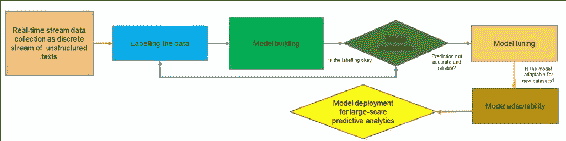

图 1：实时机器学习工作流程。

在第七章中，*调整机器学习模型*，我们讨论了如何选择适当的模型和 ML 算法，以产生更好的预测分析。该模型可以呈现为具有多个类的二进制或多类分类器。或者，使用 LDA 模型进行情感分析，使用主题建模概念。简而言之，*图 1*展示了实时机器学习工作流程。

### 实时预测分析

当您的 ML 模型经过适当的训练和构建后，您的模型已经准备好进行实时预测分析。如果您从模型中得到一个好的预测，那将是很棒的。然而，正如我们之前提到的，当讨论一些准确性问题时，例如真正的阳性和假阳性，如果假阳性的数量很高，那意味着模型的性能不尽人意。

这基本上意味着三件事：我们没有正确标记流数据集，在这种情况下迭代第二步（标记*图 1*中的数据），或者没有选择适当的 ML 算法来训练模型，最后我们没有调整最终能帮助我们找到适当超参数或模型选择；在这种情况下，直接进入第七步（*图 1*中的模型部署）。

### 调整 ML 模型以改进和模型评估

如在第四步（*图 1*中的模型评估）中提到的，如果模型的性能不令人满意或令人信服，那么我们需要调整模型。正如在第七章中讨论的，我们学习了如何选择适当的模型和 ML 算法，以产生更好的预测分析。有几种调整模型性能的技术，我们可以根据需求和情况选择其中的一种。当我们完成调整后，最后我们应该进行模型评估。

### 模型的适应性和部署

当我们拥有调整和找到最佳模型时，机器学习模型必须准备好在每次看到新的训练实例时逐渐学习新的数据类型。当我们的模型准备好为大规模流数据进行准确可靠的预测时，我们可以将其部署到现实生活中。

# 时间序列和社交网络分析

在本节中，我们将尝试提供一些见解和挑战，以处理和开发来自时间序列和社交网络数据的大规模 ML 管道。

## 时间序列分析

时间序列数据通常出现在监控工业过程或跟踪企业业务指标的情况下。通过时间序列方法对数据进行建模的一个基本区别是，时间序列分析考虑到随时间采集的数据点可能具有内部结构。

这可能包括应该考虑的自相关、趋势或季节性变化。在这方面，回归分析主要用于测试理论。目标是测试以确保一个或多个独立时间序列参数的当前值与其他时间序列数据的当前属性相关联。

为了开发大规模的预测分析应用程序，时间序列分析技术可以应用于实值、分类变量、连续数据、离散数值数据，甚至离散符号数据。时间序列是一系列浮点值，每个值都与时间戳相关联。特别是，我们尽可能坚持*时间序列*的含义是指单变量时间序列，尽管在其他情境中，它有时指的是在同一时间戳上的多个值的系列。

时间序列数据中的一个瞬时是与单个时间点对应的一系列时间序列中的值向量。一个观察是一个元组（时间戳、键、值），即时间序列或瞬时中的单个值。简而言之，时间序列主要具有四个特征：

+   **带有趋势的系列**：由于观察结果随时间增加或减少，尽管趋势是持久的并且具有长期运动。

+   **带有季节性的系列数据**：由于观察结果保持高位然后下降，并且一些模式从一个周期重复到下一个周期，并且包含定期的周期性波动，比如在 12 个月的周期内。

+   **带有循环成分的系列数据**：由于业务模型定期变化，即，商业中的衰退有时是循环的。它还可能包含超过一年的重复波动或运动。

+   **随机变化**：给时间序列图表带来不规则或锯齿状外观的不可预测的组成部分。它还包含不规则或残余的波动。

由于这些具有挑战性的特征，为了实际目的开发实际的机器学习应用变得非常困难。因此，到目前为止，只有一个用于时间序列数据分析的软件包可用，由 Cloudera 开发；它被称为 Spark-TS 库。这里每个时间序列通常都带有一个键，可以在一系列时间序列中识别它。

然而，Spark 的当前实现没有为时间序列数据分析提供任何实现的算法。然而，由于这是一个新兴和热门的话题，希望在未来的版本中至少会有一些算法在 Spark 中实现。在第十章中，*配置和使用外部库*，我们将更深入地介绍如何使用这些类型的第三方包与 Spark。

## 社交网络分析

社交网络由**节点**（点）和相关**链接**组成，其中节点、链接或边缘是可识别的分析类别。这些节点可能包括有关人、群体和组织的信息。通常，这些信息通常是任何类型的社交实验和分析的主要重点和关注点。这种分析中的链接侧重于以集体方式包括社交联系和可交换信息，以扩大社交互动，例如 Facebook、LinkedIn、Twitter 等。因此，很明显，嵌入在更大社交过程、链接和节点网络中的组织会影响其他人。

另一方面，根据 Otte E.et al.（*社交网络分析：信息科学的强大策略，也用于信息科学*，信息科学杂志，28：441-453），**社交网络分析**（**SNA**）是研究发现连接的人或群体之间关系的映射和测量。它还用于找到人、群体、组织和信息处理实体之间的流动。

适当的 SNA 分析可用于显示三种最流行的个体中心性度量之间的区别：度中心性、中介中心性和亲近中心性。**度中心性**表示节点具有多少链接或事件，或者节点有多少联系。

**中介中心性**是图中顶点的中心性度量。这也考虑了中介边缘。此外，中介中心性表示节点作为桥梁的次数，通过考虑其他节点之间的最短路径。

另一方面，节点的**亲近中心性**是连接图中特定节点与所有其他节点之间最短路径的平均长度，例如社交网络。

### 提示

建议感兴趣的读者阅读更多关于特征向量中心性、Katz 中心性、PageRank 中心性、渗流中心性、交叉团中心性和 alpha 中心性，以便正确理解统计和社交网络中心性。

社交网络通常表示为连接的图（有向或无向）。因此，它还涉及图数据分析，其中人们充当节点，而连接或链接充当边缘。此外，从社交网络收集和分析大规模数据，然后开发预测性和描述性分析应用程序，例如 Facebook、Twitter 和 LinkedIn，也涉及社交网络数据分析，包括：链接预测，如预测关系或友谊，社交网络中的社区确定，如图上的聚类，以及确定网络中的意见领袖，如果在图数据上进行了适当的结构，则本质上是一个 PageRank 问题。

Spark 有专门用于图分析的 API，称为 GraphX。例如，可以使用此 API 搜索垃圾邮件，对搜索结果进行排名，在社交网络中确定社区，或搜索意见领袖，这并不是分析图形的应用方法的完整列表。我们将在本章后面更详细地讨论如何使用 GraphX。

# 使用 Spark 进行电影推荐

基于模型的协同过滤通常被许多公司使用，比如 Netflix，作为实时电影推荐的推荐系统。在本节中，我们将看到一个完整的示例，说明它是如何为新用户推荐电影的。

## 使用 Spark MLlib 进行基于模型的电影推荐

Spark MLlib 中的实现支持基于模型的协同过滤。在基于模型的协同过滤技术中，用户和产品由一小组因子描述，也称为**潜在因子**（**LFs**）。然后使用这些 LFs 来预测缺失的条目。Spark API 提供了**交替最小二乘**（也被广泛称为**ALS**）算法的实现，用于通过考虑六个参数来学习这些潜在因子，包括：

+   `numBlocks`

+   `rank`

+   `iterations`

+   `lambda`

+   `implicitPrefs`

+   `alpha`

要了解更多关于这些参数的信息，请参考第五章中的推荐系统部分，*通过示例进行监督和无监督学习*。请注意，要使用默认参数构建 ALS 实例，可以根据您的需求设置值。默认值如下：`numBlocks`：-1，`rank`：10，`iterations`：10，`lambda`：0.01，`implicitPrefs`：false，`alpha`：1.0。

简而言之，构建 ALS 实例的方法如下：

+   首先，ALS 是一个迭代算法，用于将评分矩阵建模为低排名用户和产品因子的乘积

+   之后，通过最小化观察到的评分的重建误差，使用这些因子进行学习任务。

然而，未知的评分可以通过将这些因子相乘来逐步计算。

基于 Spark MLlib 中使用的协同过滤技术进行电影推荐或其他推荐的方法已被证明具有高预测准确性，并且在像 Netflix 这样的公司使用的商品集群上可扩展到数十亿的评分。通过遵循这种方法，Netflix 这样的公司可以根据预测的评分向其订阅者推荐电影。最终目标是增加销售，当然也是客户满意度。

### 数据探索

电影及其对应的评分数据集是从 MovieLens 网站([`movielens.org`](https://movielens.org/movies/1))下载的。根据 MovieLens 网站上的数据描述，所有评分都在`ratings.csv`文件中描述。该文件的每一行（包括标题）代表一个用户对一部电影的评分。

CSV 数据集包含以下列：`userId`，`movieId`，`rating`和`timestamp`，如*图 2*所示。行首先按`userId`在用户内部排序，然后按`movieId`排序。评分采用五星制，可以增加 0.5 星（0.5 星至 5.0 星）。时间戳表示自 1970 年 1 月 1 日**协调世界时**（**UTC**）午夜以来的秒数，我们有 105,339 个评分，来自 668 个用户对 10,325 部电影进行评分：

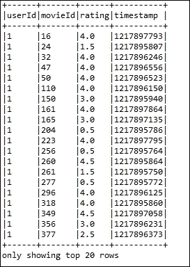

图 2：前 20 部电影的样本评分。

另一方面，电影信息包含在`movies.csv`文件中。除了标题信息之外，每一行代表一个电影，包含列：`movieId`，`title`和`genres`。

电影标题可以手动创建、插入，或者从[`www.themoviedb.org/`](https://www.themoviedb.org/)电影数据库网站导入。然而，发行年份显示在括号中。

由于电影标题是手动插入的，因此这些标题可能存在错误或不一致。因此，建议读者检查 IMDb 数据库（[`www.ibdb.com/`](http://www.ibdb.com/)）以确保没有不一致或不正确的标题及其对应的发行年份。

类型是一个分隔的列表，从以下类型类别中选择：

+   动作，冒险，动画，儿童，喜剧，犯罪

+   纪录片，戏剧，奇幻，黑色电影，恐怖，音乐

+   神秘，浪漫，科幻，惊悚，西部，战争

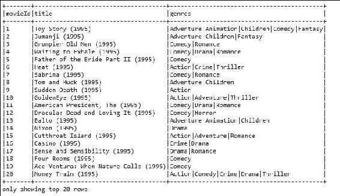

图 3：前 20 部电影的标题和类型。

### 使用 Spark MLlib 进行电影推荐

在本小节中，我们将通过逐步示例从数据收集到电影推荐来向您展示如何为其他用户推荐电影。从 Packt 的补充文件中下载`movies.csv`和`ratings.csv`文件，并将它们放在您的项目目录中。

**步骤 1：配置您的 Spark 环境**

以下是配置您的 Spark 环境的代码：

```scala
static SparkSession spark = SparkSession 
      .builder() 
      .appName("JavaLDAExample") 
         .master("local[*]") 
         .config("spark.sql.warehouse.dir", "E:/Exp/"). 
          getOrCreate(); 

```

**步骤 2：加载、解析和探索电影和评分数据集**

以下是代码示例：

```scala
String ratigsFile = "input/ratings.csv"; 
Dataset<Row> df1 = spark.read().format("com.databricks.spark.csv").option("header", "true").load(ratigsFile);     
Dataset<Row> ratingsDF = df1.select(df1.col("userId"), df1.col("movieId"), df1.col("rating"),  df1.col("timestamp")); 
ratingsDF.show(false); 

```

这段代码应该返回与*图 2*中相同的评分`Dataset<Row>`。另一方面，以下代码段显示了与*图 3*中相同的电影`Dataset<Row>`：

```scala
String moviesFile = "input/movies.csv"; 
Dataset<Row> df2 = spark.read().format("com.databricks.spark.csv").option("header", "true").load(moviesFile); 
Dataset<Row> moviesDF = df2.select(df2.col("movieId"), df2.col("title"), df2.col("genres"));  
moviesDF.show(false); 

```

**步骤 3：将两个数据集都注册为临时表**

要注册这两个数据集，我们可以使用以下代码：

```scala
ratingsDF.createOrReplaceTempView("ratings"); 
moviesDF.createOrReplaceTempView("movies"); 

```

这将通过在内存中创建一个临时视图作为表来加快内存查询的速度。使用`createOrReplaceTempView()`方法创建的临时表的生命周期与用于创建此数据集的`[[SparkSession]]`相关联。

**步骤 4：探索和查询相关统计数据**

让我们来检查与评分相关的统计数据。只需使用以下代码行：

```scala
long numRatings = ratingsDF.count(); 
long numUsers = ratingsDF.select(ratingsDF.col("userId")).distinct().count(); 
long numMovies = ratingsDF.select(ratingsDF.col("movieId")).distinct().count(); 
System.out.println("Got " + numRatings + " ratings from " + numUsers + " users on " + numMovies + " movies."); 

```

您应该发现来自 668 个用户对 10,325 部电影的 105,339 个评分。现在，让我们获取最高和最低评分以及对电影进行评分的用户数量。

但是，您需要在上一步中刚刚在内存中创建的评分表上执行 SQL 查询。在这里进行查询很简单，类似于从 MySQL 数据库或 RDBMS 进行查询。

但是，如果您不熟悉基于 SQL 的查询，建议您查看 SQL 查询规范，以了解如何使用`SELECT`从特定表中进行选择，如何使用`ORDER`进行排序，以及如何使用`JOIN`关键字进行连接操作。

如果您了解 SQL 查询，您应该通过使用以下复杂的 SQL 查询得到一个新的数据集：

```scala
Dataset<Row> results = spark.sql("select movies.title, movierates.maxr, movierates.minr, movierates.cntu " + "from(SELECT ratings.movieId,max(ratings.rating) as maxr,"  + "min(ratings.rating) as minr,count(distinct userId) as cntu "  + "FROM ratings group by ratings.movieId) movierates " + "join movies on movierates.movieId=movies.movieId " + "order by movierates.cntu desc"); 
results.show(false); 

```

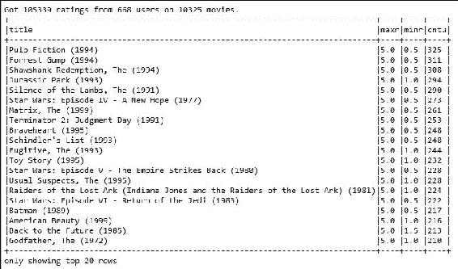

图 4：最高和最低评分以及对电影进行评分的用户数量。

为了更深入地了解，我们需要了解更多关于用户及其评分的信息。现在让我们找出最活跃的用户以及他们对电影进行评分的次数：

```scala
Dataset<Row> mostActiveUsersSchemaRDD = spark.sql("SELECT ratings.userId, count(*) as ct from ratings " + "group by ratings.userId order by ct desc limit 10"); 
mostActiveUsersSchemaRDD.show(false); 

```

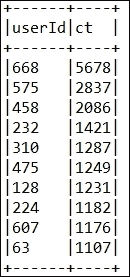

图 5：单个用户提供的评分数量。

现在让我们看看特定用户，并找出比如说用户 668 给出了高于 4 分的电影：

```scala
Dataset<Row> results2 = spark.sql("SELECT ratings.userId, ratings.movieId," + "ratings.rating, movies.title FROM ratings JOIN movies "+ "ON movies.movieId=ratings.movieId " + "where ratings.userId=668 and ratings.rating > 4"); 
results2.show(false); 

```

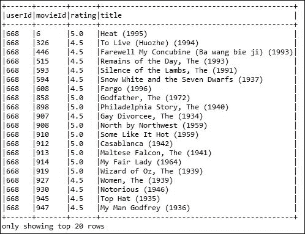

图 6：用户 668 的相关评分。

**步骤 5：准备训练和测试评分数据并查看计数**

以下是代码示例：

```scala
Dataset<Row> [] splits = ratingsDF.randomSplit(new double[] { 0.8, 0.2 }); 
Dataset<Row> trainingData = splits[0]; 
Dataset<Row> testData = splits[1]; 
long numTraining = trainingData.count(); 
long numTest = testData.count(); 
System.out.println("Training: " + numTraining + " test: " + numTest); 

```

您应该发现在训练集中有 84,011 个评分，在测试集中有 21,328 个评分。

**步骤 6：准备数据以构建使用 ALS 的推荐模型**

以下代码示例用于构建使用 API 的推荐模型：

```scala
JavaRDD<Rating> ratingsRDD = trainingData.toJavaRDD().map(new Function<Row, Rating>() { 
      @Override 
      public Rating call(Row r) throws Exception { 
        // TODO Auto-generated method stub 
        int userId = Integer.parseInt(r.getString(0)); 
        int movieId = Integer.parseInt(r.getString(1)); 
        double ratings = Double.parseDouble(r.getString(2)); 
        return new Rating(userId, movieId, ratings); 
      } 
    }); 

```

`ratingsRDD` RDD 将包含来自我们在上一步准备的训练数据集的`userId`、`movieId`和相应的评分。另一方面，以下`testRDD`也包含来自我们在上一步准备的测试数据集的相同信息：

```scala
JavaRDD<Rating> testRDD = testData.toJavaRDD().map(new Function<Row, Rating>() { 
      @Override 
      public Rating call(Row r) throws Exception { 
        int userId = Integer.parseInt(r.getString(0)); 
        int movieId = Integer.parseInt(r.getString(1)); 
        double ratings = Double.parseDouble(r.getString(2)); 
        return new Rating(userId, movieId, ratings); 
      } 
    }); 

```

**步骤 7：构建 ALS 用户产品矩阵**

基于`ratingsRDD`构建一个 ALS 用户矩阵模型，指定 rank、iterations 和 lambda：

```scala
int rank = 20; 
int numIterations = 10; 
double lambda = 0.01; 
MatrixFactorizationModel model = ALS.train(JavaRDD.toRDD(ratingsRDD), rank, numIterations, 0.01); 

```

+   请注意，我们已随机选择了 rank 的值为`20`，并且已对模型进行了 10 次学习迭代，lambda 为`0.01`。通过这个设置，我们得到了良好的预测准确性。建议读者应用超参数调整来了解这些参数的最佳值。

+   然而，建议读者根据其数据集更改这两个参数的值。此外，如前所述，他们还可以使用和指定其他参数，如`numberblock`、`implicitPrefs`和`alpha`，如果预测性能不理想。此外，将用户块和产品块的块数设置为`pass -1`，以将计算并行化为自动配置的块数。该值为`-1`。

**第 8 步：进行预测**

让我们为用户 668 获取前六部电影的预测：

```scala
System.out.println("Rating:(UserID, MovieId, Rating)"); 
Rating[] topRecsForUser = model.recommendProducts(668, 6); 
for (Rating rating : topRecsForUser) 
System.out.println(rating.toString()); 

```

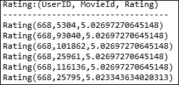

图 7：用户 668 评分最高的六部电影。

第 9 步：获取预测评分以与测试评分进行比较

以下是所示的代码：

```scala
JavaRDD<Tuple2<Object, Object>> testUserProductRDD = testData.toJavaRDD() 
        .map(new Function<Row, Tuple2<Object, Object>>() { 
          @Override 
          public Tuple2<Object, Object> call(Row r) throws Exception { 

            int userId = Integer.parseInt(r.getString(0)); 
            int movieId = Integer.parseInt(r.getString(1)); 
            double ratings = Double.parseDouble(r.getString(2)); 
            return new Tuple2<Object, Object>(userId, movieId); 
          } 
        }); 
JavaRDD<Rating> predictionsForTestRDD = model.predict(JavaRDD.toRDD(testUserProductRDD)).toJavaRDD(); 

```

现在让我们检查 10 个用户的前 10 个预测：

```scala
System.out.println(predictionsForTestRDD.take(10).toString()); 

```

第 10 步：准备预测

在这里，我们将以两个步骤准备与 RDD 相关的预测。第一步包括从`predictionsForTestRDD` RDD 结构中准备比较的预测。步骤如下：

```scala
JavaPairRDD<Tuple2<Integer, Integer>, Double> predictionsKeyedByUserProductRDD = JavaPairRDD.fromJavaRDD( 
        predictionsForTestRDD.map(new Function<Rating, Tuple2<Tuple2<Integer, Integer>, Double>>() { 
          @Override 
          public Tuple2<Tuple2<Integer, Integer>, Double> call(Rating r) throws Exception { 
            return new Tuple2<Tuple2<Integer, Integer>, Double>( 
                new Tuple2<Integer, Integer>(r.user(), r.product()), r.rating()); 
          } 
        })); 

```

第二步包括准备测试以进行比较：

```scala
JavaPairRDD<Tuple2<Integer, Integer>, Double> testKeyedByUserProductRDD = JavaPairRDD  .fromJavaRDD(testRDD.map(new Function<Rating, Tuple2<Tuple2<Integer, Integer>, Double>>() { 
          @Override 
          public Tuple2<Tuple2<Integer, Integer>, Double> call(Rating r) throws Exception { 
            return new Tuple2<Tuple2<Integer, Integer>, Double>( 
                new Tuple2<Integer, Integer>(r.user(), r.product()), r.rating()); 
          } 
        })); 

```

第 11 步：将测试与预测结合起来，看看综合评分

将`testKeyedByUserProductRDD`和`predictionsKeyedByUserProductRDD` RDD 连接起来，以获取每个用户和`movieId`的组合测试以及预测评分：

```scala
JavaPairRDD<Tuple2<Integer, Integer>, Tuple2<Double, Double>> testAndPredictionsJoinedRDD = testKeyedByUserProductRDD 
        .join(predictionsKeyedByUserProductRDD); 
System.out.println("(UserID, MovieId) => (Test rating, Predicted rating)"); 
System.out.println("----------------------------------"); 
for (Tuple2<Tuple2<Integer, Integer>, Tuple2<Double, Double>> t : testAndPredictionsJoinedRDD.take(6)) { 
      Tuple2<Integer, Integer> userProduct = t._1; 
      Tuple2<Double, Double> testAndPredictedRating = t._2; 
      System.out.println("(" + userProduct._1() + "," + userProduct._2() + ") => (" + testAndPredictedRating._1() 
          + "," + testAndPredictedRating._2() + ")"); 
    } 

```

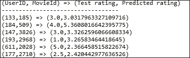

图 8：组合测试以及对每个用户和电影 ID 的预测评分。

**第 12 步：评估模型对预测性能的表现**

通过检查真正的正面预测和假阳性的数量来检查 ALS 模型的性能：

```scala
JavaPairRDD<Tuple2<Integer, Integer>, Tuple2<Double, Double>> truePositives = testAndPredictionsJoinedRDD 
        .filter(new Function<Tuple2<Tuple2<Integer, Integer>, Tuple2<Double, Double>>, Boolean>() { 
          @Override 
          public Boolean call(Tuple2<Tuple2<Integer, Integer>, Tuple2<Double, Double>> r) throws Exception { 
            return (r._2._1() <= 1 && r._2._2() < 5); 
          } 
        }); 

```

现在打印真正的正面预测数量。我们认为当预测评分低于最高评分（即`5`）时，预测是真正的预测。因此，如果预测评分大于或等于`5`，则将该预测视为假阳性：

```scala
for (Tuple2<Tuple2<Integer, Integer>, Tuple2<Double, Double>> t : truePositives.take(2)) { 
      Tuple2<Integer, Integer> userProduct = t._1; 
      Tuple2<Double, Double> testAndPredictedRating = t._2; 
    } 
System.out.println("Number of true positive prediction is: "+ truePositives.count()); 

```

您应该找到以下值。

真正的正面预测数量为 798。现在是时候打印假阳性的统计数据了：

```scala
JavaPairRDD<Tuple2<Integer, Integer>, Tuple2<Double, Double>> falsePositives = testAndPredictionsJoinedRDD 
        .filter(new Function<Tuple2<Tuple2<Integer, Integer>, Tuple2<Double, Double>>, Boolean>() { 
          @Override 
          public Boolean call(Tuple2<Tuple2<Integer, Integer>, Tuple2<Double, Double>> r) throws Exception { 
            return (r._2._1() <= 1 && r._2._2() >= 5); 
          } 
        }); 
for (Tuple2<Tuple2<Integer, Integer>, Tuple2<Double, Double>> t : falsePositives.take(2)) { 
      Tuple2<Integer, Integer> userProduct = t._1; 
      Tuple2<Double, Double> testAndPredictedRating = t._2; 
    } 
System.out.println("Number of false positive prediction is: "+ falsePositives.count()); 

```

在这个特定的例子中，我们只有 14 个假阳性预测，这是非常出色的。现在让我们通过测试和预测之间的平均绝对误差计算来检查预测的性能：

```scala
double meanAbsoluteError = JavaDoubleRDD        .fromRDD(testAndPredictionsJoinedRDD.values().map(new Function<Tuple2<Double, Double>, Object>() { 
          public Object call(Tuple2<Double, Double> pair) { 
            Double err = pair._1() - pair._2(); 
            return err * err; 
          } 
        }).rdd()).mean(); 
    System.out.printing("Mean Absolute Error: "+meanAbsoluteError); 

```

这将返回以下值：

```scala
Mean Absolute Error: 1.5800601618477566 

```

# 从流构建实时 ML 管道

根据 Spark 在[`spark.apache.org/docs/latest/streaming-programming-guide.html`](http://spark.apache.org/docs/latest/streaming-programming-guide.html)提供的 API 指南，技术上，Spark Streaming 接收实时输入数据流作为对象（对象可以是`Java/Python/R`对象）。随后，流被分成批次，然后由 Spark 引擎处理以生成批处理的最终输入流。为了使这个过程更加简单，Spark Streaming 提供了一个高级抽象，也称为离散流或 DStream。

**DStream**代表来自实时流数据源（如 Twitter、Kafka、Fume、Kinesis、传感器或其他源）的连续数据流。可以从这些源创建离散流，或者也可以对其他 DStreams 应用高级操作来进行处理。在内部，DStream 被表示为一系列 RDD，这意味着 RDD 抽象已被重用以处理 RDD 流。

如已在第六章中讨论的*构建大规模机器学习管道*，主题建模技术会自动推断讨论的主题，并将它们隐含地放置在文档集合中作为隐藏资源。这在**自然语言处理**（**NLP**）和文本挖掘任务中常用。这些主题可以用于分析、总结和组织这些文档。或者，这些主题可以在**机器学习**（**ML**）管道开发的后期阶段用于特征化和降维。最流行的主题建模算法是**潜在狄利克雷分配**（**LDA**）和**概率潜在语义分析**（**pLSA**）。之前我们讨论了如何应用 LDA 算法来处理已有的静态数据集。然而，如果主题建模是从实时流数据中准备的，那将会很棒，并且在了解 Twitter、LinkedIn 或 Facebook 等社交媒体趋势方面更加实时。

然而，由于 Facebook 或 LinkedIn 的有限 API 功能，从这些社交媒体平台收集实时数据将会很困难。Spark 还提供了用于访问来自 Twitter、Kafka、Flume 和 Kinesis 的数据的 API。从流数据开发近实时 ML 应用程序的工作流程应遵循*图 9*中呈现的工作流程：

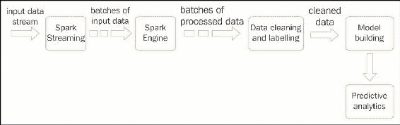

图 9：使用 Spark 从流数据开发实时预测 ML 模型。

在本节中，我们将向您展示如何开发一个处理流数据的实时 ML 管道。更具体地说，我们将展示从 Twitter 流数据中逐步进行主题建模。这里的主题建模有两个步骤：Twitter 数据收集和使用 LDA 进行主题建模。

## 从 Twitter 收集实时推文数据

Spark 提供了 API 来访问来自 Twitter 时间线的实时推文。这些推文可以通过关键词或标签进一步制作。或者，也可以从某人的 Twitter 时间线下载推文。但是，在访问推文数据之前，您需要在 Twitter 上创建一个样本 Twitter 应用程序，并生成四个密钥：`consumerKey`、`consumerSecret`、`accessToken`和`accessTokenSecret`。

### 提示

请注意，从 Spark 1.6.2 升级到 2.0.0 时，Twitter（和其他一些）驱动程序支持已被移除。这意味着在 Spark 2.0.0 中已删除了使用 Spark 进行流数据收集支持的较少使用的流连接器，包括 Twitter、Akka、MQTT 和 ZeroMQ。因此，不可能使用 Spark 2.0.0 开发用于 Twitter 数据收集的应用程序。因此，在本节中将使用 Spark 1.6.1 进行 Twitter 数据收集的演示。建议读者使用提供的 Maven 友好的`pom.xml`文件在 Eclipse 上创建一个 Maven 项目。

在对 Spark ML 应用程序进行身份验证以收集来自 Twitter 的数据之后，您将需要通过指定`SparkConf`和收集推文的持续时间来定义`JavaStreamingContext`。之后，通过使用 Spark 的`TwitterUtils` API，推文数据可以作为 DStream 或离散流下载，一旦使用`JavaStreamingContext`对象撤销`start()`方法。

开始接收推文后，您可以将推文数据保存在本地计算机、HDFS 或其他适用的文件系统上。但是，流将持续进行，直到您使用`awaitTermination()`终止流。

然而，接收到的推文也可以通过使用`foreachRDD`设计模式进行预处理或清理，然后可以保存到您想要的位置。由于页面限制，我们在这里限制了我们的讨论。

### 提示

此外，感兴趣的读者应该遵循 Spark Streaming 的 API 指南，网页地址为：[`spark.apache.org/docs/latest/streaming-programming-guide.html`](http://spark.apache.org/docs/latest/streaming-programming-guide.html)。

### 使用 Spark 的 TwitterUtils API 进行推文收集

在这个小节中，首先，我们将向您展示如何使用`TwitterUtils` API 从 Twitter 收集实时推文数据。然后相同的推文数据将在下一个小节中用于主题建模。

**步骤 1：加载所需的包和 API**

以下是加载所需包的代码：

```scala
import org.apache.log4j.Level; 
import org.apache.log4j.Logger; 
import org.apache.spark.SparkConf; 
import org.apache.spark.api.java.JavaRDD; 
import org.apache.spark.api.java.function.Function; 
import org.apache.spark.streaming.Duration; 
import org.apache.spark.streaming.api.java.JavaDStream; 
import org.apache.spark.streaming.api.java.JavaStreamingContext; 
import org.apache.spark.streaming.twitter.TwitterUtils; 
import twitter4j.Status;  

```

**步骤 2：设置日志记录器级别**

为了设置日志记录器级别，我们使用以下代码：

```scala
Logger.getLogger("org").setLevel(Level.OFF); 
Logger.getLogger("akka").setLevel(Level.OFF); 
Logger.getLogger("org.apache.spark").setLevel(Level.WARN); 
Logger.getLogger("org.eclipse.jetty.server").setLevel(Level.OFF);  

```

**步骤 3：设置 Spark 流环境**

以下是 Spark 流的代码示例：

```scala
SparkConf conf = new SparkConf().setMaster("local[*]").setAppName("TwitterExample"); 
JavaStreamingContext jssc = new JavaStreamingContext(conf, new Duration(1000)); 

```

**步骤 4：设置访问 Twitter 数据的身份验证**

通过访问以下网址从示例 Twitter 应用程序获取认证值：[`apps.twitter.com/`](https://apps.twitter.com/)：

```scala
String consumerKey = "VQINrM6ZcNqaCAawA6IN4xRTP"; 
String consumerSecret = "F2OsVEuJypOZSAoNDFrWgoCHyNJNXbTr8T3yEbp9cWEYjTctye"; 
String accessToken = "475468363-IfRcZnbkEVPRw6bwXovMnw1FsbxuetvEF2JvbAvD"; 
String accessTokenSecret = "vU7VtzZVyugUHO7ddeTvucu1wRrCZqFTPJUW8VAe6xgyf"; 

```

请注意，这里我们为这四个秘密密钥提供了相同的值。请根据自己的密钥替换这些值。现在，我们需要使用`twitter4j.oauth`为前面的四个密钥设置系统属性：

```scala
System.setProperty("twitter4j.oauth.consumerKey", consumerKey); 
System.setProperty("twitter4j.oauth.consumerSecret", consumerSecret); 
System.setProperty("twitter4j.oauth.accessToken", accessToken); 
System.setProperty("twitter4j.oauth.accessTokenSecret", accessTokenSecret); 

```

**步骤 5：启用检查点**

以下代码显示了如何启用检查点：

```scala
jssc.checkpoint("src/main/resources/twitterdata/"); 

```

元数据检查点主要用于从驱动程序故障中恢复，而数据或 RDD 检查点即使在使用有状态转换时也是基本功能所必需的。有关更多详细信息，请访问 Spark 的以下网页：[`spark.apache.org/docs/latest/streaming-programming-guide.html#checkpointing`](http://spark.apache.org/docs/latest/streaming-programming-guide.html#checkpointing)。

**步骤 6：开始接受推文流作为离散流**

让我们只收集 100 条推文以简化，但可以收集任意数量的推文：

```scala
JavaDStream<Status> tweets = TwitterUtils.createStream(jssc); 
final String outputDirectory="src/main/resources/twitterdata/"; 
final long numTweetsToCollect = 100; 

```

**步骤 7：筛选推文并保存为普通文本文件**

筛选推文的代码显示在这里：

```scala
tweets.foreachRDD(new Function<JavaRDD<Status>, Void>() { 
      public long numTweetsCollected = 0; 
      @Override 
      public Void call(JavaRDD<Status> status) throws Exception {         
        long count = status.count(); 
        if (count > 0) { 
          status.saveAsTextFile(outputDirectory + "/tweets_" + System.currentTimeMillis()); 
          numTweetsCollected += count; 
          if (numTweetsCollected >= numTweetsToCollect) { 
               System.exit(0); 
          } 
        } 
        return null; 
      } 
    }); 

```

在这里，我们使用单例方法`foreachRDD`对推文进行预处理，该方法仅接受经过筛选的推文，即，如果状态计数至少为 1。当收集的推文数量等于或多于要收集的推文数量时，我们退出收集。最后，我们将推文保存为文本文件在输出目录中。

**步骤 8：控制流开关**

控制流开关的代码显示在这里：

```scala
jssc.start(); 
jssc.awaitTermination();  

```

最终，我们将在下一步中使用这些推文的文本进行主题建模。如果您还记得第六章中的主题建模，*构建可扩展的机器学习管道*，我们看到了相应的术语权重、主题名称和术语索引。然而，我们还需要实际的术语。在下一步中，我们将展示详细的检索术语的技术，这取决于需要为此创建的词汇表。

## 使用 Spark 进行主题建模

在这个小节中，我们使用 Spark 表示了一种半自动的主题建模技术。以下步骤展示了从数据读取到打印主题及其术语权重的主题建模。

**步骤 1：加载必要的包和 API**

以下是加载必要包的代码：

```scala
import java.io.Serializable; 
import java.util.ArrayList; 
import java.util.HashMap; 
import java.util.Map; 
import org.apache.log4j.Level; 
import org.apache.log4j.Logger; 
import org.apache.spark.SparkConf; 
import org.apache.spark.api.java.JavaPairRDD; 
import org.apache.spark.api.java.JavaRDD; 
import org.apache.spark.api.java.JavaSparkContext; 
import org.apache.spark.api.java.function.Function; 
import org.apache.spark.api.java.function.Function2; 
import org.apache.spark.api.java.function.PairFlatMapFunction; 
import org.apache.spark.api.java.function.PairFunction; 
import org.apache.spark.ml.feature.StopWordsRemover; 
import org.apache.spark.mllib.clustering.LDA; 
import org.apache.spark.mllib.clustering.LDAModel; 
import org.apache.spark.mllib.linalg.Vector; 
import org.apache.spark.mllib.linalg.Vectors; 
import org.apache.spark.sql.SQLContext; 
import scala.Tuple2; 

```

**步骤 2：配置 Spark 环境**

以下是配置 Spark 的代码：

```scala
private transient static SparkConf sparkConf = new SparkConf().setMaster("local[*]").setAppName("TopicModelingLDA"); 
private transient static JavaSparkContext jsc = new JavaSparkContext(sparkConf); 
private transient static SQLContext sqlContext = new org.apache.spark.sql.SQLContext(jsc); 

```

**步骤 3：设置日志级别**

以下是设置日志级别的代码：

```scala
Logger.getLogger("org").setLevel(Level.OFF); 
Logger.getLogger("akka").setLevel(Level.OFF); 
Logger.getLogger("org.apache.spark").setLevel(Level.WARN); 
Logger.getLogger("org.eclipse.jetty.server").setLevel(Level.OFF); 

```

### 注意

请注意，设置刚刚显示的日志级别是可选的。

**步骤 4：创建 Java RDD 并将它们缓存在内存中**

创建 Java RDD 并将它们缓存在上一步的推文数据中：

```scala
JavaRDD<String> data = jsc.wholeTextFiles("src/main/resources/test/*.txt") 
        .map(new Function<Tuple2<String, String>, String>() { 
          @Override 
          public String call(Tuple2<String, String> v1) throws Exception {     
            return v1._2; 
          } 
        }).cache(); 

```

**步骤 5：对术语进行标记化**

加载 Spark 提供的停用词列表，并通过应用三个约束条件对术语进行标记化：文本长度至少为 4，不是停用词，并将它们转换为小写。请注意，我们在第六章中讨论了停用词，*构建可扩展的机器学习管道*：

```scala
public static String[] stopwords = new StopWordsRemover().getStopWords(); 
JavaRDD<String[]> tokenized = data.map(new Function<String, String[]>() { 
list.toArray(new String[0]); 
      }      @Override 
      public String[] call(String v1) throws Exception { 
        ArrayList<String> list = new ArrayList<>(); 
        for (String s : v1.split("\\s")) { 
          if (s.length() > 3 && !isStopWord(s) && isOnlyLetter(s)) 
            list.add(s.toLowerCase()); 
        } 
        return 
    }); 

```

**步骤 6：准备术语计数**

通过应用四个约束条件对术语计数进行准备：文本长度至少为 4，不是停用词，仅选择字符，并将它们全部转换为小写：

```scala
JavaPairRDD<String, Integer> termCounts = data 
        .flatMapToPair(new PairFlatMapFunction<String, String, Integer>() { 
          @Override 
          public Iterable<Tuple2<String, Integer>> call(String t) throws Exception {     
            ArrayList<Tuple2<String, Integer>> tc = new ArrayList<>();   
            for (String s : t.split("\\s")) { 

              if (s.length() > 3 && !isStopWord(s) && isOnlyLetter(s)) 
                tc.add(new Tuple2<String, Integer>(s.toLowerCase(), 1)); 
            } 
            return tc; 
          } 
        }).reduceByKey(new Function2<Integer, Integer, Integer>() { 
          @Override 
          public Integer call(Integer v1, Integer v2) throws Exception {     
            return v1 + v2; 
          } 
        }); 

```

请注意，这里的`isStopWords()`和`isOnlyLetters()`是两个用户定义的方法，将在本步骤末尾讨论。

**步骤 7：对术语计数进行排序**

通过应用两个转换`sortByKey()`和`mapToPair()`对术语计数进行排序：

```scala
JavaPairRDD<String, Integer> termCountsSorted = termCounts 
        .mapToPair(new PairFunction<Tuple2<String, Integer>, Integer, String>() { 
          @Override 
          public Tuple2<Integer, String> call(Tuple2<String, Integer> t) throws Exception { 
            return t.swap(); 
          } 
        }).sortByKey().mapToPair(new PairFunction<Tuple2<Integer, String>, String, Integer>() { 
          @Override 
          public Tuple2<String, Integer> call(Tuple2<Integer, String> t) throws Exception { 
            return t.swap(); 
          } 
        }); 

```

**步骤 8：创建词汇表**

通过映射排序的术语计数创建词汇表 RDD。最后，打印键值对：

```scala
JavaRDD<String> vocabArray = termCountsSorted.map(new Function<Tuple2<String, Integer>, String>() { 
      @Override 
      public String call(Tuple2<String, Integer> v1) throws Exception { 
        return v1._1; 
      } 
    }); 
final Map<String, Long> vocab = vocabArray.zipWithIndex().collectAsMap(); 
    for (Map.Entry<String, Long> entry : vocab.entrySet()) { 
      System.out.println(entry.getKey() + "/" + entry.getValue()); 
    } 

```

让我们看一下*图 10*中显示的词汇表术语及其索引的屏幕截图：

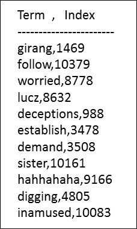

图 10：词汇表术语及其索引。

**步骤 9：从标记化的单词/术语中创建文档矩阵**

通过映射我们在上一步中创建的词汇表，将文档矩阵创建为`JavaPairRDD`。之后，将 RDD 缓存在内存中以加快处理速度：

```scala
JavaPairRDD<Long, Vector> documents = JavaPairRDD 
        .fromJavaRDD(tokenized.zipWithIndex().map(new Function<Tuple2<String[], Long>, Tuple2<Long, Vector>>() { 
          @Override 
          public Tuple2<Long, Vector> call(Tuple2<String[], Long> v1) throws Exception { 
            String[] tokens = v1._1; 
            Map<Integer, Double> counts = new HashMap(); 

            for (String s : tokens) { 
              if (vocab.containsKey(s)) { 
                long idx = vocab.get(s); 
                int a = (int) idx; 
                if (counts.containsKey(a)) { 
                  counts.put(a, counts.get(a) + 1.0); 
                } else 
                  counts.put(a, 0.0); 
              } 
            } 
            ArrayList<Tuple2<Integer, Double>> ll = new ArrayList<>(); 
            ArrayList<Double> dd = new ArrayList<>(); 

            for (Map.Entry<Integer, Double> entry : counts.entrySet()) { 
              ll.add(new Tuple2<Integer, Double>(entry.getKey(), entry.getValue())); 
              dd.add(entry.getValue()); 
            } 

            return new Tuple2<Long, Vector>(v1._2, Vectors.sparse(vocab.size(), ll)); 
          } 
        })).cache(); 

```

**步骤 10：训练 LDA 模型**

使用步骤 9 中的文档矩阵训练 LDA 模型，并简要描述四个主题的 10 个主题术语。

请注意，这里我们使用了**潜在狄利克雷分配**（**LDA**），这是最常用于文本挖掘的主题建模算法之一。我们可以使用更健壮的主题建模算法，如**概率潜在情感分析**（**pLSA**）、**Pachinko 分配模型**（**PAM**）或**分层狄利克雷过程**（**HDP**）算法。但是，pLSA 存在过拟合问题。

另一方面，HDP 和 PAM 是更复杂的主题建模算法，用于复杂的文本挖掘，例如从高维文本数据或非结构化文档中挖掘主题。此外，迄今为止，Spark 仅实现了一种主题建模算法，即 LDA。因此，我们必须合理使用 LDA：

```scala
LDAModel ldaModel = new LDA().setK(4).setMaxIterations(10).run(documents); 
Tuple2<int[], double[]>[] topicDesces = ldaModel.describeTopics(10); 
int topicCount = topicDesces.length; 

```

请注意，为了使主题生成简单，我们将主题数量设置为 4，并迭代 LDA 10 次。另一个原因是，在下一节中，我们想展示如何通过它们的共同术语连接这四个主题。建议读者根据自己的需求更改值。

**步骤 11：获取主题术语、索引、术语权重和每个主题的总和**

从步骤 10 和步骤 8 中描述的词汇表和主题描述中获取这些统计信息：

```scala
for (int t = 0; t < topicCount; t++) { 
      Tuple2<int[], double[]> topic = topicDesces[t]; 
      System.out.println("      Topic: " + t); 
      int[] indices = topic._1(); 
      double[] values = topic._2(); 
      double sum = 0.0d; 
      int wordCount = indices.length; 
      System.out.println("Terms |\tIndex |\tWeight"); 
      System.out.println("------------------------"); 
      for (int w = 0; w < wordCount; w++) { 
        double prob = values[w]; 
        int vocabIndex = indices[w]; 
        String vocabKey = ""; 
        for (Map.Entry<String, Long> entry : vocab.entrySet()) { 
          if (entry.getValue() == vocabIndex) { 
            vocabKey = entry.getKey(); 
            break; 
          } } 
System.out.format("%s \t %d \t %f \n", vocabKey, vocabIndex, prob); 
        sum += prob; 
      } 
      System.out.println("--------------------"); 
      System.out.println("Sum:= " + sum); 
      System.out.println(); 
    }  } 

```

如果仔细查看前面的代码段，`vocabKey`表示相应的主题术语，`vocabIndex`是索引，`prob`表示主题中每个术语的权重。打印语句已用于格式化输出。现在让我们看一下描述四个主题的输出，以简化*图 11*：

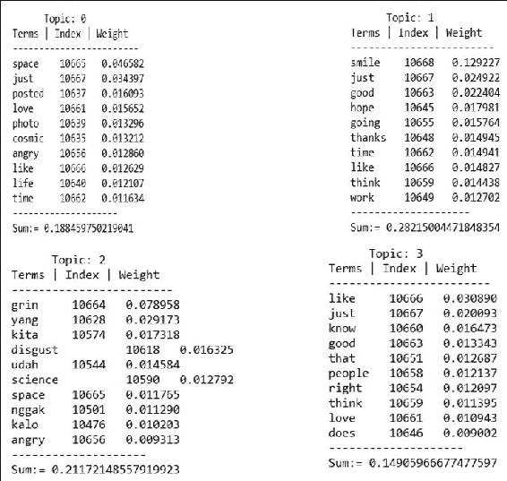

图 11：描述四个主题。

正如我们在*步骤 6*中提到的，这里我们将展示如何开发`isStopWord()`方法。只需使用以下代码：

```scala
public static boolean isStopWord(String word) { 
    for (String s : stopwords) { 
      if (word.equals(s))   
        return true; 
    } 
    return false; 
  } 

```

`isOnlyLetters()`方法如下：

```scala
public static boolean isOnlyLetter(String word) { 
    for (Character ch : word.toCharArray()) { 
      if (!Character.isLetter(ch)) 
        return false; 
    } 
    return true; 
  } 

```

在下一节中，我们将介绍如何使用 Spark 的 GraphX API 解析和处理大规模图形数据，以从*图 10*中得到的主题数据中找到连接的组件。

# 图数据上的 ML 管道和半监督图形学习

由于大数据的泛滥，存在大量未标记的数据，以及非常少量的标记数据。正如已经讨论的那样，对这些数据进行标记和注释在计算上是昂贵的，并且是发现数据真正见解的障碍。此外，社交网络和媒体生产者图数据的增长也在规模上增长。这些数据努力开发实时和大规模的监督学习方法，可以利用输入分布中的信息。

基于图的半监督学习的想法是构建连接相似数据点或组件的图。这使得隐藏和未观察到的标签成为该图的节点上的随机变量。在这种类型的学习中，相似的数据点可以具有相似的标签，并且信息会从标记的数据点传播到其他数据点。类似的限制也限制了在典型处理和分析管道中表达许多重要步骤的能力。然而，基于图的学习并不适用于迭代扩散技术，例如 PageRank，因为许多计算方面是潜在的并且涉及到。

此外，由于 API 限制和不可用性，我们将不会详细讨论这种基于图的机器学习，并提供合适的示例。

然而，在本节中，我们将提供基于图的半监督应用程序开发，这基本上是我们在上一节中介绍的主题建模的延续。

## GraphX 简介

GraphX 是 Spark 中用于图处理、图分析、图可视化和图并行计算的相对较新的组件。实际上，通过引入新的图抽象层，作为具有弹性分布式图计算的 Spark RDD 的原始计算方面得到了扩展，该图抽象层在图处理和存储中提供了弹性属性。

为了提供与图相关的计算，GraphX 公开了一组基本运算符，如子图、`jointVertices`和`aggregateMessages`。除此之外，它还继承了 GraphX 实现中 Pregel API 的优化变体。

此外，为了简化图分析任务，GraphX 正在丰富并增加一系列图算法和构建器。

在下一节中，我们将介绍如何使用 Spark 的 GraphX API 解析和处理大规模图数据，以从*图 11*中获得的主题数据中找到连接的组件。

### 使用 GraphX API 获取和解析图数据

在这个小节中，我们将向您展示如何使用 GraphX API 解析图数据，然后在下一个小节中描述图中的连接组件。由于 GraphX 中的 API 限制，我们无法在 Java 中提供相同的实现，但我们在 Scala 实现中做到了。

要运行以下源代码，请转到您的 Spark 分发并通过提供以下命令启动 Spark shell：

```scala
$ cd home/spark-2.0.0-bin-hadoop2.7/bin
$./spark-shell

```

然后 Spark shell 将可用于 Spark 会话。我们假设您的 Spark 分发保存在`home/spark-2.0.0-bin-hadoop2.7`路径中。请根据需要更改路径，以便运行 Spark shell。另外，请将*图 11*中显示的主题术语保存到单独的文本文件中，以便在继续以下步骤之前，您可以使用这些术语来分析作为图数据：

**步骤 1：加载所需的包和 API**

以下是加载所需包的代码：

```scala
package com.examples.graphs 
import org.apache.spark._ 
import org.apache.spark.graphx._ 
import org.apache.spark.rdd.RDD  

```

**步骤 2：准备 Spark 环境**

以下是准备 Spark 环境的代码：

```scala
val conf = new SparkConf().setAppName("GraphXDemo").setMaster("local[*]") 
val sc = new SparkContext(conf) 

```

**步骤 3：解析主题术语并对其进行标记**

以下代码说明了解析主题术语的方法：

```scala
val corpus: RDD[String] = sc.wholeTextFiles("home/ /topics/*.txt").map(_._2) 
val tokenized: RDD[Seq[String]] = corpus.map(_.toLowerCase.split("\\s")) 
tokenized.foreach { x => println(x) } 

```

**步骤 4：创建文档的 RDD**

创建文档的 RDD，格式为 RDD[（`DocumentID`，（`nodeName`，`wordCount`）)]。例如，RDD[(1L，（Topic_0，4）)]：

```scala
val nodes: RDD[(VertexId, (String, Long))] = tokenized.zipWithIndex().map{  
      case (tokens, id) => 
        val nodeName="Topic_"+id; 
        (id, (nodeName, tokens.size)) 

    } 
    nodes.collect().foreach{ 
      x =>  
        println(x._1+": ("+x._2._1+","+x._2._2+")")        
    } 

```

前面的打印方法生成了如图 12 所示的输出：

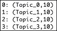

图 12：节点。

**步骤 5：创建一个单词文档对**

这是创建单词文档对的代码：

```scala
val wordPairs: RDD[(String, Long)] = 
      tokenized.zipWithIndex.flatMap { 
        case (tokens, id) => 
          val list = new Array(String, Long) 

          for (i <- 0 to tokens.length - 1) { 
            //tokens.foreach { term => 
            list(i) = (tokens(i), id) 
          } 
          list.toSeq 
      } 
    wordPairs.collect().foreach(x => println(x)) 
    println(wordPairs.count()) 

```

**步骤 6：创建节点之间的图关系**

以下代码显示了如何创建节点之间的图关系：

```scala
val relationships: RDD[Edge[String]] = wordPairs.groupByKey().flatMap{ 
      case(edge, nodes)=> 
        val nodesList = nodes.toArray 
        val list = new Array[Edge[String]](nodesList.length * nodesList.length) 
        if (nodesList.length>1){                   
          var count:Int=0; 
          for (i <- 0 to nodesList.length-2) { 
            for(j<-i+1 to nodesList.length-1){ 
         list(count) = new Edge(nodesList(i), nodesList(j), edge)  
         //list(count+1) = new Edge(nodesList(j), nodesList(i), edge) 
              count += 1; 
              //count += 2; 
            } 
          } 
        } 
        list.toSeq 
    }.filter { x => x!=null } 
    relationships.collect().foreach { x => println(x) } 

```

注意：如果要使图连接，但不是无向的，只需启用以下行：

```scala
list(count+1) = new Edge(nodesList(j), nodesList(i), edge) 

```

在以下行之后立即：

```scala
list(count) = new Edge(nodesList(i), nodesList(j), edge)  

```

将计数增加 2，即`count += 2`，以使更改保持一致。

**步骤 7：初始化图**

这里所示的代码显示了如何说明图：

```scala
val graph = Graph(nodes, relationships) 
println(graph.edges.count) 

```

### 查找连接的组件

根据[`spark.apache.org/docs/latest/graphx-programming-guide.html`](http://spark.apache.org/docs/latest/graphx-programming-guide.html)中的 API 文档，图的每个连接组件都是通过最低编号的顶点 ID 使用连接组件算法进行标记的。例如，在社交网络分析中，集群是由连接组件近似的。为了使这更加简单和快速，GraphX API 包含了算法的实现，即`ConnectedComponents`对象。

然而，目前没有用于查找连接组件的基于 Java、Python 或 R 的实现。因此，它允许我们通过 LDA 算法计算我们已经计算过的主题中的连接组件，如下所示：

```scala
val facts: RDD[String] = 
      graph.triplets.map(triplet => 
        triplet.srcAttr._1 + " contains the terms "" + triplet.attr + "" like as " + triplet.dstAttr._1) 
    facts.collect.foreach(println(_)) 

```

这应该产生如*图 13*所示的输出：

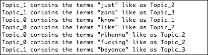

图 13：使用 GraphX 连接主题之间的关系。

如果仔细查看*图 13*中的输出，我们打印了一个三元组的关系。值得注意的是，除了支持顶点和边之外，Spark GraphX 还有三元组的概念。更具体地说，三元组是一个扩展 Edge 对象的对象。从图的角度来看，它存储了有关图中的边和相关顶点的信息。

# 摘要

在本章中，我们展示了如何从实时 Twitter 流数据和图数据开发大规模机器学习应用程序。我们讨论了社交网络和时间序列数据分析。此外，我们还使用 Spark MLlib 的基于内容的协同过滤算法开发了一个新兴的推荐应用程序，为用户推荐电影。然而，这些应用程序可以扩展和部署到其他用例中。

值得注意的是，当前的 Spark 实现包含了一些用于流或网络数据分析的算法。然而，我们希望 GraphX 在未来得到改进，并且不仅限于 Scala，还可以扩展到 Java、R 和 Python。在下一章中，我们将重点介绍如何与外部数据源交互，使 Spark 工作环境更加多样化。
