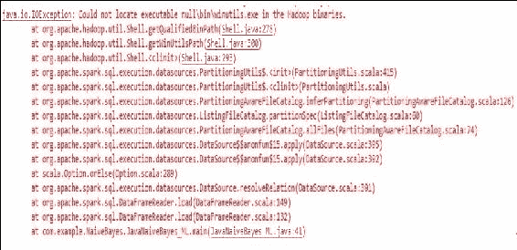

# 第十章：配置和使用外部库

本章指导您如何使用外部库来扩展数据分析，使 Spark 更加多功能。将提供示例，用于部署第三方开发的软件包或库，用于 Spark 核心和 ML/MLlib 的机器学习应用。我们还将讨论如何编译和使用外部库与 Spark 的核心库进行时间序列分析。如约定，我们还将讨论如何配置 SparkR 以增加探索性数据操作和操作。简而言之，本章将涵盖以下主题：

+   使用 Spark 的第三方 ML 库

+   在集群上部署 Spark ML 时使用外部库

+   使用 Cloudera 的 Spark-TS 包进行时间序列分析

+   使用 RStudio 配置 SparkR

+   在 Windows 上配置 Hadoop 运行时

为了为开发人员提供用户友好的环境，还可以将第三方 API 和库与 Spark Core 和其他 API（如 Spark MLlib/ML、Spark Streaming、GraphX 等）结合使用。感兴趣的读者应该参考 Spark 网站上列出的以下网站，该网站被列为**第三方软件包**：[`spark-packages.org/`](https://spark-packages.org/)。

这个网站是 Apache Spark 的第三方软件包的社区索引。截至目前，该网站上注册了总共 252 个软件包，如*表 1*所示：

| **领域** | **软件包数量** | **URL** |
| --- | --- | --- |
| Spark 核心 | 9 | [`spark-packages.org/?q=tags%3A%22Core%22`](https://spark-packages.org/?q=tags%3A%22Core%22) |
| 数据源 | 39 | [`spark-packages.org/?q=tags%3A%22Data%20Sources%22`](https://spark-packages.org/?q=tags%3A%22Data%20Sources%22) |
| 机器学习 | 55 | [`spark-packages.org/?q=tags%3A%22Machine%20Learning%22`](https://spark-packages.org/?q=tags%3A%22Machine%20Learning%22) |
| 流 | 36 | [`spark-packages.org/?q=tags%3A%22Streaming%22`](https://spark-packages.org/?q=tags%3A%22Streaming%22) |
| 图处理 | 13 | [`spark-packages.org/?q=tags%3A%22Graph%22`](https://spark-packages.org/?q=tags%3A%22Graph%22) |
| 使用 Python 的 Spark | 5 | [`spark-packages.org/?q=tags%3A%22PySpark%22`](https://spark-packages.org/?q=tags%3A%22PySpark%22) |
| 集群部署 | 10 | [`spark-packages.org/?q=tags%3A%22Deployment%22`](https://spark-packages.org/?q=tags%3A%22Deployment%22) |
| 数据处理示例 | 18 | [`spark-packages.org/?q=tags%3A%22Examples%22`](https://spark-packages.org/?q=tags%3A%22Examples%22) |
| 应用程序 | 10 | [`spark-packages.org/?q=tags%3A%22Applications%22`](https://spark-packages.org/?q=tags%3A%22Applications%22) |
| 工具 | 24 | [`spark-packages.org/?q=tags%3A%22Tools%22`](https://spark-packages.org/?q=tags%3A%22Tools%22) |
| 总软件包数量：252 |   |   |

表 1：基于应用领域的 Spark 第三方库

# 使用 Spark 的第三方 ML 库

55 个第三方机器学习库包括神经数据分析库、广义聚类库、流处理库、主题建模库、特征选择库、矩阵分解库、分布式 DataFrame 库、模型矩阵库、用于 Spark 的 Stanford Core NLP 包装器、社交网络分析库、深度学习模块运行库、基本统计汇编库、二元分类器校准库和 DataFrame 的标记器。

*表 2*提供了基于使用情况和机器学习应用领域的最有用的软件包的摘要。感兴趣的读者应该访问相应的网站以获取更多见解：

| **Spark 的第三方 ML 库** | **使用情况** |
| --- | --- |
| thunderScalaNetwork | 神经网络使用 Scala 进行大规模神经数据分析的 Spark 实现。 |
| generalized-kmeans-clusteringpatchworkbisecting-kmeansspark-knn | 聚类这个项目将 Spark MLLIB K 均值聚类泛化，以支持任意距离函数。用于 Spark MLlib 的高度可扩展的网格密度聚类算法。这是 Bisecting K-Means 聚类在 Spark 上的原型实现。在 Spark 上的 k 最近邻算法。 |
| spark-ml-streamingstreaming-matrix-factorizationtwitter-stream-ml | 在 Spark 中可视化流式机器学习。使用矩阵分解和用户产品偏差的流式推荐引擎。在 Twitter 的流上进行机器学习。使用 Apache Spark，Web 服务器和 Lightning 图形服务器。 |
| pipeline | 基于 Docker 的管道化使用 Spark、Spark SQL、Spark Streaming、ML、MLlib、GraphX、Kafka、Cassandra、Redis、Apache Zeppelin、Spark-Notebook、iPython/Jupyter Notebook、Tableau、H2O Flow 和 Tachyon 的端到端、实时、高级分析大数据参考管道。 |
| dllibCaffeOnSpark`dl4j-spark-ml` | 深度学习 dllib 是在 Apache Spark 上运行的深度学习工具。用户需要下载工具作为.jar 文件，然后可以与 Spark 集成并开发基于深度学习的应用程序。CaffeOnSpark 是在 Spark 执行器上运行的可扩展的深度学习。它基于点对点（P2P）通信。`dl4j-spark-ml`可以通过与 Spark ML 集成来开发基于深度学习的 ML 应用程序。 |
| kNN_ISsparkboostspark-calibration | 分类 kNN-IS：用于大数据的 k 最近邻分类器的迭代式 Spark 设计。使用 Apache Spark 进行 AdaBoost.MH 和 MP-Boost 的分布式实现。在 Spark 中评估二元分类器的校准（即分类器输出与观察到的类比例匹配程度）。 |
| Zen | 回归 Zen 提供了一个在 Spark 上进行大规模高效机器学习的平台。例如，逻辑回归、线性回归、潜在狄利克雷分配（LDA）、因子分解机和深度神经网络（DNN）都在当前版本中实现了。 |
| modelmatrixspark-infotheoretic-feature-selection | 特征工程 spark-infotheoretic-feature-selection 工具为开发大规模机器学习应用提供了一种替代方案。它通过管道提供了稳健的特征工程，包括特征提取器和特征选择器。它专注于构建基于稀疏特征向量的管道。另一方面，它可以作为基于信息理论的特征选择框架。基于信息理论的算法包括 mRMR、InfoGain、JMI 和其他常用的 FS 过滤器。 |
| spark-knn-graphs | 图处理 Spark 算法用于构建和处理 k-nn 图 |
| TopicModeling | 主题建模在 Apache Spark 上进行分布式主题建模 |
| Spark.statistics | 统计除了 SparkR，Spark.statistics 作为基于 Spark 核心的基本统计实现的组装程序 |

表 2：基于 Spark 的机器学习用例和应用领域的最有用的第三方包的总结

# 使用 Spark Core 的外部库

为了使用这些外部库，而不是将 jar 文件放在任何特定的文件夹中，一个简单的解决方法是使用以下参数启动`pyspark` shell 或 spark-shell：

```scala
bin/pyspark --packages com.databricks:spark-csv_2.10:1.0.3
bin/spark-shell --packages com.databricks:spark-csv_2.10:1.0.3

```

这将自动加载所需的`spark-csv` jar 文件。但是，这两个 jar 文件必须使用以下命令在 Ubuntu 中下载到 Spark 分发中：

```scala
wget http://search.maven.org/remotecontent?filepath=org/apache/commons/commons-csv/1.1/commons-csv-1.1.jar
wget http://search.maven.org/remotecontent?filepath=com/databricks/spark-csv_2.10/1.0.0/spark-csv_2.10-1.0.0.jar

```

然后，要创建一个活跃的 Spark 会话，使用以下代码行：

```scala
static SparkSession spark = SparkSession 
        .builder() 
        .appName("JavaLDAExample") 
          .master("local[*]") 
          .config("spark.sql.warehouse.dir", "C:/Exp/")               
          .getOrCreate(); 

```

一旦您实例化了一个活跃的 Spark 会话，使用以下代码行来读取 csv 输入文件：

```scala
String input = "input/letterdata.data"; 
Dataset<Row> df = spark.read().format("com.databricks.spark.csv").option("header", "true").load(input);  
df.show();   

```

请注意，我们在这里使用`format()`方法定义了`com.databricks.spark.csv`输入格式，这是由 Databricks 专门开发的，用于更快的 CSV 文件读取和解析，并使用`option()`方法将辅助选项设置为 true。最后，`load()`方法从`input/letterdata.data`位置加载输入数据，例如。

接下来，在下一节中，我们将讨论配置 Spark-TS 库以进行时间序列数据分析。

### 提示

感兴趣的读者应该访问 Spark 的第三方 ML 包网页[`spark-packages.org/?q=tags%3A%22Machine%20Learning%22`](https://spark-packages.org/?q=tags%3A%22Machine%20Learning%22)了解特定包的讨论、更新和配置程序。

# 使用 Cloudera Spark-TS 包进行时间序列分析

正如在*第九章*中讨论的，我们将看到如何配置由 Cloudera 开发的 Spark-TS 包。主要是，我们将在本节讨论 TimeSeriesRDD。

## 时间序列数据

时间序列数据由一系列测量组成，每个测量发生在某个时间点。有许多术语用于描述时间序列数据，其中许多适用于冲突或重叠的概念。为了清晰起见，在 Spark-TS 中，Cloudera 坚持使用特定的词汇。时间序列数据分析中有三个重要的对象：时间序列、瞬时和观察：

+   时间序列是一系列实数（即浮点数）值，每个值都与特定的时间戳相关联。特别是，这与时间序列的含义一致，即一元时间序列。在 Scala 中，时间序列通常由 Breeze 在[`github.com/scalanlp/breeze`](https://github.com/scalanlp/breeze)中表示的向量表示，在 Python 中，是一个 1-D NumPy 数组（更多信息请参考[`www.numpy.org/`](http://www.numpy.org/)），并且具有`DateTimeIndex`，如[`github.com/sryza/spark-timeseries/blob/master/src/main/scala/com/cloudera/sparkts/DateTimeIndex.scala`](https://github.com/sryza/spark-timeseries/blob/master/src/main/scala/com/cloudera/sparkts/DateTimeIndex.scala)所示。

+   另一方面，瞬时是与单个时间点对应的时间序列集合中的值向量。在 Spark-TS 库中，每个时间序列通常都带有一个键，使其能够在时间序列集合中被识别。

+   最后，观察是一个元组（时间戳，键，值），也就是时间序列或瞬时中的单个值。

然而，并非所有带有时间戳的数据都是时间序列数据。例如，日志不直接适用于时间序列，因为它们由离散事件组成，而不是在间隔中进行的标量测量。但是，每小时的日志消息测量将构成一个时间序列。

## 配置 Spark-TS

从 Scala 中访问 Spark-TS 的最直接的方法是在 Maven 项目中依赖它。通过在`pom.xml`中包含以下 repo 来实现：

```scala
<repositories> 
    <repository> 
      <id>cloudera-repos</id> 
      <name>Cloudera Repos</name> 
      <url>https://repository.cloudera.com/artifactory/cloudera-repos/</url> 
    </repository> 
</repositories> 
 And including the following dependency in the pom.xml:  
<dependency> 
      <groupId>com.cloudera.sparkts</groupId> 
      <artifactId>sparkts</artifactId> 
      <version>0.1.0</version> 
</dependency> 

```

要获取原始的`pom.xml`文件，感兴趣的读者应该访问以下网址：

[`github.com/sryza/spark-timeseries/blob/master/pom.xml`](https://github.com/sryza/spark-timeseries/blob/master/pom.xml)

或者，要在 spark-shell 中访问它，请从[`repository.cloudera.com/cloudera/libs-release-local/com/cloudera/sparkts/sparkts/0.1.0/sparkts-0.1.0-jar-with-dependencies.jar`](https://repository.cloudera.com/cloudera/libs-release-local/com/cloudera/sparkts/sparkts/0.1.0/sparkts-0.1.0-jar-with-dependencies.jar)下载 JAR 文件，然后按照本章的*使用 Spark Core 的外部库*部分中讨论的命令启动 shell。

```scala
spark-shell \
 --jars sparkts-0.1.0-jar-with-dependencies.jar \
 --driver-class-path sparkts-0.1.0-jar-with-dependencies.jar

```

## TimeSeriesRDD

根据 Cloudera 网站上的 Spark-TS 工程博客[`blog.cloudera.com/blog/2015/12/spark-ts-a-new-library-for-analyzing-time-series-data-with-apache-spark/`](http://blog.cloudera.com/blog/2015/12/spark-ts-a-new-library-for-analyzing-time-series-data-with-apache-spark/)，TimeSeriesRDD 是 Spark-TS 的核心，RDD 中的每个对象存储完整的单变量系列。对于时间序列专用的操作效率更高。例如，如果您想从原始时间序列集生成一组滞后时间序列，每个滞后序列可以通过查看输入 RDD 中的单个记录来计算。

同样，通过根据周围值填充缺失值或为每个系列拟合时间序列模型，所有所需的数据都存在于单个数组中。因此，Spark-TS 库的核心抽象是 TimeSeriesRDD，它只是可以以分布式方式操作的时间序列集合。这种方法允许您避免为每个系列存储时间戳，而是存储一个单一的`DateTimeIndex`，所有系列向量都符合该索引。`TimeSeriesRDD[K]`扩展了`RDD[(K, Vector[Double])]`，其中 K 是键类型（通常是字符串），元组中的第二个元素是表示时间序列的 Breeze 向量。

可以在 GitHub 网址[`github.com/sryza/spark-timeseries`](https://github.com/sryza/spark-timeseries)找到更多技术讨论。由于这是一个第三方包，详细讨论超出了本书的范围，我们认为。

# 使用 RStudio 配置 SparkR

假设您的计算机上安装了 RStudio。按照这里提到的步骤：

1.  现在打开 RStudio 并创建一个新的 R 脚本；然后编写以下代码：

```scala
      SPARK_HOME = "/home/spark-2.0.0-bin-hadoop2.7/R/lib" 
      Sys.setenv(SPARK_MEM="8g") 
      Sys.setenv(SPARK_HOME = "/home/spark-2.0.0-bin-hadoop2.7") 
      .libPaths(c(file.path(Sys.getenv("SPARK_HOME"), "R",
      "lib"),.libPaths())) 

```

1.  通过使用以下代码加载 SparkR 所需的软件包：

```scala
      library(SparkR, lib.loc = SPARK_HOME)
      ibrary(SparkR) 

```

1.  配置 SparkR 环境如下：

```scala
      sc <- sparkR.init(appName = "SparkR-DataFrame-example", master =
      "local")
      sqlContext <- sparkRSQL.init(sc) 

```

1.  现在让我们创建第一个 DataFrame 并打印前几行，如下所示：

```scala
      df <- createDataFrame(sqlContext, faithful) 
      head(df) 

```

1.  您可能需要安装以下软件包才能使`devtools`软件包正常工作：

```scala
      install.packages("xml2", dependencies = TRUE) 
      install.packages("Rcpp", dependencies = TRUE) 
      install.packages("plyr", dependencies = TRUE) 
      install.packages("devtools", dependencies = TRUE) 
      install.packages("MatrixModels", dependencies = TRUE) 
      install.packages("quantreg", dependencies = TRUE)  
      install.packages("moments", dependencies = TRUE) 
      install.packages("xml2") 
      install.packages(c("digest", "gtable", "scales", "rversions",
      "lintr")) 

```

1.  此外，您可能需要安装`libcurl`来支持 devtools 所依赖的 RCurl。只需运行此命令：

```scala
 sudo apt-get -y build-dep libcurl4-gnutls-dev 
      sudo apt-get install libcurl4-gnutls-dev 
      sudo apt-get install r-cran-plyr 
      sudo apt-get install r-cran-reshape2

```

1.  现在使用以下代码从 GitHub 配置`ggplot2.SparkR`包：

```scala
      library(devtools) 
      devtools::install_github("SKKU-SKT/ggplot2.SparkR") 

```

1.  现在让我们计算刚刚创建的样本 DataFrame 的偏度和峰度。在此之前，加载必要的软件包：

```scala
      library(moments) 
      library(ggplot2) 

```

1.  让我们为*特征工程和数据探索*部分中的每日锻炼示例创建 DataFrame，显示前几行使用`head`命令：

```scala
      time_taken <- c (15, 16, 18, 17.16, 16.5, 18.6, 19.0, 20.4, 20.6, 
      25.15, 27.27, 25.24, 21.05, 21.65, 20.92, 22.61, 23.71, 35, 39, 50) 
      df_new <- data.frame(time_taken)  
      head(df_new)  
      df<- createDataFrame(sqlContext, data = df_new)  
      head(df) 

```

1.  现在按照以下步骤计算偏度和峰度：

```scala
      skewness(df) 
      kurtosis(df_new) 

```

您可能已经注意到我们在*特征工程*部分中使用了`偏度`和`峰度`这两个术语。如果您对这两个术语不熟悉，这里是它们的定义。从统计角度来看，`偏度`是对称性的度量。或者更准确地说，它表示数据集的分布中的对称性缺失。

现在您可能想知道对称是什么。嗯，如果数据集的分布在中心点的左侧和右侧看起来相同，则数据集是对称的。

另一方面，峰度是衡量数据相对于正态分布是重尾还是轻尾的指标：

1.  最后，通过调用`ggplot2.SparkR`包的`ggplot()`方法来绘制密度图。

```scala
      ggplot(df, aes(x = time_taken)) + stat_density(geom="line",
      col= "green", size = 1, bw = 4) + theme_bw() 

```

如果您不熟悉`ggplot2` R 包，请注意，`ggplot2`是基于 R 的绘图系统，基于基本和格栅图形的图形语法。它提供了许多使绘图成为一种麻烦的图形的琐碎细节，例如，在图形中放置或绘制图例，以及提供强大的图形模型。这将使您的生活更轻松，以便生成简单和复杂的多层图形。

### 提示

有关`ggplot2`及其文档的更多信息，请访问以下网站：[`docs.ggplot2.org/current/`](http://docs.ggplot2.org/current/)。

# 在 Windows 上配置 Hadoop 运行时

如果您正在使用 Eclipse（当然是 Maven 项目）在 Windows 上开发您的机器学习应用程序，可能会遇到问题，因为 Spark 也希望在 Windows 上有 Hadoop 的运行时环境。

更具体地说，假设您正在运行一个用 Java 编写的 Spark 项目，主类为`JavaNaiveBayes_ML.java`，那么您将遇到一个 IO 异常，说：

```scala
16/10/04 11:59:52 ERROR Shell: Failed to locate the winutils binary in the hadoop binary path
java.io.IOException: Could not locate executable null\bin\winutils.exe in the Hadoop binaries.
```



图 1：由于缺少 Hadoop 运行时而导致的 IO 异常

原因是默认情况下，Hadoop 是为 Linux 环境开发的，如果您在 Windows 平台上开发 Spark 应用程序，则需要一个桥梁，它将为 Spark 提供 Hadoop 环境，以便正确执行 Hadoop 运行时。

现在，如何摆脱这个问题呢？解决方案很简单。正如错误消息所说，我们需要一个名为`winutils.exe`的可执行文件。现在从 Packt 的代码目录下载`winutils.exe`文件，并将其复制粘贴到 Spark 分发目录中，并配置 Eclipse。

更具体地说，假设您的包含 Hadoop 的 Spark 分发位于`C:/Users/spark-2.0.0-bin-hadoop2.7`。在 Spark 分发中有一个名为`bin`的目录。现在，将可执行文件粘贴到那里（即`path = C:/Users/spark-2.0.0-binhadoop2.7/``bin/`）。

解决方案的第二阶段是进入 Eclipse，选择主类（即在本例中为`JavaNaiveBayes_ML.java`），然后转到**运行**菜单。从**运行**菜单转到**运行配置**选项，然后从该选项中选择**环境**选项卡。如果选择该选项卡，您将有一个选项可以为 Eclipse 使用 JVM 创建一个新的环境变量。

现在创建一个新的环境变量，并将值设置为`C:/Users/spark-2.0.0-bin-hadoop2.7/`。现在点击**应用**，重新运行您的应用程序，您的问题应该得到解决。

更具体地说，IO 异常的细节可以在图 1 中描述如下：

# 摘要

在本章中，我们展示了如何使用 Spark 扩展数据分析的外部库。

越来越多的 Spark 以及第三方包正在由开源贡献者开发。读者应该及时了解 Spark 网站上的最新消息和发布。他们还应该得到有关最新机器学习 API 的通知，因为 Spark 的开发是持续和创新的，当然，有时在某个包变得过时或被弃用后。

在本书中，我们试图指导您如何使用由 Spark 开发的最流行和广泛使用的机器学习算法。然而，还有其他算法，我们无法讨论，而且越来越多的算法将被添加到 Spark ML 和 MLlib 包中。

这基本上是我们与 Spark 的小旅程的结束。现在我们向您作为读者的一般建议，或者如果您对机器学习、Java 或 Spark 相对较新，首先要了解一个问题是否真的是一个机器学习问题。如果是一个机器学习问题，试着猜测哪种类型的学习算法应该是最合适的，即分类、聚类、回归、推荐或频繁模式挖掘。

然后定义和规划问题。之后，您应该基于我们讨论过的 Spark 的特征工程概念生成或下载适当的数据。然后，您可以选择一个 ML 模型，该模型将在准确性方面提供更好的结果。但是，正如前面讨论的那样，模型选择确实取决于您的数据和问题类型。

现在您已经准备好训练模型的数据，可以直接开始训练模型以进行预测分析。

当您的模型训练好后，评估它以查看其表现并满足您的预测期望。如果您对性能不满意，请尝试切换到其他 ML 算法以进行模型选择。正如在第七章中讨论的那样，*调整机器学习模型*，即使适当的模型选择有时也无法提供最佳结果，因为您拥有的数据的性质。

那么应该做什么呢？很简单。使用可用的调整算法来调整您的 ML 模型，以正确设置超参数。您可能还需要使您的模型适应新的数据类型，特别是如果您正在为时间序列分析或流式分析等动态环境开发 ML 应用程序。

最后，部署您的模型，您将拥有一个强大的 ML 应用程序。

我们最终向读者推荐定期浏览 Spark 网站（位于[`spark.apache.org/`](http://spark.apache.org/)），以获取更新，并尝试将常规提供的 Spark API 与其他第三方应用程序结合起来，以获得合作的最佳结果。

这本电子书是由 AlenMiler 在 AvaxHome 上发布的！

***我的博客中有许多新的电子书：*** [`avxhome.in/blogs/AlenMiler`](https://tr.im/fgrfegtr)

***镜像：*** [`avxhome.unblocked.tw/blogs/AlenMiler`](https://tr.im/geresttre)
