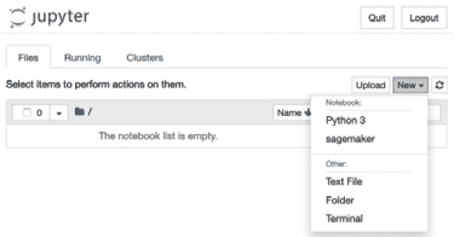
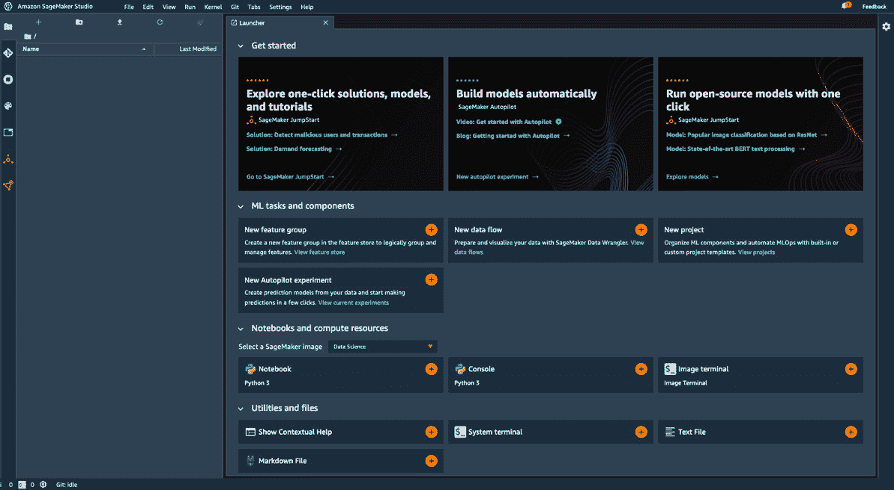

# 第一章：介绍亚马逊 SageMaker

**机器学习**（**ML**）从业者在项目过程中使用大量工具：开源库、深度学习框架等。此外，他们还经常需要编写自己的工具来进行自动化和编排。管理这些工具及其底层基础设施既耗时又容易出错。

这是亚马逊 SageMaker 旨在解决的一个问题（[`aws.amazon.com/sagemaker/`](https://aws.amazon.com/sagemaker/)）。亚马逊 SageMaker 是一个完全托管的服务，帮助你快速构建和部署机器学习模型。无论你是刚开始接触机器学习，还是已经是经验丰富的从业者，你都能找到 SageMaker 的功能来提高工作流的灵活性和模型的性能。你将能够 100%专注于当前的机器学习问题，而无需花费任何时间来安装、管理和扩展机器学习工具和基础设施。

在本章中，我们将学习 SageMaker 的主要功能，它们如何帮助解决机器学习从业者面临的痛点，以及如何设置 SageMaker。本章将涵盖以下主题：

+   探索亚马逊 SageMaker 的功能

+   在本地机器上设置亚马逊 SageMaker

+   设置亚马逊 SageMaker Studio

+   使用亚马逊 SageMaker JumpStart 部署一键解决方案和模型

# 技术要求

你需要一个 AWS 账户来运行本章中的示例。如果你还没有账户，请在浏览器中访问[`aws.amazon.com/getting-started/`](https://aws.amazon.com/getting-started/)，了解 AWS 及其核心概念，并创建一个 AWS 账户。你还应该熟悉 AWS Free Tier（[`aws.amazon.com/free/`](https://aws.amazon.com/free/)），它让你在一定的使用限制内免费使用许多 AWS 服务。

你需要为你的账户安装并配置 AWS CLI（[`aws.amazon.com/cli/`](https://aws.amazon.com/cli/)）。

你需要一个可用的 Python 3.x 环境。安装 Anaconda 发行版（[`www.anaconda.com/`](https://www.anaconda.com/)）不是强制性的，但强烈推荐安装，因为它包含了我们需要的许多项目（Jupyter、`pandas`、`numpy`等）。

本书中的代码示例可以在 GitHub 上找到：[`github.com/PacktPublishing/Learn-Amazon-SageMaker-second-edition`](https://github.com/PacktPublishing/Learn-Amazon-SageMaker-second-edition)。你需要安装一个 Git 客户端才能访问它们（[`git-scm.com/`](https://git-scm.com/)）。

# 探索亚马逊 SageMaker 的功能

Amazon SageMaker 于 2017 年 AWS re:Invent 大会推出。自那时以来，添加了许多新功能：你可以在 [`aws.amazon.com/about-aws/whats-new/machine-learning`](https://aws.amazon.com/about-aws/whats-new/machine-learning) 上查看完整的（且不断增长的）功能列表。

在本节中，你将了解 Amazon SageMaker 的主要功能及其目的。别担心，我们会在后续章节深入探讨每一个功能。我们还会讨论实现这些功能的 SageMaker **应用程序** **编程** **接口**（**APIs**）和 **软件** **开发** **工具包**（**SDKs**）。

## Amazon SageMaker 的主要功能

Amazon SageMaker 的核心功能是能够在完全托管的基础设施上，按需准备、构建、训练、优化和部署模型。这让你可以专注于学习和解决手头的机器学习问题，而不是花费时间和资源在构建和管理基础设施上。简而言之，你可以更快地从构建到训练再到部署。接下来，我们将深入探讨每个步骤，并突出相关的 SageMaker 功能。

### 准备工作

Amazon SageMaker 包含强大的工具来标注和准备数据集：

+   **Amazon SageMaker Ground Truth**：在任何规模上标注数据集。内置了适用于流行用例的工作流（如图像检测、实体提取等），并且你可以实现自己的工作流。标注任务可以分配给属于私人、第三方或公共劳动力的工作人员。

+   **Amazon SageMaker Processing**：使用你用 scikit-learn 或 Spark 编写的代码，运行批处理作业进行数据处理（以及其他任务，如模型评估）。

+   **Amazon SageMaker Data Wrangler**：通过图形界面，将数百种内建的转换（或你自己的转换）应用到表格数据集，并通过一键操作将其导出到 Jupyter 笔记本中。

+   **Amazon SageMaker 特征存储**：将你的工程特征存储在 Amazon S3 中，用于离线构建数据集，或在线使用它们进行预测。

+   **Amazon SageMaker Clarify**：通过多种统计指标，分析数据集和模型中潜在的偏差，并解释模型如何进行预测。

### 构建

Amazon SageMaker 提供了两种开发环境：

+   **Notebook 实例**：完全托管的 Amazon EC2 实例，预装了最流行的工具和库：Jupyter、Anaconda 等。

+   **Amazon SageMaker Studio**：一个端到端的集成开发环境，专为机器学习项目设计，提供直观的图形界面，支持许多 SageMaker 功能。Studio 现在是运行笔记本的首选方式，我们建议你使用它，而非笔记本实例。

在实验算法时，你可以选择以下选项：

+   提供 17 种**内建算法**，用于机器学习和深度学习，已经实现并优化以便在 AWS 上高效运行。无需编写机器学习代码！

+   内置的开源框架集合（**TensorFlow**、**PyTorch**、**Apache MXNet**、**scikit-learn** 等），您只需带上自己的代码。

+   在您自己的容器中运行您自己的代码：自定义 Python、R、C++、Java 等。

+   来自 AWS Marketplace 的算法和预训练模型，适用于机器学习（[`aws.amazon.com/marketplace/solutions/machine-learning`](https://aws.amazon.com/marketplace/solutions/machine-learning)）。

+   机器学习解决方案和先进的模型可通过 **Amazon SageMaker JumpStart** 一键获得。

此外，**Amazon SageMaker Autopilot** 利用自动机器学习（AutoML）自动构建、训练和优化模型，无需编写一行机器学习代码。

### 训练

如前所述，Amazon SageMaker 负责配置和管理您的训练基础设施。您将不再浪费时间管理服务器，专注于机器学习。同时，SageMaker 提供了如下一些先进功能：

+   **托管存储**，可以选择 Amazon S3、Amazon EFS 或 Amazon FSx for Lustre，具体取决于您的性能需求。

+   **托管竞价训练**，使用 Amazon EC2 Spot 实例进行训练，从而节省高达 80% 的成本。

+   **分布式训练** 自动将大规模训练作业分配到一组托管实例，采用数据并行和模型并行等先进技术。

+   **Pipe mode** 将超大数据集从 Amazon S3 流式传输到训练实例，省去了复制数据的需求。

+   **自动模型调优** 运行超参数优化，更快速地交付高精度模型。

+   **Amazon SageMaker Experiments** 轻松跟踪、组织和比较所有的 SageMaker 作业。

+   **Amazon SageMaker Debugger** 在训练过程中捕获内部模型状态，检查其以观察模型的学习方式，检测会影响准确性的非理想条件，并分析训练作业的性能。

### 部署

与训练一样，Amazon SageMaker 会处理所有部署基础设施，并提供一系列附加功能：

+   **实时终端** 创建一个 HTTPS API，从您的模型中提供预测。正如您所期望的那样，自动扩展是可用的。

+   **Batch transform** 使用模型批量预测数据。

+   **Amazon Elastic Inference** 为基于 CPU 的终端提供分数级 GPU 加速，以找到最佳的成本/性能比，用于您的预测基础设施。

+   **Amazon SageMaker Model Monitor** 捕获发送到终端的数据，并与基准数据进行比较，识别并报警数据质量问题（缺失特征、数据漂移等）。

+   **Amazon SageMaker Neo** 为特定硬件架构（包括嵌入式平台）编译模型，并使用轻量级运行时部署优化版本。

+   **Amazon SageMaker Edge Manager** 帮助您在边缘设备上部署和管理模型。

+   最后但同样重要的是，**Amazon SageMaker Pipelines** 允许你构建端到端的自动化流水线，以运行和管理数据准备、训练和部署工作负载。

## Amazon SageMaker API

就像所有其他 AWS 服务一样，Amazon SageMaker 由 API 驱动，这些 API 被实现于 AWS 支持的语言 SDK 中 ([`aws.amazon.com/tools/`](https://aws.amazon.com/tools/))。此外，还提供了一个专门的 Python SDK，即 SageMaker SDK。让我们来看看这两者，并讨论它们各自的优点。

### AWS 语言 SDK

语言 SDK 实现了所有 AWS 服务的特定 API：S3、EC2 等。当然，它们也包含了 SageMaker API，相关文档可以在这里查看：[`docs.aws.amazon.com/sagemaker/latest/dg/api-and-sdk-reference.htma`](https://docs.aws.amazon.com/sagemaker/latest/dg/api-and-sdk-reference.html)机器学习。

在数据科学和机器学习领域，Python 是最受欢迎的语言，因此让我们来看一下在 `boto3` 中可用的 SageMaker API，它是 AWS 为 Python 语言提供的 SDK ([`boto3.amazonaws.com/v1/documentation/api/latest/reference/services/sagemaker.htma`](https://boto3.amazonaws.com/v1/documentation/api/latest/reference/services/sagemaker.html)机器学习)。这些 API 相当底层且冗长：例如，`create_training_job()` 有许多看起来不太直观的 JSON 参数。你可以在下一个截图中看到其中一些。你可能会觉得这对于日常的机器学习实验来说并不太吸引人……我完全同意！


图 1.1 – boto3 中 create_training_job() API 的（部分）视图

事实上，这些服务级别的 API 并不适用于在笔记本中进行实验。它们的目的是自动化，通过定制脚本或基础设施即代码工具，如 AWS CloudFormation ([`aws.amazon.com/cloudformation`](https://aws.amazon.com/cloudformation)) 和 Terraform ([`terraform.io`](https://terraform.io))。你的 DevOps 团队将使用这些工具来管理生产环境，因为他们需要对每个可能的参数拥有完全控制权。

那么，应该使用什么来进行实验呢？你应该使用 Amazon SageMaker SDK。

### Amazon SageMaker SDK

Amazon SageMaker SDK ([`github.com/aws/sagemaker-python-sdk`](https://github.com/aws/sagemaker-python-sdk)) 是一个专为 Amazon SageMaker 提供的 Python SDK。你可以在 [`sagemaker.readthedocs.io/en/stable/`](https://sagemaker.readthedocs.io/en/stable/) 找到它的文档。

注意

本书中的代码示例已经尽最大努力与最新的 SageMaker SDK（截至撰写时为 v2.58.0）进行过检查。

在这里，抽象层次要高得多：SDK 包含了用于模型、估算器、预测器等的对象。我们无疑已经回到了机器学习的领域。

例如，这个 SDK 使得启动训练作业（一行代码）和部署模型（一行代码）变得非常简单和方便。基础设施问题被抽象化，我们可以专注于机器学习。这里有一个例子。现在不用担心细节：

```py
# Configure the training job
my_estimator = TensorFlow(
    entry_point='my_script.py',
    role=my_sagemaker_role,
    train_instance_type='machine learning.p3.2xlarge',
    instance_count=1,
    framework_version='2.1.0')
# Train the model
my_estimator.fit('s3://my_bucket/my_training_data/')
# Deploy the model to an HTTPS endpoint
my_predictor = my_estimator.deploy(
    initial_instance_count=1, 
    instance_type='machine learning.c5.2xlarge')
```

现在我们对 Amazon SageMaker 有了一些了解，让我们看看如何设置它。

# 在本地机器上设置 Amazon SageMaker

一个常见的误解是你不能在 AWS 云之外使用 SageMaker。显然，它是一个基于云的服务，其最吸引人的功能需要云基础设施来运行。然而，许多开发人员喜欢按照自己的方式设置开发环境，SageMaker 让他们可以做到：在本节中，您将学习如何在本地机器或本地服务器上安装 SageMaker SDK。在后面的章节中，您将学习如何在本地训练和部署模型。

最好的做法是隔离 Python 环境以避免依赖地狱。让我们看看如何使用两个流行项目`virtualenv`（[`virtualenv.pypa.io`](https://virtualenv.pypa.io)）和 Anaconda（[`www.anaconda.com/`](https://www.anaconda.com/)）来实现这一点。

## 使用 virtualenv 安装 SageMaker SDK

如果你以前从未使用过`virtualenv`，请在继续之前阅读本教程：[`packaging.python.org/guides/installing-using-pip-and-virtual-environments/`](https://packaging.python.org/guides/installing-using-pip-and-virtual-environments/)：

1.  首先，让我们创建一个名为`sagemaker`的新环境并激活它：

    ```py
    $ mkdir workdir
    $ cd workdir
    $ python3 -m venv sagemaker
    $ source sagemaker/bin/activate
    ```

1.  现在，让我们安装`boto3`，SageMaker SDK 和`pandas`库（[`pandas.pydata.org/`](https://pandas.pydata.org/)）：

    ```py
    $ pip3 install boto3 sagemaker pandas
    ```

1.  现在，让我们快速检查我们是否可以将这些 SDK 导入 Python：

    ```py
    $ python3
    Python 3.9.5 (default, May  4 2021, 03:29:30)
    >>> import boto3
    >>> import sagemaker
    >>> print(boto3.__version__)
    1.17.70
    >>> print(sagemaker.__version__)
    2.39.1
    >>> exit()
    ```

安装看起来很好。你自己的版本肯定会更新，这没问题。现在，让我们通过本地 Jupyter 服务器（[`jupyter.org/`](https://jupyter.org/)）运行一个快速测试。如果你的机器上没有安装 Jupyter，你可以在[`jupyter.org/install`](https://jupyter.org/install)找到说明：

1.  首先，让我们基于我们的虚拟环境创建一个 Jupyter 内核：

    ```py
    $ pip3 install jupyter ipykernel
    $ python3 -m ipykernel install --user --name=sagemaker
    ```

1.  然后，我们可以启动 Jupyter：

    ```py
    $ jupyter notebook
    ```

1.  创建一个新的笔记本，我们可以看到`sagemaker`内核是可用的，所以让我们在**新建**菜单中选择它，如下截图所示：

    图 1.2 – 创建一个新的笔记本

1.  最后，我们可以通过导入它们并打印它们的版本来检查 SDK 是否可用，如下截图所示：


图 1.3 – 检查 SDK 版本

这样就完成了使用`virtualenv`的安装。不要忘记终止 Jupyter，并且取消激活你的`virtualenv`：

```py
$ deactivate
```

你也可以使用 Anaconda 安装 SDK。

## 使用 Anaconda 安装 SageMaker SDK

`conda`允许你创建和管理隔离的环境。如果你之前从未使用过`conda`，你应该做以下操作：

+   安装 Anaconda：[`docs.anaconda.com/anaconda/install/`](https://docs.anaconda.com/anaconda/install/)。

+   阅读这个教程：[`docs.conda.io/projects/conda/en/latest/user-guide/getting-started.html`](https://docs.conda.io/projects/conda/en/latest/user-guide/getting-started.html)。

我们将通过以下步骤开始：

1.  创建并激活一个名为`conda-sagemaker`的新`conda`环境：

    ```py
    $ conda create -y -n conda-sagemaker
    $ conda activate conda-sagemaker
    ```

1.  然后，我们安装`pandas`、`boto3`和 SageMaker SDK。后者必须使用`pip`安装，因为它不是`conda`包：

    ```py
    $ conda install -y boto3 pandas
    $ pip3 install sagemaker
    ```

1.  现在，让我们将 Jupyter 及其依赖项添加到环境中，并创建一个新的内核：

    ```py
    $ conda install -y jupyter ipykernel
    $ python3 -m ipykernel install --user --name conda-sagemaker
    ```

1.  然后，我们可以启动 Jupyter：

    ```py
    conda-sagemaker kernel is present in the New menu, as is visible in the following screenshot:Figure 1.4 – Creating a new conda environment
    ```

1.  就像上一节中一样，我们可以使用这个内核创建一个笔记本，并检查 SDK 是否正确导入。

这完成了使用`conda`的安装。你是否选择使用`conda`而不是`virtualenv`，主要是个人偏好的问题。你完全可以使用其中任意一个来运行本书中的所有笔记本并构建你自己的项目。

## 关于 AWS 权限的说明

**Amazon 身份与访问管理**（IAM）使你能够安全地管理对 AWS 服务和资源的访问（[`aws.amazon.com/iam`](https://aws.amazon.com/iam)）。当然，这也适用于 Amazon SageMaker，你需要确保你的 AWS 用户有足够的权限来调用 SageMaker API。

IAM 权限

如果你完全不熟悉 IAM，请阅读以下文档：

[`docs.aws.amazon.com/IAM/latest/UserGuide/introduction.html`](https://docs.aws.amazon.com/IAM/latest/UserGuide/introduction.html)。

你可以通过使用 AWS CLI 调用一个 SageMaker API（例如，`list-endpoints`）来快速测试。我这里使用的是`eu-west-1`区域，但你也可以使用离你最近的区域：

```py
$ aws sagemaker list-endpoints --region eu-west-1
{
    "Endpoints": []
}
```

如果你收到权限不足的错误信息，你需要更新与你的 AWS 用户关联的 IAM 角色。

如果你拥有相关的 AWS 账户，你可以在 IAM 控制台中轻松地通过将`AmazonSageMakerFullAccess`托管策略添加到你的角色中来完成这项工作。请注意，这个策略权限非常宽松：对于开发账户来说没问题，但对于生产账户来说肯定不行。

如果你使用的账户没有管理员权限（例如公司提供的账户），请联系你的 IT 管理员为你的 AWS 用户添加 SageMaker 权限。

有关 SageMaker 权限的更多信息，请参阅文档：[`docs.aws.amazon.com/sagemaker/latest/dg/security-iam.html`](https://docs.aws.amazon.com/sagemaker/latest/dg/security-iam.html)。

# 设置 Amazon SageMaker Studio

实验是机器学习过程中的关键部分。开发人员和数据科学家使用一系列开源工具和库进行数据探索、数据处理，当然还有评估候选算法。安装和维护这些工具需要花费大量时间，而这些时间可能更好地用来研究机器学习问题本身！

Amazon SageMaker Studio 为你提供从实验到生产所需的机器学习工具。其核心是基于 Jupyter 的集成开发环境，使你可以立即上手。

此外，SageMaker Studio 与其他 SageMaker 功能集成，例如 SageMaker 实验，用于跟踪和比较所有任务，SageMaker Autopilot 用于自动创建机器学习模型等等。很多操作只需几次点击就能完成，无需编写任何代码。

SageMaker Studio 还进一步简化了基础设施管理。你无需创建笔记本实例：SageMaker Studio 为你提供了现成的计算环境，随时可以运行你的笔记本。

注意

本节需要具备 Amazon S3、Amazon VPC 和 Amazon IAM 的基本知识。如果你对这些完全不熟悉，请阅读以下文档：

[`docs.aws.amazon.com/AmazonS3/latest/dev/Welcome.htma`](https://docs.aws.amazon.com/AmazonS3/latest/dev/Welcome.html)机器学习

[`docs.aws.amazon.com/vpc/latest/userguide/what-is-amazon-vpc.htma`](https://docs.aws.amazon.com/vpc/latest/userguide/what-is-amazon-vpc.html)机器学习

[`docs.aws.amazon.com/IAM/latest/UserGuide/introduction.htma`](https://docs.aws.amazon.com/IAM/latest/UserGuide/introduction.html)机器学习

现在也许是时候查看（并收藏）SageMaker 定价页面：[`aws.amazon.com/sagemaker/pricing/`](https://aws.amazon.com/sagemaker/pricing/)。

## 入职 Amazon SageMaker Studio

你可以通过以下三种方式之一访问 SageMaker Studio：

+   **使用快速入门流程**：这是个人账户最简单的选择，我们将在接下来的段落中详细介绍。

+   **使用** **AWS 单点登录（SSO）**：如果你的公司已经设置了 SSO 应用程序，这可能是最好的选择。你可以通过[`docs.aws.amazon.com/sagemaker/latest/dg/onboard-sso-users.htma`](https://docs.aws.amazon.com/sagemaker/latest/dg/onboard-sso-users.html)了解更多关于 SSO 入职的信息。请联系你的 IT 管理员获取详细信息。

+   **使用 Amazon IAM**：如果你的公司不使用 SSO，这可能是最好的选择。你可以通过[`docs.aws.amazon.com/sagemaker/latest/dg/onboard-iam.htma`](https://docs.aws.amazon.com/sagemaker/latest/dg/onboard-iam.html)了解更多关于 SSO 入职的信息。再次提醒，请联系你的 IT 管理员了解更多细节。

## 使用快速入门流程进行入职

快速入门流程包含几个步骤：

1.  首先，在 Amazon SageMaker Studio 可用的某个地区打开 AWS 控制台，例如，[`us-east-2.console.aws.amazon.com/sagemaker/`](https://us-east-2.console.aws.amazon.com/sagemaker/)。

1.  如下图所示，左侧的垂直面板中有一个链接到**SageMaker Studio**：

    图 1.5 – 打开 SageMaker Studio

1.  点击这个链接会打开入门界面，你可以在下一个截图中看到它的第一部分：

    图 1.6 – 运行快速入门

1.  选择**快速入门**。然后，输入我们希望用于登录 SageMaker Studio 的用户名，并按照前面截图中的说明创建一个新的 IAM 角色。接下来会打开以下界面：

    图 1.7 – 创建 IAM 角色

    我们需要做的唯一决策是是否允许我们的笔记本实例访问特定的 Amazon S3 存储桶。选择**任何 S3 存储桶**并点击**创建角色**。这是开发和测试中最灵活的设置，但在生产环境中我们会希望应用更严格的设置。当然，我们可以稍后在 IAM 控制台中编辑这个角色，或者创建一个新的角色。

1.  一旦点击**创建角色**，我们就会回到之前的界面。请确保该账户启用了项目模板和 JumpStart。（这应该是默认设置）。

1.  我们只需要点击**提交**来启动入门程序。根据你的账户设置，可能会出现一个额外的界面，要求你选择一个 VPC 和子网。我建议选择你默认 VPC 中的任何子网。

1.  几分钟后，SageMaker Studio 开始服务，如下图所示。我们如果需要可以添加额外的用户，但现在只需点击**打开 Studio**：

    图 1.8 – 启动 SageMaker Studio

    如果这需要再多等几分钟也不要担心，因为 SageMaker Studio 需要完成第一次运行环境的设置。如下图所示，一旦我们打开 SageMaker Studio，我们会看到熟悉的 JupyterLab 界面：

    注意

    SageMaker Studio 是一个不断发展的平台。当你阅读这篇文章时，某些界面可能已经更新。此外，你可能会注意到不同地区之间存在一些小差异，因为某些功能或实例类型在某些地区可能不可用。

    

    图 1.9 – SageMaker Studio 欢迎界面

1.  我们可以立即创建我们的第一个笔记本。在**启动器**标签页的**笔记本和计算资源**部分，选择**数据科学**，然后点击**笔记本** – **Python 3**。

1.  这会打开一个笔记本，如下图所示。我们首先检查 SDK 是否已准备好。由于这是我们第一次启动 **数据科学** 内核，我们需要等待几分钟。

    图 1.10 – 检查 SDK 版本

1.  如下图所示，我们可以轻松列出当前在 Studio 实例中运行的资源：一个 **机器学习.t3.medium** 实例、支持笔记本内核的数据科学镜像，以及笔记本本身：

    图 1.11 – 查看 Studio 资源

1.  为了避免不必要的费用，我们应该在完成工作后关闭这些资源。例如，我们可以关闭实例和它上面运行的所有资源，正如下面的截图所示。现在不要关闭，我们需要这个实例来运行接下来的示例！！图 1.12 – 关闭实例

    

    图 1.12 – 关闭实例

1.  **机器学习.t3.medium** 是 Studio 使用的默认实例类型。你可以通过点击笔记本顶部的 **2 vCPU + 4 GiB** 切换到其他实例类型。这样可以选择新的实例类型并在 Studio 中启动它。几分钟后，实例就启动了，你的笔记本代码也会自动迁移。别忘了关闭之前的实例，正如前面所解释的那样。

1.  当我们完成与 SageMaker Studio 的工作时，所要做的就是关闭浏览器标签。如果我们想要继续工作，只需返回到 SageMaker 控制台并点击 **打开 Studio**。

1.  如果我们想关闭 Studio 实例本身，只需在 **文件** 菜单中选择 **关闭**。所有文件会被保留，直到我们在 SageMaker 控制台中完全删除 Studio。

现在我们已经完成了设置，我相信你迫不及待地想开始进行机器学习了。让我们开始部署一些模型吧！

# 使用 Amazon SageMaker JumpStart 部署一键解决方案和模型

如果你是机器学习的新手，可能会发现很难开始实际项目。你已经运行了所有的玩具示例，也读了几篇关于计算机视觉或自然语言处理模型的博客。那么接下来该怎么办？如何将这些复杂的模型应用到你自己的数据上，解决你自己的业务问题？

即使你是经验丰富的从业者，构建端到端的机器学习解决方案也不是一项简单的任务。训练和部署模型只是其中的一部分：数据准备、自动化等怎么办？

**Amazon SageMaker JumpStart** 是专门为帮助每个人更快速地开始机器学习项目而构建的。只需点击一次，你就可以部署以下内容：

+   16 个端到端的解决方案，涵盖实际业务问题，如金融交易中的欺诈检测、信用决策解释、预测性维护等

+   超过 180 个预先训练的 TensorFlow 和 PyTorch 模型，涵盖各种计算机视觉和自然语言处理任务

+   额外的学习资源，如示例笔记本、博客文章和视频教程

到了部署解决方案的时候了。

## 部署解决方案

让我们开始：

1.  从左侧图标栏开始，我们打开 JumpStart。以下截图显示了启动屏幕：

    图 1.13 – 在 JumpStart 中查看解决方案

1.  选择**金融交易中的欺诈检测**。如以下截图所示，这是一个使用图数据和图神经网络基于交互预测欺诈活动的精彩示例：

    图 1.14 – 查看解决方案详情

1.  阅读完解决方案详情后，我们只需点击**启动**按钮。这将运行一个 AWS CloudFormation 模板，负责构建解决方案所需的所有 AWS 资源。

    CloudFormation

    如果你对 CloudFormation 感兴趣，你可以参考这个介绍：[`docs.aws.amazon.com/AWSCloudFormation/latest/UserGuide/Welcome.htma`](https://docs.aws.amazon.com/AWSCloudFormation/latest/UserGuide/Welcome.html)机器学习。

1.  几分钟后，解决方案准备就绪，如以下截图所示。我们点击**打开笔记本**来打开第一个笔记本。

    图 1.15 – 打开解决方案

1.  如以下截图所示，我们可以在左侧面板浏览解决方案文件：笔记本、训练代码等：

    图 1.16 – 查看解决方案文件

1.  从此时起，你可以开始运行并调整笔记本。如果你还不熟悉 SageMaker SDK，也无需担心细节。

1.  完成后，请返回解决方案页面并点击**删除所有资源**，以清理并避免不必要的费用，如以下截图所示：


图 1.17 – 删除解决方案

如你所见，JumpStart 解决方案是探索如何使用机器学习解决业务问题的绝佳方式，并开始思考如何在自己的业务环境中实现相同的目标。

现在，让我们看看如何部署预训练模型。

## 部署模型

JumpStart 包括超过 180 个预先训练的 TensorFlow 和 PyTorch 模型，涵盖各种计算机视觉和自然语言处理任务。让我们来看一下计算机视觉模型：

1.  从 JumpStart 主屏幕开始，我们打开**视觉模型**，如以下截图所示：

    图 1.18 – 查看计算机视觉模型

1.  假设我们有兴趣尝试基于 **单次检测器**（**SSD**）架构的物体检测模型。我们点击 PyTorch Hub 上的 **SSD** 模型（从左数第四个）。

1.  这将打开模型详细信息页面，告诉我们模型的来源、训练使用的数据集以及它可以预测的标签。我们还可以选择部署模型的实例类型。保持默认设置后，我们点击 **部署** 将模型部署到实时端点，如以下截图所示：

    图 1.19 – 部署 JumpStart 模型

1.  几分钟后，模型已经部署。如以下截图所示，我们可以在左侧面板看到端点状态，点击 **打开 Notebook** 即可进行测试。

    图 1.20 – 打开 JumpStart Notebook

1.  通过点击 Notebook 单元格，我们下载了一张测试图像，并预测其中包含的对象。以下截图显示了边界框、类别和概率：

    图 1.21 – 在图片中检测物体

1.  完成后，请确保删除端点以避免不必要的费用：只需在 *图 1.20* 显示的端点详细信息屏幕上点击 **删除**。

JumpStart 不仅让你轻松尝试最先进的模型，还提供了可以直接用于自己项目的代码：加载图像进行预测、使用端点进行预测、绘制结果等等。

尽管预训练模型非常有用，但我们通常需要在自己的数据集上对其进行微调。让我们看看如何使用 JumpStart 来实现这一点。

## 微调模型

这次我们使用一个图像分类模型：

注意

关于微调文本模型的警告：像 BERT 这样的复杂模型微调可能需要很长时间，甚至在单个 GPU 上每个 epoch 需要几个小时。除了长时间的等待，成本也不会忽视，因此除非你有一个实际的商业项目，否则我建议避免这些例子。

1.  我们选择了 **Resnet 18** 模型（如 *图 1.18* 中第二个从左的模型）。

1.  在模型详细信息页面，我们可以看到该模型可以在默认的数据集上进行微调，该数据集用于测试（一个包含五种花卉类别的 TensorFlow 数据集），或者在我们存储在 S3 中的数据集上进行微调。向下滚动，我们了解了数据集应具有的格式。

1.  如下图所示，我们选择了默认数据集。我们还保持了部署配置和训练参数不变。然后，我们点击 **训练** 启动微调任务。

    图 1.22 – 微调模型

1.  仅需几分钟，微调就完成了（这就是我选择这个例子的原因！）。我们可以看到微调模型存储在 S3 中的输出路径。让我们记下这个路径，稍后我们会用到它。

    图 1.23 – 查看微调结果

1.  然后，我们像之前的例子一样点击 **Deploy**。模型部署完成后，我们打开示范笔记本，展示如何使用初始的预训练模型进行预测。

1.  这个笔记本使用了模型预训练时所用的原始数据集中的图像。没问题，让我们来适应它！即使我们还不熟悉 SageMaker SDK，笔记本也足够简单，我们可以理解发生了什么，并添加几个单元格，用我们的微调模型预测一张花卉图片。

1.  首先，我们添加一个单元格，从 S3 复制微调后的模型工件，并提取 JumpStart 添加的类别列表和类别索引：

    ```py
    %%sh
    aws s3 cp s3://sagemaker-REGION_NAME-123456789012/smjs-d-pt-ic-resnet18-20210511-142657/output/model.tar.gz .
    tar xfz model.tar.gz
    cat class_label_to_prediction_index.json
    {"daisy": 0, "dandelion": 1, "roses": 2, "sunflowers": 3, "tulips": 4}
    ```

1.  如预期所示，微调后的模型可以预测五个类别。让我们添加一个单元格，从 Wikipedia 下载一张向日葵的图片：

    ```py
    %%sh
    wget https://upload.wikimedia.org/wikipedia/commons/a/a9/A_sunflower.jpg
    ```

1.  现在，我们加载这张图片并调用端点：

    ```py
    import boto3
    endpoint_name = 'jumpstart-ftd-pt-ic-resnet18'
    client = boto3.client('runtime.sagemaker')
    with open('A_sunflower.jpg', 'rb') as file:
        image = file.read()
    response = client.invoke_endpoint(
        EndpointName=endpoint_name, 
        ContentType='application/x-image',
        Body=image)
    ```

1.  最后，我们打印出预测结果。最高的概率是类别 #3，概率为 60.67%，确认我们的图片包含一朵向日葵！

    ```py
    import json
    model_predictions = json.loads(response['Body'].read())
    print(model_predictions)
    [0.30362239480018616, 0.06462913751602173, 0.007234351709485054, 0.6067869663238525, 0.017727158963680267]
    ```

1.  测试完成后，请务必删除端点，以避免不必要的费用。

这个例子展示了如何通过 SageMaker JumpStart 在你自己的数据集上微调预训练模型，并用它们预测你自己的数据。这是一个很好的方式，能够尝试不同的模型并找出最适合解决你所面临的特定问题的模型。

这是第一章的结束，已经相当充实了，不是吗？现在是时候回顾我们学到的内容了。

# 总结

在本章中，你了解了 Amazon SageMaker 的主要功能，以及它们如何帮助解决机器学习中的痛点。通过为你提供托管的基础设施和预安装的工具，SageMaker 使你能够专注于机器学习问题本身。因此，你可以更快地从模型实验过渡到生产部署。

接着，你学习了如何在本地机器和 Amazon SageMaker Studio 中设置 Amazon SageMaker。后者是一个托管的机器学习 IDE，许多其他 SageMaker 功能只需几次点击即可访问。

最后，你了解了 Amazon SageMaker JumpStart，这是一个包含机器学习解决方案和最先进模型的集合，你可以一键部署并在几分钟内开始测试。

在下一章中，我们将看到如何使用 Amazon SageMaker 和其他 AWS 服务来准备你的数据集以进行训练。
