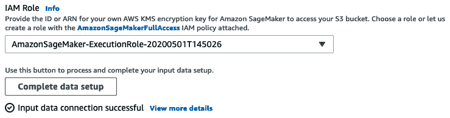

# 第二章：处理数据准备技术

数据是任何机器学习项目的起点，将数据转化为可以用于训练模型的数据集需要大量工作。这项工作通常涉及标注数据集、运行定制的脚本进行预处理，并保存处理后的版本以备后用。如你所料，手动完成所有这些工作，或构建工具来自动化这些过程，对机器学习团队来说并不是一项令人兴奋的任务。

本章将介绍帮助你构建和处理数据的 AWS 服务。我们首先会讲解 **Amazon SageMaker Ground Truth**，这是 Amazon SageMaker 的一项功能，帮助你快速构建准确的训练数据集。接着，我们会介绍 **Amazon SageMaker Data Wrangler**，一种交互式转换数据的新方法。然后，我们会讨论 **Amazon SageMaker Processing**，另一项功能，帮助你运行数据处理工作负载，例如特征工程、数据验证、模型评估和模型解释。最后，我们会简要介绍其他可能有助于数据分析的 AWS 服务：**Amazon Elastic Map Reduce**、**AWS Glue** 和 **Amazon Athena**。

本章包括以下主题：

+   使用 Amazon SageMaker Ground Truth 标注数据

+   使用 Amazon SageMaker Data Wrangler 转换数据

+   使用 Amazon SageMaker Processing 运行批处理作业

# 技术要求

你需要一个 AWS 账户来运行本章中包含的示例。如果你还没有账户，请访问 [`aws.amazon.com/getting-started/`](https://aws.amazon.com/getting-started/) 创建一个。你还应该熟悉 AWS 免费套餐，它允许你在特定的使用限制内免费使用许多 AWS 服务。

你需要为你的账户安装并配置 AWS **命令行界面**（**CLI**）（[`aws.amazon.com/cli/`](https://aws.amazon.com/cli/)）。

你需要一个正常工作的 Python 3.x 环境。安装 Anaconda 发行版（[`www.anaconda.com/`](https://www.anaconda.com/)）不是强制要求，但强烈推荐，因为它包含我们需要的许多项目（Jupyter、`pandas`、`numpy` 等）。

本书中的代码示例可以在 GitHub 上找到，地址是 [`github.com/PacktPublishing/Learn-Amazon-SageMaker-second-edition`](https://github.com/PacktPublishing/Learn-Amazon-SageMaker-second-edition)。你需要安装 Git 客户端才能访问这些示例（[`git-scm.com/`](https://git-scm.com/)）。

# 使用 Amazon SageMaker Ground Truth 标注数据

Amazon SageMaker 于 2018 年底增加的 Amazon SageMaker Ground Truth 帮助你快速构建准确的训练数据集。机器学习从业者可以将标注工作分发给公共和私人劳动力的人工标注员。得益于内置工作流程和图形界面，标注员可以立即开始高效工作，处理常见的图像、视频和文本任务。此外，Ground Truth 还支持自动标注技术，这是一种训练机器学习模型使其能够在没有额外人工干预的情况下进行数据标注的技术。

在本节中，你将学习如何使用 Ground Truth 标注图像和文本。

## 使用劳动力

使用 Ground Truth 的第一步是创建一个劳动力，这是负责标注数据样本的工作组。

让我们进入 SageMaker 控制台：在左侧的垂直菜单中，点击**Ground Truth**，然后点击**标注劳动力**。有三种类型的劳动力可供选择：**Amazon Mechanical Turk**、**供应商**和**私人**。我们来讨论一下它们是什么，以及何时使用它们。

### Amazon Mechanical Turk

**Amazon Mechanical Turk**（[`www.mturk.com/`](https://www.mturk.com/)）使得将大型批处理任务拆分为小的工作单元变得更加容易，这些单元可以由分布式劳动力处理。

使用 Mechanical Turk，你可以招募来自全球的成千上万的工人。这是当你需要标注极大数据集时的一个很好的选择。例如，想象一个自动驾驶数据集，由 1,000 小时的视频组成：每一帧都需要处理，以识别其他车辆、行人、交通标志等。如果你想对每一帧进行标注，你将需要处理 1,000 小时 x 3,600 秒 x 每秒 24 帧 = **8640 万张图片**！显然，你需要扩展你的标注劳动力才能完成这项工作，而 Mechanical Turk 可以让你做到这一点。

### 供应商劳动力

尽管 Mechanical Turk 具有良好的可扩展性，但有时你需要更多控制，特别是当数据共享对象和标注质量需要更多关注时，尤其是在需要额外领域知识的情况下。

为此，AWS 已经审核了一些数据标注公司，这些公司已经将 Ground Truth 集成到他们的工作流程中。你可以在**AWS Marketplace**（[`aws.amazon.com/marketplace/`](https://aws.amazon.com/marketplace/)）中找到这些公司的列表，路径为**机器学习** | **数据标注服务** | **Amazon SageMaker Ground Truth 服务**。

### 私人劳动力

有时，数据不能由第三方处理。也许它过于敏感，或者可能需要只有你公司员工才拥有的专业知识。在这种情况下，你可以创建一个由明确身份的个人组成的私人劳动力来访问并标注数据。

## 创建私人劳动力

创建私人劳动力是最快且最简单的选项。让我们来看看如何操作：

1.  从 SageMaker 控制台中的**Labeling workforces**入口开始，我们选择**Private**标签，如下图所示。然后，点击**Create private team**：

    图 2.1 – 创建私有工作团队

1.  我们为团队命名，然后需要决定是通过电子邮件邀请工作人员，还是导入属于现有**Amazon Cognito**组的用户。

    Amazon Cognito ([`aws.amazon.com/cognito/`](https://aws.amazon.com/cognito/)) 是一种托管服务，可以让您在任何规模下构建和管理用户目录。Cognito 支持社交身份提供者（Google、Facebook 和 Amazon），以及企业身份提供者（Microsoft Active Directory、SAML）。

    在企业环境中，这非常有意义，但为了简化流程，我们可以改用电子邮件。在这里，我将使用一些示例电子邮件地址：请确保使用您自己的电子邮件地址，否则您将无法加入团队！

1.  然后，我们需要输入组织名称，更重要的是提供一个工作人员可以用来提问和反馈标注工作的联系方式电子邮件。这些交流非常重要，以便微调标注说明，找出有问题的数据样本等。

1.  可选地，我们可以使用**Amazon Simple Notification Service** ([`aws.amazon.com/sns/`](https://aws.amazon.com/sns/)) 设置通知，以告知工作人员他们有任务需要完成。

1.  屏幕应该像下图所示。然后，我们点击**Create private team**：

    图 2.2 – 设置私有工作团队

1.  几秒钟后，团队已建立。邀请已发送给工作人员，要求他们通过登录特定的 URL 加入工作团队。邀请邮件如下图所示：

    图 2.3 – 邮件邀请

1.  点击链接会打开一个登录窗口。一旦我们登录并定义了新密码，就会进入一个新页面，显示可用的工作，如下图所示。由于我们尚未定义任何工作，因此它显然是空的：


图 2.4 – 工作控制台

让我们让工作人员忙起来，创建一个图像标注工作。

## 上传数据进行标注

正如您所期望的，Amazon SageMaker Ground Truth 使用 Amazon S3 来存储数据集：

1.  使用 AWS CLI，我们创建一个托管在与我们运行 SageMaker 相同区域的 S3 桶。桶名称是全球唯一的，所以请确保在创建桶时选择一个独特的名称。使用以下代码（也可以选择其他 AWS 区域）：

    ```py
    $ aws s3 mb s3://sagemaker-book --region eu-west-1
    ```

1.  然后，我们将位于`chapter2`文件夹中的猫咪图片从我们的 GitHub 仓库复制过来，如下所示：

    ```py
    $ aws s3 cp --recursive cat/ s3://sagemaker-book/chapter2/cat/
    ```

现在我们有一些等待标注的数据，让我们创建一个标注工作。

## 创建标签工作

正如你所预期的，我们需要定义数据的位置、标注任务的类型，以及我们的标注指令：

1.  在 SageMaker 控制台的左侧垂直菜单中，我们点击**Ground Truth**，然后点击**标注工作**，接着点击**创建标注工作**按钮。

1.  首先，我们给工作命名，比如'`my-cat-job`'。然后，我们定义数据在 S3 中的位置。Ground Truth 需要一个**清单文件**：清单文件是一个**JSON** 文件，用于过滤哪些对象需要标注，哪些不需要。工作完成后，一个名为增强清单的新文件将包含标注信息，我们将能够使用这个文件来为训练工作提供数据。

1.  然后，我们定义输入数据的位置和类型，正如下面的截图所示：

    图 2.5 – 配置输入数据

1.  如下图所示，我们选择了第一章中为 SageMaker 创建的 IAM 角色（你的名字会有所不同），然后点击**完成数据设置**按钮以验证这一部分：

    图 2.6 – 验证输入数据

    点击**查看更多详情**，你可以了解后台发生了什么。SageMaker Ground Truth 会抓取你在 S3 中的数据，并创建一个名为**清单文件**的 JSON 文件。如果你感兴趣，可以从 S3 下载它。这个文件指向你在 S3 中的对象（图片、文本文件等）。

1.  可选地，我们可以选择使用完整的清单、随机样本或基于**SQL**查询的过滤子集。我们还可以提供一个**Amazon KMS** 密钥来加密作业输出。这里我们保持默认设置。

1.  **任务类型**部分会询问我们希望执行什么类型的任务。请花一分钟时间浏览可用的不同任务类别（文本、图像、视频、点云和自定义）。如下一张截图所示，让我们选择**图像**任务类别和**语义分割**任务，然后点击**下一步**：

    图 2.7 – 选择任务类型

1.  在下一个屏幕中，如下图所示，我们首先选择我们的私人工作人员团队：

    图 2.8 – 选择团队类型

1.  如果我们有很多样本（比如说，数万个或更多），我们应该考虑启用**自动化数据标注**，因为此功能能够减少标注任务的持续时间和成本。事实上，当工作者开始标注数据样本时，SageMaker Ground Truth 会使用这些样本训练一个机器学习模型。它会将这些样本用作监督学习问题的数据集。在足够多的工作者标注数据的支持下，这个模型很快就能与人类的准确性匹敌，甚至超过人类的标注准确性，届时它将取代工作者并标注剩余的数据集。如果你想了解更多关于此功能的信息，请阅读文档 [`docs.aws.amazon.com/sagemaker/latest/dg/sms-automated-labeling.html`](https://docs.aws.amazon.com/sagemaker/latest/dg/sms-automated-labeling.html)。

1.  配置训练任务的最后一步是输入工作者的指示。这是一个重要步骤，特别是当你的任务分配给第三方工作者时。我们的指示越清晰，标注的质量就越高。在这里，我们将解释任务的内容，并为工作者输入一个“猫”标签。现实情况下，你应该添加详细的说明，提供良好和不良示例的样本图像，解释你的期望等等。以下截图展示了我们的指示内容：

    ](img/B17705_02_009.jpg)

    图 2.9 – 设置指示

1.  完成指示后，我们点击**创建**来启动标注任务。几分钟后，任务准备好分配给工作者了。

## 标注图像

登录到工作者 URL，我们可以从以下截图显示的屏幕看到，我们还有任务要做：


](img/B17705_02_010.jpg)

图 2.10 – 工作者控制台

我们将使用以下步骤：

1.  点击**开始工作**会打开一个新窗口，接下来图中所示。它显示了说明以及第一个需要处理的图像：

    ](img/B17705_02_011.jpg)

    图 2.11 – 标注图像

1.  使用工具栏中的图形工具，尤其是自动分割工具，我们可以非常快速地制作高质量的标注。请花几分钟时间进行练习，很快你就能做到同样的事情。

1.  一旦我们完成了三个图像的标注，任务就完成了，我们可以在 SageMaker 控制台的**标注任务**下查看标注的图像。你的屏幕应该像下面的截图一样：


](img/B17705_02_012.jpg)

图 2.12 – 标注图像

更重要的是，我们可以在 S3 输出位置找到标注信息。

特别是，`output/my-cat-job/manifests/output/output.manifest` 包含每个数据样本的标注信息，例如图像中存在的类别，以及分割掩码的链接。

在*第五章**，训练计算机视觉模型*中，我们将看到如何将这些信息直接输入到 Amazon SageMaker 中内置的计算机视觉算法。当然，我们也可以解析这些信息，并根据我们用于训练计算机视觉模型的框架进行转换。

如您所见，SageMaker Ground Truth 使得标注图像数据集变得非常简单。您只需要将数据上传到 S3 并创建一个工作团队。Ground Truth 将自动分配任务，并将结果存储在 S3 中。

我们刚刚看到如何标注图像，那么文本任务呢？嗯，它们同样容易设置和运行。让我们通过一个示例来了解。

## 标注文本

这是一个标注命名实体识别文本的快速示例。数据集由我博客文章中的一些文本片段组成，我们希望标注所有 AWS 服务名称。这些内容可以在我们的 GitHub 仓库中找到。

我们将通过以下步骤开始标注文本：

1.  首先，让我们使用以下代码将文本片段上传到 S3：

    ```py
    $ aws s3 cp --recursive ner/ s3://sagemaker-book/chapter2/ner/
    ```

1.  就像在前面的示例中，我们配置了一个文本标注任务，设置了输入数据并选择了一个 IAM 角色，截图如下所示：

    图 2.13 – 创建文本标注任务

1.  然后，我们选择**文本**作为类别，选择**命名实体识别**作为任务。

1.  在下一个屏幕上，截图如下所示，我们只需再次选择我们的私有团队，添加标签并输入指令：

    图 2.14 – 设置指令

1.  一旦任务准备好，我们登录到工作控制台并开始标注。您可以在以下截图中看到一个标注示例：

    图 2.15 – 标注文本

1.  我们很快就完成了任务，并且可以在我们的 S3 存储桶中找到标注信息。对于每个样本，我们可以看到起始偏移量、结束偏移量以及每个标注实体的标签。

Amazon SageMaker Ground Truth 使得大规模标注数据集变得非常简单。它有许多不错的功能，包括任务链和自定义工作流，强烈建议您访问 [`docs.aws.amazon.com/sagemaker/latest/dg/sms.html`](https://docs.aws.amazon.com/sagemaker/latest/dg/sms.html) 进一步了解。

现在我们知道如何标注数据集了，接下来让我们看看如何使用 Amazon SageMaker Data Wrangler 轻松地交互式转换数据。

# 使用 Amazon SageMaker Data Wrangler 转换数据

收集和标注数据样本只是准备数据集的第一步。实际上，您很可能需要预处理数据集，以便进行如下操作：

+   将其转换为您所使用的机器学习算法所期望的输入格式。

+   对数值特征进行缩放或标准化。

+   工程更高级的特征，例如，一热编码（One-Hot Encoding）。

+   清理并标记文本，以用于自然语言处理应用程序

在机器学习项目的早期阶段，通常不容易明确需要哪些数据转换，或者哪些转换最为高效。因此，实践者通常需要尝试不同的组合，采用多种方式转换数据，训练模型，并评估结果。

在本节中，我们将学习**Amazon SageMaker Data Wrangler**，这是一个集成在 SageMaker Studio 中的图形界面，使得数据转换变得非常简单，并且能够将结果导出到多种 Jupyter 笔记本中。

## 在 SageMaker Data Wrangler 中加载数据集

首先，我们需要一个数据集。我们将使用由 S. Moro、P. Cortez 和 P. Rita 在《A Data-Driven Approach to Predict the Success of Bank Telemarketing》中发布的直接营销数据集，*Decision Support Systems*，Elsevier，62:22-31，2014 年 6 月。

该数据集描述了一个二分类问题：客户是否会接受营销优惠，接受或不接受？它包含了超过 41,000 个客户样本，标签存储在**y**列中。

我们将按照以下步骤开始使用：

1.  使用 AWS 命令行，我们将下载数据集，解压并将其复制到我们所在区域的默认 SageMaker 桶中（它应该已自动创建）。你可以在本地机器或 Jupyter 终端中运行此操作：

    ```py
    $ aws s3 cp s3://sagemaker-sample-data-us-west-2.s3-us-west-2.amazonaws.com/autopilot/direct_marketing/bank-additional.zip .
    $ unzip bank-additional.zip
    $ aws s3 cp bank-additional/bank-additional-full.csv s3://sagemaker-ap-northeast-2-123456789012/direct-marketing/
    ```

1.  在 SageMaker Studio 中，我们通过**文件** | **新建** | **Data Wrangler 流**来创建新的 Data Wrangler 流。以下截图展示了 Data Wrangler 图像正在加载：

    图 2.16 – 加载 Data Wrangler

1.  一旦 Data Wrangler 准备就绪，**导入**屏幕将打开。我们还可以在左侧窗格中看到 Data Wrangler 图像，如下一个截图所示：

    图 2.17 – 打开 Data Wrangler

1.  我们可以从 S3、Athena 或 Redshift 导入数据（点击**添加数据源**）。在这里，我们点击 S3。

1.  如下截图所示，我们可以轻松定位到我们刚刚上传的数据集。点击它即可：

    图 2.18 – 定位数据集

1.  这将打开数据集的预览，如下一个截图所示：

    图 2.19 – 预览数据集

1.  让我们点击**导入**，这将打开**准备**视图，如下一个截图所示：

    图 2.20 – 预览数据集

1.  点击**+**图标，我们可以添加更多的数据源，将它们与我们的数据集连接或拼接。如果 Data Wrangler 错误地检测了数据类型，我们也可以编辑所有列的数据类型。否则，我们可以选择**添加分析**，以可视化我们数据集的属性。这将打开**分析视图**，如下图所示：

    图 2.21 – 可视化数据集

1.  下一张截图显示了一个关于持续时间与年龄的散点图。看起来是不是很简单？你可以通过选择不同的列进行实验，点击**预览**查看结果，然后点击**保存**来创建分析并保存以供后续使用。

    图 2.22 – 构建散点图

1.  除了直方图和散点图，我们还可以构建**表格摘要**、**偏差分析**和**目标泄漏**报告。我们来构建后者，查看是否某些列泄漏到预测中，或者根本没有任何帮助。你可以在下图中看到该报告：

    图 2.23 – 构建目标泄漏报告

1.  该报告告诉我们没有列发生泄漏（所有分数都低于 1）。一些列在预测目标时也没有什么用（某些分数为 0.5 或更低）：我们可能需要在数据处理过程中丢弃这些列。

我们还可以尝试**快速模型**报告，该报告使用在 SageMaker Studio 中实现的**随机森林**算法训练模型。不幸的是，弹出一个错误消息，抱怨列名不符合要求。确实，一些列名中包含点号，而 Spark 不允许这种格式。没问题，我们可以在数据处理过程中轻松修复这个问题，然后稍后再构建报告。

实际上，让我们继续使用数据处理工具 Data Wrangler 来转换数据。

## 在 SageMaker Data Wrangler 中转换数据集

Data Wrangler 包含数百种内置转换，我们也可以添加自己的转换。

1.  从下图所示的**准备**视图开始，我们点击**+**图标以添加转换。

    图 2.24 – 添加转换

1.  这将打开转换列表，如下图所示。花点时间来浏览它们。

1.  我们从删除标记为无用的列开始，这些列包括`marital`、`day of week`、`month`、`housing`、`cons.conf.idx`、`nr.employed`、`cons.price.idx`。我们点击`marital`列。你的屏幕应该如下所示：

    图 2.25 – 删除列

1.  我们可以预览结果并将转换添加到管道中。我们将对其他需要删除的列重复相同的操作。

1.  现在，让我们删除列名中的这些恼人的点号，用下划线替换它们。最简单的做法是使用`df`。

    图 2.26 – 应用自定义转换

1.  返回到**分析**视图，点击**步骤**，我们可以看到已经应用的转换列表，如下图所示。我们也可以通过点击每个转换右侧的图标来删除它。

    图 2.27 – 查看管道

1.  点击 `y` 标签，如下一个截图所示。该分类模型的 F1 分数为 0.881，最重要的特征是 `duration`、`euribor3m` 和 `pdays`。通过应用更多的转换并再次构建快速模型，我们可以迭代地衡量我们的特征工程步骤的积极影响（或缺乏影响）。

    图 2.28 – 构建快速模型

1.  回到 `job` 和 `education`。我们决定对它们进行编码，以帮助算法理解不同的值是问题的不同维度。从 `job` 开始，我们应用 `job` 列，然后该列会自动删除。

    图 2.29 – 对某列进行独热编码

1.  `job_admin.` 列名中包含一个点！我们可以通过 `education` 列来移除它…并移除列名中的点。我们本可以应用**处理数字**转换来缩放和标准化数值列，但现在先停在这里。随时可以继续探索和实验！

1.  最后一点：Data Wrangler 工作流存储在 `.flow` 文件中，可以在 Jupyter 文件视图中查看。这些是 JSON 文件，您可以（并且应该）将其存储在 Git 仓库中，以便以后重用并与其他团队成员共享。

现在我们的管道已准备好，让我们看看如何将其导出为 Python 代码。只需要单击一次，我们就不需要写任何代码。

## 导出 SageMaker Data Wrangler 管道

Data Wrangler 使导出管道变得容易，提供四种方式：

+   纯 Python 代码，您可以直接将其包含到您的机器学习项目中。

+   运行 SageMaker 处理任务的 Jupyter notebook，它将把管道应用于您的数据集并将结果保存到 S3 中。该 notebook 还包括用于训练模型的可选代码。

+   一个将处理后数据集存储在 SageMaker Feature Store 中的 Jupyter notebook。

+   一个创建 SageMaker Pipelines 工作流的 Jupyter notebook，包含处理数据集和在其上训练模型的步骤。

好的，我们开始吧：

1.  从**导出**视图开始，我们点击“步骤”并选择我们想要导出的步骤。在这里，我选择了所有步骤，如下一个截图所示：

    图 2.30 – 选择要导出的步骤

1.  然后，我们只需点击**导出步骤**并选择四个选项中的一个。在这里，我选择了**保存到 S3**，以便运行 SageMaker 处理任务。

1.  这将打开一个新的 notebook。我们将在下一节讨论 SageMaker Processing，但现在让我们继续运行任务。一旦“任务状态与 S3 输出位置”单元格完成，我们的数据集就可以在 S3 中使用，如下一个截图所示：

    图 2.31 – 在 S3 中定位处理后的数据集

1.  下载并打开存储在此位置的 CSV 文件，我们看到它包含了处理过的数据集，如下一张截图所示。在典型的机器学习工作流中，我们随后将直接使用这些数据来训练模型。


Figure 2.32 – Viewing the processed dataset

正如您所见，SageMaker 数据处理非常简单（甚至有趣），可以轻松应用转换到您的数据集。完成后，您可以立即将它们导出为 Python 代码，无需编写任何代码。

在接下来的部分中，我们将学习关于 Amazon SageMaker 处理（Processing）的内容，这是一个执行批处理数据处理和其他机器学习任务的绝佳方式。

# 使用 Amazon SageMaker 处理运行批处理作业

如前节所述，数据集通常需要大量工作才能准备好进行训练。一旦训练完成，您可能还希望运行额外的作业来后处理预测数据并评估您的模型在不同数据集上的表现。

一旦实验阶段完成，最好开始自动化所有这些作业，这样您就可以随需求轻松运行它们。

## 探索 Amazon SageMaker 处理 API

Amazon SageMaker 处理 API 是 SageMaker SDK 的一部分，我们在*Chapter 1**，Introducing Amazon SageMaker*中安装了该 SDK。

SageMaker 处理作业运行在 Docker 容器内部：

+   一个内置的**scikit-learn**容器（[`scikit-learn.org`](https://scikit-learn.org)）

+   一个内置的**PySpark**容器（[`spark.apache.org/docs/latest/api/python/`](https://spark.apache.org/docs/latest/api/python/)），支持分布式训练

+   您自己的自定义容器

日志可在`/aws/sagemaker/ProcessingJobs`日志组中找到。

让我们首先看看如何使用 scikit-learn 和 SageMaker 处理准备数据集进行训练。

## 使用 scikit-learn 处理数据集

这里是高级流程：

+   将您的未加工数据集上传到 Amazon S3。

+   使用 scikit-learn 编写脚本以加载数据集，处理它，并保存处理过的特征和标签。

+   使用 SageMaker 处理在托管基础设施上运行此脚本。

### 将数据集上传到 Amazon S3

我们将重用前一节介绍的直接营销数据集，并应用我们自己的转换。

1.  创建一个新的 Jupyter 笔记本，让我们首先下载并提取数据集：

    ```py
    %%sh
    apt-get -y install unzip
    wget -N https://sagemaker-sample-data-us-west-2.s3-us-west-2.amazonaws.com/autopilot/direct_marketing/bank-additional.zip
    unzip -o bank-additional.zip
    ```

1.  然后，我们用`pandas`加载它：

    ```py
    import pandas as pd
    data = pd.read_csv('./bank-additional/bank-additional-full.csv')
    print(data.shape)
    (41188, 21)
    ```

1.  现在，让我们显示前五行：

    ```py
    data[:5] 
    ```

    This prints out the table visible in the following figure:

    

    Figure 2.33 – Viewing the dataset

    向右滚动，我们可以看到一个名为**y**的列，存储了标签。

1.  现在，让我们将数据集上传到 Amazon S3\. 我们将使用 SageMaker 在我们运行的区域自动创建的默认存储桶。我们只需添加前缀以保持事务井然有序：

    ```py
    import sagemaker
    prefix = 'sagemaker/DEMO-smprocessing/input'
    input_data = sagemaker.Session().upload_data(path='./bank-additional/bank-additional-full.csv', key_prefix=prefix)
    ```

### 使用 scikit-learn 编写处理脚本

由于 SageMaker Processing 负责所有基础设施工作，我们可以专注于脚本本身。SageMaker Processing 还会自动将输入数据集从 S3 复制到容器内，并将处理后的数据集从容器复制到 S3：

配置作业时，我们会提供容器路径。以下是我们将使用的路径：

+   输入数据集：`/opt/ml/processing/input`

+   处理后的训练集：`/opt/ml/processing/train`

+   处理后的测试集：`/opt/ml/processing/test`

在我们的 Jupyter 环境中，让我们开始编写一个新的 Python 文件，名为`preprocessing.py`。正如你所期待的，这个脚本将加载数据集，执行基本的特征工程，并保存处理后的数据集：

1.  首先，我们使用`argparse`库（[`docs.python.org/3/library/argparse.html`](https://docs.python.org/3/library/argparse.html)）读取我们的单个命令行参数：训练集和测试集的比例。实际值将通过 SageMaker Processing SDK 传递给脚本：

    ```py
    import argparse
    parser = argparse.ArgumentParser()
    parser.add_argument('--train-test-split-ratio', 
                        type=float, default=0.3)
    args, _ = parser.parse_known_args()
    print('Received arguments {}'.format(args))
    split_ratio = args.train_test_split_ratio
    ```

1.  我们使用`pandas`加载输入数据集。在启动时，SageMaker Processing 会自动将其从 S3 复制到容器内的用户定义位置`/opt/ml/processing/input`：

    ```py
    import os
    import pandas as pd
    input_data_path = os.path.join('/opt/ml/processing/input', 'bank-additional-full.csv')
    df = pd.read_csv(input_data_path) 
    ```

1.  然后，我们删除任何缺失值的行，以及重复的行：

    ```py
    df.dropna(inplace=True)
    df.drop_duplicates(inplace=True)
    ```

1.  然后，我们统计负样本和正样本，并显示类别比例。这将告诉我们数据集的不平衡程度：

    ```py
    one_class = df[df['y']=='yes']
    one_class_count = one_class.shape[0]
    zero_class = df[df['y']=='no']
    zero_class_count = zero_class.shape[0]
    zero_to_one_ratio = zero_class_count/one_class_count
    print("Ratio: %.2f" % zero_to_one_ratio)
    ```

1.  查看数据集，我们可以看到有一列名为`pdays`，表示客户最后一次联系的时间。有些行的值为 999，这看起来相当可疑：实际上，这个值是一个占位符，表示该客户从未被联系过。为了帮助模型理解这一假设，我们将添加一个新列，明确指出这一点：

    ```py
    import numpy as np
    df['no_previous_contact'] = 
       np.where(df['pdays'] == 999, 1, 0)
    ```

1.  在职位列中，我们可以看到三种类别（`student`、`retired` 和 `unemployed`），它们可能应该合并在一起，表示这些客户没有全职工作。我们来添加另一列：

    ```py
    df['not_working'] = np.where(np.in1d(df['job'], ['student', 'retired', 'unemployed']), 1, 0)
    ```

1.  现在，让我们将数据集拆分为训练集和测试集。Scikit-learn 提供了一个方便的 API，我们根据传递给脚本的命令行参数来设置拆分比例：

    ```py
    from sklearn.model_selection import train_test_split
    X_train, X_test, y_train, y_test = train_test_split(
            df.drop('y', axis=1),
            df['y'],
            test_size=split_ratio, random_state=0) 
    ```

1.  下一步是对数值特征进行缩放，并对分类特征进行独热编码。我们将使用`StandardScaler`来处理数值特征，使用`OneHotEncoder`来处理分类特征：

    ```py
    from sklearn.compose import make_column_transformer
    from sklearn.preprocessing import StandardScaler,OneHotEncoder
    preprocess = make_column_transformer(
      (StandardScaler(), ['age', 'duration', 'campaign', 'pdays', 'previous']),
      (OneHotEncoder(sparse=False), ['job', 'marital', 'education', 'default', 'housing', 'loan','contact', 'month', 'day_of_week', 'poutcome'])
    )
    ```

1.  然后，我们处理训练集和测试集：

    ```py
    train_features = preprocess.fit_transform(X_train)
    test_features = preprocess.transform(X_test)
    ```

1.  最后，我们保存处理后的数据集，将特征和标签分开。它们被保存到容器内用户定义的位置，SageMaker Processing 会在作业结束前自动将文件复制到 S3：

    ```py
    train_features_output_path = os.path.join('/opt/ml/processing/train', 'train_features.csv')
    train_labels_output_path = os.path.join('/opt/ml/processing/train', 'train_labels.csv')
    test_features_output_path = os.path.join('/opt/ml/processing/test', 'test_features.csv')
    test_labels_output_path = os.path.join('/opt/ml/processing/test', 'test_labels.csv')
    pd.DataFrame(train_features).to_csv(train_features_output_path, header=False, index=False)
    pd.DataFrame(test_features).to_csv(test_features_output_path, header=False, index=False)
    y_train.to_csv(train_labels_output_path, header=False, index=False)
    y_test.to_csv(test_labels_output_path, header=False, index=False)
    ```

就这样。如你所见，这段代码是标准的 scikit-learn，因此将自己的脚本适配到 SageMaker Processing 并不困难。现在，让我们看看如何实际运行这个过程。

### 运行处理脚本

回到我们的 Jupyter 笔记本，我们使用 SageMaker SDK 中的`SKLearnProcessor`对象来配置处理作业：

1.  首先，我们定义要使用的 scikit-learn 版本和我们的基础设施需求。在这里，我们选择一个 `ml.m5.xlarge` 实例，这是一个多功能的良好选择：

    ```py
    from sagemaker.sklearn.processing import SKLearnProcessor
    sklearn_processor = SKLearnProcessor(
        framework_version='0.23-1',
        role=sagemaker.get_execution_role(),
        instance_type='ml.m5.xlarge',
        instance_count=1)
    ```

1.  然后，我们只需启动作业，传递脚本的名称、S3 中数据集的输入路径、SageMaker Processing 环境中用户定义的数据集路径以及命令行参数：

    ```py
    from sagemaker.processing import ProcessingInput, ProcessingOutput
    sklearn_processor.run(
        code='preprocessing.py',
        inputs=[ProcessingInput(
            source=input_data,   # Our data in S3                   
            destination='/opt/ml/processing/input')
        ],               
        outputs=[
            ProcessingOutput(
                source='/opt/ml/processing/train',                             
                output_name='train_data'),                                   
            ProcessingOutput(
                source='/opt/ml/processing/test',
                output_name='test_data'                                                 
                )
        ],
        arguments=['--train-test-split-ratio', '0.2']
    )
    ```

    当作业开始时，SageMaker 会自动配置一个托管的 `ml.m5.xlarge` 实例，将适当的容器拉取到该实例，并在容器内运行我们的脚本。一旦作业完成，实例会被终止，我们只需为实际使用的时间付费。完全无需管理基础设施，也不会因为没有理由而让空闲实例长时间运行。

1.  几分钟后，作业完成，我们可以看到脚本的输出如下：

    ```py
    Received arguments Namespace(train_test_split_ratio=0.2)
    Reading input data from /opt/ml/processing/input/bank-additional-full.csv
    Positive samples: 4639
    Negative samples: 36537
    Ratio: 7.88
    Splitting data into train and test sets with ratio 0.2
    Running preprocessing and feature engineering transformations
    Train data shape after preprocessing: (32940, 58)
    Test data shape after preprocessing: (8236, 58)
    Saving training features to /opt/ml/processing/train/train_features.csv
    Saving test features to /opt/ml/processing/test/test_features.csv
    Saving training labels to /opt/ml/processing/train/train_labels.csv
    Saving test labels to /opt/ml/processing/test/test_labels.csv
    ```

    以下截图显示了 **CloudWatch** 中的相同日志：

    

    图 2.34 – 在 CloudWatch Logs 中查看日志

1.  最后，我们可以描述作业并查看处理后的数据集位置：

    ```py
    preprocessing_job_description = 
       sklearn_processor.jobs[-1].describe()
    output_config = preprocessing_job_description['ProcessingOutputConfig']
    for output in output_config['Outputs']:
        print(output['S3Output']['S3Uri'])
    ```

    这将产生以下输出：

    ```py
    s3://sagemaker-eu-west-1-123456789012/sagemaker-scikit-learn-2020-04-22-10-09-43-146/output/train_data
    s3://sagemaker-eu-west-1-123456789012/sagemaker-scikit-learn-2020-04-22-10-09-43-146/output/test_data
    ```

    在终端中，我们可以使用 AWS CLI 获取位于前述路径的处理过的训练集，并查看第一个样本和标签：

    ```py
    $ aws s3 cp s3://sagemaker-eu-west-1-123456789012/sagemaker-scikit-learn-2020-04-22-09-45-05-711/output/train_data/train_features.csv .
    $ aws s3 cp s3://sagemaker-eu-west-1-123456789012/sagemaker-scikit-learn-2020-04-22-09-45-05-711/output/train_data/train_labels.csv .
    $ head -1 train_features.csv
    0.09604515376959515,-0.6572847857673993,-0.20595554104907898,0.19603112301129622,-0.35090125695736246,0.0,0.0,0.0,0.0,0.0,0.0,0.0,0.0,0.0,1.0,0.0,0.0,0.0,1.0,0.0,0.0,0.0,0.0,0.0,0.0,0.0,0.0,1.0,0.0,1.0,0.0,0.0,1.0,0.0,0.0,1.0,0.0,0.0,0.0,1.0,0.0,0.0,0.0,0.0,1.0,0.0,0.0,0.0,0.0,0.0,0.0,0.0,0.0,1.0,0.0,0.0,1.0,0.0
    $ head -1 train_labels.csv
    no
    ```

现在数据集已经用我们的代码处理完成，我们可以用它来训练一个机器学习模型。在实际应用中，我们还会自动化这些步骤，而不是手动在笔记本中运行。

重要提示

最后一个要点：在这里，我们的作业将输出数据写入 S3。SageMaker Processing 还支持直接写入现有的 **SageMaker Feature Store** 中的 Feature Group（我们将在本书后面介绍）。API 详细信息可以在 [`sagemaker.readthedocs.io/en/stable/api/training/processing.html#sagemaker.processing.ProcessingOutput`](https://sagemaker.readthedocs.io/en/stable/api/training/processing.html#sagemaker.processing.ProcessingOutput) 中查看。

## 使用你自己的代码处理数据集

在前面的示例中，我们使用了一个内置容器来运行我们的 scikit-learn 代码。SageMaker Processing 还支持使用自定义容器。你可以在 [`docs.aws.amazon.com/sagemaker/latest/dg/build-your-own-processing-container.html`](https://docs.aws.amazon.com/sagemaker/latest/dg/build-your-own-processing-container.html) 找到一个示例。

如你所见，SageMaker Processing 使得运行数据处理作业变得非常简单。你可以专注于编写和运行脚本，而无需担心基础设施的配置和管理。

# 总结

在本章中，你学习了 Amazon SageMaker Ground Truth 如何帮助你通过图像和文本标注工作流构建高度准确的训练数据集。我们将在 *第五章* 中看到如何使用通过 Ground Truth 标注的图像数据集来训练计算机视觉模型。

然后，你了解了 Amazon SageMaker 处理功能，这是一个帮助你在托管基础设施上运行自定义数据处理工作负载的能力：特征工程、数据验证、模型评估等等。

最后，我们讨论了另外三个 AWS 服务（Amazon EMR、AWS Glue 和 Amazon Athena），以及它们如何融入到你的分析和机器学习工作流中。

在下一章，我们将开始使用 Amazon SageMaker 内置的机器学习模型来训练模型。
