# 第三章：使用亚马逊 SageMaker Autopilot 进行 AutoML

在上一章中，您已经了解了亚马逊 SageMaker 如何帮助您构建和准备数据集。在典型的机器学习项目中，下一步将是开始尝试不同的算法，以找到初步适合的模型，并了解您可以从模型中预期的预测能力。

无论你是使用传统机器学习还是深度学习，在选择算法时有三个选项：

+   写自己的代码，或者自定义现有代码。只有在你具备强大的统计和计算机科学技能，并且相当确定你能比调优后的现成算法做得更好，而且有足够的时间来完成项目时，这才有意义。让我们面对现实吧，这些条件很少能够满足。

+   使用内置算法实现您喜欢的库中的一个，如**线性回归**或**XGBoost**。对于深度学习问题，这包括在**TensorFlow**、**PyTorch**等中可用的预训练模型。此选项省去了编写机器学习代码的麻烦，而是让您专注于特征工程和模型优化。

+   使用**AutoML**，这是一种新兴技术，可以自动构建、训练和优化机器学习模型。

在本章中，您将了解**亚马逊 SageMaker Autopilot**，这是亚马逊 SageMaker 的 AutoML 功能之一，具有内置的模型可解释性。我们将看到如何在亚马逊 SageMaker Studio 中使用它，而无需编写一行代码，并且如何使用亚马逊 SageMaker SDK：

+   发现亚马逊 SageMaker Autopilot

+   在 SageMaker Studio 中使用亚马逊 SageMaker Autopilot

+   使用亚马逊 SageMaker Autopilot 和 SageMaker SDK

+   深入探讨亚马逊 SageMaker Autopilot

# 技术要求

您需要一个 AWS 帐户来运行本章中包含的示例。如果您尚未拥有，请访问[`aws.amazon.com/getting-started/`](https://aws.amazon.com/getting-started/)创建一个。您还应该熟悉 AWS Free Tier（[`aws.amazon.com/free/`](https://aws.amazon.com/free/)），它允许您在一定使用限制内免费使用许多 AWS 服务。

您将需要为您的帐户安装和配置 AWS **命令行界面**（**CLI**）（[`aws.amazon.com/cli/`](https://aws.amazon.com/cli/)）。

您将需要一个运行 Python 3.x 的环境。虽然安装 Anaconda 发行版（[`www.anaconda.com/`](https://www.anaconda.com/)）不是强制的，但强烈建议这样做，因为它包含了我们需要的许多项目（Jupyter、`pandas`、`numpy`等）。

本书中包含的代码示例可在 GitHub 上访问（[`github.com/PacktPublishing/Learn-Amazon-SageMaker-second-edition`](https://github.com/PacktPublishing/Learn-Amazon-SageMaker-second-edition)）。您需要安装 Git 客户端才能访问这些示例（[`git-scm.com/`](https://git-scm.com/)）。

# 发现 Amazon SageMaker Autopilot

**Amazon SageMaker Autopilot** 于 2019 年末加入 Amazon SageMaker，是一个 AutoML 功能，能够为你处理所有机器学习步骤。你只需要将列数据集上传到 Amazon S3 存储桶，并定义你希望模型学习的列（**目标属性**）。然后，你只需启动一个 Autopilot 作业，无论是通过在 SageMaker Studio GUI 中点击几下，还是使用 SageMaker SDK 编写几行代码。

SageMaker Autopilot 的简便性并不意味着缺乏透明度和控制权。你可以看到模型是如何构建的，并且可以不断实验以优化结果。从这个角度来看，SageMaker Autopilot 应该能吸引新手和经验丰富的从业者。

在这一部分中，你将了解 SageMaker Autopilot 作业的不同步骤，以及它们如何帮助提供高质量的模型：

+   数据分析

+   特征工程

+   模型调优

让我们从了解 SageMaker Autopilot 如何分析数据开始。

## 数据分析

这一步骤负责理解我们要解决的机器学习问题类型。SageMaker Autopilot 当前支持 **线性回归**、**二元分类** 和 **多类别分类**。

注意

一个常见的问题是：“构建这样的模型需要多少数据？”这是一个出人意料的难题。答案—如果有的话—取决于许多因素，比如特征的数量和质量。作为一个基本的经验法则，一些从业者建议样本数量是特征数量的 10 到 100 倍。无论如何，我建议你至少收集几百个样本（如果你在构建分类模型的话，应该按类别收集样本）。如果有更多特征，收集上千或上万个样本会更好。对于统计机器学习来说，通常不需要几百万个样本，因此从现有数据开始，分析结果，进行迭代，再决定是否需要收集更多数据！

通过分析目标属性的分布，SageMaker Autopilot 可以轻松判断哪一种是正确的。例如，如果目标属性只有两个值（比如“是”和“否”），那么你很可能是在构建一个二元分类模型。

然后，SageMaker Autopilot 会计算数据集和各个列的统计信息：唯一值的数量、均值、中位数等等。机器学习从业者通常会这样做，以便初步了解数据，看到这一过程自动化也是很好的。此外，SageMaker Autopilot 还会生成一个 Jupyter 笔记本，**数据探索笔记本**，以用户友好的方式呈现这些统计信息。

一旦 SageMaker Autopilot 分析了数据集，它会构建 **候选管道**，用于训练候选模型。管道是以下内容的组合：

+   一个数据处理任务，负责特征工程。正如你所猜测的，这个任务运行在**Amazon SageMaker Processing**上，正如我们在*第二章*《数据准备技巧》中所研究的那样。

+   一个训练任务，运行在处理过的数据集上。算法包括 SageMaker 中内置的 Linear Learner、XGBoost 和多层感知机。

接下来，让我们看看 Autopilot 如何在特征工程中发挥作用。

## 特征工程

这一步负责根据数据分析过程中定义的管道来预处理输入数据集。

候选管道在另一个自动生成的笔记本中进行了完整文档记录——**候选生成笔记本**。这个笔记本不仅仅是描述性的：你实际上可以运行它的单元格，手动重现 SageMaker Autopilot 执行的步骤。这种透明度和控制级别非常重要，因为它可以让你准确理解模型是如何构建的。因此，你可以验证它是否按预期执行，并且能够向你的利益相关者解释它。此外，如果你有兴趣，你还可以使用这个笔记本作为进一步优化和调整的起点。

最后，让我们看看 Autopilot 中的模型调优。

## 模型调优

这一步负责根据数据分析过程中定义的管道来训练和调优模型。对于每个管道，SageMaker Autopilot 将启动一个**自动模型调优**任务（我们将在后续章节中详细介绍这个主题）。简而言之，每个调优任务将使用**超参数优化**在处理过的数据集上训练大量逐渐提高精度的模型。像往常一样，所有这些都发生在受管的基础设施上。

一旦模型调优完成，您可以在 Amazon SageMaker Studio 中查看模型信息和指标，构建可视化图表等。您也可以使用**Amazon SageMaker Experiments** SDK 以编程方式执行相同的操作。

最后，您可以像使用任何其他 SageMaker 模型一样部署所选模型，使用 SageMaker Studio GUI 或 SageMaker SDK。

现在我们理解了 Autopilot 任务的不同步骤，让我们在 SageMaker Studio 中运行一个任务。

# 在 SageMaker Studio 中使用 Amazon SageMaker Autopilot

我们将仅使用 SageMaker Studio 构建一个模型。我们不会写一行机器学习代码，所以准备好进行零代码 AI。

在本节中，您将学习如何完成以下操作：

+   在 SageMaker Studio 中启动一个 SageMaker Autopilot 任务。

+   监控任务的不同步骤。

+   可视化模型并比较它们的属性。

## 启动任务

首先，我们需要一个数据集。我们将重新使用在*第二章*《数据准备技巧》中使用的直接营销数据集。这个数据集描述了一个二分类问题：客户是否会接受营销优惠，是或不是？它包含了超过 41,000 个标记的客户样本。让我们深入了解：

1.  让我们打开 SageMaker Studio。使用**数据科学**内核创建一个新的 Python 3 笔记本，如下图所示：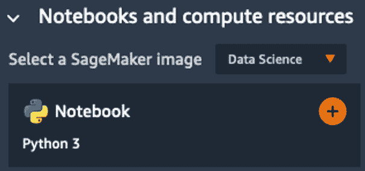

    图 3.1 – 创建一个笔记本

1.  现在，让我们按以下步骤下载并提取数据集：

    ```py
    %%sh
    apt-get -y install unzip
    wget -N https://sagemaker-sample-data-us-west-2.s3-us-west-2.amazonaws.com/autopilot/direct_marketing/bank-additional.zip
    unzip -o bank-additional.zip
    ```

1.  在*第二章*《数据处理技巧》中，我们通过 Amazon SageMaker Processing 运行了一个特征工程脚本。但在这里，我们不做这样的操作：我们只是将数据集原封不动地上传到 S3，上传到 SageMaker 创建的**默认桶**中：

    ```py
    import sagemaker
    prefix = 'sagemaker/DEMO-autopilot/input'
    sess   = sagemaker.Session()
    uri = sess.upload_data(path=”./bank-additional/bank-additional-full.csv”, key_prefix=prefix)
    print(uri)
    ```

    数据集将可在 S3 中的以下位置获取：

    ```py
    s3://sagemaker-us-east-2-123456789012/sagemaker/DEMO-autopilot/input/bank-additional-full.csv
    ```

1.  现在，我们点击左侧垂直图标栏中的**组件与注册表**图标，正如下图所示。这将打开**实验**标签页，我们点击**创建自动驾驶实验**按钮以创建一个新的自动驾驶任务。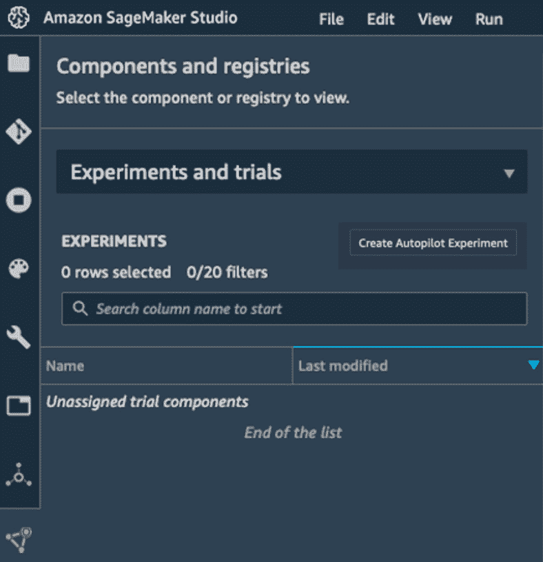

    图 3.2 – 查看实验

1.  下一个屏幕是我们配置任务的地方。让我们输入`my-first-autopilot-job`作为实验名称。

1.  我们使用*第 3 步*返回的路径设置输入数据集的位置。如下图所示，我们可以浏览 S3 桶，或者直接输入 S3 位置：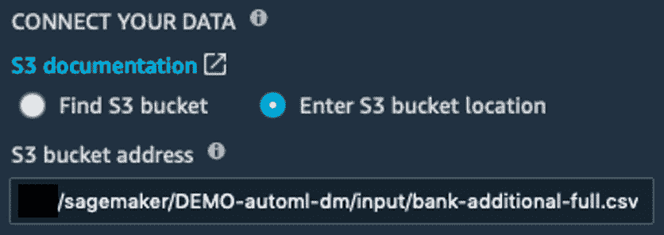

    图 3.3 – 定义输入位置

1.  下一步是定义**目标属性**的名称，如下图所示。存储“是”或“否”标签的列称为“y”。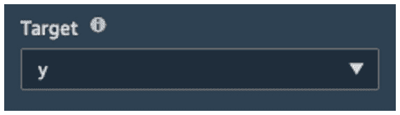

    图 3.4 – 定义目标属性

1.  如下图所示，我们设置任务输出文件的位置，任务生成的工件将被复制到该位置。我在此使用 `s3://sagemaker-us-east-2-123456789012/sagemaker/DEMO-autopilot/output/`，当然，你应该用你自己的区域和账户编号来更新此位置。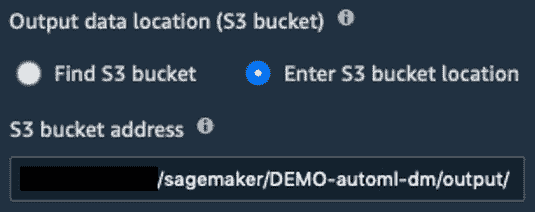

    图 3.5 – 定义输出位置

1.  我们设置所需的任务类型，如下图所示。在这里，我们选择**自动**，让 SageMaker Autopilot 自动确定问题类型。或者，我们可以选择**二元分类**，并选择我们的指标：**准确率**、**AUC** 或 **F1**（默认设置）。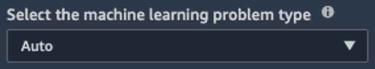

    图 3.6 – 设置问题类型

1.  最后，我们决定是运行完整任务，还是仅生成笔记本。如果选择前者，则如下一图所示。如果选择后者，那么当我们希望手动训练并调整参数时，它将是一个不错的选择。我们还决定暂时不自动部署最佳模型。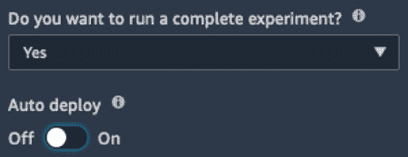

    图 3.7 – 运行完整实验

1.  可选地，在**高级设置**部分，我们可以更改 IAM 角色，设置作业工件的加密密钥，定义我们希望启动作业实例的 VPC 等。这里我们保持默认值。

1.  任务设置已完成：这一切只需要一个屏幕。然后，我们点击**创建实验**，任务就开始了！

## 监控任务

一旦任务启动，它将经过我们已经讨论过的三个步骤，预计大约需要 5 小时完成。新实验会列在**实验**标签中，我们可以右键点击**描述 AutoML 任务**以查看其当前状态。这会打开如下屏幕，我们可以看到任务的进度：

1.  如预期的那样，任务开始时会分析数据，如下面的截图所示：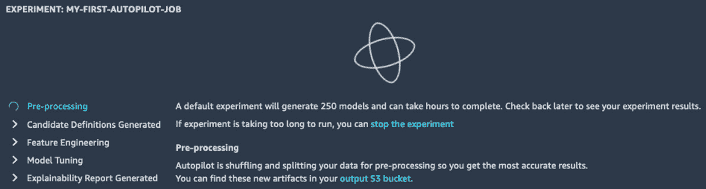

    图 3.8 – 查看任务进度

1.  大约 10 分钟后，数据分析完成，任务进入特征工程阶段，此时输入数据集将按照候选管道中定义的步骤进行转换。如下面的截图所示，我们还可以看到右上角新增了两个按钮，分别指向**候选生成**和**数据探索**笔记本：别担心，我们将在本章后面详细讲解这两者。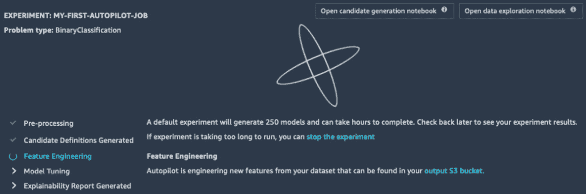

    图 3.9 – 查看任务进度

1.  一旦特征工程完成，接下来的工作就是模型调优，在这一阶段，候选模型会被训练和调整。如下面的截图所示，第一个训练任务很快出现在**试验**标签中。 "试验"是 SageMaker 用来表示一组相关任务的名称，例如处理任务、批量转换任务和训练任务。我们可以看到**目标**，也就是任务试图优化的指标（在本例中是 F1 得分）。我们可以根据该指标对任务进行排序，当前最好的调优任务会被高亮显示并标注星标。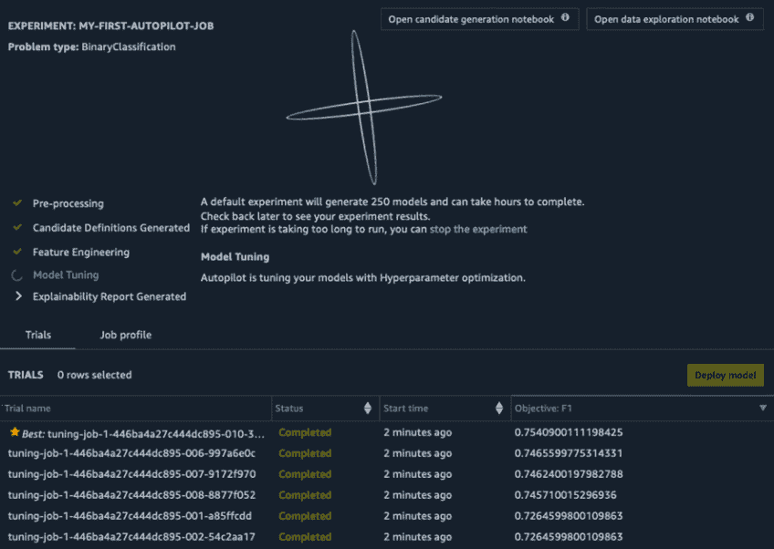

    图 3.10 – 查看调优任务

1.  一旦 AutoPilot 任务完成，你的屏幕应该会类似于以下截图。在这里，顶部模型达到了 0.8031 的 F1 得分。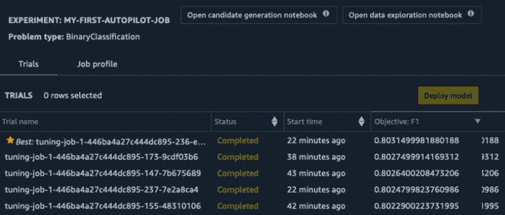

    图 3.11 – 查看结果

1.  如果我们选择最佳任务并右键点击**打开模型详细信息**，我们可以看到一个模型可解释性图，显示了最重要的特征，如下截图所示。该图基于由 AutoPilot 自动计算的全局**SHapley 加法解释**（**SHAP**）值 ([`github.com/slundberg/shap`](https://github.com/slundberg/shap))。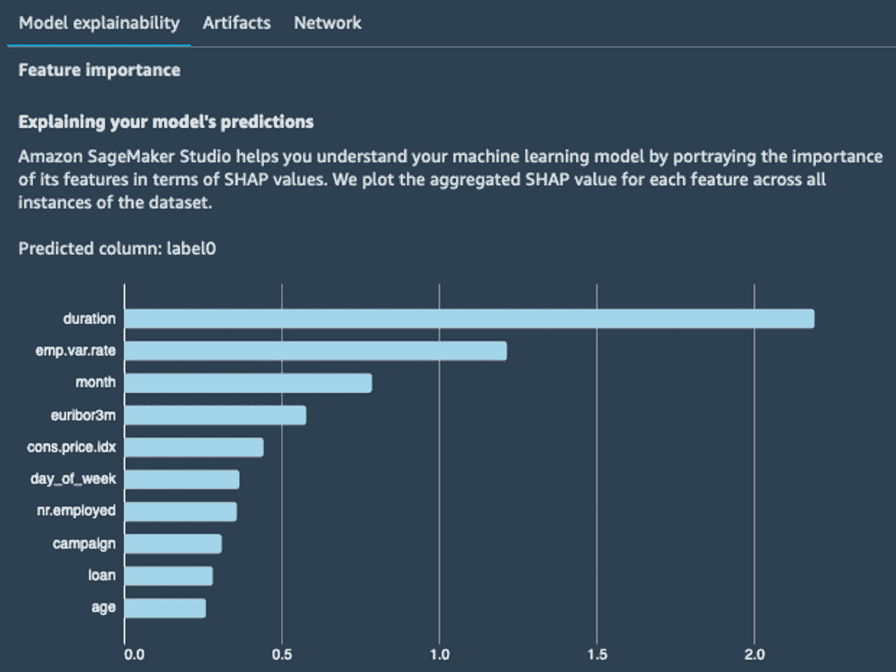

    图 3.12 – 查看最重要特征

1.  在 **Artifacts**（工件）标签中，我们还可以看到构建模型时涉及的训练工件和参数的列表：输入数据、训练和验证分割、转换后的数据集、特征工程代码、算法（在我的案例中是 XGBoost）等。

此时，我们可以直接部署最佳作业，但我们将使用 SageMaker Studio 内置的可视化工具来比较前 10 个作业。

## 比较作业

默认情况下，单个 SageMaker Autopilot 作业会训练 250 个作业。随着时间的推移，你可能会有成千上万个作业，并且你可能希望比较它们的属性。让我们看看如何操作：

1.  在左侧的 **Experiments** 标签页中，我们定位到我们的作业，右键点击**在试验组件列表中打开**，如下图所示：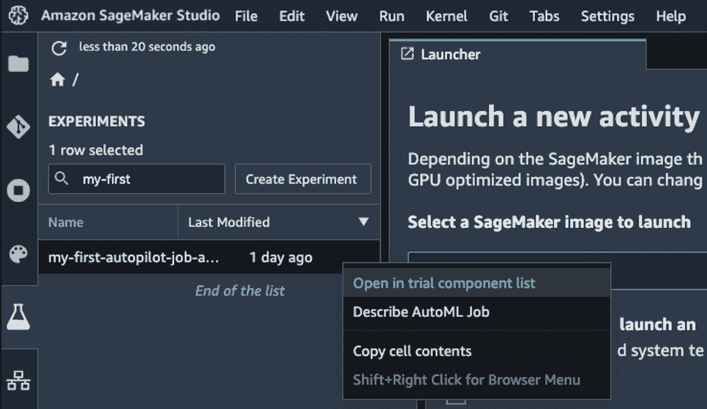

    图 3.13 – 打开试验列表

1.  这将打开**试验组件列表**，如下图所示。

    我们点击右侧的齿轮图标打开 **表格属性** 面板，然后取消勾选除 **Experiment name**（实验名称）、**Trial component name**（试验组件名称）和 **ObjectiveMetric**（目标指标）以外的所有选项。在主面板中，我们通过点击箭头将作业按目标指标降序排序。按住*Shift*键并点击前 10 个作业进行选择，如下图所示：

    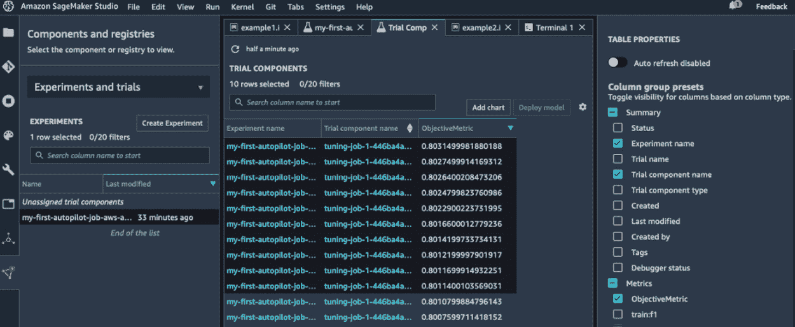

    图 3.14 – 比较作业

1.  然后，我们点击**添加图表**按钮。这将打开一个新的视图，见下图所示。点击图表框底部以打开右侧的**图表属性**面板。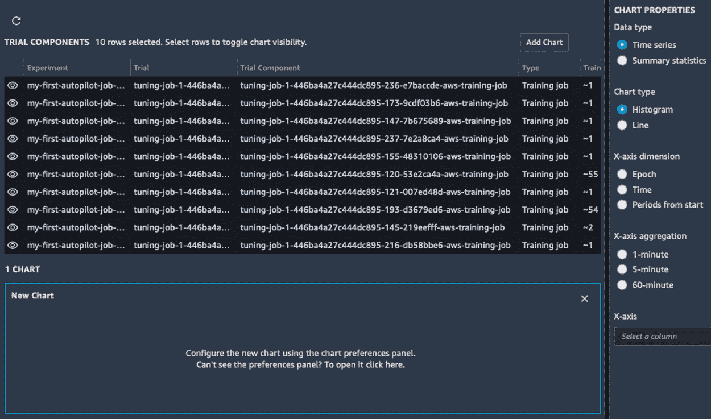

    图 3.15 – 创建图表

    由于我们的训练作业非常短（大约一分钟），因此没有足够的数据生成**时间序列**图表，所以我们选择**汇总统计**。我们将构建一个**散点图**，将 eta 和 lambda 超参数进行对比，如下图所示。我们还将数据点按我们的试验名称进行着色。

    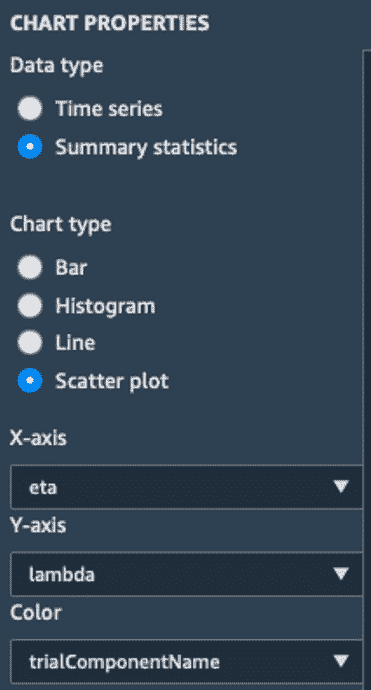

    图 3.16 – 创建图表

1.  放大下图，我们可以快速地可视化我们的作业及其相应的参数。我们还可以构建其他图表，展示某些超参数对准确率的影响。这将帮助我们筛选出一些模型进行进一步的测试。也许我们最终会考虑将多个模型用于集成预测。

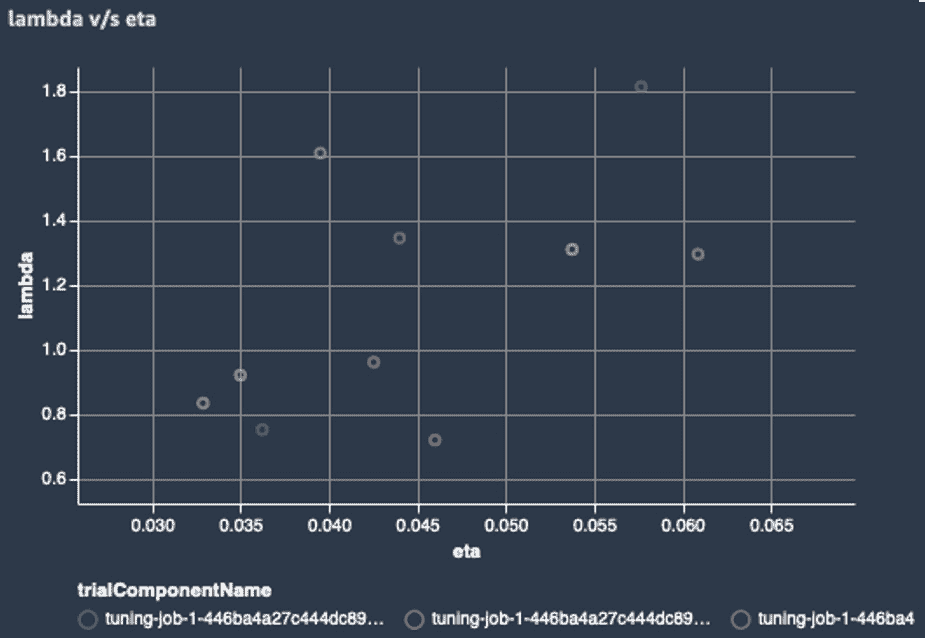

图 3.17 – 绘制超参数图

下一步是部署模型并开始测试。

## 部署和调用模型

SageMaker Studio 使得部署模型变得非常简单。让我们看看如何操作：

1.  返回到**实验**标签页，我们右键点击实验名称并选择**描述 AutoML 作业**。这会打开训练作业列表。确保它们按目标值降序排列，我们选择最好的那个（它会用星标高亮显示），如下图所示，然后点击**部署模型**按钮：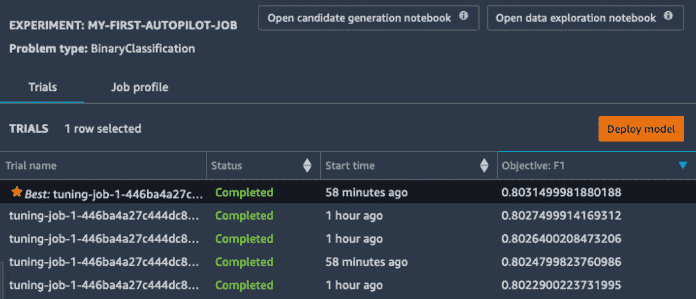

    图 3.18 – 部署模型

1.  在`my-first-autopilot-endpoint`下，保持其他设置不变，点击`ml.m5.xlarge`实例：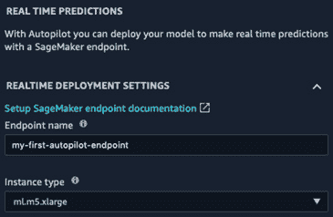

    图 3.19 – 部署模型

1.  进入左侧垂直面板中的**端点**部分，我们可以看到正在创建的端点。如下面的截图所示，最初它会处于**创建中**状态。几分钟后，它会变为**在服务中**：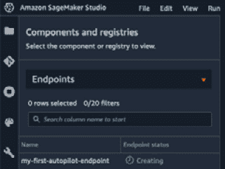

    图 3.20 – 创建端点

1.  转到 Jupyter 笔记本（我们可以重复使用写来下载数据集的那个），我们定义端点的名称和要预测的样本。这里，我使用的是数据集的第一行：

    ```py
    ep_name = 'my-first-autopilot-endpoint'
    sample = '56,housemaid,married,basic.4y,no,no,no,telephone,may,mon,261,1,999,0,nonexistent,1.1,93.994,-36.4,4.857,5191.0'
    ```

1.  我们为 SageMaker 运行时创建一个`boto3`客户端。这个运行时包含一个 API，`invoke_endpoint` ([`boto3.amazonaws.com/v1/documentation/api/latest/reference/services/sagemaker-runtime.html`](https://boto3.amazonaws.com/v1/documentation/api/latest/reference/services/sagemaker-runtime.html))。这使得它非常高效，适合嵌入到只需要调用模型的客户端应用程序中：

    ```py
    import boto3
    sm_rt = boto3.Session().client('runtime.sagemaker')
    ```

1.  我们将样本发送到端点，同时传递输入和输出内容类型：

    ```py
    response = sm_rt.invoke_endpoint(EndpointName=ep_name,
                                  ContentType='text/csv',
                                  Accept='text/csv',
                                  Body=sample)
    ```

1.  我们解码预测结果并打印出来——该客户不太可能接受该提议：

    ```py
    response = response['Body'].read().decode(”utf-8”)
    print(response)
    ```

    这个样本被预测为“否”：

    ```py
    no
    ```

1.  当我们完成测试端点时，我们应该删除它以避免不必要的费用。我们可以通过`boto3`中的`delete_endpoint` API 来实现这一点([`boto3.amazonaws.com/v1/documentation/api/latest/reference/services/sagemaker.html#SageMaker.Client.delete_endpoint`](https://boto3.amazonaws.com/v1/documentation/api/latest/reference/services/sagemaker.html#SageMaker.Client.delete_endpoint))：

    ```py
    sm = boto3.Session().client('sagemaker')
    sm.delete_endpoint(EndpointName=ep_name)
    ```

恭喜！你已经成功地在 Amazon SageMaker 上构建、训练并部署了你的第一个机器学习模型。是不是很简单？我们写的唯一代码是下载数据集并用模型进行预测。

使用**SageMaker Studio**是快速尝试新数据集的好方法，也让技术要求较低的用户可以独立构建模型。高级用户还可以将自己的自定义镜像添加到 SageMaker Studio，更多详细信息请参考[`docs.aws.amazon.com/sagemaker/latest/dg/studio-byoi.html`](https://docs.aws.amazon.com/sagemaker/latest/dg/studio-byoi.html)。

现在，让我们看看如何通过**SageMaker SDK**以编程方式使用 SageMaker Autopilot。

# 使用 SageMaker Autopilot SDK

Amazon SageMaker SDK 包括一个简单的 API 用于 SageMaker Autopilot。你可以在 [`sagemaker.readthedocs.io/en/stable/automl.html`](https://sagemaker.readthedocs.io/en/stable/automl.html) 查阅文档。

在本节中，你将学习如何使用此 API 在与上一节相同的数据集上训练模型。

## 启动任务

SageMaker SDK 使启动 Autopilot 任务变得异常简单——只需将数据上传到 S3，然后调用一个 API！让我们来看看如何操作：

1.  首先，我们导入 SageMaker SDK：

    ```py
    import sagemaker
    sess = sagemaker.Session()
    ```

1.  接着，我们下载数据集：

    ```py
    %%sh
    wget -N https://sagemaker-sample-data-us-west-2.s3-us-west-2.amazonaws.com/autopilot/direct_marketing/bank-additional.zip
    unzip -o bank-additional.zip
    ```

1.  接下来，我们将数据集上传到 S3：

    ```py
    bucket = sess.default_bucket()                     
    prefix = 'sagemaker/DEMO-automl-dm'
    s3_input_data = sess.upload_data(path=”./bank-additional/bank-additional-full.csv”, key_prefix=prefix+'input')
    ```

1.  接着，我们配置 AutoML 任务，这只需要一行代码。我们定义了**目标属性**（记住，这一列的名称是“y”），以及训练产物的存储位置。可选地，我们还可以设置任务的最大运行时间、每个任务的最大运行时间，或者减少将要调优的候选模型数量。请注意，限制任务持续时间过多可能会影响其准确性。对于开发目的而言，这不是问题，因此我们将任务时长限制为一小时，或者 250 个调优任务（以先到为准）：

    ```py
    from sagemaker.automl.automl import AutoML
    auto_ml_job = AutoML(
        role = sagemaker.get_execution_role(),                                          
        sagemaker_session = sess,                             
        target_attribute_name = 'y',                             
        output_path = 
            's3://{}/{}/output'.format(bucket,prefix),
        max_runtime_per_training_job_in_seconds = 600,
        max_candidates = 250,
        total_job_runtime_in_seconds = 3600
    )
    ```

1.  接下来，我们启动 Autopilot 任务，传递给它训练集的位置。我们关闭日志（谁想阅读数百个调优日志呢？），并将调用设置为非阻塞，因为我们希望在接下来的单元格中查询任务状态：

    ```py
    auto_ml_job.fit(inputs=s3_input_data, logs=False, wait=False)
    ```

任务会立刻开始。现在让我们看看如何监控它的状态。

## 监控任务

在任务运行时，我们可以使用`describe_auto_ml_job()` API 来监控其进度：

1.  例如，以下代码将每 60 秒检查一次任务的状态，直到数据分析步骤完成：

    ```py
    from time import sleep
    job = auto_ml_job.describe_auto_ml_job()
    job_status = job['AutoMLJobStatus']
    job_sec_status = job['AutoMLJobSecondaryStatus']
    if job_status not in ('Stopped', 'Failed'):
        while job_status in ('InProgress') and job_sec_status in ('AnalyzingData'):
            sleep(60)
            job = auto_ml_job.describe_auto_ml_job()
            job_status = job['AutoMLJobStatus']
            job_sec_status =   
                 job['AutoMLJobSecondaryStatus']
            print (job_status, job_sec_status)
    ```

1.  一旦数据分析完成，两个自动生成的 notebook 就会可用。我们可以使用相同的 API 查找它们的位置：

    ```py
    job = auto_ml_job.describe_auto_ml_job()
    job_candidate_notebook = job['AutoMLJobArtifacts']['CandidateDefinitionNotebookLocation']
    job_data_notebook = job['AutoMLJobArtifacts']['DataExplorationNotebookLocation']
    print(job_candidate_notebook)
    print(job_data_notebook)
    ```

    这会打印出两个 notebook 的 S3 路径：

    ```py
    s3://sagemaker-us-east-2-123456789012/sagemaker/DEMO-automl-dm/output/automl-2020-04-24-14-21-16-938/sagemaker-automl-candidates/pr-1-a99cb56acb5945d695c0e74afe8ffe3ddaebafa94f394655ac973432d1/notebooks/SageMakerAutopilotCandidateDefinitionNotebook.ipynb
    s3://sagemaker-us-east-2-123456789012/sagemaker/DEMO-automl-dm/output/automl-2020-04-24-14-21-16-938/sagemaker-automl-candidates/pr-1-a99cb56acb5945d695c0e74afe8ffe3ddaebafa94f394655ac973432d1/notebooks/SageMakerAutopilotDataExplorationNotebook.ipynb
    ```

1.  使用 AWS CLI，我们可以将两个 notebook 下载到本地。我们稍后将在本章中查看它们：

    ```py
    %%sh -s $job_candidate_notebook $job_data_notebook
    aws s3 cp $1 .
    aws s3 cp $2 .
    ```

1.  当特征工程运行时，我们可以使用与之前相同的代码片段等待完成，循环判断 `job_sec_status` 是否等于 `FeatureEngineering`。

1.  一旦模型调优完成，我们可以非常轻松地找到最佳候选模型：

    ```py
    job_best_candidate = auto_ml_job.best_candidate()
    print(job_best_candidate['CandidateName'])
    print(job_best_candidate['FinalAutoMLJobObjectiveMetric'])
    ```

    这会输出最佳调优任务的名称及其验证准确度：

    ```py
    tuning-job-1-57d7f377bfe54b40b1-030-c4f27053
    {'MetricName': 'validation:accuracy', 'Value': 0.9197599935531616}
    ```

然后，我们可以使用 SageMaker SDK 部署并测试模型。我们已经涵盖了很多内容，所以将这部分留到后续章节，我们会重新回顾这个例子。

## 清理

SageMaker Autopilot 创建了许多底层产物，例如数据集拆分、预处理脚本、预处理数据集和模型。如果你想完全清理，下面的代码片段可以做到这一点。当然，你也可以使用 AWS CLI：

```py
import boto3
job_outputs_prefix = '{}/output/{}'.format(prefix, job['AutoMLJobName'])
s3_bucket = boto3.resource('s3').Bucket(bucket)
s3_bucket.objects.filter(Prefix=job_outputs_prefix).delete()
```

既然我们已经知道如何使用 SageMaker Studio GUI 和 SageMaker SDK 训练模型，让我们深入了解其背后的原理。工程师们喜欢理解事物是如何真正工作的，对吧？

# 深入了解 SageMaker Autopilot

在本节中，我们将详细了解 SageMaker Autopilot 如何处理数据并训练模型。如果现在感觉太高级，可以跳过这些内容。等你对该服务有了更多经验后，可以随时回头再看。

首先，让我们来看一下 SageMaker Autopilot 生成的工件。

## 作业工件

列出我们的 S3 存储桶可以确认存在许多不同的工件：

```py
$ aws s3 ls s3://sagemaker-us-east-2-123456789012/sagemaker/DEMO-autopilot/output/my-first-autopilot-job/
```

我们可以看到许多新的前缀。让我们来弄明白它们分别代表什么：

```py
PRE data-processor-models/
PRE documentation/
PRE preprocessed-data/
PRE sagemaker-automl-candidates/
PRE transformed-data/
PRE tuning/
PRE validations/
```

+   `preprocessed-data/tuning_data` 前缀包含从输入数据集生成的训练和验证拆分。每个拆分进一步被分解成小的 CSV 块。

+   `sagemaker-automl-candidates` 前缀包含 10 个数据预处理脚本（`dpp[0-9].py`），每个管道一个。它还包含训练它们的代码（`trainer.py`），以及使用这 10 个生成模型中的每一个处理输入数据集的代码（`sagemaker_serve.py`）。最后但同样重要的是，它包含自动生成的笔记本。

+   `data-processor-models` 前缀包含通过 `dpp` 脚本训练的 10 个数据处理模型。

+   `transformed-data` 前缀包含训练和验证拆分的 10 个处理版本。

+   `tuning` 前缀包含在**模型调优**步骤中训练的实际模型。

+   `documentation` 前缀包含可解释性报告。

以下图表总结了这些工件之间的关系：

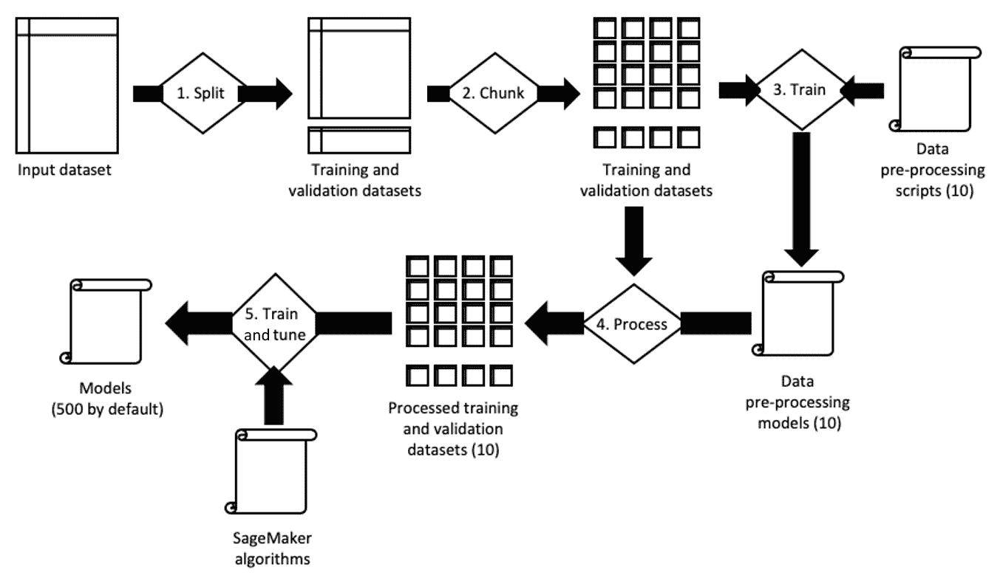

图 3.21 – 总结 Autopilot 过程

在接下来的几节中，我们将看一下两个**自动生成的笔记本**，它们是 SageMaker Autopilot 中最重要的功能之一。

## 数据探索笔记本

一旦数据分析步骤完成，此笔记本可以在 Amazon S3 上使用。

第一部分，如下图所示，简单地显示了数据集的一个样本：

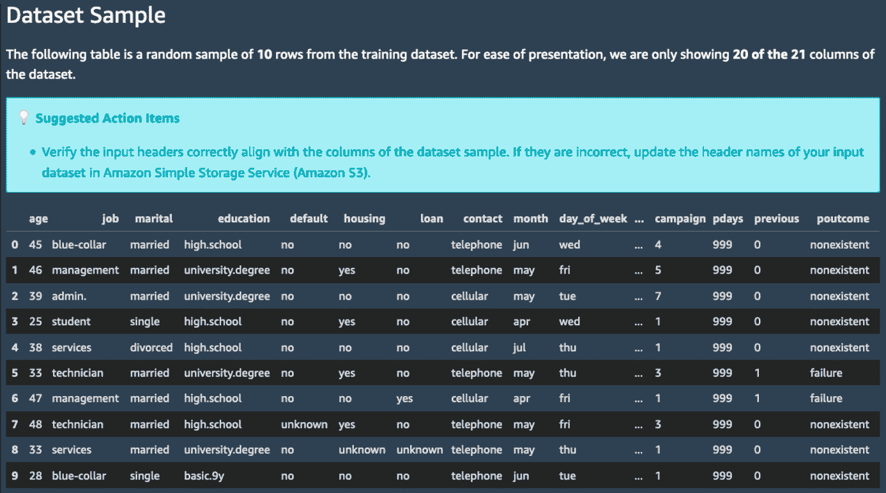

图 3.22 – 查看数据集统计信息

如下截图所示，第二部分重点分析列：缺失值的百分比、唯一值的计数和描述性统计数据。例如，`pdays` 字段的最大值和中位数均为 999，这看起来很可疑。如上一章所述，999 确实是一个占位符值，意味着客户之前从未被联系过。

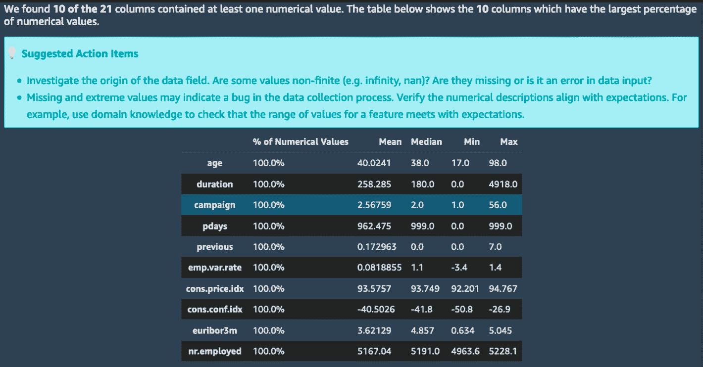

图 3.23 – 查看数据集统计信息

如你所见，这个笔记本为我们省去了计算这些统计数据的麻烦，我们可以利用它们快速检查数据集是否符合预期。

现在，让我们来看一下第二个笔记本。正如你将看到的，它非常具有洞察力！

## 候选生成笔记本

本笔记本包含了 10 个候选管道的定义，以及它们的训练方式。这是一个**可运行的笔记本**，高级实践者可以利用它重现 AutoML 过程，并不断优化实验。请注意，这完全是可选的！直接部署最佳模型并开始测试也是完全可以的。

话虽如此，让我们手动运行其中一个管道：

1.  我们打开笔记本并通过点击右上角的**导入笔记本**链接保存一个可读写的副本。

1.  然后，我们在**SageMaker 设置**部分运行单元格，以导入所有所需的工件和参数。

1.  移动到**候选管道**部分，我们创建一个运行器对象，它将为选定的候选管道启动作业：

    ```py
    from sagemaker_automl import AutoMLInteractiveRunner, AutoMLLocalCandidate
    automl_interactive_runner = AutoMLInteractiveRunner(AUTOML_LOCAL_RUN_CONFIG)
    ```

1.  接着，我们添加第一个管道（`dpp0`）。笔记本告诉我们：“*此数据转换策略首先使用`RobustImputer`转换'数值'特征（将缺失值转换为 nan），然后使用`ThresholdOneHotEncoder`转换'类别'特征。它将所有生成的特征合并并应用`RobustStandardScaler`。转换后的数据将用于调整 XGBoost 模型*。”我们只需运行以下单元格来添加它：

    ```py
    automl_interactive_runner.select_candidate(
        {”data_transformer”: {
            ”name”: ”dpp0”,
            …
        }
    )
    ```

    如果你对`RobustImputer`或`ThresholdOneHotEncoder`的实现感到好奇，超链接将引导你到`sagemaker_sklearn_extension`模块中的相关源文件（https://github.com/aws/sagemaker-scikit-learn-extension/）。

    这样，你可以准确理解数据是如何处理的。由于这些对象是基于 scikit-learn 对象构建的，它们应该会很快变得非常熟悉。例如，我们可以看到`RobustImputer`是建立在`sklearn.impute.SimpleImputer`之上的，并增加了额外的功能。同样，`ThresholdOneHotEncoder`是`sklearn.preprocessing.OneHotEncoder`的扩展。

1.  浏览其他管道时，我们可以看到不同的处理策略和算法。你应该能看到在一些管道中使用的**线性学习者**算法。它是 SageMaker 中的**内置算法**之一，我们将在下一章进行讲解。你还应该能看到基于神经网络的**mlp**算法。

1.  向下滚动，我们进入了`dpp0.py`脚本，并看到该模型将使用 XGBoost 算法进行训练。

1.  点击**dpp0**超链接会打开脚本。正如预期的那样，我们看到它构建了一个 scikit-learn 变换器管道（不要与由预处理和训练作业组成的 SageMaker 管道混淆）。数值特征的缺失值被填补，而类别特征则被进行独热编码。接下来，所有特征都被缩放，标签也被编码：

    ```py
    numeric_processors = Pipeline(
      steps=[('robustimputer',
             RobustImputer(strategy='constant',fill_values=nan))]
    )
    categorical_processors = Pipeline(
      steps=[('thresholdonehotencoder', 
             ThresholdOneHotEncoder(threshold=301))]
    )
    column_transformer = ColumnTransformer(
      transformers=[
        ('numeric_processing', numeric_processors, numeric),
        ('categorical_processing', categorical_processors,   
         categorical)]
    )
    return Pipeline(steps=[
      ('column_transformer', column_transformer),   
      ('robuststandardscaler', RobustStandardScaler())]
    )
    ```

1.  回到笔记本中，我们在**运行数据转换步骤**部分启动此脚本：

    ```py
    automl_interactive_runner.fit_data_transformers(parallel_jobs=7)
    ```

1.  这将创建两个顺序执行的 SageMaker 作业，其工件将存储在为笔记本运行创建的新前缀中：

    ```py
    dpp0 transformers on the input dataset.The second job processes the input dataset with the resulting model. For the record, this job uses the SageMaker **Batch Transform** feature, which will be covered in a later chapter.
    ```

1.  返回到 SageMaker Studio，让我们进一步了解这两个作业。从`my-first-a-notebook-run-24-13-17-22-dpp0-train-24-13-38-38-aws-training-job`和`my-first-a-notebook-run-24-13-17-22-dpp0-transform-24-13-38-38-aws-transform-job`开始。

1.  双击作业名称会打开**试验详情**窗口，如下截图所示。它告诉我们关于作业的所有信息：参数、工件的位置等等：

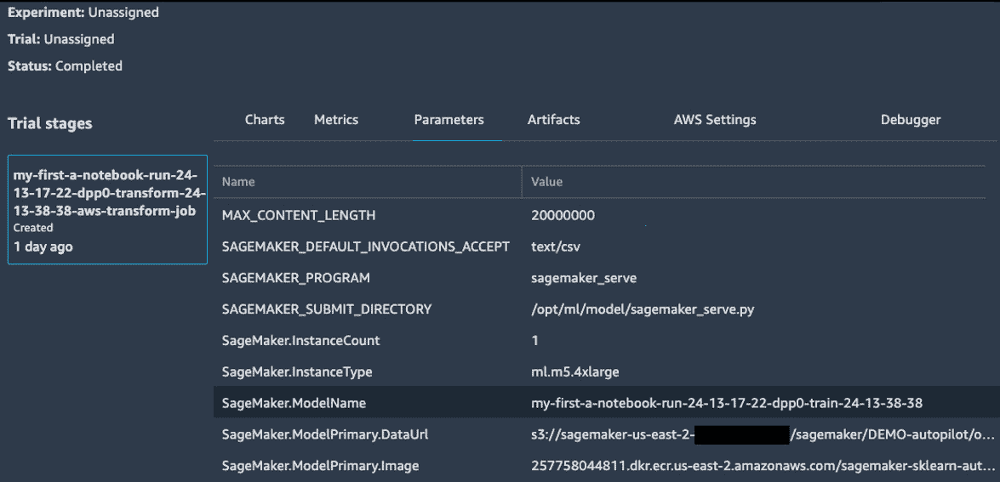

图 3.25 – 描述一个试验

一旦数据处理完成，笔记本将继续进行**自动模型调优**和**模型部署**。我们还没有讨论这些主题，所以现在先停在这里。等你对这些内容熟悉后，建议你继续阅读笔记本的其余部分。

# 总结

正如你所看到的，Amazon SageMaker Autopilot 使得初学者和高级用户都能轻松构建、训练和优化机器学习模型。

在本章中，你了解了 Autopilot 作业的不同步骤，以及它们从机器学习角度的含义。你还学会了如何使用 SageMaker Studio 图形用户界面和 SageMaker SDK 构建一个分类模型，几乎不需要编写代码。然后，我们深入探讨了自动生成的笔记本，这些笔记本让你对建模过程拥有完全的控制权和透明度。特别是，你学会了如何手动运行候选生成笔记本，以重播所有涉及的步骤。

在下一章中，你将学习如何使用 Amazon SageMaker 中的内置算法，训练模型以解决各种机器学习问题。
