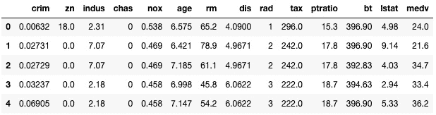
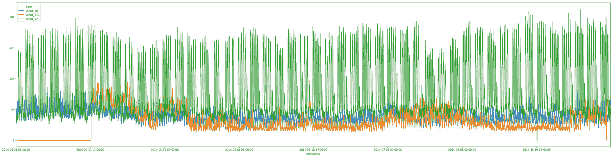

# 第四章：训练机器学习模型

在上一章中，你学习了 Amazon SageMaker Autopilot 如何让你轻松构建、训练和自动优化模型，而无需编写一行机器学习代码。

对于 SageMaker Autopilot 不支持的问题类型，下一最佳选择是使用 SageMaker 中已实现的算法之一，并在你的数据集上进行训练。这些算法被称为 **内置算法**，它们涵盖了许多典型的机器学习问题，从分类到时间序列到异常检测。

在本章中，你将学习适用于监督学习和无监督学习的内置算法，了解你可以用它们解决什么类型的问题，以及如何使用 SageMaker SDK 来使用它们：

+   发现 Amazon SageMaker 中的内置算法

+   使用内置算法训练和部署模型

+   使用 SageMaker SDK 与内置算法

+   使用更多内置算法

# 技术要求

你需要一个 AWS 账户才能运行本章中的示例。如果你还没有账户，请访问 [`aws.amazon.com/getting-started/`](https://aws.amazon.com/getting-started/) 创建一个。你还应该熟悉 AWS 免费套餐 ([`aws.amazon.com/free/`](https://aws.amazon.com/free/))，它让你在某些使用限制内免费使用许多 AWS 服务。

你需要为你的账户安装并配置 AWS 命令行界面（CLI） ([`aws.amazon.com/cli/`](https://aws.amazon.com/cli/))。

你需要一个工作中的 Python 3.x 环境。安装 Anaconda 发行版 ([`www.anaconda.com/`](https://www.anaconda.com/)) 不是强制性的，但强烈推荐，因为它包含了我们将需要的许多项目（Jupyter，`pandas`，`numpy` 等）。

本书中包含的代码示例可在 GitHub 上找到：[`github.com/PacktPublishing/Learn-Amazon-SageMaker-second-edition`](https://github.com/PacktPublishing/Learn-Amazon-SageMaker-second-edition)。你需要安装 Git 客户端才能访问它们 ([`git-scm.com/`](https://git-scm.com/))。

# 发现 Amazon SageMaker 中的内置算法

内置算法是由亚马逊实现的机器学习算法，在某些情况下是由亚马逊发明的 ([`docs.aws.amazon.com/sagemaker/latest/dg/algos.html`](https://docs.aws.amazon.com/sagemaker/latest/dg/algos.html))。它们让你在无需编写一行机器学习代码的情况下，快速训练和部署自己的模型。实际上，由于训练和预测代码是现成的，你无需担心实现它，能够专注于眼前的机器学习问题。像往常一样，SageMaker 完全管理基础设施，节省你更多的时间。

在本节中，您将了解传统机器学习问题的内置算法。计算机视觉和自然语言处理相关的算法将在接下来的两章中介绍。

## 有监督学习

有监督学习专注于需要标记数据集的问题，如回归或分类：

+   **线性学习器**构建线性模型来解决回归问题以及分类问题（包括二分类和多分类）。

+   **因式分解机**构建线性模型来解决回归问题以及分类问题（包括二分类和多分类）。因式分解机是线性模型的推广，特别适用于高维稀疏数据集，如推荐系统中的用户-物品交互矩阵。

+   **K 最近邻**（**KNN**）构建非参数模型用于回归和分类问题。

+   **XGBoost**构建回归、分类和排序问题的模型。XGBoost 可能是当前使用最广泛的机器学习算法，SageMaker 使用的是[`github.com/dmlc/xgboost`](https://github.com/dmlc/xgboost)提供的开源实现。

+   **DeepAR**构建多变量时间序列的预测模型。DeepAR 是基于**循环神经网络**的亚马逊发明算法，您可以通过[`arxiv.org/abs/1704.04110`](https://arxiv.org/abs/1704.04110)了解更多信息。

+   **Object2Vec**从通用高维对象中学习低维嵌入。Object2Vec 是由亚马逊发明的算法。

+   **BlazingText**构建文本分类模型。这个算法由亚马逊发明，您可以通过[`dl.acm.org/doi/10.1145/3146347.3146354`](https://dl.acm.org/doi/10.1145/3146347.3146354)了解更多信息。

## 无监督学习

无监督学习不需要标记数据集，涉及的问题包括聚类或异常检测：

+   **K 均值**构建聚类模型。SageMaker 使用了一个修改版的网页规模 K 均值聚类算法（[`www.eecs.tufts.edu/~dsculley/papers/fastkmeans.pdf`](https://www.eecs.tufts.edu/~dsculley/papers/fastkmeans.pdf)）。

+   **主成分分析**（**PCA**）构建降维模型。

+   **随机切割森林**构建异常检测模型。

+   **IP 洞察**构建模型以识别 IPv4 地址的使用模式。这对于监控、网络安全等领域非常有用。

+   **BlazingText**计算词向量，这对于自然语言处理任务非常有用。

本章剩余部分将详细介绍其中一些算法。

## 关于可扩展性

在我们深入了解如何使用这些算法进行模型训练和部署之前，您可能会想知道为什么要使用它们，而不是使用像`scikit-learn`和`R`等著名库中的算法。

首先，这些算法已经由亚马逊团队实现并调优，亚马逊团队可不是机器学习的新人！大量的工作已经投入到确保这些算法在 AWS 基础设施上尽可能快速运行，无论你使用什么类型的实例。此外，许多算法支持**分布式训练**，让你可以将模型训练分布到一个完全托管的实例集群中。

正因如此，基准测试表明，这些算法通常比竞争对手的实现要好 10 倍。在许多情况下，它们也更具成本效益。你可以在以下网址了解更多信息：

+   AWS 特拉维夫峰会 2018：*通过内置算法加速你的机器学习工作流程*：[`www.youtube.com/watch?v=IeIUr78OrE0`](https://www.youtube.com/watch?v=IeIUr78OrE0)

+   *亚马逊中的弹性机器学习算法*，Liberty 等，SIGMOD'20：SageMaker：[`www.amazon.science/publications/elastic-machine-learning-algorithms-in-amazon-sagemaker`](https://www.amazon.science/publications/elastic-machine-learning-algorithms-in-amazon-sagemaker)

当然，这些算法也受益于 SageMaker 中的所有功能，正如你在本书的结尾部分会发现的那样。

# 使用内置算法训练和部署模型

Amazon SageMaker 让你以多种不同配置训练和部署模型。虽然它鼓励最佳实践，但它是一个模块化的服务，允许你按照自己的方式操作。

在本节中，我们将首先看看一个典型的端到端工作流程，展示如何从数据上传到模型部署，使用 SageMaker。然后，我们将讨论替代工作流程，以及如何根据需要挑选所需的功能。最后，我们将深入了解，从基础设施的角度看，当我们训练和部署时会发生什么。

## 理解端到端工作流程

让我们看看一个典型的 SageMaker 工作流程。你会在我们的示例中反复看到它，也会在 GitHub 上提供的 AWS 笔记本中看到它（[`github.com/awslabs/amazon-sagemaker-examples/`](https://github.com/awslabs/amazon-sagemaker-examples/)）：

1.  `protobuf` ([`developers.google.com/protocol-buffers`](https://developers.google.com/protocol-buffers))。

1.  **配置训练任务**：在这里，你可以选择想要训练的算法，设置超参数，并定义训练任务的基础设施要求。

1.  **启动训练任务**：在这里，我们传入你在 S3 中的数据集位置。训练发生在托管的基础设施上，系统会根据你的需求自动创建和配置。一旦训练完成，**模型工件**会被保存在 S3 中。训练基础设施会自动终止，你只需为实际使用的部分付费。

1.  **部署模型**：你可以将模型部署到 **实时 HTTPS 端点** 进行实时预测，或部署到 **批量转换** 中。同样，你只需要定义基础设施要求。

1.  **预测数据**：可以调用实时端点或批量转换器。正如你所期望的，这里的基础设施也已托管。对于生产环境，你还需要监控数据和预测的质量。

1.  **清理！**：这涉及关闭端点，以避免不必要的费用。

理解这个工作流程对于提高 Amazon SageMaker 的生产力至关重要。幸运的是，SageMaker SDK 提供了与这些步骤高度匹配的简单 API，因此你不必担心该使用哪个 API，或者何时使用它。

在我们开始查看 SDK 之前，让我们考虑一些在你的业务和技术环境中可能有意义的替代工作流。

## 使用替代工作流

Amazon SageMaker 是一个模块化的服务，允许你按自己的方式工作。让我们首先考虑一个工作流，其中你会在 SageMaker 上进行训练，并在你自己的服务器上进行部署，无论原因是什么。

### 导出模型

步骤 1-3 与前面的示例相同，然后你可以做如下操作：

1.  从 S3 下载训练工件，它以 `model.tar.gz` 文件的形式存在。

1.  提取存储在工件中的模型。

1.  在你自己的服务器上，使用适当的机器学习库加载模型：

    +   `fastText` 实现可以在 [`fasttext.cc/`](https://fasttext.cc/) 获取。

    +   **对于所有其他模型**：使用 **Apache MXNet** ([`mxnet.apache.org/`](https://mxnet.apache.org/))。

现在，让我们看看如何将现有模型导入并部署到 SageMaker 上。

### 导入模型

步骤同样简单：

1.  将你的模型打包成模型工件（`model.tar.gz`）。

1.  将工件上传到 S3 桶。

1.  将工件注册为 SageMaker 模型。

1.  部署模型并进行预测。

这只是一个快速的概览。我们将在 *第十一章*，*部署机器学习模型* 中为这两个工作流运行完整的示例。

## 使用完全托管的基础设施

所有 SageMaker 作业都在托管基础设施上运行。让我们看看背后的工作原理，看看训练和部署模型时发生了什么。

### 将算法打包到 Docker 容器中

所有 SageMaker 算法必须打包在 **Docker** 容器中。别担心，使用 SageMaker 并不需要你对 Docker 有太多了解。如果你不熟悉 Docker，建议你阅读这个教程，以了解关键概念和工具：[`docs.docker.com/get-started/`](https://docs.docker.com/get-started/)。多了解一点总是有好处的！

正如您所预期的，内置算法已经打包好，并且容器随时可用于训练和部署。它们托管在**Amazon Elastic Container Registry**（**ECR**）中，这是 AWS 的 Docker 注册服务 ([`aws.amazon.com/ecr/`](https://aws.amazon.com/ecr/))。由于 ECR 是一个基于区域的服务，您会在每个 SageMaker 可用的区域找到一系列容器。

您可以在 [`docs.aws.amazon.com/sagemaker/latest/dg/sagemaker-algo-docker-registry-paths.html`](https://docs.aws.amazon.com/sagemaker/latest/dg/sagemaker-algo-docker-registry-paths.html) 找到内置算法容器的列表。例如，在 eu-west-1 区域，Linear Learner 算法的容器名称是 `438346466558.dkr.ecr.eu-west-1.amazonaws.com/linear-learner:latest`。这些容器只能拉取到 SageMaker 管理的实例中，因此您无法在本地计算机上运行它们。

现在，让我们来看一下底层基础设施。

### 创建训练基础设施

当您启动训练作业时，SageMaker 会根据您的需求（实例类型和实例数量）启动基础设施。

一旦训练实例投入使用，它会从 ECR 拉取适当的训练容器。超参数会应用到算法上，算法也会接收到数据集的位置。默认情况下，算法会从 S3 复制完整的数据集并开始训练。如果配置了分布式训练，SageMaker 会自动将数据集批次分发到集群中的不同实例。

训练完成后，模型会被打包成模型工件并保存在 S3 中。然后，训练基础设施会自动关闭。日志可以在**Amazon CloudWatch Logs**中查看。最后但同样重要的是，您只会按实际的训练时间收费。

### 创建预测基础设施

当您启动部署作业时，SageMaker 会根据您的需求再次创建基础设施。

现在让我们暂时专注于实时终端节点，而不关注批量转换。

一旦终端节点实例投入使用，它会从 ECR 拉取适当的预测容器，并从 S3 加载您的模型。然后，HTTPS 端点会被配置好，并在几分钟内准备好进行预测。

如果您配置了多个实例的终端节点，负载均衡和高可用性将自动设置。如果您配置了**自动扩展**，也会应用此设置。

正如您所预期的，终端节点会保持开启状态，直到显式删除它，无论是在 AWS 控制台中，还是通过 SageMaker API 调用。在此期间，您将为终端节点付费，因此**请确保删除不再需要的终端节点！**

现在我们了解了大致情况，让我们开始了解 SageMaker SDK，看看如何使用它来训练和部署模型。

# 使用内置算法的 SageMaker SDK

熟悉 SageMaker SDK 对于充分利用 SageMaker 至关重要。您可以在[`sagemaker.readthedocs.io`](https://sagemaker.readthedocs.io)找到其文档。

通过一个简单的示例入手是最好的开始方式。在本节中，我们将使用 Linear Learner 算法在波士顿房价数据集上训练回归模型（[`www.kaggle.com/c/boston-housing`](https://www.kaggle.com/c/boston-housing)）。我们将非常慢地进行，每一步都不遗漏。再次强调，这些概念非常重要，请花时间理解每一个步骤。

提醒

我建议您跟随并运行伴随 GitHub 仓库中的代码。我们已尽一切努力检查文中所有代码示例。然而，对于电子版的用户，复制粘贴可能会导致不可预测的结果：格式问题、奇怪的引号等。

## 数据准备

内置算法要求数据集必须符合特定格式，例如**CSV**、**protobuf**或**libsvm**。支持的格式可以在算法文档中找到。例如，Linear Learner 支持 CSV 和 RecordIO 包装的 protobuf（[`docs.aws.amazon.com/sagemaker/latest/dg/linear-learner.html#ll-input_output`](https://docs.aws.amazon.com/sagemaker/latest/dg/linear-learner.html#ll-input_output)）。

我们的输入数据集已经以 CSV 格式存储在仓库中，因此我们将使用它。数据集准备将极为简单，我们将手动运行它：

1.  使用`pandas`，我们用 pandas 加载 CSV 数据集：

    ```py
    import pandas as pd
    dataset = pd.read_csv('housing.csv')
    ```

1.  然后，我们打印数据集的形状：

    ```py
    print(dataset.shape)
    ```

    它包含 506 个样本和 13 列：

    ```py
    (506, 13)
    ```

1.  现在，我们显示数据集的前 5 行：

    ```py
    dataset[:5]
    ```

    这将输出以下图中可见的表格。对于每个房子，我们可以看到 12 个特征，以及一个目标属性（`medv`），该属性是房子的中位数价格（以千美元为单位）：

    

    图 4.1 – 查看数据集

1.  阅读算法文档（[`docs.aws.amazon.com/sagemaker/latest/dg/cdf-training.html`](https://docs.aws.amazon.com/sagemaker/latest/dg/cdf-training.html)），我们看到*Amazon SageMaker 要求 CSV 文件没有头部记录，且目标变量必须位于第一列*。因此，我们将`medv`列移动到数据框的最前面：

    ```py
    dataset = pd.concat([dataset['medv'],
                         dataset.drop(['medv'], axis=1)], 
                         axis=1)
    ```

1.  一些`scikit-learn`的魔法帮助我们将数据框分为两部分——90%用于训练，10%用于验证：

    ```py
    from sklearn.model_selection import train_test_split
    training_dataset, validation_dataset =  
        train_test_split(dataset, test_size=0.1)
    ```

1.  我们将这两个拆分保存为单独的 CSV 文件，不包含索引或头部：

    ```py
    training_dataset.to_csv('training_dataset.csv', 
                            index=False, header=False)
    validation_dataset.to_csv('validation_dataset.csv', 
                              index=False, header=False)
    ```

1.  现在，我们需要将这两个文件上传到 S3。我们可以使用任何桶，在这里我们将使用 SageMaker 在我们运行的区域自动创建的默认桶。我们可以通过`sagemaker.Session.default_bucket()` API 查找其名称：

    ```py
    import sagemaker
    sess = sagemaker.Session()
    bucket = sess.default_bucket()
    ```

1.  最后，我们使用 `sagemaker.Session.upload_data()` API 将两个 **CSV** 文件上传到默认存储桶。这里，训练和验证数据集每个由一个文件组成，但如果需要，我们也可以上传多个文件。因此，**我们必须将数据集上传到不同的 S3 前缀下**，以避免文件混淆：

    ```py
    prefix = 'boston-housing'
    training_data_path = sess.upload_data(
        path='training_dataset.csv', 
        key_prefix=prefix + '/input/training')
    validation_data_path = sess.upload_data(
        path='validation_dataset.csv', 
        key_prefix=prefix + '/input/validation')
    print(training_data_path)
    print(validation_data_path)
    ```

    这两个 S3 路径如下所示。自然，默认存储桶名称中的账户号码会有所不同：

    ```py
    s3://sagemaker-eu-west-1-123456789012/boston-housing/input/training/training_dataset.csv
    s3://sagemaker-eu-west-1-123456789012/boston-housing/input/validation/validation_dataset.csv
    ```

现在数据已经准备好在 S3 中，我们可以配置训练任务。

## 配置训练任务

`Estimator` 对象（`sagemaker.estimator.Estimator`）是模型训练的基石。它让你选择适当的算法，定义你的训练基础设施要求等。

SageMaker SDK 还包括特定算法的估算器，例如 `sagemaker.LinearLearner` 或 `sagemaker.PCA`。我通常认为它们不如通用估算器灵活（例如不支持 CSV 格式），并且不推荐使用它们。使用 `Estimator` 对象还可以让你在不同示例之间重用代码，正如我们在接下来的章节中所看到的：

1.  在本章之前，我们学习了 SageMaker 算法是打包在 Docker 容器中的。通过使用 `boto3` 和 `image_uris.retrieve()` API，我们可以轻松找到我们运行的区域中 Linear Learner 算法的名称：

    ```py
    from sagemaker import get_execution_role
    from sagemaker.image_uris import retrieve
    region = sess.boto_session.region_name
    container = retrieve('linear-learner', region)
    ```

1.  现在我们知道了容器的名称，我们可以使用 `Estimator` 对象来配置我们的训练任务。除了容器名称外，我们还需要传递 SageMaker 实例将使用的 IAM 角色、用于训练的实例类型和实例数量，以及模型的输出位置。`Estimator` 会自动生成一个训练任务，我们还可以通过 `base_job_name` 参数设置自己的前缀：

    ```py
    from sagemaker.estimator import Estimator
    ll_estimator = Estimator(
        container,
        role=sagemaker.get_execution_role(),
        instance_count=1,
        instance_type='ml.m5.large',
        output_path='s3://{}/{}/output'.format(bucket, 
                                               prefix))
    ```

    SageMaker 支持多种不同类型的实例，不同的 AWS 区域之间有所差异。你可以在 [`docs.aws.amazon.com/sagemaker/latest/dg/instance-types-az.html`](https://docs.aws.amazon.com/sagemaker/latest/dg/instance-types-az.html) 查看完整列表。

    我们应该选择哪个呢？查看 Linear Learner 文档 ([`docs.aws.amazon.com/sagemaker/latest/dg/linear-learner.html#ll-instances`](https://docs.aws.amazon.com/sagemaker/latest/dg/linear-learner.html#ll-instances))，我们看到 *你可以在单机或多机 CPU 和 GPU 实例上训练 Linear Learner 算法*。在这里，我们处理的是一个小数据集，因此让我们选择我们所在区域中最小的训练实例：`ml.m5.large`。

    查看定价页面 ([`aws.amazon.com/sagemaker/pricing/`](https://aws.amazon.com/sagemaker/pricing/))，我们看到这个实例在 eu-west-1 区域的费用是每小时 $0.128（我为此任务使用的区域）。

1.  接下来，我们需要设置 `predictor_type`。它定义了 Linear Learner 训练的目标问题类型（回归、二分类或多分类）。

    更深入地查看，我们发现`mini_batch_size`的默认值是 1000：对于我们 506 个样本的数据集，这个值并不适合，因此我们将其设置为 32。我们还发现`normalize_data`参数默认设置为 true，这使得我们不需要自己进行数据标准化：

    ```py
    ll_estimator.set_hyperparameters(
        predictor_type='regressor', 
        mini_batch_size=32)
    ```

1.  现在，让我们定义数据通道：通道是传递给 SageMaker 估算器的命名数据源。所有内置算法至少需要一个训练通道，许多算法还接受用于验证和测试的额外通道。在这里，我们有两个通道，它们都提供 CSV 格式的数据。`TrainingInput()` API 让我们定义数据的位置、格式、是否压缩等：

    ```py
    from sagemaker import TrainingInput
    training_data_channel = TrainingInput(
        s3_data=training_data_path, 
        content_type='text/csv')
    validation_data_channel = TrainingInput(
        s3_data=validation_data_path,  
        content_type='text/csv')
    ```

    默认情况下，通道提供的数据会完全复制到每个训练实例，这对于小数据集来说没问题。在*第十章*《高级训练技术》中，我们将研究其他方法。

一切准备就绪，接下来我们启动训练任务。

## 启动训练任务

只需要一行代码：

1.  我们只需将包含两个通道的 Python 字典传递给`fit()` API：

    ```py
    ll_estimator.fit(
        {'train': training_data_channel, 
         'validation': validation_data_channel})
    ```

    训练任务立即开始：

    ```py
    Starting - Starting the training job.
    ```

1.  一旦任务启动，它就会出现在**SageMaker 组件和注册表** | **实验和试验**面板中。在那里，你可以看到所有任务的元数据：数据集的位置、超参数等。

1.  训练日志在笔记本中可见，同时也存储在 Amazon CloudWatch Logs 中，路径为`/aws/sagemaker/TrainingJobs`。这里是前几行，显示了基础设施的配置过程，如前面在*使用完全托管的基础设施*部分所解释的：

    ```py
    Starting - Starting the training job...
    Starting - Launching requested ML instances......
    Starting - Preparing the instances for training...
    Downloading - Downloading input data...
    Training - Training image download completed.
    ```

1.  在训练日志的末尾，我们看到有关**均方误差**（**MSE**）和损失指标的信息：

    ```py
    #quality_metric: host=algo-1, validation mse <loss>=13.7226685169
    #quality_metric: host=algo-1, validation absolute_loss <loss>=2.86944983987
    ```

1.  训练完成后，模型会自动复制到 S3，SageMaker 会告诉我们训练任务花费的时间：

    ```py
    ml.m5.large instance is $0.128 per hour. As we trained for 49 seconds, this job cost us (49/3600)*0.128= $0.00174 – less than a fifth of a penny. Any time spent setting up infrastructure ourselves would have certainly cost more!
    ```

1.  查看 S3 存储桶中的输出位置，我们看到了模型工件：

    ```py
    model.tar.gz.
    ```

我们将在*第十一章*，《部署机器学习模型》中，了解该工件内部的内容以及如何在 SageMaker 外部部署模型。现在，我们将模型部署到实时端点。

## 部署模型

这是我最喜欢的 SageMaker 部分；我们只需要一行代码就能将模型部署到**HTTPS 端点**：

1.  最好的做法是创建可识别且唯一的端点名称。我们也可以在部署时让 SageMaker 为我们创建一个端点名称：

    ```py
    from time import strftime, gmtime
    timestamp = strftime('%d-%H-%M-%S', gmtime())
    endpoint_name = 'linear-learner-demo-'+timestamp
    print(endpoint_name)
    ```

    这里，端点名称是`linear-learner-demo-29-08-37-25`。

1.  我们使用`deploy()` API 部署模型。由于这是一个测试端点，我们使用可用的最小端点实例`ml.t2.medium`。在欧盟西部 1 区，这将仅花费我们每小时 0.07 美元：

    ```py
    ll_predictor = ll_estimator.deploy(
        endpoint_name=endpoint_name,
        initial_instance_count=1,
        instance_type='ml.t2.medium')
    ```

    当端点创建完成后，我们可以在**SageMaker 组件和注册表** | **端点**面板中看到它：

1.  几分钟后，端点开始服务。我们可以使用 `predict()` API 发送一个 CSV 样本进行预测。我们使用内置函数设置序列化：

    ```py
    ll_predictor.serializer =   
        sagemaker.serializers.CSVSerializer()
    ll_predictor.deserializer =
        sagemaker.deserializers.CSVDeserializer()
    test_sample = '0.00632,18.00,2.310,0,0.5380,6.5750,65.20,4.0900,1,296.0,15.30,4.98'
    response = ll_predictor.predict(test_sample)
    print(response)
    ```

    预测输出告诉我们，这栋房子的预计价格为 $30,173：

    ```py
     [['30.17342185974121']]
    ```

    我们还可以一次预测多个样本：

    ```py
    test_samples = [
    '0.00632,18.00,2.310,0,0.5380,6.5750,65.20,4.0900,1,296.0,15.30,4.98',
    '0.02731,0.00,7.070,0,0.4690,6.4210,78.90,4.9671,2,242.0,17.80,9.14']
    response = ll_predictor.predict(test_samples)
    print(response)
    ```

    现在预测输出如下：

    ```py
     [['30.413358688354492'],['24.884408950805664']]
    ```

当我们完成端点的工作时，**我们不应忘记删除它以避免不必要的费用**。

## 清理工作

删除端点就像调用 `delete_endpoint()` API 一样简单：

```py
ll_predictor.delete_endpoint()
```

再次重申，本节涵盖的主题非常重要，请确保您完全熟悉它们，因为我们将在本书的其余部分经常使用它们。请花些时间阅读服务和 SDK 文档：

+   [`docs.aws.amazon.com/sagemaker/latest/dg/algos.html`](https://docs.aws.amazon.com/sagemaker/latest/dg/algos.html)

+   [`sagemaker.readthedocs.io`](https://sagemaker.readthedocs.io)

现在让我们探索其他内置算法。您将看到工作流程和代码非常相似！

# 使用更多内置算法：

在本章的其余部分，我们将使用内置算法运行更多示例，包括监督和无监督模式。这将帮助您非常熟悉 SageMaker SDK，并学习如何解决实际的机器学习问题。以下列表显示了其中一些算法：

+   使用 XGBoost 进行分类：

+   使用因子分解机进行推荐：

+   使用 PCA 进行降维：

+   使用 Random Cut Forest 进行异常检测：

## 使用 XGBoost 进行回归：

让我们使用 **XGBoost** 算法在波士顿房屋数据集上训练模型（[`github.com/dmlc/xgboost`](https://github.com/dmlc/xgboost)）。正如我们将在 *第七章* 中看到的，*使用内置框架扩展机器学习服务*，SageMaker 也支持 XGBoost 脚本：

1.  我们重复了前面示例中的数据集准备步骤。

1.  我们找到 XGBoost 容器的名称。由于支持多个版本，我们选择最新版本（写作时为 1.3.1）：

    ```py
    from sagemaker import image_uris
    region = sess.boto_session.region_name     
    container = image_uris.retrieve('xgboost', region, 
                                    version='latest')
    ```

1.  我们配置 `Estimator` 函数。代码与使用 `LinearLearner` 时完全相同：

    ```py
    xgb_estimator = Estimator(
       container,
       role=sagemaker.get_execution_role(),
       instance_count=1,
       instance_type='ml.m5.large',
       output_path='s3://{}/{}/output'.format(bucket, 
                                              prefix))
    ```

1.  查看超参数（[`docs.aws.amazon.com/sagemaker/latest/dg/xgboost_hyperparameters.html`](https://docs.aws.amazon.com/sagemaker/latest/dg/xgboost_hyperparameters.html)），我们看到唯一需要的是 `num_round`。因为不明确应设置哪个值，我们将选择一个较大的值，并且还会定义 `early_stopping_rounds` 参数以避免过拟合。当然，我们需要为回归问题设置目标：

    ```py
    xgb_estimator.set_hyperparameters(
        objective='reg:linear',
        num_round=200,
        early_stopping_rounds=10)
    ```

1.  我们定义训练输入，就像前面的示例一样：

    ```py
    from sagemaker import TrainingInput
    training_data_channel = TrainingInput(
        s3_data=training_data_path, 
        content_type='text/csv')
    validation_data_channel = TrainingInput(
        s3_data=validation_data_path,  
        content_type='text/csv')
    ```

1.  然后我们启动训练作业：

    ```py
    xgb_estimator.fit(
        {'train': training_data_channel, 
         'validation': validation_data_channel})
    ```

1.  任务只运行了 22 轮，这意味着触发了**早停**。从训练日志中看到，第 12 轮实际上是最佳的，**均方根误差**（**RMSE**）为 2.43126：

    ```py
    [12]#011train-rmse:1.25702#011validation-rmse:2.43126
    <output removed>
    [22]#011train-rmse:0.722193#011validation-rmse:2.43355
    ```

1.  部署仍然只需要一行代码：

    ```py
    from time import strftime, gmtime
    timestamp = strftime('%d-%H-%M-%S', gmtime())
    endpoint_name = 'xgb-demo'+'-'+timestamp
    xgb_predictor = xgb_estimator.deploy(
        endpoint_name=endpoint_name,
        initial_instance_count=1,
        instance_type='ml.t2.medium')
    ```

1.  一旦模型部署完成，我们再次使用`predict()` API 发送一个 CSV 样本：

    ```py
    test_sample = '0.00632,18.00,2.310,0,0.5380,6.5750,65.20,4.0900,1,296.0,15.30,4.98'
    xgb_predictor.serializer =
        sagemaker.serializers.CSVSerializer()
    xgb_predictor.deserializer =
        sagemaker.deserializers.CSVDeserializer()
    response = xgb_predictor.predict(test_sample)
    print(response)
    ```

    结果告诉我们，这套房子应该值 23,754 美元：

    ```py
    [['23.73023223876953']]
    ```

1.  最后，当我们完成任务时，删除端点：

    ```py
    xgb_predictor.delete_endpoint()
    ```

如你所见，SageMaker 的工作流程非常简单，使我们能够快速地尝试不同的算法，而无需重写所有代码。

让我们继续讲解因式分解机算法。在这个过程中，我们将了解高效的 RecordIO 封装 protobuf 格式。

## 使用因式分解机进行推荐

因式分解机是线性模型的广义化（[`www.csie.ntu.edu.tw/~b97053/paper/Rendle2010FM.pdf`](https://www.csie.ntu.edu.tw/~b97053/paper/Rendle2010FM.pdf)）。它非常适合高维稀疏数据集，如推荐系统中的用户-物品交互矩阵。

在这个示例中，我们将基于**MovieLens**数据集训练一个推荐模型（[`grouplens.org/datasets/movielens/`](https://grouplens.org/datasets/movielens/)）。

该数据集有多个版本。为了减少训练时间，我们将使用 100k 版本。它包含 943 个用户对 1,682 部电影的 100,000 条评分（评分值从 1 到 5）。数据集已经划分为训练集和验证集。

正如你现在所知道的，使用 SageMaker 进行训练和部署非常简单。大部分代码将与之前的两个示例完全相同，这很棒！这样我们可以专注于理解和准备数据。

### 理解稀疏数据集

想象构建一个矩阵来存储这个数据集。它会有 943 行（每行代表一个用户）和 1,682 列（每列代表一部电影）。单元格中存储评分。下图展示了一个基本的示例：


图 4.2 – 稀疏矩阵

因此，矩阵将有 943*1,682=1,586,126 个单元格。然而，由于只有 100,000 条评分，93.69%的单元格将是空的。以这种方式存储数据集将非常低效，浪费 RAM、存储和网络带宽来存储和传输大量零值！

事实上，情况更糟，因为算法希望输入数据集看起来像下图所示：


图 4.3 – 稀疏矩阵

为什么我们需要以这种方式存储数据？答案很简单：因式分解机是一个**监督学习**算法，所以我们需要用带标签的样本来训练它。

从前面的图示可以看到，每一行代表一个电影评分。左边的矩阵存储它的独热编码特征（用户和电影），而右边的向量存储它的标签。例如，最后一行告诉我们，用户 4 给电影 5 打了“5”分。

这个矩阵的大小是 100,000 行和 2,625 列（943 部电影加 1,682 部电影）。总共有 262,500,000 个单元格，其中只有 0.076% 被填充（200,000 / 262,500,000）。如果我们为每个单元格使用一个 32 位的值，我们需要接近一 GB 的内存来存储这个矩阵。这非常低效，但仍然可以管理。

为了好玩，让我们以 MovieLens 的最大版本为例，它有 2500 万条评分，62,000 部电影和 162,000 名用户。这个矩阵将有 2500 万行和 224,000 列，总共 5,600,000,000,000 个单元格。是的，这是 5.6 万亿个单元格，尽管它们有 99.999% 是空的，但我们仍然需要超过 20 TB 的内存来存储它们。哎呀。如果这还不够糟糕，想想推荐模型，它们有数百万的用户和产品：这些数字令人咋舌！

我们不会使用普通的矩阵，而是使用一个 `SciPy` 提供的对象，名为 `lil_matrix` （[`docs.scipy.org/doc/scipy/reference/generated/scipy.sparse.lil_matrix.html`](https://docs.scipy.org/doc/scipy/reference/generated/scipy.sparse.lil_matrix.html)）。这将帮助我们去除所有这些讨厌的零。

### 理解 protobuf 和 RecordIO

那么，我们如何将这个稀疏矩阵传递给 SageMaker 算法呢？正如你所预期的，我们将序列化这个对象并将其存储在 S3 中。但我们不会使用 Python 的序列化方法。相反，我们将使用 `protobuf` （[`developers.google.com/protocol-buffers/`](https://developers.google.com/protocol-buffers/)），这是一种流行且高效的序列化机制。

此外，我们将把 protobuf 编码的数据存储在一种名为 **RecordIO** 的记录格式中（[`mxnet.apache.org/api/faq/recordio/`](https://mxnet.apache.org/api/faq/recordio/)）。我们的数据集将作为一系列记录存储在单个文件中。这有以下几个好处：

+   单个文件更容易移动：谁想处理成千上万的单独文件，这些文件可能会丢失或损坏呢？

+   顺序文件读取速度更快，这使得训练过程更加高效。

+   一系列记录便于分割用于分布式训练。

如果你不熟悉 protobuf 和 RecordIO，不用担心。SageMaker SDK 包含隐藏其复杂性的实用函数。

### 在 MovieLens 上构建因式分解机模型

我们将按照以下步骤开始构建模型：

1.  在 Jupyter notebook 中，我们首先下载并提取 MovieLens 数据集：

    ```py
    %%sh
    wget http://files.grouplens.org/datasets/movielens/ml-100k.zip
    unzip ml-100k.zip
    ```

1.  由于数据集是按用户 ID 排序的，我们进行了一次洗牌作为预防措施。然后，我们查看前几行：

    ```py
    %cd ml-100k
    !shuf ua.base -o ua.base.shuffled
    !head -5 ua.base.shuffled
    ```

    我们看到了四列：用户 ID、电影 ID、评分和时间戳（我们将在模型中忽略时间戳）：

    ```py
    378  43  3  880056609
    919  558 5  875372988
    90   285 5  891383687
    249  245 2  879571999
    416  64  5  893212929
    ```

1.  我们定义了大小常数：

    ```py
    num_users = 943
    num_movies = 1682
    num_features = num_users+num_movies
    num_ratings_train = 90570
    num_ratings_test = 9430
    ```

1.  现在，让我们编写一个函数，将数据集加载到稀疏矩阵中。根据之前的解释，我们逐行遍历数据集。在 X 矩阵中，我们将相应的用户和电影列设置为 `1`。我们还将评分存储在 Y 向量中：

    ```py
    import csv
    import numpy as np
    from scipy.sparse import lil_matrix
    def loadDataset(filename, lines, columns):
        X = lil_matrix((lines, columns)).astype('float32')
        Y = []
        line=0
        with open(filename,'r') as f:
            samples=csv.reader(f,delimiter='\t')
            for userId,movieId,rating,timestamp in samples:
                X[line,int(userId)-1] = 1
                X[line,int(num_users)+int(movieId)-1] = 1
                Y.append(int(rating))
                line=line+1       
        Y=np.array(Y).astype('float32')
        return X,Y
    ```

1.  然后，我们处理训练集和测试集：

    ```py
    X_train, Y_train = loadDataset('ua.base.shuffled', 
                                   num_ratings_train,  
                                   num_features)
    X_test, Y_test = loadDataset('ua.test',
                                 num_ratings_test, 
                                 num_features)
    ```

1.  我们检查形状是否符合预期：

    ```py
    print(X_train.shape)
    print(Y_train.shape)
    print(X_test.shape)
    print(Y_test.shape)
    ```

    这将显示数据集的形状：

    ```py
    (90570, 2625)
    (90570,)
    (9430, 2625)
    (9430,)
    ```

1.  现在，让我们编写一个函数，将数据集转换为 RecordIO 封装的 `protobuf` 格式，并将其上传到 S3 桶中。我们首先使用 `io.BytesIO()` 创建一个内存中的二进制流。然后，我们使用至关重要的 `write_spmatrix_to_sparse_tensor()` 函数，将样本矩阵和标签向量以 `protobuf` 格式写入该缓冲区。最后，我们使用 `boto3` 将缓冲区上传到 S3：

    ```py
    import io, boto3
    import sagemaker.amazon.common as smac
    def writeDatasetToProtobuf(X, Y, bucket, prefix, key):
        buf = io.BytesIO()
        smac.write_spmatrix_to_sparse_tensor(buf, X, Y)
        buf.seek(0)
        obj = '{}/{}'.format(prefix, key)  

        boto3.resource('s3').Bucket(bucket).Object(obj).
        upload_fileobj(buf)
        return 's3://{}/{}'.format(bucket,obj)
    ```

    如果我们的数据存储在 `numpy` 数组中，而不是 `lilmatrix`，我们将使用 `write_numpy_to_dense_tensor()` 函数。它的效果是一样的。

1.  我们将此函数应用于两个数据集，并存储它们的 S3 路径：

    ```py
    import sagemaker
    sess   = sagemaker.Session()
    bucket = sess.default_bucket()
    prefix = 'fm-movielens'
    train_key      = 'train.protobuf'
    train_prefix   = '{}/{}'.format(prefix, 'train')
    test_key       = 'test.protobuf'
    test_prefix    = '{}/{}'.format(prefix, 'test')
    output_prefix  = 's3://{}/{}/output'.format(bucket, 
                                                prefix)
    train_data = writeDatasetToProtobuf(X_train, Y_train, 
                 bucket, train_prefix, train_key)    
    test_data  = writeDatasetToProtobuf(X_test, Y_test, 
                 bucket, test_prefix, test_key)    
    ```

1.  在终端查看 S3 桶时，我们看到训练数据集仅占用 5.5 MB。稀疏矩阵、protobuf 和 RecordIO 的结合取得了效果：

    ```py
    $ aws s3 ls s3://sagemaker-eu-west-1-123456789012/fm-movielens/train/train.protobuf
    5796480 train.protobuf
    ```

1.  接下来的过程是 SageMaker 的常规操作。我们找到分解机容器的名称，配置 `Estimator` 函数，并设置超参数：

    ```py
    from sagemaker.image_uris import retrieve
    region = sess.boto_session.region_name    
    container=retrieve('factorization-machines', region)
    fm=sagemaker.estimator.Estimator(
        container,
        role=sagemaker.get_execution_role(),
        instance_count=1,
        instance_type='ml.c5.xlarge',
        output_path=output_prefix)
    fm.set_hyperparameters(
        feature_dim=num_features,
        predictor_type='regressor',
        num_factors=64,
        epochs=10)
    ```

    查阅文档（[`docs.aws.amazon.com/sagemaker/latest/dg/fact-machines-hyperparameters.html`](https://docs.aws.amazon.com/sagemaker/latest/dg/fact-machines-hyperparameters.html)），我们看到所需的超参数为 `feature_dim`、`predictor_type` 和 `num_factors`。`epochs` 的默认设置为 `1`，这感觉有点低，因此我们将其设置为 `10`。

1.  然后，我们启动训练作业。你有没有注意到我们没有配置训练输入？我们只是传递了两个 `protobuf` 文件的位置。由于 `protobuf` 是分解机（以及其他内置算法）的默认格式，我们可以省略这一步：

    ```py
    fm.fit({'train': train_data, 'test': test_data})
    ```

1.  作业完成后，我们将模型部署到实时端点：

    ```py
    endpoint_name = 'fm-movielens-100k'
    fm_predictor = fm.deploy(
        endpoint_name=endpoint_name,
        instance_type='ml.t2.medium', 
        initial_instance_count=1)
    ```

1.  我们现在将以 JSON 格式（https://docs.aws.amazon.com/sagemaker/latest/dg/fact-machines.html#fm-inputoutput）将样本发送到端点。为此，我们编写一个自定义序列化器，将输入数据转换为 JSON。由于我们将内容类型设置为 `'application/json'`，默认的 JSON 反序列化器将自动使用：

    ```py
    import json
    from sagemaker.deserializers import JSONDeserializer
    from sagemaker.serializers import JSONSerializer
    class FMSerializer(JSONSerializer):
        def serialize(self, data):
            js = {'instances': []}
            for row in data:
                js['instances'].append({'features':   
                                row.tolist()})
            return json.dumps(js)
    fm_predictor.serializer = FMSerializer()
    fm_predictor.deserializer = JSONDeserializer()
    ```

1.  我们发送测试集的前三个样本进行预测：

    ```py
    result = fm_predictor.predict(X_test[:3].toarray())
    print(result)
    ```

    预测结果如下：

    ```py
    {'predictions': [{'score': 3.3772034645080566}, {'score': 3.4299235343933105}, {'score': 3.6053106784820557}]}
    ```

1.  使用这个模型，我们可以填充推荐矩阵中的所有空白单元。对于每个用户，我们只需预测所有电影的评分，并存储，例如，排名前 50 的电影。这些信息将存储在后台，前端应用程序中将显示相应的元数据（如标题、类型等）。

1.  最后，我们删除端点：

    ```py
    fm_predictor.delete_endpoint()
    ```

到目前为止，我们仅使用了监督学习算法。在接下来的部分，我们将转向使用主成分分析进行无监督学习。

## 使用主成分分析

在因子分解机示例中建立的`protobuf`数据集。它的 2,625 列非常适合降维！我们将采用 PCA，步骤如下：

1.  从处理过的数据集开始，我们为 PCA 配置`Estimator`。现在，你应该（几乎）可以闭着眼睛做到这一点：

    ```py
    from sagemaker.image_uris import retrieve
    region = sess.boto_session.region_name   
    container = retrieve('pca', region) 
    pca = sagemaker.estimator.Estimator(
        container=container,
        role=sagemaker.get_execution_role(),
        instance_count=1,                               
        instance_type='ml.c5.xlarge',
        output_path=output_prefix)
    ```

1.  然后，我们设置超参数。必需的是初始特征数、计算主成分的数量以及批处理大小：

    ```py
    pca.set_hyperparameters(feature_dim=num_features,
                            num_components=64,
                            mini_batch_size=1024)
    ```

1.  我们训练并部署模型：

    ```py
    pca.fit({'train': train_data, 'test': test_data})
    pca_predictor = pca.deploy(
        endpoint_name='pca-movielens-100k',
        instance_type='ml.t2.medium',
        initial_instance_count=1)
    ```

1.  然后，我们预测第一个测试样本，使用与前一个示例相同的序列化代码：

    ```py
    import json
    from sagemaker.deserializers import JSONDeserializer
    from sagemaker.serializers import JSONSerializer
    class PCASerializer(JSONSerializer):
        def serialize(self, data):
            js = {'instances': []}
            for row in data:
                js['instances'].append({'features': 
                                row.tolist()})
            return json.dumps(js)
    pca_predictor.serializer = PCASerializer()
    pca_predictor.deserializer = JSONDeserializer()
    result = pca_predictor.predict(X_test[0].toarray())
    print(result)
    ```

    这将打印出测试样本的 64 个主要成分。在实际生活中，我们通常会使用这个模型处理数据集，保存结果，并用它们来训练回归模型：

    ```py
    {'projections': [{'projection': [-0.008711372502148151, 0.0019895541481673717, 0.002355781616643071, 0.012406938709318638, -0.0069608548656105995, -0.009556426666676998, <output removed>]}]} 
    ```

当你完成时别忘了删除端点。接着，让我们运行另一个无监督学习的例子来结束这一章节！

## 使用随机森林检测异常

**随机森林** (**RCF**) 是一种用于异常检测的无监督学习算法（[`proceedings.mlr.press/v48/guha16.pdf`](https://proceedings.mlr.press/v48/guha16.pdf)）。我们将把它应用于家庭电力消耗数据集的一个子集（[`archive.ics.uci.edu/ml/`](https://archive.ics.uci.edu/ml/)），该数据集可在本书的 GitHub 仓库中获取。数据在接近一年的时间内按小时聚合（大约不到 8,000 个值）：

1.  在 Jupyter 笔记本中，我们使用`pandas`加载数据集，并显示前几行：

    ```py
    import pandas as pd
    df = pd.read_csv('item-demand-time.csv', dtype = object, names=['timestamp','value','client'])
    df.head(3)
    ```

    如下截图所示，数据集有三列 - 每小时时间戳、功耗值（以千瓦时计算）、客户 ID：

    

    图 4.4 – 查看列

1.  使用`matplotlib`，我们绘制数据集以快速了解其外观：

    ```py
    import matplotlib
    import matplotlib.pyplot as plt
    df.value=pd.to_numeric(df.value)
    df_plot=df.pivot(index='timestamp',columns='item',
                     values='value')
    df_plot.plot(figsize=(40,10))
    ```

    下图显示了绘图结果。我们看到三个时间序列对应于三个不同的客户：

    

    图 4.5 – 查看数据集

1.  这个数据集存在两个问题。首先，它包含多个时间序列：RCF 只能在单个序列上训练模型。其次，RCF 需要`pandas` - 我们只保留了`"client_12"`时间序列，将其值乘以 100，并转换为整数类型：

    ```py
    df = df[df['item']=='client_12']
    df = df.drop(['item', 'timestamp'], axis=1)
    df.value *= 100
    df.value = df.value.astype('int32')
    df.head()
    ```

    下图显示了转换后数据集的前几行：

    

    图 4.6 – 第一行的值

1.  我们再次绘制它以检查它的预期外观。请注意在第 2000 步后的大幅下降，这在下图的框中得到了突出显示。这显然是一个异常，希望我们的模型能够捕捉到它：

    图 4.7 – 查看单一时间序列

1.  与前面的示例一样，我们将数据集保存到 CSV 文件中，并上传到 S3：

    ```py
    import sagemaker
    sess = sagemaker.Session()
    bucket = sess.default_bucket()
    prefix = 'electricity'
    df.to_csv('electricity.csv', index=False, 
              header=False)
    training_data_path = sess.upload_data(
                           path='electricity.csv', 
                           key_prefix=prefix + 
                                      '/input/training')
    ```

1.  然后，我们定义 `label_size=1`）。即使训练通道从未包含标签，我们仍然需要告诉 RCF。

    其次，唯一的 `ShardedByS3Key`。该策略将数据集跨训练集群中的不同实例进行拆分，而不是发送完整副本。我们不会在这里运行分布式训练，但仍然需要设置该策略：

    ```py
    training_data_channel = 
        sagemaker.TrainingInput(
            s3_data=training_data_path,                                                            
            content_type='text/csv;label_size=0',                                         
            distribution='ShardedByS3Key')
    rcf_data = {'train': training_data_channel}
    ```

1.  其余部分照常：训练并部署！我们再次重用前面示例中的代码，几乎没有改变：

    ```py
    from sagemaker.estimator import Estimator
    from sagemaker.image_uris import retrieve
    region = sess.boto_session.region_name
    container = retrieve('randomcutforest', region)
    rcf_estimator = Estimator(container,
        role= sagemaker.get_execution_role(),
        instance_count=1,
        instance_type='ml.m5.large',
        output_path='s3://{}/{}/output'.format(bucket, 
                                               prefix))
    rcf_estimator.set_hyperparameters(feature_dim=1)
    rcf_estimator.fit(rcf_data)
    endpoint_name = 'rcf-demo'
    rcf_predictor = rcf_estimator.deploy(
        endpoint_name=endpoint_name,
        initial_instance_count=1,
        instance_type='ml.t2.medium')
    ```

1.  几分钟后，模型已被部署。我们将输入的时间序列转换为 Python 列表，然后发送到端点进行预测。我们分别使用 CSV 和 JSON 进行序列化和反序列化：

    ```py
    rcf_predictor.serializer =
        sagemaker.serializers.CSVSerializer()
    rcf_predictor.deserializer =
        sagemaker.deserializers.JSONDeserializer()
    values = df['value'].astype('str').tolist()
    response = rcf_predictor.predict(values)
    print(response)
    ```

    响应包含时间序列中每个值的异常分数。它看起来是这样的：

    ```py
    {'scores': [{'score': 1.0868037776}, {'score': 1.5307718138}, {'score': 1.4208102841} …
    ```

1.  然后，我们将此响应转换为 Python 列表，并计算其均值和标准差：

    ```py
    from statistics import mean,stdev
    scores = []
    for s in response['scores']:
        scores.append(s['score'])
    score_mean = mean(scores)
    score_std = stdev(scores)
    ```

1.  我们绘制时间序列的一个子集以及相应的分数。让我们集中关注 "[2000:2500]" 区间，因为这是我们看到大幅下降的地方。我们还绘制了代表均值加三倍标准差（得分分布的 99.7%）的线——任何大大超过该线的得分都可能是异常：

    ```py
    df[2000:2500].plot(figsize=(40,10))
    plt.figure(figsize=(40,10))
    plt.plot(scores[2000:2500])
    plt.autoscale(tight=True)
    plt.axhline(y=score_mean+3*score_std, color='red')
    plt.show()
    ```

    下降在以下图表中显而易见：

    

    图 4.8 – 聚焦于异常

    如下图所示，其得分非常高！毫无疑问，这个值是一个异常：

    

    图 4.9 – 查看异常分数

    探索时间序列的其他区间，我们肯定能找到更多。谁说机器学习不有趣？

1.  最后，我们删除端点：

    ```py
    rcf_predictor.delete_endpoint()
    ```

经过五个完整示例后，你现在应该对内置算法、SageMaker 工作流以及 SDK 有了熟悉。为了更深入地掌握这些主题，我建议你尝试自己的数据集，并运行 [`github.com/awslabs/amazon-sagemaker-examples/tree/master/introduction_to_amazon_algorithms`](https://github.com/awslabs/amazon-sagemaker-examples/tree/master/introduction_to_amazon_algorithms) 中的其他示例。

# 总结

如你所见，内置算法是快速训练和部署模型的好方法，无需编写任何机器学习代码。

在本章中，你了解了 SageMaker 工作流，并学习了如何通过 SageMaker SDK 中的一些 API 实现它，而无需担心基础设施。

你已经学习了如何处理 CSV 格式和 RecordIO 封装的 protobuf 格式数据，后者是大规模训练庞大数据集时推荐的格式。你还学会了如何使用重要的算法来构建监督学习和无监督学习模型：线性学习器（Linear Learner）、XGBoost、因式分解机（Factorization Machines）、主成分分析（PCA）和随机切割森林（Random Cut Forest）。

在下一章中，你将学习如何使用额外的内置算法来构建计算机视觉模型。
