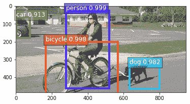
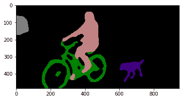
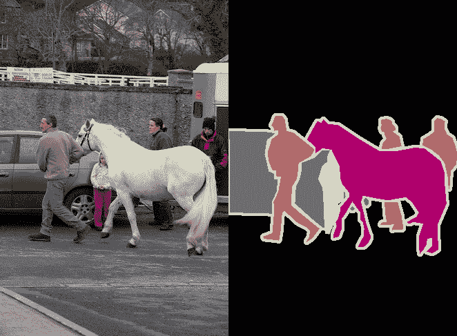
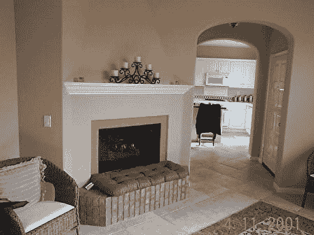
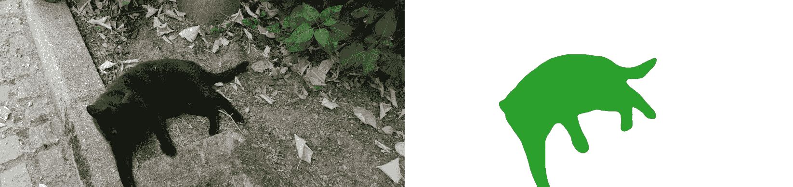
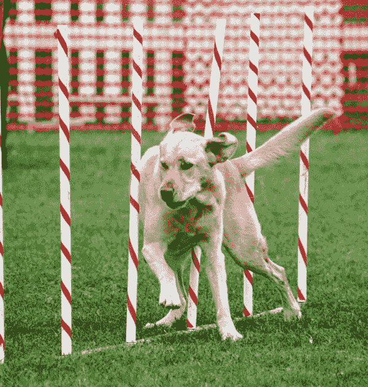
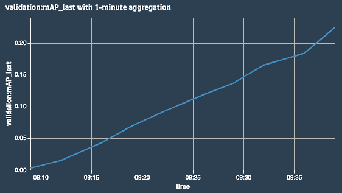
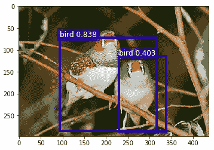
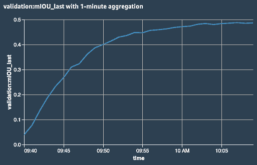
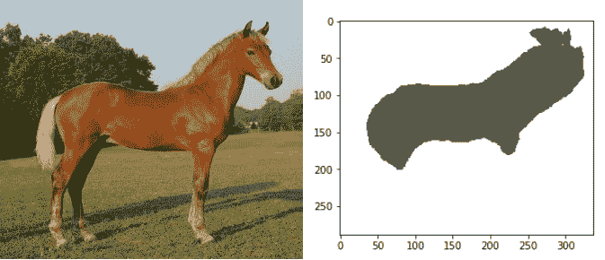

# 第五章：训练计算机视觉模型

在上一章中，你学习了如何使用 SageMaker 内置的算法来解决传统机器学习问题，包括分类、回归和异常检测。我们看到这些算法在处理表格数据（如 CSV 文件）时效果良好。然而，它们不太适合图像数据集，通常在 **CV**（**计算机视觉**）任务上表现非常差。

近年来，计算机视觉（CV）已经席卷全球，几乎每个月都有新的突破，能够从图像和视频中提取模式。本章中，你将学习三种专为计算机视觉任务设计的内置算法。我们将讨论你可以用它们解决的各种问题，并详细解释如何准备图像数据集，因为这一关键主题经常被莫名其妙地忽视。当然，我们还会训练并部署模型。

本章内容包括以下主题：

+   发现 Amazon SageMaker 中的计算机视觉内置算法

+   准备图像数据集

+   使用内置的计算机视觉算法：**图像分类**、**目标检测**和**语义分割**

# 技术要求

你需要一个 AWS 账户来运行本章中的示例。如果你还没有账户，请访问 [`aws.amazon.com/getting-started/`](https://aws.amazon.com/getting-started/) 创建一个。你还应当熟悉 AWS 免费套餐（[`aws.amazon.com/free/`](https://aws.amazon.com/free/)），它允许你在一定的使用限制内免费使用许多 AWS 服务。

你需要为你的账户安装并配置 AWS **命令行界面**（**CLI**）（[`aws.amazon.com/cli/`](https://aws.amazon.com/cli/)）。

你需要一个可用的 Python 3.x 环境。安装 Anaconda 发行版（[`www.anaconda.com/`](https://www.anaconda.com/)）不是强制性的，但强烈建议安装，因为它包含了我们将需要的许多项目（Jupyter、`pandas`、`numpy` 等）。

本书中的代码示例可以在 GitHub 上找到：[`github.com/PacktPublishing/Learn-Amazon-SageMaker-second-edition`](https://github.com/PacktPublishing/Learn-Amazon-SageMaker-second-edition)。你需要安装一个 Git 客户端来访问这些示例（[`git-scm.com/`](https://git-scm.com/)）。

# 发现 Amazon SageMaker 中的计算机视觉内置算法

SageMaker 包括三种基于深度学习网络的计算机视觉算法。在本节中，你将了解这些算法，它们能帮助你解决什么样的问题，以及它们的训练场景：

+   **图像分类**将一个或多个标签分配给图像。

+   **目标检测**是在图像中检测并分类物体。

+   **语义分割**将图像的每一个像素分配到一个特定的类别。

## 发现图像分类算法

从输入图像开始，**图像分类**算法为训练数据集中每个类别预测一个概率。该算法基于**ResNet**卷积神经网络（[`arxiv.org/abs/1512.03385`](https://arxiv.org/abs/1512.03385)）。**ResNet**于 2015 年发布，并在同年获得 ILSVRC 分类任务的冠军（[`www.image-net.org/challenges/LSVRC/`](http://www.image-net.org/challenges/LSVRC/)）。从那时起，它成为了一个流行且多用途的图像分类选择。

可以设置许多超参数，包括网络的深度，范围从 18 层到 200 层。通常，网络层数越多，学习效果越好，但训练时间也会增加。

请注意，**图像分类**算法支持**单标签**和**多标签**分类。在本章中，我们将重点讨论单标签分类。处理多个标签非常类似，您可以在[`github.com/awslabs/amazon-sagemaker-examples/blob/master/introduction_to_amazon_algorithms/imageclassification_mscoco_multi_label/`](https://github.com/awslabs/amazon-sagemaker-examples/blob/master/introduction_to_amazon_algorithms/imageclassification_mscoco_multi_label/)找到一个完整的示例。

## 发现物体检测算法

从输入图像开始，**物体检测**算法预测图像中每个物体的类别和位置。当然，该算法只能检测训练数据集中存在的物体类别。每个物体的位置由一组四个坐标定义，称为**边界框**。

该算法基于**单次多框检测器**（**SSD**）架构（[`arxiv.org/abs/1512.02325`](https://arxiv.org/abs/1512.02325)）。对于分类，您可以选择两个基础网络：**VGG-16**（[`arxiv.org/abs/1409.1556`](https://arxiv.org/abs/1409.1556)）或**ResNet-50**。

以下输出展示了一个物体检测示例（来源：[`www.dressagechien.net/wp-content/uploads/2017/11/chien-et-velo.jpg`](https://www.dressagechien.net/wp-content/uploads/2017/11/chien-et-velo.jpg)）：



图 5.1 – 测试图像

## 发现语义分割算法

从输入图像开始，**语义分割**算法预测图像中每个像素的类别。这比图像分类（仅考虑整幅图像）或物体检测（仅关注图像的特定部分）要困难得多。通过使用预测中包含的概率，可以构建**分割掩码**，覆盖图像中的特定物体。

三种神经网络可以用于分割：

+   **全卷积网络**（**FCNs**）：[`arxiv.org/abs/1411.4038`](https://arxiv.org/abs/1411.4038)

+   **金字塔场景解析**（**PSP**）：[`arxiv.org/abs/1612.01105`](https://arxiv.org/abs/1612.01105)

+   **DeepLab** v3: [`arxiv.org/abs/1706.05587`](https://arxiv.org/abs/1706.05587)

编码器网络是**ResNet**，有 50 层或 101 层。

以下输出显示了对前一张图像进行分割后的结果。我们可以看到分割掩膜，每个类别都分配了一个独特的颜色；背景为黑色，等等：



图 5.2 – 分割后的测试图像

现在让我们看看如何在我们自己的数据上训练这些算法。

## 使用计算机视觉（CV）算法进行训练

这三种算法都是基于**监督学习**的，因此我们的起点将是一个带标签的数据集。当然，这些标签的性质对于每个算法会有所不同：

+   **图像分类**的类别标签

+   **目标检测**的边界框和类别标签

+   **语义分割**的分割掩膜和类别标签

对图像数据集进行标注是一项繁重的工作。如果你需要构建自己的数据集，**Amazon SageMaker Ground Truth**绝对能帮助你，我们在*第二章*中研究了它，*处理数据准备技术*。在本章稍后部分，我们将展示如何使用标注过的图像数据集。

在打包数据集时，强烈建议使用**RecordIO**文件（[`mxnet.apache.org/api/faq/recordio`](https://mxnet.apache.org/api/faq/recordio)）。将图像打包成少量的记录结构化文件，可以使数据集的移动和分割变得更容易，便于分布式训练。话虽如此，如果你愿意，也可以在单独的图像文件上进行训练。

一旦你的数据集准备好并存储在 S3 上，你需要决定是从头开始训练，还是从一个预训练的网络开始。

如果你有大量数据，而且确信从这些数据中构建特定模型是有价值的，那么从头开始训练是没问题的。然而，这将耗费大量时间，可能需要数百次的迭代，并且超参数选择在获得好结果方面至关重要。

使用预训练网络通常是更好的选择，即使你有大量数据。得益于**迁移学习**，你可以从一个在大量图像（假设是数百万张）上训练的模型开始，然后根据你的数据和类别进行微调。这样训练的时间会大大缩短，并且你会更快地获得更高准确率的模型。

鉴于模型的复杂性和数据集的大小，使用 CPU 实例进行训练显然不可行。我们将为所有示例使用 GPU 实例。

最后但同样重要的是，所有这三种算法都是基于**Apache MXNet**的。这使得你可以将它们的模型导出到 SageMaker 之外，并在任何地方进行部署。

在接下来的章节中，我们将深入探讨图像数据集，以及如何为训练准备它们。

# 准备图像数据集

图像数据集的输入格式比表格数据集更为复杂，我们需要确保格式完全正确。SageMaker 中的计算机视觉算法支持三种输入格式：

+   图像文件

+   **RecordIO**文件

+   由**SageMaker Ground Truth**构建的增强清单

在本节中，你将学习如何准备这些不同格式的数据集。据我所知，这个话题很少被如此详细地讨论。准备好学习很多内容吧！

## 处理图像文件

这是最简单的格式，所有三种算法都支持它。让我们看看如何将其与**图像分类**算法一起使用。

### 将图像分类数据集转换为图像格式

图像格式的数据集必须存储在 S3 中。图像文件不需要按任何特定方式排序，你可以将它们全部存储在同一个存储桶中。

图像描述存储在**列表文件**中，列表文件是一个文本文件，每行代表一张图像。对于**图像分类**，文件中有三列：图像的唯一标识符、类标签以及路径。以下是一个示例：

```py
1023  5  prefix/image2753.jpg
38    6  another_prefix/image72.jpg
983   2  yet_another_prefix/image863.jpg
```

第一行告诉我们，`image2753.jpg`属于第 5 类，且已分配 ID 1023。

每个通道都需要一个列表文件，因此你需要为训练数据集、验证数据集等创建一个。你可以编写定制的代码来生成它们，或者使用`im2rec`中的一个简单程序，该程序在 Python 和 C++中都有。我们将使用 Python 版本。

让我们使用**Kaggle**上的 Dogs vs. Cats 数据集（[`www.kaggle.com/c/dogs-vs-cats`](https://www.kaggle.com/c/dogs-vs-cats)）。该数据集为 812 MB。不出所料，包含两类：狗和猫。它已经分为训练集和测试集（分别为 25,000 张和 12,500 张图片）。具体操作如下：

1.  我们创建一个`kaggle`命令行工具（[`github.com/Kaggle/kaggle-api`](https://github.com/Kaggle/kaggle-api)）。

1.  在我们的本地机器上，我们下载并提取训练数据集（你可以忽略测试集，它只用于竞赛）：

    ```py
    $ kaggle competitions download -c dogs-vs-cats
    $ sudo yum -y install zip unzip
    $ unzip dogs-vs-cats.zip
    $ unzip train.zip
    ```

1.  狗和猫的图像混合在同一个文件夹中。我们为每个类别创建一个子文件夹，并将相应的图像移动到这些子文件夹中：

    ```py
    $ cd train
    $ mkdir dog cat
    $ find . -name 'dog.*' -exec mv {} dog \;
    $ find . -name 'cat.*' -exec mv {} cat \;
    ```

1.  我们需要验证图像，因此让我们将 1,250 张随机狗图像和 1,250 张随机猫图像移动到指定目录。我这里使用`bash`脚本，但你可以根据需要使用任何工具：

    ```py
    $ mkdir -p val/dog val/cat
    $ ls dog | sort -R | tail -1250 | while read file;
    do mv dog/$file val/dog; done
    $  ls cat | sort -R | tail -1250 | while read file;
    do mv cat/$file val/cat; done
    ```

1.  我们将剩余的 22,500 张图片移动到训练文件夹：

    ```py
    $ mkdir train
    $ mv dog cat train
    ```

1.  现在我们的数据集如下所示：

    ```py
    $ du -h
    33M     ./val/dog
    28M     ./val/cat
    60M     ./val
    289M    ./train/dog
    248M    ./train/cat
    537M    ./train
    597M    .
    ```

1.  我们从 GitHub 下载`im2rec`工具（[`github.com/apache/incubator-mxnet/blob/master/tools/im2rec.py`](https://github.com/apache/incubator-mxnet/blob/master/tools/im2rec.py)）。它需要依赖项，我们需要安装这些依赖（你可能需要根据自己的环境和 Linux 版本调整命令）：

    ```py
    $ wget https://raw.githubusercontent.com/apache/incubator-mxnet/master/tools/im2rec.py
    $ sudo yum -y install python-devel python-pip opencv opencv-devel opencv-python
    $ pip3 install mxnet opencv-python
    ```

1.  我们运行`im2rec`以生成两个列表文件，一个用于训练数据，另一个用于验证数据：

    ```py
    dogscats-train.lst and dogscats-val.lst files. Their three columns are a unique image identifier, the class label (0 for cats, 1 for dogs), and the image path, as follows:

    ```

    3197  0.000000  cat/cat.1625.jpg

    15084  1.000000  dog/dog.12322.jpg

    1479  0.000000  cat/cat.11328.jpg

    5262  0.000000  cat/cat.3484.jpg

    20714 1.000000  dog/dog.6140.jpg

    ```py

    ```

1.  我们将列表文件移动到特定目录。这是必要的，因为它们将作为两个新通道`train_lst`和`validation_lst`传递给`Estimator`：

    ```py
    $ mkdir train_lst val_lst
    $ mv dogscats-train.lst train_lst
    $ mv dogscats-val.lst val_lst
    ```

1.  数据集现在看起来是这样的：

    ```py
    $ du -h
    33M     ./val/dog
    28M     ./val/cat
    60M     ./val
    700K    ./train_lst
    80K     ./val_lst
    289M    ./train/dog
    248M    ./train/cat
    537M    ./train
    597M    .
    ```

1.  最后，我们将这个文件夹同步到 SageMaker 默认存储桶中以备后用。请确保只同步这四个文件夹，其他的不要同步：

    ```py
    $ aws s3 sync . 
      s3://sagemaker-eu-west-1-123456789012/dogscats-images/input/
    ```

现在，让我们继续在目标检测算法中使用图像格式。

### 将检测数据集转换为图像格式

一般原则是相同的。我们需要构建一个文件树，表示四个通道：`train`、`validation`、`train_annotation`和`validation_annotation`。

主要的区别在于标签信息的存储方式。我们需要构建 JSON 文件，而不是列表文件。

这是一个虚构图像的示例，来自一个目标检测数据集。对于图像中的每个物体，我们定义其边界框的左上角坐标、其高度和宽度。我们还定义了类标识符，它指向一个类别数组，该数组还存储类名称：

```py
{
   "file": " my-prefix/my-picture.jpg",
   "image_size": [{"width": 512,"height": 512,"depth": 3}],
   "annotations": [
      {
       "class_id": 1, 
       "left": 67, "top": 121, "width": 61, "height": 128
      },
      {
       "class_id": 5, 
       "left": 324, "top": 134, "width": 112, "height": 267
      }
   ],
   "categories": [
      { "class_id": 1, "name": "pizza" },
      { "class_id": 5, "name": "beer" }
   ]
}
```

我们需要对数据集中的每张图片执行此操作，为训练集构建一个 JSON 文件，为验证集构建一个 JSON 文件。

最后，让我们看看如何在语义分割算法中使用图像格式。

### 将分割数据集转换为图像格式

图像格式是图像分割算法唯一支持的格式。

这次，我们需要构建一个文件树，表示四个通道：`train`、`validation`、`train_annotation`和`validation_annotation`。前两个通道包含源图像，最后两个通道包含分割掩膜图像。

文件命名在将图像与其掩膜匹配时至关重要：源图像和掩膜图像必须在各自的通道中具有相同的名称。以下是一个示例：

```py
├── train
│   ├── image001.png
│   ├── image007.png
│   └── image042.png
├── train_annotation
│   ├── image001.png
│   ├── image007.png
│   └── image042.png 
├── validation
│   ├── image059.png
│   ├── image062.png
│   └── image078.png
└── validation_annotation
│   ├── image059.png
│   ├── image062.png
│   └── image078.png
```

你可以在下图中看到示例图像。左侧的源图像应放入`train`文件夹，右侧的掩膜图像应放入`train_annotation`文件夹。它们必须具有完全相同的名称，以便算法可以匹配它们：



图 5.3 – Pascal VOC 数据集中的示例图像

这种格式的一个巧妙特点是它如何将类标识符与掩膜颜色匹配。掩膜图像是具有 256 色调色板的 PNG 文件。数据集中的每个类都分配了调色板中的一个特定条目。这些颜色就是你在该类物体的掩膜中看到的颜色。

如果你的标签工具或现有数据集不支持这种 PNG 特性，你可以添加自己的颜色映射文件。详情请参考 AWS 文档：[`docs.aws.amazon.com/sagemaker/latest/dg/semantic-segmentation.html`](https://docs.aws.amazon.com/sagemaker/latest/dg/semantic-segmentation.html)。

现在，让我们准备 **Pascal VOC** 数据集。这个数据集常用于对目标检测和语义分割模型进行基准测试：

1.  我们首先下载并提取数据集的 2012 版本。我建议使用 AWS 托管的实例来加速网络传输：

    ```py
    $ wget https://data.deepai.org/PascalVOC2012.zip
    $ unzip PascalVOC2012.zip 
    ```

1.  我们创建一个工作目录，在这里构建四个通道：

    ```py
    $ mkdir input
    $ cd input
    $ mkdir train validation train_annotation validation_annotation
    ```

1.  使用数据集中定义的训练文件列表，我们将相应的图像复制到 `train` 文件夹。我在这里使用的是 `bash` 脚本，当然你也可以使用你喜欢的工具：

    ```py
    $ for file in 'cat ../ImageSets/Segmentation/train.txt | xargs'; do cp ../JPEGImages/$file".jpg" train; done
    ```

1.  然后我们对验证图像、训练掩码和验证掩码做相同的处理：

    ```py
    $ for file in 'cat ../ImageSets/Segmentation/val.txt | xargs'; do cp ../JPEGImages/$file".jpg" validation; done
    $ for file in 'cat ../ImageSets/Segmentation/train.txt | xargs'; do cp ../SegmentationClass/$file".png" train_annotation; done
    $ for file in 'cat ../ImageSets/Segmentation/val.txt | xargs'; do cp ../SegmentationClass/$file".png" validation_annotation; done
    ```

1.  我们检查两个训练通道和两个验证通道中的图像数量是否一致：

    ```py
    $ for dir in train train_annotation validation validation_annotation; do find $dir -type f | wc -l; done
    ```

    我们看到了 1,464 个训练文件和掩码，以及 1,449 个验证文件和掩码。我们准备好了：

    ```py
    1464
    1464
    1449
    1449
    ```

1.  最后一步是将文件树同步到 S3 以备后用。再次提醒，请确保只同步四个文件夹：

    ```py
    $ aws s3 sync . s3://sagemaker-eu-west-1-123456789012/pascalvoc-segmentation/input/
    ```

我们知道如何准备图像格式的分类、检测和分割数据集。这是一个关键步骤，你必须确保一切都准确无误。

不过，我敢肯定你会觉得本节中的步骤有些麻烦，我也是！现在想象一下，面对数百万张图像做同样的事情。这听起来可不太刺激，对吧？

我们需要一种更简便的方法来准备图像数据集。让我们看看如何使用 **RecordIO** 文件简化数据集准备。

## 使用 RecordIO 文件

RecordIO 文件更容易搬动。对于算法来说，读取一个大的顺序文件比读取很多存储在随机磁盘位置的小文件更高效。

### 将图像分类数据集转换为 RecordIO

让我们将 Dogs vs. Cats 数据集转换为 RecordIO：

1.  从新提取的数据集副本开始，我们将图像移到相应的类别文件夹中：

    ```py
    $ cd train
    $ mkdir dog cat
    $ find . -name 'dog.*' -exec mv {} dog \;
    $ find . -name 'cat.*' -exec mv {} cat \;
    ```

1.  我们运行 `im2rec` 来为训练数据集（90%）和验证数据集（10%）生成列表文件。我们无需自己分割数据集！

    ```py
    $ python3 im2rec.py --list --recursive --train-ratio 0.9 dogscats .
    ```

1.  我们再次运行 `im2rec` 来生成 RecordIO 文件：

    ```py
    .rec) containing the packed images, and two index files (.idx) containing the offsets of these images inside the record files:

    ```

    $ ls dogscats*

    dogscats_train.idx dogscats_train.lst dogscats_train.rec

    dogscats_val.idx dogscats_val.lst dogscats_val.rec

    ```py

    ```

1.  我们将 RecordIO 文件存储在 S3 上，因为我们稍后会用到它们：

    ```py
    $ aws s3 cp dogscats_train.rec s3://sagemaker-eu-west-1-123456789012/dogscats/input/train/
    $ aws s3 cp dogscats_val.rec s3://sagemaker-eu-west-1-123456789012/dogscats/input/validation/
    ```

这要简单得多，不是吗？`im2rec` 还提供了额外的选项来调整图像大小等等。它还可以将数据集分割成几个块，这是 **管道模式** 和 **分布式训练** 中一个有用的技术。我们将在*第九章*，“*扩展你的训练任务*”中学习这些内容。

现在，让我们继续使用 RecordIO 文件进行目标检测。

### 将目标检测数据集转换为 RecordIO

过程非常相似。一个主要的区别是列表文件的格式。我们不仅要处理类标签，还需要存储边界框。

让我们看看这对 Pascal VOC 数据集意味着什么。以下图像取自该数据集：



图 5.4 – 来自 Pascal VOC 数据集的示例图像

它包含三个椅子。标注信息存储在一个单独的 **XML** 文件中，文件内容略有简化，如下所示：

```py
<annotation>
        <folder>VOC2007</folder>
        <filename>003988.jpg</filename>
        . . .
        <object>
                <name>chair</name>
                <pose>Unspecified</pose>
                <truncated>1</truncated>
                <difficult>0</difficult>
                <bndbox>
                    <xmin>1</xmin>
                    <ymin>222</ymin>
                    <xmax>117</xmax>
                    <ymax>336</ymax>
                </bndbox>
        </object>
        <object>
                <name>chair</name>
                <pose>Unspecified</pose>
                <truncated>1</truncated>
                <difficult>1</difficult>
                <bndbox>
                    <xmin>429</xmin>
                    <ymin>216</ymin>
                    <xmax>448</xmax>
                    <ymax>297</ymax>
                </bndbox>
        </object>
        <object>
                <name>chair</name>
                <pose>Unspecified</pose>
                <truncated>0</truncated>
                <difficult>1</difficult>
                <bndbox>
                    <xmin>281</xmin>
                    <ymin>149</ymin>
                    <xmax>317</xmax>
                    <ymax>211</ymax>
                </bndbox>
        </object>
</annotation>
```

将此转换为列表文件条目的格式应如下所示：

```py
9404 2 6  8.0000  0.0022  0.6607  0.2612  1.0000  0.0000 8.0000  0.9576  0.6429  1.0000  0.8839  1.0000 8.0000  0.6272  0.4435  0.7076  0.6280  1.0000 VOC2007/JPEGImages/003988.jpg 
```

让我们解码每一列：

+   `9404` 是唯一的图像标识符。

+   `2` 是包含头信息的列数，包括这一列。

+   `6` 是标注信息的列数。这六列分别是类别标识符、四个边界框坐标，以及一个标志，告诉我们该对象是否难以看到（我们不会使用它）。

+   以下是第一个对象的信息：

    a) `8` 是类别标识符。这里，`8` 代表 `chair` 类别。

    b) `0.0022 0.6607 0.2612 1.0000` 是 `0` 表示该对象不困难的相对坐标。

+   对于第二个对象，我们有如下信息：

    a) `8` 是类别标识符。

    b) `0.9576 0.6429 1.0000 0.8839` 是第二个对象的坐标。

    c) `1` 表示该对象是困难的。

+   第三个对象具有以下信息：

    a) `8` 是类别标识符。

    b) `0.6272 0.4435 0.7076 0.628` 是第三个对象的坐标。

    c) `1` 表示该对象是困难的。

+   `VOC2007/JPEGImages/003988.jpg` 是图片的路径。

那么，我们如何将成千上万的 XML 文件转换为几个列表文件呢？除非你喜欢写解析器，否则这并不是一项非常有趣的任务。

幸运的是，我们的工作已经简化了。Apache MXNet 包含一个 Python 脚本 `prepare_dataset.py`，可以处理这项任务。让我们看看它是如何工作的：

1.  对于接下来的步骤，我建议使用至少有 10 GB 存储的 Amazon Linux 2 EC2 实例。以下是设置步骤：

    ```py
    $ sudo yum -y install git python3-devel python3-pip opencv opencv-devel opencv-python
    $ pip3 install mxnet opencv-python --user
    $ export LD_LIBRARY_PATH=$LD_LIBRARY_PATH:/home/ec2-user/.local/lib/python3.7/site-packages/mxnet/
    $ sudo ldconfig
    ```

1.  使用 `wget` 下载 2007 和 2012 版本的 Pascal VOC 数据集，并将它们提取到同一个目录中：

    ```py
    $ mkdir pascalvoc
    $ cd pascalvoc
    $ wget https://data.deepai.org/PascalVOC2012.zip
    $ wget https://data.deepai.org/PASCALVOC2007.zip
    $ unzip PascalVOC2012.zip
    $ unzip PASCALVOC2007.zip 
    $ mv VOC2012 VOCtrainval_06-Nov-2007/VOCdevkit
    ```

1.  克隆 Apache MXNet 仓库 ([`github.com/apache/incubator-mxnet/`](https://github.com/apache/incubator-mxnet/))：

    ```py
    $ git clone --single-branch --branch v1.4.x https://github.com/apache/incubator-mxnet
    ```

1.  运行 `prepare_dataset.py` 脚本来构建我们的训练数据集，将 2007 和 2012 版本的训练集和验证集合并：

    ```py
    $ cd VOCtrainval_06-Nov-2007
    $ python3 ../incubator-mxnet/example/ssd/tools/prepare_dataset.py --dataset pascal --year 2007,2012 --set trainval --root VOCdevkit --target VOCdevkit/train.lst
    $ mv VOCdevkit/train.* ..
    ```

1.  让我们遵循类似的步骤来生成验证数据集，使用 2007 版本的测试集：

    ```py
    $ cd ../VOCtest_06-Nov-2007
    $ python3 ../incubator-mxnet/example/ssd/tools/prepare_dataset.py --dataset pascal --year 2007 --set test --root VOCdevkit --target VOCdevkit/val.lst
    $ mv VOCdevkit/val.* ..
    $ cd ..
    ```

1.  在顶级目录中，我们看到脚本生成的文件。可以随意查看文件列表，它们应该与之前展示的格式一致：

    ```py
    train.idx  train.lst  train.rec  
    val.idx  val.lst  val.rec  
    ```

1.  让我们将 RecordIO 文件存储到 S3，因为我们稍后会使用它们：

    ```py
    $ aws s3 cp train.rec s3://sagemaker-eu-west-1-123456789012/pascalvoc/input/train/
    $ aws s3 cp val.rec s3://sagemaker-eu-west-1-123456789012/pascalvoc/input/validation/
    ```

`prepare_dataset.py` 脚本确实简化了很多事情。它还支持 **COCO** 数据集 ([`cocodataset.org`](http://cocodataset.org))，并且工作流程非常相似。

那么，如何转换其他公共数据集呢？嗯，结果可能因情况而异。你可以在 [`gluon-cv.mxnet.io/build/examples_datasets/index.html`](https://gluon-cv.mxnet.io/build/examples_datasets/index.html) 上找到更多示例。

RecordIO 绝对是一个进步。然而，在处理自定义数据集时，很可能你需要编写自己的列表文件生成器。这虽然不是一件大事，但也是额外的工作。

使用**Amazon SageMaker Ground Truth**标注的数据集解决了这些问题。让我们看看它是如何工作的！

## 与 SageMaker Ground Truth 文件合作

在*第二章*《数据准备技巧处理》中，您了解了 SageMaker Ground Truth 工作流及其结果，一个**增强的清单**文件。该文件采用**JSON Lines**格式：每个 JSON 对象描述了一个特定的标注。

这是我们在*第二章*《数据准备技巧处理》中运行的语义分割任务的一个示例（对于其他任务类型，流程相同）。我们看到原始图像和分割掩模的路径，以及颜色映射信息，告诉我们如何将掩模颜色与类别匹配：

```py
{"source-ref":"s3://julien-sagemaker-book/chapter2/cat/cat1.jpg",
"my-cat-job-ref":"s3://julien-sagemaker-book/chapter2/cat/output/my-cat-job/annotations/consolidated-annotation/output/0_2020-04-21T13:48:00.091190.png",
"my-cat-job-ref-metadata":{
  "internal-color-map":{
   "0":{"class-name":"BACKGROUND","hex-color": "#ffffff", 
        "confidence": 0.8054600000000001}, 
   "1":{"class-name":"cat","hex-color": "#2ca02c", 
        "confidence":0.8054600000000001}
}, 
"type":"groundtruth/semantic-segmentation",
"human-annotated":"yes",
"creation-date":"2020-04-21T13:48:00.562419",
"job-name":"labeling-job/my-cat-job"}}
```

以下是前面 JSON 文档中引用的图像：



图 5.5 – 原始图像和分割图像

这正是我们训练模型所需要的。事实上，我们可以将增强的清单直接传递给 SageMaker 的`Estimator`，完全不需要任何数据处理。

要使用指向 S3 中标注图像的**增强清单**，我们只需传递其位置和 JSON 属性的名称（在前面的示例中已突出显示）：

```py
training_data_channel = sagemaker.s3_input(
    s3_data=augmented_manifest_file_path, 
    s3_data_type='AugmentedManifestFile',
    attribute_names=['source-ref', 'my-job-cat-ref'])
```

就这样！这比我们之前看到的任何内容都要简单。

您可以在[`github.com/awslabs/amazon-sagemaker-examples/tree/master/ground_truth_labeling_jobs`](https://github.com/awslabs/amazon-sagemaker-examples/tree/master/ground_truth_labeling_jobs)找到更多使用 SageMaker Ground Truth 的示例。

现在我们已经知道如何为训练准备图像数据集，让我们开始使用计算机视觉（CV）算法。

# 使用内置的计算机视觉（CV）算法

在本节中，我们将使用公共图像数据集，通过所有三种算法训练并部署模型。我们将涵盖从头开始训练和迁移学习两种方法。

## 训练图像分类模型

在这个第一个示例中，我们将使用图像分类算法来构建一个模型，分类我们在前一节准备的狗与猫数据集。我们将首先使用图像格式进行训练，然后使用 RecordIO 格式。

### 使用图像格式进行训练

我们将通过以下步骤开始训练：

1.  在 Jupyter 笔记本中，我们定义了适当的数据路径：

    ```py
    import sagemaker
    sess = sagemaker.Session()
    bucket = sess.default_bucket()
    prefix = 'dogscats-images'
    s3_train_path = 
      's3://{}/{}/input/train/'.format(bucket, prefix)
    s3_val_path = 
      's3://{}/{}/input/val/'.format(bucket, prefix)
    s3_train_lst_path = 
      's3://{}/{}/input/train_lst/'.format(bucket, prefix)
    s3_val_lst_path = 
      's3://{}/{}/input/val_lst/'.format(bucket, prefix)
    s3_output = 's3://{}/{}/output/'.format(bucket, prefix)
    ```

1.  我们为图像分类算法配置`Estimator`：

    ```py
    from sagemaker.image_uris import retrieve
    region_name = sess.boto_session.boto_region_name
    container = retrieve('image-classification', region)
    ic = sagemaker.estimator.Estimator(container,
                  sagemaker.get_execution_role(),
                  instance_count=1,
                  instance_type='ml.p3.2xlarge', 
                  output_path=s3_output)
    ```

    我们使用名为`ml.p3.2xlarge`的 GPU 实例，这个实例对这个数据集提供了足够的计算力（在 eu-west-1 区域的价格为每小时$4.131）。

    超参数怎么样（[`docs.aws.amazon.com/sagemaker/latest/dg/IC-Hyperparameter.html`](https://docs.aws.amazon.com/sagemaker/latest/dg/IC-Hyperparameter.html)）？我们设置类别数（2）和训练样本数（22,500）。由于我们使用图像格式，我们需要显式调整图像大小，将最小尺寸设置为 224 像素。由于数据充足，我们决定从头开始训练。为了保持训练时间短，我们选择一个 18 层的**ResNet**模型，只训练 10 个 epochs：

    ```py
    ic.set_hyperparameters(num_layers=18,
                           use_pretrained_model=0,
                           num_classes=2,
                           num_training_samples=22500,
                           resize=224,
                           mini_batch_size=128,
                           epochs=10)
    ```

1.  我们定义四个通道，设置它们的内容类型为`application/x-image`：

    ```py
    from sagemaker import TrainingInput
    train_data = TrainingInput (
        s3_train_path,                              
        content_type='application/x-image')                                       
    val_data = TrainingInput (
        s3_val_path,                                                                  
        content_type='application/x-image')
    train_lst_data = TrainingInput (
        s3_train_lst_path,                                  
        content_type='application/x-image')
    val_lst_data = TrainingInput (
        s3_val_lst_path,                                    
        content_type='application/x-image')                                      
    s3_channels = {'train': train_data, 
                   'validation': val_data,
                   'train_lst': train_lst_data, 
                   'validation_lst': val_lst_data}
    ```

1.  我们按以下方式启动训练作业：

    ```py
    ic.fit(inputs=s3_channels)
    ```

    在训练日志中，我们看到数据下载大约需要 3 分钟。令人惊讶的是，我们还看到算法在训练之前构建 RecordIO 文件。这一步骤大约持续 1 分钟：

    ```py
    Searching for .lst files in /opt/ml/input/data/train_lst.
    Creating record files for dogscats-train.lst
    Done creating record files...
    Searching for .lst files in /opt/ml/input/data/validation_lst.
    Creating record files for dogscats-val.lst
    Done creating record files...
    ```

1.  训练开始时，我们看到一个 epoch 大约需要 22 秒：

    ```py
    Epoch[0] Time cost=22.337
    Epoch[0] Validation-accuracy=0.605859
    ```

1.  该作业总共持续了 506 秒（约 8 分钟），花费了我们（506/3600）*$4.131=$0.58。它达到了**91.2%**的验证准确率（希望您看到类似的结果）。考虑到我们甚至还没有调整超参数，这是相当不错的结果。

1.  然后，我们在小型 CPU 实例上部署模型如下：

    ```py
    ic_predictor = ic.deploy(initial_instance_count=1,
                             instance_type='ml.t2.medium')
    ```

1.  我们下载以下测试图像，并以`application/x-image`格式发送进行预测。

    ```py
    import boto3, json
    import numpy as np
    with open('test.jpg', 'rb') as f:
        payload = f.read()
        payload = bytearray(payload)
    runtime = boto3.Session().client(
        service_name='runtime.sagemaker')
    response = runtime.invoke_endpoint(
        EndpointName=ic_predictor.endpoint_name,                                  
        ContentType='application/x-image',
        Body=payload)
    result = response['Body'].read()
    result = json.loads(result)
    index = np.argmax(result)
    print(result[index], index)
    ```

    打印出概率和类别后，我们的模型指示这是一只狗，置信度为 99.997%，并且图像属于类别 1：

    ```py
    0.9999721050262451 1
    ```

1.  完成后，我们按以下方式删除端点：

    ```py
    ic_predictor.delete_endpoint()
    ```

现在让我们使用 RecordIO 格式的数据集运行相同的训练作业。

### 训练 RecordIO 格式

唯一的区别在于我们如何定义输入通道。这次我们只需要两个通道，以便提供我们上传到 S3 的 RecordIO 文件。因此，内容类型设置为`application/x-recordio`：

```py
from sagemaker import TrainingInput
prefix = 'dogscats'
s3_train_path=
  's3://{}/{}/input/train/'.format(bucket, prefix)
s3_val_path=
  's3://{}/{}/input/validation/'.format(bucket, prefix)
train_data = TrainingInput(
    s3_train_path,
    content_type='application/x-recordio')
validation_data = TrainingInput(
    s3_val_path,                                        
    content_type='application/x-recordio')
```

再次训练时，我们看到数据下载需要 1 分钟，文件生成步骤已消失。虽然从单次运行中很难得出任何结论，但使用 RecordIO 数据集通常会节省您时间和金钱，即使在单个实例上进行训练。

狗与猫数据集每类样本超过 10,000 个，足以从头开始训练。现在，让我们尝试一个数据集，情况不同。

## 微调图像分类模型

请考虑**Caltech-256**数据集，这是一个受欢迎的公共数据集，包含 256 类共 15,240 张图像，还有一个混乱的类别（[`www.vision.caltech.edu/Image_Datasets/Caltech256/`](http://www.vision.caltech.edu/Image_Datasets/Caltech256/)）。浏览图像类别，我们发现所有类别都只有少量样本。例如，“鸭子”类仅有 60 张图像：用这么少的数据，无论多么复杂的深度学习算法都很难提取出鸭子的独特视觉特征。

在这种情况下，从头开始训练根本不可行。相反，我们将使用一种叫做**迁移学习**的技术，在一个已经在非常大且多样化的图像数据集上训练过的网络基础上开始训练。**ImageNet**（[`www.image-net.org/`](http://www.image-net.org/)）可能是最流行的预训练选择，包含 1,000 个类别和数百万张图像。

预训练的网络已经学会了如何从复杂图像中提取特征。假设我们数据集中的图像与预训练数据集中的图像足够相似，我们的模型应该能够继承这些知识。只需在我们的数据集上训练几个周期，我们应该能够**微调**预训练模型，以适应我们的数据和类别。

让我们看看如何通过 SageMaker 轻松实现这一点。实际上，我们将重用前一个示例中的代码，只做最小的修改。我们开始吧：

1.  我们下载 Caltech-256 数据集的 RecordIO 格式版本（如果你愿意，可以下载图像格式，并转换成 RecordIO 格式：实践出真知！）：

    ```py
    %%sh
    wget http://data.mxnet.io/data/caltech-256/caltech-256-60-train.rec
    wget http://data.mxnet.io/data/caltech-256/caltech-256-60-val.rec
    ```

1.  我们将数据集上传到 S3：

    ```py
    import sagemaker
    session = sagemaker.Session()
    bucket = session.default_bucket()
    prefix = 'caltech256/'
    s3_train_path = session.upload_data(
        path='caltech-256-60-train.rec',
        bucket=bucket, key_prefix=prefix+'input/train')
    s3_val_path = session.upload_data(
        path='caltech-256-60-val.rec',
        bucket=bucket, key_prefix=prefix+'input/validation')
    ```

1.  我们配置`Estimator`函数来进行图像分类算法。代码与前一个示例中的*步骤 2*完全相同。

1.  我们使用`use_pretrained_network`来 1\. 预训练网络的最终全连接层将根据我们数据集中的类别数量进行调整，并将其权重赋予随机值。

    我们设置正确的类别数量（256+1）和训练样本数，如下所示：

    ```py
    ic.set_hyperparameters(num_layers=50,
                           use_pretrained_model=1,
                           num_classes=257,
                           num_training_samples=15240,
                           learning_rate=0.001,
                           epochs=5)
    ```

    由于我们在进行微调，所以我们只训练 5 个周期，并使用较小的学习率 0.001。

1.  我们配置通道，并启动训练任务。代码与前一个示例中的*步骤 4*完全相同。

1.  在经过 5 个周期和 272 秒后，我们在训练日志中看到以下指标：

    ```py
    Epoch[4] Validation-accuracy=0.8119
    ```

    这对于仅仅几分钟的训练来说已经相当不错。即使数据量充足，从头开始也需要更长的时间才能获得这样的结果。

1.  为了部署和测试模型，我们将重用前一个示例中的*步骤 7-9*。

如你所见，迁移学习是一种非常强大的技术。即使数据量很少，它也能提供优秀的结果。你还会训练更少的周期，从而节省时间和资金。

现在，让我们进入下一个算法——**物体检测**。

## 训练一个物体检测模型

在这个例子中，我们将使用物体检测算法，在前一部分准备好的 Pascal VOC 数据集上构建一个模型：

1.  我们从定义数据路径开始：

    ```py
    import sagemaker
    sess = sagemaker.Session()
    bucket = sess.default_bucket()
    prefix = 'pascalvoc'
    s3_train_data = 's3://{}/{}/input/train'.format(bucket, prefix)
    s3_validation_data = 's3://{}/{}/input/validation'.format(bucket, prefix)
    s3_output_location = 's3://{}/{}/output'.format(bucket, prefix)
    ```

1.  我们选择物体检测算法：

    ```py
    from sagemaker.image_uris import retrieve
    region = sess.boto_region_name
    container = retrieve('object-detection', region)
    ```

1.  我们配置`Estimator`：

    ```py
    od = sagemaker.estimator.Estimator(
             container,
             sagemaker.get_execution_role(),
             instance_count=1,
             instance_type='ml.p3.2xlarge',
             output_path=s3_output_location)
    ```

1.  我们设置所需的超参数。我们选择一个预训练的 ResNet-50 网络作为基础网络。我们设置类别数量和训练样本数。我们决定训练 30 个周期，应该足够开始看到结果：

    ```py
    od.set_hyperparameters(base_network='resnet-50',
                           use_pretrained_model=1,
                           num_classes=20,
                           num_training_samples=16551,
                           epochs=30)
    ```

1.  然后我们配置两个通道，并启动训练任务：

    ```py
    from sagemaker.session import TrainingInput
    train_data = TrainingInput (
          s3_train_data,
          content_type='application/x-recordio')
    validation_data = TrainingInput (
          s3_validation_data, 
          content_type='application/x-recordio')
    data_channels = {'train': train_data, 
                     'validation': validation_data}
    od.fit(inputs=data_channels)
    ```

    在**SageMaker 组件与注册表** | **实验与试验**中选择我们的任务，我们可以看到接近实时的指标和图表。下一张图显示了验证集的**平均精度指标（mAP）**，这是目标检测模型的一个关键指标。

    

    图 5.7 – 验证集 mAP

    请浏览其他标签页（**指标**、**参数**、**工件**等）。它们包含了关于特定任务的所有信息。请注意右上角的**停止训练任务**按钮，您可以随时使用它来终止任务。

1.  训练持续了 1 小时 40 分钟。这个模型相当庞大！我们得到了**平均精度指标**（**mAP**）为 0.5151。生产环境中使用需要更多的训练，但我们现在应该可以测试模型了。

1.  由于模型的复杂性，我们将其部署到一个更大的 CPU 实例上：

    ```py
    od_predictor = od.deploy(
        initial_instance_count = 1, 
        instance_type= 'ml.c5.2xlarge')
    ```

1.  我们从维基百科下载一张测试图像，并用我们的模型进行预测：

    ```py
    import boto3,json
    with open('test.jpg', 'rb') as image:
        payload = image.read()
        payload = bytearray(payload)
    runtime = boto3.Session().client(
        service_name='runtime.sagemaker')
    response = runtime.invoke_endpoint(
        EndpointName=od_predictor.endpoint_name,                                  
        ContentType='image/jpeg',
        Body=payload)
    response = response['Body'].read()
    response = json.loads(response)
    ```

1.  响应包含一个预测列表。每个单独的预测包含一个类别标识符、置信度得分以及边界框的相对坐标。以下是响应中的前几个预测：

    ```py
    {'prediction': 
    [[14.0, 0.7515302300453186, 0.39770469069480896, 0.37605002522468567, 0.5998836755752563, 1.0], 
    [14.0, 0.6490200161933899, 0.8020403385162354, 0.2027685046195984, 0.9918708801269531, 0.8575668931007385]
    ```

    利用这些信息，我们可以在源图像上绘制边界框。为了简洁起见，我不会在此处包含代码，但您可以在本书的 GitHub 仓库中找到。以下输出展示了结果：

    

    图 5.8 – 测试图像

1.  当我们完成后，我们删除端点，如下所示：

    ```py
    od_predictor.delete_endpoint()
    ```

这就结束了我们的目标检测探索。我们还有一个算法要介绍：**语义分割**。

## 训练语义分割模型

在这个示例中，我们将使用语义分割算法，在之前章节中准备的 Pascal VOC 数据集上构建模型：

1.  如常，我们定义数据路径，如下所示：

    ```py
    import sagemaker
    sess = sagemaker.Session()
    bucket = sess.default_bucket()  
    prefix = 'pascalvoc-segmentation'
    s3_train_data = 's3://{}/{}/input/train'.format(bucket, prefix)
    s3_validation_data = 's3://{}/{}/input/validation'.format(bucket, prefix)
    s3_train_annotation_data = 's3://{}/{}/input/train_annotation'.format(bucket, prefix)
    s3_validation_annotation_data = 's3://{}/{}/input/validation_annotation'.format(bucket, prefix)
    s3_output_location = 
    's3://{}/{}/output'.format(bucket, prefix)
    ```

1.  我们选择语义分割算法，并配置`Estimator`函数：

    ```py
    from sagemaker.image_uris import retrieve
    container = retrieve('semantic-segmentation', region)
    seg = sagemaker.estimator.Estimator(
              container,
              sagemaker.get_execution_role(),                                     
              instance_count = 1,
              instance_type = 'ml.p3.2xlarge',
              output_path = s3_output_location)
    ```

1.  我们定义了所需的超参数。我们选择了一个预训练的 ResNet-50 网络作为基础网络，并选择一个预训练的**FCN**进行检测。我们设置了类别数和训练样本数。再次，我们选择了 30 个训练周期，这应该足以开始看到结果：

    ```py
    seg.set_hyperparameters(backbone='resnet-50',
                            algorithm='fcn',
                            use_pretrained_model=True,
                            num_classes=21,
                            num_training_samples=1464,
                            epochs=30)
    ```

1.  我们配置四个通道，设置源图像的内容类型为`image/jpeg`，掩膜图像的内容类型为`image/png`。然后，我们启动训练任务：

    ```py
    from sagemaker import TrainingInput
    train_data = TrainingInput(
        s3_train_data, 
        content_type='image/jpeg')
    validation_data = TrainingInput(
        s3_validation_data,
        content_type='image/jpeg')
    train_annotation = TrainingInput(
        s3_train_annotation_data,
        content_type='image/png')
    validation_annotation = TrainingInput(
        s3_validation_annotation_data,  
        content_type='image/png')
    data_channels = {
      'train': train_data,
      'validation': validation_data,
      'train_annotation': train_annotation,           
      'validation_annotation':validation_annotation
    }
    seg.fit(inputs=data_channels)
    ```

1.  训练大约持续了 32 分钟。我们得到了**平均交并比指标**（**mIOU**）为 0.4874，如下图所示：

    图 5.9 – 验证集 mIOU

1.  我们将模型部署到一个 CPU 实例上：

    ```py
    seg_predictor = seg.deploy(
        initial_instance_count=1, 
        instance_type='ml.c5.2xlarge')
    ```

1.  一旦端点开始服务，我们获取一张测试图像，并将其作为字节数组发送进行预测，附上正确的内容类型：

    ```py
    !wget -O test.jpg https://bit.ly/3yhXB9l 
    filename = 'test.jpg'
    with open(filename, 'rb') as f:
        payload = f.read()
        payload = bytearray(payload)
    runtime = boto3.Session().client(
        service_name='runtime.sagemaker')
    response = runtime.invoke_endpoint(
        EndpointName=od_predictor.endpoint_name,
        ContentType='image/jpeg',
        Body=payload)
    response = response['Body'].read()
    response = json.loads(response)
    ```

1.  使用**Python 图像库**（**PIL**），我们处理响应掩膜并显示它：

    ```py
    import PIL
    from PIL import Image
    import numpy as np
    import io
    num_classes = 21
    mask = np.array(Image.open(io.BytesIO(response)))
    plt.imshow(mask, vmin=0, vmax=num_classes-1, cmap='gray_r')
    plt.show()
    ```

    以下图像展示了源图像和预测的掩码。这个结果很有前景，随着更多训练，它会得到改进：

    

    图 5.10 – 测试图像和分割后的测试图像

1.  再次使用`application/x-protobuf`接收类型进行预测时，我们会收到源图像中所有像素的类别概率。响应是一个 protobuf 缓冲区，我们将其保存到一个二进制文件中：

    ```py
    response = runtime.invoke_endpoint(
        EndpointName=seg_predictor.endpoint_name,
        ContentType='image/jpeg',
        Accept='application/x-protobuf',
        Body=payload)
    result = response['Body'].read()
    seg_predictor.accept = 'application/x-protobuf'
    response = seg_predictor.predict(img)
    results_file = 'results.rec'
    with open(results_file, 'wb') as f:
        f.write(response)
    ```

1.  该缓冲区包含两个张量：一个是概率张量的形状，另一个是实际的概率值。我们使用`values`张量加载它们，`values`张量描述的是一个 289x337 大小的图像，其中每个像素都被分配了 21 个概率值，分别对应 Pascal VOC 的每个类别。您可以验证 289*337*21=2,045,253。

1.  知道这些之后，我们现在可以重新塑形`values`张量，获取(0,0)像素的 21 个概率，并打印出概率最高的类别标识符：

    ```py
    mask = np.reshape(np.array(values), shape)
    pixel_probs = mask[0,:,0,0]
    print(pixel_probs)
    print(np.argmax(pixel_probs))
    ```

    这是输出结果：

    ```py
    [9.68291104e-01 3.72813665e-04 8.14868137e-04 1.22414716e-03
     4.57380433e-04 9.95167647e-04 4.29908326e-03 7.52388616e-04
     1.46311778e-03 2.03254796e-03 9.60668200e-04 1.51833100e-03
     9.39570891e-04 1.49350625e-03 1.51627266e-03 3.63648031e-03
     2.17934581e-03 7.69103528e-04 3.05095245e-03 2.10589729e-03
     1.12741732e-03]
    0
    ```

    最高概率位于索引 0：像素(0,0)的预测类别为类别 0，即背景类别。

1.  完成后，我们可以按如下方式删除端点：

    ```py
    seg_predictor.delete_endpoint()
    ```

# 总结

如您所见，这三种算法使得训练计算机视觉（CV）模型变得简单。即使使用默认的超参数，我们也能很快得到不错的结果。不过，我们开始感觉到需要扩展训练工作。别担心，一旦相关内容在后续章节中讲解完毕，我们会再次回顾一些 CV 示例，并大幅扩展它们！

本章您学习了图像分类、目标检测和语义分割算法。您还学习了如何准备图像、RecordIO 和 SageMaker Ground Truth 格式的数据集。标注和准备数据是一个非常关键的步骤，需要大量的工作，我们在这一部分进行了详细的讲解。最后，您学习了如何使用 SageMaker SDK 来训练和部署这三种算法的模型，并了解如何解读结果。

在下一章中，您将学习如何使用内置算法进行自然语言处理。
