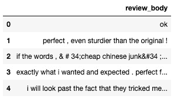

# 第六章：训练自然语言处理模型

在前一章中，您学习了如何使用 SageMaker 的内置算法进行 **计算机视觉**（**CV**）任务，解决包括图像分类、物体检测和语义分割等问题。

**自然语言处理**（**NLP**）是机器学习中另一个非常有前景的领域。事实上，NLP 算法在建模语言和从非结构化文本中提取上下文方面已经证明非常有效。凭借这一点，像搜索和翻译应用程序以及聊天机器人等应用程序如今已经非常普遍。

在本章中，您将学习专门为 NLP 任务设计的内置算法，我们将讨论您可以用它们解决哪些类型的问题。与前一章一样，我们还将详细讲解如何准备实际数据集，如亚马逊客户评论。当然，我们还将训练和部署模型。我们将在以下主题中覆盖所有内容：

+   发现亚马逊 SageMaker 中的 NLP 内置算法

+   准备自然语言数据集

+   使用内置的 NLP 算法

# 技术要求

您需要一个 **Amazon Web Services**（**AWS**）账户才能运行本章中的示例。如果您还没有账户，请访问 [`aws.amazon.com/getting-started/`](https://aws.amazon.com/getting-started/) 创建一个。您还应该了解 AWS 免费套餐（[`aws.amazon.com/free/`](https://aws.amazon.com/free/)），它允许您在一定的使用限制内免费使用许多 AWS 服务。

您需要为您的账户安装并配置 AWS **命令行界面**（**CLI**）工具（[`aws.amazon.com/cli/`](https://aws.amazon.com/cli/)）。

您需要一个可用的 Python 3.x 环境。虽然安装 Anaconda 发行版（[`www.anaconda.com/`](https://www.anaconda.com/)）不是必需的，但强烈推荐安装，因为它包括我们将需要的许多项目（Jupyter、`pandas`、`numpy` 等）。

本书中的代码示例可以在 GitHub 上找到，链接为 [`github.com/PacktPublishing/Learn-Amazon-SageMaker-second-edition`](https://github.com/PacktPublishing/Learn-Amazon-SageMaker-second-edition)。您需要安装 Git 客户端才能访问这些代码（[`git-scm.com/`](https://git-scm.com/)）。

# 发现亚马逊 SageMaker 中的 NLP 内置算法

SageMaker 包含四种 NLP 算法，支持 **有监督学习**（**SL**）和 **无监督学习**（**UL**）场景。在本节中，您将了解这些算法，它们能解决哪些问题，以及它们的训练场景。让我们先来看一下我们将讨论的算法概述：

+   **BlazingText** 构建文本分类模型（SL）或计算词向量（UL）。**BlazingText** 是亚马逊发明的算法。

+   **LDA** 构建 UL 模型，将一组文本文档分组为多个主题。这种技术称为 **主题建模**。

+   **NTM** 是另一个基于神经网络的**主题建模**算法，它能让你更深入地了解主题是如何构建的。

+   **Sequence to Sequence**（**seq2seq**）构建**深度学习**（**DL**）模型，从一系列输入标记预测一系列输出标记。

## 发现 BlazingText 算法

BlazingText 算法是由亚马逊发明的。你可以在[`dl.acm.org/doi/10.1145/3146347.3146354`](https://dl.acm.org/doi/10.1145/3146347.3146354)阅读更多关于它的内容。BlazingText 是**FastText**的演进，FastText 是 Facebook 开发的一个高效文本分类和表示学习库 ([`fasttext.cc`](https://fasttext.cc))。

它让你能够训练文本分类模型，并计算**词向量**。词向量也叫做**嵌入**，是许多自然语言处理（NLP）任务的基石，比如寻找词语相似度、词语类比等。**Word2Vec** 是计算这些向量的领先算法之一 ([`arxiv.org/abs/1301.3781`](https://arxiv.org/abs/1301.3781))，而 BlazingText 正是实现了这一算法。

BlazingText 的主要改进是能够在**图形处理单元**（**GPU**）实例上进行训练，而 FastText 只支持**中央处理单元**（**CPU**）实例。

速度提升是显著的，这也是它名字的来源：“blazing”比“fast”更快！如果你对基准测试感兴趣，一定会喜欢这篇博客文章：[`aws.amazon.com/blogs/machine-learning/amazon-sagemaker-blazingtext-parallelizing-word2vec-on-multiple-cpus-or-gpus/`](https://aws.amazon.com/blogs/machine-learning/amazon-sagemaker-blazingtext-parallelizing-word2vec-on-multiple-cpus-or-gpus/)。

最后，BlazingText 与 FastText 完全兼容。你可以非常轻松地导出并测试模型，正如你稍后在本章中将看到的那样。

## 发现 LDA 算法

这个 UL 算法使用一种生成技术，叫做**主题建模**，来识别大规模文本文档集合中的主题。它首次应用于机器学习是在 2003 年 ([`jmlr.csail.mit.edu/papers/v3/blei03a.html`](http://jmlr.csail.mit.edu/papers/v3/blei03a.html))。

请注意，LDA 并不是一个分类算法。你给它传递的是要构建的主题数量，而不是你期望的主题列表。用福雷斯特·甘普的话说：“*主题建模就像一盒巧克力，你永远不知道自己会得到什么。*”

LDA 假设文档集合中的每个文本都是由几个潜在（即“隐藏”）主题生成的。一个主题通过词语概率分布来表示。对于文档集合中的每个词，这个分布给出该词在由该主题生成的文档中出现的概率。例如，在“金融”主题中，分布会为“收入”、“季度”或“收益”等词汇给出较高的概率，而“弩炮”或“鸭嘴兽”等词汇则会有较低的概率（我想应该是这样）。

主题分布不是独立考虑的。它们通过**Dirichlet 分布**表示，这是单变量分布的多变量推广（[`en.wikipedia.org/wiki/Dirichlet_distribution`](https://en.wikipedia.org/wiki/Dirichlet_distribution)）。这个数学对象赋予了算法它的名称。

给定词汇表中的词语数量和潜在主题的数量，LDA 算法的目的是建立一个尽可能接近理想 Dirichlet 分布的模型。换句话说，它会尝试将词语分组，使得分布尽可能良好，并与指定的主题数量匹配。

训练数据需要仔细准备。每个文档需要转换为**词袋**（**BoW**）表示：每个词语被一对整数替换，表示一个唯一的词语**标识符**（**ID**）和文档中该词的出现次数。最终的数据集可以保存为**逗号分隔值**（**CSV**）格式或**RecordIO 包装的 protobuf**格式，这是一种我们在**第四章**《训练机器学习模型》中已经学习过的技术。

一旦模型训练完成，我们可以对任何文档进行评分，并为每个主题打分。预期是，包含相似词语的文档应该具有相似的得分，从而使我们能够识别它们的主要主题。

## 探索 NTM 算法

NTM 是另一种主题建模算法。你可以在[`arxiv.org/abs/1511.06038`](https://arxiv.org/abs/1511.06038)上阅读更多关于它的信息。以下博客文章也总结了论文的关键要素：[`aws.amazon.com/blogs/machine-learning/amazon-sagemaker-neural-topic-model-now-supports-auxiliary-vocabulary-channel-new-topic-evaluation-metrics-and-training-subsampling/`](https://aws.amazon.com/blogs/machine-learning/amazon-sagemaker-neural-topic-model-now-supports-auxiliary-vocabulary-channel-new-topic-evaluation-metrics-and-training-subsampling/)。

与 LDA 一样，文档需要转换为 BoW 表示，并且数据集可以保存为 CSV 格式或 RecordIO 包装的 protobuf 格式。

对于训练，NTM 采用一种完全不同的方法，基于神经网络——更准确地说，是基于编码器架构（[`en.wikipedia.org/wiki/Autoencoder`](https://en.wikipedia.org/wiki/Autoencoder)）。真正的深度学习方式是，编码器在文档的小批量上进行训练。它通过反向传播和优化调整网络参数，试图学习它们的潜在特征。

与 LDA 不同，NTM 可以告诉我们每个主题中最具影响力的词语。它还为每个主题提供了两个度量指标，**词嵌入主题一致性**（**WETC**）和**主题独特性**（**TU**）。这些在这里有更详细的描述：

+   WETC 告诉我们主题词之间的语义相似度。该值介于 0 和 1 之间，值越高表示越好。它是通过预训练的 **全球向量** (**GloVe**) 模型中的对应词向量的 **余弦相似度** ([`en.wikipedia.org/wiki/Cosine_similarity`](https://en.wikipedia.org/wiki/Cosine_similarity)) 计算得到的（这是另一个类似于 Word2Vec 的算法）。

+   TU 告诉我们该主题的独特性——也就是说，其词汇是否在其他主题中出现过。该值介于 0 和 1 之间，得分越高，主题越独特。

一旦模型训练完成，我们就可以对文档进行评分，并为每个主题获得评分。

## 发现 seq2sea 算法

seq2seq 算法基于 **长短期记忆** (**LSTM**) 神经网络 ([`arxiv.org/abs/1409.3215`](https://arxiv.org/abs/1409.3215))。顾名思义，seq2seq 可以被训练成将一系列标记映射到另一系列标记。它的主要应用是机器翻译，训练大规模的双语语料库，例如 **统计机器翻译研讨会** (**WMT**) 数据集 ([`www.statmt.org/wmt20/`](http://www.statmt.org/wmt20/))。

除了在 SageMaker 中提供的实现外，AWS 还将 seq2seq 算法打包成了一个开源项目，**AWS Sockeye** ([`github.com/awslabs/sockeye`](https://github.com/awslabs/sockeye))，该项目还包括数据集准备工具。

本章不会介绍 seq2seq。详细讲解会占用太多篇幅，而且没有必要重复 Sockeye 文档中已经包含的内容。

你可以在 [`github.com/awslabs/amazon-sagemaker-examples/tree/master/introduction_to_amazon_algorithms/seq2seq_translation_en-de`](https://github.com/awslabs/amazon-sagemaker-examples/tree/master/introduction_to_amazon_algorithms/seq2seq_translation_en-de) 找到一个 seq2seq 示例。不幸的是，它使用了低级别的 `boto3` **应用程序编程接口** (**API**)，我们将在 *第十二章*，*自动化机器学习工作流* 中讲解。尽管如此，它仍然是一本有价值的读物，而且你不会遇到太多麻烦就能搞明白。

## 使用 NLP 算法进行训练

就像 CV 算法一样，训练是相对简单的，尤其是在使用 SageMaker **软件开发工具包** (**SDK**) 时。到目前为止，你应该已经熟悉了工作流程和 API，并且我们将在本章中继续使用它们。

为 NLP 算法准备数据是另一回事。首先，现实生活中的数据集通常非常庞大。在本章中，我们将处理数百万个样本和数亿个单词。当然，这些数据需要清洗、处理，并转换为算法所期望的格式。

在本章中，我们将使用以下技术：

+   使用`pandas`库加载和清理数据（[`pandas.pydata.org`](https://pandas.pydata.org)）

+   使用**自然语言工具包**（**NLTK**）库去除停用词并进行词形还原（[`www.nltk.org`](https://www.nltk.org)）

+   使用`spaCy`库进行分词（[`spacy.io/`](https://spacy.io/)）

+   使用`gensim`库构建词汇表并生成 BoW 表示（[`radimrehurek.com/gensim/`](https://radimrehurek.com/gensim/)）

+   使用**Amazon SageMaker Processing**运行数据处理任务，我们在*第二章*中学习过，*处理数据准备技术*

当然——这不是一本 NLP 书籍，我们不会深入数据处理。但这将是一次非常有趣的学习机会，希望能了解一些流行的开源 NLP 工具。

# 准备自然语言数据集

在上一章的 CV 算法中，数据准备侧重于数据集所需的技术格式（**图像**格式、**RecordIO**或**增强清单**）。图像本身没有被处理。

对于 NLP 算法，情况完全不同。文本需要经过大量处理、转换，并以正确的格式保存。在大多数学习资源中，这些步骤通常会被简化或忽略。数据已经“自动”准备好进行训练，这让读者感到沮丧，有时甚至不知从何处开始准备自己的数据集。

这里没有这种情况！在本节中，您将学习如何准备不同格式的 NLP 数据集。再一次，准备好学习大量内容吧！

让我们从为 BlazingText 准备数据开始。

## 使用 BlazingText 准备分类数据

BlazingText 期望标签输入数据与 FastText 相同的格式，详见此处：

+   一个纯文本文件，每行一个样本。

+   每行包含两个字段，如下所示：

    a) 以`__label__LABELNAME__`形式的标签

    b) 文本本身，形成以空格分隔的词元（单词和标点符号）

让我们开始工作，准备一个用于情感分析（正面、中立或负面）的客户评论数据集。我们将使用**Amazon Customer Reviews**数据集，可以在[`s3.amazonaws.com/amazon-reviews-pds/readme.html`](https://s3.amazonaws.com/amazon-reviews-pds/readme.html)找到。那应该是充足的现实数据。

在开始之前，请确保您有足够的存储空间。在这里，我使用的是具有 10 **千兆字节**（**GB**）存储的笔记本实例。我还选择了一个 C5 实例类型，以更快地运行处理步骤。我们将按以下方式进行：

1.  让我们通过运行以下代码来下载相机评论：

    ```py
    %%sh
    aws s3 cp s3://amazon-reviews-pds/tsv/amazon_reviews_us_Camera_v1_00.tsv.gz /tmp
    ```

1.  我们使用`pandas`加载数据，忽略任何会引发错误的行，并删除任何包含缺失值的行。以下代码演示了这一过程：

    ```py
    data = pd.read_csv(
        '/tmp/amazon_reviews_us_Camera_v1_00.tsv.gz', 
        sep='\t', compression='gzip', 
        error_bad_lines=False, dtype='str')
    data.dropna(inplace=True)
    ```

1.  我们打印数据的形状和列名，如下所示：

    ```py
    print(data.shape)
    print(data.columns)
    ```

    这将给我们以下输出：

    ```py
    (1800755, 15)
    Index(['marketplace','customer_id','review_id','product_id','product_parent', 'product_title','product_category',  'star_rating','helpful_votes','total_votes','vine', 'verified_purchase','review_headline','review_body', 
    'review_date'], dtype='object')
    ```

1.  180 万行！我们保留了 100,000 行，足够满足我们的需求。我们还删除了除 `star_rating` 和 `review_body` 之外的所有列，以下代码片段展示了这一过程：

    ```py
    data = data[:100000]
    data = data[['star_rating', 'review_body']]
    ```

1.  基于星级评分，我们新增了一个名为 `label` 的列，标签格式已正确。你不得不佩服 `pandas` 让这一切变得如此简单。然后，我们删除了 `star_rating` 列，以下代码片段展示了这一过程：

    ```py
    data['label'] = data.star_rating.map({
        '1': '__label__negative__',
        '2': '__label__negative__',
        '3': '__label__neutral__',
        '4': '__label__positive__',
        '5': '__label__positive__'})
    data = data.drop(['star_rating'], axis=1)
    ```

1.  BlazingText 期望每行的开头是标签，因此我们将 `label` 列移到前面，如下所示：

    ```py
    data = data[['label', 'review_body']]
    ```

1.  数据现在应该像这样：

    图 6.1 – 查看数据集

1.  BlazingText 期望标记符号之间用空格分隔：每个单词和标点符号必须与下一个单词或符号用空格分隔开。让我们使用 `nltk` 库中的便捷 `punkt` 分词器。根据你使用的实例类型，这可能需要几分钟。下面是你需要的代码：

    ```py
    !pip -q install nltk
    import nltk
    nltk.download('punkt')
    data['review_body'] = data['review_body'].apply(nltk.word_tokenize)
    ```

1.  我们将标记符号连接成一个字符串，并将其转换为小写，如下所示：

    ```py
    data['review_body'] = 
        data.apply(lambda row: "".join(row['review_body'])
            .lower(), axis=1)
    ```

1.  数据现在应该像这样（请注意，所有的标记符号都已正确地用空格分隔）：

    图 6.2 – 查看标记化后的数据集

1.  最后，我们将数据集拆分为训练集（95%）和验证集（5%），并将这两个拆分保存为纯文本文件，以下代码片段展示了这一过程：

    ```py
    from sklearn.model_selection import train_test_split
    training, validation = train_test_split(data, test_size=0.05)
    np.savetxt('/tmp/training.txt', training.values, fmt='%s')
    np.savetxt('/tmp/validation.txt', validation.values, fmt='%s')
    ```

1.  打开其中一个文件，你应该会看到许多类似这样的行：

    ```py
    __label__neutral__ really works for me , especially on the streets of europe . wished it was less expensive though . the rain cover at the base really works . the padding which comes in contact with your back though will suffocate & make your back sweaty .
    ```

数据准备其实并不算太糟糕，对吧？不过，标记化过程运行了一两分钟。现在，想象一下如果是在数百万个样本上运行这个过程会怎样。没错，你可以启动一个更大的环境来运行它，在 **SageMaker Studio** 上运行。不过，你还得为使用它支付更多费用，特别是当只有这一道步骤需要额外计算力时，这显然是浪费的。另外，想象一下如果你需要对许多其他数据集运行同样的脚本。你会想一次又一次地手动做这些事情，等待 20 分钟，每次还要希望你的笔记本不会崩溃吗？我想应该不会！

你已经知道这两个问题的答案了。那就是 **Amazon SageMaker Processing**，我们在 *第二章*《数据准备技术》中学过这个内容。你应该能够两全其美，在最小且最便宜的环境中进行实验，并在需要更多资源时运行按需作业。日复一日，你将节省成本，并更快完成任务。

让我们将这些处理代码移到 SageMaker Processing。

## 为使用 BlazingText 进行分类准备数据，第 2 版

我们在 *第二章*《数据准备技术》中已经详细讨论了这个内容，所以这次我会讲得更快一些。我们将按如下步骤进行：

1.  我们将数据集上传到 **简单存储服务** (**S3**)，如下所示：

    ```py
    import sagemaker
    session = sagemaker.Session()
    prefix = 'amazon-reviews-camera'
    input_data = session.upload_data(
        path='/tmp/amazon_reviews_us_Camera_v1_00.tsv.gz', 
        key_prefix=prefix)
    ```

1.  我们通过运行以下代码来定义处理器：

    ```py
    from sagemaker.sklearn.processing import SKLearnProcessor
    sklearn_processor = SKLearnProcessor(
       framework_version='0.23-1',
       role= sagemaker.get_execution_role(),
       instance_type='ml.c5.2xlarge',
       instance_count=1)
    ```

1.  我们运行处理作业，传递处理脚本及其参数，如下所示：

    ```py
    from sagemaker.processing import ProcessingInput, ProcessingOutput
    sklearn_processor.run(
        code='preprocessing.py',
        inputs=[
            ProcessingInput(
                source=input_data,
                destination='/opt/ml/processing/input')
        ],
        outputs=[
            ProcessingOutput(
                output_name='train_data',
                source='/opt/ml/processing/train'),
            ProcessingOutput(
                output_name='validation_data',
                source='/opt/ml/processing/validation')
        ],
        arguments=[
            '--filename', 'amazon_reviews_us_Camera_v1_00.tsv.gz',
            '--num-reviews', '100000',
            '--split-ratio', '0.05'
        ]
    )
    ```

1.  简化的预处理脚本如下所示，完整版本可以在本书的 GitHub 仓库中找到。我们首先安装`nltk`包，如下所示：

    ```py
    import argparse, os, subprocess, sys
    import pandas as pd
    import numpy as np
    from sklearn.model_selection import train_test_split
    def install(package):
        subprocess.call([sys.executable, "-m", "pip",  
                         "install", package]) 
    if __name__=='__main__':
        install('nltk')
        import nltk
    ```

1.  我们读取命令行参数，如下所示：

    ```py
        parser = argparse.ArgumentParser()
        parser.add_argument('--filename', type=str)
        parser.add_argument('--num-reviews', type=int)
        parser.add_argument('--split-ratio', type=float, 
                            default=0.1)
        args, _ = parser.parse_known_args()
        filename = args.filename
        num_reviews = args.num_reviews
        split_ratio = args.split_ratio
    ```

1.  我们读取输入数据集并进行处理，如下所示：

    ```py
        input_data_path = 
        os.path.join('/opt/ml/processing/input', filename)
        data = pd.read_csv(input_data_path, sep='\t', 
               compression='gzip', error_bad_lines=False,
               dtype='str')
        # Process data
        . . . 
    ```

1.  最后，我们将数据分为训练集和验证集，并将其保存到两个文本文件中，如下所示：

    ```py
        training, validation = train_test_split(
                               data, 
                               test_size=split_ratio)
        training_output_path = os.path.join('
        /opt/ml/processing/train', 'training.txt')    
        validation_output_path = os.path.join(
        '/opt/ml/processing/validation', 'validation.txt')
        np.savetxt(training_output_path, 
        training.values, fmt='%s')
        np.savetxt(validation_output_path, 
        validation.values, fmt='%s')
    ```

如你所见，将手动处理的代码转化为 SageMaker 处理作业并不难。你实际上还可以重用大部分代码，因为它涉及一些通用的主题，比如命令行参数、输入和输出。唯一的技巧是使用`subprocess.call`在处理容器内安装依赖项。

配备了这个脚本后，你现在可以按需大规模处理数据，而不必运行和管理长期的笔记本。

现在，让我们为另一个 BlazingText 场景——词向量——准备数据！

## 使用 BlazingText 准备词向量数据

BlazingText 让你能够轻松且大规模地计算词向量。它期望输入数据为以下格式：

+   一个纯文本文件，每行一个样本。

+   每个样本必须具有以空格分隔的标记（词语和标点符号）。

让我们处理与上一节相同的数据集，如下所示：

1.  我们将需要`spaCy`库，因此让我们安装它并一起安装其英语语言模型，如下所示：

    ```py
    %%sh
    pip -q install spacy
    python -m spacy download en_core_web_sm
    python -m spacy validate
    ```

1.  我们使用`pandas`加载数据，忽略任何导致错误的行。我们还会删除任何包含缺失值的行。无论如何，我们的数据量应该足够多。以下是你需要的代码：

    ```py
    data = pd.read_csv(
        '/tmp/amazon_reviews_us_Camera_v1_00.tsv.gz', 
        sep='\t', compression='gzip', 
        error_bad_lines=False, dtype='str')
    data.dropna(inplace=True)
    ```

1.  我们保留 100,000 行，并且删除除了`review_body`之外的所有列，如下所示：

    ```py
    data = data[:100000]
    data = data[['review_body']]
    ```

    我们编写一个函数来使用`spaCy`对评论进行分词，并将其应用到`DataFrame`中。这个步骤应该比前一个例子中使用`nltk`分词要明显更快，因为`spaCy`基于`cython`（[`cython.org`](https://cython.org)）。以下是代码示例：

    ```py
    import spacy
    spacy_nlp = spacy.load('en_core_web_sm')
    def tokenize(text):
        tokens = spacy_nlp.tokenizer(text)
        tokens = [ t.text for t in tokens ]
        return " ".join(tokens).lower()
    data['review_body'] = 
        data['review_body'].apply(tokenize)
    ```

    现在数据应该是这样的：

    

    图 6.3 – 查看分词后的数据集

1.  最后，我们将评论保存到一个纯文本文件中，如下所示：

    ```py
    import numpy as np
    np.savetxt('/tmp/training.txt', data.values, fmt='%s')
    ```

1.  打开这个文件，你应该看到每行一个分词后的评论，正如以下代码片段所示：

    ```py
    Ok
    perfect , even sturdier than the original !
    ```

在这里，我们也应该使用 SageMaker 处理来运行这些步骤。你可以在这本书的 GitHub 仓库中找到相应的笔记本和预处理脚本。

现在，让我们为 LDA 和 NTM 算法准备数据。

## 为 LDA 和 NTM 准备主题建模数据

在这个示例中，我们将使用 **百万新闻头条** 数据集（[`doi.org/10.7910/DVN/SYBGZL`](https://doi.org/10.7910/DVN/SYBGZL)），该数据集也可以在 GitHub 仓库中找到。顾名思义，它包含来自澳大利亚新闻源 *ABC* 的一百万条新闻头条。与产品评论不同，头条新闻通常是非常简短的句子。构建一个主题模型将是一个有趣的挑战！

### 分词数据

正如你所预料的，两个算法都需要一个已经分词的数据集，所以我们按以下步骤进行：

1.  我们需要安装 `nltk` 和 `gensim` 库，步骤如下：

    ```py
    %%sh
    pip -q install nltk gensim
    ```

1.  下载数据集后，我们使用 `pandas` 完整加载它，如下所示：

    ```py
    num_lines = 1000000
    data = pd.read_csv('abcnews-date-text.csv.gz', 
                       compression='gzip', error_bad_lines=False, 
                       dtype='str', nrows=num_lines)
    ```

1.  数据应该是这样的：

    图 6.4 – 查看已分词的数据集

1.  数据按日期排序，并且为了安全起见我们将其打乱。然后，我们运行以下代码删除 `date` 列：

    ```py
    data = data.sample(frac=1)
    data = data.drop(['publish_date'], axis=1)
    ```

1.  我们编写一个函数来清理和处理头条新闻。首先，我们去除所有标点符号和数字。使用 `nltk`，我们还会去除停用词——即那些非常常见且不添加任何上下文的单词，例如“this”，“any”等。为了减少词汇量并保持上下文，我们可以应用 **词干提取**（https://en.wikipedia.org/wiki/Stemming）或 **词形还原**（[`en.wikipedia.org/wiki/Lemmatisation`](https://en.wikipedia.org/wiki/Lemmatisation)），这两种是流行的自然语言处理技术。这里我们选择后者。根据你的实例类型，这个过程可能需要几分钟。以下是你需要的代码：

    ```py
    import string
    import nltk
    from nltk.corpus import stopwords
    #from nltk.stem.snowball import SnowballStemmer
    from nltk.stem import WordNetLemmatizer 
    nltk.download('stopwords')
    stop_words = stopwords.words('english')
    #stemmer = SnowballStemmer("english")
    wnl = WordNetLemmatizer()
    def process_text(text):
        for p in string.punctuation:
            text = text.replace(p, '')
            text = ''.join([c for c in text if not 
                            c.isdigit()])
            text = text.lower().split()
            text = [w for w in text if not w in 
                    stop_words]
            #text = [stemmer.stem(w) for w in text]
            text = [wnl.lemmatize(w) for w in text]
            return text
    data['headline_text'] = 
        data['headline_text'].apply(process_text)
    ```

1.  数据处理后应该是这样的：


图 6.5 – 查看已词形还原的数据集

现在评论已经分词，我们需要将其转换为 BoW 表示，将每个单词替换为一个唯一的整数 ID 和其频率计数。

### 将数据转换为 BoW 表示

我们将按照以下步骤将评论转换为 BoW 表示：

1.  `gensim` 库正好包含了我们需要的功能！我们使用以下代码构建一个**字典**，它包含了文档集合中的所有单词：

    ```py
    from gensim import corpora
    dictionary = corpora.Dictionary(data['headline_text'])
    print(dictionary)
    ```

    字典看起来是这样的：

    ```py
    Dictionary(83131 unique tokens: ['aba', 'broadcasting', 'community', 'decides', 'licence']...)
    ```

    这个数字看起来很高。如果维度太多，训练将会非常长，算法可能会很难拟合数据；例如，NTM 是基于神经网络架构的。输入层的大小将根据分词的数量来决定，因此我们需要保持维度合理。这样可以加速训练，并帮助编码器学习一个可管理的潜在特征数量。

1.  我们可以回头再清理一下头条新闻。不过，我们使用 `gensim` 的一个函数来移除极端单词——即那些非常稀有或非常频繁的异常词。然后，冒着风险，我们决定将词汇限制为剩余的前 512 个单词。是的——这不到 1%。以下是执行此操作的代码：

    ```py
    dictionary.filter_extremes(keep_n=512)
    ```

1.  我们将词汇表写入一个文本文件。这不仅有助于我们检查哪些单词最重要，而且我们还将把这个文件作为额外的**通道**传递给 NTM 算法。训练模型时，你会明白为什么这很重要。执行此操作的代码示例如下：

    ```py
    with open('vocab.txt', 'w') as f:
        for index in range(0,len(dictionary)):
            f.write(dictionary.get(index)+'\n')
    ```

1.  我们使用字典为每个标题构建一个词袋（BoW）。它被存储在一个名为`tokens`的新列中。当我们完成后，会删除文本评论。代码示例如下：

    ```py
    data['tokens'] = data.apply(lambda row: dictionary.doc2bow(row['headline_text']), axis=1)
    data = data.drop(['headline_text'], axis=1)
    ```

1.  现在，数据应如下所示：


图 6.6 – 查看 BoW 数据集

如您所见，每个单词已经被替换为其唯一的 ID 以及在评论中的频率。例如，最后一行告诉我们单词#11 出现一次，单词#12 出现一次，依此类推。

数据处理现已完成。最后一步是将其保存为适当的输入格式。

### 保存输入数据

NTM 和 LDA 期望数据以 CSV 格式或 RecordIO 封装的 protobuf 格式提供。正如在*第四章*中关于**矩阵分解**的例子所讨论的，*训练机器学习模型*，我们正在处理的数据非常稀疏。任何给定的评论只包含词汇表中的少数几个单词。由于 CSV 格式是稠密格式，我们最终会得到大量的零频率单词。这可不是什么好主意！

再次，我们将使用`lil_matrix`，一个`SciPy`库。它的行数与评论数相等，列数与字典中的单词数相等。我们按以下方式进行：

1.  我们按如下方式创建稀疏矩阵：

    ```py
    from scipy.sparse import lil_matrix
    num_lines = data.shape[0]
    num_columns = len(dictionary)
    token_matrix = lil_matrix((num_lines,num_columns))
                   .astype('float32')
    ```

1.  我们编写一个函数，将标题添加到矩阵中。对于每个令牌，我们只需在相应的列中写下其频率，如下所示：

    ```py
    def add_row_to_matrix(line, row):
        for token_id, token_count in row['tokens']:
            token_matrix[line, token_id] = token_count
        return
    ```

1.  然后，我们遍历标题并将其添加到矩阵中。快速提示：我们不能使用行索引值，因为它们可能大于行数。代码示例如下：

    ```py
    line = 0
    for _, row in data.iterrows():
        add_row_to_matrix(line, row)
        line+=1
    ```

1.  最后的步骤是将这个矩阵写入`protobuf`格式的内存缓冲区，并上传到 S3 以供将来使用，如下所示：

    ```py
    import io, boto3
    import sagemaker
    import sagemaker.amazon.common as smac
    buf = io.BytesIO()
    smac.write_spmatrix_to_sparse_tensor(buf, token_matrix, None)
    buf.seek(0)
    bucket = sagemaker.Session().default_bucket()
    prefix = 'headlines-lda-ntm'
    train_key = 'reviews.protobuf'
    obj = '{}/{}'.format(prefix, train_key))
    s3 = boto3.resource('s3')
    s3.Bucket(bucket).Object(obj).upload_fileobj(buf)
    s3_train_path = 's3://{}/{}'.format(bucket,obj)
    ```

1.  构建（1000000，512）的矩阵需要几分钟。上传到 S3 后，我们可以看到它只有 42 **兆字节**（**MB**）。确实是小矩阵。代码示例如下：

    ```py
    $ aws s3 ls s3://sagemaker-eu-west-1-123456789012/amazon-reviews-ntm/training.protobuf
    43884300 training.protobuf
    ```

这就是 LDA 和 NTM 的数据准备工作。现在，让我们看看如何使用**SageMaker Ground Truth**准备的文本数据集。

## 使用 SageMaker Ground Truth 标记的数据集

如在*第二章*中讨论的，*数据准备技术处理*，SageMaker Ground Truth 支持文本分类任务。我们完全可以使用它的输出构建一个用于 FastText 或 BlazingText 的数据集。

首先，我快速运行了一个文本分类任务，应用了两种标签之一：“`aws_service`”如果句子提到 AWS 服务，和“`no_aws_service`”如果没有提到。

一旦任务完成，我可以从 S3 获取 **增强后的清单**。它是 **JavaScript 对象表示法行**（**JSON Lines**）格式，下面是其中一个条目：

```py
{"source":"With great power come great responsibility. The second you create AWS resources, you're responsible for them: security of course, but also cost and scaling. This makes monitoring and alerting all the more important, which is why we built services like Amazon CloudWatch, AWS Config and AWS Systems Manager.","my-text-classification-job":0,"my-text-classification-job-metadata":{"confidence":0.84,"job-name":"labeling-job/my-text-classification-job","class-name":"aws_service","human-annotated":"yes","creation-date":"2020-05-11T12:44:50.620065","type":"groundtruth/text-classification"}}
```

我们来写点 Python 代码，把它转成 BlazingText 格式怎么样？当然可以！来看看：

1.  我们直接从 S3 加载增强后的清单，如下所示：

    ```py
    import pandas as pd
    bucket = 'sagemaker-book'
    prefix = 'chapter2/classif/output/my-text-classification-job/manifests/output'
    manifest = 's3://{}/{}/output.manifest'.format(bucket, prefix)
    data = pd.read_json(manifest, lines=True)
    ```

1.  数据看起来像这样：

    ](img/B17705_06_7.jpg)

    图 6.7 – 查看标注过的数据集

1.  标签隐藏在 `my-text-classification-job-metadata` 列中。我们将其提取到一个新列，如下所示：

    ```py
    def get_label(metadata):
        return metadata['class-name']
    data['label'] = 
    data['my-text-classification-job-metadata'].apply(get_label)
    data = data[['label', 'source']]
    ```

1.  数据现在看起来像下面的截图所示。从此以后，我们可以应用分词等操作。很简单，不是吗？


](img/B17705_06_8.jpg)

图 6.8 – 查看处理过的数据集

现在，让我们构建 NLP 模型！

# 使用内置的 NLP 算法

在本节中，我们将使用 BlazingText、LDA 和 NTM 训练并部署模型。当然，我们将使用前一节准备的数据集。

## 使用 BlazingText 进行文本分类

BlazingText 让构建文本分类模型变得极其简单，尤其是如果你没有 NLP 技能。让我们看看，以下是步骤：

1.  我们将训练和验证数据集上传到 S3。或者，我们可以使用 SageMaker 处理作业返回的输出路径。代码如下所示：

    ```py
    import sagemaker
    session = sagemaker.Session()
    bucket = session.default_bucket()
    prefix = 'amazon-reviews'
    s3_train_path = session.upload_data(path='/tmp/training.txt', bucket=bucket, key_prefix=prefix+'/input/train')
    s3_val_path = session.upload_data(
        path='/tmp/validation.txt', bucket=bucket,   
        key_prefix=prefix+'/input/validation')
    s3_output = 's3://{}/{}/output/'.format(bucket, 
        prefix)
    ```

1.  我们为 BlazingText 配置 `Estimator` 函数，如下所示：

    ```py
    from sagemaker.image_uris import retrieve
    region_name = session.boto_session.region_name
    container = retrieve('blazingtext', region)
    bt = sagemaker.estimator.Estimator(container, 
         sagemaker.get_execution_role(),
         instance_count=1,
         instance_type='ml.p3.2xlarge',
         output_path=s3_output)
    ```

1.  我们设置一个超参数，告诉 BlazingText 以监督模式进行训练，如下所示：

    ```py
    bt.set_hyperparameters(mode='supervised')
    ```

1.  我们定义通道，设置内容类型为 `text/plain`，然后启动训练，如下所示：

    ```py
    from sagemaker import TrainingInput
    train_data = TrainingInput(
        s3_train_path, content_type='text/plain')
    validation_data = TrainingInput(
        s3_val_path, content_type='text/plain')
    s3_channels = {'train': train_data, 
                   'validation': validation_data}
    bt.fit(inputs=s3_channels)
    ```

1.  我们得到了 88.4% 的验证准确率，在没有调整任何超参数的情况下，这个结果相当不错。然后，我们将模型部署到一个小型 CPU 实例，如下所示：

    ```py
    bt_predictor = bt.deploy(initial_instance_count=1, 
                             instance_type='ml.t2.medium')
    ```

1.  一旦端点启动，我们将发送三个已分词的样本进行预测，并请求所有三个标签，如下所示：

    ```py
    import json
    sentences = ['This is a bad camera it doesnt work at all , i want a refund  . ' , 'The camera works , the pictures are decent quality, nothing special to say about it . ' , 'Very happy to have bought this , exactly what I needed . ']
    payload = {"instances":sentences, 
               "configuration":{"k": 3}}
    bt_predictor.serializer =  
        sagemaker.serializers.JSONSerializer()
    response = bt_predictor.predict(json.dumps(payload))
    ```

1.  打印响应后，我们可以看到三个样本已正确分类，如下图所示：

    ```py
    [{'prob': [0.9758228063583374, 0.023583529517054558, 0.0006236258195713162], 'label': ['__label__negative__', '__label__neutral__', '__label__positive__']}, 
    {'prob': [0.5177792906761169, 0.2864232063293457, 0.19582746922969818], 'label': ['__label__neutral__', '__label__positive__', '__label__negative__']}, 
    {'prob': [0.9997835755348206, 0.000205090589588508, 4.133415131946094e-05], 'label': ['__label__positive__', '__label__neutral__', '__label__negative__']}]
    ```

1.  像往常一样，一旦完成，我们通过运行以下代码删除端点：

    ```py
    bt_predictor.delete_endpoint()
    ```

现在，让我们训练 BlazingText 来计算词向量。

## 使用 BlazingText 计算词向量

这段代码几乎与前一个示例相同，只有两个不同点。首先，只有一个通道，包含训练数据。其次，我们需要将 BlazingText 设置为 UL 模式。

BlazingText 支持在 Word2Vec 中实现的训练模式：**skipgram** 和 **连续的 BoW**（**CBOW**）。它还添加了一种第三种模式，**batch_skipgram**，用于更快的分布式训练。它还支持 **子词嵌入**，这是一种可以为拼写错误或不在词汇表中的词返回词向量的技术。

我们选择使用 skipgram 和子词嵌入。我们保持向量的维度不变（默认是 100）。以下是所需的代码：

```py
bt.set_hyperparameters(mode='skipgram', subwords=True)
```

与其他算法不同，这里没有需要部署的内容。模型文件存储在 S3 中，并且可以用于下游 NLP 应用程序。

说到这里，BlazingText 与 FastText 兼容，那么如何将我们刚训练的模型加载到 FastText 中呢？

## 使用 BlazingText 模型与 FastText

首先，我们需要编译 FastText，这非常简单。你甚至可以在笔记本实例上进行编译，无需安装任何东西。下面是你需要的代码：

```py
$ git clone https://github.com/facebookresearch/fastText.git
$ cd fastText
$ make
```

让我们首先尝试我们的分类模型。

### 使用 BlazingText 分类模型与 FastText

我们将通过以下步骤来尝试该模型：

1.  我们从 S3 复制模型文件并进行解压，方法如下：

    ```py
    $ aws s3 cp s3://sagemaker-eu-west-1-123456789012/amazon-reviews/output/JOB_NAME/output/model.tar.gz .
    $ tar xvfz model.tar.gz
    ```

1.  我们使用 FastText 加载 `model.bin`，方法如下：

    ```py
    $ ./fasttext predict model.bin -
    ```

1.  我们预测样本并查看它们的 top 类别，方法如下：

    ```py
    This is a bad camera it doesnt work at all , i want a refund  .
    __label__negative__
    The camera works , the pictures are decent quality, nothing
    special to say about it .
    __label__neutral__
    Very happy to have bought this , exactly what I needed
    __label__positive__
    ```

我们通过 *Ctrl* + *C* 退出。现在，让我们来探索我们的向量。

### 使用 BlazingText 词向量与 FastText

现在，我们将使用 FastText 和向量，方法如下：

1.  我们从 S3 复制模型文件并解压，方法如下：

    ```py
    $ aws s3 cp s3://sagemaker-eu-west-1-123456789012/amazon-reviews-word2vec/output/JOB_NAME/output/model.tar.gz .
    $ tar xvfz model.tar.gz
    ```

1.  我们可以探索词语相似度。例如，让我们找出与“远摄”最相近的词汇。这可能有助于我们改进搜索查询的处理方式或推荐相似产品的方式。以下是你需要的代码：

    ```py
    $ ./fasttext nn vectors.bin
    Query word? Telephoto
    telephotos 0.951023
    75-300mm 0.79659
    55-300mm 0.788019
    18-300mm 0.782396
    . . .
    ```

1.  我们也可以寻找类比。例如，假设我们问我们的模型以下问题：尼康 D3300 相机的佳能等效型号是什么？代码如下所示：

    ```py
    $ ./fasttext analogies vectors.bin
    Query triplet (A - B + C)? nikon d3300 canon
    xsi 0.748873
    700d 0.744358
    100d 0.735871
    ```

    根据我们的模型，你应该考虑 XSI 和 700D 相机！

如你所见，词向量非常强大，BlazingText 使得在任何规模下计算词向量都变得非常容易。现在，让我们继续进行主题建模，这是另一个令人着迷的主题。

## 使用 LDA 进行主题建模

在前面的部分，我们准备了百万条新闻标题，现在我们将使用它们进行主题建模，采用 LDA 方法，具体如下：

1.  首先，我们通过运行以下代码定义有用的路径：

    ```py
    import sagemaker
    session = sagemaker.Session()
    bucket = session.default_bucket()
    prefix = reviews-lda-ntm'
    train_key = 'reviews.protobuf'
    obj = '{}/{}'.format(prefix, train_key)
    s3_train_path = 's3://{}/{}'.format(bucket,obj)
    s3_output = 's3://{}/{}/output/'.format(bucket, prefix)
    ```

1.  我们配置 `Estimator` 函数，如下所示：

    ```py
    from sagemaker.image_uris import retrieve
    region_name = session.boto_session.region_name
    container = retrieve('lda', region)
    lda = sagemaker.estimator.Estimator(container, 
          role = sagemaker.get_execution_role(), 
          instance_count=1,                                
          instance_type='ml.c5.2xlarge', 
          output_path=s3_output)
    ```

1.  我们设置超参数：希望构建的主题数量（10），问题的维度（词汇大小）以及我们正在训练的样本数量。可选地，我们可以设置一个名为 `alpha0` 的参数。根据文档：“*较小的值更容易生成稀疏的主题混合，而较大的值（大于 1.0）则生成更加均匀的混合。*”我们将其设置为 0.1，并希望算法能够构建出良好识别的主题。以下是所需的代码：

    ```py
    lda.set_hyperparameters(num_topics=5,
       feature_dim=len(dictionary),
       mini_batch_size=num_lines,
       alpha0=0.1)
    ```

1.  我们启动训练。由于 RecordIO 是该算法期望的默认格式，我们无需定义通道。代码如下所示：

    ```py
    lda.fit(inputs={'train': s3_train_path})
    ```

1.  一旦训练完成，我们将模型部署到一个小型 CPU 实例，方法如下：

    ```py
    lda_predictor = lda.deploy(
        initial_instance_count=1,    
        instance_type='ml.t2.medium')
    ```

1.  在发送样本进行预测之前，我们需要像处理训练集一样处理它们。我们编写一个函数来完成这个任务：构建稀疏矩阵，填充 BoW，并保存到内存中的 protobuf 缓冲区，方法如下：

    ```py
    def process_samples(samples, dictionary):
        num_lines = len(samples)
        num_columns = len(dictionary)
        sample_matrix = lil_matrix((num_lines,  
                        num_columns)).astype('float32')
        for line in range(0, num_lines):
            s = samples[line]
            s = process_text(s)
            s = dictionary.doc2bow(s)
            for token_id, token_count in s:
                sample_matrix[line, token_id] = token_count
            line+=1
        buf = io.BytesIO()
        smac.write_spmatrix_to_sparse_tensor(
            buf,
            sample_matrix,
            None)
        buf.seek(0)
        return buf
    ```

    请注意，我们在这里需要字典。这就是为什么相应的 SageMaker 处理任务保存了它的 pickle 版本，我们可以稍后将其反序列化并使用它。

1.  然后，我们定义一个包含五个标题的 Python 数组，命名为`samples`。这些是真实的标题，我从 ABC 新闻网站上复制的，网址是[`www.abc.net.au/news/`](https://www.abc.net.au/news/)。代码示例如下：

    ```py
    samples = [ "Major tariffs expected to end Australian barley trade to China", "Satellite imagery sparks more speculation on North Korean leader Kim Jong-un", "Fifty trains out of service as fault forces Adelaide passengers to 'pack like sardines", "Germany's Bundesliga plans its return from lockdown as football world watches", "All AFL players to face COVID-19 testing before training resumes" ]
    ```

1.  让我们处理并预测它们，如下所示：

    ```py
    lda_predictor.serializer =  
        sagemaker.serializers.CSVSerializer()
    response = lda_predictor.predict(
               process_samples(samples, dictionary))
    print(response)
    ```

1.  响应中包含每个评论的得分向量（为了简洁起见，已删除额外的小数）。每个向量反映了各个主题的混合，并为每个主题分配得分。所有得分总和为 1。代码示例如下：

    ```py
    {'predictions': [
    {'topic_mixture': [0,0.22,0.54,0.23,0,0,0,0,0,0]}, 
    {'topic_mixture': [0.51,0.49,0,0,0,0,0,0,0,0]}, {'topic_mixture': [0.38,0,0.22,0,0.40,0,0,0,0,0]}, {'topic_mixture': [0.38,0.62,0,0,0,0,0,0,0,0]}, {'topic_mixture': [0,0.75,0,0,0,0,0,0.25,0,0]}]}
    ```

1.  这并不容易读取。让我们打印出主要主题及其得分，如下所示：

    ```py
    import numpy as np
    vecs = [r['topic_mixture'] for r in response['predictions']]
    for v in vecs:
        top_topic = np.argmax(v)
        print("topic %s, %2.2f"%(top_topic,v[top_topic]))
    ```

    这将打印出以下结果：

    ```py
    topic 2, 0.54
    topic 0, 0.51
    topic 4, 0.40
    topic 1, 0.62
    topic 1, 0.75 
    ```

1.  和往常一样，训练完成后我们会删除终端节点，如下所示：

    ```py
    lda_predictor.delete_endpoint()
    ```

解释 LDA 结果并不容易，所以我们在这里要小心。不要有过度的幻想！

+   我们看到每个标题都有一个明确的主题，这是好消息。显然，LDA 能够识别出稳固的主题，也许得益于较低的`alpha0`值。

+   与无关的标题相比，主要的主题是不同的，这很有前景。

+   最后的两个标题都是关于体育的，它们的主要主题是相同的，这是另一个好兆头。

+   所有五条评论在主题 5、6、8 和 9 上得分为零。这可能意味着已经构建了其他主题，我们需要运行更多示例来发现它们。

这是一个成功的模型吗？可能是。我们能确定主题 0 是关于世界事务的，主题 1 是关于体育的，主题 2 也是关于体育的吗？直到我们预测了几千个评论并检查相关标题是否被分配到同一主题，才能得出结论。

正如本章开头提到的，LDA 并不是一种分类算法。它有自己的“思想”，可能会构建出完全出乎意料的主题。也许它会根据情感或城市名称将标题进行分组。一切取决于这些词语在文档集合中的分布。

如果我们能够看到哪些词语在某个主题中“更重要”，那该有多好呢？这无疑会帮助我们更好地理解这些主题。于是，NTM 应运而生！

## 使用 NTM 建模主题

这个例子与前一个非常相似。我们将仅强调其中的不同之处，完整的示例可以在书籍的 GitHub 仓库中找到。让我们开始吧，如下所示：

1.  我们将**词汇文件**上传到 S3，像这样：

    ```py
    s3_auxiliary_path =    
        session.upload_data(path='vocab.txt',   
        key_prefix=prefix + '/input/auxiliary')
    ```

1.  我们选择 NTM 算法，如下所示：

    ```py
    from sagemaker.image_uris import retrieve
    region_name = session.boto_session.region_name
    container = retrieve('ntm', region)
    ```

1.  一旦我们配置了`Estimator`函数，就可以设置超参数，如下所示：

    ```py
    ntm.set_hyperparameters(num_topics=10, 
                            feature_dim=len(dictionary),
                            optimizer='adam',
                            mini_batch_size=256,
                            num_patience_epochs=10)
    ```

1.  我们启动训练，将词汇文件传递到`auxiliary`通道，如下所示：

    ```py
    ntm.fit(inputs={'train': s3_training_path, 
                    'auxiliary': s3_auxiliary_path})
    ```

当训练完成后，我们可以在训练日志中看到大量信息。首先，我们看到 10 个主题的平均 WETC 和 TU 分数，如下所示：

```py
(num_topics:10) [wetc 0.42, tu 0.86]
```

这些结果不错。主题的独特性很高，主题词之间的语义距离适中。

对于每个话题，我们看到它的 WETC 和 TU 分数，以及它的关键词——即在与该话题相关的文档中最有可能出现的词汇。

让我们详细看看每个话题，尝试为它们命名。

第 0 个话题相当明显，我认为。几乎所有的词汇都与犯罪相关，所以我们称它为`crime`。你可以在这里查看该话题：

```py
[0.51, 0.84] stabbing charged guilty pleads murder fatal man assault bail jailed alleged shooting arrested teen girl accused boy car found crash
```

以下的第 1 个话题有些模糊。怎么样，叫它`legal`？请在这里查看它：

```py
[0.36, 0.85] seeker asylum climate live front hears change export carbon tax court wind challenge told accused rule legal face stand boat
```

第 2 个话题是关于事故和火灾的。我们称它为`disaster`。你可以在这里查看该话题：

```py
[0.39, 0.78] seeker crew hour asylum cause damage truck country firefighter blaze crash warning ta plane near highway accident one fire fatal
```

第 3 个话题显而易见：`sports`。TU 分数最高，表明体育文章使用的是非常特定的词汇，其他地方找不到，正如我们在这里看到的那样：

```py
[0.54, 0.93] cup world v league one match win title final star live victory england day nrl miss beat team afl player
```

第 4 个话题是天气信息和自然资源的奇怪混合。它的 WETC 分数和 TU 分数都是最低的。我们称它为`unknown1`。请在这里查看它：

```py
[0.35, 0.77] coast korea gold north east central pleads west south guilty queensland found qld rain beach cyclone northern nuclear crop mine
```

第 5 个话题似乎是关于世界事务的。我们称它为`international`。你可以在这里查看该话题：

```py
[0.38, 0.88] iraq troop bomb trade korea nuclear kill soldier iraqi blast pm president china pakistan howard visit pacific u abc anti
```

第 6 个话题感觉像是地方新闻，因为它包含了澳大利亚地区的缩写：`qld`是昆士兰，`ta`是塔斯马尼亚，`nsw`是新南威尔士州，等等。我们称它为`local`。该话题如下：

```py
[0.25, 0.88] news hour country rural national abc ta sport vic abuse sa nsw weather nt club qld award business
```

第 7 个话题显而易见：`finance`。它具有最高的 WETC 分数，表明从语义角度来看，它的词汇密切相关。话题的独特性也非常高，我们可能在医学或工程等领域特定话题中看到相同的情况。请查看该话题：

```py
[0.62, 0.90] share dollar rise rate market fall profit price interest toll record export bank despite drop loss post high strong trade
```

第 8 个话题是关于政治的，带有一些犯罪元素。有些人会说，这实际上是同一回事。由于我们已经有了一个`crime`话题，我们将这个命名为`politics`。请查看该话题：

```py
[0.41, 0.90] issue election vote league hunt interest poll parliament gun investigate opposition raid arrest police candidate victoria house northern crime rate
```

第 9 个话题是一个混合的例子。很难说它是关于农业还是失踪人员！我们称之为`unknown2`。你可以在这里看到该话题：

```py
[0.37, 0.84] missing search crop body found wind rain continues speaks john drought farm farmer smith pacific crew river find mark tourist
```

综合来看，这是一个相当不错的模型：10 个话题中有 8 个非常清晰。

让我们定义我们的话题列表，并在部署模型后运行示例头条新闻，如下所示：

```py
topics = ['crime','legal','disaster','sports','unknown1',
          'international','local','finance','politics', 
          'unknown2']
samples = [ "Major tariffs expected to end Australian barley trade to China", "US woman wanted over fatal crash asks for release after coronavirus halts extradition", "Fifty trains out of service as fault forces Adelaide passengers to 'pack like sardines", "Germany's Bundesliga plans its return from lockdown as football world watches", "All AFL players to face COVID-19 testing before training resumes" ]
```

我们使用以下函数来打印前 3 个话题及其分数：

```py
import numpy as np
for r in response['predictions']:
    sorted_indexes = np.argsort(r['topic_weights']).tolist()
    sorted_indexes.reverse()
    top_topics = [topics[i] for i in sorted_indexes]
    top_weights = [r['topic_weights'][i] 
                   for i in sorted_indexes]
    pairs = list(zip(top_topics, top_weights))
    print(pairs[:3])
```

这是输出结果：

```py
[('finance', 0.30),('international', 0.22),('sports', 0.09)]
[('unknown1', 0.19),('legal', 0.15),('politics', 0.14)]
[('crime', 0.32), ('legal', 0.18), ('international', 0.09)]
[('sports', 0.28),('unknown1', 0.09),('unknown2', 0.08)]
[('sports', 0.27),('disaster', 0.12),('crime', 0.11)]
```

头条 0、2、3 和 4 完全符合预期。这并不令人惊讶，因为这些话题的强度非常高。

头条 1 在我们称为`legal`的话题中得分很高。也许阿德莱德的乘客应该起诉火车公司？说真的，我们需要找到其他匹配的头条新闻，以便更好地了解该话题的真实含义。

如你所见，NTM 使得理解话题变得更加容易。我们可以通过处理词汇文件来改进模型，添加或移除特定词汇来影响话题，增加话题数目，调整`alpha0`等。我直觉上认为，我们应该在其中看到一个“天气”话题。请尝试一下，看看是否能让它出现。

如果你想运行另一个示例，你可以在这个笔记本中找到有趣的技巧：

[`github.com/awslabs/amazon-sagemaker-examples/blob/master/introduction_to_applying_machine_learning/ntm_20newsgroups_topic_modeling/ntm_20newsgroups_topic_model.ipynb`](https://github.com/awslabs/amazon-sagemaker-examples/blob/master/introduction_to_applying_machine_learning/ntm_20newsgroups_topic_modeling/ntm_20newsgroups_topic_model.ipynb)

# 总结

自然语言处理（NLP）是一个非常激动人心的主题。它也是一个困难的主题，因为语言本身的复杂性，以及构建数据集所需的处理工作量。尽管如此，SageMaker 中的内置算法将帮助你轻松获得良好的结果。训练和部署模型是直接的过程，这为你提供了更多时间来探索、理解和准备数据。

在本章中，你了解了 BlazingText、LDA 和 NTM 算法。你还学习了如何使用流行的开源工具，如`nltk`、`spaCy`和`gensim`，来处理数据集，并将其保存为适当的格式。最后，你学习了如何使用 SageMaker SDK 训练和部署这三种算法的模型，以及如何解读结果。这标志着我们对内置算法的探索的结束。

在下一章中，你将学习如何使用内置的机器学习框架，如**scikit-learn**、**TensorFlow**、**PyTorch**和**Apache MXNet**。
