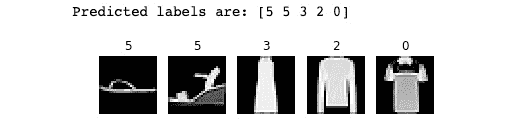
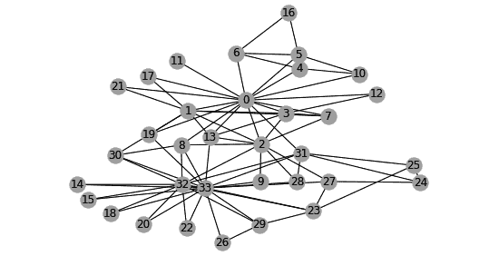
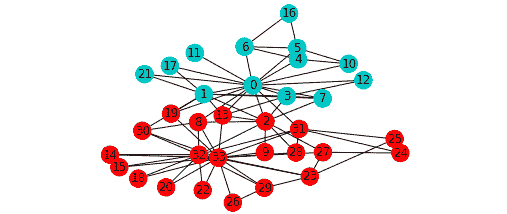
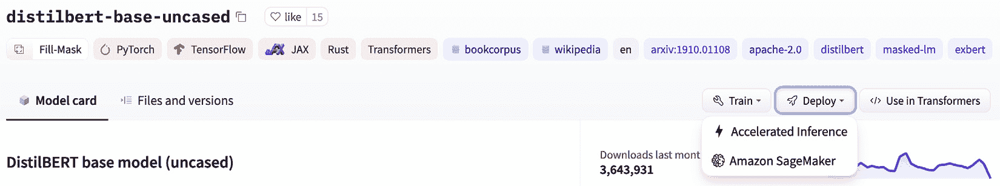
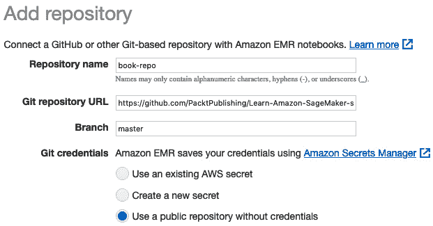
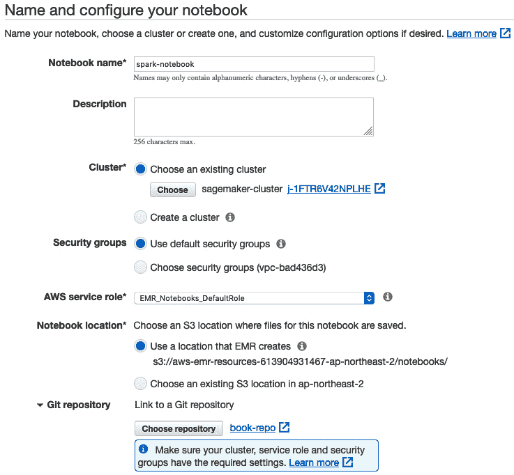

# 第七章：使用内置框架扩展机器学习服务

在过去的三章中，你学习了如何使用内置算法来训练和部署模型，而无需编写一行机器学习代码。然而，这些算法并没有涵盖所有的机器学习问题。在许多情况下，你需要编写自己的代码。幸运的是，几个开源框架让这个过程相对容易。

在本章中，你将学习如何使用最流行的开源机器学习和深度学习框架来训练和部署模型。我们将涵盖以下主题：

+   发现 Amazon SageMaker 中的内置框架

+   在 Amazon SageMaker 上运行你的框架代码

+   使用内置框架

让我们开始吧！

# 技术要求

你需要一个 AWS 账户来运行本章中包含的示例。如果你还没有账户，请访问 [`aws.amazon.com/getting-started/`](https://aws.amazon.com/getting-started/) 创建一个。你还应该了解 AWS 免费套餐（[`aws.amazon.com/free/`](https://aws.amazon.com/free/)），它允许你在一定的使用限制内免费使用许多 AWS 服务。

你需要为你的账户安装并配置 AWS 命令行界面（[`aws.amazon.com/cli/`](https://aws.amazon.com/cli/)）。

你需要一个可用的 Python 3.x 环境。安装 Anaconda 发行版（[`www.anaconda.com/`](https://www.anaconda.com/)）不是必须的，但强烈建议安装，因为它包含了我们需要的许多项目（Jupyter、`pandas`、`numpy` 等）。

你需要一个可用的 Docker 安装。你可以在 [`docs.docker.com`](https://docs.docker.com) 找到安装说明和相关文档。

本书中包含的代码示例可以在 GitHub 上找到，网址是 [`github.com/PacktPublishing/Learn-Amazon-SageMaker-second-edition`](https://github.com/PacktPublishing/Learn-Amazon-SageMaker-second-edition)。你需要安装一个 Git 客户端才能访问它们（[`git-scm.com/`](https://git-scm.com/)）。

# 发现 Amazon SageMaker 中的内置框架

SageMaker 让你使用以下机器学习和深度学习框架来训练和部署模型：

+   **Scikit-learn**，无疑是最广泛使用的开源机器学习库。如果你是这个领域的新手，可以从这里开始： [`scikit-learn.org`](https://scikit-learn.org)。

+   **XGBoost**，一种非常流行且多功能的开源算法，适用于回归、分类和排序问题（[`xgboost.ai`](https://xgboost.ai)）。它也作为内置算法提供，如在*第四章*《训练机器学习模型》中所展示的那样。以框架模式使用它将为我们提供更多的灵活性。

+   **TensorFlow**，一个极受欢迎的深度学习开源库（[`www.tensorflow.org`](https://www.tensorflow.org)）。SageMaker 还支持受人喜爱的 **Keras** API（[`keras.io`](https://keras.io)）。

+   **PyTorch**，另一个备受欢迎的深度学习开源库（[`pytorch.org`](https://pytorch.org)）。特别是研究人员喜欢它的灵活性。

+   **Apache MXNet**，一个有趣的深度学习挑战者。它是用 C++ 原生实现的，通常比其竞争对手更快且更具可扩展性。其 **Gluon** API 提供了丰富的计算机视觉工具包（[`gluon-cv.mxnet.io`](https://gluon-cv.mxnet.io)）、**自然语言处理**（**NLP**）（[`gluon-nlp.mxnet.io`](https://gluon-nlp.mxnet.io)）和时间序列数据（[`gluon-ts.mxnet.io`](https://gluon-ts.mxnet.io)）。

+   **Chainer**，另一个值得关注的深度学习挑战者（[`chainer.org`](https://chainer.org)）。

+   **Hugging Face**，最流行的、用于自然语言处理的最前沿工具和模型集合（[`huggingface.co`](https://huggingface.co)）。

+   **强化学习**框架，如 **Intel Coach**、**Ray RLlib** 和 **Vowpal Wabbit**。由于这可能需要一本书的篇幅，我在这里不会讨论这个话题！

+   **Spark**，借助一个专用的 SDK，允许你直接从 Spark 应用程序中使用 **PySpark** 或 **Scala** 训练和部署模型（[`github.com/aws/sagemaker-spark`](https://github.com/aws/sagemaker-spark)）。

你可以在 [`github.com/awslabs/amazon-sagemaker-examples/tree/master/sagemaker-python-sdk`](https://github.com/awslabs/amazon-sagemaker-examples/tree/master/sagemaker-python-sdk) 找到这些的许多示例。

在本章中，我们将重点关注最流行的框架：XGBoost、scikit-learn、TensorFlow、PyTorch 和 Spark。

最好的入门方式是先运行一个简单的示例。如你所见，工作流与内置算法是相同的。我们将在过程中强调一些差异，稍后将在本章深入讨论。

## 使用 XGBoost 运行第一个示例

在这个例子中，我们将使用 XGBoost 内置框架构建一个二分类模型。写这篇文章时，SageMaker 支持的最新版本是 1.3-1。

我们将使用基于 `xgboost.XGBClassifier` 对象和直接营销数据集的自定义训练脚本，这个数据集我们在 *第三章*，*使用 Amazon SageMaker Autopilot 进行自动化机器学习* 中用过：

1.  首先，我们下载并解压数据集：

    ```py
    %%sh
    wget -N https://sagemaker-sample-data-us-west-2.s3-us-west-2.amazonaws.com/autopilot/direct_marketing/bank-additional.zip
    unzip -o bank-additional.zip
    ```

1.  我们导入 SageMaker SDK，并为任务定义一个 S3 前缀：

    ```py
    import sagemaker
    sess   = sagemaker.Session()
    bucket = sess.default_bucket()                     
    prefix = 'xgboost-direct-marketing'
    ```

1.  我们加载数据集并进行非常基础的处理（因为这不是我们的重点）。简单地对分类特征进行独热编码，将标签移动到第一列（这是 XGBoost 的要求），打乱数据集，分割为训练集和验证集，并将结果保存在两个单独的 CSV 文件中：

    ```py
    import pandas as pd
    import numpy as np
    from sklearn.model_selection import train_test_split
    data = pd.read_csv('./bank-additional/bank-additional-full.csv')
    data = pd.get_dummies(data)
    data = data.drop(['y_no'], axis=1)
    data = pd.concat([data['y_yes'], 
                     data.drop(['y_yes'], axis=1)], 
                     axis=1)
    data = data.sample(frac=1, random_state=123)
    train_data, val_data = train_test_split(
        data, test_size=0.05)
    train_data.to_csv(
        'training.csv', index=False, header=False)
    val_data.to_csv(
        'validation.csv', index=False, header=False)
    ```

1.  我们将这两个文件上传到 S3：

    ```py
    training = sess.upload_data(path='training.csv', 
               key_prefix=prefix + '/training')
    validation = sess.upload_data(path='validation.csv', 
                 key_prefix=prefix + "/validation")
    output   = 's3://{}/{}/output/'.format(bucket,prefix)
    ```

1.  我们定义两个输入，数据格式为 CSV：

    ```py
    from sagemaker import TrainingInput
    train_input = TrainingInput(
        training_path, content_type='text/csv')
    val_input = TrainingInput(
        validation_path, content_type='text/csv')
    ```

1.  为训练任务定义一个估算器。当然，我们也可以使用通用的 `Estimator` 对象，并传递 XGBoost 容器在 `XGBoost` 估算器中的名称，这样就会自动选择正确的容器：

    ```py
    from sagemaker.xgboost import XGBoost
    xgb_estimator = XGBoost(
        role= sagemaker.get_execution_role(),
        entry_point='xgb-dm.py',
        instance_count=1, 
        instance_type='ml.m5.large',
        framework_version='1.2-2',
        output_path=output,
        hyperparameters={
            'num_round': 100,
            'early_stopping_rounds': 10,
            'max-depth': 5,
            'eval-metric': 'auc'}
    )
    ```

    这里有几个熟悉的参数：角色、基础设施要求和输出路径。其他参数呢？`entry_point` 是我们训练脚本的路径（可以在本书的 GitHub 仓库中找到）。`hyperparameters` 会传递给训练脚本。我们还需要选择一个 `framework_version` 值；这是我们想要使用的 XGBoost 版本。

1.  我们照常进行训练：

    ```py
    xgb_estimator.fit({'train':training, 
                       'validation':validation})
    ```

1.  我们也照常进行部署，创建一个唯一的端点名称：

    ```py
    from time import strftime,gmtime
    xgb_endpoint_name = 
        prefix+strftime("%Y-%m-%d-%H-%M-%S", gmtime())
    xgb_predictor = xgb_estimator.deploy(
        endpoint_name=xgb_endpoint_name,
        initial_instance_count=1,
        instance_type='ml.t2.medium')
    ```

    然后，我们从验证集加载一些样本，并将它们以 CSV 格式发送进行预测。响应包含每个样本的 0 到 1 之间的分数：

    ```py
    payload = val_data[:10].drop(['y_yes'], axis=1) 
    payload = payload.to_csv(header=False, 
              index=False).rstrip('\n')
    xgb_predictor.serializer =
        sagemaker.serializers.CSVSerializer()
    xgb_predictor.deserializer = 
        sagemaker.deserializers.CSVDeserializer()
    response = xgb_predictor.predict(payload)
    print(response)
    ```

    这将输出以下概率：

    ```py
    [['0.07206538'], ['0.02661967'], ['0.16043524'], ['4.026455e-05'], ['0.0002120432'], ['0.52123886'], ['0.50755614'], ['0.00015006188'], ['3.1439096e-05'], ['9.7614546e-05']]
    ```

1.  完成后，我们删除端点：

    ```py
    xgb_predictor.delete_endpoint()
    ```

我们在这里使用了 XGBoost，但这个工作流程对于其他框架也是完全相同的。这种标准的训练和部署方式使得从内置算法切换到框架，或从一个框架切换到下一个框架变得非常简单。

我们需要重点关注的要点如下：

+   **框架容器**：它们是什么？我们能看到它们是如何构建的吗？我们可以自定义它们吗？我们能用它们在本地机器上进行训练吗？

+   **训练**：SageMaker 训练脚本与普通框架代码有何不同？它如何接收超参数？它应该如何读取输入数据？模型应该保存在哪里？

+   **部署**：模型是如何部署的？脚本需要提供一些相关代码吗？预测的输入格式是什么？

+   `entry_point` 脚本？我们可以为训练和部署添加库吗？

所有这些问题现在都将得到解答！

## 使用框架容器

SageMaker 为每个内置框架提供训练和推理容器，并定期更新到最新版本。不同的容器也可供 CPU 和 GPU 实例使用。所有这些容器统称为**深度学习容器** ([`aws.amazon.com/machine-learning/containers`](https://aws.amazon.com/machine-learning/containers))。

正如我们在前面的例子中看到的，它们允许你使用自己的代码，而无需维护定制的容器。在大多数情况下，你不需要再进一步了解容器的细节，你可以高兴地忘记它们的存在。如果这个话题目前对你来说太高级，可以暂时跳过，继续阅读*本地训练与部署*部分。

如果你感到好奇或有定制需求，你会很高兴得知这些容器的代码是开源的：

+   **Scikit-learn**: [`github.com/aws/sagemaker-scikit-learn-container`](https://github.com/aws/sagemaker-scikit-learn-container)

+   **XGBoost**: [`github.com/aws/sagemaker-xgboost-container`](https://github.com/aws/sagemaker-xgboost-container)

+   **TensorFlow，PyTorch，Apache MXNet 和 Hugging Face**：[`github.com/aws/deep-learning-containers`](https://github.com/aws/deep-learning-containers)

+   **Chainer**：[`github.com/aws/sagemaker-chainer-container`](https://github.com/aws/sagemaker-chainer-container)

首先，这可以帮助你理解这些容器是如何构建的，以及 SageMaker 是如何使用它们进行训练和预测的。你还可以执行以下操作：

+   在本地机器上构建并运行它们进行本地实验。

+   在你最喜欢的托管 Docker 服务上构建并运行它们，例如**Amazon ECS**、**Amazon EKS**或**Amazon Fargate**（[`aws.amazon.com/containers`](https://aws.amazon.com/containers)）。

+   自定义它们，推送到 Amazon ECR，并使用 SageMaker SDK 中的估算器。我们将在*第八章*中演示这一点，*使用你的算法和代码*。

这些容器有一个很好的特性。你可以与 SageMaker SDK 一起使用它们，在本地机器上训练和部署模型。让我们看看这个是如何工作的。

## 本地训练和部署

**本地模式**是通过 SageMaker SDK 训练和部署模型，而无需启动 AWS 中的按需托管基础设施。你将使用本地机器代替。在此上下文中，“本地”指的是运行笔记本的机器：它可以是你的笔记本电脑、本地服务器，或者一个小型**笔记本实例**。

注意

在写本文时，本地模式在 SageMaker Studio 中不可用。

这是一个快速实验和迭代小型数据集的极好方式。你无需等待实例启动，也无需为此支付费用！

让我们重新审视之前的 XGBoost 示例，重点讲解使用本地模式时所需的更改：

1.  显式设置 IAM 角色的名称。`get_execution_role()`在本地机器上不起作用（在笔记本实例上有效）：

    ```py
    #role = sagemaker.get_execution_role()
    role = 'arn:aws:iam::0123456789012:role/Sagemaker-fullaccess'
    ```

1.  从本地文件加载训练和验证数据集。将模型存储在本地`/tmp`目录中：

    ```py
    training = 'file://training.csv'
    validation = 'file://validation.csv'
    output = 'file:///tmp'
    ```

1.  在`XGBoost`估算器中，将`instance_type`设置为`local`。对于本地 GPU 训练，我们将使用`local_gpu`。

1.  在`xgb_estimator.deploy()`中，将`instance_type`设置为`local`。

这就是使用与 AWS 大规模环境中相同的容器在本地机器上进行训练所需的一切。此容器会被拉取到本地机器，之后你将一直使用它。当你准备好大规模训练时，只需将`local`或`local_gpu`实例类型替换为适当的 AWS 实例类型，就可以开始训练了。

故障排除

如果遇到奇怪的部署错误，可以尝试重启 Docker（`sudo service docker restart`）。我发现它在部署过程中经常被中断，尤其是在 Jupyter Notebooks 中工作时！

现在，让我们看看在这些容器中运行自己代码所需的条件。这个功能叫做**脚本模式**。

## 使用脚本模式进行训练

由于您的训练代码运行在 SageMaker 容器内，它需要能够执行以下操作：

+   接收传递给估算器的超参数。

+   读取输入通道中可用的数据（训练数据、验证数据等）。

+   将训练好的模型保存到正确的位置。

脚本模式是 SageMaker 使这一切成为可能的方式。该名称来自于您的代码在容器中被调用的方式。查看我们 XGBoost 作业的训练日志，我们可以看到：

```py
Invoking script with the following command:
/miniconda3/bin/python3 -m xgb-dm --early-stopping-rounds 10 
--eval-metric auc --max-depth 5 
```

我们的代码像普通的 Python 脚本一样被调用（因此称为脚本模式）。我们可以看到，超参数作为命令行参数传递，这也回答了我们应该在脚本中使用什么来读取它们：`argparse`。

这是我们脚本中相应的代码片段：

```py
parser = argparse.ArgumentParser()
parser.add_argument('--max-depth', type=int, default=4)
parser.add_argument('--early-stopping-rounds', type=int, 
                    default=10)
parser.add_argument('--eval-metric', type=str, 
                    default='error')
```

那么输入数据和保存模型的位置呢？如果我们稍微仔细查看日志，就会看到：

```py
SM_CHANNEL_TRAIN=/opt/ml/input/data/train
SM_CHANNEL_VALIDATION=/opt/ml/input/data/validation
SM_MODEL_DIR=/opt/ml/model
```

这三个环境变量定义了**容器内的本地路径**，指向训练数据、验证数据和保存模型的相应位置。这是否意味着我们必须手动将数据集和模型从 S3 复制到容器中并返回？不！SageMaker 会为我们自动处理这一切。这是容器中支持代码的一部分。

我们的脚本只需要读取这些变量。我建议再次使用 `argparse`，这样我们可以在 SageMaker 之外训练时将路径传递给脚本（稍后会详细介绍）。

这是我们脚本中相应的代码片段：

```py
parser.add_argument('--model-dir', type=str, 
    default=os.environ['SM_MODEL_DIR'])
parser.add_argument('--training-dir', type=str, 
    default=os.environ['SM_CHANNEL_TRAIN'])
parser.add_argument('--validation', type=str, 
    default=os.environ['SM_CHANNEL_VALIDATION'])
```

通道名称

`SM_CHANNEL_xxx` 变量是根据传递给 `fit()` 的通道命名的。例如，如果您的算法需要一个名为 `foobar` 的通道，您需要在 `fit()` 中将其命名为 `foobar`，并在脚本中使用 `SM_CHANNEL_FOOBAR`。在您的容器中，该通道的数据会自动保存在 `/opt/ml/input/data/foobar` 目录下。

总结一下，为了在 SageMaker 上训练框架代码，我们只需要做以下几件事：

1.  使用 `argparse` 读取作为命令行参数传递的超参数。您可能已经在代码中这样做了！

1.  读取 `SM_CHANNEL_xxx` 环境变量并从中加载数据。

1.  读取 `SM_MODEL_DIR` 环境变量并将训练好的模型保存到该位置。

现在，让我们讨论在脚本模式下部署训练好的模型。

## 理解模型部署

通常，您的脚本需要包括以下内容：

+   一个加载模型的函数。

+   一个在将输入数据传递给模型之前处理数据的函数。

+   一个在返回预测结果给调用方之前处理预测结果的函数。

所需的实际工作量取决于您使用的框架和输入格式。让我们看看这对 TensorFlow、PyTorch、MXNet、XGBoost 和 scikit-learn 意味着什么。

### 使用 TensorFlow 部署

TensorFlow 推理容器依赖于**TensorFlow Serving**模型服务器进行模型部署（[`www.tensorflow.org/tfx/guide/serving`](https://www.tensorflow.org/tfx/guide/serving)）。因此，你的训练代码必须以这种格式保存模型。模型加载和预测功能会自动提供。

JSON 是预测的默认输入格式，并且由于自动序列化，它也适用于`numpy`数组。JSON Lines 和 CSV 也被支持。对于其他格式，你可以实现自己的预处理和后处理函数，`input_handler()`和`output_handler()`。你可以在[`sagemaker.readthedocs.io/en/stable/using_tf.html#deploying-from-an-estimator`](https://sagemaker.readthedocs.io/en/stable/using_tf.html#deploying-from-an-estimator)找到更多信息。

你也可以深入了解 TensorFlow 推理容器，访问[`github.com/aws/deep-learning-containers/tree/master/tensorflow/inference`](https://github.com/aws/deep-learning-containers/tree/master/tensorflow/inference)。

### 使用 PyTorch 进行部署

PyTorch 推理容器依赖于`__call__()`方法。如果没有，你应该在推理脚本中提供`predict_fn()`函数。

对于预测，`numpy`是默认的输入格式。JSON Lines 和 CSV 也被支持。对于其他格式，你可以实现自己的预处理和后处理函数。你可以在[`sagemaker.readthedocs.io/en/stable/frameworks/pytorch/using_pytorch.html#serve-a-pytorch-model`](https://sagemaker.readthedocs.io/en/stable/frameworks/pytorch/using_pytorch.html#serve-a-pytorch-model)找到更多信息。

你可以深入了解 PyTorch 推理容器，访问[`github.com/aws/deep-learning-containers/tree/master/pytorch/inference`](https://github.com/aws/deep-learning-containers/tree/master/pytorch/inference)。

### 使用 Apache MXNet 进行部署

Apache MXNet 推理容器依赖于**多模型服务器**（**MMS**）进行模型部署（[`github.com/awslabs/multi-model-server`](https://github.com/awslabs/multi-model-server)）。它使用默认的 MXNet 模型格式。

基于`Module` API 的模型不需要模型加载函数。对于预测，它们支持 JSON、CSV 或`numpy`格式的数据。

Gluon 模型确实需要一个模型加载函数，因为参数需要显式初始化。数据可以通过 JSON 或`numpy`格式发送。

对于其他数据格式，你可以实现自己的预处理、预测和后处理函数。你可以在[`sagemaker.readthedocs.io/en/stable/using_mxnet.html`](https://sagemaker.readthedocs.io/en/stable/using_mxnet.html)找到更多信息。

你可以深入了解 MXNet 推理容器，访问[`github.com/aws/deep-learning-containers/tree/master/mxnet/inference/docker`](https://github.com/aws/deep-learning-containers/tree/master/mxnet/inference/docker)。

### 使用 XGBoost 和 scikit-learn 进行部署

同样，XGBoost 和 scikit-learn 分别依赖于[`github.com/aws/sagemaker-xgboost-container`](https://github.com/aws/sagemaker-xgboost-container)和[`github.com/aws/sagemaker-scikit-learn-container`](https://github.com/aws/sagemaker-scikit-learn-container)。

你的脚本需要提供以下内容：

+   一个`model_fn()`函数用于加载模型。与训练类似，加载模型的位置通过`SM_MODEL_DIR`环境变量传递。

+   两个可选函数，用于反序列化和序列化预测数据，分别命名为`input_fn()`和`output_fn()`。只有当你需要其他格式的输入数据（例如非 JSON、CSV 或`numpy`）时，才需要这些函数。

+   一个可选的`predict_fn()`函数将反序列化的数据传递给模型并返回预测结果。仅当你需要在预测之前对数据进行预处理，或对预测结果进行后处理时才需要这个函数。

对于 XGBoost 和 scikit-learn，`model_fn()`函数非常简单且通用。以下是一些大多数情况下都能正常工作的示例：

```py
# Scikit-learn
def model_fn(model_dir):
    clf = joblib.load(os.path.join(model_dir, 
                                   'model.joblib'))
    return clf
# XGBoost
def model_fn(model_dir):
    model = xgb.Booster()
    model.load_model(os.path.join(model_dir, 'xgb.model'))
    return model
```

SageMaker 还允许你导入和导出模型。你可以将现有模型上传到 S3 并直接在 SageMaker 上部署。同样，你也可以将训练好的模型从 S3 复制到其他地方进行部署。我们将在*第十一章*，《部署机器学习模型》中详细介绍这一点。

现在，让我们来讨论训练和部署所需的依赖关系。

## 管理依赖关系

在许多情况下，你需要向框架的容器中添加额外的源文件和库。让我们看看如何轻松做到这一点。

### 添加训练所需的源文件

默认情况下，所有估算器都会从当前目录加载入口脚本。如果你需要额外的源文件来进行训练，估算器允许你传递一个`source_dir`参数，指向存储额外文件的目录。请注意，入口脚本必须位于同一目录中。

在以下示例中，`myscript.py`和所有额外的源文件必须放在`src`目录中。SageMaker 将自动打包该目录并将其复制到训练容器中：

```py
sk = SKLearn(entry_point='myscript.py',
             source_dir='src',
             . . .
```

### 添加训练所需的库

你可以使用不同的技术来添加训练所需的库。

对于可以通过`pip`安装的库，最简单的方法是将`requirements.txt`文件与入口脚本放在同一文件夹中。SageMaker 会自动在容器内安装这些库。

另外，你可以通过在训练脚本中执行`pip install`命令，使用`pip`直接安装库。我们在*第六章*，《训练自然语言处理模型》中使用了这个方法，处理了 LDA 和 NTM。这个方法在你不想或者不能修改启动训练作业的 SageMaker 代码时非常有用：

```py
import subprocess, sys
def install(package):
    subprocess.call([sys.executable, "-m", 
                    "pip", "install", package])
if __name__=='__main__':
    install('gensim')
    import gensim
    . . . 
```

对于不能通过 `pip` 安装的库，你应该使用 `dependencies` 参数。这个参数在所有估算器中都可用，它允许你列出要添加到训练作业中的库。这些库需要在本地、虚拟环境或特定目录中存在。SageMaker 会将它们打包并复制到训练容器中。

在以下示例中，`myscript.py` 需要 `mylib` 库。我们将在 `lib` 本地目录中安装它：

```py
$ mkdir lib
$ pip install mylib -t lib
```

然后，我们将其位置传递给估算器：

```py
sk = SKLearn(entry_point='myscript.py',
             dependencies=['lib/mylib'],
             . . .
```

最后的技术是将库安装到 Dockerfile 中的容器里，重建镜像并将其推送到 Amazon ECR。如果在预测时也需要这些库（例如，用于预处理），这是最好的选择。

### 为部署添加库

如果你需要在预测时提供特定的库，可以使用一个 `requirements.txt` 文件，列出那些可以通过 `pip` 安装的库。

对于其他库，唯一的选择是自定义框架容器。你可以通过`image_uri`参数将其名称传递给估算器：

```py
sk = SKLearn(entry_point='myscript.py', image_uri= '123456789012.dkr.ecr.eu-west-1.amazonaws.com/my-sklearn' 
. . .
```

我们在本节中涵盖了许多技术主题。现在，让我们来看一下大局。

## 将所有内容整合在一起

使用框架时的典型工作流程如下所示：

1.  在你的代码中实现脚本模式；也就是说，读取必要的超参数、输入数据和输出位置。

1.  如有需要，添加一个 `model_fn()` 函数来加载模型。

1.  在本地测试你的训练代码，避免使用任何 SageMaker 容器。

1.  配置适当的估算器（如`XGBoost`、`TensorFlow`等）。

1.  使用估算器在本地模式下训练，使用内置容器或你自定义的容器。

1.  在本地模式下部署并测试你的模型。

1.  切换到托管实例类型（例如，`ml.m5.large`）进行训练和部署。

这个逻辑进展每一步所需的工作很少。它最大程度地减少了摩擦、错误的风险和挫败感。它还优化了实例时间和成本——如果你的代码因为一个小错误立即崩溃，就不必等待并支付托管实例的费用。

现在，让我们开始运用这些知识。在接下来的部分中，我们将运行一个简单的 scikit-learn 示例。目的是确保我们理解刚刚讨论的工作流程。

# 在 Amazon SageMaker 上运行你的框架代码

我们将从一个简单的 scikit-learn 程序开始，该程序在波士顿住房数据集上训练并保存一个线性回归模型，数据集在*第四章*中使用过，*训练机器学习模型*：

```py
import pandas as pd
from sklearn.linear_model import LinearRegression
from sklearn.model_selection import train_test_split
from sklearn.metrics import mean_squared_error, r2_score
import joblib
data = pd.read_csv('housing.csv')
labels = data[['medv']]
samples = data.drop(['medv'], axis=1)
X_train, X_test, y_train, y_test = train_test_split(
samples, labels, test_size=0.1, random_state=123)
regr = LinearRegression(normalize=True)
regr.fit(X_train, y_train)
y_pred = regr.predict(X_test)
print('Mean squared error: %.2f' 
       % mean_squared_error(y_test, y_pred))
print('Coefficient of determination: %.2f' 
       % r2_score(y_test, y_pred))
joblib.dump(regr, 'model.joblib')
```

让我们更新它，使其可以在 SageMaker 上运行。

### 实现脚本模式

现在，我们将使用框架实现脚本模式，如下所示：

1.  首先，读取命令行参数中的超参数：

    ```py
    import argparse
    if __name__ == '__main__':
      parser = argparse.ArgumentParser()
      parser.add_argument('--normalize', type=bool, 
                          default=False)
      parser.add_argument('--test-size', type=float, 
                          default=0.1)
      parser.add_argument('--random-state', type=int, 
                          default=123)
      args, _ = parser.parse_known_args()
      normalize = args.normalize
      test_size = args.test_size
      random_state = args.random_state
      data = pd.read_csv('housing.csv')
      labels = data[['medv']]
      samples = data.drop(['medv'], axis=1)
      X_train, X_test, y_train, y_test = train_test_split(
        samples, labels,test_size=test_size, 
        random_state=random_state)
      . . . 
    ```

1.  将输入和输出路径作为命令行参数读取。我们可以决定去除拆分代码，改为传递两个输入通道。我们还是坚持使用一个通道，也就是`training`：

    ```py
    import os
    if __name__ == '__main__':
      . . .    
      parser.add_argument('--model-dir', type=str, 
        default=os.environ['SM_MODEL_DIR'])
      parser.add_argument('--training', type=str, 
        default=os.environ['SM_CHANNEL_TRAINING'])
      . . .
      model_dir = args.model_dir
      training_dir = args.training
      . . . 
      filename = os.path.join(training_dir, 'housing.csv')
      data = pd.read_csv(filename)
      . . .
      model = os.path.join(model_dir, 'model.joblib')
      dump(regr, model)
    ```

1.  由于我们使用的是 scikit-learn，我们需要添加`model_fn()`以便在部署时加载模型：

    ```py
    def model_fn(model_dir):
      model = joblib.load(os.path.join(model_dir, 
                                       'model.joblib'))
      return model
    ```

到此为止，我们完成了。是时候测试了！

### 本地测试

首先，我们在本地机器上的 Python 3 环境中测试我们的脚本，不依赖任何 SageMaker 容器。我们只需要确保安装了`pandas`和 scikit-learn。

我们将环境变量设置为空值，因为我们将在命令行上传递路径：

```py
$ source activate python3
$ export SM_CHANNEL_TRAINING=
$ export SM_MODEL_DIR=
$ python sklearn-boston-housing.py --normalize True –test-ration 0.1 --training . --model-dir .
Mean squared error: 41.82
Coefficient of determination: 0.63
```

很好。我们的代码在命令行参数下运行得很顺利。我们可以使用它进行本地开发和调试，直到我们准备好将其迁移到 SageMaker 本地模式。

### 使用本地模式

我们将按照以下步骤开始：

1.  仍然在我们的本地机器上，我们配置一个`SKLearn`估算器以本地模式运行，根据我们使用的设置来设定角色。只使用本地路径：

    ```py
    role = 'arn:aws:iam::0123456789012:role/Sagemaker-fullaccess'
    sk = SKLearn(entry_point='sklearn-boston-housing.py',
      role=role,
      framework_version='0.23-1',
      instance_count=1,
      instance_type='local',
      output_path=output_path,
      hyperparameters={'normalize': True, 
                       'test-size': 0.1})
    sk.fit({'training':training_path})
    ```

1.  如预期的那样，我们可以在训练日志中看到如何调用我们的代码。当然，我们得到的是相同的结果：

    ```py
    /miniconda3/bin/python -m sklearn-boston-housing --normalize True --test-size 0.1
    . . . 
    Mean squared error: 41.82
    Coefficient of determination: 0.63
    ```

1.  我们在本地部署并发送一些 CSV 样本进行预测：

    ```py
    sk_predictor = sk.deploy(initial_instance_count=1, 
                             instance_type='local')
    data = pd.read_csv('housing.csv')
    payload = data[:10].drop(['medv'], axis=1) 
    payload = payload.to_csv(header=False, index=False)
    sk_predictor.serializer = 
        sagemaker.serializers.CSVSerializer()
    sk_predictor.deserializer =
        sagemaker.deserializers.CSVDeserializer()
    response = sk_predictor.predict(payload)
    print(response)
    ```

    通过打印响应，我们将看到预测值：

    ```py
    [['29.801388899699845'], ['24.990809475886074'], ['30.7379654455552'], ['28.786967125316544'], ['28.1421501991961'], ['25.301714533101716'], ['22.717977231840184'], ['19.302415613883348'], ['11.369520911229536'], ['18.785593532977657']]
    ```

    使用本地模式，我们可以快速迭代模型。我们仅受限于本地机器的计算和存储能力。当达到限制时，我们可以轻松迁移到托管基础设施。

### 使用托管基础设施

当需要进行大规模训练并在生产环境中部署时，我们只需确保输入数据存储在 S3 中，并将“本地”实例类型替换为实际的实例类型：

```py
sess = sagemaker.Session()
bucket = sess.default_bucket()                     
prefix = 'sklearn-boston-housing'
training_path = sess.upload_data(path='housing.csv', 
           key_prefix=prefix + "/training")
output_path = 's3://{}/{}/output/'.format(bucket,prefix)
sk = SKLearn(. . ., instance_type='ml.m5.large')
sk.fit({'training':training_path})
. . .
sk_predictor = sk.deploy(initial_instance_count=1, 
                         instance_type='ml.t2.medium')
```

由于我们使用的是相同的容器，我们可以放心训练和部署会按预期工作。再次强调，我强烈建议您遵循以下逻辑流程：首先进行本地工作，然后是 SageMaker 本地模式，最后是 SageMaker 托管基础设施。这将帮助你集中精力处理需要做的事以及何时做。

在本章的其余部分，我们将运行更多示例。

# 使用内建框架

我们已经覆盖了 XGBoost 和 scikit-learn。现在，是时候看看如何使用深度学习框架了。让我们从 TensorFlow 和 Keras 开始。

## 使用 TensorFlow 和 Keras

在这个示例中，我们将使用 TensorFlow 2.4.1 来训练一个简单的卷积神经网络，数据集使用 Fashion-MNIST（[`github.com/zalandoresearch/fashion-mnist`](https://github.com/zalandoresearch/fashion-mnist)）。

我们的代码分成了两个源文件：一个是入口点脚本（`fmnist.py`），另一个是模型（`model.py`，基于 Keras 层）。为了简洁起见，我只讨论 SageMaker 的步骤。你可以在本书的 GitHub 仓库中找到完整代码：

1.  `fmnist.py`首先从命令行读取超参数：

    ```py
    import tensorflow as tf
    import numpy as np
    import argparse, os
    from model import FMNISTModel
    parser = argparse.ArgumentParser()
    parser.add_argument('--epochs', type=int, default=10)
    parser.add_argument('--learning-rate', type=float,  
                        default=0.01)
    parser.add_argument('--batch-size', type=int, 
                        default=128)
    ```

1.  接下来，我们读取环境变量，即训练集和验证集的输入路径、模型的输出路径以及实例上可用的 GPU 数量。这是我们第一次使用后者。它对于调整多 GPU 训练的批量大小非常有用，因为通常做法是将初始批量大小乘以 GPU 数量：

    ```py
    parser.add_argument('--training', type=str, 
        default=os.environ['SM_CHANNEL_TRAINING'])
    parser.add_argument('--validation', type=str,
        default=os.environ['SM_CHANNEL_VALIDATION'])
    parser.add_argument('--model-dir', type=str, 
        default=os.environ['SM_MODEL_DIR'])
    parser.add_argument('--gpu-count', type=int, 
        default=os.environ['SM_NUM_GPUS'])
    ```

1.  将参数存储在本地变量中。然后，加载数据集。每个通道为我们提供一个压缩的`numpy`数组，用于存储图像和标签：

    ```py
    x_train = np.load(os.path.join(training_dir, 
              'training.npz'))['image']
    y_train = np.load(os.path.join(training_dir, 
              'training.npz'))['label']
    x_val = np.load(os.path.join(validation_dir, 
            'validation.npz'))['image']
    y_val = np.load(os.path.join(validation_dir, 
            'validation.npz'))['label']
    ```

1.  然后，通过重新调整图像张量的形状、标准化像素值、进行独热编码图像标签，并创建将数据传输给模型的`tf.data.Dataset`对象，为训练准备数据。

1.  创建模型、编译并拟合它。

1.  训练完成后，将模型以 TensorFlow Serving 格式保存到适当的输出位置。此步骤非常重要，因为这是 SageMaker 用于 TensorFlow 模型的模型服务器：

    ```py
    model.save(os.path.join(model_dir, '1'))
    ```

我们使用常规工作流程训练和部署模型：

1.  在一个由 TensorFlow 2 内核支持的笔记本中，我们下载数据集并将其上传到 S3：

    ```py
    import os
    import numpy as np
    import keras
    from keras.datasets import fashion_mnist
    (x_train, y_train), (x_val, y_val) =  
        fashion_mnist.load_data()
    os.makedirs("./data", exist_ok = True)
    np.savez('./data/training', image=x_train,       
             label=y_train)
    np.savez('./data/validation', image=x_val, 
             label=y_val)
    prefix = 'tf2-fashion-mnist'
    training_input_path = sess.upload_data(
        'data/training.npz', 
        key_prefix=prefix+'/training')
    validation_input_path = sess.upload_data(
        'data/validation.npz',   
        key_prefix=prefix+'/validation')
    ```

1.  我们配置`TensorFlow`估算器。我们还设置`source_dir`参数，以便将模型文件也部署到容器中：

    ```py
    from sagemaker.tensorflow import TensorFlow
    tf_estimator = TensorFlow(entry_point='fmnist.py',
        source_dir='.',
        role=sagemaker.get_execution_role(),
        instance_count=1,
        instance_type='ml.p3.2xlarge', 
        framework_version='2.4.1',
        py_version='py37',
        hyperparameters={'epochs': 10})
    ```

1.  像往常一样训练和部署。我们将直接使用托管基础设施，但相同的代码也可以在本地模式下在你的本地机器上正常运行：

    ```py
    from time import strftime,gmtime
    tf_estimator.fit(
        {'training': training_input_path, 
         'validation': validation_input_path})
    tf_endpoint_name = 'tf2-fmnist-'+strftime("%Y-%m-%d-%H-%M-%S", gmtime())
    tf_predictor = tf_estimator.deploy(
                   initial_instance_count=1,
                   instance_type='ml.m5.large',
                   endpoint_name=tf_endpoint_name)
    ```

1.  验证准确率应为 91-92%。通过加载并显示一些验证数据集中的样本图像，我们可以预测它们的标签。`numpy`负载会自动序列化为 JSON，这是预测数据的默认格式：

    ```py
    response = tf_predictor.predict(payload)
    prediction = np.array(reponse['predictions'])
    predicted_label = prediction.argmax(axis=1)
    print('Predicted labels are: 
        {}'.format(predicted_label))
    ```

    输出应如下所示：

    

    图 7.1 – 查看预测类别

1.  完成后，我们删除端点：

    ```py
    tf_predictor.delete_endpoint()
    ```

如你所见，脚本模式与内置容器的结合使得在 SageMaker 上运行 TensorFlow 变得非常简单。一旦进入常规流程，你会惊讶于将模型从笔记本电脑迁移到 AWS 的速度有多快。

现在，让我们来看一下 PyTorch。

## 使用 PyTorch

PyTorch 在计算机视觉、自然语言处理等领域非常流行。

在此示例中，我们将训练一个**图神经网络**（**GNN**）。这种类型的网络在图结构数据上表现特别好，如社交网络、生命科学等。事实上，我们的 PyTorch 代码将使用**深度图书馆**（**DGL**），这是一个开源库，可以更轻松地使用 TensorFlow、PyTorch 和 Apache MXNet 构建和训练 GNN（[`www.dgl.ai/`](https://www.dgl.ai/)）。DGL 已经安装在这些容器中，所以我们可以直接开始工作。

我们将使用 Zachary 空手道俱乐部数据集（[`konect.cc/networks/ucidata-zachary/`](http://konect.cc/networks/ucidata-zachary/))。以下是该图的内容：



图 7.2 – Zachary 空手道俱乐部数据集

节点 0 和 33 是教师，而其他节点是学生。边表示这些人之间的关系。故事是这样的，两位老师发生了争执，俱乐部需要被分成两部分。

训练任务的目的是找到“最佳”分割。这可以定义为一个半监督分类任务。第一位老师（节点 0）被分配为类别 0，而第二位老师（节点 33）被分配为类别 1。所有其他节点是未标记的，它们的类别将由**图卷积网络**计算。在最后一个周期结束时，我们将提取节点类别，并根据这些类别来分割俱乐部。

数据集被存储为一个包含边的 pickle 格式的 Python 列表。以下是前几条边：

```py
[('0', '8'), ('1', '17'), ('24', '31'), . . .
```

SageMaker 的代码简洁明了。我们将数据集上传到 S3，创建一个`PyTorch`估算器，然后进行训练：

```py
import sagemaker
from sagemaker.pytorch import PyTorch
sess = sagemaker.Session()
prefix = 'dgl-karate-club'
training_input_path = sess.upload_data('edge_list.pickle', 
key_prefix=prefix+'/training')
estimator = PyTorch(role=sagemaker.get_execution_role(),
    entry_point='karate_club_sagemaker.py',
    hyperparameters={'node_count': 34, 'epochs': 30},
    framework_version='1.5.0',
    py_version='py3',
    instance_count=1,
    instance_type='ml.m5.large')
estimator.fit({'training': training_input_path})
```

这一点几乎无需任何解释，对吧？

让我们来看一下简化的训练脚本，在这里我们再次使用了脚本模式。完整版本可在本书的 GitHub 仓库中找到：

```py
if __name__ == '__main__':
    parser = argparse.ArgumentParser()
    parser.add_argument('--epochs', type=int, default=30)
    parser.add_argument('--node_count', type=int)
    args, _    = parser.parse_known_args()
    epochs     = args.epochs
    node_count = args.node_count
    training_dir = os.environ['SM_CHANNEL_TRAINING']
    model_dir    = os.environ['SM_MODEL_DIR']
    with open(os.path.join(training_dir, 'edge_list.pickle'), 
    'rb') as f:
        edge_list = pickle.load(f)
    # Build the graph and the model
    . . .
    # Train the model
    . . .
    # Print predicted classes
    last_epoch = all_preds[epochs-1].detach().numpy()
    predicted_class = np.argmax(last_epoch, axis=-1)
    print(predicted_class)
    # Save the model
    torch.save(net.state_dict(), os.path.join(model_dir, 
    'karate_club.pt'))
```

预测了以下类别。节点 0 和 1 是类别 0，节点 2 是类别 1，依此类推：

```py
[0 0 1 0 0 0 0 0 1 1 0 0 0 0 1 1 0 0 1 0 1 0 1 1 1 1 1 1 1 1 1 1 1 1]
```

通过绘制它们，我们可以看到俱乐部已经被干净利落地分开了：



图 7.3 – 查看预测类别

再次强调，SageMaker 的代码并不会妨碍你。工作流和 API 在各个框架之间保持一致，你可以专注于机器学习问题本身。现在，让我们做一个新的示例，使用 Hugging Face，同时还会看到如何通过内建的 PyTorch 容器部署一个 PyTorch 模型。

## 与 Hugging Face 合作

**Hugging Face** ([`huggingface.co`](https://huggingface.co)) 已迅速成为最受欢迎的自然语言处理开源模型集合。在撰写本文时，他们托管了近 10,000 个最先进的模型（[`huggingface.co/models`](https://huggingface.co/models)），并在超过 250 种语言的预训练数据集上进行了训练（[`huggingface.co/datasets`](https://huggingface.co/datasets)）。

为了快速构建高质量的自然语言处理应用，Hugging Face 积极开发了三个开源库：

+   **Transformers**：使用 Hugging Face 模型进行训练、微调和预测（[`github.com/huggingface/transformers`](https://github.com/huggingface/transformers)）。

+   **Datasets**：下载并处理 Hugging Face 数据集（[`github.com/huggingface/datasets`](https://github.com/huggingface/datasets)）。

+   **Tokenizers**：为 Hugging Face 模型的训练和预测进行文本标记化（[`github.com/huggingface/tokenizers`](https://github.com/huggingface/tokenizers)）。

    Hugging Face 教程

    如果你完全是 Hugging Face 的新手，请先通过他们的教程：[`huggingface.co/transformers/quicktour.html`](https://huggingface.co/transformers/quicktour.html)。

SageMaker 在 2021 年 3 月增加了对 Hugging Face 的支持，涵盖 TensorFlow 和 PyTorch。正如你所料，你可以使用`HuggingFace`估算器和内置容器。让我们运行一个示例，构建一个英文客户评论的情感分析模型。为此，我们将微调一个**DistilBERT**模型（[`arxiv.org/abs/1910.01108`](https://arxiv.org/abs/1910.01108)），该模型使用 PyTorch 实现，并在两个大型英语语料库（Wikipedia 和 BookCorpus 数据集）上进行了预训练。

### 准备数据集

在这个例子中，我们将使用一个名为`generated_reviews_enth`的 Hugging Face 数据集（[`huggingface.co/datasets/generated_reviews_enth`](https://huggingface.co/datasets/generated_reviews_enth)）。它包含英文评论、其泰语翻译、一个标记指示翻译是否正确，以及星级评分：

```py
{'correct': 0, 'review_star': 4, 'translation': {'en': "I had a hard time finding a case for my new LG Lucid 2 but finally found this one on amazon. The colors are really pretty and it works just as well as, if not better than the otterbox. Hopefully there will be more available by next Xmas season. Overall, very cute case. I love cheetah's. :)", 'th': 'ฉันมีปัญหาในการหาเคสสำหรับ LG Lucid 2 ใหม่ของฉันแต่ในที่สุดก็พบเคสนี้ใน Amazon สีสวยมากและใช้งานได้ดีเช่นเดียวกับถ้าไม่ดีกว่านากหวังว่าจะมีให้มากขึ้นในช่วงเทศกาลคริสต์มาสหน้าโดยรวมแล้วน่ารักมากๆฉันรักเสือชีตาห์ :)'}}
```

这是 DistilBERT 分词器所期望的格式：一个`labels`变量（`0`代表负面情绪，`1`代表正面情绪）和一个`text`变量，包含英文评论：

```py
{'labels': 1,
 'text': "I had a hard time finding a case for my new LG Lucid 2 but finally found this one on amazon. The colors are really pretty and it works just as well as, if not better than the otterbox. Hopefully there will be more available by next Xmas season. Overall, very cute case. I love cheetah's. :)"}
```

让我们开始吧！我将向你展示每个步骤，你也可以在这本书的 GitHub 仓库中找到一个**SageMaker 处理**版本：

1.  我们首先安装`transformers`和`datasets`库：

    ```py
    !pip -q install "transformers>=4.4.2" "datasets[s3]==1.5.0" --upgrade
    ```

1.  我们下载了数据集，该数据集已经分为训练集（141,369 个实例）和验证集（15,708 个实例）。所有数据均为 JSON 格式：

    ```py
    from datasets import load_dataset
    train_dataset, valid_dataset = load_dataset('generated_reviews_enth', 
                 split=['train', 'validation'])
    ```

1.  在每个评论中，我们创建一个名为`labels`的新变量。当`review_star`大于或等于 4 时，我们将其设置为`1`，否则设置为`0`：

    ```py
    def map_stars_to_sentiment(row):
        return {
            'labels': 1 if row['review_star'] >= 4 else 0
        }
    train_dataset = 
        train_dataset.map(map_stars_to_sentiment)
    valid_dataset = 
        valid_dataset.map(map_stars_to_sentiment)
    ```

1.  这些评论是嵌套的 JSON 文档，这使得移除我们不需要的变量变得困难。让我们将两个数据集扁平化：

    ```py
    train_dataset = train_dataset.flatten()
    valid_dataset = valid_dataset.flatten()
    ```

1.  现在我们可以轻松丢弃不需要的变量。我们还将`translation.en`变量重命名为`text`：

    ```py
    train_dataset = train_dataset.remove_columns(
        ['correct', 'translation.th', 'review_star'])
    valid_dataset = valid_dataset.remove_columns(
        ['correct', 'translation.th', 'review_star'])
    train_dataset = train_dataset.rename_column(
        'translation.en', 'text')
    valid_dataset = valid_dataset.rename_column(
        'translation.en', 'text')
    ```

现在，训练和验证实例已经具有 DistilBERT 分词器所期望的格式。我们已经在*第六章*，*训练自然语言处理模型*中讲解了分词。一个显著的区别是，我们使用的是一个在与模型相同的英语语料库上预训练的分词器：

1.  我们下载我们预训练模型的分词器：

    ```py
    from transformers import AutoTokenizer
    tokenizer = AutoTokenizer.from_pretrained(
        'distilbert-base-uncased')
    def tokenize(batch):
        return tokenizer(batch['text'], 
        padding='max_length', truncation=True)
    ```

1.  我们对两个数据集进行分词。单词和标点符号会被相应的标记替换。如果需要，每个序列会被填充或截断，以适应模型的输入层（512 个标记）：

    ```py
    train_dataset = train_dataset.map(tokenize, 
        batched=True, batch_size=len(train_dataset))
    valid_dataset = valid_dataset.map(tokenize, 
        batched=True, batch_size=len(valid_dataset))
    ```

1.  我们丢弃`text`变量，因为它不再需要：

    ```py
    train_dataset = train_dataset.remove_columns(['text'])
    valid_dataset = valid_dataset.remove_columns(['text'])
    ```

1.  打印出一个实例，我们可以看到注意力掩码（全为 1，意味着输入序列中的没有标记被掩盖）、输入 ID（标记序列）和标签：

    ```py
    '{"attention_mask": [1,1,1,1,1,1,1,1,1,1,1,1,1,1,1,1, 1,1,1,1,1,1,1,1,1,1,1,1,1,1,1,1,1,1,1,1,1,1,1,1,1,1,1,1,1,1,1,1,1,1,1,1,1,1,1,1,1,1,1,1,1,1,1,1,1,1,1,1,1,1,1,1,1,1,1,<zero padding>], "input_ids": [101,1045, 2018,1037,2524,2051,4531,1037,2553,2005,2026,2047,1048,2290,12776,3593,1016,2021,2633,2179,2023,2028,2006,9733,1012,1996,6087,2024,2428,3492,1998,2009,2573,2074,2004,2092,2004,1010,2065,2025,2488,2084,1996,22279,8758,1012,11504,2045,2097,2022,2062,2800,2011,2279,1060,9335,2161,1012,3452,1010,2200,10140,2553,1012,1045,2293,18178,12928,2232,1005,1055,1012,1024,1007,102,<zero padding>], "labels": 1}'
    ```

数据准备工作完成。接下来我们进入模型训练阶段。

### 微调 Hugging Face 模型

我们不打算从头开始训练：那样会花费太长时间，而且我们可能数据量也不足。相反，我们将对模型进行微调。从一个在大规模文本语料库上训练的模型开始，我们只会在我们自己的数据上再训练一个 epoch，以便模型能够学习到数据中的特定模式：

1.  我们首先将两个数据集上传到 S3。`datasets`库提供了一个方便的 API 来实现这一点：

    ```py
    import sagemaker
    from datasets.filesystems import S3FileSystem
    bucket = sagemaker.Session().default_bucket()
    s3_prefix = 'hugging-face/sentiment-analysis'
    train_input_path = 
        f's3://{bucket}/{s3_prefix}/training'
    valid_input_path =  
        f's3://{bucket}/{s3_prefix}/validation'
    s3 = S3FileSystem()
    train_dataset.save_to_disk(train_input_path, fs=s3)
    valid_dataset.save_to_disk(valid_input_path, fs=s3)
    ```

1.  我们定义超参数并配置一个`HuggingFace`估算器。请注意，我们将仅对模型进行一个 epoch 的微调：

    ```py
    hyperparameters={
        'epochs': 1,
        'train_batch_size': 32,
        'model_name':'distilbert-base-uncased'
    }
    from sagemaker.huggingface import HuggingFace
    huggingface_estimator = HuggingFace(
        role=sagemaker.get_execution_role(),
        entry_point='train.py',
        hyperparameters=hyperparameters,
        transformers_version='4.4.2',
        pytorch_version='1.6.0',
        py_version='py36',
        instance_type='ml.p3.2xlarge',
        instance_count=1
    )
    ```

    为了简洁起见，我不会讨论训练脚本（`train.py`），该脚本可以在本书的 GitHub 仓库中找到。它没有特别之处：我们使用`Trainer` Hugging Face API，并通过脚本模式与 SageMaker 进行接口。由于我们只训练一个 epoch，因此禁用了检查点保存（`save_strategy='no'`）。这有助于缩短训练时间（不保存检查点）和部署时间（模型工件较小）。

1.  还值得注意的是，你可以在 Hugging Face 网站上为你的估算器生成模板代码。如以下截图所示，你可以点击**Amazon SageMaker**，选择任务类型，然后复制并粘贴生成的代码：

    ](img/B17705_07_4.jpg)

    图 7.4 – 在 Hugging Face 网站上查看我们的模型

1.  我们像往常一样启动训练作业，持续了大约 42 分钟：

    ```py
    huggingface_estimator.fit(
        {'train': train_input_path, 
         'valid': valid_input_path})
    ```

就像其他框架一样，我们可以调用`deploy()` API 来将模型部署到 SageMaker 端点。你可以在[`aws.amazon.com/blogs/machine-learning/announcing-managed-inference-for-hugging-face-models-in-amazon-sagemaker/`](https://aws.amazon.com/blogs/machine-learning/announcing-managed-inference-for-hugging-face-models-in-amazon-sagemaker/)找到一个示例。

相反，让我们看看如何使用内置的 PyTorch 容器和**TorchServe**部署我们的模型。实际上，这个部署示例可以推广到任何你希望通过 TorchServe 提供的 PyTorch 模型。

我发现我同事 Todd Escalona 写的这篇精彩博客文章在理解如何通过 TorchServe 提供 PyTorch 模型方面非常有帮助：[`aws.amazon.com/blogs/machine-learning/serving-pytorch-models-in-production-with-the-amazon-sagemaker-native-torchserve-integration/`](https://aws.amazon.com/blogs/machine-learning/serving-pytorch-models-in-production-with-the-amazon-sagemaker-native-torchserve-integration/)。

### 部署一个 Hugging Face 模型

与之前的示例相比，唯一的区别是我们必须使用 S3 中的模型工件来创建一个`PyTorchModel`对象，并构建一个`Predictor`模型，我们可以在其上使用`deploy()`和`predict()`。

1.  从模型工件开始，我们定义一个`Predictor`对象，然后用它创建一个`PyTorchModel`：

    ```py
    from sagemaker.pytorch import PyTorchModel
    from sagemaker.serializers import JSONSerializer
    from sagemaker.deserializers import JSONDeserializer
    model = PyTorchModel(
        model_data=huggingface_estimator.model_data,
        role=sagemaker.get_execution_role(), 
        entry_point='torchserve-predictor.py',
        framework_version='1.6.0',
        py_version='py36')
    ```

1.  聚焦于推理脚本（`torchserve-predictor.py`），我们编写了一个模型加载函数，解决 Hugging Face 特有的 PyTorch 容器无法默认处理的情况：

    ```py
    def model_fn(model_dir):
      config_path = '{}/config.json'.format(model_dir)
      model_path ='{}/pytorch_model.bin'.format(model_dir)
      config = AutoConfig.from_pretrained(config_path)
      model = DistilBertForSequenceClassification
              .from_pretrained(model_path, config=config)
      return model
    ```

1.  我们还添加了一个返回文本标签的预测函数：

    ```py
    tokenizer = AutoTokenizer.from_pretrained(
                'distilbert-base-uncased')
    CLASS_NAMES = ['negative', 'positive']
    def predict_fn(input_data, model):
        inputs = tokenizer(input_data['text'],  
                           return_tensors='pt')
        outputs = model(**inputs)
        logits = outputs.logits
        _, prediction = torch.max(logits, dim=1)
        return CLASS_NAMES[prediction]
    ```

1.  推理脚本还包括基本的 `input_fn()` 和 `output_fn()` 函数，用于检查数据是否为 JSON 格式。你可以在本书的 GitHub 仓库中找到相关代码。

1.  回到我们的笔记本，我们像往常一样部署模型：

    ```py
    predictor = model.deploy(
        initial_instance_count=1,
        instance_type='ml.m5.xlarge')
    ```

1.  一旦端点启动，我们预测一个文本样本并打印结果：

    ```py
    predictor.serializer = JSONSerializer()
    predictor.deserializer = JSONDeserializer()
    sample = {'text':'This camera is really amazing!}
    prediction = predictor.predict(test_data)
    print(prediction)
    ['positive']
    ```

1.  最后，我们删除端点：

    ```py
    predictor.delete_endpoint()
    ```

如你所见，使用 Hugging Face 模型非常简单。这也是一种具有成本效益的构建高质量 NLP 模型的方式，因为我们通常只需对模型进行非常少的训练周期（epoch）微调。

为了结束本章，让我们看看 SageMaker 和 Apache Spark 如何协同工作。

## 使用 Apache Spark

除了我们一直在使用的 Python SageMaker SDK，SageMaker 还包括 Spark 的 SDK（[`github.com/aws/sagemaker-spark`](https://github.com/aws/sagemaker-spark)）。这使你能够直接从运行在 Spark 集群上的 PySpark 或 Scala 应用程序中运行 SageMaker 作业。

### 结合 Spark 和 SageMaker

首先，你可以将**提取-转换-加载**（**ETL**）步骤与机器学习步骤解耦。每个步骤通常有不同的基础设施需求（实例类型、实例数量、存储），这些需求需要在技术上和财务上都能满足。为 ETL 设置合适的 Spark 集群，并在 SageMaker 上使用按需基础设施进行训练和预测是一个强大的组合。

其次，尽管 Spark 的 MLlib 是一个令人惊叹的库，但你可能还需要其他工具，如不同语言的自定义算法或深度学习。

最后，将模型部署到 Spark 集群进行预测可能不是最佳选择。应考虑使用 SageMaker 端点，尤其是因为它们支持**MLeap**格式（[`combust.github.io/mleap-docs/`](https://combust.github.io/mleap-docs/)）。

在以下示例中，我们将结合 SageMaker 和 Spark 构建一个垃圾邮件检测模型。数据将托管在 S3 中，垃圾邮件和非垃圾邮件（“ham”）各有一个文本文件。我们将使用在 Amazon EMR 集群上运行的 Spark 进行数据预处理。然后，我们将使用 SageMaker 中可用的 XGBoost 算法训练并部署模型。最后，我们将在 Spark 集群上进行预测。为了语言的多样性，这次我们使用 Scala 编写代码。

首先，我们需要构建一个 Spark 集群。

### 创建 Spark 集群

我们将如下方式创建集群：

1.  从 `sagemaker-cluster` 开始，再次点击**下一步**，然后点击**创建集群**。你可以在[`docs.aws.amazon.com/emr/`](https://docs.aws.amazon.com/emr/)找到更多详细信息。

1.  在集群创建过程中，我们在左侧垂直菜单的**Notebooks**条目中定义我们的 Git 仓库。然后，我们点击**Add repository**：

    图 7.6 – 添加 Git 仓库

1.  然后，我们创建一个连接到集群的 Jupyter 笔记本。从左侧垂直菜单中的**Notebooks**条目开始，如下图所示，我们为其命名，并选择我们刚刚创建的 EMR 集群和仓库。然后，我们点击**Create notebook**：

    图 7.7 – 创建 Jupyter 笔记本

1.  一旦集群和笔记本准备好，我们可以点击**Open in Jupyter**，这将带我们进入熟悉的 Jupyter 界面。

一切准备就绪。让我们编写一个垃圾邮件分类器！

### 使用 Spark 和 SageMaker 构建垃圾邮件分类模型

在这个示例中，我们将利用 Spark 和 SageMaker 的结合优势，通过几行 Scala 代码来训练、部署和预测垃圾邮件分类模型：

1.  首先，我们需要确保数据集已在 S3 中可用。在本地机器上，将这两个文件上传到默认的 SageMaker 桶（也可以使用其他桶）：

    ```py
    $ aws s3 cp ham s3://sagemaker-eu-west-1-123456789012
    $ aws s3 cp spam s3://sagemaker-eu-west-1-123456789012
    ```

1.  返回到 Jupyter 笔记本，确保它正在运行 Spark 内核。然后，从 Spark MLlib 和 SageMaker SDK 中导入必要的对象。

1.  从 S3 加载数据。将所有句子转换为小写字母。然后，移除所有标点符号和数字，并修剪掉任何空白字符：

    ```py
    val spam = sc.textFile(
    "s3://sagemaker-eu-west-1-123456789012/spam")
    .map(l => l.toLowerCase())
    .map(l => l.replaceAll("[^ a-z]", ""))
    .map(l => l.trim())
    val ham = sc.textFile(
    "s3://sagemaker-eu-west-1-123456789012/ham")
    .map(l => l.toLowerCase())
    .map(l => l.replaceAll("[^ a-z]", ""))
    .map(l => l.trim())
    ```

1.  然后，将消息拆分成单词，并将这些单词哈希到 200 个桶中。这个技术比我们在*第六章*，“*训练自然语言处理模型*”中使用的单词向量简单得多，但应该能奏效：

    ```py
    val tf = new HashingTF(numFeatures = 200)
    val spamFeatures = spam.map(
                       m => tf.transform(m.split(" ")))
    val hamFeatures = ham.map(
                      m => tf.transform(m.split(" ")))
    ```

    例如，以下消息中，桶 15 中的单词出现了一次，桶 83 中的单词出现了一次，桶 96 中的单词出现了两次，桶 188 中的单词也出现了两次：

    ```py
    Array((200,[15,83,96,188],[1.0,1.0,2.0,2.0]))
    ```

1.  我们为垃圾邮件消息分配`1`标签，为正常邮件消息分配`0`标签：

    ```py
    val positiveExamples = spamFeatures.map(
        features => LabeledPoint(1, features))
    val negativeExamples = hamFeatures.map(
        features => LabeledPoint(0, features))
    ```

1.  合并消息并将其编码为**LIBSVM**格式，这是**XGBoost**支持的格式之一：

    ```py
    val data = positiveExamples.union(negativeExamples)
    val data_libsvm =  
        MLUtils.convertVectorColumnsToML(data.toDF)
    ```

    现在样本看起来类似于这样：

    ```py
    Array([1.0,(200,[2,41,99,146,172,181],[2.0,1.0,1.0,1.0,1.0])])
    ```

1.  将数据分为训练集和验证集：

    ```py
    val Array(trainingData, testData) = 
        data_libsvm.randomSplit(Array(0.8, 0.2))
    ```

1.  配置 SageMaker SDK 中可用的 XGBoost 估算器。在这里，我们将一次性训练并部署：

    ```py
    val roleArn = "arn:aws:iam:YOUR_SAGEMAKER_ROLE"
    val xgboost_estimator = new XGBoostSageMakerEstimator(
        trainingInstanceType="ml.m5.large",
        trainingInstanceCount=1,
        endpointInstanceType="ml.t2.medium",
        endpointInitialInstanceCount=1,
        sagemakerRole=IAMRole(roleArn))
    xgboost_estimator.setObjective("binary:logistic")
    xgboost_estimator.setNumRound(25)
    ```

1.  启动一个训练任务和一个部署任务，在托管基础设施上，就像我们在*第四章*，“*训练机器学习模型*”中使用内置算法时那样。SageMaker SDK 会自动将 Spark DataFrame 传递给训练任务，因此我们无需做任何工作：

    ```py
    val xgboost_model =   
        xgboost_estimator.fit(trainingData_libsvm)
    ```

    正如你所期待的，这些活动将在 SageMaker Studio 的**Experiments**部分中可见。

1.  部署完成后，转换测试集并对模型进行评分。这会自动调用 SageMaker 端点。再次提醒，我们无需担心数据迁移：

    ```py
    val transformedData = 
        xgboost_model.transform(testData_libsvm)
    val accuracy = 1.0*transformedData.filter(
        $"label"=== $"prediction")
        .count/transformedData.count()
    ```

    准确率应该在 97% 左右，表现得还不错！

1.  完成后，删除作业创建的所有 SageMaker 资源。这将删除模型、端点以及端点配置（一个我们还没有讨论过的对象）：

    ```py
    val cleanup = new SageMakerResourceCleanup(
                      xgboost_model.sagemakerClient)
    cleanup.deleteResources(
        xgboost_model.getCreatedResources)
    ```

1.  别忘了终止笔记本和 EMR 集群。你可以在 EMR 控制台轻松完成这一步。

这个示例演示了如何轻松地结合 Spark 和 SageMaker 各自的优势。另一种方法是构建包含 Spark 和 SageMaker 阶段的 MLlib 流水线。你可以在 [`github.com/awslabs/amazon-sagemaker-examples/tree/master/sagemaker-spark`](https://github.com/awslabs/amazon-sagemaker-examples/tree/master/sagemaker-spark) 找到相关示例。

# 摘要

开源框架，如 scikit-learn 和 TensorFlow，简化了机器学习和深度学习代码的编写。它们在开发者社区中非常受欢迎，原因显而易见。然而，管理训练和部署基础设施仍然需要大量努力和技能，而这些通常是数据科学家和机器学习工程师所不具备的。SageMaker 简化了整个过程。你可以迅速从实验阶段过渡到生产环境，无需担心基础设施问题。

在本章中，你了解了 SageMaker 中用于机器学习和深度学习的不同框架，以及如何自定义它们的容器。你还学习了如何使用脚本模式和本地模式进行快速迭代，直到你准备好在生产环境中部署。最后，你运行了几个示例，其中包括一个结合了 Apache Spark 和 SageMaker 的示例。

在下一章中，你将学习如何在 SageMaker 上使用你自己的自定义代码，而无需依赖内置容器。
